<!-- [KFM_META_BLOCK_V2]
doc_id: kfm://doc/adr-0003-policy-singular-canonical
title: "ADR-0003 — `policy/` (singular) is canonical; `policies/` is compatibility"
type: standard
version: v1.1
status: proposed
owners: Governance steward · Architecture steward · Policy substrate owner (TODO confirm CODEOWNERS)
created: 2026-05-10
updated: 2026-05-15
policy_label: public
related:
  - docs/adr/ADR-0001-schema-home.md                  # NEEDS VERIFICATION (path/title)
  - docs/adr/ADR-0002-*.md                             # NEEDS VERIFICATION (existence/title)
  - docs/doctrine/directory-rules.md                   # PROPOSED canonical home per Directory Rules; verify repo path
  - policy/README.md                                    # PROPOSED to exist; canonical policy root README
  - policies/README.md                                  # PROPOSED if compatibility root exists
  - control_plane/deprecation_register.yaml             # PROPOSED, per Directory Rules structural-move discipline
  - docs/registers/DRIFT_REGISTER.md                    # PROPOSED, if mounted repo conflicts with this ADR
  - docs/registers/VERIFICATION_BACKLOG.md              # PROPOSED, for unresolved repo-state checks
tags: [kfm, adr, governance, policy, directory-rules, compatibility-root]
notes:
  - "v1.1 preserves the ADR decision while tightening the repo-evidence boundary, validation gates, README contract, and rollback discipline."
  - "Resolves the Directory Rules open question: ‘Whether policies/ or policy/ is canonical.’"
  - "Numbering (ADR-0003), target path, owners, and live repo state remain NEEDS VERIFICATION."
[/KFM_META_BLOCK_V2] -->

# ADR-0003 — `policy/` (singular) is canonical; `policies/` is compatibility

**Pick one home for the OPA / Conftest / Rego policy substrate, freeze any plural mirror to a non-evolving compatibility role, and prevent the common KFM drift of two paths claiming the same policy authority.**

[](#)
[](#1-status)
[](../doctrine/directory-rules.md)
[](#13-evidence-boundary)
[](#1-status)
[](#)

> [!IMPORTANT]
> **Status:** PROPOSED · **Owners:** Governance steward · Architecture steward · Policy substrate owner *(TODO confirm CODEOWNERS)* · **Last updated:** 2026-05-15  
> **Truth posture:** CONFIRMED doctrine / PROPOSED migration and implementation gates / UNKNOWN live repo state.  
> **Acceptance gates:** `policy/README.md` declares canonical authority; any `policies/README.md` declares a compatibility class; references and CI point to `policy/`; migration/deprecation/rollback records exist when content moves; no `.rego` rule evolves independently under `policies/`.

---

## Contents

- [1. Status](#1-status)
  - [1.1 Decision summary](#11-decision-summary)
  - [1.2 Path basis](#12-path-basis)
  - [1.3 Evidence boundary](#13-evidence-boundary)
- [2. Context](#2-context)
- [3. Decision](#3-decision)
- [4. Authority diagram](#4-authority-diagram)
- [5. Scope of `policy/` (what belongs, what does not)](#5-scope-of-policy-what-belongs-what-does-not)
- [6. Consequences](#6-consequences)
- [7. Alternatives considered](#7-alternatives-considered)
- [8. Migration plan](#8-migration-plan)
- [9. Rollback plan](#9-rollback-plan)
- [10. Validation](#10-validation)
- [11. Open questions and NEEDS VERIFICATION](#11-open-questions-and-needs-verification)
- [12. Related docs and references](#12-related-docs-and-references)
- [Appendix A — Proposed `policy/` subtree](#appendix-a--proposed-policy-subtree)
- [Appendix B — Reviewer checklist](#appendix-b--reviewer-checklist)
- [Appendix C — README skeletons](#appendix-c--readme-skeletons)

---

## 1. Status

| Field | Value |
|---|---|
| ADR ID | **ADR-0003** *(numbering NEEDS VERIFICATION against the live `docs/adr/` index)* |
| Status | **proposed** |
| Decision date | TBD on acceptance |
| Supersedes | _none_ |
| Superseded by | _none_ |
| Target path | `docs/adr/ADR-0003-policy-singular-canonical.md` *(PROPOSED; verify repo convention and ADR index)* |
| Decision class | Compatibility-root resolution; policy-authority root selection |
| Migration class | Structural path migration if `policies/` currently carries policy content |
| Authors / owners | Governance steward · Architecture steward · Policy substrate owner *(TODO confirm CODEOWNERS)* |
| Reviewers | Docs steward · Schema steward · Release steward · Security / policy reviewer *(TODO confirm)* |

### 1.1 Decision summary

This ADR formalizes the default already stated by KFM Directory Rules: **`policy/` is the canonical singular policy root**. If `policies/` exists, it is a compatibility root, not a second policy authority.

What this ADR adds:

- a ratified choice between `policy/` and `policies/`;
- compatibility-class rules for any remaining `policies/` root;
- migration and rollback discipline;
- validation gates reviewers and CI can enforce;
- README skeletons for both canonical and compatibility roots.

### 1.2 Path basis

Directory Rules place ADRs under the human-facing documentation control plane and list `docs/adr/` as the ADR home. Directory Rules also identify `policy/` as the canonical policy root and `policies/` as a compatibility root. The exact mounted-repo paths still need inspection before merge.

| Path | Status | Basis |
|---|---|---|
| `docs/adr/ADR-0003-policy-singular-canonical.md` | PROPOSED | ADRs belong under `docs/adr/`; exact filename and number need index verification. |
| `policy/` | CONFIRMED doctrine / UNKNOWN repo presence | Canonical singular root for admissibility and release policy. |
| `policies/` | CONFIRMED compatibility doctrine / UNKNOWN repo presence | Compatibility root if present; class must be declared by README. |
| `docs/doctrine/directory-rules.md` | PROPOSED canonical doctrine path | Directory Rules state this as proposed canonical home; live repo path needs verification. |

### 1.3 Evidence boundary

> [!NOTE]
> This document states placement doctrine where supported by KFM Directory Rules and the attached baseline ADR. It does **not** claim current repo contents, CI behavior, OPA / Conftest availability, branch state, workflows, CODEOWNERS, runtime paths, or release maturity. Those remain **UNKNOWN** until the target repository is mounted and inspected.

---

## 2. Context

KFM treats **policy as executable substrate**, not narrative documentation. Policy decides allow / deny / restrict / abstain behavior for source admission, evidence release, sensitivity, rights, runtime responses, promotion, correction, and rollback. The policy substrate is therefore part of the trust membrane.

There is recurring ambiguity in KFM materials and implementation-shaped plans about where that substrate lives:

- **`policy/`** — singular; the Directory Rules canonical root for admissibility and release policy.
- **`policies/`** — plural; a familiar third-party OPA convention and an entrenched compatibility name in some project lineage, but not the canonical KFM authority.

Directory Rules frame the issue in four relevant ways:

1. **Canonical root tree.** `policy/` is listed as **Canonical (singular)**, while `policies/` is listed as a compatibility mirror of `policy/`.
2. **`policy/` responsibility.** The policy root owns admissibility and release policy: Rego / OPA bundles or equivalents, policy fixtures, policy tests, runtime policy, promotion policy, sensitivity, rights, domain policy, and release-gate policy.
3. **Compatibility roots.** `policies/` maps to canonical `policy/`, with default class `mirror` or `legacy` and a recommended action to freeze writes and migrate.
4. **Anti-patterns.** `policies/` and `policy/` evolving separately is the same class of drift as `schemas/` and `contracts/` evolving as parallel machine-schema authorities.

> [!WARNING]
> **The drift this ADR prevents is parallel authority.** If `policy/` and `policies/` both evolve, the Promotion Gate cannot identify the single policy bundle, reviewers cannot replay which rules produced a DENY or ABSTAIN, and policy decisions lose auditability.

The forces in play:

| Force | Pull toward `policy/` | Pull toward `policies/` |
|---|---|---|
| KFM Directory Rules | ✅ named canonical singular root | ❌ named compatibility root |
| KFM trust membrane | ✅ one bundle, one policy decision source | ❌ ambiguous policy source |
| External OPA examples | — | ✅ common convention outside KFM |
| Migration cost | ❌ possible one-time move if plural exists | ✅ no rename if prior work used plural |
| Reviewer discipline | ✅ simple rule: new policy goes singular | ❌ every PR can re-litigate placement |
| Audit / rollback | ✅ one root to hash, test, and roll back | ❌ two roots can drift silently |

KFM’s responsibility-root discipline points to a single answer: keep the policy authority singular and treat any plural path as compatibility only.

---

## 3. Decision

**`policy/` (singular) is the canonical home for the KFM policy substrate.**  
**`policies/` (plural), if present, is a compatibility root and MUST NOT be a parallel policy authority.**

Concretely:

1. The executable policy bundle — OPA / Conftest / Rego or equivalent — lives under **`policy/`**.
2. Promotion gates, runtime gates, validators, release checks, and CI policy invocations point to **`policy/`** as the single authoritative bundle root.
3. Where `policies/` exists:
   - it MUST carry a `README.md` declaring compatibility class;
   - it MUST be `mirror`, `legacy`, `deprecated`, `external-export`, or `transitional` under Directory Rules compatibility language;
   - this ADR’s default recommendation is **`mirror`** when generated from `policy/`, or **`legacy`** when frozen pending removal;
   - it MUST NOT be edited directly as policy authority;
   - it MUST NOT evolve independently;
   - it MAY be checked by CI for mirror parity, but CI MUST NOT treat it as the canonical source of policy truth.
4. New `.rego` files, policy fixtures, policy tests, policy README updates, and policy-gate changes land in `policy/` first.
5. PRs touching either path cite **ADR-0003** and the applicable Directory Rules sections.

> [!TIP]
> **Mental model.** `policy/` is the executable substrate the Promotion Gate consumes. `policies/`, if it exists, is a compatibility wrapper, mirror, export, or legacy lane — never a co-authority.

---

## 4. Authority diagram

```mermaid
flowchart LR
    subgraph CANON["policy/ — CANONICAL policy substrate"]
        direction TB
        BUNDLES["bundles/\nRego / OPA policy modules"]
        RUNTIME["runtime/\nFocus Mode, evidence resolution, abstain"]
        PROMOTION["promotion/\nPromotion Gate policy"]
        SENSITIVITY["sensitivity/\nredaction and exposure rules"]
        RIGHTS["rights/\nsource terms and license enforcement"]
        DOMAINS["domains/\ndomain-specific policy"]
        RELEASE["release/\nrelease-gate policy"]
        TESTS["tests/ + fixtures/\npolicy proof inputs"]
    end

    subgraph COMPAT["policies/ — COMPATIBILITY root, if present"]
        direction TB
        CLASS["README declares class\nmirror | legacy | deprecated | external-export | transitional"]
        FROZEN["No direct policy authorship"]
    end

    GATE["Promotion / runtime policy gates"]
    DECISION["PolicyDecision / DecisionEnvelope\nALLOW or ANSWER · ABSTAIN · DENY · ERROR"]
    DRIFT["Drift or verification backlog entry"]

    CANON --> GATE
    GATE --> DECISION
    CANON -. "may regenerate mirror" .-> COMPAT
    COMPAT -. "direct edits forbidden" .-> DRIFT
```



> [!NOTE]
> **Diagram status:** the responsibility split is CONFIRMED as doctrine. Specific folders, filenames, package names, and CI routes remain **PROPOSED / NEEDS VERIFICATION** until inspected in the live repository.

---

## 5. Scope of `policy/` (what belongs, what does not)

The scope below aligns the ADR with Directory Rules’ `policy/` responsibility. Exact filenames remain implementation details.

| Belongs in `policy/` | Notes |
|---|---|
| `README.md` | Declares canonical authority level and root contract. |
| `bundles/` | Rego / OPA bundles or equivalent policy modules, including shared consent, revocation, obligation, and reason-object logic. |
| `fixtures/` | Policy-specific fixtures distinct from broad `tests/fixtures/` unless repo README says otherwise. |
| `tests/` | Policy tests that prove deny-by-default, label propagation, rights checks, and gate behavior. |
| `runtime/` | Runtime gate policy: Focus Mode, EvidenceBundle resolution, abstain, no-direct-model-public-path. |
| `promotion/` | Promotion Gate A–G or equivalent release-readiness policy. |
| `sensitivity/` | Sensitivity classes, redaction, precise-location controls, public-safe transforms. |
| `rights/` | Rights status, source terms, license recognition, derivative obligation checks. |
| `domains/` | Domain-lane policy such as fauna, archaeology, people-DNA-land, hydrology, hazards, etc. |
| `release/` | Release-gate policy distinct from release decision artifacts. |

| Does **NOT** belong in `policy/` | Lives in |
|---|---|
| Policy decision outputs, run receipts, validation receipts | `data/receipts/` *(PROPOSED / verify repo convention)* |
| EvidenceBundle proof objects | `data/proofs/` |
| Release manifests, rollback cards, correction notices | `release/` |
| Policy runtime evaluator code | `packages/policy-runtime/` |
| EvidenceBundle resolution code | `packages/evidence-resolver/` |
| Repo-wide validators that call policy | `tools/validators/` or `tools/promotion_gate/` |
| Machine schemas for policy objects | `schemas/contracts/v1/policy/` |
| Semantic contract docs for policy objects | `contracts/` |
| Narrative explanation of policy design | `docs/architecture/` or `docs/doctrine/` |
| Raw source data, candidate source payloads, or connector output | `data/raw/` or `data/quarantine/` |

> [!CAUTION]
> A policy file can be domain-specific, but the root still stays `policy/`. Do not create root-level domain policy folders such as `fauna_policy/`, `archaeology_policy/`, or `people_policy/`.

---

## 6. Consequences

### 6.1 Positive

- **Single authority for executable policy.** The policy lane no longer has two homes that can both claim authority.
- **Better audit and replay.** A policy decision can point to one bundle root, one policy digest, and one review chain.
- **Cleaner Promotion Gate wiring.** CI, Conftest / OPA invocations, validators, and release checks do not choose between roots at runtime.
- **Compatibility discipline.** `policies/`, where it exists, becomes an explicitly classified root with a README contract.
- **Reviewer leverage.** Path-review can cite ADR-0003 rather than re-opening the singular/plural debate.

### 6.2 Negative / costs

- **One-time migration.** If `policies/` currently carries content, history-preserving moves and reference updates are required.
- **Contributor habit.** External examples often use `policies/`; KFM reviewers need to redirect new rules to `policy/`.
- **Tooling updates.** Conftest, OPA, editor, CI, workflow, and package references that point to plural paths must be updated.
- **Documentation churn.** READMEs, examples, architecture docs, and path references may need a cleanup pass.

### 6.3 Neutral / bounded

- **No schema-home change.** This ADR does not alter ADR-0001 or the `schemas/contracts/v1/...` default.
- **No external API surface change.** Public clients still go through governed interfaces; they do not read policy files directly.
- **No policy semantics change by itself.** Moving a rule path should not change the rule’s meaning. However, if `spec_hash` or bundle digest includes file paths, old/new digests MUST be recorded in migration receipts.
- **No publication shortcut.** This ADR is a placement decision; it does not publish, approve, or relax any policy gate.

---

## 7. Alternatives considered

| Alternative | Pros | Cons | Outcome |
|---|---|---|---|
| **A. `policy/` canonical; `policies/` compatibility** *(chosen)* | Aligns with Directory Rules; one policy substrate; simplest reviewer rule; supports mirror/legacy migration. | Requires migration if plural currently carries content. | **Selected.** |
| B. `policies/` canonical; `policy/` compatibility | Familiar to many OPA users; may reduce friction with outside examples. | Conflicts with KFM Directory Rules; requires amending canonical root doctrine; perpetuates singular/plural ambiguity. | Rejected. |
| C. Both paths allowed as parallel authorities | Lowest immediate migration cost. | Directly creates the drift this ADR prevents; breaks auditability and replay. | Rejected. |
| D. Defer decision | No immediate action. | Keeps an open verification item alive; each policy PR re-litigates path placement. | Rejected. |
| E. Collapse policy into `schemas/`, `contracts/`, or `tools/` | Co-locates related validation or tooling material. | Violates the contract/schema/policy split: `contracts/` means, `schemas/` shapes, `policy/` decides, `tests/` proves. | Rejected. |

---

## 8. Migration plan

Migration only applies if live repo inspection finds `policies/` content, conflicting references, or plural-root CI wiring. If the repo already uses `policy/` only, this plan becomes a verification checklist.

### 8.1 Starting-state matrix

| Starting state | Action |
|---|---|
| Only `policy/` exists | Verify README, CI policy root, and no stale plural references. No move needed. |
| Only `policies/` exists | Open ADR acceptance PR, create `policy/`, move policy content under `policy/`, leave `policies/` as mirror/legacy or remove after verification. |
| Both exist and match | Declare `policy/` canonical, mark `policies/` as mirror, add parity check, then decide whether to keep or remove mirror. |
| Both exist and differ | Freeze writes, inventory differences, migrate authoritative rules into `policy/`, open drift entry, and require policy-owner review before merge. |
| Neither exists | Create `policy/README.md` first, then add policy folders under canonical root as needed. Do not create `policies/`. |

### 8.2 Steps

1. **Inspect repo state.** Identify whether `policy/`, `policies/`, both, or neither exist. Enumerate files, READMEs, package references, workflow references, and policy invocations. *Status: NEEDS VERIFICATION.*
2. **Confirm ADR number and path.** Verify `docs/adr/` index and rename if ADR-0003 is already taken.
3. **Choose compatibility class for `policies/`.** Default to `mirror` if regenerated for external or IDE convenience; default to `legacy` if frozen pending removal. Use `deprecated`, `external-export`, or `transitional` only with explicit README rationale.
4. **Move content under git.** Use `git mv` for any authoritative content moving from `policies/` to `policy/` so history is preserved.
5. **Update references.** Search and update code, docs, schemas, fixtures, tests, workflows, examples, and CI. Search targets should include `conftest`, `opa`, `.github/workflows`, `tools/`, `packages/`, `apps/`, `docs/`, `tests/`, and `pipeline_specs/`.
6. **Create / update root READMEs.** `policy/README.md` declares canonical authority. `policies/README.md`, if present, declares compatibility class and canonical source.
7. **Record migration mapping.** Add a migration manifest in the repo’s migration-manifest home *(PROPOSED: `migrations/policy/ADR-0003-policy-home.yaml`; verify convention)* listing old path, new path, old digest, new digest, and reviewer.
8. **Record deprecation / compatibility state.** Add or update `control_plane/deprecation_register.yaml` if `policies/` remains, is sunset, or is removed.
9. **Update Directory Rules references.** On ADR acceptance, mark the policy-home open question resolved by ADR-0003 and cite this ADR in relevant Directory Rules sections.
10. **Add validation.** Add CI or validator checks that prevent direct `.rego` authorship under `policies/` unless the root is a generated mirror and parity is proven.
11. **Run validation and rollback dry-run.** Run policy tests, path validators, README checks, and rollback-card dry-run before merge.
12. **Close migration.** Remove `policies/` only after the verification window passes, or keep it as a declared mirror / export root with parity checks.

---

## 9. Rollback plan

Rollback is warranted if the migration breaks policy evaluation, release gates, CI, reproducible digests, or downstream consumers before the verification window closes.

1. **Stop further policy edits.** Freeze both roots during rollback triage.
2. **Preserve new work.** Identify any policy content authored after the migration and carry it forward; rollback must not delete new substantive rules.
3. **Revert path migration commits.** Use `git revert` or an approved rollback branch, preserving history and review trail.
4. **Restore references temporarily.** Point CI / Conftest / OPA invocations back to the last known working path only for the rollback window.
5. **Emit rollback evidence.** Create a rollback card under the repo’s release rollback-card convention *(PROPOSED: `release/rollback_cards/ADR-0003-policy-home.md`)* and a rollback receipt under the repo’s receipt convention *(PROPOSED: `data/receipts/rollback/`)*.
6. **Re-open drift state.** Restore the Directory Rules open-question wording or add a drift entry until a replacement ADR lands.
7. **Supersede if necessary.** Mark this ADR `superseded` only if the decision itself is replaced; otherwise leave it proposed / blocked with a documented failure reason.

> [!CAUTION]
> Rollback may restore path topology, but it must not restore parallel authority as a normal state. Any temporary plural-root authority must be bounded by a rollback card, owner, and sunset date.

---

## 10. Validation

The decision is enforceable through evidence, not narrative.

| Validation surface | What it checks | Status |
|---|---|---|
| `policy/README.md` exists | Canonical root declares purpose, authority, status, inputs, outputs, exclusions, owners, and links. | PROPOSED / NEEDS VERIFICATION |
| `policies/README.md` exists if `policies/` exists | Compatibility class is explicit and canonical source is `policy/`. | PROPOSED / NEEDS VERIFICATION |
| No direct `.rego` authorship under `policies/` | Prevents independent policy evolution. | PROPOSED validator |
| Policy gate config points to `policy/` | CI / OPA / Conftest reads one bundle root. | NEEDS VERIFICATION |
| Mirror parity check, if `policies/` is kept | Generated mirror matches canonical digest or manifest. | PROPOSED validator |
| Migration manifest exists for moves | Old → new path mapping and digests are auditable. | PROPOSED / verify path |
| Deprecation register updated | Compatibility / sunset state is visible. | PROPOSED |
| Drift register or verification backlog updated | Repo conflicts and unresolved items are not hidden. | PROPOSED |
| Rollback dry-run recorded | Maintainer can reverse the change without guessing. | PROPOSED |
| Policy tests still pass | The move did not weaken allow / deny / abstain behavior. | NEEDS VERIFICATION |

### 10.1 Suggested checks for implementation PRs

These are examples, not a required command contract:

```bash
# PROPOSED: adapt to live repo tooling and shell conventions.
git grep -n "policies/\|policy/" -- . ':!docs/adr/ADR-0003-policy-singular-canonical.md'
find policy policies -maxdepth 3 -type f 2>/dev/null | sort
```

```text
Expected evidence after acceptance:
- `policy/README.md` declares canonical authority.
- `policies/README.md`, if present, declares compatibility class.
- Policy-gate configuration resolves to `policy/`.
- Any plural-root content is generated, frozen, deprecated, exported, or transitional — never independently authored.
```

---

## 11. Open questions and NEEDS VERIFICATION

- **ADR numbering.** ADR-0003 follows the supplied filename and title. Verify the live ADR index before merge.
- **Target path.** `docs/adr/ADR-0003-policy-singular-canonical.md` is PROPOSED until the repo’s ADR naming convention is inspected.
- **Current repo state.** Whether `policy/`, `policies/`, both, or neither exist in the live repo is NEEDS VERIFICATION.
- **Current Directory Rules path.** `docs/doctrine/directory-rules.md` is the proposed canonical home in Directory Rules; verify actual repo path and adjust links.
- **Compatibility class.** Decide whether any remaining `policies/` root is `mirror`, `legacy`, `deprecated`, `external-export`, or `transitional`.
- **Subtree shape.** Appendix A is PROPOSED and aligns with Directory Rules, but actual modules and filenames must be checked against live policy work.
- **Policy digest behavior.** Confirm whether `spec_hash`, bundle digest, or policy provenance includes file paths. Record old/new digests if paths affect hashes.
- **CI enforcement.** Confirm whether repo CI can block direct `.rego` changes under `policies/`.
- **CODEOWNERS.** Confirm listed owners and reviewers against the live `CODEOWNERS` file.
- **Migration manifest home.** Confirm where policy path migrations belong under `migrations/`.
- **Rollback artifact home.** Confirm whether rollback cards and rollback receipts use the proposed homes or a repo-specific convention.

---

## 12. Related docs and references

- [`docs/doctrine/directory-rules.md`](../doctrine/directory-rules.md) — proposed canonical Directory Rules path; verify live link.
- [`docs/adr/ADR-0001-schema-home.md`](./ADR-0001-schema-home.md) — schema-home rule; exact filename NEEDS VERIFICATION.
- `docs/adr/ADR-0002-*.md` — existence and subject NEEDS VERIFICATION.
- [`policy/README.md`](../../policy/README.md) — canonical root README; PROPOSED / verify presence.
- [`policies/README.md`](../../policies/README.md) — compatibility root README; PROPOSED if root exists.
- [`control_plane/deprecation_register.yaml`](../../control_plane/deprecation_register.yaml) — compatibility / deprecation tracking; PROPOSED / verify presence.
- [`docs/registers/DRIFT_REGISTER.md`](../registers/DRIFT_REGISTER.md) — drift tracking; PROPOSED / verify presence.
- [`docs/registers/VERIFICATION_BACKLOG.md`](../registers/VERIFICATION_BACKLOG.md) — open verification tracking; PROPOSED / verify presence.

[⬆ Back to top](#adr-0003--policy-singular-is-canonical-policies-is-compatibility)

---

## Appendix A — Proposed `policy/` subtree

<details>
<summary>Click to expand the proposed canonical subtree under <code>policy/</code></summary>

```text
policy/
├── README.md                       # canonical root README; Directory Rules §15 contract
├── bundles/                        # Rego / OPA bundles or equivalents
│   ├── consent/
│   │   ├── basis.rego
│   │   └── expiration.rego
│   ├── revocation/
│   │   └── revoke_delta.rego
│   ├── obligations/
│   │   └── propagation.rego
│   └── shared/
│       └── reason_object.rego      # structured DENY / ABSTAIN reasons
├── fixtures/                       # policy-specific fixtures
├── tests/                          # policy tests
├── runtime/                        # runtime gate policy
│   ├── evidence_resolution.rego
│   ├── focus_mode.rego
│   └── abstain.rego
├── promotion/                      # promotion gate policy
│   ├── gate_a_schema.rego
│   ├── gate_b_identity.rego
│   ├── gate_c_provenance.rego
│   ├── gate_d_catalog_closure.rego
│   ├── gate_e_signing.rego
│   ├── gate_f_dedupe.rego
│   └── gate_g_evidence_drawer.rego
├── sensitivity/                    # sensitivity classes and redaction rules
│   ├── classes.rego
│   └── precise_points_default_deny.rego
├── rights/                         # rights, source terms, license enforcement
│   ├── recognition.rego
│   └── intersection.rego
├── domains/                        # domain-lane policy modules
│   ├── fauna/
│   ├── archaeology/
│   └── people-dna-land/
└── release/                        # release-gate policy
    └── release_ready.rego
```

> [!NOTE]
> **Status:** PROPOSED. This tree aligns the ADR with Directory Rules’ policy-root shape. Exact folders, domain names, and module filenames must be resolved against the live `policy/` tree before implementation.

</details>

[⬆ Back to top](#adr-0003--policy-singular-is-canonical-policies-is-compatibility)

---

## Appendix B — Reviewer checklist

<details>
<summary>Click to expand the reviewer checklist for any PR touching <code>policy/</code> or <code>policies/</code></summary>

- [ ] **Responsibility identified.** The touched file’s primary responsibility is executable policy, policy fixture, policy test, or compatibility-root documentation.
- [ ] **Right root.** New `.rego`, policy fixtures, and policy tests land under `policy/`, not `policies/`.
- [ ] **No new policy authority root.** No `policy_rules/`, `rego/`, `governance_policy/`, root-level domain policy folder, or other parallel policy home is introduced without ADR.
- [ ] **Compatibility root classified.** If `policies/` exists, its README declares `legacy`, `mirror`, `deprecated`, `external-export`, or `transitional`.
- [ ] **No independent plural evolution.** Any `policies/` change is a generated mirror, frozen legacy maintenance, external export, or explicitly documented transitional step.
- [ ] **Migration discipline followed.** Any move from `policies/` to `policy/` preserves history, updates references, records a migration manifest, and has rollback evidence.
- [ ] **Gate wiring checked.** OPA / Conftest / promotion / runtime policy invocations point to `policy/` unless explicitly checking mirror parity.
- [ ] **Receipts and decisions are not misplaced.** Receipts, proofs, release manifests, rollback cards, and correction notices do not live in `policy/`.
- [ ] **Rule cited in PR description.** The PR cites ADR-0003 and the relevant Directory Rules sections.
- [ ] **Open verification recorded.** Unverified owners, paths, digests, CI behavior, and links are tracked before merge.

</details>

[⬆ Back to top](#adr-0003--policy-singular-is-canonical-policies-is-compatibility)

---

## Appendix C — README skeletons

<details>
<summary>Click to expand a proposed <code>policy/README.md</code> skeleton</summary>

```markdown
# policy

## Purpose
Executable KFM policy substrate for admissibility, release, rights, sensitivity, runtime, and promotion gates.

## Authority level
Canonical.

## Status
PROPOSED / CONFIRMED after repo inspection.

## What belongs here
Rego / OPA policy bundles or equivalents, policy fixtures, policy tests, runtime policy, promotion policy, sensitivity policy, rights policy, domain policy, and release-gate policy.

## What does NOT belong here
Policy decision outputs, receipts, proofs, release manifests, rollback cards, schema files, semantic contract docs, source data, or narrative-only policy docs.

## Inputs
Reviewed policy changes, source-rights decisions, sensitivity rules, promotion-gate requirements, runtime safety requirements, and ADR-backed changes.

## Outputs
Policy decisions, gate checks, and validation support consumed by CI, runtime, release, and review workflows.

## Related
- ADR-0003 — `policy/` is canonical; `policies/` is compatibility.
- Directory Rules.
```

</details>

<details>
<summary>Click to expand a proposed <code>policies/README.md</code> skeleton</summary>

```markdown
# policies

## Purpose
Compatibility root for legacy, mirrored, deprecated, external-export, or transitional policy material whose canonical home is `policy/`.

## Authority level
Compatibility: mirror | legacy | deprecated | external-export | transitional.

## Status
PROPOSED / LEGACY / DEPRECATED after repo inspection.

## What belongs here
Only generated mirror content, frozen legacy references, external-export material, or documented transitional files whose canonical source is `policy/`.

## What does NOT belong here
New policy rules, direct `.rego` authorship, promotion-gate authority, runtime policy authority, or source-of-truth policy tests.

## Inputs
Generated output from `policy/` or explicitly documented legacy / export material.

## Outputs
Compatibility support for downstream consumers, IDEs, or migration windows. No canonical policy decisions originate here.

## Related
- ADR-0003 — `policy/` is canonical; `policies/` is compatibility.
- `policy/README.md`.
```

</details>

[⬆ Back to top](#adr-0003--policy-singular-is-canonical-policies-is-compatibility)

---

**Last updated:** 2026-05-15 · **Status:** proposed · **ADR ID:** ADR-0003
