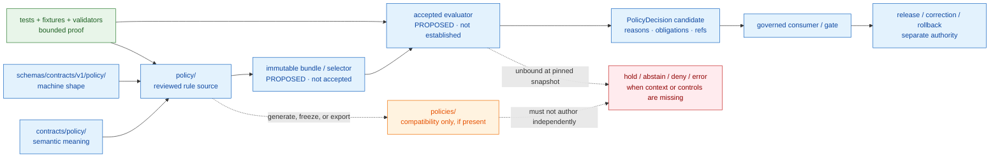

<!-- [KFM_META_BLOCK_V2]
doc_id: kfm://doc/adr-0003-policy-singular-canonical
title: "ADR-0003 — `policy/` (singular) is canonical; `policies/` is compatibility"
type: adr
adr_id: ADR-0003
version: v1.2
status: proposed
owners:
  - Governance steward
  - Architecture steward
  - Policy steward
owner_status: "NEEDS VERIFICATION — CODEOWNERS routes docs/adr/ and policy/ to @bartytime4life; no accepted role assignment or independent approval control was verified"
reviewers_required:
  - Docs steward
  - Policy steward
  - Architecture steward
  - "Security, privacy, rights, sensitivity, or release reviewer when the affected policy class requires one"
created: 2026-05-10
updated: 2026-07-23
policy_label: public
truth_posture: cite-or-abstain
responsibility_root: docs/
current_path: docs/adr/ADR-0003-policy-singular-is-canonical-(policies-is-compatibility).md
supersedes: []
superseded_by: null
evidence_snapshot:
  repository: bartytime4life/Kansas-Frontier-Matrix
  base_ref: main
  base_commit: 1f093dfc7295f0c2e63c89c3573061ad08698a88
  target_prior_blob: cef5528d81cf3d67ff77f43a1cfece441a87bfe2
  directory_rules_blob: 2affb080e6f0043867c64c7f06c1ca52030fbd55
  adr_index_blob: cf08fae322ac53426f7394d97897fdb942253049
  adr_0001_blob: 3c520ea8f2f8bcb3d478329a87d98b135ea335fd
  adr_0002_blob: 2da10fcf5836a44d46186c233b6b9664c9ccfda5
  policy_readme_blob: fa9378a6a699d0985fd018dbdb9f27c15efcb1c3
  policy_test_workflow_blob: ba22e40b171b70a5e56fdbb35e44f6664e15487d
  policy_boundary_workflow_blob: 6d442a6cdd0b146cd4003cbf1d7c619a455a16ae
  makefile_blob: 51537af34ee065c2de571134688415042b83b22a
  codeowners_blob: dd2a84aa514d8ecd9208bc347f90f9a2ed37dd61
  migrations_readme_blob: 0485947aa72726bdde043a2570c2e28d2714f420
  migrations_rollback_readme_blob: fdecd7e2c2308cb546706ab061730d14987bc586
  deprecation_register_blob: 1fb7219dcdb7a437e38fa8ca92ba34e29667d3fa
  drift_register_blob: 5c5078b93c467e66f4cc8b86a7a696dbce5ae7e0
  verification_backlog_blob: ec66084a9de71f569f2a8291776647f9bbbaef71
  policy_root: present
  policies_root: absent_from_pinned_tree
related:
  - docs/adr/README.md
  - docs/adr/INDEX.md
  - docs/adr/ADR-0001-schema-home--schemas-contracts-v1-is-canonical.md
  - docs/adr/ADR-0002-contracts-vs-schemas-split.md
  - docs/doctrine/directory-rules.md
  - docs/architecture/contract-schema-policy-split.md
  - policy/README.md
  - contracts/policy/README.md
  - schemas/contracts/v1/policy/README.md
  - fixtures/contracts/v1/policy/README.md
  - tests/policy/README.md
  - tools/validators/policy/README.md
  - packages/policy-runtime/README.md
  - .github/workflows/policy-test.yml
  - .github/workflows/policy-boundary-guards.yml
  - migrations/README.md
  - migrations/rollback/README.md
  - control_plane/deprecation_register.yaml
  - docs/registers/DRIFT_REGISTER.md
  - docs/registers/VERIFICATION_BACKLOG.md
tags: [kfm, adr, governance, policy, directory-rules, compatibility-root, no-parallel-authority, migration, rollback]
notes:
  - "v1.2 is a same-path repository-grounded modernization. It preserves the decision and proposed status; it does not accept ADR-0003 or change policy behavior."
  - "At the pinned snapshot, tracked policy material is under singular policy/ and no tracked policies/ root is present. Absence of a plural root means no path migration is currently required."
  - "The repository has nonempty Rego source and bounded policy-related checks, but no accepted evaluator, active bundle, native Rego test lane, complete PolicyInputBundle, dedicated PolicyDecision validator, decision receipt flow, or release integration is established."
  - "If policies/ is introduced later, it remains compatibility-only and requires explicit class, provenance, parity or freeze controls, migration evidence where applicable, and a sunset or retention rationale."
[/KFM_META_BLOCK_V2] -->

<a id="top"></a>

# ADR-0003 — `policy/` (singular) is canonical; `policies/` is compatibility

> **Proposed decision.** KFM will use **`policy/`** as the single responsibility root for reviewed admissibility rules. A future or restored **`policies/`** path may exist only as a declared compatibility surface—never as independently authored policy authority.

[](#1-status-and-scope)
[](#11-current-repository-evidence-snapshot)
[](#11-current-repository-evidence-snapshot)
[](#11-current-repository-evidence-snapshot)
[](#34-authority-and-publication-boundary)

> [!IMPORTANT]
> **Repository alignment is not reviewed decision authority.** The pinned tree already uses singular [`policy/`](../../policy/README.md), and no tracked `policies/` root was found. The canonical ADR index still records ADR-0003 with effective status `proposed`. This revision documents the observed state without promoting the decision to `accepted`.

> [!CAUTION]
> A path choice does not prove that policy is operational. The repository contains Rego source and bounded shape/boundary checks, but the accepted evaluator, active bundle, native policy tests, complete input contract, governed consumers, receipts, replay, release integration, and independent approval controls remain unestablished.

**Quick navigation:** [Status](#1-status-and-scope) · [Context](#2-context) · [Decision](#3-decision) · [Authority flow](#4-authority-flow) · [Scope](#5-scope-of-policy) · [Consequences](#6-consequences) · [Alternatives](#7-alternatives-considered) · [Migration](#8-migration-compatibility-and-retirement) · [Rollback](#9-rollback-and-reversal) · [Validation](#10-validation-and-enforcement) · [Open work](#11-open-questions-and-needs-verification) · [Evidence](#12-evidence-basis-and-related-documents)

---

## 1. Status and scope

| Field | Current value |
|---|---|
| **ADR ID** | `ADR-0003` — unique and confirmed in the canonical [`INDEX.md`](./INDEX.md) |
| **Source metadata** | `proposed` |
| **Effective decision status** | `proposed` — not binding until the ADR and index carry reviewed `accepted` status |
| **Decision class** | Directory Rules §2.4: canonical/compatibility-root authority and prevention of parallel policy homes |
| **Canonical responsibility proposed here** | Reviewed policy source and admissibility rules under `policy/` |
| **Compatibility treatment** | `policies/`, if introduced or restored, is `mirror`, `legacy`, `deprecated`, `external-export`, or `transitional` |
| **Current repository posture** | `policy/` present; no tracked `policies/` root at the pinned commit |
| **Migration required now** | No path migration identified for this documentation-only change |
| **Publication effect** | None. A policy path, valid schema, green check, commit, pull request, or merge does not approve policy, release data, or publish KFM material. |

### 1.1 Current repository evidence snapshot

The following findings are **CONFIRMED at `main@1f093dfc7295f0c2e63c89c3573061ad08698a88`** unless marked otherwise.

| Surface | Verified state | What it proves—and does not prove |
|---|---|---|
| [`docs/adr/INDEX.md`](./INDEX.md) | ADR-0003 is uniquely indexed at this exact path; effective status is `proposed`. | Proves identity and inventory; does not accept the decision. |
| [`directory-rules.md`](../doctrine/directory-rules.md) | Names singular `policy/` as canonical, `policies/` as compatibility, and parallel policy homes as ADR-class drift. | Establishes placement doctrine; does not establish active evaluator behavior. |
| [`policy/`](../../policy/) | Tracked root exists. | Proves current repository placement. |
| `policies/` | No tracked path was returned at the pinned tree; `policies/README.md` is absent. | Supports “no current plural-root migration”; does not prohibit a later reviewed compatibility export. |
| [`policy/README.md`](../../policy/README.md) | Repository-grounded v0.2 README describes singular policy as the admissibility root, nonempty Rego source, mixed maturity, and an unbound evaluator. | Proves current root contract and bounded inventory; not policy activation or production enforcement. |
| [`policy-test.yml`](../../.github/workflows/policy-test.yml) | Read-only readiness workflow requires singular policy paths, confirms Rego source is present, and intentionally holds while evaluator, bundle, native tests, validator, and runtime remain unaccepted. | Proves explicit readiness/drift guards; no policy rule is evaluated and no `PolicyDecision` is emitted. |
| [`Makefile`](../../Makefile) | `policy` target prints `TODO: opa test policy/ -v`. | Proves singular path intent and a non-enforcing readiness marker; not an executable policy suite. |
| [`policy-boundary-guards.yml`](../../.github/workflows/policy-boundary-guards.yml) | Runs 15 structural/static/API boundary tests in four modules. | Proves selected trust-membrane boundaries; not policy-engine evaluation, rights/sensitivity decisions, or release approval. |
| [`CODEOWNERS`](../../.github/CODEOWNERS) | Routes `/docs/adr/` and `/policy/` to `@bartytime4life`. | Proves review routing only; not stewardship assignment, independent approval, or completed review. |
| [`deprecation_register.yaml`](../../control_plane/deprecation_register.yaml) | Exists with `entries: []`. | No plural-policy retention, sunset, or deprecation record is currently registered. |
| [`DRIFT_REGISTER.md`](../registers/DRIFT_REGISTER.md) and [`VERIFICATION_BACKLOG.md`](../registers/VERIFICATION_BACKLOG.md) | No current entry closes or contests the singular/plural policy-root decision. | Does not remove the need for reviewed ADR acceptance or future drift registration if `policies/` appears. |
| [`migrations/README.md`](../../migrations/README.md) | Defines database, schema, data, graph, and rollback lanes; no policy-specific migration lane is established. | A future policy-root move needs a reviewed migration-record placement decision rather than an invented `migrations/policy/` path. |

> [!NOTE]
> Git does not track empty directories. “`policies/` absent” means no tracked path was found at the pinned tree, not that no developer has ever used the name locally or in lineage documents.

### 1.2 In scope

- Selecting the single responsibility root for reviewed policy source.
- Classifying any plural-root compatibility surface.
- Preventing direct, independent policy authorship under `policies/`.
- Defining how consumers, workflows, mirrors, migrations, deprecation, validation, and rollback must treat the two names.
- Separating policy source from contracts, schemas, fixtures, tests, validator code, decision instances, receipts, proofs, release records, applications, and public output.
- Naming the acceptance gates required before this proposed decision becomes binding.

### 1.3 Out of scope

- Accepting ADR-0003 or any related ADR.
- Selecting or activating OPA, Conftest, another evaluator, or a bundle-distribution mechanism.
- Defining policy semantics, rule packages, input fields, outward outcome mapping, reason codes, obligations, or consumer behavior.
- Moving files, adding a `policies/` compatibility export, creating a policy migration lane, or populating deprecation/drift registers in this documentation-only revision.
- Declaring a source, claim, release, API response, map layer, AI answer, or public artifact admissible.
- Changing contracts, schemas, Rego source, fixtures, tests, workflows, validators, runtime code, release state, or publication state.

### 1.4 Truth and state vocabulary

- **CONFIRMED** — verified from the pinned repository evidence named above.
- **PROPOSED** — the architectural decision, future compatibility posture, or migration design recorded here.
- **UNKNOWN** — evidence is insufficient for a stronger statement.
- **NEEDS VERIFICATION** — a concrete check exists but is not closed.
- **CONFLICTED** — two authority surfaces or governing sources disagree.

`proposed`, `accepted`, `superseded`, and `rejected` are ADR lifecycle states. They are not policy outcomes or truth labels.

[Back to top](#top)

---

## 2. Context

### 2.1 The problem

KFM separates responsibilities that must interoperate without collapsing:

```text
contracts/              -> policy-object meaning and invariants
schemas/contracts/v1/   -> policy-object machine shape
policy/                 -> reviewed admissibility rules
fixtures/ + tests/      -> representative cases and executable proof
tools/validators/       -> reusable checking
packages/ or apps/      -> evaluator and governed consumer implementation
data/receipts/          -> process memory
data/proofs/            -> proof records
release/                -> release, correction, withdrawal, and rollback decisions
```

A second independently evolving `policies/` root would create ambiguity over which rule source, bundle digest, review trail, and rollback target produced a decision. That ambiguity is material because policy can gate source admission, evidence exposure, sensitive geometry, runtime responses, promotion, release, correction, and withdrawal.

### 2.2 Why the singular root matters

A governed decision must be replayable enough to answer:

1. Which reviewed policy source was evaluated?
2. Which bundle, version, digest, entrypoint, and evaluator were used?
3. Which input and governed references were supplied?
4. Which native result, outward outcome, reasons, and obligations were produced?
5. Which review, receipt, correction, expiry, and rollback records apply?

Two authoring roots make those questions non-deterministic unless one root is explicitly subordinate.

### 2.3 Current implementation pressure

The pinned repository is already aligned with the proposed direction:

- singular `policy/` is tracked and documented as the admissibility root;
- no plural `policies/` tree is tracked;
- the Makefile readiness marker and `policy-test` workflow both point to `policy/`;
- policy-related contracts, schemas, fixtures, tests, validator lanes, and runtime placeholders live in their separate responsibility roots;
- the evaluator and bundle are not accepted, so the repository is not yet relying on a mature runtime path that would make migration urgent.

The unresolved governance gap is therefore **acceptance and operationalization**, not an observed singular-to-plural file migration.

### 2.4 Forces

| Force | Effect on the decision |
|---|---|
| Directory Rules | Favors singular `policy/`; classifies `policies/` as compatibility. |
| Current tracked tree | Favors singular `policy/`; no plural-root content requires migration. |
| External OPA examples | Often use varying directory names; useful as examples, not KFM placement authority. |
| Audit and replay | Favors one reviewed rule source and one bundle lineage. |
| Contributor ergonomics | A fixed rule avoids recurring singular/plural debates. |
| Compatibility consumers | May justify a generated export, mirror, or temporary alias—never co-authority. |
| Migration cost | Currently low because no tracked plural root was found; future cost rises if ambiguity is allowed to accumulate. |
| Policy maturity | Evaluator and bundle remain unbound, making now the safest time to preserve one-root discipline. |

[Back to top](#top)

---

## 3. Decision

### 3.1 Binding rule after acceptance

RFC 2119 terms in this section become binding only after reviewed acceptance of ADR-0003.

> **One policy-authoring authority.** `policy/` **MUST** be the canonical repository root for reviewed KFM policy source. `policies/`, if present, **MUST** be compatibility-only and **MUST NOT** evolve as an independent source of admissibility rules.

Concretely:

1. Reviewed Rego, OPA-compatible, or equivalent declarative policy source lands under **`policy/`**.
2. Evaluators, bundle builders, CI, promotion gates, runtime consumers, release checks, and replay tooling identify **`policy/`** or an immutable bundle derived from it as the source lineage.
3. New policy packages, entrypoints, rule modules, native tests, and policy-lane documentation **MUST NOT** be authored first under `policies/`.
4. A tracked `policies/` root **MUST** have a README declaring exactly one compatibility class and pointing to the canonical source.
5. A `policies/` mirror or export **MUST** be generated, frozen, or explicitly transitional; direct independent edits are forbidden.
6. A retained compatibility root **MUST** have provenance, parity or freeze controls, consumers, retention rationale, and sunset or review criteria.
7. A migration involving policy paths **MUST** preserve history, update references, validate behavior, record old/new identity or digest effects, and define rollback or forward-fix posture.
8. Pull requests touching either name **MUST** cite ADR-0003 and the applicable Directory Rules sections.
9. This decision **MUST NOT** be interpreted as policy activation, source admission, release approval, public access, or publication authority.

### 3.2 Compatibility classes

| Class | Permitted purpose | Required control | Forbidden behavior |
|---|---|---|---|
| `mirror` | Generated copy for tooling or downstream compatibility | Canonical source reference, generation command, digest/parity check | Direct authorship or divergent fields/rules |
| `legacy` | Historical path retained during consumer migration | Frozen status, consumer inventory, migration owner | New policy development |
| `deprecated` | Scheduled removal | Replacement path, deadline/review date, deprecation record | Silent indefinite retention |
| `external-export` | Format or directory required by a downstream consumer | Export recipe, provenance, consumer contract | Treating export as source authority |
| `transitional` | Bounded move between layouts | Migration record, owner, start/end criteria, rollback/forward-fix record | Unbounded dual-write state |

### 3.3 Responsibility split

| Concern | Owning surface | Policy-root boundary |
|---|---|---|
| Policy-object meaning | [`contracts/policy/`](../../contracts/policy/README.md) | `policy/` consumes meaning; it does not redefine semantic contracts. |
| Policy-object shape | [`schemas/contracts/v1/policy/`](../../schemas/contracts/v1/policy/README.md) | `policy/` may require shapes; it is not schema authority. |
| Reviewed admissibility rules | [`policy/`](../../policy/README.md) | Canonical responsibility proposed here. |
| Reusable examples | [`fixtures/`](../../fixtures/README.md) and bounded policy fixture lanes | Examples do not decide policy. |
| Executable proof | [`tests/`](../../tests/README.md) | Tests exercise rules; test code is not rule authority. |
| Validator implementation | [`tools/validators/`](../../tools/validators/README.md) | Validators check; they do not own rule semantics. |
| Evaluation runtime | [`packages/policy-runtime/`](../../packages/policy-runtime/README.md) or another accepted implementation surface | Runtime consumes accepted rules/bundles; no reusable evaluator code in `policy/`. |
| Decision instances and receipts | Governed receipt/review/data roots | Emitted instances are not normative source. |
| Release, correction, withdrawal, rollback | [`release/`](../../release/README.md) | Policy may gate; it does not approve or publish by itself. |
| Public API/UI/map/AI behavior | Governed application/runtime roots | Public clients never load policy source or choose bundles directly. |

### 3.4 Authority and publication boundary

A policy result can constrain an operation. It cannot by itself:

- make a claim true;
- create an `EvidenceBundle`;
- clear rights, consent, or sensitivity by assertion;
- promote lifecycle state;
- approve a release;
- publish an artifact;
- make generated language authoritative;
- make client-side hiding a security control;
- turn a path, badge, commit, pull request, workflow, or passing test into public truth.

[Back to top](#top)

---

## 4. Authority flow



> [!NOTE]
> The responsibility relationships are doctrine-aligned. Bundle, selector, evaluator, consumer, and decision-receipt maturity remain `PROPOSED`, `UNKNOWN`, or `NEEDS VERIFICATION` as stated in the evidence snapshot.

[Back to top](#top)

---

## 5. Scope of `policy/`

### 5.1 What belongs

Material belongs under `policy/` when its primary responsibility is reviewed admissibility.

| Belongs in `policy/` | Boundary |
|---|---|
| Root and child-lane READMEs | Explain policy-source boundaries; do not accept ADRs or activate bundles. |
| Declarative rule modules | Reviewed Rego, OPA-compatible, or equivalent policy source. |
| Operation-specific packages and entrypoints | Access, evidence, consent, sensitivity, rights, render, export, AI, lifecycle, promotion, release-gate, correction, and rollback policy. |
| Fail-closed defaults | Preserve missing, unknown, false, stale, conflicted, restricted, and error as distinct states. |
| Domain policy under a domain segment | Domain-specific rules stay inside `policy/`, not a new root. |
| Policy-native tests, only after convention is accepted | May be colocated when an accepted evaluator/test contract explicitly permits it. |
| Bundle source and manifest inputs, only after acceptance | Immutable bundle construction remains governed and versioned. |
| Cross-links | Contracts, schemas, fixtures, tests, validators, consumers, receipts, proofs, release gates, correction paths, and rollback targets. |

The current README indexes selected lanes such as `access/`, `ai_builder/`, `bundles/`, `consent/`, `contract/`, `data/`, `decision/`, `domains/`, `evidence/`, and `focus/`. That list is orientation, not a complete recursive inventory or proof of runtime maturity.

### 5.2 What does not belong

| Does not belong in `policy/` | Owning responsibility |
|---|---|
| Semantic definitions and field intent | `contracts/` |
| JSON Schema, DTOs, enums, and field shape | `schemas/contracts/v1/` |
| Raw source payloads, credentials, or registry instances | connectors, secure configuration, or accepted registry/lifecycle roots |
| EvidenceBundles, proof packs, citations, or claim truth | evidence/proof roots |
| RAW through PUBLISHED data | `data/<phase>/` |
| Emitted decisions, receipts, reviews, validation reports, or proofs | accepted lifecycle, receipt, proof, review, or report roots |
| Evaluator, adapter, CLI, server, or reusable package code | `packages/`, `apps/`, `runtime/`, or `tools/` by responsibility |
| Generic fixtures and tests | `fixtures/` and `tests/` |
| Release manifests, approvals, rollback cards, corrections, or withdrawals | `release/` |
| Public routes, UI, MapLibre logic, exports, or AI responses | governed application/runtime roots |
| Real protected locations, living-person records, DNA/genomic content, consent tokens, or secrets | denied; use synthetic/redacted references where testing is authorized |
| A second independently evolving policy root | forbidden without an accepted ADR |

### 5.3 Domain placement

Policy may be domain-specific, but domains remain segments inside the responsibility root:

```text
policy/domains/<domain>/
```

Do not create root-level policy homes such as `fauna_policy/`, `archaeology_policy/`, `people_policy/`, `rego/`, or `policy_rules/`.

[Back to top](#top)

---

## 6. Consequences

### 6.1 Positive

- **Deterministic source lineage.** Reviewers and receipts can identify one reviewed policy source.
- **No parallel authority.** A plural compatibility path cannot silently diverge.
- **Simpler evaluator and bundle contracts.** Consumers do not choose between authoring roots.
- **Better audit and replay.** Policy digest, bundle identity, rule review, and rollback lineage are easier to reconstruct.
- **Lower current migration cost.** No tracked plural root was found at the pinned snapshot.
- **Reviewer clarity.** Pull requests can cite one stable placement rule.
- **Safer future compatibility.** Mirror/export requirements are explicit before a compatibility consumer appears.

### 6.2 Costs and tradeoffs

- External tools or examples that assume `policies/` may need configuration, an export, or a documented mirror.
- A future compatibility root adds generator, parity, provenance, ownership, retention, and cleanup burden.
- If file paths participate in policy hashes or bundle identity, path migration changes identity and requires explicit old/new mapping.
- Acceptance does not solve evaluator, bundle, input-contract, outcome-normalization, receipt, consumer, or release-integration work.
- Policy-significant changes need broader review than ordinary documentation changes.

### 6.3 Bounded effects

- No schema-home change.
- No contract/schema/policy split change.
- No policy semantics change merely from selecting a root.
- No public API or UI contract change.
- No migration is performed by this ADR revision.
- No release or publication is approved.
- No compatibility root is created by documenting its allowed class.

[Back to top](#top)

---

## 7. Alternatives considered

<details>
<summary><strong>A. Use <code>policy/</code> as canonical and reserve <code>policies/</code> for compatibility — selected</strong></summary>

Aligns with Directory Rules and the current tracked tree, minimizes migration, supports one review and bundle lineage, and allows a bounded mirror/export only when a real consumer requires it.

</details>

<details>
<summary><strong>B. Make <code>policies/</code> canonical</strong></summary>

This may resemble some external examples, but it conflicts with current Directory Rules, current repository placement, policy workflow paths, and the root README. It would require a reviewed doctrine/ADR change and migration.

</details>

<details>
<summary><strong>C. Allow both roots as co-authority</strong></summary>

Rejected because dual authorship breaks deterministic source, bundle, review, replay, drift, and rollback chains.

</details>

<details>
<summary><strong>D. Defer the decision</strong></summary>

Rejected because the current repository already needs a stable authoring rule before evaluator and bundle work matures.

</details>

<details>
<summary><strong>E. Collapse policy into contracts, schemas, tests, tools, or applications</strong></summary>

Rejected because meaning, shape, admissibility, proof, checking, and runtime implementation have different owners and review burdens.

</details>

[Back to top](#top)

---

## 8. Migration, compatibility, and retirement

### 8.1 Current snapshot classification

At the pinned snapshot:

```text
policy/     -> PRESENT; canonical responsibility root in repository guidance
policies/   -> NOT TRACKED; no migration, mirror, deprecation, or sunset action required now
```

The smallest sound current action is therefore **document and validate the boundary**, not create a compatibility root or migration merely to demonstrate the ADR.

### 8.2 Starting-state matrix

| Observed state | Governed action |
|---|---|
| Only `policy/` exists | Verify root README, workflows, consumers, and no stale plural references. Do not create `policies/`. |
| Only `policies/` exists | Freeze new authorship; inventory consumers and history; create/review the canonical `policy/` migration; retain or remove the plural path only through a classified compatibility plan. |
| Both exist and are identical | Declare singular source, establish mirror provenance/parity, then justify retention or retire the mirror. |
| Both exist and differ | Freeze both, open drift, identify reviewed authoritative rules, migrate deliberately, preserve identities/digests, and require policy-owner review. |
| Neither exists | Create only the singular root contract when policy work is admitted. Do not create a plural placeholder. |
| `policies/` is required by an external consumer | Prefer a generated external export or mirror with explicit consumer, recipe, digest, and retention controls. |

### 8.3 Future migration sequence

A future singular/plural path migration should:

1. Pin the repository commit, exact file inventory, consumers, generators, workflows, package references, and current digests.
2. Freeze direct policy authorship during reconciliation.
3. Confirm ADR acceptance and compatibility class.
4. Identify which source is reviewed authority; do not infer authority from path age alone.
5. Move authoritative content with history-preserving Git operations.
6. Update contracts, schemas, fixtures, tests, validators, workflows, applications, packages, docs, and pipeline references in one governed plan.
7. Record old/new paths, content identities, bundle effects, consumers, validation, and review.
8. Add the paired migration rollback or forward-fix record required by [`migrations/rollback/`](../../migrations/rollback/README.md).
9. Populate [`deprecation_register.yaml`](../../control_plane/deprecation_register.yaml) when a compatibility path is retained, deprecated, or sunset.
10. Add parity/freeze enforcement before allowing the compatibility path to remain.
11. Run policy-shape, policy-boundary, evaluator-native, consumer, replay, correction, and rollback checks appropriate to the matured system.
12. Close the migration only after consumers no longer write or read the plural path as authority.

### 8.4 Migration-record placement

The current [`migrations/README.md`](../../migrations/README.md) defines database, schema, data, graph, and rollback lanes; it does **not** establish `migrations/policy/`.

Therefore:

- this ADR does not invent a policy migration path;
- the primary migration record home for a future root-level policy move is **NEEDS VERIFICATION**;
- the future change must either use an existing reviewed migration lane whose responsibility genuinely fits, or update migration governance through an accepted decision;
- a paired recovery record belongs under `migrations/rollback/` only after the primary migration lane is resolved;
- release rollback cards remain in `release/`, distinct from migration recovery records.

### 8.5 Compatibility retention contract

A retained `policies/` root must record:

- compatibility class;
- canonical source path and immutable identity;
- generator/export recipe or frozen-state proof;
- consumer list and owners;
- direct-edit prohibition;
- parity or drift check;
- license/rights and sensitivity implications, if any;
- retention rationale;
- review or sunset criteria;
- migration and rollback/forward-fix references;
- correction path if downstream consumers received divergent material.

### 8.6 Acceptance gates

ADR-0003 should not move to `accepted` until reviewers verify at least:

- [ ] Exact ADR identity, filename, metadata, and index status agree.
- [ ] `policy/` root contract and Directory Rules agree.
- [ ] Current tracked tree has no independently evolving plural policy root.
- [ ] All known policy-source consumers and workflows resolve to singular lineage or an immutable derived bundle.
- [ ] The allowed compatibility classes and direct-edit prohibition are accepted.
- [ ] Migration-record placement is resolved before any path move is approved.
- [ ] Deprecation, drift, correction, and rollback obligations are reviewable.
- [ ] Owners and required reviewers are verified beyond placeholder role names.
- [ ] Acceptance does not imply evaluator activation, policy correctness, release approval, or publication.

[Back to top](#top)

---

## 9. Rollback and reversal

### 9.1 Decision reversal

If the architectural choice is later replaced:

1. A successor ADR must explicitly supersede ADR-0003.
2. Both ADRs and [`INDEX.md`](./INDEX.md) must carry reciprocal status/link updates.
3. The successor must state the new canonical root, consumer impact, migration, validation, correction, and rollback plan.
4. Existing policy source and released decisions must remain replayable or visibly bounded where replay is impossible.
5. Historical ADR text is retained; it is not deleted.

### 9.2 Future path-migration rollback

If a later policy-path migration fails:

1. Freeze further policy changes and public/release-affecting promotion.
2. Preserve post-migration substantive rules; do not discard them during topology rollback.
3. Restore the last verified evaluator/bundle/consumer configuration through a reviewed rollback or forward fix.
4. Re-run policy-native tests, shape checks, boundary checks, consumer checks, receipt/replay checks, and affected release/correction checks.
5. Record the migration recovery under the reviewed `migrations/rollback/` contract.
6. Use release rollback/correction records only when released or public state is affected.
7. Keep any temporary dual-path state owner-bound, time-bounded, and non-authoritative.

### 9.3 Documentation-change rollback

This v1.2 update changes only this ADR at the same path. Rollback is the prior target blob:

```text
cef5528d81cf3d67ff77f43a1cfece441a87bfe2
```

Reverting the documentation change does not require changing policy source, schemas, fixtures, tests, workflows, runtime, release state, or published artifacts.

[Back to top](#top)

---

## 10. Validation and enforcement

### 10.1 Current enforcement snapshot

| Surface | Current bounded evidence | Limitation |
|---|---|---|
| ADR index validator and docs control plane | Can verify numbered ADR identity, path/H1/index coherence, status normalization, and supersession links. | Does not accept the decision or prove policy behavior. |
| [`policy-test.yml`](../../.github/workflows/policy-test.yml) | Requires singular paths, inventories policy readiness, and fails on unreviewed evaluator/bundle/test drift. | Intentionally evaluates no policy. |
| [`policy-boundary-guards.yml`](../../.github/workflows/policy-boundary-guards.yml) | Executes 15 structural/static/API trust-boundary tests. | Not policy-root parity or evaluator proof. |
| Schema/fixture harness | Exercises two valid and three invalid `PolicyDecision` shape fixtures. | Shape does not prove rules, inputs, reasons, obligations, or bundle identity. |
| [`Makefile`](../../Makefile) | Names `policy/` in a readiness-marker command. | Command is TODO-only and exits successfully without evaluation. |
| Root/path inspection | Confirms `policy/` tracked and `policies/` absent at the pinned tree. | No continuous guard prevents a plural root from being introduced later. |

### 10.2 Proposed repository guards after acceptance

| Guard | Expected behavior | Suggested owning surface |
|---|---|---|
| No parallel policy root | Fail when tracked policy source appears under `policies/` without an accepted compatibility declaration. | `tests/policy/` or governance validator |
| Compatibility README contract | If `policies/` exists, require class, canonical source, provenance, direct-edit prohibition, consumers, and sunset/review criteria. | Documentation/control-plane validator |
| Canonical consumer path | Detect workflows, packages, apps, and scripts that load plural source as authority. | `tests/policy/` plus repository search |
| Mirror/export parity | Verify generated compatibility output against a manifest or digest. | `tools/validators/policy/` |
| Direct-edit prevention | Reject non-generated edits to compatibility content. | CI path guard |
| Migration closure | Require migration, rollback/forward-fix, deprecation, consumer, and validation records for path moves. | Migration/control-plane validation |
| Bundle lineage | Bind active immutable bundle to singular reviewed source identity. | Policy-runtime/bundle tests |
| Replay and correction | Reproduce representative decisions and invalidate/repair affected consumers after change. | Integration/release tests |

These guards are **PROPOSED**. Their exact filenames and commands require implementation evidence and accepted ownership.

### 10.3 Suggested scoped checks

Use repository-native commands when available. The following are reviewer-oriented examples, not claims that a complete policy suite exists:

```bash
python tools/validators/validate_adr_index.py
python -m pytest tests/validators/test_validate_adr_index.py -q --strict-config --strict-markers
make boundary-guards-ci
```

```bash
# Inspect tracked singular/plural references without treating matches as automatic defects.
git ls-tree -r --name-only HEAD -- policy policies
git grep -nE '(^|[^[:alnum:]_])policies/' -- .
git grep -nE '(^|[^[:alnum:]_])policy/' -- .
```

Do not use the current `make policy` zero exit as proof; it is an explicit TODO readiness marker.

### 10.4 Acceptance interpretation

A passing documentation, schema, boundary, parity, or evaluator check proves only its declared scope. It does not establish:

- factual truth;
- evidence closure;
- source authority;
- rights or sensitivity clearance;
- consent;
- release approval;
- publication;
- production parity;
- independent review;
- complete rollback readiness.

[Back to top](#top)

---

## 11. Open questions and NEEDS VERIFICATION

1. **Human acceptance.** Who has authority to accept ADR-0003, and what reviewed evidence must accompany the status transition?
2. **Policy stewardship.** CODEOWNERS routes files to one verified account, but accepted policy, architecture, docs, security/privacy, and release role assignments remain unverified.
3. **Evaluator and bundle.** Which evaluator, version, bundle format, selector, signature, distribution, and rollback contract will become accepted?
4. **Input completeness.** The current `PolicyInputBundle` shape is permissive; the required governed context remains unresolved.
5. **Outcome normalization.** How do engine-native `ALLOW`, `RESTRICT`, `HOLD`, `DENY`, `ABSTAIN`, and `ERROR` values map to the closed outward `ANSWER | ABSTAIN | DENY | ERROR` schema without collapsing semantics?
6. **Migration-record home.** Which current migration lane owns a future policy-root move, or is a migration-governance amendment required?
7. **Future compatibility consumer.** Is any real tool or downstream consumer expected to require `policies/`? Do not create the root until that requirement is verified.
8. **Hash identity.** Do policy source paths contribute to `spec_hash`, bundle digest, attestation, cache key, or receipt identity?
9. **Continuous root guard.** Which validator or workflow will prevent a plural root from silently becoming authority?
10. **Deprecation register.** When should a compatibility row be created, and who owns sunset/review enforcement?
11. **Replay and correction.** Which decision instances, releases, caches, exports, maps, and AI responses must be reevaluated after a policy-source change?
12. **Branch protection.** Which policy and ADR checks are required by repository rules, and is independent approval enforced?
13. **Complete inventory.** A full recursive policy source/package/consumer graph and current workflow result set remain to be pinned for acceptance review.
14. **Policies-path history.** No tracked plural root exists now; historical branches, releases, or external consumers may still require bounded verification before declaring migration debt permanently closed.

[Back to top](#top)

---

## 12. Evidence basis and related documents

| Source | Status used here | Supports | Does not prove |
|---|---|---|---|
| [`docs/adr/INDEX.md`](./INDEX.md) | **CONFIRMED repository evidence** | Exact ADR identity, path, and effective proposed status | Acceptance or implementation |
| [`docs/doctrine/directory-rules.md`](../doctrine/directory-rules.md) | **CONFIRMED placement doctrine at pinned blob** | Singular canonical policy root, compatibility classes, no parallel authority, migration discipline | Active evaluator, policy correctness, or publication |
| [`policy/README.md`](../../policy/README.md) | **CONFIRMED repository guidance** | Current root boundary, mixed maturity, unbound evaluator, separate responsibility surfaces | Production enforcement or accepted bundle |
| [`policy-test.yml`](../../.github/workflows/policy-test.yml) | **CONFIRMED workflow definition** | Explicit readiness holds and singular path dependencies | Current/future run success or policy evaluation |
| [`policy-boundary-guards.yml`](../../.github/workflows/policy-boundary-guards.yml) | **CONFIRMED workflow definition** | Fifteen bounded trust-boundary tests | Evaluator or release proof |
| [`Makefile`](../../Makefile) | **CONFIRMED command surface** | TODO marker points to `policy/` | Executable policy suite |
| [`ADR-0001`](./ADR-0001-schema-home--schemas-contracts-v1-is-canonical.md) | **PROPOSED decision** | Machine-schema home relationship | Policy-root acceptance |
| [`ADR-0002`](./ADR-0002-contracts-vs-schemas-split.md) | **PROPOSED effective status** | Meaning/shape/admissibility/proof separation | Policy runtime activation |
| [`migrations/README.md`](../../migrations/README.md) and [`migrations/rollback/README.md`](../../migrations/rollback/README.md) | **CONFIRMED repository guidance** | Existing migration lanes and required paired recovery records | A policy-specific migration home |
| [`deprecation_register.yaml`](../../control_plane/deprecation_register.yaml) | **CONFIRMED empty register** | Current absence of recorded policy-path deprecation | No future need for a compatibility row |
| [`CODEOWNERS`](../../.github/CODEOWNERS) | **CONFIRMED routing** | Current GitHub review route | Human approval, role authority, or separation of duties |
| KFM Markdown Engineering, Modernization & GitHub Documentation Implementation Agent v5.0.0 | **PROPOSED authoring contract selected for this revision** | Same-path update, evidence grading, no-loss, link/anchor/metadata validation, scoped draft-PR delivery | Repository authority or ADR acceptance |

### Related documents

- [ADR operating contract](./README.md)
- [Canonical ADR index](./INDEX.md)
- [ADR-0001 — schema home](./ADR-0001-schema-home--schemas-contracts-v1-is-canonical.md)
- [ADR-0002 — contracts vs schemas split](./ADR-0002-contracts-vs-schemas-split.md)
- [Directory Rules](../doctrine/directory-rules.md)
- [Contract / schema / policy split](../architecture/contract-schema-policy-split.md)
- [Policy root README](../../policy/README.md)
- [Policy semantic contracts](../../contracts/policy/README.md)
- [Policy machine schemas](../../schemas/contracts/v1/policy/README.md)
- [Policy shape fixtures](../../fixtures/contracts/v1/policy/README.md)
- [Policy test lane](../../tests/policy/README.md)
- [Policy validator lane](../../tools/validators/policy/README.md)
- [Policy runtime placeholder](../../packages/policy-runtime/README.md)
- [Policy readiness workflow](../../.github/workflows/policy-test.yml)
- [Policy boundary workflow](../../.github/workflows/policy-boundary-guards.yml)
- [Migration root](../../migrations/README.md)
- [Migration rollback lane](../../migrations/rollback/README.md)
- [Deprecation register](../../control_plane/deprecation_register.yaml)
- [Drift register](../registers/DRIFT_REGISTER.md)
- [Verification backlog](../registers/VERIFICATION_BACKLOG.md)

[Back to top](#top)

---

## Appendix A — Lineage topology from v1.1

<details>
<summary><strong>Show the v1.1 illustrative policy topology preserved as planning lineage</strong></summary>

The prior ADR proposed the following topology. It remains **PROPOSED planning lineage**, not a current recursive-tree claim and not a reason to create missing directories:

```text
policy/
├── README.md
├── bundles/
│   ├── consent/
│   ├── revocation/
│   ├── obligations/
│   └── shared/
├── fixtures/
├── tests/
├── runtime/
├── promotion/
├── sensitivity/
├── rights/
├── domains/
└── release/
```

Before implementing any missing lane, inspect current policy source, child READMEs, evaluator/bundle design, test convention, consumers, and Directory Rules. Create only the smallest responsibility-bearing path required by accepted work.

</details>

[Back to top](#top)

---

## Appendix B — Reviewer checklist

<details>
<summary><strong>Show the reviewer checklist for changes touching <code>policy/</code> or a proposed <code>policies/</code> compatibility surface</strong></summary>

- [ ] **Primary responsibility:** Every changed file is policy source, policy-native proof explicitly allowed by convention, or compatibility documentation/output.
- [ ] **Canonical root:** New reviewed policy source lands under `policy/`.
- [ ] **No parallel authority:** No second rule source is created under `policies/`, `rego/`, `policy_rules/`, or a domain root.
- [ ] **Compatibility class:** A plural path, if present, declares one allowed class.
- [ ] **Canonical source and provenance:** Mirror/export inputs, command, digest, and generator identity are explicit.
- [ ] **No direct plural authorship:** Changes are generated, frozen legacy maintenance, or an explicitly bounded transition.
- [ ] **Consumers:** Evaluator, CI, apps, packages, scripts, and downstream tools point to singular lineage or an immutable derived bundle.
- [ ] **Contracts and schemas:** Meaning and shape remain in their owning roots.
- [ ] **Instances:** Decisions, receipts, proofs, reviews, and releases remain outside policy source.
- [ ] **Sensitive cases:** Rights, consent, living-person, DNA/genomic, archaeology/cultural, rare-species, infrastructure, and harmful-precision paths fail closed and use synthetic fixtures.
- [ ] **Migration:** Path moves preserve history, identity/digests, consumers, validation, and a paired recovery record.
- [ ] **Deprecation and sunset:** Retained compatibility state is registered and owner-bound.
- [ ] **Replay/correction:** Affected decisions, caches, releases, exports, maps, and AI outputs are identified.
- [ ] **Evidence limits:** Passing checks are not described as policy truth, release approval, or publication.
- [ ] **PR basis:** The PR cites ADR-0003 and Directory Rules §§2.4, 4, 5, 6.5, and 8.

</details>

[Back to top](#top)

---

## Appendix C — Compatibility README minimum contract

<details>
<summary><strong>Show the minimum README contract for a future <code>policies/</code> compatibility root</strong></summary>

A future `policies/README.md` must be complete enough to prevent accidental authority:

```markdown
# policies

> Compatibility-only policy surface. Canonical reviewed policy source is `policy/`.

## Compatibility class
mirror | legacy | deprecated | external-export | transitional

## Canonical source
`policy/` plus immutable source identity or bundle lineage.

## Purpose and consumers
Why this path exists and which verified consumers require it.

## Generation or freeze contract
Command/recipe and provenance for mirrors/exports, or explicit frozen-state rules for legacy material.

## Direct-edit policy
Direct policy authorship is forbidden. Describe the CI or review guard.

## Parity and drift
Manifest, digest, or inventory comparison and failure behavior.

## Retention and sunset
Owner, review date/criterion, migration status, and removal or continued-retention rationale.

## Migration and rollback
Primary migration reference plus paired rollback/forward-fix record.

## Authority boundary
No policy decision, release approval, evidence truth, or publication authority originates here.
```

Do not create this README or root until a tracked compatibility requirement exists and the path is admitted through review.

</details>

[Back to top](#top)

---

## Change history

| Version | Date | Change |
|---|---|---|
| v1.0 | 2026-05-10 | Initial proposed decision. |
| v1.1 | 2026-05-15 | Tightened evidence boundary, validation, compatibility README, migration, and rollback guidance. |
| v1.2 | 2026-07-23 | Repository-grounded same-path modernization; confirmed ADR identity and singular tracked root, recorded absent plural root, corrected migration-path assumptions, bounded policy maturity, and strengthened acceptance, enforcement, rollback, and evidence sections without accepting the decision. |

**Last updated:** 2026-07-23 · **Status:** proposed · **ADR ID:** ADR-0003
