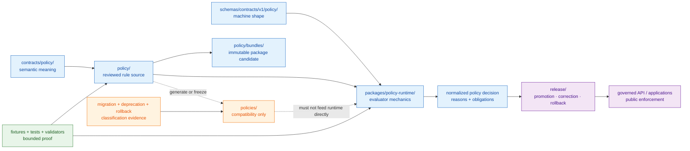

<!-- [KFM_META_BLOCK_V2]
doc_id: kfm://doc/adr-0003-policy-singular-canonical
title: "ADR-0003 — `policy/` (singular) is canonical; `policies/` is compatibility"
type: adr
adr_id: ADR-0003
version: v1.4
status: proposed
owners:
  - "NEEDS VERIFICATION — policy decision owner"
  - "NEEDS VERIFICATION — architecture steward"
reviewers_required:
  - Docs steward
  - Policy steward
  - Security / privacy reviewer
  - Release steward
  - "at least one affected subsystem owner"
created: 2026-05-10
updated: 2026-09-12
policy_label: public
truth_posture: cite-or-abstain
responsibility_root: docs/
owning_root: docs/
responsibility: proposed compatibility-root decision record grounded on adopted singular policy placement without independent policy, release, or publication authority
current_path: "docs/adr/ADR-0003-policy-singular-is-canonical-(policies-is-compatibility).md"
supersedes: []
superseded_by: []
evidence_snapshot:
  repository: bartytime4life/Kansas-Frontier-Matrix
  base_ref: main
  base_commit: 8343e387505ee48eaa5efce7dbfa76b201ca1a7d
  base_tree: 876e11bddd79962cd1cea979e76085ba4d542419
  target_prior_blob: 08ed360975943e69b171f53346a860f4a4a11bd4
  adr_readme_blob: 27c8f00622afe6cd0c65a1b116cd768dac31bea6
  adr_index_blob: 0c143676dfd3c1bda16cb44398c5ad5d4a49cf67
  adr_0029_blob: a4de0d7a96b78da59cfc499d1025e1508afd8dd9
  directory_rules_blob: fd49a0b83e55cef52c1124281f093e263526898d
  directory_rules_sha256: 44f7e94344cb42b630008eb0bc03a13fcb97dbdfba6f3e56579693a272571e6e
  architecture_split_blob: e420dce959b493c295af735357ab528c18ff9771
  policy_readme_blob: 105f4f5f10004e85e66ca34cc79b0d45e86c1a35
  policy_bundles_readme_blob: 0a13a9c9beddfa764d47e5dd6a2ea7ef91bf0d53
  policy_test_workflow_blob: ac8f125e8a4d3634d86f66836d2aa2c0e3925e75
  pass12_workflow_blob: 478f910e8e899796d15b8921e3baa55f4ce1ce73
  pass12_rego_blob: 175871cb929663e7a19345fd18f97a81a850b628
  pass12_rego_test_blob: 3dd5dcc6ae14381949d9aba453da9acaa9a7731f
  root_registry_blob: 024f668b5f0a9239bafa4f8b09e2afd86300ff8c
  path_alias_register_blob: 6ad6840bd47eb8b176d03f9e946c16453fc4caee
  topology_validator_blob: b7cbbb531d74af88ed79cdf8d153d261bcfaa6a3
  topology_baseline_blob: 8ef341c43205828e6a9293f26370734d88b482bb
  codeowners_blob: dd2a84aa514d8ecd9208bc347f90f9a2ed37dd61
  migrations_readme_blob: fb89c34f0bcef2d696e27e9a116da070c8f59842
  deprecation_register_blob: e67cbfcc9b7b220b1fd82292f2afe19ea458f4ea
  policy_tree_entries: 524
  policy_direct_lanes: 40
  policy_readme_files: 74
  policy_direct_lane_readmes: 40
  policy_rego_files: 173
  policy_native_rego_tests: 1
  tracked_filename_hits: 19
  policies_root_at_base: absent
related:
  - docs/adr/README.md
  - docs/adr/INDEX.md
  - docs/adr/ADR-0001-schema-home--schemas-contracts-v1-is-canonical.md
  - docs/adr/ADR-0002-contracts-vs-schemas-split.md
  - docs/adr/ADR-0029-adopt-directory-governance-standard-v2.md
  - docs/doctrine/directory-rules.md
  - docs/architecture/contract-schema-policy-split.md
  - policy/README.md
  - policy/bundles/README.md
  - policy/rego/release_gate_v1.rego
  - policy/rego/release_gate_v1_test.rego
  - contracts/policy/README.md
  - schemas/contracts/v1/policy/README.md
  - fixtures/contracts/v1/policy/policy_decision/README.md
  - tests/policy/README.md
  - tools/validators/policy/README.md
  - packages/policy-runtime/README.md
  - .github/workflows/policy-test.yml
  - .github/workflows/pass12-release-policy-v1.yml
  - migrations/README.md
  - control_plane/root_registry.yaml
  - control_plane/path_alias_register.yaml
  - control_plane/deprecation_register.yaml
  - tools/validators/directory_governance/validate_repository_topology.py
  - tools/validators/directory_governance/repository_topology_baseline.json
  - docs/registers/DRIFT_REGISTER.md
  - docs/registers/VERIFICATION_BACKLOG.md
tags: [kfm, adr, governance, policy, compatibility-root, no-parallel-authority, migration, rollback]
notes:
  - "v1.4 is a same-path repository-grounded evidence refresh; it does not accept ADR-0003 or change policy behavior."
  - "Accepted ADR-0029 adopts the exact Directory Rules bytes that place policy source under singular policy/; ADR-0003 remains proposed for the narrower compatibility-root and migration contract."
  - "At the pinned tree, policy/ contains 524 entries across 40 direct lanes, 74 README files, 173 Rego files, and one native Rego test; no exact policies/ root, policy/policies alias, or policy/plural deprecation entry is present."
  - "One bounded Pass 12 Rego profile has native tests and a checksum-pinned OPA workflow, but it is PROPOSED_INACTIVE and does not establish a general evaluator, active bundle, replay receipt flow, release integration, or publication authority."
  - "The inherited parentheses finding for this tracked filename remains in the topology baseline. This refresh preserves the path and changes no validator, baseline, migration, policy, release, or publication surface."
[/KFM_META_BLOCK_V2] -->

<a id="top"></a>

# ADR-0003 — `policy/` (singular) is canonical; `policies/` is compatibility

> **Proposed compatibility decision on an adopted placement foundation.** Accepted ADR-0029 already adopts the Directory Rules placement of policy source under **`policy/`**. ADR-0003 remains proposed for the narrower rule that a future or retained **`policies/`** path may exist only as an explicitly classified compatibility surface and must never evolve as parallel policy authority.

[](#1-status)
[](#11-current-repository-evidence-snapshot)
[](#11-current-repository-evidence-snapshot)
[](#11-current-repository-evidence-snapshot)
[](#13-authority-and-publication-boundary)

> [!IMPORTANT]
> **Do not collapse two lifecycle states.** The singular `policy/` placement is binding through accepted ADR-0029 and its exact adopted Directory Rules bytes. The canonical ADR index still records ADR-0003 as `proposed`; therefore the additional compatibility admission, migration, and consumer rules in this record are not accepted merely because the placement foundation is adopted.

> [!CAUTION]
> **Canonical policy placement is not policy-engine maturity.** A populated `policy/` tree, valid `PolicyDecision` fixtures, or a green readiness workflow does not prove that an accepted evaluator ran, that a bundle is active, that rights or sensitivity were cleared, that release was approved, or that anything is safe to publish.

**Quick navigation:** [Status](#1-status) · [Context](#2-context) · [Decision](#3-decision) · [Authority diagram](#4-authority-diagram) · [Scope](#5-scope-of-policy-what-belongs-what-does-not) · [Consequences](#6-consequences) · [Alternatives](#7-alternatives-considered) · [Migration](#8-migration-plan) · [Rollback](#9-rollback-plan) · [Validation](#10-validation) · [Open work](#11-open-questions-and-needs-verification) · [Evidence](#12-related-docs-and-evidence)

---

## 1. Status

| Field | Current value |
|---|---|
| **ADR ID** | `ADR-0003` — unique and confirmed in canonical [`INDEX.md`](./INDEX.md), which currently inventories 39 numbered records |
| **Source metadata** | `proposed` |
| **Effective ADR-0003 status** | `proposed` — the record and canonical index agree; four other indexed records are `accepted`, and this revision performs no lifecycle transition |
| **Adopted placement foundation** | Accepted [`ADR-0029`](./ADR-0029-adopt-directory-governance-standard-v2.md) adopts exact Directory Rules bytes that place policy rule source under singular `policy/` and prohibit parallel active authority |
| **Decision class** | Compatibility-root admission, consumer and migration control, and prohibition on `policies/` becoming independent policy authority |
| **Tracked path** | `docs/adr/ADR-0003-policy-singular-is-canonical-(policies-is-compatibility).md` |
| **Current configured root** | [`policy/`](../../policy/) |
| **Current plural-root state** | Exact `policies/` path absent at the pinned snapshot |
| **Current implementation posture** | Nonempty policy source and bounded readiness checks exist. One Pass 12 lane has native Rego tests and checksum-pinned OPA execution but is marked `PROPOSED_INACTIVE`; general evaluator, active bundle, replay receipts, and release integration remain unproved. |
| **Publication effect** | None. This ADR, a policy file, a schema pass, a test pass, a commit, or a pull request is not a release or publication decision. |

### 1.1 Current repository evidence snapshot

The following findings are **CONFIRMED at `main@8343e387505ee48eaa5efce7dbfa76b201ca1a7d` (tree `876e11bddd79962cd1cea979e76085ba4d542419`)** unless marked otherwise.

| Surface | Verified state | What it proves—and does not prove |
|---|---|---|
| [`docs/adr/INDEX.md`](./INDEX.md) | The complete unique sequence runs from ADR-0001 through ADR-0039. ADR-0003 remains `proposed`; ADR-0006, ADR-0007, ADR-0029, and ADR-0038 are `accepted`. | Proves the current indexed lifecycle states; does not accept ADR-0003. |
| [`ADR-0029`](./ADR-0029-adopt-directory-governance-standard-v2.md) and [`Directory Rules`](../doctrine/directory-rules.md) | ADR-0029 accepts the exact Directory Rules bytes. Those adopted bytes name singular `policy/` as the policy-rule root, classify `policies/` only as a potential compatibility root, require one canonical writer, and prohibit parallel authority. | Establishes placement authority independently of ADR-0003; does not activate a policy engine or accept this narrower proposal. |
| [`root_registry.yaml`](../../control_plane/root_registry.yaml) | The machine projection contains `root.policy` at `policy/` as an active canonical root governed by ADR-0029. | Corroborates adopted placement; the projection does not create authority or accept ADR-0003. |
| Exact recursive `policy/` inventory | The pinned tree has 524 `policy/` entries across 40 direct lanes, including 74 README files (40 direct-lane READMEs), 173 Rego files, and one native Rego test. No exact `policies/` root is tracked. | Confirms current path and inventory facts only; README presence, a rule file, or a test does not establish evaluator, bundle, consumer, release, or publication maturity. |
| [`policy/README.md`](../../policy/README.md) | v0.4.7 distinguishes the accepted ADR-0029 placement foundation from ADR-0003's still-proposed compatibility detail and records mixed policy maturity. | Proves current repository guidance and root presence; does not establish release authority. |
| [`path_alias_register.yaml`](../../control_plane/path_alias_register.yaml) and [`deprecation_register.yaml`](../../control_plane/deprecation_register.yaml) | Neither current register contains a `policy/` ↔ `policies/` alias, compatibility, sunset, or removal entry. | Confirms no admitted plural compatibility surface at this snapshot. |
| [`pass12-release-policy-v1.yml`](../../.github/workflows/pass12-release-policy-v1.yml), [Rego source](../../policy/rego/release_gate_v1.rego), and [native test](../../policy/rego/release_gate_v1_test.rego) | A path-scoped workflow downloads checksum-pinned OPA 1.19.0, formats and tests one Pass 12 profile, evaluates fixtures, and checks deny reasons. The source is marked `PROPOSED_INACTIVE`. | Proves one bounded native Rego test lane; not a general evaluator, active bundle, release decision, or publication path. |
| [`policy-test.yml`](../../.github/workflows/policy-test.yml) | Broad policy readiness guards verify the singular-root shape, bounded Pass 12 exception, fixture polarity, absence of bundle payloads, and placeholder runtime posture. | Proves command-bearing structural drift checks; not an emitted `PolicyDecision` or a general evaluator. |
| [Topology validator](../../tools/validators/directory_governance/validate_repository_topology.py) and [baseline](../../tools/validators/directory_governance/repository_topology_baseline.json) | KFM-TOPO-001 still records the inherited parentheses finding for this tracked filename. | This same-path refresh preserves the known path debt; it changes no topology rule, baseline entry, waiver, migration, or placement authority. |
| [`CODEOWNERS`](../../.github/CODEOWNERS) | Routes `/docs/adr/` and `/policy/` to `@bartytime4life`. | Proves GitHub review routing; not a stewardship assignment, independent approval, or acceptance record. |
| [`migrations/README.md`](../../migrations/README.md) | Migration governance retains paired rollback/forward-fix discipline, but has no explicit policy-root lane. | Proves rollback discipline; the exact home for a future policy-root path migration remains unresolved. |

### 1.2 Decision scope

**In scope**

- The canonical repository root for reviewed policy source.
- The status and permitted behavior of a future or retained `policies/` path.
- Authoring, consumer, CI, migration, deprecation, and rollback rules that prevent parallel policy authority.
- Review and validation evidence required before changing the root relationship.
- Relationship to contracts, schemas, fixtures, tests, validators, runtime evaluation, release, and public clients.

**Out of scope**

- The semantics of any policy rule.
- Selection of OPA, Conftest, Rego version, WASM, or another evaluator.
- Acceptance of a bundle format, bundle registry, signing system, or deployment mechanism.
- The canonical `PolicyDecision` outcome vocabulary or engine-native result normalization.
- Source rights, consent, sensitivity, or release decisions for a specific object.
- Activation of policy runtime, publication, or direct changes to `policy/`, policy workflows, schemas, policy tests, or migration artifacts in this revision.

### 1.3 Authority and publication boundary

Accepted ADR-0029 already decides **where policy source belongs**. If accepted, ADR-0003 adds the durable compatibility and migration contract around that placement. Neither decision establishes that a policy is correct, an evaluator is trusted, an input is complete, or an operation may proceed.

```text
contracts/policy/              -> semantic meaning
schemas/contracts/v1/policy/  -> machine-checkable shape
policy/                        -> reviewed admissibility rule source
packages/policy-runtime/       -> evaluator/runtime mechanics
fixtures/ + tests/             -> representative and executable proof
tools/validators/              -> reusable validation
release/                       -> release, correction, withdrawal, rollback decisions
governed applications          -> public enforcement through bounded interfaces
```

Public clients and normal UI surfaces must not read policy source or choose policy bundles directly. They consume normalized decisions through governed interfaces.

### 1.4 Truth and lifecycle vocabulary

- **CONFIRMED** — verified from the pinned repository evidence named above.
- **PROPOSED** — the decision, future compatibility treatment, or recommended enforcement not yet accepted or implemented.
- **UNKNOWN** — evidence is insufficient for a stronger statement.
- **NEEDS VERIFICATION** — a concrete check is available but not closed.
- **CONFLICTED** — doctrine, implementation, or candidate authority surfaces disagree.

`proposed`, `accepted`, `superseded`, and `rejected` are ADR lifecycle states. They are not truth labels.

[Back to top](#top)

---

## 2. Context

### 2.1 The problem

Policy is a trust-bearing responsibility. It evaluates whether a bounded operation may proceed, must be restricted or held, should abstain, or must fail closed. The decision may depend on source role, evidence state, rights, consent, sensitivity, lifecycle state, review state, release state, actor, audience, purpose, requested precision, and policy version.

Two independently editable policy roots would make that responsibility ambiguous:

- a caller could evaluate a different rule set than CI;
- a release review could cite a digest from one root while runtime loads the other;
- `DENY`, `ABSTAIN`, restriction, or obligation behavior could diverge silently;
- reviewers could not reconstruct which path was authoritative at the time of a decision;
- rollback could restore files without restoring the evaluated policy state.

The risk is not plural spelling by itself. The risk is **parallel authority**.

### 2.2 Current repository reality

The repository has converged doctrinally on the singular root, while operational policy maturity remains deliberately bounded:

1. The pinned recursive tree contains 524 `policy/` entries across 40 direct lanes, with 74 README files, 173 Rego files, and one native Rego test.
2. Accepted ADR-0029 adopts exact Directory Rules bytes that make singular `policy/` the writable policy-rule root and prohibit parallel authority.
3. `policy/README.md` v0.4.7 declares that placement binding while explicitly treating ADR-0003 as the narrower proposed compatibility decision.
4. The root registry and policy workflows reference `policy/`; no exact `policies/` root, alias, or deprecation entry exists at the pinned snapshot.
5. One bounded Pass 12 profile has native Rego tests and checksum-pinned OPA execution, but the source is `PROPOSED_INACTIVE` and the broad policy guard keeps general evaluator, bundle, runtime, receipt, and release maturity unbound.

That combination closes the placement-authority gap but leaves a narrower decision open: **the adopted doctrine controls where policy source is written today, while ADR-0003's detailed admission, consumer, migration, and rollback contract for a possible `policies/` surface remains proposed.**

### 2.3 Forces

| Force | Effect on the decision |
|---|---|
| Accepted ADR-0029 and Directory Rules | Bind singular `policy/` placement and the prohibition on parallel active authority; do not accept ADR-0003's additional detail. |
| Current repository tree | Contains `policy/`; exact `policies/` path is absent. |
| Current workflows | Use `policy/`; one bounded inactive Pass 12 lane runs native OPA tests while the general lane remains a hold. |
| Topology ratchet | Preserves this filename's inherited parentheses finding; path grammar must remain visible without making content maintenance depend on the blob ID. |
| Audit and replay | Require one policy source, one bundle identity, and one decision lineage. |
| External conventions | Some tools and examples use plural names, creating compatibility pressure. |
| Migration cost | Low today because no plural root is present; potentially higher if plural authority is introduced later. |
| Backward compatibility | May justify a generated export or frozen legacy path, but not independent authorship. |
| Separation of responsibilities | Contracts define meaning, schemas define shape, policy decides admissibility, tests prove bounded behavior, release authorizes publication. |
| Reversibility | Any future root migration needs path mapping, consumer inventory, digests, validation, and rollback/forward-fix evidence. |

> [!WARNING]
> Creating `policies/` later because a third-party example expects it would not be a harmless convenience. Unless it is a declared generated/export/legacy surface with one-way authority from `policy/`, it would create the parallel policy home prohibited by Directory Rules and this proposed decision.

[Back to top](#top)

---

## 3. Decision

Accepted ADR-0029 already binds singular placement and the no-parallel-authority invariant. If ADR-0003 is later accepted, it adds the following focused compatibility rule:

> **KFM MUST continue to keep reviewed policy source under `policy/`. `policies/`, if introduced or retained, MUST be an explicitly classified compatibility surface and MUST NOT be selected, edited, or reviewed as independent policy authority.**

### 3.1 Canonical `policy/` contract

`policy/` owns:

- reviewed declarative policy source and policy-family documentation;
- stable package names, entrypoints, versions, reason-code references, obligations, and supersession notes;
- access, capability, consent, revocation, rights, sensitivity, render, export, governed-AI, lifecycle, promotion, release-gate, correction, withdrawal, and rollback policy source;
- domain-specific policy under a domain segment inside `policy/`;
- policy-native fixtures or tests only where the accepted repository convention assigns them there;
- bundle source inputs and manifests only after a separate reviewed bundle contract accepts them.

`policy/` does not gain authority over semantic contracts, machine schemas, evidence, lifecycle data, runtime code, validation reports, receipts, proofs, review records, release decisions, or public clients.

### 3.2 Compatibility `policies/` contract

A `policies/` path MAY exist only when a concrete compatibility need is documented. Its root README MUST declare exactly one Directory Rules class:

| Class | Permitted purpose | Direct authorship |
|---|---|---|
| `mirror` | Generated copy derived from a pinned `policy/` source and manifest. | Forbidden |
| `legacy` | Frozen historical path retained during migration or for inbound-link compatibility. | Forbidden except bounded corrective maintenance |
| `deprecated` | Scheduled for removal with replacement and sunset evidence. | Forbidden |
| `external-export` | Generated layout required by a downstream tool or consumer. | Forbidden |
| `transitional` | Temporary migration surface governed by an ADR or migration record. | Only the reviewed migration operation |

Every compatibility form must identify:

- canonical source path;
- generation or freeze method;
- source and output digests where applicable;
- consumer inventory;
- review owner or routing;
- expiration, sunset, or explicit long-term rationale;
- correction and rollback path.

### 3.3 Authoring and consumer rules

Current adopted placement already requires new policy source and governed selectors to resolve through `policy/`. After ADR-0003 acceptance, the following detailed compatibility controls become binding as one reviewed contract:

1. New policy source MUST land under `policy/`.
2. CI, runtime, release gates, validators, and local tools MUST select policy from `policy/` or from an immutable bundle demonstrably built from it.
3. `policies/` MUST NOT be the default search path, bundle selector, or runtime source.
4. A mirror or export MUST be generated deterministically and parity-checked; it MUST NOT be edited directly.
5. A plural-path dependency MUST be treated as a compatibility consumer and recorded before the path is introduced.
6. PRs touching either root MUST cite ADR-0003 and the relevant Directory Rules sections.
7. No root name, README, workflow, successful check, or bundle-shaped file grants policy approval or publication authority.

### 3.4 Decision boundaries

This ADR intentionally does **not** standardize:

- engine-native results such as `allow`, `restrict`, or `hold`;
- normalized runtime outcomes such as `ANSWER`, `ABSTAIN`, `DENY`, or `ERROR`;
- bundle archive format;
- evaluator implementation;
- policy data-document placement;
- signing or attestation;
- deployment and hot-reload behavior;
- release gate sequence.

Those require their own contracts, schemas, policy/runtime decisions, or ADRs. Placement must not absorb semantics or execution.

[Back to top](#top)

---

## 4. Authority diagram


```mermaid
flowchart LR
    C["contracts/policy/<br/>semantic meaning"]
    S["schemas/contracts/v1/policy/<br/>machine shape"]
    P["policy/<br/>reviewed rule source"]
    B["policy/bundles/<br/>immutable package candidate"]
    E["packages/policy-runtime/<br/>evaluator mechanics"]
    T["fixtures + tests + validators<br/>bounded proof"]
    D["normalized policy decision<br/>reasons + obligations"]
    R["release/<br/>promotion · correction · rollback"]
    G["governed API / applications<br/>public enforcement"]
    X["policies/<br/>compatibility only"]
    M["migration + deprecation + rollback<br/>classification evidence"]

    C --> P
    S --> E
    P --> B
    P --> E
    T --> P
    T --> E
    E --> D
    D --> R
    R --> G

    P -. "generate or freeze" .-> X
    M --> X
    X -. "must not feed runtime directly" .-> E

    classDef authority fill:#e3f2fd,stroke:#1565c0,color:#0d47a1
    classDef proof fill:#e8f5e9,stroke:#2e7d32,color:#1b5e20
    classDef release fill:#f3e5f5,stroke:#6a1b9a,color:#4a148c
    classDef compat fill:#fff3e0,stroke:#ef6c00,color:#e65100
    class C,S,P,B,E,D authority
    class T proof
    class R,G release
    class X,M compat
```

> [!NOTE]
> The responsibility relationships are repository-grounded or doctrine-grounded. The diagram does not claim that an accepted bundle, evaluator, normalized decision flow, or release integration currently operates end to end.

[Back to top](#top)

---

## 5. Scope of `policy/` (what belongs, what does not)

### 5.1 What belongs

| Material | Boundary |
|---|---|
| Root and child-lane READMEs | Explain policy responsibility, current maturity, inputs, outputs, review, validation, and open verification. |
| Declarative policy source | Rego, OPA-compatible modules, or an accepted equivalent whose primary responsibility is admissibility. |
| Shared policy families | Access, capabilities, consent, revocation, obligations, rights, sensitivity, rendering, export, AI, lifecycle, promotion, release gates, correction, withdrawal, and rollback. |
| Domain policy | `policy/domains/<domain>/` or the reviewed current domain-lane convention; domains remain segments, not roots. |
| Policy-native tests or fixtures | Only where repository guidance assigns them here; generic and cross-cutting fixtures/tests remain under their responsibility roots. |
| Bundle source and manifest inputs | Only after an accepted bundle contract defines immutable composition, selection, replay, supersession, and rollback. |
| Reason-code and obligation references | Stable policy-owned identifiers or links; semantic object meaning remains in contracts. |
| Compatibility-generation definitions | Deterministic rules that produce a declared `policies/` mirror/export, if such a path is reviewed and necessary. |

### 5.2 What does not belong

| Material | Owning responsibility |
|---|---|
| Policy object meaning | [`contracts/policy/`](../../contracts/policy/) |
| Policy JSON Schema and field constraints | [`schemas/contracts/v1/policy/`](../../schemas/contracts/v1/policy/) |
| Generic fixtures and executable test suites | [`fixtures/`](../../fixtures/) and [`tests/`](../../tests/) |
| Reusable validator implementation | [`tools/validators/`](../../tools/validators/) |
| Evaluator, server, package, adapter, or CLI code | `packages/`, `apps/`, `runtime/`, or `tools/` by primary responsibility |
| Source records, credentials, consent tokens, or sensitive payloads | governed source, secret, registry, or lifecycle homes; never policy source |
| EvidenceRefs, EvidenceBundles, citations, or claim truth | evidence and proof authorities |
| RAW through PUBLISHED lifecycle material | `data/<phase>/` |
| Emitted PolicyDecision, receipt, review, validation report, or proof instances | accepted instance, receipt, review, report, or proof homes |
| Release manifests, promotion decisions, correction notices, withdrawals, rollback cards | [`release/`](../../release/) |
| Public API, UI, MapLibre, export, or AI response implementation | governed application/runtime roots |
| A second independently evolving root | Prohibited unless an accepted ADR changes this decision |

> [!CAUTION]
> Policy can evaluate rights, sensitivity, consent, review state, or release state only when governed inputs supply them. Policy source must not invent those facts or clear them by assertion.

[Back to top](#top)

---

## 6. Consequences

### 6.1 Positive consequences

- **Deterministic authority.** Authors, reviewers, CI, bundles, and runtime have one source-root contract.
- **Replayable policy identity.** A decision can bind one policy source, bundle digest, evaluator profile, and input hash.
- **Lower migration risk today.** The plural root is absent, so acceptance can prevent drift before compatibility debt appears.
- **Cleaner review.** New plural-root proposals are visibly compatibility work rather than ordinary policy authoring.
- **Better rollback.** Path topology, bundle selection, and consumer rewrites can be audited separately from policy semantics.
- **Responsibility separation.** Policy placement no longer competes with contracts, schemas, runtime, tests, receipts, proofs, or release records.
- **Fail-closed compatibility.** An undocumented plural path cannot silently become an evaluator input.

### 6.2 Costs and tradeoffs

- External tooling that assumes `policies/` may need configuration or a governed export.
- A future compatibility mirror requires generation, parity validation, consumer inventory, and deprecation discipline.
- Contributors must distinguish policy source from policy contracts, schemas, fixtures, tests, evaluator code, and emitted decisions.
- Acceptance would not close the larger policy-engine readiness backlog; that work remains separately reviewable.
- Reviewers must preserve the distinction between already-adopted placement and the additional compatibility controls proposed here.

### 6.3 Bounded non-effects

- No policy semantics change in this documentation revision.
- No `.rego` path moves, bundle activation, policy-workflow change, evaluator selection, or runtime integration occurs.
- The paired topology-validator and baseline changes only make soft path-grammar fingerprints content-insensitive; they do not waive or resolve this filename's inherited parentheses finding.
- No schema-home change occurs.
- No public API or UI contract changes.
- No release, correction, rollback, or publication state changes.
- No `policies/` compatibility root is created merely to illustrate this decision.

[Back to top](#top)

---

## 7. Alternatives considered

<details>
<summary><strong>Expand the alternatives and disposition</strong></summary>

| Alternative | Benefit | Cost / risk | Disposition |
|---|---|---|---|
| **A. `policy/` canonical; `policies/` compatibility** | Matches Directory Rules and current repository; one source root; compatibility remains possible. | Requires controls if a plural consumer appears. | **Selected.** |
| **B. `policies/` canonical; `policy/` compatibility** | Matches some external examples. | Conflicts with current repository and Directory Rules; creates a root migration without demonstrated benefit. | Rejected. |
| **C. Both roots are canonical** | Avoids immediate consumer migration. | Breaks deterministic policy identity, audit, replay, review, and rollback. | Rejected. |
| **D. Use `policy/` now but leave plural status undefined** | Minimal wording. | Makes future drift a convention dispute instead of a governed compatibility decision. | Rejected. |
| **E. Put policy source with contracts or schemas** | Co-locates related artifacts. | Collapses meaning, shape, and admissibility into parallel or ambiguous authority. | Rejected. |
| **F. Put policy source in runtime or validator packages** | Co-locates execution. | Lets implementation mechanics own policy authority and complicates independent review. | Rejected. |
| **G. Defer the ADR until an evaluator exists** | Couples placement to runtime maturity. | The root decision is already needed to prevent drift; evaluator selection is a separate decision. | Rejected. |

</details>

[Back to top](#top)

---

## 8. Migration plan

### 8.1 Current disposition

At the pinned snapshot:

- `policy/` exists;
- `policies/` is absent;
- accepted ADR-0029 and Directory Rules already govern the singular root;
- current policy workflows and the root registry reference the singular root;
- no `policy/` ↔ `policies/` alias or deprecation record exists;
- no policy path move is required for this ADR modernization;
- this pull request must not create a compatibility root, migration record, or deprecation entry for a path that does not exist.

The smallest sound current action is to reconcile the decision record with adopted authority, preserve `proposed` status, and leave policy behavior unchanged. Because the tracked filename has an inherited soft path-grammar finding whose baseline fingerprint included its blob ID, same-path maintenance also requires the bounded topology correction described in [Section 10.1](#101-current-enforcement-snapshot).

### 8.2 Starting-state matrix for future work

| Future observed state | Governed action |
|---|---|
| Only `policy/` exists | Preserve it; scan consumers and prevent an undocumented plural root. |
| `policies/` is proposed but not yet created | Require a concrete compatibility consumer, class, source-of-truth statement, generation/freeze method, validation, sunset or long-term rationale, and rollback. |
| Both exist and plural is generated | Verify one-way generation from `policy/`, manifest/digest parity, no direct edits, and no runtime selection from plural. |
| Both exist and plural is frozen legacy | Inventory consumers, deny new source changes, record replacement and sunset, then remove after the verification window. |
| Both exist and differ | Freeze both, treat the state as `CONFLICTED`, identify evaluated/runtime authority from evidence, open drift and migration records, and require policy/security/release review. |
| Only `policies/` exists | Do not declare it canonical by convention. Use a reviewed migration to `policy/`, preserve history and digests, update consumers, and keep a bounded compatibility layer only when necessary. |

### 8.3 Required migration record

A future policy-root migration must record at least:

| Field | Required evidence |
|---|---|
| ADR | `ADR-0003` or an accepted successor |
| Base revision | Immutable commit or release identity |
| Current and target paths | Exact path map, including generated/export paths |
| Compatibility class | `mirror`, `legacy`, `deprecated`, `external-export`, or `transitional` |
| Source and output identities | Blob hashes, canonical content digest, bundle digest, and path-sensitive hash effects |
| Consumer inventory | Workflows, packages, applications, scripts, docs, tests, deployment/configuration, external consumers |
| Policy semantics check | Evidence that the move did not silently change rule meaning or package/data lookup |
| Validation | Positive, negative, deny, abstain, obligation, bundle, replay, and path-selection checks as applicable |
| Deprecation | Register entry, owner/routing, replacement, sunset, or accepted long-term rationale |
| Rollback or forward fix | Paired record under `migrations/rollback/` |
| Release impact | Correction, withdrawal, or release update if public behavior or released identities changed |
| Review evidence | Policy, security/privacy, validation, runtime consumer, release, migration, and affected subsystem review |

### 8.4 Migration placement

The current migration root defines database, schema, data, graph, and rollback lanes but no explicit policy-path lane. Therefore:

- the owning root is **CONFIRMED** as `migrations/`;
- a paired rollback/forward-fix record under `migrations/rollback/` is **CONFIRMED** as required by current migration governance;
- the exact sibling lane or filename for a policy-root path migration is **NEEDS VERIFICATION** and must be resolved before creating it;
- this ADR must not invent `migrations/policy/` as repository fact.

[Back to top](#top)

---

## 9. Rollback plan

### 9.1 Decision reversal or supersession

If KFM later chooses another policy-root model:

1. Record the replacement in a successor ADR.
2. Set ADR-0003 to `superseded` only after the successor is accepted.
3. Add reciprocal `supersedes` / `superseded_by` links.
4. Update Directory Rules, ADR index, root READMEs, consumers, workflows, and migration records in a reviewed sequence.
5. Preserve ADR-0003 as decision history.

### 9.2 Future path-migration rollback

If a future `policies/` compatibility or migration change breaks evaluation, bundle identity, CI, runtime consumers, replay, or release gates:

1. Stop policy-source changes and bundle activation.
2. Preserve any new substantive rule work; do not discard it during topology rollback.
3. Restore the last verified policy source and consumer configuration using reviewed commits or a forward fix.
4. Recompute and compare policy, bundle, input, and output digests.
5. Re-run representative allow/restrict/hold/abstain/deny/error and obligation cases according to the accepted contracts.
6. Restore or update deprecation and drift state.
7. Record correction or withdrawal when released behavior was affected.
8. Keep the rollback bounded; do not normalize both roots as permanent authority.

### 9.3 Documentation-revision rollback

This v1.3 reconciliation can be reversed by restoring prior ADR blob `42f4cf3f05fb1ce2667f9626217ae0a3f8a11cf6` and reverting the paired validator-test and baseline-shrink changes in the same reviewed rollback. The prior generated receipt should be removed with that rollback because its artifact digest would no longer describe the repository state. No policy source, evaluator, policy fixture, schema, policy workflow, migration, release object, or public artifact requires rollback.

[Back to top](#top)

---

## 10. Validation

### 10.1 Current enforcement snapshot

| Validation surface | Current evidence | Safe interpretation |
|---|---|---|
| ADR index validator and docs control plane | Canonical index has the complete ADR-0001–ADR-0039 sequence, records ADR-0003 as `proposed`, and records four accepted decisions. | Identity and status coherence are enforceable; this update cannot silently accept ADR-0003. |
| Accepted ADR-0029 and adopted Directory Rules | Exact adopted bytes place policy rule source under `policy/` and prohibit parallel active authority. | Singular placement is currently binding without inferring ADR-0003 acceptance or engine maturity. |
| Root registry and exact tree inventory | `root.policy` projects `policy/` as canonical; the pinned tree contains 524 policy entries across 40 direct lanes and no exact `policies/` root. | No current compatibility migration is required. Counts and projection do not create authority or prove maturity. |
| `pass12-release-policy-v1 / opa-test` | Checksum-pinned OPA 1.19.0 formats and tests one `PROPOSED_INACTIVE` profile and evaluates bounded fixtures. | Native policy evaluation is proved only for that profile and workflow boundary; it is not a general evaluator or release decision. |
| `policy-test` broad guard | Verifies singular-root files, the bounded Pass 12 exception, fixture polarity, bundle-payload absence, and placeholder runtime posture. | Useful structural drift guard; no general `PolicyDecision` or release approval is emitted. |
| Topology validator and exact baseline | KFM-TOPO-001 retains the inherited parentheses warning for this path. | Same-path maintenance is possible without removing or expanding the warning; this refresh changes no baseline or topology policy. |
| Alias and deprecation registers | No `policy/` ↔ `policies/` entry exists. | No compatibility admission, retention, sunset, or retirement is currently recorded. |
| CODEOWNERS | Routes ADR and policy paths to one verified GitHub account. | Review routing only; independent approval remains unproved. |

### 10.2 Acceptance gates for ADR-0003

ADR-0003 should not move to `accepted` until reviewers can close all applicable gates:

- [ ] **Identity:** record and index agree on ID, tracked path, title, status, and supersession fields.
- [ ] **Authority distinction:** review evidence states that ADR-0029 already governs singular placement while ADR-0003's added compatibility controls remain proposed until a synchronized lifecycle transition.
- [ ] **Root evidence:** `policy/` exists and its README declares the responsibility boundary.
- [ ] **Plural disposition:** `policies/` is absent, or its README, class, canonical source, consumers, validation, and sunset/retention decision are reviewed.
- [ ] **Consumer inventory:** policy source selectors in workflows, packages, applications, tools, configs, scripts, and deployment material are inventoried strongly enough to rule out hidden plural authority.
- [ ] **No parallel authorship:** no reviewed source, generated bundle input, or CI path treats plural as independent authority.
- [ ] **Migration and rollback:** any actual path move has a migration record, paired rollback/forward-fix record, digest handling, and dry-run evidence.
- [ ] **Compatibility/deprecation:** any retained plural path has a populated deprecation/compatibility record or an accepted reason for long-term retention.
- [ ] **Review:** policy, architecture/docs, security/privacy, validation/runtime consumer, release, and affected subsystem review is recorded as applicable.
- [ ] **Status transition:** the ADR and canonical index change to `accepted` together; the index does not promote the record independently.
- [ ] **No publication inference:** the acceptance record states that policy-root selection does not activate a bundle, approve release, or publish data.
- [ ] **Topology evidence:** the inherited parentheses finding remains reported, and a same-path edit neither adds a waiver nor makes the path finding depend on content identity.

> [!NOTE]
> A functional evaluator is not required merely to accept a root-placement decision. Evaluator, bundle, and runtime maturity must remain accurately documented and separately governed.

### 10.3 Proposed guardrails after acceptance

The following remain **PROPOSED ADR-0003 controls**, even though singular placement and the no-parallel-authority invariant are already adopted:

- reject creation of `policies/` without an allowlisted compatibility record;
- reject directly authored policy source under `policies/`;
- verify generated mirror/export parity against canonical source identity;
- verify runtime and CI selectors cannot choose plural authority;
- require a migration/rollback pair when plural-path consumers are added or removed;
- report stale inbound plural references without silently rewriting unrelated documentation.

[Back to top](#top)

---

## 11. Open questions and NEEDS VERIFICATION

| ID | Item | Current evidence | Required closure |
|---|---|---|---|
| `ADR3-V01` | Human acceptance and decision owner | Record is proposed; CODEOWNERS has one executable route, not an accepted stewardship assignment. | Record required review and update ADR/index together. |
| `ADR3-V02` | Authority reconciliation — closed at this snapshot | Accepted ADR-0029 adopts exact Directory Rules bytes; `policy/README.md` expressly distinguishes that adopted placement from proposed ADR-0003 detail. | No status change in this revision. Reopen only if accepted placement authority changes or ADR-0003 receives a reviewed transition. |
| `ADR3-V03` | Complete plural-consumer inventory | Pinned recursive tracked-tree inventory has 524 `policy/` entries across 40 direct lanes and no exact `policies/` root; policy workflows and repository projections select singular `policy/`. The 19 default-branch filename hits include this ADR, index, documentation, generated receipts, workflow, and topology baseline; external and dynamically constructed consumer assumptions were not proved exhaustively. | Before introducing plural compatibility, inventory source, docs, workflows, configs, examples, deployments, and concrete external consumers. |
| `ADR3-V04` | Compatibility admission record | Adopted Directory Rules require an accepted ADR, canonical target, owner, compatibility class, and exit criteria for any new compatibility root; no plural root exists. | Decide at the concrete proposal whether a register entry is also required; do not create an empty speculative alias. |
| `ADR3-V05` | Policy-path migration record home | `migrations/` has no explicit policy lane. | Select a noncompeting lane or amend migration governance before creating a policy migration record. |
| `ADR3-V06` | Deprecation register | Register exists but is empty. | Populate it only if a plural compatibility path is introduced, retained, or retired. |
| `ADR3-V07` | General evaluator and bundle maturity | One `PROPOSED_INACTIVE` Pass 12 profile has native Rego tests and checksum-pinned OPA execution. The bundle lane remains README-only and the general runtime remains placeholder maturity. | Resolve general evaluator, bundle selection, replay receipt, runtime, and release integration separately; do not inflate the bounded Pass 12 proof. |
| `ADR3-V08` | Policy result vocabularies | Repository docs describe engine-native and canonical outcome vocabularies. | Resolve normalization in contracts/schemas/runtime governance, not in this placement ADR. |
| `ADR3-V09` | Required checks and independent review | Workflow definitions and CODEOWNERS are present; branch rules and separation of duties are unverified. | Inspect repository rulesets and record applicable review evidence. |
| `ADR3-V10` | Current PR workflow results | Workflow definitions are verified; hosted run results are revision-specific. | Record the draft PR head outcomes before review/merge; do not predict or synthesize them. |
| `ADR3-V11` | Exact inbound path references | GitHub default-branch code search returns 19 tracked hits for the exact ADR filename; this revision preserves the same path. | Keep same-path references intact. Handle genuinely stale shortened names only when exact evidence identifies them. |
| `ADR3-V12` | Tracked filename path grammar | KFM-TOPO-001 baselines the inherited parentheses finding. This revision keeps the path and makes only the soft-finding fingerprint content-insensitive. | Any future rename must update the canonical index and verified inbound consumers, remove the obsolete baseline warning by shrinkage, and preserve ADR identity/history. |

[Back to top](#top)

---

## 12. Related docs and evidence

| Document or surface | Relationship | Snapshot status |
|---|---|---|
| [`docs/adr/README.md`](./README.md) | ADR lifecycle, numbering, review, and validation guidance | Present; status counts defer to canonical `INDEX.md` |
| [`docs/adr/INDEX.md`](./INDEX.md) | Canonical human ADR inventory; records ADR-0003 as proposed within the complete ADR-0001–ADR-0039 sequence | Present; 4 accepted / 35 proposed at this snapshot |
| [`ADR-0001`](./ADR-0001-schema-home--schemas-contracts-v1-is-canonical.md) | Companion schema-home decision | Present; proposed |
| [`ADR-0002`](./ADR-0002-contracts-vs-schemas-split.md) | Companion responsibility-split decision | Present; proposed |
| [`ADR-0029`](./ADR-0029-adopt-directory-governance-standard-v2.md) | Accepted adoption decision for exact Directory Rules bytes | Present; accepted |
| [`Directory Rules`](../doctrine/directory-rules.md) | Adopted placement authority, compatibility-root classes, one-writer rule, and no-parallel-authority invariant | Exact bytes adopted through ADR-0029 |
| [`Contract / Schema / Policy / Test Split`](../architecture/contract-schema-policy-split.md) | Human explanation of meaning, shape, admissibility, and proof separation | Present; draft |
| [`policy/README.md`](../../policy/README.md) | Current singular-root contract, ADR-0029/ADR-0003 distinction, and mixed-maturity snapshot | Present; v0.4.7 repository contract |
| [`policy/bundles/README.md`](../../policy/bundles/README.md) | Bundle packaging boundary and readiness gaps | Present; no accepted active bundle |
| `policies/` | Proposed compatibility root only if a concrete need is admitted | Absent at snapshot |
| [`contracts/policy/README.md`](../../contracts/policy/README.md) | Policy object semantics | Present |
| [`schemas/contracts/v1/policy/README.md`](../../schemas/contracts/v1/policy/README.md) | Policy machine-shape family | Present |
| [`pass12-release-policy-v1.yml`](../../.github/workflows/pass12-release-policy-v1.yml) | Bounded native OPA test/evaluation lane for one `PROPOSED_INACTIVE` profile | Present; run result per revision |
| [`policy-test.yml`](../../.github/workflows/policy-test.yml) | Broad singular-root, fixture, bundle-absence, and runtime-placeholder guard | Present; run result per revision |
| [`migrations/README.md`](../../migrations/README.md) | Migration and paired rollback governance | Present; exact policy lane unresolved |
| [`root_registry.yaml`](../../control_plane/root_registry.yaml) | Machine projection of `policy/` as active canonical under ADR-0029 | Present; projection only |
| [`path_alias_register.yaml`](../../control_plane/path_alias_register.yaml) | Machine alias inventory | Present; no policy/plural alias |
| [`deprecation_register.yaml`](../../control_plane/deprecation_register.yaml) | Compatibility retirement register | Present; empty |
| [Topology validator](../../tools/validators/directory_governance/validate_repository_topology.py) and [baseline](../../tools/validators/directory_governance/repository_topology_baseline.json) | Exact drift ratchet and implementation-only inherited-warning set | Present; parentheses warning retained |
| [`DRIFT_REGISTER.md`](../registers/DRIFT_REGISTER.md) | Human drift record | Present; no current plural-root path conflict recorded |
| [`VERIFICATION_BACKLOG.md`](../registers/VERIFICATION_BACKLOG.md) | Human verification queue | Present; this ADR retains explicit open items |

[Back to top](#top)

---

## Appendix A — Proposed `policy/` subtree

The prior revision included a speculative full tree. The repository now has a substantial policy root, so this appendix is replaced by a responsibility routing reference. It is not an exhaustive recursive inventory.

| Policy responsibility | Current or proposed route | Boundary |
|---|---|---|
| Root contract | `policy/README.md` | Canonical admissibility-root guidance |
| Shared rule families | Reviewed sublanes under `policy/` | Exact names follow current repository evidence and accepted policy contracts |
| Domain-specific policy | `policy/domains/<domain>/` or reviewed existing domain convention | Domain remains a segment, not a root |
| Bundle packaging | `policy/bundles/` | Documentation and a bounded Pass 12 profile README exist; no accepted bundle payload or active selection is proved |
| Policy object semantics | `contracts/policy/` | Not executable rule source |
| Policy machine shape | `schemas/contracts/v1/policy/` | Not policy authority |
| Policy fixtures and tests | Current bounded fixtures plus the Pass 12 native Rego test; root `fixtures/` and `tests/` retain their accepted responsibilities | Avoid duplicate fixture/test authority and do not generalize one profile's proof |
| Reusable policy validators | `tools/validators/policy/` | Current lane is documentation/stub maturity |
| Evaluator/runtime | `packages/policy-runtime/` or accepted implementation boundary | Current package remains placeholder maturity |
| Emitted decisions and receipts | Governed instance/receipt homes | Never stored as canonical rule source |
| Release and rollback decisions | `release/` | Policy is an input to release, not release authority |
| Compatibility mirror/export | `policies/` only after reviewed admission | Generated/frozen; no independent evolution |

[Back to top](#top)

---

## Appendix B — Reviewer checklist

- [ ] The target remains the tracked ADR-0003 path; no sibling, redirect, or renamed substitute was created.
- [ ] ADR ID, H1, index row, metadata, and decision status agree.
- [ ] The document distinguishes current repository configuration from accepted ADR authority.
- [ ] `policy/` is described as rule-source/admissibility authority, not semantic truth, schema authority, evidence, release, or publication authority.
- [ ] Any statement about `policies/` is bounded to absence at the pinned snapshot or an explicitly reviewed compatibility class.
- [ ] No future `policies/` path is admitted without a concrete consumer, one-way authority, validation, deprecation/retention rationale, and rollback.
- [ ] The bounded Pass 12 native OPA lane is distinguished from the broad structural `policy-test` guard and is not generalized into active policy runtime.
- [ ] Evaluator, bundle, runtime, receipt, and release gaps remain visible.
- [ ] No invented owner, approval, policy result, package version, command success, or release state was introduced.
- [ ] Migration placement remains `NEEDS VERIFICATION` rather than inventing `migrations/policy/`.
- [ ] Accepted ADR-0029 placement authority is distinguished from proposed ADR-0003 compatibility detail.
- [ ] The inherited parentheses finding remains visible; soft KFM-TOPO-001 evidence no longer includes a content object ID, and the baseline transition only shrinks evidence.
- [ ] Relative links and internal anchors resolve.
- [ ] Documentation rollback identifies prior ADR blob `42f4cf3f05fb1ce2667f9626217ae0a3f8a11cf6` and the paired validator-test/baseline reversal.
- [ ] Any future acceptance updates this ADR and `INDEX.md` together with review evidence.

[Back to top](#top)

---

## Appendix C — Compatibility-root admission record

Use this record before introducing `policies/`. It is a review aid, not a new registry authority.

| Field | Required value |
|---|---|
| Requested path | `policies/` or exact child path |
| Compatibility class | `mirror`, `legacy`, `deprecated`, `external-export`, or `transitional` |
| Concrete consumer | Exact tool, package, deployment, or external consumer |
| Canonical source | Exact `policy/` path or immutable bundle identity |
| Why configuration is insufficient | Evidence that the consumer cannot use the canonical path directly |
| Generation or freeze method | Deterministic command/spec or frozen-history statement |
| Source and output hashes | Required where content is copied or generated |
| Direct-edit control | Validator, CODEOWNERS/review rule, or equivalent guard |
| Runtime selection rule | Proof that governed runtime cannot select plural as independent authority |
| Validation | Parity, bundle, consumer, negative-path, and rollback checks |
| Deprecation/retention | Sunset date or accepted long-term rationale |
| Migration record | Exact reviewed record under the current `migrations/` contract |
| Rollback/forward fix | Paired `migrations/rollback/` record |
| Review | Policy, security/privacy, validation, runtime consumer, release, migration, and affected owner review |
| Publication effect | Explicitly none unless separate release evidence exists |

[Back to top](#top)

---

## Change Log

| Version | Date | Change |
|---|---|---|
| `v1.4` | 2026-09-12 | Re-pinned the same proposed ADR to `main@8343e387505ee48eaa5efce7dbfa76b201ca1a7d`; refreshed source blobs, ADR-index status, recursive `policy/` inventory (524 entries, 40 direct lanes, 74 READMEs, 173 Rego files, one native Rego test), absence of exact plural root/alias/deprecation entries, current 19 filename hits, and current policy-root evidence. Preserves ADR-0003 as proposed and changes no policy, evaluator, bundle, runtime, validator, migration, release, deployment, promotion, or publication state. |
| `v1.3` | 2026-08-13 | Reconciled the proposal with accepted ADR-0029 and its exact adopted Directory Rules bytes; distinguished binding singular placement from ADR-0003's still-proposed compatibility detail; refreshed the pinned repository, root-registry, alias, deprecation, topology, and policy-workflow evidence; recorded the bounded `PROPOSED_INACTIVE` Pass 12 native OPA lane without inflating general policy maturity; preserved the tracked path and proposed status; and documented the paired soft path-grammar fingerprint correction required for same-path maintenance. |
| `v1.2` | 2026-07-23 | Same-path repository-grounded modernization. Confirmed ADR identity and path, replaced repo-unavailable assumptions with current evidence, recorded singular-root implementation and absent plural root, separated root placement from evaluator maturity, corrected migration guidance, strengthened acceptance and compatibility controls, consolidated related evidence, and preserved the proposed decision. |
| `v1.1` | 2026-05-15 | Preserved the decision while tightening evidence boundaries, validation gates, README guidance, migration, and rollback discipline. |
| `v1` | 2026-05-10 | Initial proposal selecting singular `policy/` and classifying `policies/` as compatibility. |

---

**Last updated:** 2026-09-12 · **Decision status:** `proposed` · **Adopted placement foundation:** ADR-0029 · **Path:** `docs/adr/ADR-0003-policy-singular-is-canonical-(policies-is-compatibility).md` · [Back to top](#top)
