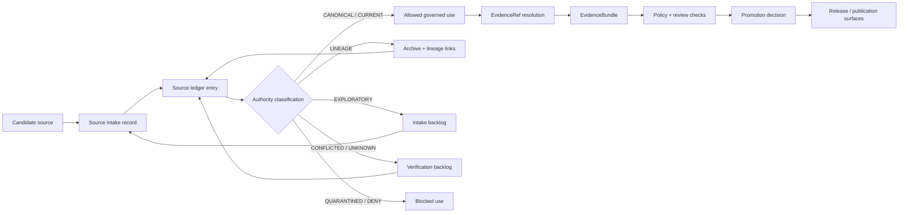

<!-- [KFM_META_BLOCK_V2]
doc_id: kfm://doc/NEEDS-VERIFICATION
title: ADR-0003: Source Ledger Authority
type: standard
version: v1
status: draft
owners: NEEDS-VERIFICATION
created: 2026-04-27
updated: 2026-04-27
policy_label: NEEDS-VERIFICATION
related: [NEEDS-VERIFICATION]
tags: [kfm, adr, source-ledger, authority, evidence, governance]
notes: [Draft generated for requested target path docs/adr/ADR-0003-source-ledger-authority.md; repo checkout was not visible in-session, so owners, policy label, doc_id, ADR index, and related paths require repo verification before publication.]
[/KFM_META_BLOCK_V2] -->

<a id="top"></a>

# ADR-0003: Source Ledger Authority

Decide how KFM ranks, records, cites, promotes, supersedes, and blocks source material so source authority remains inspectable instead of implied.


> [!IMPORTANT]
> **Status:** `draft`  
> **Decision state:** `PROPOSED`  
> **Path:** `docs/adr/ADR-0003-source-ledger-authority.md`  
> **Owners:** `NEEDS-VERIFICATION`  
> **Applies to:** documentation, source descriptors, EvidenceBundle resolution, promotion gates, release proof objects, governed AI context, and public-facing claims.  
> **Quick jumps:** [Context](#context) · [Decision](#decision) · [Authority ladder](#authority-ladder) · [Ledger records](#ledger-records) · [Validation gates](#validation-gates) · [Consequences](#consequences) · [Open verification](#open-verification)

> [!WARNING]
> **NEEDS VERIFICATION:** the visible KFM corpus also mentions a proposed `ADR-0002-source-ledger-authority.md`. This draft follows the user-requested target path, `docs/adr/ADR-0003-source-ledger-authority.md`. Before publication, reconcile the ADR index and rename or cross-link as needed.

---

## Context

KFM is a governed, evidence-first, map-first, time-aware spatial knowledge system. Its durable public unit of value is the **inspectable claim**: a claim that can be reconstructed to admissible evidence, spatial and temporal scope, source role, policy posture, review state, release state, and correction lineage.

KFM’s source corpus is intentionally broad. It contains doctrine, architecture manuals, domain-lane plans, source atlases, technical references, implementation sketches, generated reports, exploratory “New Ideas” packets, and external standards references. That breadth is useful only if source status remains visible.

Without a source-ledger authority decision, KFM risks treating all of the following as peers:

| Source material | Risk if not classified |
|---|---|
| Canonical repo docs and accepted ADRs | Authority can drift silently across files. |
| Attached planning PDFs and domain-lane blueprints | Proposed paths can be mistaken for implemented repo state. |
| New Ideas packets | Exploratory sketches can be promoted by tone rather than review. |
| External standards and source-system pages | Version-sensitive facts can become stale but still sound current. |
| Generated summaries, AI answers, maps, tiles, and scenes | Derived views can be mistaken for sovereign truth. |

This ADR establishes the source ledger as a required authority-control surface.

It does **not** claim that the target repo already contains the registers, schemas, validators, fixtures, workflows, or emitted proof objects named below. Those implementation surfaces remain **NEEDS VERIFICATION** until a real checkout, tests, workflows, manifests, and proof artifacts are inspected.

[Back to top](#top)

---

## Decision

**PROPOSED:** KFM will maintain a source ledger as the governing register for source identity, source status, source authority, claim support, lineage, supersession, unresolved references, and promotion eligibility.

The source ledger is **not a bibliography**. It is a working control surface.

It must answer five questions before any source-backed claim is released, cited, indexed, summarized, rendered, or used as governed AI context:

1. **What source is this?**
2. **What kind of authority can it carry?**
3. **What claims can it support, and what claims can it not support?**
4. **What review, rights, freshness, sensitivity, and release constraints apply?**
5. **What supersedes it, depends on it, or must be corrected if it changes?**

### Decision rule

A KFM claim, EvidenceBundle, ReleaseManifest, runtime response, map layer, Story/Focus payload, or public UI statement must resolve all source references to ledgered source records before it is treated as publishable.

When the ledger cannot resolve a source reference, or when the source’s status does not support the requested use, the correct outcome is one of:

| Outcome | Use |
|---|---|
| `ABSTAIN` | Evidence is insufficient, ambiguous, stale, or unresolved. |
| `DENY` | Policy, rights, sensitivity, safety, review, or release state blocks use. |
| `ERROR` | The system cannot perform required source resolution or validation. |
| `NEEDS VERIFICATION` | Human review is required before promotion or publication. |

[Back to top](#top)

---

## Scope

This ADR governs source authority for:

- doctrine and architecture documents;
- ADRs, standards, contracts, schemas, and policy documents;
- source descriptors and source-intake records;
- EvidenceRef → EvidenceBundle resolution;
- generated receipts, proof packs, manifests, catalog records, and release artifacts;
- MapLibre/Cesium layer manifests and Evidence Drawer payloads;
- governed AI runtime context, citations, and response envelopes;
- domain-lane source registries;
- New Ideas intake and promotion;
- external official-source checks when current facts matter.

### Non-goals

This ADR does not:

- settle the canonical schema home between `contracts/` and `schemas/`;
- define the complete EvidenceBundle contract;
- approve a promotion-gate implementation;
- activate live source connectors;
- make any attached PDF a current implementation proof;
- authorize public release of sensitive, restricted, unpublished, or rights-unclear sources.

Those decisions belong in separate ADRs, contracts, policies, and promotion gates.

[Back to top](#top)

---

## Authority ladder

KFM must distinguish **doctrine authority**, **implementation evidence**, **external current facts**, and **exploratory design pressure**.

| Rank | Source class | Can support | Cannot support without more evidence | Default posture |
|---:|---|---|---|---|
| 0 | Current accepted ADRs, canonical repo docs, contracts, schemas, and policy files | Current KFM doctrine, accepted decisions, contract semantics | Runtime behavior unless tests/logs/artifacts prove it | `CANONICAL` when verified |
| 1 | Current mounted repo evidence: source files, tests, workflows, manifests, emitted artifacts, dashboards, logs | Current implementation existence and behavior | Intended doctrine if it conflicts with accepted docs | `CONFIRMED` for inspected behavior |
| 2 | Current release artifacts, proof packs, manifests, catalog records, signed bundles | Release state, integrity state, promotion evidence | Raw source truth beyond recorded evidence | `RELEASED` or `PROOF` when verified |
| 3 | KFM baseline manuals, documentation architecture docs, and whole-system doctrine | Project doctrine, terminology, invariants, design intent | Current repo file presence, route names, tests, workflows, runtime maturity | `DOCTRINE` / `LINEAGE` |
| 4 | Subsystem manuals and domain-lane architecture plans | Domain burden, source-role discipline, proposed implementation shape | Current implementation unless repo evidence confirms it | `LINEAGE` / `PROPOSED` |
| 5 | New Ideas packets and exploratory implementation sketches | Candidate backlog, design pressure, future intake | Canon, current behavior, release authority | `EXPLORATORY` |
| 6 | External official sources and standards | Current version-sensitive facts, official endpoint/standard details, source-system metadata | KFM doctrine unless adopted by KFM | `EXTERNAL-VERIFIED` after dated check |
| 7 | General technical references | Conceptual support and implementation background | KFM-specific doctrine, rights, release state, repo behavior | `REFERENCE` |
| 8 | Memory, unsourced summaries, unreviewed AI output | Nothing authoritative | Any consequential claim | `NOT-AUTHORITY` |

> [!NOTE]
> **Resolution rule:** implementation evidence controls claims about *what the repo currently does*. Accepted doctrine controls claims about *what KFM intends or requires*. When they disagree, record the conflict rather than smoothing it away.

[Back to top](#top)

---

## Source status taxonomy

Each source-ledger entry must carry one current status.

| Status | Meaning | Public-claim eligibility |
|---|---|---|
| `CANONICAL` | Current accepted repo-native authority. | Eligible within scope. |
| `CURRENT` | Active supporting source, not necessarily canonical. | Eligible if role and policy permit. |
| `LINEAGE` | Preserved historical material explaining current doctrine or evolution. | Eligible only for lineage claims unless explicitly promoted. |
| `EXPLORATORY` | Idea packet, sketch, backlog input, or unapproved proposal. | Not eligible for authoritative claims. |
| `REFERENCE` | Background conceptual or technical source. | Eligible for background support only. |
| `EXTERNAL-VERIFIED` | Official external source checked for a dated fact. | Eligible for that dated fact, subject to freshness. |
| `SUPERSEDED` | Replaced by a newer source but retained for audit. | Not eligible except for historical traceability. |
| `DEPRECATED` | Intentionally retired from normal use. | Not eligible without exception review. |
| `QUARANTINED` | Blocked due to rights, sensitivity, integrity, conflict, or uncertainty. | Not eligible. |
| `UNKNOWN` | Status has not been established. | Not eligible. |
| `CONFLICTED` | Source conflicts with another source and resolution is pending. | Not eligible for unresolved claims. |
| `NEEDS-VERIFICATION` | A concrete check is required before use. | Not eligible until checked. |

[Back to top](#top)

---

## Ledger records

A source-ledger record must be stable enough for machine validation and readable enough for review.

### Required fields

| Field | Purpose |
|---|---|
| `source_id` | Stable identifier used by EvidenceRef, manifests, receipts, and docs. |
| `title` | Human-readable title or source name. |
| `source_family` | Canonical, doctrine, domain-lane, external, exploratory, reference, generated, etc. |
| `status` | One value from the source status taxonomy. |
| `authority_rank` | Rank from the authority ladder. |
| `truth_role` | What the source is allowed to prove. |
| `claims_supported` | Claim types this source can support. |
| `claims_not_supported` | Claim types this source must not be used to support. |
| `implementation_proof_status` | Whether it proves implementation behavior. Usually `NO` for planning PDFs. |
| `rights_status` | Rights/licensing/reuse posture. |
| `sensitivity_status` | Public, restricted, sensitive, culturally sensitive, location-sensitive, etc. |
| `freshness_status` | Current, stale, version-sensitive, unknown, or dated verification. |
| `retrieved_or_observed_at` | Date/time of source observation when applicable. |
| `digest` | Hash or integrity marker when available. |
| `aliases` | Prior IDs, filenames, titles, or renamed references. |
| `supersedes` | Older sources replaced by this entry. |
| `superseded_by` | Newer source that replaces this entry. |
| `related_objects` | EvidenceBundle, SourceDescriptor, RunReceipt, ProofPack, ReleaseManifest, etc. |
| `owner_or_steward` | Steward role or owner, marked `NEEDS-VERIFICATION` if unknown. |
| `verification_notes` | Concrete checks still required. |

### Example record shape

This is illustrative. It is not a claim that this exact schema file exists.

```yaml
source_id: SRC-KFM-DOC-ARCH
title: KFM Documentation Architecture Master Package
source_family: documentation-architecture
status: LINEAGE
authority_rank: 3
truth_role:
  - documentation-control-plane doctrine
  - canon/lineage/exploratory classification support
claims_supported:
  - KFM documentation authority posture
  - source classification vocabulary
claims_not_supported:
  - current repo file existence
  - current CI behavior
  - emitted proof-object presence
implementation_proof_status: NO
rights_status: NEEDS-VERIFICATION
sensitivity_status: public-or-restricted-NEEDS-VERIFICATION
freshness_status: dated-corpus-source
retrieved_or_observed_at: 2026-04-27
digest: NEEDS-VERIFICATION
aliases:
  - documentation architecture package
supersedes: []
superseded_by: []
related_objects:
  - SourceDescriptor
  - EvidenceBundle
  - ReleaseManifest
owner_or_steward: NEEDS-VERIFICATION
verification_notes:
  - verify exact repo-native canon home
  - verify whether current source ledger register already exists
```

[Back to top](#top)

---

## Lifecycle and promotion

A source does not become canonical because it is detailed, repeated, technically plausible, or visually polished.



### Promotion rule

A source may be promoted only when:

- its ledger record is complete enough for the requested use;
- rights and sensitivity are resolved for the release class;
- conflicts and supersession are recorded;
- required source descriptors and schemas are present or explicitly deferred;
- downstream claims have EvidenceRef → EvidenceBundle closure;
- policy checks pass;
- reviewer approval is recorded where required.

[Back to top](#top)

---

## Interaction with EvidenceBundle

The source ledger is upstream of EvidenceBundle resolution.

| Object | Relationship to source ledger |
|---|---|
| `EvidenceRef` | Must point to a resolvable ledgered source or evidence item. |
| `EvidenceBundle` | Must include source IDs, source roles, review/policy state, citation validation, and bundle hash. |
| `SourceDescriptor` | Describes a source family or source endpoint; must map to ledger entries when used. |
| `RunReceipt` | Records process memory; may reference sources but does not itself promote them. |
| `ProofPack` | Release-grade proof bundle; must include source-ledger coverage for release-significant claims. |
| `ReleaseManifest` | Must not include unledgered, unresolved, quarantined, or rights-unclear source dependencies. |
| `RuntimeResponseEnvelope` | Must not emit answer text that cites sources absent from the ledger or blocked by policy. |

> [!IMPORTANT]
> AI output, map popups, scene annotations, exports, and dashboard summaries cannot be used to bypass source-ledger status. Generated language remains interpretive; ledgered evidence remains authoritative.

[Back to top](#top)

---

## Validation gates

The first implementation should be small, reversible, and no-network.

### Required checks

| Gate | Required behavior |
|---|---|
| Source ID uniqueness | No duplicate `source_id` values. |
| Required fields | Every ledger record includes the required fields or is blocked. |
| Status validity | Status values must be finite and schema-valid. |
| Authority rank validity | Rank values must match this ADR or a superseding ADR. |
| Alias resolution | Old names and filenames resolve to one stable source ID. |
| Unresolved references | EvidenceBundle, ReleaseManifest, RunReceipt, AIReceipt, and layer manifests cannot point to unknown sources. |
| Status-policy check | `EXPLORATORY`, `UNKNOWN`, `CONFLICTED`, `QUARANTINED`, and `NEEDS-VERIFICATION` sources cannot support public authoritative claims. |
| Implementation-proof check | Planning docs cannot prove current repo files, workflows, routes, or runtime behavior. |
| External freshness check | Version-sensitive external facts require a dated official-source check. |
| Supersession check | Superseded sources remain traceable and cannot silently overwrite newer authority. |
| No-public-raw-path check | Public surfaces must not expose raw, work, quarantine, or unpublished source material. |

### Minimum fixture set

| Fixture group | Purpose |
|---|---|
| `valid/source-ledger/minimal` | Minimal acceptable ledger record. |
| `valid/source-ledger/with-aliases` | Alias and rename coverage. |
| `invalid/source-ledger/missing-status` | Required-field failure. |
| `invalid/source-ledger/duplicate-source-id` | Stable-ID failure. |
| `invalid/evidence/unresolved-source-ref` | EvidenceRef resolution failure. |
| `invalid/release/quarantined-source` | Release-blocking source status. |
| `invalid/ai/exploratory-source-as-canon` | Governed AI citation misuse. |

[Back to top](#top)

---

## Expected repo surfaces

These paths are **PROPOSED** until repo conventions are verified.

| Surface | Proposed home | Role |
|---|---|---|
| Human-readable source ledger | `docs/registers/SOURCE_LEDGER.md` | Reviewable source authority register. |
| Source authority ladder | `docs/registers/AUTHORITY_LADDER.md` or this ADR | Ranked source-class rules. |
| Canon / lineage / exploratory register | `docs/registers/CANONICAL_LINEAGE_EXPLORATORY.md` | Document-status map. |
| Unresolved reference register | `docs/registers/VERIFICATION_BACKLOG.md` | Source references blocked pending proof. |
| Machine source records | `data/registry/sources/` | SourceDescriptor/source-instance records. |
| Source schemas | `schemas/contracts/v1/sources/` after schema-home ADR | Machine validation. |
| Source fixtures | `tests/fixtures/sources/` | Valid/invalid examples. |
| Source validators | `tools/validators/sources/` | Ledger, alias, and coverage checks. |
| Source policy | `policy/sources/` or repo-native policy home | Source-role, rights, freshness, sensitivity, and publication gates. |

If the mounted repo uses different homes, update this ADR, parent READMEs, and the source-ledger record rather than creating parallel authority.

[Back to top](#top)

---

## Consequences

### Positive

- Source authority becomes visible instead of implied.
- KFM can preserve lineage without treating lineage as current authority.
- New Ideas can be retained without becoming accidental canon.
- Public claims become easier to audit, correct, and roll back.
- EvidenceBundle resolution has a clear upstream source-status check.
- Source rights, sensitivity, freshness, and review state become release blockers rather than afterthoughts.

### Tradeoffs

- Maintainers must keep the ledger current.
- Some fast-moving work will be blocked until source status is resolved.
- External current facts require dated verification.
- The ledger can create false confidence if validators are not enforced.
- ADR numbering and source-registry homes must be reconciled before publication.

### Failure modes this ADR is intended to prevent

| Failure mode | Required prevention |
|---|---|
| A planning PDF is cited as proof of repo implementation. | Mark implementation-proof status explicitly. |
| A New Ideas packet becomes canon without review. | Keep `EXPLORATORY` blocked from authoritative claims. |
| A source is renamed and old references break. | Preserve aliases and stable `source_id`. |
| A public map cites unreviewed raw/work/quarantine data. | Enforce no-public-raw-path and release-state checks. |
| AI answers cite unsupported context. | Require source-ledger resolution and citation validation. |
| A stale external version fact persists. | Require freshness status and dated re-verification. |

[Back to top](#top)

---

## Rollback and correction

Source-ledger rollback must preserve auditability.

| Scenario | Required action |
|---|---|
| Incorrect source promotion | Change status to `QUARANTINED` or `CONFLICTED`, record reason, and identify dependent claims/releases. |
| Wrong authority rank | Correct ledger entry, add correction note, and rerun source-coverage checks. |
| Broken alias | Add alias mapping and rerun unresolved-reference validation. |
| Source superseded | Set `superseded_by`, keep old source available as lineage, and update dependent EvidenceBundles where needed. |
| Rights or sensitivity reversal | Deny publication, withdraw or correct affected outputs, and record policy decision. |
| ADR replaced | Mark this ADR superseded, link the replacement, and keep this file for lineage. |

No rollback should delete lineage material merely because it is no longer current authority.

[Back to top](#top)

---

## Acceptance criteria

This ADR is ready for review when:

- [ ] ADR numbering is reconciled against the repo ADR index.
- [ ] Owners are verified.
- [ ] Policy label is verified.
- [ ] Related paths are replaced with verified repo-relative links.
- [ ] Source-ledger home is confirmed or corrected.
- [ ] Schema-home dependency is linked to the accepted schema-home ADR.
- [ ] Source status taxonomy is reviewed by documentation, data, policy, and release stewards.
- [ ] Validation fixture names are aligned to the repo’s test conventions.
- [ ] Parent README files reference this ADR where appropriate.
- [ ] No statement claims current implementation behavior without direct repo evidence.

[Back to top](#top)

---

## Open verification

| Item | Status | Why it matters | Required check |
|---|---|---|---|
| ADR number | `NEEDS VERIFICATION` | Visible corpus mentions source-ledger authority under another ADR number. | Inspect `docs/adr/` and ADR index. |
| Owners | `NEEDS VERIFICATION` | Governance docs need accountable stewards. | Inspect CODEOWNERS and repo docs ownership convention. |
| Policy label | `NEEDS VERIFICATION` | Release/publication posture is unknown. | Inspect repo policy labels and doc metadata rules. |
| Source-ledger register home | `NEEDS VERIFICATION` | Prevents duplicate source authority surfaces. | Inspect `docs/registers/`, `data/registry/`, and parent READMEs. |
| Machine schema home | `CONFLICTED / NEEDS VERIFICATION` | Prior materials reference both `contracts/` and `schemas/`. | Resolve through schema-home ADR. |
| Existing SourceDescriptor schema | `UNKNOWN` | This ADR should extend, not duplicate, existing contracts. | Inspect schemas/contracts and fixtures. |
| Existing validators | `UNKNOWN` | Validation claims require tool evidence. | Inspect `tools/validators/` and test suite. |
| Existing release/proof artifacts | `UNKNOWN` | Proof-object maturity cannot be inferred. | Inspect generated artifacts, manifests, and release folders. |
| External source verification policy | `NEEDS VERIFICATION` | Version-sensitive source facts need current official checks. | Inspect source-descriptor and source-refresh standards. |

[Back to top](#top)