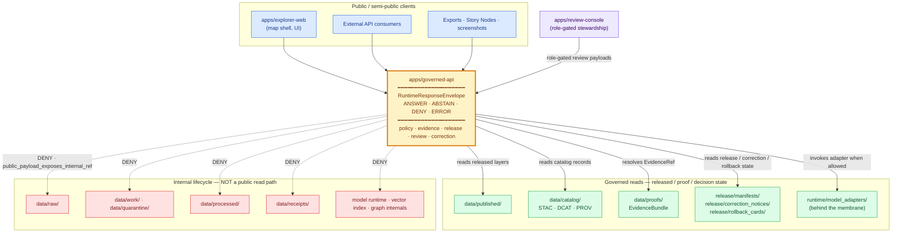

<!-- [KFM_META_BLOCK_V2]
doc_id: kfm://doc/adr-0004
title: ADR-0004 — apps/governed-api is the trust membrane
type: standard
version: v1.1
status: draft
owners: TODO — Architecture Steward; API owner; Security steward
created: 2026-05-10
updated: 2026-05-15
policy_label: public
related:
  - docs/adr/ADR-0001-schema-home.md                 # NEEDS VERIFICATION — cited by Directory Rules as ADR-0001
  - docs/adr/ADR-0002-finite-decision-outcomes.md    # PROPOSED — starter-set name
  - docs/adr/ADR-0003-watcher-as-non-publisher.md    # PROPOSED — starter-set name
  - docs/doctrine/directory-rules.md                 # PROPOSED canonical home per Directory Rules
  - directory-rules.md                               # NEEDS VERIFICATION — existing path reference retained for continuity
  - docs/architecture/runtime-envelope.md            # PROPOSED companion doc
tags: [kfm, adr, governed-api, trust-membrane, runtime, governance]
notes:
  - "ADR decision status remains Proposed; meta status marks repository-document lifecycle as draft."
  - "Resolves the Directory Rules OPEN item about apps/api/ vs apps/governed-api/ boundary."
  - "Updated 2026-05-15 to sharpen evidence boundary, schema-home posture, validation gates, and migration discipline."
  - "Starter-set numbering follows the user-supplied file path; alternate Pass 12 lineage proposed ADR-0004 = STAC profile. Surface retained in §11 Alternatives."
[/KFM_META_BLOCK_V2] -->

<a id="top"></a>

# ADR-0004 — `apps/governed-api/` is the Trust Membrane

> **Purpose.** Declare `apps/governed-api/` the **single executable boundary** between Kansas Frontier Matrix's governed internals and every public / semi-public client. Public reads, AI answers, review-console payloads, Story Nodes, exports, and Evidence Drawer payloads cross this boundary; ordinary clients do not bypass it.

<div align="left">


</div>

| Field | Value |
|---|---|
| **ADR decision status** | Proposed |
| **Document lifecycle status** | Draft |
| **Owners** | `TODO` — Architecture Steward · API owner · Security steward |
| **Last reviewed** | 2026-05-15 |
| **Supersedes** | — |
| **Superseded by** | — |
| **Primary decision** | `apps/governed-api/` is the public trust path. |
| **Implementation depth** | **UNKNOWN** until mounted repo, tests, workflows, manifests, logs, and emitted artifacts are inspected. |

> [!NOTE]
> This ADR states KFM doctrine where supported by Project sources. Current implementation depth remains **UNKNOWN** where repo files, tests, workflows, dashboards, logs, or emitted artifacts were not inspected.

---

## Quick Navigation

- [1. Status](#1-status)
- [2. Context](#2-context)
- [3. Decision](#3-decision)
- [4. Trust Membrane — Diagram](#4-trust-membrane--diagram)
- [5. Operational Invariants](#5-operational-invariants)
- [6. `RuntimeResponseEnvelope` Contract](#6-runtimeresponseenvelope-contract)
- [7. Required Deny Cases](#7-required-deny-cases)
- [8. Affected Paths](#8-affected-paths)
- [9. Resolution of the `apps/api/` Question](#9-resolution-of-the-appsapi-question)
- [10. Consequences](#10-consequences)
- [11. Alternatives Considered](#11-alternatives-considered)
- [12. Migration & Backward Compatibility](#12-migration--backward-compatibility)
- [13. Validation & Compliance](#13-validation--compliance)
- [14. Related ADRs and Docs](#14-related-adrs-and-docs)
- [15. Open Questions / NEEDS VERIFICATION](#15-open-questions--needs-verification)
- [Appendix A — Reason-code vocabulary](#appendix-a--reason-code-vocabulary)
- [Appendix B — Anti-patterns this ADR forbids](#appendix-b--anti-patterns-this-adr-forbids)
- [Related docs](#related-docs)

---

## 1. Status

**Proposed.** This ADR codifies the KFM trust membrane as an addressable architectural decision and resolves the Directory Rules open question about whether `apps/api/` and `apps/governed-api/` co-exist and what the boundary is.

It does **not** prove that the target repository already contains the paths, schemas, policies, tests, or runtime behavior named below. Those remain **PROPOSED / NEEDS VERIFICATION** until a mounted-repo inspection confirms them.

### Decision posture

| Item | Status | Meaning |
|---|---|---|
| Trust membrane doctrine | **CONFIRMED doctrine** | Public clients must not become direct readers of raw, internal, unpublished, unreviewed, or model-generated truth. |
| `apps/governed-api/` as canonical public trust path | **PROPOSED ADR decision** | This ADR makes the boundary explicit and supersession-aware. |
| Current route handlers, DTOs, middleware, auth, logs, dashboards | **UNKNOWN** | No mounted repo/runtime evidence was inspected for this revision. |
| Schema home for runtime envelopes | **PROPOSED under ADR-0001** | Default home is `schemas/contracts/v1/runtime/`; verify live repo convention before landing files. |
| `apps/api/` current role | **NEEDS VERIFICATION** | If present, classify as deprecated, internal-only, or narrowly scoped and non-parallel to the trust membrane. |

> [!IMPORTANT]
> This ADR is a governance decision and implementation target. It is **not** a claim that any runtime path is currently deployed, tested, secured, or release-gated.

[↑ Back to top](#quick-navigation)

---

## 2. Context

KFM is a governed, evidence-first, map-first, time-aware spatial knowledge system. Its lifecycle invariant is:

```text
RAW  →  WORK / QUARANTINE  →  PROCESSED  →  CATALOG / TRIPLETS  →  PUBLISHED
```

Promotion between phases is a **governed state transition**, not a file move. Each phase carries different source, rights, sensitivity, validation, review, release, correction, and rollback posture. The system fails *closed*: when support is missing, stale, unresolved, rights-uncertain, or policy-blocked, KFM abstains or denies rather than emitting unsupported authority.

The forces in play:

- **Public exposure is asymmetric.** A leaked exact archaeology site, rare-species nesting location, restricted personal record, unreleased candidate, or internal file reference cannot be fully retracted once served.
- **Generated text is not sovereign truth.** Tiles, mosaics, summaries, vector indexes, graph projections, generated answers, screenshots, and 3D scenes are presentation or acceleration surfaces. `EvidenceBundle`, policy, review state, source role, and release state outrank them.
- **Direct client reads collapse the lifecycle.** A public route that reads `data/raw/`, `data/work/`, `data/quarantine/`, `data/processed/`, receipts, or model endpoints bypasses the gates KFM exists to enforce.
- **Multiple consumers need one accountable contract.** `apps/explorer-web/`, external consumers, Focus Mode, Evidence Drawer, review-console payloads, Story Nodes, exports, screenshots, and downstream API clients need consistent semantics: same envelope, same evidence-resolution rule, same denial vocabulary, same review/release/correction state.
- **A structural ambiguity exists.** Directory Rules lists as OPEN whether `apps/api/` and `apps/governed-api/` co-exist and what the boundary is. This ADR resolves that ambiguity at the doctrine level.

Without an executable membrane that all ordinary public traffic crosses, every other governance commitment — `EvidenceBundle` closure, sensitivity policy, cite-or-abstain, watcher-as-non-publisher, release manifests, correction notices, rollback cards — has no single enforcement point where it matters most: the public surface.

[↑ Back to top](#quick-navigation)

---

## 3. Decision

**`apps/governed-api/` is the canonical public trust path for Kansas Frontier Matrix.**

KFM commits to the following:

1. **Single executable membrane.** Public and normal UI traffic — reads, AI answers, Evidence Drawer payloads, Story Nodes, exports, screenshots, review-console retrieval payloads, and public-safe layer metadata — passes through `apps/governed-api/`.
2. **Finite runtime outcomes.** Every trust-bearing response is a `RuntimeResponseEnvelope` with `status ∈ { ANSWER, ABSTAIN, DENY, ERROR }`. There is no fifth runtime outcome.
3. **No public path to canonical / lifecycle stores.** Public clients **MUST NOT** read `data/raw/`, `data/work/`, `data/quarantine/`, internal `data/receipts/`, internal `data/proofs/`, `data/processed/`, source registries, graph internals, model endpoints, or unpublished candidate artifacts directly.
4. **Released artifacts are still governed.** `data/published/`, public-safe catalog records, public tile services, public PMTiles/COG/GeoParquet artifacts, and release manifests are consumed through governed interfaces and release-aware manifests, not treated as unbounded truth.
5. **No direct model client.** Focus Mode, Evidence Drawer reasoning, and any AI-assisted surface invoke model adapters **behind** the governed API. The browser never calls Ollama, OpenAI, local model runtimes, vector indexes, graph stores, object stores, or canonical databases directly.
6. **Decision metadata travels with the answer.** Trust-bearing envelopes carry the material decision references: `policy_decision_ref`, `evidence_bundle_refs`, `release_manifest_refs`, `review_state`, `correction_notice_refs`, `citations`, `limitations`, `redaction_or_generalization_state`, and `reason_codes`.
7. **The membrane is fail-closed.** Missing `EvidenceBundle` → `ABSTAIN`. Sensitivity-policy violation → `DENY`. Stale beyond endpoint policy → `ABSTAIN` with stale reason. Adapter or schema failure → `ERROR` with no leakage of prompt, secret, stack trace, or internal context.
8. **Watcher-as-non-publisher is preserved at the boundary.** Workers (`apps/workers/`) emit receipts, validation reports, catalog candidates, and candidate decisions. They do not publish, mutate canonical truth, or speak directly to public clients. The governed API reads only what the lifecycle has promoted or what a role-gated review path is allowed to inspect.

> [!IMPORTANT]
> The trust membrane is **operational**, not aspirational. A code path that says “public client” but reads anything other than a governed API response or a release-approved public-safe artifact is a **MUST-fix violation** of this ADR — even if the read is convenient, fast, or “just for now.”

[↑ Back to top](#quick-navigation)

---

## 4. Trust Membrane — Diagram



> [!NOTE]
> Dotted arrows are **denial paths**, not access paths. A request that would resolve to a `RAW / WORK / QUARANTINE / PROCESSED / receipts / direct model / graph-internal` read returns a finite envelope with a reason code, not a filesystem error and not an empty `ANSWER`.

[↑ Back to top](#quick-navigation)

---

## 5. Operational Invariants

| # | Invariant | Source posture |
|---|---|---|
| I-1 | `apps/governed-api/` is the **only** normal public-facing application that serves trust-bearing payloads. | CONFIRMED doctrine / ADR decision |
| I-2 | Every trust-bearing response is a `RuntimeResponseEnvelope` with one of four statuses: `ANSWER`, `ABSTAIN`, `DENY`, `ERROR`. | CONFIRMED doctrine / PROPOSED schema |
| I-3 | Public clients **never** read `data/raw/`, `data/work/`, `data/quarantine/`, `data/processed/`, internal `data/receipts/`, or direct model/runtime stores. | CONFIRMED doctrine |
| I-4 | `EvidenceRef` → `EvidenceBundle` resolution happens **through** the governed API or an approved evidence resolver behind it. Clients receive resolved support, not internal paths. | CONFIRMED doctrine / PROPOSED implementation |
| I-5 | Model adapters live **behind** the membrane; browsers and ordinary clients never call model runtimes directly. | CONFIRMED doctrine |
| I-6 | Tiles, mosaics, generated text, vector indexes, graph projections, screenshots, and 3D scenes are **derived carriers**. They do not replace catalog/proof/release objects. | CONFIRMED doctrine |
| I-7 | Sensitivity policy is enforced **before public exposure**: exact archaeology, rare-species nest/den/roost/spawning locations, living-person data, DNA inference, cultural sensitivity, and critical-infrastructure precision fail closed unless policy and review allow release. | CONFIRMED doctrine / domain-specific details NEED VERIFICATION |
| I-8 | Stale-beyond-policy data returns `ABSTAIN` or a stale-labeled finite outcome per endpoint contract; it does not silently render as authoritative. | CONFIRMED doctrine / PROPOSED endpoint tests |
| I-9 | `ERROR` responses **never leak** prompt text, secrets, internal stack traces, resolver internals, file paths, or adapter internals. | CONFIRMED doctrine |
| I-10 | The governed API is a **read path** for released and proof-backed state and a **submit path** for steward-controlled decisions. It does **not** become a direct file-mutation shortcut for public clients. | CONFIRMED doctrine / PROPOSED implementation |
| I-11 | Review-console retrievals and stewardship actions go through governed routes, not direct reads or writes of receipt/report/diff files from the browser. | PROPOSED implementation pattern |
| I-12 | Public artifacts must remain rollback-addressable: response envelopes reference release manifests, correction notices, and rollback cards where material. | CONFIRMED doctrine / PROPOSED schema |

[↑ Back to top](#quick-navigation)

---

## 6. `RuntimeResponseEnvelope` Contract

The canonical machine-schema home is **PROPOSED** at:

```text
schemas/contracts/v1/runtime/runtime_response_envelope.schema.json
```

This follows the schema-home rule that machine-checkable shape belongs under `schemas/contracts/v1/...`. Object meaning belongs in `contracts/`; admissibility belongs in `policy/`; proof lives in `tests/` and emitted artifacts.

### Minimum field set

| Field | Purpose |
|---|---|
| `envelope_id` | Deterministic or replayable identity for this response. |
| `request_id` | Join key to client, audit, logs, and trace context. |
| `schema_version` | Runtime envelope schema version. |
| `status` | One of `ANSWER \| ABSTAIN \| DENY \| ERROR`. |
| `domain` | Domain lane or cross-domain surface, e.g., `hydrology`, `archaeology`, `map`, `runtime`. |
| `action` | Endpoint category, e.g., `evidence.resolve`, `layer.metadata`, `feature.explain`, `focus.answer`, `review.payload`. |
| `access_role` | Caller’s resolved role, e.g., `public`, `registered`, `steward`, `domain_reviewer`, `admin`, `system`. |
| `result_payload` | Status-specific payload: cited result for `ANSWER`; held-case rationale for `ABSTAIN`; refusal record for `DENY`; audit-safe fault ref for `ERROR`. |
| `evidence_bundle_refs` | Resolved support set for the response. Empty only when status and reason explain why support is unavailable or blocked. |
| `policy_decision_ref` | Policy decision object or decision envelope that governed the response. |
| `release_manifest_refs` | Release manifests the response is bound to. |
| `stale_state` | Freshness status against endpoint/source policy. |
| `review_state` | Steward/reviewer state of bound release or review target. |
| `correction_notice_refs` | Any active `CorrectionNotice` affecting cited claims or artifacts. |
| `rollback_refs` | Rollback targets where response depends on a release artifact. |
| `citations` | Validated citations attached to `ANSWER` payloads. |
| `limitations` | Bounded caveats, generalization/redaction notes, uncertainty, and fitness-for-use limits. |
| `reason_codes` | Machine-readable reasons; see [Appendix A](#appendix-a--reason-code-vocabulary). |
| `redactions` | Public-safe transform or withheld-field metadata where applicable. |
| `audit_ref` | Audit-safe reference for logs/receipts; no secrets or stack traces. |
| `generated_at` | ISO-8601 timestamp for replay, supersession, and freshness reasoning. |

### Status semantics

| Status | Use | Required posture |
|---|---|---|
| `ANSWER` | Sufficient released, policy-safe, review-supported evidence exists. | Must include evidence refs and citations where the response makes a claim requiring support. |
| `ABSTAIN` | Evidence is missing, stale, unresolved, weak, conflicting, out of scope, or cannot be safely narrowed. | Must explain held-case reason without fabricating an answer. |
| `DENY` | Rights, sensitivity, role, source terms, release state, or policy blocks the request. | Must avoid leaking the blocked material. |
| `ERROR` | Technical or validation failure prevents reliable execution. | Must return audit-safe fault reference only; no prompt, secret, stack trace, or internal file path leakage. |

> [!TIP]
> Consumers MAY write a `switch` over `status` and trust that there is no fifth branch. The four-valued grammar is the load-bearing property: it prevents “empty answers,” silent refusals, and generated filler from standing in for a governed outcome.

[↑ Back to top](#quick-navigation)

---

## 7. Required Deny Cases

These are minimum fail-closed cases that any conformant `apps/governed-api/` implementation must enforce. Some triggers produce `ABSTAIN` or `ERROR` rather than `DENY`; they remain here because they are part of the boundary’s negative-outcome contract.

| Trigger | Outcome | Reason code (illustrative) |
|---|---|---|
| Public request resolves a `RAW / WORK / QUARANTINE` path. | `DENY` | `public_payload_exposes_internal_ref` |
| Public request resolves internal `data/receipts/`, internal proofs, direct graph internals, model runtime, or vector index. | `DENY` | `public_payload_exposes_internal_ref` |
| Public request for an unreleased candidate layer, unpublished feature, or non-promoted tile artifact. | `DENY` | `release.unpublished` |
| Public request for exact archaeology site, burial, sacred site, or human-remains location. | `DENY` | `sensitivity.archaeology_exact_denied` |
| Public request for exact rare-species occurrence / nest / den / roost / spawning location. | `DENY` | `sensitivity.rare_species_exact_denied` |
| Public exposure of living-person identifying data without lawful basis and review. | `DENY` | `sensitivity.living_person_denied` |
| Public DNA / genomic inference about living persons or relatives. | `DENY` | `sensitivity.dna_inference_denied` |
| Public exact critical-infrastructure geometry, condition, or exploitable dependency. | `DENY` / role-gated restriction | `sensitivity.critical_infrastructure_denied` |
| Focus / AI answer without resolvable `EvidenceBundle` or validated citations. | `ABSTAIN` or `DENY` depending on policy. | `ai_missing_evidence_bundle_or_citations` |
| Model-predicted candidate feature treated as confirmed observation. | `DENY` | `model_as_observation` |
| Catalog closure mismatch or missing release-manifest digest in public artifact. | `DENY` | `catalog_matrix_not_closed` |
| Unknown rights / unresolved license on requested release. | `DENY` or upstream `QUARANTINE`. | `rights.unknown` |
| Operational alert / emergency-instruction replacement request. | `DENY` | `not_for_life_safety` |
| Source stale beyond endpoint policy. | `ABSTAIN` | `freshness.stale` |
| Adapter fault, schema failure, resolver exception, or invalid envelope. | `ERROR` | `adapter.fault` / `schema.validation_failed` |
| Review-console route tries to mutate local receipt/report/diff files directly from browser intent. | `DENY` | `review.direct_file_mutation_denied` |

[↑ Back to top](#quick-navigation)

---

## 8. Affected Paths

All paths below are **PROPOSED** until the repo is inspected. Path placement follows Directory Rules responsibility roots: deployables in `apps/`, semantic contracts in `contracts/`, machine schemas in `schemas/`, admissibility in `policy/`, proof in `tests/`, shared runtime helpers in `packages/` or `runtime/`, and release decisions in `release/`.

If the actual repo uses a hyphen vs underscore variant (`apps/governed-api/` vs `apps/governed_api/`), preserve the entrenched form only after verification and record the decision in this ADR, a drift entry, or a migration note. Do **not** create divergent sibling APIs.

| Path | Action | Purpose | Truth |
|---|---|---|---|
| `apps/governed-api/` | create / adapt | Trust-membrane deployable; only normal public-facing app for trust payloads. | PROPOSED |
| `apps/governed-api/README.md` | create / update | Boundary documentation; route categories; deny matrix; no-direct-store rule. | PROPOSED |
| `apps/governed-api/src/routes/runtimeBootstrap.*` | create / adapt | Shell + route registry + feature-flag bootstrap. | PROPOSED |
| `apps/governed-api/src/routes/layers.*` | create / adapt | Layer catalog / descriptor / release-manifest endpoints. | PROPOSED |
| `apps/governed-api/src/routes/evidence.*` | create / adapt | `EvidenceBundle` resolution endpoint. | PROPOSED |
| `apps/governed-api/src/routes/focus.*` | create / adapt | Focus Mode bounded-answer endpoint. | PROPOSED |
| `apps/governed-api/src/routes/correction.*` | create / adapt | Public `CorrectionNotice` lookup. | PROPOSED |
| `apps/governed-api/src/routes/review/*.*` | create / adapt | Steward / review-console surfaces; role-gated; audited. | PROPOSED |
| `apps/explorer-web/src/api/governedClient.*` | adapt | Only allowed browser network path for trust payloads. | PROPOSED |
| `apps/explorer-web/src/api/responseValidators.*` | adapt | Runtime schema validation at the client boundary. | PROPOSED |
| `contracts/runtime/runtime_response_envelope.md` | create | Semantic meaning and status grammar for runtime envelopes. | PROPOSED |
| `schemas/contracts/v1/runtime/runtime_response_envelope.schema.json` | create | Machine-checkable envelope schema. | PROPOSED |
| `schemas/contracts/v1/runtime/decision_envelope.schema.json` | create | Machine-checkable policy/decision reference schema. | PROPOSED |
| `policy/runtime/finite_outcomes.rego` | create | Policy helper normalizing outputs to the four-valued grammar. | PROPOSED |
| `policy/runtime/no_internal_path.rego` | create | Deny rule for routes referencing internal lifecycle or model paths. | PROPOSED |
| `tests/api/no_raw_path_test.*` | create | Asserts public routes return `DENY`, not filesystem errors, for internal paths. | PROPOSED |
| `tests/runtime_proof/finite_outcome_test.*` | create | Asserts every endpoint returns exactly one finite status. | PROPOSED |
| `tests/runtime_proof/abstain_on_missing_evidence_test.*` | create | Asserts missing evidence resolves to `ABSTAIN`, not fabricated answer. | PROPOSED |
| `docs/architecture/runtime-envelope.md` | create / update | Human-facing companion to runtime envelope schema. | PROPOSED |
| `docs/registers/DRIFT_REGISTER.md` | update if needed | Records any active `apps/api/` vs `apps/governed-api/` drift. | PROPOSED |
| `docs/registers/VERIFICATION_BACKLOG.md` | update | Tracks unresolved app path, schema home, tests, owners, route behavior. | PROPOSED |
| Directory Rules §18 OPEN entry | edit | Mark the `apps/api/` vs `apps/governed-api/` question **resolved by ADR-0004**; link forward. | PROPOSED |

[↑ Back to top](#quick-navigation)

---

## 9. Resolution of the `apps/api/` Question

Directory Rules lists as OPEN whether `apps/api/` and `apps/governed-api/` co-exist in the current repo and what the boundary is. This ADR resolves the doctrine as follows:

| Outcome | Rule |
|---|---|
| **Default** | Only `apps/governed-api/` serves normal public trust traffic. It is the public trust path. |
| **Co-existence** | If `apps/api/` exists, it MUST be one of: (a) frozen legacy / mirror, (b) internal-only and not exposed to public clients, or (c) a narrowly documented service whose scope and exposure are pinned in its README and reviewed against this ADR. |
| **Forbidden** | `apps/api/` MAY NOT serve public clients in parallel with `apps/governed-api/`. Parallel public APIs split the membrane and split enforcement. |
| **If both serve public traffic today** | Open a `docs/registers/DRIFT_REGISTER.md` entry, write a migration plan under `migrations/`, deprecate `apps/api/` for public traffic, and converge on `apps/governed-api/`. |
| **If path naming differs** | Do not create both `apps/governed-api/` and `apps/governed_api/`. Verify entrenched convention, document the chosen form, and provide alias/migration notes where needed. |

> [!WARNING]
> Splitting public traffic between two deployables is the most common way the trust membrane silently dissolves. The choice “they each handle different routes” is equivalent to “we have two policy substrates, two denial vocabularies, two audit surfaces, and no single membrane.”

[↑ Back to top](#quick-navigation)

---

## 10. Consequences

### Positive

- **Single point of enforcement.** Sensitivity, rights, freshness, citation, evidence-closure, and release-state checks live in one executable boundary.
- **Auditable response path.** Each trust-bearing response carries decision metadata: `policy_decision_ref`, `evidence_bundle_refs`, `release_manifest_refs`, `reason_codes`, and correction/rollback references where material.
- **Cite-or-abstain becomes operational.** `ABSTAIN` is a first-class response, not an empty payload pretending to be an answer.
- **Generated text cannot outrank evidence.** Focus Mode and AI surfaces run through the same membrane and the same finite envelope grammar.
- **Directory ambiguity is resolved.** The `apps/api/` vs `apps/governed-api/` question moves from OPEN to ADR-governed.
- **Review-console retrieval becomes safer.** Steward surfaces can request review payloads through governed routes instead of reading receipts/reports/diffs directly from the browser.

### Negative / Costs

- **Latency and payload size grow.** Decision metadata, citation refs, release refs, and evidence pointers add overhead.
- **Implementation cost increases early.** Routes that previously read `data/processed/` or candidate artifacts directly must be re-pointed through the governed API.
- **Client code must consume finite outcomes.** UI states need explicit rendering for `ANSWER`, `ABSTAIN`, `DENY`, and `ERROR`.
- **Admin shortcuts must be constrained.** `apps/admin/` routes must be justified, role-gated, documented, audited, and kept out of the normal public path.
- **3D / Cesium / alternate renderers must preserve the same trust path.** They cannot become alternate truth or release surfaces.

### Risks if Not Adopted

- Drift to “convenient” public routes that read `data/processed/` directly.
- Sensitivity policy enforced inconsistently between routes.
- Generated text emitted as authoritative without `EvidenceBundle` support.
- `apps/api/` and `apps/governed-api/` diverging in denial vocabularies.
- Review-console payloads becoming file-reader shortcuts instead of governed review surfaces.

[↑ Back to top](#quick-navigation)

---

## 11. Alternatives Considered

| Alternative | Why rejected |
|---|---|
| **No dedicated membrane** — let each app handle its own trust checks. | Distributes enforcement across every route; weakest enforcement defines the system. Sensitivity, freshness, citation, and release-state checks drift apart. |
| **Membrane in `apps/explorer-web/` only** — UI enforces the boundary. | UI is a renderer and interaction surface, not a policy authority. External API consumers bypass it entirely. |
| **Membrane in a `packages/` library** — every app imports a governed helper. | Libraries can be imported wrongly or bypassed. A deployable boundary is more enforceable than a helper package. |
| **Per-domain governed APIs** — e.g., `apps/hydrology-api/`, `apps/fauna-api/`. | Multiplies enforcement surfaces and fragments cross-domain queries. Domain lanes belong inside the membrane, not as parallel public deployables. |
| **Keep `apps/api/` and `apps/governed-api/` as public siblings distinguished by route prefix.** | Re-introduces the exact ambiguity this ADR resolves; doubles the public policy surface. |
| **Use reverse proxy / WAF as the membrane.** | A proxy can enforce exposure and transport policy; it cannot resolve `EvidenceBundle`, validate citations, emit `DecisionEnvelope`, or apply KFM finite outcomes as application semantics. |
| **Make model runtime the public interface.** | Direct model clients bypass evidence, release, rights, sensitivity, and citation gates. KFM treats AI as interpretive and evidence-subordinate. |
| **Alternate ADR-0004 placement: STAC profile.** | Retained as lineage. The trust-membrane decision is more load-bearing and resolves an existing Directory Rules open question. STAC profile can be renumbered later. |

[↑ Back to top](#quick-navigation)

---

## 12. Migration & Backward Compatibility

This ADR is doctrinally compatible with KFM’s lifecycle and public-surface posture. The migration work is operational, not conceptual.

### Backward compatibility posture

Existing external route URLs MAY be preserved while their handlers are re-pointed through `apps/governed-api/`. Breaking changes to envelope shape require a runtime schema version bump and a documented migration window.

### Migration steps (PROPOSED)

1. Inspect the mounted repo. Confirm whether `apps/governed-api/`, `apps/governed_api/`, and/or `apps/api/` exist.
2. Confirm which deployable currently serves public or semi-public trust traffic.
3. If both `apps/api/` and `apps/governed-api/` serve public traffic, open a `docs/registers/DRIFT_REGISTER.md` entry.
4. Verify schema-home convention before landing machine schemas; default is `schemas/contracts/v1/runtime/`.
5. Land `contracts/runtime/runtime_response_envelope.md` and `schemas/contracts/v1/runtime/runtime_response_envelope.schema.json`.
6. Land `policy/runtime/finite_outcomes.rego` and `policy/runtime/no_internal_path.rego` or equivalent policy files.
7. Re-point public route families one at a time: catalog → evidence → layer metadata → feature explain → Focus Mode → correction → review payloads.
8. For each route family, close with no-internal-path, finite-outcome, missing-evidence, and error-no-leak tests.
9. Mark `apps/api/` as `legacy`, `internal-only`, or narrowly scoped if present; pin scope in its README.
10. Update Directory Rules §18 OPEN item to **resolved by ADR-0004** with a forward link.
11. Backfill `docs/architecture/runtime-envelope.md` and per-domain public-surface notes.

### Rollback path

Each route migration SHOULD ship behind a feature flag or equivalent reversible handler selection. If `no_raw_path_test`, finite-outcome validation, or citation/evidence closure regresses, the flag is disabled and the prior handler returns only until the violation is fixed.

Rollback target:

```text
ROLLBACK_TARGET_TBD_AFTER_REPO_INSPECTION
```

A governed-API release rollback SHOULD be recorded through a `release/rollback_cards/` entry naming the affected envelope schema, route bundle, release manifest, and cache invalidation scope.

[↑ Back to top](#quick-navigation)

---

## 13. Validation & Compliance

| Check | Expectation | Test home (PROPOSED) |
|---|---|---|
| Envelope shape | Every trust-bearing response validates against `runtime_response_envelope.schema.json`; `status` is one of four enums. | `tests/api/envelope_shape_test.*` |
| No public raw path | Public routes / layer manifests / Focus payloads do not reference `data/raw/`, `data/work/`, `data/quarantine/`, `data/processed/`, internal `data/receipts/`, direct model runtime, graph internals, or unpublished candidates. | `tests/api/no_raw_path_test.*` |
| `ABSTAIN` on missing evidence | A request whose `EvidenceRef` does not resolve returns `ABSTAIN` with a held-case rationale. | `tests/runtime_proof/abstain_on_missing_evidence_test.*` |
| `DENY` on sensitivity | Exact archaeology, rare-species, living-person, DNA-inference, cultural, and critical-infrastructure requests return `DENY` or role-gated restriction. | `tests/api/sensitivity_deny_test.*` |
| `DENY` on unreleased | Unreleased candidate layer returns `DENY` with `release.unpublished`. | `tests/api/unreleased_deny_test.*` |
| `ERROR` does not leak | Adapter faults, schema parse errors, and resolver exceptions return `ERROR` with `audit_ref` and no internal context. | `tests/api/error_no_leak_test.*` |
| Decision metadata present | Every `ANSWER` carries `policy_decision_ref`, `evidence_bundle_refs`, release refs where material, and validated citations. | `tests/api/decision_metadata_test.*` |
| Watcher-as-non-publisher preserved | Workers do not publish, mutate catalog truth, or serve public clients directly. | `tests/pipelines/watcher_non_publisher_test.*` |
| Anti-parallel-API | If `apps/api/` exists, its README declares non-public or deprecated scope; no public trust routes register both there and in `apps/governed-api/`. | `tests/contracts/no_parallel_public_api_test.*` |
| Review-console no direct file reads | Review-console payload retrieval goes through governed API; browser does not read receipt/report/diff JSON directly. | `tests/runtime_proof/review_console_no_direct_file_read_test.*` |
| No direct model client | Browser code never calls Ollama/OpenAI/local model runtime directly. | `tests/ui/no_direct_model_client_test.*` |
| No popup-as-proof | Material popup/export/Story Node claims require Evidence Drawer payload or envelope with citations. | `tests/ui/no_popup_as_evidence_test.*` |

> [!CAUTION]
> A test that passes because the route returns `200 OK` with an empty payload is not a valid pass. `ABSTAIN`, `DENY`, and `ERROR` are first-class governed outcomes; tests must assert the envelope’s `status`, reason codes, and leak-safe payload shape.

[↑ Back to top](#quick-navigation)

---

## 14. Related ADRs and Docs

| Reference | Relationship | Truth |
|---|---|---|
| `docs/doctrine/directory-rules.md` / `directory-rules.md` | Placement doctrine; source of the `apps/api/` vs `apps/governed-api/` open question this ADR resolves. | CONFIRMED doctrine; exact repo path NEEDS VERIFICATION |
| `docs/adr/ADR-0001-schema-home.md` | Upstream schema-home decision: default machine-schema home is `schemas/contracts/v1/...`. | CONFIRMED reference in Directory Rules; file presence NEEDS VERIFICATION |
| ADR-0002 — *Finite decision outcomes vocabulary* | Sibling ADR that formalizes `ANSWER / ABSTAIN / DENY / ERROR`. | PROPOSED starter-set name |
| ADR-0003 — *Watcher-as-non-publisher invariant* | Sibling ADR that preserves upstream condition this ADR depends on. | PROPOSED starter-set name |
| `contracts/runtime/runtime_response_envelope.md` | Semantic contract for finite runtime envelopes. | PROPOSED |
| `schemas/contracts/v1/runtime/runtime_response_envelope.schema.json` | Machine schema for runtime envelopes. | PROPOSED |
| `docs/architecture/runtime-envelope.md` | Human-facing companion to this ADR. | PROPOSED |
| `docs/domains/<domain>/PUBLIC_SURFACE.md` | Per-domain trust-membrane application notes. | PROPOSED |
| KFM MapLibre operating architecture | Supports map renderer as downstream of governed API, Evidence Drawer, release manifests, and finite Focus Mode outcomes. | CONFIRMED doctrine / PROPOSED implementation |
| KFM Ollama / governed AI guide | Supports no-direct-model-client, model adapters behind governed API, evidence-first generation, and finite outcomes. | CONFIRMED doctrine / PROPOSED implementation |
| KFM domain lane reports | Support sensitivity-specific deny cases and public-safe geometry posture. | LINEAGE / PROPOSED unless repo evidence confirms implementation |

[↑ Back to top](#quick-navigation)

---

## 15. Open Questions / NEEDS VERIFICATION

Track these in `docs/registers/VERIFICATION_BACKLOG.md` unless the mounted repo already has an equivalent register.

- **NEEDS VERIFICATION.** Whether `apps/governed-api/` exists in the mounted repo, and whether the entrenched naming is hyphenated or underscored.
- **NEEDS VERIFICATION.** Whether `apps/api/` co-exists and what its current exposure scope is.
- **NEEDS VERIFICATION.** Whether any public client currently reads `data/raw/`, `data/work/`, `data/quarantine/`, `data/processed/`, internal receipts, graph internals, model runtimes, or source systems directly.
- **NEEDS VERIFICATION.** Whether runtime schemas already exist under `schemas/contracts/v1/runtime/` or another entrenched location.
- **NEEDS VERIFICATION.** Whether ADR-0001, ADR-0002, ADR-0003 exist under starter-set names; if not, references here are forward-pointing.
- **NEEDS VERIFICATION.** Whether route handlers currently return finite runtime envelopes or ad-hoc JSON.
- **NEEDS VERIFICATION.** Whether UI code already centralizes browser calls through a governed client wrapper.
- **NEEDS VERIFICATION.** Whether review-console retrieval currently reads receipts/reports/diffs directly.
- **OPEN.** Retention / archival policy for `RuntimeResponseEnvelope` audit copies and joins among `envelope_id`, `decision_id`, `release_manifest_id`, and `run_receipt_id`.
- **OPEN.** Whether public clients should refuse payloads lacking signed decision metadata.
- **OPEN.** Concrete latency / response-size budgets for envelope overhead on mobile clients.
- **OPEN.** Whether route-level feature flags or deployment-level release gates are the preferred rollback switch.

[↑ Back to top](#quick-navigation)

---

## Appendix A — Reason-code vocabulary

> Illustrative starter set. Canonical vocabulary is **PROPOSED** under `policy/runtime/reason_codes.yaml` or an equivalent policy root after repo inspection.

<details>
<summary>Click to expand reason-code groups</summary>

### Lifecycle / release

- `public_payload_exposes_internal_ref`
- `release.unpublished`
- `release.stale`
- `catalog_matrix_not_closed`
- `proof_bundle_incomplete`
- `manifest.digest_missing`
- `rollback_target_missing`

### Evidence / citation

- `evidence.unresolved`
- `evidence.weak_support`
- `evidence.source_role_mismatch`
- `ai_missing_evidence_bundle_or_citations`
- `citation.unvalidated`
- `citation.missing_for_claim`

### Rights

- `rights.unknown`
- `rights.controlled_source`
- `rights.no_public_redistribution`
- `rights.attribution_missing`

### Sensitivity

- `sensitivity.archaeology_exact_denied`
- `sensitivity.rare_species_exact_denied`
- `sensitivity.living_person_denied`
- `sensitivity.dna_inference_denied`
- `sensitivity.critical_infrastructure_denied`
- `sensitivity.sacred_or_cultural_denied`
- `sensitivity.geometry_requires_generalization`

### AI / generation

- `model_as_observation`
- `ai_uncited_assertion`
- `ai_out_of_scope`
- `ai_direct_client_forbidden`
- `ai_context_not_release_scoped`

### Review / stewardship

- `review.direct_file_read_denied`
- `review.direct_file_mutation_denied`
- `review.role_required`
- `review.target_not_found`

### Operational

- `not_for_life_safety`
- `freshness.stale`
- `adapter.fault`
- `schema.validation_failed`
- `runtime.envelope_invalid`
- `audit_ref_missing`

</details>

[↑ Back to top](#quick-navigation)

---

## Appendix B — Anti-patterns this ADR forbids

<details>
<summary>Click to expand anti-pattern list</summary>

| Anti-pattern | Symptom | This ADR's response |
|---|---|---|
| **Public route reads canonical store** | `apps/explorer-web/` reading `data/processed/` directly. | MUST fix: route through `apps/governed-api/`. |
| **Public route reads receipts or internal proof files** | Browser fetches receipt/report/diff JSON directly. | MUST fix: governed API resolves review-safe payloads. |
| **Direct model client** | Browser code calls Ollama / OpenAI / local model runtime directly. | MUST fix: model adapters live behind the governed API. |
| **Generated text as truth** | Focus Mode answer rendered without resolved `EvidenceBundle` or validated citations. | MUST fix: envelope returns `ABSTAIN` or `DENY`. |
| **Parallel public API** | `apps/api/` and `apps/governed-api/` both serve public trust traffic. | MUST fix: deprecate or internalize the non-governed path; see §9. |
| **Sensitive geometry hidden only by style** | Style filter hides exact archaeology / rare-species point that still ships in tile or payload. | MUST fix: generalize, redact, restrict, or deny before public artifact generation. |
| **Popup-as-Evidence-Drawer** | Popup text presented as the claim’s evidence. | MUST fix: material claims resolve through Evidence Drawer payloads and `EvidenceBundle`. |
| **Watcher publishes** | A worker writes to `data/catalog/` or `data/published/` as publication authority. | Forbidden upstream condition; preserve watcher-as-non-publisher. |
| **Empty `ANSWER`** | Endpoint returns `status: ANSWER` with empty payload to avoid surfacing `ABSTAIN` / `DENY`. | MUST fix: answer payload requires support and status-appropriate content. |
| **Leaky `ERROR`** | `ERROR` response reveals prompt text, secret, local path, or stack trace. | MUST fix: `ERROR` returns audit-safe reference only. |
| **Schema authority split** | Runtime envelope shape diverges between `contracts/` and `schemas/`. | MUST fix: semantic meaning in `contracts/`, machine shape in `schemas/`, no divergent definitions. |
| **Renderer as truth authority** | MapLibre layer toggle is treated as publication. | MUST fix: publication is a governed release state transition. |

</details>

[↑ Back to top](#quick-navigation)

---

## Related docs

- `docs/doctrine/directory-rules.md` — PROPOSED canonical home for directory placement doctrine.
- `directory-rules.md` — retained existing reference; path NEEDS VERIFICATION.
- `docs/architecture/runtime-envelope.md` — `RuntimeResponseEnvelope` reference (PROPOSED).
- `contracts/runtime/runtime_response_envelope.md` — semantic runtime-envelope contract (PROPOSED).
- `schemas/contracts/v1/runtime/runtime_response_envelope.schema.json` — runtime-envelope machine schema (PROPOSED).
- `docs/adr/ADR-0001-schema-home.md` — schema-home ADR (NEEDS VERIFICATION).
- `docs/adr/ADR-0002-finite-decision-outcomes.md` — four-valued grammar (PROPOSED).
- `docs/adr/ADR-0003-watcher-as-non-publisher.md` — upstream invariant (PROPOSED).
- `docs/registers/VERIFICATION_BACKLOG.md` — open verification items.
- `docs/registers/DRIFT_REGISTER.md` — drift entries, especially parallel public APIs or schema-home conflict.

**Last updated:** 2026-05-15 · **ADR status:** Proposed · **Owners:** `TODO` — Architecture Steward · API owner · Security steward

[↑ Back to top](#quick-navigation)