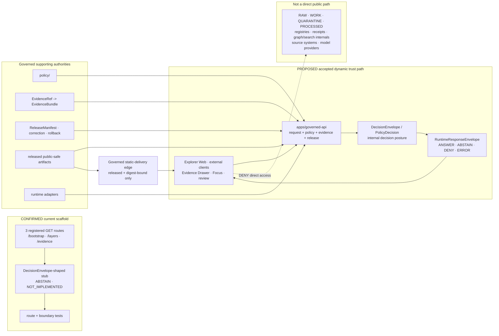

<!-- [KFM_META_BLOCK_V2]
doc_id: kfm://doc/adr-0004-apps-governed-api-trust-membrane
title: "ADR-0004 — `apps/governed-api/` is the Trust Membrane"
type: adr
adr_id: ADR-0004
version: v1.2
status: draft
owners:
  - "NEEDS VERIFICATION — architecture decision owner"
  - "NEEDS VERIFICATION — governed API owner"
  - "NEEDS VERIFICATION — security and policy owner"
reviewers_required:
  - Docs steward
  - Architecture steward
  - Governed API maintainer
  - Security / policy reviewer
  - Evidence / release reviewer
  - "at least one affected client or subsystem owner"
created: 2026-05-10
updated: 2026-07-23
policy_label: public
truth_posture: cite-or-abstain
responsibility_root: docs/
current_path: docs/adr/ADR-0004-apps-governed-api-is-the-trust-membrane.md
supersedes: []
superseded_by: null
evidence_snapshot:
  repository: bartytime4life/Kansas-Frontier-Matrix
  base_ref: main
  base_commit: 005aa64f6d42aa5961646e733289a2b857292357
  target_prior_blob: c9047d3dbf1d0a50d1bdd456cba0a137196e59f9
  directory_rules_blob: 2affb080e6f0043867c64c7f06c1ca52030fbd55
  adr_index_blob: cf08fae322ac53426f7394d97897fdb942253049
  apps_readme_blob: 7ab9c8b9c507d8d17b72eec1344e593cbf0c91ec
  governed_api_readme_blob: 4f21150852f133ba919b11f4f8792185fa870dae
  governed_api_main_blob: bcc8d3a0ddba4b225e962b594d548819df0cbb71
  governed_api_routes_blob: 3418168d0b267160d6ad6dd87f289e880ef4a024
  governed_api_stub_blob: 5d7c137d2e78ddfca35a1356a96333ac2e84952b
  governed_api_route_test_blob: 6474cef4f7378515ab673c288fc9daea19e388a9
  governed_api_boundary_test_blob: d84ccd2a93bdf786e8fca11ee596dcc47e543fc2
  api_workflow_blob: 5ec0ff53cc874935ed8ef5de791b70a52635ef33
  makefile_blob: 51537af34ee065c2de571134688415042b83b22a
  runtime_response_schema_blob: 5105d419432a27176a8ee10870d75400cfa2ab8c
  decision_envelope_schema_blob: 349782c8760f77e432ed1e9239d5ddc2ffe1f9b8
  runtime_response_contract_blob: b81d67dccdd8470e066ab8247eb93c5df67a6679
  decision_envelope_contract_blob: b5120a208910f5e2907874b03af1fc8c7f43363d
  runtime_response_validator_blob: 11ddc64c4299d103b0eef383c2f7bdd3bb12f1f9
  schema_validation_workflow_blob: e6b26337aa1eea142b96560e041419f855c44d59
  explorer_package_blob: ce981192e725483c747affb45ca3de36a22ce9ce
  codeowners_blob: dd2a84aa514d8ecd9208bc347f90f9a2ed37dd61
  apps_api_at_base: absent
related:
  - docs/adr/README.md
  - docs/adr/INDEX.md
  - docs/adr/ADR-0001-schema-home--schemas-contracts-v1-is-canonical.md
  - docs/adr/ADR-0002-contracts-vs-schemas-split.md
  - docs/adr/ADR-0003-policy-singular-is-canonical-(policies-is-compatibility).md
  - docs/adr/ADR-0005-apps-explorer-web-is-the-canonical-map-first-shell.md
  - docs/adr/ADR-0008-ollama-subordinate-to-governed-api.md
  - docs/adr/ADR-0010-deny-by-default-for-dna-rare-species-archaeology-infrastructure.md
  - docs/adr/ADR-0019-ai-adapter-contract-and-finite-envelopes.md
  - docs/adr/ADR-0020-abstain-is-a-first-class-decision.md
  - docs/adr/ADR-0025-public-client-never-reads-canonical-internal-stores.md
  - docs/doctrine/directory-rules.md
  - docs/doctrine/trust-membrane.md
  - docs/architecture/governed-api.md
  - apps/README.md
  - apps/governed-api/README.md
  - contracts/runtime/decision_envelope.md
  - contracts/runtime/runtime_response_envelope.md
  - schemas/contracts/v1/runtime/decision_envelope.schema.json
  - schemas/contracts/v1/runtime/runtime_response_envelope.schema.json
  - .github/workflows/api-test.yml
tags: [kfm, adr, governance, governed-api, trust-membrane, runtime-envelope, finite-outcomes, evidence, policy, release, no-parallel-api]
notes:
  - "v1.2 is a same-path repository-grounded modernization; it does not accept the decision or change executable behavior."
  - "ADR-0004 identity and tracked path are confirmed by docs/adr/INDEX.md; source metadata remains draft and effective decision status remains proposed."
  - "The current app is a bounded WSGI scaffold with three GET routes that return ABSTAIN / NOT_IMPLEMENTED. This is fail-closed behavior, not a complete trust membrane."
  - "The scaffolded routes are tested against a DecisionEnvelope-shaped subset, while the separate RuntimeResponseEnvelope contract and schema define the intended client-facing surface. Closing that integration gap is an acceptance blocker."
  - "A governed static-delivery edge for already released public-safe artifacts may complement the dynamic API, but it cannot become a second trust authority."
[/KFM_META_BLOCK_V2] -->

<a id="top"></a>

# ADR-0004 — `apps/governed-api/` is the Trust Membrane

> **Proposed decision.** KFM will use **`apps/governed-api/`** as the single dynamic public trust boundary for claim-bearing and trust-bearing responses. Ordinary clients will not read lifecycle, canonical, candidate, evidence-internal, model-runtime, graph, search, or release-internal stores directly. A separately governed static-delivery edge may serve already released public-safe artifacts, but it is not a second API, policy engine, or truth authority.

[](#1-status)
[](#11-current-repository-evidence-snapshot)
[](#61-current-scaffold-shape)
[](#62-decisionenvelope-vs-runtimeresponseenvelope)
[](../../.github/workflows/api-test.yml)
[](#33-authority-and-publication-boundary)
[](#11-current-repository-evidence-snapshot)

> [!IMPORTANT]
> **Repository configuration is not reviewed decision authority.** The repository already contains `apps/governed-api/`, three bounded routes, schemas, contracts, fixtures, validators, tests, and CI wiring. The canonical ADR index still records ADR-0004 as effectively `proposed`. This revision documents the current boundary without changing the ADR to `accepted`.

> [!CAUTION]
> **Fail-closed scaffolding is not a complete trust membrane.** The current routes return `ABSTAIN` with `NOT_IMPLEMENTED`; they do not resolve evidence, evaluate an accepted policy bundle, authorize a caller, bind a release, emit a client-facing `RuntimeResponseEnvelope`, or prove deployed isolation. No route may graduate to `ANSWER` merely because the WSGI app, schema validator, or smoke test is green.

<a id="quick-navigation"></a>

**Quick navigation:** [Status](#1-status) · [Context](#2-context) · [Decision](#3-decision) · [Diagram](#4-trust-membrane--diagram) · [Invariants](#5-operational-invariants) · [Envelope contract](#6-runtimeresponseenvelope-contract) · [Negative outcomes](#7-required-deny-cases) · [Surfaces](#8-affected-paths) · [`apps/api/`](#9-resolution-of-the-appsapi-question) · [Consequences](#10-consequences) · [Alternatives](#11-alternatives-considered) · [Migration](#12-migration--backward-compatibility) · [Validation](#13-validation--compliance) · [Related](#14-related-adrs-and-docs) · [Open work](#15-open-questions--needs-verification) · [Reason codes](#appendix-a--reason-code-vocabulary) · [Anti-patterns](#appendix-b--anti-patterns-this-adr-forbids)

---

## 1. Status

| Field | Current value |
|---|---|
| **ADR ID** | `ADR-0004` — unique and confirmed in the canonical [`INDEX.md`](./INDEX.md) |
| **Source metadata** | `draft` |
| **Effective decision status** | `proposed` — not binding as an accepted ADR until the record and index carry matching reviewed `accepted` status |
| **Decision class** | Public trust-boundary selection, no-parallel-public-API rule, dynamic response-envelope requirement, and public-client store isolation |
| **Tracked path** | `docs/adr/ADR-0004-apps-governed-api-is-the-trust-membrane.md` |
| **Current configured app** | [`apps/governed-api/`](../../apps/governed-api/) |
| **Current plural/parallel app state** | Exact `apps/api/` path absent at the pinned snapshot |
| **Current implementation posture** | Minimal executable WSGI scaffold; three GET routes; fail-closed `ABSTAIN`; bounded structural tests; no proved production trust flow |
| **Decision dependencies** | Evidence, policy, release/correction, finite-outcome contracts, client integration, static-delivery governance, security, observability, and rollback |
| **Publication effect** | None. This ADR, a route, schema, test, workflow, commit, pull request, or merge is not a release or publication decision. |

### 1.1 Current repository evidence snapshot

The following findings are **CONFIRMED at `main@005aa64f6d42aa5961646e733289a2b857292357`** unless marked otherwise.

| Surface | Verified state | What it proves—and does not prove |
|---|---|---|
| [`docs/adr/INDEX.md`](./INDEX.md) | ADR-0004 is the unique tracked record for this decision; effective status is `proposed`; source metadata is `draft`. | Proves identity and conservative status normalization; does not accept the decision. |
| [Directory Rules](../doctrine/directory-rules.md) | `apps/` is the deployable root; `apps/governed-api/` is named as the main public trust path; `apps/api/`, if present, must not be a parallel public authority. | Proves placement doctrine and intended app roles; does not prove runtime enforcement. |
| [`apps/README.md`](../../apps/README.md) | Current root inventory records seven app lanes and 27 tracked files in the Governed API lane. Direct current reads confirm the WSGI entry point, route registry, stub, and two test modules. | Proves bounded repository structure; not deployment, auth, policy, or release maturity. |
| [`apps/governed-api/README.md`](../../apps/governed-api/README.md) | Documents the trust-membrane role and explicitly bounds route, middleware, auth, deployment, and CI maturity. | Proves app-level intent and responsibility boundary; not accepted architecture or working production behavior. |
| [`main.py`](../../apps/governed-api/src/governed_api/main.py) | Small WSGI app dispatches registered GET routes, returns `405` for unsupported methods on registered paths, and `404` for unknown paths. | Proves bounded dispatch behavior; not authentication, authorization, evidence resolution, policy evaluation, or network isolation. |
| [`routes/registry.py`](../../apps/governed-api/src/governed_api/routes/registry.py) | Exactly three routes are registered: `/bootstrap`, `/layers`, `/evidence`. | Proves current surface manifest; not full endpoint catalogue or versioned public API. |
| [`stub.py`](../../apps/governed-api/src/governed_api/stub.py) | Every registered route returns a deterministic-shape `ABSTAIN` object with `NOT_IMPLEMENTED`, empty evidence refs, and a zero SHA-256 placeholder. | Proves fail-closed scaffolding; not a valid evidence-backed answer, accepted digest, or release-bound response. |
| [`test_abstain_routes.py`](../../apps/governed-api/tests/test_abstain_routes.py) | Iterates all registered routes, expects `200 OK`, `ABSTAIN`, `NOT_IMPLEMENTED`, empty evidence refs, fixed time, and a subset check against `decision_envelope.schema.json`. | Proves the current scaffold's bounded negative posture; it does not validate the separate client-facing RuntimeResponseEnvelope schema. |
| [`test_boundary_guards.py`](../../apps/governed-api/tests/test_boundary_guards.py) | Checks unknown-route `404`, unsupported-method `405`, forbidden renderer/model imports, exact three-route manifest, and absence of hard-coded internal-store literals in API source. | Proves selected structural boundaries; not complete information-flow, auth, policy, deployment, or exfiltration proof. |
| [`Makefile`](../../Makefile) | Provides `governed-api-dev`, `governed-api-smoke`, `governed-api-verify`, and cross-root `boundary-guards`; `deny-test` remains a readiness marker that prints a pending command. | Proves command-bearing bounded checks and an explicitly incomplete deny suite. |
| [`api-test.yml`](../../.github/workflows/api-test.yml) | Runs the API smoke suite and the focused scaffolded-route contract test with read-only contents permission. | Proves CI orchestration exists; no current run result, release approval, or deployment evidence is inferred here. |
| [`RuntimeResponseEnvelope` schema](../../schemas/contracts/v1/runtime/runtime_response_envelope.schema.json) | Separate proposed client-facing schema requires `id`, digest, version, time, finite outcome, reason, EvidenceRef objects, policy state, freshness, and correction state. | Proves a machine-shape proposal and aggregate fixture coverage; not app integration. |
| [`DecisionEnvelope` schema](../../schemas/contracts/v1/runtime/decision_envelope.schema.json) | Separate proposed decision schema requires decision identity, outcome, policy family, reasons, obligations, and evaluation time. | Proves a distinct machine-shape proposal used by the scaffold test; not a public response envelope. |
| [`schema-validation.yml`](../../.github/workflows/schema-validation.yml) | Configures both runtime schemas, paired fixture roots, and dedicated validators among six aggregate families. | Proves shape-validation wiring; not semantic agreement, runtime mapping, policy correctness, or release safety. |
| [`apps/explorer-web/package.json`](../../apps/explorer-web/package.json) | `dev`, `build`, and `test` scripts still print pending markers. | No functional normal public client or governed-client integration is established. |
| Exact `apps/api/` path | Contents lookup returned `404 Not Found`. | Proves no parallel app exists at this snapshot; not a permanent guarantee. |
| [`CODEOWNERS`](../../.github/CODEOWNERS) | Routes `/docs/adr/`, `/apps/governed-api/`, schemas, policy, release, tests, and validators to `@bartytime4life`. | Proves GitHub review routing; not stewardship assignment, independent approval, or acceptance. |
| Production exposure, auth, audit sink, dashboards, service health, rate limits, and network isolation | **UNKNOWN / NEEDS VERIFICATION** | No admissible operational evidence was inspected. |

### 1.2 Safe current conclusion

The repository has a **real but intentionally narrow fail-closed API scaffold**. It is stronger than documentation-only intent and weaker than an accepted, production-capable trust membrane.

The safe claim is:

> `apps/governed-api/` currently demonstrates route registration, finite negative behavior, selected import/path boundaries, and schema-adjacent CI. Evidence resolution, accepted policy evaluation, release binding, client-facing RuntimeResponseEnvelope integration, authentication, authorization, observability, deployed isolation, and substantive `ANSWER` behavior remain unproved.

[Back to top](#top)

---

## 2. Context

KFM's governing lifecycle remains:

```text
RAW -> WORK / QUARANTINE -> PROCESSED -> CATALOG / TRIPLET -> PUBLISHED
```

Promotion is a governed state transition, not a file move. Public trust must therefore be enforced at the point where released state becomes a response, map payload, export, story, review projection, or AI-assisted explanation.

### 2.1 Why a dedicated dynamic membrane is required

Without one accountable dynamic boundary:

- public clients can accidentally become readers of canonical or lifecycle stores;
- evidence resolution, source role, policy, rights, sensitivity, freshness, release, correction, and rollback checks fragment by client or route;
- generated language can be rendered before evidence and citation closure;
- `ABSTAIN`, `DENY`, and `ERROR` can be hidden as empty or partial success;
- review, CLI, admin, and worker conveniences can harden into unreviewed public paths;
- two public API deployables can evolve different denial vocabularies and audit trails;
- a renderer, graph, search index, object store, or model runtime can become a de facto source of truth.

### 2.2 Dynamic API and governed static delivery are different concerns

This ADR governs the **dynamic trust boundary**. It does not require every immutable public-safe byte to be proxied through the WSGI process.

| Surface | Allowed posture | Trust requirement |
|---|---|---|
| Dynamic claim-bearing or trust-bearing request | `apps/governed-api/` | Finite response envelope, policy/evidence/release checks, safe errors, auditability |
| Static PMTiles, COG, GeoParquet, report, story, JSON sidecar, or other released artifact | Governed static-delivery edge MAY serve it | Release manifest, digest/integrity metadata, public-safe classification, correction/rollback references, no hidden internal path |
| Canonical, candidate, internal, model-runtime, graph, search, source, or lifecycle store | Direct public read is forbidden | Governed projection or explicit denial |
| Review/admin/operator request | Governed and role-gated route | Authentication, authorization, audit, no self-approval, no direct browser file mutation |

A static edge is a delivery mechanism, not a second policy substrate or public API authority. The membrane is operational: the artifact must already be released and verifiable.

### 2.3 Relationship to adjacent decisions

This ADR answers **where dynamic public trust is enforced**. Adjacent proposed ADRs answer narrower questions:

- ADR-0005 identifies Explorer Web as the map-first client.
- ADR-0008 and ADR-0019 place model runtimes and adapters behind the API.
- ADR-0010 establishes deny-by-default sensitive-domain posture.
- ADR-0020 makes abstention first-class.
- ADR-0025 forbids public clients from reading canonical/internal stores and permits a governed static edge for released artifacts.

All remain proposed; this ADR does not grant them accepted status.

[Back to top](#top)

---

## 3. Decision

**If accepted, KFM adopts the following rules.**

### 3.1 Dynamic trust-boundary rule

1. **Single dynamic public membrane.** `apps/governed-api/` is the sole normal dynamic boundary for public and semi-public trust-bearing responses.
2. **Ordinary clients use governed interfaces.** Explorer Web, external API consumers, Evidence Drawer, Focus Mode, Story/Compare/Export surfaces, and role-gated review retrieval do not read internal stores or model providers directly.
3. **Finite client-facing envelope.** Every dynamic trust-bearing public response is represented by a `RuntimeResponseEnvelope` with exactly one outcome: `ANSWER`, `ABSTAIN`, `DENY`, or `ERROR`.
4. **Decision objects stay distinct.** A `DecisionEnvelope` or `PolicyDecision` may feed the public response, but neither silently substitutes for the client-facing `RuntimeResponseEnvelope`.
5. **Evidence before answer.** Claim-bearing `ANSWER` responses require resolvable evidence support and citations appropriate to the claim. Missing or inadequate support yields `ABSTAIN`, `DENY`, or `ERROR`.
6. **Policy before exposure.** Rights, sensitivity, source terms, caller role, release state, freshness, correction, withdrawal, and rollback posture are evaluated before the response is exposed.
7. **Released state only.** Dynamic public reads project released public-safe state and governed proof/release metadata. They do not expose RAW, WORK, QUARANTINE, PROCESSED, candidate, registry-internal, receipt-internal, graph-internal, search-internal, or direct source-system records.
8. **No direct model client.** Browsers and ordinary clients do not call Ollama, OpenAI-compatible services, local model runtimes, embedding/vector services, or model caches directly.
9. **No direct renderer authority.** MapLibre, tiles, scenes, screenshots, popups, and client feature state are downstream carriers. They do not authorize release or substitute for evidence.
10. **Review/admin/operator boundaries remain governed.** Role-gated clients may have broader projections or submit actions, but they remain audited, policy-bound, separation-of-duties aware, and outside the normal public path.
11. **Workers remain non-publishers.** Workers, connectors, and pipelines produce candidates, receipts, validation outputs, and release inputs; they do not speak directly to ordinary public clients or approve publication.
12. **App boundary is non-sovereign.** `apps/governed-api/` applies contracts, schemas, policy, evidence, and release state from their owning roots; it does not redefine or own those authorities.

### 3.2 Governed static-delivery rule

A static edge MAY serve a released public-safe artifact without proxying all bytes through `apps/governed-api/` when all of the following are true:

- a governed release record identifies the artifact;
- integrity metadata identifies the exact bytes or representation;
- public-safe rights and sensitivity posture are resolved;
- release, correction, withdrawal, supersession, and rollback state are available;
- client or edge behavior does not infer trust from location alone;
- no canonical, candidate, internal, protected, or direct model/source path is exposed;
- the edge cannot mint dynamic decisions or bypass policy.

### 3.3 Authority and publication boundary

`apps/governed-api/`:

- **does own** app-local route dispatch, request handling, response construction, app-local guards, app-local tests, and deployable composition;
- **does not own** object meaning, machine shape, policy source, evidence, canonical lifecycle state, release approval, correction approval, rollback authority, source admission, shared reusable libraries, deployment secrets, or publication state.

A successful response, test, deployment, or uptime check does not promote data or authorize release.

### 3.4 Current scaffold rule

Until the acceptance gates in §13.2 are closed:

- the three registered routes SHOULD remain fail-closed;
- a route MAY return a schema-valid `ABSTAIN`/`NOT_IMPLEMENTED` hold;
- no route may return a substantive `ANSWER` merely because a fixture, subset assertion, or smoke test passes;
- replacing the scaffold with a real handler requires contract/schema mapping, negative tests, and rollback in the same bounded change.

> [!IMPORTANT]
> The safest current implementation is the one the repository already uses: explicit `ABSTAIN` rather than invented or weakly supported success. This ADR treats that behavior as a valid hold state, not as feature completion.

[Back to top](#top)

---

## 4. Trust Membrane — Diagram



> [!NOTE]
> The current and target lanes are intentionally separate. Existing scaffold tests prove a bounded hold state. They do not prove the complete target flow. The static edge carries released bytes; it does not emit dynamic policy or evidence decisions.

[Back to top](#top)

---

## 5. Operational Invariants

| ID | Invariant | Current evidence posture |
|---|---|---|
| **I-1** | `apps/governed-api/` is the only normal dynamic public trust-bearing API. | Directory Rules + repository path CONFIRMED; ADR acceptance proposed |
| **I-2** | Dynamic client-facing trust responses use `RuntimeResponseEnvelope` with exactly `ANSWER`, `ABSTAIN`, `DENY`, or `ERROR`. | Contract/schema CONFIRMED present and PROPOSED; app integration partial |
| **I-3** | `DecisionEnvelope` remains a distinct internal/runtime decision object and is not treated as the public response object without an explicit accepted mapping. | Two contracts/schemas CONFIRMED distinct; current scaffold uses decision shape |
| **I-4** | Public clients do not read lifecycle, candidate, canonical, receipt-internal, proof-internal, registry-internal, graph, search, source, or model-runtime stores directly. | Doctrine + selected static tests CONFIRMED; complete flow proof absent |
| **I-5** | Claim-bearing `ANSWER` requires resolvable evidence support and validated citations appropriate to the claim. | Doctrine/contract present; no current `ANSWER` route |
| **I-6** | Rights, sensitivity, caller role, source terms, release, freshness, correction, withdrawal, and rollback posture are enforced before exposure. | Intended contract present; accepted evaluator/integration unproved |
| **I-7** | `ABSTAIN`, `DENY`, and `ERROR` are first-class governed outcomes, not hidden exceptions or empty success. | Current route ABSTAIN behavior CONFIRMED |
| **I-8** | `ERROR` responses do not expose prompts, credentials, private endpoints, stack traces, internal file paths, restricted detail, or hidden reasoning. | Required posture; representative implementation test absent |
| **I-9** | Model adapters and providers remain behind the membrane; browser/provider direct traffic is forbidden. | Import guard exists; network/deployment isolation unproved |
| **I-10** | Static delivery is allowed only for already released public-safe, integrity-bound artifacts with correction/rollback visibility. | Adjacent ADR/doctrine proposal; static edge implementation unproved |
| **I-11** | Review, admin, and operator paths are role-gated, audited, and cannot approve their own policy-significant release effects. | Doctrine; current review/admin surfaces are scaffolded or unproved |
| **I-12** | Workers, connectors, and pipelines are non-publishers and cannot become alternate public APIs. | Repository static tests CONFIRMED; complete runtime proof absent |
| **I-13** | The app consumes contracts, schemas, policy, evidence, and release state; it does not redefine their authority. | Responsibility-root documentation and current structure CONFIRMED |
| **I-14** | Every substantive route change has deterministic negative cases and a reversible rollback or forward-fix path. | Required acceptance posture; current routes remain stubs |
| **I-15** | A green workflow, commit, PR, route, static edge, or deployed process does not make content KFM-published. | KFM core invariant |

[Back to top](#top)

---

## 6. `RuntimeResponseEnvelope` Contract

The public response and internal decision surfaces are related but not interchangeable.

### 6.1 Current scaffold shape

The current stub emits a `DecisionEnvelope`-shaped hold object. For `/layers`, the effective shape is:

```json
{
  "id": "stub:layers",
  "decision_id": "stub:layers",
  "spec_hash": "sha256:0000000000000000000000000000000000000000000000000000000000000000",
  "version": "v1-stub",
  "issued_at": "<time>",
  "evaluated_at": "<time>",
  "decision": "ABSTAIN",
  "outcome": "ABSTAIN",
  "policy_family": "capability",
  "reason_code": "NOT_IMPLEMENTED",
  "reasons": ["Route is scaffolded but not implemented"],
  "obligations": [],
  "evidence_refs": []
}
```

The current route test checks this object against `decision_envelope.schema.json` through `assert_jsonschema_subset`.

This is a bounded hold object. It is not evidence closure and is not the same field surface as the client-facing runtime schema.

### 6.2 `DecisionEnvelope` vs `RuntimeResponseEnvelope`

| Concern | `DecisionEnvelope` | `RuntimeResponseEnvelope` |
|---|---|---|
| Primary role | Records finite runtime decision posture, policy family, reasons, obligations, and evaluation time | Carries client-facing finite response posture, evidence refs, policy state, freshness, and correction state |
| Required identity | `decision_id` | `id` |
| Required finite field | `outcome` | `outcome` |
| Required policy context | `policy_family` | `policy_state` |
| Required explanation | `reasons`, `obligations` | `reason_code`; state fields |
| Required time | `evaluated_at` | `issued_at` |
| Evidence shape | Optional array of strings | Required array of EvidenceRef objects |
| Freshness/correction | Not required | `freshness` and `correction_state` required |
| Current app use | Scaffold test target | Not yet the route test target |
| Authority status | Contract/schema present; proposed | Contract/schema present; proposed |

### 6.3 Current integration gap

Direct comparison establishes a material gap:

- the current stub includes decision-specific fields that the RuntimeResponseEnvelope schema does not admit;
- the current stub omits RuntimeResponseEnvelope-required `policy_state`, `freshness`, and `correction_state`;
- the route test selects the DecisionEnvelope schema, not the RuntimeResponseEnvelope schema;
- the API README describes the intended RuntimeResponseEnvelope boundary, but the implementation remains a decision-shaped scaffold.

This is not a reason to weaken either schema. It is an acceptance blocker requiring a deliberate mapping or wrapper contract.

### 6.4 Required mapping before substantive `ANSWER`

Before any route graduates from scaffolded `ABSTAIN` to substantive `ANSWER`, the implementation MUST establish and test this relationship:

```text
request context
  -> authorization + policy + evidence + release/freshness/correction evaluation
  -> DecisionEnvelope and/or PolicyDecision
  -> endpoint payload projection
  -> RuntimeResponseEnvelope
  -> client
```

The accepted mapping must answer:

- which decision fields are preserved, transformed, or referenced;
- how obligations reach the client without leaking protected policy detail;
- how EvidenceRef objects are resolved and represented;
- how release, freshness, correction, withdrawal, and rollback state are encoded;
- how endpoint-specific payloads are represented without reopening `additionalProperties`;
- how `ANSWER` differs from non-claim bootstrap/config responses;
- how schema versions and compatibility are negotiated;
- how invalid or unmapped internal decisions fail closed.

### 6.5 Minimum client-facing semantics

The current RuntimeResponseEnvelope schema confirms these required fields:

| Field | Current machine-shape role |
|---|---|
| `id` | Response identity |
| `spec_hash` | SHA-256 contract/spec lineage hook |
| `version` | Envelope version |
| `issued_at` | Emission time |
| `outcome` | `ANSWER`, `ABSTAIN`, `DENY`, or `ERROR` |
| `reason_code` | Safe primary reason |
| `evidence_refs` | EvidenceRef objects |
| `policy_state` | Policy-state summary |
| `freshness` | Freshness/staleness posture |
| `correction_state` | Correction/withdrawal/supersession posture |

The schema closes additional properties. Endpoint payload representation therefore needs an explicit contract decision; it must not be smuggled in through undocumented fields.

> [!WARNING]
> A route that returns the current decision-shaped stub and labels it a `RuntimeResponseEnvelope` would erase a real object-family boundary. A route that adds arbitrary payload fields would violate the closed schema. Resolve the contract; do not rename around it.

[Back to top](#top)

---

## 7. Required Deny Cases

This heading retains the original anchor, but the table distinguishes `DENY`, `ABSTAIN`, `ERROR`, and transport responses accurately.

### 7.1 Minimum negative behavior

| Trigger | Required outcome | Current coverage |
|---|---|---|
| Unknown route | `404 Not Found` with safe body | **CONFIRMED** |
| Unsupported method on a registered route | `405 Method Not Allowed` with safe body | **CONFIRMED** |
| Registered route not implemented | Schema-bounded `ABSTAIN` / `NOT_IMPLEMENTED` | **CONFIRMED for current decision-shaped stub** |
| Governed API imports renderer or direct model client | Test/build failure | **CONFIRMED bounded import guard** |
| API or Explorer source hard-codes internal lifecycle/store paths | Test/build failure | **CONFIRMED bounded literal scan** |
| Public request targets RAW, WORK, QUARANTINE, PROCESSED, candidate, registry-internal, receipt-internal, graph/search internal, direct source, or model provider | `DENY` with safe reason; never accidental filesystem error | **PROPOSED / not fully implemented** |
| Evidence cannot resolve or citations cannot validate | `ABSTAIN` | **PROPOSED beyond scaffold hold** |
| Rights, sensitivity, source terms, caller role, release state, or embargo blocks exposure | `DENY` or reviewed restricted projection | **PROPOSED / policy integration unproved** |
| Source is stale beyond endpoint policy | `ABSTAIN` or stale-safe bounded response according to accepted contract | **PROPOSED** |
| Adapter, resolver, schema, policy, or dependency fails | `ERROR` with safe audit reference and no internal leakage | **PROPOSED** |
| Exact protected archaeology, rare-species, living-person, DNA/genomic, cultural, or critical-infrastructure detail requested | `DENY` or approved transformed/restricted projection | **PROPOSED / domain policy required** |
| Unreleased layer or artifact requested | `DENY` | **PROPOSED / release integration unproved** |
| Model candidate or generated text is presented as observation/evidence | `DENY` or `ABSTAIN` | **PROPOSED** |
| Browser attempts direct model/provider call | Build/test/network denial | **Static import posture partly confirmed; deployed network denial unproved** |
| Review/admin/CLI request attempts direct file mutation or self-approval | `DENY` plus audit-safe record | **PROPOSED** |
| Static edge serves missing-digest, withdrawn, corrected-without-lineage, or non-public-safe artifact | Edge/client verification failure; do not render as trusted | **PROPOSED** |
| Empty or unsupported payload is labeled `ANSWER` | Schema/semantic test failure | **PROPOSED** |

### 7.2 Current bounded tests are necessary but insufficient

The current checks establish route, method, import, route-manifest, and path-literal boundaries. They do not prove:

- identity or authentication;
- role/capability authorization;
- accepted policy bundle execution;
- evidence resolution or citation validation;
- release/correction/rollback integration;
- response confidentiality or timing behavior;
- dependency egress or provider isolation;
- logging/redaction;
- static-edge integrity verification;
- deployment, ingress, CORS, CSP, rate-limit, or cache policy;
- complete deny/abstain/error coverage.

The `make deny-test` target remains an explicit readiness marker rather than an implemented suite.

[Back to top](#top)

---

## 8. Affected Paths

This documentation change modifies only this ADR. The surfaces below are the verified implementation and authority neighborhood affected by eventual acceptance.

### 8.1 Current verified surfaces

| Surface | Current role | Current status | Decision impact |
|---|---|---|---|
| [`apps/governed-api/`](../../apps/governed-api/) | Dynamic trust-membrane deployable | Minimal executable scaffold | Canonical dynamic app if ADR is accepted |
| [`apps/governed-api/src/governed_api/main.py`](../../apps/governed-api/src/governed_api/main.py) | WSGI dispatch | Executable bounded behavior | Preserve safe 404/405 and add accepted middleware/route composition incrementally |
| [`routes/registry.py`](../../apps/governed-api/src/governed_api/routes/registry.py) | Route manifest | Three routes | Route additions require contract/policy/evidence/negative-test closure |
| [`stub.py`](../../apps/governed-api/src/governed_api/stub.py) | Fail-closed route hold | `ABSTAIN/NOT_IMPLEMENTED` | Safe rollback baseline; not production response contract |
| [`apps/governed-api/tests/`](../../apps/governed-api/tests/) | App-local route/boundary proof | Two bounded modules | Expand without replacing cross-root tests |
| [`apps/explorer-web/`](../../apps/explorer-web/) | Normal public client | Placeholder package scripts | Future governed client must consume accepted response/static contracts only |
| [`apps/review-console/`](../../apps/review-console/) | Role-gated review client | Documentation/scaffold maturity | Must not read or mutate receipt/report/diff files directly |
| [`contracts/runtime/`](../../contracts/runtime/) | Decision and response meaning | Both contracts present, proposed | Preserve distinct object meanings and define mapping |
| [`schemas/contracts/v1/runtime/`](../../schemas/contracts/v1/runtime/) | Machine shape | Both schemas present, proposed | Preserve closed shapes; version deliberate changes |
| [`fixtures/contracts/v1/runtime/`](../../fixtures/contracts/v1/runtime/) | Positive/negative schema examples | Minimal coverage | Expand outcome, evidence, additional-property, and state cases |
| [`tools/validators/`](../../tools/validators/) | Dedicated shape validators | Runtime validators present and aggregate-wired | Shape validation only; never substitute for policy/evidence/runtime proof |
| [`policy/runtime/`](../../policy/runtime/) | Runtime admissibility | Policy root exists; accepted evaluator/bundle unproved | Required before substantive trust decisions |
| [`packages/evidence-resolver/`](../../packages/evidence-resolver/) | Shared evidence resolution boundary | Maturity NEEDS VERIFICATION | Required for claim-bearing `ANSWER` |
| [`runtime/`](../../runtime/) | Adapters behind API | Maturity NEEDS VERIFICATION | Provider/model details must not cross public boundary |
| [`release/`](../../release/) | Release, correction, withdrawal, rollback authority | Separate root present | API consumes state; does not approve it |
| [`api-test.yml`](../../.github/workflows/api-test.yml) | Bounded CI orchestration | Command-bearing | Keep read-only; expand representative checks deliberately |
| [`schema-validation.yml`](../../.github/workflows/schema-validation.yml) | Shape/fixture CI | Both runtime families configured | Does not prove mapping or runtime behavior |
| [`docs/architecture/governed-api.md`](../architecture/governed-api.md) | Architecture explainer | Present but implementation-depth language is stale | Follow-up documentation candidate, not changed here |
| `apps/api/` | Potential parallel API | Absent at snapshot | No migration required now; future creation is governed by §9 |

### 8.2 Required implementation packet for the first substantive route

The smallest sound implementation packet SHOULD include:

- one route family and one bounded public-safe use case;
- explicit request and response contracts;
- DecisionEnvelope/PolicyDecision to RuntimeResponseEnvelope mapping;
- valid and invalid fixtures for both internal decision and public response;
- no-network evidence/resolver fixture or mock;
- policy allow/deny/abstain/error cases;
- release/freshness/correction fixture state;
- app-local and cross-root negative tests;
- safe logging and audit reference behavior;
- client or static-edge integration test as applicable;
- rollback to the `ABSTAIN/NOT_IMPLEMENTED` handler;
- docs updated to match verified behavior.

Do not implement all route families in one broad PR.

[Back to top](#top)

---

## 9. Resolution of the `apps/api/` Question

The exact `apps/api/` path is absent at the pinned snapshot. No current migration or deprecation record is required solely for a path that is not present.

If `apps/api/` is introduced or discovered later:

| Condition | Required disposition |
|---|---|
| It serves dynamic public trust traffic | **DENY architecture change** unless a new accepted ADR replaces this decision |
| It is a frozen legacy path | Declare `legacy`, identify canonical replacement, forbid new public routes, and track retirement |
| It is a generated mirror or external export | Declare class and deterministic source; it cannot execute independent policy or decisions |
| It is internal-only | Document exact caller, network boundary, auth, data access, and why it is not a parallel public membrane |
| It is a narrowly scoped service | Prove that it does not mint public trust outcomes, bypass the Governed API, or become a second denial/audit surface |
| It is only a static artifact host | Treat it as governed static delivery, not an API authority; use a name and contract that do not imply parallel dynamic policy |
| Hyphen/underscore naming differs | Do not create both `governed-api` and `governed_api`; use a reviewed migration if renaming is necessary |

> [!WARNING]
> Route-prefix separation is not architectural separation. Two public deployables that each decide evidence, policy, release, or denial posture create two membranes, even when they use different URL prefixes.

[Back to top](#top)

---

## 10. Consequences

### 10.1 Positive

- **One accountable dynamic boundary.** Evidence, policy, release, freshness, correction, and safe-error behavior converge in one deployable.
- **Current fail-closed work is preserved.** The existing `ABSTAIN/NOT_IMPLEMENTED` scaffold remains a valid hold and rollback baseline.
- **Object-family boundaries become visible.** Internal decisions and client-facing responses remain distinct rather than being renamed into one another.
- **Cite-or-abstain becomes operational.** Missing support is a typed outcome, not an empty success.
- **Client and model paths remain subordinate.** Explorer Web, review surfaces, static delivery, and model adapters cannot silently become truth or policy authority.
- **Static delivery stays efficient without weakening governance.** Already released public-safe bytes may use a verified edge without creating a parallel dynamic API.
- **Review and rollback become testable.** A substantive route can be introduced as a small packet with a known fail-closed fallback.

### 10.2 Costs and tradeoffs

- **More explicit contracts.** The repository must resolve the DecisionEnvelope/RuntimeResponseEnvelope relationship instead of relying on one permissive JSON object.
- **Additional response metadata and validation.** Evidence, state, and audit fields add latency, payload, and implementation cost.
- **More negative testing.** Success-path coverage is insufficient; each route needs abstain, deny, error, stale, correction, and leak-safe cases.
- **Cross-root review burden.** Material changes touch app, contract, schema, policy, evidence, release, tests, security, and clients.
- **Static-edge verification work.** Efficient direct artifact delivery still needs digest, release, correction, and rollback support.
- **No convenience bypass.** Direct file/database/model reads and app-local policy shortcuts remain unavailable even during early development.
- **Acceptance cannot be inferred from implementation.** The repository may continue to use the scaffold while the ADR remains proposed.

### 10.3 Risks if the decision is not accepted or enforced

- the scaffold may evolve into ad-hoc route JSON without a client-facing contract;
- public clients may bypass the app or read released/internal stores without release/correction context;
- static artifact hosting may be mistaken for publication authority;
- DecisionEnvelope and RuntimeResponseEnvelope may drift or collapse;
- different clients may interpret `ABSTAIN`, `DENY`, and `ERROR` differently;
- model, graph, search, or renderer shortcuts may become public truth paths;
- review/admin routes may become self-approving mutation surfaces;
- a green smoke test may be cited as production or release readiness.

[Back to top](#top)

---

## 11. Alternatives Considered

<details>
<summary>Expand alternatives and disposition</summary>

| Alternative | Benefit | Why rejected |
|---|---|---|
| Keep the current scaffold indefinitely without accepting a target architecture | Lowest immediate implementation cost | A safe hold is valuable, but it does not define how substantive routes, evidence, policy, release, clients, and static edges converge |
| Let every app enforce its own trust rules | Local autonomy | The weakest app becomes the public boundary; denial vocabulary, evidence, and audit semantics drift |
| Use a shared `packages/` helper as the membrane | Reuse across apps | A library can be bypassed or imported inconsistently; it supports the membrane but is not the deployable boundary |
| Put the membrane in Explorer Web | Convenient for the map client | External clients bypass it; UI/rendering is not policy or release authority |
| Keep `apps/api/` and `apps/governed-api/` as public siblings | Route specialization | Creates parallel policy, evidence, denial, and audit surfaces |
| Use a reverse proxy, API gateway, or WAF as the entire membrane | Strong transport/exposure controls | Infrastructure cannot resolve EvidenceBundles, apply KFM semantic outcomes, or bind correction/release state by itself |
| Serve all static bytes through the WSGI app | Simple conceptual rule | Unnecessary bottleneck; a governed static edge is safe when release/integrity/correction requirements are met |
| Use static artifacts only and remove dynamic API | Efficient delivery | Cannot support governed evidence resolution, role-aware review, bounded AI, corrections, or dynamic finite outcomes |
| Expose model runtime directly | Fast AI integration | Bypasses evidence, policy, citation, release, provider-neutrality, and safe-error boundaries |
| Treat the current DecisionEnvelope stub as the permanent public response contract | Avoid mapping work | Erases the distinct RuntimeResponseEnvelope contract and omits freshness/correction/client-response semantics |
| Make RuntimeResponseEnvelope permissive enough to accept the current stub and arbitrary payloads | Easy migration | Weakens closed-schema governance and hides object-family drift |
| Per-domain public APIs | Domain ownership | Multiplies public membranes and makes cross-domain policy/evidence consistency harder |
| Defer all decisions until production | Avoid premature architecture | By then routes, clients, and data paths may already have hardened into competing authorities |

</details>

[Back to top](#top)

---

## 12. Migration & Backward Compatibility

Migration is incremental. This ADR does not authorize a broad rewrite or require changing the current safe scaffold in the documentation PR.

### 12.1 Phase 0 — preserve the fail-closed baseline

- Keep `/bootstrap`, `/layers`, and `/evidence` returning bounded `ABSTAIN/NOT_IMPLEMENTED`.
- Preserve `404`, `405`, route-manifest, import-boundary, and path-literal tests.
- Preserve the current route registry as the rollback surface.
- Do not introduce live sources, model calls, public credentials, or deployment secrets.

### 12.2 Phase 1 — resolve the internal/public envelope relationship

- Review `DecisionEnvelope` and `RuntimeResponseEnvelope` contracts and schemas together.
- Decide whether the public envelope references or embeds a decision, and how obligations/reasons are represented.
- Define endpoint payload representation under the closed RuntimeResponseEnvelope schema.
- Add reciprocal contract notes, fixtures, validators, and mapping tests.
- Keep both object families distinct unless a successor ADR explicitly changes their meaning.

### 12.3 Phase 2 — add no-network governed dependencies

- Introduce accepted interfaces or mocks for policy, evidence, release/correction, and audit.
- Use deterministic public-safe fixtures.
- Prove `ANSWER`, `ABSTAIN`, `DENY`, and `ERROR` without external services.
- Add safe reason/obligation vocabularies or registry references.

### 12.4 Phase 3 — graduate one route

Choose one bounded route, preferably a public-safe released layer descriptor or bootstrap posture that does not require AI or sensitive geometry.

The route PR must include:

- request and response shape;
- internal-to-public envelope mapping;
- evidence/release/policy fixtures;
- negative tests;
- no-leak behavior;
- client or consumer contract;
- metrics/audit posture;
- rollback to the stub.

### 12.5 Phase 4 — integrate the normal client

- Replace Explorer Web placeholder scripts with a pinned, reproducible build only when a real slice exists.
- Centralize dynamic trust calls through a governed client.
- Verify released static artifacts before rendering.
- Render all four finite outcomes as distinct UI states.
- Do not treat popup text or tile properties as evidence.

### 12.6 Phase 5 — add review, export, and AI surfaces

- Add review retrieval with role, audit, and no-direct-file-mutation tests.
- Add exports with citation/release/correction metadata.
- Add model adapters only behind the API and only after evidence/citation/policy/receipt gates.
- Keep providers replaceable and client-invisible.

### 12.7 Phase 6 — deployment and operational hardening

- Verify ingress, auth, CORS, CSP, rate limits, egress, secret handling, cache policy, and static-edge integrity.
- Add redacted logs, metrics, tracing, alerting, and audit joins.
- Perform rollback and correction drills.
- Record required checks, review controls, and separation-of-duties enforcement.

### 12.8 Backward compatibility

- Existing route paths MAY be retained while handler semantics become versioned.
- The current `ABSTAIN/NOT_IMPLEMENTED` object is a scaffold compatibility surface, not an accepted public v1 response.
- A substantive envelope change requires an explicit version transition and client compatibility test.
- Static artifact URLs MAY remain stable when the release/integrity metadata remains verifiable and correction/rollback state is propagated.
- No compatibility alias may bypass the membrane or become a second dynamic authority.

### 12.9 Rollback

**Documentation rollback:** restore prior ADR blob `c9047d3dbf1d0a50d1bdd456cba0a137196e59f9`.

**Runtime rollback target:** the current route registry and `make_abstain_envelope()` scaffold.

For each substantive route migration:

1. retain or be able to restore the prior stub handler;
2. disable the new handler by a reviewed reversible selection mechanism;
3. invalidate any unsafe cache or static pointer;
4. preserve audit and correction history;
5. record a rollback or forward-fix artifact in the accepted migration/release home;
6. do not restore direct-store or direct-model access as a workaround.

[Back to top](#top)

---

## 13. Validation & Compliance

### 13.1 Current repository-native checks

| Check | Current command/surface | Current proof boundary |
|---|---|---|
| Governed API smoke | `make governed-api-smoke` | Runs app-local tests for the current scaffold |
| Governed API import boundary | `make governed-api-verify` | Runs tests and rejects direct MapLibre/Cesium/Ollama imports in the app |
| Cross-root boundary guards | `make boundary-guards` | Checks selected Explorer/API store literals and connector/pipeline non-publisher boundaries |
| Runtime schema/fixture validation | `make schemas`; `schema-validation` workflow | Validates configured schema families and fixtures, including both runtime envelope families |
| Contract/schema tests | `make test`; `make validate` | Bounded schema/contract proof |
| API CI | `.github/workflows/api-test.yml` | Runs smoke and focused scaffold route check |
| ADR coherence | `python tools/validators/validate_adr_index.py` | Checks ADR identity/index coherence; does not accept this ADR |
| ADR negative tests | `python -m pytest tests/validators/test_validate_adr_index.py -q --strict-config --strict-markers` | Exercises validator rejection paths |
| Full public deny suite | `make deny-test` | **Not implemented; readiness marker only** |
| Explorer build/test | package scripts and `ui-build` workflow | **Held; package scripts remain pending markers** |

### 13.2 Acceptance gates for ADR-0004

ADR acceptance and implementation acceptance are related but separate. Acceptance SHOULD require reviewed evidence for each applicable gate.

| Gate | Requirement | Current status at snapshot |
|---|---|---|
| **A — identity and placement** | ADR ID/path unique; `apps/governed-api/` present; no parallel public API | **PARTIAL PASS** — identity/path/app confirmed; ADR still proposed |
| **B — contract separation** | DecisionEnvelope and RuntimeResponseEnvelope meanings, schemas, mapping, and versioning are explicit | **HOLD** — distinct contracts exist; app mapping is not implemented |
| **C — finite runtime behavior** | Every substantive dynamic route emits validated `RuntimeResponseEnvelope` with one of four outcomes | **HOLD** — current routes emit decision-shaped ABSTAIN stubs |
| **D — evidence and citation** | Claim-bearing `ANSWER` resolves admissible evidence and validated citations | **HOLD** — no substantive `ANSWER` route |
| **E — policy, rights, sensitivity, and role** | Accepted evaluator/bundle, representative allow/deny/restrict/abstain cases, caller role enforcement | **HOLD** |
| **F — release, freshness, correction, withdrawal, rollback** | Response/static edge binds current release and disposition state | **HOLD** |
| **G — negative/security coverage** | Internal-path, sensitive, unreleased, stale, invalid, leaky error, direct model, review mutation, and empty-answer cases | **PARTIAL** — selected structural checks only |
| **H — client/static-edge conformance** | Explorer/external clients use governed dynamic/static contracts and verify integrity | **HOLD** — Explorer is placeholder-only |
| **I — operational controls** | Auth, ingress, egress, secrets, logs, metrics, rate limits, CORS/CSP, deployment isolation verified | **UNKNOWN / HOLD** |
| **J — rollback and correction drill** | One route and one static artifact can be reverted/withdrawn without losing lineage | **HOLD** |
| **K — reviewed status transition** | ADR and index move together to `accepted` with named review evidence | **HOLD** |

### 13.3 Documentation validation for this revision

The documentation implementation must pass:

- complete baseline/no-loss review;
- KFM metadata parsing;
- one H1 and matching ADR ID;
- preserved major numbered section anchors;
- balanced fenced blocks, HTML, and `<details>`;
- resolved internal fragments;
- repository-relative link safety;
- no unsupported owner, route, status, CI, deployment, release, or publication claim;
- remote read-back and blob verification;
- branch comparison showing only the intended ADR path;
- repository-native documentation and ADR checks when GitHub Actions completes.

> [!CAUTION]
> `200 OK` with an empty or unsupported success payload is not a trust-membrane pass. Neither is schema validity alone. Tests must assert the correct finite outcome, safe reason/state, evidence/release obligations, and absence of protected leakage.

[Back to top](#top)

---

## 14. Related ADRs and Docs

All numbered ADRs below are currently effectively `proposed`.

| Reference | Relationship |
|---|---|
| [`ADR-0001`](./ADR-0001-schema-home--schemas-contracts-v1-is-canonical.md) | Default machine-schema home |
| [`ADR-0002`](./ADR-0002-contracts-vs-schemas-split.md) | Meaning/shape/policy/fixture/test/validator responsibility split |
| [`ADR-0003`](<./ADR-0003-policy-singular-is-canonical-(policies-is-compatibility).md>) | Singular policy authority root |
| [`ADR-0005`](./ADR-0005-apps-explorer-web-is-the-canonical-map-first-shell.md) | Normal map-first client of the trust membrane |
| [`ADR-0008`](./ADR-0008-ollama-subordinate-to-governed-api.md) | Local model runtime subordination |
| [`ADR-0010`](./ADR-0010-deny-by-default-for-dna-rare-species-archaeology-infrastructure.md) | Sensitive-domain fail-closed posture |
| [`ADR-0012`](./ADR-0012-connector-outputs-to-data-raw-or-data-quarantine-only.md) | Source-edge non-publication boundary |
| [`ADR-0019`](./ADR-0019-ai-adapter-contract-and-finite-envelopes.md) | Provider-neutral AI adapter and finite envelope intent |
| [`ADR-0020`](./ADR-0020-abstain-is-a-first-class-decision.md) | First-class abstention semantics |
| [`ADR-0025`](./ADR-0025-public-client-never-reads-canonical-internal-stores.md) | No-direct-store rule and governed static-delivery edge |
| [Directory Rules](../doctrine/directory-rules.md) | Responsibility-root placement and app-role doctrine |
| [Trust Membrane doctrine](../doctrine/trust-membrane.md) | Trust-warranty vocabulary; current document status remains draft |
| [Governed API architecture](../architecture/governed-api.md) | Human architecture explainer; current-state reconciliation remains future work |
| [`apps/README.md`](../../apps/README.md) | Repository-grounded app-root inventory and maturity map |
| [`apps/governed-api/README.md`](../../apps/governed-api/README.md) | App-local responsibility boundary |
| [`DecisionEnvelope` contract](../../contracts/runtime/decision_envelope.md) | Internal/runtime decision meaning |
| [`RuntimeResponseEnvelope` contract](../../contracts/runtime/runtime_response_envelope.md) | Client-facing runtime response meaning |
| [`DecisionEnvelope` schema](../../schemas/contracts/v1/runtime/decision_envelope.schema.json) | Current decision machine shape |
| [`RuntimeResponseEnvelope` schema](../../schemas/contracts/v1/runtime/runtime_response_envelope.schema.json) | Intended client-facing machine shape |
| [`api-test` workflow](../../.github/workflows/api-test.yml) | Bounded API CI |
| [`schema-validation` workflow](../../.github/workflows/schema-validation.yml) | Shape/fixture CI for both runtime families |
| [`CODEOWNERS`](../../.github/CODEOWNERS) | GitHub review routing only |

[Back to top](#top)

---

## 15. Open Questions / NEEDS VERIFICATION

| ID | Question or gap | Required evidence / decision |
|---|---|---|
| **OQ-04-01** | Who owns and accepts this architectural decision? | Verified stewardship/decision record; CODEOWNERS alone is insufficient |
| **OQ-04-02** | How exactly does DecisionEnvelope become or feed RuntimeResponseEnvelope? | Reviewed contract/schema mapping and representative tests |
| **OQ-04-03** | How are endpoint-specific payloads represented under the closed RuntimeResponseEnvelope schema? | Contract and schema version decision |
| **OQ-04-04** | Which outcomes/fields are required for non-claim bootstrap/config responses? | Contract semantics and client tests |
| **OQ-04-05** | Which accepted policy evaluator, bundle, input contract, reason codes, and obligations govern runtime routes? | Policy source, tests, workflow, and decision artifacts |
| **OQ-04-06** | Which EvidenceRef resolver and EvidenceBundle store/interface support claim-bearing answers? | Implementation, fixtures, tests, and no-network proof |
| **OQ-04-07** | How are ReleaseManifest, correction, withdrawal, freshness, and rollback state joined to responses? | Accepted identifiers, adapters, schemas, and tests |
| **OQ-04-08** | What identity, authentication, authorization, and capability model applies to public, registered, steward, admin, and system callers? | Security/identity architecture and negative tests |
| **OQ-04-09** | What is the governed static-edge contract and integrity verification mechanism? | Release/static delivery profile, digest/signature policy, client/edge tests |
| **OQ-04-10** | Which Explorer Web client wrapper consumes dynamic envelopes and static release metadata? | Working client slice with pinned dependencies and tests |
| **OQ-04-11** | What ingress, egress, CORS, CSP, rate-limit, cache, secret, and network-isolation controls apply? | Infrastructure/config/deployment evidence |
| **OQ-04-12** | What redacted logs, metrics, traces, audit joins, and retention limits are allowed? | Observability/privacy contract and deployed evidence |
| **OQ-04-13** | What latency and response-size budgets apply to envelopes, evidence resolution, and mobile clients? | Performance budget and measured proof |
| **OQ-04-14** | What is the canonical public reason-code and obligation registry? | Accepted policy/control-plane location, schema, and tests |
| **OQ-04-15** | What is the audit/retention relationship among request, response, decision, policy, evidence, release, receipt, and correction IDs? | Identity/retention design and privacy review |
| **OQ-04-16** | Which branch-protection and independent-review controls are actually enforced? | Repository ruleset evidence; not inferred from CODEOWNERS |
| **OQ-04-17** | When may one route graduate from scaffolded `ABSTAIN` to `ANSWER`? | Closed §13.2 gates for that route packet |
| **OQ-04-18** | Should the stale `docs/architecture/governed-api.md` and app README be reconciled after this ADR revision? | Separate scoped documentation task with current evidence |
| **OQ-04-19** | What future condition, if any, would justify an internal `apps/api/` service? | Concrete consumer and reviewed no-parallel-authority proof |
| **OQ-04-20** | Which rollback/forward-fix record home governs route-contract migrations? | Current migrations/release contracts and Directory Rules review |

[Back to top](#top)

---

## Appendix A — Reason-code vocabulary

This is an illustrative grouping for design and tests. It is not a canonical registry and does not create policy authority.

<details>
<summary>Expand illustrative reason-code groups</summary>

### Routing and capability

- `route.not_found`
- `method.not_allowed`
- `capability.not_implemented`
- `capability.unavailable`
- `request.invalid`

### Lifecycle and release

- `public.internal_reference_denied`
- `release.unpublished`
- `release.stale`
- `release.withdrawn`
- `release.superseded`
- `catalog.not_closed`
- `proof.incomplete`
- `manifest.digest_missing`
- `rollback.target_missing`

### Evidence and citation

- `evidence.unresolved`
- `evidence.insufficient`
- `evidence.conflicted`
- `evidence.source_role_mismatch`
- `citation.unvalidated`
- `citation.missing_for_claim`

### Rights and sensitivity

- `rights.unknown`
- `rights.no_public_redistribution`
- `rights.attribution_missing`
- `sensitivity.archaeology_exact_denied`
- `sensitivity.rare_species_exact_denied`
- `sensitivity.living_person_denied`
- `sensitivity.dna_inference_denied`
- `sensitivity.critical_infrastructure_denied`
- `sensitivity.cultural_or_sacred_denied`
- `sensitivity.geometry_requires_transform`

### AI and runtime

- `ai.direct_client_forbidden`
- `ai.missing_evidence_or_citations`
- `ai.generated_as_observation_denied`
- `ai.out_of_scope`
- `adapter.fault`
- `resolver.fault`
- `schema.validation_failed`
- `runtime.envelope_invalid`

### Review and operations

- `review.direct_file_read_denied`
- `review.direct_file_mutation_denied`
- `review.role_required`
- `review.self_approval_denied`
- `freshness.stale`
- `audit.reference_missing`
- `not_for_life_safety`

</details>

Reason codes must be safe to expose at their intended surface. They must not encode protected facts, precise restricted locations, secrets, private prompts, raw evidence, internal file paths, or hidden reasoning.

[Back to top](#top)

---

## Appendix B — Anti-patterns this ADR forbids

<details>
<summary>Expand anti-pattern register</summary>

| Anti-pattern | Symptom | Required response |
|---|---|---|
| **Decision envelope relabeled as public response** | Current stub or internal policy object is documented as RuntimeResponseEnvelope without mapping | Hold route graduation; resolve contract/schema relationship |
| **Arbitrary payload in a closed envelope** | Handler adds undocumented fields to RuntimeResponseEnvelope | Version and update contract/schema/fixtures deliberately |
| **Empty `ANSWER`** | Route avoids `ABSTAIN` by returning success with empty/placeholder payload | Fail test; use status-appropriate outcome |
| **Public route reads canonical/internal store** | Client/API reads RAW, WORK, QUARANTINE, PROCESSED, registry, receipt, graph, search, source, or model store directly | Route through governed projection or deny |
| **Static path treated as publication** | Artifact is trusted because it is under a public URL or `data/published/` | Require release/integrity/correction/rollback verification |
| **Parallel public API** | `apps/api/` or another app serves independent trust-bearing routes | Deprecate/internalize or replace ADR through review |
| **Direct model client** | Browser calls provider/model/vector endpoint | Move adapter behind API; deny network path |
| **UI or renderer as policy** | Style filter, popup, tile attribute, or component state decides exposure | Apply policy and transforms before delivery |
| **Generated text as evidence** | Focus/AI answer lacks resolved evidence and citations | `ABSTAIN` or `DENY` |
| **Sensitive detail hidden only in presentation** | Exact protected data ships but is visually filtered | Redact/generalize/restrict before artifact generation |
| **Leaky `DENY` or `ERROR`** | Reason body reveals protected detail, prompt, secret, stack trace, or internal path | Return safe reason/audit reference |
| **Review console reads or writes files directly** | Browser retrieves/mutates receipts, reports, diffs, decisions, or release files | Governed role-gated API and separation of duties |
| **Worker publishes** | Worker/connector/pipeline writes public/release state as authority | Emit candidate/receipt; require governed promotion |
| **Smoke test used as release proof** | Green `api-test` badge cited as policy/security/release completion | Narrow claim to the exact tested scaffold |
| **App defines policy/schema/contract authority** | App-local copy diverges from owning root | Consume canonical interfaces; remove parallel definition |
| **Migration without rollback** | Handler/schema/client cutover has no stub fallback, cache invalidation, or lineage | Hold migration until rollback/forward-fix exists |
| **Transport security treated as semantic governance** | WAF/proxy/auth is claimed to resolve evidence or release state | Keep transport and KFM semantic gates distinct |
| **Permanent scaffold ambiguity** | Multiple docs call the scaffold both complete and unimplemented | Use repository-grounded status and explicit acceptance gates |

</details>

[Back to top](#top)

---

## Related docs

- [Canonical ADR index](./INDEX.md)
- [ADR authoring contract](./README.md)
- [Directory Rules](../doctrine/directory-rules.md)
- [Trust Membrane doctrine](../doctrine/trust-membrane.md)
- [Governed API architecture](../architecture/governed-api.md)
- [Apps root README](../../apps/README.md)
- [Governed API app README](../../apps/governed-api/README.md)
- [DecisionEnvelope contract](../../contracts/runtime/decision_envelope.md)
- [RuntimeResponseEnvelope contract](../../contracts/runtime/runtime_response_envelope.md)
- [API test workflow](../../.github/workflows/api-test.yml)
- [Schema-validation workflow](../../.github/workflows/schema-validation.yml)
- [Drift register](../registers/DRIFT_REGISTER.md)
- [Verification backlog](../registers/VERIFICATION_BACKLOG.md)

---

## Change Log

| Version | Date | Change |
|---|---|---|
| `v1.2` | 2026-07-23 | Same-path repository-grounded modernization. Confirmed ADR identity/path and current Governed API scaffold; recorded three fail-closed routes and bounded tests; distinguished DecisionEnvelope from RuntimeResponseEnvelope; added governed static-delivery nuance, acceptance gates, current surface map, migration phases, rollback, verification backlog, and exact related ADRs; preserved decision status as proposed. |
| `v1.1` | 2026-05-15 | Tightened evidence boundary, schema-home posture, validation gates, migration discipline, finite outcomes, deny cases, and apps/api convergence guidance. |
| `v1` | 2026-05-10 | Initial proposal selecting `apps/governed-api/` as the trust membrane. |

---

**Last updated:** 2026-07-23 · **Decision status:** `proposed` · **Source metadata:** `draft` · **Path:** `docs/adr/ADR-0004-apps-governed-api-is-the-trust-membrane.md` · [Back to top](#top)
