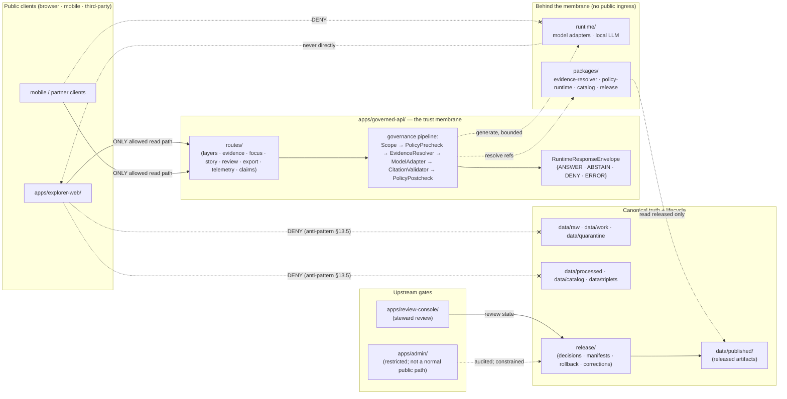

<!-- [KFM_META_BLOCK_V2]
doc_id: kfm://doc/adr-0004-apps-governed-api-is-the-trust-membrane
title: ADR-0004 — apps/governed-api/ is the trust membrane
type: standard
version: v1
status: draft
owners: <Architecture steward; API owner; Security steward — TODO confirm before acceptance>
created: 2026-05-09
updated: 2026-05-09
policy_label: public
related:
  - docs/doctrine/directory-rules.md
  - docs/doctrine/trust-membrane.md
  - docs/doctrine/truth-posture.md
  - docs/doctrine/authority-ladder.md
  - docs/doctrine/lifecycle-law.md
  - docs/architecture/contract-schema-policy-split.md
  - docs/adr/ADR-0001-schema-home.md
  - docs/adr/ADR-0002-finite-decision-outcomes.md
  - docs/adr/ADR-0003-watcher-as-non-publisher.md
tags: [kfm, adr, trust-membrane, governed-api, apps, doctrine]
notes:
  - "Status: proposed. Repository was not mounted in this session; all path-shape and schema-presence claims in this file are PROPOSED until verified against repo evidence."
  - "ADR number 0004 is taken from the user-supplied filename. The corpus contains two competing suggested ADR sequences; reconcile in docs/adr/README.md before acceptance."
[/KFM_META_BLOCK_V2] -->

# ADR-0004 — `apps/governed-api/` is the trust membrane

> **One door between canonical truth and the public. It lives in code at exactly one place: `apps/governed-api/`.**

<!-- Compact status badges. Targets are placeholders until the repo is verified. -->


**Quick jump:** [Frontmatter](#frontmatter) · [Context](#1-context) · [Decision](#2-decision) · [Specification](#3-specification) · [Consequences](#4-consequences) · [Alternatives](#5-alternatives-considered) · [Verification](#6-verification) · [Migration & rollback](#7-migration--rollback) · [Open questions](#8-open-questions--needs-verification) · [References](#9-references)

---

## Frontmatter

| Field | Value |
|---|---|
| **ID** | `ADR-0004` |
| **Title** | `apps/governed-api/` is the trust membrane |
| **Status** | `proposed` <!-- enum per Directory Rules §2.4: proposed \| accepted \| superseded \| rejected --> |
| **Date** | 2026-05-09 |
| **Owners** | Architecture steward; API owner; Security steward (TODO confirm before acceptance) |
| **Supersedes** | — |
| **Superseded by** | — |
| **Authority basis** | KFM core invariant (trust membrane); Directory Rules §3, §5, §7.1, §10.1, §13.5, §16, §19 (glossary) |
| **Related ADRs** | `ADR-0001` (schema home; **accepted** per Directory Rules §0); `ADR-0002` (finite decision outcomes; PROPOSED in corpus); `ADR-0003` (watcher-as-non-publisher; PROPOSED in corpus) |
| **Related doctrine** | `docs/doctrine/directory-rules.md`, `docs/doctrine/trust-membrane.md`, `docs/doctrine/authority-ladder.md`, `docs/doctrine/truth-posture.md`, `docs/doctrine/lifecycle-law.md` |
| **Touches Directory Rules** | Yes (§7.1 role table; resolves §18 open question on `apps/api/` vs `apps/governed-api/` boundary) |
| **Public path impact** | Closes uncontrolled public paths; canonicalizes `apps/governed-api/` as the only public trust path |

> [!IMPORTANT]
> This ADR records doctrine that is already named as a **KFM core invariant** in Directory Rules §3 ("trust membrane"). Its job is to pin the operational form, separate duties, define finite outcomes at the boundary, and resolve drift between `apps/api/` and `apps/governed-api/`. It does **not** introduce a new invariant.

---

## 1. Context

### 1.1 The problem

KFM is a governed, evidence-first, map-first knowledge system. Its lifecycle law — `RAW → WORK / QUARANTINE → PROCESSED → CATALOG / TRIPLETS → PUBLISHED` — is meaningless if a public client can read past the boundary by accident, by drift, by convenience, or by an admin shortcut that hardens into a normal path.

Three forces push against the boundary:

1. **Convenience for public clients.** A map UI wanting "just the GeoJSON" is one direct read of `data/processed/` away from collapsing the lifecycle invariant.
2. **Local AI runtimes.** Runtimes such as model adapters and local LLM hosts produce fluent text. Without a boundary, that fluent text becomes a sovereign-looking truth surface the moment it reaches a UI.
3. **Admin shortcuts that drift.** Restricted internal tools migrate toward the public path under operational pressure, dissolving deny-by-default and least privilege.

### 1.2 What KFM already says

KFM doctrine already names the trust membrane and its operational form. The relevant evidence in this session:

- **Directory Rules §19 (glossary).** "Trust membrane — The boundary that prevents raw / unreviewed / model-generated / internal state from becoming public truth. **Operational form: `apps/governed-api/`.**"
- **Directory Rules §5 (per-root authority).** "`apps/` — Canonical. Deployable. **The public trust path is `apps/governed-api/`.**"
- **Directory Rules §7.1 (role table).** Names `apps/governed-api/` as "Trust membrane in executable form. Returns `RuntimeResponseEnvelope` with finite outcomes (ANSWER, ABSTAIN, DENY, ERROR). MUST be the public trust path."
- **Directory Rules §10.1.** "Local AI runtimes (Ollama, etc.) MUST stay **behind the governed API** … MUST NOT receive direct public client traffic and MUST NOT read canonical or raw stores directly."
- **Directory Rules §13.5 (anti-patterns).** "Public route reads canonical store" is an anti-pattern: route reads MUST go through `apps/governed-api/`.
- **Directory Rules §18 (open questions).** "Whether `apps/api/` and `apps/governed-api/` co-exist in the current repo and what the boundary is" is an unresolved question this ADR addresses.
- **`kfm_build_companion.pdf` §14** ("Governed API: the trust membrane in executable form"). Names the API as where doctrine becomes product behavior, lists the `RuntimeResponseEnvelope` minimum, the public endpoint categories, and the API denial tests.

The doctrine is settled. The drift is in execution. This ADR pins the execution.

### 1.3 What this ADR resolves

| Item | Before this ADR | After this ADR |
|---|---|---|
| Operational form of the trust membrane | Named in glossary; not pinned in code paths | `apps/governed-api/` is the canonical, exclusive public trust path |
| `apps/api/` vs `apps/governed-api/` co-existence | Open question in Directory Rules §18 | One canonical home; `apps/api/` is `legacy` / `deprecated` / `internal-only` if it exists, never the public path |
| Public response envelope | RuntimeResponseEnvelope referenced in multiple docs | Pinned as the **only** outbound shape on public routes |
| Local runtime exposure | "Behind the governed API" stated in §10.1 | Enforced via deny-by-default routing; runtimes have no public ingress |
| Separation of duties at release | Stated in doctrine | Made testable: review, promotion, and serving cannot collapse into one unreviewed path |

[↑ Back to top](#adr-0004--appsgoverned-api-is-the-trust-membrane)

---

## 2. Decision

KFM adopts the following, repo-wide:

> **`apps/governed-api/` is the canonical, exclusive operational form of the trust membrane. All public and ordinary-client reads of KFM truth pass through it. Public clients MUST NOT read canonical, raw, working, quarantine, or model-output stores directly.**

This decision has six concrete parts. Each is binding when this ADR moves from `proposed` to `accepted`.

1. **Single canonical app.** `apps/governed-api/` is the only public trust path. If `apps/api/` exists in the repo, it is one of: `legacy`, `deprecated`, or `internal-only`, with a per-app `README.md` that names its class per Directory Rules §8. It is never the public path.

2. **Outbound envelope.** Every public route MUST return `RuntimeResponseEnvelope` with one of the four finite outcomes — `ANSWER`, `ABSTAIN`, `DENY`, `ERROR` — and the envelope's required fields. Free-form model text never reaches a public response unless it is wrapped, cited, validated, and policy-checked inside the envelope.

3. **No bypass.** Public clients (browser, mobile, third-party) MUST NOT read `data/raw/`, `data/work/`, `data/quarantine/`, `data/processed/`, `data/catalog/` (other than already-released catalog views), or any internal runtime endpoint directly. Any such read attempt returns `DENY`, not a filesystem error.

4. **AI behind the membrane.** Local LLM runtimes, model adapters, and any generative subsystem live behind `apps/governed-api/` per Directory Rules §10.1 and have no public network surface of their own. The governed API resolves `EvidenceRef → EvidenceBundle`, applies policy and sensitivity checks, then calls the model adapter — never the inverse.

5. **Separation of duties.** Generation, review, and serving are distinct roles that MUST NOT collapse into one unreviewed path. The membrane treats `apps/review-console/` (steward review) and `release/` (promotion decisions) as upstream gates, not as conveniences it can skip.

6. **Auditability.** Every outbound envelope is traceable to `EvidenceBundle` references, a `DecisionEnvelope`, the active policy bundle digest, and the `ReleaseManifest` of the served artifact. Receipts, reviews, corrections, and rollback targets remain auditable.

> [!NOTE]
> "Public" in this ADR includes browser-rendered UI traffic, mobile clients, third-party API consumers, and any unauthenticated or weakly-authenticated client. Steward and admin paths are not "public" but are still subject to role-gating and audit per Directory Rules §7.1.

[↑ Back to top](#adr-0004--appsgoverned-api-is-the-trust-membrane)

---

## 3. Specification

> Status of this section: the **rules are CONFIRMED** against KFM doctrine; the **path shapes are PROPOSED** until verified against mounted-repo evidence. The actual repo MAY use `apps/governed_api/` (underscore) or `packages/api/`; if so, adapt names and record the adaptation as a one-line addendum to this ADR per §7.

### 3.1 Trust membrane diagram



> *Diagram intent: the dashed "DENY" edges are the anti-patterns this ADR forbids. Solid edges are the only permitted reads. Path shapes follow Directory Rules §7.1 and are PROPOSED until repo-verified.*

### 3.2 Internal layout (PROPOSED)

```text
apps/governed-api/                       # PROPOSED path; verify against mounted repo
├── README.md                            # declares trust-membrane role; cites this ADR
├── src/
│   ├── routes/                          # public routes return RuntimeResponseEnvelope
│   │   ├── runtimeBootstrap.ts          # PROPOSED
│   │   ├── layers.ts                    # PROPOSED
│   │   ├── evidence.ts                  # PROPOSED
│   │   ├── claims.ts                    # PROPOSED
│   │   ├── focus.ts                     # PROPOSED
│   │   ├── story.ts                     # PROPOSED
│   │   ├── review.ts                    # PROPOSED — steward read-only
│   │   ├── export.ts                    # PROPOSED — governed export
│   │   └── telemetry.ts                 # PROPOSED — safe UI telemetry
│   ├── ai/
│   │   ├── ModelAdapterPort.ts          # PROPOSED — provider-neutral interface
│   │   └── MockAdapter.ts               # PROPOSED — deterministic test adapter
│   ├── envelopes/                       # finite-outcome helpers; mirrors runtime/envelopes/
│   ├── policy/                          # callsites for policy/runtime/* and policy/access/*
│   └── boundaries/                      # request-validation, deny-by-default routing
└── tests/                               # contract + integration; see §6
```

The actual file extensions, framework, and module convention follow whatever the mounted repo uses. The structural rule — "`routes/` returns `RuntimeResponseEnvelope` only; runtime adapters are never publicly routed" — is the binding part.

### 3.3 RuntimeResponseEnvelope (binding minimum)

The envelope shape pinned by this ADR is the minimum field set documented in `kfm_build_companion.pdf` §14.1. The schema home is `schemas/contracts/v1/runtime/runtime_response_envelope.schema.json` per ADR-0001 (schema home).

```json
{
  "envelope_id": "string (uuid)",
  "request_id": "string (uuid)",
  "status": "ANSWER | ABSTAIN | DENY | ERROR",
  "domain": "string",
  "action": "string",
  "access_role": "string",
  "result_payload": "object | null",
  "evidence_bundle_refs": ["string"],
  "policy_decision_ref": "string",
  "release_manifest_refs": ["string"],
  "stale_state": "string | null",
  "review_state": "string | null",
  "correction_notice_refs": ["string"],
  "citations": ["object"],
  "limitations": ["string"],
  "reason_codes": ["string"],
  "generated_at": "string (ISO-8601)"
}
```

Public routes that cannot satisfy `evidence_bundle_refs` for a substantive claim MUST return `ABSTAIN`, not `ANSWER`. This is cite-or-abstain.

### 3.4 Public endpoint categories

These categories are CONFIRMED in `kfm_build_companion.pdf` §14.2; route names are PROPOSED.

| Category | Examples | Rule |
|---|---|---|
| **Catalog** | List released domains, datasets, layers, versions, status | Released/cataloged objects only; include stale and correction state |
| **Evidence** | Resolve `EvidenceBundle` by public-safe ref | No raw source payload unless released and policy-allowed |
| **Layer metadata** | `LayerManifest` / `GeoManifest` payloads | No unpublished candidate layers |
| **Feature explain** | Clicked feature → evidence drawer payload | Resolve via governed API; do **not** trust tile attributes as proof |
| **Focus mode** | Bounded question over released evidence | Evidence-bound; citation-validated; finite outcomes |
| **Review / admin** | Internal reviewer tasks, quarantine, activation, promotion | Role-gated; audited; **not** public |
| **Correction** | Published correction notices and affected releases | Visible, searchable, linked to claims and layers |

### 3.5 Required denial behaviors

These are the API denial tests CONFIRMED in `kfm_build_companion.pdf` §14.3. They are MUST-pass for public release.

| Scenario | Required outcome |
|---|---|
| Public request for any `data/raw/`, `data/work/`, or `data/quarantine/` path | `DENY` (not a filesystem error) |
| Public request for an unreleased layer | `DENY` with `release.unpublished` reason code |
| Public request for exact archaeology site or rare-species occurrence geometry | `DENY` or generalized derivative only, per sensitivity policy |
| Focus request without a resolvable `EvidenceBundle` | `ABSTAIN` |
| Model adapter failure | `ERROR` without leaking prompt, secret, or internal context |
| Source stale beyond policy threshold | `STALE / ABSTAIN` per endpoint contract |
| Direct call to a runtime adapter from a public client | `DENY` (no runtime endpoint is publicly routed) |

### 3.6 Separation of duties (release-significant)

| Role | Lives in | MUST NOT |
|---|---|---|
| **Generate** | `runtime/model_adapters/`, `runtime/ollama/`, `runtime/mock/` | Receive direct public traffic; read canonical or raw stores |
| **Resolve evidence** | `packages/evidence-resolver/` | Read unpublished evidence bundles when serving public routes |
| **Apply policy** | `packages/policy-runtime/`, `policy/runtime/`, `policy/access/` | Run only optionally; policy unavailability ⇒ `ERROR` (fail closed) |
| **Validate citations** | `tools/validators/citation_validation/` (PROPOSED) | Be skipped because a model "looked confident" |
| **Review** | `apps/review-console/` (read-only public surface) | Be the entity that publishes |
| **Promote / release** | `release/manifests/`, `release/rollback_cards/`, `release/correction_notices/` | Be performed by the same code path that generates a response |
| **Serve** | `apps/governed-api/` | Generate or promote; only resolve, validate, and envelope |

> [!WARNING]
> "Watcher-as-non-publisher" still applies inside the membrane (see ADR-0003, PROPOSED). `apps/workers/` may compute candidate decisions and emit receipts, but workers MUST NOT publish or rewrite the catalog from inside a serving path.

[↑ Back to top](#adr-0004--appsgoverned-api-is-the-trust-membrane)

---

## 4. Consequences

### 4.1 Positive

- **One door, one audit surface.** Every public claim is tied to an envelope, an `EvidenceBundle`, and a `DecisionEnvelope`. Auditing the membrane audits the public.
- **Anti-patterns become test failures.** "Public route reads canonical store" (Directory Rules §13.5) becomes a denial test, not a code-review intuition.
- **AI is governed by construction.** Fluent generation cannot reach a public client without resolving evidence, applying policy, validating citations, and being wrapped in a finite-outcome envelope.
- **Drift becomes visible.** `apps/api/` co-existence (Directory Rules §18) is no longer an open question; it is either declared as `legacy` / `deprecated` / `internal-only` or removed.
- **Reversibility.** Each route can be feature-flagged off without taking down the membrane; rollback paths are the per-route flag plus an entry in `release/rollback_cards/`.

### 4.2 Negative / costs

- **Latency surface.** Every public read traverses policy + evidence resolution. Cache strategies (CDN of released artifacts, evidence-bundle caching) become first-class concerns.
- **Schema discipline.** `RuntimeResponseEnvelope` is a versioned contract; every breaking change creates `v2` with a rollback ref.
- **Refactor cost.** If the repo currently exposes routes outside `apps/governed-api/`, those routes are migrated, deprecated, or moved behind the membrane. This is migration work, not free.
- **Tooling cost.** Denial tests, contract tests, and a "public-path scanner" become permanent CI obligations.

### 4.3 What this ADR does **not** do

- It does **not** decide the framework, language, or runtime of `apps/governed-api/`. Those are repo-shape questions to be answered after mounted-repo inspection.
- It does **not** redefine `EvidenceBundle`, `DecisionEnvelope`, `ReleaseManifest`, or `CorrectionNotice`. Those are owned by their respective doctrine and ADRs.
- It does **not** describe Cesium / 3D as a separate truth path. Per Directory Rules §11, 3D consumes the same `EvidenceBundle` and `DecisionEnvelope` as 2D — it is an alternate renderer, not an alternate truth path.

[↑ Back to top](#adr-0004--appsgoverned-api-is-the-trust-membrane)

---

## 5. Alternatives considered

### 5.1 Multiple public APIs by topic (e.g. `apps/api/`, `apps/data-api/`, `apps/ai-api/`)

**Rejected.** Multiple public surfaces multiply audit cost, create drift between policy applications, and re-introduce the very co-existence problem named in Directory Rules §18. Topic-level APIs MAY exist *internally*, but only as private services routed by `apps/governed-api/`.

### 5.2 Library-only governance (no executable boundary)

**Rejected.** A library that "every UI must use" is not a boundary; it is a convention. Conventions drift. The boundary must be addressable, deployable, testable, and revocable as a unit. That is an app, not a library. Shared libraries (`packages/policy-runtime/`, `packages/evidence-resolver/`) remain — they are *used by* the membrane, not a substitute for it.

### 5.3 CDN-only public surface (static released artifacts only)

**Rejected.** A CDN of `data/published/` is necessary but not sufficient. Public clients still need:

- `EvidenceBundle` resolution by public-safe ref,
- `DecisionEnvelope`-bearing responses for sensitive queries,
- bounded Focus mode with citation validation,
- live correction notices,
- denial responses with reason codes.

A CDN does not produce `ABSTAIN` or `DENY`. The membrane must be a runtime.

### 5.4 Reverse-proxy-only enforcement

**Rejected as primary.** Reverse-proxy rules in `infra/reverse_proxy/` are valuable defense-in-depth but cannot enforce evidence resolution, citation validation, or finite-outcome envelopes. They complement the membrane; they do not replace it.

### 5.5 Allow direct `data/published/` reads from public clients

**Rejected.** Even released artifacts need correction-state, freshness, and decision-metadata wrapping for downstream re-governance. Direct reads collapse the trust contract that the envelope carries.

[↑ Back to top](#adr-0004--appsgoverned-api-is-the-trust-membrane)

---

## 6. Verification

> All test paths below are PROPOSED. Adapt to the mounted repo's actual test layout and record the adaptation in a follow-up addendum.

### 6.1 Required tests

| Test family | Proposed location | What it asserts |
|---|---|---|
| Contract tests | `tests/contracts/runtime/` | Every public route's response validates against `runtime_response_envelope.schema.json` |
| Denial tests | `tests/api/denial/` | Each scenario in §3.5 returns the required outcome and reason code |
| Bypass tests | `tests/api/bypass/` | Direct fetches against `data/raw/`, `data/work/`, `data/quarantine/`, runtime adapters return `DENY` (or are unrouted) at the membrane |
| Citation tests | `tests/api/citation/` | `ANSWER` responses carry resolvable `evidence_bundle_refs`; uncited responses fail |
| Policy-fail-closed tests | `tests/api/policy/` | When the policy engine is unavailable, public routes return `ERROR`, never `ANSWER` |
| Runtime-proof tests | `tests/runtime_proof/` | Finite-outcome and abstain proof, repo-wide |
| Public-path scanner | `tools/validators/public_path_scanner/` (PROPOSED) | Static scan: any route registration outside `apps/governed-api/` is flagged |

### 6.2 CI gates

- The `runtime_proof` and `denial` suites are **required** on every PR touching `apps/governed-api/`, `runtime/`, `policy/runtime/`, `policy/access/`, or `schemas/contracts/v1/runtime/`.
- The public-path scanner runs on every PR and fails the build if a public-route registration is found outside the membrane.
- Any new endpoint MUST land with: contract test, at least one denial fixture, and a citation fixture for `ANSWER` cases.

### 6.3 Acceptance criteria for promoting this ADR from `proposed` → `accepted`

- [ ] Mounted-repo inspection confirms the canonical app name (`apps/governed-api/` vs. `apps/governed_api/` vs. another). Adaptation recorded.
- [ ] If `apps/api/` exists, its class (`legacy` / `deprecated` / `internal-only`) is declared in its README per Directory Rules §8.
- [ ] `RuntimeResponseEnvelope` schema is present and validated; ADR-0001 schema-home rule honored.
- [ ] At least one route exists with full pipeline: route → evidence resolve → policy → envelope.
- [ ] Denial tests in §6.1 exist for at least one route and pass in CI.
- [ ] Public-path scanner is wired to CI and green on `main`.
- [ ] `docs/doctrine/trust-membrane.md` exists and links to this ADR.
- [ ] Drift entry in `docs/registers/DRIFT_REGISTER.md` (if any) for `apps/api/` co-existence is closed or referenced.

[↑ Back to top](#adr-0004--appsgoverned-api-is-the-trust-membrane)

---

## 7. Migration & rollback

### 7.1 Migration outline

Migration is incremental. The membrane does not require a rewrite; it requires that every public read pass through it.

1. **Inventory.** List every public route and every direct public read of `data/*` (excluding `data/published/` consumed *via* the membrane). Record in `docs/registers/DRIFT_REGISTER.md`.
2. **Resolve `apps/api/`.** Per Directory Rules §8, declare its class in its README. New work goes to `apps/governed-api/`.
3. **Adopt the envelope.** Migrate one route family at a time (catalog → evidence → focus → story → review → export → telemetry). Each migration ships with denial tests.
4. **Move runtimes behind the membrane.** Ensure `runtime/` has no public ingress (`infra/reverse_proxy/` rules + scanner check).
5. **Wire scanner + CI gates.** Make new violations un-mergable.
6. **Update doctrine.** Link this ADR from the Directory Rules §0 "Related doctrine" list and from `docs/doctrine/trust-membrane.md`.

### 7.2 Rollback

Rollback is per-route, not per-ADR. The ADR stating doctrine cannot be "rolled back" without superseding it. To revert a specific membrane change:

- Disable the route via feature flag in the API config.
- Re-enable the prior route only inside the membrane (never outside it).
- Record a `RollbackCard` in `release/rollback_cards/`.
- Open a drift entry if the rollback re-opens a §13.5 anti-pattern, even temporarily.

If this ADR itself is later judged wrong, **supersede** it (per Directory Rules §2.4): create `ADR-NNNN`, set this ADR's status to `superseded`, and add a forward link.

[↑ Back to top](#adr-0004--appsgoverned-api-is-the-trust-membrane)

---

## 8. Open questions / NEEDS VERIFICATION

These items are **not** blockers for `proposed`-status acceptance, but MUST be resolved before promotion to `accepted`. Track in `docs/registers/VERIFICATION_BACKLOG.md`.

- **NEEDS VERIFICATION.** Whether the mounted repo uses `apps/governed-api/`, `apps/governed_api/`, or another name. Directory Rules §7.1 uses the dash form; the corpus shows both. Pin once verified.
- **NEEDS VERIFICATION.** Whether `apps/api/` exists in the mounted repo, and if so, its current class (Directory Rules §18 open question).
- **NEEDS VERIFICATION.** Whether `schemas/contracts/v1/runtime/runtime_response_envelope.schema.json` is present and whether validators are wired. Default per ADR-0001.
- **NEEDS VERIFICATION.** Whether `policy/runtime/finite_outcomes.rego` (or its repo-equivalent) exists to normalize finite outcomes across policy modules.
- **NEEDS VERIFICATION.** Whether `infra/reverse_proxy/` enforces deny-by-default for non-`apps/governed-api/` routes in the deployed stack.
- **PROPOSED.** Add `tools/validators/public_path_scanner/` to repo if not present; this ADR creates the requirement.
- **PROPOSED.** Reconcile ADR numbering. The corpus contains two competing suggested ADR sequences:
  - "ADR-0001 spec normalization, ADR-0002 finite decision outcomes, ADR-0003 watcher non-publisher invariant, ADR-0004 STAC profile, ADR-0005 ReleaseManifest envelope" (corpus suggestion).
  - "ADR-0001 schema home" (per Directory Rules §0 — this is the **operative** assignment).
  This ADR uses `ADR-0004` as supplied in the filename, which differs from the corpus suggestion's "STAC profile". Reconcile in `docs/adr/README.md` before promotion.
- **OPEN.** Whether `apps/governed-api/` should publish a public OpenAPI / contract artifact (and if so, whether it lives in `apps/governed-api/openapi/` or `data/published/api-contracts/`).

[↑ Back to top](#adr-0004--appsgoverned-api-is-the-trust-membrane)

---

## 9. References

### 9.1 KFM doctrine and corpus

- `docs/doctrine/directory-rules.md` — §3 (invariants), §5 (per-root authority), §7.1 (`apps/`), §10.1 (runtimes behind the API), §11 (UI/Map roots), §13.5 (anti-patterns), §16 (PR review checklist), §18 (open questions), §19 (glossary)
- `kfm_build_companion.pdf` — §14 "Governed API: the trust membrane in executable form" (envelope minimum, public endpoint categories, denial tests)
- `kfm_encyclopedia.pdf` — required AI denial behaviors; `AIReceipt` + `RuntimeResponseEnvelope` outputs
- `KFM_Whole_UI_Governed_AI_Expansion_Report.pdf` — `apps/governed-api/` route inventory and adaptation guidance
- `KFM_Governed_AI_Extended_Pro_Source_Ledger_PDF_Only_Architecture_Report_20260420.pdf` — runtime architecture (Scope → PolicyPrecheck → EvidenceResolver → ModelAdapter → CitationValidator → PolicyPostcheck → RuntimeResponseEnvelope) and failure-state mapping
- `KFM_Components_Pass_11_Part_2_Idea_Index_Category_Atlas_and_Expansion_Dossier.pdf` — F.4.2 (signed decision metadata at the API boundary)
- `KFM_Pass_12_Part_2_Idea_Index_Category_Atlas_and_Expansion_Dossier.pdf` — KFM-IDX-C-011 (`DecisionEnvelope` as normalized policy output)

### 9.2 Related ADRs

| ADR | Title | Status (this session) |
|---|---|---|
| `ADR-0001` | Schema home (`schemas/contracts/v1/<…>` canonical) | **accepted** per Directory Rules §0 |
| `ADR-0002` | Finite decision outcomes (`ANSWER` / `ABSTAIN` / `DENY` / `ERROR`) | PROPOSED in corpus; pinned by §3.3 of this ADR |
| `ADR-0003` | Watcher-as-non-publisher invariant | PROPOSED in corpus; reinforced by §3.6 of this ADR |
| `ADR-0004` *(this ADR)* | `apps/governed-api/` is the trust membrane | `proposed` |

### 9.3 Glossary anchors

| Term | Definition source |
|---|---|
| **Trust membrane** | Directory Rules §19: "The boundary that prevents raw / unreviewed / model-generated / internal state from becoming public truth. Operational form: `apps/governed-api/`." |
| **`RuntimeResponseEnvelope`** | Directory Rules §19; `kfm_build_companion.pdf` §14.1; schema home per ADR-0001 |
| **`EvidenceBundle` / `EvidenceRef`** | Directory Rules §19: "Resolved support package for claims; lives in `data/proofs/`. References resolve via `packages/evidence-resolver/`." |
| **`DecisionEnvelope`** | KFM-IDX-C-011 (Pass 12 Part 2): normalized policy output across access, obligation, promotion, render, and capability gates |
| **`ReleaseManifest`** | Directory Rules §19: "The release decision artifact; lives in `release/manifests/`." |

---

<details>
<summary><strong>Appendix A — Authority basis worked example</strong></summary>

A reviewer asking *"why is this an ADR-worthy decision?"* should be answered by §2.4 of Directory Rules:

> A new ADR is **required** before … (6) Bending an invariant from §3.

This ADR does **not** bend the trust-membrane invariant. It **operationalizes** it. But it touches several of the §2.4 triggers:

- It clarifies an **open question** (Directory Rules §18: `apps/api/` vs `apps/governed-api/` boundary).
- It pins the role of a **canonical root** child path (`apps/governed-api/`) in a way that affects code organization repo-wide.
- It declares CI gates that affect every PR touching the public path.

That is enough to warrant ADR-class treatment, even though the underlying invariant is already named in Directory Rules.

</details>

<details>
<summary><strong>Appendix B — Adaptation note for differing repo conventions</strong></summary>

If mounted-repo inspection shows any of the following, adapt this ADR via a one-line addendum (do not silently rewrite):

- App named `apps/governed_api/` (underscore) → record adaptation; everything else unchanged.
- App split as `apps/governed-api/` (HTTP edge) + `packages/api/` (handlers) → membrane responsibility still belongs to the deployable; the package is a library *used by* the membrane.
- Existing `apps/api/` is the public path → record drift entry in `docs/registers/DRIFT_REGISTER.md`; plan migration; mark this ADR's `Public path impact` row as "in transition" until the migration completes.
- Schema home is `contracts/runtime/` instead of `schemas/contracts/v1/runtime/` → defer to ADR-0001's resolution; do not introduce a parallel schema home.

</details>

[↑ Back to top](#adr-0004--appsgoverned-api-is-the-trust-membrane)
