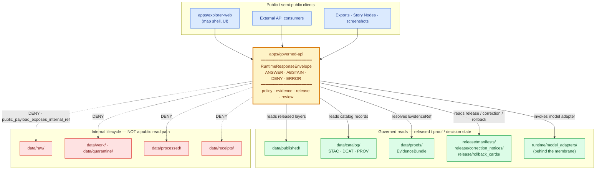

<!-- [KFM_META_BLOCK_V2]
doc_id: kfm://doc/adr-0004
title: ADR-0004 — apps/governed-api is the trust membrane
type: standard
version: v1
status: proposed
owners: TODO — Architecture Steward; API owner; Security steward
created: 2026-05-10
updated: 2026-05-10
policy_label: public
related:
  - docs/adr/ADR-0001-schema-home.md          # NEEDS VERIFICATION — cited in directory-rules.md §13.1
  - docs/adr/ADR-0002-finite-decision-outcomes.md   # PROPOSED — starter-set name
  - docs/adr/ADR-0003-watcher-as-non-publisher.md   # PROPOSED — starter-set name
  - directory-rules.md
  - docs/architecture/runtime-envelope.md      # NEEDS VERIFICATION
tags: [kfm, adr, governed-api, trust-membrane, runtime, governance]
notes:
  - "Resolves directory-rules.md §18 OPEN: apps/api/ vs apps/governed-api/ boundary."
  - "Starter-set numbering follows the user-supplied file path; an alternate Pass 12 suggestion proposed ADR-0004 = STAC profile. Surface in §11 Alternatives."
[/KFM_META_BLOCK_V2] -->

# ADR-0004 — `apps/governed-api/` is the Trust Membrane

> **Purpose.** Declare `apps/governed-api/` the **single executable boundary** between Kansas Frontier Matrix's governed internals and every public / semi-public client. Public reads, AI answers, and exports cross this boundary; nothing else may.


| Field | Value |
|---|---|
| **Status** | Proposed |
| **Owners** | `TODO` — Architecture Steward · API owner · Security steward |
| **Last reviewed** | 2026-05-10 |
| **Supersedes** | — |
| **Superseded by** | — |

---

## Quick Navigation

- [1. Status](#1-status)
- [2. Context](#2-context)
- [3. Decision](#3-decision)
- [4. Trust Membrane — Diagram](#4-trust-membrane--diagram)
- [5. Operational Invariants](#5-operational-invariants)
- [6. `RuntimeResponseEnvelope` Contract](#6-runtimeresponseenvelope-contract)
- [7. Required Deny Cases](#7-required-deny-cases)
- [8. Affected Paths](#8-affected-paths)
- [9. Resolution of the `apps/api/` Question](#9-resolution-of-the-appsapi-question)
- [10. Consequences](#10-consequences)
- [11. Alternatives Considered](#11-alternatives-considered)
- [12. Migration & Backward Compatibility](#12-migration--backward-compatibility)
- [13. Validation & Compliance](#13-validation--compliance)
- [14. Related ADRs and Docs](#14-related-adrs-and-docs)
- [15. Open Questions / NEEDS VERIFICATION](#15-open-questions--needs-verification)
- [Appendix A — Reason-code vocabulary](#appendix-a--reason-code-vocabulary)
- [Appendix B — Anti-patterns this ADR forbids](#appendix-b--anti-patterns-this-adr-forbids)

---

## 1. Status

**Proposed.** This ADR codifies doctrine already present in `directory-rules.md` (§7.1, §13.5, §19) and across the KFM corpus, and **resolves the OPEN question** raised in `directory-rules.md` §18 about the boundary between `apps/api/` and `apps/governed-api/`. It does not invent the trust membrane; it makes the trust membrane an addressable, supersession-aware decision.

> [!NOTE]
> The repository was **not mounted** in the session in which this ADR was drafted. All path-level claims about the current repo state are **PROPOSED / NEEDS VERIFICATION** until inspection. The *doctrine* below is **CONFIRMED** from attached project documents.

---

## 2. Context

KFM is a governed, evidence-first, map-first, time-aware spatial knowledge system. Its lifecycle invariant is:

```text
RAW  →  WORK / QUARANTINE  →  PROCESSED  →  CATALOG / TRIPLETS  →  PUBLISHED
```

Promotion between phases is a **governed state transition**, not a file move. Each phase carries different rights, sensitivity, review, and release postures. The system fails *closed* — when in doubt, it abstains or denies rather than emitting an uncited claim.

The forces in play:

- **Public exposure is asymmetric.** A leaked exact archaeology site, rare-species nesting location, restricted personal record, or unreleased candidate cannot be fully retracted once served. The corpus repeatedly chooses **fail-closed at the public boundary** for this reason.
- **Generated text is not sovereign truth.** Tiles, mosaics, summaries, vector indexes, generated answers, and 3D scenes are presentation; `EvidenceBundle` is provenance.
- **Direct client reads of canonical stores collapse the lifecycle.** A public route that reads `data/processed/`, `data/raw/`, or a model endpoint bypasses every gate the rest of the system enforces.
- **Multiple consumers want a single contract.** `apps/explorer-web/`, downstream API consumers, Focus Mode / AI runtime, the Evidence Drawer, exports, and Story Nodes all need consistent semantics: same envelope, same evidence resolution, same denial vocabulary, same review and release state.
- **An open structural ambiguity exists.** `directory-rules.md` §18 explicitly lists as OPEN: *"Whether `apps/api/` and `apps/governed-api/` co-exist in the current repo and what the boundary is."* Until this is named, drift is likely.

Without an executable membrane that all public traffic crosses, every other governance commitment — `EvidenceBundle` closure, sensitivity policy, cite-or-abstain, watcher-as-non-publisher, release manifests, correction notices, rollback cards — has no single place to be enforced where it matters most: at the public surface.

[↑ Back to top](#quick-navigation)

---

## 3. Decision

**`apps/governed-api/` is the canonical public trust path for Kansas Frontier Matrix.**

Concretely, KFM commits to the following, drawn directly from `directory-rules.md` §7.1, §13.5, §19 and the Build Companion §14:

1. **Single executable membrane.** All public and normal UI traffic — reads, AI answers, exports, Story Nodes, Focus Mode, Evidence Drawer payloads — passes through `apps/governed-api/`. No other deployable in `apps/` may serve public clients.
2. **Finite outcomes.** Every response is a `RuntimeResponseEnvelope` with `status ∈ { ANSWER, ABSTAIN, DENY, ERROR }`. There is no fifth case.
3. **No public path to canonical / lifecycle stores.** Public clients **MUST NOT** read `data/raw/`, `data/work/`, `data/quarantine/`, internal `data/receipts/`, or `data/processed/`. `data/published/`, `data/catalog/` (records only), `data/proofs/` (resolved via the API), and `release/` state are reachable **only through the governed API**.
4. **No direct model client.** Focus Mode, Evidence Drawer reasoning, and any AI surface invoke model adapters **behind** the governed API. The browser never calls Ollama, OpenAI, a local model runtime, a vector index, a graph store, or an object store directly.
5. **Decision metadata travels with the answer.** Every envelope carries `policy_decision_ref`, `evidence_bundle_refs`, `release_manifest_refs`, `review_state`, `correction_notice_refs`, `citations`, `limitations`, and `reason_codes`.
6. **The membrane is fail-closed.** Missing `EvidenceBundle` → `ABSTAIN`. Sensitivity-policy violation → `DENY`. Stale beyond policy → `STALE / ABSTAIN`. Adapter or schema failure → `ERROR` with no leakage of prompt, secret, or internal context.
7. **Watcher-as-non-publisher is preserved at the boundary.** Workers (`apps/workers/`) emit receipts and candidate decisions; they do not publish, mutate canonical truth, or speak directly to public clients. The governed API reads only what the lifecycle has promoted.

> [!IMPORTANT]
> The trust membrane is **operational**, not aspirational. A code path that says "public client" but reads anything other than the governed API's response is a **MUST-fix violation** of this ADR — even if the read is convenient, fast, or "just for now."

[↑ Back to top](#quick-navigation)

---

## 4. Trust Membrane — Diagram



> [!NOTE]
> Dotted arrows are **denial paths**, not access paths. A request that would resolve to a `RAW / WORK / QUARANTINE / PROCESSED / receipts/` read returns a `DENY` envelope with a reason code, not a filesystem error.

[↑ Back to top](#quick-navigation)

---

## 5. Operational Invariants

| # | Invariant | Source |
|---|---|---|
| I-1 | `apps/governed-api/` is the **only** public-facing application that serves trust payloads. | `directory-rules.md` §7.1, §19 |
| I-2 | Every response is a `RuntimeResponseEnvelope` with one of four statuses: `ANSWER`, `ABSTAIN`, `DENY`, `ERROR`. | Build Companion §14.1; multiple corpus sources |
| I-3 | Public clients **never** read `data/raw/`, `data/work/`, `data/quarantine/`, `data/processed/`, or `data/receipts/`. | `directory-rules.md` §13.5; Build Companion §14.3 |
| I-4 | `EvidenceRef` → `EvidenceBundle` resolution happens **through** the governed API; clients receive resolved support, not paths. | Build Companion §14.1, §14.2 |
| I-5 | Model adapters (`runtime/`) live **behind** the membrane; the browser never calls a model runtime directly. | `directory-rules.md` §10.1 |
| I-6 | Tiles, mosaics, generated text, vector indexes, and 3D scenes are **derived** surfaces; the catalog/proof/release objects they reference are canonical. | Pass 11/15 corpus theme 8.3 |
| I-7 | Sensitivity policy is enforced **at the boundary**: exact archaeology, rare-species nest/den/roost, living-person, DNA, and critical-infrastructure precise geometry **deny by default**. | Encyclopedia §Sensitive register; Build Companion §11 |
| I-8 | Stale-beyond-policy data returns `STALE / ABSTAIN` per endpoint contract; it does not silently render. | Build Companion §14.3 |
| I-9 | `ERROR` responses **never leak** prompt text, secrets, internal stack traces, or adapter internals. | Build Companion §14.3 |
| I-10 | The governed API is a **read path** for canonical state and a **submit path** for steward-controlled writes (corrections, review decisions). It does **not** write to canonical lifecycle stores. | Build Companion §14.2; watcher-as-non-publisher invariant |

[↑ Back to top](#quick-navigation)

---

## 6. `RuntimeResponseEnvelope` Contract

The envelope shape is illustrative and reflects the Build Companion §14.1 listing; the canonical schema home is **PROPOSED** at `schemas/contracts/v1/runtime/runtime_response_envelope.schema.json` (per `directory-rules.md` §19 glossary). Field set:

| Field | Purpose |
|---|---|
| `envelope_id` | Deterministic identity for this response. |
| `request_id` | Join key to client/audit context. |
| `status` | One of `ANSWER \| ABSTAIN \| DENY \| ERROR`. |
| `domain` | Domain lane (e.g., `hydrology`, `archaeology`). |
| `action` | Endpoint category (e.g., `evidence.resolve`, `layer.metadata`, `feature.explain`, `focus.answer`). |
| `access_role` | Caller's resolved role (`public`, `registered`, `steward`, `domain_reviewer`, `admin`, `system`). |
| `result_payload` | Status-specific payload (cited evidence for `ANSWER`; held-case rationale for `ABSTAIN`; refusal record for `DENY`; audit ref for `ERROR`). |
| `evidence_bundle_refs` | Resolved `EvidenceRef` → `EvidenceBundle` set supporting the response. |
| `policy_decision_ref` | The `DecisionEnvelope` (`schemas/contracts/v1/runtime/decision_envelope.schema.json` — PROPOSED) that governed the response. |
| `release_manifest_refs` | The `ReleaseManifest`(s) the response is bound to. |
| `stale_state` | Freshness status against source policy. |
| `review_state` | Steward / reviewer state of the bound release. |
| `correction_notice_refs` | Any active `CorrectionNotice` for cited claims. |
| `citations` | Validated citations attached to `ANSWER` payloads. |
| `limitations` | Bounded caveats; e.g., generalization applied. |
| `reason_codes` | Machine-readable reasons (see Appendix A). |
| `generated_at` | ISO-8601 timestamp; supports replay and supersession reasoning. |

> [!TIP]
> Consumers MAY write a `switch` over `status` and trust that there is no fifth branch. The four-valued grammar is the load-bearing property: it forces every dispositional outcome — including "I cannot determine an answer" and "I refuse for policy reasons" — into a labeled, auditable shape rather than into an empty `ANSWER` or a fabricated payload.

[↑ Back to top](#quick-navigation)

---

## 7. Required Deny Cases

These are *minimum* `DENY` cases that any conformant `apps/governed-api/` implementation must enforce. The list is drawn from Build Companion §14.3, the Encyclopedia Sensitive register, and the archaeology / fauna / flora deny tables.

| Trigger | Outcome | Reason code (illustrative) |
|---|---|---|
| Public request resolves a `RAW / WORK / QUARANTINE` path. | `DENY` | `public_payload_exposes_internal_ref` |
| Public request for an unreleased candidate layer or unpublished feature. | `DENY` | `release.unpublished` |
| Public request for exact archaeology site, burial, sacred site, or human-remains location. | `DENY` | `sensitivity.archaeology_exact_denied` |
| Public request for exact rare-species occurrence / nest / den / roost / spawning location. | `DENY` | `sensitivity.rare_species_exact_denied` |
| Public exposure of living-person identifying data without lawful basis and review. | `DENY` | `sensitivity.living_person_denied` |
| Public DNA / genomic inference about living persons or relatives. | `DENY` | `sensitivity.dna_inference_denied` |
| Public exact critical-infrastructure geometry or condition. | `DENY` / `RESTRICT` | `sensitivity.critical_infrastructure_denied` |
| Focus / AI answer without resolvable `EvidenceBundle` or validated citations. | `ABSTAIN` (no bundle) or `DENY` (uncited assertion). | `ai_missing_evidence_bundle_or_citations` |
| Model-predicted candidate feature treated as confirmed. | `DENY` | `model_as_observation` |
| Catalog closure mismatch or missing release-manifest digest in public STAC. | `DENY` | `catalog_matrix_not_closed` |
| Unknown rights / unresolved license on requested release. | `DENY` or `QUARANTINE` upstream. | `rights.unknown` |
| Operational alert / emergency-instruction replacement. | `DENY` | `not_for_life_safety` |
| Source stale beyond endpoint policy. | `ABSTAIN` (or `STALE` per endpoint). | `freshness.stale` |
| Adapter or schema failure. | `ERROR` (no leakage). | `adapter.fault` |

[↑ Back to top](#quick-navigation)

---

## 8. Affected Paths

All paths below are **PROPOSED** until the repo is inspected. Path conventions follow `directory-rules.md` §7.1 (apps), §7.2 (packages), §6 (schemas / policy), and §10.1 (runtime). Where the actual repo uses a hyphen vs underscore variant (`apps/governed-api/` vs `apps/governed_api/`), prefer the form already entrenched; record the choice in a follow-up note in this ADR rather than in a divergent sibling.

| Path | Action | Purpose | Truth |
|---|---|---|---|
| `apps/governed-api/` | create / adapt | Trust-membrane deployable; only public-facing app for trust payloads. | PROPOSED |
| `apps/governed-api/README.md` | create | Boundary documentation; trust-membrane statement; route categories; deny matrix. | PROPOSED |
| `apps/governed-api/src/routes/runtimeBootstrap.*` | create / adapt | Shell + feature-flag bootstrap. | PROPOSED |
| `apps/governed-api/src/routes/layers.*` | create / adapt | Layer catalog / descriptor / manifest endpoints. | PROPOSED |
| `apps/governed-api/src/routes/evidence.*` | create / adapt | `EvidenceBundle` resolution endpoint. | PROPOSED |
| `apps/governed-api/src/routes/focus.*` | create / adapt | Focus Mode bounded-answer endpoint. | PROPOSED |
| `apps/governed-api/src/routes/correction.*` | create / adapt | Public `CorrectionNotice` lookup. | PROPOSED |
| `apps/governed-api/src/routes/review/*.*` | create / adapt | Steward / review surfaces; role-gated; audited. | PROPOSED |
| `apps/explorer-web/src/api/governedClient.*` | adapt | Only allowed browser network path for trust payloads. | PROPOSED |
| `apps/explorer-web/src/api/responseValidators.*` | adapt | Runtime schema validation at the client boundary. | PROPOSED |
| `schemas/contracts/v1/runtime/runtime_response_envelope.schema.json` | create | Envelope schema home. | PROPOSED |
| `schemas/contracts/v1/runtime/decision_envelope.schema.json` | create | `DecisionEnvelope` schema home. | PROPOSED |
| `policy/runtime/finite_outcomes.rego` | create | Helper module normalizing policy outputs to the four-valued grammar. | PROPOSED |
| `policy/api/no_internal_path.rego` | create | Deny rule for routes referencing internal lifecycle paths. | PROPOSED |
| `tests/api/no_raw_path_test.*` | create | Asserts public routes return `DENY`, not filesystem errors, for `RAW / WORK / QUARANTINE`. | PROPOSED |
| `tests/runtime_proof/finite_outcome_test.*` | create | Asserts every endpoint returns exactly one of the four statuses. | PROPOSED |
| `docs/architecture/runtime-envelope.md` | create / update | Human-facing contract documentation. | PROPOSED |
| `directory-rules.md` §18 OPEN entry | edit | Mark the `apps/api/` vs `apps/governed-api/` question **resolved by ADR-0004**; link forward. | PROPOSED |

[↑ Back to top](#quick-navigation)

---

## 9. Resolution of the `apps/api/` Question

`directory-rules.md` §18 lists as OPEN: *"Whether `apps/api/` and `apps/governed-api/` co-exist in the current repo and what the boundary is."* This ADR resolves it as follows:

| Outcome | Rule |
|---|---|
| **Default** | Only `apps/governed-api/` exists. It is the public trust path. |
| **Co-existence** | If `apps/api/` exists in the repo, it MUST be one of: (a) frozen legacy / `mirror`, (b) internal-only and not exposed to public clients, or (c) a narrowly documented service whose scope and exposure are pinned in its README and reviewed against this ADR. |
| **Forbidden** | `apps/api/` MAY NOT serve public clients in parallel with `apps/governed-api/`. Parallel public APIs split the membrane and split enforcement. |
| **If both serve public traffic today** | Open a `docs/registers/DRIFT_REGISTER.md` entry, write a migration plan into `migrations/`, deprecate `apps/api/` for public traffic, and converge on `apps/governed-api/`. |

> [!WARNING]
> Splitting public traffic between two deployables is the most common way the trust membrane silently dissolves. The choice "they each handle different routes" is the same as "we have no membrane" — because the policy substrate, decision envelopes, sensitivity gates, and audit surface are now two systems instead of one.

[↑ Back to top](#quick-navigation)

---

## 10. Consequences

### Positive

- **Single point of enforcement.** Sensitivity, rights, freshness, citation, evidence-closure, and release-state checks live in one place; every public request crosses them.
- **Auditable boundary.** Each response carries `policy_decision_ref`, `evidence_bundle_refs`, `release_manifest_refs`, and `reason_codes`. "Why was this served?" answers against artifacts, not memory.
- **Cite-or-abstain becomes operational.** `ABSTAIN` is a first-class outcome, not an empty payload pretending to be an answer.
- **Generated text cannot outrank evidence.** The Focus Mode / AI surface runs through the same membrane and the same `RuntimeResponseEnvelope`; uncited generation is structurally rejected.
- **Resolves a known structural ambiguity** in `directory-rules.md` §18.
- **Downstream re-governance.** Signed decision metadata travels with payloads, so downstream consumers can honor the same policy posture (rare-species precision, archaeology suppression) rather than re-deriving it.

### Negative / Costs

- **Latency and response size** grow modestly because every response carries decision metadata, citation refs, and resolved evidence pointers.
- **Implementation cost up front.** Routes that previously read `data/processed/` directly must be re-pointed through the governed API; route handlers must validate envelope shape; client code must consume the envelope discipline.
- **Operational discipline required.** Workers (`apps/workers/`) must continue to obey watcher-as-non-publisher; reviewers must use `apps/review-console/` for promotion. The membrane only holds if upstream lifecycle gates also hold.
- **Admin shortcuts must be constrained.** Any `apps/admin/` route MUST be justified, role-gated, documented, audited, and **kept out of the normal public path** (`directory-rules.md` §7.1).
- **3D / Cesium and alternate renderers** add complexity: they must consume the same `EvidenceBundle` and `DecisionEnvelope` as 2D — not an alternate truth path.

### Risks if Not Adopted

- Drift to a "convenient" public route that reads `data/processed/` directly — collapsing the lifecycle.
- Sensitivity policy enforced inconsistently between routes, with the weakest enforcement defining the system's actual posture.
- Generated text emitted as authoritative without `EvidenceBundle` backing.
- Two parallel public APIs (`apps/api/` and `apps/governed-api/`) diverging in their denial vocabularies.

[↑ Back to top](#quick-navigation)

---

## 11. Alternatives Considered

| Alternative | Why rejected |
|---|---|
| **No dedicated membrane** — let each app handle its own trust checks. | Distributes enforcement across every route; weakest enforcement defines the system; sensitivity, freshness, citation, and release-state checks drift apart. Directly forbidden by `directory-rules.md` §13.5 (*Public route reads canonical store* → MUST fix). |
| **Membrane in `apps/explorer-web/` only** — UI enforces the boundary. | UI is a renderer, not a policy authority. The browser cannot be trusted to be the sole enforcer; external API consumers bypass it entirely. |
| **Membrane in `packages/` library** — every app imports a "governed client." | Libraries can be imported wrongly or bypassed; deployable boundary is more enforceable than a code boundary. (`packages/` may host helpers; it cannot *be* the membrane.) |
| **Per-domain governed APIs** (e.g., `apps/hydrology-api/`, `apps/fauna-api/`). | Multiplies enforcement surfaces; cross-domain queries (Focus Mode, Story Nodes) become inconsistent; sensitivity vocabulary fragments. Domain lanes belong *inside* the membrane, not as parallel deployables. |
| **Keep `apps/api/` and `apps/governed-api/` as siblings, distinguish by route prefix.** | Re-introduces the §18 ambiguity; doubles the policy surface. Resolved against this option in §9. |
| **Use a reverse proxy / WAF as the membrane** (`infra/reverse_proxy/`). | The proxy can enforce *exposure*, not *evidence*. `EvidenceBundle` resolution, `DecisionEnvelope` emission, and finite-outcome grammar are application-layer responsibilities. The proxy complements but does not replace the membrane. |
| **Alternate ADR-0004 placement: STAC profile.** Pass 12 Part 2 suggested ADR-0004 = "STAC profile" as part of a starter set. | The trust-membrane decision is more load-bearing (the STAC profile sits *inside* the membrane), and the §18 OPEN question warrants resolution sooner. STAC profile is renumbered to a later ADR. |

[↑ Back to top](#quick-navigation)

---

## 12. Migration & Backward Compatibility

This ADR is doctrinally compatible with the existing KFM corpus; the migration work is operational, not conceptual.

**Backward compatibility posture.** Strong default — existing route URLs MAY be preserved while their handlers are re-pointed through the governed API. Breaking changes (envelope-shape changes for endpoints already in use) require a `schemas/contracts/v1/runtime/` version bump and a documented migration window.

**Migration steps (PROPOSED):**

1. Inspect the mounted repo. Confirm whether `apps/governed-api/` exists and whether `apps/api/` co-exists.
2. If both exist serving public traffic, open `docs/registers/DRIFT_REGISTER.md` entry and write a migration plan under `migrations/`.
3. Land the canonical schema home: `schemas/contracts/v1/runtime/runtime_response_envelope.schema.json` and `decision_envelope.schema.json`.
4. Land `policy/runtime/finite_outcomes.rego` and `policy/api/no_internal_path.rego`.
5. Re-point public routes one endpoint family at a time: catalog → evidence → layer-metadata → feature-explain → focus → correction → review. Each family closes with a no-internal-path test.
6. Mark `apps/api/` (if present) as `legacy` / `internal-only` per its actual role; pin scope in its README.
7. Update `directory-rules.md` §18 OPEN item to **resolved by ADR-0004** with forward link.
8. Backfill `docs/architecture/runtime-envelope.md` and the per-domain trust-membrane sections (e.g., `docs/domains/<domain>/PUBLIC_SURFACE.md`).

**Rollback path.** Each route migration ships with a feature flag; if a `no_raw_path_test` regresses, the flag flips off and the prior handler returns. The governed-API release as a whole is rolled back via a `release/rollback_cards/` entry naming the affected envelope schema and route bundle.

[↑ Back to top](#quick-navigation)

---

## 13. Validation & Compliance

| Check | Expectation | Test home (PROPOSED) |
|---|---|---|
| Envelope shape | Every response validates against `runtime_response_envelope.schema.json`; `status` is one of the four enums. | `tests/api/envelope_shape_test.*` |
| No public raw path | Public routes / layer manifests / Focus payloads do not reference `data/raw/`, `data/work/`, `data/quarantine/`, `data/processed/`, or `data/receipts/`. | `tests/api/no_raw_path_test.*` |
| `ABSTAIN` on missing evidence | A Focus request whose `EvidenceRef` does not resolve returns `ABSTAIN` with a held-case rationale. | `tests/runtime_proof/abstain_on_missing_evidence_test.*` |
| `DENY` on sensitivity | Exact archaeology, rare-species, living-person, and DNA-inference requests return `DENY` with appropriate reason codes. | `tests/api/sensitivity_deny_test.*` |
| `DENY` on unreleased | Unreleased candidate layer returns `DENY` with `release.unpublished`. | `tests/api/unreleased_deny_test.*` |
| `ERROR` does not leak | Adapter faults, schema parse errors, and resolver exceptions return `ERROR` with an `audit_ref` and no internal context. | `tests/api/error_no_leak_test.*` |
| Decision metadata present | Every `ANSWER` carries `policy_decision_ref`, `evidence_bundle_refs`, validated `citations`. | `tests/api/decision_metadata_test.*` |
| Watcher-as-non-publisher preserved | Workers do not call governed-API write endpoints for canonical state. | `tests/pipelines/watcher_non_publisher_test.*` |
| Anti-parallel-API | If `apps/api/` exists, its README declares non-public scope; no public routes register both there and in `apps/governed-api/`. | `tests/contracts/no_parallel_public_api_test.*` |

> [!CAUTION]
> A test that passes because the route returns `200 OK` with an empty payload is not a valid pass. `ABSTAIN` and `DENY` are **first-class** outcomes; tests must assert the envelope's `status` field, not HTTP status alone.

[↑ Back to top](#quick-navigation)

---

## 14. Related ADRs and Docs

| Reference | Relationship | Truth |
|---|---|---|
| `directory-rules.md` §7.1, §13.5, §18, §19 | Source doctrine for the trust membrane and the OPEN question this ADR resolves. | CONFIRMED |
| `directory-rules.md` §13.1 cites **ADR-0001** as making `schemas/contracts/v1/...` canonical. | Upstream — runtime schemas live there. | CONFIRMED reference; specific file path NEEDS VERIFICATION |
| ADR-0002 — *Finite decision outcomes vocabulary* | Sibling — formalizes the four-valued grammar this ADR consumes. | PROPOSED (starter-set name) |
| ADR-0003 — *Watcher-as-non-publisher invariant* | Sibling — preserves the upstream condition this ADR depends on. | PROPOSED (starter-set name) |
| `docs/architecture/runtime-envelope.md` | Human-facing companion to this ADR. | PROPOSED |
| `docs/domains/<domain>/PUBLIC_SURFACE.md` | Per-domain trust-membrane application. | PROPOSED |
| `kfm_build_companion.pdf` §14 (Governed API — the trust membrane in executable form) | Primary corpus source for the envelope shape, endpoint categories, and deny tests. | CONFIRMED (attached) |
| `KFM_Whole_UI_Governed_AI_Expansion_Report.pdf` | Source for governed-client, Evidence Drawer, Focus Mode constraints. | CONFIRMED (attached) |
| Encyclopedia §"Sensitive / Deny-by-Default Register" | Source for required `DENY` cases. | CONFIRMED (attached) |

[↑ Back to top](#quick-navigation)

---

## 15. Open Questions / NEEDS VERIFICATION

These items are explicitly **not resolved** by this ADR and should be tracked in `docs/registers/VERIFICATION_BACKLOG.md`:

- **NEEDS VERIFICATION.** Whether `apps/governed-api/` exists in the mounted repo, and under which exact naming (hyphenated vs underscored).
- **NEEDS VERIFICATION.** Whether `apps/api/` co-exists, and what its current scope is.
- **NEEDS VERIFICATION.** Whether the runtime schema home is `schemas/contracts/v1/runtime/` per `directory-rules.md` glossary, or whether the repo has another entrenched location.
- **NEEDS VERIFICATION.** Whether ADR-0001, ADR-0002, ADR-0003 exist under their starter-set names; if not, this ADR's references are forward-pointing rather than backward-pointing.
- **OPEN.** Retention / archival policy for `RuntimeResponseEnvelope` audit copies and the receipts table joining `envelope_id ↔ decision_id ↔ release_manifest_id`.
- **OPEN.** Whether public clients should refuse `RuntimeResponseEnvelope` payloads that lack signed decision metadata (Pass 11 F.4.2 suggests yes for restricted data; flexible for public).
- **OPEN.** Concrete latency / response-size budgets for envelope overhead on mobile clients.

[↑ Back to top](#quick-navigation)

---

## Appendix A — Reason-code vocabulary

> Illustrative starter set; the canonical vocabulary lives in `policy/runtime/reason_codes.yaml` (PROPOSED). Drawn from the Build Companion, Encyclopedia, and domain blueprints.

<details>
<summary>Click to expand reason-code groups</summary>

**Lifecycle / release**
- `public_payload_exposes_internal_ref`
- `release.unpublished`
- `release.stale`
- `catalog_matrix_not_closed`
- `proof_bundle_incomplete`

**Evidence / citation**
- `evidence.unresolved`
- `evidence.weak_support`
- `evidence.source_role_mismatch`
- `ai_missing_evidence_bundle_or_citations`
- `citation.unvalidated`

**Rights**
- `rights.unknown`
- `rights.controlled_source`
- `rights.no_public_redistribution`

**Sensitivity**
- `sensitivity.archaeology_exact_denied`
- `sensitivity.rare_species_exact_denied`
- `sensitivity.living_person_denied`
- `sensitivity.dna_inference_denied`
- `sensitivity.critical_infrastructure_denied`
- `sensitivity.sacred_or_cultural_denied`

**AI / generation**
- `model_as_observation`
- `ai_uncited_assertion`
- `ai_out_of_scope`

**Operational**
- `not_for_life_safety`
- `freshness.stale`
- `adapter.fault`
- `schema.validation_failed`

</details>

[↑ Back to top](#quick-navigation)

---

## Appendix B — Anti-patterns this ADR forbids

<details>
<summary>Click to expand anti-pattern list (mirrors `directory-rules.md` §13.5)</summary>

| Anti-pattern | Symptom | This ADR's response |
|---|---|---|
| **Public route reads canonical store** | `apps/explorer-web/` reading `data/processed/` directly. | MUST fix: route through `apps/governed-api/`. |
| **Direct model client** | Browser code calls Ollama / OpenAI / local model runtime directly. | MUST fix: model adapters live behind the governed API. |
| **Generated text as truth** | Focus Mode answer rendered without resolved `EvidenceBundle` or validated citations. | MUST fix: structurally rejected by envelope contract; returns `ABSTAIN` or `DENY`. |
| **Parallel public API** | `apps/api/` and `apps/governed-api/` both serve public traffic. | MUST fix: deprecate the non-governed path; see §9. |
| **Sensitive geometry hidden only by style** | Style filter hides exact archaeology / rare-species point that still ships in the tile / payload. | MUST fix: generalization / redaction / denial **before** tile or payload generation. |
| **Popup-as-Evidence-Drawer** | Popup text presented as the claim's evidence. | MUST fix: claims resolve via the governed API → Evidence Drawer payload. |
| **Watcher publishes** | A worker writes to `data/catalog/` or `data/published/`. | Forbidden upstream condition; preserve watcher-as-non-publisher. |
| **Empty `ANSWER`** | Endpoint returns `status: ANSWER` with empty payload to avoid surfacing `ABSTAIN` / `DENY`. | MUST fix: `ANSWER` payload schema requires non-empty citation set. |
| **Leaky `ERROR`** | `ERROR` response reveals prompt text, secret, or internal stack trace. | MUST fix: `ERROR` returns `audit_ref` only. |

</details>

[↑ Back to top](#quick-navigation)

---

## Related docs

- `directory-rules.md` — root authority for directory placement and the trust-membrane glossary entry.
- `docs/architecture/runtime-envelope.md` — `RuntimeResponseEnvelope` reference (PROPOSED).
- `docs/adr/ADR-0001-schema-home.md` — schema home (CONFIRMED reference; NEEDS VERIFICATION).
- `docs/adr/ADR-0002-finite-decision-outcomes.md` — four-valued grammar (PROPOSED).
- `docs/adr/ADR-0003-watcher-as-non-publisher.md` — upstream invariant (PROPOSED).
- `docs/registers/VERIFICATION_BACKLOG.md` — open verification items.
- `docs/registers/DRIFT_REGISTER.md` — drift entries (e.g., parallel public APIs).

**Last updated:** 2026-05-10 · **Status:** Proposed · **Owners:** `TODO` — Architecture Steward · API owner · Security steward

[↑ Back to top](#quick-navigation)
