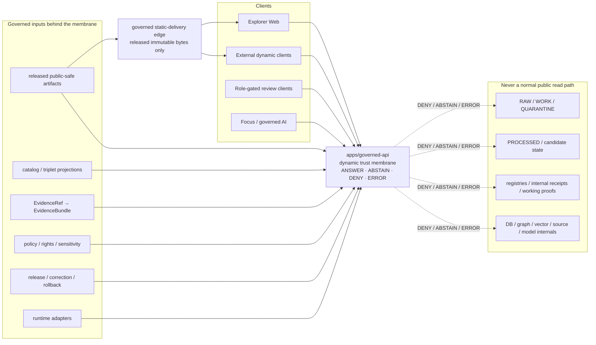

<!-- [KFM_META_BLOCK_V2]
doc_id: kfm://doc/adr-0004-apps-governed-api-trust-membrane
title: "ADR-0004 — `apps/governed-api/` is the Trust Membrane"
type: adr
adr_id: ADR-0004
version: v1.2
status: draft
owners:
  - "NEEDS VERIFICATION — architecture decision owner"
  - "NEEDS VERIFICATION — governed API owner"
  - "NEEDS VERIFICATION — security owner"
owner_status: "CODEOWNERS routes docs/adr/ and apps/governed-api/ to @bartytime4life; accepted stewardship, required-review rules, and independent approval controls were not verified"
reviewers_required:
  - Architecture steward
  - Docs steward
  - Governed API / application steward
  - Security / privacy reviewer
  - Policy and evidence reviewer
  - Release steward
  - "at least one affected client or subsystem owner"
created: 2026-05-10
updated: 2026-07-23
policy_label: public
truth_posture: cite-or-abstain
responsibility_root: docs/
current_path: docs/adr/ADR-0004-apps-governed-api-is-the-trust-membrane.md
supersedes: []
superseded_by: null
evidence_snapshot:
  repository: bartytime4life/Kansas-Frontier-Matrix
  base_ref: main
  base_commit: 005aa64f6d42aa5961646e733289a2b857292357
  target_prior_blob: c9047d3dbf1d0a50d1bdd456cba0a137196e59f9
  adr_index_blob: cf08fae322ac53426f7394d97897fdb942253049
  adr_readme_blob: f1b5d34a53b6c717832d587de54989ce8192bcaa
  directory_rules_doctrine_blob: 2affb080e6f0043867c64c7f06c1ca52030fbd55
  directory_rules_architecture_blob: 18653c00ba193a4afaa3e07a0924452807fb98ef
  codeowners_blob: dd2a84aa514d8ecd9208bc347f90f9a2ed37dd61
  apps_readme_blob: 7ab9c8b9c507d8d17b72eec1344e593cbf0c91ec
  governed_api_readme_blob: 4f21150852f133ba919b11f4f8792185fa870dae
  governed_api_main_blob: bcc8d3a0ddba4b225e962b594d548819df0cbb71
  governed_api_route_registry_blob: 3418168d0b267160d6ad6dd87f289e880ef4a024
  governed_api_stub_blob: 5d7c137d2e78ddfca35a1356a96333ac2e84952b
  abstain_route_test_blob: 6474cef4f7378515ab673c288fc9daea19e388a9
  boundary_guard_test_blob: d84ccd2a93bdf786e8fca11ee596dcc47e543fc2
  decision_envelope_contract_blob: b5120a208910f5e2907874b03af1fc8c7f43363d
  decision_envelope_schema_blob: 349782c8760f77e432ed1e9239d5ddc2ffe1f9b8
  runtime_response_contract_blob: b81d67dccdd8470e066ab8247eb93c5df67a6679
  runtime_response_schema_blob: 5105d419432a27176a8ee10870d75400cfa2ab8c
  runtime_response_validator_blob: 11ddc64c4299d103b0eef383c2f7bdd3bb12f1f9
  runtime_response_fixtures_blob: bab491633f23fe8daf27fa1d24d5f180dc850b35
  api_test_workflow_blob: 5ec0ff53cc874935ed8ef5de791b70a52635ef33
  policy_boundary_workflow_blob: 6d442a6cdd0b146cd4003cbf1d7c619a455a16ae
  makefile_blob: 51537af34ee065c2de571134688415042b83b22a
  explorer_boundary_test_blob: 97d44069b0a5ab4a82b1e1fc48665e905c08a287
  adr_0025_blob: 47762b9f6fc903c4a70b45de7c3030610082f695
  apps_api_path_at_base: absent
  apps_governed_api_underscore_path_at_base: absent
related:
  - docs/adr/README.md
  - docs/adr/INDEX.md
  - docs/adr/ADR-0001-schema-home--schemas-contracts-v1-is-canonical.md
  - docs/adr/ADR-0002-contracts-vs-schemas-split.md
  - docs/adr/ADR-0003-policy-singular-is-canonical-(policies-is-compatibility).md
  - docs/adr/ADR-0005-apps-explorer-web-is-the-canonical-map-first-shell.md
  - docs/adr/ADR-0006-maplibre-boundary--only-maplibreadapter-imports-maplibre.md
  - docs/adr/ADR-0008-ollama-subordinate-to-governed-api.md
  - docs/adr/ADR-0010-deny-by-default-for-dna-rare-species-archaeology-infrastructure.md
  - docs/adr/ADR-0019-ai-adapter-contract-and-finite-envelopes.md
  - docs/adr/ADR-0020-abstain-is-a-first-class-decision.md
  - docs/adr/ADR-0025-public-client-never-reads-canonical-internal-stores.md
  - docs/doctrine/directory-rules.md
  - docs/architecture/directory-rules.md
  - docs/architecture/governed-api.md
  - apps/README.md
  - apps/governed-api/README.md
  - contracts/runtime/decision_envelope.md
  - contracts/runtime/runtime_response_envelope.md
  - schemas/contracts/v1/runtime/decision_envelope.schema.json
  - schemas/contracts/v1/runtime/runtime_response_envelope.schema.json
  - fixtures/contracts/v1/runtime/runtime_response_envelope/README.md
  - tools/validators/validate_runtime_response_envelope.py
  - apps/governed-api/tests/test_abstain_routes.py
  - apps/governed-api/tests/test_boundary_guards.py
  - tests/policy/test_explorer_web_adapter_boundary.py
  - .github/workflows/api-test.yml
  - .github/workflows/policy-boundary-guards.yml
  - Makefile
tags: [kfm, adr, governed-api, trust-membrane, runtime, evidence, policy, finite-outcomes, public-client, fail-closed, rollback]
notes:
  - "v1.2 is a same-path repository-grounded modernization. It preserves source metadata `draft` and effective decision status `proposed`; it does not accept ADR-0004 or change runtime behavior."
  - "The repository now contains a bounded WSGI scaffold at apps/governed-api/ with three registered GET routes: /bootstrap, /layers, and /evidence."
  - "All three routes currently return fail-closed ABSTAIN / NOT_IMPLEMENTED payloads that are tested against DecisionEnvelope shape; they do not implement the richer RuntimeResponseEnvelope client contract."
  - "The RuntimeResponseEnvelope contract, schema, validator, and minimal fixtures exist, but current route conformance, policy/evidence/release integration, authorization, deployment, logs, dashboards, and production isolation are not established."
  - "Exact tracked paths apps/api/ and apps/governed_api/ were absent at the pinned snapshot; this does not prohibit a later reviewed compatibility or migration surface."
[/KFM_META_BLOCK_V2] -->

<a id="top"></a>

# ADR-0004 — `apps/governed-api/` is the Trust Membrane

> **Proposed decision.** KFM will use `apps/governed-api/` as the single dynamic public trust path for trust-bearing responses. It will mediate evidence, policy, release, correction, rollback, freshness, and finite outcomes before ordinary clients receive a response. Released public-safe static artifacts may use a governed static-delivery edge, but that edge is not a second API, a canonical store, or independent publication authority.

[](#1-status)
[](#11-current-repository-evidence-snapshot)
[](#11-current-repository-evidence-snapshot)
[](#61-current-scaffold-vs-target-contract)
[](#61-current-scaffold-vs-target-contract)
[](#13-authority-and-publication-boundary)

> [!IMPORTANT]
> **Repository configuration is not reviewed decision authority.** The pinned repository contains a working fail-closed scaffold under `apps/governed-api/`, and the app, tests, workflows, and root documentation already point to it as the intended trust membrane. The canonical ADR index still records ADR-0004 with source metadata `draft` and effective status `proposed`. This revision describes the observed implementation boundary without promoting the decision to `accepted`.

> [!CAUTION]
> **A scaffolded API is not a complete trust membrane.** The current routes return `ABSTAIN / NOT_IMPLEMENTED` and are checked against `DecisionEnvelope` shape. The richer `RuntimeResponseEnvelope` contract and schema exist separately. Evidence resolution, policy evaluation, authorization, release/correction/rollback projection, citation validation, safe observability, deployment isolation, and production operation remain incomplete or unverified.

**Quick navigation:** [Status](#1-status) · [Context](#2-context) · [Decision](#3-decision) · [Diagram](#4-trust-membrane--diagram) · [Invariants](#5-operational-invariants) · [Envelopes](#6-runtimeresponseenvelope-contract) · [Negative outcomes](#7-required-deny-cases) · [Surfaces](#8-affected-paths) · [`apps/api/`](#9-resolution-of-the-appsapi-question) · [Consequences](#10-consequences) · [Alternatives](#11-alternatives-considered) · [Migration](#12-migration--backward-compatibility) · [Validation](#13-validation--compliance) · [Evidence](#14-related-adrs-and-docs) · [Open work](#15-open-questions--needs-verification)

---

## 1. Status

| Field | Current value |
|---|---|
| **ADR ID** | `ADR-0004` — unique and confirmed in the canonical [`INDEX.md`](./INDEX.md) |
| **Source metadata** | `draft` |
| **Effective decision status** | `proposed` — not binding as an accepted ADR until the record and index carry matching reviewed `accepted` status |
| **Decision class** | Public trust-path selection, dynamic API boundary, finite client outcome contract, and prevention of parallel public API authority |
| **Tracked path** | `docs/adr/ADR-0004-apps-governed-api-is-the-trust-membrane.md` |
| **Owning responsibility root** | `docs/` — human-facing architecture decision record |
| **Configured implementation path** | [`apps/governed-api/`](../../apps/governed-api/) |
| **Current implementation posture** | Bounded WSGI scaffold with three GET routes, deterministic fail-closed `ABSTAIN` responses, and structural/schema tests |
| **Current trust-membrane maturity** | Partial. Full evidence, policy, authorization, release, correction, rollback, citation, and operational integration is not established |
| **Publication effect** | None. This ADR, a route, schema pass, test pass, workflow run, commit, pull request, or merge does not approve release or publish KFM material |

### 1.1 Current repository evidence snapshot

The following findings are **CONFIRMED at `main@005aa64f6d42aa5961646e733289a2b857292357`** unless marked otherwise.

| Surface | Verified state | What it proves—and does not prove |
|---|---|---|
| [`docs/adr/INDEX.md`](./INDEX.md) | ADR-0004 is uniquely indexed at this exact path with effective status `proposed` and source metadata `draft`. | Proves identity and status normalization; does not accept the decision. |
| [`docs/adr/README.md`](./README.md) | ADRs are append-only decision memory; source and effective status must transition together. | Proves ADR governance; does not prove implementation. |
| Directory Rules | Both live Directory Rules files classify `apps/` as deployable implementation and name `apps/governed-api/` as the public trust path. The two files disagree about their own canonical document placement. | Supports the app placement; leaves Directory Rules document identity `CONFLICTED`. |
| [`apps/README.md`](../../apps/README.md) | Repository-grounded root index names seven app lanes and describes Governed API as the public trust membrane. | Proves current app inventory guidance; not formal ADR acceptance or deployment proof. |
| [`apps/governed-api/README.md`](../../apps/governed-api/README.md) | Existing app README defines the intended app boundary and keeps route/deployment maturity bounded. | Proves app documentation and path presence; not complete enforcement. |
| [`main.py`](../../apps/governed-api/src/governed_api/main.py) | A standard-library WSGI app serves registered GET routes, rejects non-GET methods on known routes with `405`, and returns `404` for unknown routes. | Proves bounded executable behavior; not authentication, policy, evidence, or production posture. |
| [`routes/registry.py`](../../apps/governed-api/src/governed_api/routes/registry.py) | Registers exactly `/bootstrap`, `/layers`, and `/evidence`. | Proves the current route surface. |
| [`stub.py`](../../apps/governed-api/src/governed_api/stub.py) | Emits deterministic-shape `ABSTAIN / NOT_IMPLEMENTED` payloads with empty evidence refs. | Proves fail-closed scaffolding; not a substantive answer or full client envelope. |
| [`test_abstain_routes.py`](../../apps/governed-api/tests/test_abstain_routes.py) | Iterates the route registry and checks `200`, `ABSTAIN`, `NOT_IMPLEMENTED`, empty evidence refs, fixed timestamps, and DecisionEnvelope schema subset conformance. | Proves bounded scaffold behavior when the test passes; not RuntimeResponseEnvelope conformance or end-to-end governance. |
| [`test_boundary_guards.py`](../../apps/governed-api/tests/test_boundary_guards.py) | Checks `404`, `405`, exact route inventory, forbidden renderer/model imports, and forbidden internal-store path literals. | Proves selected static/API boundaries; not network isolation, authorization, or semantic policy behavior. |
| [`DecisionEnvelope` contract](../../contracts/runtime/decision_envelope.md) and [schema](../../schemas/contracts/v1/runtime/decision_envelope.schema.json) | Existing finite decision object with `ANSWER`, `ABSTAIN`, `DENY`, and `ERROR`; current scaffold is compatible with its required subset. | Provides decision posture; is not the complete client response contract. |
| [`RuntimeResponseEnvelope` contract](../../contracts/runtime/runtime_response_envelope.md) and [schema](../../schemas/contracts/v1/runtime/runtime_response_envelope.schema.json) | Existing client-facing contract and closed schema requiring policy, freshness, correction, and EvidenceRef-shaped fields. | Proves the target machine/semantic surface exists; current routes do not yet conform to it. |
| [RuntimeResponseEnvelope validator](../../tools/validators/validate_runtime_response_envelope.py) and [fixtures](../../fixtures/contracts/v1/runtime/runtime_response_envelope/README.md) | A validator runner and one valid/one invalid fixture family exist. | Proves shape-validation machinery; not API use, evidence resolution, or policy correctness. |
| [`api-test.yml`](../../.github/workflows/api-test.yml) | Runs the governed-api smoke suite and focused ABSTAIN route test with read-only contents permission. | Proves command-bearing CI definition; current run/pass state was not returned for the pinned base. |
| [`policy-boundary-guards.yml`](../../.github/workflows/policy-boundary-guards.yml) | Runs 15 structural/static/API tests in four modules and emits a non-authoritative JUnit artifact. | Proves bounded guard wiring; not policy-bundle evaluation, evidence closure, or release approval. |
| [`Makefile`](../../Makefile) | Implements `governed-api-dev`, `governed-api-smoke`, `governed-api-verify`, and boundary-guard targets; the broad `deny-test` remains a non-enforcing readiness marker. | Proves repository-native commands; highlights incomplete deny-suite maturity. |
| [`test_explorer_web_adapter_boundary.py`](../../tests/policy/test_explorer_web_adapter_boundary.py) | Explorer source has static guards against internal-store path literals and renderer imports outside adapters. | Proves selected source-boundary checks; not that all network calls use a governed client wrapper. |
| Exact `apps/api/` and `apps/governed_api/` paths | GitHub contents lookups returned `404 Not Found`. | Supports “no current parallel tracked app path”; does not prohibit later reviewed compatibility or migration work. |
| Deployment, auth, logs, dashboards, audit sinks, live policy/evidence consumers | **UNKNOWN / NEEDS VERIFICATION** | No current operational evidence was admitted for this revision. |

### 1.2 Decision scope

**In scope**

- The canonical dynamic public trust-path responsibility of `apps/governed-api/`.
- The relationship between ordinary clients, role-gated clients, released static delivery, runtime adapters, evidence resolution, policy, and release state.
- Finite public outcomes: `ANSWER`, `ABSTAIN`, `DENY`, and `ERROR`.
- Prevention of direct public reads from canonical, candidate, internal, or model-runtime stores.
- Adoption, compatibility, validation, correction, rollback, and status-transition gates.
- Separation between the currently implemented DecisionEnvelope scaffold and the target RuntimeResponseEnvelope contract.

**Out of scope**

- Accepting ADR-0004 or any related ADR.
- Selecting an API framework beyond the current bounded WSGI scaffold.
- Final route prefixes, domain route inventory, DTO implementation, authentication provider, deployment topology, cache, rate limits, or observability stack.
- Defining policy semantics, evidence truth, release approval, or source rights.
- Changing app code, contracts, schemas, policy, tests, workflows, release objects, or deployment behavior in this documentation-only revision.
- Treating a static artifact, schema pass, workflow result, or API response as publication authority.

### 1.3 Authority and publication boundary

`apps/governed-api/` is an **implementation and enforcement boundary**, not a sovereign truth or release authority.

```text
contracts/                  -> semantic meaning
schemas/contracts/v1/       -> machine-checkable shape
policy/                     -> admissibility, rights, sensitivity, obligations
data/registry/              -> source identity and governed registries
data/<phase>/               -> lifecycle state
data/proofs/                -> evidence/proof support
release/                    -> release, correction, withdrawal, rollback decisions
runtime/ + packages/        -> adapters and reusable mechanics behind the membrane
apps/governed-api/          -> governed projection and finite client outcomes
apps/explorer-web/          -> public/semi-public map-first client
apps/review-console/        -> role-gated review client
```

The API may project a reviewed state. It cannot create evidence closure, clear rights by assertion, approve release, make a model answer true, or move an object through the lifecycle.

---

## 2. Context

KFM is a governed, evidence-first, map-first, time-aware spatial knowledge and publication system. Its lifecycle invariant is:

```text
RAW -> WORK / QUARANTINE -> PROCESSED -> CATALOG / TRIPLET -> PUBLISHED
```

Promotion is a governed state transition, not a file move. Each state carries different identity, rights, sensitivity, validation, evidence, review, release, correction, and rollback posture.

### 2.1 The problem

Public and semi-public consumers need a consistent way to receive KFM state without gaining direct access to the stores, tools, or model runtimes that produced it.

Without one executable trust boundary:

- a client may read `RAW`, `WORK`, `QUARANTINE`, `PROCESSED`, candidate, registry, graph, vector, or model state directly;
- two APIs may apply different denial, evidence, citation, or release rules;
- generated text or rendered map properties may be mistaken for evidence;
- a route may leak exact protected locations, living-person data, genomic inference, infrastructure detail, internal paths, stack traces, or prompts;
- stale or corrected material may remain visible without a governed state change;
- receipts or test success may be mistaken for proof or release authority;
- rollback may restore code without restoring the response contract and released state that clients relied on.

The risk is not merely inconsistent routing. The risk is **parallel or bypassed authority at the public boundary**.

### 2.2 Current repository reality

The repository has moved beyond a doctrine-only state:

1. `apps/governed-api/` exists.
2. A small WSGI application and route registry exist.
3. `/bootstrap`, `/layers`, and `/evidence` return deterministic fail-closed scaffold responses.
4. Route and boundary tests exist.
5. API and boundary workflows invoke repository-owned commands.
6. DecisionEnvelope and RuntimeResponseEnvelope contract/schema families both exist.
7. The scaffold is aligned with DecisionEnvelope but not yet with the full RuntimeResponseEnvelope client contract.
8. Exact tracked `apps/api/` and `apps/governed_api/` paths are absent at the pinned snapshot.
9. Authorization, policy evaluation, EvidenceBundle resolution, released-state lookup, correction/rollback projection, and deployed operation remain incomplete or unverified.

This creates a precise governance gap: **the path and a safe scaffold exist, but the formal ADR remains proposed and the full trust-membrane flow is not closed.**

### 2.3 Forces and tradeoffs

| Force | Pressure | Governed response |
|---|---|---|
| Developer convenience | Read a file, DB, graph, bucket, or model endpoint directly. | Preserve one mediated dynamic path and explicit static-release verification. |
| Performance | Remove envelope and evidence metadata. | Set budgets, cache safely, and optimize after preserving traceability. |
| Static delivery | Serve PMTiles, COG, GeoParquet, reports, stories, or JSON directly. | Permit only released public-safe artifacts through a governed static edge with verifiable release, digest, correction, and rollback context. |
| Domain autonomy | Create per-domain public APIs. | Keep domain routes inside one trust membrane; domains remain lanes, not public API roots. |
| AI integration | Let the browser call a model provider or local runtime. | Keep adapters behind the API and emit finite, evidence-bounded outcomes. |
| Steward workflows | Read or mutate receipt/report/diff files from browser code. | Use role-gated governed projections and explicit audited submit operations. |
| Backward compatibility | Preserve existing URLs and client expectations. | Adapt handlers behind the path; version the client envelope when shape changes. |
| Operational recovery | Revert code quickly. | Bind route, schema, release, cache, correction, and rollback state; code rollback alone is insufficient. |

---

## 3. Decision

If accepted, ADR-0004 makes the following rule binding:

> **KFM MUST use `apps/governed-api/` as the single dynamic public trust path for trust-bearing responses. Ordinary and role-gated clients MUST NOT read canonical, candidate, internal, source-system, graph/vector, or model-runtime stores directly. Every dynamic trust-bearing response MUST resolve to exactly one finite client outcome: `ANSWER`, `ABSTAIN`, `DENY`, or `ERROR`.**

### 3.1 Dynamic public and role-gated traffic

The rule applies to:

- Explorer Web and other normal UI clients;
- external dynamic API consumers;
- Evidence Drawer and feature-explanation requests;
- Focus Mode and governed-AI requests;
- Story, Compare, and Export requests that require dynamic trust decisions;
- correction, supersession, withdrawal, rollback, and release-state lookups;
- role-gated review retrievals and steward submissions;
- public-safe layer and catalog projections where a dynamic response is required.

A role-gated route may expose more than a public route only when authorization, purpose, policy, audit, retention, and response obligations are explicit. Role gating does not create a direct file-access exception.

### 3.2 Governed static-delivery edge

Released public-safe immutable artifacts may be served without transiting the dynamic WSGI process on every byte request when all applicable conditions are met:

- the artifact is in reviewed released state;
- an immutable identity and digest bind the bytes;
- release, correction, withdrawal, supersession, and rollback references are discoverable;
- rights, sensitivity, redaction/generalization, audience, cache, and expiry posture are enforced;
- client or edge verification cannot silently fall back to unverified bytes;
- the edge cannot browse or expose canonical/internal stores;
- the edge does not emit independent trust decisions or become a second dynamic API.

This is a delivery optimization, not a second trust authority.

### 3.3 Finite outcomes

Every dynamic trust-bearing response uses the four-value outward grammar:

| Outcome | Meaning | Minimum client posture |
|---|---|---|
| `ANSWER` | Sufficient policy-safe, release-appropriate support exists for the bounded response. | Render only with required evidence, citation, limitation, correction, and obligation context. |
| `ABSTAIN` | Evidence, freshness, scope, citation, correction, or policy context is insufficient for a safe answer. | Show a safe reason and do not infer or fabricate the missing answer. |
| `DENY` | Rights, sensitivity, role, source terms, release state, or policy prohibits the requested response. | Do not disclose the protected payload or infer it from metadata. |
| `ERROR` | The system cannot complete safely or deterministically. | Return only an audit-safe fault reference; do not fall back to an answer or leak internals. |

Validator outcomes, workflow states, policy-engine native values, promotion states, and HTTP statuses are separate vocabularies. They must not become a fifth client outcome by implication.

### 3.4 No direct public path to internal state

Ordinary clients MUST NOT directly read:

- `data/raw/`, `data/work/`, `data/quarantine/`, or `data/processed/`;
- unpublished catalog/triplet candidates;
- internal receipts, proof working sets, registries, graph stores, search/vector indexes, databases, or object-store namespaces;
- connectors, pipelines, watcher outputs, or source-system endpoints as KFM truth;
- model providers, local model runtimes, prompt stores, or model caches;
- review working files, diffs, local reports, or filesystem paths;
- unreleased, withdrawn, superseded-without-disclosure, or correction-blocked artifacts.

### 3.5 Evidence, policy, release, and correction obligations

A conformant implementation must:

1. validate request shape and caller context;
2. resolve policy, rights, sensitivity, purpose, audience, and applicable obligations;
3. resolve `EvidenceRef` to admissible support where a claim depends on evidence, or abstain;
4. bind released artifacts to their release state and immutable identity;
5. account for freshness, correction, withdrawal, supersession, and rollback state;
6. validate the outward response envelope;
7. prevent sensitive or internal information from leaking through payload, reason, metadata, logs, metrics, errors, cache keys, or timing where material;
8. emit or reference audit information appropriate to the operation without turning logs into truth or publication authority.

### 3.6 Watchers, workers, renderers, and AI remain subordinate

- Watchers and workers may emit candidates, receipts, reports, and review work; they do not publish or answer public clients directly.
- MapLibre, tiles, popups, Story Nodes, screenshots, exports, and 3D scenes are downstream carriers, not evidence or release authority.
- Model adapters run behind the membrane. Model output is interpretive and must not bypass evidence, policy, citation, review, or release state.
- Admin and operator shortcuts are constrained, role-gated, audited, documented, and excluded from the normal public path.

---

## 4. Trust Membrane — Diagram



> [!NOTE]
> Dotted lines are refusal paths, not data-access paths. The static edge may serve only released public-safe immutable artifacts with verifiable governance context; it is not a second dynamic trust membrane.

---

## 5. Operational Invariants

| ID | Invariant | Current evidence posture |
|---|---|---|
| `ADR4-I01` | `apps/governed-api/` is the only dynamic normal public trust path. | PROPOSED decision; current path and scaffold CONFIRMED |
| `ADR4-I02` | Every dynamic trust-bearing response has exactly one outward outcome: `ANSWER`, `ABSTAIN`, `DENY`, or `ERROR`. | Contract/schema families CONFIRMED; full route conformance open |
| `ADR4-I03` | Public and ordinary UI clients never read canonical, candidate, internal, source-system, graph/vector, or model-runtime stores directly. | CONFIRMED doctrine; selected static guards CONFIRMED |
| `ADR4-I04` | Claims requiring evidence resolve `EvidenceRef` to admissible support behind the membrane or return `ABSTAIN`/`DENY`. | CONFIRMED doctrine; runtime resolution NEEDS VERIFICATION |
| `ADR4-I05` | Policy, rights, sensitivity, audience, purpose, release, freshness, and correction state are checked before response exposure. | CONFIRMED doctrine; integrated execution NEEDS VERIFICATION |
| `ADR4-I06` | `ERROR` never leaks prompts, chain-of-thought, secrets, stack traces, filesystem paths, protected geometry, or adapter internals. | CONFIRMED doctrine; representative runtime tests NEEDS VERIFICATION |
| `ADR4-I07` | Released static delivery remains digest-, manifest-, correction-, and rollback-aware and cannot browse internal stores. | PROPOSED adoption gate |
| `ADR4-I08` | Watchers and workers are candidate producers, not publishers or public APIs. | CONFIRMED doctrine; selected pipeline guard exists |
| `ADR4-I09` | Renderers, tiles, popups, screenshots, summaries, graphs, scenes, and model output remain downstream carriers. | CONFIRMED doctrine |
| `ADR4-I10` | Review clients use governed role-gated projections and audited submit operations; browser intent never mutates files directly. | PROPOSED implementation target |
| `ADR4-I11` | Admin/operator shortcuts remain constrained and outside the normal public path. | CONFIRMED doctrine; operational controls UNKNOWN |
| `ADR4-I12` | Response behavior remains correction- and rollback-addressable; code rollback alone is not sufficient. | CONFIRMED doctrine; runtime implementation NEEDS VERIFICATION |
| `ADR4-I13` | A test, receipt, workflow, commit, PR, merge, or badge is not policy approval, release approval, or publication. | CONFIRMED governance boundary |

---

## 6. `RuntimeResponseEnvelope` Contract

The target client-facing contract already exists at:

- [`contracts/runtime/runtime_response_envelope.md`](../../contracts/runtime/runtime_response_envelope.md) — semantic meaning;
- [`schemas/contracts/v1/runtime/runtime_response_envelope.schema.json`](../../schemas/contracts/v1/runtime/runtime_response_envelope.schema.json) — machine shape;
- [`tools/validators/validate_runtime_response_envelope.py`](../../tools/validators/validate_runtime_response_envelope.py) — dedicated shape validator;
- [`fixtures/contracts/v1/runtime/runtime_response_envelope/`](../../fixtures/contracts/v1/runtime/runtime_response_envelope/) — minimal valid/invalid fixtures.

### 6.1 Current scaffold vs target contract

The current route implementation is **CONFIRMED / CONFLICTED** with the full target:

| Surface | Current scaffold | Target client contract |
|---|---|---|
| Semantic family | `DecisionEnvelope`-like runtime decision | `RuntimeResponseEnvelope` client response |
| Route test schema | `decision_envelope.schema.json` subset | `runtime_response_envelope.schema.json` |
| Required outcome field | `outcome` plus compatibility `decision` | `outcome` |
| Required governance state | `policy_family`, `reasons`, `obligations`, `evaluated_at` | `policy_state`, `freshness`, `correction_state` |
| Evidence refs | Array of strings, currently empty | Array of EvidenceRef objects |
| Additional properties | Decision schema is closed, but subset helper checks only selected compatibility | RuntimeResponseEnvelope schema is closed |
| Current result | `ABSTAIN / NOT_IMPLEMENTED` for all three routes | Status-specific public response contract |
| Maturity | Safe scaffold | Not yet wired into the route surface |

The current payload must not be relabeled as a full RuntimeResponseEnvelope merely because both families share the four outcomes.

### 6.2 Schema-confirmed RuntimeResponseEnvelope field surface

| Field | Required | Confirmed machine role |
|---|---:|---|
| `id` | yes | Stable response-envelope identifier matching `^[a-z][a-z0-9_:.-]*$` |
| `spec_hash` | yes | SHA-256 lineage hash matching `^sha256:[a-f0-9]{64}$` |
| `version` | yes | Envelope version token |
| `issued_at` | yes | Date-time emission timestamp |
| `outcome` | yes | `ANSWER`, `ABSTAIN`, `DENY`, or `ERROR` |
| `reason_code` | yes | Safe primary reason classification |
| `evidence_refs` | yes | Array of EvidenceRef objects |
| `policy_state` | yes | Policy posture summary |
| `freshness` | yes | Freshness/staleness posture |
| `correction_state` | yes | Correction/withdrawal/supersession/rollback posture |

The schema sets `additionalProperties: false`.

### 6.3 Convergence rule

Before ADR-0004 can be accepted as operationally adopted:

1. choose whether the current scaffold remains an internal DecisionEnvelope phase or changes directly to RuntimeResponseEnvelope;
2. define an explicit, tested mapping between DecisionEnvelope, PolicyDecision, RuntimeResponseEnvelope, and endpoint payload;
3. ensure `outcome` is the sole client outcome field and no aliases conflict;
4. ensure evidence refs use the schema-defined object shape;
5. define controlled vocabularies or contracts for policy, freshness, correction, reason, and obligation state;
6. add representative `ANSWER`, `ABSTAIN`, `DENY`, and `ERROR` cases;
7. validate full responses rather than schema subsets where a public RuntimeResponseEnvelope is claimed;
8. version or migrate clients when the outward shape changes.

---

## 7. Required Deny Cases

This section preserves the original negative-state contract while separating **current proof** from **acceptance targets**.

| Trigger | Required outward outcome | Current proof posture |
|---|---|---|
| Request targets RAW, WORK, QUARANTINE, PROCESSED, candidate, registry, internal receipt/proof working set, graph/vector, source, or model-runtime state. | `DENY` or `ABSTAIN` only where policy explicitly treats support as unavailable rather than prohibited. | Static forbidden-path guards exist; request-level deny behavior not established. |
| Request targets an unreleased, withdrawn, correction-blocked, or superseded-without-disclosure artifact. | `DENY` or safe corrected alternative. | NEEDS VERIFICATION |
| Exact archaeology, burial, sacred/cultural, rare-species, living-person, genomic, or critical-infrastructure detail is not cleared for the caller and purpose. | `DENY`, reviewed restriction, or public-safe transformed alternative. | Doctrine and related ADRs exist; integrated route policy NEEDS VERIFICATION. |
| Claim-bearing response cannot resolve admissible evidence or validate required citations. | `ABSTAIN`; `DENY` when policy forbids disclosure of why. | Current scaffold abstains generically; real resolution/citation behavior not established. |
| Model candidate or inference is presented as observation or source truth. | `DENY`. | No direct model import guard exists in app code; semantic behavior NEEDS VERIFICATION. |
| Rights, license, terms, embargo, or attribution posture is unresolved. | `DENY` or upstream quarantine. | NEEDS VERIFICATION |
| Source or support is stale beyond endpoint policy. | `ABSTAIN` or corrected/released alternative with explicit stale posture. | Runtime implementation NEEDS VERIFICATION |
| Schema, resolver, policy, adapter, release lookup, or citation validation fails. | `ERROR` with audit-safe reference only. | Generic error-envelope behavior NEEDS VERIFICATION |
| Browser or role-gated client attempts direct local file mutation or direct receipt/report/diff reads. | `DENY`. | Documentation target; runtime proof NEEDS VERIFICATION |
| Public client calls a model provider or local model runtime directly. | `DENY` at code, policy, network, CORS/CSP, and deployment boundaries as applicable. | App import guard exists; complete browser/network proof NEEDS VERIFICATION |
| Request asks KFM to replace official emergency/life-safety instructions. | `DENY` with safe redirection to authoritative channels. | NEEDS VERIFICATION |
| Static edge receives an artifact without verifiable release identity, digest, or current correction/rollback context. | Refuse serving or refuse trust; never silently downgrade verification. | PROPOSED acceptance gate |

> [!CAUTION]
> `200 OK` with an empty or unsupported `ANSWER` is not a governed success. HTTP status and runtime outcome are separate. Negative tests must assert outcome, safe reason, payload restrictions, and non-leakage.

---

## 8. Affected Paths

This ADR owns a decision record under `docs/adr/`. It directs—but does not absorb—the responsibilities below.

### 8.1 Current repository surfaces

| Path | Current role | Verified maturity |
|---|---|---|
| [`apps/governed-api/`](../../apps/governed-api/) | Deployable trust-membrane scaffold | Present; bounded WSGI and docs |
| [`apps/governed-api/src/governed_api/main.py`](../../apps/governed-api/src/governed_api/main.py) | WSGI entrypoint and HTTP method/path dispatch | Implemented, small |
| [`apps/governed-api/src/governed_api/routes/registry.py`](../../apps/governed-api/src/governed_api/routes/registry.py) | Three-route registry | Implemented |
| [`apps/governed-api/src/governed_api/stub.py`](../../apps/governed-api/src/governed_api/stub.py) | Fail-closed ABSTAIN scaffold | Implemented; not full envelope |
| [`apps/governed-api/tests/`](../../apps/governed-api/tests/) | App-local boundary and scaffold tests | Two verified modules; broader coverage open |
| [`contracts/runtime/decision_envelope.md`](../../contracts/runtime/decision_envelope.md) | Runtime decision semantics | Present, draft/proposed |
| [`schemas/contracts/v1/runtime/decision_envelope.schema.json`](../../schemas/contracts/v1/runtime/decision_envelope.schema.json) | Current scaffold test shape | Present, proposed |
| [`contracts/runtime/runtime_response_envelope.md`](../../contracts/runtime/runtime_response_envelope.md) | Client response semantics | Present, draft/proposed |
| [`schemas/contracts/v1/runtime/runtime_response_envelope.schema.json`](../../schemas/contracts/v1/runtime/runtime_response_envelope.schema.json) | Target client response shape | Present, proposed |
| [`tools/validators/validate_runtime_response_envelope.py`](../../tools/validators/validate_runtime_response_envelope.py) | Dedicated shape validator | Present |
| [`fixtures/contracts/v1/runtime/runtime_response_envelope/`](../../fixtures/contracts/v1/runtime/runtime_response_envelope/) | Minimal shape fixtures | One valid, one invalid |
| [`policy/runtime/README.md`](../../policy/runtime/README.md) | Runtime policy lane | Greenfield stub; named policy files from v1.1 are absent |
| [`api-test.yml`](../../.github/workflows/api-test.yml) | Governed API smoke and ABSTAIN route CI | Command-bearing; current run state unknown |
| [`policy-boundary-guards.yml`](../../.github/workflows/policy-boundary-guards.yml) | Cross-boundary static/API suite | Command-bearing; bounded |
| [`Makefile`](../../Makefile) | Repository-native app and boundary commands | Implemented targets plus a non-enforcing broad deny-test marker |

### 8.2 Adoption surfaces—not changed by this documentation PR

Future implementation may affect:

- governed-api handlers, middleware, dependency wiring, auth, rate/size limits, policy and evidence adapters;
- Explorer Web, review-console, external clients, and any governed client wrapper;
- RuntimeResponseEnvelope contract/schema vocabularies, fixtures, validators, and client compatibility;
- policy runtime modules and policy test matrices;
- evidence resolver, citation validation, release/correction/rollback lookup, cache, audit, telemetry, and deployment;
- static delivery manifests, edge verification, content digests, cache invalidation, and correction/withdrawal behavior;
- tests and workflows proving positive, negative, non-leakage, replay, correction, and rollback cases.

No new path in that list is authorized merely by this ADR modernization. Each implementation path must be checked against Directory Rules, current repo evidence, and applicable ADRs before creation or movement.

---

## 9. Resolution of the `apps/api/` Question

At the pinned snapshot:

- `apps/governed-api/` is tracked and contains the current scaffold;
- exact tracked `apps/api/` and `apps/governed_api/` paths were not found;
- no app-path migration is required by this documentation update.

If `apps/api/` or another dynamic API surface is proposed later:

| State | Required treatment |
|---|---|
| Compatibility alias or proxy to governed-api | Declare class and scope; prove it cannot bypass or independently decide trust. |
| Internal-only service | Document network, caller, data, and non-public boundary; public origins and clients must not use it. |
| Narrow subsystem service | Keep it behind governed-api or an accepted successor architecture; do not expose parallel public trust decisions. |
| Second public dynamic API | Prohibited unless a successor accepted ADR explicitly replaces this single-membrane decision. |
| Legacy path | Freeze new public authority, inventory consumers, record migration/deprecation, and retire with rollback support. |
| Underscore spelling `apps/governed_api/` | Do not create a sibling. Use reviewed migration/compatibility handling if entrenched evidence later appears. |

A future path migration requires exact consumer inventory, history preservation, endpoint compatibility, response-contract versioning, policy/evidence parity, negative tests, deployment/caching analysis, and rollback or forward-fix evidence. The current `migrations/` contract does not establish an app-specific migration lane; do not invent `migrations/apps/` or `migrations/api/` without a reviewed placement decision.

---

## 10. Consequences

### Positive consequences

- **One dynamic enforcement point.** Evidence, policy, rights, sensitivity, release, freshness, correction, and finite outcome behavior can converge.
- **Visible negative states.** `ABSTAIN`, `DENY`, and `ERROR` become first-class client behavior rather than nulls, empty answers, or leaked exceptions.
- **No renderer or AI bypass.** Maps, exports, stories, review surfaces, and models remain downstream of the same trust rules.
- **Auditable client contracts.** Decision, evidence, release, correction, and rollback context can travel in a versioned envelope.
- **Static delivery remains efficient without becoming sovereign.** Released immutable artifacts may use an edge while preserving verifiability.
- **Parallel API drift is easier to detect.** Any new dynamic public service must explain its relationship to the membrane.
- **The current scaffold has a governed upgrade path.** Fail-closed behavior can be preserved while richer integration lands incrementally.

### Costs and tradeoffs

- **Envelope and resolver overhead.** Traceability increases payload size, latency, code, cache, and operational complexity.
- **Client complexity.** Every client must render four outcomes and honor correction, freshness, and obligations.
- **Migration burden.** The current DecisionEnvelope-compatible scaffold must converge deliberately on the client-facing RuntimeResponseEnvelope.
- **Policy and evidence dependencies.** The API cannot mature in isolation from contracts, schemas, policy, evidence, release, and test lanes.
- **Static-edge verification cost.** Immutable artifacts need release identity, digest, cache, correction, and rollback discipline.
- **Operational review burden.** Auth, network exposure, logs, telemetry, incident response, and rollback require evidence beyond source code.
- **Potential central bottleneck.** A single boundary may become a performance or organizational bottleneck unless internal modules remain well separated and observable.

### Bounded non-effects

- This documentation update changes no route, schema, policy, evidence, release, client, deployment, or public behavior.
- It does not accept ADR-0004 or related ADRs.
- It does not make the current scaffold production-ready.
- It does not create `apps/api/`, an alias, a static edge, a migration lane, or a new authority root.
- It does not authorize release or publication.

---

## 11. Alternatives Considered

<details>
<summary><strong>Expand the alternatives and dispositions</strong></summary>

| Alternative | Benefit | Cost / risk | Disposition |
|---|---|---|---|
| **A. `apps/governed-api/` as the single dynamic membrane** | One outward trust contract; current repository alignment; incremental scaffold path. | Central integration and performance burden. | **Selected.** |
| B. Each client enforces trust independently | Client-specific optimization. | Weakest client defines safety; external consumers bypass UI rules. | Rejected. |
| C. Put the membrane only in Explorer Web | Simple browser architecture. | Not enforceable for external clients, exports, review surfaces, or model adapters. | Rejected. |
| D. Use only a shared `packages/` helper | Reuse across services. | A library can be bypassed or misconfigured; no single exposed boundary. | Rejected as sole control; shared packages may support the app. |
| E. Per-domain public APIs | Domain autonomy. | Parallel trust vocabularies, duplicated evidence/policy/release logic, fragmented cross-domain queries. | Rejected. |
| F. `apps/api/` and `apps/governed-api/` as public siblings | Backward compatibility. | Splits the membrane and creates parallel public authority. | Rejected. |
| G. Reverse proxy, gateway, or WAF as the complete membrane | Strong network boundary and transport controls. | Cannot by itself resolve EvidenceBundle, normalize finite semantic outcomes, or enforce KFM object/release meaning. | Rejected as sole control; required as defense in depth where deployed. |
| H. Direct public model runtime | Low latency and fewer hops. | Bypasses evidence, citation, rights, sensitivity, release, safe errors, and audit. | Rejected. |
| I. Serve all public bytes only through the dynamic API | Simple conceptual boundary. | Inefficient for large immutable PMTiles/COG/GeoParquet/report assets. | Rejected in favor of a governed static-delivery edge. |
| J. Defer the decision until the API is complete | Avoids committing early. | Allows route and client drift while implementation expands. | Rejected; placement and boundary decision can precede maturity. |
| K. Use ADR-0004 for a STAC-profile decision | Preserves alternate planning lineage. | Conflicts with the canonical numbered index and current record identity. | Rejected for this ID; STAC remains separate work. |

</details>

---

## 12. Migration & Backward Compatibility

### 12.1 Current disposition

The smallest sound current action is documentation convergence:

- preserve the tracked path and H1;
- keep source metadata `draft` and effective status `proposed`;
- record the real scaffold, schemas, tests, and workflows;
- record the DecisionEnvelope/RuntimeResponseEnvelope gap;
- make no runtime or path migration in this PR.

### 12.2 Adoption sequence after review

A future implementation sequence should remain small and reversible:

1. **Inventory clients and dynamic/public edges.** Record every browser, external API, review, export, story, Focus, static artifact, proxy, CDN, and model path.
2. **Freeze the outward contract.** Reconcile DecisionEnvelope and RuntimeResponseEnvelope roles, controlled vocabularies, versioning, and compatibility.
3. **Preserve fail-closed scaffold behavior.** Add richer behavior one route family at a time without turning missing integration into an `ANSWER`.
4. **Wire request and identity context.** Add schema validation, caller/audience/purpose resolution, authorization, rate/size limits, and audit-safe IDs.
5. **Wire policy and evidence.** Resolve policy, rights, sensitivity, obligations, EvidenceRef, EvidenceBundle, and citation state.
6. **Wire release and correction state.** Resolve release identity, artifact digest, freshness, review, correction, withdrawal, supersession, rollback, and cache behavior.
7. **Add representative finite outcomes.** Exercise `ANSWER`, multiple `ABSTAIN`, `DENY`, and `ERROR` cases with public-safe fixtures.
8. **Close client bypasses.** Prove clients do not read internal stores, direct source systems, review files, or model runtimes.
9. **Harden static delivery.** Bind immutable artifacts to release and correction state; test verification failure and cache invalidation.
10. **Prove operations.** Verify deployment exposure, TLS/proxy behavior, auth, secret isolation, logs/metrics redaction, incident response, load, and rollback.
11. **Record adoption review.** Update this ADR and `INDEX.md` together only after applicable acceptance gates close.

### 12.3 Backward compatibility

- Existing external URLs may remain while handlers are moved behind the governed-api implementation, provided no parallel trust authority remains.
- RuntimeResponseEnvelope breaking changes require a schema/contract version change, producer/consumer inventory, fixtures, validation, client migration, deprecation, and rollback/forward-fix plan.
- Existing DecisionEnvelope scaffold behavior may remain as an internal phase only if its boundary and mapping to the client envelope are explicit and tested.
- A compatibility path or proxy must not strip decision, evidence, release, correction, limitation, obligation, or verification metadata.

### 12.4 Rollback

**Documentation rollback:** restore prior target blob `c9047d3dbf1d0a50d1bdd456cba0a137196e59f9` or revert the documentation commit. No runtime path requires rollback for this one-file revision.

**Future runtime rollback:** restore the last verified route bundle, envelope version, policy/evidence/release integrations, deployment configuration, and cache state through the repository's accepted release/operations controls. Record any public correction or withdrawal needed. Do not treat a code revert alone as proof that clients, caches, static artifacts, or release state were restored safely.

The exact runtime rollback switch—route flag, deployment rollback, release alias, or another mechanism—remains **NEEDS VERIFICATION** and must be selected before release-significant adoption.

---

## 13. Validation & Compliance

### 13.1 Current enforcement snapshot

| Surface | Current enforced or documented behavior | Limit |
|---|---|---|
| `test_abstain_routes.py` | All registered routes return deterministic `ABSTAIN / NOT_IMPLEMENTED` and match DecisionEnvelope schema subset. | No `ANSWER`, `DENY`, `ERROR`, auth, evidence, policy, or release behavior. |
| `test_boundary_guards.py` | `404`, `405`, route inventory, forbidden imports, and internal-store path literal guards. | Static/bounded; does not prove indirect access or deployed network isolation. |
| Explorer boundary test | No internal-store literals; renderer imports stay in adapters. | Does not prove all requests use governed API or static edge verification. |
| RuntimeResponseEnvelope validator/fixtures | Closed schema shape can be checked with a minimal valid/invalid fixture pair. | Not used by current route test. |
| `api-test.yml` | Runs smoke and focused ABSTAIN route checks with read-only contents permission. | No workflow run was returned for the pinned base; pass state unknown. |
| `policy-boundary-guards.yml` | Runs a non-vacuous 15-test structural/static/API suite and validates JUnit output. | Not policy-engine, rights/sensitivity, evidence, release, or deployment proof. |
| `governed-api-verify` | Runs app tests and denies direct MapLibre/Cesium/Ollama imports. | Import boundary only; broad `deny-test` remains a readiness marker. |
| ADR index validator | Can check ID/path/index coherence. | Does not accept ADR-0004 or prove its implementation. |

### 13.2 Acceptance gates for ADR-0004

ADR-0004 should not move to `accepted` until reviewers can close all applicable gates:

- [ ] **Identity and status:** ADR file and `INDEX.md` agree on ID, title, path, effective status, and supersession.
- [ ] **Decision ownership:** required architecture, API, security/privacy, policy/evidence, release, and client reviews are recorded.
- [ ] **Dynamic path inventory:** every public and role-gated dynamic client and service is inventoried; no hidden parallel public API remains.
- [ ] **Static edge contract:** released static delivery, digest verification, release metadata, correction/rollback, cache, and failure behavior are defined and tested.
- [ ] **Envelope convergence:** DecisionEnvelope and RuntimeResponseEnvelope roles, mapping, vocabularies, versioning, and client migration are explicit.
- [ ] **Full client-envelope tests:** claimed RuntimeResponseEnvelope responses validate against the full closed schema, not only a subset.
- [ ] **Finite outcome coverage:** representative `ANSWER`, `ABSTAIN`, `DENY`, and `ERROR` paths exist and are asserted.
- [ ] **Evidence closure:** claim-bearing `ANSWER` paths resolve admissible evidence and required citations; missing support abstains.
- [ ] **Policy and sensitivity:** rights, role, audience, purpose, sensitivity, redaction/generalization, and obligation behavior fail closed.
- [ ] **Release and correction:** release, review, freshness, correction, withdrawal, supersession, rollback, and cache state affect responses correctly.
- [ ] **No direct stores:** public and role-gated clients cannot read canonical, candidate, internal, registry, receipt/proof working, graph/vector, source, or model stores directly.
- [ ] **Safe errors and observability:** payloads, reasons, logs, metrics, traces, caches, and diagnostics do not leak secrets, prompts, chain-of-thought, protected facts, exact sensitive geometry, or internal paths.
- [ ] **Authorization and submit actions:** review/admin/operator operations are least-privileged, audited, purpose-bounded, and excluded from the normal public path.
- [ ] **Deployment evidence:** network exposure, origin policy, TLS/proxy, secrets, service identity, dependencies, health, and incident controls are verified.
- [ ] **Rollback:** route/envelope/deployment/static-edge rollback or forward-fix has been rehearsed and public correction/withdrawal implications are known.
- [ ] **Required checks:** repository rules and required CI checks are inspected; relevant runs pass for the reviewed head.
- [ ] **Status transition:** ADR-0004 and the canonical ADR index change to `accepted` together; implementation alignment alone does not promote the decision.
- [ ] **No publication inference:** acceptance record states that the ADR and its tests do not themselves release or publish data.

### 13.3 Documentation validation for this revision

The documentation change should pass:

- KFM metadata parse;
- one H1 and unique GitHub-style heading anchors;
- balanced fenced code blocks and `<details>` elements;
- valid internal fragments;
- valid repository-relative links for cited current surfaces;
- no unresolved authoring placeholders presented as current facts;
- UTF-8, LF endings, final newline, and no trailing whitespace;
- repository ADR index validation;
- documentation link/build/control-plane checks as applicable.

---

## 14. Related ADRs and Docs

| Reference | Relationship | Snapshot posture |
|---|---|---|
| [`ADR-0001`](./ADR-0001-schema-home--schemas-contracts-v1-is-canonical.md) | Default machine-schema home | Present; proposed |
| [`ADR-0002`](./ADR-0002-contracts-vs-schemas-split.md) | Meaning/shape/policy/test responsibility split | Present; effective proposed |
| [`ADR-0003`](<./ADR-0003-policy-singular-is-canonical-(policies-is-compatibility).md>) | Singular policy-root placement | Present; effective proposed |
| [`ADR-0005`](./ADR-0005-apps-explorer-web-is-the-canonical-map-first-shell.md) | Normal map-first client | Present; proposed |
| [`ADR-0006`](./ADR-0006-maplibre-boundary--only-maplibreadapter-imports-maplibre.md) | Renderer import boundary | Present; effective proposed |
| [`ADR-0008`](./ADR-0008-ollama-subordinate-to-governed-api.md) | Model runtimes remain behind governed API | Present; effective proposed |
| [`ADR-0010`](./ADR-0010-deny-by-default-for-dna-rare-species-archaeology-infrastructure.md) | Sensitive-domain default deny | Present; effective proposed |
| [`ADR-0019`](./ADR-0019-ai-adapter-contract-and-finite-envelopes.md) | AI adapter and finite envelope boundary | Present; effective proposed |
| [`ADR-0020`](./ADR-0020-abstain-is-a-first-class-decision.md) | First-class abstention | Present; proposed |
| [`ADR-0025`](./ADR-0025-public-client-never-reads-canonical-internal-stores.md) | Client-side companion invariant and governed static-edge posture | Present; effective proposed |
| [`docs/doctrine/directory-rules.md`](../doctrine/directory-rules.md) | Live placement doctrine copy | Present |
| [`docs/architecture/directory-rules.md`](../architecture/directory-rules.md) | Second live placement-doctrine copy | Present; document identity conflict unresolved |
| [`docs/architecture/governed-api.md`](../architecture/governed-api.md) | Human architecture companion | Present; several implementation claims are stale/proposed |
| [`apps/README.md`](../../apps/README.md) | Current repository-grounded app-root inventory | Present |
| [`apps/governed-api/README.md`](../../apps/governed-api/README.md) | App boundary documentation | Present; draft |
| [`DecisionEnvelope`](../../contracts/runtime/decision_envelope.md) | Current scaffold decision-object contract | Present; draft/proposed |
| [`RuntimeResponseEnvelope`](../../contracts/runtime/runtime_response_envelope.md) | Target client response contract | Present; draft/proposed |
| [`api-test`](../../.github/workflows/api-test.yml) | Governed API smoke and focused scaffold checks | Present; current run state unknown |
| [`policy-boundary-guards`](../../.github/workflows/policy-boundary-guards.yml) | Cross-boundary static/API checks | Present; bounded |

Repository implementation evidence in this ADR is pinned to the metadata snapshot. Planning and doctrine documents support the decision framing; they do not upgrade current behavior beyond verified code, schemas, tests, workflows, and artifacts.

---

## 15. Open Questions / NEEDS VERIFICATION

| ID | Item | Current evidence | Required closure |
|---|---|---|---|
| `ADR4-V01` | Decision ownership and acceptance | ADR is draft/effective proposed; CODEOWNERS is review routing only. | Record required human review and transition ADR/index together. |
| `ADR4-V02` | Directory Rules document identity | Doctrine and architecture copies both exist at different blobs. | Resolve through the governed documentation/ADR path; do not let this ADR choose between them. |
| `ADR4-V03` | DecisionEnvelope → RuntimeResponseEnvelope convergence | Current route test validates DecisionEnvelope subset; full client schema exists separately. | Accept mapping/versioning and add full response conformance tests. |
| `ADR4-V04` | Client/network inventory | Static Explorer guards exist; complete network-client inventory is not captured. | Inventory all dynamic/static/browser/external/review/model paths at a pinned revision. |
| `ADR4-V05` | Runtime policy | `policy/runtime/README.md` is a greenfield stub; named finite/no-internal-path Rego files are absent. | Accept policy input/output contract, evaluator/bundle, native tests, and governed consumer. |
| `ADR4-V06` | Evidence and citation integration | Evidence resolver package/docs exist, but current routes return empty refs. | Prove EvidenceRef resolution, citation validation, abstention, correction, and replay. |
| `ADR4-V07` | Release/correction/rollback lookup | Contract and release roots exist; current route registry has no correction/release route. | Define and test route or projection behavior and cache invalidation. |
| `ADR4-V08` | Authorization and role-gated review | No admissible current auth/runtime evidence was inspected. | Verify identity, roles, purpose, least privilege, audit, and submit controls. |
| `ADR4-V09` | Static-delivery edge | ADR-0025 proposes digest/signed-release posture; current edge implementation was not verified. | Define artifact/profile, edge verification, headers, cache, correction, withdrawal, and failure behavior. |
| `ADR4-V10` | Reason and obligation vocabularies | Current schemas permit strings and this ADR retains an illustrative list. | Establish owned registries/contracts and safe public/restricted projections. |
| `ADR4-V11` | Safe observability and retention | Workflow/test definitions do not establish deployed logs, metrics, traces, audit joins, or retention. | Define redaction, access, retention, deletion, incident, and replay contracts. |
| `ADR4-V12` | Performance and availability | No latency, payload, load, SLO, degradation, or mobile budget is accepted. | Benchmark representative envelopes/static edges and define fail-closed degradation. |
| `ADR4-V13` | Runtime rollback mechanism | Documentation rollback is exact; route/deployment/static rollback selector is open. | Choose and rehearse governed rollback/forward-fix with correction implications. |
| `ADR4-V14` | Required checks and branch controls | Workflow definitions exist; no current base run/status was returned. | Inspect repository rulesets and record passing relevant runs for reviewed head. |
| `ADR4-V15` | Future `apps/api/` admission | Exact path is absent now. | Decide whether a validator/register should block unclassified parallel dynamic API paths. |
| `ADR4-V16` | Public vs role-gated proof access | Current doctrine distinguishes clients, but exact proof/review projections are unsettled. | Define allowed fields, audience, purpose, obligations, and non-disclosure behavior. |
| `ADR4-V17` | HTTP status vs runtime outcome | Current scaffold returns `200` for ABSTAIN, `404`/`405` outside envelope. | Establish endpoint-wide transport/outcome mapping without creating a fifth semantic outcome. |
| `ADR4-V18` | Production/deployment state | Source and CI definitions do not prove a deployed public service. | Verify host, network, TLS, secrets, dependencies, service identity, monitoring, and incident posture. |

[Back to top](#top)

---

## Appendix A — Reason-code vocabulary

The following list is an **illustrative compatibility and review aid**, not a canonical registry. The owning policy/contract/register surface remains **NEEDS VERIFICATION**.

<details>
<summary><strong>Expand illustrative reason-code groups</strong></summary>

### Lifecycle and release

- `public_payload_exposes_internal_ref`
- `release.unpublished`
- `release.withdrawn`
- `release.superseded`
- `release.stale`
- `catalog_matrix_not_closed`
- `proof_bundle_incomplete`
- `manifest.digest_missing`
- `rollback_target_missing`

### Evidence and citation

- `evidence.unresolved`
- `evidence.weak_support`
- `evidence.source_role_mismatch`
- `evidence.conflicted`
- `citation.unvalidated`
- `citation.missing_for_claim`
- `ai_missing_evidence_bundle_or_citations`

### Rights and sensitivity

- `rights.unknown`
- `rights.controlled_source`
- `rights.no_public_redistribution`
- `rights.attribution_missing`
- `sensitivity.archaeology_exact_denied`
- `sensitivity.rare_species_exact_denied`
- `sensitivity.living_person_denied`
- `sensitivity.dna_inference_denied`
- `sensitivity.critical_infrastructure_denied`
- `sensitivity.sacred_or_cultural_denied`
- `sensitivity.geometry_requires_generalization`

### AI and generation

- `model_as_observation`
- `ai_uncited_assertion`
- `ai_out_of_scope`
- `ai_direct_client_forbidden`
- `ai_context_not_release_scoped`

### Review and operation

- `review.direct_file_read_denied`
- `review.direct_file_mutation_denied`
- `review.role_required`
- `freshness.stale`
- `adapter.fault`
- `schema.validation_failed`
- `runtime.envelope_invalid`
- `audit_ref_missing`
- `not_for_life_safety`

</details>

[Back to top](#top)

---

## Appendix B — Anti-patterns this ADR forbids

<details>
<summary><strong>Expand anti-pattern register</strong></summary>

| Anti-pattern | Symptom | Required response |
|---|---|---|
| Public client reads internal state | Browser or external client reads lifecycle, registry, receipt, proof-working, DB, graph/vector, source, or model stores. | Route through governed projection or deny. |
| Parallel dynamic public API | A second app independently serves trust-bearing responses. | Classify, migrate, internalize, or replace through a successor ADR. |
| DecisionEnvelope mislabeled as RuntimeResponseEnvelope | Shared outcome enum is treated as full client-envelope conformance. | Map/version explicitly and validate the full closed schema. |
| Empty or unsupported `ANSWER` | Success transport or empty payload hides missing support. | Return supported `ANSWER` or explicit `ABSTAIN`/`DENY`/`ERROR`. |
| Generated text as truth | Model answer is shown without evidence, citation, policy, and release closure. | Abstain or deny; preserve AIReceipt where applicable. |
| Style-only sensitivity | Exact protected geometry ships but is hidden by a renderer filter. | Transform, generalize, aggregate, restrict, or deny before delivery. |
| Popup as evidence | Popup or feature property is treated as proof. | Resolve an EvidenceBundle-backed governed payload. |
| Watcher or worker publishes | Candidate producer writes or speaks as release authority. | Preserve candidate/review/promotion boundary. |
| Static edge without verification | CDN/object bytes lack current release/digest/correction context. | Refuse trust or serving; never silently downgrade. |
| Leaky error/observability | Prompts, chain-of-thought, secrets, exact protected locations, internal paths, stack traces, or source details appear in errors/logs/metrics. | Redact and fail closed; use audit-safe references. |
| Direct model client | Browser calls provider/local model runtime. | Keep adapters behind governed API and network policy. |
| Direct review file mutation | Browser intent reads/writes receipt/report/diff files. | Use role-gated governed retrieval/submit paths. |
| Schema/contract/policy collapse | Prose, schema, policy, code, fixture, or response silently owns another responsibility. | Restore responsibility-root separation and cross-links. |
| Code rollback without release correction | App code reverts while clients/caches/artifacts still expose affected state. | Coordinate release, cache, correction, withdrawal, and rollback. |
| Test or PR as publication | Green check, commit, PR, or merge is cited as public release approval. | Require governed release evidence. |

</details>

[Back to top](#top)

---

## Appendix C — Reviewer checklist

- [ ] The ADR remains `draft` / effective `proposed` unless explicit acceptance is in scope and evidenced.
- [ ] Current implementation claims match the pinned code, schema, test, workflow, and path evidence.
- [ ] The DecisionEnvelope/RuntimeResponseEnvelope gap is not hidden.
- [ ] Dynamic and static public paths are both bounded without creating a second authority.
- [ ] No proposed file path is presented as current repository fact.
- [ ] `apps/api/` absence is bounded to the pinned tree.
- [ ] Public clients, role-gated clients, workers, renderers, models, policy, evidence, and release responsibilities remain distinct.
- [ ] Negative states, sensitive domains, safe errors, correction, and rollback remain visible.
- [ ] Acceptance gates are reviewable and do not turn tests into approval.
- [ ] Documentation rollback identifies prior blob `c9047d3dbf1d0a50d1bdd456cba0a137196e59f9`.
- [ ] Any future status transition updates this ADR and `INDEX.md` together.
- [ ] This documentation PR changes only the requested ADR path.

[Back to top](#top)

---

## Change Log

| Version | Date | Change |
|---|---|---|
| `v1.2` | 2026-07-23 | Same-path repository-grounded modernization. Confirmed ADR identity and status, replaced repo-unavailable assumptions with current implementation evidence, documented the three-route ABSTAIN scaffold, separated DecisionEnvelope from RuntimeResponseEnvelope, admitted a governed static-delivery edge, corrected affected-path and migration claims, added current enforcement and acceptance gates, and preserved the proposed decision. |
| `v1.1` | 2026-05-15 | Sharpened evidence boundary, schema-home posture, validation gates, migration, reason codes, and anti-patterns while repository implementation remained uninspected. |
| `v1` | 2026-05-10 | Initial proposal selecting `apps/governed-api/` as the trust membrane. |

---

**Last updated:** 2026-07-23 · **Source metadata:** `draft` · **Effective decision status:** `proposed` · **Path:** `docs/adr/ADR-0004-apps-governed-api-is-the-trust-membrane.md` · [Back to top](#top)
