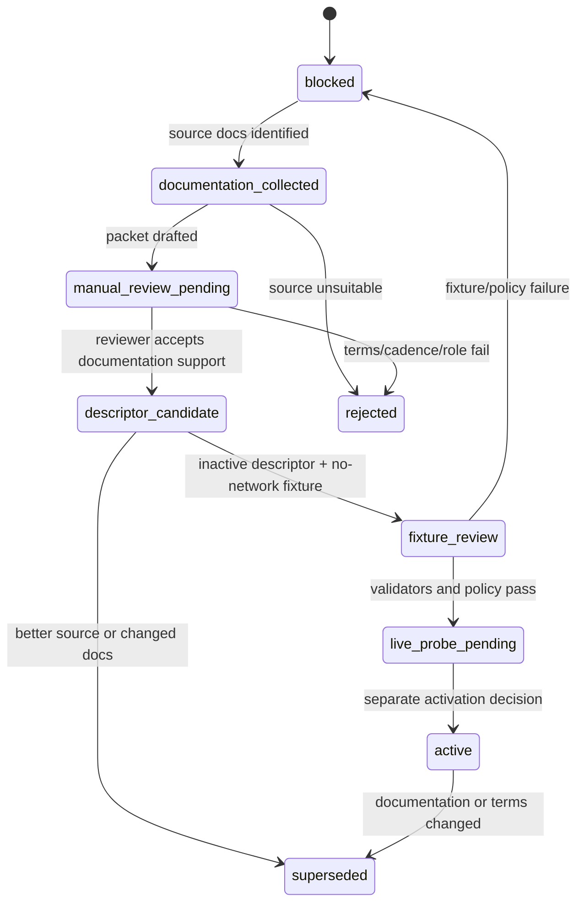
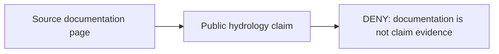

<!-- [KFM_META_BLOCK_V2]
doc_id: kfm://doc/NEEDS-VERIFICATION-ADR-0004-HYDROLOGY-SOURCE-DOCUMENTATION
title: ADR-0004: Hydrology Source Documentation Verification
type: standard
version: v1.0-review
status: review
owners: TODO: hydrology domain steward; documentation steward; policy steward
created: NEEDS-VERIFICATION
updated: 2026-05-06
policy_label: NEEDS-VERIFICATION
related: [./README.md, ./ADR-0001-schema-home.md, ./ADR-0002-responsibility-root-monorepo.md, ../domains/hydrology/README.md]
tags: [kfm, adr, hydrology, source-documentation, source-descriptor, connectors, evidence, governance, fail-closed]
notes: [
  This revision preserves the existing ADR decision that hydrology source documentation verification artifacts and a manual review packet should be added while all sources remain blocked.
  Existing target file was short-form; this revision expands rationale, rules, artifacts, verification states, acceptance criteria, and rollback.
  Exact owners, created date, policy label, ADR numbering collision status, source descriptor paths, validator behavior, CI enforcement, and live connector state remain NEEDS VERIFICATION.
]
[/KFM_META_BLOCK_V2] -->

<a id="top"></a>

# ADR-0004: Hydrology Source Documentation Verification

<p align="center">
  <strong>Hydrology source documentation may prepare a source for review. It must never become claim evidence.</strong>
</p>

<p align="center">
  
  
  
  
  
</p>

<p align="center">
  <a href="#decision-summary">Decision</a> ·
  <a href="#why-this-adr-exists">Why this exists</a> ·
  <a href="#what-source-documentation-verification-means">Verification meaning</a> ·
  <a href="#source-families-covered">Source families</a> ·
  <a href="#artifact-model">Artifacts</a> ·
  <a href="#connector-blocking-rules">Connector rules</a> ·
  <a href="#acceptance-criteria">Acceptance</a> ·
  <a href="#rollback-and-supersession">Rollback</a>
</p>

> [!IMPORTANT]
> **Preserved decision:** add source documentation verification artifacts and a manual review packet while keeping all hydrology sources blocked.
>
> **Preserved consequence:** connectors remain disabled; documentation checks are never claim evidence.

> [!WARNING]
> **NEEDS VERIFICATION:** Repository inspection found another ADR using the `ADR-0004` number. Do not resolve that numbering conflict silently. Keep this file at its requested path unless maintainers intentionally renumber through an ADR index update or migration note.

---

## Decision summary

| Field | Determination |
|---|---|
| ADR path | `docs/adr/ADR-0004-hydrology-source-documentation-verification.md` |
| Decision | Add hydrology source documentation verification artifacts and a manual review packet. |
| Connector posture | **Blocked by default.** No live connector is activated by this ADR alone. |
| Evidence posture | Source documentation checks support source-readiness review only; they are not evidence for hydrologic claims. |
| Primary protected boundary | Source documentation → SourceDescriptor candidate → fixture proof → EvidenceBundle → ReleaseManifest → public surface. |
| First source families | WBD/HUC12, NHDPlus HR and crosswalks, USGS Water Data, FEMA NFHL, terrain/DEM sources, observed flood event evidence. |
| Required negative outcomes | `DENY` for connector activation from documentation alone; `ABSTAIN` for unresolved source support or hydrologic identity; `ERROR` for missing verification artifacts. |
| Current implementation state | `NEEDS VERIFICATION` for enforcement, CI, validators, source descriptor locations, live source state, and owners. |

This ADR decides that **source documentation verification is a prerequisite to source activation**, not a substitute for evidence, validation, catalog closure, proof, or release.

<p align="right"><a href="#top">Back to top ↑</a></p>

---

## Why this ADR exists

Hydrology is KFM’s preferred first proof lane because it is public-safe enough to test early, but still demanding enough to exercise source identity, time-series evidence, map layers, EvidenceBundle closure, finite negative outcomes, catalog/provenance closure, and rollback.

That strength creates a specific risk: maintainers may confuse “we reviewed the source documentation” with “the source data now supports a public claim.”

This ADR prevents that drift.

| Drift risk | Failure mode | ADR response |
|---|---|---|
| Documentation laundering | A source docs page is cited as proof of a hydrologic fact. | Documentation checks are source-readiness artifacts only. |
| Premature connector activation | A live connector is enabled after a URL or API page is found. | All connectors remain blocked until source, fixture, policy, and review gates pass. |
| Source-role collapse | NFHL, USGS observations, WBD boundaries, NHDPlus HR identity, and terrain derivatives are treated as the same evidence type. | Source-role review is mandatory before descriptor activation. |
| Hidden rights/cadence uncertainty | Source terms, access, quota, freshness, or update cadence are unknown but source ingestion begins anyway. | Unknown source terms or cadence block activation. |
| Public bypass | Map/UI/API uses raw source responses before proof closure. | Public surfaces consume released artifacts and governed EvidenceBundle-backed payloads only. |
| False certainty | Source documentation says a field exists, so generated language treats the claim as settled. | Runtime answers still require EvidenceRef → EvidenceBundle resolution or must abstain. |

<p align="right"><a href="#top">Back to top ↑</a></p>

---

## Evidence boundary

This ADR is a decision record for **source documentation verification**. It is not an implementation proof, source registry, fixture set, connector, policy rule, schema, or release manifest.

| Evidence class | Status | Supports | Does not prove |
|---|---|---|---|
| Existing ADR file | `CONFIRMED` | The short-form decision and consequence text. | Enforcement, acceptance, owners, CI, or connector state. |
| Current repository connector evidence | `CONFIRMED` | Target file exists on `main`; adjacent ADR style uses KFM meta block, truth labels, badges, and evidence boundaries. | That downstream validators or source descriptors exist. |
| Hydrology domain README | `CONFIRMED repo doc / NEEDS VERIFICATION implementation` | Hydrology is framed as first proof lane; docs distinguish source roles, exclusions, no-network fixture-first posture, and public-surface boundaries. | Current source activation or live connector behavior. |
| Hydrology architecture/report corpus | `CONFIRMED doctrine / PROPOSED implementation` | Source families, source-role separation, WBD/HUC12, NHDPlus HR, USGS Water Data, NFHL distinction, validation backlog. | Runtime behavior or emitted proof objects. |
| Pipeline doctrine | `CONFIRMED doctrine / PROPOSED implementation` | RAW → WORK/QUARANTINE → PROCESSED → CATALOG/TRIPLET → PUBLISHED; promotion is a governed state transition. | Current pipeline execution or workflow enforcement. |

### Truth labels used here

| Label | Meaning |
|---|---|
| `CONFIRMED` | Verified from current repository connector evidence or supplied KFM doctrine. |
| `PROPOSED` | Design, artifact, path, validator, gate, or review process not yet proven as implemented. |
| `NEEDS VERIFICATION` | A concrete check must be completed before treating the claim as implemented or accepted. |
| `UNKNOWN` | Not verified strongly enough in this session. |
| `CONFLICTED` | Multiple repository facts or naming conventions appear to collide and require maintainer decision. |
| `DENY` | Finite outcome when policy or source state blocks an action. |
| `ABSTAIN` | Finite outcome when support is insufficient, ambiguous, unresolved, or not evidence-backed. |
| `ERROR` | Finite outcome when required artifacts, references, or validation state are missing or malformed. |

<p align="right"><a href="#top">Back to top ↑</a></p>

---

## Decision

KFM shall require a **Hydrology Source Documentation Verification Packet** before a hydrology source descriptor, no-network fixture, live probe, connector, map layer, Evidence Drawer payload, Focus Mode response, or release candidate may treat a source as eligible for use.

The packet verifies the source’s documentation, not the truth of hydrologic claims.

### Normative rules

1. **Documentation verification is source-readiness support only.**
   It may support a `SourceDescriptor` candidate, but it must not become `EvidenceBundle` support for a hydrologic claim.

2. **All hydrology sources remain blocked until reviewed.**
   This ADR does not activate WBD, NHDPlus HR, USGS Water Data, FEMA NFHL, 3DEP/DEM, Mesonet, groundwater, water-quality, wetland, or flood-event connectors.

3. **No live connector from documentation alone.**
   A docs URL, API page, field list, service endpoint, or external standard does not permit ingestion.

4. **Source descriptors start inactive.**
   Source descriptor records must default to a blocked or inactive state until source role, rights, cadence, scope, caveats, and review are complete.

5. **Fixture-first is mandatory.**
   The first hydrology proof work must use small, pinned, no-network fixtures before live probes or scheduled watchers.

6. **Claim support requires EvidenceBundle closure.**
   Public or semi-public claims must resolve EvidenceRef → EvidenceBundle and pass policy, catalog, review, release, and rollback gates.

7. **Unknown rights or terms block activation.**
   If rights, source terms, quota, attribution, cadence, precision, or public release class cannot be verified, the source remains blocked.

8. **Source roles must not collapse.**
   Regulatory context, hydrologic unit boundary, hydrography identity, observation, terrain derivative, simulation output, and observed event evidence are distinct.

9. **Negative states are first-class.**
   `DENY`, `ABSTAIN`, and `ERROR` outcomes are expected safe behavior, not failures to hide.

10. **Review state is auditable.**
    A source documentation review must leave a packet, status, reviewer trace, blockers, next action, and rollback/supersession note.

<p align="right"><a href="#top">Back to top ↑</a></p>

---

## What source documentation verification means

Source documentation verification asks:

> “Do we understand this source well enough to propose a source descriptor and fixture review?”

It does **not** ask:

> “Does this source prove the claim?”

### Minimum review fields

| Field | Required posture |
|---|---|
| `source_id` | Stable identifier for the candidate source. |
| `source_family` | WBD/HUC12, NHDPlus HR, USGS Water Data, FEMA NFHL, terrain/DEM, observed event, or other reviewed family. |
| `source_role` | Boundary, identity, observation, regulatory context, terrain derivative input, event evidence, or related context. |
| `publisher` | Source publisher or steward. |
| `documentation_urls` | Official source documentation pages, service docs, endpoint docs, terms pages, or metadata pages. |
| `retrieved_at` | Review timestamp for each documentation item. |
| `access_method` | API, static file, map service, download, bulk data, manual archive, or other method. |
| `rights_terms` | License, terms, attribution, use limits, public release class, and unresolved rights questions. |
| `cadence_freshness` | Update cadence, retrieval cadence, freshness indicators, stale behavior, and known latency. |
| `spatial_scope` | Geography, CRS, datum, geometry precision, scale, and public-location implications. |
| `temporal_scope` | Valid time, observation time, source time, retrieval time, release time, and correction time implications. |
| `schema_fields` | Documented fields, parameter codes, units, qualifiers, enums, and version notes. |
| `known_caveats` | Source limitations, uncertainty, missing data behavior, provisional status, or non-authority caveats. |
| `citation_text` | Human-readable citation or attribution text for later review. |
| `activation_state` | `blocked`, `documentation_reviewed`, `descriptor_candidate`, `fixture_review`, `live_probe_pending`, `active`, `rejected`, or `superseded`. |
| `reviewers` | Domain, documentation, and policy reviewers or TODO placeholders. |
| `blockers` | Open issues preventing source descriptor activation. |

### Verification states



> [!CAUTION]
> The `active` state in the diagram requires a later activation decision. This ADR by itself never moves a source to active.

<p align="right"><a href="#top">Back to top ↑</a></p>

---

## Source families covered

The first review packet should cover the hydrology proof-lane source families below. These source families are review candidates, not activated sources.

| Source family | Source role | Documentation review must prove | Must not be used to claim |
|---|---|---|---|
| WBD / HUC12 | Hydrologic-unit boundary and watershed packaging context. | Official source docs, service/download path, field list, hierarchy, geometry metadata, update fields, review cadence, geometry/content fingerprint plan. | That a public hydrologic claim is true without fixture validation and EvidenceBundle closure. |
| NHDPlus HR and crosswalks | Hydrography identity and network context. | Source family, version, Permanent Identifier behavior, COMID compatibility, crosswalk source artifact, split/merge/retired/ambiguous semantics. | Silent identity resolution when mappings are ambiguous. |
| USGS Water Data | Observation and time-series evidence. | API family, parameter code semantics, unit handling, timestamp behavior, qualifiers, provisional/approved state, no-data behavior, retrieval/cadence limits. | Claim support if qualifiers, units, time, or approval state are missing. |
| FEMA NFHL | Regulatory flood hazard context. | NFHL role, fields, access path, update cadence, limitations, attribution, and regulatory-context status. | Observed flood extent, historical inundation, or event evidence. |
| 3DEP / DEM / terrain inputs | Terrain-derived hydrology input. | Source resolution, CRS, vertical datum, nodata, acquisition/version metadata, derivative algorithm requirements, rebuildability. | Observation, regulation, or ground-truth without derivative review and provenance. |
| Observed flood event evidence | Event evidence. | Event date, evidence type, geometry provenance, source confidence, review burden, correction lineage. | NFHL-style regulatory context or generic flood hazard. |
| Adjacent water context | Related context only unless separately scoped. | Whether water quality, groundwater, wetlands, soil moisture, structures, or hydroclimate belong in the current hydrology slice. | Generic “water layer” truth. |

<p align="right"><a href="#top">Back to top ↑</a></p>

---

## Artifact model

This ADR creates or expects three categories of artifacts.

### 1. Human review packet

**Purpose:** make source documentation review visible to maintainers.

Candidate path, pending repo convention verification:

```text
docs/domains/hydrology/tracking/SOURCE_DOCUMENTATION_VERIFICATION.md
```

The review packet should summarize source docs, source roles, rights, cadence, caveats, blockers, and reviewer disposition.

### 2. Inactive source descriptor candidates

**Purpose:** prepare source metadata for validators without activating a connector.

Candidate path, pending repo convention verification:

```text
data/registry/hydrology/sources/*.yaml
```

Every descriptor must default to a blocked/inactive state until review gates pass.

### 3. Review records and receipts

**Purpose:** preserve auditable process memory.

Candidate paths, pending repo convention verification:

```text
data/work/hydrology/source_doc_review/{source_id}/review_packet.yaml
data/receipts/hydrology/source_doc_review/{source_id}/review_receipt.json
```

If the mounted repository uses a different lifecycle or receipt convention, adapt through an ADR or migration note instead of creating parallel authority.

### Artifact-to-truth matrix

| Artifact | What it can support | What it cannot support |
|---|---|---|
| Source documentation review packet | Source-readiness review and descriptor drafting. | Hydrologic claim truth. |
| SourceDescriptor candidate | Source identity, role, rights, cadence, activation state. | Public claims or connector activation by itself. |
| Retrieval log | Documentation review trace. | Data accuracy or current source behavior. |
| RunReceipt | Process memory for a review, validation, or transform. | Claim proof by itself. |
| No-network fixture | Validator behavior and expected source-field handling. | Live source freshness. |
| EvidenceBundle | Claim support after EvidenceRefs resolve and limitations are explicit. | Source activation or policy approval by itself. |
| ReleaseManifest | Release assembly after proof and policy closure. | Raw evidence or source documentation truth. |
| LayerManifest | Downstream map delivery contract. | Canonical truth or source authority. |

<p align="right"><a href="#top">Back to top ↑</a></p>

---

## Example review packet sketch

The following YAML is illustrative. It is **not** a confirmed repository schema.

```yaml
schema_version: hydrology.source_documentation_review.v1
review_id: hsdv_NEEDS_VERIFICATION
source_id: hydrology.wbd_huc12.NEEDS_VERIFICATION
source_family: WBD_HUC12
source_role: hydrologic_unit_boundary
activation_state: blocked

documentation:
  - url: "NEEDS_VERIFICATION"
    title: "NEEDS_VERIFICATION"
    publisher: "NEEDS_VERIFICATION"
    retrieved_at: "NEEDS_VERIFICATION"
    document_kind: service_documentation
    notes: "Official source documentation must be cited here."

rights_terms:
  license_or_terms_url: "NEEDS_VERIFICATION"
  attribution_required: "NEEDS_VERIFICATION"
  public_release_allowed: "NEEDS_VERIFICATION"
  unresolved_questions:
    - "Confirm terms before source descriptor activation."

access:
  method: "api_or_download_NEEDS_VERIFICATION"
  requires_authentication: "NEEDS_VERIFICATION"
  quota_or_rate_limit: "NEEDS_VERIFICATION"
  expected_cadence: "NEEDS_VERIFICATION"

scope:
  geography: "Kansas-focused use; exact source extent NEEDS VERIFICATION"
  temporal_scope: "NEEDS_VERIFICATION"
  scale_or_resolution: "NEEDS_VERIFICATION"

source_role_controls:
  may_support_source_descriptor: true
  may_activate_connector: false
  may_support_public_claim: false
  may_enter_evidence_bundle: false

review:
  domain_reviewer: "TODO"
  documentation_reviewer: "TODO"
  policy_reviewer: "TODO"
  decision: manual_review_pending
  blockers:
    - "Rights and source terms must be verified."
    - "No live connector until no-network fixtures and validators pass."
  next_action: "Draft inactive SourceDescriptor candidate only after manual review."
```

<p align="right"><a href="#top">Back to top ↑</a></p>

---

## Connector blocking rules

Connectors stay blocked until a later activation decision proves all required gates.

| Gate | Required before connector activation | Failure outcome |
|---|---|---|
| Documentation packet | Source docs reviewed, source role stated, caveats recorded. | `ERROR` if packet missing; `DENY` if insufficient. |
| Rights and terms | License, attribution, public release class, quota, and use limits known. | `DENY` if unknown or incompatible. |
| SourceDescriptor | Inactive descriptor exists and validates. | `ERROR` if malformed; `DENY` if active without review. |
| No-network fixture | Small fixture proves field/role handling without live fetch. | `ERROR` or `DENY` if fixture missing or invalid. |
| Policy review | Rights, sensitivity, public-surface, and activation checks pass. | `DENY`. |
| Validator coverage | Positive and negative cases pass in repo-native runner. | `ERROR` if no runner; `DENY` if policy fails. |
| Evidence boundary | Source docs cannot be used as claim evidence. | `DENY` if a claim cites documentation as evidence. |
| Release boundary | No public alias or published target without ReleaseManifest. | `DENY`. |
| Rollback target | Deactivation and correction path documented. | `ERROR` if missing. |

### Connector status values

| Status | Meaning |
|---|---|
| `blocked` | Default. No live network use, no public use, no source activation. |
| `documentation_reviewed` | Source docs were reviewed, but source remains inactive. |
| `descriptor_candidate` | Inactive descriptor exists and awaits fixture/policy validation. |
| `fixture_review` | No-network fixture validation is in progress. |
| `live_probe_pending` | Live probe may be proposed only after separate review. |
| `active` | Requires a later activation decision, tests, policy pass, and rollback path. |
| `rejected` | Source is unsuitable or blocked. |
| `superseded` | Source docs or source family were replaced by stronger evidence or newer documentation. |

> [!IMPORTANT]
> `documentation_reviewed` is not an activation state. It is a review milestone.

<p align="right"><a href="#top">Back to top ↑</a></p>

---

## Public claim boundary

A hydrology public claim must never use source documentation as its direct support.

### Correct support path

```mermaid
flowchart LR
  DOCS[Source documentation review] --> DESC[Inactive SourceDescriptor]
  DESC --> FIX[No-network fixture]
  FIX --> PROC[Validated processed artifact]
  PROC --> CAT[STAC / DCAT / PROV closure]
  CAT --> EB[EvidenceBundle]
  EB --> DE[DecisionEnvelope]
  DE --> RM[ReleaseManifest]
  RM --> PUB[Published layer / API payload]
  PUB --> UI[MapLibre / Evidence Drawer / Focus Mode]
```



### Incorrect support path



### Examples

| Statement | Allowed support? | Required outcome |
|---|---:|---|
| “USGS documentation defines parameter code handling for this fixture review.” | Yes, as source-documentation context. | Continue source review. |
| “This gage is currently above flood stage because the USGS API docs exist.” | No. | `DENY` or `ABSTAIN`. |
| “NFHL is a regulatory flood context layer.” | Yes, if supported by reviewed source role and fixture/proof path. | Proceed only after EvidenceBundle closure. |
| “NFHL proves this property flooded on this date.” | No. | `DENY`. |
| “This HUC12 boundary changed because LoadDate changed.” | No, not by date alone. | Require normalized geometry/content fingerprint or `ABSTAIN`. |
| “This COMID maps to this feature with no ambiguity.” | Only if crosswalk relationship and evidence support it. | `ABSTAIN` on split/merge/ambiguous cases. |

<p align="right"><a href="#top">Back to top ↑</a></p>

---

## Implementation plan

This plan is **PROPOSED** and must be adapted after repo convention verification.

| Phase | Scope | Output | Exit criteria |
|---|---|---|---|
| 0 | Repo and ADR inventory | Confirm target file, ADR index, numbering conflicts, owners, hydrology docs, registry paths. | No implementation claim without evidence. |
| 1 | Source documentation packet | Human review packet with source families, official docs, terms, cadence, caveats, source roles, blockers. | Packet reviewed; connectors still blocked. |
| 2 | Inactive SourceDescriptor candidates | Blocked/inactive descriptors for first source families. | Descriptors validate but cannot activate live connectors. |
| 3 | No-network fixtures | Tiny pinned fixtures for WBD/HUC12, NHDPlus HR crosswalk, USGS observations, NFHL context. | Positive/negative fixture behavior passes. |
| 4 | Validators and policies | Source documentation validator, descriptor activation guard, claim-support guard. | Attempts to cite documentation as claim evidence fail. |
| 5 | Release dry-run dependency | EvidenceBundle, DecisionEnvelope, CatalogMatrix, ReleaseManifest checks. | Claims resolve through proof path or abstain. |
| 6 | Live probe review | Optional later PR. | Separate activation decision, rights review, no secrets, rollback target. |

### Proposed validation checks

| Validator | Purpose |
|---|---|
| `validate_source_documentation_packet` | Packet has required source docs, terms, cadence, source role, blockers, and reviewer status. |
| `validate_source_descriptor_blocked_default` | New hydrology descriptors cannot default to active. |
| `validate_documentation_not_claim_evidence` | Claims cannot cite documentation review packets as EvidenceBundle support. |
| `validate_connector_activation_guard` | Connector activation requires review, descriptor, fixture, policy, validation, and rollback. |
| `validate_nfhl_role_separation` | NFHL cannot be labeled observed flood evidence. |
| `validate_hydrologic_identity_abstain` | Ambiguous identity mappings must abstain. |
| `validate_source_terms_present` | Rights, attribution, release class, quota, and cadence are present before activation. |

<p align="right"><a href="#top">Back to top ↑</a></p>

---

## Accepted inputs and exclusions

### Accepted inputs

This ADR accepts:

- source documentation review packets,
- inactive source descriptor candidates,
- review status records,
- no-network fixture review references,
- validation rules for source documentation packets,
- policy rules blocking connector activation,
- proof-boundary checks that prevent documentation-as-evidence,
- review checklists,
- rollback/supersession records for source documentation reviews.

### Exclusions

This ADR does not accept:

- live connector activation,
- source credentials,
- public aliases,
- RAW source publication,
- WORK or QUARANTINE public routes,
- generated model claims,
- source documentation used as hydrologic claim evidence,
- hydrologic simulation activation,
- emergency or life-safety guidance,
- public-facing claims without EvidenceBundle closure,
- silent ADR numbering renumbering.

<p align="right"><a href="#top">Back to top ↑</a></p>

---

## Acceptance criteria

This ADR may move from `review` to `accepted` only when the following are true.

- [ ] ADR numbering collision is resolved or explicitly accepted by the ADR index.
- [ ] `docs/adr/README.md` lists this ADR with status and decision summary.
- [ ] Owners/stewards for hydrology, documentation, and policy review are identified or explicitly placeholdered.
- [ ] A Hydrology Source Documentation Verification Packet exists or is scheduled in the PR.
- [ ] Candidate source families are listed with source roles and blocked activation state.
- [ ] Source documentation review packet explicitly says documentation checks are not claim evidence.
- [ ] SourceDescriptor candidates default to blocked/inactive.
- [ ] Connector activation requires a later decision and cannot occur from documentation review alone.
- [ ] Rights, terms, attribution, access, cadence, freshness, and public release class are required fields.
- [ ] NFHL regulatory context is separated from observed flood evidence.
- [ ] NHDPlus HR / COMID ambiguity produces `ABSTAIN` unless disambiguated by evidence.
- [ ] WBD/HUC12 change handling requires normalized geometry/content fingerprinting, not metadata date alone.
- [ ] USGS Water Data review preserves parameter codes, units, qualifiers, timestamps, provisional/no-data states, and freshness.
- [ ] Valid/invalid fixtures or review cases cover documentation-as-evidence denial.
- [ ] No live source fetch, secret, public alias, or PUBLISHED target is introduced by this ADR.
- [ ] Rollback/deactivation path is documented.
- [ ] Implementation evidence is linked in PR notes, validation reports, or repo-native receipts before enforcement claims are upgraded.

### Definition of done for the first implementation PR

- [ ] This ADR is expanded without deleting the preserved decision/consequence.
- [ ] ADR index is updated or numbering conflict is called out.
- [ ] A source documentation packet template or index exists.
- [ ] At least one source family review uses the template.
- [ ] Connectors remain blocked.
- [ ] Documentation-as-claim-evidence is explicitly denied.
- [ ] Reviewers can see what remains blocked and why.
- [ ] Rollback is docs-only unless later machine artifacts are added.

<p align="right"><a href="#top">Back to top ↑</a></p>

---

## Consequences

### Positive consequences

- Maintainers can review source readiness without confusing it for evidence.
- Hydrology source activation becomes auditable and reversible.
- Source descriptors are less likely to omit rights, cadence, caveats, or release class.
- Public claims remain downstream of evidence, policy, catalog, release, and rollback gates.
- Live source probes can be introduced later with clearer review burden.
- Negative outcomes become visible early, before public surface integration.
- Hydrology remains a strong proof lane without shortcutting KFM’s trust membrane.

### Costs and tradeoffs

- Adds a documentation and review layer before source activation.
- Slows live connector work until source roles and terms are explicit.
- Requires maintainers to keep source documentation packets current when external documentation changes.
- Requires negative tests or review checks to prevent documentation-as-evidence misuse.
- Requires ADR index cleanup if numbering conflicts remain.

### Accepted tradeoff

KFM accepts slower connector activation in exchange for stronger source integrity, clearer evidence boundaries, better public-surface safety, and more reliable rollback.

<p align="right"><a href="#top">Back to top ↑</a></p>

---

## Rollback and supersession

If this ADR is rolled back or superseded:

1. Preserve this file as historical lineage.
2. Do not delete reviewed source documentation packets without a supersession note.
3. Keep all hydrology connectors blocked unless a later accepted ADR or activation decision proves otherwise.
4. Mark affected SourceDescriptor candidates as `blocked`, `rejected`, or `superseded`.
5. Preserve review receipts, blockers, and reviewer notes if any existed.
6. Revert any docs-only additions through a normal PR.
7. Remove or disable validators only if replaced by stronger gates.
8. If any public state was touched, issue a CorrectionNotice or release rollback record.
9. Update `docs/adr/README.md` and hydrology tracking docs.

Rollback must not turn documentation review into untracked source activation.

<p align="right"><a href="#top">Back to top ↑</a></p>

---

## Open verification backlog

| Item | Status | Why it matters |
|---|---|---|
| ADR numbering collision with another `ADR-0004` | `CONFLICTED / NEEDS VERIFICATION` | ADR history and references should not collide silently. |
| Created date | `NEEDS VERIFICATION` | Existing short file did not include metadata. |
| Owners/stewards | `NEEDS VERIFICATION` | Review burden must be explicit before acceptance. |
| Policy label | `NEEDS VERIFICATION` | Public/restricted posture of source review packets may depend on source terms. |
| Exact source packet path | `NEEDS VERIFICATION` | Avoid creating parallel tracking homes. |
| Exact source descriptor path | `NEEDS VERIFICATION` | Hydrology README proposes paths, but implementation must verify. |
| Validator/test runner | `NEEDS VERIFICATION` | No enforcement claim without repo-native validation output. |
| CI workflow | `NEEDS VERIFICATION` | This ADR does not prove workflow enforcement. |
| Live connector state | `NEEDS VERIFICATION` | Connectors should be treated blocked until direct evidence says otherwise. |
| Source terms for each family | `NEEDS VERIFICATION` | Terms, quota, cadence, and attribution can change. |
| Public release class for review packets | `NEEDS VERIFICATION` | Some source review details may need restricted handling. |
| Integration with EvidenceBundle ADRs | `NEEDS VERIFICATION` | Documentation-as-evidence denial should align with EvidenceBundle contract decisions. |

<p align="right"><a href="#top">Back to top ↑</a></p>

---

## Final decision

KFM will add hydrology source documentation verification artifacts and a manual review packet, but all hydrology sources and connectors remain blocked by default.

A source documentation check is not claim evidence.

It can help a maintainer decide whether to draft an inactive source descriptor or no-network fixture. It cannot activate a connector, publish a layer, support a hydrologic claim, or bypass EvidenceBundle closure.

The safe order is:

```text
source docs reviewed
→ inactive SourceDescriptor candidate
→ no-network fixture
→ validation and policy
→ EvidenceBundle closure
→ ReleaseManifest
→ governed public surface
```

Any shortcut is a `DENY`, `ABSTAIN`, or `ERROR`, not a hidden exception.
