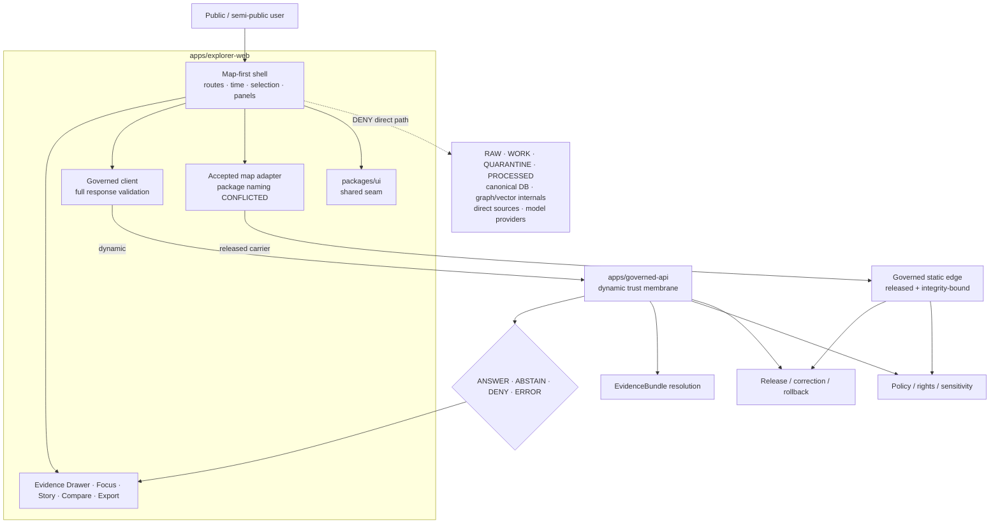

<!-- [KFM_META_BLOCK_V2]
doc_id: kfm://doc/adr-0005-apps-explorer-web-canonical-map-first-shell
title: "ADR-0005 — `apps/explorer-web/` is the canonical map-first shell"
type: adr
adr_id: ADR-0005
version: v1.1
status: proposed
owners:
  - "NEEDS VERIFICATION — architecture decision owner"
  - "NEEDS VERIFICATION — Explorer Web application owner"
  - "NEEDS VERIFICATION — UI and map-runtime owner"
owner_status: "CODEOWNERS routes docs/adr/ and apps/explorer-web/ to @bartytime4life; accepted stewardship, required-review rules, and independent approval controls were not verified"
reviewers_required:
  - Architecture steward
  - Docs steward
  - Explorer Web / application steward
  - Governed API maintainer
  - UI accessibility reviewer
  - Security / privacy reviewer
  - Policy and evidence reviewer
  - "at least one affected map-runtime or client owner"
created: 2026-05-09
updated: 2026-07-23
policy_label: public
truth_posture: cite-or-abstain
responsibility_root: docs/
current_path: docs/adr/ADR-0005-apps-explorer-web-is-the-canonical-map-first-shell.md
supersedes: []
superseded_by: null
evidence_snapshot:
  repository: bartytime4life/Kansas-Frontier-Matrix
  base_ref: main
  base_commit: f7826223ae7c443647aae2206fb27e1e37d71d9d
  inspection_origin_commit: 79603b7981e52a4b1cdb5f1eb42a7f1dd34436d7
  continuity_compare: 79603b7981e52a4b1cdb5f1eb42a7f1dd34436d7...f7826223ae7c443647aae2206fb27e1e37d71d9d
  relevant_path_changes_after_inspection: 0
  target_prior_blob: 34f59c8b4729c35591344852ea17988c400f1846
  adr_index_blob: cf08fae322ac53426f7394d97897fdb942253049
  directory_rules_doctrine_blob: 2affb080e6f0043867c64c7f06c1ca52030fbd55
  codeowners_blob: dd2a84aa514d8ecd9208bc347f90f9a2ed37dd61
  apps_readme_blob: 7ab9c8b9c507d8d17b72eec1344e593cbf0c91ec
  explorer_readme_blob: 755dae3e175b103702caba573a5171d62ed710da
  explorer_package_blob: ce981192e725483c747affb45ca3de36a22ce9ce
  packages_ui_entry_blob: 2c9ea341d61bf4d1733b9982fda8a9b869a3a720
  packages_maplibre_entry_blob: 91664eb00583f9e3d0405eb7954fefa9a48f4ee9
  ui_build_workflow_blob: a4fec64dc445b060d334c2ae56886cc814cb0e61
  explorer_boundary_test_blob: 97d44069b0a5ab4a82b1e1fc48665e905c08a287
  packages_cesium_path_at_base: absent
  pnpm_lock_path_at_base: absent
related:
  - docs/adr/README.md
  - docs/adr/INDEX.md
  - docs/adr/ADR-0004-apps-governed-api-is-the-trust-membrane.md
  - docs/adr/ADR-0006-maplibre-boundary--only-maplibreadapter-imports-maplibre.md
  - "docs/adr/ADR-0007 — MapLibre GL JS Is the Sole Browser-Side Renderer.md"
  - docs/adr/ADR-0019-ai-adapter-contract-and-finite-envelopes.md
  - docs/adr/ADR-0020-abstain-is-a-first-class-decision.md
  - docs/adr/ADR-0025-public-client-never-reads-canonical-internal-stores.md
  - docs/doctrine/directory-rules.md
  - docs/architecture/map-shell.md
  - docs/architecture/ui/BOUNDARIES.md
  - apps/README.md
  - apps/explorer-web/README.md
  - packages/ui/README.md
  - packages/maplibre/README.md
  - .github/workflows/ui-build.yml
  - tests/policy/test_explorer_web_adapter_boundary.py
tags: [kfm, adr, explorer-web, map-first, shell, trust-membrane, governed-api, maplibre, ui, accessibility, static-delivery, fail-closed, rollback]
notes:
  - "v1.1 is a same-path repository-grounded modernization. It preserves effective decision status `proposed`; it does not accept ADR-0005 or change executable behavior."
  - "Explorer Web is a broad documentation and placeholder tree. Its package scripts echo TODO, and ui-build intentionally fails readiness until real scripts, an exact pnpm pin, and pnpm-lock.yaml exist."
  - "packages/ui/ and packages/maplibre/ are private 0.0.0 scaffolds with placeholder exports. packages/cesium/ is absent."
  - "Directory Rules v1.4 proposes packages/maplibre-runtime/ while the repository contains packages/maplibre/. This ADR records the conflict but does not resolve renderer naming or accept ADR-0006/ADR-0007."
  - "Dynamic trust-bearing responses belong behind apps/governed-api/. A governed static edge may serve released public-safe immutable artifacts, but it is not a second truth authority."
[/KFM_META_BLOCK_V2] -->

<a id="top"></a>

# ADR-0005 — `apps/explorer-web` is the canonical map-first shell

> **Proposed decision.** `apps/explorer-web/` is KFM's single canonical deployable composition root for the public and semi-public map-first browser shell. It renders governed finite outcomes and already released public-safe artifacts; it does not own truth, evidence, policy, release, correction, rollback, source admission, or model execution. Dynamic trust-bearing responses pass through `apps/governed-api/`. A governed static edge may serve immutable released artifacts with verified release and integrity context, but it is not a parallel API or publication authority.

[](#status)
[](#evidence)
[](#evidence)
[](#validation)
[](#renderer-boundary)
[](#authority-boundary)

> [!IMPORTANT]
> **Repository presence is not accepted decision authority.** The app, source tree, supporting packages, static boundary tests, and CI readiness workflow exist. The ADR index still records ADR-0005 as `proposed`. This revision describes current evidence and the proposed target without promoting the decision.

> [!CAUTION]
> **A broad placeholder tree is not a working shell.** Explorer Web has placeholder scripts and modules, no verified app-local test lane, no pinned pnpm version, and no `pnpm-lock.yaml`. The workflow fails closed on those prerequisites. No browser route, governed client, renderer adapter, Evidence Drawer, Focus Mode, export flow, deployment, or production operation is established by the current tree.

**Quick navigation:** [Status](#status) · [Evidence](#evidence) · [Context](#context) · [Decision](#decision) · [Architecture](#architecture) · [Invariants](#invariants) · [Consequences](#consequences) · [Alternatives](#alternatives) · [Migration](#migration) · [Validation](#validation) · [Rollback](#rollback) · [Open work](#open-work)

---

<a id="status"></a>

## Status

| Field | Current value |
|---|---|
| **ADR ID** | `ADR-0005` — unique in [`INDEX.md`](./INDEX.md) |
| **Source/effective status** | `proposed` / `proposed` — not binding until the record and index carry matching reviewed `accepted` status |
| **Decision class** | Canonical shell placement, client authority boundary, dynamic/static delivery boundary, and no-parallel-shell rule |
| **Tracked path** | `docs/adr/ADR-0005-apps-explorer-web-is-the-canonical-map-first-shell.md` |
| **Configured app path** | [`apps/explorer-web/`](../../apps/explorer-web/) |
| **Current implementation** | Repository-present, documentation-rich source tree; executable behavior remains placeholder-only |
| **Current enforcement** | Static path/import guards plus fail-closed build/test readiness workflow |
| **Publication effect** | None. ADRs, routes, packages, tests, workflows, commits, PRs, merges, builds, and deployments do not publish KFM data or claims. |

The intent is stable: one map-first browser shell home. Implementation, package boundaries, acceptance, and operational maturity remain incomplete.

[Back to top](#top)

---

<a id="evidence"></a>

## Current repository evidence

The findings below are **CONFIRMED at `main@f7826223ae7c443647aae2206fb27e1e37d71d9d`** unless marked otherwise. Inspection began at `79603b7981e52a4b1cdb5f1eb42a7f1dd34436d7`; intervening commits changed only `data/README.md` and its generated receipt, so relevant evidence stayed unchanged.

| Surface | Verified state | Limit |
|---|---|---|
| ADR index | Exact path and `proposed` status. | Identity/status, not acceptance. |
| Directory Rules | Deployables under `apps/`; Explorer Web named as map-first shell. Duplicate Directory Rules placement remains conflicted. | Supports app home, not renderer naming. |
| [`apps/README.md`](../../apps/README.md) | 87 Explorer files and 48 TypeScript/TSX files; implementation modules characterized as placeholders. | Broad scaffold, not functional app. |
| [`apps/explorer-web/package.json`](../../apps/explorer-web/package.json) | Private `0.0.0`; `dev`, `build`, `test` echo `TODO`. | Explicit placeholder state. |
| Root [`package.json`](../../package.json) and lockfile | Workspaces declared; root scripts remain placeholders; no exact package-manager pin; `pnpm-lock.yaml` absent. | Not reproducible install/build/test. |
| Representative modules | Governed client, shell, export, soil FocusFlow, and soil EvidenceDrawer are greenfield placeholders. | Filenames/slots only. |
| [`packages/ui/`](../../packages/ui/) and [`packages/maplibre/`](../../packages/maplibre/) | Private `0.0.0` scaffolds with placeholder exports. | No reusable UI, renderer seam, consumers, or deployment. |
| `packages/cesium/` | Exact path absent. | Does not accept sole-renderer proposal. |
| [Static boundary test](../../tests/policy/test_explorer_web_adapter_boundary.py) | Constrains renderer imports to `src/adapters/`; rejects configured internal-store literals. | Not network/rendering/accessibility/deployment proof. |
| [`ui-build.yml`](../../.github/workflows/ui-build.yml) | Rejects placeholder commands, missing lockfile, and missing exact pnpm pin before install/build/test. | Red readiness is expected while placeholders remain. |
| Deployment, auth, CSP, observability, public operation | **UNKNOWN** | No deployed-system evidence inspected. |

The negative evidence is useful: placeholders prevent false success, guards catch selected drift, and the next increment can remain small and testable.

[Back to top](#top)

---

<a id="context"></a>

## Context

KFM is map-first, time-aware, evidence-first, policy-aware, and correction-aware. The browser shell is where those commitments become visible, not where they become true.

1. **One composition root.** Routes, state, accessibility, clients, adapters, evidence views, and exports otherwise fragment across app and compatibility surfaces.
2. **UI is not a data plane.** The browser is downstream of `RAW → WORK / QUARANTINE → PROCESSED → CATALOG / TRIPLET → governed release`.
3. **Map interaction implies claims.** A tile, property, popup, selection, camera, or pixel is a candidate interaction, not evidence; claim detail resolves through governed evidence/policy.
4. **Shell and renderer decisions diverge.** The repo has `packages/maplibre/`; Directory Rules proposes `packages/maplibre-runtime/`; ADR-0006/0007 remain proposed; `packages/cesium/` is absent.

This ADR decides the **shell home and client authority boundary** without silently accepting a renderer decision or creating a new renderer package.

[Back to top](#top)

---

<a id="decision"></a>

## Decision

### Single canonical shell

**`apps/explorer-web/` is the single canonical deployable composition root for KFM's public and semi-public map-first browser experience.**

It may compose bootstrap/routing; viewport/layer/time/selection/panel state; finite-response rendering; trust/time surfaces; Evidence Drawer; Focus Mode; story/compare/export/settings/safe diagnostics; accessibility; and app-local adapters.

It **must not** own source admission, canonical evidence, policy, release/correction/rollback, lifecycle storage, direct model invocation, semantic contract/schema authority, or publication.

<a id="authority-boundary"></a>

### Authority and delivery boundary

| Responsibility | Owner | Explorer Web relationship |
|---|---|---|
| Dynamic trust-bearing API | [`apps/governed-api/`](../../apps/governed-api/) | Consume validated finite responses; never replace policy/evidence/release work. |
| Shared reusable UI | [`packages/ui/`](../../packages/ui/) | Consume reviewed exports once implemented. |
| Renderer seam | **CONFLICTED; below** | Consume one accepted adapter; no ad hoc peer renderer. |
| Evidence / policy / release | Owning contracts, resolvers, `policy/`, `release/` | Render projections/outcomes/lineage; do not author or decide. |
| Lifecycle data | `data/` | No direct normal browser path. |
| Model adapters | `runtime/` behind Governed API | No direct browser provider/model call. |

Dynamic claim-bearing requests **must** pass through `apps/governed-api/` and return the accepted client envelope. Public semantic outcomes remain:

```text
ANSWER | ABSTAIN | DENY | ERROR
```

Internal states such as `restrict`, `hold`, or `needs_review` travel as obligations, reason codes, state fields, or a versioned extension—not accidental extra public outcomes.

Explorer Web may load released public-safe static artifacts from a governed edge only when release binding, integrity, rights/sensitivity, stale/correction/withdrawal state, and cache invalidation are verifiable. The edge cannot expose internal lifecycle stores or become a second policy engine/API. Static bytes remain a **released carrier**, not truth authority.

<a id="renderer-boundary"></a>

### Renderer and UI package boundaries

ADR-0005 does **not** decide the final renderer package name or accept the sole-renderer proposal.

| Surface | Current state | Posture |
|---|---|---|
| `packages/maplibre/` | Repository-present private `0.0.0` scaffold | **CONFIRMED path; incomplete** |
| `packages/maplibre-runtime/` | Proposed by Directory Rules v1.4 | **PROPOSED; absent/unverified here** |
| `packages/cesium/` | Exact path absent | **Do not create as a side effect** |
| ADR-0006 / ADR-0007 | Single importer / sole renderer proposals | **Proposed; not accepted here** |

Until reviewed renderer closure:

1. Feature code introduces no direct renderer imports outside the existing adapter boundary.
2. Do not create `packages/maplibre-runtime/`, `packages/cesium/`, or another peer merely to satisfy docs.
3. Resolve naming through ADR/migration with imports, consumers, tests, workflows, and rollback together.
4. No renderer package owns truth, policy, evidence, release, or publication.
5. The current static test is a guard, not final-architecture proof.

`packages/ui/` is the proposed reusable component home. Routing, shell state, and app integrations remain app-local. A component moves only when reuse, API, accessibility, trust-state semantics, tests, and consumers are reviewable. The current package is a scaffold.

Compatibility families (`ui/`, `web/`, `styles/`, `viewer_templates/`) are not shell authorities. Inspect actual content/class before migration; do not create missing roots solely to deprecate them; preserve history, links, generator/mirror contracts, and rollback.

### Finite states and accessibility

Claim-bearing panels render finite outcomes, loading/retry, stale/corrected/superseded/withdrawn/rollback-affected state, and material obligations. Color, hidden styling, empty panels, or generic HTTP success are insufficient.

The shell preserves keyboard/focus, skip links/landmarks, status announcements, textual labels, contrast, reduced motion, accessible map alternatives/non-pointer paths, and trust context in exports. An inaccessible trust state is not fully inspectable.

[Back to top](#top)

---

<a id="architecture"></a>

## Canonical architecture



This is responsibility/allowed traffic, not deployed topology. Routes, CDN, auth, package names, and runtime bindings remain separately governed.

[Back to top](#top)

---

<a id="invariants"></a>

## Operational invariants

| ID | Invariant | Acceptance burden |
|---|---|---|
| `SHELL-01` | Explorer Web is the only canonical deployable public/semi-public map shell. | Reviewed acceptance; no parallel shell. |
| `SHELL-02` | Shell owns no truth, evidence, policy, release, correction, rollback, or publication. | Contract/policy/integration evidence. |
| `SHELL-03` | Dynamic claims use Governed API; static carriers use governed released edge. | Network/client and manifest/cache tests. |
| `SHELL-04` | Outcomes remain `ANSWER`, `ABSTAIN`, `DENY`, `ERROR`. | Full envelope validation and UI tests. |
| `SHELL-05` | Click/rendered properties are not evidence. | End-to-end selection-to-EvidenceBundle test. |
| `SHELL-06` | One accepted renderer adapter; no peer package without ADR/migration. | Package decision, inventory, tests, guards. |
| `SHELL-07` | Redaction cannot be reversed client-side; no direct model/source/internal path. | Sensitive fixtures plus import/network/CSP tests. |
| `SHELL-08` | Accessibility, trust-preserving exports, and rollback are correctness requirements. | Automated/manual review and rollback drill. |

[Back to top](#top)

---

<a id="consequences"></a>

## Consequences

**Benefits:** one reviewable deployable boundary; honest placeholder maturity; no implied renderer decision; governed dynamic/static delivery; visible refusal/correction states; accessibility tied to inspectability; evidence-driven migration.

**Costs:** first slice must close package pin/lock/scripts/config/tests; renderer naming needs separate governance; static caches need correction/withdrawal semantics; envelope-first UI handles negative states/obligations; shared-package extraction stays slow until reuse is proved; proof is cross-cutting.

[Back to top](#top)

---

<a id="alternatives"></a>

## Alternatives considered

| Alternative | Disposition |
|---|---|
| Keep `apps/web/`, root `web/`, or root `ui/` as shell | Rejected: competing deployable/authority home. |
| Make `packages/explorer-web/` the shell | Rejected: package is reusable implementation, not deployable composition. |
| Split public micro-frontends now | Deferred: multiplies trust/state/accessibility/release boundaries before one slice works. |
| Let each feature call API directly | Rejected: central client/validation seam required. |
| Force static artifacts through dynamic byte streaming | Rejected: released immutable carriers may use governed edge. |
| Let browser read `data/published/` directly | Rejected: directory alone is not audience/integrity/correction/cache/policy contract. |
| Resolve renderer package naming here or create `packages/cesium/` | Rejected: belongs to renderer ADR/migration; path absent. |
| Put policy/evidence/release/direct model calls in shell | Rejected: collapses responsibility roots/trust membrane. |
| Keep placeholders indefinitely | Rejected as end state: honest hold, not product architecture. |

[Back to top](#top)

---

<a id="migration"></a>

## Migration plan

The app path exists; next work is **graduation, not a broad move**.

1. **Preserve hold.** Keep ADR proposed, placeholder scripts fail-closed, guards active, and no second shell/renderer/static edge/compatibility root.
2. **Reproducible workspace.** Pin package manager/version, add lockfile, real scripts, minimal TS/build config, browser entrypoint, test home, deterministic public-safe no-network fixtures. Roll back the coherent package/config/lock/script change together.
3. **One finite-response route.** Implement small shell/route and governed client; validate full envelope; render all outcomes plus loading/retry/invalid/offline; use deterministic mock/bounded API, no live sources/models. Roll back via feature flag/route selector to hold screen.
4. **Renderer closure.** Resolve package naming through reviewed ADR/migration; preserve one package/adapter; implement minimal map lifecycle; expand guards; pin dependencies/protocols; no second renderer. Roll back map route/import graph together.
5. **Proof-bearing interaction.** Low-sensitivity released layer → governed map source → selection → governed evidence request → EvidenceBundle-derived drawer → visible release/time/correction/limitations. Add keyboard flow, safe export, bounded telemetry, and cache/release rollback drill.

ADR-0005 may become accepted only when ADR/index transition together; owners/reviewers are verified; the slice passes validation below; renderer governance is visible; dynamic/static boundaries are tested; rollback/correction is rehearsed; deployment/exposure is reviewed.

[Back to top](#top)

---

<a id="validation"></a>

## Validation

Current enforcement is bounded: ADR index coherence, static renderer/import and internal-path checks, workspace declarations, and UI readiness hold. These do not prove a functional shell.

Acceptance requires:

- identity/status coherence;
- exact package-manager pin, lockfile, clean install, real build/test;
- browser entrypoint and one route;
- full client envelope validation and finite/negative-state tests;
- Governed API-only dynamic network and governed static-edge tests;
- selection-to-EvidenceBundle continuity;
- accepted renderer package/adapter with one consumer and no peer;
- sensitive payload/tile/cache/export/diagnostic leakage tests;
- no direct model client;
- automated plus manual accessibility;
- trust-preserving export and redacted observability;
- reviewed TLS/CSP/CORS/origin/secrets/dependencies/cache/identity/incident/isolation;
- rehearsed app/renderer/static/cache/release/correction rollback;
- documentation closure without overclaiming.

Suggested current checks:

```bash
python tools/validators/validate_adr_index.py
python -m pytest tests/validators/test_validate_adr_index.py -q --strict-config --strict-markers
python -m pytest tests/policy/test_explorer_web_adapter_boundary.py -q --strict-config --strict-markers
make boundary-guards
make validate
```

After workspace readiness:

```bash
corepack enable
pnpm install --frozen-lockfile
pnpm --filter explorer-web build
pnpm --filter explorer-web test
```

Validation is not release/publication approval.

[Back to top](#top)

---

<a id="rollback"></a>

## Rollback and supersession

Restore prior blob:

```text
34f59c8b4729c35591344852ea17988c400f1846
```

or revert the v1.1 commit. No executable path requires rollback because this revision is documentation-only.

A future shell-home change requires a successor ADR, `superseded` status, same-change index update, reciprocal links, consumer/surface inventory, and migration/rollback plan.

Future package/build changes revert coherently; routes return to finite hold/error state; renderer rollback restores package/import graph; static rollback withdraws/invalidate/purges cache and exposes correction; deployment rollback verifies health/envelope versions. Code rollback must not erase release, correction, or audit history.

[Back to top](#top)

---

<a id="open-work"></a>

## Open verification backlog

| ID | Topic | Closure evidence |
|---|---|---|
| `ADR5-V01` | Owners/review/status and duplicate Directory Rules identity | Verified controls plus governed reconciliation and matching ADR/index transition. |
| `ADR5-V02` | `packages/maplibre/` vs `packages/maplibre-runtime/`; ADR-0006/0007 disposition | Accepted renderer ADR and migration/connected-doc plan. |
| `ADR5-V03` | Package manager/scripts/lockfile | Reviewed policy and clean install/build/test. |
| `ADR5-V04` | Route/client/envelope/auth | Entry point, mapping contract, fixtures, tests, role/session proof. |
| `ADR5-V05` | Static edge and evidence surfaces | Artifact/header/cache/withdrawal profile; Evidence Drawer/Focus API and evidence trace. |
| `ADR5-V06` | Sensitive-domain hardening | Negative payload/tile/export/diagnostic fixtures. |
| `ADR5-V07` | Shared UI, accessibility, performance | Package API/consumers/tests; automated/manual a11y; representative budgets. |
| `ADR5-V08` | Observability, deployment, rollback, compatibility/doc drift | Redacted telemetry, reviewed infra, rehearsed rollback, pinned inventory and bounded doc convergence. |

### Change log

| Version | Date | Change |
|---|---|---|
| `v1.1` | 2026-07-23 | Same-path repository-grounded modernization: confirmed ADR identity/status and Explorer scaffold; replaced repo-unavailable assumptions; separated shell placement from renderer decisions; documented placeholder/readiness state, static guards, dynamic/static delivery, finite outcomes, accessibility, acceptance gates, incremental graduation, rollback, and verification backlog; preserved proposed status. |
| `v1` | 2026-05-09 | Initial proposal selecting `apps/explorer-web/` as canonical shell and naming companion packages, compatibility roots, migration phases, validation ideas, and rollback posture. |

---

**Last updated:** 2026-07-23 · **Source metadata:** `proposed` · **Effective decision status:** `proposed` · **Path:** `docs/adr/ADR-0005-apps-explorer-web-is-the-canonical-map-first-shell.md` · [Back to top](#top)
