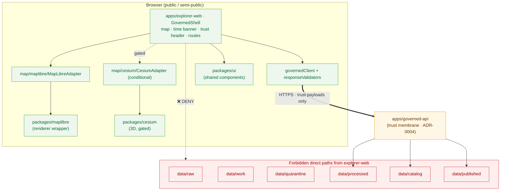

<!-- [KFM_META_BLOCK_V2]
doc_id: kfm://doc/adr-0005-apps-explorer-web-canonical-map-first-shell
title: "ADR-0005 — apps/explorer-web is the canonical map-first shell"
type: standard
version: v1
status: proposed
owners: [kfm-architecture-stewards, kfm-ui-owner]
created: 2026-05-09
updated: 2026-05-09
policy_label: public
related:
  - docs/adr/ADR-0001-schema-home-schemas-contracts-v1-is-canonical.md
  - docs/adr/ADR-0002-contracts-vs-schemas-split.md
  - docs/adr/ADR-0003-policy-singular-is-canonical.md
  - docs/adr/ADR-0004-apps-governed-api-is-the-trust-membrane.md
  - docs/adr/ADR-0006-maplibre-boundary-only-maplibreadapter-imports-maplibre.md
  - docs/adr/ADR-0007-cesium-3d-is-conditional-and-gated.md
  - docs/adr/ADR-0025-public-client-never-reads-canonical-internal-stores.md
  - directory-rules.md
tags: [kfm, adr, ui, explorer-web, trust-membrane, map-first]
notes:
  - "Repo not mounted in authoring session — implementation paths PROPOSED / NEEDS VERIFICATION."
  - "ADR number conflicts with one prior atlas suggestion (Pass 12 used ADR-0005 = ReleaseManifest); the working repo ADR registry assigns ADR-0005 to this decision and supersedes that suggestion."
[/KFM_META_BLOCK_V2] -->

# ADR-0005 — `apps/explorer-web` is the canonical map-first shell

> **One-line decision.** The map-first public/semi-public KFM client is built and deployed from `apps/explorer-web/`, with shared UI in `packages/ui/`, the 2D renderer behind `packages/maplibre/`, and conditional 3D behind `packages/cesium/`. Every other historical shell home becomes a compatibility root with a migration plan.

| Field | Value |
| --- | --- |
| **ID** | ADR-0005 |
| **Status** | `proposed` |
| **Date** | 2026-05-09 |
| **Deciders** | Architecture stewards · UI owner · Governance steward |
| **Supersedes** | — |
| **Superseded by** | — |
| **Related** | ADR-0001 · ADR-0002 · ADR-0003 · **ADR-0004** · ADR-0006 · ADR-0007 · ADR-0025 |

[](#status)
[](#)
[](#decision)
[](#decision)

**Quick links:** [Status](#status) · [Context](#context) · [Decision](#decision) · [Architecture](#canonical-architecture) · [Consequences](#consequences) · [Alternatives](#alternatives-considered) · [Migration plan](#migration-plan) · [Validation](#validation) · [Rollback](#rollback--supersession) · [Open questions](#open-questions)

---

## Status

`proposed` — pending acceptance by the architecture stewards. Once accepted, status updates to `accepted` and supersession (if ever) follows the ADR template rules in `directory-rules.md` §2.4. ADRs are versioned and never deleted; they are only superseded.

> [!NOTE]
> The text below speaks in the present tense ("the shell does X") to describe the *decided posture*. Implementation maturity in the working repository is **PROPOSED / NEEDS VERIFICATION** — see [Open questions](#open-questions).

[Back to top ↑](#adr-0005--appsexplorer-web-is-the-canonical-map-first-shell)

---

## Context

KFM is map-first, time-aware, evidence-first, and policy-conscious. Its public UI is one of the most consequential surfaces in the system: it is where doctrine becomes product behavior, where the trust membrane meets the user, and where most of the project's perceived legitimacy is decided.

Three forces converge on the question of where this UI lives in the repository:

1. **Lifecycle and authority boundary.** Public clients MUST read through `apps/governed-api/` (the trust membrane), never directly from `data/raw/`, `data/work/`, `data/quarantine/`, `data/processed/`, `data/catalog/`, or `data/published/`. The shell is the place this boundary is most often tempted to leak — it has the strongest pull toward "just import the layer directly."
2. **Renderer discipline.** MapLibre is KFM's disciplined 2D renderer; Cesium is the conditional 3D path. Neither is a truth source. Both must remain swappable adapters, not authority centers. If shell code imports `maplibre-gl` directly, the boundary is dead; the same for `cesium`.
3. **Drift pressure.** KFM has historically accumulated multiple plausible shell homes — `ui/`, `web/`, `styles/`, `viewer_templates/`, `apps/explorer-web/`, `packages/ui/`. `directory-rules.md` §13.3 names this exact drift as one of the four most consequential structural failures in the repo: *"`ui/`, `web/`, `apps/explorer-web/`, and `packages/ui/` becoming competing shell homes."*

Without a canonical decision, every PR pulls toward whichever home was edited last. Components fragment. Styles fork. Boundary enforcement becomes a series of one-off arguments instead of a structural property.

The shell itself has substantial responsibilities (per the Whole-UI + Governed-AI Expansion Report):

- Persistent map surface, time banner, trust/status header, route outlet, panel region, keyboard skip links.
- Layer catalog with descriptors, toggles, legends, time filters, trust badges, manifest/proof visibility.
- Evidence Drawer over `EvidenceBundle`-derived payloads.
- Focus Mode (governed query surface, finite outcomes, citation validation, no direct model calls).
- Story Node player (2D-first, evidence-continuous, optional 3D under gate).
- Review console (read-only steward surface in first slice).
- Compare, Export, Settings, Diagnostics.
- Typed governed API client with runtime schema validation at the client boundary.

The decision is not *whether* to centralize this surface but *where*, and what the supporting structure looks like.

[Back to top ↑](#adr-0005--appsexplorer-web-is-the-canonical-map-first-shell)

---

## Decision

The KFM repository adopts the following canonical structure for the map-first shell.

### 1. `apps/explorer-web/` is the single canonical map-first shell

**`apps/explorer-web/`** is the deployable map-first public/semi-public UI. It is the **only** canonical home for:

- The persistent governed shell (map + time banner + trust header + route outlet).
- All route surfaces (Explore, Dossier, Story, Focus, Review (read-only), Compare, Export, Settings, Diagnostics).
- The shell-owned state machine (`shellState`, `timeState`).
- The typed governed API client (`governedClient`) and response validators.
- Renderer-specific adapters (`maplibre/MapLibreAdapter`, optional `cesium/CesiumAdapter`).
- Feature folders that compose those routes.

### 2. Supporting canonical homes (companion packages)

| Package | Role |
| --- | --- |
| `packages/ui/` | Shared, reusable UI components — buttons, layout primitives, badges, drawer chrome, pickers. Reusable across `apps/explorer-web/`, `apps/review-console/`, and any future client. |
| `packages/maplibre/` | The MapLibre renderer wrapper. **Only** this package and the in-shell `MapLibreAdapter` may import `maplibre-gl`. |
| `packages/cesium/` | The Cesium 3D wrapper. Conditional, gated, and never the primary surface (per ADR-0007). |

### 3. `apps/governed-api/` is the only network path

`apps/explorer-web/` reads via `apps/governed-api/` and **never** directly from `data/raw/`, `data/work/`, `data/quarantine/`, `data/processed/`, `data/catalog/`, or `data/published/`. The trust membrane is the boundary; the shell respects it (per ADR-0004 and ADR-0025).

### 4. Compatibility roots replace prior shell homes

Per `directory-rules.md` §8.1, the following roots become compatibility roots, not parallel shell homes:

| Compatibility root | Class | Migration target |
| --- | --- | --- |
| `ui/` | `legacy` or `transitional` | `apps/explorer-web/` (surface code) and `packages/ui/` (shared components) |
| `web/` | `legacy` or `transitional` | `apps/explorer-web/` |
| `styles/` | `legacy` | `packages/ui/`, `apps/explorer-web/`, or `docs/brand/` by usage class |
| `viewer_templates/` | `legacy` | `apps/explorer-web/`, `examples/`, or `packages/maplibre/` |

Each of these roots must declare its class in its own `README.md` and must not evolve independently.

### 5. Renderer discipline and citation discipline are enforced at the boundary

- Renderer imports (`maplibre-gl`, `cesium`) are confined to adapter modules. Component code talks to a `MapRuntimePort` (and, for 3D, a `Map3DPort`) — never directly to renderer APIs.
- Feature clicks do not expose feature properties as claims. They issue a governed claim-resolution request that returns a `DecisionEnvelope` and an `EvidenceDrawerPayload` (or a finite negative state).
- Layer descriptors carry proof/ref metadata, release state, valid-time semantics, sensitivity, rights, and source-role badges so that interpretation is available at the point of use.

[Back to top ↑](#adr-0005--appsexplorer-web-is-the-canonical-map-first-shell)

---

## Canonical architecture



> [!IMPORTANT]
> The dotted line marked **DENY** is enforced — not by hope, but by CI guards (see [Validation](#validation)). The shell has exactly one network door, and it leads to `apps/governed-api/`.

[Back to top ↑](#adr-0005--appsexplorer-web-is-the-canonical-map-first-shell)

---

## Consequences

### Positive

- **One shell home.** Future PRs cannot ambiguously "land somewhere reasonable" — they land in `apps/explorer-web/` or in one of the named companion packages.
- **Enforceable trust membrane.** With one shell, one client (`governedClient`), and one renderer adapter pair, the boundary becomes a CI property instead of a discipline.
- **Stable URLs and anchors.** Routes (Explore, Dossier, Story, Focus, Review, Compare, Export, Settings, Diagnostics) and component locations stop drifting between PRs.
- **Predictable testing.** Tests for the shell, layer catalog, evidence drawer, focus, and story player live in one place. Component, a11y, and contract tests all have a stable home.
- **Doctrinal alignment.** Aligns with `directory-rules.md` §7.1, §8.1, §11, §13.3 and the Whole-UI + Governed-AI Expansion Report — there is no daylight between repo doctrine and the lived structure.

### Negative / costs

- **Migration cost.** Existing content under `ui/`, `web/`, `styles/`, `viewer_templates/` (where present) needs to be reclassified, frozen for new writes, and migrated. Some imports break. Some downstream links need updating.
- **Two-package discipline.** Shared UI must consciously land in `packages/ui/` rather than in `apps/explorer-web/src/components/`. Reviewers must enforce the distinction.
- **Adapter overhead.** Every renderer feature is built twice: once at the renderer level, once at the port level. This is the price of swappability.
- **CI cost.** New guard workflows must run on every PR. They are cheap individually but add up.

### Risks if not adopted

- The four-home anti-pattern recurs and trust-membrane enforcement decays into review-by-review judgment.
- A single PR introduces a direct `maplibre-gl` import in a feature folder; six months later it is not removable without a refactor.
- An admin shortcut becomes the normal public path; renderer becomes the truth source by accident.

[Back to top ↑](#adr-0005--appsexplorer-web-is-the-canonical-map-first-shell)

---

## Alternatives considered

| Alternative | Why rejected |
| --- | --- |
| Keep `ui/` as canonical | Conflicts with the `apps/` deployable convention; `ui/` was historically a mixed grab-bag of components, styles, and templates — its meaning is not stable. |
| Keep `web/` as canonical | Same reason; `web/` reads as a generic surface bucket, not a deployable. KFM doctrine treats deployables as `apps/`. |
| Multiple coequal shells (`apps/explorer-web/` + `apps/some-other-explorer/` for different audiences) | Premature; named in `directory-rules.md` §13.3 as the most consequential UI drift. Audiences differ in *features*, not in *shells*. |
| Federated micro-frontends | Premature for current scope; introduces module-federation complexity and a second build path before the shell is even stable. Re-evaluate when audiences diverge enough to justify it. |
| `packages/explorer-web/` (package, not app) | Confuses deployable with library. `apps/` carries the deployable contract; `packages/` carries the reusable contract. The shell is the deployable. |
| Single mono-package with no `packages/ui/` split | Creates a hard coupling between the shell and any future review console / admin surface; precludes reuse of evidence/badge components across clients. |

[Back to top ↑](#adr-0005--appsexplorer-web-is-the-canonical-map-first-shell)

---

## Migration plan

**PROPOSED / NEEDS VERIFICATION** — exact source paths depend on what the working repository actually contains. The plan below is the shape; a migration manifest under `migrations/` will record the concrete old → new mapping with `git_sha_before` / `git_sha_after` per `directory-rules.md` §14.2.

### Phase 1 — declare canonicals

1. Land this ADR as `proposed` in `docs/adr/`.
2. Confirm or create `apps/explorer-web/README.md`, `packages/ui/README.md`, `packages/maplibre/README.md`, and (if applicable) `packages/cesium/README.md` per the README contract in `directory-rules.md` §15.
3. Record the canonical decision in `control_plane/canonical_lineage.yaml` (or the repo's equivalent canonical lineage register).

### Phase 2 — declare compatibility roots

For each of `ui/`, `web/`, `styles/`, `viewer_templates/` *that exists in the repo*:

1. Add a `README.md` declaring its compatibility class (`legacy`, `mirror`, `deprecated`, `external-export`, or `transitional`).
2. Pin the migration target in the README header.
3. Add a freeze-write rule (CODEOWNERS or a guard workflow) so new files cannot land there without an explicit override.

### Phase 3 — content migration

| From (compatibility root) | To (canonical home) | Notes |
| --- | --- | --- |
| `ui/components/*` (reusable) | `packages/ui/` | Re-exported; existing import paths become a thin compatibility shim until removal. |
| `ui/screens/*`, `ui/routes/*` | `apps/explorer-web/src/...` | Surface code; lands in feature folders. |
| `web/*` | `apps/explorer-web/` | Same as above; `web/` is typically a surface root. |
| `styles/*` | `packages/ui/styles/` (shared) or `apps/explorer-web/src/styles/` (shell-only) or `docs/brand/` (brand guidance) | By usage class. |
| `viewer_templates/*` | `apps/explorer-web/src/features/...`, `examples/`, or `packages/maplibre/` | By role; templates that demonstrate usage go to `examples/`. |

Use `git mv` so history is preserved (per `directory-rules.md` §14.1). Update references in code, docs, schemas, fixtures, tests, and workflows. Add a one-line note in `docs/registers/CANONICAL_LINEAGE_EXPLORATORY.md` (or the repo's equivalent register).

### Phase 4 — boundary hardening

1. Confine `maplibre-gl` imports to `packages/maplibre/` and `apps/explorer-web/src/map/maplibre/MapLibreAdapter.*`.
2. Confine `cesium` imports to `packages/cesium/` and `apps/explorer-web/src/map/cesium/CesiumAdapter.*`.
3. Confine network calls in `apps/explorer-web/` to `governedClient.*`.
4. Land the CI guards described in [Validation](#validation).

### Phase 5 — close the migration

1. Verify the rollback dry-run passes.
2. Wait the verification window (recommended: one full release cycle).
3. Remove the compatibility roots once consumers no longer reference them, or convert them to permanent `external-export` mirrors if they remain useful for downstream tooling.

[Back to top ↑](#adr-0005--appsexplorer-web-is-the-canonical-map-first-shell)

---

## Validation

Validation is split between **structural guards** (CI proves the shape stays right) and **functional smoke** (a real shell boots and respects the boundary).

### Structural guards (CI)

> [!WARNING]
> These guards are load-bearing. If they go red, do not paper over them — the membrane is leaking.

```yaml
# Illustrative — actual workflow lands per repo's CI conventions.
# PROPOSED / NEEDS VERIFICATION: paths and tooling.
name: ui-boundary-guards
on: [pull_request]
jobs:
  no-direct-renderer-imports:
    runs-on: ubuntu-latest
    steps:
      - uses: actions/checkout@v4
      - name: Forbid maplibre-gl outside MapLibreAdapter / packages/maplibre
        run: |
          ! git grep -nE "from ['\"]maplibre-gl['\"]|require\(['\"]maplibre-gl['\"]\)" -- \
            'apps/explorer-web/' \
            ':(exclude)apps/explorer-web/src/map/maplibre/MapLibreAdapter*' \
            ':(exclude)packages/maplibre/'
      - name: Forbid cesium outside CesiumAdapter / packages/cesium
        run: |
          ! git grep -nE "from ['\"]cesium['\"]|require\(['\"]cesium['\"]\)" -- \
            'apps/explorer-web/' \
            ':(exclude)apps/explorer-web/src/map/cesium/CesiumAdapter*' \
            ':(exclude)packages/cesium/'
  no-direct-data-imports:
    runs-on: ubuntu-latest
    steps:
      - uses: actions/checkout@v4
      - name: Forbid explorer-web reaching into data/, connectors/, pipelines/
        run: |
          ! git grep -nE "from ['\"](\.\./)+(data|connectors|pipelines)/" -- 'apps/explorer-web/'
```

### Functional smoke

Per past architecture conversations and the Whole-UI report, a `make explorer-web-smoke` (or repo-equivalent) target should boot the shell against a running `governed-api`, render the persistent shell with an empty map, and surface an `ABSTAIN` state with a `reason_code` in the Evidence Drawer. The smoke target is the canonical signal that the boundary is wired and breathing.

### Tests required (proposed minimums)

| Layer | Test type | What it proves |
| --- | --- | --- |
| `apps/explorer-web/src/api/governedClient.ts` | Contract test against `RuntimeResponseEnvelope` schema | Client validates every response. |
| `apps/explorer-web/src/api/responseValidators.ts` | Unit tests with valid + invalid fixtures | Invalid envelopes raise typed errors, never silently render. |
| `apps/explorer-web/src/map/maplibre/MapLibreAdapter.tsx` | Integration test | Adapter is the only caller of MapLibre runtime APIs. |
| `apps/explorer-web/src/app/GovernedShell.tsx` | Component + a11y test | Shell renders with finite negative states (no, never, the empty state isn't blank). |
| `apps/explorer-web/src/features/focus/FocusOutcomeRenderer.tsx` | Component test per outcome | All four states render: ANSWER, ABSTAIN, DENY, ERROR. |
| End-to-end | E2E against `governed-api` mock | Trust badges resolve from EvidenceBundles and never from raw stores. |

[Back to top ↑](#adr-0005--appsexplorer-web-is-the-canonical-map-first-shell)

---

## Rollback / supersession

Per `directory-rules.md` §2.4 ADR rules:

- ADRs are **versioned and never deleted**. A future ADR may supersede this one; the supersession must link both directions and explain the new decision.
- If reverting the structural decision becomes necessary, the rollback path is:
  1. Mark this ADR `superseded` with a link to the replacement.
  2. Re-open the prior compatibility roots' `README.md` to declare them canonical again (an unusual move; expected only in catastrophic discovery of an unworkable assumption).
  3. Restore content per the migration manifest's `git_sha_before` entries.
  4. Issue a `CorrectionNotice` for any release artifact whose layer descriptors or shell routes referenced the now-superseded paths.

Day-to-day rollbacks of *individual UI PRs* land via the standard PR-revert path with feature flags off (see "Rollback" column in the Whole-UI report's component table).

[Back to top ↑](#adr-0005--appsexplorer-web-is-the-canonical-map-first-shell)

---

## Open questions

> [!NOTE]
> Each item below is **NEEDS VERIFICATION** until checked against the working repository. None of them blocks acceptance of this ADR's *intent*; they refine its *concrete migration*.

1. **Repo presence of compatibility roots.** Whether `ui/`, `web/`, `styles/`, `viewer_templates/` exist in the repo today, and which class each warrants. Proposed action: inventory in the migration manifest before Phase 2.
2. **Package layout of `packages/ui/`.** Whether the shared package already exists, what it currently exports, and whether existing exports map cleanly to `packages/ui/` or need namespacing.
3. **Cesium presence.** Whether `packages/cesium/` and a `CesiumAdapter` exist or remain deferred. ADR-0007 governs the gate; this ADR only reserves the location.
4. **Build/tooling.** Build tool, package manager, monorepo orchestrator (workspaces, Nx, Turborepo, pnpm workspaces, etc.) — affects the migration's mechanical shape but not its decision shape.
5. **Compatibility shim duration.** How long the `ui/` and `web/` re-export shims should remain before removal. Default proposed: one full release cycle after Phase 4 closes.
6. **Existing route names.** Whether the proposed routes (Explore, Dossier, Story, Focus, Review, Compare, Export, Settings, Diagnostics) match repo reality, and where any divergence requires either a route rename or a doctrine update.
7. **ADR numbering reconciliation.** The atlas dossier (Pass 12) at one point suggested `ADR-0005` for *ReleaseManifest envelope*. The working repo ADR registry assigns `ADR-0005` to *this* decision; the ReleaseManifest decision is recorded under a different ADR number. This ADR explicitly notes that conflict so the divergence is auditable.

[Back to top ↑](#adr-0005--appsexplorer-web-is-the-canonical-map-first-shell)

---

## Appendix

<details>
<summary><strong>A. Compatibility-root README header (template)</strong></summary>

When `ui/`, `web/`, `styles/`, or `viewer_templates/` is present, its `README.md` should open with:

```markdown
# <folder-name>

## Authority level
Compatibility root — class: legacy | mirror | deprecated | external-export | transitional

## Canonical home
<absolute path to canonical home, per ADR-0005>

## Migration plan
- Pinned ADR: docs/adr/ADR-0005-apps-explorer-web-is-the-canonical-map-first-shell.md
- Migration manifest: migrations/ui_consolidation/<id>.yaml
- Sunset target: <semver release or date>
- Status: open | in-progress | closed
```

</details>

<details>
<summary><strong>B. Forbidden patterns inside <code>apps/explorer-web/</code></strong></summary>

| Pattern | Forbidden because |
| --- | --- |
| `import 'maplibre-gl'` outside `MapLibreAdapter` / `packages/maplibre` | Renderer is not a truth source; adapter boundary preserves swappability and keeps clicks → governed claim resolution. |
| `import 'cesium'` outside `CesiumAdapter` / `packages/cesium` | Same as above; 3D is conditional and gated (ADR-0007). |
| Imports from `connectors/`, `pipelines/`, `data/`, `runtime/` | Public client never reads canonical/internal stores (ADR-0025). All reads flow through `apps/governed-api/`. |
| Direct `fetch()` to anything other than the governed API base URL | The only allowed browser network path for trust payloads is `governedClient`. |
| Treating tile attributes as claims | Click → governed claim-resolution request returning `DecisionEnvelope` + `EvidenceDrawerPayload`. Tile attrs are rendering hints, not evidence. |

</details>

<details>
<summary><strong>C. Component family ↔ canonical path map (PROPOSED)</strong></summary>

Drawn from the Whole-UI + Governed-AI Expansion Report's component family table. **PROPOSED / NEEDS VERIFICATION** — confirm against repo on landing.

| Component family | Canonical path |
| --- | --- |
| `GovernedShell` | `apps/explorer-web/src/app/GovernedShell.tsx` |
| Routes | `apps/explorer-web/src/app/routes.tsx` |
| Shell state | `apps/explorer-web/src/state/shellState.ts` |
| Time state | `apps/explorer-web/src/state/timeState.ts` |
| Governed client | `apps/explorer-web/src/api/governedClient.ts` |
| Response validators | `apps/explorer-web/src/api/responseValidators.ts` |
| Mock governed API | `apps/explorer-web/src/api/mockGovernedApi.ts` |
| `MapRuntimePort` | `apps/explorer-web/src/map/MapRuntimePort.ts` |
| `MapLibreAdapter` | `apps/explorer-web/src/map/maplibre/MapLibreAdapter.ts` |
| `LayerCatalogPanel` | `apps/explorer-web/src/features/layers/LayerCatalogPanel.tsx` |
| `EvidenceDrawer` | `apps/explorer-web/src/features/evidence/EvidenceDrawer.tsx` |
| `TrustBadges` | `apps/explorer-web/src/features/evidence/TrustBadges.tsx` |
| `FocusPanel` | `apps/explorer-web/src/features/focus/FocusPanel.tsx` |
| `FocusOutcomeRenderer` | `apps/explorer-web/src/features/focus/FocusOutcomeRenderer.tsx` |
| `StoryNodePlayer` | `apps/explorer-web/src/features/story/StoryNodePlayer.tsx` |
| `ReviewConsole` (read-only) | `apps/explorer-web/src/features/review/ReviewConsole.tsx` |
| `ComparePanel` | `apps/explorer-web/src/features/compare/ComparePanel.tsx` |
| `ExportPanel` | `apps/explorer-web/src/features/export/ExportPanel.tsx` |
| `SettingsPanel` | `apps/explorer-web/src/features/settings/SettingsPanel.tsx` |
| `DiagnosticsPanel` | `apps/explorer-web/src/features/diagnostics/DiagnosticsPanel.tsx` |
| `MapKeyboardControls` | `apps/explorer-web/src/accessibility/MapKeyboardControls.tsx` |

</details>

<details>
<summary><strong>D. Source corpus consulted</strong></summary>

- `directory-rules.md` — §7.1 (apps/ roles), §8.1 (compatibility roots), §11 (UI and Map Roots), §13.3 (competing-shell-homes anti-pattern), §14 (migration discipline), §15 (README contract), §20 (final root policy).
- `KFM_Whole_UI_Governed_AI_Expansion_Report.pdf` — component family table; MapLibre/runtime boundary plan; route map; trust-membrane posture.
- `kfm_build_companion.pdf` — §14 (Governed API as trust membrane in executable form).
- `Kansas_Frontier_Matrix_Pipeline_Living_Implementation_Manual_v0_3.pdf` — ADR registry section (note: lists a different ADR-0005 candidate; superseded by working repo registry).
- `KFM_Pass_12_Part_2_Idea_Index_Category_Atlas_and_Expansion_Dossier.pdf` — ADR pattern, fields, and starter set proposal (note: also lists a different ADR-0005 candidate; superseded by working repo registry).

</details>

[Back to top ↑](#adr-0005--appsexplorer-web-is-the-canonical-map-first-shell)
