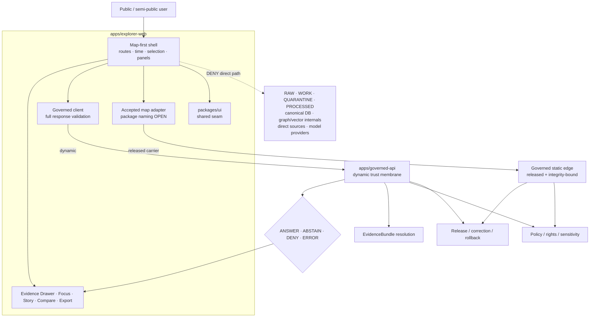

<!-- [KFM_META_BLOCK_V2]
doc_id: kfm://doc/adr-0005-apps-explorer-web-canonical-map-first-shell
title: "ADR-0005 — `apps/explorer-web/` is the canonical map-first shell"
type: adr
adr_id: ADR-0005
version: v1.2
status: proposed
owners:
  - "NEEDS VERIFICATION — architecture decision owner"
  - "NEEDS VERIFICATION — Explorer Web application owner"
  - "NEEDS VERIFICATION — UI and map-runtime owner"
owner_status: "CODEOWNERS routes docs/adr/ and apps/explorer-web/ to @bartytime4life; accepted stewardship, required-review rules, and independent approval controls were not verified"
reviewers_required:
  - Architecture steward
  - Docs steward
  - Explorer Web / application steward
  - Governed API maintainer
  - UI accessibility reviewer
  - Security / privacy reviewer
  - Policy and evidence reviewer
  - "at least one affected map-runtime or client owner"
created: 2026-05-09
updated: 2026-08-14
policy_label: public
truth_posture: cite-or-abstain
owning_root: docs/
responsibility: "records the proposed canonical Explorer shell boundary, current implementation evidence, authority limits, graduation checks, rollback, and renderer hold without granting acceptance, release, deployment, or publication authority"
current_path: docs/adr/ADR-0005-apps-explorer-web-is-the-canonical-map-first-shell.md
supersedes: []
superseded_by: []
evidence_snapshot:
  repository: bartytime4life/Kansas-Frontier-Matrix
  base_ref: main
  base_commit: 6eab7cd37861d25cb007b7777f024a4b68d6e9d1
  target_prior_blob: c8cae17b8ca88b5f7a47b613bfc522d923e7d721
  adr_index_blob: 938c5894c36b99e14810918e2c550ab0e92d53b1
  adr_0029_blob: a4de0d7a96b78da59cfc499d1025e1508afd8dd9
  directory_rules_doctrine_blob: fd49a0b83e55cef52c1124281f093e263526898d
  codeowners_blob: dd2a84aa514d8ecd9208bc347f90f9a2ed37dd61
  apps_readme_blob: 6cd825905976b2b662e43497203206305cb78827
  explorer_readme_blob: 3d7944fcd31b7edeabca5b793eb7b88e12563f56
  root_package_blob: 5cba790c88c40b885cc65fe2d585f3205aa1ef9d
  pnpm_lock_blob: 69a45e6aaca1ea6521e01ff274e4f1b3e1bf3975
  explorer_package_blob: ddd201b74a06001d84a14bf54ac62a6cc3607a29
  explorer_main_blob: 9c95ae67333b7cbf6bc88051fa5c76e4cd97efa4
  explorer_shell_blob: 64c78c78820af33fb7a622094e4c0944ad9412f8
  governed_client_blob: 21f6e4d1225ab0427ecb689d6782f4b56fc25ea2
  evidence_drawer_blob: 7746843c259594568fe75e975155a67eb8372e8f
  map_evidence_bridge_blob: 18d61ea0ef2fbe2fc2f3cc9d42291c101003037f
  packages_ui_entry_blob: 2c9ea341d61bf4d1733b9982fda8a9b869a3a720
  packages_maplibre_entry_blob: 91664eb00583f9e3d0405eb7954fefa9a48f4ee9
  explorer_maplibre_adapter_blob: 663ba0f7a05498948f67d644387c73ab19d5c16c
  ui_build_workflow_blob: 52382d796a8dd5ecafc39a801515aff0a8b013f8
  explorer_boundary_test_blob: 97d44069b0a5ab4a82b1e1fc48665e905c08a287
  latest_exact_head_ui_build_run: "31808443943 — success"
  packages_cesium_path_at_base: absent
  packages_maplibre_runtime_path_at_base: absent
  explorer_dist_path_at_base: absent
related:
  - docs/adr/README.md
  - docs/adr/INDEX.md
  - docs/adr/ADR-0004-apps-governed-api-is-the-trust-membrane.md
  - docs/adr/ADR-0006-maplibre-boundary--only-maplibreadapter-imports-maplibre.md
  - "docs/adr/ADR-0007 — MapLibre GL JS Is the Sole Browser-Side Renderer.md"
  - docs/adr/ADR-0019-ai-adapter-contract-and-finite-envelopes.md
  - docs/adr/ADR-0020-abstain-is-a-first-class-decision.md
  - docs/adr/ADR-0025-public-client-never-reads-canonical-internal-stores.md
  - docs/adr/ADR-0029-adopt-directory-governance-standard-v2.md
  - docs/doctrine/directory-rules.md
  - docs/architecture/map-shell.md
  - docs/architecture/ui/BOUNDARIES.md
  - apps/README.md
  - apps/explorer-web/README.md
  - apps/explorer-web/src/main.ts
  - apps/explorer-web/src/adapters/GovernedClient.ts
  - apps/explorer-web/src/features/evidence_drawer/index.tsx
  - apps/explorer-web/src/features/map_runtime/index.tsx
  - packages/ui/README.md
  - packages/maplibre/README.md
  - package.json
  - pnpm-lock.yaml
  - .github/workflows/ui-build.yml
  - tests/policy/test_explorer_web_adapter_boundary.py
tags: [kfm, adr, explorer-web, map-first, shell, trust-membrane, governed-api, maplibre, ui, accessibility, static-delivery, fail-closed, rollback]
notes:
  - "v1.2 is a same-path, documentation-only current-state reconciliation; it preserves effective decision status `proposed` and changes no executable behavior."
  - "ADR-0029 is the only accepted numbered ADR. Its adopted Directory Rules place deployables under apps/ and reusable code under packages/ but do not accept ADR-0005 or choose a renderer child-package name."
  - "The root workspace now pins pnpm@11.17.0 and Node 22, pnpm-lock.yaml exists, Explorer has real Vite/TypeScript/Vitest/Playwright scripts, and exact-head ui-build run 31808443943 passed build and test."
  - "The default browser entrypoint still renders a fixed fail-closed shell and mounts a no-input Evidence Drawer. Independently tested fixture-first modules and synthetic map-selection bridges are not live Governed API, released-layer, or production map flows."
  - "packages/ui/ and packages/maplibre/ remain private 0.0.0 scaffolds; MapLibreAdapter.ts is comment-only; no MapLibre dependency, packages/maplibre-runtime/, or packages/cesium/ exists at the pinned tree."
  - "Dynamic trust-bearing responses belong behind a governed interface. A governed static edge may serve released public-safe immutable artifacts, but it is not a second truth or publication authority."
[/KFM_META_BLOCK_V2] -->

<a id="top"></a>

# ADR-0005 — `apps/explorer-web` is the canonical map-first shell

> **Proposed decision.** `apps/explorer-web/` is KFM's single canonical deployable composition root for the public and semi-public map-first browser shell. It renders governed finite outcomes and already released public-safe artifacts; it does not own truth, evidence, policy, release, correction, rollback, source admission, or model execution. Dynamic trust-bearing responses pass through `apps/governed-api/`. A governed static edge may serve immutable released artifacts with verified release and integrity context, but it is not a parallel API or publication authority.

[](#status)
[](#evidence)
[](#evidence)
[](#validation)
[](#renderer-boundary)
[](#authority-boundary)

> [!IMPORTANT]
> **Repository presence is not accepted decision authority.** The app, source tree, supporting packages, static boundary tests, and CI readiness workflow exist. The ADR index still records ADR-0005 as `proposed`. This revision describes current evidence and the proposed target without promoting the decision.

> [!CAUTION]
> **Bounded executable slices are not a working map product.** Explorer now has a locked toolchain, real build/test scripts, a static entrypoint, finite no-leak projections, a keyboard-operable Evidence Drawer, and synthetic map-selection bridge tests. The default entrypoint still renders fixed `ABSTAIN` and mounts a no-input drawer. No live Governed API transport, accepted client envelope, MapLibre dependency or adapter, released-layer load, production route tree, deployment, or public operation is established.

**Quick navigation:** [Status](#status) · [Evidence](#evidence) · [Context](#context) · [Decision](#decision) · [Architecture](#architecture) · [Invariants](#invariants) · [Consequences](#consequences) · [Alternatives](#alternatives) · [Migration](#migration) · [Validation](#validation) · [Rollback](#rollback) · [Open work](#open-work)

---

<a id="status"></a>

## Status

| Field | Current value |
|---|---|
| **ADR ID** | `ADR-0005` — unique in [`INDEX.md`](./INDEX.md) |
| **Source/effective status** | `proposed` / `proposed` — not binding until the record and index carry matching reviewed `accepted` status |
| **Decision class** | Canonical shell placement, client authority boundary, dynamic/static delivery boundary, and no-parallel-shell rule |
| **Tracked path** | `docs/adr/ADR-0005-apps-explorer-web-is-the-canonical-map-first-shell.md` |
| **Configured app path** | [`apps/explorer-web/`](../../apps/explorer-web/) |
| **Current implementation** | Static fail-closed entrypoint plus independently tested fixture-first trust, evidence, time, and map-selection modules; no live map or API transport |
| **Current enforcement** | Locked Explorer build/test workflow plus bounded path/import guards; latest exact-head `ui-build` passed |
| **Publication effect** | None. ADRs, routes, packages, tests, workflows, commits, PRs, merges, builds, and deployments do not publish KFM data or claims. |

The intent is stable: one map-first browser shell home. The reproducible build/test baseline is now present, while live composition, renderer closure, decision acceptance, deployment, and operational maturity remain incomplete.

[Back to top](#top)

---

<a id="evidence"></a>

## Current repository evidence

The findings below are **CONFIRMED at `main@6eab7cd37861d25cb007b7777f024a4b68d6e9d1`** unless marked otherwise.

| Surface | Verified state | Limit |
|---|---|---|
| ADR index | ADR-0005 is uniquely indexed at this path with source and effective status `proposed`; ADR-0029 alone is accepted. | Identity/status, not acceptance or implementation. |
| [Accepted Directory Rules](../doctrine/directory-rules.md) and [ADR-0029](./ADR-0029-adopt-directory-governance-standard-v2.md) | `apps/` owns deployables; `packages/` owns reusable non-deployable code; public clients use governed APIs or released carriers. | Does not accept ADR-0005 or choose an Explorer, UI, or renderer child-package name. |
| [`apps/README.md`](../../apps/README.md) | Classifies Explorer as a static fail-closed shell with independently tested fixture-first components. | Root orientation, not deployed behavior. |
| Root [`package.json`](../../package.json) and [`pnpm-lock.yaml`](../../pnpm-lock.yaml) | Pin `pnpm@11.17.0`, Node 22, workspace membership, and locked dependencies. Root aggregate lint/test/build scripts still fail closed with `WORKFLOW_HOLD`. | Reproducible Explorer lane; not a complete monorepo toolchain. |
| [`apps/explorer-web/package.json`](../../apps/explorer-web/package.json) | Real Vite development/build, TypeScript check, Vitest unit, and Playwright browser scripts. | Tooling exists; scripts do not prove product readiness. |
| [`src/main.ts`](../../apps/explorer-web/src/main.ts) and shell resolver | Build a static entrypoint that emits fixed `ABSTAIN / NO_GOVERNED_RESPONSE` and mounts a no-input Evidence Drawer. | No route tree, map, live transport, authentication, or released data. |
| Explorer source and tests | 293 tracked Explorer files, 100 source TypeScript/TSX files, 35 app-local unit test files, and 30 browser spec files at the pinned tree. | Inventory and passing tests do not mean every module is composed or production-ready. |
| [`GovernedClient.ts`](../../apps/explorer-web/src/adapters/GovernedClient.ts) and [Evidence Drawer](../../apps/explorer-web/src/features/evidence_drawer/index.tsx) | Strict fixture-only projection parsing; finite `ANSWER`, `ABSTAIN`, `DENY`, and `ERROR`; fixed no-leak negative copy; correction/history visibility; keyboard focus entry/return. | No accepted cross-root response contract or network transport is wired. |
| [Map-selection bridge](../../apps/explorer-web/src/features/map_runtime/index.tsx) | Renderer-neutral synthetic selection parsing, governed-resolver injection, evidence-subset enforcement, and fail-closed drawer outcomes. | Resolver is supplied by tests; no MapLibre runtime, real click, API request, or released layer is present. |
| [`packages/ui/`](../../packages/ui/) and [`packages/maplibre/`](../../packages/maplibre/) | Private `0.0.0` scaffolds with placeholder exports; Explorer `MapLibreAdapter.ts` is comment-only and the workspace has no MapLibre dependency. | No shared UI package API, functioning renderer seam, or browser map. |
| `packages/maplibre-runtime/` and `packages/cesium/` | Exact paths absent at the pinned tree. | Absence does not accept a sole-renderer decision or complete a dependency inventory. |
| [`ui-build.yml`](../../.github/workflows/ui-build.yml) | Exact-head run [31808443943](https://github.com/bartytime4life/Kansas-Frontier-Matrix/actions/runs/31808443943) passed readiness, locked install, build, unit tests, and browser tests for `main@6eab7cd…`. | CI signal only; no deployment, release, policy, evidence, or publication effect. |
| [Static boundary test](../../tests/policy/test_explorer_web_adapter_boundary.py) | Restricts renderer imports to `src/adapters/` and rejects configured internal-store literals. | Bounded source scan, not complete network, CSP, information-flow, renderer, or deployed-isolation proof. |
| Deployment, auth, CSP, observability, service health, public operation | **UNKNOWN** | No admissible deployed-system evidence inspected. |

The current tree has crossed from placeholder-only scaffolding to a reproducible, fixture-first executable baseline. Its safest description is still **bounded and fail-closed**, not a functional governed map application.

[Back to top](#top)

---

<a id="context"></a>

## Context

KFM is map-first, time-aware, evidence-first, policy-aware, and correction-aware. The browser shell is where those commitments become visible, not where they become true.

1. **One composition root.** Routes, state, accessibility, clients, adapters, evidence views, and exports otherwise fragment across app and compatibility surfaces.
2. **UI is not a data plane.** The browser is downstream of `RAW → WORK / QUARANTINE → PROCESSED → CATALOG / TRIPLET → governed release`.
3. **Map interaction implies claims.** A tile, property, popup, selection, camera, or pixel is a candidate interaction, not evidence. The current synthetic selection bridge enforces that distinction in tests; live claim detail still requires governed evidence and policy resolution.
4. **Shell and renderer decisions diverge.** The repository has `packages/maplibre/`; supplied design lineage proposed `packages/maplibre-runtime/`; accepted Directory Rules select only the `packages/` responsibility root; ADR-0006/0007 remain proposed; `packages/cesium/` is absent.

This ADR decides the **shell home and client authority boundary** without silently accepting a renderer decision or creating a new renderer package.

[Back to top](#top)

---

<a id="decision"></a>

## Decision

### Single canonical shell

**`apps/explorer-web/` is the single canonical deployable composition root for KFM's public and semi-public map-first browser experience.**

It may compose bootstrap/routing; viewport/layer/time/selection/panel state; finite-response rendering; trust/time surfaces; Evidence Drawer; Focus Mode; story/compare/export/settings/safe diagnostics; accessibility; and app-local adapters.

It **must not** own source admission, canonical evidence, policy, release/correction/rollback, lifecycle storage, direct model invocation, semantic contract/schema authority, or publication.

<a id="authority-boundary"></a>

### Authority and delivery boundary

| Responsibility | Owner | Explorer Web relationship |
|---|---|---|
| Dynamic trust-bearing API | [`apps/governed-api/`](../../apps/governed-api/) | Consume validated finite responses; never replace policy/evidence/release work. |
| Shared reusable UI | [`packages/ui/`](../../packages/ui/) | Consume reviewed exports once implemented. |
| Renderer seam | **OPEN / HOLD; below** | Consume one accepted adapter; no ad hoc peer renderer. |
| Evidence / policy / release | Owning contracts, resolvers, `policy/`, `release/` | Render projections/outcomes/lineage; do not author or decide. |
| Lifecycle data | `data/` | No direct normal browser path. |
| Model adapters | `runtime/` behind Governed API | No direct browser provider/model call. |

Under this proposed decision, dynamic claim-bearing requests **must** pass through `apps/governed-api/` and return a reviewed client envelope. Current Explorer has no live transport, and current Governed API routes themselves remain fail-closed scaffolds. Public semantic outcomes remain:

```text
ANSWER | ABSTAIN | DENY | ERROR
```

Internal states such as `restrict`, `hold`, or `needs_review` travel as obligations, reason codes, state fields, or a versioned extension—not accidental extra public outcomes.

Explorer Web may load released public-safe static artifacts from a governed edge only when release binding, integrity, rights/sensitivity, stale/correction/withdrawal state, and cache invalidation are verifiable. The edge cannot expose internal lifecycle stores or become a second policy engine/API. Static bytes remain a **released carrier**, not truth authority.

<a id="renderer-boundary"></a>

### Renderer and UI package boundaries

ADR-0005 does **not** decide the final renderer package name or accept the sole-renderer proposal.

| Surface | Current state | Posture |
|---|---|---|
| `packages/maplibre/` | Repository-present private `@kfm/maplibre` `0.0.0` scaffold with a placeholder export | **CONFIRMED path; non-functional** |
| `apps/explorer-web/src/adapters/MapLibreAdapter.ts` | One boundary comment; no implementation or runtime import | **CONFIRMED placeholder** |
| `packages/maplibre-runtime/` | Supplied design-lineage name; absent; not selected by accepted Directory Rules | **PROPOSED lineage only** |
| `packages/cesium/` | Exact path absent | **Do not create as a side effect** |
| ADR-0006 / ADR-0007 | Single importer / sole renderer proposals | **Effective status `proposed`; not accepted here** |

Until reviewed renderer closure:

1. Feature code introduces no direct renderer imports outside the existing adapter boundary.
2. Do not create `packages/maplibre-runtime/`, `packages/cesium/`, or another peer merely to satisfy docs.
3. Resolve naming through ADR/migration with imports, consumers, tests, workflows, and rollback together.
4. No renderer package owns truth, policy, evidence, release, or publication.
5. The current static test is a guard, not final-architecture proof.

`packages/ui/` is the repository-present candidate reusable-component lane under the accepted `packages/` responsibility root. Routing, shell state, and app integrations remain app-local. A component moves only when reuse, API, accessibility, trust-state semantics, tests, and consumers are reviewable. The current package remains a scaffold.

Compatibility families (`ui/`, `web/`, `styles/`, `viewer_templates/`) are not shell authorities. Inspect actual content/class before migration; do not create missing roots solely to deprecate them; preserve history, links, generator/mirror contracts, and rollback.

### Finite states and accessibility

Claim-bearing panels render finite outcomes, loading/retry, stale/corrected/superseded/withdrawn/rollback-affected state, and material obligations. Color, hidden styling, empty panels, or generic HTTP success are insufficient.

The shell preserves keyboard/focus, skip links/landmarks, status announcements, textual labels, contrast, reduced motion, accessible map alternatives/non-pointer paths, and trust context in exports. An inaccessible trust state is not fully inspectable.

[Back to top](#top)

---

<a id="architecture"></a>

## Canonical architecture


```mermaid
flowchart TB
    USER["Public / semi-public user"]
    subgraph BROWSER["apps/explorer-web"]
      SHELL["Map-first shell<br/>routes · time · selection · panels"]
      VIEW["Evidence Drawer · Focus · Story · Compare · Export"]
      CLIENT["Governed client<br/>full response validation"]
      ADAPTER["Accepted map adapter<br/>package naming OPEN"]
      UI["packages/ui<br/>shared seam"]
      SHELL --> VIEW
      SHELL --> CLIENT
      SHELL --> ADAPTER
      SHELL --> UI
    end
    API["apps/governed-api<br/>dynamic trust membrane"]
    STATIC["Governed static edge<br/>released + integrity-bound"]
    ENVELOPE{"ANSWER · ABSTAIN · DENY · ERROR"}
    RELEASE["Release / correction / rollback"]
    EVIDENCE["EvidenceBundle resolution"]
    POLICY["Policy / rights / sensitivity"]
    FORBIDDEN["RAW · WORK · QUARANTINE · PROCESSED<br/>canonical DB · graph/vector internals<br/>direct sources · model providers"]
    USER --> SHELL
    CLIENT -->|dynamic| API
    ADAPTER -->|released carrier| STATIC
    API --> ENVELOPE
    API --> EVIDENCE
    API --> POLICY
    API --> RELEASE
    STATIC --> RELEASE
    STATIC --> POLICY
    ENVELOPE --> VIEW
    SHELL -. "DENY direct path" .-> FORBIDDEN
```

This is responsibility/allowed traffic, not deployed topology. Routes, CDN, auth, package names, and runtime bindings remain separately governed.

[Back to top](#top)

---

<a id="invariants"></a>

## Operational invariants

| ID | Invariant | Acceptance burden |
|---|---|---|
| `SHELL-01` | Explorer Web is the only canonical deployable public/semi-public map shell. | Reviewed acceptance; no parallel shell. |
| `SHELL-02` | Shell owns no truth, evidence, policy, release, correction, rollback, or publication. | Contract/policy/integration evidence. |
| `SHELL-03` | Dynamic claims use Governed API; static carriers use governed released edge. | Network/client and manifest/cache tests. |
| `SHELL-04` | Outcomes remain `ANSWER`, `ABSTAIN`, `DENY`, `ERROR`. | Full envelope validation and UI tests. |
| `SHELL-05` | Click/rendered properties are not evidence. | End-to-end selection-to-EvidenceBundle test. |
| `SHELL-06` | One accepted renderer adapter; no peer package without ADR/migration. | Package decision, inventory, tests, guards. |
| `SHELL-07` | Redaction cannot be reversed client-side; no direct model/source/internal path. | Sensitive fixtures plus import/network/CSP tests. |
| `SHELL-08` | Accessibility, trust-preserving exports, and rollback are correctness requirements. | Automated/manual review and rollback drill. |

[Back to top](#top)

---

<a id="consequences"></a>

## Consequences

**Benefits:** one reviewable deployable boundary; a reproducible fail-closed Explorer baseline; exact build/test evidence; independently testable finite-state, no-leak, evidence-history, time, and synthetic selection seams; no implied renderer decision; governed dynamic/static delivery; accessibility tied to inspectability; evidence-driven graduation.

**Costs:** many tested modules are not composed into the default shell; the app-local fixture projection is not yet a reviewed cross-root client contract; Governed API transport, renderer naming/version/admission, released-layer flow, complete accessibility, deployment, and operational rollback remain open; shared-package extraction stays slow until reuse is proved; proof is cross-cutting.

[Back to top](#top)

---

<a id="alternatives"></a>

## Alternatives considered

| Alternative | Disposition |
|---|---|
| Keep `apps/web/`, root `web/`, or root `ui/` as shell | Rejected: competing deployable/authority home. |
| Make `packages/explorer-web/` the shell | Rejected: package is reusable implementation, not deployable composition. |
| Split public micro-frontends now | Deferred: multiplies trust/state/accessibility/release boundaries before one slice works. |
| Let each feature call API directly | Rejected: central client/validation seam required. |
| Force static artifacts through dynamic byte streaming | Rejected: released immutable carriers may use governed edge. |
| Let browser read `data/published/` directly | Rejected: directory alone is not audience/integrity/correction/cache/policy contract. |
| Resolve renderer package naming here or create `packages/cesium/` | Rejected: belongs to renderer ADR/migration; path absent. |
| Put policy/evidence/release/direct model calls in shell | Rejected: collapses responsibility roots/trust membrane. |
| Stop at fixture-first modules and a static abstaining entrypoint | Rejected as end state: useful conformance baseline, not a governed map product. |

[Back to top](#top)

---

<a id="migration"></a>

## Migration plan

The app path exists; next work is **graduation and composition, not a broad move**.

1. **Preserve decision and trust holds.** Keep ADR-0005 proposed, retain fail-closed defaults and boundary guards, and create no second shell, renderer, static edge, or compatibility root.
2. **Treat the reproducible baseline as complete but bounded.** Preserve the exact package-manager pin, lockfile, real scripts, TypeScript/Vite entrypoint, Vitest/Playwright lanes, and deterministic public-safe fixtures. Do not claim that passing them establishes live integration.
3. **Compose one governed finite-response flow.** Wire one reviewed client-envelope profile into the default shell through a deterministic mock or bounded Governed API route; render all finite and invalid/offline states; preserve no-network fixtures and a reversible hold-screen selector. No live sources or models.
4. **Close the renderer decision separately.** Resolve `packages/maplibre/` versus design-lineage naming through reviewed ADR/migration; accept and pin the dependency/version only with one physical adapter, import/acquisition enforcement, browser probes, and rollback. Do not create a peer renderer.
5. **Build one proof-bearing interaction.** Low-sensitivity released layer → governed carrier → renderer-neutral selection → governed evidence request → EvidenceBundle-derived drawer → visible release, time, correction, and limitation state. Add keyboard/non-pointer flow, safe export, bounded telemetry, and cache/release rollback drill.

ADR-0005 may become accepted only when ADR/index transition together; owners/reviewers are verified; current bounded slices are reconciled with a reviewed client contract; renderer governance is visible; dynamic/static boundaries are tested; accessibility and rollback/correction are reviewed; and deployment/exposure evidence is available.

[Back to top](#top)

---

<a id="validation"></a>

## Validation

Current enforcement is bounded but executable. At the pinned base, `ui-build` run [31808443943](https://github.com/bartytime4life/Kansas-Frontier-Matrix/actions/runs/31808443943) completed successfully: both `build-explorer-web` and `test-explorer-web` passed readiness, frozen install, build, unit, and browser steps. The ADR index and static boundary guard are separate checks. None proves a live governed map.

Acceptance still requires:

- identity/status coherence and verified review authority;
- a reviewed cross-root client envelope and live/bounded Governed API integration;
- route composition with all finite, invalid, loading, retry, and offline states;
- Governed API-only dynamic network behavior and governed static-carrier tests;
- selection-to-EvidenceBundle continuity over a released low-sensitivity layer;
- an accepted renderer package/adapter with one consumer and no peer;
- sensitive payload, tile, cache, export, and diagnostic leakage tests;
- no direct model client or canonical/internal-store path;
- automated plus manual accessibility, including a non-pointer map path;
- trust-preserving export and redacted observability;
- reviewed TLS, CSP, CORS, origin, secret, dependency, cache, identity, incident, and isolation controls;
- rehearsed app, renderer, static-cache, release, correction, and rollback behavior;
- documentation closure without overclaiming.

Suggested changed-area checks:

```bash
python tools/validators/validate_adr_index.py
python -m pytest tests/validators/test_validate_adr_index.py -q --strict-config --strict-markers
python -m pytest tests/policy/test_explorer_web_adapter_boundary.py -q --strict-config --strict-markers
make ui-build
pnpm --filter explorer-web test
make boundary-guards
```

Validation is CI and conformance evidence only. It is not ADR acceptance, release approval, deployment proof, or publication authority.

[Back to top](#top)

---

<a id="rollback"></a>

## Rollback and supersession

Restore the prior target blob:

```text
c8cae17b8ca88b5f7a47b613bfc522d923e7d721
```

or revert the v1.2 documentation commit. No executable path requires rollback because this revision changes only this ADR.

A future shell-home change requires a successor ADR, `superseded` status, same-change index update, reciprocal links, consumer/surface inventory, and migration/rollback plan.

Future package/build changes revert coherently; routes return to a finite hold/error state; renderer rollback restores the package/import graph; static rollback withdraws, invalidates, or purges cache and exposes correction; deployment rollback verifies health and envelope versions. Code rollback must not erase release, correction, or audit history.

[Back to top](#top)

---

<a id="open-work"></a>

## Open verification backlog

### Closed since the v1.1 checkpoint

| Prior gap | Current evidence | Remaining limit |
|---|---|---|
| Exact package-manager pin and lockfile | Root pins `pnpm@11.17.0` and Node 22; `pnpm-lock.yaml` exists. | Root aggregate scripts still hold; this closes Explorer reproducibility only. |
| Real Explorer build/test scripts | Vite/TypeScript build plus Vitest and Playwright scripts are present; exact-head `ui-build` passed. | Passing build/test is not a live map or deployment. |
| Browser entrypoint and finite baseline | `src/main.ts` renders fixed `ABSTAIN` and mounts a no-input Evidence Drawer. | No route tree, transport, authentication, or released data. |
| Fixture-first evidence and selection seams | Strict finite projection, no-leak drawer, correction/history, keyboard, and synthetic selection-to-drawer tests exist. | Test resolver and fixtures are not Governed API or EvidenceBundle end-to-end proof. |

### Remaining work

| ID | Topic | Closure evidence |
|---|---|---|
| `ADR5-V01` | Owners, review authority, and ADR status | Verified stewardship/required review plus matching reviewed ADR/index transition. |
| `ADR5-V02` | `packages/maplibre/` versus design-lineage `packages/maplibre-runtime/`; ADR-0006/0007 disposition | Accepted renderer ADR, one package and adapter, dependency/version admission, imports/acquisition tests, consumers, migration, and rollback. |
| `ADR5-V03` | Default-shell composition, client envelope, transport, auth, and route state | Reviewed cross-root mapping contract; bounded route; finite/invalid/offline fixtures; role/session evidence; no canonical-store or direct-model path. |
| `ADR5-V04` | Proof-bearing map interaction | Released low-sensitivity carrier; real renderer-neutral selection; governed EvidenceRef resolution to EvidenceBundle-derived drawer; citation, time, release, correction, and limitation continuity. |
| `ADR5-V05` | Governed static carrier | Artifact/header/integrity/cache/withdrawal profile and proof that it cannot become a parallel API, policy engine, or release authority. |
| `ADR5-V06` | Sensitive-domain hardening | Negative payload, tile, cache, export, diagnostic, and audience-bound fixtures with generalization/redaction proof. |
| `ADR5-V07` | Shared UI, accessibility, and performance | Reviewed package API/consumers; automated and manual accessibility; non-pointer map path; representative budgets and browser evidence. |
| `ADR5-V08` | Deployment, observability, incident response, rollback, and documentation drift | Reviewed infra and exposure; redacted telemetry; health/incident evidence; rehearsed rollback; bounded convergence of stale architecture and app docs. |

### Change log

| Version | Date | Change |
|---|---|---|
| `v1.2` | 2026-08-14 | Reconciled the ADR to the locked Explorer build/test baseline and exact-head UI success; documented the static abstaining entrypoint, fixture-first Evidence Drawer and synthetic map-selection seams, current package/renderer holds, remaining live-integration gap, acceptance burden, and rollback; preserved proposed status. |
| `v1.1` | 2026-07-23 | Same-path repository-grounded modernization: confirmed ADR identity/status and Explorer scaffold; replaced repo-unavailable assumptions; separated shell placement from renderer decisions; documented placeholder/readiness state, static guards, dynamic/static delivery, finite outcomes, accessibility, acceptance gates, incremental graduation, rollback, and verification backlog; preserved proposed status. |
| `v1` | 2026-05-09 | Initial proposal selecting `apps/explorer-web/` as canonical shell and naming companion packages, compatibility roots, migration phases, validation ideas, and rollback posture. |

---

**Last updated:** 2026-08-14 · **Source metadata:** `proposed` · **Effective decision status:** `proposed` · **Path:** `docs/adr/ADR-0005-apps-explorer-web-is-the-canonical-map-first-shell.md` · [Back to top](#top)
