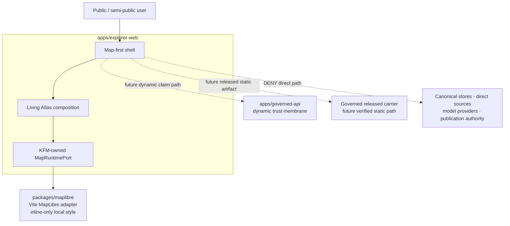

<!-- [KFM_META_BLOCK_V2]
doc_id: kfm://doc/adr-0005-apps-explorer-web-canonical-map-first-shell
title: "ADR-0005 — `apps/explorer-web/` is the canonical map-first shell"
type: adr
adr_id: ADR-0005
version: v1.3
status: proposed
owners:
  - "NEEDS VERIFICATION — architecture decision owner"
  - "NEEDS VERIFICATION — Explorer Web application owner"
  - "NEEDS VERIFICATION — UI and map-runtime owner"
owner_status: "CODEOWNERS routes docs/adr/ and apps/explorer-web/ to @bartytime4life; accepted stewardship, required-review rules, and independent approval controls were not verified"
reviewers_required:
  - Architecture steward
  - Docs steward
  - Explorer Web / application steward
  - Governed API maintainer
  - UI accessibility reviewer
  - Security / privacy reviewer
  - Policy and evidence reviewer
  - "at least one affected map-runtime or client owner"
created: 2026-05-09
updated: 2026-09-12
policy_label: public
truth_posture: cite-or-abstain
owning_root: docs/
responsibility: "records the proposed canonical Explorer shell boundary, current implementation evidence, authority limits, graduation checks, rollback, and renderer relationship without granting acceptance, release, deployment, or publication authority"
current_path: docs/adr/ADR-0005-apps-explorer-web-is-the-canonical-map-first-shell.md
supersedes: []
superseded_by: []
evidence_snapshot:
  repository: bartytime4life/Kansas-Frontier-Matrix
  base_ref: main
  base_commit: ca79de9b61b0a2da948940b07c89c558f480470e
  target_prior_blob: 7cd1b6fcf03193603d0e6bba49ff6ab43a5cb02f
  adr_index_blob: 0c143676dfd3c1bda16cb44398c5ad5d4a49cf67
  adr_0006_blob: 4bf4292dc05a85fd4cd829c491808b13894bc223
  adr_0007_blob: 2482eea382fd97e68544bb04bc2e2ea1e1cedebe
  adr_0029_blob: a4de0d7a96b78da59cfc499d1025e1508afd8dd9
  directory_rules_doctrine_blob: fd49a0b83e55cef52c1124281f093e263526898d
  codeowners_blob: dd2a84aa514d8ecd9208bc347f90f9a2ed37dd61
  apps_readme_blob: 95b3b021cad9bcafbd53fd1ddd18f6b51df22d80
  explorer_readme_blob: f4b59436c71c8bb0695f0d9587071e46467ffec8
  root_package_blob: d4e6706946929ac52bea0655fa5d63273eab9560
  pnpm_lock_blob: ade374e32fee22866c0a92228329340de99c1196
  explorer_package_blob: e3ef41da15915d23fb8872a7ba881d66cf892093
  explorer_main_blob: 15bbac95c802e9bcbf4c6e630f08c18c3c741f72
  explorer_site_mount_blob: 413c4a5c6faf7504d085d03dcfd0a37f55e667c3
  living_atlas_mount_blob: 65e5e575f0c116fe60d70d83cf9d631eefe745ca
  living_atlas_style_blob: 8e45ea05e81c7c2375a6528e19e03759140f27e2
  governed_client_blob: dce12a2bc152c059a60168f89a43d82483a9cf14
  map_evidence_bridge_blob: 864af0e32beb449dd102ab79f3407689ce42efac
  maplibre_package_blob: 03a24dc1669151863192db30778f30faac0ec5b4
  maplibre_port_blob: 5a033319649d5fa55fabbab4d077e29d5235980c
  maplibre_adapter_blob: e201a7717a0a10efc72440e1c71fd4e07fd919cc
  maplibre_vite_adapter_blob: 57e0f7da9b13006cde2da2592869fc2ba06a4512
  ui_build_workflow_blob: 52382d796a8dd5ecafc39a801515aff0a8b013f8
  maplibre_webgl_workflow_blob: abba4ed732060a4eebaddeb276907d85ddcbec5f
  explorer_boundary_test_blob: d689bc6d42d3f215d8a31952f91a71dd3d3be211
  living_atlas_browser_test_blob: d2df36d42f0c111a02e0abe83b92956f6d22cde5
  maplibre_vite_browser_test_blob: f7af3d92e7fb5cc446f2eb60efc4d1a67277b965
  maplibre_webgl_browser_test_blob: f6cc07e320e5e0dbb7efaeddb2b66af05b84513e
  packages_maplibre_runtime_path_at_base: absent
  packages_cesium_path_at_base: absent
  explorer_dist_path_at_base: absent
related:
  - docs/adr/README.md
  - docs/adr/INDEX.md
  - docs/adr/ADR-0004-apps-governed-api-is-the-trust-membrane.md
  - docs/adr/ADR-0006-maplibre-boundary--only-maplibreadapter-imports-maplibre.md
  - "docs/adr/ADR-0007 — MapLibre GL JS Is the Sole Browser-Side Renderer.md"
  - docs/adr/ADR-0019-ai-adapter-contract-and-finite-envelopes.md
  - docs/adr/ADR-0020-abstain-is-a-first-class-decision.md
  - docs/adr/ADR-0025-public-client-never-reads-canonical-internal-stores.md
  - docs/adr/ADR-0029-adopt-directory-governance-standard-v2.md
  - docs/doctrine/directory-rules.md
  - docs/architecture/map-shell.md
  - docs/architecture/ui/BOUNDARIES.md
  - apps/README.md
  - apps/explorer-web/README.md
  - apps/explorer-web/src/main.ts
  - apps/explorer-web/src/site/mount-explorer-site.ts
  - apps/explorer-web/src/site/mount-living-atlas.ts
  - apps/explorer-web/src/adapters/GovernedClient.ts
  - apps/explorer-web/src/adapters/map_runtime_evidence_adapter.ts
  - apps/explorer-web/src/features/map_runtime/index.tsx
  - apps/explorer-web/src/features/living_atlas/map-style.ts
  - packages/maplibre/README.md
  - packages/maplibre/package.json
  - packages/maplibre/src/map-runtime-port.ts
  - packages/maplibre/src/maplibre-adapter.ts
  - packages/maplibre/src/maplibre-vite-adapter.ts
  - package.json
  - pnpm-lock.yaml
  - .github/workflows/ui-build.yml
  - .github/workflows/maplibre-webgl-probe.yml
  - tests/policy/test_explorer_web_adapter_boundary.py
tags: [kfm, adr, explorer-web, map-first, shell, trust-membrane, governed-api, maplibre, ui, accessibility, static-delivery, fail-closed, rollback]
notes:
  - "v1.3 is a same-path, documentation-only current-state reconciliation. It preserves ADR-0005 source/effective status as proposed and changes no executable behavior."
  - "At the pinned GitHub tree, the default Explorer entrypoint mounts the Living Atlas, which creates the package-owned Vite MapLibre adapter with a repository-defined inline style. This is browser-rendering evidence, not source admission, release, deployment, or publication authority."
  - "ADR-0006 and ADR-0007 are accepted architecture records for the sole package seam and normal browser renderer family. Their acceptance does not accept ADR-0005 or turn current source code into operational approval."
  - "Notion page `KFM Explorer — Kansas-First Layers, Animation, Live Updates, 3D & Performance Roadmap` and Google Drive document `KFM Explorer — Living Atlas Interface, Default Views and Animation Design — v0.1` were consulted as proposed design lineage only; both predate this GitHub snapshot and do not establish current implementation, source admission, release, deployment, or publication."
[/KFM_META_BLOCK_V2] -->

<a id="top"></a>

# ADR-0005 — `apps/explorer-web` is the canonical map-first shell

> **Proposed decision.** `apps/explorer-web/` is KFM's single canonical deployable composition root for the public and semi-public map-first browser shell. It renders governed finite outcomes and already released public-safe artifacts; it does not own truth, evidence, policy, release, correction, rollback, source admission, or model execution. Dynamic trust-bearing responses pass through `apps/governed-api/`. A governed static edge may serve immutable released artifacts with verified release and integrity context, but it is not a parallel API or publication authority.

[](#status)
[](#evidence)
[](#renderer-boundary)
[](#evidence)
[](#authority-boundary)

> [!IMPORTANT]
> **Repository presence is not accepted decision authority.** The ADR index still records ADR-0005 as `proposed`. This revision describes current source and test configuration without promoting the decision, admitting a source, releasing a layer, or approving a deployment.

> [!CAUTION]
> **A mounted MapLibre canvas is not a live governed map product.** The default Explorer code now mounts a map-first Living Atlas and package-owned MapLibre adapter. Its style and visible records are repository-defined, inline, and synthetic/fixture-bound; current inspection establishes no live Governed API transport, admitted external source, released artifact carrier, deployed origin, or public operation.

**Quick navigation:** [Status](#status) · [Evidence](#evidence) · [Context](#context) · [Decision](#decision) · [Architecture](#architecture) · [Invariants](#invariants) · [Consequences](#consequences) · [Alternatives](#alternatives) · [Migration](#migration) · [Validation](#validation) · [Rollback](#rollback) · [Open work](#open-work)

---

<a id="status"></a>

## Status

| Field | Current value |
|---|---|
| **ADR ID** | `ADR-0005` — unique in [`INDEX.md`](./INDEX.md) |
| **Source/effective status** | `proposed` / `proposed` — not binding until the record and index carry matching reviewed `accepted` status |
| **Decision class** | Canonical shell placement, client authority boundary, dynamic/static delivery boundary, and no-parallel-shell rule |
| **Configured app path** | [`apps/explorer-web/`](../../apps/explorer-web/) |
| **Current implementation** | Default map-first Living Atlas composition with an inline-style, package-owned MapLibre runtime; fixture/registry-bound trust and evidence views; no established live governed data path |
| **Related accepted architecture** | [ADR-0006](./ADR-0006-maplibre-boundary--only-maplibreadapter-imports-maplibre.md) fixes the package/port/adapter seam; [ADR-0007](<./ADR-0007 — MapLibre GL JS Is the Sole Browser-Side Renderer.md>) fixes the normal browser renderer family |
| **Current enforcement** | Explorer build/unit/browser commands, a scoped MapLibre WebGL probe workflow, and bounded import/store-path guards are configured. Their existence is not a claim about a particular run outcome. |
| **Publication effect** | None. ADRs, routes, packages, tests, workflows, commits, PRs, merges, builds, and deployments do not publish KFM data or claims. |

The proposed shell home remains stable. Since the v1.2 snapshot, its default source composition has moved beyond a static abstention screen: it constructs a Living Atlas workspace and requests a MapLibre runtime through the accepted package seam. The data and authority holds remain material.

[Back to top](#top)

---

<a id="evidence"></a>

## Current repository evidence

The findings below are **CONFIRMED at `main@ca79de9b61b0a2da948940b07c89c558f480470e`** unless marked otherwise.

| Surface | Verified state | Limit |
|---|---|---|
| ADR index | ADR-0005 is uniquely indexed with source and effective status `proposed`. ADR-0006, ADR-0007, ADR-0029, and ADR-0038 are currently indexed `accepted`. | Status inventory, not acceptance of ADR-0005 or proof of implementation readiness. |
| [Directory Rules](../doctrine/directory-rules.md) and [ADR-0029](./ADR-0029-adopt-directory-governance-standard-v2.md) | `apps/` is the deployable responsibility root and `packages/` is the reusable-code root. | Does not accept ADR-0005, a dependency, a source, a release, or a deployment. |
| [ADR-0006](./ADR-0006-maplibre-boundary--only-maplibreadapter-imports-maplibre.md) and [ADR-0007](<./ADR-0007 — MapLibre GL JS Is the Sole Browser-Side Renderer.md>) | The package-owned `MapRuntimePort` / `MapLibreAdapter` seam and MapLibre GL JS renderer family are accepted architecture. | Current source implementation must still be evaluated against their downstream admission, conformance, security, and runtime gates; this ADR does not amend either record. |
| [`src/main.ts`](../../apps/explorer-web/src/main.ts) → [`mount-explorer-site.ts`](../../apps/explorer-web/src/site/mount-explorer-site.ts) → [`mount-living-atlas.ts`](../../apps/explorer-web/src/site/mount-living-atlas.ts) | The default entrypoint mounts Explorer, then the map-first Living Atlas workspace. That workspace creates and initializes `createViteMapLibreAdapter` for `#kfm-living-atlas-map`. | Source composition is not deployment or a successful browser run. |
| [`packages/maplibre/package.json`](../../packages/maplibre/package.json) and package source | Private `@kfm/maplibre` declares `maplibre-gl` `6.7.0`, exposes port, adapter, and Vite-adapter entries, and owns the raw renderer import. The Vite adapter configures a local worker before constructing the adapter. | A manifest/source fact is not, by itself, a complete dependency-admission, supply-chain, CSP, or long-session readiness record. |
| [`MapLibreAdapter`](../../packages/maplibre/src/maplibre-adapter.ts) | The package implementation checks WebGL2, accepts a serializable inline-only style, rejects external resource locators before acquisition, exposes finite runtime state, and tears down its renderer. | It performs no external source discovery or transport; source/layer/protocol/plugin admission remains separate. |
| [Living Atlas style](../../apps/explorer-web/src/features/living_atlas/map-style.ts) and registry | The default style is built from repository-defined inline GeoJSON and current synthetic/fixture-bound layer records; the UI labels generalized synthetic geometry and explicitly excludes external tiles and live observations. | Rendered geometry, catalog labels, and source candidates do not constitute admitted or released data. |
| [GovernedClient](../../apps/explorer-web/src/adapters/GovernedClient.ts), [map-evidence bridge](../../apps/explorer-web/src/adapters/map_runtime_evidence_adapter.ts), and map-runtime feature | Explorer validates bounded fixture-shaped projections and can inject a resolver for a renderer-neutral selection-to-drawer bridge. | No live `apps/governed-api` transport, accepted cross-root client envelope, session/auth binding, or EvidenceBundle end-to-end path is wired by the inspected default source. |
| Explorer inventory | At the pinned tree, `apps/explorer-web` contains 134 `.ts/.tsx` source files, 64 app-local unit-test files, and 41 browser `.spec.ts` files. | Inventory neither proves composition of every module nor test success. |
| [Living Atlas browser spec](../../apps/explorer-web/tests/browser/living-atlas.spec.ts), [Vite adapter spec](../../apps/explorer-web/tests/browser/maplibre-vite-adapter.spec.ts), and [WebGL probe](../../apps/explorer-web/tests/browser/maplibre-webgl-probe.spec.ts) | These tests configure local browser checks for default map mounting, no external HTTP(S) requests, adapter disposal, WebGL2 capability, and a review-only receipt. | Test design and source are not a completed CI receipt, a production network proof, or operational acceptance. |
| [`ui-build.yml`](../../.github/workflows/ui-build.yml) and [`maplibre-webgl-probe.yml`](../../.github/workflows/maplibre-webgl-probe.yml) | The UI workflow runs locked install, build, and Explorer test commands; the scoped WebGL workflow records a QA-only browser receipt and explicitly excludes dependency, release, deployment, and publication decisions. | Workflow configuration does not establish current run success or a deployed environment. |
| [Explorer policy guard](../../tests/policy/test_explorer_web_adapter_boundary.py) | Explorer source is scanned for raw renderer imports and configured internal-store path literals. | It is a bounded static guard, not a complete network, CSP, information-flow, or deployed-isolation proof. |
| Deployment, auth, CSP, observability, service health, external source activation, and public operation | **UNKNOWN** | No admissible deployed-system evidence was inspected. |

The safe current description is **implemented local map rendering with fixture/registry-bound content and explicit authority holds**—not a released, source-backed, or public governed map service.

[Back to top](#top)

---

<a id="context"></a>

## Context

KFM is map-first, time-aware, evidence-first, policy-aware, and correction-aware. The browser shell is where those commitments become visible, not where they become true.

1. **One composition root.** Routes, map/runtime state, accessibility, evidence views, reports/stories, adapters, and exports otherwise fragment across app and compatibility surfaces.
2. **UI is not a data plane.** The browser remains downstream of `RAW → WORK / QUARANTINE → PROCESSED → CATALOG / TRIPLET → governed release`. A local map style or a browser-visible property is not canonical evidence.
3. **Current renderer composition is narrow.** Explorer's default Living Atlas creates the package-owned Vite adapter, passes an inline style, reports finite runtime state, and allows a local MapLibre canvas. This makes the renderer seam concrete without admitting external sources or bypassing governed evidence/policy/release decisions.
4. **Dynamic and static trust paths remain separate.** Dynamic claim-bearing requests must pass through `apps/governed-api/`. An immutable public-safe static artifact may later use a governed release carrier only when integrity, audience, correction/withdrawal, and cache behavior are verified.
5. **Planning lineage does not override source evidence.** The consulted Notion roadmap, *KFM Explorer — Kansas-First Layers, Animation, Live Updates, 3D & Performance Roadmap*, and Drive design document, *KFM Explorer — Living Atlas Interface, Default Views and Animation Design — v0.1*, both describe a map-first target and explicit holds. They are proposed design checkpoints at older repository snapshots; current GitHub source is authoritative for this ADR's implementation statements.

This ADR decides the **shell home and client authority boundary**. It inherits the accepted renderer package boundary from ADR-0006 and renderer-family choice from ADR-0007; it does not grant a data, release, deployment, or publication decision.

[Back to top](#top)

---

<a id="decision"></a>

## Decision

### Single canonical shell

**`apps/explorer-web/` is the single canonical deployable composition root for KFM's public and semi-public map-first browser experience.**

It may compose bootstrap/routing; viewport/layer/time/selection/panel state; the Living Atlas; finite-response rendering; trust/time surfaces; Evidence Drawer; Focus Mode; story/compare/export/settings/safe diagnostics; accessibility; local draft persistence; and app-local integration glue.

It **must not** own source admission, canonical evidence, policy, release/correction/rollback, lifecycle storage, direct model invocation, semantic contract/schema authority, or publication.

<a id="authority-boundary"></a>

### Authority and delivery boundary

| Responsibility | Owner | Explorer Web relationship |
|---|---|---|
| Dynamic trust-bearing API | [`apps/governed-api/`](../../apps/governed-api/) | Consume a reviewed finite client envelope; never replace policy/evidence/release work. No live transport is established by current Explorer source. |
| Shared reusable UI | [`packages/ui/`](../../packages/ui/) | Consume reviewed exports when available; routing and composition remain app-local. |
| Browser renderer seam | [`packages/maplibre/`](../../packages/maplibre/) under accepted ADR-0006/0007 | Consume KFM-owned port and package-owned Vite adapter; no raw app import or peer renderer package. |
| Evidence / policy / release | Owning contracts, resolvers, `policy/`, `release/` | Render finite projections and lineage; do not author or decide. |
| Lifecycle data | `data/` | No direct normal browser path. |
| Model adapters | `runtime/` behind Governed API | No direct browser provider/model call. |

Dynamic claim-bearing requests **must** return through a reviewed client envelope from the Governed API:

```text
ANSWER | ABSTAIN | DENY | ERROR
```

Internal states such as `restrict`, `hold`, or `needs_review` remain obligations, reason codes, state fields, or versioned extensions—not accidental public outcomes.

Explorer may load a released public-safe static artifact only when release binding, integrity, rights/sensitivity, stale/correction/withdrawal state, and cache invalidation are verifiable. A static edge cannot expose internal lifecycle stores or become a second policy engine/API.

<a id="renderer-boundary"></a>

### Renderer and UI package boundaries

The renderer architecture is no longer an open naming decision in this ADR:

| Surface | Current state | Authority / limit |
|---|---|---|
| [`packages/maplibre/`](../../packages/maplibre/README.md) | Private `@kfm/maplibre` implementation with `MapRuntimePort`, Null runtime, concrete `MapLibreAdapter`, Vite adapter, and package-owned `maplibre-gl` `6.7.0` dependency. | ADR-0006 is the accepted sole reusable browser-renderer adapter home. Current implementation remains subject to its downstream gates. |
| [`mount-living-atlas.ts`](../../apps/explorer-web/src/site/mount-living-atlas.ts) | Default Explorer composition calls `createViteMapLibreAdapter` with an inline Living Atlas style and an 8-second initialization deadline. | App composes the accepted package seam; it does not acquire MapLibre directly. |
| [`apps/explorer-web/src/adapters/MapLibreAdapter.ts`](../../apps/explorer-web/src/adapters/MapLibreAdapter.ts) | Comment-only legacy/boundary marker. | It is not the active renderer implementation or an authority to create a second adapter. |
| `packages/maplibre-runtime/` | Absent at the pinned tree. | Historical/proposal lineage only; do not create it as a peer package. |
| `packages/cesium/` | Absent at the pinned tree. | Do not create it as a side effect. A peer renderer needs separate governance. |
| ADR-0006 / ADR-0007 | Accepted architecture records. | They bind the package seam and normal MapLibre GL JS family; ADR-0005 remains proposed. |

The current adapter deliberately accepts only a JSON-serializable, inline-only style and exposes KFM-owned values. It does **not** admit arbitrary tiles, URLs, protocol handlers, plugins, external styles, source discovery, policy evaluation, evidence resolution, release, or publication. A local canvas is therefore a renderer capability, not a trust authority.

`packages/ui/` is a candidate reusable-component lane under the accepted `packages/` responsibility root. Routing, shell state, live composition, and app integrations remain app-local. A component moves only when reuse, API, accessibility, trust-state semantics, tests, and consumers are reviewable.

### Finite states and accessibility

Claim-bearing panels render finite outcomes, loading/retry, stale/corrected/superseded/withdrawn/rollback-affected state, and material obligations. Color, hidden styling, empty panels, or generic HTTP success are insufficient.

The shell preserves keyboard/focus, skip links/landmarks, status announcements, textual labels, contrast, reduced motion, accessible map alternatives/non-pointer paths, and trust context in exports. Existing controls and browser specs are useful implementation evidence; they are not a completed accessibility review.

[Back to top](#top)

---

<a id="architecture"></a>

## Canonical architecture


```mermaid
flowchart TB
    USER["Public / semi-public user"]
    subgraph EXPLORER["apps/explorer-web"]
      SHELL["Map-first shell"]
      ATLAS["Living Atlas composition"]
      PORT["KFM-owned MapRuntimePort"]
      SHELL --> ATLAS --> PORT
    end
    ADAPTER["packages/maplibre<br/>Vite MapLibre adapter<br/>inline-only local style"]
    API["apps/governed-api<br/>dynamic trust membrane"]
    RELEASE["Governed released carrier<br/>future verified static path"]
    FORBIDDEN["Canonical stores · direct sources<br/>model providers · publication authority"]
    USER --> SHELL
    PORT --> ADAPTER
    SHELL -. "future dynamic claim path" .-> API
    SHELL -. "future released static artifact" .-> RELEASE
    SHELL -. "DENY direct path" .-> FORBIDDEN
```

This diagram distinguishes the **implemented local renderer edge** from future dynamic/static trust edges. It is responsibility/allowed traffic, not deployed topology; it does not claim that an API, source, release carrier, public origin, or production map interaction is live.

[Back to top](#top)

---

<a id="invariants"></a>

## Operational invariants

| ID | Invariant | Acceptance burden |
|---|---|---|
| `SHELL-01` | Explorer Web is the only canonical deployable public/semi-public map shell. | Reviewed ADR/index acceptance and no parallel authoritative shell. |
| `SHELL-02` | The shell owns no truth, canonical evidence, policy, release, correction, rollback, or publication. | Contract/policy/integration evidence. |
| `SHELL-03` | Dynamic claims use Governed API; static carriers use governed released edge. | Network/client and manifest/cache tests. |
| `SHELL-04` | Claim outcomes remain `ANSWER`, `ABSTAIN`, `DENY`, or `ERROR`. | Full envelope validation and UI tests. |
| `SHELL-05` | Rendered properties, pixels, selections, and map runtime state are not evidence. | End-to-end selection-to-EvidenceBundle proof over a released low-sensitivity layer. |
| `SHELL-06` | Browser MapLibre use remains behind the accepted `packages/maplibre` port/adapter seam; no peer renderer package or raw app acquisition appears. | Package/inventory/negative-import/browser/rollback evidence. |
| `SHELL-07` | No direct model, source, or canonical/internal-store path reaches normal browser behavior. | Sensitive fixtures plus import/network/CSP tests. |
| `SHELL-08` | Accessibility, trust-preserving exports, correction, and rollback are correctness requirements. | Automated/manual review and rollback drill. |

[Back to top](#top)

---

<a id="consequences"></a>

## Consequences

**Benefits:** one reviewable deployable boundary; a real default map-first composition rather than a static-only shell; a package-owned renderer acquisition path; inline-only local style controls; finite runtime state and teardown; no-external-request browser-test design; and an explicit separation between render capability and data authority.

**Costs:** the default map renders repository-defined synthetic/fixture-bound records rather than a governed released source; Explorer's fixture projection is not yet a reviewed cross-root client contract; a live Governed API path, source/layer admission, release/correction binding, complete accessibility review, deployment, and operational rollback remain open; renderer conformance must not be inferred from an app demo or package manifest.

[Back to top](#top)

---

<a id="alternatives"></a>

## Alternatives considered

| Alternative | Disposition |
|---|---|
| Keep `apps/web/`, root `web/`, or root `ui/` as shell | Rejected: competing deployable/authority home. |
| Make `packages/explorer-web/` the shell | Rejected: a package is reusable implementation, not deployable composition. |
| Split public micro-frontends now | Deferred: multiplies trust/state/accessibility/release boundaries before one governed slice is complete. |
| Let each feature acquire a renderer or call an API directly | Rejected: package-owned renderer and central client/validation seams are required. |
| Treat the inline MapLibre demo as an admitted layer, source, or release | Rejected: synthetic/fixture-bound local rendering has no such authority. |
| Let browser read `data/published/`, internal stores, or direct sources | Rejected: a directory or URL alone is not audience/integrity/correction/cache/policy contract. |
| Create `packages/maplibre-runtime/` or `packages/cesium/` to match design language | Rejected: ADR-0006 fixes the package home; peer renderer work needs its own decision/migration. |
| Put policy/evidence/release/direct model calls in shell | Rejected: collapses responsibility roots and bypasses the trust membrane. |
| Stop at current local renderer composition | Rejected as end state: useful bounded implementation baseline, not a governed public map product. |

[Back to top](#top)

---

<a id="migration"></a>

## Migration plan

The app path and renderer seam exist. Next work is **governed integration and admission, not a broad move or another renderer package**.

1. **Preserve decision and authority holds.** Keep ADR-0005 proposed until reviewed transition; create no second shell, peer renderer, direct source path, or ungoverned static carrier.
2. **Keep the current renderer bounded.** Preserve package-only MapLibre acquisition, Vite worker setup, inline-style rejection of external locators, finite runtime state, and deterministic teardown. Do not add tile URLs, external styles, plugins, protocols, or direct app imports as a convenience shortcut.
3. **Compose one reviewed dynamic finite-response flow.** Define/accept the client envelope, then connect one low-sensitivity use case to `apps/governed-api/`. Render valid, invalid, loading, retry, offline, `ANSWER`, `ABSTAIN`, `DENY`, and `ERROR` outcomes without exposing canonical stores or direct model/source access.
4. **Admit one proof-bearing source/layer separately.** Bind an approved low-sensitivity released carrier to explicit source, rights, policy, integrity, temporal, correction/withdrawal, cache, and rollback evidence. Pass only KFM-owned selection values from the renderer to governed evidence resolution.
5. **Close browser and operational proof.** Add an end-to-end, deterministic browser journey that spans a released layer, renderer selection, governed evidence, and accessible drawer/export. Review CSP/CORS/origin/auth/telemetry, non-pointer interaction, performance, incident behavior, and rollback before any deployment/promotion discussion.
6. **Reconcile renderer documentation through its owners.** If formal downstream dependency-admission or runtime-readiness records are required by ADR-0006/0007, update those records in their own reviewed change; do not use ADR-0005 to imply their closure.

ADR-0005 may become accepted only when the ADR/index transition is reviewed; owners/reviewers are verified; the current renderer composition is reconciled with accepted cross-root contracts; dynamic/static boundaries, accessibility, correction, rollback, and exposure evidence are independently evaluated.

[Back to top](#top)

---

<a id="validation"></a>

## Validation

At the pinned tree, the repository configures executable Explorer and renderer checks but this ADR does **not** record a historical or current success result. The relevant source defines a build lane, unit/browser suite, local no-external-request browser tests, package adapter tests, and a scoped WebGL receipt workflow.

Suggested changed-area checks:

```bash
python tools/validators/validate_adr_index.py
python -m pytest tests/validators/test_validate_adr_index.py -q --strict-config --strict-markers
python -m pytest tests/policy/test_explorer_web_adapter_boundary.py -q --strict-config --strict-markers
pnpm --filter explorer-web build
pnpm --filter explorer-web test
pnpm --filter @kfm/maplibre test
pnpm --filter explorer-web exec playwright test --config=playwright.config.ts tests/browser/living-atlas.spec.ts tests/browser/maplibre-vite-adapter.spec.ts tests/browser/maplibre-webgl-probe.spec.ts
```

The `maplibre-webgl-probe` workflow is intentionally QA-only: its receipt sets release, deployment, publication, dependency-admission, and source-activation effects to false. The `docs-build` workflow is also an explicit generator/publication hold. Any passing validation is CI/conformance evidence only—not ADR acceptance, source admission, release approval, deployment proof, or publication authority.

[Back to top](#top)

---

<a id="rollback"></a>

## Rollback and supersession

Restore the prior target blob:

```text
7cd1b6fcf03193603d0e6bba49ff6ab43a5cb02f
```

or revert the v1.3 documentation commit. No executable path requires rollback because this revision changes only this ADR.

A future shell-home change requires a successor ADR, `superseded` status, same-change index update, reciprocal links, consumer/surface inventory, and migration/rollback plan.

Future executable changes revert coherently: routes return to a finite hold/error state; renderer rollback restores the package/import graph; static rollback withdraws, invalidates, or purges cache and exposes correction; deployment rollback verifies health and envelope versions. Code rollback must not erase release, correction, or audit history.

[Back to top](#top)

---

<a id="open-work"></a>

## Open verification backlog

### Current baseline since v1.2

| Area | Current evidence | Remaining limit |
|---|---|---|
| Default shell composition | `main.ts` mounts Explorer; Explorer mounts a Living Atlas; Living Atlas creates the Vite MapLibre adapter and a local canvas. | No deployed-runtime or public-operation evidence. |
| Renderer package seam | `packages/maplibre` owns the raw dependency, KFM port, concrete adapter, and Vite worker bootstrap; Explorer consumes package exports. | Do not infer that every ADR-0006/0007 downstream admission, security, conformance, or runtime gate is closed. |
| Inline map style | Style construction and browser tests are designed to keep geometry local and deny external HTTP(S) requests. | No admitted external source, released layer, or production CSP/network proof. |
| Explorer test surface | 64 direct unit tests and 41 browser specs exist at the pinned tree. | No status claim for a specific run; test coverage is not operational acceptance. |
| Fixture-first evidence boundary | Strict projection parsing and injected resolver bridges remain available. | No accepted live client envelope or Governed API/EvidenceBundle end-to-end path. |

### Remaining work

| ID | Topic | Closure evidence |
|---|---|---|
| `ADR5-V01` | Owners, review authority, and ADR status | Verified stewardship/required review plus matching reviewed ADR/index transition. |
| `ADR5-V02` | Renderer implementation conformance | Current package/lockfile/inventory assessment against ADR-0006/0007, negative acquisition coverage, dependency and browser-readiness records where required, and a tested rollback. |
| `ADR5-V03` | Default-shell client envelope, transport, auth, and route state | Reviewed cross-root mapping contract; bounded Governed API route; finite/invalid/offline fixtures; role/session evidence; no canonical-store or direct-model path. |
| `ADR5-V04` | Proof-bearing map interaction | Released low-sensitivity carrier; renderer-neutral selection; governed EvidenceRef resolution to EvidenceBundle-derived drawer; citation, time, release, correction, and limitation continuity. |
| `ADR5-V05` | Governed static carrier | Artifact/header/integrity/cache/withdrawal profile and proof that it cannot become a parallel API, policy engine, or release authority. |
| `ADR5-V06` | Sensitive-domain hardening | Negative payload, tile, cache, export, diagnostic, and audience-bound fixtures with generalization/redaction proof. |
| `ADR5-V07` | Shared UI, accessibility, and performance | Reviewed package API/consumers; automated and manual accessibility; non-pointer map path; representative budgets and browser evidence. |
| `ADR5-V08` | Deployment, observability, incident response, rollback, and documentation drift | Reviewed infra/exposure; redacted telemetry; health/incident evidence; rehearsed rollback; renderer ADR amendments where their implementation snapshots need a separate current-state reconciliation. |

### Change log

| Version | Date | Change |
|---|---|---|
| `v1.3` | 2026-09-12 | Same-path documentation-only reconciliation of the default Explorer composition: recorded the mounted Living Atlas, package-owned Vite MapLibre adapter, inline synthetic/fixture-bound style, test/workflow configuration, accepted ADR-0006/0007 relationship, and remaining data/operational holds; preserved proposed status. |
| `v1.2` | 2026-08-14 | Reconciled the ADR to the locked Explorer build/test baseline and static abstaining entrypoint; documented fixture-first Evidence Drawer and synthetic map-selection seams, current package/renderer holds, remaining live-integration gap, acceptance burden, and rollback; preserved proposed status. |
| `v1.1` | 2026-07-23 | Same-path repository-grounded modernization: confirmed ADR identity/status and Explorer scaffold; separated shell placement from renderer decisions; documented placeholder/readiness state, static guards, dynamic/static delivery, finite outcomes, accessibility, acceptance gates, incremental graduation, rollback, and verification backlog; preserved proposed status. |
| `v1` | 2026-05-09 | Initial proposal selecting `apps/explorer-web/` as canonical shell and naming companion packages, compatibility roots, migration phases, validation ideas, and rollback posture. |

---

**Last updated:** 2026-09-12 · **Source metadata:** `proposed` · **Effective decision status:** `proposed` · **Path:** `docs/adr/ADR-0005-apps-explorer-web-is-the-canonical-map-first-shell.md` · [Back to top](#top)
