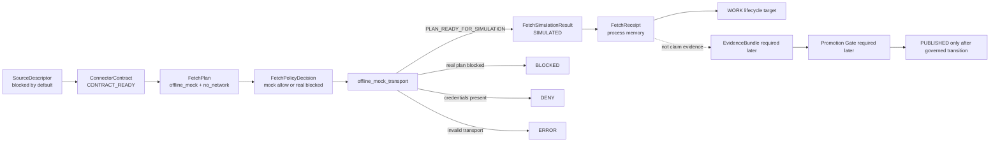
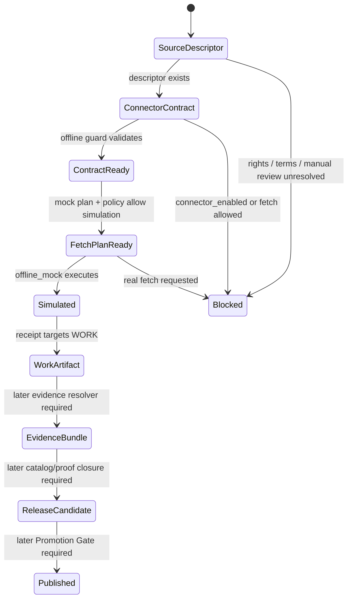

<!-- [KFM_META_BLOCK_V2]
doc_id: kfm://doc/NEEDS-VERIFICATION-ADR-0005-hydrology-connector-contract-and-offline-simulation
title: ADR-0005: Hydrology Connector Contract and Offline Simulation
type: adr
version: v1.0
status: accepted-with-live-fetch-blocked
owners: @bartytime4life NEEDS_VERIFICATION; hydrology-domain-steward NEEDS_VERIFICATION; connector-steward NEEDS_VERIFICATION; policy-steward NEEDS_VERIFICATION
created: NEEDS_VERIFICATION
updated: 2026-05-06
policy_label: NEEDS-VERIFICATION
related: [./README.md, ./ADR-0003-hydrology-source-descriptor-activation-gates.md, ./ADR-0004-hydrology-first-proof-lane.md, ./ADR-0005-promotion-gate.md, ../domains/hydrology/README.md, ../runbooks/hydrology-offline-fetch-simulation.md, ../../tools/connectors/offline_mock_transport.py, ../../tools/validators/validate_hydrology_connector_contracts.py, ../../tools/validators/validate_hydrology_fetch_simulation.py, ../../tests/domains/hydrology/test_hydrology_offline_mock_transport.py, ../../fixtures/domains/hydrology/connector_contracts/, ../../fixtures/domains/hydrology/fetch_plans/, ../../fixtures/domains/hydrology/fetch_receipts/, ../../data/registry/sources/hydrology/]
tags: [kfm, adr, hydrology, connector-contract, offline-simulation, no-network, source-descriptor, fixture, fail-closed, evidence-boundary]
notes: [
  Expands the previous stub decision for hydrology connector contracts and offline simulation.
  Decision is accepted for the no-network connector boundary; live connector activation remains blocked.
  Connector contracts and fetch simulations are not EvidenceBundles, not public claim evidence, and not public-release authority.
  Owners, created date, policy label, latest validator execution, CI enforcement, and live-source activation posture remain NEEDS VERIFICATION.
]
[/KFM_META_BLOCK_V2] -->

<a id="top"></a>

# ADR-0005: Hydrology Connector Contract and Offline Simulation

Hydrology connector contracts may exist as guarded, fixture-backed interface records, but they must stay offline, non-fetching, non-public, and evidence-subordinate until separate activation, evidence, policy, promotion, and rollback gates pass.

<p align="center">
  
  
  
  
  
</p>

<p align="center">
  <a href="#decision">Decision</a> ·
  <a href="#context">Context</a> ·
  <a href="#scope">Scope</a> ·
  <a href="#contract-boundary">Contract boundary</a> ·
  <a href="#offline-simulation-flow">Offline flow</a> ·
  <a href="#enforcement-and-tests">Enforcement</a> ·
  <a href="#promotion-boundary">Promotion boundary</a> ·
  <a href="#rollback">Rollback</a> ·
  <a href="#acceptance-checklist">Acceptance</a>
</p>

> [!IMPORTANT]
> **Accepted boundary:** connector contracts are allowed only as guarded interface records and local fixture contracts.  
> **Live-source posture:** blocked.  
> **Public-release posture:** denied from connector output alone.  
> **Evidence posture:** connector output is not an `EvidenceBundle` and cannot support public claims without evidence closure.

> [!WARNING]
> This ADR does **not** approve live HTTP, OGC API, ArcGIS REST, WMS, WFS, browser fetch, FTP, S3 public fetch, scheduled watcher execution, credential use, public alias creation, or public release of source-derived hydrology data.

---

## Decision

KFM accepts a **hydrology connector contract boundary** and an **offline simulation path** for the hydrology proof lane.

The decision expands the prior stub:

| Prior stub element | Expanded rule |
|---|---|
| “Introduce connector contracts.” | Hydrology connectors may be represented by explicit `connector_contract` fixtures that describe supported operations, required gates, allowed transports, prohibited operations, outputs, and rollback targets. |
| “Introduce offline simulation artifacts.” | Hydrology fetch plans may execute only through `offline_mock` simulation when `no_network=true`, no credentials are present, and policy permits simulation. |
| “Keep real connectors disabled.” | Connector contracts must keep `connector_enabled=false`, `data_fetch_allowed=false`, and `public_release_allowed=false`. |
| “No live fetch.” | Any non-`offline_mock` transport is outside this ADR and must be blocked or rejected. |
| “No public-release eligibility from connector output alone.” | `FetchSimulationResult` and `FetchReceipt` are process artifacts, not claim evidence, not catalog closure, and not release approval. |

### Normative rules

1. **Connector contracts are interface boundaries, not activation approvals.**
2. **All hydrology connector contracts start blocked.**
3. **Allowed transport is exactly `offline_mock` for this ADR boundary.**
4. **No credentials may be required or present in offline simulation fixtures.**
5. **No source API calls, dataset downloads, browser fetches, or scheduled live watchers are allowed by this ADR.**
6. **Offline simulation outputs may target `WORK` only unless a later governed pipeline step validates, catalogs, proves, reviews, and promotes derived artifacts.**
7. **Simulation output is not official source data.**
8. **Simulation output is not public claim evidence without `EvidenceBundle` closure.**
9. **Live-source connector activation requires a later reviewed gate transition under source-descriptor activation rules.**
10. **Public release requires the Promotion Gate and cannot be inferred from a contract, plan, receipt, mock response, test pass, or drawn map layer.**

<p align="right"><a href="#top">Back to top ↑</a></p>

---

## Context

Hydrology is KFM’s first proof-bearing lane. That proof lane needs connector-shaped interfaces so maintainers can test source intake, fetch planning, policy decisions, receipts, finite states, and rollback behavior without activating real network access.

The repository already has implementation-shaped evidence for this boundary:

| Surface | Current role | Decision implication |
|---|---|---|
| `fixtures/domains/hydrology/connector_contracts/*.json` | Connector contract fixtures for hydrology source families. | Contracts define allowed/prohibited operations but do not enable live fetch. |
| `fixtures/domains/hydrology/fetch_plans/*.json` | Offline mock and blocked real-fetch plan fixtures. | Plans demonstrate allowed simulation and blocked real-source posture. |
| `fixtures/domains/hydrology/fetch_receipts/*.json` | Receipt fixture for offline simulation. | Receipts record process memory and do not become claim evidence. |
| `tools/connectors/offline_mock_transport.py` | Local offline mock executor. | Executor returns finite states and rejects invalid transport/credential posture. |
| `tools/validators/validate_hydrology_connector_contracts.py` | Contract guard validator. | Enforces disabled connector, no fetch, no public release, and `offline_mock` only. |
| `tools/validators/validate_hydrology_fetch_simulation.py` | Fetch simulation fixture guard validator. | Enforces offline transport and no credentials for non-malformed fetch-plan fixtures. |
| `tests/domains/hydrology/test_hydrology_offline_mock_transport.py` | Unit test for simulated and blocked plan outcomes. | Confirms intended finite-state behavior in test form; latest execution still needs verification. |
| `docs/runbooks/hydrology-offline-fetch-simulation.md` | Runbook boundary statement. | Documents no credentials, no source API calls, no downloads, and no claim evidence. |

### Numbering note

This repository also contains a separate `docs/adr/ADR-0005-promotion-gate.md`. This file’s stable identity is the full path:

```text
docs/adr/ADR-0005-hydrology-connector-contract-and-offline-simulation.md
```

If ADR numbering is normalized later, preserve this file as lineage and add a supersession note rather than deleting history.

<p align="right"><a href="#top">Back to top ↑</a></p>

---

## Scope

### In scope

| In scope | Required posture |
|---|---|
| Hydrology connector contract fixtures | Stub-only, blocked, non-fetching, non-public. |
| Offline mock transport | Local fixture execution only; no network and no credentials. |
| Fetch plan fixtures | Must declare `transport=offline_mock` and `no_network=true`. |
| Fetch receipt fixtures | Process memory only; not EvidenceBundle or release proof. |
| Connector readiness reports | May summarize contract posture; must not imply activation. |
| Negative-path fixtures | Real-source fetch plans remain blocked. |
| Validator expectations | Must fail closed on non-offline transport, credentials, enabled connectors, fetch permission, or public release permission. |
| Rollback target | Return to `descriptor_only` or disabled connector posture. |

### Out of scope

| Out of scope | Reason |
|---|---|
| Live source fetch | Governed source activation has not been approved by this ADR. |
| Credentialed source access | Offline simulation does not use credentials. |
| Scheduled watchers | Watchers would cross from simulation into source operations. |
| Public hydrology claims from connector output | Connector output is not evidence support by itself. |
| Public map layers from connector output | MapLibre is downstream of release and evidence closure. |
| Hydrologic simulation models | This ADR governs fetch simulation, not hydrologic modeling. |
| Emergency or life-safety outputs | KFM is not an emergency alerting system. |
| Promotion to `PUBLISHED` | Promotion is governed separately and requires evidence, policy, review, catalog, proof, correction, and rollback closure. |

<p align="right"><a href="#top">Back to top ↑</a></p>

---

## Evidence basis

| Evidence | Status | What it supports | Limits |
|---|---|---|---|
| Existing ADR-0005 connector stub | CONFIRMED repository file | Original decision: introduce connector contracts and offline simulation while keeping real connectors disabled. | Stub did not define contract fields, finite states, flow, validation, promotion boundary, or rollback detail. |
| Hydrology source descriptor activation ADR | CONFIRMED repository file | Candidate official hydrology sources are descriptor-first, blocked, non-fetching, and non-public until manual gates pass. | Governs source activation, not connector simulation details. |
| Hydrology-first proof lane ADR | CONFIRMED repository file | Hydrology is the first proof lane and must begin with synthetic/no-network public-safe fixtures. | Does not by itself approve connector activation. |
| Promotion Gate ADR | CONFIRMED repository file | Publication is a governed state transition, not a file move or successful fixture. | Separate ADR; duplicate ADR number requires path-specific citation. |
| Hydrology domain README | CONFIRMED repository file | Hydrology proof lane requires RAW → PUBLISHED trust path, no-network proof slice, EvidenceBundle closure, negative outcomes, and fail-closed posture. | README is draft/experimental and includes verification placeholders. |
| Connector contract validator | CONFIRMED repository file | Enforces disabled connector, disabled fetch, denied public release, and `allowed_transports == ["offline_mock"]`. | File presence does not prove CI execution. |
| Offline mock transport | CONFIRMED repository file | Returns `SIMULATED`, `BLOCKED`, `DENY`, or `ERROR` based on plan posture. | Does not prove production runtime behavior. |
| Fetch simulation validator | CONFIRMED repository file | Enforces offline transport and no credentials in fetch-plan fixtures. | Does not prove every future fixture is covered unless CI runs it. |
| Offline transport test | CONFIRMED repository file | Tests one simulated plan and one blocked real-source plan. | Latest test execution and branch-protection enforcement remain NEEDS VERIFICATION. |
| Source descriptor and fixtures | CONFIRMED repository files | Source descriptors and fetch plans keep fetch/public release blocked by default. | Rights, terms, source stewardship, and live activation remain unresolved. |

### Truth posture used here

| Label | Meaning |
|---|---|
| `CONFIRMED` | Verified from current repository evidence or supplied KFM doctrine visible during this revision. |
| `ACCEPTED` | Adopted by this ADR as a governing decision for connector contracts and offline simulation. |
| `PROPOSED` | Recommended implementation or extension not yet proven by tests, CI, workflow, runtime, or release evidence. |
| `NEEDS VERIFICATION` | Checkable item not yet proven by owner review, command output, CI logs, policy result, or release artifact. |
| `UNKNOWN` | Not verified strongly enough to claim. |
| `DENY`, `ABSTAIN`, `ERROR`, `BLOCKED`, `SIMULATED` | System outcomes or states, not rhetorical labels. |

<p align="right"><a href="#top">Back to top ↑</a></p>

---

## Contract boundary

A hydrology connector contract is a **guarded interface record**.

It may describe what a connector would support after future activation. It must not make that connector active.

### Required contract posture

| Field or concern | Required value / posture | Why |
|---|---|---|
| `connector_kind` | `stub` or an explicitly reviewed non-live equivalent | Prevents accidental runtime activation. |
| `connector_runtime_state` | `BLOCKED` unless a later ADR/gate supersedes it | Makes disabled state visible. |
| `connector_enabled` | `false` | Blocks connector execution. |
| `data_fetch_allowed` | `false` | Blocks source data movement. |
| `public_release_allowed` | `false` | Blocks public release from connector output. |
| `allowed_transports` | `["offline_mock"]` | Keeps execution local and fixture-based. |
| `disallowed_transports` | Includes live HTTP/API/service transports | Prevents network drift. |
| `no_network_required` | `true` | Preserves deterministic no-network proof. |
| `no_credentials_required` | `true` | Prevents credential dependency and secret leakage. |
| `required_inputs` | Includes `SourceDescriptor` | Keeps connector planning downstream of governed source admission. |
| `required_gate_refs` | Includes activation gate decision references | Prevents connector execution from bypassing review gates. |
| `required_receipt_types` | Includes `FetchReceipt` | Ensures process memory exists. |
| `output_object_types` | `FetchSimulationResult` or equivalent | Keeps output class narrow. |
| `evidence_boundary` | Must state connector output is not public claim evidence without EvidenceBundle closure | Prevents evidence laundering. |
| `rollback_target` | `descriptor_only` or equivalent disabled posture | Makes rollback cheap and explicit. |

> [!CAUTION]
> A connector contract may be complete and valid while the connector remains blocked. Contract readiness is not source activation.

<p align="right"><a href="#top">Back to top ↑</a></p>

---

## Offline simulation flow

Offline fetch simulation tests connector-shaped behavior without calling source systems.



### State semantics

| State | Meaning | Public claim eligibility |
|---|---|---:|
| `CONTRACT_READY` | Connector contract is structurally ready as a blocked fixture contract. | No |
| `PLAN_READY_FOR_SIMULATION` | Fetch plan may run through local offline mock transport. | No |
| `SIMULATED` | Offline mock execution succeeded and emitted synthetic output. | No |
| `BLOCKED` | Plan or connector is intentionally not allowed to run. | No |
| `DENY` | Required safety rule failed, such as credential presence. | No |
| `ERROR` | Transport, schema, or evaluator posture is invalid. | No |

### Fetch receipt boundary

A `FetchReceipt` records what happened during a simulation. It may support audit and replay. It is not evidence support for a public hydrology claim.

| Receipt field / concern | Required posture |
|---|---|
| `simulation` | `true` |
| `no_network` | `true` |
| `no_credentials_used` | `true` |
| `no_data_fetched_from_source` | `true` |
| `mock_response_fixture` | Present when a mock response fixture is used |
| `output_lifecycle_target` | `WORK` or another non-public intermediate stage approved by later lifecycle rules |
| `evidence_boundary` | Must state `not EvidenceBundle` or equivalent |
| `finite_state` | `SIMULATED`, `BLOCKED`, `DENY`, or `ERROR` |

<p align="right"><a href="#top">Back to top ↑</a></p>

---

## Source-descriptor dependency

Connector contracts depend on source descriptors, but source descriptors do not become connector activation.



### Source roles stay narrow

| Source family | Connector posture under this ADR | Source-role caution |
|---|---|---|
| `usgs-water-data` | Offline mock only; real fetch blocked. | Observed hydrology source only after source/evidence gates; descriptor alone is not streamflow evidence. |
| `usgs-wbd` | Offline mock only; real fetch blocked. | Hydrologic-unit boundary context, not observed hydrology. |
| `usgs-nhdplus-hr` | Offline mock only; real fetch blocked. | Network/reference identity context, not observed flow. |
| `usgs-3dep` | Offline mock only; real fetch blocked. | Terrain context and derivative input, not direct hydrologic observation. |
| `fema-nfhl` | Offline mock only; real fetch blocked. | Regulatory flood hazard context, not observed flood extent. |

<p align="right"><a href="#top">Back to top ↑</a></p>

---

## Enforcement and tests

### Repository enforcement surfaces

| Surface | Role | Required behavior |
|---|---|---|
| `tools/validators/validate_hydrology_connector_contracts.py` | Connector contract validator | Rejects enabled connectors, data fetch allowance, public release allowance, or non-`offline_mock` allowed transport. |
| `tools/validators/validate_hydrology_fetch_simulation.py` | Fetch plan validator | Rejects non-offline transport and credential use in fetch-plan fixtures. |
| `tools/connectors/offline_mock_transport.py` | Offline executor | Produces finite states without network access. |
| `tests/domains/hydrology/test_hydrology_offline_mock_transport.py` | Unit test | Checks one simulated plan and one blocked real-source plan. |
| `fixtures/domains/hydrology/connector_contracts/` | Contract fixture set | Must remain disabled, non-fetching, non-public, and offline-only. |
| `fixtures/domains/hydrology/fetch_plans/` | Simulation plan fixtures | Must keep mock plans offline and real plans blocked. |
| `fixtures/domains/hydrology/fetch_receipts/` | Simulation receipts | Must mark no network, no credentials, no source data fetched, and not EvidenceBundle. |

### Expected no-network checks

Run these in a real checkout before claiming enforcement:

```bash
python tools/validators/validate_hydrology_connector_contracts.py
python tools/validators/validate_hydrology_fetch_simulation.py
python -m unittest tests/domains/hydrology/test_hydrology_offline_mock_transport.py
```

Expected successful validator messages include:

```text
PASS connector contracts guarded
PASS fetch simulation fixtures guarded
```

> [!NOTE]
> These commands are repository-grounded because the referenced files exist. Latest command output, CI execution, workflow wiring, branch protection, and release-gate enforcement still require verification.

### Negative cases that must fail or block

| Case | Required outcome |
|---|---|
| `connector_enabled=true` in a connector contract | Fail contract validation. |
| `data_fetch_allowed=true` in a connector contract | Fail contract validation. |
| `public_release_allowed=true` in a connector contract | Fail contract validation. |
| `allowed_transports` includes anything other than `offline_mock` | Fail contract validation. |
| Fetch plan uses a live transport | Fail or block simulation. |
| Fetch plan requires or contains credentials | `DENY` or validation failure. |
| Fetch plan finite state is not simulation-ready | `BLOCKED` or validation failure. |
| Simulation output is used as EvidenceBundle support | `DENY` or `ABSTAIN` in claim path. |
| Mock receipt is treated as public release proof | `DENY` in promotion path. |
| Real source data is fetched during offline simulation | `ERROR` / incident / rollback review. |

<p align="right"><a href="#top">Back to top ↑</a></p>

---

## Promotion boundary

Connector contracts and offline simulations are upstream of evidence closure and far upstream of publication.

```text
ConnectorContract
  -> FetchPlan
  -> offline_mock simulation
  -> FetchReceipt
  -> WORK
  -> later validation / normalization
  -> later EvidenceBundle
  -> later Catalog / PROV / proof closure
  -> later PromotionDecision
  -> PUBLISHED only if promoted
```

### What connector output can do

| Output | Allowed use |
|---|---|
| `FetchSimulationResult` | Validate connector-shaped flow and finite states. |
| `FetchReceipt` | Record process memory for audit/replay. |
| Mock response fixture | Exercise validators and downstream dry-run logic. |
| Readiness report | Tell maintainers what gates remain blocked. |

### What connector output cannot do

| Output cannot… | Reason |
|---|---|
| Support a public hydrology claim by itself | EvidenceRef must resolve to EvidenceBundle. |
| Create a public map layer | Map layers are downstream of governed release. |
| Approve live source fetching | Source activation is separate and blocked by default. |
| Approve publication | Promotion Gate owns the `PUBLISHED` transition. |
| Replace source descriptor review | Descriptors and source rights remain unresolved until reviewed. |
| Replace catalog/provenance closure | CatalogMatrix / STAC / DCAT / PROV closure is later. |
| Replace rollback readiness | Release rollback is separate from connector rollback. |
| Feed Focus Mode as evidence | AI is interpretive and evidence-subordinate. |

<p align="right"><a href="#top">Back to top ↑</a></p>

---

## Implementation rules

### Adding a new hydrology connector contract

1. Add or verify the corresponding `SourceDescriptor`.
2. Keep source descriptor activation blocked unless a separate gate approves it.
3. Add a connector contract fixture under the accepted fixture home.
4. Set `connector_enabled=false`.
5. Set `data_fetch_allowed=false`.
6. Set `public_release_allowed=false`.
7. Set `allowed_transports=["offline_mock"]`.
8. Add disallowed live transports explicitly.
9. Add `no_network_required=true`.
10. Add `no_credentials_required=true`.
11. Add a rollback target such as `descriptor_only`.
12. Add a negative fixture proving live fetch remains blocked.
13. Run connector contract and fetch simulation validators.
14. Update this ADR or the hydrology source activation runbook only if the boundary changes.

### Adding an offline fetch plan

1. Use `transport="offline_mock"`.
2. Use `no_network=true`.
3. Set `credentials_required=false`.
4. Set `credentials_present=false`.
5. Reference policy and gate decision IDs.
6. Declare `expected_lifecycle_target="WORK"` or another non-public lifecycle target approved by later ADR.
7. Set `evidence_boundary` to a value that clearly indicates the output is not an EvidenceBundle.
8. Use `PLAN_READY_FOR_SIMULATION` only for mock-allowed plans.
9. Use `BLOCKED` for real-source plans under this ADR.
10. Add corresponding policy decision and receipt fixtures when needed.

### Adding a fetch receipt

1. Mark `simulation=true`.
2. Mark `no_network=true`.
3. Mark `no_credentials_used=true`.
4. Mark `no_data_fetched_from_source=true`.
5. Reference the fetch plan and connector.
6. Reference the mock response fixture when used.
7. Target non-public lifecycle state.
8. Include `evidence_boundary`.
9. Use finite state `SIMULATED`, `BLOCKED`, `DENY`, or `ERROR`.
10. Do not reference the receipt as public proof without later evidence closure.

<p align="right"><a href="#top">Back to top ↑</a></p>

---

## Rollback

Rollback for this ADR should be simple because live fetch and public release are not approved.

### Rollback rules

1. Keep `connector_enabled=false`.
2. Keep `data_fetch_allowed=false`.
3. Keep `public_release_allowed=false`.
4. Keep allowed transport restricted to `offline_mock`.
5. Revert or disable the affected connector contract.
6. Revert or disable affected fetch plans.
7. Preserve fetch receipts and review history when they already exist.
8. Re-run connector contract and fetch simulation validators.
9. Record rollback in the repo-standard rollback card, verification backlog, or hydrology runbook.
10. If any simulation output accidentally reached public surfaces, invoke Promotion Gate rollback/correction procedures and preserve the incident lineage.

### Revert path for this file

If this ADR expansion is rejected, revert only this file. Do not delete connector contract fixtures, source descriptors, validators, tests, receipts, or fetch plans without a separate preservation and migration decision.

<p align="right"><a href="#top">Back to top ↑</a></p>

---

## Consequences

### Positive consequences

- Lets KFM test connector-shaped hydrology flows without live source access.
- Makes source activation, connector execution, fetch planning, receipt emission, and publication separate decisions.
- Preserves the hydrology-first proof lane’s no-network posture.
- Creates explicit negative states for live fetch, credentials, invalid transport, and public-release attempts.
- Prevents mock data and receipts from becoming public claim evidence.
- Gives maintainers a safe pattern for future connectors in other domains.

### Costs and follow-up burden

- Real connector value is delayed until source activation, rights, policy, evidence, catalog, promotion, and rollback gates are ready.
- Contract validators and fixtures must be maintained as source families expand.
- Developers must distinguish source descriptors, connector contracts, fetch plans, receipts, evidence bundles, release manifests, and promotion decisions.
- CI/workflow enforcement still needs explicit proof before the repository can claim automation maturity.

### Rejected alternatives

| Alternative | Decision | Reason |
|---|---|---|
| Activate live connectors once contracts validate. | Rejected | Contract validity is not source activation. |
| Allow live HTTP metadata probes through this ADR. | Rejected | Metadata probing requires a separate reviewed gate and must not imply release. |
| Treat simulated fetch output as official source data. | Rejected | Offline simulation is fixture behavior only. |
| Treat fetch receipt as evidence support. | Rejected | Receipts are process memory, not EvidenceBundle closure. |
| Allow public release from a successful simulation. | Rejected | Promotion and release gates are separate. |
| Permit credentials in offline tests. | Rejected | Offline simulation must remain secret-free and deterministic. |
| Let UI or Focus Mode call connector output directly. | Rejected | Public clients and AI must stay downstream of governed evidence/release payloads. |

<p align="right"><a href="#top">Back to top ↑</a></p>

---

## Acceptance checklist

This ADR is accepted as a connector-boundary decision. Implementation maturity can be upgraded only when the following are verified.

- [x] Target ADR path exists.
- [x] Connector contract fixtures exist.
- [x] Offline mock transport exists.
- [x] Connector contract validator exists.
- [x] Fetch simulation validator exists.
- [x] Offline transport unit test exists.
- [x] Mock-allowed fetch plan exists.
- [x] Real-source blocked fetch plan exists.
- [x] Simulation receipt fixture exists.
- [ ] ADR index includes this file with path-specific identity.
- [ ] Duplicate ADR-0005 numbering is resolved or documented in ADR index.
- [ ] Latest connector contract validator output is attached or linked.
- [ ] Latest fetch simulation validator output is attached or linked.
- [ ] Latest unit test output is attached or linked.
- [ ] CI/workflow enforcement is verified.
- [ ] CODEOWNERS or stewardship ownership is verified.
- [ ] Source rights and terms are reviewed before any live activation.
- [ ] Public API/UI/Focus Mode negative tests prove connector output cannot become claim evidence.
- [ ] Promotion Gate negative tests prove simulation output cannot become `PUBLISHED` without release closure.
- [ ] Rollback or disable procedure is linked from the hydrology offline simulation runbook.

<p align="right"><a href="#top">Back to top ↑</a></p>

---

## Open verification items

| Item | Why it matters | Current posture |
|---|---|---|
| ADR created date | Needed for metadata accuracy. | NEEDS VERIFICATION |
| Owners/stewards | Needed for acceptance and future changes. | NEEDS VERIFICATION |
| Policy label | Needed for publication classification. | NEEDS VERIFICATION |
| ADR index update | Needed for discoverability. | NEEDS VERIFICATION |
| ADR numbering collision | Repository has another ADR-0005; path identity must remain clear. | NEEDS VERIFICATION |
| Latest validator/test execution | File presence does not prove latest passing behavior. | NEEDS VERIFICATION |
| CI/workflow enforcement | Needed before claiming automated governance. | UNKNOWN |
| Live connector activation gates | Required before any real source fetch. | DENY by default |
| Source rights/terms receipts | Required before any public source-derived output. | NEEDS VERIFICATION |
| Public UI/API/Focus negative proof | Required before claiming connector output cannot leak. | NEEDS VERIFICATION |
| Promotion Gate integration | Required before simulation-derived artifacts can be promoted. | NEEDS VERIFICATION |
| Receipt/proof/catalog storage conventions | Needed for long-term audit and rollback. | NEEDS VERIFICATION |

<p align="right"><a href="#top">Back to top ↑</a></p>

---

<details>
<summary><strong>Appendix A — Maintainer checklist for connector contract PRs</strong></summary>

Use this checklist before adding or changing hydrology connector contract fixtures.

- [ ] SourceDescriptor exists or is added as descriptor-only.
- [ ] SourceDescriptor remains non-fetching and non-public.
- [ ] Connector contract has `connector_enabled=false`.
- [ ] Connector contract has `data_fetch_allowed=false`.
- [ ] Connector contract has `public_release_allowed=false`.
- [ ] Connector contract allows only `offline_mock`.
- [ ] Connector contract disallows live transports explicitly.
- [ ] Connector contract requires no network.
- [ ] Connector contract requires no credentials.
- [ ] Fetch plan uses `offline_mock`.
- [ ] Fetch plan has `no_network=true`.
- [ ] Fetch plan has no credentials required or present.
- [ ] Real-source fetch plan is blocked.
- [ ] Fetch receipt states no source data was fetched.
- [ ] Fetch receipt states it is not EvidenceBundle.
- [ ] Connector output is not used as public claim evidence.
- [ ] Validators run locally.
- [ ] Unit tests run locally.
- [ ] CI enforcement is attached if claimed.
- [ ] Rollback target is `descriptor_only` or equivalent disabled posture.

</details>

<details>
<summary><strong>Appendix B — Glossary</strong></summary>

| Term | Meaning in this ADR |
|---|---|
| `ConnectorContract` | Guarded interface record for a hydrology source connector, kept disabled and offline under this ADR. |
| `SourceDescriptor` | Governed source-admission record; prerequisite context, not claim evidence or connector activation. |
| `FetchPlan` | Fixture or plan describing a requested fetch-like operation. Under this ADR it must use offline mock transport only. |
| `FetchReceipt` | Process-memory record from a fetch simulation. It is not EvidenceBundle or release proof. |
| `offline_mock` | Local fixture transport that simulates connector behavior without network or credentials. |
| `SIMULATED` | Finite state indicating local offline mock execution succeeded. |
| `BLOCKED` | Finite state indicating the plan or connector is intentionally not allowed to run. |
| `DENY` | Finite state indicating a safety or policy rule failed. |
| `ERROR` | Finite state indicating invalid transport, malformed input, or evaluator failure. |
| `EvidenceBundle` | Resolved support bundle required before consequential claims can be made. |
| `Promotion Gate` | Governed state-transition boundary required before release to `PUBLISHED`. |
| `descriptor_only` | Rollback/disabled posture where a source remains registered only for review and inventory. |

</details>

<p align="right"><a href="#top">Back to top ↑</a></p>
