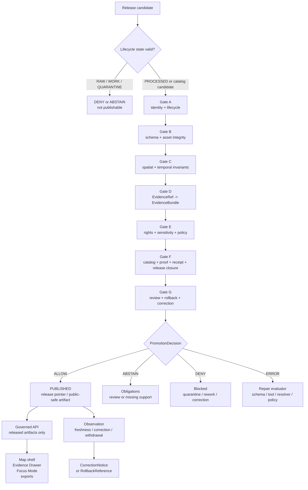

<!-- [KFM_META_BLOCK_V2]
doc_id: kfm://doc/NEEDS-VERIFICATION-ADR-0005-promotion-gate
title: ADR-0005: Promotion Gate
type: standard
version: v1.1-draft
status: draft
owners: OWNER_TBD_NEEDS_VERIFICATION
created: DATE_TBD_FROM_GIT_OR_DOC_REGISTRY
updated: 2026-05-06
policy_label: NEEDS_VERIFICATION
related: [./README.md, ./ADR-TEMPLATE.md, ./ADR-0001-schema-home.md, ./ADR-0014-truth-path.md, ./ADR-0011-catalog-proof-release-separation.md, ../runbooks/publication.md, ../standards/finite-outcomes.md, ../../examples/promotion/README.md, ../../schemas/contracts/v1/shared/promotion_decision.schema.json, ../../contracts/v1/release/kfm_release_manifest.schema.json, ../../tools/validators/release/validate_release_manifest.py, ../../policy/crosswalk/rights-sensitivity-release.md]
tags: [kfm, adr, promotion, release, publication, evidence, policy, proof, rollback, finite-outcomes]
notes: [Target path docs/adr/ADR-0005-promotion-gate.md is CONFIRMED through GitHub connector evidence, but no local mounted checkout was available in this session; owners, created date, policy label, CODEOWNERS coverage, workflow enforcement, branch protections, and full Promotion Gate implementation remain NEEDS VERIFICATION; this revision aligns the final promotion decision vocabulary with the currently visible finite-outcomes standard and shared promotion_decision schema: ALLOW, ABSTAIN, DENY, ERROR; PROMOTE is retained only as a human verb or display alias for ALLOW unless a future schema ADR changes the machine enum; previous draft references to docs/governance/promotion-gate.md were not retained as confirmed related links because that path returned 404 through the GitHub connector in this session.]
[/KFM_META_BLOCK_V2] -->

<a id="top"></a>

# ADR-0005: Promotion Gate

Make publication an explicit, evidence-bearing state transition from release candidate to released KFM meaning.

<p align="center">
  
  
  
  
  
</p>

<p align="center">
  <a href="#decision-summary">Decision</a> ·
  <a href="#context-and-problem">Context</a> ·
  <a href="#scope">Scope</a> ·
  <a href="#outcome-grammar">Outcomes</a> ·
  <a href="#gate-model">Gate model</a> ·
  <a href="#trust-object-split">Trust objects</a> ·
  <a href="#promotion-flow">Flow</a> ·
  <a href="#implementation-contract">Implementation</a> ·
  <a href="#validation-plan">Validation</a> ·
  <a href="#rollback-correction-and-withdrawal">Rollback</a> ·
  <a href="#acceptance-checklist">Acceptance</a>
</p>

> [!IMPORTANT]
> **Status:** `draft` / `PROPOSED decision`  
> **Target path:** `docs/adr/ADR-0005-promotion-gate.md`  
> **Confirmed in GitHub connector:** this file exists at the target path on the accessible repository.  
> **Not confirmed locally:** no mounted checkout, workflow run, branch protection, runtime log, dashboard, release packet, or full promotion-gate execution evidence was available in this session.  
> **Key revision:** the final machine decision vocabulary is aligned to the visible KFM finite-outcomes standard and shared `PromotionDecision` schema: `ALLOW`, `ABSTAIN`, `DENY`, `ERROR`.

> [!NOTE]
> “Promotion” remains the architectural verb for moving a release candidate into `PUBLISHED`. The machine decision that permits that movement is `ALLOW`, unless a later accepted schema/ADR changes the canonical enum.

---

## Decision summary

KFM adopts a **Promotion Gate** as the required governance membrane between release candidates and the `PUBLISHED` state.

A release candidate may become public or semi-public only when the Promotion Gate emits a reviewable promotion decision with `decision: "ALLOW"` and the required evidence, policy, catalog, proof, review, release, correction, and rollback obligations are satisfied.

| Field | Determination |
|---|---|
| ADR | `ADR-0005: Promotion Gate` |
| Target path | `docs/adr/ADR-0005-promotion-gate.md` |
| Owning root | `docs/` |
| Path status | `CONFIRMED` through GitHub connector; local checkout still unavailable |
| ADR status | `draft` |
| Decision posture | `PROPOSED` until owner, policy label, enforcement, workflow, and fixture coverage are verified |
| Governing lifecycle seam | `CATALOG / TRIPLET -> PUBLISHED` |
| Final machine decision enum | `ALLOW`, `ABSTAIN`, `DENY`, `ERROR` |
| Gate-level status enum | `PASS`, `FAIL`, `ABSTAIN`, `ERROR` |
| Runtime answer enum | `ANSWER`, `ABSTAIN`, `DENY`, `ERROR` |
| Release action after `ALLOW` | Promotion to the named published release target |
| Fail-safe rule | No uncertain candidate silently publishes |
| Public client rule | Public clients use governed APIs and released artifacts, not RAW / WORK / QUARANTINE / internal stores / direct model output |

### Final authority sentence

> Promotion is a governed state transition. It is not a file move, a successful validator run, a rendered map layer, a model answer, a signed blob, a dashboard refresh, a human comment, or a path under a folder named `published`.

<p align="right"><a href="#top">Back to top ↑</a></p>

---

## Context and problem

Kansas Frontier Matrix is a governed, evidence-first, map-first, time-aware spatial knowledge and publication system. Its durable public unit is the **inspectable claim**: a public or semi-public statement whose evidence, source role, spatial scope, temporal scope, policy posture, review state, release state, and correction lineage can be inspected.

Without a promotion boundary, KFM risks allowing convenient intermediate artifacts to harden into public truth:

| Failure pressure | What can go wrong |
|---|---|
| Folder-path promotion | A copied artifact under `data/published/` is treated as released even though evidence, policy, proof, review, and rollback are incomplete. |
| CI-as-publication | A successful build or schema pass is treated as permission to publish. |
| Map-as-proof | A rendered layer or tile is treated as evidence authority. |
| Receipt/proof confusion | Process memory is mistaken for release-grade proof. |
| Catalog/release confusion | Discovery metadata is mistaken for publication approval. |
| AI-as-authority | Generated language is mistaken for evidence, review, or release decision. |
| Rights/sensitivity gaps | Unknown rights, source terms, cultural sensitivity, living-person data, rare-species locations, archaeology, critical infrastructure, or exact-location exposure leak outward. |
| Silent correction | A public artifact is overwritten or narrowed without correction lineage or rollback target. |

The Promotion Gate exists to stop those failures at the release boundary.

<p align="right"><a href="#top">Back to top ↑</a></p>

---

## Scope

### Applies to

The Promotion Gate applies whenever KFM material would become outward-facing, release-significant, or relied on as published meaning.

| Candidate type | Promotion relevance |
|---|---|
| Dataset release | Moves processed data into released public or restricted state. |
| Layer / tile / PMTiles / COG / GeoParquet artifact | Makes a map or spatial artifact outward-visible. |
| Catalog / STAC / DCAT / PROV surface | Makes discovery or provenance public or semi-public. |
| Evidence Drawer payload | Lets users inspect support for a consequential claim. |
| Focus Mode / governed AI surface | Answers from released evidence and must cite or abstain. |
| Export, story node, report, screenshot, or dossier | Widens reuse beyond the original internal context. |
| Domain-lane public-safe derivative | Publishes a transformed, generalized, aggregated, or redacted artifact. |
| Correction, withdrawal, supersession, or rollback | Changes public meaning or release state after publication. |

### Does not replace

The Promotion Gate does not replace earlier lifecycle checks.

| Not replaced | Why |
|---|---|
| Source intake | Source role, rights, cadence, terms, and sensitivity must be handled before release. |
| RAW / WORK validation | Processing must still validate shape, geometry, time, transforms, and integrity. |
| Quarantine | Unsafe or unclear material remains held until resolved. |
| Policy-as-code | The gate consumes policy decisions; it does not erase the policy lane. |
| Human / steward review | Required review remains required and must be recorded. |
| Runtime envelopes | Runtime answers are downstream of release and have separate finite outcomes. |
| Emergency or life-safety systems | KFM is not an official alerting system. |

> [!WARNING]
> Higher-risk domains require stricter release handling. Archaeology, rare species, habitat precision, living-person data, DNA/genomic material, private land, land/title claims, cultural or sovereign sensitivity, critical infrastructure, hazards, and operational safety contexts default to `ABSTAIN`, `DENY`, `RESTRICT`, `GENERALIZE`, `METADATA_ONLY`, `EMBARGO`, or `QUARANTINE` until review and policy support are resolved.

<p align="right"><a href="#top">Back to top ↑</a></p>

---

## Outcome grammar

### Final promotion decisions

Use these final values for Promotion Gate decisions.

| Decision | Meaning | Release effect |
|---|---|---|
| `ALLOW` | Required gates pass and obligations are satisfied for the named release scope. | Candidate may be promoted to the active published release target. |
| `ABSTAIN` | Support is insufficient, unresolved, stale, incomplete, or review-dependent, but no confirmed violation is established. | Candidate remains unpublished; obligations or review tasks are recorded. |
| `DENY` | A required condition is confirmed to fail: policy, rights, sensitivity, evidence, integrity, catalog, proof, review, rollback, or public-path rule. | Candidate remains unpublished; may require quarantine, rework, correction, withdrawal, or replacement. |
| `ERROR` | Schema, evaluator, resolver, policy engine, verifier, runtime, fixture, or tool failure prevents a trustworthy decision. | Candidate remains unpublished; the process or contract must be repaired first. |

### Gate-level statuses

Use these per gate.

| Gate status | Meaning | Collapse behavior |
|---|---|---|
| `PASS` | Gate passed for the requested release scope. | Contributes to `ALLOW` only if all required gates pass. |
| `FAIL` | Gate found a confirmed violation. | Collapses final decision to `DENY` unless an earlier `ERROR` prevents evaluation. |
| `ABSTAIN` | Gate lacks enough support to pass or deny safely. | Collapses final decision to `ABSTAIN` unless another gate produces `FAIL` or `ERROR`. |
| `ERROR` | Gate could not evaluate reliably. | Collapses final decision to `ERROR`. |

### Decision precedence

When multiple conditions appear, choose the narrowest safe decision.

| Priority | Trigger | Final bias |
|---:|---|---|
| 1 | Evaluator, schema, policy engine, resolver, or verifier fails before a trustworthy gate result exists. | `ERROR` |
| 2 | Public candidate references RAW, WORK, QUARANTINE, internal canonical stores, direct model output, secrets, or review-only stores. | `DENY` |
| 3 | Rights, sensitivity, evidence closure, proof integrity, source role, or release manifest violation is confirmed. | `DENY` |
| 4 | Required support is unresolved but not contradicted. | `ABSTAIN` |
| 5 | All required gates pass and obligations are satisfied. | `ALLOW` |

### Runtime and policy vocabulary split

| Surface | Allowed values | Notes |
|---|---|---|
| Runtime answer envelope | `ANSWER`, `ABSTAIN`, `DENY`, `ERROR` | Governs request-time answer behavior. |
| Policy decision | `ALLOW`, `ABSTAIN`, `DENY`, `ERROR` | Governs admissibility decisions. |
| Promotion decision | `ALLOW`, `ABSTAIN`, `DENY`, `ERROR` | Governs release promotion. |
| Rollback decision | `ALLOW`, `ABSTAIN`, `DENY`, `ERROR` | Governs state reversal or release pointer change. |
| Validation report | `PASS`, `FAIL`, `ABSTAIN`, `ERROR` | Governs validator result posture. |

> [!CAUTION]
> The previous `PROMOTE` term may remain as a prose verb or display alias for `ALLOW`. It should not appear as the canonical machine value unless the shared finite-outcomes standard and `PromotionDecision` schema are intentionally revised.

<p align="right"><a href="#top">Back to top ↑</a></p>

---

## Gate model

The default Promotion Gate uses seven cross-lane gates.

| Gate | Name | What it checks | Minimum support |
|---|---|---|---|
| **A** | Identity, lifecycle, and candidate closure | Stable candidate ID, lifecycle state, release subject, deterministic `spec_hash` or approved equivalent, candidate type, no mutable “latest” ambiguity. | Candidate ID, release subject, canonical hash, lifecycle state, prior release ref when replacing. |
| **B** | Asset, schema, and integrity closure | Required schemas validate; artifacts exist; digests match; no malformed payload; release manifest shape is coherent. | Schema report, asset manifest, artifact checksums, release manifest, validation report. |
| **C** | Spatial, temporal, CRS, and coverage invariants | Geometry validity, CRS allowlist, bbox consistency, public-safe precision, temporal scope, freshness, coverage declarations. | Geometry/temporal validation reports, transform receipt, redaction/generalization receipt if applicable. |
| **D** | Evidence and source-role closure | Consequential claims resolve `EvidenceRef -> EvidenceBundle`; source role supports the claim being made; citations are present where required. | EvidenceBundle refs, SourceDescriptor refs, citation validation report, source-role report. |
| **E** | Rights, sensitivity, and policy closure | Rights, source terms, access class, sensitivity, exact-location handling, policy label, embargo, obligations, public-safe release posture. | PolicyDecision, rights/sensitivity review, source terms snapshot, steward review where required. |
| **F** | Catalog, proof, receipt, and release closure | STAC/DCAT/PROV/CatalogMatrix alignment; ProofPack; receipts retained as process memory; release manifest links all required artifacts. | Catalog refs, proof refs, receipt refs, ReleaseManifest, validation reports, attestation refs when configured. |
| **G** | Review, rollback, and correction readiness | Required reviews complete; rollback target exists; correction/withdrawal path is defined; prior release can be verified when replacing. | ReviewRecord, RollbackReference, CorrectionNotice posture, prior spec hash, release alias plan. |

### Collapse rule

```text
IF any required gate returns ERROR:
  final_decision = ERROR

ELSE IF any required gate returns FAIL:
  final_decision = DENY

ELSE IF any required gate returns ABSTAIN:
  final_decision = ABSTAIN

ELSE:
  final_decision = ALLOW
```

> [!NOTE]
> Optional domain-specific gates may be added by domain ADRs or runbooks, but they must not weaken Gates A–G. Domain-specific gates should fail closed and preserve the same final decision vocabulary.

<p align="right"><a href="#top">Back to top ↑</a></p>

---

## Trust object split

KFM keeps trust-bearing object families distinct so that one surface cannot masquerade as another.

| Object family | Role | Must not become |
|---|---|---|
| `SourceDescriptor` | Defines source identity, source role, steward, rights, cadence, access, sensitivity, geography, time, and activation posture. | Evidence proof, policy approval, or release manifest. |
| `EvidenceRef` | Points from a claim, layer, candidate, or artifact to supporting evidence. | Evidence itself. |
| `EvidenceBundle` | Resolves evidence, source roles, scope, provenance, citations, and support sufficient for review. | Generated summary, UI popup, or model answer. |
| `ValidationReport` | Records schema, geometry, temporal, source-role, evidence, catalog, release, or policy validation results. | Release approval. |
| `PolicyDecision` | Records allow, abstain, deny, or error disposition with reasons and obligations. | Evidence source or schema definition. |
| `RunReceipt` / `TransformReceipt` / `AIReceipt` | Records process memory: what ran, what changed, hashes, tool identity, inputs, outputs, failures. | ProofPack by itself. |
| `ProofPack` | Assembles release-significant proof support. | Receipt store, raw source, or catalog. |
| `CatalogMatrix` / STAC / DCAT / PROV | Provides catalog, provenance, distribution, and discovery closure. | Publication approval. |
| `ReleaseManifest` | Declares released artifacts, digests, evidence/proof/catalog refs, policy/review state, release target, rollback target. | Policy decision or evidence bundle. |
| `PromotionDecision` | Records the final state-transition decision for a candidate. | A file move, CI pass, signature, or human comment. |
| `CorrectionNotice` | Records public correction, narrowing, withdrawal, replacement, or supersession. | Silent mutation. |
| `RollbackReference` | Identifies safe prior release target and rollback obligations. | Deletion of history. |
| `RuntimeResponseEnvelope` | Wraps outward request-time response with finite outcome, evidence, policy, release, and correction state. | Release authority. |

<p align="right"><a href="#top">Back to top ↑</a></p>

---

## Promotion flow



<p align="right"><a href="#top">Back to top ↑</a></p>

---

## Implementation contract

### Required invariants

1. **Promotion is explicit.** No candidate becomes published without a `PromotionDecision`.
2. **Final machine decision uses the shared enum.** `ALLOW`, `ABSTAIN`, `DENY`, `ERROR`.
3. **Identity is stable.** Candidate identity is anchored by `spec_hash` or an approved canonical identity rule.
4. **Evidence is resolvable.** Consequential claims resolve `EvidenceRef -> EvidenceBundle`.
5. **Policy fails closed.** Unknown rights, source-role ambiguity, unresolved sensitivity, missing review, missing policy label, or policy engine failure cannot silently publish.
6. **Receipts and proofs are distinct.** Receipts support audit and replay; ProofPacks support release trust.
7. **Catalog closure is checked.** STAC, DCAT, PROV, CatalogMatrix, evidence refs, release manifest, and artifact refs must not contradict each other.
8. **Review is recorded.** Required steward, domain, rights, policy, cultural, security, or release review cannot be implied.
9. **Rollback is planned.** Release manifests must identify rollback targets or an explicitly reviewed compensating control.
10. **Correction is visible.** Material public changes require correction, withdrawal, or supersession lineage.
11. **Public clients are downstream.** Public APIs, map layers, Evidence Drawer, Focus Mode, exports, search, graph, story, and dashboard surfaces consume released/governed payloads only.
12. **No hidden bypass.** No ordinary public path reaches RAW, WORK, QUARANTINE, internal canonical stores, review-only stores, proof-only stores, direct source-system side effects, credentials, or model runtimes.

### Current confirmed implementation-adjacent signals

| Surface | Confirmed signal | ADR reading |
|---|---|---|
| Shared finite outcome standard | `docs/standards/finite-outcomes.md` names `promotion_decision.schema.json` under `schemas/contracts/v1/shared/` and uses `ALLOW / ABSTAIN / DENY / ERROR` for policy/promotion/rollback. | Use `ALLOW` as final machine decision. |
| Shared promotion decision schema | `schemas/contracts/v1/shared/promotion_decision.schema.json` exists and requires `id`, `decision`, `reason`. | Minimal current schema exists; richer gate fields are `PROPOSED`. |
| Release manifest schema | `contracts/v1/release/kfm_release_manifest.schema.json` exists. | ReleaseManifest closure is partly represented outside the currently proposed schema-home path. |
| Release manifest validator | `tools/validators/release/validate_release_manifest.py` exists. | Release validation exists for public ReleaseManifest closure; full Promotion Gate evaluator remains `NEEDS VERIFICATION`. |
| Publication runbook | `docs/runbooks/publication.md` exists. | Publication doctrine exists; exact enum and gate normalization still require reconciliation. |
| Promotion examples | `examples/promotion/README.md` exists. | Examples are non-authoritative and useful for reviewer education. |
| Rights/sensitivity crosswalk | `policy/crosswalk/rights-sensitivity-release.md` exists. | Policy vocabulary and release posture exist as draft crosswalk; enforcement remains `NEEDS VERIFICATION`. |

### Proposed expanded `PromotionDecision` fields

The current shared schema is minimal. A future compatible expansion or companion schema should consider:

| Field | Purpose | Status |
|---|---|---|
| `id` | Decision identity. | `CONFIRMED` in current minimal schema |
| `decision` | `ALLOW`, `ABSTAIN`, `DENY`, or `ERROR`. | `CONFIRMED` in current minimal schema |
| `reason` | Human-readable reason. | `CONFIRMED` in current minimal schema |
| `candidate_id` | Stable release candidate identity. | `PROPOSED` |
| `candidate_type` | Dataset, layer, tile, catalog, story, export, Focus answer, etc. | `PROPOSED` |
| `spec_hash` | Canonical candidate hash. | `PROPOSED` |
| `prior_spec_hash` | Prior release hash when replacing or rolling back. | `PROPOSED` |
| `gate_results` | Gates A–G with `PASS`, `FAIL`, `ABSTAIN`, `ERROR`. | `PROPOSED` |
| `reason_codes` | Stable machine-readable reasons. | `PROPOSED` |
| `obligations` | Required follow-up actions for `ABSTAIN`, `DENY`, or conditional release. | `PROPOSED` |
| `evidence_refs` | EvidenceBundle references checked by the gate. | `PROPOSED` |
| `policy_ref` | PolicyDecision reference. | `PROPOSED` |
| `release_manifest_ref` | ReleaseManifest reference. | `PROPOSED` |
| `proof_refs` | ProofPack / attestation / validation report refs. | `PROPOSED` |
| `catalog_refs` | STAC/DCAT/PROV/CatalogMatrix refs. | `PROPOSED` |
| `review_refs` | ReviewRecord refs. | `PROPOSED` |
| `rollback_ref` | RollbackReference or rollback card. | `PROPOSED` |
| `correction_notice_ref` | CorrectionNotice when replacing, narrowing, withdrawing, or superseding. | `PROPOSED` |
| `generated_at` | Timestamp produced by the evaluator. | `PROPOSED` |
| `audit_ref` | Receipt, validation report, or review handoff reference. | `PROPOSED` |

<p align="right"><a href="#top">Back to top ↑</a></p>

---

## Proposed file surfaces

> [!WARNING]
> This table distinguishes confirmed accessible paths from proposed or unresolved paths. Do not create parallel schema, contract, policy, proof, release, or validator homes without resolving authority through ADR review.

| Surface | Path | Status |
|---|---|---|
| This ADR | `docs/adr/ADR-0005-promotion-gate.md` | `CONFIRMED` path via GitHub connector |
| ADR index | `docs/adr/README.md` | `CONFIRMED` |
| ADR template | `docs/adr/ADR-TEMPLATE.md` | `CONFIRMED` |
| Truth-path ADR | `docs/adr/ADR-0014-truth-path.md` | `CONFIRMED` |
| Publication runbook | `docs/runbooks/publication.md` | `CONFIRMED` |
| Finite outcomes standard | `docs/standards/finite-outcomes.md` | `CONFIRMED` |
| Promotion examples | `examples/promotion/README.md` | `CONFIRMED` |
| Shared PromotionDecision schema | `schemas/contracts/v1/shared/promotion_decision.schema.json` | `CONFIRMED` |
| ReleaseManifest schema | `contracts/v1/release/kfm_release_manifest.schema.json` | `CONFIRMED`, but schema-home relationship `NEEDS VERIFICATION` |
| ReleaseManifest validator | `tools/validators/release/validate_release_manifest.py` | `CONFIRMED` |
| Rights/sensitivity crosswalk | `policy/crosswalk/rights-sensitivity-release.md` | `CONFIRMED` draft |
| Full Promotion Gate evaluator | `tools/validators/promotion_gate/` | `NEEDS VERIFICATION` |
| Promotion fixtures | `tests/fixtures/promotion/` or repo-accepted fixture home | `NEEDS VERIFICATION` |
| Promotion receipts | `data/receipts/promotions/` or repo-accepted receipt home | `NEEDS VERIFICATION` |
| Promotion proofs | `data/proofs/promotions/` or repo-accepted proof home | `NEEDS VERIFICATION` |
| Release manifests | `release/`, `data/releases/`, or repo-accepted release home | `NEEDS VERIFICATION` |
| Correction notices | release/correction home after repo verification | `NEEDS VERIFICATION` |
| Previously referenced governance doc | `docs/governance/promotion-gate.md` | `NOT CONFIRMED` in this session; connector fetch returned 404 |

<p align="right"><a href="#top">Back to top ↑</a></p>

---

## Validation plan

Promotion validation must prove both positive and negative behavior.

### Required fixture families

| Fixture | Expected final decision | Purpose |
|---|---|---|
| `valid_public_release_candidate` | `ALLOW` | Complete evidence, rights, sensitivity, catalog, proof, review, ReleaseManifest, and rollback closure. |
| `abstain_missing_review` | `ABSTAIN` | Required review is not complete, but no contradiction is confirmed. |
| `abstain_source_role_unresolved` | `ABSTAIN` | Source support may exist, but source role is not strong enough for the claim. |
| `deny_raw_public_ref` | `DENY` | Public candidate references RAW / WORK / QUARANTINE or internal stores. |
| `deny_rights_no_redistribution` | `DENY` | Rights prohibit requested outward release. |
| `deny_sensitive_exact_geometry_public` | `DENY` | Public release would expose restricted exact geometry. |
| `deny_missing_evidence_bundle` | `DENY` | Consequential claim cannot resolve EvidenceBundle. |
| `deny_release_manifest_without_rollback` | `DENY` | Release would lack rollback target. |
| `error_malformed_candidate` | `ERROR` | Candidate cannot be evaluated reliably. |
| `error_policy_engine_unavailable` | `ERROR` | Policy cannot be evaluated. |
| `rollback_to_prior_release` | `ALLOW` or `ABSTAIN` | Proves prior release verification and correction lineage. |

### Confirmed release validator command

The release validator path is confirmed, but runnable behavior was not executed in this session.

```bash
python tools/validators/release/validate_release_manifest.py \
  path/to/kfm_release_manifest.json
```

### Proposed full Promotion Gate command

This command shape is `PROPOSED` until the repository confirms the promotion gate package or script.

```bash
python -m tools.validators.promotion_gate \
  path/to/release-candidate-or-release-bundle.json \
  --out build/promotion/promotion_decision.json
```

### Minimum validation reports

A promotion review packet should include:

| Report | Required evidence |
|---|---|
| Schema validation report | Candidate, ReleaseManifest, PromotionDecision, and referenced object shapes validate. |
| Asset integrity report | Artifact refs exist and digests match. |
| Evidence closure report | EvidenceRefs resolve to EvidenceBundles. |
| Source-role report | Source role supports the claims being made. |
| Rights/sensitivity policy report | Rights, sensitivity, and release class pass or fail closed. |
| Catalog closure report | STAC/DCAT/PROV/CatalogMatrix references align. |
| Proof report | ProofPack / attestation / receipt refs are present and non-conflicting. |
| Review report | Required reviews are complete or obligations recorded. |
| Rollback report | Prior release target and correction path are verified. |
| Public path guard report | No RAW / WORK / QUARANTINE / internal / direct model path leaks into public payload. |

<p align="right"><a href="#top">Back to top ↑</a></p>

---

## Rollback, correction, and withdrawal

Rollback is a governed state transition to a previously verified release target. It is not a deletion, silent overwrite, or manual restoration from memory.

### Rollback must

1. identify the active release being rolled back;
2. identify the prior release target;
3. verify prior ReleaseManifest, artifact digests, evidence refs, catalog refs, proof refs, and policy state;
4. emit rollback receipt or rollback reference;
5. update release pointer or alias only after policy and review permit it;
6. emit `CorrectionNotice` when public meaning changes;
7. preserve old receipts, proofs, release manifests, catalog records, and decisions;
8. rebuild downstream derivatives only from the selected released state;
9. expose correction state through governed public surfaces when relevant.

### Rollback must not

- delete prior release history;
- hide public correction lineage;
- bypass policy because the prior release was once allowed;
- restore an artifact whose rights or sensitivity posture is no longer public-safe;
- update only the map layer while leaving catalog, Evidence Drawer, Focus Mode, export, or search stale.

### Withdrawal and supersession

| Case | Required posture |
|---|---|
| Published claim unsupported by evidence | Withdraw, correct, or supersede; emit correction lineage. |
| Sensitive geometry accidentally released | Withdraw or replace with generalized artifact; preserve redaction receipt and correction notice. |
| Source rights change | Re-run policy; restrict, withdraw, or supersede as required. |
| Catalog closure breaks | Hold dependent release surfaces until closure is restored. |
| Rollback target invalid | `ERROR`; do not change release pointer. |

<p align="right"><a href="#top">Back to top ↑</a></p>

---

## Consequences

### Positive consequences

- Makes publication inspectable instead of implied.
- Aligns release decisions with KFM finite-outcome standards.
- Keeps public surfaces downstream of evidence, policy, release, correction, and rollback.
- Distinguishes receipts, proofs, catalogs, release manifests, and decisions.
- Makes negative outcomes visible and reviewable.
- Gives domain lanes one reusable promotion membrane.
- Gives UI and governed AI stable release-state inputs.
- Preserves rollback and correction as first-class trust features.

### Costs and tradeoffs

| Cost | Why accepted |
|---|---|
| More contracts, schemas, fixtures, validators, and review burden before publication. | KFM prioritizes evidence, policy, rollback, and public trust over speed. |
| Early release may be slower. | Fail-closed release is preferable to publishing unsupported claims. |
| Existing docs may need enum cleanup. | Current visible finite-outcome standard and shared schema should control machine values. |
| Some release-significant candidates will return `ABSTAIN` or `DENY`. | Negative outcomes are valid governance outcomes. |
| Schema-home ambiguity remains visible. | Hiding unresolved authority would create future drift. |

### Rejected alternatives

| Alternative | Rejection reason |
|---|---|
| Treat file movement into `published/` as promotion. | Bypasses evidence, policy, proof, review, and rollback. |
| Treat CI pass as publication authority. | CI validates mechanics; it cannot replace policy and review. |
| Treat signature or digest as sufficient release proof. | Integrity does not establish rights, sensitivity, evidence, or source role. |
| Let UI or Focus Mode decide release eligibility. | UI and AI are downstream interpretive surfaces. |
| Let model confidence influence promotion. | Generated language is not evidence or release authority. |
| Use `PROMOTE` as a second machine outcome beside `ALLOW`. | Current visible finite-outcome standard and schema use `ALLOW` for promotion decisions. |
| Use manual review only. | Review must be recorded and testable enough for audit, correction, and rollback. |

<p align="right"><a href="#top">Back to top ↑</a></p>

---

## Adoption plan

### Phase 0 — Keep this ADR honest

- Keep status `draft`.
- Keep owner, policy label, created date, and enforcement maturity as `NEEDS VERIFICATION`.
- Keep `ALLOW / ABSTAIN / DENY / ERROR` as the final machine vocabulary.
- Treat `PROMOTE` as a prose verb or display alias only.

### Phase 1 — Normalize adjacent docs

- Update `docs/runbooks/publication.md` if it still treats `PROMOTE` or `HOLD` as canonical machine values.
- Update `examples/promotion/README.md` examples if they use non-canonical final decision values.
- Update ADR index entry for `ADR-0005`.
- Confirm whether `docs/governance/promotion-gate.md` should be created, removed from old metadata, or replaced by the publication runbook.

### Phase 2 — Wire minimal enforcement

- Confirm schema-home authority.
- Confirm fixture-home authority.
- Confirm whether a full `tools/validators/promotion_gate/` evaluator exists.
- Add or update promotion fixtures.
- Ensure `tools/validators/release/validate_release_manifest.py` and any promotion gate validator produce compatible outcomes.
- Add public-path guard checks for RAW / WORK / QUARANTINE / direct model / internal-store leakage.

### Phase 3 — Promote only with proof

- Assemble ReleaseManifest, EvidenceBundle, PolicyDecision, CatalogMatrix, ProofPack, ReviewRecord, CorrectionNotice posture, and RollbackReference.
- Emit a `PromotionDecision`.
- Change public release aliases only after `decision: "ALLOW"`.

<p align="right"><a href="#top">Back to top ↑</a></p>

---

## Impact map

| Area | Required update or check | Status |
|---|---|---|
| `docs/adr/README.md` | Ensure ADR-0005 entry reflects this decision, enum alignment, and draft status. | `NEEDS VERIFICATION` |
| `docs/adr/ADR-TEMPLATE.md` | No change required unless ADR template wants promotion-specific guidance. | `NEEDS VERIFICATION` |
| `docs/adr/ADR-0001-schema-home.md` | Confirm schema-home implications before adding richer promotion schemas. | `NEEDS VERIFICATION` |
| `docs/adr/ADR-0014-truth-path.md` | Keep lifecycle and public trust membrane aligned with this ADR. | `NEEDS VERIFICATION` |
| `docs/runbooks/publication.md` | Normalize `PROMOTE` / `HOLD` wording to `ALLOW` / `ABSTAIN` or explicitly mark display aliases. | `PROPOSED` |
| `docs/standards/finite-outcomes.md` | Keep as enum source for runtime, policy/promotion/rollback, and validation statuses. | `CONFIRMED` path |
| `examples/promotion/README.md` | Keep examples non-authoritative and aligned to canonical enum. | `PROPOSED` |
| `schemas/contracts/v1/shared/promotion_decision.schema.json` | Current minimal schema exists; richer fields need schema review. | `CONFIRMED` path / expansion `PROPOSED` |
| `contracts/v1/release/kfm_release_manifest.schema.json` | Confirm relation to schema-home ADR and release validation expectations. | `CONFIRMED` path / authority `NEEDS VERIFICATION` |
| `tools/validators/release/validate_release_manifest.py` | Use as confirmed narrower ReleaseManifest validator; do not overclaim full gate enforcement. | `CONFIRMED` path |
| `policy/crosswalk/rights-sensitivity-release.md` | Align policy crosswalk reason/obligation codes with promotion decisions. | `NEEDS VERIFICATION` |
| `data/receipts/`, `data/proofs/`, `release/` | Confirm emitted object homes and separation. | `NEEDS VERIFICATION` |
| `.github/workflows/` | Confirm whether promotion gate or release validation is merge-blocking. | `UNKNOWN` |

<p align="right"><a href="#top">Back to top ↑</a></p>

---

## Open verification backlog

| Item | Status | Why it matters |
|---|---:|---|
| Owner / CODEOWNERS coverage | `NEEDS VERIFICATION` | Acceptance requires accountable release, policy, and schema review. |
| Created date | `NEEDS VERIFICATION` | Use git history or document registry, not guesswork. |
| Policy label | `NEEDS VERIFICATION` | Promotion governance may be public, restricted, or steward-facing. |
| Branch protection and CI status | `UNKNOWN` | Cannot claim enforcement without workflow/status evidence. |
| Full Promotion Gate evaluator path | `NEEDS VERIFICATION` | `tools/validators/release/` exists, but full A–G gate evaluator was not proven. |
| Promotion fixtures | `NEEDS VERIFICATION` | Positive and negative fixture coverage is required before acceptance. |
| Schema-home reconciliation | `NEEDS VERIFICATION` | Current release schema appears under `contracts/v1/release/`; PromotionDecision schema appears under `schemas/contracts/v1/shared/`. |
| Final enum reconciliation in docs | `NEEDS VERIFICATION` | Some adjacent runbook/example language may still use `PROMOTE` / `HOLD`. |
| Release object storage | `NEEDS VERIFICATION` | Need accepted homes for ReleaseManifest, ProofPack, PromotionDecision, CorrectionNotice, RollbackReference. |
| Public path guard | `NEEDS VERIFICATION` | Need tests proving public paths cannot reach RAW, WORK, QUARANTINE, internal stores, or direct model output. |
| UI / API exposure of release state | `UNKNOWN` | Evidence Drawer, Focus Mode, exports, and map layers must show release/correction state. |
| `docs/governance/promotion-gate.md` old related path | `NOT CONFIRMED` | Previous draft referenced it, but connector fetch returned 404 in this session. |

<p align="right"><a href="#top">Back to top ↑</a></p>

---

## Acceptance checklist

This ADR should not be marked `accepted` until the following are complete or explicitly waived by a successor ADR.

- [ ] ADR owner confirmed.
- [ ] Policy label confirmed.
- [ ] Created date confirmed from git history or document registry.
- [ ] ADR index updated.
- [ ] `ALLOW / ABSTAIN / DENY / ERROR` confirmed as final machine enum for promotion.
- [ ] Adjacent docs using `PROMOTE` or `HOLD` are normalized or documented as display aliases.
- [ ] Schema-home implications resolved.
- [ ] PromotionDecision schema either accepted as minimal or expanded through reviewed schema work.
- [ ] ReleaseManifest schema authority reconciled with schema-home ADR.
- [ ] Positive and negative promotion fixtures added.
- [ ] ReleaseManifest validator execution evidence captured.
- [ ] Full Promotion Gate evaluator exists or ADR clearly scopes acceptance to release-manifest validation only.
- [ ] EvidenceRef-to-EvidenceBundle closure tested.
- [ ] Rights, sensitivity, and source-role denial/abstention fixtures tested.
- [ ] Catalog/STAC/DCAT/PROV closure tested where relevant.
- [ ] Receipts and proofs remain separate in docs and tests.
- [ ] Rollback target validation tested.
- [ ] CorrectionNotice behavior tested for material public changes.
- [ ] Public path guard prevents RAW / WORK / QUARANTINE / internal-store / direct-model leakage.
- [ ] UI/API/Focus surfaces consume governed release state only.
- [ ] Rollback plan for this ADR and any enum migration is documented.

<p align="right"><a href="#top">Back to top ↑</a></p>

---

## Appendix A — Minimal review packet

A promotion review packet should include, at minimum:

```text
candidate_id
candidate_type
spec_hash
prior_spec_hash when replacing
lifecycle_state
source_descriptor_refs
evidence_bundle_refs
validation_report_refs
policy_decision_ref
catalog_refs
proof_refs
receipt_refs
release_manifest_ref
review_record_refs
rollback_ref
correction_notice_ref when applicable
promotion_decision
reason_codes
obligations
audit_ref
```

## Appendix B — Illustrative PromotionDecision shape

> [!WARNING]
> This shape is illustrative and richer than the currently visible minimal shared schema. Do not treat it as canonical until schema review updates or accepts it.

```json
{
  "id": "kfm://promotion-decision/NEEDS-VERIFICATION",
  "decision": "ABSTAIN",
  "reason": "Required steward review is not complete.",
  "candidate_id": "kfm://candidate/NEEDS-VERIFICATION",
  "candidate_type": "dataset_release",
  "spec_hash": "sha256:NEEDSVERIFICATION000000000000000000000000000000000000000000",
  "prior_spec_hash": "sha256:NEEDSVERIFICATION111111111111111111111111111111111111111111",
  "gate_results": [
    {
      "gate": "A",
      "name": "identity_lifecycle_candidate_closure",
      "status": "PASS",
      "reason_codes": []
    },
    {
      "gate": "G",
      "name": "review_rollback_correction_readiness",
      "status": "ABSTAIN",
      "reason_codes": ["review.required"]
    }
  ],
  "obligations": [
    {
      "code": "STEWARD_REVIEW",
      "owner": "OWNER_TBD_NEEDS_VERIFICATION"
    }
  ],
  "release_manifest_ref": "kfm://release-manifest/NEEDS-VERIFICATION",
  "policy_ref": "kfm://policy-decision/NEEDS-VERIFICATION",
  "rollback_ref": "kfm://rollback-reference/NEEDS-VERIFICATION",
  "audit_ref": "kfm://receipt/NEEDS-VERIFICATION",
  "generated_at": "DATE_TBD_FROM_GATE_RUNTIME"
}
```

## Appendix C — Migration note for `PROMOTE`

If prior docs, examples, tests, or packets use `PROMOTE`, apply this migration rule:

| Legacy term | Canonical machine value | Notes |
|---|---|---|
| `PROMOTE` | `ALLOW` | Preserve “promotion” as the verb; use `ALLOW` in `PromotionDecision.decision`. |
| `HOLD` | `ABSTAIN` | Use `ABSTAIN` unless a future ADR adds `HOLD` as a distinct machine state. |
| `BLOCK` | `DENY` | Use `DENY` when a required condition is confirmed failed. |
| tool/evaluator failure | `ERROR` | Use when no trustworthy decision can be formed. |

## Appendix D — Maintainer shorthand

> **No evidence, no promotion. No policy, no promotion. No rollback, no promotion. No public path from internal stores. No model output as proof.**
