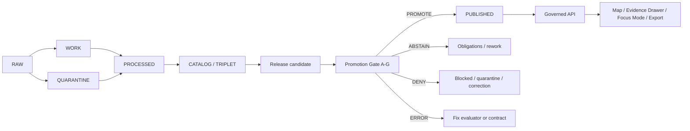

<!-- [KFM_META_BLOCK_V2]
doc_id: kfm://doc/NEEDS-VERIFICATION
title: ADR-0005: Promotion Gate
type: standard
version: v1
status: draft
owners: TODO-NEEDS-CODEOWNERS
created: TODO-NEEDS-CREATED-DATE
updated: 2026-05-02
policy_label: TODO-NEEDS-POLICY-LABEL
related: [docs/adr/README.md, docs/governance/promotion-gate.md, docs/architecture/evidence-flow.md, docs/governance/cite-or-abstain.md, schemas/contracts/v1/promotion/promotion_decision.schema.json, schemas/contracts/v1/release/release_manifest.schema.json, schemas/contracts/v1/evidence/evidence_bundle.schema.json, schemas/contracts/v1/catalog/catalog_matrix.schema.json, policy/promotion/README.md, tools/validators/promotion_gate/README.md, data/receipts/README.md, data/proofs/README.md]
tags: [kfm, adr, promotion, governance, release, evidence, proof, rollback]
notes: [Target path docs/adr/ADR-0005-promotion-gate.md; target file presence was not verified in the current workspace; related paths are doctrine-derived and need checkout verification; doc_id, owners, created date, and policy label remain review placeholders; revised to preserve the Promotion Gate doctrine while tightening outcome semantics, evidence boundaries, schema-home cautions, validation fixtures, and rollback obligations.]
[/KFM_META_BLOCK_V2] -->

# ADR-0005: Promotion Gate

Make publication a governed, evidence-bearing state transition rather than a file move.


> [!IMPORTANT]
> **Status:** draft / NEEDS VERIFICATION  
> **Target path:** `docs/adr/ADR-0005-promotion-gate.md`  
> **Decision posture:** PROPOSED until the active repository confirms ADR numbering, owners, schema homes, workflow names, validator behavior, and promotion tooling.  
> **Truth boundary:** This ADR states KFM doctrine and proposed implementation contracts. It does not prove current repository behavior.

## Quick jumps

[Decision](#decision) · [Context](#context) · [Definitions](#definitions) · [Scope](#scope) · [Decision summary](#decision-summary) · [Gate model](#gate-model) · [Outcome grammar](#outcome-grammar) · [Trust object split](#trust-object-split) · [Promotion flow](#promotion-flow) · [Implementation contract](#implementation-contract) · [Validation](#validation) · [Rollback](#rollback) · [Consequences](#consequences) · [Evidence basis](#evidence-basis) · [Open verification](#open-verification) · [Acceptance checklist](#acceptance-checklist)

---

## Decision

KFM adopts a **Promotion Gate** as the mandatory governance membrane between release candidates and the `PUBLISHED` state.

Promotion is not a copy operation, a successful build, a UI action, a model answer, a signature event, a human comment, or a file move. Promotion is a controlled state transition that evaluates whether a candidate artifact, claim surface, layer, dataset, bundle, or release object may become externally relied upon.

The Promotion Gate must produce one finite promotion decision:

| Decision | Meaning |
|---|---|
| `PROMOTE` | Required gates pass, obligations are satisfied, and the candidate may become the active published release. |
| `ABSTAIN` | The gate lacks enough support to promote or deny safely; the candidate remains unpublished until obligations are resolved. |
| `DENY` | A required gate violation is confirmed because the candidate conflicts with policy, rights, evidence, integrity, sensitivity, review, or release requirements. |
| `ERROR` | The evaluator, schema, contract, runtime, catalog resolver, proof verifier, or policy step failed before a trustworthy decision could be made. |

> [!NOTE]
> Runtime answer outcomes such as `ANSWER`, `ABSTAIN`, `DENY`, and `ERROR` are not promotion outcomes. Promotion governs publication state. Runtime envelopes govern user-facing response behavior.

---

## Context

KFM’s core truth path is:

```text
RAW -> WORK / QUARANTINE -> PROCESSED -> CATALOG / TRIPLET -> PUBLISHED
```

The Promotion Gate protects the final transition into `PUBLISHED`.

A release candidate may already be useful, indexed, rendered, reviewed internally, or included in a catalog preview before promotion. That does not make it public truth. `PROCESSED` artifacts remain unpublished. `CATALOG` and `TRIPLET` surfaces provide discoverability and linkage. `PUBLISHED` is the release state where outward-facing clients, maps, Focus Mode, Evidence Drawer payloads, exports, and semi-public users may rely on the artifact or claim.

### Why this ADR exists

KFM needs a stable answer to five recurring design pressures:

1. How does a release candidate become public without bypassing evidence?
2. What blocks promotion when evidence, rights, sensitivity, review, or policy is incomplete?
3. How do receipts, proofs, manifests, catalogs, and decisions stay distinct?
4. How does rollback happen without deleting evidence or hiding correction lineage?
5. How do UI and AI surfaces know whether a claim is release-safe?

This ADR makes the release boundary explicit and reviewable.

---

## Definitions

| Term | Definition in this ADR |
|---|---|
| **Release candidate** | A candidate artifact, bundle, layer, claim surface, manifest, or dataset version being evaluated for publication. |
| **Published release** | A release target that has passed the Promotion Gate and may be served through governed public or semi-public interfaces. |
| **Promotion Gate** | The finite decision process that evaluates a release candidate against identity, integrity, spatial/temporal, rights, sensitivity, evidence, catalog, review, rollback, and policy requirements. |
| **PromotionDecision** | The machine-readable decision object emitted by the gate. |
| **ReleaseManifest** | The release candidate’s declared artifact set, digests, source references, evidence links, catalog/proof links, and release target. |
| **EvidenceBundle** | The reviewable support bundle that resolves EvidenceRefs and provides inspectable evidence for consequential claims. |
| **Proof pack** | Release-grade proof or attestation package supporting integrity, validation, and review assertions. |
| **Receipt** | Process memory, such as run receipts, validation receipts, transform receipts, correction receipts, or rollback receipts. Receipts support audit and replay but are not proof by themselves. |
| **Catalog closure** | Alignment between release metadata, STAC/DCAT/PROV records, CatalogMatrix references, evidence links, and release artifacts. |

---

## Scope

### Applies to

The Promotion Gate applies to release-significant objects and surfaces, including:

- dataset releases;
- overlay releases;
- map layer descriptors;
- PMTiles / COG / GeoParquet / other spatial artifacts;
- source-derived public products;
- Evidence Drawer payloads that support consequential claims;
- release manifests;
- catalog matrices and provenance closures;
- runtime fixtures when they assert published behavior;
- public-safe derived surfaces;
- rollback, withdrawal, correction, and supersession transitions.

### Does not apply to

The Promotion Gate is not a substitute for:

- source intake validation;
- raw ingest quarantine rules;
- schema validation during development;
- local preview rendering;
- model inference;
- human review alone;
- CI success alone;
- signing alone;
- emergency alerting or operational life-safety systems.

Those may feed the gate, but they do not replace it.

> [!WARNING]
> KFM hazard, emergency, medical, legal, financial, title, cultural, archaeological, ecological, living-person, DNA, private-land, security-relevant, and sensitive-location outputs require stricter policy handling than ordinary public layers. The Promotion Gate must fail closed or abstain when release safety is unresolved.

---

## Decision summary

| Area | Decision |
|---|---|
| Promotion boundary | `PUBLISHED` requires an explicit Promotion Gate decision. |
| Candidate identity | Every candidate must have stable identity anchored by `spec_hash` or an equivalent approved canonical hash. |
| Gate shape | Use Gates A–G as the default cross-lane promotion model. |
| Decision object | Emit a machine-readable `PromotionDecision` / `DecisionEnvelope`-compatible object. |
| Evidence posture | EvidenceRefs must resolve to EvidenceBundles before consequential publication. |
| Catalog posture | STAC / DCAT / PROV / ReleaseManifest closure must be checked where relevant. |
| Policy posture | Missing policy labels, unknown rights, unresolved sensitivity, invalid source roles, or policy-engine failure cannot silently promote. |
| Receipt/proof split | Receipts record process memory; proofs support release trust. They are not interchangeable. |
| Rollback | Rollback emits new receipt and correction lineage; it never deletes prior proof, catalog, release, or decision objects. |
| UI / AI boundary | UI and AI consume only governed, released, policy-safe promotion outputs. |
| Public path rule | Public clients and ordinary UI surfaces use governed APIs and released artifacts, not RAW, WORK, QUARANTINE, canonical/internal stores, or model runtimes directly. |

---

## Gate model

The default KFM promotion membrane uses **Gates A–G**.

| Gate | Name | What it checks | Minimum evidence |
|---|---|---|---|
| **A** | Identity & closure | Stable candidate ID, canonical `spec_hash`, required identity fields, deterministic release target, no floating blob. | Candidate ID, canonical spec bytes, declared hash, release subject identity. |
| **B** | Asset & schema integrity | Required schemas validate; every declared asset exists, is checksummed, and matches reviewed bytes. | Asset manifest, checksums, schema report, STAC / manifest asset linkage where relevant. |
| **C** | Spatial, geometry, and CRS invariants | Geometry validity, CRS allowlist, bbox consistency, deterministic transforms, sane geometry summaries, public-safe geometry where required. | Geometry-bearing assets, CRS metadata, bbox, transform/generalization parameters, public-safe transform receipt when applicable. |
| **D** | Temporal and coverage semantics | Valid intervals, coherent temporal/spatial coverage, source-aligned scope, freshness declarations where policy requires them. | Time fields, coverage metadata, source date, retrieved date, valid-time statement, freshness metadata. |
| **E** | Rights, sensitivity, and policy | License, rights posture, policy label, source role, sensitivity class, obligations, and deny-by-default handling for unknowns. | Rights metadata, policy label, source descriptor, sensitivity classification, policy decision. |
| **F** | Evidence, provenance, proofs, and receipts | EvidenceRefs resolve; EvidenceBundles exist; receipts are present; proofs and attestations verify when configured; catalog/provenance closure is coherent. | EvidenceBundle, run receipt, validation report, proof pack, attestation refs, catalog refs, PROV/STAC/DCAT closure. |
| **G** | Review, rollback, and correction readiness | Steward review is recorded; prior release reference exists when replacing; rollback target is verifiable; correction path is visible. | Review record, prior `spec_hash`, rollback card or rollback receipt plan, correction notice posture, immutable version/tag intent. |

> [!WARNING]
> A `verified: true` field is not trusted by itself. Verification must be backed by the actual verification step, report, proof reference, or explicit `ABSTAIN` / obligation when verification infrastructure is unavailable.

### Gate-level result posture

A gate evaluator may record per-gate results such as `PASS`, `ABSTAIN`, `DENY`, or `ERROR`.

`HOLD` may be used only if the active repository already defines it or a follow-up ADR adopts it. Until then, `HOLD` should be treated as a display alias for `ABSTAIN`, not as a separate final promotion decision.

---

## Outcome grammar

The gate collapses per-gate results into one final promotion decision.

| Gate condition | Final decision | Release effect |
|---|---:|---|
| All applicable required gates pass and obligations are satisfied. | `PROMOTE` | Candidate may become the active published release. |
| A required gate violation is confirmed due to policy, rights, evidence, sensitivity, integrity, catalog, proof, review, or rollback defect. | `DENY` | Candidate remains unpublished; correction, quarantine, or rework path is required. |
| Support is insufficient, source authority is unresolved, rights are unknown, reviewer obligations remain, or evidence is not yet adequate but no contradiction is confirmed. | `ABSTAIN` | Candidate remains unpublished; obligations are recorded. |
| Schema, validator, evaluator, catalog resolver, proof verifier, policy engine, or runtime step fails before a trustworthy decision can be formed. | `ERROR` | Candidate remains unpublished; evaluator or contract must be fixed first. |

### DENY vs ABSTAIN rule

Use `DENY` when the gate can prove a required release condition failed.

Use `ABSTAIN` when the gate cannot safely establish enough support to promote, but the available evidence does not prove a release violation.

Examples:

| Situation | Preferred final decision | Reason |
|---|---:|---|
| EvidenceRefs are declared but do not resolve to required EvidenceBundles. | `DENY` | Required evidence closure failed. |
| Evidence source role is unresolved and no release-safe authority can be established. | `ABSTAIN` | Publication support is insufficient; obligations must be resolved. |
| Rights metadata explicitly forbids redistribution. | `DENY` | Confirmed rights conflict. |
| Rights metadata is missing or source terms are unverified. | `ABSTAIN` or `DENY` by policy | Default should fail closed; active policy decides whether unresolved rights are abstention obligations or denial. |
| Proof verifier crashes before evaluating signatures. | `ERROR` | Tool failure prevents a trustworthy decision. |

### Required decision fields

A promotion decision should include, at minimum:

| Field | Purpose |
|---|---|
| `decision` | One of `PROMOTE`, `ABSTAIN`, `DENY`, `ERROR`. |
| `candidate_id` | Stable subject of the decision. |
| `candidate_type` | Dataset, overlay, layer, bundle, claim surface, release, or other approved type. |
| `spec_hash` | Canonical identity anchor for the candidate. |
| `prior_spec_hash` | Rollback / supersession anchor when replacing an existing release. |
| `reason_codes` | Explicit failure, abstention, or error reasons. |
| `obligations` | Required follow-up actions before promotion can continue. |
| `gates` | Per-gate results for reviewer and CI visibility. |
| `policy_ref` | Policy decision or policy evaluation report reference. |
| `proof_ref` | Proof pack, attestation, or verification report reference. |
| `release_ref` | ReleaseManifest or release candidate reference. |
| `audit_ref` | Audit, receipt, or review trail reference. |
| `generated_at` | Time the decision was produced. |

<details>
<summary>Illustrative PromotionDecision skeleton</summary>

```json
{
  "decision": "ABSTAIN",
  "candidate_id": "release-candidate:hydrology:example",
  "candidate_type": "dataset_release",
  "spec_hash": "sha256:SOURCE_ID_TBD",
  "prior_spec_hash": "sha256:PRIOR_SOURCE_ID_TBD",
  "reason_codes": ["SOURCE_ROLE_NEEDS_VERIFICATION"],
  "obligations": [
    {
      "code": "CONFIRM_SOURCE_ROLE",
      "owner": "OWNER_TBD",
      "due": "TODO(date): confirm review date source"
    }
  ],
  "gates": {
    "A_identity_closure": "PASS",
    "B_asset_schema_integrity": "PASS",
    "C_spatial_geometry_crs": "PASS",
    "D_temporal_coverage": "PASS",
    "E_rights_sensitivity_policy": "ABSTAIN",
    "F_evidence_provenance_proofs": "PASS",
    "G_review_rollback_correction": "ABSTAIN"
  },
  "policy_ref": "kfm://policy/NEEDS-VERIFICATION",
  "proof_ref": "kfm://proof/NEEDS-VERIFICATION",
  "release_ref": "kfm://release/NEEDS-VERIFICATION",
  "audit_ref": "kfm://receipt/NEEDS-VERIFICATION",
  "generated_at": "TODO(date): replace with gate runtime timestamp"
}
```

</details>

---

## Trust object split

KFM keeps trust surfaces separate so that one object family cannot masquerade as another.

| Surface | Role | Must not become |
|---|---|---|
| `data/receipts/` | Process memory: run receipts, validation reports, replay/correction references. | Release proof by itself. |
| `data/proofs/` | Release-grade trust artifacts, proof packs, attestations, verification reports. | Raw source truth or mutable log storage. |
| `data/catalog/` | Discoverability, linkage, STAC/DCAT/PROV closure, CatalogMatrix. | Authorization to publish. |
| `schemas/` / `contracts/` | Machine-readable authority for object shape and interface contracts. | Runtime policy decision. |
| `policy/` | Release and runtime decision logic. | Evidence source. |
| `ReleaseManifest` | Release artifact set, digests, source refs, catalog/proof links. | Proof pack by itself. |
| `EvidenceBundle` | Reviewable evidence support bundle resolving EvidenceRefs. | AI summary or UI popup. |
| `PromotionDecision` | Governed state-transition decision. | File move, CI pass, signature, or human comment. |
| `CorrectionNotice` | User-visible correction / supersession record where release state changes. | Silent mutation of published history. |
| `ReviewRecord` | Recorded steward or reviewer action. | Automatic promotion authority by itself. |

---

## Promotion flow



---

## Implementation contract

### Required invariants

1. **Promotion is explicit.** A candidate does not become published without a promotion decision.
2. **Identity is deterministic.** Candidate identity is anchored by canonical bytes and `spec_hash` or an approved equivalent.
3. **Evidence is resolvable.** EvidenceRefs used by the candidate must resolve to EvidenceBundles before release.
4. **Policy fails closed.** Unknown rights, missing source role, missing policy label, unresolved sensitivity, or policy engine failure cannot silently promote.
5. **Catalog closure is checked.** ReleaseManifest, CatalogMatrix, and STAC/DCAT/PROV records must align where relevant.
6. **Receipts are not proofs.** Process receipts can support audit and replay; they cannot replace proof packs or release manifests.
7. **UI and AI are downstream.** Map surfaces, Evidence Drawer payloads, and Focus Mode may consume released artifacts; they do not decide promotion.
8. **Rollback is governed.** Rollback is another state transition with its own receipt, review, correction notice, and proof linkage.
9. **Prior artifacts are retained.** Correction and rollback never delete prior proofs, receipts, catalogs, release manifests, or decisions.
10. **No hidden bypass.** Public clients and ordinary UI surfaces must not read RAW, WORK, QUARANTINE, internal canonical stores, proof-only stores, review-only stores, or model runtimes directly.

### Proposed file surfaces

The exact file homes require active-repo verification.

| Surface | Proposed path | Status |
|---|---|---|
| ADR | `docs/adr/ADR-0005-promotion-gate.md` | NEEDS VERIFICATION |
| Human governance doc | `docs/governance/promotion-gate.md` | PROPOSED |
| Promotion decision schema | `schemas/contracts/v1/promotion/promotion_decision.schema.json` | PROPOSED |
| Release manifest schema | `schemas/contracts/v1/release/release_manifest.schema.json` | PROPOSED |
| EvidenceBundle schema | `schemas/contracts/v1/evidence/evidence_bundle.schema.json` | PROPOSED |
| CatalogMatrix schema | `schemas/contracts/v1/catalog/catalog_matrix.schema.json` | PROPOSED |
| Promotion policy | `policy/promotion/` | PROPOSED |
| Gate validator | `tools/validators/promotion_gate/` | PROPOSED |
| Promotion fixtures | `tests/fixtures/promotion/` | PROPOSED |
| Receipt output | `data/receipts/promotions/` | PROPOSED |
| Proof output | `data/proofs/promotions/` | PROPOSED |
| Release output | `data/releases/` | PROPOSED |
| Correction notices | `data/releases/corrections/` | PROPOSED |

> [!CAUTION]
> Do not create parallel schema homes if the active repository already treats a different path as canonical. Resolve schema-home authority through the existing ADR process before landing machine-contract files.

### Implementation sequence

1. Verify ADR numbering, target path, owner, policy label, and adjacent ADR format.
2. Resolve or explicitly defer schema-home authority before adding machine-readable contracts.
3. Add or confirm `PromotionDecision`, `ReleaseManifest`, `EvidenceBundle`, and `CatalogMatrix` schemas.
4. Add positive and negative fixtures before wiring the gate to any release process.
5. Implement a no-network promotion dry run.
6. Add policy tests for rights, source role, sensitivity, evidence closure, and public path constraints.
7. Add rollback and correction fixtures.
8. Wire release promotion only after dry-run behavior and negative fixtures pass.
9. Document rollback target and correction lineage before the first real release candidate is promoted.

---

## Validation

Promotion validation must include positive and negative fixtures.

| Fixture | Expected decision | Purpose |
|---|---:|---|
| `valid_promote_release_candidate` | `PROMOTE` | Proves complete evidence, policy, catalog, proof, review, and rollback readiness. |
| `deny_missing_evidence_bundle` | `DENY` | EvidenceRefs do not resolve where EvidenceBundle support is required. |
| `deny_unresolved_rights` | `DENY` or policy-defined `ABSTAIN` | Proves rights handling fails closed and does not silently publish. |
| `deny_sensitive_exact_geometry_public` | `DENY` | Public release would expose restricted exact geometry. |
| `deny_signature_mismatch` | `DENY` | Verification fails where signature infrastructure is configured. |
| `abstain_policy_unresolved` | `ABSTAIN` | Evidence is not contradictory, but policy obligations remain unresolved. |
| `error_malformed_candidate` | `ERROR` | Candidate shape prevents trustworthy evaluation. |
| `error_policy_engine_unavailable` | `ERROR` | Policy could not be evaluated. |
| `rollback_to_prior_spec_hash` | `PROMOTE` or `ABSTAIN` | Proves rollback verifies prior proof bundle and emits correction lineage. |

### Illustrative validation command

```bash
# PROPOSED: adapt names, runners, paths, and tools to the active repository.
python tools/validators/promotion_gate/promotion_gate.py \
  tests/fixtures/promotion/valid_release_candidate.json \
  --out build/promotion/decision.json

python tools/validators/promotion_gate/validate_decision_envelope.py \
  build/promotion/decision.json

conftest test build/promotion/decision.json \
  --policy policy/promotion
```

> [!NOTE]
> These commands are illustrative. Do not commit them as required commands until the active repository confirms Python tooling, validator names, fixture paths, and OPA / Conftest availability.

---

## Rollback

Rollback is a governed transition from one published release target to another previously verified release target.

Rollback must:

1. select a prior immutable `spec_hash`;
2. verify the prior ReleaseManifest, EvidenceBundle, CatalogMatrix, and proof pack;
3. emit a rollback receipt;
4. emit or update a correction notice when user-visible state changes;
5. run policy over the rollback decision;
6. update the current alias or release pointer only after verification;
7. preserve prior artifacts;
8. expose correction state through governed public surfaces when applicable.

Rollback must not:

- delete prior receipts, proofs, catalogs, release manifests, or decision objects;
- silently rewrite published history;
- bypass policy because the prior artifact was previously published;
- hide the correction reason from downstream Evidence Drawer, API payloads, export manifests, or review surfaces when the change is consequential.

### Rollback trigger examples

| Trigger | Required posture |
|---|---|
| ReleaseManifest digest mismatch | `DENY` new promotion; consider rollback after prior release verifies. |
| Sensitive exact geometry accidentally promoted | Withdraw or rollback; emit correction notice and redaction/generalization receipt. |
| EvidenceBundle later found unsupported | Withdraw, correct, or rollback; preserve prior proof and correction lineage. |
| Catalog closure broken after dependency change | `ABSTAIN` or `DENY` dependent releases until closure is restored. |
| Policy engine unavailable during rollback | `ERROR`; do not update release pointer. |

---

## Consequences

### Positive

- Makes publication inspectable and reversible.
- Keeps evidence, policy, proof, catalog, review, and release state connected.
- Prevents convenient intermediate files from becoming public truth.
- Gives CI, reviewers, UI, and AI a shared release decision object.
- Makes rollback and correction part of trust rather than signs of failure.
- Gives downstream surfaces a finite release state instead of inferring readiness from file location.

### Costs

- Adds contract, fixture, validator, and policy work before public release.
- Slows early publication until proof-object and catalog closure are real.
- Requires strict source-role, rights, sensitivity, and review data that may not exist for every source.
- Requires maintaining negative fixtures and correction drills.
- Requires ADR discipline where schema homes or object-family authority are unresolved.

### Rejected alternatives

| Alternative | Rejection reason |
|---|---|
| Treat file movement into `published/` as promotion. | Bypasses evidence, policy, proof, and review. |
| Treat CI success as publication authority. | CI can validate mechanics but cannot replace policy or review. |
| Treat signatures as sufficient proof. | Signatures prove integrity or identity, not rights, sensitivity, evidence completeness, or source role. |
| Let UI or Focus Mode decide publishability. | UI and AI are downstream interpretive layers, not governance authorities. |
| Use manual review only. | Review must be recorded and machine-checkable enough to support audit, rollback, and repeatable gates. |
| Use model confidence as a promotion signal. | AI is interpretive only; EvidenceBundle, policy, review, and release state outrank generated language. |

---

## Evidence basis

| Source | Status | Supports | Limits |
|---|---|---|---|
| Attached ADR draft, `Pasted markdown.md` | CONFIRMED baseline | Existing ADR structure, target path assumption, Promotion Gate doctrine, Gates A–G, finite outcomes, trust object split, validation fixtures, rollback obligations. | Does not prove active repo path, owner, ADR number availability, schema home, or implemented validator behavior. |
| Current workspace inspection | CONFIRMED evidence boundary | The current session did not expose a mounted repository tree, tests, workflows, dashboards, logs, or runtime evidence. | Does not disprove implementation elsewhere; it only bounds this revision. |
| KFM pipeline / components / UI doctrine | CONFIRMED doctrine / LINEAGE implementation where not repo-verified | KFM lifecycle, inspectable-claim posture, EvidenceBundle priority, ReleaseManifest/CatalogMatrix/PromotionDecision vocabulary, governed UI and Focus Mode boundaries. | Prior reports and manuals are not current implementation proof without mounted repo evidence. |
| External standards named in KFM corpus, including STAC/DCAT/PROV patterns | NEEDS VERIFICATION for active versions and repo usage | Catalog and provenance closure concepts. | This ADR does not pin versions or prove tool availability. |

---

## Open verification

The following items remain NEEDS VERIFICATION before this ADR can be treated as accepted implementation guidance:

- active ADR numbering and whether `ADR-0306` is available;
- `docs/adr/` local formatting conventions;
- CODEOWNERS or steward owner for promotion governance;
- current schema home: `contracts/`, `schemas/contracts/v1/`, or another repo convention;
- whether `PromotionDecision`, `DecisionEnvelope`, or both are canonical;
- existing promotion gate tooling and workflow names;
- OPA / Conftest / Cosign / attestation availability and pinned versions;
- release manifest storage location;
- proof pack storage location;
- catalog matrix storage location;
- correction notice storage location;
- whether a `HOLD` display state exists locally, and whether it maps to `ABSTAIN` or requires a separate ADR;
- whether any already-published artifact has a rollback/correction fixture that this ADR must preserve;
- whether UI and API payloads already expose promotion state, release ID, correction state, and rollback target.

---

## Acceptance checklist

- [ ] ADR path and numbering verified.
- [ ] Owner and policy label confirmed.
- [ ] Schema-home conflict resolved or explicitly deferred.
- [ ] Promotion decision schema has positive and negative fixtures.
- [ ] Gate A–G evaluator emits finite outcomes.
- [ ] EvidenceRef-to-EvidenceBundle resolution is tested.
- [ ] Catalog closure is tested.
- [ ] Rights, sensitivity, and source-role policy denials are tested.
- [ ] Receipts and proofs remain separate.
- [ ] Rollback drill emits receipt and correction lineage.
- [ ] Correction notice behavior is documented for user-visible changes.
- [ ] UI and AI surfaces consume only governed release decisions.
- [ ] Public clients cannot reach RAW, WORK, QUARANTINE, internal canonical stores, or model runtimes directly.
- [ ] Documentation links are verified from `docs/adr/`.
