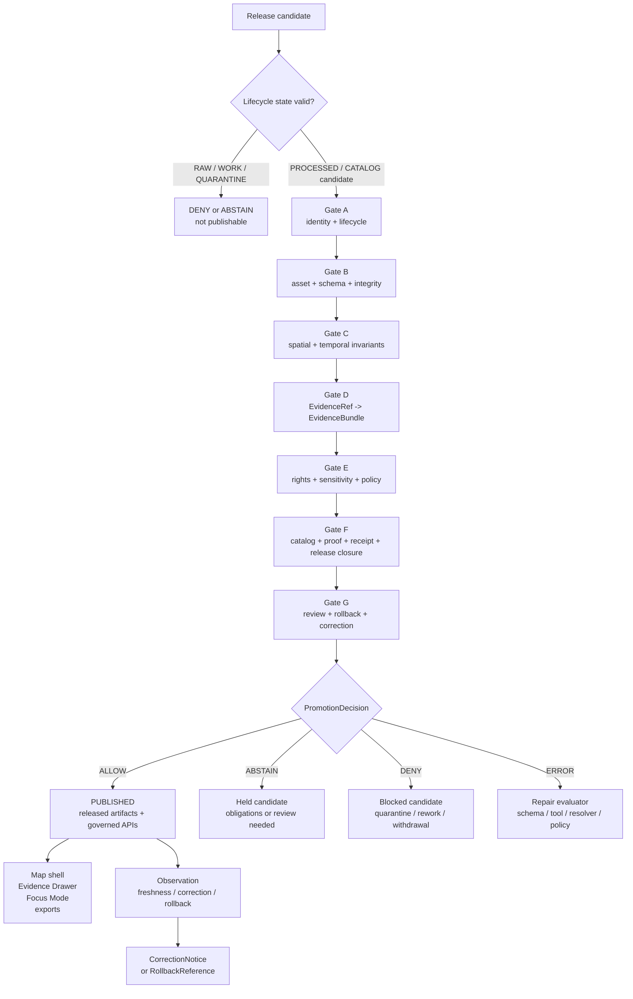

<!-- [KFM_META_BLOCK_V2]
doc_id: kfm://doc/NEEDS-VERIFICATION-ADR-0004-promotion-gate
title: ADR-0004: Promotion Gate
type: standard
version: v1
status: draft
owners: OWNER_TBD_NEEDS_VERIFICATION
created: 2026-05-08
updated: 2026-05-08
policy_label: NEEDS_VERIFICATION
related: [./README.md, ./ADR-TEMPLATE.md, ./ADR-0005-promotion-gate.md, ./ADR-0011-catalog-proof-release-separation.md, ../standards/finite-outcomes.md, ../runbooks/publication.md, ../../tools/validators/promotion_gate/README.md, ../../policy/crosswalk/promotion-gate-map.md, ../../policy/promotion/main.rego, ../../schemas/contracts/v1/shared/promotion_decision.schema.json]
tags: [kfm, adr, promotion, release, publication, evidence, policy, proof, rollback, finite-outcomes]
notes: [Target path docs/adr/ADR-0004-promotion-gate.md is CONFIRMED through GitHub connector evidence, but no mounted local checkout was available in this session; owners, CODEOWNERS coverage, policy label, branch protection, workflow enforcement, runtime behavior, emitted promotion artifacts, and complete fixture coverage remain NEEDS VERIFICATION; created date is taken from the existing ADR stub decision date and should be verified against git history or the document registry; docs/adr/ADR-0005-promotion-gate.md is a CONFIRMED adjacent duplicate/richer promotion-gate ADR and requires maintainer resolution before either ADR is marked accepted.]
[/KFM_META_BLOCK_V2] -->

<a id="top"></a>

# ADR-0004: Promotion Gate

Make promotion a governed, evidence-bearing state transition from release candidate to published KFM meaning.

<p align="center">
  
  
  
  
  
</p>

<p align="center">
  <a href="#status-and-evidence-boundary">Status</a> ·
  <a href="#decision-summary">Decision</a> ·
  <a href="#context">Context</a> ·
  <a href="#outcome-vocabulary">Outcomes</a> ·
  <a href="#promotion-gate-model">Gate model</a> ·
  <a href="#trust-object-boundaries">Trust objects</a> ·
  <a href="#implementation-constraints">Implementation</a> ·
  <a href="#validation-and-acceptance">Validation</a> ·
  <a href="#rollback-correction-and-supersession">Rollback</a> ·
  <a href="#open-verification">Open verification</a>
</p>

> [!IMPORTANT]
> This ADR records the promotion-gate decision for `docs/adr/ADR-0004-promotion-gate.md`. It is **not** proof that every validator, policy bundle, workflow, branch protection rule, release artifact, fixture, dashboard, or runtime path is currently enforced.
>
> A richer adjacent file, [`ADR-0005-promotion-gate.md`](./ADR-0005-promotion-gate.md), is present in the repository and overlaps this decision. Keep both files in `draft` / `NEEDS VERIFICATION` posture until maintainers decide whether ADR-0005 is lineage, successor, duplicate, or the accepted canonical promotion-gate ADR.

---

## Status and evidence boundary

| Field | Determination |
|---|---|
| ADR ID | `ADR-0004` |
| File | `docs/adr/ADR-0004-promotion-gate.md` |
| Status | `draft` |
| Decision posture | `PROPOSED` until duplicate ADR relation, owner review, and enforcement evidence are resolved |
| Original stub date | `2026-05-08` |
| Scope | Architecture / governance / release boundary |
| Primary invariant | Promotion is a governed state transition, not a file move |
| Final machine decision enum | `ALLOW`, `ABSTAIN`, `DENY`, `ERROR` |
| Gate-level status enum | `PASS`, `FAIL`, `ABSTAIN`, `ERROR` |
| Runtime answer enum | `ANSWER`, `ABSTAIN`, `DENY`, `ERROR` |
| Enforcement maturity | `NEEDS VERIFICATION` |
| Known conflict | Some adjacent promotion material uses `PROMOTE`, `HOLD`, or `PASS` as final promotion outcomes; the shared finite-outcomes standard and `PromotionDecision` schema use `ALLOW`, `ABSTAIN`, `DENY`, `ERROR` |

### Evidence basis

| Evidence | Status | What it supports | Limit |
|---|---:|---|---|
| Existing [`ADR-0004-promotion-gate.md`](./ADR-0004-promotion-gate.md) stub | `CONFIRMED` | Target file exists and states the original decision area: “Promotion as governed state transition with outcomes, reviews, proof requirements, and rollback target.” | Stub does not provide full architecture, enforcement, ownership, schema, or validation detail. |
| [`README.md`](../../README.md) | `CONFIRMED` | KFM identity: governed, evidence-first, map-first, time-aware; lifecycle and public-client guardrails. | Root README itself marks many claims as draft / proposed / needs verification. |
| [`docs/standards/finite-outcomes.md`](../standards/finite-outcomes.md) | `CONFIRMED` | Shared outcome vocabulary: runtime uses `ANSWER / ABSTAIN / DENY / ERROR`; policy, promotion, and rollback use `ALLOW / ABSTAIN / DENY / ERROR`; validation uses `PASS / FAIL / ABSTAIN / ERROR`. | Does not prove all code paths enforce the vocabulary. |
| [`schemas/contracts/v1/shared/promotion_decision.schema.json`](../../schemas/contracts/v1/shared/promotion_decision.schema.json) | `CONFIRMED` | Minimal `PromotionDecision` schema requires `id`, `decision`, and `reason`; `decision` enum is `ALLOW`, `ABSTAIN`, `DENY`, `ERROR`. | Minimal schema does not include gate results, proof refs, rollback refs, or release manifest refs. |
| [`tools/validators/promotion_gate/README.md`](../../tools/validators/promotion_gate/README.md) | `CONFIRMED` | Promotion Gate A–G validator-lane doctrine, fail-closed posture, and implementation-facing gate model. | It labels implementation depth as needing verification and uses some older/conflicting enum language. |
| [`policy/promotion/main.rego`](../../policy/promotion/main.rego) | `CONFIRMED` | There is executable policy text denying unknown rights, public release from `RAW` / `WORK` / `QUARANTINE`, missing reviewer for `PUBLISHED`, restricted public release, missing EvidenceBundle hash, missing receipts, missing cosign verification, and unregistered gatehouse posture. | Existence of policy file does not prove CI or release enforcement. |
| [`policy/crosswalk/promotion-gate-map.md`](../../policy/crosswalk/promotion-gate-map.md) | `CONFIRMED` | Policy crosswalk for mapping promotion responsibilities to evidence, policy, catalog, receipt, proof, review, and rollback surfaces. | Draft; notes exact paths, schemas, workflow enforcement, and branch protection remain needs verification. |
| [`docs/runbooks/publication.md`](../runbooks/publication.md) | `CONFIRMED` | Publication doctrine: publication is governed state transition, not file copy, validator pass, UI render, or generated answer. | Runbook uses some vocabulary that needs enum reconciliation. |
| [`ADR-0011-catalog-proof-release-separation.md`](./ADR-0011-catalog-proof-release-separation.md) | `CONFIRMED` | Receipts, proofs, catalogs, releases, promotion decisions, corrections, and rollback references remain separate trust surfaces. | Draft; enforcement maturity remains needs verification. |
| [`ADR-0005-promotion-gate.md`](./ADR-0005-promotion-gate.md) | `CONFIRMED` | Rich adjacent promotion-gate draft and likely lineage/successor/duplicate. | Maintainers must resolve authority before accepting either ADR. |

<p align="right"><a href="#top">Back to top ↑</a></p>

---

## Decision summary

KFM adopts a **Promotion Gate** as the required governance membrane between release candidates and the `PUBLISHED` state.

A release candidate may become public or semi-public KFM meaning only when a reviewable `PromotionDecision` records `decision: "ALLOW"` for the named release scope and required evidence, policy, catalog, proof, receipt, review, release-manifest, correction, and rollback obligations are satisfied.

### Final authority sentence

> Promotion is a governed state transition. It is not a file move, successful validator run, rendered map layer, catalog entry, signed blob, proof pack, receipt, dashboard refresh, human comment, generated answer, or path under a folder named `published`.

### Decision table

| Decision element | ADR-0004 rule |
|---|---|
| Promotion authority | `PromotionDecision` |
| Positive machine decision | `ALLOW` |
| Human verb | “promote” remains acceptable prose; machine value is `ALLOW` |
| Negative / bounded outcomes | `ABSTAIN`, `DENY`, `ERROR` |
| Gate status vocabulary | `PASS`, `FAIL`, `ABSTAIN`, `ERROR` |
| Public-client rule | Public clients use governed APIs and released artifacts only |
| Rollback rule | Promotion requires a rollback target or explicitly reviewed compensating control |
| Correction rule | Public meaning changes require correction, withdrawal, supersession, narrowing, generalization, or rollback lineage |
| Duplicate ADR handling | `ADR-0005-promotion-gate.md` relation must be resolved before acceptance |

<p align="right"><a href="#top">Back to top ↑</a></p>

---

## Context

Kansas Frontier Matrix is a governed spatial evidence system. Its durable public unit is the **inspectable claim**: a public or semi-public statement whose evidence, source role, spatial scope, temporal scope, policy posture, review state, release state, and correction lineage can be inspected.

Promotion is the moment where trust widens. That moment needs more discipline than a build step or storage move.

Without a promotion boundary, KFM risks allowing convenient intermediate artifacts to harden into public truth.

| Failure pressure | What can go wrong |
|---|---|
| Folder-path promotion | A copied artifact under a published-looking path is treated as released even though evidence, policy, proof, review, and rollback are incomplete. |
| CI-as-publication | A successful build, schema pass, or validator pass is treated as permission to publish. |
| Map-as-proof | A rendered tile, feature, popup, scene, or layer is treated as evidence authority. |
| Receipt/proof confusion | Process memory is mistaken for release-grade proof. |
| Catalog/release confusion | Discovery metadata is mistaken for publication approval. |
| Model-as-authority | Generated language is mistaken for evidence, review, or release decision. |
| Rights/sensitivity gaps | Unknown rights, source terms, rare-species precision, cultural sensitivity, private land, living-person data, critical infrastructure, or restricted exact-location exposure leaks outward. |
| Silent correction | A public artifact is overwritten, narrowed, withdrawn, generalized, or superseded without correction lineage. |
| No rollback target | A release changes outward meaning but cannot be safely reversed or inspected after failure. |

### Why this is architecture-significant

Promotion affects the whole KFM trust spine:

```text
RAW -> WORK / QUARANTINE -> PROCESSED -> CATALOG / TRIPLET -> PUBLISHED
```

Every public-facing or semi-public surface downstream of `PUBLISHED` depends on that transition being reviewable:

- governed API responses;
- MapLibre layers and tiles;
- Evidence Drawer payloads;
- Focus Mode / governed AI answers;
- exports, reports, dossiers, and story nodes;
- catalog, search, and graph projections;
- release manifests, correction notices, and rollback references.

<p align="right"><a href="#top">Back to top ↑</a></p>

---

## Decision

KFM will require a Promotion Gate for release-significant material before it may become published KFM meaning.

The Promotion Gate evaluates whether a release candidate has enough support to move from candidate state into the named release target. It emits one finite `PromotionDecision` and preserves the evidence needed to understand, reproduce, deny, abstain, repair, correct, or roll back that decision.

### Required operating rules

1. **Promotion is explicit.**  
   No candidate becomes published without a `PromotionDecision`.

2. **The positive machine outcome is `ALLOW`.**  
   Prose may say “promote,” but the canonical `PromotionDecision.decision` value is `ALLOW`.

3. **Negative outcomes are first-class.**  
   `ABSTAIN`, `DENY`, and `ERROR` are valid governance outcomes, not failures to be smoothed into success.

4. **The gate fails closed.**  
   Unknown rights, unresolved sensitivity, missing evidence, missing review, missing rollback, policy engine failure, schema error, or validator fault cannot silently publish.

5. **Receipts, proofs, catalogs, manifests, and decisions stay separate.**  
   Nearby metadata does not replace the object family with authority for that release question.

6. **Public clients are downstream.**  
   Normal public and semi-public surfaces may consume governed APIs and released artifacts only. They must not directly read `RAW`, `WORK`, `QUARANTINE`, unpublished candidates, internal canonical stores, proof-only stores, receipt-only stores, source-system side effects, secrets, or direct model runtime output.

7. **Rollback and correction are part of readiness.**  
   Release-significant promotion must identify a rollback target, correction route, or reviewed compensating control before trust widens.

8. **Duplicate ADR relation must be resolved.**  
   This ADR and `ADR-0005-promotion-gate.md` overlap. Acceptance requires a visible maintainer choice: merge, supersede, rename, or mark one file as lineage.

<p align="right"><a href="#top">Back to top ↑</a></p>

---

## Outcome vocabulary

### Final promotion decisions

| Decision | Meaning | Release effect |
|---|---|---|
| `ALLOW` | Required gates pass and obligations are satisfied for the named release scope. | Candidate may be promoted to the active release target. |
| `ABSTAIN` | Support is insufficient, unresolved, stale, incomplete, review-dependent, or not safely answerable; no confirmed violation is established. | Candidate remains unpublished; obligations or review tasks are recorded. |
| `DENY` | A required condition is confirmed to fail: policy, rights, sensitivity, evidence, integrity, catalog, proof, review, rollback, or public-path rule. | Candidate remains unpublished; may require quarantine, rework, correction, withdrawal, or replacement. |
| `ERROR` | Schema, evaluator, resolver, policy engine, verifier, runtime, fixture, or tool failure prevents a trustworthy decision. | Candidate remains unpublished; the process or contract must be repaired first. |

### Gate-level statuses

| Gate status | Meaning | Collapse behavior |
|---|---|---|
| `PASS` | Gate passed for the requested release scope. | Contributes to `ALLOW` only if all required gates pass. |
| `FAIL` | Gate found a confirmed violation. | Collapses final decision to `DENY` unless an earlier `ERROR` prevents safe evaluation. |
| `ABSTAIN` | Gate lacks enough support to pass or deny safely. | Collapses final decision to `ABSTAIN` unless another gate produces `FAIL` or `ERROR`. |
| `ERROR` | Gate could not evaluate reliably. | Collapses final decision to `ERROR`. |

### Decision precedence

```text
IF any required gate returns ERROR:
  final_decision = ERROR

ELSE IF any required gate returns FAIL:
  final_decision = DENY

ELSE IF any required gate returns ABSTAIN:
  final_decision = ABSTAIN

ELSE:
  final_decision = ALLOW
```

### Vocabulary reconciliation

| Term seen in adjacent material | ADR-0004 treatment |
|---|---|
| `PROMOTE` | Human verb or display alias only. Machine value is `ALLOW`. |
| `HOLD` | Map to `ABSTAIN` when support is insufficient but not contradicted; map to release/review state only if schemas explicitly define it. |
| `PASS` | Gate or validation status, not final promotion decision. |
| `APPROVE` | Review action or human label, not final promotion decision unless schema explicitly defines it. |
| `PUBLISHED` | Lifecycle/release state after an allowed promotion action, not a decision value. |

> [!CAUTION]
> Do not add `PROMOTE` as a second positive machine enum beside `ALLOW` unless the shared finite-outcomes standard and `PromotionDecision` schema are intentionally revised through ADR and schema review.

<p align="right"><a href="#top">Back to top ↑</a></p>

---

## Promotion Gate model

The Promotion Gate uses seven cross-lane checks. Domain lanes may add stricter gates, but they must not weaken these.

| Gate | Name | What it checks | Minimum support |
|---|---|---|---|
| **A** | Identity, lifecycle, and candidate closure | Stable candidate ID, release subject, lifecycle state, deterministic `spec_hash` or approved equivalent, no mutable “latest” ambiguity. | Candidate ID, release subject, canonical hash, lifecycle state, prior release ref when replacing. |
| **B** | Asset, schema, and integrity closure | Required schemas validate; artifacts exist; digests match; media types and artifact refs are coherent. | Schema report, asset manifest, artifact checksums, release manifest, validation report. |
| **C** | Spatial, temporal, CRS, and coverage invariants | Geometry validity, CRS allowlist, bbox consistency, precision posture, temporal scope, freshness, coverage declarations. | Geometry/temporal validation reports, transform receipt, redaction/generalization receipt if applicable. |
| **D** | Evidence and source-role closure | Consequential claims resolve `EvidenceRef -> EvidenceBundle`; source role supports the claim; citations exist where required. | EvidenceBundle refs, SourceDescriptor refs, citation validation report, source-role report. |
| **E** | Rights, sensitivity, and policy closure | Rights, source terms, access class, sensitivity, exact-location handling, policy label, embargo, obligations, public-safe posture. | PolicyDecision, rights/sensitivity review, source terms snapshot, steward review where required. |
| **F** | Catalog, proof, receipt, and release closure | STAC/DCAT/PROV/CatalogMatrix alignment; ProofPack; receipts retained as process memory; ReleaseManifest links required artifacts. | Catalog refs, proof refs, receipt refs, ReleaseManifest, validation reports, attestation refs when configured. |
| **G** | Review, rollback, and correction readiness | Required reviews complete; rollback target exists; correction/withdrawal path is defined; prior release can be verified when replacing. | ReviewRecord, RollbackReference, CorrectionNotice posture, prior spec hash, release alias plan. |

### Promotion flow



<p align="right"><a href="#top">Back to top ↑</a></p>

---

## Trust object boundaries

KFM keeps trust-bearing object families distinct so that one surface cannot masquerade as another.

| Object family | Role | Must not become |
|---|---|---|
| `SourceDescriptor` | Source identity, source role, steward, rights, cadence, access, sensitivity, geography, time, and activation posture. | Evidence proof, policy approval, or release manifest. |
| `EvidenceRef` | Pointer from a claim, layer, candidate, or artifact to supporting evidence. | Evidence itself. |
| `EvidenceBundle` | Resolved evidence, source roles, scope, provenance, citations, limitations, and support sufficient for review. | Generated summary, UI popup, or model answer. |
| `ValidationReport` | Result of schema, geometry, temporal, source-role, evidence, catalog, release, or policy validation. | Release approval. |
| `PolicyDecision` | Allow, abstain, deny, or error disposition with reasons and obligations. | Evidence source or schema definition. |
| `RunReceipt` / `TransformReceipt` / `AIReceipt` | Process memory: what ran, what changed, tool identity, inputs, outputs, hashes, failures. | ProofPack by itself. |
| `ProofPack` | Release-significant proof support and validation assembly. | Receipt store, raw source, or catalog. |
| `CatalogMatrix` / STAC / DCAT / PROV | Catalog, provenance, distribution, and discovery closure. | Publication approval. |
| `ReleaseManifest` | Released artifacts, digests, evidence/proof/catalog refs, policy/review state, release target, rollback target. | Policy decision or evidence bundle. |
| `PromotionDecision` | Final state-transition decision for a candidate. | File move, CI pass, signature, or human comment. |
| `CorrectionNotice` | Public or restricted correction, narrowing, withdrawal, replacement, supersession, or generalization lineage. | Silent mutation. |
| `RollbackReference` | Prior safe release target and rollback obligations. | Deletion of history. |
| `RuntimeResponseEnvelope` | Request-time outcome, evidence, policy, release, and correction state. | Release authority. |

### Separation rule

> Receipts explain **what happened**. Proof packs support **why release can be trusted**. Catalog records explain **what can be discovered**. Release manifests bind **what is released**. Promotion decisions decide **whether trust widens**. Correction and rollback records preserve **how trust is repaired**.

<p align="right"><a href="#top">Back to top ↑</a></p>

---

## Implementation constraints

### Required invariants

1. **No implicit publication.** A path, branch, artifact upload, schema pass, map render, or dashboard update does not publish.
2. **No raw public path.** Public or ordinary UI paths must not resolve `RAW`, `WORK`, `QUARANTINE`, unpublished candidate, proof-only, receipt-only, review-only, secret, or direct model-runtime state.
3. **No evidence-free claims.** Consequential claims must resolve `EvidenceRef -> EvidenceBundle` or abstain, narrow, deny, or hold.
4. **No rights ambiguity.** Unknown rights, unclear source terms, unresolved sensitivity, or missing source role fail closed.
5. **No review implication.** Required steward, policy, domain, security, cultural, legal, privacy, or release review must be recorded.
6. **No receipt/proof collapse.** A process receipt cannot satisfy proof-pack or release-manifest obligations alone.
7. **No catalog/release collapse.** Catalog closure is required for discoverable release, but catalog presence is not approval.
8. **No rollback by memory.** Rollback target, correction path, or compensating control must be reviewable before release-significant promotion.
9. **No enum drift.** Machine contracts should use the finite-outcomes vocabulary unless a successor ADR and schema change intentionally revise it.
10. **No hidden duplicate authority.** ADR-0004 and ADR-0005 must be reconciled before either becomes accepted.

### Confirmed implementation-adjacent signals

| Surface | Confirmed signal | ADR-0004 reading |
|---|---|---|
| Shared finite outcomes | `docs/standards/finite-outcomes.md` lists `promotion_decision.schema.json` and `ALLOW / ABSTAIN / DENY / ERROR` for policy, promotion, and rollback. | Use `ALLOW` as final positive machine decision. |
| PromotionDecision schema | `schemas/contracts/v1/shared/promotion_decision.schema.json` exists with `id`, `decision`, and `reason`. | Minimal schema exists; expanded gate fields remain `PROPOSED`. |
| Promotion policy | `policy/promotion/main.rego` contains deny rules for unknown rights, public release from private lifecycle states, missing reviewer, restricted public release, missing evidence hash, missing receipts, missing cosign verification, and unregistered gatehouse posture. | Policy basis exists; enforcement maturity remains `NEEDS VERIFICATION`. |
| Validator-lane README | `tools/validators/promotion_gate/README.md` exists and documents A–G gate doctrine. | Useful validator-lane contract; enum normalization needed. |
| Publication runbook | `docs/runbooks/publication.md` exists and states publication is a governed transition, not file copy or validator pass. | Strong doctrinal support; enum reconciliation needed. |
| Catalog/proof/release separation ADR | `docs/adr/ADR-0011-catalog-proof-release-separation.md` exists. | Supports object-family separation. |
| Adjacent duplicate ADR | `docs/adr/ADR-0005-promotion-gate.md` exists and is much richer than the ADR-0004 stub. | Must be resolved before acceptance. |

### Proposed expanded `PromotionDecision` fields

The current shared schema is intentionally minimal. A future compatible expansion or companion schema should consider:

| Field | Purpose | Status |
|---|---|---|
| `id` | Decision identity. | `CONFIRMED` in current minimal schema |
| `decision` | `ALLOW`, `ABSTAIN`, `DENY`, or `ERROR`. | `CONFIRMED` in current minimal schema |
| `reason` | Human-readable reason. | `CONFIRMED` in current minimal schema |
| `candidate_id` | Stable release candidate identity. | `PROPOSED` |
| `candidate_type` | Dataset, layer, tile, catalog, story, export, Focus answer, etc. | `PROPOSED` |
| `spec_hash` | Canonical candidate hash. | `PROPOSED` |
| `prior_spec_hash` | Prior release hash when replacing or rolling back. | `PROPOSED` |
| `gate_results` | Gates A–G with `PASS`, `FAIL`, `ABSTAIN`, `ERROR`. | `PROPOSED` |
| `reason_codes` | Stable machine-readable reasons. | `PROPOSED` |
| `obligations` | Required follow-up for `ABSTAIN`, `DENY`, or conditional review. | `PROPOSED` |
| `evidence_refs` | EvidenceBundle references checked by the gate. | `PROPOSED` |
| `policy_ref` | PolicyDecision reference. | `PROPOSED` |
| `release_manifest_ref` | ReleaseManifest reference. | `PROPOSED` |
| `proof_refs` | ProofPack / attestation / validation report refs. | `PROPOSED` |
| `catalog_refs` | STAC/DCAT/PROV/CatalogMatrix refs. | `PROPOSED` |
| `review_refs` | ReviewRecord refs. | `PROPOSED` |
| `rollback_ref` | RollbackReference or rollback card. | `PROPOSED` |
| `correction_notice_ref` | CorrectionNotice when replacing, narrowing, withdrawing, generalizing, or superseding. | `PROPOSED` |
| `generated_at` | Timestamp produced by evaluator. | `PROPOSED` |
| `audit_ref` | Receipt, validation report, or review handoff reference. | `PROPOSED` |

<p align="right"><a href="#top">Back to top ↑</a></p>

---

## Validation and acceptance

ADR-0004 should not move from `draft` to `accepted` until maintainers can verify both the decision and its enforcement path.

### Acceptance checklist

- [ ] ADR-0004 and ADR-0005 relation is resolved in the ADR index.
- [ ] Owner and reviewer are confirmed from CODEOWNERS, maintainers, or release governance.
- [ ] Policy label is confirmed.
- [ ] `PromotionDecision` enum is reconciled across ADRs, schemas, runbooks, validator README, policy crosswalk, examples, and fixtures.
- [ ] `PROMOTE` is either removed from machine contracts or formally retained only as display/prose alias.
- [ ] Promotion Gate A–G required inputs are represented in schemas, contracts, or validator inputs.
- [ ] Policy denies public release from `RAW`, `WORK`, and `QUARANTINE`.
- [ ] Required `EvidenceRef -> EvidenceBundle` closure is tested.
- [ ] Rights and sensitivity unknowns fail closed.
- [ ] Missing reviewer for `PUBLISHED` target fails closed.
- [ ] Missing rollback target blocks release-significant promotion or requires explicit compensating control.
- [ ] Receipts are not treated as proof packs.
- [ ] Catalog records are not treated as promotion decisions.
- [ ] Public clients cannot resolve raw, work, quarantine, unpublished candidate, proof-only, receipt-only, or direct model paths.
- [ ] Valid, abstain, deny, and error fixtures exist for the gate.
- [ ] CI or repo-native validation proves the checks run before any enforcement claim is made.
- [ ] Correction, withdrawal, supersession, and rollback lineage remain visible after public meaning changes.

### Required fixture families

| Fixture | Expected final decision | Purpose |
|---|---|---|
| `valid_public_release_candidate` | `ALLOW` | Complete evidence, rights, sensitivity, catalog, proof, review, ReleaseManifest, and rollback closure. |
| `abstain_missing_review` | `ABSTAIN` | Required review is not complete, but no confirmed violation is established. |
| `abstain_source_role_unresolved` | `ABSTAIN` | Source support may exist, but source role is not strong enough for the claim. |
| `deny_raw_public_ref` | `DENY` | Public candidate references `RAW`, `WORK`, `QUARANTINE`, or internal stores. |
| `deny_rights_unknown` | `DENY` | Rights are unknown for requested outward release. |
| `deny_restricted_public_release` | `DENY` | Restricted sensitivity is requested for public release. |
| `deny_missing_evidencebundle_spec_hash` | `DENY` | EvidenceBundle hash requirement is missing. |
| `deny_missing_receipt_or_receipt_bundle` | `DENY` | Required process-memory refs are missing. |
| `deny_release_manifest_without_rollback` | `DENY` | Release would lack rollback target or reviewed compensating control. |
| `error_malformed_candidate` | `ERROR` | Candidate cannot be evaluated reliably. |
| `error_policy_engine_unavailable` | `ERROR` | Policy cannot be evaluated safely. |
| `rollback_to_prior_release` | `ALLOW` or `ABSTAIN` | Proves prior release verification and correction lineage. |

### Suggested command posture

Use repo-native commands after active-branch verification. Until confirmed, treat examples as illustrative.

```bash
# NEEDS VERIFICATION: replace with the repo's accepted runner if different.
python -m tools.validators.promotion_gate \
  path/to/release-candidate-or-release-bundle.json \
  --out build/promotion/promotion_decision.json
```

```bash
# Confirm the current minimal shared schema before wiring expanded fields.
python -m json.tool schemas/contracts/v1/shared/promotion_decision.schema.json >/dev/null
```

<p align="right"><a href="#top">Back to top ↑</a></p>

---

## Consequences

### Positive consequences

- Makes publication inspectable instead of implied.
- Aligns release decisions with KFM finite-outcome standards.
- Keeps public surfaces downstream of evidence, policy, review, release, correction, and rollback.
- Distinguishes receipts, proofs, catalogs, release manifests, and decisions.
- Makes negative outcomes visible and reviewable.
- Gives domain lanes one reusable promotion membrane.
- Gives UI and governed AI stable release-state inputs.
- Preserves rollback and correction as first-class trust features.
- Prevents path names and helper outputs from becoming accidental authority.

### Costs and tradeoffs

| Cost | Why accepted |
|---|---|
| More contracts, schemas, fixtures, validators, and review burden before publication. | KFM prioritizes evidence, policy, rollback, and public trust over speed. |
| Early release may be slower. | Fail-closed release is preferable to publishing unsupported claims. |
| Existing docs need enum cleanup. | Current visible finite-outcome standard and shared schema should control machine values. |
| Some release-significant candidates will return `ABSTAIN` or `DENY`. | Negative outcomes are valid governance outcomes. |
| Duplicate ADR reconciliation creates review work. | Leaving two overlapping ADRs unresolved creates larger authority drift. |
| Schema-home and validator maturity remain visible. | Hiding unresolved authority would create future drift. |

### Rejected alternatives

| Alternative | Rejection reason |
|---|---|
| Treat file movement into `published/` as promotion. | Bypasses evidence, policy, proof, review, and rollback. |
| Treat CI pass as publication authority. | CI validates mechanics; it cannot replace policy and review. |
| Treat signature or digest as sufficient release proof. | Integrity does not establish rights, sensitivity, evidence, or source role. |
| Treat catalog record as publication approval. | Catalog records aid discovery and lineage; they do not authorize trust widening. |
| Treat receipt as proof. | Receipts may describe failed, partial, dry-run, no-op, or diagnostic processes. |
| Let UI or Focus Mode decide release eligibility. | UI and AI are downstream interpretive surfaces. |
| Let model confidence influence promotion. | Generated language is not evidence or release authority. |
| Use `PROMOTE` as a second positive machine enum beside `ALLOW`. | Current visible finite-outcomes standard and schema use `ALLOW`. |
| Publish first and repair proof later. | Release without proof and rollback weakens the trust spine. |

<p align="right"><a href="#top">Back to top ↑</a></p>

---

## Rollback, correction, and supersession

Rollback is a governed state transition to a previously verified release target. It is not deletion, silent overwrite, or restoration from memory.

### Rollback must

1. identify the active release being rolled back;
2. identify the prior release target;
3. verify prior ReleaseManifest, artifact digests, evidence refs, catalog refs, proof refs, and policy state;
4. emit rollback receipt or rollback reference;
5. update release pointer or alias only after policy and review permit it;
6. emit `CorrectionNotice` when public meaning changes;
7. preserve old receipts, proofs, release manifests, catalog records, and decisions;
8. rebuild downstream derivatives only from the selected released state;
9. expose correction state through governed public surfaces when relevant.

### Rollback must not

- delete prior release history;
- hide public correction lineage;
- bypass policy because a prior release was once allowed;
- restore an artifact whose rights or sensitivity posture is no longer public-safe;
- update only the map layer while leaving catalog, Evidence Drawer, Focus Mode, export, search, or graph surfaces stale.

### Supersession rule for this ADR

Before accepting ADR-0004, maintainers must resolve the overlap with [`ADR-0005-promotion-gate.md`](./ADR-0005-promotion-gate.md).

| Option | Effect | Required update |
|---|---|---|
| ADR-0004 becomes canonical | Mark ADR-0005 as `superseded`, `lineage`, or `duplicate`; migrate any stronger ADR-0005 content here. | ADR index, related links, successor note, validation backlog. |
| ADR-0005 becomes canonical | Mark ADR-0004 as `superseded by ADR-0005`; keep this file as historical stub / lineage. | ADR index, meta block, top warning, successor link. |
| Both remain active with separate scope | Rename or retitle one ADR so scopes do not collide. | ADR index, filenames if approved, stable-link migration notes. |
| A successor ADR replaces both | Mark both as superseded by the successor. | ADR index, successor ADR, migration and rollback notes. |

> [!CAUTION]
> Do not delete either ADR to resolve the collision. Preserve decision lineage and make the successor relationship visible.

<p align="right"><a href="#top">Back to top ↑</a></p>

---

## Open verification

| Item | Status | Why it matters |
|---|---:|---|
| Mounted local checkout | `UNAVAILABLE IN THIS SESSION` | Repo-state claims were checked through GitHub connector, not local git commands. |
| ADR-0004 owner | `NEEDS VERIFICATION` | Required before acceptance. |
| CODEOWNERS / reviewer group | `NEEDS VERIFICATION` | Required to know who can accept or supersede this ADR. |
| Policy label | `NEEDS VERIFICATION` | Promotion governance may be public, restricted, or mixed. |
| Created date | `NEEDS VERIFICATION` | Existing stub has decision date `2026-05-08`; git/document registry should confirm created date. |
| ADR-0004 / ADR-0005 authority relation | `NEEDS VERIFICATION` | Duplicate decision authority must be resolved. |
| Final enum migration | `NEEDS VERIFICATION` | Adjacent docs use conflicting `PROMOTE`, `HOLD`, `PASS`, and `ALLOW` vocabulary. |
| Full Promotion Gate executable | `NEEDS VERIFICATION` | Validator-lane README exists, but active runner and behavior must be inspected. |
| CI enforcement | `UNKNOWN` | No branch protection or workflow run evidence was inspected. |
| Fixture coverage | `NEEDS VERIFICATION` | Positive, abstain, deny, and error fixtures must prove behavior. |
| ReleaseManifest schema relationship | `NEEDS VERIFICATION` | Release manifest surfaces exist in adjacent docs, but final schema-home authority must be confirmed. |
| Policy enforcement wiring | `NEEDS VERIFICATION` | `policy/promotion/main.rego` exists, but CI/runtime usage is not proven here. |
| Promotion artifacts / receipts / proofs | `NEEDS VERIFICATION` | Emitted decisions, receipts, proof packs, and release manifests must be verified from current branch outputs. |
| Public-client bypass tests | `NEEDS VERIFICATION` | Public API/UI denial of raw, work, quarantine, candidate, proof-only, and model-runtime paths must be proven. |

---

## Review checklist

<details>
<summary><strong>Pre-acceptance checklist</strong></summary>

- [ ] Meta block values are verified or deliberately marked `NEEDS VERIFICATION`.
- [ ] ADR title, meta block title, filename, and ADR index entry are synchronized.
- [ ] ADR-0004 / ADR-0005 relation is resolved.
- [ ] Final promotion enum is reconciled across schemas, contracts, runbooks, policies, validators, examples, and tests.
- [ ] `PROMOTE` is retained only as prose/display alias or removed from machine contracts.
- [ ] `PromotionDecision` schema or companion schema captures required release refs.
- [ ] Gate A–G inputs are represented in the validator contract.
- [ ] Policy rules fail closed for unknown rights, restricted public release, missing review, missing EvidenceBundle hash, missing receipts, and private lifecycle states.
- [ ] Evidence closure tests cover `EvidenceRef -> EvidenceBundle`.
- [ ] Catalog, proof, receipt, release manifest, and promotion decision boundaries are tested.
- [ ] Rollback target is required for release-significant promotion.
- [ ] Correction, withdrawal, supersession, narrowing, generalization, and rollback lineage remain visible.
- [ ] Public-client bypass tests exist.
- [ ] Fixture families cover `ALLOW`, `ABSTAIN`, `DENY`, and `ERROR`.
- [ ] CI or repo-native validation output is captured before enforcement is claimed.
- [ ] ADR index and related docs are updated.

</details>

<p align="right"><a href="#top">Back to top ↑</a></p>
