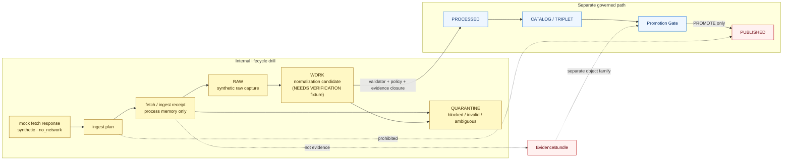

<!-- [KFM_META_BLOCK_V2]
doc_id: kfm://doc/adr-0006-hydrology-synthetic-ingest-lifecycle-boundary
title: ADR-0006: Hydrology Synthetic Ingest Lifecycle Boundary
type: adr
version: v1.0
status: accepted
owners: TODO: architecture steward; hydrology domain steward; release steward; documentation steward
created: NEEDS_VERIFICATION
updated: 2026-05-06
policy_label: internal-draft
related: [
  docs/adr/README.md,
  docs/adr/ADR-0001-schema-home.md,
  docs/adr/ADR-0004-hydrology-first-proof-lane.md,
  docs/adr/ADR-0005-promotion-gate.md,
  docs/runbooks/foundation-strategy.md,
  docs/domains/hydrology/README.md,
  docs/domains/hydrology/architecture/ARCHITECTURE.md,
  fixtures/domains/hydrology/ingest_plans/usgs_water_data.synthetic_raw_capture.plan.json,
  fixtures/domains/hydrology/ingest_plans/usgs_water_data.synthetic_quarantine.plan.json,
  fixtures/domains/hydrology/release_manifests/hydrology_synthetic_streamflow.release_manifest.json,
  fixtures/domains/hydrology/review_records/hydrology_synthetic_streamflow.synthetic_public_release.review_record.json,
  tools/check_no_public_internal_paths.py,
  tools/validators/validate_hydrology_synthetic_release_review.py
]
tags: [
  kfm,
  adr,
  hydrology,
  synthetic-ingest,
  lifecycle-boundary,
  raw,
  work,
  quarantine,
  no-network,
  receipts,
  evidence-boundary,
  promotion-denial,
  fail-closed
]
notes: [
  Expands the prior stub: "Decision: add synthetic lifecycle drill for RAW/WORK/QUARANTINE with no-network ingest simulation and promotion denial. Consequence: lifecycle receipts remain non-evidence and internal-only.",
  Decision is accepted for the synthetic ingest lifecycle boundary; implementation evidence is partial and fixture-backed.",
  Current repo evidence confirms RAW and QUARANTINE synthetic ingest-plan fixtures; WORK lifecycle drill coverage remains NEEDS_VERIFICATION unless a matching fixture or validator is added.",
  This ADR does not authorize live source activation, public release from ingest stages, direct public RAW/WORK/QUARANTINE access, or treating receipts as EvidenceBundles.",
  ADR numbering collisions exist in the repository; use this full file path as the stable identity until ADR indexing is normalized."
]
[/KFM_META_BLOCK_V2] -->

<a id="top"></a>

# ADR-0006: Hydrology Synthetic Ingest Lifecycle Boundary

Synthetic hydrology ingest may exercise `RAW`, `WORK`, and `QUARANTINE`, but it cannot publish, prove evidence, activate live sources, or bypass the Promotion Gate.

<p align="center">
  
  
  
  
  
</p>

<p align="center">
  <a href="#decision">Decision</a> ·
  <a href="#context">Context</a> ·
  <a href="#evidence-basis">Evidence basis</a> ·
  <a href="#boundary-model">Boundary model</a> ·
  <a href="#scope">Scope</a> ·
  <a href="#rules">Rules</a> ·
  <a href="#stage-contract">Stage contract</a> ·
  <a href="#fixture-contract">Fixture contract</a> ·
  <a href="#promotion-denial">Promotion denial</a> ·
  <a href="#validation-and-acceptance">Validation</a> ·
  <a href="#rollback">Rollback</a>
</p>

> [!IMPORTANT]
> **Decision status:** `accepted` for the synthetic ingest lifecycle boundary.  
> **Implementation status:** `partial / fixture-backed`. The repository confirms synthetic RAW and QUARANTINE ingest-plan fixtures. A WORK-stage synthetic drill is decision-scoped but remains **NEEDS_VERIFICATION** until matching fixture, receipt, or validator evidence is present.  
> **Target path:** `docs/adr/ADR-0006-hydrology-synthetic-ingest-lifecycle-boundary.md`.

> [!WARNING]
> This ADR authorizes an **internal, no-network, synthetic ingest drill** only. It does **not** authorize live connector activation, public publication from ingest stages, public reliance on lifecycle receipts, direct UI access to RAW/WORK/QUARANTINE, or treating `FetchReceipt`, `RawCaptureReceipt`, `WorkNormalizationReceipt`, or `SourceDescriptor` objects as public evidence.

---

## Decision

KFM will preserve and expand the hydrology synthetic ingest lifecycle drill as an internal governance test for the early lifecycle boundary:

```text
RAW -> WORK / QUARANTINE
```

The drill may simulate source fetch, raw capture, work normalization, quarantine routing, receipt emission, validation failure, and internal rollback.

It must not cross into:

```text
PROCESSED -> CATALOG / TRIPLET -> PUBLISHED
```

unless a separate, governed validation and promotion path authorizes that transition.

### Accepted boundary

Synthetic ingest plans must declare all of the following:

| Requirement | Required value or behavior |
|---|---|
| Source mode | `synthetic: true` |
| Network posture | `no_network: true` |
| Source-data caveat | `not_official_source_data: true` |
| Public release | `public_release_allowed: false` |
| Evidence boundary | lifecycle receipts are `not EvidenceBundle` |
| Promotion boundary | `PUBLISHED` is prohibited as an ingest target |
| Rollback posture | internal rollback target only |
| Public surface posture | no direct public read of RAW, WORK, QUARANTINE, source connectors, proof-only stores, review-only stores, steward-only stores, or model-runtime output |

### One-sentence rule

Synthetic ingest can prove lifecycle discipline. It cannot prove public truth.

<p align="right"><a href="#top">Back to top ↑</a></p>

---

## Context

KFM’s governing lifecycle is:

```text
RAW -> WORK / QUARANTINE -> PROCESSED -> CATALOG / TRIPLET -> PUBLISHED
```

Hydrology is KFM’s first proof-bearing lane, but the first hydrology work must be public-safe, no-network, synthetic or pinned, and visibly separated from live source activation.

The repository already contains two hydrology ingest-plan fixtures that make this boundary concrete:

| Fixture | Confirmed target stage | Key posture |
|---|---:|---|
| `fixtures/domains/hydrology/ingest_plans/usgs_water_data.synthetic_raw_capture.plan.json` | `RAW` | synthetic, no-network, not official source data, public release disallowed, `PUBLISHED` prohibited |
| `fixtures/domains/hydrology/ingest_plans/usgs_water_data.synthetic_quarantine.plan.json` | `QUARANTINE` | synthetic, no-network, not official source data, schema blocker, `finite_state: BLOCKED`, public release disallowed |

This ADR expands the existing stub into the governance record for that boundary.

### Numbering note

The repository currently has more than one ADR file numbered `ADR-0006`. Until the ADR index is normalized, this document’s stable identity is the full path:

```text
docs/adr/ADR-0006-hydrology-synthetic-ingest-lifecycle-boundary.md
```

If ADR numbering is later repaired, preserve this file as lineage and add a supersession note rather than deleting history.

<p align="right"><a href="#top">Back to top ↑</a></p>

---

## Evidence basis

| Evidence | Status | Supports | Limit |
|---|---:|---|---|
| Current target ADR stub | CONFIRMED repo evidence | Existing decision and consequence: synthetic lifecycle drill with promotion denial; receipts are non-evidence and internal-only. | Stub lacked rationale, scope, validation, fixture mapping, and rollback rules. |
| Hydrology-first ADR | CONFIRMED repo evidence | Hydrology is the first proof-bearing lane and must start with synthetic/no-network proof before live connector activation. | Does not define this ingest-stage boundary in detail. |
| Promotion Gate ADR | CONFIRMED repo evidence | `PUBLISHED` requires governed promotion; file movement or release-manifest presence alone is not publication authority. | Some promotion implementation details remain verification-dependent. |
| Hydrology README | CONFIRMED repo evidence | Hydrology proof lane must preserve RAW → PUBLISHED trust path, source role, evidence closure, map/UI boundaries, and no-network first slice. | Several adjacent paths and owners remain placeholders. |
| Hydrology architecture doc | CONFIRMED repo evidence | Hydrology components include source intake, normalization, validation, proof assembly, and governed delivery. | Documentation evidence, not full runtime proof. |
| RAW ingest-plan fixture | CONFIRMED repo evidence | Synthetic raw-capture plan targets `RAW`, permits `RAW`/`QUARANTINE`, prohibits `PUBLISHED`, and denies public release. | Fixture is synthetic and not official source data. |
| QUARANTINE ingest-plan fixture | CONFIRMED repo evidence | Synthetic quarantine plan targets `QUARANTINE`, records schema blocker, and denies public release. | Fixture is synthetic and not official source data. |
| Synthetic release manifest fixture | CONFIRMED repo evidence | Later synthetic public release artifacts can exist only as separate release objects with prohibited internal source paths and correction/rollback references. | ReleaseManifest is explicitly not EvidenceBundle. |
| Public internal-path checker | CONFIRMED repo evidence | Repository has a validator that checks public fixtures for internal path exposure tokens and restricted sensitivity leakage. | Exact CI enforcement remains NEEDS_VERIFICATION. |
| Review validator and review record | CONFIRMED repo evidence | Synthetic hydrology public release review fixture requires synthetic/no-network/not-official-source-data posture. | Does not prove production review workflow maturity. |
| Directory Rules | CONFIRMED doctrine | `docs/adr/` is a responsibility-root home for architecture decisions; domain names should not become root folders. | Does not prove runtime behavior. |

### Truth labels used here

| Label | Meaning |
|---|---|
| `CONFIRMED` | Verified from current repo connector evidence, supplied doctrine, or current-session file evidence. |
| `PROPOSED` | A recommended path, fixture, validator, gate, or workflow not yet proven complete. |
| `NEEDS_VERIFICATION` | Checkable before acceptance, activation, promotion, or public release. |
| `UNKNOWN` | Not verified from repo files, tests, workflows, logs, dashboards, branch settings, deployment settings, or emitted proof objects. |
| `DENY` / `ABSTAIN` / `ERROR` | System outcomes, not rhetorical labels. |

<p align="right"><a href="#top">Back to top ↑</a></p>

---

## Boundary model

Synthetic ingest lives on the internal side of the trust membrane.



### Boundary statement

A synthetic ingest plan may create or validate internal lifecycle objects. It may not create public authority.

The earliest public-safe surface is downstream of evidence closure and promotion:

```text
ReleaseCandidate -> PromotionDecision -> ReleaseManifest -> governed API / MapLibre / Evidence Drawer / Focus Mode
```

The ingest drill can feed later proof exercises, but it is not itself a proof of public release.

<p align="right"><a href="#top">Back to top ↑</a></p>

---

## Scope

### In scope

| In scope | Required posture |
|---|---|
| Synthetic USGS-style hydrology mock fetch responses | No network, no official source-data claim. |
| RAW capture plan | May target `RAW`; must prohibit `PUBLISHED`. |
| WORK normalization drill | May be added or verified as a synthetic internal stage; remains non-public and non-evidence. |
| QUARANTINE plan | Must record blockers and reason codes where validation fails. |
| Fetch / ingest receipts | Process memory only; not public evidence. |
| Source descriptor reference | May identify the simulated source family; must not become public evidence. |
| Activation-gate references | May show that source activation is gated; must not activate live source. |
| Internal rollback target | May undo or replay synthetic lifecycle state internally. |
| Negative-path tests | Must prove invalid/malformed input does not promote. |
| Public-bypass checks | Must reject internal lifecycle paths in public-facing fixtures and payloads. |

### Out of scope

| Out of scope | Reason |
|---|---|
| Live USGS Water Data, WBD, NHDPlus HR, NFHL, 3DEP, or other connector activation | Requires source descriptors, rights, cadence, schema verification, policy, validators, and review. |
| Public publication from `RAW`, `WORK`, or `QUARANTINE` | Violates KFM lifecycle and Promotion Gate doctrine. |
| Treating `FetchReceipt`, `RawCaptureReceipt`, `WorkNormalizationReceipt`, or `SourceDescriptor` as EvidenceBundle | Receipts are process memory; EvidenceBundle is separate support. |
| Emergency alerting or life-safety use | KFM is not an emergency alert system. |
| Hydrologic simulation products | Require model cards, uncertainty, calibration, validation, and separate review. |
| Direct public reads of source connectors or internal data folders | Public clients use governed APIs and released artifacts. |
| Public claim generation from model-runtime output | AI is interpretive and downstream of evidence, policy, and release state. |

<p align="right"><a href="#top">Back to top ↑</a></p>

---

## Definitions

| Term | Definition in this ADR |
|---|---|
| `Synthetic ingest` | A no-network fixture-driven ingest simulation used to test lifecycle, receipt, validator, and failure behavior. |
| `RAW` | Source-native or simulated source-native capture state. For this ADR, synthetic RAW is internal-only. |
| `WORK` | Normalization or transformation candidate state. For this ADR, synthetic WORK is internal-only and remains NEEDS_VERIFICATION until fixture evidence exists. |
| `QUARANTINE` | Fail-closed hold state for invalid, ambiguous, unsupported, or blocked data. |
| `Lifecycle receipt` | Process-memory object recording fetch, capture, normalization, validation, or routing behavior. It is not evidence by itself. |
| `EvidenceBundle` | Resolved evidence support bundle for consequential claims. It is distinct from receipts, source descriptors, and release manifests. |
| `Promotion denial` | The required result when an ingest-stage object attempts to become public or target `PUBLISHED`. |
| `Internal rollback target` | A rollback or replay target for synthetic lifecycle drill state, not public release rollback. |
| `Public surface` | Public API, map layer, Evidence Drawer, Focus Mode, export, story, dashboard, or any semi-public payload. |

<p align="right"><a href="#top">Back to top ↑</a></p>

---

## Rules

### Rule 1 — Synthetic ingest is internal only

Synthetic ingest plans must stay inside lifecycle drill space until a separate governed release path evaluates them.

```text
allowed ingest targets: RAW, WORK, QUARANTINE
prohibited ingest targets: PROCESSED, CATALOG, TRIPLET, PUBLISHED
```

Current repo fixture evidence confirms `RAW` and `QUARANTINE`. `WORK` is part of the decision boundary but requires fixture or validator confirmation before it can be claimed implemented.

### Rule 2 — No network, no official data

Synthetic hydrology ingest plans must declare:

```json
{
  "synthetic": true,
  "no_network": true,
  "not_official_source_data": true
}
```

A synthetic response must not be represented as USGS, FEMA, WBD, NHDPlus HR, 3DEP, or any other official source data.

### Rule 3 — Public release is denied at ingest

Synthetic ingest plans must declare:

```json
{
  "public_release_allowed": false,
  "prohibited_target_lifecycle_stages": ["PUBLISHED"]
}
```

Any attempt to publish directly from ingest-stage objects must produce `DENY` or `ERROR`.

### Rule 4 — Receipts are not evidence

Lifecycle receipts may support replay and audit, but they are not EvidenceBundles.

Receipts must not be used as direct support for public-facing hydrology claims.

### Rule 5 — SourceDescriptor is not public evidence

A `SourceDescriptor` may identify source role and activation posture. It does not prove the content of a claim.

Public claims still need EvidenceBundle closure.

### Rule 6 — QUARANTINE is a success state for failure behavior

Malformed, ambiguous, blocked, or unsupported synthetic data should route to `QUARANTINE` with reason codes or blockers. That is a successful test of fail-closed behavior.

### Rule 7 — Promotion is separate

If a synthetic release drill later publishes synthetic public-safe artifacts, that must occur through release artifacts, review records, policy decisions, validation reports, correction paths, and rollback targets.

The synthetic release drill does not retroactively make ingest receipts public evidence.

### Rule 8 — Public clients never read internal lifecycle stores

Public and semi-public clients must not read:

```text
data/raw
data/work
data/quarantine
connectors/
review_only/
steward_only/
model_runtime_output/
proof-only stores
```

Public surfaces consume governed release payloads only.

<p align="right"><a href="#top">Back to top ↑</a></p>

---

## Stage contract

| Stage | Synthetic ingest role | Public posture | Required result |
|---|---|---:|---|
| `RAW` | Capture synthetic source-like response and source-path/hash metadata. | Internal only | Allowed as fixture-backed raw capture. |
| `WORK` | Normalize or transform synthetic candidate data. | Internal only | Allowed by this ADR, but current fixture evidence remains NEEDS_VERIFICATION. |
| `QUARANTINE` | Hold malformed, ambiguous, blocked, or policy-failing synthetic input. | Internal only | Required for invalid synthetic ingest cases. |
| `PROCESSED` | Validated artifact after transformation. | Not an ingest target | Requires separate validator/policy/evidence path. |
| `CATALOG` / `TRIPLET` | Catalog or graph projection after closure. | Not an ingest target | Requires separate catalog/provenance closure. |
| `PUBLISHED` | Public or semi-public released surface. | Denied from ingest | Requires Promotion Gate and release state. |

### Stage transition guardrails

| Transition | Decision |
|---|---|
| Synthetic mock response → `RAW` | Allowed if no-network, synthetic, and not official source data. |
| Synthetic mock response → `QUARANTINE` | Required when schema, source-role, evidence, or validator blocker exists. |
| `RAW` → `WORK` | Allowed as internal normalization drill; needs fixture validation for implementation claims. |
| `WORK` → `QUARANTINE` | Required when normalization fails or ambiguity is unresolved. |
| `WORK` → `PROCESSED` | Deferred to separate validation and policy gate. |
| Any ingest-stage object → `PUBLISHED` | Denied. |

<p align="right"><a href="#top">Back to top ↑</a></p>

---

## Fixture contract

The existing RAW and QUARANTINE ingest-plan fixtures establish the minimum contract this ADR protects.

### Required common fields

| Field | Purpose |
|---|---|
| `ingest_plan_id` | Stable synthetic ingest-plan identity. |
| `source_id` | Source family under simulation. |
| `connector_id` | Connector identity under simulation; does not activate live connector. |
| `fetch_plan_id` | Fetch-plan identity for no-network fixture. |
| `fetch_receipt_id` | Receipt identity; process memory only. |
| `source_descriptor_id` | Source descriptor reference; not EvidenceBundle. |
| `activation_gate_decision_ids` | Source activation gate references; live activation remains blocked. |
| `input_object_paths` | Fixture paths only. |
| `input_object_hashes` | Integrity check for fixture input. |
| `synthetic` | Must be `true`. |
| `no_network` | Must be `true`. |
| `not_official_source_data` | Must be `true`. |
| `target_lifecycle_stage` | Must be `RAW`, `WORK`, or `QUARANTINE`. |
| `allowed_target_lifecycle_stages` | Must not include `PUBLISHED`. |
| `prohibited_target_lifecycle_stages` | Must include `PUBLISHED`. |
| `public_release_allowed` | Must be `false`. |
| `evidence_boundary` | Must state that the plan/receipt is not an EvidenceBundle. |
| `required_receipts` | Must name process-memory receipts required for audit. |
| `required_validators` | Must name validation expectations. |
| `blockers` | Required for failure-path visibility. |
| `rollback_target` | Internal target or equivalent internal rollback marker. |
| `finite_state` | Must be explicit and finite. |

### Fixture-specific expectations

| Fixture | Required behavior |
|---|---|
| `usgs_water_data.synthetic_raw_capture.plan.json` | Targets `RAW`, allows `RAW` and `QUARANTINE`, blocks public release, and marks state as ready for synthetic raw capture. |
| `usgs_water_data.synthetic_quarantine.plan.json` | Targets `QUARANTINE`, declares a schema blocker, blocks public release, and marks state as `BLOCKED`. |
| Future WORK fixture | Should target `WORK`, keep public release denied, prove normalization receipt behavior, and route invalid normalization to QUARANTINE. |

<p align="right"><a href="#top">Back to top ↑</a></p>

---

## Promotion denial

Synthetic ingest must actively deny direct publication.

### Deny conditions

| Condition | Expected outcome |
|---|---:|
| Ingest plan targets `PUBLISHED`. | `DENY` |
| Ingest plan sets `public_release_allowed: true`. | `DENY` |
| Ingest plan omits `synthetic: true`. | `DENY` or `ERROR` |
| Ingest plan omits `no_network: true`. | `DENY` |
| Ingest plan omits `not_official_source_data: true`. | `DENY` |
| Public payload references `data/raw`, `data/work`, or `data/quarantine`. | `DENY` |
| Public payload references `FetchReceipt`, `RawCaptureReceipt`, or `WorkNormalizationReceipt` as evidence. | `DENY` |
| Public payload references `SourceDescriptor` as claim evidence. | `DENY` |
| Validator cannot distinguish receipt from EvidenceBundle. | `ERROR` |
| Source activation gate is unresolved. | `ABSTAIN` or `DENY`, depending on policy. |

### Relationship to synthetic public release fixtures

The repository also contains a synthetic hydrology release manifest and review record. Those fixtures demonstrate a later release drill and public-safe synthetic release state. They do not weaken this ADR.

The release drill remains separate because it declares release artifacts, policy decisions, review records, correction paths, rollback targets, public surfaces, and prohibited internal source paths.

### Boundary phrase

Use this phrase when reviewing fixture or validator changes:

```text
Ingest receipts can explain how a synthetic object moved through lifecycle stages; they cannot support a public claim unless later resolved into an EvidenceBundle through a governed release path.
```

<p align="right"><a href="#top">Back to top ↑</a></p>

---

## Public surface boundary

Public and semi-public surfaces must consume governed release payloads only.

| Surface | May consume | Must not consume |
|---|---|---|
| Public API | Published release payloads, LayerManifest, EvidenceBundle, DecisionEnvelope/RuntimeResponseEnvelope. | RAW, WORK, QUARANTINE, connector output, lifecycle receipts as evidence. |
| MapLibre | Released layer manifests and published artifacts. | Internal lifecycle stores or raw feature properties as truth. |
| Evidence Drawer | EvidenceBundle-backed support, limitations, source roles, correction state, release state. | FetchReceipt or SourceDescriptor as public proof. |
| Focus Mode | Released, resolved evidence with citation validation. | Raw synthetic responses, internal receipts, model-runtime output as proof. |
| Exports | Released artifacts with release manifest and correction/rollback lineage. | Internal ingest-plan files or unpublished candidates. |
| Review console | May inspect internal lifecycle artifacts by role. | Must not expose steward-only/internal artifacts as public output. |

> [!CAUTION]
> A fixture can be public-safe only if it is designed as a public artifact. A lifecycle fixture is not public-safe merely because it is synthetic.

<p align="right"><a href="#top">Back to top ↑</a></p>

---

## Validation and acceptance

### Validation matrix

| Check | Must prove | Expected failure behavior |
|---|---|---|
| Synthetic flag validation | Ingest plans are synthetic. | `DENY` or `ERROR` if absent or false. |
| No-network validation | Ingest plans cannot perform live fetch. | `DENY` if network dependence is required. |
| Official-data caveat validation | Fixture is not official source data. | `DENY` if caveat is missing. |
| Target-stage validation | Only `RAW`, `WORK`, or `QUARANTINE` are ingest targets. | `DENY` if `PROCESSED`, `CATALOG`, `TRIPLET`, or `PUBLISHED` is targeted. |
| Public-release validation | `public_release_allowed` is false for ingest. | `DENY` if true. |
| Evidence-boundary validation | Lifecycle receipts are not EvidenceBundles. | `DENY` if receipts are used as evidence; `ERROR` if validator cannot decide. |
| Quarantine validation | Malformed fixture routes to `QUARANTINE` with blockers. | `DENY` if invalid input is treated as promotable. |
| Public internal-path validation | Public fixtures/payloads avoid internal path tokens. | `DENY` or CI failure. |
| Review validation | Synthetic public release review requires synthetic/no-network/not-official-source-data posture. | `ERROR` if required review fields are missing. |
| Promotion validation | Ingest-stage objects do not become `PUBLISHED`. | `DENY` promotion. |

### Acceptance checklist

This ADR is accepted as a boundary decision when:

- [x] Target ADR stub exists and states the synthetic lifecycle drill decision.
- [x] RAW synthetic ingest-plan fixture exists.
- [x] QUARANTINE synthetic ingest-plan fixture exists.
- [x] Ingest plans declare synthetic, no-network, and not-official-source-data posture.
- [x] Ingest plans prohibit `PUBLISHED`.
- [x] Ingest plans deny public release.
- [x] Ingest plans declare evidence boundary as not EvidenceBundle.
- [x] A public internal-path checker exists for public fixture leakage.
- [x] Synthetic release manifest declares prohibited internal source paths, correction path, rollback target, and EvidenceBundle boundary.
- [x] Synthetic review validator/review record exists for synthetic public release fixture posture.
- [ ] WORK-stage synthetic normalization fixture is confirmed or added.
- [ ] ADR index records this path and duplicate ADR-0006 numbering is reconciled.
- [ ] CI enforcement for these checks is verified.
- [ ] Owner/steward and policy label are verified.
- [ ] Promotion Gate implementation is verified against ingest-stage denial cases.

<p align="right"><a href="#top">Back to top ↑</a></p>

---

## Implementation sequence

### Phase 0 — ADR and index hygiene

- [ ] Update `docs/adr/README.md` to include this file.
- [ ] Record duplicate ADR-0006 filenames and decide whether the repo uses lane-specific numbering or needs renumbering.
- [ ] Preserve this file path as stable identity during any renumbering.

### Phase 1 — Fixture completeness

- [x] Keep RAW synthetic ingest plan.
- [x] Keep QUARANTINE synthetic ingest plan.
- [ ] Add or verify WORK synthetic normalization plan.
- [ ] Add invalid WORK-to-QUARANTINE fixture.
- [ ] Add explicit receipt fixture if repo convention requires it.

### Phase 2 — Validator hardening

- [ ] Add or verify ingest-plan schema validation.
- [ ] Add `PUBLISHED` target denial test.
- [ ] Add public-release-allowed denial test.
- [ ] Add receipt-as-evidence denial test.
- [ ] Add source-descriptor-as-evidence denial test.
- [ ] Add no-network guard test.
- [ ] Add public internal-path leakage test to CI if not already enforced.

### Phase 3 — Promotion and release separation

- [ ] Ensure Promotion Gate fixtures include denial for ingest-stage candidates.
- [ ] Ensure synthetic release fixture remains distinct from ingest fixtures.
- [ ] Ensure ReleaseManifest/EvidenceBundle boundary remains visible.
- [ ] Ensure correction and rollback references are required for public-safe synthetic release drills.

### Phase 4 — UI/API guardrails

- [ ] Ensure public API fixtures do not expose ingest plans or receipts.
- [ ] Ensure Evidence Drawer fixture does not use lifecycle receipts as evidence.
- [ ] Ensure Focus Mode fixture cannot answer from raw synthetic response alone.
- [ ] Ensure MapLibre layer fixture consumes released layer manifest only.

<p align="right"><a href="#top">Back to top ↑</a></p>

---

## Consequences

### Positive consequences

- Proves early lifecycle boundary without live connectors.
- Makes failure routing visible through QUARANTINE fixtures.
- Keeps receipts useful for audit without laundering them into public evidence.
- Prevents synthetic source simulation from becoming accidental publication.
- Gives Promotion Gate negative fixtures a concrete hydrology case.
- Protects MapLibre, Evidence Drawer, Focus Mode, and public APIs from internal-stage leakage.
- Creates reusable lifecycle discipline for later domains.

### Costs

- Requires extra fixtures and validators before live hydrology data adds product value.
- Requires maintainers to distinguish ingest drill, proof drill, release drill, and public release.
- Requires ADR index cleanup because ADR numbering is currently ambiguous.
- Requires a WORK-stage fixture or explicit deferral to complete the full RAW/WORK/QUARANTINE drill.

### Tradeoff accepted

KFM accepts slower live-source activation in exchange for a clearer lifecycle boundary that prevents public trust from resting on unreviewed synthetic ingest artifacts.

<p align="right"><a href="#top">Back to top ↑</a></p>

---

## Risks and mitigations

| Risk | Impact | Mitigation |
|---|---|---|
| Synthetic ingest is mistaken for official hydrology data. | False public reliance. | Require `synthetic`, `no_network`, and `not_official_source_data`; keep caveats visible. |
| Receipt becomes public evidence. | Evidence chain is corrupted. | Deny receipt-as-EvidenceBundle and require EvidenceBundle closure for public claims. |
| Ingest plan targets `PUBLISHED`. | Lifecycle law is bypassed. | Deny any ingest-stage promotion or public release. |
| QUARANTINE failure is treated as pipeline failure. | Teams may remove negative-path tests. | Treat QUARANTINE as successful fail-closed behavior for invalid input. |
| WORK stage remains undocumented. | RAW/WORK/QUARANTINE drill is incomplete. | Add a synthetic WORK fixture or mark WORK as deferred in ADR index. |
| ADR-0006 collisions confuse reviewers. | Wrong ADR cited or updated. | Use full path identity and update ADR index. |
| Public fixtures leak internal path tokens. | Public clients could learn or depend on internal lifecycle stores. | Keep and enforce public internal-path checker. |
| Live connector is activated early. | Rights, cadence, schema, or policy gap reaches public surfaces. | Keep live source activation denied until source descriptor and Promotion Gate close. |
| Synthetic release manifest is read as ingest proof. | Release and ingest boundaries collapse. | Document ReleaseManifest/EvidenceBundle/receipt split and keep release drill separate. |

<p align="right"><a href="#top">Back to top ↑</a></p>

---

## Rollback

This ADR governs internal synthetic ingest behavior. Rollback has two layers.

### Internal lifecycle rollback

If a synthetic ingest drill fails or produces misleading state:

1. Revert the fixture or validator change.
2. Preserve the failing fixture if it is useful as a negative test.
3. Record blocker and reason code.
4. Do not delete receipt lineage if the repo stores receipts.
5. Do not promote the candidate.
6. Do not publish correction notices unless a public synthetic release was affected.

### Public synthetic release rollback

If a downstream synthetic public release drill is affected:

1. Verify the release manifest and prior rollback target.
2. Emit rollback receipt or repo-native equivalent.
3. Emit or update correction notice.
4. Remove or update public alias only through the governed release path.
5. Preserve prior release, proof, catalog, review, correction, and rollback artifacts.
6. Update Evidence Drawer, Focus Mode, MapLibre, and API fixtures to show correction state where applicable.

### Revert path for this file

If this ADR expansion is rejected, revert only this ADR file. Do not remove existing hydrology ingest-plan fixtures, hydrology-first ADR, Promotion Gate ADR, release manifest, review record, or public internal-path checker without a separate preservation and migration decision.

<p align="right"><a href="#top">Back to top ↑</a></p>

---

## Open verification backlog

| Item | Status | Closure path |
|---|---:|---|
| ADR owner/steward list | NEEDS_VERIFICATION | Check CODEOWNERS, document registry, or maintainer assignment. |
| Created date for original target stub | UNKNOWN | Use git history if needed. |
| ADR index completeness | NEEDS_VERIFICATION | Update `docs/adr/README.md`. |
| Duplicate ADR-0006 files | NEEDS_VERIFICATION | Inventory ADR filenames and decide numbering policy. |
| WORK-stage synthetic fixture | NEEDS_VERIFICATION | Add or locate matching `WORK` ingest/normalization fixture. |
| Ingest-plan schema | UNKNOWN | Confirm schema file and validator coverage. |
| Receipt schema and receipt storage path | UNKNOWN | Inspect `schemas/`, `contracts/`, `data/receipts/`, and test fixtures. |
| Promotion denial tests for ingest-stage candidates | NEEDS_VERIFICATION | Confirm tests or add invalid fixture. |
| CI enforcement | UNKNOWN | Verify workflow files and branch protection. |
| Public internal-path checker enforcement | NEEDS_VERIFICATION | Confirm workflow or test invokes `tools/check_no_public_internal_paths.py`. |
| Live source activation posture | DENY by default / NEEDS_VERIFICATION | Require source descriptor, rights review, policy, validators, and dry-run release. |
| Public API/UI runtime behavior | UNKNOWN | Verify API/UI tests, deployed routes, logs, and dashboards before claiming. |

<p align="right"><a href="#top">Back to top ↑</a></p>

---

## Alternatives considered

| Alternative | Decision | Reason |
|---|---:|---|
| Let synthetic ingest publish directly. | Rejected | Violates lifecycle law and Promotion Gate doctrine. |
| Treat receipts as evidence. | Rejected | Receipts are process memory, not support bundles. |
| Activate live USGS source during first ingest drill. | Rejected | Source rights, cadence, schema, network behavior, and release policy must be verified first. |
| Skip QUARANTINE fixture. | Rejected | Negative-path behavior is essential to fail-closed governance. |
| Make synthetic release manifest prove ingest maturity. | Rejected | ReleaseManifest, EvidenceBundle, and lifecycle receipts are separate object families. |
| Treat ADR-0006 number as globally unique without checking. | Rejected | Repo evidence shows duplicate ADR-0006 filenames; full path is safer. |
| Start with UI map rendering only. | Rejected | A map can look authoritative while bypassing evidence and lifecycle boundaries. |

<p align="right"><a href="#top">Back to top ↑</a></p>

---

## Supersession and change rules

This ADR may be updated when:

- ADR numbering is normalized;
- WORK-stage fixture evidence is added;
- ingest-plan schema location is accepted;
- receipt schema or receipt storage path changes;
- Promotion Gate outcome grammar changes;
- public internal-path checker changes;
- live hydrology source activation gates are accepted;
- release/correction/rollback behavior changes.

Every material update must preserve:

- `synthetic`, `no_network`, and `not_official_source_data` caveats for synthetic ingest;
- public-release denial for ingest stages;
- receipt/EvidenceBundle separation;
- RAW/WORK/QUARANTINE internal boundary;
- Promotion Gate requirement before `PUBLISHED`;
- public-client governed-interface rule;
- correction and rollback visibility.

<p align="right"><a href="#top">Back to top ↑</a></p>
