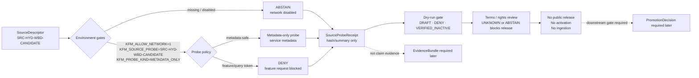

<!-- [KFM_META_BLOCK_V2]
doc_id: kfm://doc/NEEDS-VERIFICATION-ADR-0006-hydrology-wbd-metadata-probe
title: ADR-0006: Hydrology WBD Metadata Probe Gate
type: adr
version: v1.0
status: accepted-with-public-release-blocked
owners: @bartytime4life NEEDS_VERIFICATION; hydrology-domain-steward NEEDS_VERIFICATION; source-steward NEEDS_VERIFICATION; policy-steward NEEDS_VERIFICATION; release-steward NEEDS_VERIFICATION
created: NEEDS_VERIFICATION
updated: 2026-05-06
policy_label: NEEDS-VERIFICATION
related: [
  ./README.md,
  ./ADR-0003-hydrology-source-descriptor-activation-gates.md,
  ./ADR-0005-hydrology-connector-contract-and-offline-simulation.md,
  ../domains/hydrology/README.md,
  ../runbooks/hydrology-wbd-metadata-probe.md,
  ../reports/hydrology-wbd-metadata-probe-inspection.md,
  ../../tools/probe_wbd_metadata.py,
  ../../policy/domains/hydrology/wbd_metadata_probe_policy.yaml,
  ../../data/registry/sources/hydrology/source_descriptors/SRC-HYD-WBD-CANDIDATE.json,
  ../../fixtures/source/hydrology/source_probe_receipt.wbd.no_network.valid.json,
  ../../data/receipts/source_verification/hydrology/probe_receipts/SPR-WBD-NONET-001.json,
  ../../release/dry_runs/hydrology_wbd_metadata_probe_gate.json,
  ../../release/dry_runs/hydrology_wbd_terms_rights_gate.json
]
tags: [kfm, adr, hydrology, wbd, source-probe, metadata-only, no-network, abstain, fail-closed, no-ingestion, public-release-blocked]
notes: [
  Expands the prior ADR-0006 stub: "Adds metadata-only probing gate; never activates public-safe release by probe alone.",
  Decision accepts a metadata-only WBD source verification gate, not live source activation or public release.",
  Default behavior is ABSTAIN with network disabled; optional real metadata probing requires explicit environment gates and remains non-ingesting.",
  WBD probe receipts are process/source-verification memory, not EvidenceBundle claim support, not connector activation, and not publication authority.",
  Owners, created date, policy label, latest workflow status, branch protection, and steward signoff remain NEEDS VERIFICATION."
]
[/KFM_META_BLOCK_V2] -->

<a id="top"></a>

# ADR-0006: Hydrology WBD Metadata Probe Gate

WBD metadata probes may verify source metadata readiness only; they must not fetch features, store geometry, ingest data, activate connectors, or make public release eligible by themselves.

<p align="center">
  
  
  
  
  
</p>

<p align="center">
  <a href="#decision">Decision</a> ·
  <a href="#context">Context</a> ·
  <a href="#scope">Scope</a> ·
  <a href="#metadata-only-boundary">Boundary</a> ·
  <a href="#gate-model">Gate model</a> ·
  <a href="#receipt-and-release-boundary">Receipts</a> ·
  <a href="#enforcement-and-tests">Enforcement</a> ·
  <a href="#rollback">Rollback</a> ·
  <a href="#open-verification-items">Open verification</a>
</p>

> [!IMPORTANT]
> **Accepted decision:** a WBD metadata probe gate may exist for source verification and readiness inspection.  
> **Default runtime posture:** `ABSTAIN` with network disabled.  
> **Public-release posture:** `DENY` / `NOT_ELIGIBLE` until separate rights, source activation, evidence, catalog, proof, review, promotion, correction, and rollback gates pass.

> [!CAUTION]
> A WBD metadata probe is **not** a live connector, **not** a source-data ingest, **not** an EvidenceBundle, **not** public claim support, and **not** permission to publish WBD-derived geometry or attributes.

---

## Decision

KFM accepts a **metadata-only WBD source verification gate** for the hydrology proof lane.

The prior stub is preserved and expanded:

| Prior stub element | Expanded ADR-0006 rule |
|---|---|
| “Adds metadata-only probing gate.” | WBD probing is restricted to service or layer metadata checks only. |
| “Never activates public-safe release by probe alone.” | Probe success cannot enable connector activation, data ingestion, public release, map publication, Evidence Drawer support, or Focus Mode claim support. |
| Implied source verification | Probe receipts are source-verification/process memory only. They remain downstream of source descriptor review and upstream of any future activation decision. |
| Implied safety boundary | Default behavior is `ABSTAIN`; real metadata probing requires explicit environment gates and must still store no feature data or geometry. |

### Normative rules

1. **Metadata only.** WBD probe operations may request service or layer metadata only.
2. **ABSTAIN by default.** Without explicit environment gates, the probe must return `ABSTAIN`.
3. **No feature requests.** Probe paths and query parameters that request features, geometry, object IDs, arbitrary where clauses, tiles, exports, or identify results are prohibited.
4. **No geometry.** Probe results must not store WBD geometry.
5. **No feature attributes.** Probe results must not store WBD feature attributes.
6. **No ingestion.** Probe execution must not move source data into `RAW`, `WORK`, `PROCESSED`, `CATALOG`, `TRIPLET`, or `PUBLISHED`.
7. **Hash/summary only.** If a real metadata response is later permitted, the receipt may store digest, bounded summary, status, content type, size cap, and verification notes; response body storage remains denied unless a later ADR changes the policy.
8. **No release eligibility from probe.** Probe output cannot make a source, layer, artifact, claim, or release public-safe.
9. **No EvidenceBundle substitution.** A `SourceProbeReceipt` cannot stand in for EvidenceBundle support.
10. **No connector activation.** WBD connector activation remains governed by source descriptor activation and connector-contract ADRs.
11. **Fail closed.** Missing rights, unknown terms, invalid URL, denied query token, unexpected response shape, or insufficient review yields `ABSTAIN`, `DENY`, or `ERROR`, not publication.

<p align="right"><a href="#top">Back to top ↑</a></p>

---

## Context

Hydrology is KFM’s first proof-bearing lane. WBD/HUC metadata is useful because it can help verify source identity, service availability, service shape, and source-profile readiness before any live source activation.

That usefulness creates a risk: maintainers could accidentally treat “metadata probe succeeded” as permission to fetch features, store geometries, build public layers, or claim WBD-derived artifacts are release-ready.

This ADR prevents that drift.

### Current repository signal

| Surface | Current role | ADR-0006 interpretation |
|---|---|---|
| `docs/adr/ADR-0006-hydrology-wbd-metadata-probe.md` | Prior two-line stub. | This file expands the decision without changing the core rule. |
| `tools/probe_wbd_metadata.py` | Dry-run/default probe tool with environment gates and `ABSTAIN` behavior. | Supports guarded metadata-probe shape; does not prove a real network probe ran. |
| `policy/domains/hydrology/wbd_metadata_probe_policy.yaml` | Probe policy fixture allowing only metadata-style `f=json` / `f=pjson` query params. | Supports narrow policy intent. |
| `docs/runbooks/hydrology-wbd-metadata-probe.md` | Runbook stub naming required environment gates. | Supports manual operator boundary. |
| `fixtures/source/hydrology/source_probe_receipt.wbd.no_network.valid.json` | No-network WBD `SourceProbeReceipt` fixture. | Confirms `ABSTAIN`, no response body storage, no geometry, no ingestion, and open verification items. |
| `data/receipts/source_verification/hydrology/probe_receipts/SPR-WBD-NONET-001.json` | Registry receipt copy of the no-network probe result. | Confirms source-verification receipt lineage. |
| `release/dry_runs/hydrology_wbd_metadata_probe_gate.json` | Release dry-run gate with `DRAFT`, no ingestion, no geometry, no public release, `DENY`, and `VERIFIED_INACTIVE`. | Confirms probe gate is not public-release authority. |
| `release/dry_runs/hydrology_wbd_terms_rights_gate.json` | Terms/rights dry-run gate with rights `UNKNOWN`, publication `NOT_ELIGIBLE`, policy `DENY`, and activation `VERIFIED_INACTIVE`. | Confirms terms and rights remain blockers. |
| `data/registry/sources/hydrology/source_descriptors/SRC-HYD-WBD-CANDIDATE.json` | Candidate WBD source descriptor with source role `BOUNDARY_CONTEXT`, public release false, and verification `NEEDS_VERIFICATION`. | Confirms WBD remains candidate source context, not public release support. |

### Numbering note

ADR numbers are not enough to identify this decision. Use the full path as the stable identity:

```text
docs/adr/ADR-0006-hydrology-wbd-metadata-probe.md
```

If ADR numbering is normalized later, preserve this file as lineage and add a supersession note instead of deleting decision history.

<p align="right"><a href="#top">Back to top ↑</a></p>

---

## Scope

### In scope

| In scope | Required posture |
|---|---|
| WBD metadata readiness probe | Metadata-only; no feature requests, no geometry, no ingestion. |
| WBD source verification receipt | Process/source-verification memory only. |
| No-network dry-run behavior | Default `ABSTAIN`; deterministic fixture output. |
| Environment-gated optional probe | Requires explicit operator intent and remains non-ingesting. |
| Probe policy | Allows only metadata-safe query forms unless superseded by later ADR. |
| Probe receipt validation | Must prove no geometry, no ingestion, no response-body storage by default. |
| Release dry-run gate | Keeps public release denied and activation inactive. |
| Terms/rights follow-up | Keeps WBD public release blocked while rights and attribution remain unresolved. |
| Negative fixtures | Query/feature endpoint examples must fail or remain invalid. |
| Rollback | Disable probe path, preserve receipts, and keep candidate source inactive. |

### Out of scope

| Out of scope | Reason |
|---|---|
| Live WBD feature fetch | Would cross from metadata verification into source data movement. |
| WBD geometry storage | Requires source activation, rights, schema, evidence, catalog, proof, review, and promotion gates. |
| WBD feature attribute storage | Same as geometry: not allowed by a metadata probe. |
| HUC12 release artifact publication | Promotion must be governed separately. |
| MapLibre layer publication | Renderer is downstream of release state. |
| Evidence Drawer claim support | Requires EvidenceBundle closure, not a probe receipt alone. |
| Focus Mode hydrology answers | AI must remain evidence-subordinate and cite/abstain. |
| Terms/rights approval | Governed by separate terms/rights review artifacts. |
| Connector activation | Governed by source descriptor activation and connector-contract ADRs. |
| Emergency or operational water guidance | KFM is not an emergency alerting system. |

<p align="right"><a href="#top">Back to top ↑</a></p>

---

## Metadata-only boundary

A WBD metadata probe may inspect source metadata. It may not request source features.

### Allowed probe shape

| Concern | Allowed value |
|---|---|
| `source_id` | `SRC-HYD-WBD-CANDIDATE` |
| `probe_kind` | `METADATA_ONLY` |
| `endpoint_type` | `SERVICE_METADATA` or a later schema-approved metadata equivalent |
| Query style | `f=json` or `f=pjson` only |
| Network default | disabled |
| Default outcome | `ABSTAIN` |
| Response body storage | false |
| Response storage posture | hash/summary only |
| Ingestion | false |
| Geometry | false |
| Feature attributes | false |
| Public release | false |

### Prohibited request patterns

These request patterns are prohibited for this ADR boundary and should be rejected or treated as invalid:

```text
/query
/export
/identify
/tile
/FeatureServer/query
f=geojson
returnGeometry=true
outFields=*
objectIds
geometry=
where=
```

### Boundary summary

| Action | ADR-0006 result |
|---|---:|
| Check source descriptor identity | Allowed |
| Dry-run metadata probe with network disabled | Allowed, returns `ABSTAIN` |
| Store receipt showing no ingestion | Allowed |
| Store metadata response digest | Allowed if later real metadata probe is approved |
| Store full metadata body | Denied by default |
| Store WBD geometry | Denied |
| Store WBD feature attributes | Denied |
| Query WBD features | Denied |
| Promote source-derived artifact | Denied |
| Build public map layer from probe | Denied |
| Use probe receipt as claim evidence | Denied |
| Activate WBD connector | Denied by this ADR |

<p align="right"><a href="#top">Back to top ↑</a></p>

---

## Gate model

WBD metadata probing is a source-verification gate, not a publication path.



### Environment gate

A non-dry-run metadata probe must require all of the following:

```bash
KFM_ALLOW_NETWORK=1
KFM_SOURCE_PROBE=SRC-HYD-WBD-CANDIDATE
KFM_PROBE_KIND=METADATA_ONLY
```

If any value is missing or different, the probe must return `ABSTAIN`.

### Dry-run gate

Dry-run mode must return `ABSTAIN` even when source identity is provided:

```bash
python tools/probe_wbd_metadata.py --dry-run --source-id SRC-HYD-WBD-CANDIDATE
```

Expected posture:

```text
ABSTAIN dry-run mode
```

> [!NOTE]
> The command is repository-grounded because `tools/probe_wbd_metadata.py` exists. Latest local execution, CI run success, and branch-protection enforcement still require verification before being claimed as enforced.

<p align="right"><a href="#top">Back to top ↑</a></p>

---

## Receipt and release boundary

A `SourceProbeReceipt` records verification activity. It is not source data, not claim evidence, and not a release artifact.

### SourceProbeReceipt expectations

| Field or concern | Required posture |
|---|---|
| `source_id` | `SRC-HYD-WBD-CANDIDATE` |
| `probe_kind` | `METADATA_ONLY` |
| `network_mode` | `DISABLED` unless a later approved run permits metadata-only network access |
| `validation_result` | `ABSTAIN`, `DENY`, `ERROR`, or later approved finite result |
| `response_body_stored` | false by default |
| `response_body_storage_policy` | `HASH_ONLY` or stricter |
| `no_feature_request_assertion` | true |
| `no_geometry_assertion` | true |
| `no_ingestion_assertion` | true |
| `verification_status` | `NEEDS_VERIFICATION` until reviewed |
| `open_verification_items` | must list unresolved probe/terms/review items |
| `created_by_tool` | expected for generated receipts |
| `tool_version` | expected for generated receipts |

### Release dry-run boundary

A WBD metadata probe dry-run gate must keep public release blocked.

| Gate field | Required posture |
|---|---|
| `release_state` | `DRAFT` |
| `no_live_source_ingestion` | true |
| `no_wbd_geometry_stored` | true |
| `no_wbd_feature_attributes_stored` | true when terms/rights gate is involved |
| `no_public_release` | true |
| `terms_review_status` | unresolved status blocks release |
| `rights_status` | `UNKNOWN` blocks publication eligibility |
| `publication_eligibility_decision` | `NOT_ELIGIBLE` when rights/terms are unresolved |
| `policy_decision` | `DENY` until gates pass |
| `activation_decision` | `VERIFIED_INACTIVE` |
| `rollback_target` | required |
| `correction_route` | required |
| `no_public_internal_path_assertion` | true |
| `no_direct_model_client_assertion` | true |

> [!WARNING]
> A release dry-run JSON file is not public release. It is a gate artifact that should make denial, abstention, inactive activation, correction route, and rollback target inspectable.

<p align="right"><a href="#top">Back to top ↑</a></p>

---

## Relationship to other ADRs

| ADR | Relationship |
|---|---|
| [`ADR-0003-hydrology-source-descriptor-activation-gates.md`](./ADR-0003-hydrology-source-descriptor-activation-gates.md) | WBD remains a candidate source descriptor until activation gates pass. ADR-0006 cannot override source activation. |
| [`ADR-0005-hydrology-connector-contract-and-offline-simulation.md`](./ADR-0005-hydrology-connector-contract-and-offline-simulation.md) | Connector contracts and offline simulation remain blocked/non-live. ADR-0006 does not approve live connector execution. |
| [`ADR-0005-promotion-gate.md`](./ADR-0005-promotion-gate.md) | Publication requires governed promotion. ADR-0006 cannot make a release public by probe success. |
| [`ADR-0004-hydrology-first-proof-lane.md`](./ADR-0004-hydrology-first-proof-lane.md) | Hydrology-first proof lane starts no-network/public-safe. ADR-0006 provides a narrow WBD metadata verification gate within that posture. |

<p align="right"><a href="#top">Back to top ↑</a></p>

---

## Enforcement and tests

### Repository enforcement surfaces

| Surface | Current role | ADR-0006 expectation |
|---|---|---|
| `tools/probe_wbd_metadata.py` | Emits `ABSTAIN` unless environment gates are set; dry run always abstains. | Keep default fail-closed. Expand URL-token enforcement before any real metadata network run is accepted. |
| `policy/domains/hydrology/wbd_metadata_probe_policy.yaml` | Declares metadata-only WBD source ID, probe kind, and allowed query params. | Keep allowed query params narrow and review any expansion. |
| `fixtures/source/hydrology/source_probe_receipt.wbd.no_network.valid.json` | Valid no-network receipt fixture. | Keep assertions for no feature request, no geometry, no ingestion, no body storage, and open verification items. |
| `fixtures/invalid/source_verification/source_probe_receipt_wbd_query_endpoint.json` | Invalid query endpoint example. | Continue to reject feature/query endpoint patterns. |
| `data/receipts/source_verification/hydrology/probe_receipts/SPR-WBD-NONET-001.json` | Registry copy of WBD no-network probe receipt. | Preserve receipt lineage and do not treat it as claim evidence. |
| `release/dry_runs/hydrology_wbd_metadata_probe_gate.json` | Dry-run release gate. | Keep release `DRAFT`, policy `DENY`, activation `VERIFIED_INACTIVE`, no ingestion, and no public release. |
| `release/dry_runs/hydrology_wbd_terms_rights_gate.json` | Terms/rights dry-run gate. | Keep rights/terms unknown or abstain as blockers until reviewed. |
| `.github/workflows/baseline.yml` | Baseline workflow includes WBD dry-run, source probe receipt checks, and related source checks. | Workflow file presence supports intended CI wiring; latest run status and branch protection still need verification. |
| `scripts/validate_all.sh` | Aggregate validation script includes WBD metadata probe dry-run and source-probe checks. | Script presence supports intended local validation; latest execution still needs verification. |

### Expected local checks

Run in a real checkout before claiming enforcement:

```bash
python tools/probe_wbd_metadata.py --dry-run --source-id SRC-HYD-WBD-CANDIDATE
python tools/check_source_probe_receipts.py
python tools/check_source_probes.py
bash scripts/validate_all.sh
```

### Negative cases that must fail, deny, or abstain

| Case | Required outcome |
|---|---|
| Missing environment gates | `ABSTAIN` |
| `KFM_SOURCE_PROBE` not `SRC-HYD-WBD-CANDIDATE` | `ABSTAIN` |
| `KFM_PROBE_KIND` not `METADATA_ONLY` | `ABSTAIN` |
| URL includes `/query` | `DENY` or invalid fixture |
| URL includes `returnGeometry=true` | `DENY` |
| URL includes `outFields=*` | `DENY` |
| URL includes `where=` | `DENY` |
| Probe stores response body | `DENY` unless a later ADR explicitly approves bounded storage |
| Probe stores geometry | `DENY` |
| Probe stores feature attributes | `DENY` |
| Probe output enters lifecycle ingest | `DENY` / incident |
| Probe receipt used as EvidenceBundle support | `DENY` |
| Probe success marks source active | `DENY` |
| Probe success marks release public eligible | `DENY` |

<p align="right"><a href="#top">Back to top ↑</a></p>

---

## Implementation rules

### Adding or changing a WBD metadata probe

1. Confirm `SRC-HYD-WBD-CANDIDATE` remains a candidate source descriptor.
2. Keep `public_release_allowed=false`.
3. Keep geometry and feature attribute storage denied.
4. Keep default network mode disabled.
5. Require explicit environment gates for any non-dry-run metadata probe.
6. Restrict query params to metadata-safe values.
7. Reject feature/query/tile/export/identify endpoints.
8. Emit a `SourceProbeReceipt`.
9. Keep response body storage false by default.
10. Record hash/summary/status only when a later approved real metadata probe occurs.
11. Preserve open verification items.
12. Keep activation `VERIFIED_INACTIVE` unless a separate activation ADR/gate changes it.
13. Keep release `DRAFT` and public release denied.
14. Link correction route and rollback target.
15. Re-run probe, receipt, source, rights, and publication eligibility checks.

### Before any real metadata network probe

A maintainer must verify:

- [ ] source descriptor is reviewed;
- [ ] WBD endpoint is metadata-only;
- [ ] terms/rights review is at least sufficient for metadata verification;
- [ ] probe URL contains no denied feature/query token;
- [ ] response body storage policy is reviewed;
- [ ] no credentials are required;
- [ ] no geometry is requested;
- [ ] no feature attributes are requested;
- [ ] receipt location and schema are accepted;
- [ ] policy decision permits metadata verification only;
- [ ] rollback target exists;
- [ ] public release remains denied.

<p align="right"><a href="#top">Back to top ↑</a></p>

---

## Consequences

### Positive consequences

- WBD source readiness can be inspected without activating a live connector.
- Hydrology proof-lane source verification remains no-network and deterministic by default.
- Probe outputs are auditable without becoming claim evidence.
- Query/feature/geometry drift is explicitly blocked.
- Public release remains downstream of rights, evidence, catalog, proof, review, promotion, correction, and rollback gates.
- The Evidence Drawer and Focus Mode cannot treat metadata probe activity as proof of hydrologic claims.

### Costs and follow-up burden

- Real WBD source work is delayed until terms, rights, attribution, source activation, and metadata policy are resolved.
- Probe receipt schemas and validation scripts must stay aligned.
- Any future body-storage allowance requires a separate reviewed decision.
- Maintainers must distinguish source descriptor, metadata probe, probe receipt, connector contract, EvidenceBundle, ReleaseManifest, and PromotionDecision.
- CI file presence does not remove the need to check actual workflow run status and branch-protection settings.

### Tradeoff accepted

KFM accepts slower source activation in exchange for a safer hydrology proof lane that does not confuse “source metadata was reachable” with “source data is publishable.”

<p align="right"><a href="#top">Back to top ↑</a></p>

---

## Rollback

Rollback for ADR-0006 should be straightforward because WBD metadata probing must not ingest or publish data.

### Rollback rules

1. Disable or remove the probe run path.
2. Leave `KFM_ALLOW_NETWORK` unset or set to a non-allowing value.
3. Keep `public_release_allowed=false` on the source descriptor.
4. Keep activation `VERIFIED_INACTIVE` or blocked.
5. Preserve existing probe receipts and dry-run gates as audit history.
6. Revert or supersede changed policy files.
7. Re-run source probe receipt and publication eligibility checks.
8. Record rollback in the repo-standard rollback card, verification backlog, or source verification register.
9. If any WBD response body, geometry, feature attribute, or source-derived artifact was stored by mistake, treat it as an incident and move through correction/quarantine rather than deleting audit history.

### Revert path for this file

If this ADR expansion is rejected, revert only this file. Do not delete WBD source descriptors, probe tools, receipts, dry-run gates, source verification registers, policy files, or reports without a separate preservation and migration decision.

<p align="right"><a href="#top">Back to top ↑</a></p>

---

## Acceptance checklist

ADR-0006 is accepted as a metadata-probe boundary decision. Implementation maturity can be upgraded only when the following are verified.

- [x] Target ADR path exists.
- [x] WBD candidate source descriptor exists.
- [x] Metadata probe tool exists.
- [x] Probe policy file exists.
- [x] No-network WBD probe receipt fixture exists.
- [x] Registry WBD probe receipt exists.
- [x] WBD metadata probe dry-run gate exists.
- [x] WBD terms/rights dry-run gate exists.
- [x] Baseline workflow includes WBD metadata probe dry run.
- [x] Aggregate validation script includes WBD metadata probe dry run.
- [ ] ADR index includes this file with path-specific identity.
- [ ] ADR numbering collision/duplication is documented or normalized.
- [ ] Latest local probe dry-run output is attached or linked.
- [ ] Latest `check_source_probe_receipts.py` output is attached or linked.
- [ ] Latest `check_source_probes.py` output is attached or linked.
- [ ] Latest CI workflow run proves the checks pass.
- [ ] Branch protection or required status checks are verified.
- [ ] Source terms and rights are reviewed beyond `UNKNOWN` / `ABSTAIN`.
- [ ] Attribution posture is verified.
- [ ] Any future real metadata probe stores only approved receipt fields.
- [ ] Public API/UI/Focus negative tests prove probe receipts cannot become claim evidence.
- [ ] Promotion Gate negative tests prove probe success cannot become public release eligibility.

<p align="right"><a href="#top">Back to top ↑</a></p>

---

## Open verification items

| Item | Why it matters | Current posture |
|---|---|---|
| ADR created date | Required for complete metadata. | NEEDS VERIFICATION |
| ADR owner/steward list | Needed for accountability and approval. | NEEDS VERIFICATION |
| Policy label | Required before publication classification. | NEEDS VERIFICATION |
| ADR index update | Maintainers need discoverable decision status. | NEEDS VERIFICATION |
| ADR numbering collision | Path identity must remain unambiguous. | NEEDS VERIFICATION |
| Latest probe dry-run result | File presence is not execution proof. | NEEDS VERIFICATION |
| Latest CI run status | Workflow file is not proof of passing enforcement. | NEEDS VERIFICATION |
| Branch protection | Required before claiming checks are mandatory. | UNKNOWN |
| WBD terms and rights | Rights `UNKNOWN` blocks publication eligibility. | NEEDS VERIFICATION |
| Attribution requirements | Attribution status remains unresolved. | NEEDS VERIFICATION |
| Real metadata endpoint review | Required before any network metadata probe. | NEEDS VERIFICATION |
| Response body retention policy | Default is no body storage; any change requires review. | DENY by default |
| URL deny-token enforcement | Tool lists denied tokens; live enforcement needs verification before network use. | NEEDS VERIFICATION |
| Public surface negative tests | Needed to prove probe receipts cannot leak into claims/UI/AI. | NEEDS VERIFICATION |

<p align="right"><a href="#top">Back to top ↑</a></p>

---

## Alternatives considered

| Alternative | Decision | Reason |
|---|---|---|
| Treat WBD metadata probe success as source activation. | Rejected | Source activation requires descriptor, rights, policy, review, and activation decision. |
| Allow WBD `/query` requests under metadata probe. | Rejected | Query requests can cross into feature/attribute/geometry retrieval. |
| Store full metadata response body by default. | Rejected | Body retention needs explicit storage policy, size cap, review, and rights posture. |
| Permit WBD geometry fetch in the metadata probe. | Rejected | Geometry fetch is source data movement, not metadata verification. |
| Use probe receipt as EvidenceBundle support. | Rejected | Receipts are process/source-verification memory, not claim evidence. |
| Allow public map layer publication after metadata probe. | Rejected | Map publication requires release artifacts and governed promotion. |
| Let Focus Mode explain WBD claims from probe data. | Rejected | Focus Mode must be EvidenceBundle-bound and citation-validated. |
| Delete failed probe receipts. | Rejected | Receipts preserve audit and correction lineage. |
| Block all probe work forever. | Rejected | Metadata-only verification is useful when it is bounded, auditable, and non-ingesting. |

<p align="right"><a href="#top">Back to top ↑</a></p>

---

<details>
<summary><strong>Appendix A — Maintainer checklist for WBD metadata probe changes</strong></summary>

Use this checklist before changing WBD metadata probe behavior.

- [ ] Confirm the change affects metadata verification only.
- [ ] Confirm source ID is `SRC-HYD-WBD-CANDIDATE`.
- [ ] Confirm `probe_kind` is `METADATA_ONLY`.
- [ ] Confirm no feature/query/tile/export/identify endpoint is used.
- [ ] Confirm no `returnGeometry=true`.
- [ ] Confirm no `outFields=*`.
- [ ] Confirm no `where=` feature filter.
- [ ] Confirm no geometry storage.
- [ ] Confirm no feature attribute storage.
- [ ] Confirm response body storage remains false or has a separate reviewed decision.
- [ ] Confirm receipt captures no-ingestion assertion.
- [ ] Confirm source descriptor remains `public_release_allowed=false`.
- [ ] Confirm release dry-run keeps `no_public_release=true`.
- [ ] Confirm terms/rights status does not silently upgrade publication eligibility.
- [ ] Confirm activation remains inactive unless a separate activation decision exists.
- [ ] Run the dry-run probe.
- [ ] Run source probe receipt checks.
- [ ] Run publication eligibility checks.
- [ ] Link validation output in the PR.
- [ ] Update this ADR only if the decision boundary changes.

</details>

<details>
<summary><strong>Appendix B — Glossary</strong></summary>

| Term | Meaning in this ADR |
|---|---|
| `WBD` | Watershed Boundary Dataset source family used here as hydrologic-unit boundary context. |
| `SRC-HYD-WBD-CANDIDATE` | Candidate WBD source descriptor ID for hydrology source verification. |
| `metadata-only probe` | Probe restricted to service/layer metadata, not feature data or geometry. |
| `SourceProbeReceipt` | Receipt recording source verification activity; process memory, not claim evidence. |
| `ABSTAIN` | Finite outcome used when network/env gates are disabled or support is insufficient. |
| `DENY` | Finite outcome used when policy or safety rules block a requested action. |
| `VERIFIED_INACTIVE` | Activation decision posture showing the source remains inactive after verification gate handling. |
| `BOUNDARY_CONTEXT` | Source role indicating WBD supports hydrologic boundary context, not observed hydrologic measurements. |
| `EvidenceBundle` | Required evidence-support object for public claims; cannot be replaced by probe receipt. |
| `PromotionDecision` | Governed release decision; cannot be inferred from metadata probe success. |

</details>

<p align="right"><a href="#top">Back to top ↑</a></p>
