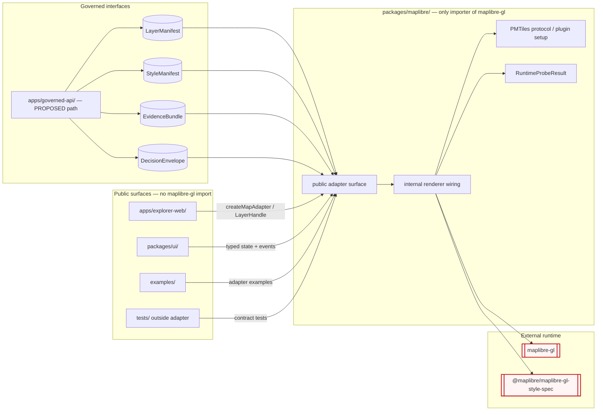

<!-- [KFM_META_BLOCK_V2]
doc_id: kfm://adr/0006
title: "ADR-0006 — MapLibre Boundary: Only MapLibreAdapter Imports MapLibre"
type: standard
version: v1.1
status: draft
owners: OWNER_TBD(map-shell-owner), OWNER_TBD(docs-steward)
created: 2026-05-10
updated: 2026-05-15
policy_label: public
related:
  - docs/doctrine/directory-rules.md            # §11 UI and Map Roots, §13.3
  - docs/architecture/map-shell.md              # PROPOSED canonical map-shell doctrine
  - docs/architecture/contract-schema-policy-split.md
  - docs/adr/ADR-0001-schema-home.md            # schema-home context; not amended here
tags: [kfm, adr, map-shell, renderer-boundary, dependency-rule, maplibre]
notes:
  - "Updated 2026-05-15 to clarify evidence boundary, Directory Rules basis, enforcement gates, and acceptance checklist."
  - "Repo not mounted in this session — implementation paths, tooling, package names, and CI behavior are PROPOSED / NEEDS VERIFICATION."
  - "Cesium parity is acknowledged but governed by a sibling ADR, not this one."
[/KFM_META_BLOCK_V2] -->

# ADR-0006 — MapLibre Boundary: Only `MapLibreAdapter` Imports MapLibre

> **One rule:** No module in KFM imports `maplibre-gl` or a sibling `maplibre-*` runtime package **except** the `MapLibreAdapter` package. Everything else talks to the map through the adapter's typed, KFM-shaped surface.

[](#1-status)
[](#3-context)
[](#5-scope)
[](#7-enforcement)
[](#1-status)
[](#10-migration--rollback)

**Quick jump:** [Status](#1-status) · [Summary](#2-summary) · [Context](#3-context) · [Decision](#4-decision) · [Scope](#5-scope) · [Boundary contract](#6-boundary-contract) · [Enforcement](#7-enforcement) · [Consequences](#8-consequences) · [Alternatives](#9-alternatives-considered) · [Migration & rollback](#10-migration--rollback) · [Open questions](#11-open-questions) · [References](#12-references)

---

## 0. ADR Header

| Field | Value |
|---|---|
| **ID** | `ADR-0006` |
| **Title** | MapLibre Boundary: only `MapLibreAdapter` imports MapLibre |
| **ADR status** | `proposed` |
| **Document status** | `draft` |
| **Date** | 2026-05-10 |
| **Last updated** | 2026-05-15 |
| **Authors / drivers** | `OWNER_TBD(map-shell-owner)` |
| **Reviewers required** | Docs steward · Map-shell owner · At least one subsystem owner from `apps/explorer-web/` |
| **Proposed target path** | `docs/adr/ADR-0006-maplibre-boundary.md` — **PROPOSED / NEEDS VERIFICATION** |
| **Supersedes** | — |
| **Superseded by** | — |
| **Amends Directory Rules** | No. This ADR operationalizes §11 "UI and Map Roots" and §13.3 "competing shell homes" without changing root policy. |
| **Related ADRs** | `ADR-0001` schema-home context; not amended here. |
| **Primary affected roots** | `apps/`, `packages/`, `docs/`, `tests/`, and possibly `.github/` / `tools/` for enforcement — all presence remains **NEEDS VERIFICATION**. |

> [!IMPORTANT]
> **Evidence boundary:** This ADR is a doctrine-grounded architecture decision. Current implementation depth remains **UNKNOWN** until a mounted KFM repository, imports, package manifests, tests, workflows, and runtime behavior are inspected. Any path, package name, tool, or CI detail below is **PROPOSED** unless explicitly marked otherwise.

> **Template conformance.** This ADR keeps the fields required by Directory Rules §2.4: `id`, `title`, `status`, `date`, `context`, `decision`, `consequences`, and `alternatives`. Sections 5–11 elaborate on those fields; they do not replace them.

[Back to top](#adr-0006--maplibre-boundary-only-maplibreadapter-imports-maplibre)

---

## 1. Status

**ADR status:** `proposed`  
**Implementation status:** **UNKNOWN**  
**Promotion rule:** promote to `accepted` only after the verification checklist below is satisfied in a mounted repo.

| Requirement before acceptance | Label | Acceptance evidence |
|---|---:|---|
| Confirm `packages/maplibre/` exists, or create it in the same change set with Directory Rules-compatible placement. | NEEDS VERIFICATION | `git ls-tree` / repo inspection, package manifest, README. |
| Confirm `apps/explorer-web/` and `packages/ui/` import the adapter rather than `maplibre-gl` directly. | NEEDS VERIFICATION | Import inventory plus build/test evidence. |
| Confirm no other package, app, example, script, or non-adapter test imports `maplibre-gl` or `@maplibre/maplibre-gl-style-spec`. | NEEDS VERIFICATION | Lint/dependency rule output or custom validator receipt. |
| Confirm the workspace package name (`@kfm/maplibre` shown illustratively) matches the actual monorepo convention. | NEEDS VERIFICATION | Package manifest and import usage. |
| Confirm CI tooling choice: ESLint, dependency-cruiser, custom validator, or equivalent. | NEEDS VERIFICATION | Workflow or command evidence. |
| Confirm `docs/architecture/map-shell.md` and `packages/maplibre/README.md` link this ADR after acceptance. | NEEDS VERIFICATION | Repo links and docs review. |

Until those items are verified, treat **paths, file names, tool names, package names, and `package.json` contents in this ADR as PROPOSED**.

[Back to top](#adr-0006--maplibre-boundary-only-maplibreadapter-imports-maplibre)

---

## 2. Summary

KFM doctrine treats **MapLibre as a downstream renderer and interaction runtime, not a sovereign truth source**. The KFM trust membrane requires public surfaces to consume governed interfaces, released artifacts, `EvidenceBundle` resolution, `DecisionEnvelope` / finite-outcome responses, `LayerManifest`, `StyleManifest`, and policy-reviewed release state — never raw renderer state, raw `Map` instances, or framework-specific event objects leaked across module boundaries.

This ADR makes that doctrine **mechanical**:

> **Only `packages/maplibre/` — the proposed `MapLibreAdapter` package — may import `maplibre-gl` or sibling runtime packages. All other code imports the adapter's typed surface.**

The adapter becomes the **single seam** at which renderer concerns are bound. The rest of the system stays renderer-agnostic by construction.

### 2.1 Why this matters for KFM trust law

| KFM concern | Boundary effect |
|---|---|
| Evidence-first claims | Clicks and map events resolve to KFM-shaped `EvidenceRef` / `EvidenceBundle` flows, not raw renderer event objects. |
| Policy-aware publication | `addSource`, `addLayer`, and protocol registration become one enforceable gate instead of scattered caller behavior. |
| Map-first UI | The shell can remain map-centered without letting the map runtime become the truth store. |
| Reversibility | A renderer migration touches one adapter seam, not every app component. |
| Auditability | Enforcement can be tested with import rules, dependency rules, and adapter contract tests. |

[Back to top](#adr-0006--maplibre-boundary-only-maplibreadapter-imports-maplibre)

---

## 3. Context

### 3.1 Directory Rules basis

Directory Rules §11 names the clean UI/map layout as:

```text
apps/explorer-web/
packages/ui/
packages/maplibre/
packages/cesium/
docs/architecture/map-shell.md
data/registry/layers/
```

It also states that MapLibre is the disciplined 2D renderer and interaction runtime, not the truth store, publication authority, policy authority, citation authority, or AI authority. Directory Rules §13.3 identifies competing shell homes (`ui/`, `web/`, `apps/explorer-web/`, `packages/ui/`) as drift and names `packages/maplibre/` as the renderer package in the fix.

**Placement consequence:** this ADR does not create a new root and does not create a parallel schema, policy, release, receipt, proof, registry, or source home. It uses the existing responsibility roots:

| Responsibility | Proposed home | Status |
|---|---|---:|
| Deployable web shell | `apps/explorer-web/` | NEEDS VERIFICATION |
| Shared UI components | `packages/ui/` | NEEDS VERIFICATION |
| MapLibre renderer adapter | `packages/maplibre/` | PROPOSED / NEEDS VERIFICATION |
| Map shell doctrine | `docs/architecture/map-shell.md` | PROPOSED / NEEDS VERIFICATION |
| ADR record | `docs/adr/ADR-0006-maplibre-boundary.md` | PROPOSED / NEEDS VERIFICATION |
| Import-boundary validator | `.github/`, `tools/validators/`, or package lint config | PROPOSED / NEEDS VERIFICATION |

### 3.2 Doctrinal anchors

| Source | Evidence status | Statement used by this ADR |
|---|---:|---|
| Directory Rules §11, §13.3 | CONFIRMED doctrine | UI/map roots should separate deployable shell, shared UI, MapLibre renderer, and optional Cesium renderer; MapLibre is not a truth authority. |
| Master MapLibre Components-Functions-Features, Executive Determination | CONFIRMED doctrine / UNKNOWN implementation | MapLibre remains a downstream renderer and interaction runtime; tiles, styles, popups, screenshots, graph projections, and AI answers are carriers, not sovereign truth. |
| Master MapLibre renderer-boundary idea records | LINEAGE / PROPOSED implementation | Sidecar verification before `addSource`, no direct DB handles in map UI, PMTiles protocol governance, and plugin admission are renderer-boundary concerns. |
| KFM trust membrane doctrine | CONFIRMED doctrine | Public clients use governed APIs and released artifacts; raw, work, quarantine, candidate, and direct-model paths are not normal public routes. |
| KFM Components Pass 11, E.2 | LINEAGE / NEEDS VERIFICATION | Preserved as existing ADR context for MapLibre client discipline; direct source section should be rechecked before acceptance. |

### 3.3 Operational problem this ADR solves

When `maplibre-gl` is importable from anywhere, three failure modes follow:

1. **Renderer types leak upward.** UI components type their props in terms of `maplibregl.Map`, `LngLatBoundsLike`, or `MapMouseEvent`. The "renderer-agnostic" property of the upper layers becomes a fiction.
2. **Trust membrane bypass.** A component can call `map.addSource(...)` against an unverified PMTiles URL, unreleased layer, or policy-unsafe source because the renderer handle is in reach.
3. **Migration cost.** Future support for MLT, MapLibre Native, deck.gl interop, a server-side preview renderer, or a Cesium-parity shell requires touching every importer instead of one adapter.

### 3.4 What is currently uncertain

| Item | Label |
|---|---:|
| Mounted-repo presence of `packages/maplibre/` | NEEDS VERIFICATION |
| Current importers of `maplibre-gl` across the tree | UNKNOWN |
| Presence of an existing `MapLibreAdapter`, `MapShell`, `MapWrapper`, or package-local map wrapper | UNKNOWN |
| Choice of enforcement tool: ESLint `no-restricted-imports`, dependency-cruiser, custom validator, or equivalent | PROPOSED |
| Whether `packages/cesium/` exists today and how it is structured | UNKNOWN |
| Whether `apps/api/` and `apps/governed-api/` both exist and how layer/evidence APIs are split | UNKNOWN |

[Back to top](#adr-0006--maplibre-boundary-only-maplibreadapter-imports-maplibre)

---

## 4. Decision

**KFM adopts a single-importer rule for the MapLibre runtime.** The rule has four parts.

### 4.1 The single-importer rule

> **Only the `MapLibreAdapter` package — proposed canonical home `packages/maplibre/` per Directory Rules §11 — MAY import `maplibre-gl` or a `maplibre-*` runtime package. All other packages, apps, viewer templates, examples, scripts, and non-adapter tests MUST import only the adapter's published surface.**

### 4.2 The adapter is the seam

`packages/maplibre/` exposes a KFM-shaped surface. The public entry point is **PROPOSED** as `packages/maplibre/src/index.ts`; the exact package layout must follow mounted-repo convention when verified.

| Surface | Adapter responsibility | Raw renderer leakage allowed? |
|---|---|---:|
| Lifecycle | `createMapAdapter(opts) -> MapLibreAdapter`, `destroy()` | No |
| Layer binding | `addLayer(LayerManifest, StyleManifest)`, `removeLayer(layerId)` with sidecar / manifest checks wired before runtime binding | No |
| Camera and time | `setView`, `setBounds`, `setTimeSnapshot(releasedSnapshotId)` | No |
| Events | `onLayerClick(EvidenceRef)`, `onCameraSettled(CameraState)`, KFM-shaped source/load events | No |
| Runtime health | `RuntimeProbeResult`, stale/degraded/denied indicators, renderer capability state | No |
| Plugin/protocol registration | PMTiles protocol and plugin setup performed once inside the adapter | No |

Any future renderer path — MapLibre Native, MLT-first renderer, server-side preview renderer, or a constrained overlay strategy — implements the same surface or lands behind a typed strategy inside the renderer package. Consumers remain unaffected.

### 4.3 Forbidden imports (illustrative)

```ts
// ❌ Forbidden anywhere outside packages/maplibre/
import maplibregl from "maplibre-gl";
import type { Map, LngLatBoundsLike } from "maplibre-gl";
import { Protocol } from "maplibre-gl";                    // protocol registration belongs in the adapter
import * as Style from "@maplibre/maplibre-gl-style-spec"; // style-spec runtime/types belong in the adapter boundary
```

### 4.4 Permitted import (illustrative)

```ts
// ✅ Permitted in apps/explorer-web/, packages/ui/, examples/, etc.
import { createMapAdapter, type LayerHandle, type CameraState } from "@kfm/maplibre";
//                                                                    ^^^^^^^^^^^^^
//                                                                    PROPOSED package name
//                                                                    NEEDS VERIFICATION against
//                                                                    actual workspace package id
```

> [!IMPORTANT]
> The public package name (`@kfm/maplibre` shown above) is **PROPOSED**. It MUST be aligned with the project's actual workspace package naming convention before this ADR is accepted.

[Back to top](#adr-0006--maplibre-boundary-only-maplibreadapter-imports-maplibre)

---

## 5. Scope

### 5.1 In scope

- Web client / `MapLibre GL JS` runtime imports in TypeScript and JavaScript source.
- Style-spec imports from `@maplibre/maplibre-gl-style-spec` when they are used as runtime or TypeScript dependencies in app/UI code.
- PMTiles protocol registration (`maplibregl.addProtocol`) and plugin setup that depends on the renderer runtime.
- Re-exports: a barrel file that re-exports `maplibre-gl` from outside `packages/maplibre/` is treated as a violation.
- Non-adapter tests and examples: they test or demonstrate the adapter surface unless they live inside the adapter package.

### 5.2 Out of scope

- **Cesium / 3D.** A parallel rule for `cesium` and `packages/cesium/` is expected as a separate ADR. This ADR intentionally does not amend that boundary; it only notes that Cesium MUST consume the same `EvidenceBundle` and `DecisionEnvelope` trust posture as MapLibre.
- **Server-side tile build, PMTiles generation, COG processing.** Those live under `pipelines/`, `tools/`, or `packages/` outside the renderer adapter and should not import `maplibre-gl`.
- **Style JSON authoring and storage.** Style JSON is data, not a runtime import. Its home is governed by tile/style artifact rules, release manifests, and registry policy, not this ADR.
- **Schema definitions.** `schemas/contracts/v1/...` may define style/layer shapes without importing runtime packages. Type imports from style-spec packages in schema tooling remain **OPEN / NEEDS VERIFICATION**.
- **Mobile / MapLibre Native.** PROPOSED to be governed by a sibling adapter package or strategy if and when mobile lands.

### 5.3 Boundary diagram



> **Diagram status:** Doctrine-grounded, implementation **PROPOSED**. Boxes outside `packages/maplibre/` are constrained by Directory Rules §11. Internal file names inside the adapter are intentionally abstract until repo inspection confirms package layout.

[Back to top](#adr-0006--maplibre-boundary-only-maplibreadapter-imports-maplibre)

---

## 6. Boundary Contract

### 6.1 What `MapLibreAdapter` MUST do

1. **Verify before bind.** No `addSource`, `addLayer`, or `addProtocol` call occurs without inputs shaped as released / governed `LayerManifest` and `StyleManifest` objects or an explicitly denied/abstained envelope.
2. **Refuse raw handles.** The adapter MUST NOT return `maplibregl.Map`, renderer `Source`, renderer `Layer`, or raw renderer events to callers. It returns KFM-shaped opaque handles.
3. **Translate events into KFM shapes.** Mouse, camera, source, and load events are mapped to `EvidenceRef`, `CameraState`, `RuntimeProbeResult`, or other KFM-owned event types. Raw renderer events do not cross the seam.
4. **Surface release state.** The adapter renders released, stale, degraded, denied, and error states passed by governed services. It does not decide truth or release.
5. **Expose runtime health separately from truth.** `RuntimeProbeResult` belongs to rendering/runtime state. It MUST NOT be treated as evidence for a domain claim.
6. **Own renderer-dependent plugins and protocols.** PMTiles protocol registration and any renderer plugin admission live inside the adapter package.
7. **Support contract tests.** A fake adapter or mock surface MUST be possible so upper layers can test map flows without importing the renderer.

### 6.2 What `MapLibreAdapter` MUST NOT do

| MUST NOT | Reason |
|---|---|
| Read from `data/raw/`, `data/work/`, or `data/quarantine/`. | Trust membrane: renderer consumes governed inputs only. |
| Read canonical/internal stores directly as a normal public path. | Public clients use governed APIs, released artifacts, and evidence resolution. |
| Call arbitrary public tile/data URLs that were not provided through governed configuration. | Tile delivery is governed by tile/style artifact policy and release state. |
| Cache, persist, or originate authority decisions. | The adapter is a renderer; truth, policy, review, and release are upstream responsibilities. |
| Re-export `maplibre-gl` symbols or style-spec symbols to consumers. | Re-exporting re-opens the boundary at a second hop. |
| Convert generated language, popups, screenshots, or renderer state into source truth. | AI, UI text, and visual artifacts are downstream carriers, not sovereign truth. |

### 6.3 What callers MUST do

| Caller surface | Obligation |
|---|---|
| `apps/explorer-web/` | Import only from the adapter package. Pass governed responses, `LayerManifest`, `StyleManifest`, and released/candidate state; never pass raw URLs as authority. |
| `packages/ui/` | Render adapter-issued state and KFM event objects. MUST NOT cast adapter handles to `maplibregl.Map`. |
| `examples/` | Demonstrate adapter usage. Examples that touch `maplibre-gl` directly belong inside `packages/maplibre/` examples or tests. |
| `tests/` outside adapter | Test the adapter surface or fake adapter. Renderer-internal tests live with the adapter. |
| `docs/` | Document the boundary and link this ADR; docs do not become the enforcement mechanism. |

### 6.4 Contract shape guardrails

The adapter public surface SHOULD use KFM-owned types even when they mirror renderer concepts.

| KFM-owned type | Purpose | Notes |
|---|---|---|
| `LayerHandle` | Opaque handle for a bound, governed layer. | No renderer ID leakage beyond KFM layer ID. |
| `CameraState` | Serializable camera / viewport state. | Safe for URL state, review records, and story nodes. |
| `MapTimeState` | Current released time snapshot / temporal filter. | Must distinguish UI state from evidence time. |
| `RuntimeProbeResult` | Renderer capability / health / stale state. | Runtime health only; not evidence for domain claims. |
| `MapInteractionEvent` | KFM-shaped event emitted by adapter. | Carries `EvidenceRef` or candidate feature identity, not raw renderer event. |

All names are **PROPOSED** unless already present in the mounted repo.

[Back to top](#adr-0006--maplibre-boundary-only-maplibreadapter-imports-maplibre)

---

## 7. Enforcement

All enforcement mechanisms are **PROPOSED** until a mounted repo confirms the package manager, lint stack, test stack, and CI workflow conventions. The rule should be enforced in three layers, from fastest local feedback to strongest structural guard.

### 7.1 Linter rule (first enforceable gate)

ESLint `no-restricted-imports` configured at the workspace root, scoped by path:

```jsonc
// PROPOSED — exact config file, package manager, and tool version NEED VERIFICATION.
{
  "overrides": [
    {
      "files": ["**/*.{ts,tsx,js,jsx}"],
      "excludedFiles": ["packages/maplibre/**"],
      "rules": {
        "no-restricted-imports": ["error", {
          "patterns": [
            {
              "group": ["maplibre-gl", "maplibre-gl/*"],
              "message": "Only packages/maplibre/ may import maplibre-gl. See ADR-0006."
            },
            {
              "group": ["@maplibre/maplibre-gl-style-spec", "@maplibre/maplibre-gl-style-spec/*"],
              "message": "Style-spec runtime/types must stay behind the MapLibre adapter boundary. See ADR-0006."
            }
          ]
        }]
      }
    }
  ]
}
```

### 7.2 Dependency graph rule (structural)

A dependency-cruiser rule, custom `tools/validators/` script, or equivalent gate MUST fail if a non-adapter file resolves an import to `maplibre-gl` or a forbidden `@maplibre/*` runtime package.

**Why a second gate matters:** lint comments, dynamic imports, generated files, and editor-only settings can bypass a linter. A dependency graph or source validator gives the rule a repo-wide structural check.

### 7.3 `package.json` discipline

Only `packages/maplibre/package.json` may list `maplibre-gl` and renderer-dependent `@maplibre/*` packages as `dependencies`.

| Package manifest location | `maplibre-gl` allowed? | Notes |
|---|---:|---|
| `packages/maplibre/package.json` | Yes | The single importer / adapter package. |
| `apps/explorer-web/package.json` | No | Consumes adapter package. |
| `packages/ui/package.json` | No | Consumes adapter types only. |
| Root workspace manifest | NEEDS VERIFICATION | May hold workspace tooling only; must not normalize consumer runtime import. |
| Test/example package manifests | No, unless inside adapter package | Direct renderer examples belong inside the adapter package. |

Exact dependency/devDependency/peerDependency handling depends on the real workspace package manager and must be verified before acceptance.

### 7.4 What "violation" looks like in PR review

> [!WARNING]
> A PR that adds `import ... from "maplibre-gl"` outside `packages/maplibre/` MUST be rewritten to use the adapter, moved inside the adapter package, or paired with a superseding ADR. There is no "temporary direct import" exception.

### 7.5 Exception process

Exceptions are intentionally hard:

1. Record the proposed exception in `docs/registers/DRIFT_REGISTER.md` or the repo's equivalent drift register. **PROPOSED path.**
2. Explain why the adapter surface cannot express the behavior.
3. Either extend the adapter contract or open a superseding ADR.
4. Keep any temporary compatibility path out of normal public routes.
5. Add a rollback / removal date or acceptance gate.

### 7.6 Contract tests

The implementation PR SHOULD add tests that prove:

- a consumer can render or simulate the map shell using a fake adapter;
- no raw renderer handle is visible in public adapter types;
- `addLayer` / `addSource` pathways require governed manifest-shaped inputs;
- denied, stale, degraded, and error states render without directly importing `maplibre-gl` in the caller;
- direct imports fail in CI.

[Back to top](#adr-0006--maplibre-boundary-only-maplibreadapter-imports-maplibre)

---

## 8. Consequences

### 8.1 Positive

- **Trust membrane has a runtime correlate.** The doctrinal claim "MapLibre is a downstream renderer" becomes enforceable in imports and package manifests.
- **One seam to change renderers.** MLT readiness, MapLibre Native parity, server-side preview, and Cesium/MapLibre overlay sync become adapter-internal or sibling-adapter changes.
- **Upper layers stay testable without the renderer.** UI and explorer-web can be tested against the adapter's typed surface and a fake adapter.
- **`addSource` / `addProtocol` gates are reachable.** Sidecar verification and protocol registration can be enforced in one place rather than per-importer.
- **Plugin allowlist becomes meaningful.** A MapLibre plugin admission list has one place to live and one place to enforce.
- **Public route discipline is easier to review.** Any direct browser path to raw/candidate/canonical stores becomes suspicious because the map shell has no raw renderer handle to use.

### 8.2 Negative / cost

- **Adapter surface grows over time.** Every new capability the UI needs becomes a typed addition to the adapter. Mitigation: explicit capability types and contract tests.
- **Migration cost for existing direct importers.** Any code that already imports `maplibre-gl` outside the adapter must be migrated. Mitigation: §10 migration plan.
- **Risk of passthrough bloat.** The adapter could degenerate into a thin re-export. Mitigation: §6.2 forbids re-exporting renderer symbols; the adapter exposes KFM-shaped types only.
- **Tooling setup may lag doctrine.** Lint and dependency graph enforcement remain PROPOSED until the actual repo stack is verified. Mitigation: mark acceptance blocked until enforcement proof exists.

### 8.3 Risk register

| Risk | Likelihood | Severity | Mitigation |
|---|---:|---:|---|
| Adapter becomes a leaky abstraction and returns raw renderer handles. | Medium | High | §6.2 prohibition plus contract tests. |
| Lint rule is bypassed via dynamic import, generated code, or `eslint-disable`. | Medium | Medium | Dependency graph / source validator gate. |
| Plugin package drags renderer types into upper layers. | Medium | Medium | Plugin allowlist and plugin setup live inside adapter. |
| Existing repo uses `web/` or `ui/` compatibility roots heavily. | Unknown | Medium | Inventory and drift register before migration. |
| Cesium parity ADR diverges from this one. | Medium | Low | Cesium ADR MUST cite this one and mirror trust-boundary structure. |
| Package manager workspaces make dependency ownership ambiguous. | Unknown | Medium | Package manifest audit before acceptance. |

[Back to top](#adr-0006--maplibre-boundary-only-maplibreadapter-imports-maplibre)

---

## 9. Alternatives Considered

### 9.1 Alternative A — Soft convention only (rejected)

Document the convention in `docs/architecture/map-shell.md` and rely on PR review.

**Rejected:** the failure mode this ADR addresses — renderer types leaking into UI and `addSource` bypassing verification — is exactly the failure mode soft conventions fail to prevent at scale. KFM doctrine prefers operational governance over advisory convention where trust boundaries matter.

### 9.2 Alternative B — Allow renderer imports in `packages/ui/` (rejected)

Treat `packages/ui/` as a second renderer-aware layer, restricting only `apps/explorer-web/`.

**Rejected:** `packages/ui/` is meant to be reusable across apps and renderers. Anchoring it to MapLibre defeats reuse and weakens Directory Rules §11 layering.

### 9.3 Alternative C — One adapter per deployable (rejected for now)

Place adapters per deployable, for example `apps/explorer-web/src/map-adapter/`.

**Rejected:** this would block sharing between `apps/explorer-web/` and any other shell, story-mode embed, review console, notebook, or example. Directory Rules §11 names `packages/maplibre/` as the renderer package; this ADR honors that.

### 9.4 Alternative D — Hide MapLibre behind a network / RPC boundary (deferred)

Run MapLibre in a worker, iframe, or server-side preview process and expose only messages.

**Deferred:** this may be useful for a headless preview renderer or high-integrity screenshot path. The adapter pattern remains compatible with that future, but this ADR does not require it.

### 9.5 Alternative E — Ban MapLibre-specific style-spec imports everywhere, including schemas (open)

Forbid all `@maplibre/maplibre-gl-style-spec` imports outside the adapter, including schema tooling.

**Open:** runtime and app/UI imports should be banned outside the adapter. Schema generation and static validation may need a separate allowance if the repo uses style-spec types to build schemas. That exception must be reviewed by schema owners and must not create runtime coupling.

[Back to top](#adr-0006--maplibre-boundary-only-maplibreadapter-imports-maplibre)

---

## 10. Migration & Rollback

### 10.1 Migration plan (proportional to scope)

1. **Inventory direct importers.** Search the mounted workspace for `from "maplibre-gl"`, `require("maplibre-gl")`, dynamic imports, and renderer-dependent `@maplibre/*` imports. Record results in `docs/registers/DRIFT_REGISTER.md` or repo-equivalent register (**PROPOSED path**).
2. **Verify target homes.** Confirm `packages/maplibre/`, `apps/explorer-web/`, `packages/ui/`, and `docs/architecture/map-shell.md`. If names differ, mark the conflict before creating siblings.
3. **Land or normalize the adapter surface.** Create or update the adapter package entry point exposing the §4.2 surface. Exact file paths remain repo-convention dependent.
4. **Move PMTiles protocol registration into the adapter.** `maplibregl.addProtocol` belongs in adapter initialization and should run exactly once.
5. **Migrate direct consumers mechanically.** Replace direct imports outside the adapter with the adapter's typed surface. Preserve observable map UX in the same PR; do not combine behavior redesign with boundary migration.
6. **Add fake-adapter tests.** Prove at least one consumer can run without importing the renderer.
7. **Enable enforcement.** Land linter and structural import checks after the last direct importer is migrated.
8. **Update docs.** Link this ADR from `docs/architecture/map-shell.md`, `packages/maplibre/README.md`, and any relevant app/package READMEs.
9. **Close compatibility paths.** Remove temporary re-exports or legacy wrappers after acceptance gates pass.

### 10.2 Definition of done

- [ ] Direct import inventory completed and reviewed.
- [ ] No `maplibre-gl` import resolves outside `packages/maplibre/` in CI.
- [ ] No forbidden `@maplibre/*` runtime/style-spec import resolves outside the approved boundary.
- [ ] Adapter public API does not expose `maplibregl.Map`, renderer source/layer types, or raw renderer events.
- [ ] `packages/maplibre/README.md` describes the boundary and links to this ADR.
- [ ] At least one consumer, preferably `apps/explorer-web/`, builds and tests through the adapter only.
- [ ] Sidecar / manifest verification before `addSource` is wired through the adapter or explicitly blocked pending a follow-up issue.
- [ ] Enforcement gates are present in CI or an equivalent validator emits a reviewable failure.
- [ ] `docs/architecture/map-shell.md` references this ADR.

### 10.3 Rollback path

- **Low-cost rollback:** disable lint and dependency-graph rules; the rule reverts to convention. No data, schema, release, receipt, proof, or policy artifact is affected. The adapter package can remain.
- **Partial rollback:** relax a tool rule for a narrow, documented exception path through an ADR amendment. The structural rule in §4.1 remains.
- **Full rollback:** open a superseding ADR with `status: superseded`, forward-link this ADR, and include a migration/rollback plan per Directory Rules §2.4.

### 10.4 Backward compatibility

- This ADR does **not** change schema, contract, policy, source, registry, release, receipt, proof, or lifecycle homes.
- Public APIs of `apps/governed-api/` are not changed by this ADR.
- On-disk layout of `data/`, `release/`, `policy/`, `schemas/`, and `contracts/` is not changed.
- Any import migration should preserve visible map behavior unless a separate PR explicitly changes behavior.

[Back to top](#adr-0006--maplibre-boundary-only-maplibreadapter-imports-maplibre)

---

## 11. Open Questions

> [!NOTE]
> These belong in `docs/registers/VERIFICATION_BACKLOG.md` or the repo's equivalent verification backlog until resolved. Path is **PROPOSED** until repo inspection confirms the register home.

| Question | Label | Why it matters |
|---|---:|---|
| Does `packages/maplibre/` currently exist in the mounted repo? | NEEDS VERIFICATION | Determines whether this ADR creates or normalizes a package. |
| Is the target ADR path `docs/adr/ADR-0006-maplibre-boundary.md` consistent with repo ADR naming? | NEEDS VERIFICATION | Avoids ADR path drift. |
| What is the canonical package name: `@kfm/maplibre`, `@kansas-frontier-matrix/maplibre`, or unscoped? | NEEDS VERIFICATION | Prevents invented import names. |
| Are `apps/explorer-web/`, `apps/web/`, `web/`, or `ui/` all present, and are any compatibility roots entrenched? | NEEDS VERIFICATION | Determines migration and drift-register scope. |
| Who owns the Cesium parity ADR? | NEEDS VERIFICATION | 3D must share the same evidence/policy path without duplicating truth. |
| Should MapLibre Native / mobile share `packages/maplibre/` or live in a sibling package? | PROPOSED / OPEN | Sibling package is preferred unless repo architecture proves otherwise. |
| Where should the plugin allowlist live: inside `packages/maplibre/` or as a `control_plane/` register? | PROPOSED / OPEN | Plugin admission may be package-local or governance-register driven. |
| Where should a headless / server-side preview renderer live? | PROPOSED / OPEN | Candidate homes include package strategy, sibling package, or preview service. |
| Are style-spec imports allowed in schema-generation tooling under `schemas/contracts/v1/...`? | OPEN | Avoids schema/tooling coupling drift while permitting static validation. |
| Which CI/enforcement tool is already used in the repo? | UNKNOWN | Prevents prescribing ESLint/dependency-cruiser if the repo uses a different standard. |

[Back to top](#adr-0006--maplibre-boundary-only-maplibreadapter-imports-maplibre)

---

## 12. References

### 12.1 Internal doctrine

- `docs/doctrine/directory-rules.md` — §11 *UI and Map Roots*, §13.3 *competing shell homes*, §2.4 *ADR template fields*, §14 *Migration Discipline*. **CONFIRMED doctrine; path presence still NEEDS VERIFICATION.**
- Master MapLibre Components-Functions-Features — Executive Determination; renderer boundary / trust-law records; MapLibre GL JS shell records; PMTiles and protocol governance records. **CONFIRMED doctrine / LINEAGE; implementation depth UNKNOWN.**
- KFM trust membrane / lifecycle doctrine — public clients use governed APIs and released artifacts; RAW / WORK / QUARANTINE are not normal public surfaces. **CONFIRMED doctrine.**

### 12.2 Adjacent ADRs

- `ADR-0001-schema-home.md` — schema-home convention (`schemas/contracts/v1/...`). Referenced for context only; this ADR does not amend it.
- Sibling Cesium renderer-boundary ADR — **PROPOSED / NOT YET VERIFIED**.

### 12.3 Adjacent architecture docs (targets to update on acceptance)

- `docs/architecture/map-shell.md` — should link this ADR as the operational import-boundary rule for Directory Rules §11.
- `docs/architecture/contract-schema-policy-split.md` — unchanged by this ADR.
- `packages/maplibre/README.md` — should describe the adapter boundary and permitted internal imports.
- `apps/explorer-web/README.md` and `packages/ui/README.md` — should document adapter-only consumption once migrated.

### 12.4 External references (version-sensitive; verify before pinning)

- MapLibre GL JS — runtime under boundary control.
- `@maplibre/maplibre-gl-style-spec` — style-spec package under boundary review.
- PMTiles MapLibre protocol — registration belongs in the adapter.

---

<sub>This ADR operationalizes Directory Rules §11 and §13.3. It does not amend the canonical root tree, schema-home rule, lifecycle phases, release model, policy roots, receipt/proof homes, or public governed API. Status: <strong>proposed</strong> — promote to <code>accepted</code> only after §1 verification items resolve.</sub>
