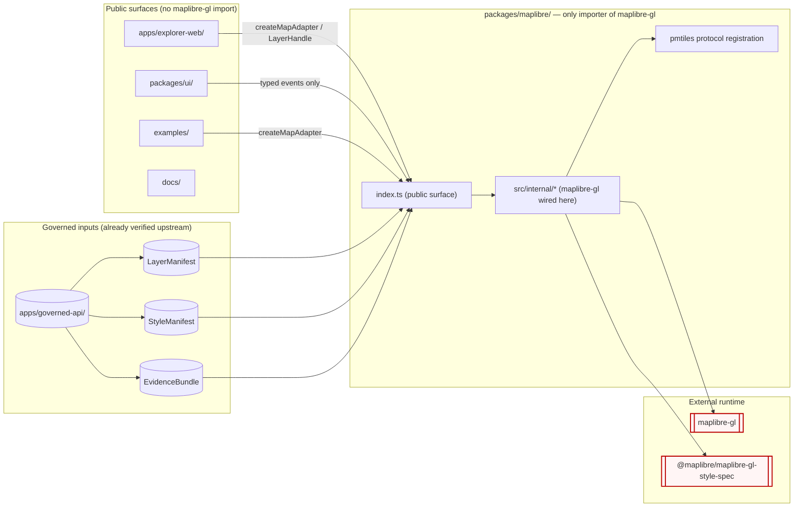

<!-- [KFM_META_BLOCK_V2]
doc_id: kfm://adr/0006
title: "ADR-0006 — MapLibre Boundary: Only MapLibreAdapter Imports MapLibre"
type: standard
version: v1
status: draft
owners: <map-shell-owner-TBD>, <docs-steward-TBD>
created: 2026-05-10
updated: 2026-05-10
policy_label: public
related:
  - docs/doctrine/directory-rules.md            # §11 UI and Map Roots, §13.3
  - docs/architecture/map-shell.md              # PROPOSED canonical map-shell doctrine
  - docs/architecture/contract-schema-policy-split.md
  - docs/adr/ADR-0001-schema-home.md            # only prior ADR confirmed by Directory Rules
tags: [kfm, adr, map-shell, renderer-boundary, dependency-rule, maplibre]
notes:
  - "Repo not mounted in this session — implementation paths and tooling are PROPOSED."
  - "Cesium parity is acknowledged but governed by a sibling ADR, not this one."
[/KFM_META_BLOCK_V2] -->

# ADR-0006 — MapLibre Boundary: Only `MapLibreAdapter` Imports MapLibre

> **One rule:** No module in KFM imports `maplibre-gl` (or any sibling `maplibre-*` runtime package) **except** the `MapLibreAdapter` package. Everything else talks to the map through the adapter's typed surface.

[](#1-status)
[](#3-context)
[](#4-decision)
[](#7-enforcement)
[](#8-consequences)

**Quick jump:** [Status](#1-status) · [Summary](#2-summary) · [Context](#3-context) · [Decision](#4-decision) · [Scope](#5-scope) · [Boundary contract](#6-boundary-contract) · [Enforcement](#7-enforcement) · [Consequences](#8-consequences) · [Alternatives](#9-alternatives) · [Migration & rollback](#10-migration--rollback) · [Open questions](#11-open-questions) · [References](#12-references)

---

## 0. ADR Header

| Field | Value |
|---|---|
| **ID** | `ADR-0006` |
| **Title** | MapLibre Boundary: only `MapLibreAdapter` imports MapLibre |
| **Status** | `proposed` |
| **Date** | 2026-05-10 |
| **Authors / drivers** | `<map-shell-owner-TBD>` |
| **Reviewers required** | Docs steward · Map-shell owner · At least one subsystem owner from `apps/explorer-web/` |
| **Supersedes** | — |
| **Superseded by** | — |
| **Amends Directory Rules** | No (operationalizes §11 "UI and Map Roots" and §13.3 "competing shell homes") |
| **Related ADRs** | `ADR-0001` (schema home) — referenced for ADR template conformance and adjacent layering rules |

> **Template conformance.** This ADR uses the eight fields required by Directory Rules §2.4: `id`, `title`, `status`, `date`, `context`, `decision`, `consequences`, `alternatives`. Sections 5–11 elaborate on those fields; they do not replace them.

[Back to top](#adr-0006--maplibre-boundary-only-maplibreadapter-imports-maplibre)

---

## 1. Status

**`proposed`** — drafted from KFM doctrine and Directory Rules. **NEEDS VERIFICATION** against mounted-repo evidence before it can be promoted to `accepted`. Specifically:

- Confirm the `packages/maplibre/` package exists (or is created in the same change set) per Directory Rules §11.
- Confirm `apps/explorer-web/` and `packages/ui/` exist and import the adapter, not `maplibre-gl` directly.
- Confirm CI tooling (ESLint, dependency-cruiser, or equivalent) is in place to enforce the boundary.

Until those are verified, treat **paths, file names, tool names, and `package.json` contents in this ADR as PROPOSED**.

---

## 2. Summary

KFM doctrine treats **MapLibre as a downstream renderer and interaction runtime, not a sovereign truth source.** The KFM Trust Membrane requires that public surfaces consume `EvidenceBundle`, `DecisionEnvelope`, `LayerManifest`, `StyleManifest`, and governed-API responses — never raw renderer state, raw `Map` instances, or framework-specific event objects leaked across module boundaries.

This ADR makes that doctrine **mechanical**:

> **Only `packages/maplibre/` (the `MapLibreAdapter` package) may import `maplibre-gl` or any sibling runtime package. All other code — `apps/explorer-web/`, `packages/ui/`, viewer templates, examples, scripts, tests outside the adapter — imports `MapLibreAdapter`'s typed surface.**

The adapter becomes the **single seam** at which renderer concerns are bound. The rest of the system stays renderer-agnostic by construction.

---

## 3. Context

### 3.1 Doctrinal anchors (CONFIRMED)

| Source | Statement |
|---|---|
| Master MapLibre Components-Functions-Features, §2 *Executive Determination* | "MapLibre is a disciplined 2D renderer and interaction runtime inside a governed KFM shell. It is not the canonical truth store, source registry, policy engine, citation authority, review authority, publication authority, or AI authority." |
| Master MapLibre, Category A *Renderer Boundary and KFM Trust Law* | Map UI must receive layer pointers and render hints, not database query handles or unverified artifacts; promotion gates precede renderer integration. |
| Directory Rules §11 *UI and Map Roots* | Canonical layout is `apps/explorer-web/` + `packages/ui/` + `packages/maplibre/` (+ `packages/cesium/`). MapLibre is the disciplined 2D renderer; "not the truth store, publication authority, policy authority, citation authority, or AI authority." |
| Directory Rules §13.3 *Competing shell homes (anti-pattern)* | `ui/`, `web/`, `apps/explorer-web/`, and `packages/ui/` competing as shell homes is named drift; the named fix sets `packages/maplibre/` as the renderer package. |
| KFM Components Pass 11, E.2 *MapLibre Client Discipline* | MapLibre GL is the canonical 2D web client; style versioning and PMTiles fetch are part of the renderer contract. |

### 3.2 Operational problem this ADR solves

When `maplibre-gl` is importable from anywhere, three failure modes follow:

1. **Renderer types leak upward.** UI components type their props in terms of `maplibregl.Map`, `LngLatBoundsLike`, or `MapMouseEvent`. The "renderer-agnostic" property of the upper layers becomes a fiction.
2. **Trust membrane bypass.** A component calls `map.addSource(...)` against an unverified PMTiles URL or an unreleased layer because the renderer handle is in reach. Master MapLibre `ML-058-020` ("verify sidecar before `addSource`") and `ML-064-020` ("no direct DB handles in map UI") become unenforceable in code.
3. **Migration cost.** A future move to MLT, MapLibre Native, deck.gl interop, or a server-side preview renderer (`packages/maplibre/`-headless, see Master MapLibre `ML-064` Renderer expansions) requires touching every importer instead of one adapter.

### 3.3 What is currently uncertain

| Item | Label |
|---|---|
| Mounted-repo presence of `packages/maplibre/` | NEEDS VERIFICATION |
| Current importers of `maplibre-gl` across the tree | UNKNOWN |
| Presence of an existing `MapLibreAdapter`, `MapShell`, or `MapWrapper` module | UNKNOWN |
| Choice of import-boundary enforcement tool (ESLint `no-restricted-imports`, dependency-cruiser, custom `tools/validators/`) | PROPOSED |
| Whether `packages/cesium/` is in the repo today | UNKNOWN |

---

## 4. Decision

**KFM adopts a single-importer rule for the MapLibre runtime.** The rule has four parts.

### 4.1 The single-importer rule

> **Only the `MapLibreAdapter` package — canonical home `packages/maplibre/` per Directory Rules §11 — MAY import `maplibre-gl` or any `maplibre-*` runtime package. All other packages, apps, viewer templates, examples, scripts, and non-adapter tests MUST import only the adapter's published surface.**

### 4.2 The adapter is the seam

`packages/maplibre/` (PROPOSED file home for the entry point: `packages/maplibre/src/index.ts`) exposes:

- **Lifecycle:** `createMapAdapter(opts) → MapLibreAdapter`, `destroy()`.
- **Layer surface:** `addLayer(LayerManifest, StyleManifest)`, `removeLayer(layerId)`, with **sidecar verification gate** wired in (see Master MapLibre `ML-058-020`).
- **Camera and time surface:** `setView`, `setBounds`, `setTimeSnapshot(releasedSnapshotId)`.
- **Event surface:** **KFM-shaped events only** (`onLayerClick(EvidenceRef)`, `onCameraSettled(CameraState)`), never raw `maplibregl.MapMouseEvent` or `maplibregl.Map` handles.
- **Health surface:** `RuntimeProbeResult` (per Master MapLibre `ML-058-001`/`ML-058-011`) is emitted by the adapter; consumers MUST NOT compute it from raw renderer state.

Any future renderer (MapLibre Native, MLT-first renderer, server-side preview) implements the same surface and lands as a sibling package or a typed strategy inside `packages/maplibre/`. **Consumers are unaffected.**

### 4.3 Forbidden imports (illustrative)

```ts
// ❌ Forbidden anywhere outside packages/maplibre/
import maplibregl from "maplibre-gl";
import type { Map, LngLatBoundsLike } from "maplibre-gl";
import { Protocol } from "maplibre-gl";              // protocol registration belongs in the adapter
import * as Style from "@maplibre/maplibre-gl-style-spec"; // style spec types belong in the adapter
```

### 4.4 Permitted import (everywhere else)

```ts
// ✅ Permitted in apps/explorer-web/, packages/ui/, examples/, etc.
import { createMapAdapter, type LayerHandle, type CameraState } from "@kfm/maplibre";
//                                                                    ^^^^^^^^^^^^^
//                                                                    PROPOSED package name
//                                                                    NEEDS VERIFICATION against
//                                                                    actual workspace package id
```

> [!IMPORTANT]
> The public package name (`@kfm/maplibre` shown above) is **PROPOSED**. It MUST be aligned with the project's actual `packages/*` naming convention before this ADR is accepted.

[Back to top](#adr-0006--maplibre-boundary-only-maplibreadapter-imports-maplibre)

---

## 5. Scope

### 5.1 In scope

- Web client / `MapLibre GL JS` runtime imports in TypeScript and JavaScript source.
- Style-spec type imports from `@maplibre/maplibre-gl-style-spec`.
- The MapLibre PMTiles protocol registration (`maplibregl.addProtocol`) — must live inside the adapter; see Master MapLibre `ML-064-111`.
- Re-exports: a barrel file that re-exports `maplibre-gl` from outside `packages/maplibre/` is treated as a violation.

### 5.2 Out of scope

- **Cesium / 3D.** A parallel rule for `cesium` and `packages/cesium/` is expected as a separate ADR. This ADR intentionally does not amend that boundary; it only notes that Cesium MUST consume the same `EvidenceBundle` and `DecisionEnvelope` as MapLibre (Directory Rules §11).
- **Server-side tile build, PMTiles generation, COG processing.** Those live under `pipelines/`, `tools/`, or `packages/` outside the renderer adapter and do not import `maplibre-gl` to begin with.
- **Style JSON authoring and storage.** Style JSON is data, not a runtime import; its home is governed by tile and style artifact rules, not this ADR.
- **Mobile / MapLibre Native.** PROPOSED to be governed by a sibling adapter package (e.g., `packages/maplibre-native/`) if and when it lands.

### 5.3 Boundary diagram



> **Diagram is doctrine-grounded.** Boxes outside `packages/maplibre/` are constrained by Directory Rules §11. Internal file names inside the adapter (`src/internal/*`) are **PROPOSED**.

[Back to top](#adr-0006--maplibre-boundary-only-maplibreadapter-imports-maplibre)

---

## 6. Boundary Contract

### 6.1 What `MapLibreAdapter` MUST do

1. **Verify before bind.** No `addSource` / `addLayer` / `addProtocol` call without the inputs being shaped as `LayerManifest` and `StyleManifest`. See `ML-058-020` (verify sidecar before `addSource`).
2. **Refuse raw handles.** The adapter MUST NOT return `maplibregl.Map`, `maplibregl.Source`, or `maplibregl.Layer` to callers. It returns KFM-shaped opaque handles.
3. **Translate events into KFM shapes.** Mouse, camera, and source events are mapped to KFM event types (`EvidenceRef`, `CameraState`, `RuntimeProbeResult`). Raw renderer events do not cross the seam.
4. **Surface release state.** The adapter is responsible for displaying released / stale / degraded / denied state (Master MapLibre Category A); upper layers pass the state in, the adapter renders it.
5. **Expose `RuntimeProbeResult`.** Probes (`ML-058-001`/`ML-058-011`) are produced by the adapter and kept separate from `EvidenceBundle` truth content.

### 6.2 What `MapLibreAdapter` MUST NOT do

| MUST NOT | Reason |
|---|---|
| Read from `data/raw/`, `data/work/`, or `data/quarantine/` | Trust membrane (Directory Rules §13.5, §7.1) — renderer consumes governed inputs only. |
| Call the public web for tile data without going through configured tile endpoints | Tile delivery is governed by tile/style artifact policy; adapter MUST receive endpoints. |
| Cache, persist, or originate authority decisions | Adapter is a renderer; truth lives in `data/published/`, `data/catalog/`, and `apps/governed-api/`. |
| Re-export `maplibre-gl` symbols | That would re-open the boundary at a second hop. |

### 6.3 What callers MUST do

| Caller surface | Obligation |
|---|---|
| `apps/explorer-web/` | Import only from `@kfm/maplibre` (PROPOSED name). Pass `LayerManifest` / `StyleManifest` / governed responses, never raw URLs. |
| `packages/ui/` | Render adapter-issued state (release, stale, degraded, denied). MUST NOT cast adapter handles to `maplibregl.Map`. |
| `examples/` | Demonstrate adapter usage. Examples that touch `maplibre-gl` directly belong in `packages/maplibre/examples/` or `packages/maplibre/tests/`. |
| `tests/` | Test the adapter's surface, not the underlying renderer. Renderer-internal tests live with the adapter. |

[Back to top](#adr-0006--maplibre-boundary-only-maplibreadapter-imports-maplibre)

---

## 7. Enforcement

Three layers, in increasing strictness. All three are **PROPOSED**; the concrete tool choice is left for a follow-up implementation PR.

### 7.1 Linter rule (advisory + CI-failing)

ESLint `no-restricted-imports` configured at the workspace root, **scoped by path**:

```jsonc
// PROPOSED — eslintrc fragment, exact tool/version pending verification
{
  "overrides": [
    {
      "files": ["**/*.{ts,tsx,js,jsx}"],
      "excludedFiles": ["packages/maplibre/**"],
      "rules": {
        "no-restricted-imports": ["error", {
          "patterns": [
            { "group": ["maplibre-gl", "maplibre-gl/*"],            "message": "Only packages/maplibre/ may import maplibre-gl. See ADR-0006." },
            { "group": ["@maplibre/maplibre-gl-style-spec"],       "message": "Style-spec types are re-exported from @kfm/maplibre. See ADR-0006." }
          ]
        }]
      }
    }
  ]
}
```

### 7.2 Dependency graph rule (structural)

A dependency-cruiser (or equivalent `tools/validators/` rule) gate that fails the build if a non-adapter file resolves an import to `maplibre-gl`. Doctrine basis: Directory Rules §11 and §13.3.

### 7.3 `package.json` discipline

Only `packages/maplibre/package.json` may list `maplibre-gl` and `@maplibre/maplibre-gl-style-spec` as **`dependencies`** (not `devDependencies`, not `peerDependencies` in consumer packages). PROPOSED — verify against actual workspace tooling (npm / pnpm / yarn workspaces).

### 7.4 What "violation" looks like in PR review

> [!WARNING]
> A PR that adds `import ... from "maplibre-gl"` to any file outside `packages/maplibre/` MUST be either rewritten to use the adapter or paired with a follow-up ADR amending this one. There is no "temporary direct import" exception.

[Back to top](#adr-0006--maplibre-boundary-only-maplibreadapter-imports-maplibre)

---

## 8. Consequences

### 8.1 Positive

- **Trust membrane has a runtime correlate.** The doctrinal claim "MapLibre is a downstream renderer" is now mechanically enforced.
- **One seam to change renderers.** MLT readiness, MapLibre Native parity, server-side preview, and Cesium-MapLibre overlay sync (`ML-057-001`/`ML-057-002`/`ML-057-003`) become adapter-internal changes.
- **Upper layers stay testable without the renderer.** UI and explorer-web can be tested against the adapter's typed surface and a fake adapter.
- **`addSource` / `addProtocol` gates are reachable.** Sidecar verification and protocol registration become enforceable in one place rather than per-importer.
- **Plugin allowlist becomes meaningful.** A MapLibre plugin admission list (Pass 11 E.2.1; Master MapLibre v1.6 §"Plugin allowlist and MapLibre wrapper admission records") has one place to live and to enforce.

### 8.2 Negative / cost

- **Adapter surface grows over time.** Every new capability the UI needs becomes a typed addition to the adapter. Mitigation: explicit `Capability` types and a contract test suite.
- **Migration cost for existing direct importers.** Any code that today imports `maplibre-gl` outside the adapter must be moved. Mitigation: §10 migration plan.
- **Risk of "passthrough bloat."** The adapter could degenerate into a thin re-export. Mitigation: §6.2 forbids re-exporting renderer symbols; the adapter exposes KFM-shaped types only.

### 8.3 Risk register

| Risk | Likelihood | Severity | Mitigation |
|---|---|---|---|
| Adapter becomes a leaky abstraction (returns renderer handles for "just one" use case) | Medium | High | §6.2 prohibits returning raw renderer types; contract tests fail if it does. |
| Lint rule is bypassed via dynamic import or `// eslint-disable-next-line` | Low | Medium | Dependency-cruiser gate catches resolution regardless of lint comment; PR review escalates to docs steward. |
| MapLibre plugins drag in their own `maplibre-gl` types into upper layers | Medium | Medium | Plugin allowlist lives inside the adapter; consumer packages never import plugins directly. |
| Cesium parity ADR diverges from this one | Medium | Low | Cesium ADR MUST cite this one and mirror the structure; Directory Rules §11 already aligns them. |

[Back to top](#adr-0006--maplibre-boundary-only-maplibreadapter-imports-maplibre)

---

## 9. Alternatives Considered

### 9.1 Alternative A — Soft convention only (rejected)

Document the convention in `docs/architecture/map-shell.md` and rely on PR review. **Rejected**: the failure mode this ADR addresses (renderer types leaking into UI; `addSource` bypassing sidecar verification) is exactly the failure mode soft conventions fail to prevent at scale. KFM doctrine prefers operational governance over advisory conventions (Directory Rules §11, project doctrine §11).

### 9.2 Alternative B — Allow renderer imports in `packages/ui/` (rejected)

Treat `packages/ui/` as a second renderer-aware layer, restricting only `apps/explorer-web/`. **Rejected**: `packages/ui/` is meant to be reusable across apps and renderers. Anchoring it to MapLibre defeats both reuse and the §11 layering.

### 9.3 Alternative C — One adapter per renderer, no shared seam (rejected for now)

Place adapters per-deployable (`apps/explorer-web/src/map-adapter/`). **Rejected**: would block sharing between `apps/explorer-web/` and any other shell (notebooks, examples, story-mode embeds). The §11 canonical layout already names `packages/maplibre/` as the shared package; this ADR honors that.

### 9.4 Alternative D — Hide MapLibre behind a network/RPC boundary (rejected, future option)

Run MapLibre in a worker / iframe / server-side preview and expose only messages. **Out of scope** for this ADR. Worth revisiting when a headless preview renderer (`ML-064` family) lands; the adapter pattern in this ADR is compatible with that future.

[Back to top](#adr-0006--maplibre-boundary-only-maplibreadapter-imports-maplibre)

---

## 10. Migration & Rollback

### 10.1 Migration plan (proportional to scope)

1. **Inventory direct importers.** Grep the workspace for `from "maplibre-gl"`, `require("maplibre-gl")`, and `@maplibre/*` runtime imports. Record results in `docs/registers/DRIFT_REGISTER.md` (PROPOSED entry).
2. **Land the adapter surface.** Create or normalize `packages/maplibre/src/index.ts` exposing the §4.2 surface. NEEDS VERIFICATION that the package already exists.
3. **Mechanical migration.** For each direct importer outside `packages/maplibre/`, replace the import with the adapter's typed surface. Mirror behavior; do not change observable map UX in the same PR.
4. **Move PMTiles protocol registration into the adapter.** Per `ML-064-111`, `maplibregl.addProtocol` belongs in the adapter, called exactly once during `createMapAdapter`.
5. **Enable enforcement.** Land the §7.1 lint rule and §7.2 dependency graph rule in the same change as the last importer migration.
6. **Update docs.** `docs/architecture/map-shell.md`, root README map section, and any per-root READMEs that mention map runtime.
7. **Close the migration** by removing any compatibility mirrors (e.g., a temporary `packages/ui/src/legacy-map/` re-export) per Directory Rules §14.

### 10.2 Definition of done

- [ ] No `maplibre-gl` import resolves from outside `packages/maplibre/` in CI.
- [ ] Lint rule active and failing the build on violations.
- [ ] Dependency graph rule active.
- [ ] `packages/maplibre/` `README.md` describes the boundary and links to this ADR.
- [ ] At least one consumer (e.g., `apps/explorer-web/`) builds with no renderer imports.
- [ ] Master MapLibre `ML-058-020` (verify sidecar before `addSource`) is wired through the adapter.
- [ ] `docs/architecture/map-shell.md` references this ADR.

### 10.3 Rollback path

- **Reversible** (low cost): disable lint + dependency-graph rules; the rule reverts to convention. No data, schema, or release artifact is affected. The adapter package itself remains.
- **Partial reversal**: relax §7.1 to a warning for a defined exception path (e.g., `examples/`) via a published ADR amendment; the structural rule (§4.1) stays.
- **Full reversal**: open a superseding ADR with `status: superseded` and a forward link, per Directory Rules §2.1 / §2.4.

### 10.4 Backward compatibility

- This ADR does **not** change schema, contract, policy, source, registry, release, or proof homes — so the Directory Rules §2.4 "parallel home" prohibition does not apply.
- Public APIs of `apps/governed-api/` are untouched.
- The on-disk layout of `data/`, `release/`, `policy/`, `schemas/`, and `contracts/` is untouched.

[Back to top](#adr-0006--maplibre-boundary-only-maplibreadapter-imports-maplibre)

---

## 11. Open Questions

> [!NOTE]
> These belong in `docs/registers/VERIFICATION_BACKLOG.md` (PROPOSED entry) until resolved.

1. **Does `packages/maplibre/` currently exist in the mounted repo?** If not, this ADR's first migration step is to create it; if it exists under a different name (`packages/map/`, `packages/renderer/`), the §13.3 anti-pattern is already in play. **NEEDS VERIFICATION.**
2. **Workspace package name.** Is the canonical published name `@kfm/maplibre`, `@kansas-frontier-matrix/maplibre`, or unscoped? **NEEDS VERIFICATION.**
3. **Cesium parity ADR — who owns it?** This ADR explicitly defers it; a sibling ADR is expected.
4. **MapLibre Native / mobile.** Should mobile share `packages/maplibre/` or live in a sibling package? PROPOSED: sibling package; revisit when mobile lands (Master MapLibre `ML-064-035`/`ML-064-050`/`ML-064-057`).
5. **Plugin allowlist home.** Where does the MapLibre plugin admission list live — inside `packages/maplibre/` (PROPOSED) or as a `control_plane/` register?
6. **Headless / server-side preview renderer.** When the headless preview path lands (Master MapLibre `ML-064` renderer expansions), does it share `packages/maplibre/` or live as `packages/maplibre-headless/`?
7. **`@maplibre/maplibre-gl-style-spec` types in shared schemas.** If style schemas live under `schemas/contracts/v1/...`, should style-spec type imports there be permitted? **OPEN** — likely yes for type-only imports, but to be confirmed by a `schemas/` reviewer.

[Back to top](#adr-0006--maplibre-boundary-only-maplibreadapter-imports-maplibre)

---

## 12. References

### 12.1 Internal doctrine (CONFIRMED in session)

- `docs/doctrine/directory-rules.md` — §11 *UI and Map Roots*, §13.3 *competing shell homes*, §2.4 *ADR template fields*.
- Master MapLibre Components-Functions-Features — §2 *Executive Determination*; Category A *Renderer Boundary and KFM Trust Law*; Category B *MapLibre GL JS Web Shell*; idea records `ML-057-002`, `ML-058-001`, `ML-058-011`, `ML-058-020`, `ML-064-016`, `ML-064-020`, `ML-064-021`, `ML-064-087`, `ML-064-111`.
- KFM Components Pass 11 — E.2 *MapLibre Client Discipline* (E.2.1 confirmed).

### 12.2 Adjacent ADRs

- `ADR-0001-schema-home.md` — schema home (`schemas/contracts/v1/...`). Referenced for ADR template parity; not amended here.

### 12.3 Adjacent architecture docs (PROPOSED targets to update on acceptance)

- `docs/architecture/map-shell.md` — should link this ADR as the operational rule for §11.
- `docs/architecture/contract-schema-policy-split.md` — unchanged by this ADR.
- `apps/explorer-web/README.md` and `packages/maplibre/README.md` — should reference this ADR.

### 12.4 External references (NEEDS VERIFICATION for version pinning)

- MapLibre GL JS — runtime under boundary control.
- `@maplibre/maplibre-gl-style-spec` — style-spec types under boundary control.
- PMTiles MapLibre protocol — registration belongs in the adapter (`ML-064-111`).

---

<sub>This ADR operationalizes Directory Rules §11 and §13.3. It does not amend the canonical root tree (§5), the schema-home rule (ADR-0001), or any lifecycle phase. Status: <strong>proposed</strong> — promote to <code>accepted</code> after the §1 verification items resolve.</sub>
