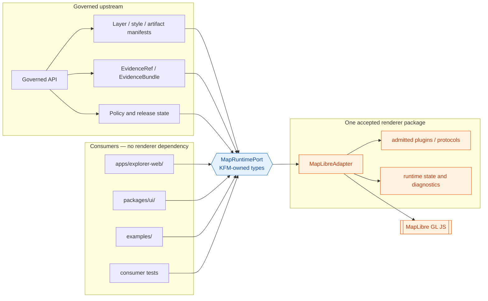

<!-- [KFM_META_BLOCK_V2]
doc_id: kfm://adr/0006
title: "ADR-0006 — MapLibre Boundary: Only MapLibreAdapter Imports MapLibre"
type: adr
adr_id: ADR-0006
version: v1.2
status: draft
effective_decision_status: proposed
owners:
  - "OWNER_TBD — architecture stewardship assignment is not verified"
reviewers_required:
  - Docs steward
  - Map/runtime steward
  - Explorer Web subsystem owner
  - Package/tooling owner
created: 2026-05-10
updated: 2026-07-23
policy_label: public
truth_posture: cite-or-abstain
responsibility_root: docs/
current_path: docs/adr/ADR-0006-maplibre-boundary--only-maplibreadapter-imports-maplibre.md
supersedes: []
superseded_by: null
evidence_snapshot:
  repository: bartytime4life/Kansas-Frontier-Matrix
  base_ref: main
  base_commit: 79603b7981e52a4b1cdb5f1eb42a7f1dd34436d7
  target_prior_blob: fba9562322a263876bb5b1096b8093746dd43990
  adr_index_blob: cf08fae322ac53426f7394d97897fdb942253049
  directory_rules_blob: 2affb080e6f0043867c64c7f06c1ca52030fbd55
  package_readme_blob: 3ba48e7d61b013a659ed51b9336eee788d06b8f2
  package_metadata_blob: b0582955feeb51016327113692fa5c98ecad8816
  package_entry_blob: 91664eb00583f9e3d0405eb7954fefa9a48f4ee9
  root_package_blob: 62f45306aef7376a2d68042b0c9e7f556edf0e78
  explorer_package_blob: ce981192e725483c747affb45ca3de36a22ce9ce
  app_boundary_test_blob: 97d44069b0a5ab4a82b1e1fc48665e905c08a287
  map_runtime_readme_blob: 4d3897eda64d11f84f4805cb9cc2bc30a2ee333c
  map_runtime_boundary_blob: baf929fdca617ea95ea4ce5bde4c7b8abd9ac6d5
  map_shell_blob: 9e1fa4e8293d26c62b9a323d5302ad9a01aa1979
  maplibre_tests_readme_blob: b20a14eae605017b7d7f210f1c27768cacbd411a
  maplibre_workflow_blob: bfb36a84ba72bec68d964976dc7964cde7f5d603
  smoke_harness_blob: 699dd4cf42d355dd2ed7620852b7fd1f3000bbe2
  sole_renderer_adr_blob: c753f09db18e12081f99405b42cd79ebb89d0ac3
  codeowners_blob: dd2a84aa514d8ecd9208bc347f90f9a2ed37dd61
related:
  - docs/adr/README.md
  - docs/adr/INDEX.md
  - docs/adr/ADR-0005-apps-explorer-web-is-the-canonical-map-first-shell.md
  - "docs/adr/ADR-0007 — MapLibre GL JS Is the Sole Browser-Side Renderer.md"
  - docs/doctrine/directory-rules.md
  - docs/architecture/map-shell.md
  - docs/architecture/ui/MAP_RUNTIME_BOUNDARY.md
  - packages/maplibre/README.md
  - apps/explorer-web/src/features/map_runtime/README.md
  - tests/policy/test_explorer_web_adapter_boundary.py
  - tests/maplibre/README.md
tags: [kfm, adr, map-shell, renderer-boundary, dependency-rule, maplibre, adapter, import-boundary, trust-membrane, no-parallel-authority]
notes:
  - "v1.2 is a same-path, documentation-only, repository-grounded modernization; it does not accept the ADR or change runtime behavior."
  - "ADR-0006 numbering and the tracked target path are confirmed by docs/adr/INDEX.md; source metadata remains draft and the effective decision status remains proposed."
  - "The repository contains packages/maplibre/ as a private @kfm/maplibre 0.0.0 scaffold with a placeholder export, not a functioning MapLibreAdapter."
  - "Directory Rules proposes packages/maplibre-runtime/ while current implementation evidence uses packages/maplibre/; this path/ownership split is CONFLICTED and must be resolved without creating two active renderer packages."
  - "Existing Explorer Web boundary testing is partial: it permits renderer imports anywhere under apps/explorer-web/src/adapters/, which does not enforce this ADR's package-only seam."
[/KFM_META_BLOCK_V2] -->

<a id="top"></a>

# ADR-0006 — MapLibre Boundary: Only `MapLibreAdapter` Imports MapLibre

> **Proposed decision.** KFM will have one browser-renderer dependency seam. Only the accepted `MapLibreAdapter` implementation may acquire or import MapLibre runtime APIs and renderer-bound plugins; every consumer uses KFM-owned `MapRuntimePort` / adapter types and governed inputs.

[](#1-status)
[](#31-current-repository-evidence)
[](#71-current-enforcement-snapshot)
[](#62-what-the-adapter-must-not-do)

> [!IMPORTANT]
> **Repository configuration is not reviewed decision authority.** The current tree contains a MapLibre package scaffold, map-runtime doctrine, a bounded Explorer Web import test, and a separate performance harness. Those surfaces do not accept this ADR, establish a functioning adapter, prove a complete import inventory, or authorize map/data publication.

**Quick navigation:** [Header](#0-adr-header) · [Status](#1-status) · [Summary](#2-summary) · [Context](#3-context) · [Decision](#4-decision) · [Scope](#5-scope) · [Boundary contract](#6-boundary-contract) · [Enforcement](#7-enforcement) · [Consequences](#8-consequences) · [Alternatives](#9-alternatives-considered) · [Migration and rollback](#10-migration--rollback) · [Open questions](#11-open-questions) · [References](#12-references)

---

## 0. ADR Header

| Field | Current value |
|---|---|
| **ID** | `ADR-0006` — unique and confirmed in the canonical human [`INDEX.md`](./INDEX.md) |
| **Title** | MapLibre Boundary: only `MapLibreAdapter` imports MapLibre |
| **Source metadata** | `draft` |
| **Effective decision status** | `proposed` — not binding until the ADR and index carry reviewed `accepted` status |
| **Created** | 2026-05-10 |
| **Updated** | 2026-07-23 |
| **Current tracked path** | `docs/adr/ADR-0006-maplibre-boundary--only-maplibreadapter-imports-maplibre.md` |
| **Logical boundary** | One `MapRuntimePort` and one `MapLibreAdapter` implementation seam |
| **Current physical package candidate** | [`packages/maplibre/`](../../packages/maplibre/README.md) — repository-present private `@kfm/maplibre` `0.0.0` scaffold |
| **Directory Rules target name** | `packages/maplibre-runtime/` — **PROPOSED / CONFLICTED** with the current scaffold; no sibling may be created without migration resolution |
| **Related renderer choice** | [`ADR-0007`](<./ADR-0007 — MapLibre GL JS Is the Sole Browser-Side Renderer.md>) — present, effective status `proposed` |
| **Amends Directory Rules** | No. This ADR operationalizes renderer dependency isolation; it does not create or rename a canonical root. |
| **Publication effect** | None. A Markdown edit, package scaffold, import test, screenshot, performance run, commit, or pull request does not publish a KFM claim or map artifact. |

> [!NOTE]
> **Template conformance.** This record preserves the ADR fields required by the repository ADR operating contract: ID, title, status, date, context, decision, consequences, alternatives, migration, and rollback. It keeps its original identity, filename, H1, and major section anchors.

[Back to top](#top)

---

## 1. Status

### 1.1 Current decision and implementation posture

| Concern | Status | Safe conclusion |
|---|---|---|
| ADR inventory | **CONFIRMED** | ADR-0006 is uniquely indexed at this exact filename. |
| Decision authority | **PROPOSED** | The record is present but not accepted. |
| MapLibre package path | **CONFIRMED current / CONFLICTED target** | `packages/maplibre/` exists; Directory Rules proposes `packages/maplibre-runtime/`. The conflict is unresolved. |
| Package identity | **CONFIRMED scaffold** | [`package.json`](../../packages/maplibre/package.json) declares `@kfm/maplibre`, `private: true`, version `0.0.0`. |
| Package implementation | **NOT ESTABLISHED** | [`src/index.ts`](../../packages/maplibre/src/index.ts) exports only `placeholder = true`; no functioning adapter is proven. |
| Package consumers | **NOT ESTABLISHED** | Bounded repository evidence found no established `@kfm/maplibre` consumer import. This is not a complete recursive inventory. |
| Import enforcement | **PARTIAL / CONFLICTED** | A test scans only Explorer Web and allows renderer imports anywhere under its local `adapters/` directory. |
| Root build/lint/test | **PLACEHOLDER** | Root and Explorer Web scripts remain `echo TODO`; they are not enforcement evidence. |
| Performance tooling | **CONFIRMED separate harness** | A root script loads MapLibre `5.5.0` from a public CDN and uses the global runtime outside the package seam. |
| Runtime/public behavior | **UNKNOWN** | No deployed client, released layer flow, complete CI result, or production runtime evidence was used to accept this decision. |

### 1.2 Acceptance gates

ADR-0006 SHOULD NOT move to `accepted` until equivalent evidence closes every gate below.

| Gate | Required evidence | Fail-closed result when missing |
|---|---|---|
| **A — One physical home** | Reviewed resolution of `packages/maplibre/` versus `packages/maplibre-runtime/`, including migration/compatibility treatment and no independently evolving sibling | Remain `proposed`; do not create a second package authority |
| **B — Functional seam** | A tested `MapRuntimePort` and one concrete `MapLibreAdapter` implementation with KFM-owned public types | No consumer migration; package remains scaffold |
| **C — Complete acquisition inventory** | Recursive inventory of static imports, type imports, dynamic imports, `require`, re-exports, workers, CDN scripts, globals, plugin imports, and protocol registration | Treat enforcement coverage as incomplete |
| **D — Dependency ownership** | Accepted package manifest owns approved MapLibre/runtime/plugin dependencies, with lockfile and supply-chain review appropriate to the repository | DENY dependency introduction outside the accepted seam |
| **E — Consumer migration** | Explorer Web, shared UI, examples, tests, and other consumers use the KFM port; no public type leaks raw renderer types | Hold acceptance |
| **F — Harness disposition** | Root performance/smoke runtime is moved behind the seam or recorded as a bounded test-only exception with owner, scope, expiry, network posture, and rollback | Treat the harness as known divergence |
| **G — Structural enforcement** | Repository-wide deterministic validator plus positive/negative tests and CI invocation | Direct imports remain review-only debt |
| **H — Reviewed transition** | Named reviewers approve; ADR and canonical index move together to `accepted`; acceptance evidence is recorded | Remain `proposed` |

[Back to top](#top)

---

## 2. Summary

KFM doctrine treats MapLibre as a **downstream renderer and interaction runtime**, not a truth store, source registry, policy engine, evidence resolver, citation authority, release authority, or AI authority. A renderer boundary is therefore not merely a dependency-style preference. It is the executable edge of the trust membrane.

This ADR makes that boundary reviewable:

> **One renderer dependency seam.** MapLibre GL JS, its runtime types, its worker/runtime acquisition, and admitted renderer-bound plugins or protocols are reachable only inside the accepted `MapLibreAdapter` package. Upper layers depend on KFM-owned ports, handles, state, and events.

The rule protects four separations:

| Separation | Boundary effect |
|---|---|
| Evidence versus rendering | Clicks produce candidate identity and a governed resolution request; rendered feature properties never become proof by themselves. |
| Policy/release versus loading | Layer and asset loading consumes upstream decisions and released manifests; the adapter does not decide allow, release, or publication. |
| KFM types versus renderer types | `maplibregl.Map`, raw source/layer objects, raw events, and style-runtime types do not escape into UI/domain contracts. |
| Runtime implementation versus consumers | MapLibre/plugin/version changes remain behind one seam rather than spreading across apps and packages. |

### 2.1 Relationship to ADR-0007

ADR-0006 and ADR-0007 answer different questions:

| Record | Question |
|---|---|
| **ADR-0006** | Where may browser-renderer runtime dependencies be acquired, imported, initialized, and exposed? |
| **ADR-0007** | Which browser renderer is the proposed default/sole renderer, and how are additional renderer technologies governed? |

Neither record becomes accepted merely because the other exists. ADR-0006 does not silently accept ADR-0007, and ADR-0007 does not prove this import boundary is implemented.

[Back to top](#top)

---

## 3. Context

### 3.1 Current repository evidence

The prior revision treated nearly every path and implementation claim as unverified. Current repository evidence supports a more precise boundary.

| Surface | Confirmed repository state | What it proves—and does not prove |
|---|---|---|
| [`docs/adr/INDEX.md`](./INDEX.md) | Exact ADR-0006 path is indexed; effective status `proposed`, source metadata `draft` | Proves inventory and status normalization, not acceptance |
| [`packages/maplibre/README.md`](../../packages/maplibre/README.md) | Repository-present, evidence-grounded package boundary README | Proves the package path and documented posture, not a functioning adapter |
| [`packages/maplibre/package.json`](../../packages/maplibre/package.json) | `@kfm/maplibre`, private, `0.0.0` | Proves current package identity only; no dependency, export, build, or distribution contract |
| [`packages/maplibre/src/index.ts`](../../packages/maplibre/src/index.ts) | One placeholder export | Proves implementation is scaffold-level |
| [`package.json`](../../package.json) | Workspaces include `apps/*` and `packages/*`; generic lint/test/build are TODO echoes | Proves workspace enrollment and MapLibre command declarations, not a buildable adapter or full suite |
| [`apps/explorer-web/package.json`](../../apps/explorer-web/package.json) | Private `0.0.0`; dev/build/test are TODO echoes | Proves app scaffold, not runtime wiring |
| [`map_runtime/README.md`](../../apps/explorer-web/src/features/map_runtime/README.md) | App-local Map Runtime boundary is documented | Proves proposed feature responsibility, not source modules or consumer imports |
| [`MAP_RUNTIME_BOUNDARY.md`](../architecture/ui/MAP_RUNTIME_BOUNDARY.md) | `MapRuntimePort` / `MapLibreAdapter` doctrine exists | Proves companion architecture language, not implementation |
| [`test_explorer_web_adapter_boundary.py`](../../tests/policy/test_explorer_web_adapter_boundary.py) | Scans Explorer Web source and allows map imports under app-local `adapters/` | Proves one bounded test exists; conflicts with package-only enforcement and is not repo-wide |
| [`tests/maplibre/README.md`](../../tests/maplibre/README.md) | Documents limited executable scalar tests, but some workflow descriptions predate the current hold-oriented workflow | Proves partial test infrastructure; current workflow details must be read from the workflow itself |
| [`maplibre-smoke-perf.mjs`](../../scripts/maplibre-smoke-perf.mjs) | Loads MapLibre GL JS `5.5.0` from `unpkg.com` into a page and uses global `maplibregl.Map` | Proves a separate runtime acquisition path in test tooling; the current workflow syntax-checks it but deliberately does not execute browser/runtime claims |
| [`maplibre-perf-governance.yml`](../../.github/workflows/maplibre-perf-governance.yml) | Runs no-network syntax checks, three deterministic scalar negative tests, and a readiness inspection that preserves explicit runtime/proof holds | Proves current command-bearing CI intent and path coverage; it is not an import-boundary validator or renderer-performance proof |
| [`ADR-0007`](<./ADR-0007 — MapLibre GL JS Is the Sole Browser-Side Renderer.md>) | Renderer-choice ADR exists and remains proposed | Proves a related decision record is tracked; not acceptance or plugin admission |

### 3.2 Directory Rules basis and placement conflict

Directory Rules place reusable renderer implementation under `packages/`, deployable shell code under `apps/explorer-web/`, reusable checks under `tools/validators/`, and enforceability under `tests/`. That responsibility split is sound.

The package name is not settled:

```text
current repository evidence:  packages/maplibre/
Directory Rules v1.3 target:   packages/maplibre-runtime/
```

This ADR does **not** create a second package or silently rename the first. Until a reviewed migration resolves the conflict:

1. `packages/maplibre/` is the **CONFIRMED current scaffold** and current implementation candidate.
2. `packages/maplibre-runtime/` is a **PROPOSED target name**, not a second active home.
3. New functional adapter work MUST use one reviewed physical home and a migration/rollback plan.
4. Any compatibility path must be pointer-only, frozen, generated, or explicitly transitional; it must not evolve independently.

### 3.3 Operational problem

Without one renderer seam, the repository can accumulate several incompatible forms of renderer authority:

1. **Raw type leakage.** UI props and state become coupled to `maplibregl.Map`, raw events, renderer source/layer objects, or plugin-specific classes.
2. **Trust-membrane bypass.** Any component with a runtime handle can add a source, layer, protocol, endpoint, or plugin outside manifest/policy/release review.
3. **Multiple acquisition paths.** Package imports, app-local adapters, dynamic imports, CDN scripts, workers, examples, and test harnesses can each initialize a different runtime/version.
4. **False enforcement confidence.** A narrow source scan can pass while other apps, scripts, packages, generated files, or CDN/global runtime paths remain outside coverage.
5. **Migration and correction cost.** Runtime upgrades, plugin removals, security corrections, and renderer rollback require touching every consumer rather than one package boundary.

### 3.4 Truth and state vocabulary

- **CONFIRMED** — verified from the pinned repository evidence named in this revision.
- **PROPOSED** — the architectural decision or future implementation state.
- **UNKNOWN** — evidence is insufficient for a stronger claim.
- **NEEDS VERIFICATION** — a concrete check is identified but not closed.
- **CONFLICTED** — repository surfaces or doctrine currently imply incompatible ownership or enforcement.

`draft`, `proposed`, `accepted`, `superseded`, and `rejected` are document/decision lifecycle states. They are not substitutes for the truth labels above.

[Back to top](#top)

---

## 4. Decision

If accepted, ADR-0006 makes the following rule binding.

> **Only the accepted `MapLibreAdapter` implementation boundary MAY acquire, import, initialize, or expose the browser-side MapLibre runtime and renderer-bound plugins. All other repository code MUST depend on KFM-owned ports and types.**

### 4.1 Logical boundary before physical path

`MapLibreAdapter` is a logical architectural role. Acceptance must bind it to exactly one physical package after resolving `packages/maplibre/` versus `packages/maplibre-runtime/`.

The implementation MUST NOT create both as active packages. During migration, one may be a compatibility pointer or generated bridge only when its status, source, consumers, sunset/review date, and rollback are explicit.

### 4.2 Runtime acquisition is broader than an ES import

The boundary applies to every mechanism that introduces or exposes the renderer:

- static `import` and type-only `import`;
- CommonJS `require`;
- dynamic `import()`;
- package re-exports and barrel files;
- browser `<script>` and `<link>` tags that acquire MapLibre runtime assets;
- globals such as `maplibregl`;
- workers and worker URLs;
- direct construction of `maplibregl.Map` or equivalent renderer objects;
- MapLibre protocol registration;
- renderer-bound plugins and custom-layer hosts;
- test/example harnesses, unless a reviewed bounded exception applies.

A rule that scans only `import ... from "maplibre-gl"` is insufficient.

### 4.3 KFM-owned public surface

The accepted package exposes renderer-agnostic, KFM-owned capabilities. Names below are architectural vocabulary; exact TypeScript signatures remain proposed until a semantic contract and implementation are reviewed.

| Capability | KFM surface | Raw renderer leakage allowed? |
|---|---|---:|
| Lifecycle | create/initialize adapter; destroy and release resources | No |
| Layer binding | bind/remove a released `LayerManifest` / style/artifact reference | No |
| Camera and view | serializable `CameraState`, bounds, projection, time context | No |
| Interaction | KFM `MapInteractionEvent` with candidate identity / evidence lookup ref | No |
| Runtime state | loading, ready, stale, degraded, denied, withdrawn, rollback, error | No |
| Plugins/protocols | admitted registry entries initialized inside the package | No |
| Testability | fake/in-memory `MapRuntimePort` implementation | No MapLibre dependency in consumers |

### 4.4 Forbidden consumer coupling

```ts
// ❌ Forbidden outside the accepted renderer package.
import maplibregl from "maplibre-gl";
import type { Map, MapMouseEvent } from "maplibre-gl";
import * as StyleSpec from "@maplibre/maplibre-gl-style-spec";

const map = new maplibregl.Map(/* ... */);
```

```ts
// ✅ Illustrative consumer posture. Exact exports remain PROPOSED.
import type { MapRuntimePort, CameraState, MapInteractionEvent } from "@kfm/maplibre";

export function bindMapRuntime(runtime: MapRuntimePort): void {
  runtime.onInteraction((event: MapInteractionEvent) => {
    // Forward candidate identity to governed claim resolution.
    // Do not treat rendered feature properties as the claim.
  });
}
```

`@kfm/maplibre` is a **CONFIRMED current scaffold name**, not an accepted public API or distribution promise.

### 4.5 Style-spec and static-tooling exception

Runtime or UI imports from `@maplibre/maplibre-gl-style-spec` remain inside the accepted renderer package.

A static schema/build/validation tool MAY receive a reviewed exception only when all of the following are true:

1. the tool is not browser/runtime code;
2. the exception is in an explicit allowlist consumed by the structural validator;
3. no MapLibre runtime object or type is re-exported to consumers;
4. dependency ownership and version pinning are explicit;
5. positive and negative tests prove the exception remains narrow;
6. an owner, review date, and rollback/removal path are recorded.

### 4.6 No renderer authority by implication

The adapter may reject malformed or unapproved inputs, but it does not originate truth, source authority, rights, sensitivity, evidence closure, review approval, release state, or publication.

```text
Source / evidence / policy / review / release
        -> governed API and released manifests
        -> MapRuntimePort
        -> MapLibreAdapter
        -> MapLibre runtime and admitted plugins
```

[Back to top](#top)

---

## 5. Scope

### 5.1 In scope

- Browser-side MapLibre GL JS runtime acquisition and imports.
- Renderer-bound MapLibre packages, types, workers, protocols, and custom-layer/plugin hosts.
- App, package, example, script, test, and documentation examples that initialize the browser renderer.
- Re-exports or wrapper modules that expose MapLibre types indirectly.
- Package-manifest dependency ownership for the renderer and renderer-bound plugins.
- KFM-owned `MapRuntimePort` / adapter type boundary.
- Import/acquisition inventory, deterministic validation, negative tests, CI wiring, exceptions, migration, correction, and rollback.

### 5.2 Out of scope

- Server-side tile generation, PMTiles/COG creation, spatial processing, or catalog emission that does not load a browser renderer.
- Style JSON as released data. The style artifact is governed by contracts, schemas, policy, manifests, and release state; the JSON file itself is not a runtime import.
- Selecting the sole renderer or admitting a plugin version; ADR-0007 and policy/release controls govern those questions.
- Field-level object shapes, package implementation, dependency installation, or app migration in this documentation-only revision.
- Changing lifecycle, schema, contract, policy, source, receipt, proof, or release homes.
- Accepting ADR-0006 or ADR-0007.

### 5.3 Boundary diagram



> [!NOTE]
> The diagram describes the proposed responsibility flow. It does not claim the adapter, port, manifests, plugin registry, or consumer wiring is currently implemented.

[Back to top](#top)

---

## 6. Boundary Contract

### 6.1 What `MapLibreAdapter` must do

1. **Consume governed inputs.** Accept released/validated manifest-shaped inputs and finite upstream states; do not infer release or policy from URLs, filenames, feature properties, or style visibility.
2. **Keep raw handles private.** Do not return or re-export `maplibregl.Map`, raw source/layer objects, raw worker handles, plugin classes, or raw renderer events.
3. **Translate events.** Convert click, camera, source, load, and error events into KFM-owned serializable events and states.
4. **Treat clicks as candidates.** A click may carry feature/layer identity and an evidence lookup reference; it never becomes a supported claim without governed resolution.
5. **Surface negative states.** Preserve stale, denied, abstained, conflict, degraded, withdrawn, rollback, invalid-payload, and error states supplied by governed services.
6. **Own renderer effects.** Initialize/destroy MapLibre, register protocols/workers/plugins, bind sources/layers, and remove all listeners/resources inside the package.
7. **Keep sensitivity upstream.** Render only public-safe or authorized derivatives. Style-only hiding is not sensitivity enforcement.
8. **Support fakes.** Consumers must be testable against a fake `MapRuntimePort` without a MapLibre dependency or network.
9. **Keep runtime health separate from evidence.** Diagnostics and performance state may support operations; they do not prove a domain claim.
10. **Preserve correction and rollback visibility.** A withdrawn or rolled-back artifact must be removable or visibly blocked through the same seam.

### 6.2 What the adapter must not do

| Must not | Why |
|---|---|
| Read RAW, WORK, QUARANTINE, canonical stores, graph/vector stores, model runtimes, or credentials | Public runtime uses governed interfaces and released artifacts |
| Decide source authority, rights, sensitivity, review, evidence closure, or release | Those responsibilities belong upstream |
| Call arbitrary unregistered public tile/data/plugin URLs as the normal path | Endpoint, dependency, and artifact admission must be inspectable |
| Treat a successful render, screenshot, popup, feature property, or runtime metric as truth | Renderer output is a downstream carrier |
| Hide sensitive geometry only with style filters | Underlying bytes may still disclose the geometry |
| Re-export renderer or plugin types | Re-exporting recreates a second dependency seam |
| Persist authoritative decisions or claim publication | The adapter is not a policy, evidence, proof, or release store |
| Emit raw model language or use AI output as feature truth | AI is interpretive and evidence-subordinate |

### 6.3 What callers must do

| Caller | Obligation |
|---|---|
| `apps/explorer-web/` | Depend on the KFM port/package; pass governed inputs; send click candidates to governed resolution; render finite states honestly |
| `packages/ui/` | Render KFM-owned state/events; never cast handles to MapLibre types or assume style visibility equals access |
| Other apps/packages | Use the same port or a separately accepted non-browser contract; do not initialize another browser renderer seam |
| Examples | Demonstrate consumer usage; renderer-internal examples live with the accepted package |
| Tests outside package | Test port behavior/fakes and negative states; renderer-internal integration tests live with or target the accepted package |
| Docs | Explain and link the boundary; documentation never substitutes for the structural validator or runtime evidence |

### 6.4 Exception contract

A temporary exception is not a comment or an `eslint-disable`. It requires a reviewed record containing at least:

```yaml
exception_id: stable-id
scope: exact paths and acquisition mechanism
reason: why the accepted seam cannot yet express the need
owner: verified owner or role assignment
allowed_state: test-only | migration-only | internal-preview
forbidden_uses:
  - public runtime
  - release or publication authority
expires_or_review_by: YYYY-MM-DD
validation_refs: []
remediation: extend seam | move harness | remove dependency
rollback: exact removal/revert path
```

Missing or expired exception evidence fails closed.

[Back to top](#top)

---

## 7. Enforcement

### 7.1 Current enforcement snapshot

Current enforcement is **partial and conflicted**, not absent and not complete.

| Surface | Confirmed behavior | Gap relative to this ADR |
|---|---|---|
| `tests/policy/test_explorer_web_adapter_boundary.py` | Scans `.ts/.tsx/.js/.jsx` under `apps/explorer-web/src`; allows map/Cesium imports when the file is inside app-local `adapters/` | Not package-only, not repo-wide, string-heuristic only, and permits Cesium language |
| Root `lint`, `test`, `build` scripts | Echo TODO messages | No usable monorepo import gate |
| `tests/maplibre/` | Contains bounded performance fixture/negative scalar tests | Does not prove adapter public API, import isolation, or consumer migration |
| `packages/maplibre/` | Private scaffold; no renderer dependency or functioning source | Nothing yet to enforce as the accepted seam |
| `scripts/maplibre-smoke-perf.mjs` | Acquires MapLibre via external CDN/global | Known runtime acquisition outside package; needs migration or exception disposition |
| MapLibre performance workflow | Performs no-network syntax checks, three scalar negative tests, and an explicit readiness HOLD | Not an ADR-0006 import/acquisition validator; does not execute browser performance or emit proof/release artifacts |

### 7.2 Required inventory

The implementation packet must generate a reviewable inventory for at least:

```text
maplibre-gl
@maplibre/* runtime packages
three
3d-tiles-renderer
@deck.gl/* / deck.gl
maplibre-gl-lidar
maplibre-three-plugin
pmtiles protocol registration
maplibregl globals
unpkg/jsdelivr/CDN MapLibre script or stylesheet URLs
new Worker(...) / workerUrl bindings
re-exports of renderer types or objects
```

The exact plugin list is governed by ADR-0007 and plugin admission. ADR-0006 requires the inventory mechanism to be extensible to that list.

### 7.3 Structural validator

Prefer extending the existing `tools/validators/maplibre/` lane after checking for equivalent implementation. A candidate command and path are **PROPOSED**, not current facts:

```text
python tools/validators/maplibre/validate_import_boundary.py
```

A sufficient validator should:

- parse relevant JavaScript/TypeScript imports rather than depend only on raw substring matching;
- inspect dynamic imports, CommonJS, re-exports, workers, and browser script/global acquisition where feasible;
- inspect package manifests for dependency ownership;
- read one explicit allowlist/exception source;
- reject paths outside the one accepted package;
- emit stable file, line, dependency, mechanism, and reason-code diagnostics;
- return deterministic success/failure/system-error outcomes;
- avoid network access;
- be exercised by positive and negative fixtures.

### 7.4 Package-manifest rule

After the package home is resolved:

| Manifest | Renderer/runtime dependency posture |
|---|---|
| Accepted renderer package | Owns approved runtime/plugin dependencies and exports |
| `apps/explorer-web/package.json` | Depends on the KFM package/port, not MapLibre/runtime plugins directly |
| `packages/ui/package.json` | KFM types/port only; no renderer runtime dependency |
| Root package | Tooling/workspace coordination only unless an explicit dependency-management rule says otherwise |
| Test/example manifests | No direct runtime dependency unless inside the accepted renderer package or covered by a reviewed test-only exception |

Dependency, peerDependency, devDependency, workspace-protocol, lockfile, and bundle rules remain **NEEDS VERIFICATION** until the package manager and build are made substantive.

### 7.5 Required tests

At minimum:

1. a valid package-internal runtime import passes;
2. an Explorer Web feature import fails;
3. an app-local `adapters/` runtime import fails unless the accepted physical seam is deliberately app-local through a superseding decision;
4. a type-only raw MapLibre import fails;
5. a dynamic import fails;
6. a re-export fails;
7. a package-manifest dependency outside the seam fails;
8. a CDN/global acquisition fixture fails or matches a reviewed test-only exception;
9. a fake-port consumer passes with no MapLibre dependency;
10. raw MapLibre types are absent from the accepted package's public API declaration surface.

### 7.6 PR review rule

> [!WARNING]
> A change that introduces renderer acquisition outside the accepted seam must be moved, expressed through the KFM port, or accompanied by a reviewed exception/superseding ADR. “Temporary,” “test only,” or “already behind an adapter folder” is not sufficient evidence by itself.

### 7.7 Validation commands

Commands below are scoped recommendations for a future implementation revision. Only the ADR-index commands are currently repository-established by adjacent ADR governance evidence.

```bash
python tools/validators/validate_adr_index.py
python -m pytest tests/validators/test_validate_adr_index.py -q --strict-config --strict-markers

# PROPOSED after the import validator and tests exist:
python tools/validators/maplibre/validate_import_boundary.py
python -m pytest tests/maplibre/test_import_boundary.py -q --strict-config --strict-markers
```

A green check proves only the declared import/acquisition boundary for the checked revision. It does not prove evidence closure, policy approval, rights/sensitivity clearance, release readiness, runtime correctness, performance, accessibility, security, or KFM publication.

[Back to top](#top)

---

## 8. Consequences

### 8.1 Positive consequences

- **The trust membrane gains an executable dependency edge.** Renderer effects become reachable through one audited package rather than ambient runtime handles.
- **Consumer code stays testable.** Explorer Web and shared UI can use a fake port without MapLibre, network, DOM, or WebGL.
- **Dependency and plugin review becomes finite.** Version, license, supply-chain, worker, endpoint, and protocol review converge on one package.
- **Runtime correction is more reversible.** A vulnerable runtime/plugin can be removed or rolled back without changing every consumer API.
- **Rendered candidates remain distinct from supported claims.** Event translation makes the EvidenceRef/EvidenceBundle path visible.
- **Import drift becomes machine-detectable.** Static, dynamic, re-export, package, CDN/global, and exception states can be inspected together.

### 8.2 Costs and tradeoffs

- The port must evolve intentionally as renderer capabilities grow.
- Existing app-local adapter doctrine/testing may need migration and could expose hidden coupling.
- A complete validator is more work than a single ESLint pattern.
- Test/performance harnesses need a deliberate package or exception home.
- The physical package-name conflict must be resolved before implementation can be described as canonical.
- Strict isolation can make some MapLibre-specific optimization APIs harder to expose; the answer is a reviewed KFM capability, not a raw-handle escape hatch.

### 8.3 Current operational effect

This revision changes documentation only. It does not:

- create `MapLibreAdapter` or `MapRuntimePort` source;
- rename `packages/maplibre/`;
- create `packages/maplibre-runtime/`;
- add dependencies, a lockfile, exports, build scripts, tests, validators, or workflows;
- modify the existing Explorer Web boundary test;
- move or exempt the performance harness;
- accept ADR-0006 or ADR-0007;
- publish a map, layer, package, release, or claim.

### 8.4 Risk register

| Risk | Current signal | Mitigation |
|---|---|---|
| Package scaffold is mistaken for an implemented adapter | `0.0.0`, placeholder export, no dependencies/consumers | Keep maturity explicit; acceptance Gate B |
| Two package homes emerge | `packages/maplibre/` exists while Directory Rules proposes `packages/maplibre-runtime/` | Gate A; one migration, compatibility status, no parallel evolution |
| App-local adapters become a second seam | Existing test allows imports under Explorer Web `adapters/` | Tighten test after physical home decision; require package-only rule |
| CDN harness bypasses dependency ownership | Root smoke script loads `unpkg.com/maplibre-gl@5.5.0` | Move behind package or approve bounded exception with expiry |
| Narrow scan misses dynamic/global/plugin acquisition | Current test is substring-based and app-scoped | AST/manifest/browser-acquisition validator plus negative fixtures |
| Raw types leak through KFM package exports | No functional public API exists yet | Declaration/API tests and no-re-export rule |
| Style-spec tooling exception grows into runtime coupling | Exception need remains open | Explicit allowlist, non-runtime constraint, tests, review date |
| ADR-0006 and ADR-0007 diverge | Both remain proposed | Cross-review, shared package/exception vocabulary, no implicit acceptance |

[Back to top](#top)

---

## 9. Alternatives Considered

### 9.1 Alternative A — Soft convention only (rejected)

Document the rule in architecture pages and rely on review.

**Rejected:** the decision exists specifically to make renderer isolation executable. A prose-only boundary cannot detect dynamic imports, re-exports, manifest drift, or CDN/global acquisition.

### 9.2 Alternative B — Allow imports anywhere under `apps/explorer-web/src/adapters/` (rejected under this ADR)

Treat the app-local adapter directory as the allowed seam.

**Rejected:** this is the current bounded test posture, but it creates an app-specific renderer seam rather than a reusable package seam and allows more than one module. It remains a possible competing design only through a superseding decision that explains reuse, tests, ownership, dependency, and migration consequences.

### 9.3 Alternative C — Allow renderer imports in `packages/ui/` (rejected)

Treat shared UI as renderer-aware.

**Rejected:** shared UI should remain reusable and KFM-type-oriented. Raw MapLibre coupling weakens separation and makes non-map consumers carry renderer dependencies.

### 9.4 Alternative D — One adapter per deployable (rejected for the default path)

Place a renderer wrapper in every app.

**Rejected:** dependency/version/plugin/admission logic would repeat across Explorer Web, review surfaces, examples, and future clients. One accepted package remains the smaller governance surface.

### 9.5 Alternative E — Network/RPC-isolated renderer (deferred)

Run the renderer in an iframe, worker, browser service, or headless process and expose messages only.

**Deferred:** useful for screenshots, previews, or stronger isolation, but it does not remove the need for one KFM port and one dependency owner.

### 9.6 Alternative F — Permit root performance harness as a permanent parallel runtime (not selected)

Treat the CDN/global smoke script as outside the rule.

**Not selected:** test tooling is still software supply-chain and runtime acquisition. A bounded temporary exception may be appropriate, but permanent exemption would create unreviewed version/network drift.

### 9.7 Alternative G — Ban all style-spec usage outside the renderer package (open)

Apply the rule to runtime and static tooling with no exceptions.

**Open:** runtime/UI coupling should be banned. Static schema/build validation may justify a narrow allowlist. Acceptance requires evidence from actual tooling rather than a blanket exception.

[Back to top](#top)

---

## 10. Migration & Rollback

### 10.1 Migration plan

1. **Freeze the decision surface.** Recheck ADR-0006, ADR-0007, Directory Rules, open PRs/branches, and package READMEs at the implementation base.
2. **Resolve one package home.** Choose `packages/maplibre/` or migrate it to `packages/maplibre-runtime/`; document old-to-new mapping, consumers, compatibility class, sunset/review date, and rollback. Do not create an independently evolving sibling.
3. **Inventory every acquisition path.** Include apps, packages, scripts, tests, examples, workers, package manifests, dynamic imports, re-exports, CDN/global loading, protocols, and plugins.
4. **Define the semantic port.** Review the `MapRuntimePort` / public capability contract before raw renderer implementation details spread.
5. **Implement the adapter in the accepted package.** Add package metadata, dependencies, exports, build/type configuration, KFM-owned public types, internal runtime wiring, and package-local tests.
6. **Migrate Explorer Web and other consumers.** Replace direct/app-local runtime ownership with the accepted port; preserve visible behavior in the migration packet.
7. **Repair the current boundary test.** Make it package-only or replace it with a shared structural validator; remove Cesium allowance unless a reviewed exception/ADR requires it.
8. **Disposition the smoke/performance harness.** Move runtime acquisition into package-owned test support, or attach a time-bounded test-only exception and remove external-network assumptions where practical.
9. **Enforce dependency ownership.** Establish the repository package manager/lockfile rule and reject renderer dependencies outside the accepted package.
10. **Add structural validation and CI.** Run deterministic positive/negative tests; ensure path filters include the actual package and Explorer Web paths.
11. **Update connected docs.** Repair links in map-shell, Map Runtime Boundary, package/app/test READMEs, and the ADR index only where the reviewed implementation changes status or terminology.
12. **Transition status deliberately.** Move ADR-0006 and `INDEX.md` together only after all acceptance gates close.

### 10.2 Definition of done

- [ ] One physical package home is reviewed and documented; no parallel active renderer package exists.
- [ ] A functional adapter implements a reviewed KFM port.
- [ ] The accepted package owns approved renderer/runtime/plugin dependencies.
- [ ] Complete acquisition inventory is stored or reproducible for review.
- [ ] No unexcepted renderer acquisition exists outside the accepted package.
- [ ] Consumer public types expose no raw MapLibre/plugin handles or events.
- [ ] Explorer Web and at least one fake-port test operate without direct renderer dependency.
- [ ] Current app-local boundary test is tightened/replaced and covers negative paths.
- [ ] CDN/global harness is migrated or governed by an unexpired bounded exception.
- [ ] Structural validator emits deterministic diagnostics and runs in CI.
- [ ] Package, app, test, and architecture docs agree on the accepted seam.
- [ ] ADR/index status transition carries reviewed evidence and no publication claim.

### 10.3 Rollback of this document revision

Restore prior target blob:

```text
fba9562322a263876bb5b1096b8093746dd43990
```

That rollback returns the prior prose only. It does not change package code, dependencies, tests, workflows, runtime state, or ADR acceptance.

### 10.4 Architectural rollback or supersession

If the decision is later rejected or replaced:

1. keep ADR-0006 as history;
2. set its status to `rejected` or `superseded` with matching index state;
3. link the successor in both directions;
4. identify the replacement dependency seam and why it is smaller/safer;
5. migrate consumers and dependencies through a reviewed old-to-new map;
6. preserve security/correction records for released software or map artifacts affected by the change;
7. remove compatibility paths only after consumer and rollback evidence closes.

Do not rewrite shared history or silently convert app-local imports into accepted architecture.

### 10.5 Backward compatibility

This decision does not alter public data schemas, evidence contracts, policy decisions, source identities, lifecycle phases, release manifests, or published artifact identities. A later implementation may change internal imports and package paths while preserving consumer-visible KFM behavior through the port.

[Back to top](#top)

---

## 11. Open Questions

The target path and ADR number are confirmed. The unresolved work is architectural convergence and implementation evidence.

| Question | Status | Required evidence / decision |
|---|---|---|
| Which physical package home wins: `packages/maplibre/` or `packages/maplibre-runtime/`? | **CONFLICTED** | ADR-0006/ADR-0007/Directory Rules review plus migration and rollback plan |
| Is `@kfm/maplibre` retained as the internal package name? | **NEEDS VERIFICATION** | Package API, naming, distribution, and migration decision |
| What is the reviewed `MapRuntimePort` semantic contract and versioning rule? | **OPEN** | Contract review, implementation, consumer tests |
| What role remains for `apps/explorer-web/src/adapters/`? | **CONFLICTED** | Decide governed service adapters versus renderer package seam; update test/docs |
| Which renderer/plugin dependencies are admitted and where is the allowlist indexed? | **OPEN** | ADR-0007 plus policy/control-plane/package decision |
| How is static style-spec tooling allowed without leaking runtime coupling? | **OPEN** | Actual tooling inventory and narrow exception tests |
| What happens to the root CDN/global smoke harness? | **NEEDS VERIFICATION** | Move, hermetic rewrite, or reviewed test-only exception with expiry |
| Which validator implementation and orchestration path is repository-standard? | **NEEDS VERIFICATION** | Existing tools/validators inventory, validator registration, CI definition |
| Which package manager and lockfile rule governs JavaScript dependencies? | **UNKNOWN** | Repository decision and substantive build commands |
| Which check becomes required before acceptance? | **NEEDS VERIFICATION** | Ruleset/branch-protection evidence plus stable workflow/job identity |
| Who holds architecture, map-runtime, package, QA, and docs review responsibilities? | **NEEDS VERIFICATION** | Stewardship assignments; CODEOWNERS routing alone is insufficient |
| Does a headless/server-side preview use this package, a sibling non-browser package, or a service boundary? | **OPEN** | Concrete use case, effect boundary, dependency and security review |

Track implementation gaps in [`VERIFICATION_BACKLOG.md`](../registers/VERIFICATION_BACKLOG.md) and confirmed structural contradictions in [`DRIFT_REGISTER.md`](../registers/DRIFT_REGISTER.md) when the implementation packet is authorized. This documentation-only revision does not write those registers.

[Back to top](#top)

---

## 12. References

### 12.1 Repository decision and placement evidence

- [ADR operating contract](./README.md)
- [Canonical ADR index](./INDEX.md)
- [ADR-0005 — Explorer Web shell](./ADR-0005-apps-explorer-web-is-the-canonical-map-first-shell.md)
- [ADR-0007 — Sole browser-side renderer](<./ADR-0007 — MapLibre GL JS Is the Sole Browser-Side Renderer.md>)
- [Directory Rules](../doctrine/directory-rules.md)
- [CODEOWNERS](../../.github/CODEOWNERS) — review routing only, not acceptance evidence

### 12.2 Current package, app, and enforcement evidence

- [MapLibre package boundary README](../../packages/maplibre/README.md)
- [MapLibre package metadata](../../packages/maplibre/package.json)
- [MapLibre package placeholder entry](../../packages/maplibre/src/index.ts)
- [Repository workspace metadata](../../package.json)
- [Explorer Web package metadata](../../apps/explorer-web/package.json)
- [Explorer Web Map Runtime feature README](../../apps/explorer-web/src/features/map_runtime/README.md)
- [Current Explorer Web adapter-boundary test](../../tests/policy/test_explorer_web_adapter_boundary.py)
- [MapLibre test-lane README](../../tests/maplibre/README.md)
- [MapLibre performance/smoke harness](../../scripts/maplibre-smoke-perf.mjs)
- [MapLibre performance workflow](../../.github/workflows/maplibre-perf-governance.yml)

### 12.3 Companion architecture

- [Map Shell architecture](../architecture/map-shell.md)
- [Map Runtime Boundary](../architecture/ui/MAP_RUNTIME_BOUNDARY.md)

### 12.4 Source doctrine used for the decision intent

The KFM MapLibre operating manual establishes the central doctrine used here: MapLibre is the disciplined rendering and interaction surface downstream of evidence, policy, review, and release—not the truth, policy, citation, publication, or AI authority. Version-sensitive package/plugin facts require separate current verification before implementation.

[Back to top](#top)

---

<details>
<summary><strong>Appendix A — No-loss modernization ledger</strong></summary>

| Baseline element | v1.2 disposition |
|---|---|
| ADR identity, filename, H1, and sections 0–12 | Preserved |
| Single-importer decision | Preserved; broadened from import syntax to all runtime acquisition mechanisms |
| Trust-membrane rationale | Preserved and strengthened with current package/app/test evidence |
| `packages/maplibre/` proposed home | Corrected: current scaffold is confirmed, but Directory Rules target-name conflict is explicit |
| `@kfm/maplibre` illustrative package name | Corrected to confirmed current scaffold name; not promoted to accepted API/distribution |
| Forbidden/permitted TypeScript examples | Preserved and clarified as illustrative |
| Scope / non-scope | Preserved; ADR-0007 relationship and scripts/harnesses clarified |
| Mermaid boundary diagram | Preserved in updated responsibility form |
| Adapter MUST / MUST NOT duties | Preserved and expanded for sensitivity, corrections, fakes, plugins, and runtime health |
| Linter / dependency / manifest enforcement | Preserved as intent; replaced tool-specific optimism with current snapshot and structural requirements |
| Consequences and risk register | Preserved; current scaffold, package-name conflict, test gap, and CDN harness added |
| Alternatives A–E | Preserved in substance; current app-local-adapter and harness alternatives made explicit |
| Migration, definition of done, rollback | Preserved and repository-grounded; exact prior blob added |
| Open questions | Closed path/number/package-name questions where evidence permits; retained real architecture/implementation gaps |
| References | Replaced stale generic paths with exact current repository links |

</details>

<details>
<summary><strong>Appendix B — Before/after upgrade matrix</strong></summary>

| Area | Before | After |
|---|---|---|
| Repository posture | Package, imports, tests, workflows, and path treated as unknown | Confirms exact ADR path, package scaffold, package name, placeholder source, partial test, TODO scripts, and CDN harness |
| Package home | Assumed `packages/maplibre/` proposal | Exposes `packages/maplibre/` current scaffold versus `packages/maplibre-runtime/` proposed target as CONFLICTED |
| Enforcement | Generic proposed ESLint/dependency-cruiser examples | Current bounded test is analyzed; repo-wide acquisition validator requirements and negative cases are explicit |
| Boundary definition | Mostly static module imports | Covers static/type/dynamic/CommonJS/re-export/worker/CDN/global/plugin/protocol acquisition |
| Consumer seam | Adapter package described abstractly | Logical seam separated from unresolved physical path; current app-local adapter allowance identified |
| Renderer choice | Future Cesium parity ADR assumed | Pairs explicitly with tracked, still-proposed ADR-0007 |
| Runtime harness | Not identified | External CDN/global MapLibre harness is a known divergence requiring migration or exception |
| Acceptance | General checklist | Eight fail-closed gates from package-home resolution through reviewed status transition |
| Rollback | General successor-ADR guidance | Exact prior blob plus architectural supersession/migration consequences |

</details>

<details>
<summary><strong>Appendix C — Evidence boundary</strong></summary>

This revision is grounded in repository content at `main@79603b7981e52a4b1cdb5f1eb42a7f1dd34436d7` and the blob identities recorded in the KFM Meta Block. It does not claim:

- a complete recursive import/dependency inventory;
- a functioning MapLibre adapter or consumer;
- a current successful MapLibre workflow run;
- an accepted package path, public API, dependency/version, plugin set, or lockfile policy;
- runtime, deployment, release, publication, performance, accessibility, or security readiness;
- human review or ADR acceptance.

The repository could change after the pinned snapshot. Re-run the inventory and concurrency checks before any implementation or status transition.

</details>

---

_Last updated 2026-07-23 · Source metadata: `draft` · Effective decision status: `proposed` · Implementation: scaffold / partial / conflicted · Publication effect: none · [Back to top](#top)_
