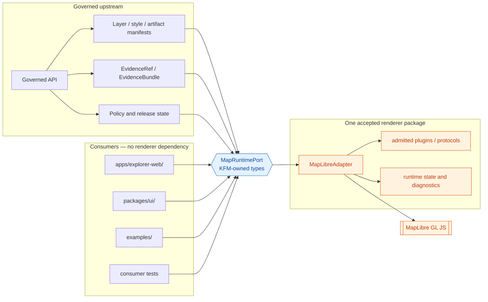

<!-- [KFM_META_BLOCK_V2]
doc_id: kfm://adr/0006
title: "ADR-0006 — MapLibre Boundary: Only MapLibreAdapter Imports MapLibre"
type: adr
adr_id: ADR-0006
version: v1.3
status: draft
effective_decision_status: proposed
owners:
  - "OWNER_TBD — architecture stewardship assignment is not verified"
reviewers_required:
  - Docs steward
  - Map/runtime steward
  - Explorer Web subsystem owner
  - Package/tooling owner
created: 2026-05-10
updated: 2026-08-13
policy_label: public
truth_posture: cite-or-abstain
owning_root: docs/
responsibility_root: docs/
current_path: docs/adr/ADR-0006-maplibre-boundary--only-maplibreadapter-imports-maplibre.md
responsibility: "Record the proposed single MapLibre runtime-acquisition seam, its KFM-owned public boundary, enforcement burden, migration obligations, and rollback without granting dependency, runtime, release, or publication authority."
supersedes: []
superseded_by: []
evidence_snapshot:
  repository: bartytime4life/Kansas-Frontier-Matrix
  base_ref: main
  base_commit: 695748928f254c2c234b9058bf41cdb23f27e3c6
  base_tree: 7faf955013a020cbf0bf64f3a013ec68af427b77
  docs_adr_tree: 2172a10e9b0e97b9ecb46c04d307417381f5c6c8
  target_prior_blob: 2e40267d80a474dc53ceda81e5bbf9fce3939149
  adr_index_blob: 938c5894c36b99e14810918e2c550ab0e92d53b1
  adr_readme_blob: b497be1714b88550d2f1eb151bc20a6351e99dec
  adr_0029_blob: 3ba5f902ffe20a65a259cb0a7dab07f1725d204b
  directory_rules_blob: fd49a0b83e55cef52c1124281f093e263526898d
  packages_root_blob: 7b672f4d834b648f4b30ce7e2e9a5e214efa2c71
  package_readme_blob: 3ba48e7d61b013a659ed51b9336eee788d06b8f2
  package_metadata_blob: b0582955feeb51016327113692fa5c98ecad8816
  package_entry_blob: 91664eb00583f9e3d0405eb7954fefa9a48f4ee9
  root_package_blob: 5cba790c88c40b885cc65fe2d585f3205aa1ef9d
  pnpm_workspace_blob: 3ff5faaaf5f139c707e338e7e89e51606e9e0ace
  pnpm_lock_blob: 69a45e6aaca1ea6521e01ff274e4f1b3e1bf3975
  explorer_package_blob: ddd201b74a06001d84a14bf54ac62a6cc3607a29
  app_adapter_blob: 663ba0f7a05498948f67d644387c73ab19d5c16c
  app_boundary_test_blob: 97d44069b0a5ab4a82b1e1fc48665e905c08a287
  v6_readiness_validator_blob: 88bc8bcfb894eaa7871e53d130a93a2e0258be49
  v6_readiness_test_blob: 2e0b6a4b9fe237e13bde9a09f057bcdb6a03a066
  v6_readiness_fixture_blob: 1bf82ae6c8966be3b1baf01620bf8f4deb7be95b
  briefing_campaign_blob: 7a73f5ad044a4e496d8e897b160e9b5c79e1dd94
  map_runtime_readme_blob: 4d3897eda64d11f84f4805cb9cc2bc30a2ee333c
  map_runtime_boundary_blob: baf929fdca617ea95ea4ce5bde4c7b8abd9ac6d5
  map_shell_blob: 9e1fa4e8293d26c62b9a323d5302ad9a01aa1979
  maplibre_tests_readme_blob: b20a14eae605017b7d7f210f1c27768cacbd411a
  maplibre_workflow_blob: 306040e1c9283be5a95de76c09d205a58038f380
  schemas_maplibre_readme_blob: 9560ed016077964b56988d7fb4c02fe34e42fb28
  smoke_harness_blob: 699dd4cf42d355dd2ed7620852b7fd1f3000bbe2
  sole_renderer_adr_blob: 6bfd66b1169728d7fad08f0bb2d7e2a56e3577b2
  latest_applicable_maplibre_run_head: 9205823798b19f37ba7c4dc2761850584948b027
  latest_applicable_maplibre_run: "31759518767 — success with explicit WORKFLOW_HOLD"
  latest_applicable_maplibre_job: "94642665467"
  codeowners_blob: dd2a84aa514d8ecd9208bc347f90f9a2ed37dd61
related:
  - docs/adr/README.md
  - docs/adr/INDEX.md
  - docs/adr/ADR-0005-apps-explorer-web-is-the-canonical-map-first-shell.md
  - "docs/adr/ADR-0007 — MapLibre GL JS Is the Sole Browser-Side Renderer.md"
  - docs/adr/ADR-0029-adopt-directory-governance-standard-v2.md
  - docs/doctrine/directory-rules.md
  - docs/architecture/map-shell.md
  - docs/architecture/ui/MAP_RUNTIME_BOUNDARY.md
  - packages/README.md
  - packages/maplibre/README.md
  - packages/maplibre/package.json
  - packages/maplibre/src/index.ts
  - package.json
  - pnpm-workspace.yaml
  - pnpm-lock.yaml
  - apps/explorer-web/package.json
  - apps/explorer-web/src/adapters/MapLibreAdapter.ts
  - apps/explorer-web/src/features/map_runtime/README.md
  - tests/policy/test_explorer_web_adapter_boundary.py
  - tests/maplibre/README.md
  - tests/maplibre/test_validate_v6_readiness.py
  - fixtures/maplibre/v6_readiness/cases.json
  - tools/validators/maplibre/validate_v6_readiness.py
  - .github/workflows/briefing-implementation-campaign.yml
  - .github/workflows/maplibre-perf-governance.yml
tags: [kfm, adr, map-shell, renderer-boundary, dependency-rule, maplibre, adapter, import-boundary, trust-membrane, no-parallel-authority]
notes:
  - "v1.3 is a same-path, documentation-only, repository-grounded reconciliation; it does not accept ADR-0006, add dependencies, or change runtime behavior."
  - "ADR-0006 numbering and exact tracked path are confirmed by docs/adr/INDEX.md; source metadata remains draft and effective decision status remains proposed."
  - "ADR-0029 is accepted and adopts Directory Rules v2; the adopted rules choose packages/ as a responsibility root but do not select a MapLibre child-package name."
  - "The repository contains dependency-free packages/maplibre/ as private @kfm/maplibre 0.0.0 with a placeholder export and a comment-only Explorer adapter; no functioning MapLibreAdapter is established."
  - "The v6-readiness validator implements a bounded package-only scan, but it does not enforce one literal adapter module, inspect all acquisition mechanisms or source roots, or reconcile dependency detection with package ownership."
  - "The current-tree v6-readiness scan returns HOLD because MapLibre is unpinned and all six browser probes remain NOT_RUN; fixture readiness is not implementation proof."
  - "The latest applicable MapLibre performance job succeeded while explicitly recording WORKFLOW_HOLD and producing no browser, receipt, proof, release, correction, rollback, or upload output."
[/KFM_META_BLOCK_V2] -->

<a id="top"></a>

# ADR-0006 — MapLibre Boundary: Only `MapLibreAdapter` Imports MapLibre

> **Proposed decision.** KFM will have one browser-renderer dependency seam. Only the accepted `MapLibreAdapter` implementation may acquire or import MapLibre runtime APIs and renderer-bound plugins; every consumer uses KFM-owned `MapRuntimePort` / adapter types and governed inputs.

[](#1-status)
[](#31-current-repository-evidence)
[](#71-current-enforcement-snapshot)
[](#62-what-the-adapter-must-not-do)

> [!IMPORTANT]
> **Repository configuration is not reviewed decision authority.** The current tree contains a dependency-free MapLibre package scaffold, a comment-only Explorer adapter, two non-equivalent import checks, a v6 readiness lane, and a separate performance harness. Those surfaces do not accept this ADR, establish a functioning adapter, prove a complete acquisition inventory, or authorize map/data publication.

**Quick navigation:** [Header](#0-adr-header) · [Status](#1-status) · [Summary](#2-summary) · [Context](#3-context) · [Decision](#4-decision) · [Scope](#5-scope) · [Boundary contract](#6-boundary-contract) · [Enforcement](#7-enforcement) · [Consequences](#8-consequences) · [Alternatives](#9-alternatives-considered) · [Migration and rollback](#10-migration--rollback) · [Open questions](#11-open-questions) · [References](#12-references)

---

## 0. ADR Header

| Field | Current value |
|---|---|
| **ID** | `ADR-0006` — unique and confirmed in the canonical human [`INDEX.md`](./INDEX.md) |
| **Title** | MapLibre Boundary: only `MapLibreAdapter` imports MapLibre |
| **Source metadata** | `draft` |
| **Effective decision status** | `proposed` — not binding until the ADR and index carry reviewed `accepted` status |
| **Created** | 2026-05-10 |
| **Updated** | 2026-08-13 |
| **Current tracked path** | `docs/adr/ADR-0006-maplibre-boundary--only-maplibreadapter-imports-maplibre.md` |
| **Logical boundary** | One `MapRuntimePort` and one `MapLibreAdapter` implementation seam |
| **Current physical package candidate** | [`packages/maplibre/`](../../packages/maplibre/README.md) — repository-present private `@kfm/maplibre` `0.0.0` scaffold; no sibling package was found |
| **Accepted placement authority** | [`ADR-0029`](./ADR-0029-adopt-directory-governance-standard-v2.md) adopts Directory Rules v2, which selects `packages/` as the reusable-implementation root but does not select a MapLibre child-package name |
| **Supplied design-lineage name** | `packages/maplibre-runtime/` — proposed in supplied design documents, absent at the pinned tree, and not adopted placement authority |
| **Related renderer choice** | [`ADR-0007`](<./ADR-0007 — MapLibre GL JS Is the Sole Browser-Side Renderer.md>) — present, effective status `proposed` |
| **Amends Directory Rules** | No. This ADR operationalizes renderer dependency isolation; it does not create or rename a canonical root. |
| **Publication effect** | None. A Markdown edit, package scaffold, import test, screenshot, performance run, commit, or pull request does not publish a KFM claim or map artifact. |

> [!NOTE]
> **Template conformance.** This record preserves the ADR fields required by the repository ADR operating contract: ID, title, status, date, context, decision, consequences, alternatives, migration, and rollback. It keeps its original identity, filename, H1, and major section anchors.

[Back to top](#top)

---

## 1. Status

### 1.1 Current decision and implementation posture

| Concern | Status | Safe conclusion |
|---|---|---|
| ADR inventory | **CONFIRMED** | ADR-0006 is uniquely indexed at this exact filename among 34 numbered records; ADR-0029 alone is accepted and the other 33 are proposed. |
| Decision authority | **PROPOSED** | Source metadata remains `draft`; this record is present but not accepted. |
| MapLibre package path | **CONFIRMED current / design lineage unresolved** | `packages/maplibre/` exists. Supplied design lineage proposes `packages/maplibre-runtime/`; accepted Directory Rules choose neither child name. |
| Package identity | **CONFIRMED scaffold** | [`package.json`](../../packages/maplibre/package.json) declares `@kfm/maplibre`, `private: true`, version `0.0.0`. |
| Package implementation | **NOT ESTABLISHED** | [`src/index.ts`](../../packages/maplibre/src/index.ts) exports only `placeholder = true`; no functioning adapter is proven. |
| Explorer adapter | **CONFIRMED comment-only** | [`MapLibreAdapter.ts`](../../apps/explorer-web/src/adapters/MapLibreAdapter.ts) contains only the single-importer comment; it imports, exports, and implements nothing. |
| Package consumers | **NOT ESTABLISHED** | Bounded repository evidence found no established `@kfm/maplibre` consumer import. This is not a complete recursive inventory. |
| Import enforcement | **PARTIAL / CONFLICTED** | The v6 validator permits MapLibre imports anywhere under `packages/maplibre/`, while the older policy test permits MapLibre or Cesium imports anywhere under Explorer `adapters/`; neither enforces one literal adapter module or all acquisition mechanisms. |
| Workspace/toolchain | **CONFIRMED bounded** | Root pins `pnpm@11.17.0` and Node 22, `pnpm-lock.yaml` records Explorer and `packages/maplibre`, Explorer has real Vite/TypeScript/Vitest/Playwright commands, and generic root lint/test/build fail closed with `WORKFLOW_HOLD`. |
| Current v6 scan | **CONFIRMED `HOLD`** | The current tree reports `MAPLIBRE_DEPENDENCY_UNPINNED` and `RUNTIME_PROBES_PENDING`; all six browser probes are `NOT_RUN`. |
| Performance tooling | **CONFIRMED separate harness** | A root script loads MapLibre `5.5.0` from a public CDN and uses the global runtime outside the package seam. |
| Hosted workflow evidence | **CONFIRMED bounded hold** | Latest applicable run `31759518767` / job `94642665467` succeeded while explicitly recording `WORKFLOW_HOLD`; it ran no browser or trust-output stage. |
| Runtime/public behavior | **UNKNOWN** | No functioning client adapter, released layer flow, browser probe result, production runtime, or public deployment evidence was used to accept this decision. |

### 1.2 Acceptance gates

ADR-0006 SHOULD NOT move to `accepted` until equivalent evidence closes every gate below.

| Gate | Required evidence | Fail-closed result when missing |
|---|---|---|
| **A — One physical home** | Reviewed confirmation of `packages/maplibre/` or an explicit migration to a successor name, including compatibility treatment and no independently evolving sibling | Remain `proposed`; do not turn supplied design lineage into a second package authority |
| **B — Functional seam** | A tested `MapRuntimePort` and one concrete `MapLibreAdapter` implementation with KFM-owned public types | No consumer migration; package remains scaffold |
| **C — Complete acquisition inventory** | Recursive inventory of static imports, type imports, dynamic imports, `require`, re-exports, workers, CDN scripts, globals, plugin imports, and protocol registration | Treat enforcement coverage as incomplete |
| **D — Dependency ownership** | Accepted package manifest owns approved MapLibre/runtime/plugin dependencies, the pnpm lock closes them, and the version-readiness scan inspects the same owning manifest | DENY dependency introduction outside the accepted seam; do not satisfy readiness by placing `maplibre-gl` in Explorer or root |
| **E — Consumer migration** | Explorer Web, shared UI, examples, tests, and other consumers use the KFM port; no public type leaks raw renderer types | Hold acceptance |
| **F — Harness disposition** | Root performance/smoke runtime is moved behind the seam or recorded as a bounded test-only exception with owner, scope, expiry, network posture, and rollback | Treat the harness as known divergence |
| **G — Structural enforcement** | Repository-wide deterministic validator covers the resolved seam, dependency manifests, imports/re-exports, workers, CDN/globals, plugins/protocols, fixtures, and explicit exceptions; positive/negative tests and CI invoke it | Existing bounded checks remain incomplete |
| **H — Reviewed transition** | Named reviewers approve; ADR and canonical index move together to `accepted`; acceptance evidence is recorded | Remain `proposed` |

[Back to top](#top)

---

## 2. Summary

KFM doctrine treats MapLibre as a **downstream renderer and interaction runtime**, not a truth store, source registry, policy engine, evidence resolver, citation authority, release authority, or AI authority. A renderer boundary is therefore not merely a dependency-style preference. It is the executable edge of the trust membrane.

This ADR makes that boundary reviewable:

> **One renderer dependency seam.** MapLibre GL JS, its runtime types, its worker/runtime acquisition, and admitted renderer-bound plugins or protocols are reachable only inside the accepted `MapLibreAdapter` package. Upper layers depend on KFM-owned ports, handles, state, and events.

The rule protects four separations:

| Separation | Boundary effect |
|---|---|
| Evidence versus rendering | Clicks produce candidate identity and a governed resolution request; rendered feature properties never become proof by themselves. |
| Policy/release versus loading | Layer and asset loading consumes upstream decisions and released manifests; the adapter does not decide allow, release, or publication. |
| KFM types versus renderer types | `maplibregl.Map`, raw source/layer objects, raw events, and style-runtime types do not escape into UI/domain contracts. |
| Runtime implementation versus consumers | MapLibre/plugin/version changes remain behind one seam rather than spreading across apps and packages. |

### 2.1 Relationship to ADR-0007

ADR-0006 and ADR-0007 answer different questions:

| Record | Question |
|---|---|
| **ADR-0006** | Where may browser-renderer runtime dependencies be acquired, imported, initialized, and exposed? |
| **ADR-0007** | Which browser renderer is the proposed default/sole renderer, and how are additional renderer technologies governed? |

Neither record becomes accepted merely because the other exists. ADR-0006 does not silently accept ADR-0007, and ADR-0007 does not prove this import boundary is implemented.

[Back to top](#top)

---

## 3. Context

### 3.1 Current repository evidence

The prior revision captured a scaffold-era snapshot. Current repository evidence supports a more precise boundary without turning partial checks into implementation proof.

| Surface | Confirmed repository state | What it proves—and does not prove |
|---|---|---|
| [`docs/adr/INDEX.md`](./INDEX.md) | Exact ADR-0006 path is indexed; effective status `proposed`, source metadata `draft`; ADR-0029 alone is accepted among 34 numbered records | Proves inventory and status normalization, not acceptance |
| [`ADR-0029`](./ADR-0029-adopt-directory-governance-standard-v2.md) and [Directory Rules](../doctrine/directory-rules.md) | Accepted placement authority assigns reusable implementation to `packages/` and explicitly leaves renderer decisions to separate architecture records | Proves the responsibility root; does not choose `maplibre` versus `maplibre-runtime` |
| [`packages/maplibre/README.md`](../../packages/maplibre/README.md) | Repository-present, evidence-grounded package boundary README | Proves the package path and documented posture, not a functioning adapter |
| [`packages/maplibre/package.json`](../../packages/maplibre/package.json) | `@kfm/maplibre`, private, `0.0.0` | Proves current package identity only; no dependency, export, build, or distribution contract |
| [`packages/maplibre/src/index.ts`](../../packages/maplibre/src/index.ts) | One placeholder export | Proves implementation is scaffold-level |
| [`package.json`](../../package.json), [`pnpm-workspace.yaml`](../../pnpm-workspace.yaml), and [`pnpm-lock.yaml`](../../pnpm-lock.yaml) | Root pins `pnpm@11.17.0`, Node 22, `apps/*` and `packages/*`; the lock records Explorer and the empty MapLibre importer; generic root lint/test/build exit `1` with `WORKFLOW_HOLD` | Proves package-manager/workspace/lock posture and fail-closed generic commands, not a buildable adapter or accepted dependency |
| [`apps/explorer-web/package.json`](../../apps/explorer-web/package.json) | Private `0.0.0`, ESM, with real Vite, TypeScript, Vitest, and Playwright commands; no MapLibre dependency | Proves an app toolchain and current dependency absence, not renderer wiring |
| [`MapLibreAdapter.ts`](../../apps/explorer-web/src/adapters/MapLibreAdapter.ts) | Contains one boundary comment and no import, export, class, or function | Proves the named path exists; does not implement the seam |
| [`map_runtime/`](../../apps/explorer-web/src/features/map_runtime/README.md) | Contains documentation plus headless-review, manifest-admission, mobile-PMTiles, and release-cache modules | Proves adjacent feature work exists; bounded inspection found no MapLibre runtime acquisition there and does not establish a renderer consumer |
| [`MAP_RUNTIME_BOUNDARY.md`](../architecture/ui/MAP_RUNTIME_BOUNDARY.md) | `MapRuntimePort` / `MapLibreAdapter` doctrine exists | Proves companion architecture language, not implementation |
| [`test_explorer_web_adapter_boundary.py`](../../tests/policy/test_explorer_web_adapter_boundary.py) | Scans Explorer Web source and allows map imports under app-local `adapters/` | Proves one bounded test exists; conflicts with package-only enforcement and is not repo-wide |
| [`validate_v6_readiness.py`](../../tools/validators/maplibre/validate_v6_readiness.py) | Scans `.js/.jsx/.mjs/.ts/.tsx` only under Explorer source and `packages/maplibre/src`; it permits matched MapLibre imports only under `packages/maplibre/` and checks three internal-transform patterns | Proves a deterministic bounded package-only classifier; not a one-module or repository-wide acquisition gate |
| [v6 readiness tests](../../tests/maplibre/test_validate_v6_readiness.py) and [fixtures](../../fixtures/maplibre/v6_readiness/cases.json) | Seven standard-library unit tests and five synthetic cases exercise readiness and one direct-import negative path | Proves classifier polarity on fixtures, not current runtime readiness or exhaustive syntax coverage |
| [`briefing-implementation-campaign.yml`](../../.github/workflows/briefing-implementation-campaign.yml) | Runs the seven tests, five fixture cases, and asserts the current scan exits `3` with dependency-unpinned and probes-pending reasons | Proves a command-bearing held lane, not dependency ownership, browser probes, or ADR acceptance |
| [`maplibre-smoke-perf.mjs`](../../scripts/maplibre-smoke-perf.mjs) | Loads MapLibre GL JS `5.5.0` from `unpkg.com` into a page and uses global `maplibregl.Map` | Proves a separate runtime acquisition path in test tooling; the current workflow syntax-checks it but deliberately does not execute browser/runtime claims |
| [`maplibre-perf-governance.yml`](../../.github/workflows/maplibre-perf-governance.yml) | Watches actual Explorer/MapLibre/pnpm paths, syntax-checks seven scripts, runs three scalar negatives, inventories the held workspace, and records explicit runtime/trust holds | Proves current static/inventory CI intent; it does not execute the adapter, browser, readiness classifier, release, or proof stages |
| Latest applicable MapLibre run/job | Run `31759518767`, job `94642665467`, head `9205823798b19f37ba7c4dc2761850584948b027`, later merged through PR #2753, concluded `success` plus explicit `WORKFLOW_HOLD` | Proves the reviewed hold stayed intact at that head; not exact-current-tree or release evidence |
| [`ADR-0007`](<./ADR-0007 — MapLibre GL JS Is the Sole Browser-Side Renderer.md>) | Renderer-choice ADR exists and remains proposed | Proves a related decision record is tracked; not acceptance or plugin admission |

### 3.2 Directory Rules basis and package-name lineage

Accepted ADR-0029 and Directory Rules v2 place reusable renderer implementation under `packages/`, deployable shell code under `apps/explorer-web/`, reusable checks under `tools/validators/`, and enforcement fixtures/tests under their governed roots. That responsibility split is authoritative for placement. Renderer selection and a child-package name remain separate architecture decisions.

The package name is not settled:

```text
accepted responsibility root:  packages/
current repository evidence:   packages/maplibre/
supplied design lineage:       packages/maplibre-runtime/  (absent at pinned tree)
```

The supplied `maplibre3d.md` and unified implementation manual propose `packages/maplibre-runtime/`. They are hash-bound design lineage, not tracked implementation or adopted placement authority. This ADR does **not** create a second package or silently rename the first. Until a reviewed implementation decision says otherwise:

1. `packages/maplibre/` is the **CONFIRMED current scaffold** and default implementation candidate.
2. `packages/maplibre-runtime/` is a **PROPOSED design-lineage name**, not a repository-present or accepted second home.
3. New functional adapter work MUST use one reviewed physical home and a migration/rollback plan.
4. Any compatibility path must be pointer-only, frozen, generated, or explicitly transitional; it must not evolve independently.

### 3.3 Operational problem

Without one renderer seam, the repository can accumulate several incompatible forms of renderer authority:

1. **Raw type leakage.** UI props and state become coupled to `maplibregl.Map`, raw events, renderer source/layer objects, or plugin-specific classes.
2. **Trust-membrane bypass.** Any component with a runtime handle can add a source, layer, protocol, endpoint, or plugin outside manifest/policy/release review.
3. **Multiple acquisition paths.** Package imports, app-local adapters, dynamic imports, CDN scripts, workers, examples, and test harnesses can each initialize a different runtime/version.
4. **False enforcement confidence.** A narrow source scan can pass while other apps, scripts, packages, generated files, or CDN/global runtime paths remain outside coverage.
5. **Migration and correction cost.** Runtime upgrades, plugin removals, security corrections, and renderer rollback require touching every consumer rather than one package boundary.

### 3.4 Truth and state vocabulary

- **CONFIRMED** — verified from the pinned repository evidence named in this revision.
- **PROPOSED** — the architectural decision or future implementation state.
- **UNKNOWN** — evidence is insufficient for a stronger claim.
- **NEEDS VERIFICATION** — a concrete check is identified but not closed.
- **CONFLICTED** — repository surfaces or doctrine currently imply incompatible ownership or enforcement.

`draft`, `proposed`, `accepted`, `superseded`, and `rejected` are document/decision lifecycle states. They are not substitutes for the truth labels above.

[Back to top](#top)

---

## 4. Decision

If accepted, ADR-0006 makes the following rule binding.

> **Only the accepted `MapLibreAdapter` implementation boundary MAY acquire, import, initialize, or expose the browser-side MapLibre runtime and renderer-bound plugins. All other repository code MUST depend on KFM-owned ports and types.**

### 4.1 Logical boundary before physical path

`MapLibreAdapter` is a logical architectural role. The ADR title names the sole dependency-owning implementation boundary; it does not prove the current comment-only file is that implementation or require every future package-internal helper to live in one literal source file. Acceptance must bind the role and its allowed internal modules to exactly one physical package. The current candidate is `packages/maplibre/`; a different child name requires an explicit migration decision.

The implementation MUST NOT create both as active packages. During migration, one may be a compatibility pointer or generated bridge only when its status, source, consumers, sunset/review date, and rollback are explicit.

### 4.2 Runtime acquisition is broader than an ES import

The boundary applies to every mechanism that introduces or exposes the renderer:

- static `import` and type-only `import`;
- CommonJS `require`;
- dynamic `import()`;
- package re-exports and barrel files;
- browser `<script>` and `<link>` tags that acquire MapLibre runtime assets;
- globals such as `maplibregl`;
- workers and worker URLs;
- direct construction of `maplibregl.Map` or equivalent renderer objects;
- MapLibre protocol registration;
- renderer-bound plugins and custom-layer hosts;
- test/example harnesses, unless a reviewed bounded exception applies.

A rule that scans only `import ... from "maplibre-gl"` is insufficient.

### 4.3 KFM-owned public surface

The accepted package exposes renderer-agnostic, KFM-owned capabilities. Names below are architectural vocabulary; exact TypeScript signatures remain proposed until a semantic contract and implementation are reviewed.

| Capability | KFM surface | Raw renderer leakage allowed? |
|---|---|---:|
| Lifecycle | create/initialize adapter; destroy and release resources | No |
| Layer binding | bind/remove a released `LayerManifest` / style/artifact reference | No |
| Camera and view | serializable `CameraState`, bounds, projection, time context | No |
| Interaction | KFM `MapInteractionEvent` with candidate identity / evidence lookup ref | No |
| Runtime state | loading, ready, stale, degraded, denied, withdrawn, rollback, error | No |
| Plugins/protocols | admitted registry entries initialized inside the package | No |
| Testability | fake/in-memory `MapRuntimePort` implementation | No MapLibre dependency in consumers |

### 4.4 Forbidden consumer coupling

```ts
// ❌ Forbidden outside the accepted renderer package.
import maplibregl from "maplibre-gl";
import type { Map, MapMouseEvent } from "maplibre-gl";
import * as StyleSpec from "@maplibre/maplibre-gl-style-spec";

const map = new maplibregl.Map(/* ... */);
```

```ts
// ✅ Illustrative consumer posture. Exact exports remain PROPOSED.
import type { MapRuntimePort, CameraState, MapInteractionEvent } from "@kfm/maplibre";

export function bindMapRuntime(runtime: MapRuntimePort): void {
  runtime.onInteraction((event: MapInteractionEvent) => {
    // Forward candidate identity to governed claim resolution.
    // Do not treat rendered feature properties as the claim.
  });
}
```

`@kfm/maplibre` is a **CONFIRMED current scaffold name**, not an accepted public API or distribution promise.

### 4.5 Style-spec and static-tooling exception

Runtime or UI imports from `@maplibre/maplibre-gl-style-spec` remain inside the accepted renderer package.

A static schema/build/validation tool MAY receive a reviewed exception only when all of the following are true:

1. the tool is not browser/runtime code;
2. the exception is in an explicit allowlist consumed by the structural validator;
3. no MapLibre runtime object or type is re-exported to consumers;
4. dependency ownership and version pinning are explicit;
5. positive and negative tests prove the exception remains narrow;
6. an owner, review date, and rollback/removal path are recorded.

### 4.6 No renderer authority by implication

The adapter may reject malformed or unapproved inputs, but it does not originate truth, source authority, rights, sensitivity, evidence closure, review approval, release state, or publication.

```text
Source / evidence / policy / review / release
        -> governed API and released manifests
        -> MapRuntimePort
        -> MapLibreAdapter
        -> MapLibre runtime and admitted plugins
```

[Back to top](#top)

---

## 5. Scope

### 5.1 In scope

- Browser-side MapLibre GL JS runtime acquisition and imports.
- Renderer-bound MapLibre packages, types, workers, protocols, and custom-layer/plugin hosts.
- App, package, example, script, test, and documentation examples that initialize the browser renderer.
- Re-exports or wrapper modules that expose MapLibre types indirectly.
- Package-manifest dependency ownership for the renderer and renderer-bound plugins.
- KFM-owned `MapRuntimePort` / adapter type boundary.
- Import/acquisition inventory, deterministic validation, negative tests, CI wiring, exceptions, migration, correction, and rollback.

### 5.2 Out of scope

- Server-side tile generation, PMTiles/COG creation, spatial processing, or catalog emission that does not load a browser renderer.
- Style JSON as released data. The style artifact is governed by contracts, schemas, policy, manifests, and release state; the JSON file itself is not a runtime import.
- Selecting the sole renderer or admitting a plugin version; ADR-0007 and policy/release controls govern those questions.
- Field-level object shapes, package implementation, dependency installation, or app migration in this documentation-only revision.
- Changing lifecycle, schema, contract, policy, source, receipt, proof, or release homes.
- Accepting ADR-0006 or ADR-0007.

### 5.3 Boundary diagram


```mermaid
flowchart LR
    subgraph Upstream["Governed upstream"]
        API["Governed API"]
        LM["Layer / style / artifact manifests"]
        EB["EvidenceRef / EvidenceBundle"]
        PD["Policy and release state"]
    end

    subgraph Consumers["Consumers — no renderer dependency"]
        EW["apps/explorer-web/"]
        UI["packages/ui/"]
        EX["examples/"]
        CT["consumer tests"]
    end

    PORT{{"MapRuntimePort<br/>KFM-owned types"}}

    subgraph Seam["One accepted renderer package"]
        ADAPTER["MapLibreAdapter"]
        PLUGINS["admitted plugins / protocols"]
        HEALTH["runtime state and diagnostics"]
    end

    MGL[["MapLibre GL JS"]]

    API --> LM
    API --> EB
    API --> PD
    LM --> PORT
    EB --> PORT
    PD --> PORT

    EW --> PORT
    UI --> PORT
    EX --> PORT
    CT --> PORT

    PORT --> ADAPTER
    ADAPTER --> PLUGINS
    ADAPTER --> HEALTH
    ADAPTER --> MGL

    classDef boundary fill:#e3f2fd,stroke:#1565c0,color:#0d47a1
    classDef renderer fill:#fff3e0,stroke:#e65100,color:#bf360c
    class PORT boundary
    class ADAPTER,PLUGINS,HEALTH,MGL renderer
```

> [!NOTE]
> The diagram describes the proposed responsibility flow. It does not claim the adapter, port, manifests, plugin registry, or consumer wiring is currently implemented.

[Back to top](#top)

---

## 6. Boundary Contract

### 6.1 What `MapLibreAdapter` must do

1. **Consume governed inputs.** Accept released/validated manifest-shaped inputs and finite upstream states; do not infer release or policy from URLs, filenames, feature properties, or style visibility.
2. **Keep raw handles private.** Do not return or re-export `maplibregl.Map`, raw source/layer objects, raw worker handles, plugin classes, or raw renderer events.
3. **Translate events.** Convert click, camera, source, load, and error events into KFM-owned serializable events and states.
4. **Treat clicks as candidates.** A click may carry feature/layer identity and an evidence lookup reference; it never becomes a supported claim without governed resolution.
5. **Surface negative states.** Preserve stale, denied, abstained, conflict, degraded, withdrawn, rollback, invalid-payload, and error states supplied by governed services.
6. **Own renderer effects.** Initialize/destroy MapLibre, register protocols/workers/plugins, bind sources/layers, and remove all listeners/resources inside the package.
7. **Keep sensitivity upstream.** Render only public-safe or authorized derivatives. Style-only hiding is not sensitivity enforcement.
8. **Support fakes.** Consumers must be testable against a fake `MapRuntimePort` without a MapLibre dependency or network.
9. **Keep runtime health separate from evidence.** Diagnostics and performance state may support operations; they do not prove a domain claim.
10. **Preserve correction and rollback visibility.** A withdrawn or rolled-back artifact must be removable or visibly blocked through the same seam.

### 6.2 What the adapter must not do

| Must not | Why |
|---|---|
| Read RAW, WORK, QUARANTINE, canonical stores, graph/vector stores, model runtimes, or credentials | Public runtime uses governed interfaces and released artifacts |
| Decide source authority, rights, sensitivity, review, evidence closure, or release | Those responsibilities belong upstream |
| Call arbitrary unregistered public tile/data/plugin URLs as the normal path | Endpoint, dependency, and artifact admission must be inspectable |
| Treat a successful render, screenshot, popup, feature property, or runtime metric as truth | Renderer output is a downstream carrier |
| Hide sensitive geometry only with style filters | Underlying bytes may still disclose the geometry |
| Re-export renderer or plugin types | Re-exporting recreates a second dependency seam |
| Persist authoritative decisions or claim publication | The adapter is not a policy, evidence, proof, or release store |
| Emit raw model language or use AI output as feature truth | AI is interpretive and evidence-subordinate |

### 6.3 What callers must do

| Caller | Obligation |
|---|---|
| `apps/explorer-web/` | Depend on the KFM port/package; pass governed inputs; send click candidates to governed resolution; render finite states honestly |
| `packages/ui/` | Render KFM-owned state/events; never cast handles to MapLibre types or assume style visibility equals access |
| Other apps/packages | Use the same port or a separately accepted non-browser contract; do not initialize another browser renderer seam |
| Examples | Demonstrate consumer usage; renderer-internal examples live with the accepted package |
| Tests outside package | Test port behavior/fakes and negative states; renderer-internal integration tests live with or target the accepted package |
| Docs | Explain and link the boundary; documentation never substitutes for the structural validator or runtime evidence |

### 6.4 Exception contract

A temporary exception is not a comment or an `eslint-disable`. It requires a reviewed record containing at least:

```yaml
exception_id: stable-id
scope: exact paths and acquisition mechanism
reason: why the accepted seam cannot yet express the need
owner: verified owner or role assignment
allowed_state: test-only | migration-only | internal-preview
forbidden_uses:
  - public runtime
  - release or publication authority
expires_or_review_by: YYYY-MM-DD
validation_refs: []
remediation: extend seam | move harness | remove dependency
rollback: exact removal/revert path
```

Missing or expired exception evidence fails closed.

[Back to top](#top)

---

## 7. Enforcement

### 7.1 Current enforcement snapshot

Current enforcement is **bounded, partial, and internally inconsistent**—not absent and not complete.

| Surface | Confirmed behavior | Gap relative to this ADR |
|---|---|---|
| `tools/validators/maplibre/validate_v6_readiness.py` | Scans five source suffixes under only `apps/explorer-web/src` and `packages/maplibre/src`; matches `from`, dynamic `import()`, or `require()` of the exact `maplibre-gl` specifier; permits matches anywhere under `packages/maplibre/` | Package-only signal, but not one-module enforcement; misses side-effect imports, subpath/alias specifiers, other packages/apps/scripts/examples, manifests, globals/CDNs, workers, stylesheets, and plugin/protocol acquisition |
| v6 readiness dependency scan | Reads `maplibre-gl` only from root and Explorer dependency fields | Conflicts with this ADR's proposed package ownership: placing the dependency only in `packages/maplibre/package.json` would remain “unpinned,” while placing it in Explorer could satisfy version detection but violate the seam |
| Current-tree v6 readiness result | Exits `3` with `HOLD`; exact reasons are `MAPLIBRE_DEPENDENCY_UNPINNED` and `RUNTIME_PROBES_PENDING`; six probes are `NOT_RUN` | Correctly denies readiness, but the absence of a reported import violation proves only the bounded scanned syntax/roots |
| `tests/maplibre/test_validate_v6_readiness.py` plus fixture cases | Seven unit tests and five synthetic cases include a direct app import violation | Positive/negative classifier evidence only; no side-effect, re-export-only, CDN/global, worker, plugin, manifest-owner, or exact-adapter-module case |
| `tests/policy/test_explorer_web_adapter_boundary.py` | Scans `.ts/.tsx/.js/.jsx` under Explorer; permits MapLibre or Cesium lines starting with `import ` / `from ` anywhere inside app-local `adapters/` | Contradicts the package-only target, misses dynamic/CommonJS/re-export/global mechanisms, and permits multiple local adapter files |
| Root and Explorer commands | Generic root lint/test/build fail closed; Explorer exposes real build/unit/browser commands | Useful toolchain posture, but neither command set is the accepted repository-wide ADR-0006 gate |
| `packages/maplibre/` and Explorer adapter | Dependency-free private scaffold, placeholder export, and comment-only app adapter | No functioning seam, public API, consumer, or package declaration surface exists to test |
| `scripts/maplibre-smoke-perf.mjs` | Acquires MapLibre `5.5.0` CSS/JS via external CDN and uses global `maplibregl.Map` | Known test-tooling acquisition outside the package; needs migration or a bounded exception disposition |
| Briefing campaign | Runs v6 tests/fixtures and asserts the current held result | Command-bearing no-network readiness lane, not exhaustive acquisition enforcement |
| MapLibre performance workflow and latest applicable job | Static/inventory lane succeeded and explicitly recorded `WORKFLOW_HOLD`; browser/trust stages remained skipped | Does not execute the v6 classifier, browser performance, adapter, receipt, proof, release, correction, rollback, or upload stages |

### 7.2 Required inventory

The implementation packet must generate a reviewable inventory for at least:

```text
maplibre-gl
@maplibre/* runtime packages
three
3d-tiles-renderer
@deck.gl/* / deck.gl
maplibre-gl-lidar
maplibre-three-plugin
pmtiles protocol registration
maplibregl globals
unpkg/jsdelivr/CDN MapLibre script or stylesheet URLs
new Worker(...) / workerUrl bindings
re-exports of renderer types or objects
```

The exact plugin list is governed by ADR-0007 and plugin admission. ADR-0006 requires the inventory mechanism to be extensible to that list.

### 7.3 Structural validator

The current command is implemented and deterministic:

```text
python3 tools/validators/maplibre/validate_v6_readiness.py --scan-root .
```

Its import scan is useful seed logic, not sufficient ADR-0006 enforcement. Prefer extending the existing `tools/validators/maplibre/` lane or adding a deliberately registered companion after checking for equivalent implementation. A dedicated command remains **PROPOSED**:

```text
python3 tools/validators/maplibre/validate_import_boundary.py
```

A sufficient validator should:

- parse relevant JavaScript/TypeScript imports rather than depend only on raw substring matching;
- inspect dynamic imports, CommonJS, re-exports, workers, and browser script/global acquisition where feasible;
- inspect package manifests for dependency ownership, including the accepted package manifest rather than only root/Explorer;
- read one explicit allowlist/exception source;
- reject paths outside the one accepted package and, if the accepted design requires it, outside the declared adapter-internal module allowlist;
- enumerate bounded roots and excluded/generated/vendor surfaces in machine-readable output;
- emit stable file, line, dependency, mechanism, and reason-code diagnostics;
- return deterministic success/failure/system-error outcomes;
- avoid network access;
- be exercised by positive and negative fixtures.

### 7.4 Package-manifest rule

After the package home is resolved:

| Manifest | Renderer/runtime dependency posture |
|---|---|
| Accepted renderer package | Owns approved runtime/plugin dependencies and exports |
| `apps/explorer-web/package.json` | Depends on the KFM package/port, not MapLibre/runtime plugins directly |
| `packages/ui/package.json` | KFM types/port only; no renderer runtime dependency |
| Root package | Tooling/workspace coordination only unless an explicit dependency-management rule says otherwise |
| Test/example manifests | No direct runtime dependency unless inside the accepted renderer package or covered by a reviewed test-only exception |

The workspace manager and lockfile format are **CONFIRMED** (`pnpm@11.17.0`, lockfile v9). The exact dependency section, package export/build strategy, workspace protocol, browser bundle, and supply-chain admission rules remain **NEEDS VERIFICATION**. The v6 readiness validator must be reconciled so its version owner is the same manifest this ADR permits to own the renderer.

### 7.5 Required tests

At minimum:

1. a valid package-internal runtime import passes;
2. an Explorer Web feature import fails;
3. an app-local `adapters/` runtime import fails unless the accepted physical seam is deliberately app-local through a superseding decision;
4. a type-only raw MapLibre import fails;
5. a dynamic import fails;
6. a re-export fails;
7. a package-manifest dependency outside the seam fails;
8. a CDN/global acquisition fixture fails or matches a reviewed test-only exception;
9. a fake-port consumer passes with no MapLibre dependency;
10. raw MapLibre types are absent from the accepted package's public API declaration surface.

### 7.6 PR review rule

> [!WARNING]
> A change that introduces renderer acquisition outside the accepted seam must be moved, expressed through the KFM port, or accompanied by a reviewed exception/superseding ADR. “Temporary,” “test only,” or “already behind an adapter folder” is not sufficient evidence by itself.

### 7.7 Validation commands

Commands below separate checks that exist now from the proposed complete gate.

```bash
python tools/validators/validate_adr_index.py
python -m unittest discover --start-directory tests/maplibre --pattern 'test_validate_v6_readiness.py' --verbose
python tools/validators/maplibre/validate_v6_readiness.py --fixtures

# Current-tree expectation: exit 3 / HOLD, not PASS or implementation proof.
python tools/validators/maplibre/validate_v6_readiness.py --scan-root .

# PROPOSED complete boundary after the validator and tests exist:
python tools/validators/maplibre/validate_import_boundary.py
python -m pytest tests/maplibre/test_import_boundary.py -q --strict-config --strict-markers
```

A green check proves only the declared import/acquisition boundary for the checked revision. It does not prove evidence closure, policy approval, rights/sensitivity clearance, release readiness, runtime correctness, performance, accessibility, security, or KFM publication.

[Back to top](#top)

---

## 8. Consequences

### 8.1 Positive consequences

- **The trust membrane gains an executable dependency edge.** Renderer effects become reachable through one audited package rather than ambient runtime handles.
- **Consumer code stays testable.** Explorer Web and shared UI can use a fake port without MapLibre, network, DOM, or WebGL.
- **Dependency and plugin review becomes finite.** Version, license, supply-chain, worker, endpoint, and protocol review converge on one package.
- **Runtime correction is more reversible.** A vulnerable runtime/plugin can be removed or rolled back without changing every consumer API.
- **Rendered candidates remain distinct from supported claims.** Event translation makes the EvidenceRef/EvidenceBundle path visible.
- **Import drift becomes machine-detectable.** Static, dynamic, re-export, package, CDN/global, and exception states can be inspected together.

### 8.2 Costs and tradeoffs

- The port must evolve intentionally as renderer capabilities grow.
- Existing app-local adapter doctrine/testing may need migration and could expose hidden coupling.
- A complete validator is more work than a single ESLint pattern.
- Test/performance harnesses need a deliberate package or exception home.
- The physical package-name conflict must be resolved before implementation can be described as canonical.
- Strict isolation can make some MapLibre-specific optimization APIs harder to expose; the answer is a reviewed KFM capability, not a raw-handle escape hatch.

### 8.3 Current operational effect

This revision changes documentation only. It does not:

- create `MapLibreAdapter` or `MapRuntimePort` source;
- rename `packages/maplibre/`;
- create `packages/maplibre-runtime/`;
- add or change dependencies, the existing pnpm lock, exports, build scripts, tests, validators, or workflows;
- modify the existing Explorer Web boundary test;
- change the v6 readiness classifier or its current `HOLD` result;
- move or exempt the performance harness;
- accept ADR-0006 or ADR-0007;
- publish a map, layer, package, release, or claim.

### 8.4 Risk register

| Risk | Current signal | Mitigation |
|---|---|---|
| Package scaffold is mistaken for an implemented adapter | `0.0.0`, placeholder export, no dependencies/consumers | Keep maturity explicit; acceptance Gate B |
| Two package homes emerge | `packages/maplibre/` exists while supplied design lineage proposes absent `packages/maplibre-runtime/` | Gate A; apply accepted `packages/` placement without laundering design lineage into a second authority |
| App-local adapters become a second seam | Existing policy test allows imports under Explorer Web `adapters/`; the comment-only named adapter is not implementation | Reconcile or replace the test after physical-home decision; require one resolved seam |
| CDN harness bypasses dependency ownership | Root smoke script loads `unpkg.com/maplibre-gl@5.5.0` | Move behind package or approve bounded exception with expiry |
| Readiness version scan rewards the wrong owner | Validator reads root/Explorer manifests but allows imports in the package | Read the accepted package manifest; add owner-conflict and package-positive fixtures |
| Narrow scans miss acquisition paths | Current checks cover different roots and limited syntax | AST/manifest/browser-acquisition validator plus exact-root inventory and negative fixtures |
| Raw types leak through KFM package exports | No functional public API exists yet | Declaration/API tests and no-re-export rule |
| Style-spec tooling exception grows into runtime coupling | Exception need remains open | Explicit allowlist, non-runtime constraint, tests, review date |
| A held workflow is mistaken for boundary proof | Applicable job succeeded while recording `WORKFLOW_HOLD` | Preserve outcome vocabulary and cite exact executed/skipped stages |
| ADR-0006 and ADR-0007 diverge | Both remain proposed | Cross-review, shared package/exception vocabulary, no implicit acceptance |

[Back to top](#top)

---

## 9. Alternatives Considered

### 9.1 Alternative A — Soft convention only (rejected)

Document the rule in architecture pages and rely on review.

**Rejected:** the decision exists specifically to make renderer isolation executable. A prose-only boundary cannot detect dynamic imports, re-exports, manifest drift, or CDN/global acquisition.

### 9.2 Alternative B — Allow imports anywhere under `apps/explorer-web/src/adapters/` (rejected under this ADR)

Treat the app-local adapter directory as the allowed seam.

**Rejected:** this is the current bounded test posture, but it creates an app-specific renderer seam rather than a reusable package seam and allows more than one module. It remains a possible competing design only through a superseding decision that explains reuse, tests, ownership, dependency, and migration consequences.

### 9.3 Alternative C — Allow renderer imports in `packages/ui/` (rejected)

Treat shared UI as renderer-aware.

**Rejected:** shared UI should remain reusable and KFM-type-oriented. Raw MapLibre coupling weakens separation and makes non-map consumers carry renderer dependencies.

### 9.4 Alternative D — One adapter per deployable (rejected for the default path)

Place a renderer wrapper in every app.

**Rejected:** dependency/version/plugin/admission logic would repeat across Explorer Web, review surfaces, examples, and future clients. One accepted package remains the smaller governance surface.

### 9.5 Alternative E — Network/RPC-isolated renderer (deferred)

Run the renderer in an iframe, worker, browser service, or headless process and expose messages only.

**Deferred:** useful for screenshots, previews, or stronger isolation, but it does not remove the need for one KFM port and one dependency owner.

### 9.6 Alternative F — Permit root performance harness as a permanent parallel runtime (not selected)

Treat the CDN/global smoke script as outside the rule.

**Not selected:** test tooling is still software supply-chain and runtime acquisition. A bounded temporary exception may be appropriate, but permanent exemption would create unreviewed version/network drift.

### 9.7 Alternative G — Ban all style-spec usage outside the renderer package (open)

Apply the rule to runtime and static tooling with no exceptions.

**Open:** runtime/UI coupling should be banned. Static schema/build validation may justify a narrow allowlist. Acceptance requires evidence from actual tooling rather than a blanket exception.

[Back to top](#top)

---

## 10. Migration & Rollback

### 10.1 Migration plan

1. **Freeze the decision surface.** Recheck ADR-0006, ADR-0007, accepted ADR-0029/Directory Rules, open PRs/branches, package READMEs, and current validators at the implementation base.
2. **Confirm one package home.** Retain `packages/maplibre/` or explicitly migrate it to a reviewed successor name; document why supplied `maplibre-runtime` lineage is adopted or rejected, old-to-new mapping, consumers, compatibility class, sunset/review date, and rollback. Do not create an independently evolving sibling.
3. **Inventory every acquisition path.** Include apps, packages, scripts, tests, examples, workers, package manifests, dynamic imports, re-exports, CDN/global loading, protocols, and plugins.
4. **Define the semantic port.** Review the `MapRuntimePort` / public capability contract before raw renderer implementation details spread.
5. **Implement the adapter in the accepted package.** Add package metadata, dependencies, exports, build/type configuration, KFM-owned public types, internal runtime wiring, and package-local tests.
6. **Migrate Explorer Web and other consumers.** Replace direct/app-local runtime ownership with the accepted port; preserve visible behavior in the migration packet.
7. **Reconcile both current checks.** Make the Explorer policy test and v6 classifier express the same accepted seam; remove Cesium allowance unless a reviewed exception/ADR requires it; cover the declared adapter-internal module boundary.
8. **Disposition the smoke/performance harness.** Move runtime acquisition into package-owned test support, or attach a time-bounded test-only exception and remove external-network assumptions where practical.
9. **Enforce dependency ownership.** Preserve the confirmed pnpm workspace/lock posture, move version detection to the accepted owning manifest, pin the approved dependency exactly, and reject renderer dependencies outside the seam.
10. **Add structural validation and CI.** Run deterministic positive/negative tests; ensure path filters include the actual package and Explorer Web paths.
11. **Update connected docs.** Repair links in map-shell, Map Runtime Boundary, package/app/test READMEs, and the ADR index only where the reviewed implementation changes status or terminology.
12. **Transition status deliberately.** Move ADR-0006 and `INDEX.md` together only after all acceptance gates close.

### 10.2 Definition of done

- [ ] One physical package home is reviewed and documented; no parallel active renderer package exists.
- [ ] A functional adapter implements a reviewed KFM port.
- [ ] The accepted package owns approved renderer/runtime/plugin dependencies.
- [ ] Complete acquisition inventory is stored or reproducible for review.
- [ ] No unexcepted renderer acquisition exists outside the accepted package.
- [ ] Consumer public types expose no raw MapLibre/plugin handles or events.
- [ ] Explorer Web and at least one fake-port test operate without direct renderer dependency.
- [ ] Current app-local policy test and v6 import scan are reconciled and cover positive/negative acquisition and ownership paths.
- [ ] CDN/global harness is migrated or governed by an unexpired bounded exception.
- [ ] Structural validator emits deterministic diagnostics and runs in CI.
- [ ] Package, app, test, and architecture docs agree on the accepted seam.
- [ ] ADR/index status transition carries reviewed evidence and no publication claim.

### 10.3 Rollback of this document revision

Restore the immediate prior target blob:

```text
2e40267d80a474dc53ceda81e5bbf9fce3939149
```

That rollback returns v1.2 prose only. The older `fba9562322a263876bb5b1096b8093746dd43990` blob remains pre-v1.2 lineage, not the immediate rollback target. Neither rollback changes package code, dependencies, tests, workflows, runtime state, or ADR acceptance.

### 10.4 Architectural rollback or supersession

If the decision is later rejected or replaced:

1. keep ADR-0006 as history;
2. set its status to `rejected` or `superseded` with matching index state;
3. link the successor in both directions;
4. identify the replacement dependency seam and why it is smaller/safer;
5. migrate consumers and dependencies through a reviewed old-to-new map;
6. preserve security/correction records for released software or map artifacts affected by the change;
7. remove compatibility paths only after consumer and rollback evidence closes.

Do not rewrite shared history or silently convert app-local imports into accepted architecture.

### 10.5 Backward compatibility

This decision does not alter public data schemas, evidence contracts, policy decisions, source identities, lifecycle phases, release manifests, or published artifact identities. A later implementation may change internal imports and package paths while preserving consumer-visible KFM behavior through the port.

[Back to top](#top)

---

## 11. Open Questions

The target path and ADR number are confirmed. The unresolved work is architectural convergence and implementation evidence.

| Question | Status | Required evidence / decision |
|---|---|---|
| Is current `packages/maplibre/` confirmed as the implementation home, or does a later decision migrate it to another child name? | **NEEDS VERIFICATION** | ADR-0006/ADR-0007 review, accepted `packages/` placement, supplied-lineage disposition, migration and rollback plan |
| Is `@kfm/maplibre` retained as the internal package name? | **NEEDS VERIFICATION** | Package API, naming, distribution, and migration decision |
| What is the reviewed `MapRuntimePort` semantic contract and versioning rule? | **OPEN** | Contract review, implementation, consumer tests |
| Does “only `MapLibreAdapter`” mean one literal source module or an explicit package-internal implementation set behind one public adapter? | **OPEN** | Accepted public/internal module contract and validator allowlist |
| What role remains for `apps/explorer-web/src/adapters/`? | **CONFLICTED** | Reconcile the comment-only file and app-local policy test with the package seam; update code/test/docs together |
| Which renderer/plugin dependencies are admitted and where is the allowlist indexed? | **OPEN** | ADR-0007 plus policy/control-plane/package decision |
| How is static style-spec tooling allowed without leaking runtime coupling? | **OPEN** | Actual tooling inventory and narrow exception tests |
| What happens to the root CDN/global smoke harness? | **NEEDS VERIFICATION** | Move, hermetic rewrite, or reviewed test-only exception with expiry |
| Is the v6 readiness validator extended or paired with a dedicated boundary validator? | **NEEDS VERIFICATION** | Exact syntax/root/mechanism coverage, stable reason codes, validator registration, positive/negative fixtures, CI definition |
| How is v6 dependency detection moved from root/Explorer manifests to the accepted package owner? | **CONFLICTED** | One manifest ownership rule, package-positive and outside-owner-negative fixtures, current-HOLD transition criteria |
| Which dependency section, exact version, export/build, and pnpm-lock rules govern the accepted package? | **NEEDS VERIFICATION** | Package and supply-chain decision; pnpm manager/workspace/lock format are already confirmed |
| Which check becomes required before acceptance? | **NEEDS VERIFICATION** | Ruleset/branch-protection evidence plus stable workflow/job identity |
| Who holds architecture, map-runtime, package, QA, and docs review responsibilities? | **NEEDS VERIFICATION** | Stewardship assignments; CODEOWNERS routing alone is insufficient |
| Does a headless/server-side preview use this package, a sibling non-browser package, or a service boundary? | **OPEN** | Concrete use case, effect boundary, dependency and security review |

Track implementation gaps in [`VERIFICATION_BACKLOG.md`](../registers/VERIFICATION_BACKLOG.md) and confirmed structural contradictions in [`DRIFT_REGISTER.md`](../registers/DRIFT_REGISTER.md) when the implementation packet is authorized. This documentation-only revision does not write those registers.

[Back to top](#top)

---

## 12. References

### 12.1 Repository decision and placement evidence

- [ADR operating contract](./README.md)
- [Canonical ADR index](./INDEX.md)
- [ADR-0005 — Explorer Web shell](./ADR-0005-apps-explorer-web-is-the-canonical-map-first-shell.md)
- [ADR-0007 — Sole browser-side renderer](<./ADR-0007 — MapLibre GL JS Is the Sole Browser-Side Renderer.md>)
- [ADR-0029 — Adopt Directory Governance Standard v2](./ADR-0029-adopt-directory-governance-standard-v2.md)
- [Directory Rules](../doctrine/directory-rules.md)
- [CODEOWNERS](../../.github/CODEOWNERS) — review routing only, not acceptance evidence

### 12.2 Current package, app, and enforcement evidence

- [Packages root](../../packages/README.md)
- [MapLibre package boundary README](../../packages/maplibre/README.md)
- [MapLibre package metadata](../../packages/maplibre/package.json)
- [MapLibre package placeholder entry](../../packages/maplibre/src/index.ts)
- [Repository workspace metadata](../../package.json)
- [pnpm workspace declaration](../../pnpm-workspace.yaml)
- [pnpm workspace lock](../../pnpm-lock.yaml)
- [Explorer Web package metadata](../../apps/explorer-web/package.json)
- [Explorer Web comment-only MapLibre adapter](../../apps/explorer-web/src/adapters/MapLibreAdapter.ts)
- [Explorer Web Map Runtime feature README](../../apps/explorer-web/src/features/map_runtime/README.md)
- [Current Explorer Web adapter-boundary test](../../tests/policy/test_explorer_web_adapter_boundary.py)
- [MapLibre test-lane README](../../tests/maplibre/README.md)
- [MapLibre v6 readiness validator](../../tools/validators/maplibre/validate_v6_readiness.py)
- [MapLibre v6 readiness tests](../../tests/maplibre/test_validate_v6_readiness.py)
- [MapLibre v6 readiness fixtures](../../fixtures/maplibre/v6_readiness/cases.json)
- [Briefing implementation campaign](../../.github/workflows/briefing-implementation-campaign.yml)
- [MapLibre performance/smoke harness](../../scripts/maplibre-smoke-perf.mjs)
- [MapLibre performance workflow](../../.github/workflows/maplibre-perf-governance.yml)
- [MapLibre performance-schema compatibility boundary](../../schemas/maplibre/README.md)

### 12.3 Companion architecture

- [Map Shell architecture](../architecture/map-shell.md)
- [Map Runtime Boundary](../architecture/ui/MAP_RUNTIME_BOUNDARY.md)

### 12.4 Source doctrine used for the decision intent

The KFM MapLibre operating manual establishes the central doctrine used here: MapLibre is the disciplined rendering and interaction surface downstream of evidence, policy, review, and release—not the truth, policy, citation, publication, or AI authority. The supplied 3D and implementation documents additionally propose a `packages/maplibre-runtime/` implementation family. These sources are contextual design lineage; they are not tracked repository bytes, accepted ADRs, runtime evidence, or authority to create that package.

| Supplied artifact | SHA-256 | Bounded use in this ADR |
|---|---|---|
| `KFM_MapLibre_Operating_Architecture_Governed_UI_AI_Interaction_Manual_REVISED.pdf` | `77f56ec1ab632b76c7728cfb250330271b7dc8948db95c8c0594c92ad9ca6b36` | Downstream-renderer, public-client, evidence, policy, sensitivity, plugin, and release boundaries |
| `Master MapLibre Components-Functions-Features.pdf` | `309cf67311059c549e144ae9961b2f49eddf1caab8739a51b47ae88c2f5c1c90` | Capability and integration context only; not KFM admission or implementation proof |
| `maplibre3d.md` | `5148c85acaef7f299864df5b1804eb07498cb81ab4c4bcc39a9625287ee2817b` | Proposed `packages/maplibre-runtime/` and package-only imports as design lineage |
| `Unified Implementation Architecture Build Manual.md` | `e92500f9b40007e8b69d183ecaa6247c542ffec25857875ecd2dbd00709785b1` | Renderer-downstream doctrine and proposed package placement, explicitly requiring repository verification |
| `Repository Structure Guiding Document.md` | `afe08af316d1f89779bab0d39888cdc65ee989907806a4126c331c50e4a0aa3a` | `packages/` responsibility and compatibility-context lineage; not adopted authority by itself |

### 12.5 Pinned repository evidence ledger

| Evidence | Identity | Bounded use |
|---|---|---|
| Default branch and tree | `695748928f254c2c234b9058bf41cdb23f27e3c6` / `7faf955013a020cbf0bf64f3a013ec68af427b77` | Repository snapshot for this revision |
| ADR directory tree / immediate prior ADR-0006 bytes | `2172a10e9b0e97b9ecb46c04d307417381f5c6c8` / `2e40267d80a474dc53ceda81e5bbf9fce3939149` | Concurrency/no-loss baseline and document rollback target |
| Canonical ADR index / stale adjacent README | `938c5894c36b99e14810918e2c550ab0e92d53b1` / `b497be1714b88550d2f1eb151bc20a6351e99dec` | 34-record identity/status inventory and adjacent count drift |
| ADR-0029 / adopted Directory Rules | `3ba5f902ffe20a65a259cb0a7dab07f1725d204b` / `fd49a0b83e55cef52c1124281f093e263526898d` | Accepted responsibility-root and placement authority |
| ADR-0007 | `6bfd66b1169728d7fad08f0bb2d7e2a56e3577b2` | Proposed renderer-family companion; no implicit acceptance |
| Packages root / MapLibre package docs | `7b672f4d834b648f4b30ce7e2e9a5e214efa2c71` / `3ba48e7d61b013a659ed51b9336eee788d06b8f2` | Current package-root posture and scaffold description |
| MapLibre manifest / entry | `b0582955feeb51016327113692fa5c98ecad8816` / `91664eb00583f9e3d0405eb7954fefa9a48f4ee9` | Dependency-free private package and placeholder export |
| Root package / workspace / lock | `5cba790c88c40b885cc65fe2d585f3205aa1ef9d` / `3ff5faaaf5f139c707e338e7e89e51606e9e0ace` / `69a45e6aaca1ea6521e01ff274e4f1b3e1bf3975` | pnpm, Node, workspace, command, and dependency-state evidence |
| Explorer package / adapter | `ddd201b74a06001d84a14bf54ac62a6cc3607a29` / `663ba0f7a05498948f67d644387c73ab19d5c16c` | Real app toolchain, no renderer dependency, and comment-only adapter |
| App-local policy test | `97d44069b0a5ab4a82b1e1fc48665e905c08a287` | Conflicting Explorer-adapters-only heuristic boundary |
| v6 validator / tests / fixtures / campaign | `88bc8bcfb894eaa7871e53d130a93a2e0258be49` / `2e0b6a4b9fe237e13bde9a09f057bcdb6a03a066` / `1bf82ae6c8966be3b1baf01620bf8f4deb7be95b` / `7a73f5ad044a4e496d8e897b160e9b5c79e1dd94` | Bounded classifier, polarity evidence, workflow wiring, and current-hold assertion |
| Smoke harness | `699dd4cf42d355dd2ed7620852b7fd1f3000bbe2` | Live-CDN MapLibre 5.5.0 acquisition evidence |
| Performance workflow / schema boundary | `306040e1c9283be5a95de76c09d205a58038f380` / `9560ed016077964b56988d7fb4c02fe34e42fb28` | Static/inventory checks, permissive compatibility schemas, and explicit hold |
| Latest applicable MapLibre run / job | Head `9205823798b19f37ba7c4dc2761850584948b027`; run `31759518767`; job `94642665467` | Success plus explicit hold on a head later merged through PR #2753; not exact-current-tree or release proof |

Counts, hashes, paths, run results, and bounded absences are snapshot evidence. They do not establish acceptance, exhaustive repository history, browser behavior, dependency admission, or public release.

[Back to top](#top)

---

<details>
<summary><strong>Appendix A — No-loss modernization ledger</strong></summary>

| v1.2 element | v1.3 disposition |
|---|---|
| ADR identity, filename, H1, source `draft`, effective `proposed`, and sections 0–12 | Preserved; no status promotion or implementation effect |
| Single-importer/acquisition decision | Preserved across static, type, dynamic, CommonJS, re-export, worker, CDN/global, plugin, protocol, and exception mechanisms |
| Trust-membrane rationale and KFM-owned public surface | Preserved; current implementation evidence remains downstream and non-authoritative |
| `packages/maplibre/` versus `packages/maplibre-runtime/` | Corrected: adopted Directory Rules choose only the `packages/` root; current `maplibre` is repository evidence and `maplibre-runtime` is supplied design lineage |
| `@kfm/maplibre` name and package posture | Preserved as a confirmed dependency-free private scaffold, not an accepted API/distribution |
| Forbidden/permitted TypeScript examples | Preserved and clarified as illustrative |
| Scope / non-scope | Preserved; ADR-0007 relationship and scripts/harnesses clarified |
| Mermaid boundary diagram | Preserved in updated responsibility form |
| Adapter MUST / MUST NOT duties | Preserved and expanded for sensitivity, corrections, fakes, plugins, and runtime health |
| Linter / dependency / manifest enforcement | Preserved; reconciled with the implemented v6 classifier, the conflicting app-local test, syntax/root gaps, and dependency-owner contradiction |
| Consequences and risk register | Preserved; added held-workflow and readiness-owner risks without widening implementation scope |
| Alternatives A–E | Preserved in substance; current app-local-adapter and harness alternatives made explicit |
| Migration and definition of done | Preserved; updated for confirmed pnpm/lock posture and reconciliation of both current checks |
| Document and architectural rollback | Preserved; immediate rollback corrected from pre-v1.2 `fba956…` to v1.2 `2e402…`, with older lineage retained |
| Open questions | Preserved and refined around literal-module semantics, app adapter role, version-owner conflict, package rules, and hosted enforcement |
| References | Preserved and expanded with exact current repository links, five hash-bound supplied references, and a pinned evidence ledger |

</details>

<details>
<summary><strong>Appendix B — Before/after upgrade matrix</strong></summary>

| Area | v1.2 | v1.3 |
|---|---|---|
| Repository posture | Stale TODO/no-lock claims and no app adapter evidence | Confirms pnpm/Node workspace lock, fail-closed root commands, real Explorer toolchain, comment-only adapter, held classifiers, and CDN harness |
| Placement authority | Attributed `maplibre-runtime` to Directory Rules | Separates accepted `packages/` authority, current `packages/maplibre/`, and supplied `maplibre-runtime` lineage |
| Import enforcement | Explorer app-local heuristic treated as the only check | Adds the implemented package-only v6 scan, its seven tests/five cases, exact current `HOLD`, and conflicting semantics |
| Dependency ownership | Generic accepted-package requirement | Exposes that readiness reads root/Explorer rather than the proposed package owner and makes reconciliation an acceptance gate |
| Boundary semantics | Package seam implied without addressing the title's literal-module reading | Clarifies logical adapter role versus a reviewed package-internal module set |
| Workflow evidence | Static workflow description only | Adds exact applicable run/job, executed/skipped boundary, and explicit hold |
| Supplied references | Generic operating-manual statement | Adds five named hashes and explicitly limits them to contextual design lineage |
| Rollback | Pointed to pre-v1.2 `fba956…` | Points to immediate v1.2 `2e402…` and retains older lineage |

</details>

<details>
<summary><strong>Appendix C — Evidence boundary</strong></summary>

This revision is grounded in repository content at `main@695748928f254c2c234b9058bf41cdb23f27e3c6`, the blob identities recorded in the KFM Meta Block and evidence ledger, and the named supplied-reference hashes. It does not claim:

- a complete recursive import/dependency inventory;
- a functioning MapLibre adapter or consumer;
- an exact-current-tree successful MapLibre workflow run or browser execution;
- an accepted child-package name, public API, dependency/version, plugin set, dependency-owner rule, or package build/export contract;
- runtime, deployment, release, publication, performance, accessibility, or security readiness;
- human review or ADR acceptance.

The repository could change after the pinned snapshot. Re-run the inventory and concurrency checks before any implementation or status transition.

</details>

---

_Last updated 2026-08-13 · Document version: v1.3 · Source metadata: `draft` · Effective decision status: `proposed` · Implementation: dependency-free scaffold / bounded checks / explicit hold · Publication effect: none · [Back to top](#top)_
