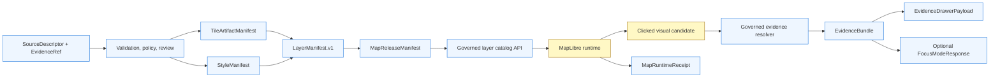

<!-- [KFM_META_BLOCK_V2]
doc_id: kfm://doc/NEEDS-VERIFICATION
title: ADR-0006 — MapLibre Layer Manifest
type: standard
version: v1
status: draft
owners: OWNER_TBD
created: NEEDS VERIFICATION
updated: 2026-05-02
policy_label: NEEDS VERIFICATION
related: [../architecture/maplibre/README.md, ../architecture/maplibre/CONTRACTS.md, ../architecture/maplibre/DELIVERY.md, ../architecture/maplibre/TEST_PLAN.md, ../../schemas/contracts/v1/maplibre/layer_manifest.schema.json, ../../schemas/contracts/v1/maplibre/style_manifest.schema.json, ../../schemas/contracts/v1/maplibre/tile_artifact_manifest.schema.json, ../../schemas/contracts/v1/maplibre/map_release_manifest.schema.json, ../../tests/fixtures/maplibre/]
tags: [kfm, adr, maplibre, layer-manifest, evidence, governance, release]
notes: [doc_id, owners, created date, policy_label, ADR numbering, and related path existence need verification in the active repository; schema paths are PROPOSED until the repo-native schema home is verified; this ADR is grounded in KFM MapLibre operating doctrine, KFM UI doctrine, and KFM artifactization doctrine; updated date reflects this current-session revision, not a committed repository timestamp]
[/KFM_META_BLOCK_V2] -->

<a id="top"></a>

# ADR-0006 — MapLibre Layer Manifest

Adopt `LayerManifest.v1` as the governed contract that tells the MapLibre shell what a released layer may render, cite, withhold, badge, time-scope, and resolve.


> [!IMPORTANT]
> **ADR status:** `PROPOSED`  
> **Target file:** `docs/adr/ADR-0006-maplibre-layer-manifest.md`  
> **Primary decision:** KFM MapLibre layers must be loaded through a governed `LayerManifest.v1`, not through ad hoc style JSON, raw feature properties, direct canonical reads, or UI-local assumptions.  
> **Implementation depth:** `UNKNOWN` until the active repository tree, schema home, tests, workflows, policy tooling, emitted artifacts, and runtime routes are inspected.

**Quick jumps:** [Decision](#decision) · [Status and evidence boundary](#status-and-evidence-boundary) · [Context](#context) · [LayerManifest responsibilities](#layermanifest-responsibilities) · [Runtime flow](#runtime-flow) · [Contract shape](#contract-shape) · [Rejected alternatives](#rejected-alternatives) · [Consequences](#consequences) · [Validation gates](#validation-gates) · [Rollout](#rollout) · [Follow-up documentation](#follow-up-documentation) · [Open verification](#open-verification)

---

## Decision

KFM will treat `LayerManifest.v1` as the required layer contract for every public or semi-public MapLibre layer.

A `LayerManifest` is not the tile, not the style, not the source of truth, and not the release authority. It is the map-layer-facing governance envelope that binds a released layer to:

- source descriptors and source roles,
- tile, raster, or vector artifact manifests,
- style manifests,
- release state,
- evidence policy,
- geometry and sensitivity policy,
- time model,
- stale-source behavior,
- trust badges and negative states,
- Evidence Drawer resolution,
- Focus Mode eligibility,
- correction and rollback state.

`LayerManifest.v1` must be validated before a layer is exposed through the governed layer catalog or rendered in the KFM MapLibre shell.

> [!NOTE]
> This ADR defines the decision and expected contract boundary. The exact schema file home remains **NEEDS VERIFICATION**. The proposed default is:
>
> `schemas/contracts/v1/maplibre/layer_manifest.schema.json`
>
> If the active repository proves a different canonical schema location, adapt through a follow-up schema-home ADR or migration note. Do not create parallel schema authorities.

[Back to top](#top)

---

## Status and evidence boundary

This ADR is doctrine-grounded and implementation-bounded.

| Claim area | Status | What can be stated safely |
|---|---|---|
| MapLibre role | `CONFIRMED doctrine` | MapLibre is a disciplined 2D renderer and interaction runtime downstream of KFM trust controls. |
| Layer manifest decision | `PROPOSED` | `LayerManifest.v1` should become the layer-facing contract for public and semi-public MapLibre layers. |
| Field names and schema home | `PROPOSED / NEEDS VERIFICATION` | Field families are implementation guidance until repo-native contract naming and schema home are verified. |
| Actual repository implementation | `UNKNOWN` | This ADR does not prove checked-in routes, schemas, tests, validators, workflows, UI components, or emitted artifacts. |
| Public publication readiness | `DENY by default` | No public layer should be promoted unless evidence, rights, sensitivity, policy, release, and rollback gates pass. |

> [!CAUTION]
> Prior KFM reports and implementation references may preserve strong lineage or report public-repo observations, but this ADR does not upgrade them into current active-checkout proof. Current implementation behavior must be verified from the repository, tests, workflows, manifests, logs, or emitted artifacts before this ADR is treated as implemented.

### Evidence ledger

| Source | Status | Supports | Limits |
|---|---|---|---|
| Attached `Pasted markdown.md` baseline | `CONFIRMED source` | Existing ADR decision, contract boundary, runtime flow, validation gates, rollout, and open verification posture. | Does not prove repository implementation. |
| KFM MapLibre operating doctrine | `CONFIRMED doctrine / PROPOSED implementation` | MapLibre as downstream 2D renderer; minimal artifact set; click → resolver → Drawer → Focus thin-slice sequence. | Does not prove the active repo contains these files or tests. |
| KFM UI and governed AI doctrine | `CONFIRMED doctrine / PROPOSED implementation` | Evidence Drawer and Focus Mode must remain evidence-bounded and policy-aware. | Does not prove UI route/component maturity. |
| KFM artifactization and pipeline doctrine | `CONFIRMED doctrine / PROPOSED file plan` | SourceDescriptor, EvidenceBundle, DecisionEnvelope, ReleaseManifest, receipts, proof packs, correction, rollback, and finite outcomes. | Does not settle exact field names or schema placement. |
| Current active repository checkout | `UNKNOWN` | Needed to verify path names, ADR numbering, owners, schema home, package manager, CI, tests, and runtime behavior. | Not available in this revision pass. |

[Back to top](#top)

---

## Context

KFM’s map UI is part of the trust model, not decorative chrome. MapLibre may draw released artifacts, expose visual candidates, and return interaction context to governed services. It must not decide what is true, reviewed, public, cited, safe, corrected, or released.

A normal MapLibre style or TileJSON endpoint can describe how to render a layer. It does not, by itself, answer KFM’s governance questions:

| KFM question | Why style JSON or TileJSON alone is insufficient |
|---|---|
| Is this layer released? | Rendering metadata does not prove promotion state. |
| Which sources support it? | Render sources are not source-role descriptors. |
| May exact geometry be public? | Sensitivity and geoprivacy rules are policy state, not style state. |
| Is the source stale? | Tile metadata may omit cadence, freshness, and stale behavior. |
| Can a popup make a claim? | Popups must not become evidence authority. |
| Does a click resolve to an EvidenceBundle? | The renderer only identifies a candidate feature. |
| What was withheld? | Public-safe layers may need withheld-feature accounting. |
| Can Focus Mode answer from this layer? | AI eligibility depends on released evidence, policy, and citation validation. |
| How is rollback performed? | Map release state needs previous release and rollback references. |

KFM therefore needs a layer-level contract between the publication system and the UI shell. `LayerManifest.v1` fills that seam.

### Truth-label split

| Label | Applies here |
|---|---|
| `CONFIRMED` | KFM doctrine requires MapLibre to remain downstream of governed evidence, policy, review, release, and correction state. |
| `PROPOSED` | `LayerManifest.v1` field names, schema home, validator names, fixture names, API route names, and release file locations. |
| `UNKNOWN` | Actual checked-in schema location, route implementation, package manager, CI workflow, existing ADR numbering, current owners, and current UI/API maturity. |
| `NEEDS VERIFICATION` | `doc_id`, owners, created date, policy label, related path existence, schema-home authority, branch-enforced validation, and public-source rights. |

[Back to top](#top)

---

## LayerManifest responsibilities

`LayerManifest.v1` is responsible for the layer contract only. It should not absorb every related object.

| Object | Primary responsibility | Relationship to `LayerManifest.v1` |
|---|---|---|
| `SourceDescriptor` | Owner, source role, rights, access class, cadence, citation policy, sensitivity notes, verification status. | Referenced by source descriptor IDs. |
| `EvidenceRef` | Stable pointer from claim, layer, or feature to evidence. | Referenced directly or through `EvidenceBundle`. |
| `EvidenceBundle` | Resolved support object for Drawer and Focus. | Required for consequential layer claims. |
| `TileArtifactManifest` | Tile/raster/vector artifact identity, format, bounds, hash, build metadata, cache policy. | Referenced by `artifact_refs`. |
| `StyleManifest` | Style JSON hash, sprites, glyphs, font policy, accessibility and meaning-change controls. | Referenced by `style_refs`. |
| `MapReleaseManifest` | Release ID, released manifests/artifacts, proof pack, prior release, rollback target, public scope. | Owns publication state; points to layer manifests. |
| `EvidenceDrawerPayload` | User-visible trust object after a layer feature is selected. | Required output of governed evidence resolution. |
| `MapContextEnvelope` | Viewport, layer, time, selected feature, role, and release context for Focus Mode. | Derived from runtime state and manifest state. |
| `FocusModeResponse` | Finite AI outcome: `ANSWER`, `ABSTAIN`, `DENY`, or `ERROR`. | Allowed only when manifest and policy permit evidence-bounded synthesis. |
| `MapRuntimeReceipt` | Runtime audit record for interactions and resolution outcomes. | Emitted when runtime actions use released manifests. |

### What the manifest must say

A valid layer manifest must make these decisions explicit:

| Required decision | Expected manifest field family |
|---|---|
| Layer identity | `schema`, `layer_id`, `domain`, `title`, `description` |
| Release binding | `release_id`, `map_release_manifest_ref` |
| Artifact binding | `artifact_refs`, `tilejson_refs`, `source_artifact_refs` |
| Style binding | `style_refs`, `default_style_ref` |
| Evidence behavior | `evidence_policy`, `evidence_bundle_policy`, `drawer_payload_contract` |
| Popup behavior | `supports_popup_claims`, `popup_claim_policy` |
| Geometry behavior | `geometry_policy`, `sensitivity_class`, `public_precision`, `withheld_accounting_required` |
| Time behavior | `time_model`, `active_time_axes`, `stale_policy` |
| Trust cues | `trust_badges`, `negative_states`, `correction_state` |
| Access behavior | `access_class`, `role_requirements`, `public_release_allowed` |
| Validation behavior | `validator_refs`, `policy_refs`, `proof_refs` |
| Rollback behavior | `previous_layer_manifest_ref`, `rollback_target_ref` |

[Back to top](#top)

---

## Runtime flow

The layer manifest keeps the renderer downstream of trust. A click must travel from visual candidate to governed evidence resolution before any consequential claim is shown.



Above: the flow shows MapLibre as a runtime surface between released layer catalogs and governed evidence resolution. The renderer can identify a visual candidate; it cannot turn that candidate into an authoritative claim without EvidenceBundle resolution and policy-aware UI output.

**Runtime rule:** MapLibre may identify the candidate feature, layer ID, viewport, active time, and camera state. It must not read RAW, WORK, QUARANTINE, canonical evidence stores, review-only stores, steward-only stores, or model-runtime stores directly.

[Back to top](#top)

---

## Contract shape

The following shape is illustrative. It is not a complete JSON Schema and must not be copied into production without schema validation, policy review, source-rights review, and repo-native naming checks.

```json
{
  "schema": "kfm.map.layer_manifest.v1",
  "layer_id": "hydrology.huc12.public.v1",
  "domain": "hydrology",
  "title": "Public HUC12 Hydrologic Units",
  "description": "Public-safe hydrologic-unit layer backed by released evidence and governed artifacts.",
  "release_id": "maprelease_2026_04_huc12_demo",
  "map_release_manifest_ref": "maprelease_2026_04_huc12_demo",
  "artifact_refs": [
    "tileartifact_huc12_pmtiles_v1"
  ],
  "style_refs": [
    "style_kfm_public_default_v1"
  ],
  "source_descriptor_refs": [
    "source_usgs_wbd_huc12_public"
  ],
  "evidence_policy": {
    "requires_evidence_bundle": true,
    "supports_popup_claims": false,
    "drawer_payload_contract": "kfm.ui.evidence_drawer_payload.v1",
    "focus_mode_allowed": true,
    "focus_requires_citation_validation": true
  },
  "geometry_policy": {
    "public_precision": "exact_or_generalized_by_policy",
    "sensitive_exact_geometry_allowed": false,
    "withheld_accounting_required": true,
    "generalization_receipt_required": false
  },
  "time_model": {
    "active_time_axes": [
      "valid_time",
      "source_publication_time",
      "release_time",
      "stale_time"
    ],
    "default_axis": "valid_time"
  },
  "stale_policy": {
    "mode": "visible_badge_and_focus_abstain",
    "stale_after": "P1Y"
  },
  "access_policy": {
    "access_class": "public",
    "public_release_allowed": true,
    "role_requirements": []
  },
  "trust_badges": [
    "released",
    "citable",
    "public_safe"
  ],
  "negative_states": [
    "MISSING_EVIDENCE",
    "SOURCE_STALE",
    "DENIED_BY_POLICY",
    "GENERALIZED_GEOMETRY",
    "RESTRICTED_ACCESS",
    "CONFLICTED_SUPPORT",
    "CITATION_FAILED",
    "RELEASE_WITHDRAWN",
    "RUNTIME_ERROR"
  ],
  "correction_state": {
    "state": "current",
    "correction_notice_ref": null
  },
  "validator_refs": [
    "maplibre.layer_manifest.schema",
    "maplibre.no_public_raw_path",
    "maplibre.evidence_bundle_closure",
    "maplibre.sensitive_geometry_policy"
  ],
  "policy_refs": [
    "policy/maplibre/no_public_raw_path",
    "policy/maplibre/sensitive_geometry_deny",
    "policy/maplibre/stale_source_abstain"
  ],
  "previous_layer_manifest_ref": null,
  "rollback_target_ref": null
}
```

### Field discipline

| Field family | Decision |
|---|---|
| IDs | Use deterministic, stable IDs where practical. Avoid display-name identity. |
| Hashes | Artifact and style hashes belong in artifact/style manifests; `LayerManifest` references them rather than duplicating every hash. |
| Citations | `LayerManifest` indicates citation requirements; citations resolve through `EvidenceBundle` and `EvidenceDrawerPayload`. |
| Time | Do not collapse source time, valid time, release time, stale time, and runtime interaction time. |
| Policy | Policy references are auditable inputs. Policy decisions remain emitted objects, not hidden booleans. |
| Negative states | Missing, stale, denied, restricted, generalized, withdrawn, and failed states must be visible to the shell. |
| Accessibility | Trust states must not rely on color alone; badges need text or accessible labels. |
| Sensitive geometry | Exact geometry is denied or generalized unless evidence and policy explicitly allow it. |

[Back to top](#top)

---

## Rejected alternatives

| Alternative | Why rejected |
|---|---|
| Use MapLibre style JSON as the only layer contract. | Style JSON can encode render behavior, not KFM source roles, release state, EvidenceBundle requirements, sensitivity posture, stale policy, or rollback intent. |
| Use TileJSON as the only layer contract. | TileJSON describes tile access and bounds, not governance, evidence, review, or correction lineage. |
| Keep per-domain ad hoc layer configs. | Domain-specific configs would drift and make cross-domain UI trust behavior harder to validate. |
| Put all layer governance into `MapReleaseManifest` only. | Release manifests should govern publication state. The UI still needs a layer-level contract for rendering, evidence resolution, time behavior, and negative states. |
| Let the client infer policy from feature properties. | This bypasses the trust membrane and risks treating rendered properties as evidence authority. |
| Make popups the primary evidence surface. | Popups are too small and too easy to overread. The Evidence Drawer remains the trust object. |
| Load RAW or canonical stores directly in the browser. | Violates the KFM lifecycle and public-surface boundary. |
| Let Focus Mode read raw layer properties. | AI synthesis must be evidence-bounded and citation-validated, not generated from renderer-local properties. |

[Back to top](#top)

---

## Consequences

### Positive consequences

- The map shell gets a stable, reviewable layer contract.
- Layers become inspectable public surfaces rather than loose renderer configuration.
- Evidence Drawer and Focus Mode eligibility are visible before runtime interaction.
- Sensitive geometry, source rights, stale data, and correction state can fail closed.
- Style edits that change meaning can be tied to release governance.
- Release rollback can identify affected layers, styles, artifacts, caches, and dependent UI states.
- Cross-domain layers can share one validation posture without flattening domain meaning.

### Costs and tradeoffs

- Layer publication becomes slower because manifests, fixtures, and validation are required.
- The UI cannot treat arbitrary MapLibre sources as authoritative layers.
- Domain teams must preserve source-role and evidence state instead of emitting only tiles.
- Schema-home ambiguity must be resolved before machine enforcement.
- Existing layer configs, if present, may need migration into manifest-backed equivalents.
- Some public layers may render less detail when sensitivity or rights state requires generalization.

### Risks if not adopted

| Risk | Impact |
|---|---|
| Renderer becomes perceived truth authority. | Users may treat polished tiles or popups as authoritative claims. |
| Client-side filters leak sensitive data. | Hidden features or counts can expose restricted geometry. |
| Style changes alter meaning without release review. | A visual update can become an unreviewed semantic change. |
| Focus Mode receives raw layer properties. | AI can generate unsupported or policy-unsafe map claims. |
| Rollback lacks layer-level mapping. | Bad releases become harder to withdraw or explain. |

[Back to top](#top)

---

## Validation gates

The first implementation PR that introduces this ADR should include or explicitly defer each gate below.

| Gate | Required check | Expected failure behavior |
|---|---|---|
| Schema closure | `LayerManifest.v1` validates against repo-native JSON Schema tooling. | `ERROR` for malformed manifest. |
| Source closure | Every source descriptor ref resolves and carries role, rights, cadence, sensitivity, and citation policy. | `DENY` public promotion. |
| Artifact closure | Every artifact ref resolves to a tile/raster/vector artifact manifest with digest and bounds. | `DENY` release. |
| Style closure | Every style ref resolves to a style manifest with style hash, sprite/glyph/font posture, and accessibility notes. | `DENY` release or `HOLD` review. |
| Evidence closure | Consequential layer interactions resolve to `EvidenceBundle` or a visible negative state. | `ABSTAIN` in Drawer/Focus; no claim text. |
| Policy closure | Sensitive geometry, source rights, stale source, role restrictions, and missing evidence are evaluated before publication. | `DENY` or `ABSTAIN`, never silent render-as-authority. |
| Release closure | Released layers bind to `MapReleaseManifest`, prior release, rollback target, and cache invalidation plan. | `DENY` promotion. |
| UI closure | The shell shows trust badges, negative states, time context, correction state, and Drawer link. | E2E smoke failure. |
| No forbidden path | Browser cannot reach RAW, WORK, QUARANTINE, canonical stores, or direct model runtime. | CI failure. |
| Accessibility closure | Non-color trust cues, keyboard access, focus order, contrast, text alternatives, and reduced-motion behavior pass smoke checks. | `HOLD` or CI failure depending on severity. |
| Runtime receipt closure | Click, drawer resolution, Focus outcome, and negative states emit or link to auditable runtime receipts when required. | `ERROR` or test failure. |
| Rollback closure | A bad layer release can be withdrawn/restored without deleting correction history. | `DENY` release until rollback target exists. |

### Minimum fixture set

A credible first slice should include:

- one valid public-safe layer manifest,
- one stale-source manifest fixture,
- one sensitive-geometry deny fixture,
- one missing-evidence fixture,
- one withdrawn-release fixture,
- one matching `TileArtifactManifest`,
- one matching `StyleManifest`,
- one matching `MapReleaseManifest`,
- one `EvidenceBundle` fixture,
- one `EvidenceDrawerPayload` fixture,
- one `MapContextEnvelope` fixture,
- one `FocusModeResponse` for each finite outcome: `ANSWER`, `ABSTAIN`, `DENY`, `ERROR`,
- one rollback target fixture,
- one no-public-raw-path test.

[Back to top](#top)

---

## Rollout

### Phase 0 — Verify repo conventions

Before implementation claims are made, inspect:

- `git status`, branch, and dirty state,
- actual `docs/adr/` pattern and ADR numbering,
- existing ADR index, if any,
- schema home: `schemas/contracts/v1/`, `contracts/`, `jsonschema/`, or other,
- MapLibre UI app path,
- governed API path,
- test framework,
- CI workflow conventions,
- policy tooling,
- existing layer config and tile artifact conventions,
- CODEOWNERS and reviewer rules,
- current source registry and source-rights process,
- current release/proof/receipt artifact homes.

### Phase 1 — Contract and fixture slice

Create the smallest proof-bearing slice:

| File family | Proposed home | Notes |
|---|---|---|
| ADR | `docs/adr/ADR-0006-maplibre-layer-manifest.md` | This file. |
| Schema | `schemas/contracts/v1/maplibre/layer_manifest.schema.json` | `PROPOSED` until schema home is verified. |
| Fixtures | `tests/fixtures/maplibre/layer_manifest.valid.json` and invalid variants | Include valid, stale, sensitive-deny, missing-evidence, and withdrawn-release examples. |
| Validators | `tools/validators/maplibre/` or repo-native equivalent | Validate schema, source refs, artifacts, policies, release refs. |
| Policy | `policy/maplibre/` or repo-native equivalent | No public raw path, sensitive geometry deny, stale source abstain. |
| Release fixture | `data/published/maplibre/` or repo-native release fixture location | Use a public-safe hydrology/HUC12-style fixture if available. |
| UI smoke | `tests/e2e/maplibre/` or repo-native equivalent | Click → governed resolution → Drawer → optional Focus outcome. |

### Phase 2 — Governed layer catalog

Add or update the governed layer catalog so the UI can request only released layer manifests.

Illustrative API shape:

```yaml
paths:
  /api/map/layers:
    get:
      summary: List released public-safe map layer manifests.
  /api/map/layers/{layer_id}:
    get:
      summary: Resolve a single released layer manifest.
  /api/map/layers/{layer_id}/evidence:
    post:
      summary: Resolve clicked feature candidate to EvidenceDrawerPayload.
```

> [!CAUTION]
> Route names are **PROPOSED**. Use the repo-native governed API conventions after inspection.

### Phase 3 — UI binding

The MapLibre shell may consume a layer manifest only through the governed catalog API or a released manifest bundle.

The shell should display:

- layer release badge,
- evidence/citation badge,
- stale-source badge,
- generalized/withheld badge,
- sensitivity/access badge,
- correction/withdrawn badge,
- Evidence Drawer action,
- Focus Mode eligibility state.

### Phase 4 — Release and rollback

A layer is public only after:

1. manifest validation,
2. policy validation,
3. source-rights validation,
4. evidence closure,
5. release manifest closure,
6. proof-pack closure,
7. UI smoke validation,
8. rollback target validation,
9. reviewer/steward approval where required.

[Back to top](#top)

---

## Follow-up documentation

Update or create these docs in the same PR wave when behavior changes:

| Path | Update needed |
|---|---|
| `docs/architecture/maplibre/README.md` | Link to this ADR and summarize the layer contract. |
| `docs/architecture/maplibre/CONTRACTS.md` | Add `LayerManifest.v1` field map and cross-object relationships. |
| `docs/architecture/maplibre/DELIVERY.md` | Explain how layer manifests bind to MVT, PMTiles, MLT, COG, or Martin delivery. |
| `docs/architecture/maplibre/TEST_PLAN.md` | Add validation gates from this ADR. |
| `docs/adr/README.md` | Add ADR-0006 once ADR index conventions are verified. |
| `schemas/contracts/v1/maplibre/README.md` | Document schema family if this path becomes canonical. |
| `tests/fixtures/maplibre/README.md` | Describe valid and invalid fixture semantics. |
| `policy/maplibre/README.md` | Document fail-closed policies. |

> [!NOTE]
> Paths above are `PROPOSED` until verified against the active checkout. Do not create duplicate documentation authority if a repo-native path already exists.

[Back to top](#top)

---

## Rollback and correction behavior

Rollback is not deletion. A bad layer release should leave correction history inspectable.

| Event | Required response |
|---|---|
| Manifest schema failure before release | Block promotion with `ERROR`; keep validation report. |
| Rights or sensitivity failure before release | `DENY` public release; keep source/policy decision evidence. |
| Stale source discovered after release | Show stale badge; Focus Mode should `ABSTAIN` unless policy allows bounded historical context. |
| Sensitive geometry exposure discovered after release | Withdraw or generalize public layer; emit correction notice and transform receipt. |
| Style meaning-change discovered after release | Revert style or publish corrected release; preserve prior style ref and release lineage. |
| EvidenceBundle mismatch after release | Withdraw affected layer interactions or force Drawer/Focus negative state until repaired. |
| Cache contains withdrawn layer | Invalidate cache target and bind rollback to prior release manifest. |

Rollback target: `ROLLBACK_TARGET_TBD_AFTER_REPO_INSPECTION`

[Back to top](#top)

---

## Open verification

| Item | Status | Why it matters |
|---|---|---|
| ADR numbering and title pattern | `NEEDS VERIFICATION` | `ADR-0006` may collide with an existing ADR if the repo has changed. |
| `docs/adr/` index convention | `UNKNOWN` | This ADR may need index status, supersession links, or owner metadata. |
| Schema home | `UNKNOWN / CONFLICTED` | Avoid parallel schema authority between `contracts/`, `schemas/`, and any repo-specific schema home. |
| Owners | `NEEDS VERIFICATION` | Meta block must not invent steward ownership. |
| Policy label | `NEEDS VERIFICATION` | ADR appears public-safe, but repo label convention must be checked. |
| MapLibre package/version target | `NEEDS VERIFICATION` | Version-sensitive runtime details must be pinned by implementation evidence. |
| Existing layer config files | `UNKNOWN` | Migration plan depends on current implementation. |
| Existing EvidenceBundle schema | `UNKNOWN` | Manifest references must match actual schema names. |
| Existing ReleaseManifest / ProofPack schemas | `UNKNOWN` | Layer release binding must reuse established object families if present. |
| Current policy engine | `UNKNOWN` | OPA/Rego, Conftest, or repo-native policy tooling affects gate design. |
| Current CI enforcement | `UNKNOWN` | Validation gates require branch-real workflow wiring. |
| Public source rights for first layer | `NEEDS VERIFICATION` | Public rendering must fail closed on unclear rights. |
| Accessibility test path | `UNKNOWN` | Trust badges and negative states need non-color and keyboard verification. |
| Runtime receipt pattern | `UNKNOWN` | Map interactions that support claims should be auditable. |

[Back to top](#top)

---

## Decision summary

KFM will not let MapLibre layers become informal truth surfaces.

`LayerManifest.v1` is the governed layer contract that allows MapLibre to render released artifacts while preserving evidence, policy, sensitivity, time, release, correction, and rollback boundaries. The manifest keeps the renderer useful without letting it become the source of authority.

**Decision outcome:** `PROPOSED` pending repo verification, schema-home resolution, fixture validation, and maintainers’ ADR acceptance.

[Back to top](#top)
