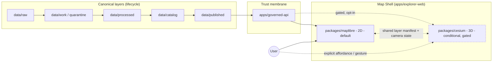

<!-- [KFM_META_BLOCK_V2]
doc_id: kfm://doc/adr-0007-cesium-3d-conditional-and-gated
title: ADR-0007 — Cesium 3D Is Conditional and Gated
type: standard
version: v1
status: draft
owners: <TBD — map-shell steward + governed-API steward + policy steward>
created: 2026-05-10
updated: 2026-05-10
policy_label: public
related:
  - docs/doctrine/directory-rules.md
  - docs/architecture/map-shell.md
  - docs/adr/ADR-0001-schema-home.md
  - packages/cesium/README.md
  - packages/maplibre/README.md
  - apps/explorer-web/README.md
  - apps/governed-api/README.md
tags: [kfm, adr, map-shell, cesium, 3d, governance]
notes:
  - Authority of this ADR is PROPOSED until accepted.
  - Path docs/adr/ADR-0007-... follows the ADR home in Directory Rules §6.1.
  - Owners and related links are placeholders; repo evidence not mounted this session.
[/KFM_META_BLOCK_V2] -->

# ADR-0007 — Cesium 3D Is Conditional and Gated

> **One-line decision.** In KFM, Cesium-based 3D is an **optional, opt-in, evidence-gated alternate renderer** behind the governed API — not a default surface, not a parallel truth path, and not a substitute for the 2D MapLibre shell.

  
  
  
  
  
  

**Quick jump:** [Status](#status) · [Context](#context) · [Decision](#decision) · [Gating Conditions](#gating-conditions) · [Architecture Boundary](#architecture-boundary) · [Conformance](#conformance) · [Consequences](#consequences) · [Alternatives](#alternatives-considered) · [Open Questions](#open-questions) · [References](#references)

---

## Status

| Field | Value |
|---|---|
| **ADR id** | `ADR-0007` |
| **Title** | Cesium 3D is conditional and gated |
| **Status** | `proposed` |
| **Date** | 2026-05-10 |
| **Supersedes** | — |
| **Superseded by** | — |
| **Amends Directory Rules?** | No (clarifies §11 and §7.2; does not change a canonical root) |
| **ADR class** | Governance + map-shell scope |
| **Owners** | Map-shell steward · governed-API steward · policy steward *(placeholder — assign on acceptance)* |
| **Required reviewers** | Docs steward, at least one subsystem owner (per Directory Rules §2.4 wording) |

> [!NOTE]
> Status is `proposed`. Until accepted, treat the rules in this ADR as PROPOSED. The doctrinal anchors it relies on — Directory Rules §11 and the Idea Atlas E.3 — are CONFIRMED in this session.

---

## Context

KFM's doctrinal posture on rendered surfaces is unambiguous: **tiles, maps, scenes, vector indexes, summaries, and generated text are not sovereign truth**. The Map Shell — whether 2D or 3D — is downstream of the lifecycle (`RAW → WORK / QUARANTINE → PROCESSED → CATALOG / TRIPLET → PUBLISHED`) and downstream of the trust membrane (`apps/governed-api/`). Anything that lets a 3D scene short-circuit that ordering is a violation of a core invariant, not a styling decision.

Three converging signals make a dedicated ADR worthwhile now.

**1. Directory Rules already pin the architecture, but not the gating.** Directory Rules §11 states that Cesium / 3D *“where present, MUST consume the same `EvidenceBundle` and `DecisionEnvelope` as 2D — it is an alternate renderer, not an alternate truth path,”* and §7.2 names `packages/cesium/` (alongside `packages/maplibre/`) as the canonical 3D package home with the parenthetical *“3D, optional”* in §13.3. The Rules establish the *boundary*; they do not yet establish **when** the 3D path may load, **under what evidence**, **with what fallbacks**, and **with what release-state implications**. That gap is the subject of this ADR.

**2. The Idea Atlas marks 3D as a real-but-thin surface.** Pass 11 Part 2 §E.3 (*Cesium-MapLibre Overlay Sync (3D)*) is labeled **[PROPOSED]** and frames 3D as a *complementary* surface, with a *shared layer manifest* and a *shared camera state* between MapLibre and Cesium so that switching between views *“preserves the active layer set, the active filter set, and the active focus mode.”* §9.7 (*Gap: Cesium / 3D Tiles Coverage Is Thin*) explicitly notes that the ingestion pipeline for 3D-relevant data (terrain, building footprints with heights, lidar point clouds) is **not designed at the level the 2D pipeline is**. §8.3 reinforces the doctrinal stance: *“A Cesium 3D scene is a viewer; it does not own the elevations it draws.”*

**3. The Master MapLibre dossier already uses the same words.** Item **ML-064-101** in the Master MapLibre dossier records, in the dossier's own column language, that **“3D/Cesium remains conditional around evidence burden”** and prescribes *“Use Cesium/3D only when vertical/terrain context materially improves evidence review,”* paired with *“2D/3D synchronization and Evidence Drawer parity tests.”* This ADR is the governance form of that line item.

In short: the doctrine says *3D is downstream of evidence*; the architecture says *Cesium lives in `packages/cesium/` and is optional*; the dossier says *3D is conditional*. None of those three documents, by itself, tells a maintainer when to enable it, what to test, what to deny, and how to roll back. **This ADR fills that gap.**

### Forces

| Force | Direction | Notes |
|---|---|---|
| **Evidence integrity** | Pulls toward gating | Scenes that draw elevations or signed geometries must not carry weight without `EvidenceBundle` resolution. |
| **Sensitivity / rights** | Pulls toward gating | 3D contexts (LiDAR, GLO plats, Sentinel-1) frequently reveal precise geometry; precise-geometry exposure is the doctrine's highest-friction class. |
| **User value** | Pulls toward enabling | Vertical/terrain context, viewshed, hazard floodplain visualization, and historic-overlay draping legitimately improve evidence review. |
| **Maintenance cost** | Pulls toward gating | Scene authoring is labor-intensive; the corpus *“does not specify a sustainable scene-build workflow”* (Pass 11 §E.3 Tensions). |
| **Mobile-first delivery** | Pulls toward gating | KFM's mobile-first playbook assumes thin clients and constrained networks; Cesium adds payload weight and GPU pressure. |
| **License / edition ambiguity** | Forces deferral | Pass 11 §E.3 Open Question: *“Which Cesium edition (CesiumJS open-source vs. Cesium Ion) is sanctioned for KFM? The corpus is silent on this.”* That choice MUST land in a follow-up ADR before any production Cesium edition is committed. |
| **Lifecycle invariance** | Hard constraint | 3D MUST NOT introduce a parallel publication path; it consumes from `data/published/` and `apps/governed-api/` only. |

---

## Decision

**KFM adopts Cesium-based 3D as a conditional, gated alternate renderer with the following invariants.**

### D-1 — 3D is opt-in by default

The default Map Shell experience is **2D MapLibre**. The Cesium 3D path **MUST NOT** auto-load on entry to `apps/explorer-web/`. Activation requires either:

- a **user gesture** (toggle, "3D view," "terrain" affordance, or explicit URL parameter), and/or
- a **layer manifest** declaration that a given layer is 3D-relevant and a corresponding governed-API decision that 3D rendering is permitted.

### D-2 — 3D consumes the same governed interfaces as 2D

Cesium **MUST** read through `apps/governed-api/`, consume `RuntimeResponseEnvelope` / `DecisionEnvelope`, and resolve `EvidenceRef` to `EvidenceBundle` exactly as MapLibre does. Cesium **MUST NOT** read directly from `data/raw/`, `data/work/`, `data/quarantine/`, `data/processed/`, `data/catalog/`, or `runtime/` stores. The trust membrane applies identically to 2D and 3D.

### D-3 — 3D consumes only `data/published/` artifacts

Cesium 3D Tiles, terrain meshes, and any heightfield or point-cloud assets consumed by the 3D path **MUST** originate from `data/published/` (or a published-equivalent governed surface) with a corresponding `ReleaseManifest` and `EvidenceBundle`. Watcher-as-non-publisher applies: no worker, connector, or scene-build script may directly emit into `data/published/`.

### D-4 — 2D ↔ 3D parity is a hard gate

Switching between 2D (MapLibre) and 3D (Cesium) **MUST** preserve:

- active layer set,
- active filter set,
- active Focus Mode state and citations,
- consent / sensitivity policy state,
- temporal selection (date / interval / step),
- selected feature and EvidenceBundle binding.

Parity is enforced by:

- a **shared layer manifest** (canonical layer descriptors live in `data/registry/layers/`),
- a **shared camera-state protocol** (per Pass 11 §E.3),
- a **parity test suite** under `tests/ui/3d_parity/` (PROPOSED placement) that asserts equivalent state after 2D↔3D round-trips.

### D-5 — 3D is gated on evidence burden

The 3D path **MUST** be enabled only when vertical, terrain, structural, or volumetric context **materially improves evidence review** — per ML-064-101. This is a *per-layer, per-scenario* judgment, recorded in the layer's source descriptor and layer manifest entry, not a global toggle. Layers without that justification **SHOULD NOT** expose a 3D affordance.

### D-6 — Sensitivity policy is not relaxed in 3D

Sensitivity, rights, sovereignty, CARE/Focus-Mode constraints, geomasking, and generalization rules apply **identically** in 3D. Precise geometry that is denied or generalized in 2D **MUST** be denied or generalized in 3D. Cesium **MUST NOT** become an exposure shortcut for restricted-precision data (e.g., archaeological sites, rare-species locations, sensitive infrastructure).

### D-7 — Cesium edition decision is deferred

The choice between **CesiumJS (open-source)** and **Cesium Ion (hosted)** is **explicitly deferred** to a follow-up ADR (`ADR-XXXX-cesium-edition-and-licensing`, PROPOSED — number to assign on acceptance). Until that ADR lands:

- new work **MUST** target a license/edition-neutral integration surface,
- `packages/cesium/` **MUST NOT** hard-code a paid-tier dependency or an Ion-asset URL,
- any prototype or spike **MUST** be marked `experimental` and **MUST NOT** ship to a public release.

### D-8 — Reversibility

Disabling the Cesium 3D path **MUST** be a one-flag operation. The 2D Map Shell **MUST** remain fully functional with Cesium absent, unloaded, or build-excluded. No domain feature, no Focus Mode answer, no public claim, and no released layer may rely on the 3D viewer for correctness.

---

## Gating Conditions

A layer or scenario qualifies for the 3D path **only if all of the following are true**.

| # | Condition | Verifiable by |
|---|---|---|
| G-1 | The layer is in `data/published/` (or governed-API equivalent) with a current `ReleaseManifest`. | Release register; promotion decision. |
| G-2 | `EvidenceBundle` resolution for any rendered claim succeeds via `apps/governed-api/`. | Verifier worker; Evidence Drawer parity test. |
| G-3 | Sensitivity / rights / sovereignty policy permits the precision and exposure the 3D view would produce. | `policy/sensitivity/`, `policy/rights/`, Focus-Mode policy evaluation. |
| G-4 | Vertical, terrain, structural, or volumetric context materially improves evidence review for this layer. | Source descriptor justification; layer manifest entry. |
| G-5 | A 2D fallback exists and is equally cite-able. | MapLibre style entry; parity test pass. |
| G-6 | 2D ↔ 3D parity tests are green on this layer's last published artifact. | `tests/ui/3d_parity/` *(PROPOSED placement)*. |
| G-7 | Performance budget (mobile-first) is met or an explicit, documented exception is recorded. | Tile-QA harness; performance test report. |
| G-8 | Cesium edition / licensing is compatible with the follow-up ADR's decision (or the layer is marked `experimental`). | Edition ADR (pending); package manifest. |

A layer that fails **any** of G-1 through G-7 **MUST NOT** be exposed in the 3D path. Failures of G-8 reduce the layer to `experimental`-only exposure until the edition ADR resolves.

---

## Architecture Boundary

> [!IMPORTANT]
> The dashed edges into Cesium encode the gating: 3D may only be reached *through* the governed API, and only *after* a user gesture or a layer-manifest entry permits it. The dashed edge between MapLibre and Cesium is the parity contract (shared layer manifest and camera state), not a data path.

### Module placement (PROPOSED, per Directory Rules)

| Concern | Path | Authority |
|---|---|---|
| 3D renderer package | `packages/cesium/` | Canonical implementation root (Directory Rules §7.2). |
| 2D renderer package | `packages/maplibre/` | Canonical implementation root (Directory Rules §7.2). |
| Map shell deployable | `apps/explorer-web/` | Canonical public/semi-public UI (Directory Rules §7.1). |
| Trust membrane | `apps/governed-api/` | Canonical trust path (Directory Rules §7.1). |
| Layer manifest registry | `data/registry/layers/` | Canonical registry (Directory Rules §9.1). |
| 3D parity tests | `tests/ui/3d_parity/` *(PROPOSED)* | Test root (Directory Rules §6.6). |
| Map-shell doctrine | `docs/architecture/map-shell.md` | Architecture doc (Directory Rules §6.1). |
| Cesium edition ADR | `docs/adr/ADR-XXXX-cesium-edition-and-licensing.md` *(PROPOSED, not yet authored)* | ADR root (Directory Rules §6.1). |

> **NEEDS VERIFICATION** — Per-path *presence* in the mounted repo is not verified in this session. Paths are PROPOSED per Directory Rules; confirm by inspection before relying on them as repo state.

---

## Conformance

Conformance language follows Directory Rules §2.2 (RFC 2119 style).

| ID | Rule | Level |
|---|---|---|
| C-1 | The 2D MapLibre path **MUST** be the default Map Shell surface. | MUST |
| C-2 | Cesium **MUST** read through `apps/governed-api/` and **MUST NOT** read raw/work/quarantine/processed/catalog stores directly. | MUST |
| C-3 | Cesium **MUST NOT** publish, mutate canonical truth, or write into any lifecycle directory. | MUST |
| C-4 | 3D-eligible layers **MUST** carry an explicit justification (G-4) in their source descriptor or layer manifest entry. | MUST |
| C-5 | Sensitivity, rights, and Focus-Mode constraints **MUST** be enforced identically in 3D and 2D. | MUST |
| C-6 | A 2D ↔ 3D parity test **MUST** pass before a 3D affordance is exposed for a layer. | MUST |
| C-7 | The Map Shell **MUST** remain functional with Cesium absent or build-excluded. | MUST |
| C-8 | `packages/cesium/` **MUST NOT** hard-code a paid-tier Cesium Ion dependency until the edition ADR is accepted. | MUST |
| C-9 | Auto-loading 3D on app entry **MUST NOT** occur. | MUST NOT |
| C-10 | New 3D scene-build workflows **SHOULD** be staged behind a feature flag and accompanied by an EvidenceBundle for any heightfield, terrain mesh, or point-cloud consumed. | SHOULD |
| C-11 | Cesium edition spikes **MAY** exist under `examples/` or a clearly marked `experimental` lane, provided they do not ship to public release. | MAY |
| C-12 | `runtime/` adapters, `connectors/`, and `apps/workers/` **MUST NOT** treat Cesium as a sink or as a substitute for catalog closure. | MUST |

---

## Consequences

### Positive

- **Truth posture preserved.** 3D does not become a parallel publication path; doctrine on viewer-as-non-truth is operationalized.
- **Reversibility preserved.** The Map Shell can ship, evolve, and pass releases without Cesium present.
- **Sensitivity posture preserved.** Restricted-precision data does not leak through a 3D shortcut.
- **Maintenance cost contained.** The thin-3D surface area is explicit; ambition can grow only under named gates.
- **Mobile-first delivery protected.** Default 2D path is unburdened by Cesium's payload and GPU pressure.
- **Edition / licensing risk deferred deliberately.** No premature lock-in to Cesium Ion or CesiumJS-only assumptions.

### Negative / costs

- **Discoverability cost.** Some users may not discover the 3D affordance; mitigations belong in `docs/architecture/map-shell.md`.
- **Parity test burden.** Maintaining 2D ↔ 3D parity adds CI surface; this is intentional.
- **Two-renderer cognitive load.** Layer authors must understand the shared layer manifest; mitigations belong in scene-authoring guidance (not yet written).
- **Scene-build pipeline still thin.** Pass 11 §9.7 remains an open gap; this ADR does not close it.

### Trade-offs accepted

- We accept a thinner 3D surface than the corpus alludes to, in exchange for invariant preservation.
- We accept deferring the Cesium edition decision in exchange for not foreclosing it accidentally in code.
- We accept the test cost of 2D ↔ 3D parity in exchange for keeping the dual-view experience coherent.

---

## Alternatives Considered

| Alternative | Why considered | Why not chosen |
|---|---|---|
| **A. No 3D at all.** | Simplest. Preserves all invariants by default. | Forgoes legitimate evidence-review value of vertical/terrain context for LiDAR, GLO plats, hazard floodplains, viewshed, Sentinel-1 contexts. Directory Rules §11 already names `packages/cesium/` as an expected implementation root. |
| **B. Cesium as first-class, always-on.** | Lets 3D be discovered and styled at parity with 2D from day one. | Violates mobile-first delivery posture; explodes scene-authoring labor before a pipeline exists (Pass 11 §9.7); risks precise-geometry exposure through a default 3D path; couples release to an unresolved edition / licensing question. |
| **C. Cesium with a separate API path / store.** | Could optimize 3D-specific delivery (3D Tiles, terrain meshes) without funneling through the same governed API. | Direct violation of the trust membrane (Directory Rules §7.1, §11). Creates a parallel publication / authority surface — exactly the drift pattern §13.3 was written to prevent. |
| **D. Cesium behind the governed API, but no parity contract.** | Less CI surface; faster initial delivery. | Breaks the *"alternate renderer, not alternate truth path"* doctrine (Directory Rules §11). Allows the 2D and 3D views to disagree about what is shown, what is cited, and what is denied — silently. |
| **E. Pin Cesium Ion now to unblock scene authoring.** | Operational pragmatism. Ion provides terrain and global imagery. | Pre-empts the edition ADR. Introduces a paid-tier dependency before the corpus has decided whether KFM accepts that. Creates rollback debt if the edition ADR chooses CesiumJS-only. |
| **F. (Chosen) Cesium 3D as conditional, opt-in, evidence-gated.** | Preserves invariants; permits the thin-3D surface the corpus describes; defers what should be deferred; tests what should be tested. | — |

---

## Validation

A PR claiming conformance with this ADR **SHOULD** demonstrate:

- A configuration showing **2D-only is the default** (C-1, C-9).
- A read path showing **Cesium does not call canonical stores directly** (C-2, C-3, C-12).
- For each 3D-exposed layer: a **source-descriptor or layer-manifest justification** (G-4, C-4) and a **green 2D ↔ 3D parity run** (G-6, C-6).
- A **sensitivity / Focus-Mode parity test** showing identical deny/abstain behavior across 2D and 3D (C-5).
- A **build-without-Cesium** smoke test confirming the shell remains functional (C-7).
- For any new package code: no hard-coded Ion asset URL or paid-tier client key (C-8).

> [!CAUTION]
> A 3D affordance shipped *without* the layer-manifest justification, the parity test, or the governed-API read path is, by this ADR, a release-state violation. Treat as a publication incident, not a UI bug.

---

## Rollback

Because Cesium is opt-in by default and the shell remains functional without it, rollback is a configuration flip:

1. Disable the 3D affordance in the layer manifest entries.
2. Withdraw the `packages/cesium/` build target from the deploy of `apps/explorer-web/` if needed.
3. File a correction notice under `release/correction_notices/` only if a 3D-only claim was exposed publicly without a 2D-equivalent.
4. Open a drift entry in `docs/registers/DRIFT_REGISTER.md` describing the trigger.
5. Re-validate the 2D path against the parity contract for any layers that were 3D-exposed.

No rollback step requires deleting lifecycle data; canonical truth is unaffected.

---

## Open Questions

These belong on `docs/registers/VERIFICATION_BACKLOG.md` until resolved.

- **OPEN — Cesium edition.** CesiumJS (open-source) vs. Cesium Ion (hosted)? Pass 11 §E.3 explicitly leaves this unresolved. Follow-up ADR required before any production Cesium edition commitment.
- **OPEN — Scene-build pipeline.** Pass 11 §9.7 marks ingestion for 3D-relevant data (terrain, lidar, building footprints with heights) as thin. A scene-build pipeline ADR is likely needed before sustained 3D scope growth.
- **OPEN — Camera-state protocol shape.** Pass 11 §E.3 names "shared camera state" as connective contract but does not specify the schema. A `schemas/contracts/v1/ui/camera-state.schema.json` *(PROPOSED placement per ADR-0001)* would close this.
- **OPEN — Layer-manifest 3D fields.** Which fields in the layer manifest declare 3D eligibility, vertical justification, and edition compatibility? Likely a small additive change to the layer manifest contract.
- **NEEDS VERIFICATION — Repo presence.** Whether `packages/cesium/`, `packages/maplibre/`, `apps/explorer-web/`, and `apps/governed-api/` currently exist in the mounted repo at the paths Directory Rules name. The Rules treat per-root presence as PROPOSED until inspected; this session did not inspect a mounted repo.
- **NEEDS VERIFICATION — ADR numbering.** That `ADR-0007` is the next available ADR number. Only `ADR-0001-schema-home.md` is referenced explicitly in attached doctrine; numbers 0002–0006 are UNKNOWN and **MUST** be confirmed against `docs/adr/` before this ADR is filed under this id.

---

## References

### KFM doctrine and design (CONFIRMED in this session)

- `docs/doctrine/directory-rules.md` — **§11** ("Cesium / 3D … MUST consume the same `EvidenceBundle` and `DecisionEnvelope` as 2D — it is an alternate renderer, not an alternate truth path"); **§7.2** (`packages/cesium/` named); **§13.3** ("`packages/cesium/` (3D, optional)"); **§2.4** (ADR template fields); **§5** (canonical root tree, `apps/governed-api/` as trust membrane).
- Pass 11 Part 2 Idea Atlas — **§E.3** *Cesium-MapLibre Overlay Sync (3D)* [PROPOSED]; **§8.3** "A Cesium 3D scene is a viewer; it does not own the elevations it draws"; **§9.7** Gap: Cesium / 3D Tiles coverage is thin.
- Master MapLibre Components-Functions-Features v1.9 — **ML-064-101** "3D/Cesium remains conditional around evidence burden" — "Use Cesium/3D only when vertical/terrain context materially improves evidence review" — "2D/3D synchronization and Evidence Drawer parity tests."

### Adjacent ADRs and docs (status)

- `docs/adr/ADR-0001-schema-home.md` — CONFIRMED referenced in Directory Rules; schema home convention applies to any new schemas this ADR's follow-ups may add.
- `docs/architecture/map-shell.md` — referenced in Directory Rules §6.1; presence in mounted repo NEEDS VERIFICATION.
- `docs/adr/ADR-XXXX-cesium-edition-and-licensing.md` — **PROPOSED follow-up**, not yet authored.

### Glossary anchors (Directory Rules §19)

`EvidenceBundle` · `RuntimeResponseEnvelope` · `DecisionEnvelope` · `ReleaseManifest` · `CorrectionNotice` · `Trust membrane` · `Watcher-as-non-publisher` · `Lifecycle invariant`.

---

This ADR is in `proposed` status. Until accepted, treat the gates and conformance rules as PROPOSED. The doctrinal anchors it relies on are CONFIRMED in the attached corpus, but the per-path repo presence and ADR-numbering claims are NEEDS VERIFICATION.

[↑ Back to top](#adr-0007--cesium-3d-is-conditional-and-gated)
