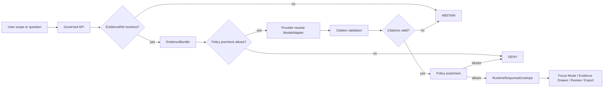

<!-- [KFM_META_BLOCK_V2]
doc_id: kfm://doc/NEEDS-VERIFICATION
title: ADR-0007: Governed AI Runtime Envelope
type: standard
version: v1
status: draft
owners: NEEDS-VERIFICATION
created: 2026-04-27
updated: 2026-04-27
policy_label: NEEDS-VERIFICATION
related: [NEEDS-VERIFICATION]
tags: [kfm, adr, governed-ai, runtime-envelope, evidencebundle, focus-mode]
notes: [Created from attached KFM doctrine and current-session workspace inspection; mounted repo unavailable, so owner, policy label, final ADR number, related paths, route names, schema homes, and enforcement wiring remain NEEDS VERIFICATION.]
[/KFM_META_BLOCK_V2] -->

<a id="top"></a>

# ADR-0007: Governed AI Runtime Envelope

Define the finite, evidence-bound response envelope for KFM AI-assisted runtime surfaces.

> [!IMPORTANT]
> **Status:** `draft`  
> **Decision posture:** `PROPOSED` until the mounted repository, schema home, route inventory, tests, and workflow gates are directly verified.  
> **Target path:** `docs/adr/ADR-0007-governed-ai-runtime-envelope.md`  
> **Owner:** `NEEDS-VERIFICATION`  
> **Policy label:** `NEEDS-VERIFICATION`  
> **Primary contract family:** `RuntimeResponseEnvelope`  
>
> 
> 
> 
> 
> 

**Quick jump:** [Decision](#decision) · [Why this exists](#why-this-exists) · [Runtime law](#runtime-law) · [Envelope shape](#envelope-shape) · [Flow](#flow) · [Validation](#validation) · [Consequences](#consequences) · [Rollback](#rollback) · [Verification backlog](#verification-backlog)

---

## Decision

**PROPOSED:** KFM will require every consequential AI-assisted runtime response to be emitted through a common `RuntimeResponseEnvelope`.

The envelope is the governed boundary between:

- user-facing surfaces such as **Focus Mode**, Evidence Drawer assistance, map-derived question answering, story/export previews, review summaries, and diagnostics;
- backend evidence, policy, release, review, correction, and citation validation;
- provider-neutral model adapters such as a deterministic `MockAdapter`, Ollama-compatible runtimes, OpenAI-compatible runtimes, or future private model providers.

The envelope has exactly four public outcome classes:

| Outcome | Meaning | Runtime obligation |
|---|---|---|
| `ANSWER` | Released, policy-safe evidence is sufficient and citation validation passes. | Return bounded answer content, citation state, evidence bundle refs, policy state, release/review/correction state, and audit/receipt refs. |
| `ABSTAIN` | Evidence is missing, unresolved, stale, conflicting, insufficient, outside scope, or source-role-inadequate. | Return no unsupported answer; provide reason codes, narrowing guidance, and evidence/policy state where safe. |
| `DENY` | Policy, rights, sensitivity, access control, steward-only scope, safety, or release state blocks the response. | Return no restricted content; provide safe reason codes and obligations without leaking protected details. |
| `ERROR` | System, adapter, validator, resolver, or envelope assembly failed. | Return no substitute model prose; include safe error metadata and audit refs. |

This ADR does **not** choose a model provider, make Ollama canonical, define final route names, settle schema-home authority, or claim implementation exists.

---

## Why this exists

KFM’s durable public value is the **inspectable claim**: an outward statement that remains reconstructable to admissible evidence, place and time scope, source role, policy posture, review state, release state, and correction lineage.

A model-generated paragraph is not an inspectable claim by itself.

Without a governed runtime envelope, KFM risks allowing:

- fluent answers that cannot be reconstructed to EvidenceBundles;
- direct browser-to-model calls that bypass policy;
- vector/search/summary layers being mistaken for truth;
- `ABSTAIN`, `DENY`, and `ERROR` states being hidden as generic UI failures;
- citations that point to unresolved or unreleased evidence;
- provider-specific response shapes leaking into KFM’s public contract;
- AI involvement disappearing from receipts, audits, and rollback analysis.

> [!NOTE]
> This ADR treats AI as an interpretive layer. It can help summarize, compare, explain, draft, and narrow. It cannot become the root truth source, publication authority, policy authority, or citation authority.

[Back to top](#top)

---

## Evidence and current-state posture

| Area | Status | Treatment in this ADR |
|---|---:|---|
| KFM doctrine | `CONFIRMED` from attached project documents | Used as governing architecture. |
| Mounted repo tree | `UNKNOWN` / not available in current workspace | No implementation, path, route, test, workflow, or schema presence is claimed. |
| Target file path | `CONFIRMED` from user request | This ADR uses the requested path and filename. |
| ADR number | `NEEDS VERIFICATION` | Current visible doctrine also lists a governed-AI runtime-envelope ADR under another number; this file follows the requested target path until the ADR index is reconciled. |
| Owners | `NEEDS VERIFICATION` | Must be confirmed from `CODEOWNERS` or project governance records before publish. |
| Policy label | `NEEDS VERIFICATION` | Likely public-facing architecture content, but final label must be verified before publish. |
| Schema home | `NEEDS VERIFICATION` | Candidate homes are listed as related surfaces, not claimed as existing files. |

### Numbering note

**NEEDS VERIFICATION:** Current visible KFM planning material identifies a governed-AI runtime-envelope ADR as a required decision, but the visible ADR index assigns that concept to `ADR-0006`, while the requested target path is `ADR-0007-governed-ai-runtime-envelope.md`.

This ADR preserves the user-requested filename and records the numbering mismatch as an open verification item. Do not silently renumber or overwrite adjacent ADRs without inspecting the real `docs/adr/` index.

---

## Runtime law

The governed AI runtime envelope is controlled by these rules.

### 1. Evidence first

A runtime answer must not be generated unless admissible released evidence has already been resolved.



### 2. Policy gates both sides of generation

The runtime must apply policy before and after model mediation:

1. **Precheck:** confirm scope, release state, rights, sensitivity, access, source role, and evidence admissibility.
2. **Postcheck:** verify the model output did not introduce unsupported claims, restricted content, stale assertions, or policy violations.

### 3. Citation validation is mandatory

`ANSWER` is not valid unless every material claim in the response is traceable to resolved evidence references or safely classified as non-claim explanatory text.

Unsupported claim → `ABSTAIN` or remove the claim.

Policy-blocked claim → `DENY`.

Citation validator failure → `ERROR` or `ABSTAIN`, depending on whether the issue is system failure or evidence insufficiency.

### 4. The browser never calls the model

Public and ordinary UI clients must not call:

- Ollama directly;
- OpenAI-compatible APIs directly;
- local model runtimes directly;
- vector stores directly;
- graph internals directly;
- canonical stores directly;
- `RAW`, `WORK`, or `QUARANTINE` lifecycle stores directly.

The only normal path is:

```text
UI -> governed API -> evidence resolver -> policy checks -> model adapter -> citation validation -> RuntimeResponseEnvelope
```

### 5. The adapter receives bounded context only

A model adapter may receive only:

- released EvidenceBundle excerpts;
- public-safe summaries;
- scope instructions;
- allowed citation targets;
- policy-safe system instructions;
- runtime formatting requirements.

It must not receive unrestricted canonical data, unpublished candidate data, hidden policy state, secrets, or sensitive exact locations unless a separate steward-approved internal workflow explicitly authorizes that access.

### 6. No chain-of-thought persistence

KFM should record **what was decided and why it is auditable**, not private reasoning traces.

`AIReceipt` or equivalent process memory may record:

- adapter family;
- model identifier or mock adapter identifier;
- prompt template hash;
- input EvidenceBundle refs;
- policy decision refs;
- citation validation report ref;
- output hash;
- outcome;
- request/audit refs;
- timing and version metadata.

It must not store chain-of-thought as a KFM truth object.

[Back to top](#top)

---

## Envelope shape

### Required contract intent

**PROPOSED contract home:** `schemas/contracts/v1/runtime/runtime_response_envelope.schema.json`  
**Status:** `NEEDS VERIFICATION` until the schema-home ADR and actual repo tree are inspected.

| Field | Required | Purpose |
|---|---:|---|
| `request_id` | yes | Stable request/audit join key. |
| `schema_version` | yes | Envelope schema version. |
| `outcome` | yes | One of `ANSWER`, `ABSTAIN`, `DENY`, `ERROR`. |
| `scope` | yes | Echoes the bounded question, map/time selection, route, dossier, export, or review scope. |
| `answer` | conditional | Present only for `ANSWER`; absent or null for `ABSTAIN`, `DENY`, and most `ERROR` outcomes. |
| `evidence_bundle_refs` | yes | Resolved support packages used or attempted. Empty only when safe reason codes explain why none could resolve. |
| `citation_state` | yes | Citation validation result, unresolved refs, unsupported claims, or abstention basis. |
| `policy_state` | yes | Policy outcome summary, reason codes, obligations, and decision refs. |
| `release_state` | yes | Release basis, publication status, supersession, withdrawal, or stale-state signal. |
| `review_state` | yes | Human/steward review status when relevant. |
| `freshness_state` | yes | Valid time, observed time, publication time, and stale/unknown freshness classification. |
| `correction_state` | yes | Correction, rollback, supersession, or withdrawal status. |
| `model_state` | conditional | Adapter family and model metadata when model mediation occurred; `not_called` when outcome was resolved before model call. |
| `receipt_refs` | yes | Audit, runtime, AI, validation, or policy receipt refs where emitted. |
| `errors` | conditional | Safe system or validator failures for `ERROR`. |
| `limitations` | recommended | Human-readable limits that do not weaken policy or evidence requirements. |
| `obligations` | recommended | Required follow-up actions, such as source review, steward approval, or narrowed scope. |

### TypeScript sketch

Illustrative only. The authoritative shape must be expressed through the repo’s verified schema system.

```ts
export type RuntimeOutcome = "ANSWER" | "ABSTAIN" | "DENY" | "ERROR";

export interface RuntimeResponseEnvelopeV1<TAnswer = unknown> {
  request_id: string;
  schema_version: "1.0.0";
  outcome: RuntimeOutcome;

  scope: {
    request_kind: "focus" | "drawer" | "claim" | "story" | "export" | "review" | "diagnostic";
    question?: string;
    spatial_scope?: unknown;
    temporal_scope?: unknown;
    release_ref?: string;
    claim_refs?: string[];
  };

  answer?: TAnswer;

  evidence_bundle_refs: string[];

  citation_state: {
    status: "PASS" | "ABSTAIN" | "DENY" | "ERROR";
    citation_validation_ref?: string;
    unresolved_evidence_refs?: string[];
    unsupported_claims?: string[];
  };

  policy_state: {
    outcome: "ALLOW" | "ABSTAIN" | "DENY" | "ERROR";
    decision_ref?: string;
    reason_codes: string[];
    obligations: string[];
  };

  release_state: {
    release_ref?: string;
    state: "released" | "not_released" | "stale" | "superseded" | "withdrawn" | "unknown";
  };

  review_state: {
    status: "approved" | "not_required" | "pending" | "rejected" | "unknown";
    review_refs: string[];
  };

  freshness_state: {
    valid_time?: string;
    observed_time?: string;
    published_at?: string;
    freshness: "current" | "stale" | "unknown" | "not_applicable";
  };

  correction_state: {
    status: "none" | "corrected" | "superseded" | "withdrawn" | "unknown";
    correction_refs: string[];
  };

  model_state: {
    adapter: "MockAdapter" | "OllamaAdapter" | "OpenAICompatibleAdapter" | "Other" | "not_called";
    model_id?: string;
    prompt_template_hash?: string;
    output_hash?: string;
  };

  receipt_refs: {
    audit_ref?: string;
    runtime_receipt_ref?: string;
    ai_receipt_ref?: string;
    policy_decision_ref?: string;
    validation_report_ref?: string;
  };

  errors?: Array<{
    code: string;
    message: string;
    safe_to_display: boolean;
  }>;

  limitations?: string[];
  obligations?: string[];
}
```

### Minimal outcome examples

```json
{
  "request_id": "kfm-runtime-req-001",
  "schema_version": "1.0.0",
  "outcome": "ABSTAIN",
  "scope": {
    "request_kind": "focus",
    "question": "What does this layer prove?"
  },
  "evidence_bundle_refs": [],
  "citation_state": {
    "status": "ABSTAIN",
    "unresolved_evidence_refs": ["kfm://evidence/ref/example"]
  },
  "policy_state": {
    "outcome": "ABSTAIN",
    "reason_codes": ["EVIDENCE_BUNDLE_UNRESOLVED"],
    "obligations": ["RESOLVE_EVIDENCE_BUNDLE_BEFORE_MODEL_CALL"]
  },
  "release_state": {
    "state": "unknown"
  },
  "review_state": {
    "status": "unknown",
    "review_refs": []
  },
  "freshness_state": {
    "freshness": "unknown"
  },
  "correction_state": {
    "status": "unknown",
    "correction_refs": []
  },
  "model_state": {
    "adapter": "not_called"
  },
  "receipt_refs": {
    "audit_ref": "kfm://audit/runtime/example"
  },
  "limitations": [
    "No model call was made because evidence did not resolve."
  ],
  "obligations": [
    "Resolve EvidenceRef to EvidenceBundle."
  ]
}
```

---

## Inputs and exclusions

### Accepted inputs

A governed AI runtime request may accept only inputs that can be reduced to a bounded scope:

| Input class | Accepted when |
|---|---|
| User question | It is attached to a map, claim, dossier, story, export, review, or diagnostic scope. |
| Evidence refs | They resolve server-side to EvidenceBundles. |
| Layer or feature context | It comes from released public-safe layer descriptors or governed feature envelopes. |
| Time context | It has explicit valid/observed/publication semantics or is marked unknown. |
| Review context | It is safe for the caller’s role and policy state. |
| Export/story context | It is release-scoped and citation-aware. |

### Exclusions

The runtime envelope must reject or avoid:

- raw model responses as public API payloads;
- direct client model calls;
- unresolved EvidenceRefs used as if they were proof;
- unpublished `RAW`, `WORK`, or `QUARANTINE` data;
- hidden browser-side source ranking or citation generation;
- provider-specific response formats as the stable public contract;
- unrestricted canonical store excerpts;
- chain-of-thought as a persisted truth object;
- policy-denied material rendered through “helpful” model language.

[Back to top](#top)

---

## Provider and adapter posture

### Decision

KFM should define `ModelAdapter` before selecting or optimizing a provider.

| Adapter | Use |
|---|---|
| `MockAdapter` | First implementation target for deterministic tests and golden fixtures. |
| `OllamaAdapter` | Local/private runtime option after security, host exposure, auth, model pinning, and audit posture are verified. |
| `OpenAICompatibleAdapter` | Optional provider-compatible runtime path after contract tests, privacy posture, and egress controls are verified. |
| Future adapters | Allowed only if they preserve the same envelope, policy, citation, receipt, and audit requirements. |

### Provider neutrality rule

Provider details may affect `model_state`, receipts, observability, latency, and deployment runbooks.

They must not affect:

- outcome grammar;
- evidence requirements;
- policy requirements;
- citation validation;
- public envelope shape;
- rights/sensitivity behavior;
- rollback/correction semantics.

---

## Alternatives considered

| Alternative | Decision | Reason |
|---|---:|---|
| Return raw model text from Focus Mode | Rejected | Bypasses inspectability, citation validation, and policy state. |
| Browser calls Ollama or another model directly | Rejected | Breaks the trust membrane and makes audit/policy enforcement unreliable. |
| One envelope per provider | Rejected | Lets vendor behavior leak into KFM’s public contract. |
| `ANSWER` plus free-form error strings only | Rejected | Hides `ABSTAIN`, `DENY`, and `ERROR` as UI accidents instead of trust-visible states. |
| Let the model choose citations | Rejected | Citations must be validated against resolved EvidenceBundles. |
| Let map popups create claims client-side | Rejected | Feature selection is candidate context; claim resolution belongs behind governed APIs. |
| Store chain-of-thought for audit | Rejected | Receipts should record verifiable inputs, outputs, hashes, refs, and decisions, not private reasoning traces. |
| Skip MockAdapter and start with live model integration | Rejected for first slice | Deterministic contract tests should come before provider behavior. |

---

## Implementation impact

All paths are **PROPOSED / NEEDS VERIFICATION** until the real repo is mounted.

| Surface | Proposed file or family | Status |
|---|---|---:|
| ADR | `docs/adr/ADR-0007-governed-ai-runtime-envelope.md` | this file |
| Runtime schema | `schemas/contracts/v1/runtime/runtime_response_envelope.schema.json` | `NEEDS VERIFICATION` |
| Runtime examples | `schemas/contracts/v1/runtime/examples/*.json` | `PROPOSED` |
| Evidence contracts | `schemas/contracts/v1/evidence/evidence_bundle.schema.json` | `NEEDS VERIFICATION` |
| Policy contracts | `schemas/contracts/v1/policy/policy_decision.schema.json` | `PROPOSED` |
| Citation validation | `schemas/contracts/v1/runtime/citation_validation_report.schema.json` | `PROPOSED` |
| API contract | `contracts/api/openapi.v1.yaml` or repo-native equivalent | `NEEDS VERIFICATION` |
| Runtime adapter | `apps/governed_api/runtime/model_adapter.*` | `PROPOSED` |
| Mock adapter | `apps/governed_api/runtime/mock_adapter.*` | `PROPOSED` |
| Focus route | Route home `NEEDS VERIFICATION` | `PROPOSED` |
| Contract tests | `tests/contracts/test_runtime_response_envelope_schema.*` | `PROPOSED` |
| E2E runtime proof | `tests/e2e/runtime_proof/` | `PROPOSED` |
| Policy tests | `tests/policy/` or repo-native equivalent | `PROPOSED` |
| Receipts | `data/receipts/runtime/` | `PROPOSED` |
| Proof linkage | `data/proofs/` / `ProofPack` family | `PROPOSED` |

---

## Validation

The first acceptable implementation slice must prove the envelope before live provider use.

### Contract tests

Required cases:

- valid `ANSWER` with citations and EvidenceBundle refs;
- valid `ABSTAIN` for missing evidence;
- valid `DENY` for policy block;
- valid `ERROR` for adapter or validator failure;
- invalid outcome enum fails;
- `ANSWER` without citation state fails;
- response with `RAW`, `WORK`, or `QUARANTINE` refs fails;
- missing `policy_state` fails;
- missing `release_state` fails;
- unknown schema version fails unless explicitly allowed by compatibility policy.

### Runtime proof tests

Required flow tests:

1. **Missing EvidenceBundle**  
   Request includes unresolved EvidenceRef.  
   Expected: `ABSTAIN`, model adapter not called.

2. **Policy deny**  
   Request asks for restricted or unreleased material.  
   Expected: `DENY`, model adapter not called unless an internal authorized path is separately proven.

3. **Citation failure**  
   Model output includes unsupported claim.  
   Expected: claim removed with `ABSTAIN`, or response rejected as `ERROR` depending on validator classification.

4. **Happy path**  
   Released evidence resolves, policy allows, citations validate.  
   Expected: `ANSWER` with evidence refs, policy refs, citation report refs, and receipt refs.

5. **Adapter failure**  
   Model adapter times out or returns invalid structure.  
   Expected: `ERROR`, no substitute answer.

6. **No direct model client**  
   Browser/UI tests or static checks prove no public UI imports or calls model runtime clients directly.

7. **No raw public path**  
   API tests prove public/ordinary runtime responses do not expose raw/work/quarantine references or internal store paths.

### Documentation checks

Before publication, verify:

- this ADR is listed in the ADR index;
- ADR numbering conflict is resolved or explicitly cross-linked;
- owner and policy label are populated;
- related paths resolve or are marked as proposed in a register;
- schema-home decision is referenced;
- tests and runbooks link back to this ADR.

[Back to top](#top)

---

## Consequences

### Positive consequences

- Keeps KFM AI subordinate to evidence, policy, review, release, and correction state.
- Makes `ABSTAIN` and `DENY` visible trust outcomes instead of product failures.
- Allows provider substitution without changing public contracts.
- Makes citation validation, policy decisions, and evidence resolution testable.
- Supports deterministic early implementation through `MockAdapter`.
- Gives UI surfaces a stable contract for Focus Mode, Evidence Drawer assistance, review summaries, and export/story previews.
- Preserves correction and rollback analysis through receipt and audit refs.

### Costs and tradeoffs

- Adds schema, fixture, validator, and policy work before model integration.
- Requires backend mediation for all AI-assisted runtime calls.
- Requires negative-path UX design, not just happy-path answer rendering.
- Makes some user questions produce `ABSTAIN` or `DENY` even when a model could generate plausible prose.
- Requires citation validation and model-output validation machinery before public trust claims are made.

### Risks if skipped

- Public surfaces may present unsupported generated claims.
- Model provider behavior may become de facto product law.
- Sensitive or unreleased material may leak through helpful summaries.
- Correction and rollback may be unable to reconstruct what the model saw.
- KFM may confuse search/vector/summary artifacts with canonical or released truth.

---

## Rollback and supersession

This ADR can be rolled back or superseded without data migration if it remains documentation-only.

If implementation has landed:

1. Disable model adapters through runtime configuration.
2. Keep `MockAdapter` fixtures for regression analysis.
3. Preserve emitted `RuntimeResponseEnvelope` examples as lineage.
4. Revert or supersede schema versions through the schema registry.
5. Preserve receipts and proof refs; do not delete historical runtime audit records.
6. Update the ADR index and any affected runbooks.
7. Re-run negative-path tests before re-enabling any replacement runtime contract.

Supersession must state whether the replacement preserves the four finite outcomes. If it does not, the replacement must explain how KFM still preserves cite-or-abstain, deny-by-policy, system-error visibility, evidence resolution, citation validation, and auditability.

---

## Verification backlog

| Item | Label | Needed proof |
|---|---:|---|
| Confirm ADR number and filename | `NEEDS VERIFICATION` | Mounted `docs/adr/` index and existing ADR list. |
| Confirm owner | `NEEDS VERIFICATION` | `CODEOWNERS`, governance record, or steward assignment. |
| Confirm policy label | `NEEDS VERIFICATION` | Documentation policy registry or repo convention. |
| Confirm schema home | `NEEDS VERIFICATION` | Accepted schema-home ADR and visible schema tree. |
| Confirm runtime route family | `NEEDS VERIFICATION` | Mounted API route inventory and OpenAPI contract. |
| Confirm EvidenceBundle schema | `NEEDS VERIFICATION` | Visible shared schema or accepted object-family ADR. |
| Confirm policy engine | `NEEDS VERIFICATION` | OPA/Rego, Python, or repo-native policy bundle and tests. |
| Confirm citation validator | `NEEDS VERIFICATION` | Contract, tests, and emitted validation reports. |
| Confirm no-direct-model-client rule | `NEEDS VERIFICATION` | Static check, UI test, or dependency boundary test. |
| Confirm local/private runtime exposure controls | `NEEDS VERIFICATION` | Auth, firewall/reverse proxy/VPN, logging, and deployment evidence. |
| Confirm AIReceipt shape | `NEEDS VERIFICATION` | Receipt schema, example, and retention policy. |
| Confirm Focus Mode UI states | `NEEDS VERIFICATION` | Rendered `ANSWER`, `ABSTAIN`, `DENY`, and `ERROR` states. |

---

## Review checklist

- [ ] ADR number reconciled with the ADR index.
- [ ] Owner populated from verified project governance.
- [ ] Policy label populated from verified documentation policy.
- [ ] Related paths replaced with verified relative links.
- [ ] Schema-home decision linked.
- [ ] `RuntimeResponseEnvelope` schema exists or is explicitly scheduled.
- [ ] Valid and invalid envelope fixtures exist.
- [ ] `MockAdapter` fixture tests pass.
- [ ] Missing evidence produces `ABSTAIN`.
- [ ] Policy block produces `DENY`.
- [ ] Adapter/validator failure produces `ERROR`.
- [ ] Happy path produces `ANSWER` with citation validation.
- [ ] Browser cannot call model runtime directly.
- [ ] Runtime cannot read `RAW`, `WORK`, or `QUARANTINE` directly.
- [ ] AIReceipt or runtime receipt records hashes and refs without storing chain-of-thought.
- [ ] Documentation and runbooks updated with rollback behavior.

[Back to top](#top)
