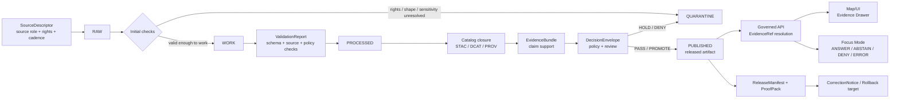

<!-- [KFM_META_BLOCK_V2]
doc_id: kfm://doc/TODO-uuid-domain-lane-template
title: ADR-0008 — Domain Lane Template
type: standard
version: v1
status: draft
owners: TODO: documentation steward + domain lane stewards
created: 2026-04-27
updated: 2026-04-27
policy_label: TODO: public|restricted after policy review
related: [NEEDS_VERIFICATION: docs/registers/AUTHORITY_LADDER.md, NEEDS_VERIFICATION: docs/registers/CANONICAL_LINEAGE_EXPLORATORY.md, NEEDS_VERIFICATION: docs/sources/SOURCE_DESCRIPTOR_STANDARD.md, NEEDS_VERIFICATION: schemas/contracts/v1/]
tags: [kfm, adr, domain-lane, documentation-control-plane, evidence]
notes: [Draft produced from attached KFM corpus and current-session workspace inspection; doc_id, owners, policy_label, ADR numbering, and related paths require repo verification before merge.]
[/KFM_META_BLOCK_V2] -->

# ADR-0008 — Domain Lane Template

A standard decision record for making every KFM domain lane evidence-bound, source-ledgered, policy-aware, map-ready, testable, and reversible.

| Field | Value |
|---|---|
| **Target path** | `docs/adr/ADR-0008-domain-lane-template.md` |
| **Status** | Draft — proposed standard |
| **Decision type** | Documentation, architecture, contracts, source registry, validation, and publication governance |
| **Applies to** | Hydrology, habitat, fauna, flora, soil, agriculture, geology/natural resources, atmosphere/air, roads/rail/trade routes, settlements/infrastructure, archaeology, hazards, people/genealogy/DNA/land ownership, and future KFM lanes |
| **Does not do** | Does not create live connectors, publish data, decide schema-home authority, assign owners, or claim implementation maturity |
| **Rollback** | Revert this ADR before adoption; after adoption, supersede with a new ADR and retain this file as lineage |

> [!IMPORTANT]
> **NEEDS VERIFICATION — ADR numbering.** The requested path names this file `ADR-0008-domain-lane-template.md`. The attached pipeline manual also records a domain-lane-template ADR need, but its visible ADR index assigns `ADR-0007-domain-lane-template` and `ADR-0008-sensitive-location-policy`. Before merge, reconcile the ADR index, rename this file if needed, or record the numbering exception in the ADR register.

## Quick jumps

- [Context](#context)
- [Decision](#decision)
- [Domain lane contract](#domain-lane-contract)
- [Required file families](#required-file-families)
- [Lifecycle and trust flow](#lifecycle-and-trust-flow)
- [Lane burden tiers](#lane-burden-tiers)
- [Growth and retention rules](#growth-and-retention-rules)
- [Validation gates](#validation-gates)
- [Consequences](#consequences)
- [Adoption plan](#adoption-plan)
- [Open verification backlog](#open-verification-backlog)
- [Appendix A — Copy/paste lane README skeleton](#appendix-a--copypaste-lane-readme-skeleton)

## Context

KFM domain reports repeat the same implementation pressure: each lane needs a human control plane, source registry, source-role discipline, machine contracts, validation fixtures, fail-closed policy gates, lifecycle folders, catalog/proof/release separation, rollback paths, and trust-visible public surfaces.

Without a shared template, each domain risks inventing its own structure. That weakens source authority, makes review harder, creates duplicate schema homes, and lets exploratory packet material appear more authoritative than it is.

Current-session repository evidence is limited. The authoring workspace did not expose a mounted KFM checkout, tests, workflows, schemas, dashboards, runtime logs, or emitted proof objects. Therefore this ADR standardizes a **proposed lane template**, not current implementation behavior.

## Decision

Adopt a standard **Domain Lane Template** for all new or materially revised KFM domain lanes.

A domain lane is a bounded KFM subject area that turns source evidence into inspectable, policy-aware, time-aware, map-ready claims without collapsing canonical evidence, derived artifacts, UI rendering, AI synthesis, publication state, review state, and correction lineage into one surface.

Every lane MUST:

1. preserve the KFM lifecycle:
   `RAW -> WORK / QUARANTINE -> PROCESSED -> CATALOG / TRIPLET -> PUBLISHED`;
2. keep public clients and normal UI surfaces behind governed APIs or released artifacts;
3. resolve consequential claims through `EvidenceRef -> EvidenceBundle`;
4. record source role, rights, sensitivity, temporal scope, review state, release state, and correction lineage;
5. fail closed when source terms, precision, sensitivity, ownership, review, or release state is unresolved;
6. keep AI interpretive and evidence-subordinate;
7. distinguish canonical records from derived tiles, search indexes, graph projections, summaries, scenes, and rendered pixels;
8. define validation, policy, fixtures, acceptance gates, rollback, and supersession before live source activation.

This ADR also establishes a **minimum lane package**. A lane may omit API, UI, graph, 3D, AI, or public-delivery surfaces only by explicitly marking them `OUT_OF_SCOPE`, `DEFERRED`, or `NEEDS VERIFICATION`.

[Back to top](#adr-0008--domain-lane-template)

## Domain lane contract

Each lane MUST declare the following contract before it accepts live source data or public release candidates.

| Contract area | Required answer | Truth label default |
|---|---|---|
| **Lane scope** | What belongs in this lane, what does not, and which neighboring lanes may reference it. | `PROPOSED` until steward-reviewed |
| **Source roles** | Which sources are authoritative, contextual, modeled, observational, regulatory, archival, aggregator, or exploratory. | `NEEDS VERIFICATION` until source descriptor review |
| **Canonical object families** | The lane’s record, assertion, observation, event, geometry, layer, catalog, proof, and release objects. | `PROPOSED` until schema/fixture evidence exists |
| **Temporal model** | Observation time, source time, valid time, transaction/ingest time, review time, release time, and correction time. | `PROPOSED` |
| **Sensitivity posture** | Exact-location, living-person, DNA, archaeology, rare species, critical infrastructure, private land, cultural/sovereignty, and rights handling. | `DENY` or `HOLD` until reviewed |
| **Publication model** | What can become public, what must be generalized, what remains restricted, and what proof pack is required. | `PROPOSED` |
| **Map/UI model** | Layer IDs, evidence drawer payloads, trust badges, negative states, time controls, and export behavior. | `PROPOSED` until UI fixtures exist |
| **Governed AI model** | What Focus Mode may answer, when it must abstain, and what evidence bundle it may consume. | `PROPOSED`; default deny direct model access |
| **Validation model** | Valid/invalid fixtures, source descriptor checks, schema validation, policy checks, no-network tests, and promotion dry-runs. | `PROPOSED` until tests pass |
| **Rollback model** | How to withdraw, correct, regenerate, or supersede artifacts without erasing lineage. | `PROPOSED` until release fixtures exist |

## Required file families

All paths below are **template paths**. Use the repo-equivalent canonical location when a stronger checked-in convention is verified. Do not create duplicate homes to satisfy the template.

| File family | Proposed path pattern | Purpose | Truth role | Update trigger |
|---|---|---|---|---|
| Lane landing doc | `docs/domains/<domain>/README.md` | Scope, owners, status, repo fit, accepted inputs, exclusions, quick links, and current evidence boundary. | Human control plane | New lane, scope change, owner change, release posture change |
| Lane architecture | `docs/architecture/<domain>_architecture.md` or `docs/domains/<domain>/ARCHITECTURE.md` | End-to-end lane structure, object families, trust seams, public surfaces, and dependency map. | Human architecture | New object family, API/UI surface, lifecycle change, major source change |
| Operations runbook | `docs/runbooks/<domain>_operations.md` | How to run validators, refresh registries, inspect fixtures, and perform dry-runs. | Operational support | Tooling, source refresh, CI, or validator change |
| Rollback runbook | `docs/runbooks/<domain>_rollback.md` | Withdrawal, correction, rollback target, artifact regeneration, and release-state repair. | Operational support | Release, correction, or promotion-gate change |
| Lane ADRs | `docs/adr/ADR-<number>-<domain>-*.md` | Decisions that change lane burden, schema homes, source role, policy, or publication model. | Normative decision | Any consequential architectural choice |
| Verification backlog | `docs/backlog/<domain>_verification_backlog.md` | Concrete UNKNOWN / NEEDS VERIFICATION items and evidence required to retire them. | Review support | Any unresolved source, policy, rights, runtime, or repo question |
| Expansion backlog | `docs/backlog/<domain>_expansion_backlog.md` | Deferred sublanes, connectors, UI features, analysis products, and proof slices. | Planning support | New idea intake, steward request, source opportunity |
| Source registry | `data/registry/<domain>/sources.yaml` | SourceDescriptor instances and source-role assignments. | Source control surface | New source, source role change, rights/cadence change |
| Dataset registry | `data/registry/<domain>/datasets.yaml` | Dataset families, versions, source links, status, and lifecycle mapping. | Source/data control surface | New dataset, new version, deprecation |
| Layer registry | `data/registry/<domain>/layers.yaml` | Released layer IDs, display meaning, delivery class, evidence route, and trust badges. | Delivery control surface | New layer, style meaning change, time or policy change |
| Sensitivity registry | `data/registry/<domain>/sensitivity_policies.yaml` | Domain-specific sensitivity classes, transforms, public-safe rules, and review obligations. | Policy input | New sensitivity class, steward rule, law/source-term change |
| Registry backlog | `data/registry/<domain>/verification_backlog.yaml` | Machine-friendly registry-level unknowns. | Review support | Registry entry with missing proof |
| Machine schemas | `schemas/contracts/v1/<domain>/*.schema.json` or repo-confirmed equivalent | Executable shape for lane objects, fixtures, and contracts. | Machine contract | Schema version, object family, validator change |
| Human contracts | `contracts/<domain>/README.md` and/or object cards | Meaning, invariants, semantic field intent, lifecycle expectations. | Semantic contract | Object model or field meaning change |
| Shared governance schemas | `schemas/contracts/v1/governance/*.schema.json` | Shared objects such as `EvidenceBundle`, `DecisionEnvelope`, `ReleaseManifest`, `ValidationReport`. | Machine contract | Shared object wave or cross-lane change |
| Lifecycle storage | `data/raw/<domain>/`, `data/work/<domain>/`, `data/quarantine/<domain>/`, `data/processed/<domain>/` | Segregated lifecycle zones. | Data lifecycle | Source activation, processing, quarantine, promotion |
| Catalog closure | `data/catalog/stac/<domain>/`, `data/catalog/dcat/<domain>/`, `data/catalog/prov/<domain>/` | Catalog and provenance artifacts for released or candidate data. | Publication support | Promotion, catalog change, provenance change |
| Receipts | `data/receipts/<domain>/` | Process-memory records such as ingest, validation, run, AI, or transform receipts. | Audit support | Pipeline run or governed runtime run |
| Proofs | `data/proofs/<domain>/` | Release-significant proof packs, validation reports, policy decisions, signatures, and promotion evidence. | Release proof | Promotion, release, correction, withdrawal |
| Published artifacts | `data/published/<domain>/` | Public-safe released artifacts only. | Released output | Promotion or rollback |
| Triplets/graph | `data/triplets/<domain>/` | Derived graph/triplet projection when in scope. | Rebuildable derivative | Graph projection or relation model change |
| Policy rules | `policy/<domain>/*.rego` or repo-confirmed equivalent | Rights, sensitivity, source-role, publication, AI, and promotion decisions. | Normative policy | Source role, sensitivity, publication, or runtime rule change |
| Policy tests | `policy/<domain>/tests/*.rego` | Positive/negative policy cases. | Verification support | Rule change or new reason/obligation code |
| Validators | `tools/validators/<domain>/*` | Schema, source, lifecycle, catalog, proof, geoprivacy, and promotion validators. | Verification support | Schema, fixture, source, or gate change |
| Diff tools | `tools/diff/<domain>/*` | Source refresh, backfill, and version comparison helpers. | Review support | Watcher/backfill/change-detection adoption |
| CI workflow | `.github/workflows/<domain>-*.yml` | Optional lane-specific CI if repo convention supports it. | Merge gate | Validator/test suite becomes merge-blocking |
| Fixtures | `tests/fixtures/<domain>/valid/*`, `tests/fixtures/<domain>/invalid/*`, `tests/fixtures/<domain>/policy/*` | Valid, invalid, and policy-focused examples. | Verification support | Schema, policy, validator, or object change |
| Lane tests | `tests/<domain>/*` | Unit, integration, no-network, and regression tests. | Verification support | Validator, policy, pipeline, API/UI contract change |
| API contract | `apps/governed_api/openapi/<domain>.openapi.yaml` or repo equivalent | Governed API surface definition when runtime/public access is in scope. | Runtime contract | New route, response, envelope, or public query |
| API route | `apps/governed_api/routes/<domain>.*` or repo equivalent | Runtime implementation surface when verified. | Implementation | Framework-confirmed route work |
| UI layer descriptors | `ui/<domain>/` or `web/<domain>/` repo equivalent | Layer descriptors, Evidence Drawer payload fixtures, trust-visible UI notes. | Product trust support | Public layer, drawer, Focus Mode, story, or export change |
| Release lane | `release/<domain>/` or repo equivalent | Release manifest, rollback card, correction notice, publication bundle. | Release control | Promotion, withdrawal, correction, supersession |

[Back to top](#adr-0008--domain-lane-template)

## Lifecycle and trust flow



### Flow rules

- `RAW`, `WORK`, and `QUARANTINE` are never normal public surfaces.
- Public artifacts are released outputs, not canonical truth.
- Tiles, scenes, indexes, summaries, graph projections, and AI responses are rebuildable derivatives or interpretive surfaces.
- A rendered feature, popup, or Focus Mode answer is consequential only when it resolves to an admissible `EvidenceBundle` and passes policy/review checks.
- Promotion is a governed state transition, not a file move.

## Lane burden tiers

Not every lane carries the same risk. The template is constant, but the burden tier changes how much proof is required before publication.

| Tier | Typical lane examples | Required extra burden |
|---|---|---|
| **Baseline evidence lane** | Hydrology fixture, public reference layers, synthetic proof slice | SourceDescriptor, no-network fixtures, schema validation, EvidenceBundle, ReleaseManifest |
| **Public map lane** | Road layer, soil unit layer, public-safe habitat layer | Layer registry, style/layer manifest, Evidence Drawer payload, no-raw-public-path tests |
| **Sensitive location lane** | Rare species, archaeology, cultural sites, critical infrastructure | Geoprivacy transform receipt, steward review, exact-location denial tests, generalized public geometry |
| **Temporal assertion lane** | People/land ownership, historical route status, hazard events | Valid-time/transaction-time handling, assertion status, overlap checks, correction lineage |
| **Regulatory/context lane** | Flood hazard, critical habitat, official designations | Source-role policy proving regulatory source vs observation/model distinction |
| **Runtime/AI lane** | Focus Mode over released evidence | RuntimeResponseEnvelope, citation validation, ABSTAIN/DENY tests, no-direct-model-client checks |
| **3D/story lane** | Terrain, viewshed, archaeological 3D, Cesium scene | 3D admission checklist, scene manifest, same EvidenceBundle/policy/release controls as 2D |
| **Release-bearing lane** | Any public or semi-public promoted product | ProofPack, ReleaseManifest, rollback card, correction path, catalog closure |

## Growth and retention rules

### New sources

A new source MUST NOT enter a lane as a connector first. It enters as a source descriptor and review item.

Required updates:

1. `data/registry/<domain>/sources.yaml`
2. source rights and sensitivity review
3. source-role policy matrix
4. source descriptor fixtures
5. verification backlog entry for unresolved terms, cadence, quota, or schema behavior
6. lane README and source registry docs

### Schema versions

A schema version is additive or explicitly superseding. Silent field meaning changes are prohibited.

Required updates:

1. object card or human contract
2. schema file and `$id` / version metadata
3. valid and invalid fixtures
4. validators
5. API/UI payload contracts if exposed
6. compatibility and migration notes
7. ADR when semantics or authority changes materially

### Backfills

Backfills are governed runs, not invisible data repairs.

Required records:

- backfill request or reason;
- input source version;
- previous artifact/version affected;
- transform or diff summary;
- `run_receipt`;
- validation report;
- proof or release update when public artifacts change;
- correction notice if public claims are affected.

### Corrections

A correction repairs public truth without erasing lineage.

Required records:

- affected claim/artifact/release IDs;
- corrected evidence bundle or source state;
- reason and reviewer;
- superseded release pointer;
- rollback or replacement target;
- updated Evidence Drawer / API / export behavior;
- visible correction state for downstream users.

### Deprecation and supersession

Deprecated files remain queryable or discoverable until a documented retention rule says otherwise.

Each deprecation MUST include:

- replacement pointer;
- compatibility note;
- reason;
- date;
- affected consumers;
- migration or regeneration instructions;
- rollback implications.

### Generated artifacts

Generated artifacts MUST be reproducible from canonical inputs, source descriptors, schemas, validators, and manifests.

Required behavior:

- generated outputs record `spec_hash` or equivalent deterministic identity;
- generated outputs link to input manifests and run receipts;
- generated outputs do not become normative contracts;
- regeneration instructions live in runbooks or tool READMEs;
- old receipts/proofs/releases remain queryable after newer releases land.

### Rollback references

Rollback targets must be explicit before publication.

A lane release MUST NOT promote without:

- rollback target;
- rollback reason codes;
- withdrawal/correction path;
- artifact retention rule;
- reviewer or steward role;
- public-state propagation plan.

[Back to top](#adr-0008--domain-lane-template)

## Validation gates

The first implementation of this ADR is not complete until the following gates pass or are explicitly marked `NEEDS VERIFICATION`.

| Gate | Acceptance condition |
|---|---|
| **ADR numbering gate** | ADR index confirms this file number/title or records a renumbering decision. |
| **Repo convention gate** | Actual `docs/`, `contracts/`, `schemas/`, `policy/`, `data/`, `tests/`, `apps/`, and UI paths are inspected before machine files are added. |
| **Schema-home gate** | Schema-home ADR or existing repo convention decides whether `schemas/contracts/v1/`, `contracts/`, or another path owns machine schemas. |
| **Documentation gate** | Lane README/architecture/runbook/backlog files exist or are intentionally deferred with reason. |
| **Source registry gate** | Sources are descriptor-first; no live connector runs without source review. |
| **Fixture gate** | Valid, invalid, and policy fixtures exist before broad implementation. |
| **No-network gate** | Initial tests run without external network dependency. |
| **Policy gate** | Unknown rights, unresolved sensitivity, exact sensitive location, and unsupported source roles fail closed. |
| **Public path gate** | No UI/API/delivery surface reads `RAW`, `WORK`, `QUARANTINE`, canonical stores, proof-pack stores, or model runtime stores directly. |
| **Evidence closure gate** | Consequential claims resolve `EvidenceRef -> EvidenceBundle`; otherwise runtime returns ABSTAIN, DENY, or ERROR. |
| **Release gate** | Published artifacts have ReleaseManifest, catalog closure, proof/receipt separation, rollback target, and correction path. |
| **AI gate** | Focus Mode consumes governed evidence only and emits finite outcomes. |
| **Lineage gate** | Superseded, deprecated, or migrated files retain successor/predecessor metadata. |

## Alternatives considered

| Alternative | Why rejected |
|---|---|
| **One bespoke architecture per domain** | Preserves nuance but increases drift, makes review uneven, and lets each lane invent its own trust seams. |
| **One generic domain README only** | Easier to adopt but too weak for KFM’s source, policy, proof, release, and rollback obligations. |
| **Machine schemas first, docs later** | Creates executable shapes before source authority, object meaning, rights, sensitivity, and review posture are settled. |
| **Live source connector first** | Makes external source behavior, rights, quota, and sensitivity failures appear late, after implementation inertia exists. |
| **UI/map proof first** | Risks treating rendered layers as truth before EvidenceBundle, policy, and release controls are proven. |

## Consequences

### Positive

- Domain lanes become easier to compare, review, test, and migrate.
- Source roles, rights, sensitivity, and review state are visible before implementation.
- Machine contracts and human semantics remain separate but linked.
- Public-facing UI, API, Focus Mode, and export behavior stay downstream of governed evidence.
- Corrections and rollback become designed surfaces rather than emergency repairs.

### Costs

- New lanes carry more upfront documentation and fixture burden.
- Some fast demos will be delayed until source descriptors and no-network proof slices exist.
- The schema-home conflict must be resolved instead of worked around.
- Existing domain reports may require migration maps rather than direct replacement.

### Tradeoff

This ADR deliberately favors slower, more inspectable first slices over broad domain coverage. That is acceptable because KFM’s value is the inspectable claim, not the speed with which a layer appears on a map.

## Adoption plan

1. **Verify the ADR index.** Reconcile the `ADR-0008` numbering issue before merge.
2. **Verify repo conventions.** Inspect the mounted repo for existing ADR, docs, schema, policy, registry, test, and UI patterns.
3. **Adopt as draft standard.** Merge this ADR only after owners and policy label are filled or explicitly left as reviewable TODOs.
4. **Pilot on one low-risk lane.** Prefer a no-network hydrology or similarly public-safe fixture lane.
5. **Publish companion docs.** Add or update lane README, source registry standard, schema-home ADR, and verification backlog.
6. **Run a proof slice.** SourceDescriptor -> fixture -> validator -> EvidenceBundle -> ReleaseManifest -> Evidence Drawer payload.
7. **Record deviations.** Any lane-specific exception gets an ADR, not an undocumented template fork.
8. **Promote or supersede.** After one proof-bearing lane passes, move this ADR from draft to review/published or supersede it with the field-tested version.

## Open verification backlog

| Item | Why it matters | Status |
|---|---|---|
| Confirm whether `ADR-0008` is available for this topic | Visible corpus suggests a numbering conflict. | `NEEDS VERIFICATION` |
| Confirm owners | Owners cannot be inferred from attached PDFs. | `TODO` |
| Confirm policy label | Public/restricted status depends on repo policy. | `TODO` |
| Confirm ADR format convention | Existing repo ADR style was not inspectable in this session. | `UNKNOWN` |
| Confirm schema-home authority | `contracts/` vs `schemas/contracts/v1/` remains a recurring conflict. | `CONFLICTED` |
| Confirm CODEOWNERS / review path | Required for lane steward and contract/policy review. | `UNKNOWN` |
| Confirm validator language and CI runner | Tooling should follow repo-native conventions. | `UNKNOWN` |
| Confirm existing lane docs | Avoid overwriting stronger existing docs. | `UNKNOWN` |
| Confirm generated artifact retention paths | Receipts, proofs, releases, and catalogs need actual repo homes. | `UNKNOWN` |
| Confirm UI/API path names | Do not invent route/component paths before repo inspection. | `UNKNOWN` |

[Back to top](#adr-0008--domain-lane-template)

## Appendix A — Copy/paste lane README skeleton

Use this skeleton for `docs/domains/<domain>/README.md` or the repo-equivalent lane landing page. Fill placeholders from repo evidence, steward review, or explicit `UNKNOWN` / `NEEDS VERIFICATION` labels.

```markdown
<!-- [KFM_META_BLOCK_V2]
doc_id: kfm://doc/TODO-uuid-<domain>-lane
title: <Domain> Lane
type: standard
version: v1
status: draft
owners: TODO
created: YYYY-MM-DD
updated: YYYY-MM-DD
policy_label: TODO
related: [docs/adr/ADR-0008-domain-lane-template.md]
tags: [kfm, domain-lane, <domain>]
notes: [Replace TODO values after repo and steward verification.]
[/KFM_META_BLOCK_V2] -->

# <Domain> Lane

One-line purpose for this KFM domain lane.

> 
> 
> 

## Impact block

| Field | Value |
|---|---|
| Status | draft |
| Owners | TODO |
| Path | `docs/domains/<domain>/README.md` |
| Upstream | TODO: source registry, doctrine, adjacent lanes |
| Downstream | TODO: schemas, validators, policy, API/UI, release |
| Evidence boundary | State what is CONFIRMED, PROPOSED, UNKNOWN, or NEEDS VERIFICATION |

## Quick jumps

- [Scope](#scope)
- [Repo fit](#repo-fit)
- [Accepted inputs](#accepted-inputs)
- [Exclusions](#exclusions)
- [Source registry](#source-registry)
- [Lifecycle](#lifecycle)
- [Validation](#validation)
- [Release and rollback](#release-and-rollback)
- [Open verification](#open-verification)

## Scope

Define what the lane governs.

## Repo fit

Explain where this lane sits in KFM and which upstream/downstream docs or objects it touches.

## Accepted inputs

List source families, fixtures, registries, schemas, review records, or candidate artifacts that belong here.

## Exclusions

List what does not belong here and where it goes instead.

## Source registry

Link to `data/registry/<domain>/sources.yaml` or repo-equivalent.

## Lifecycle

Show how lane data moves through `RAW -> WORK/QUARANTINE -> PROCESSED -> CATALOG/TRIPLET -> PUBLISHED`.

## Validation

List validators, fixtures, policy tests, and no-network checks.

## Release and rollback

Define release artifacts, proof packs, correction notices, rollback cards, and withdrawal behavior.

## Open verification

Track concrete evidence still needed before stronger claims are allowed.
```

## Appendix B — ADR maintenance checklist

- [ ] ADR number reconciled with ADR index.
- [ ] Owners filled or intentionally marked `TODO`.
- [ ] Policy label filled or intentionally marked `TODO`.
- [ ] Related paths verified or marked `NEEDS VERIFICATION`.
- [ ] Schema-home conflict linked to the appropriate ADR.
- [ ] Lane README skeleton reviewed by documentation steward.
- [ ] Template tested against at least one domain lane.
- [ ] No section claims implementation behavior without evidence.
- [ ] No live connector, public publication, or model runtime behavior implied.
- [ ] Rollback path remains doc-only until implementation files are created.

[Back to top](#adr-0008--domain-lane-template)
