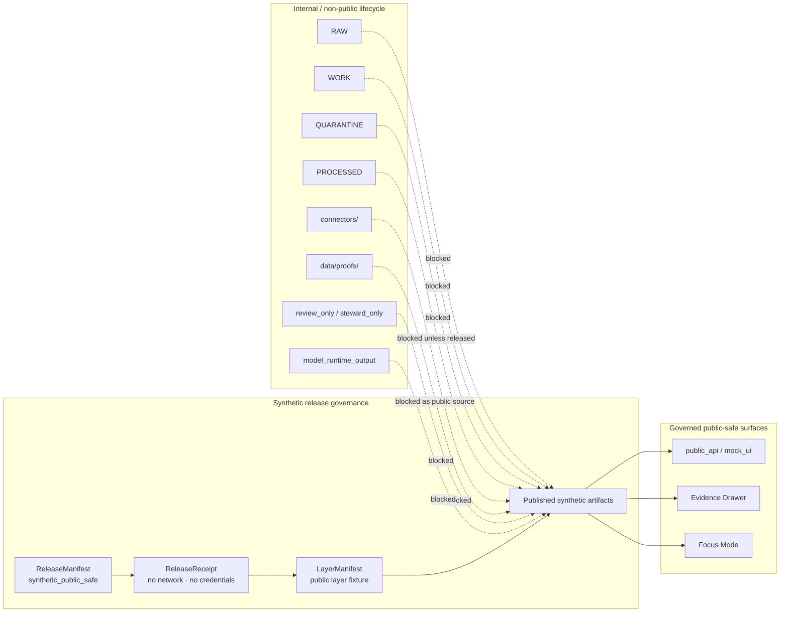

<!-- [KFM_META_BLOCK_V2]
doc_id: kfm://doc/adr-0008-hydrology-synthetic-release-governance
title: ADR-0008: Hydrology Synthetic Release Governance
type: adr
version: v1.0
status: accepted
owners: TODO: architecture steward; hydrology domain steward; release steward; policy steward; documentation steward
created: NEEDS_VERIFICATION
updated: 2026-05-06
policy_label: internal-draft
related: [
  docs/adr/README.md,
  docs/adr/ADR-0004-hydrology-first-proof-lane.md,
  docs/adr/ADR-0005-promotion-gate.md,
  docs/runbooks/foundation-strategy.md,
  docs/domains/hydrology/README.md,
  fixtures/domains/hydrology/release_manifests/hydrology_synthetic_streamflow.release_manifest.json,
  fixtures/domains/hydrology/release_receipts/hydrology_synthetic_streamflow.release_receipt.json,
  fixtures/domains/hydrology/layer_manifests/hydrology_synthetic_streamflow.public_layer_manifest.json,
  fixtures/domains/hydrology/published_artifacts/hydrology_synthetic_streamflow.public_claim_artifact.json,
  fixtures/domains/hydrology/published_artifacts/hydrology_synthetic_streamflow.public_layer_artifact.json,
  fixtures/domains/hydrology/published_artifacts/hydrology_synthetic_streamflow.public_evidence_drawer_artifact.json,
  fixtures/domains/hydrology/published_artifacts/hydrology_synthetic_streamflow.public_focus_artifact.json,
  schemas/contracts/v1/release/release_manifest.schema.json,
  tools/validate_fixture_schema_mapping.py
]
tags: [
  kfm,
  adr,
  hydrology,
  synthetic-release,
  release-governance,
  no-network,
  public-safe,
  review,
  policy,
  validation,
  evidence-drawer,
  focus-mode,
  rollback
]
notes: [
  Replaces the prior stub: "Decision: Introduce synthetic review+release governance fixtures and validators for public-safe artifact publication without real-source activation.",
  Accepted only for synthetic release drill governance; it does not authorize live source activation or public reliance on real hydrology data.",
  Current fixture evidence includes a synthetic hydrology ReleaseManifest, ReleaseReceipt, LayerManifest, and public artifact fixtures for claim, layer, Evidence Drawer, and Focus Mode.",
  Owners, original creation date, ADR index status, CI enforcement, branch protection, validator coverage for every PR-008 fixture, and production runtime behavior remain NEEDS VERIFICATION."
]
[/KFM_META_BLOCK_V2] -->

<a id="top"></a>

# ADR-0008: Hydrology Synthetic Release Governance

Govern synthetic hydrology review-and-release drills so KFM can test public-safe publication surfaces without fetching real source data, using live credentials, or activating real-world public release.

<p align="center">
  
  
  
  
  
</p>

<p align="center">
  <a href="#decision">Decision</a> ·
  <a href="#context">Context</a> ·
  <a href="#evidence-boundary">Evidence boundary</a> ·
  <a href="#synthetic-release-contract">Synthetic contract</a> ·
  <a href="#governance-rules">Governance rules</a> ·
  <a href="#fixture-family">Fixture family</a> ·
  <a href="#validation">Validation</a> ·
  <a href="#rollback">Rollback</a> ·
  <a href="#open-verification">Open verification</a>
</p>

> [!IMPORTANT]
> **Decision status:** `accepted` for a synthetic hydrology release governance drill.  
> **Implementation status:** `partial / evidence-bounded`. The repository has synthetic release fixtures, but this ADR does not claim production release automation, live hydrology connectors, public API deployment, branch protection, dashboarding, or full CI enforcement.  
> **Target path:** `docs/adr/ADR-0008-hydrology-synthetic-release-governance.md`.

> [!WARNING]
> This ADR authorizes **synthetic, no-network, public-safe release governance only**. It does **not** authorize live source harvesting, credential use, official-source hydrology publication, emergency alerting, hydrologic simulation, direct model-runtime output, or direct public access to internal lifecycle stores.

---

## Decision

KFM accepts a **hydrology synthetic release governance drill** as a controlled way to test review, policy, validation, release, public-surface, correction, and rollback behavior without activating real source data.

The synthetic release drill may use fixture states such as:

```text
RELEASE_READY_SYNTHETIC -> PUBLISHED_SYNTHETIC
```

The drill is allowed only when the release candidate is explicitly:

- `synthetic: true`
- `no_network: true`
- `not_official_source_data: true`
- `release_class: synthetic_public_safe`
- supported by release, review, policy, validation, evidence, catalog, correction, and rollback references
- blocked from RAW, WORK, QUARANTINE, processed-internal, connector, proof-only, review-only, steward-only, and model-runtime public source paths

### Accepted rule

A synthetic hydrology release can be **published as a synthetic drill** without becoming official hydrology data.

The synthetic release is a test of governance mechanics, not a claim that:

- live source connectors are active;
- real USGS, FEMA, WBD, NHDPlus HR, or other source data has been fetched;
- the public API is production-ready;
- MapLibre surfaces are production-public;
- Focus Mode may answer from raw model output;
- release automation is complete;
- branch protection or workflow enforcement is active.

<p align="right"><a href="#top">Back to top ↑</a></p>

---

## Context

KFM’s hydrology lane is the first proof-bearing lane. ADR-0004 selects hydrology because it can exercise KFM’s trust path with public-safe, spatial, temporal, evidence-resolving material before higher-sensitivity domains.

This ADR is narrower than ADR-0004. It does not decide that hydrology is first. It decides how the **synthetic hydrology release drill** is allowed to behave once the lane has fixture-backed release objects.

The current synthetic fixture family centers on the PR-008-style streamflow drill:

```text
fixtures/domains/hydrology/
├── release_manifests/
│   └── hydrology_synthetic_streamflow.release_manifest.json
├── release_receipts/
│   └── hydrology_synthetic_streamflow.release_receipt.json
├── layer_manifests/
│   └── hydrology_synthetic_streamflow.public_layer_manifest.json
└── published_artifacts/
    ├── hydrology_synthetic_streamflow.public_claim_artifact.json
    ├── hydrology_synthetic_streamflow.public_layer_artifact.json
    ├── hydrology_synthetic_streamflow.public_evidence_drawer_artifact.json
    └── hydrology_synthetic_streamflow.public_focus_artifact.json
```

### What the synthetic release proves

The drill proves that KFM can keep these concepts separate:

| Concept | Synthetic drill meaning |
|---|---|
| `ReleaseManifest` | Declares the synthetic release bundle, public artifact IDs, included claim/evidence/catalog/triplet/layer/policy/review/validation references, correction path, and rollback target. |
| `ReleaseReceipt` | Records the synthetic state transition and confirms no real source data, live connector, credentials, or network activation were used. |
| `LayerManifest` | Declares a public-safe synthetic layer target and downstream Evidence Drawer payload references. |
| Published artifacts | Represent public claim, layer, Evidence Drawer, and Focus Mode artifacts derived from release/evidence closure. |
| Correction notice | Keeps correction path visible even for synthetic releases. |
| Rollback card | Keeps rollback target visible even for synthetic releases. |
| Prohibited paths | Prevents public payloads from reading internal lifecycle stores or model/runtime outputs. |

### What it does not prove

The synthetic release does not prove:

- production publication maturity;
- public API route readiness;
- real-source hydrology activation;
- official data freshness;
- external source rights;
- steward review capacity;
- CI enforcement coverage;
- deployed UI behavior;
- branch protection;
- release signing;
- complete schema coverage.

<p align="right"><a href="#top">Back to top ↑</a></p>

---

## Evidence boundary

The synthetic release governance drill must preserve KFM’s truth membrane.



### Boundary statements

| Boundary | Rule |
|---|---|
| `ReleaseManifest is not EvidenceBundle` | A release manifest may point to evidence; it is not itself evidence support. |
| `LayerManifest is not EvidenceBundle` | A layer manifest may route to evidence; it does not replace evidence. |
| `Published artifact is derived` | Public artifacts may be derived from EvidenceBundle closure; they do not become canonical truth. |
| `CatalogRecordAsEvidence is prohibited` | Catalog records support discovery and closure; they must not be treated as evidence by themselves. |
| `SourceDescriptor is not public artifact` | Source descriptors control source admission and authority; they must not be released as public-facing claim payloads. |
| `Receipt is not proof` | Receipts record process memory; proof objects support release-grade trust. |

<p align="right"><a href="#top">Back to top ↑</a></p>

---

## Synthetic release contract

The synthetic hydrology release contract is a controlled fixture contract.

### Required release posture

| Requirement | Required value or behavior |
|---|---|
| Domain | `hydrology` |
| Release scope | `synthetic_public_safe` |
| Release class | `synthetic_public_safe` |
| Release status | `PUBLISHED_SYNTHETIC` for the drill |
| Lifecycle transition | `RELEASE_READY_SYNTHETIC -> PUBLISHED_SYNTHETIC` or equivalent recorded state transition |
| Network posture | `no_network: true` |
| Source posture | `not_official_source_data: true` |
| Credential posture | No credentials used |
| Connector posture | No live connector used |
| Rights status | Synthetic public-safe |
| Sensitivity status | Synthetic public-safe |
| Public surfaces | Only declared safe surfaces such as `public_api`, `mock_ui`, `evidence_drawer`, and `focus` |
| Correction path | Required |
| Rollback target | Required |

### Required references

A synthetic release manifest must identify or link the fixture equivalents of:

- release candidate;
- public artifacts;
- claims;
- EvidenceBundles;
- catalog records;
- triplet deltas, when in scope;
- layer manifests;
- policy decisions;
- review records;
- validation reports;
- release receipts;
- correction notices;
- rollback cards;
- public surface IDs.

### Prohibited public source paths

Synthetic public artifacts must not use internal paths as public evidence or public source material.

```text
blocked://raw/
blocked://work/
blocked://quarantine/
blocked://processed/
connectors/
data/proofs/
review_only/
steward_only/
model_runtime_output/
```

### Prohibited public object types

Synthetic public artifacts must not expose these object classes as public claim material:

```text
RawCaptureReceipt
WorkNormalizationReceipt
FetchReceipt
SourceDescriptor
CatalogRecordAsEvidence
```

> [!NOTE]
> The prohibited lists are intentionally stricter than “no real source data.” They also prevent governance objects, internal receipts, catalog-only records, and model/runtime output from being mistaken for public evidence.

<p align="right"><a href="#top">Back to top ↑</a></p>

---

## Governance rules

### Rule 1 — Synthetic release is a drill, not official source data

A synthetic hydrology release may be public-safe only because it is synthetic, no-network, and not official source data.

Any later release using official source data must go through source activation, rights review, policy review, validation, evidence closure, catalog/proof closure, review, promotion, correction, and rollback gates.

### Rule 2 — No live connectors

The synthetic drill must not fetch from live hydrology sources, use credentials, or call connector code paths.

### Rule 3 — Publication state is explicit

The drill may use `PUBLISHED_SYNTHETIC` as a finite release state. That state is not equivalent to ordinary production `PUBLISHED` for real data.

### Rule 4 — Public payloads are downstream

Public claim, layer, Evidence Drawer, and Focus Mode artifacts are downstream of release governance. They must not pull directly from RAW, WORK, QUARANTINE, processed-internal artifacts, connectors, review-only stores, steward-only stores, proof-only stores, or model runtimes.

### Rule 5 — Evidence boundaries stay visible

The release manifest, layer manifest, catalog records, public artifacts, receipts, and proofs must not collapse into one another.

Every public-facing synthetic claim must remain traceable to the declared EvidenceBundle ID or fixture equivalent.

### Rule 6 — Correction and rollback are mandatory even for synthetic releases

Synthetic releases still need correction and rollback references because KFM is testing governance behavior, not only happy-path rendering.

### Rule 7 — Focus Mode is evidence-bounded

Synthetic Focus Mode artifacts may test public-safe explanatory behavior only when they remain derived from evidence closure and carry release/policy/review/correction/rollback references.

### Rule 8 — Review and policy references are required

A synthetic release drill must include policy and review references. Missing policy or review references must block the drill from being treated as a completed release-governance fixture.

### Rule 9 — Validation must include negative paths

The synthetic drill must validate both allowed public-safe fixture behavior and prohibited bypass behavior.

### Rule 10 — Do not use synthetic status to launder real data

Any artifact that includes real source data, live connector output, credential-backed fetch output, or official-source values must not be labeled as `SYNTHETIC_PUBLIC_SAFE`.

<p align="right"><a href="#top">Back to top ↑</a></p>

---

## Fixture family

The following fixture family is governed by this ADR.

| Fixture | Status | Governance role | Acceptance requirement |
|---|---:|---|---|
| `fixtures/domains/hydrology/release_manifests/hydrology_synthetic_streamflow.release_manifest.json` | CONFIRMED | Declares the synthetic release bundle, included IDs, public surfaces, prohibited paths, correction path, rollback target, and synthetic/no-network/not-official-source flags. | Must validate against a release manifest contract that covers synthetic drill fields or an accepted extension contract. |
| `fixtures/domains/hydrology/release_receipts/hydrology_synthetic_streamflow.release_receipt.json` | CONFIRMED | Records the synthetic release transition and explicitly states no real source data, no live connector, no credentials, synthetic, no-network, not official source data. | Must remain process memory and not replace proof or evidence. |
| `fixtures/domains/hydrology/layer_manifests/hydrology_synthetic_streamflow.public_layer_manifest.json` | CONFIRMED | Declares the synthetic public layer fixture, release linkage, evidence/policy/review/correction/rollback references, renderer target, stale state, and public-safe state. | Must not be treated as an EvidenceBundle. |
| `fixtures/domains/hydrology/published_artifacts/hydrology_synthetic_streamflow.public_claim_artifact.json` | CONFIRMED_BY_SEARCH | Represents the public-safe synthetic claim artifact. | Content and schema validation need explicit fixture check. |
| `fixtures/domains/hydrology/published_artifacts/hydrology_synthetic_streamflow.public_layer_artifact.json` | CONFIRMED_BY_SEARCH | Represents the public-safe synthetic layer artifact. | Content and schema validation need explicit fixture check. |
| `fixtures/domains/hydrology/published_artifacts/hydrology_synthetic_streamflow.public_evidence_drawer_artifact.json` | CONFIRMED | Represents the public-safe Evidence Drawer artifact derived from EvidenceBundle closure. | Must block raw/work/quarantine/processed public source paths and catalog-as-evidence misuse. |
| `fixtures/domains/hydrology/published_artifacts/hydrology_synthetic_streamflow.public_focus_artifact.json` | CONFIRMED | Represents the public-safe Focus Mode artifact derived from EvidenceBundle closure. | Must block raw/work/quarantine/processed public source paths and catalog-as-evidence misuse. |
| `schemas/contracts/v1/release/release_manifest.schema.json` | CONFIRMED | Current generic release manifest schema surface. | Needs review for PR-008 synthetic field coverage. |
| `tools/validate_fixture_schema_mapping.py` | CONFIRMED | Existing fixture-to-schema mapping validator for core proof-slice artifacts. | Needs extension or companion validation for the PR-008 synthetic release fixture family if not already covered elsewhere. |

### Fixture identity rules

A synthetic release drill should carry two identity anchors:

| Hash family | Meaning |
|---|---|
| `content_spec_hash` | Stable identity for the normalized release content/specification under review. |
| `release_hash` | Stable identity for the release packaging or release-state bundle. |

Do not collapse these two hash roles unless a later accepted ADR explicitly changes KFM release identity semantics.

<p align="right"><a href="#top">Back to top ↑</a></p>

---

## Validation

Validation for this ADR must prove that the synthetic release is both allowed and constrained.

### Positive validation

A passing synthetic release drill must show:

- all required synthetic/no-network/not-official-source flags are true;
- no live connector, credential, or network fetch is used;
- release manifest references public artifacts, evidence bundle IDs, catalog record IDs, layer manifest IDs, policy decision IDs, review record IDs, validation report IDs, release receipts, correction notices, and rollback cards;
- public artifacts are marked public-safe and public-display-allowed where applicable;
- public artifacts preserve release manifest IDs, release receipt IDs, policy decision IDs, review record IDs, correction notice IDs, and rollback card IDs;
- finite state fields are known and synthetic-specific;
- prohibited public source paths are present and enforced;
- evidence boundary statements remain explicit.

### Negative validation

A failing synthetic release drill must block:

| Invalid condition | Expected outcome |
|---|---|
| `synthetic` is false or missing | `DENY` or validation failure |
| `no_network` is false or missing | `DENY` or validation failure |
| `not_official_source_data` is false or missing | `DENY` or validation failure |
| Live connector path appears in public artifact payload | `DENY` |
| Credential-backed fetch appears in receipt | `DENY` |
| RAW/WORK/QUARANTINE path appears as public source | `DENY` |
| `data/proofs/` is treated as public artifact source | `DENY` |
| `model_runtime_output/` appears as public source | `DENY` |
| `CatalogRecordAsEvidence` appears as evidence object type | `DENY` |
| Correction path missing | `DENY` |
| Rollback target missing | `DENY` |
| Policy decision references missing | `ABSTAIN` or `DENY` by policy |
| Review record references missing | `ABSTAIN` or `DENY` by policy |
| Schema validator cannot parse the fixture | `ERROR` |

### Proposed command shape

> [!CAUTION]
> These commands are illustrative. Use repo-native commands after validator coverage and package conventions are verified.

```bash
# Check the generic fixture-schema mapping currently present in the repo.
python tools/validate_fixture_schema_mapping.py

# PROPOSED: add or adapt this validator for PR-008 synthetic hydrology release fixtures.
python tools/validators/hydrology/validate_synthetic_release_governance.py \
  --manifest fixtures/domains/hydrology/release_manifests/hydrology_synthetic_streamflow.release_manifest.json \
  --receipt fixtures/domains/hydrology/release_receipts/hydrology_synthetic_streamflow.release_receipt.json \
  --layer-manifest fixtures/domains/hydrology/layer_manifests/hydrology_synthetic_streamflow.public_layer_manifest.json \
  --published-artifacts fixtures/domains/hydrology/published_artifacts
```

### Acceptance checklist

- [ ] ADR index lists ADR-0008 and its synthetic-drill scope.
- [ ] Owners and policy label are confirmed.
- [ ] Synthetic release manifest validates against an accepted schema or accepted synthetic extension.
- [ ] Synthetic release receipt validates against an accepted schema or accepted synthetic extension.
- [ ] Layer manifest validates against an accepted schema or accepted synthetic extension.
- [ ] Public claim, layer, Evidence Drawer, and Focus Mode artifacts validate against accepted public artifact contracts.
- [ ] Negative fixtures prove that real-source, connector, credential, raw/work/quarantine, proof-only, review-only, steward-only, and model-runtime bypasses are blocked.
- [ ] ReleaseManifest is not treated as EvidenceBundle.
- [ ] LayerManifest is not treated as EvidenceBundle.
- [ ] CatalogRecordAsEvidence is blocked.
- [ ] SourceDescriptor is not emitted as a public artifact.
- [ ] Correction path and rollback target are required.
- [ ] Release receipt records no real source data, no live connector, and no credentials.
- [ ] Public surfaces remain synthetic/mock unless a separate live-source promotion decision exists.
- [ ] CI or a recorded validation receipt proves the checks, or this remains `NEEDS VERIFICATION`.

<p align="right"><a href="#top">Back to top ↑</a></p>

---

## Consequences

### Positive consequences

- Gives KFM a safe publication drill that exercises release state without live data risk.
- Allows MapLibre, Evidence Drawer, Focus Mode, and public API payloads to be tested against governed release metadata.
- Makes correction and rollback mandatory before real public releases are attempted.
- Prevents synthetic fixtures from being confused with official hydrology source data.
- Preserves separation among manifests, receipts, proofs, evidence, catalog records, public artifacts, and model/runtime output.
- Gives later live-source activation a concrete gate to compare against.

### Costs

- Requires extra schemas or validation rules for synthetic-specific release fields.
- Requires maintaining both positive and negative fixtures.
- Requires ADR index and fixture-schema mapping updates.
- Requires clear UI language so synthetic public-safe artifacts are not mistaken for real-world hydrology data.
- Requires discipline not to widen the synthetic drill into a live-source release.

### Tradeoff accepted

KFM accepts a small synthetic release layer as a necessary rehearsal for public publication governance.

The benefit is not the synthetic hydrology content itself. The benefit is proving that KFM can expose public-safe artifacts while keeping evidence, policy, review, correction, rollback, and prohibited-source boundaries visible.

<p align="right"><a href="#top">Back to top ↑</a></p>

---

## Risks and mitigations

| Risk | Impact | Mitigation |
|---|---|---|
| Synthetic fixture is mistaken for official hydrology data. | Public trust damage. | Keep `synthetic`, `no_network`, `not_official_source_data`, and `PUBLISHED_SYNTHETIC` visible in manifests, receipts, layer metadata, and UI payloads. |
| Public artifacts bypass evidence. | Map/UI/Focus become false truth surfaces. | Require EvidenceBundle references and enforce evidence boundary statements. |
| ReleaseManifest is treated as evidence. | Release packaging replaces source support. | Enforce `ReleaseManifest is not EvidenceBundle`. |
| Catalog record is treated as evidence. | Discovery metadata becomes claim support. | Block `CatalogRecordAsEvidence`. |
| Live connector sneaks into synthetic path. | Synthetic drill becomes real-source release without gates. | Validate `no_live_connector_used`, `no_credentials_used`, `no_real_source_data_fetched`, and prohibited connector paths. |
| Model runtime output is published. | Generated language becomes public truth. | Block `model_runtime_output/` and require Focus artifacts to be derived from evidence closure. |
| Rollback target is placeholder-only. | Drill cannot test release reversibility. | Require rollback card ID and verify target fixture or explicit drill placeholder. |
| ADR number collision hides the decision. | Maintainers cite the wrong ADR. | Update ADR index and preserve full path as identity. |
| Generic release schema is too thin for PR-008 fixture fields. | Validation gives false confidence. | Add a synthetic release governance schema or extension validator. |

<p align="right"><a href="#top">Back to top ↑</a></p>

---

## Rollback

### Rolling back the synthetic release fixture

A synthetic release rollback must:

1. preserve the release manifest, release receipt, public artifact fixtures, layer manifest, correction notice, and rollback card;
2. move or mark only the active synthetic alias/state;
3. emit or update a rollback receipt;
4. preserve prior `content_spec_hash` and `release_hash`;
5. keep correction and rollback IDs visible to public-facing test payloads;
6. avoid deleting old fixture history to hide a failed drill.

### Rolling back this ADR

If ADR-0008 is superseded:

1. create a successor ADR;
2. keep this file as lineage;
3. state whether synthetic release drills remain allowed, are narrowed, or are retired;
4. map affected fixture paths to the successor rule;
5. preserve validation failures and correction lessons;
6. update `docs/adr/README.md` with supersession status.

### Revert path

If this ADR expansion is rejected, revert only this file content to the prior stub or a shorter accepted record.

Do not remove the synthetic hydrology fixtures without a separate fixture preservation and migration decision.

<p align="right"><a href="#top">Back to top ↑</a></p>

---

## Open verification

| Item | Status | Closure path |
|---|---:|---|
| Original creation date | UNKNOWN | Inspect git history for the ADR stub. |
| Owners / CODEOWNERS | NEEDS VERIFICATION | Check `CODEOWNERS`, document registry, or maintainer assignment. |
| Policy label | NEEDS VERIFICATION | Confirm document classification policy. |
| ADR index coverage | NEEDS VERIFICATION | Update `docs/adr/README.md` to include ADR-0008 and synthetic-drill scope. |
| Complete PR-008 fixture schema coverage | NEEDS VERIFICATION | Add or verify schema mappings for release manifest, release receipt, layer manifest, public claim artifact, public layer artifact, Evidence Drawer artifact, and Focus artifact. |
| Generic release manifest schema sufficiency | NEEDS VERIFICATION | Review whether `schemas/contracts/v1/release/release_manifest.schema.json` covers synthetic drill fields or needs extension. |
| Validator command names | UNKNOWN | Confirm repo-native validation tooling and package manager conventions. |
| CI enforcement | UNKNOWN | Verify workflow YAML and branch rules before claiming enforcement. |
| Production public API behavior | UNKNOWN | Verify deployed API/runtime evidence before claiming public service behavior. |
| MapLibre runtime behavior | UNKNOWN | Verify app code/tests before claiming rendered synthetic layer behavior. |
| Focus Mode runtime behavior | UNKNOWN | Verify governed AI/runtime tests before claiming answer behavior. |
| Release signing / attestations | UNKNOWN | Verify proof/signing toolchain before claiming signed release behavior. |
| Correction and rollback fixture content | NEEDS VERIFICATION | Fetch and validate referenced correction notice and rollback card fixtures if present. |
| Public artifact content completeness | NEEDS VERIFICATION | Validate all public artifact fixture files, not only their paths. |
| Live hydrology activation | DENY by default | Requires separate accepted source activation and promotion decision. |

<p align="right"><a href="#top">Back to top ↑</a></p>

---

## Alternatives considered

| Alternative | Decision | Reason |
|---|---:|---|
| Skip synthetic release drill and activate live hydrology sources. | Rejected | Violates foundation strategy; source rights, cadence, credentials, and policy must be reviewed first. |
| Treat synthetic fixture as production publication proof. | Rejected | Synthetic fixture proves governance shape, not production readiness. |
| Publish mock UI artifacts directly from fixture files without release manifest. | Rejected | Bypasses release governance and evidence boundary. |
| Allow Focus Mode output from model runtime fixture. | Rejected | AI is interpretive and downstream; model output is prohibited as public source material. |
| Treat ReleaseManifest as evidence. | Rejected | Release packaging is not evidence support. |
| Omit rollback/correction for synthetic data. | Rejected | The drill’s purpose is to test governance, including correction and rollback. |
| Keep ADR-0008 as a one-line stub. | Rejected | The existing fixture family needs a reviewable decision record with scope, rules, validation, and rollback. |

<p align="right"><a href="#top">Back to top ↑</a></p>

---

## Supersession and change rules

Update this ADR when:

- the synthetic fixture contract changes;
- schema coverage for PR-008 fixtures becomes explicit;
- live hydrology source activation is proposed;
- release state labels change;
- public artifact contracts change;
- Evidence Drawer or Focus Mode fixture contracts change;
- correction or rollback fixture semantics change;
- promotion gate outcome grammar changes;
- ADR numbering or index conventions are normalized.

Every update must preserve:

- synthetic versus official-source distinction;
- no-network and no-credential posture for synthetic drills;
- evidence boundary statements;
- prohibited public source paths;
- prohibited public object types;
- correction path;
- rollback target;
- release receipt;
- public-client governed-interface rule.

<p align="right"><a href="#top">Back to top ↑</a></p>
