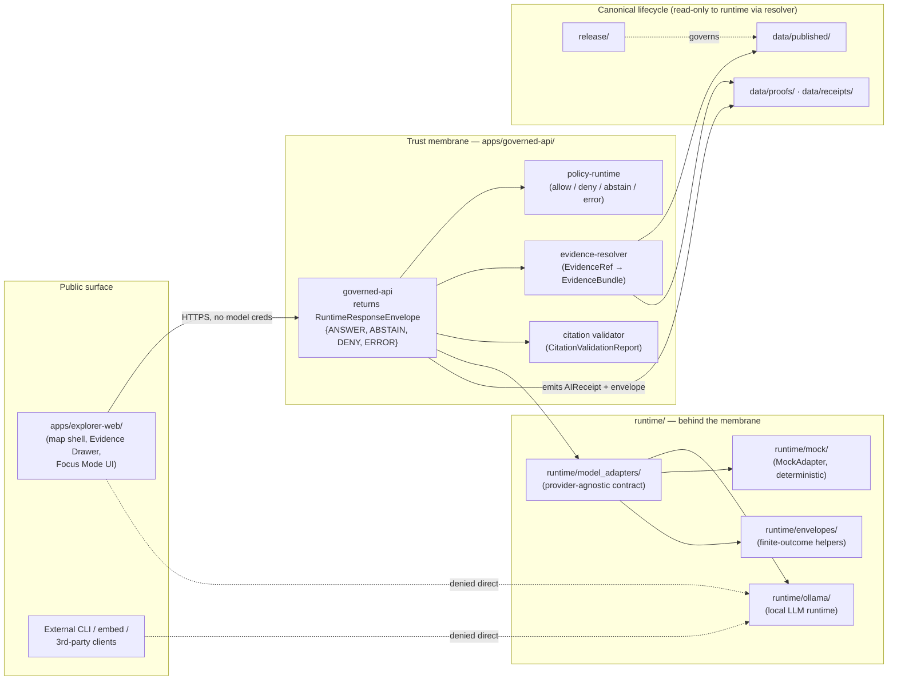

<!-- [KFM_META_BLOCK_V2]
doc_id: kfm://doc/adr/0008-ollama-subordinate-to-governed-api
title: ADR-0008 — Ollama and Local AI Runtimes Are Subordinate to the Governed API
type: standard
version: v1
status: draft
owners: <Runtime steward> + <Governance steward>   <!-- TODO: confirm CODEOWNERS -->
created: 2026-05-10
updated: 2026-05-10
policy_label: public
related:
  - docs/doctrine/directory-rules.md
  - docs/doctrine/trust-membrane.md
  - docs/doctrine/truth-posture.md
  - docs/doctrine/authority-ladder.md
  - docs/architecture/governed-api.md
  - docs/architecture/contract-schema-policy-split.md
  - docs/adr/ADR-0001-schema-home.md
tags: [kfm, adr, runtime, governed-ai, trust-membrane]
notes:
  - Codifies an invariant already stated in directory-rules §10.1.
  - Schema home for RuntimeResponseEnvelope follows ADR-0001 (schemas/contracts/v1/runtime/).
[/KFM_META_BLOCK_V2] -->

# ADR-0008 — Ollama and Local AI Runtimes Are Subordinate to the Governed API

> **Local AI runtimes are interpretive contributors, not authority. They live behind the trust membrane, return finite-outcome envelopes, and never become the public path.**

<!-- TODO: replace with repo-internal badge service if/when Shields targets are repo-resolved -->

**Quick jump:** [Status](#1-status--authority) · [Context](#2-context) · [Decision](#3-decision) · [Architecture](#4-architecture-diagram) · [Affected paths](#5-affected-paths) · [Consequences](#6-consequences) · [Alternatives](#7-alternatives-considered) · [Migration](#8-migration-plan) · [Rollback](#9-rollback-plan) · [Validation](#10-validation-and-enforcement) · [Related](#11-related-adrs-and-docs) · [Open questions](#12-open-questions--needs-verification) · [Glossary](#13-glossary)

---

## 1. Status & Authority

| Field | Value |
|---|---|
| **ADR id** | ADR-0008 |
| **Title** | Ollama and Local AI Runtimes Are Subordinate to the Governed API |
| **Status** | `proposed` |
| **Date** | 2026-05-10 |
| **Authors** | <Runtime steward>, <Governance steward> &nbsp;<!-- TODO --> |
| **Reviewers required** | Runtime steward + Governance steward + at least one Release/Policy reviewer |
| **Supersedes** | None |
| **Superseded by** | None |
| **Authority of this decision** | CONFIRMED as restatement of an existing invariant in [`docs/doctrine/directory-rules.md` §10.1](../doctrine/directory-rules.md). PROPOSED as the formal ADR encoding it. |
| **Authority of any specific path quoted here** | PROPOSED until verified against mounted-repo evidence. |
| **Related invariants** | Trust membrane · Cite-or-abstain · Watcher-as-non-publisher · Lifecycle law · Authority ladder |

> [!IMPORTANT]
> This ADR does not introduce a new constraint. It elevates the existing rule in `docs/doctrine/directory-rules.md` §10.1 — *"Local AI runtimes (Ollama, etc.) MUST stay behind the governed API and MUST remain subordinate to evidence, policy, review, and release state"* — into an addressable, citable, supersedable decision record so that runtime, infra, and UI work can reference it by ADR number rather than by section pointer.

---

## 2. Context

KFM is a governed, evidence-first, map-first knowledge system. It uses local model runtimes (Ollama on Linux/Ubuntu hosts) for interpretive work — drafting Focus Mode answers, summarizing Evidence Bundles for the Evidence Drawer, classifying free-text in admission helpers, and similar interpretive tasks. The corpus is consistent that **AI is a contributor, not an authority** ([Pass 11 §14, Category L](../KFM_Components_Pass_11_Part_2_Idea_Index_Category_Atlas_and_Expansion_Dossier.md)) and that the operational form of the trust membrane is `apps/governed-api/` ([Directory Rules §7.1, §10.1, §19](../doctrine/directory-rules.md)).

Three pressures motivate writing this down as an ADR rather than leaving it as a doctrinal sentence:

1. **Implementation pull.** A `runtime/ollama/` lane is named in Directory Rules §10.1, but the precise contract between it, `runtime/model_adapters/`, `runtime/envelopes/`, and `apps/governed-api/` has not yet been pinned by an addressable decision. PRs touching the runtime lane currently cite either `docs/doctrine/` or `docs/architecture/governed-api.md`; neither is supersedable in the ADR sense.
2. **Exposure pull.** `infra/` is required to enforce *"deny-by-default, least privilege, no direct model endpoint exposure, no raw data exposure, audit logs"* (Directory Rules §10.2). Reverse-proxy and firewall configuration needs an ADR-numbered hook to test and reference.
3. **UI pull.** Master MapLibre §10 (Governance and Trust-Membrane Chapter) states *"No direct model client. Focus Mode uses governed API, EvidenceBundle, PolicyDecision, CitationValidationReport, and AIReceipt."* `apps/explorer-web/` and `packages/maplibre/` need an ADR they can cite when refusing to add a direct Ollama client to the browser.

The risk this ADR addresses is the recurring temptation, in any local-LLM-friendly stack, to expose the model endpoint *"just for testing"* or *"behind a flag,"* and then to drift into using fluent generation as if it were evidence. KFM's failure-rule (Doctrine §19) names this exact anti-pattern: *"treats summaries, maps, tiles, graphs, vector indexes, scenes, or generated text as sovereign truth."*

---

## 3. Decision

KFM treats Ollama and any other local AI runtime as **subordinate** to the governed API. The following are normative.

### 3.1 Placement (MUST)

- The local LLM runtime lives at **`runtime/ollama/`**, behind the **`runtime/model_adapters/`** adapter interface, and is invoked only through **`apps/governed-api/`** (Directory Rules §10.1, §7.1).
- The provider-agnostic adapter contract MUST live in `runtime/model_adapters/`. New providers (e.g., a hypothetical `runtime/<other-provider>/`) MUST conform to this adapter contract.
- A `runtime/mock/` MockAdapter MUST exist for deterministic tests; CI runs MUST be runnable without contacting a real model endpoint.

### 3.2 Public path (MUST NOT)

- No public or semi-public client (browser, mobile, embed, CLI exposed to end users) MUST hold credentials for, or contact, the Ollama HTTP endpoint directly.
- `apps/explorer-web/`, `packages/ui/`, `packages/maplibre/`, and `packages/cesium/` MUST NOT import a direct model client. Their AI surface is a governed-API call returning a `FocusModeResponse` with `AIReceipt` and `CitationValidationReport` (Master MapLibre §11 object family).
- `infra/` MUST enforce *no direct model endpoint exposure* (Directory Rules §10.2). The model port MUST NOT appear in any public-facing reverse-proxy, firewall, or VPN egress allowlist.

### 3.3 Authority ordering (MUST)

- The `EvidenceBundle` outranks generated language in every interpretive flow (Doctrine §12, Governed AI Rule).
- All AI-assisted responses MUST be wrapped in the **`RuntimeResponseEnvelope`** with one of the four finite outcomes: `ANSWER`, `ABSTAIN`, `DENY`, `ERROR` (Directory Rules §19; schema home `schemas/contracts/v1/runtime/` per ADR-0001).
- When evidence is absent, weak, conflicted, or out-of-policy, the envelope MUST resolve to `ABSTAIN` or `DENY` rather than to a fluent answer (Cite-or-Abstain truth posture).

### 3.4 Read posture (MUST NOT)

- `runtime/ollama/` and `runtime/model_adapters/` MUST NOT read directly from `data/raw/`, `data/work/`, `data/quarantine/`, `data/processed/`, `data/catalog/`, or canonical/internal stores. Inputs arrive only as already-resolved `EvidenceBundle` references and `MapContextEnvelope`-shaped context produced by the governed API.
- The runtime MUST NOT write to any lifecycle phase. Per the watcher-as-non-publisher invariant, model output is a candidate, not a publication. Receipts go to `data/receipts/` (or wherever ADR-defined), wrapped in **`AIReceipt`** records (Master MapLibre §11).

### 3.5 Receipts and audit (MUST)

- Every model invocation MUST emit an `AIReceipt` capturing: `model`, `provider`, `prompt_hash`, `context_hash`, `evidence_refs`, `policy_decisions`, `output_digest`, `citation_report_ref`. Private chain-of-thought MUST NOT be persisted as truth (Master MapLibre §11).
- The governed API MUST log finite-outcome counts per route (`ANSWER`/`ABSTAIN`/`DENY`/`ERROR`) for observability.

### 3.6 Admin and developer access (MAY, with constraints)

- Direct local access to the Ollama endpoint by maintainers on the host is permitted for development and benchmarking, but MUST be:
  - Restricted to loopback / VPN / explicit allowlist by `infra/` (Directory Rules §10.2).
  - Documented in `docs/runbooks/` with the audit posture spelled out.
  - Out of the normal public path. Admin shortcuts MUST NOT become the default route.

### 3.7 Schema and contract authority

- The shape of `RuntimeResponseEnvelope`, `FocusModeRequest`, `FocusModeResponse`, and `AIReceipt` lives in `schemas/contracts/v1/runtime/` (per ADR-0001 schema-home rule). Their semantic definition lives in `contracts/runtime/`.
- This ADR does not redefine those object families. It pins *who is allowed to call them* and *who is forbidden to bypass them*.

> [!WARNING]
> Any PR adding a direct browser-side or public-route call to a local model endpoint — including `localhost:11434` or any reverse-proxied Ollama URL — MUST be rejected. The reviewer SHOULD cite this ADR by number.

---

## 4. Architecture Diagram

The diagram below reflects the responsibility boundaries named in [Directory Rules §7.1 and §10.1](../doctrine/directory-rules.md) and the governed flow described in Master MapLibre §10. It is structural, not a deployment topology.

> [!NOTE]
> Dotted *denied direct* arrows are the constraints this ADR is defending. They are not optional; they are the invariant.

---

## 5. Affected Paths

The table is **structural, not an inventory**. Per repository preflight, the live presence of each path is **NEEDS VERIFICATION** until inspected against a mounted repo. Path placement basis is Directory Rules §6.1, §7.1, §10.1, §10.2.

| Path | Role under this ADR | Directory Rules basis |
|---|---|---|
| `apps/governed-api/` | Sole public trust path. Owns envelope return, policy gating, evidence resolution, AIReceipt emission. | §7.1 |
| `apps/explorer-web/`, `packages/ui/`, `packages/maplibre/`, `packages/cesium/` | UI consumers of the governed API only. No direct model client. | §7.1, §11 |
| `runtime/model_adapters/` | Provider-agnostic adapter contract; all providers conform. | §10.1 |
| `runtime/ollama/` | Local LLM runtime. Subordinate; never a public endpoint. | §10.1 |
| `runtime/mock/` | MockAdapter for deterministic tests. Required for CI. | §10.1 |
| `runtime/envelopes/` | Finite-outcome envelope helpers. | §10.1 |
| `runtime/service_configs/` | Local runtime service config (no real secrets). | §10.1, §10.3 |
| `infra/reverse_proxy/`, `infra/firewall/`, `infra/vpn/`, `infra/hardening/` | Enforce no direct model endpoint exposure; deny-by-default; audit. | §10.2 |
| `schemas/contracts/v1/runtime/` | Schema home for `RuntimeResponseEnvelope`, `FocusModeResponse`, `AIReceipt`. | §19; ADR-0001 |
| `contracts/runtime/` | Semantic Markdown for the runtime object family. | §6.1, §7.1 (contract/schema split) |
| `policy/runtime/` (PROPOSED segment) | Policy bindings invoked by governed-api before model invocation. | §10.1, §6.1 |
| `tests/runtime_proof/`, `tests/api/` | Finite-outcome and abstain proof; no-network model tests via MockAdapter. | §6 fixtures/tests blocks |
| `data/receipts/runtime/` (PROPOSED segment) | Storage for `AIReceipt` records. | §3.5 above; lifecycle law |
| `docs/runbooks/runtime/` (PROPOSED segment) | Operational procedures: model warm-up, abstain spikes, endpoint drift, exposure drills. | §6.1 |
| `docs/architecture/governed-api.md` | Architectural narrative; this ADR pins the runtime placement of the AI lane. | §6.1 |

---

## 6. Consequences

### 6.1 Positive

- **Trust membrane stays intact.** Generated language never becomes a sovereign truth path; cite-or-abstain remains enforceable end-to-end.
- **Provider portability.** A provider-agnostic adapter contract in `runtime/model_adapters/` lets KFM swap or augment Ollama (e.g., for a different local runtime) without touching the public surface.
- **Testable in CI without GPUs.** MockAdapter makes envelope, citation, and policy behavior deterministically testable without network access to a real model.
- **Auditable.** `AIReceipt`, finite-outcome counts, and `infra/` audit logs make AI-assisted answers reviewable, correctable, and rollback-amenable.
- **Single review surface.** Public-path changes that touch AI go through the same review as any other governed-API change; AI does not earn a special bypass.

### 6.2 Negative / costs

- **Indirection cost.** UI cannot stream tokens from a browser-side Ollama client; streaming, when offered, must traverse the governed API and respect the envelope contract. This adds latency overhead and rules out some patterns common in local-LLM demos.
- **Implementation surface area.** Maintaining `runtime/model_adapters/` plus a MockAdapter plus envelope helpers is real engineering work; it is not zero-cost.
- **Operator friction.** Maintainer-side experiments against a raw Ollama endpoint must go through documented loopback / VPN / allowlist paths, not ad-hoc browser tabs.

### 6.3 Risks if the ADR is violated

- **Drift toward generated truth.** A direct browser → Ollama call would let fluent answers reach users without `EvidenceBundle` resolution, citation validation, or policy gating. This is the failure named in Doctrine §19.
- **Exposure incident.** A model endpoint reachable from the public reverse proxy is a security and rights-leakage vector (data extraction, prompt-injection vectors against canonical prompts, log exfiltration). `infra/` must continue to deny it by default.
- **Audit collapse.** Without `AIReceipt` and finite-outcome envelopes, post-hoc review of why the system answered as it did becomes guesswork.

---

## 7. Alternatives Considered

| # | Alternative | Why rejected |
|---|---|---|
| A1 | **Direct browser → Ollama via loopback or LAN reverse proxy.** | Bypasses the trust membrane (§7.1). No envelope, no `AIReceipt`, no citation validation. Master MapLibre §10 explicitly prohibits *"direct model client."* |
| A2 | **Embed Ollama as a library inside `apps/governed-api/`** (no `runtime/` lane). | Collapses runtime adapter discipline. Provider swap becomes a code change inside the governed API; tests cannot use MockAdapter cleanly. Conflicts with Directory Rules §10.1 placement. |
| A3 | **Treat Ollama as a `connector/`.** | Connectors emit to `data/raw/` or `data/quarantine/` and never publish (§7.3). Ollama is not a source of fact; it is an interpretive runtime. The connector lane is the wrong responsibility root. |
| A4 | **Treat Ollama as an `apps/workers/` background worker.** | Workers are watcher-as-non-publishers and run in batch. Interpretive answers are request-scoped and need envelope-shaped responses synchronously. The worker lane is the wrong lifecycle role. |
| A5 | **Ship a dual surface: governed API for prod, raw model client behind a feature flag for staging.** | Feature flags drift to "always on for the team that asked." The doctrine forbids admin shortcuts in the normal public path (Directory Rules §10.2; Doctrine §11). |
| A6 | **Defer the decision; keep the rule only in `docs/doctrine/directory-rules.md` §10.1.** | The doctrinal sentence exists, but PRs need an ADR-numbered citation for runtime, infra, and UI changes. Numbered ADRs are addressable; section pointers are not (Directory Rules §2.4). |

---

## 8. Migration Plan

This ADR codifies an existing invariant rather than introducing a new one, so the migration is small in well-aligned areas and larger only where the runtime lane has not yet been carved out. Steps are proportional to scope per Directory Rules §14.

1. **Create / confirm `runtime/model_adapters/`, `runtime/ollama/`, `runtime/mock/`, `runtime/envelopes/`** with READMEs that meet §15 of Directory Rules. PROPOSED until verified against current repo state.
2. **Pin schema and semantic homes.** Confirm `schemas/contracts/v1/runtime/` for shape and `contracts/runtime/` for meaning, per ADR-0001. Add or update `RuntimeResponseEnvelope`, `FocusModeRequest`, `FocusModeResponse`, `AIReceipt`.
3. **Wire `apps/governed-api/`** to call the adapter contract in `runtime/model_adapters/` and to emit `AIReceipt` to the receipts lane.
4. **Audit `apps/explorer-web/`, `packages/ui/`, `packages/maplibre/`, `packages/cesium/`** for any direct model client. If any exist, replace with governed-API calls and write a drift register entry per Directory Rules §2.5.
5. **Audit `infra/`** to confirm the model endpoint is not in any public reverse-proxy, firewall, or VPN egress allowlist. Add a hardening test (§10).
6. **Update `docs/architecture/governed-api.md`** to reference this ADR by number and link to the runtime lane.
7. **Add a one-line entry** in `docs/registers/CANONICAL_LINEAGE_EXPLORATORY.md` (or the equivalent register) noting that the runtime AI lane is now ADR-pinned.
8. **Where breakage would occur** (e.g., a previously direct UI → model call), provide a thin `apps/governed-api/` shim returning a real envelope before removing the direct path. Mirrors per Directory Rules §8.

> [!NOTE]
> No data lifecycle migration is required — this ADR does not move RAW/WORK/PROCESSED/CATALOG/PUBLISHED. It only pins the runtime lane and the public path.

---

## 9. Rollback Plan

ADR-0008 is reversible at the doctrinal level: a successor ADR can supersede it. Operationally, rollback means **un-pinning** the runtime placement, which is an unusual move because the rule already lives in Directory Rules §10.1.

Rollback steps if a future ADR supersedes this one:

1. Mark this ADR `status: superseded` and add a `Superseded by: ADR-XXXX` link. Retain the file (Directory Rules §2.4).
2. Update Directory Rules §10.1 if the successor changes the runtime lane shape.
3. Update `docs/architecture/governed-api.md` and the runtime READMEs.
4. Open a drift register entry naming the change and any code that needs to follow.
5. Verify with a dry-run rollback card in `release/rollback_cards/` if the change touches release behavior.

> [!CAUTION]
> A "rollback" that re-exposes Ollama directly to public clients without an accepted superseding ADR is not a rollback — it is a security and governance incident. Treat it as such per `docs/security/` incident response.

---

## 10. Validation and Enforcement

Validation is intentionally proportional to risk. The most important checks are the ones that catch a direct model exposure before it ships.

**Test gates (proposed; PROPOSED until wired into CI):**

- `tests/runtime_proof/` — finite-outcome proof: every governed-API route that can return AI-assisted output has fixtures producing each of `ANSWER`, `ABSTAIN`, `DENY`, `ERROR` against MockAdapter.
- `tests/api/` — citation validation: `FocusModeResponse` with missing or unsupported claims fails closed (Master MapLibre §12).
- `tests/runtime_proof/no_network/` — adapter test mode that fails the build if any `runtime/` code attempts an outbound HTTP call to a non-mock endpoint.
- `tests/api/no_direct_model_client/` — static check: no source under `apps/explorer-web/`, `packages/ui/`, `packages/maplibre/`, `packages/cesium/` imports a model SDK or references a model endpoint URL pattern.
- Schema validation against `schemas/contracts/v1/runtime/` for `RuntimeResponseEnvelope`, `FocusModeRequest`, `FocusModeResponse`, `AIReceipt`.

**Infra checks (proposed):**

- `infra/firewall/` and `infra/reverse_proxy/` configs MUST NOT expose the model port. A linter / config test SHOULD assert this.
- `infra/hardening/` runbook step: external port scan after deploy; absence of model port is a release gate.

**Code review checklist additions** (to be reflected in the path-validation checklist of Directory Rules §16):

- [ ] No new public route bypasses `apps/governed-api/`.
- [ ] No public client imports a direct model SDK.
- [ ] Any new adapter conforms to the `runtime/model_adapters/` contract.
- [ ] AI-assisted route returns `RuntimeResponseEnvelope`; missing-evidence path resolves to `ABSTAIN` or `DENY`, not a fluent answer.
- [ ] `AIReceipt` is emitted and persisted.
- [ ] `infra/` change does not expose the model endpoint.

---

## 11. Related ADRs and Docs

| Reference | Why it matters here |
|---|---|
| [`docs/doctrine/directory-rules.md`](../doctrine/directory-rules.md) §7.1, §10.1, §10.2, §19 | Canonical placement and exposure rules this ADR codifies. |
| [`docs/doctrine/trust-membrane.md`](../doctrine/trust-membrane.md) | The membrane this ADR keeps intact. |
| [`docs/doctrine/truth-posture.md`](../doctrine/truth-posture.md) | Cite-or-abstain default, expressed here as `ABSTAIN`/`DENY` envelope outcomes. |
| [`docs/doctrine/authority-ladder.md`](../doctrine/authority-ladder.md) | Why `EvidenceBundle` outranks generated language. |
| [`docs/architecture/governed-api.md`](../architecture/governed-api.md) | Architectural narrative for `apps/governed-api/`. |
| [`docs/architecture/contract-schema-policy-split.md`](../architecture/contract-schema-policy-split.md) | Why `contracts/runtime/` (meaning) and `schemas/contracts/v1/runtime/` (shape) are distinct. |
| [`docs/adr/ADR-0001-schema-home.md`](./ADR-0001-schema-home.md) | Schema home rule applied to `RuntimeResponseEnvelope` et al. |
| Master MapLibre Atlas §10, §11 | Object family map for `FocusModeRequest`/`Response`, `AIReceipt`, `EvidenceBundle`. |
| Pass 11 Part 2, Category L | Audit-first AI doctrine; LLM-as-contributor framing. |
| `docs/runbooks/` | Operational procedures for runtime warm-up, abstain spikes, exposure drills. |
| `docs/security/` | Incident response if direct model exposure occurs. |

---

## 12. Open Questions / NEEDS VERIFICATION

These are healthy follow-ups, not blockers. They SHOULD be tracked in `docs/registers/VERIFICATION_BACKLOG.md` and resolved by the affected README, a successor ADR, or an inspection PR.

- **NEEDS VERIFICATION:** Whether `runtime/`, `runtime/model_adapters/`, `runtime/ollama/`, `runtime/mock/`, and `runtime/envelopes/` exist in the live repo, and at what maturity.
- **NEEDS VERIFICATION:** Whether `apps/governed-api/` is the live trust path, or whether `apps/api/` co-exists (Directory Rules §18 names this open question).
- **NEEDS VERIFICATION:** Whether `RuntimeResponseEnvelope`, `FocusModeRequest`, `FocusModeResponse`, and `AIReceipt` schemas are published under `schemas/contracts/v1/runtime/` per ADR-0001, or whether they live elsewhere as lineage.
- **NEEDS VERIFICATION:** Whether `infra/firewall/` and `infra/reverse_proxy/` configs already exclude the Ollama port.
- **OPEN:** Where `AIReceipt` records persist — `data/receipts/runtime/` is PROPOSED here; the receipts placement may already be governed by a different convention.
- **OPEN:** Whether streaming responses (token-stream) traverse the governed API as a streamed envelope, or whether streaming is deferred until envelope semantics for partial answers are pinned.
- **OPEN:** Whether maintainer-side benchmarking against the local Ollama endpoint is sufficiently documented in `docs/runbooks/`, or whether a dedicated `docs/runbooks/runtime/ollama-bench.md` is warranted.
- **OPEN:** Whether `policy/runtime/` exists as a domain segment, or whether runtime policy bindings live elsewhere under `policy/`.

---

## 13. Glossary

Terms used here that are placement- or governance-relevant. Full definitions live in `docs/doctrine/` and `contracts/`.

| Term | Short definition relevant to this ADR |
|---|---|
| **Governed API** | The trust membrane in executable form: `apps/governed-api/`. Returns `RuntimeResponseEnvelope`. |
| **RuntimeResponseEnvelope** | Finite-outcome wrapper: `ANSWER`, `ABSTAIN`, `DENY`, `ERROR`. Schema home: `schemas/contracts/v1/runtime/`. |
| **EvidenceBundle / EvidenceRef** | Resolved support package for claims. Outranks generated language. |
| **AIReceipt** | Audit record for a model invocation. Captures model, prompt/context hashes, evidence refs, policy decisions, output digest, citation report. |
| **CitationValidationReport** | Pass/fail report on whether claims in an AI response are supported by cited evidence. |
| **PolicyDecision** | `allow` / `deny` / `abstain` / `error` outcome from the policy runtime, with reason codes and obligations. |
| **MapContextEnvelope** | Map-side context delivered to Focus Mode (viewport, selected features, released layers, time, policy state, evidence refs). |
| **MockAdapter** | Deterministic adapter under `runtime/mock/` used for tests without contacting a real model endpoint. |
| **Watcher-as-non-publisher** | Workers and runtimes emit receipts and candidates; they do not publish, mutate canonical records, or bypass review. |
| **Cite-or-abstain** | Default truth posture: when evidence is missing or weak, the system abstains rather than fabricating. |

---

[⬆ Back to top](#adr-0008--ollama-and-local-ai-runtimes-are-subordinate-to-the-governed-api)
