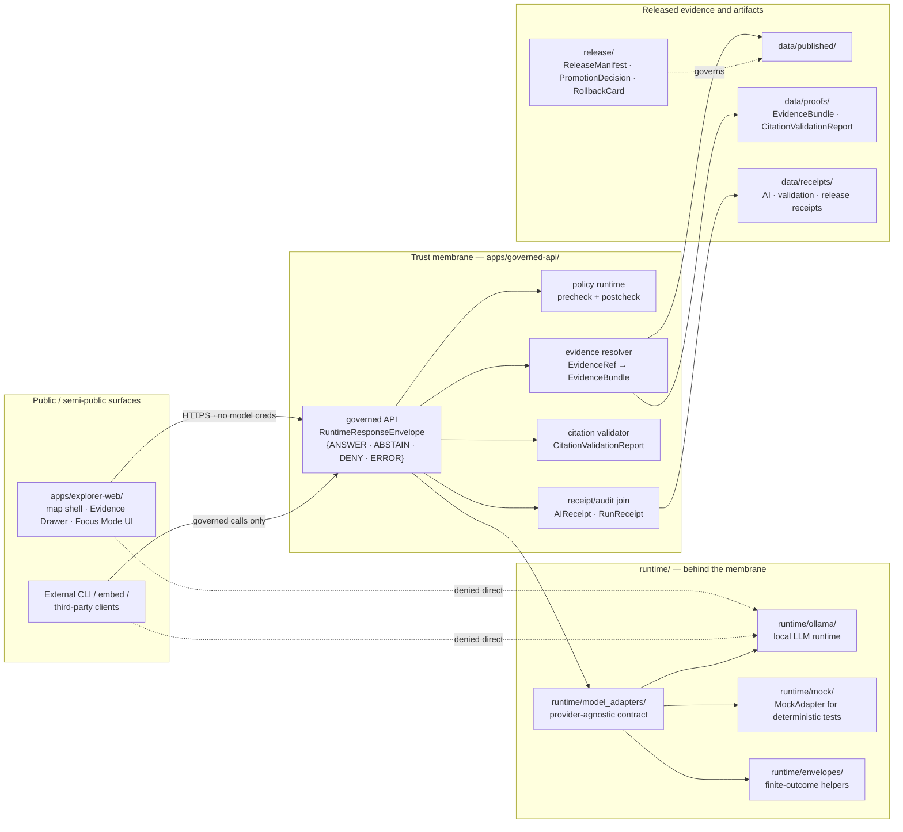

<!-- [KFM_META_BLOCK_V2]
doc_id: kfm://doc/adr/0008-ollama-subordinate-to-governed-api
title: ADR-0008 — Ollama and Local AI Runtimes Are Subordinate to the Governed API
type: standard
version: v1.1
status: draft
owners: Runtime steward + Governance steward (OWNER_TBD; confirm CODEOWNERS)
created: 2026-05-10
updated: 2026-05-15
policy_label: public
related:
  - docs/doctrine/directory-rules.md
  - docs/doctrine/trust-membrane.md
  - docs/doctrine/truth-posture.md
  - docs/doctrine/authority-ladder.md
  - docs/architecture/governed-api.md
  - docs/architecture/contract-schema-policy-split.md
  - docs/adr/ADR-0001-schema-home.md
tags: [kfm, adr, runtime, governed-ai, trust-membrane]
notes:
  - Codifies an invariant already stated in directory-rules §10.1.
  - Schema home for RuntimeResponseEnvelope follows ADR-0001 default: schemas/contracts/v1/runtime/.
  - 2026-05-15 revision tightened repo-evidence boundaries, validation gates, no-direct-client posture, and rollback language.
  - All implementation paths remain PROPOSED until mounted-repo inspection verifies them.
[/KFM_META_BLOCK_V2] -->

# ADR-0008 — Ollama and Local AI Runtimes Are Subordinate to the Governed API

> [!IMPORTANT]
> **Decision:** Local AI runtimes are interpretive contributors, not authority. They live behind the trust membrane, return finite-outcome envelopes, and never become the public path.  
> **Truth boundary:** This ADR states KFM doctrine and proposed implementation controls. It does **not** prove that any path, schema, route, test, service, policy bundle, or runtime integration already exists in the target repository.

**Quick jump:** [Status](#1-status--authority) · [Context](#2-context) · [Decision](#3-decision) · [Architecture](#4-architecture-diagram) · [Affected paths](#5-affected-paths) · [Consequences](#6-consequences) · [Alternatives](#7-alternatives-considered) · [Migration](#8-migration-plan) · [Rollback](#9-rollback-plan) · [Validation](#10-validation-and-enforcement) · [Related](#11-related-adrs-and-docs) · [Open questions](#12-open-questions--needs-verification) · [Glossary](#13-glossary)

---

## 1. Status & Authority

| Field | Value |
|---|---|
| **ADR id** | ADR-0008 |
| **Title** | Ollama and Local AI Runtimes Are Subordinate to the Governed API |
| **Status** | `proposed` |
| **Date** | 2026-05-10 |
| **Last revised** | 2026-05-15 |
| **Authors** | TODO — Runtime steward · Governance steward |
| **Reviewers required** | Runtime steward + Governance steward + at least one Release/Policy reviewer |
| **Supersedes** | None |
| **Superseded by** | None |
| **Decision scope** | Runtime placement, public exposure boundary, model-call authority, finite response envelope, audit/receipt requirements |
| **Non-goals** | Choosing a model, approving public release, pinning package versions, proving current repo implementation, defining every DTO field |
| **Authority of this decision** | CONFIRMED as a restatement of the runtime invariant in [`docs/doctrine/directory-rules.md` §10.1](../doctrine/directory-rules.md). PROPOSED as the formal ADR encoding it. |
| **Authority of any specific path quoted here** | PROPOSED until verified against mounted-repo evidence and accepted ADRs. |
| **Implementation depth** | UNKNOWN until repo tree, schemas, tests, workflows, configs, runtime logs, and emitted artifacts are inspected. |
| **Related invariants** | Trust membrane · Cite-or-abstain · Watcher-as-non-publisher · Lifecycle law · Authority ladder · Public-safe by default |

> [!IMPORTANT]
> This ADR does not introduce a new trust constraint. It elevates the existing rule in `docs/doctrine/directory-rules.md` §10.1 — local AI runtimes such as Ollama stay behind the governed API and remain subordinate to evidence, policy, review, and release state — into an addressable, citable, supersedable decision record.

> [!NOTE]
> Path references in this ADR are responsibility-root decisions, not inventory claims. If the mounted repo later shows a conflicting structure, open a drift entry and resolve by ADR or migration plan rather than silently normalizing the conflict.

---

## 2. Context

KFM is a governed, evidence-first, map-first, time-aware spatial knowledge and publication system. AI-assisted surfaces may help interpret released evidence, but the public unit of value remains the **inspectable claim**: evidence, source role, spatial scope, temporal scope, policy posture, review state, release state, and correction lineage must remain inspectable.

Local model runtimes such as Ollama are useful because they can support bounded synthesis, structured outputs, provider substitution, and local-first operation. They are also dangerous if exposed as a shortcut around the KFM trust membrane.

Three pressures motivate writing this as an ADR rather than leaving it as a doctrinal sentence:

1. **Implementation pull.** Directory Rules names `runtime/ollama/`, `runtime/model_adapters/`, `runtime/mock/`, and `runtime/envelopes/` as the responsibility-root pattern for model runtime work. A formal ADR gives PRs a stable citation for the adapter boundary and finite-envelope requirement.
2. **Exposure pull.** `infra/` must enforce deny-by-default, least privilege, no direct model endpoint exposure, no raw data exposure, and audit logging. Reverse-proxy, VPN, firewall, and systemd work needs an ADR-numbered rule to test against.
3. **UI pull.** Map-first public surfaces such as Evidence Drawer and Focus Mode must use governed APIs, released artifacts, `EvidenceBundle` resolution, `PolicyDecision`, citation validation, and `AIReceipt`. Browser-side or public-route model clients would bypass those controls.

The recurring failure this ADR prevents is the local-LLM convenience path: expose `localhost:11434`, call it from a browser or feature flag, and let generated language drift into evidence-shaped authority. That path violates the trust membrane even when the model output is useful.

---

## 3. Decision

KFM treats Ollama and any other local AI runtime as **subordinate** to the governed API. The following rules are normative for this ADR once accepted.

### 3.1 Placement (MUST)

- Provider-specific local LLM integration belongs under `runtime/ollama/`.
- Provider-agnostic adapter interfaces belong under `runtime/model_adapters/`.
- Deterministic test adapters belong under `runtime/mock/`.
- Finite-outcome helpers belong under `runtime/envelopes/`.
- Runtime service configuration belongs under `runtime/service_configs/` or `configs/` according to the mounted repo convention and Directory Rules.
- New providers, whether local or hosted, MUST conform to the provider-agnostic adapter contract before they are called by any governed API route.
- A `MockAdapter` MUST be available for deterministic no-network tests before any route is treated as release-ready.

> [!NOTE]
> The placement rule is a responsibility-root rule. It does not claim these directories already exist.

### 3.2 Public path (MUST NOT)

- Public and semi-public clients MUST NOT hold credentials for, or contact, the Ollama HTTP endpoint directly.
- `apps/explorer-web/`, `packages/ui/`, `packages/maplibre/`, `packages/cesium/`, root `web/`, and root `ui/` compatibility surfaces MUST NOT import a direct model client or reference a model endpoint URL as the normal user path.
- Focus Mode and similar AI-assisted surfaces MUST call the governed API and receive a finite, accountable response envelope.
- `infra/` MUST NOT expose the model port through public reverse proxy, firewall, VPN egress, or CDN-style routing.
- Admin shortcuts MUST NOT become the public path.

### 3.3 Authority ordering (MUST)

- `EvidenceBundle` outranks generated language.
- `PolicyDecision`, review state, release state, rights, sensitivity, and source role outrank model fluency.
- AI-assisted responses MUST be wrapped in a `RuntimeResponseEnvelope` with one of the finite outcomes: `ANSWER`, `ABSTAIN`, `DENY`, `ERROR`.
- Missing evidence, weak evidence, unresolved `EvidenceRef`, stale or withdrawn scope, unclear rights, sensitivity conflict, source-role mismatch, or policy failure MUST resolve to `ABSTAIN`, `DENY`, or `ERROR`, not to a fluent answer.
- OpenAI-compatible or other provider-compatible runtime surfaces MAY be used internally by adapters, but MUST NOT become the public KFM contract.

### 3.4 Read and write posture (MUST NOT)

- `runtime/ollama/` and `runtime/model_adapters/` MUST NOT read directly from `data/raw/`, `data/work/`, `data/quarantine/`, `data/processed/`, canonical/internal stores, or unreleased candidate artifacts.
- Runtime inputs MUST arrive through governed API context assembly after policy precheck and `EvidenceRef → EvidenceBundle` resolution.
- Runtime context MUST be release-scoped and policy-safe.
- Model output MUST NOT write to any lifecycle phase as truth.
- Model output is a candidate interpretation until schema validation, citation validation, policy postcheck, receipt emission, and response-envelope emission succeed.
- Private chain-of-thought MUST NOT be persisted as KFM truth, proof, or evidence.

### 3.5 Receipts and audit (MUST)

Every model invocation that contributes to an answer, abstention, denial, export, story, or review action MUST emit or join an `AIReceipt` / runtime receipt family that captures enough information to reconstruct the path without storing private reasoning.

At minimum, the receipt SHOULD capture:

| Field family | Required intent |
|---|---|
| `request_id` / `audit_ref` | Join request entry, policy, evidence, generation, validation, and response emission. |
| `model_profile_id` | Identify the allow-listed model/profile, not ad hoc local CLI history. |
| `provider` / `adapter` | Distinguish runtime provider from governed API contract. |
| `prompt_hash` / `context_hash` | Preserve reproducibility without persisting private reasoning. |
| `evidence_refs` / `evidence_bundle_refs` | Show what support was admissible. |
| `policy_decision_refs` | Join precheck and postcheck decisions. |
| `citation_report_ref` | Link citation validation result. |
| `output_digest` | Identify emitted text/object without treating it as root truth. |
| `outcome` | One of `ANSWER`, `ABSTAIN`, `DENY`, `ERROR`. |

The governed API SHOULD expose finite-outcome counts, citation-validation failure categories, and abstain/deny reasons to observability surfaces without leaking restricted data.

### 3.6 Admin and developer access (MAY, with constraints)

Maintainers MAY access the local Ollama endpoint directly for development, benchmarking, model pull, and adapter debugging only when all of the following are true:

- Access is loopback, VPN, or explicit allowlist only.
- The access route is documented in `docs/runbooks/` or the repo’s accepted runbook home.
- The route is kept out of normal public, semi-public, and reviewer-facing UI paths.
- The access does not read RAW / WORK / QUARANTINE / restricted / canonical stores directly.
- Any benchmark, model pull, or provisioning result that influences release behavior is receipt-backed or otherwise reviewable.

### 3.7 Schema and contract authority

- The machine-readable schema home for `RuntimeResponseEnvelope`, `FocusModeRequest`, `FocusModeResponse`, `AIReceipt`, and related runtime objects defaults to `schemas/contracts/v1/runtime/` under ADR-0001.
- Semantic contract prose belongs in `contracts/runtime/` or the repo’s accepted contract home.
- This ADR does not redefine the full field shape of those objects. It pins who may call the runtime, who may not bypass it, and which gates must surround it.
- If the mounted repo proves a conflicting schema home, treat it as `CONFLICTED / NEEDS VERIFICATION` and resolve through ADR or drift-register process before adding parallel authority.

> [!WARNING]
> Any PR adding a direct browser-side or public-route call to a local model endpoint — including `localhost:11434` or any reverse-proxied Ollama URL — MUST be rejected. The reviewer SHOULD cite ADR-0008 by number.

---

## 4. Architecture Diagram

The diagram below reflects the responsibility boundaries named by Directory Rules and the governed flow expected by KFM UI / Focus Mode doctrine. It is structural, not a deployment topology.

> [!NOTE]
> Dotted **denied direct** arrows are the constraints this ADR defends. They are not optional convenience paths.

---

## 5. Affected Paths

The table is **structural, not an inventory**. Live presence and maturity of each path remain **NEEDS VERIFICATION** until inspected against a mounted repo. Path placement basis is Directory Rules §3, §7, §9, §10, §11, and ADR-0001.

| Path or family | Role under this ADR | Status | Directory Rules basis |
|---|---|---:|---|
| `apps/governed-api/` | Sole normal trust path for AI-assisted public/semi-public calls; owns policy, evidence resolution, citation validation, finite envelope emission, and receipt joins. | NEEDS VERIFICATION | Trust membrane / public path discipline |
| `apps/api/` | Possible adjacent or legacy API surface. Boundary with `apps/governed-api/` must be inspected before route claims. | OPEN | Directory Rules §18 open question |
| `apps/explorer-web/` | Public map shell consumer of governed API. No direct model client. | NEEDS VERIFICATION | UI / map roots |
| `packages/ui/` | Shared UI components. May render AI results only from governed envelopes. | NEEDS VERIFICATION | Shared package root |
| `packages/maplibre/` | MapLibre integration package. May provide map context; must not become AI authority. | NEEDS VERIFICATION | Map renderer boundary |
| `packages/cesium/` | Alternate 3D renderer when admitted. Must consume same evidence/policy/envelope objects as 2D. | NEEDS VERIFICATION | Alternate renderer, not alternate truth |
| `runtime/model_adapters/` | Provider-agnostic adapter contract. All runtime providers conform here. | PROPOSED / NEEDS VERIFICATION | Runtime root |
| `runtime/ollama/` | Local LLM runtime integration. Subordinate; never public endpoint. | PROPOSED / NEEDS VERIFICATION | Runtime root |
| `runtime/mock/` | `MockAdapter` for deterministic no-network tests. | PROPOSED / NEEDS VERIFICATION | Runtime root |
| `runtime/envelopes/` | Finite-outcome envelope helpers. | PROPOSED / NEEDS VERIFICATION | Runtime root |
| `runtime/service_configs/` | Runtime service config without secrets. | PROPOSED / NEEDS VERIFICATION | Runtime / configs split |
| `infra/reverse_proxy/` | Enforces no direct model endpoint exposure. | PROPOSED / NEEDS VERIFICATION | Infra exposure root |
| `infra/firewall/` | Deny-by-default model exposure and raw-data exposure checks. | PROPOSED / NEEDS VERIFICATION | Infra exposure root |
| `infra/vpn/` | Private remote access when justified; no model endpoint public path. | PROPOSED / NEEDS VERIFICATION | Infra exposure root |
| `infra/hardening/` | Service sandboxing, least privilege, logging, exposure review. | PROPOSED / NEEDS VERIFICATION | Infra hardening root |
| `configs/` | Non-secret templates and environment-specific references. Real secrets prohibited. | PROPOSED / NEEDS VERIFICATION | Config root |
| `schemas/contracts/v1/runtime/` | Default schema home for runtime envelope, Focus Mode, and AI receipt schemas. | PROPOSED default | ADR-0001 schema-home convention |
| `contracts/runtime/` | Semantic Markdown for runtime object family and adapter obligations. | PROPOSED / NEEDS VERIFICATION | Contract/schema split |
| `policy/runtime/` or `policy/ai/` | Runtime policy bindings for precheck/postcheck. Exact lane name needs repo convention. | PROPOSED / NEEDS VERIFICATION | Policy root |
| `tests/runtime_proof/` | Finite-outcome, no-network, adapter, citation, and policy fixtures. | PROPOSED / NEEDS VERIFICATION | Tests root |
| `tests/api/` | Governed API route and no-direct-client tests. | PROPOSED / NEEDS VERIFICATION | Tests root |
| `data/receipts/ai/` | Receipt home for AI/runtime invocation records if repo convention supports this lane. | PROPOSED / NEEDS VERIFICATION | Data receipts family |
| `data/proofs/citation_validation/` | Citation validation reports that support cite-or-abstain. | PROPOSED / NEEDS VERIFICATION | Data proofs family |
| `docs/runbooks/runtime/` | Operational procedures: model warm-up, endpoint drift, abstain spikes, restore/correction drills. | PROPOSED / NEEDS VERIFICATION | Docs runbook home |
| `docs/architecture/governed-api.md` | Architectural narrative for governed API; should link ADR-0008 once accepted. | PROPOSED / NEEDS VERIFICATION | Docs architecture |

---

## 6. Consequences

### 6.1 Positive

- **Trust membrane stays intact.** Generated language never becomes a sovereign truth path; cite-or-abstain remains enforceable end to end.
- **Provider portability improves.** A provider-agnostic adapter contract lets KFM add or replace Ollama without changing the public contract.
- **No-network tests become possible.** `MockAdapter` makes finite outcomes, citation handling, and policy behavior testable without GPU or live model access.
- **Audit improves.** `AIReceipt`, finite-outcome logs, and citation reports make model-assisted answers reconstructable, reviewable, and correctable.
- **UI discipline improves.** Focus Mode remains part of the KFM shell and evidence path, not a detached assistant tab.
- **Security posture is clearer.** Infra reviews have a simple rule: model endpoint exposure is denied unless explicitly constrained for admin work and kept out of public paths.

### 6.2 Negative / costs

- **Indirection cost.** UI cannot stream tokens directly from a browser-side Ollama client. Streaming, if later supported, must traverse the governed API and retain finite envelope semantics.
- **Engineering cost.** Adapter contracts, mock runtimes, receipt joins, policy pre/postchecks, and citation validation require implementation and maintenance.
- **Operator friction.** Maintainer experiments must use documented loopback / VPN / allowlist routes, not ad hoc public exposure.
- **Schema discipline.** Runtime object families must not be scattered across `contracts/`, `schemas/`, compatibility roots, and ad hoc app DTOs.

### 6.3 Risks if the ADR is violated

- **Generated truth drift.** A direct browser → Ollama call can produce fluent text without `EvidenceBundle` resolution, policy gating, citation validation, or release-state awareness.
- **Exposure incident.** A model endpoint reachable from a public reverse proxy can leak data, accept unsafe prompts, or become an unreviewed operational dependency.
- **Audit collapse.** Without finite envelopes and receipts, later review of why the system answered, abstained, denied, or errored becomes guesswork.
- **Policy bypass.** Public or semi-public users could receive responses over restricted, unreleased, stale, withdrawn, or rights-uncertain material.
- **Schema authority drift.** Runtime DTOs could diverge between app code, `contracts/`, `schemas/`, and UI assumptions.

---

## 7. Alternatives Considered

| # | Alternative | Why rejected |
|---|---|---|
| A1 | **Direct browser → Ollama via loopback, LAN, or reverse proxy.** | Bypasses the trust membrane. No guaranteed envelope, `AIReceipt`, policy check, release scope, or citation validation. |
| A2 | **Embed Ollama-specific calls directly inside `apps/governed-api/` with no `runtime/` lane.** | Collapses provider discipline and makes MockAdapter/no-network testing harder. Conflicts with Directory Rules runtime placement. |
| A3 | **Treat Ollama as a `connector/`.** | Connectors admit external source material; Ollama is not a source of truth. It is an interpretive runtime. |
| A4 | **Treat Ollama as an `apps/workers/` background worker.** | Workers may emit candidates and receipts, but request-scoped Focus Mode needs synchronous finite envelopes and evidence resolution through the governed API. |
| A5 | **Ship a dual surface: governed API for production, raw model client behind a feature flag for staging.** | Feature flags drift. Admin shortcuts must stay constrained and outside the normal public path. |
| A6 | **Keep the rule only in Directory Rules §10.1.** | The rule exists, but runtime, infra, UI, and review work need an ADR-numbered citation. |
| A7 | **Use OpenAI-compatible runtime endpoints as the public KFM API.** | Provider compatibility is useful internally, but KFM public contracts must remain KFM-native and evidence/policy/release-aware. |

---

## 8. Migration Plan

This ADR codifies an existing invariant. Migration is therefore mostly an inspection, hardening, and contract-alignment effort.

1. **Phase 0 — inspect current repo state.** Confirm whether `runtime/`, `apps/governed-api/`, `apps/api/`, `schemas/contracts/v1/runtime/`, `contracts/runtime/`, `policy/runtime/`, tests, infra, and runbooks exist. Record conflicts in `docs/registers/DRIFT_REGISTER.md` or `docs/registers/VERIFICATION_BACKLOG.md`.
2. **Pin schema and semantic homes.** Confirm ADR-0001 and the live schema-home convention. Add or update runtime schemas only after avoiding parallel schema authority.
3. **Create or confirm runtime lane READMEs.** `runtime/model_adapters/`, `runtime/ollama/`, `runtime/mock/`, and `runtime/envelopes/` should state scope, inputs, outputs, exclusions, and no-public-path rules.
4. **Implement provider-neutral adapter contract.** Start with `health`, `generate_structured`, `embed`, `list_allowed_models`, and `admin_provision_model` only if those operations are accepted by the repo’s runtime contract.
5. **Wire governed API only.** Runtime calls originate from governed API routes after policy precheck and evidence resolution.
6. **Add response envelope and receipt fixtures.** Validate `ANSWER`, `ABSTAIN`, `DENY`, and `ERROR` with both positive and negative fixtures.
7. **Audit UI/client code.** Search `apps/explorer-web/`, `apps/web/`, root `web/`, `packages/ui/`, `packages/maplibre/`, and compatibility roots for direct model SDK imports or endpoint strings.
8. **Audit `infra/`.** Confirm reverse-proxy, VPN, firewall, systemd, and hardening configs do not expose the model endpoint.
9. **Update docs.** Link ADR-0008 from `docs/architecture/governed-api.md`, runtime READMEs, Focus Mode docs, and relevant runbooks.
10. **Prove one thin slice.** The first trusted slice should demonstrate source descriptor → evidence bundle → policy → model adapter → structured output → citation validation → policy postcheck → runtime envelope → receipt/audit join → rollback/correction drill.

> [!NOTE]
> No lifecycle migration is required by this ADR. It does not move RAW, WORK, QUARANTINE, PROCESSED, CATALOG, TRIPLET, or PUBLISHED data. It pins the runtime lane and the public call path.

---

## 9. Rollback Plan

ADR-0008 is reversible only through a successor ADR because it restates a core trust invariant. Operational rollback means removing or superseding this formal ADR reference, not silently exposing a model endpoint.

Rollback steps if a future ADR supersedes this one:

1. Mark this ADR `status: superseded` and add `Superseded by: ADR-XXXX`.
2. Retain the file and preserve the forward link.
3. Update Directory Rules §10.1 only if the successor ADR changes the runtime lane or exposure rule.
4. Update `docs/architecture/governed-api.md`, runtime READMEs, UI docs, runbooks, and review checklists that cite ADR-0008.
5. Open a drift-register entry naming affected code, schemas, tests, infra, and public UI surfaces.
6. Verify rollback with a rollback card under the accepted release/rollback home if behavior changes any release-facing path.
7. Invalidate or update any tests that cite ADR-0008 so failures point to the successor ADR.

> [!CAUTION]
> Re-exposing Ollama directly to public or semi-public clients without an accepted superseding ADR is not a rollback. It is a governance and security incident.

Rollback target: `ROLLBACK_TARGET_TBD_AFTER_ADR_ACCEPTANCE`

---

## 10. Validation and Enforcement

Validation is proportional to risk. The most important checks are those that catch direct model exposure, evidence bypass, and fluent uncited answers before release.

### 10.1 Acceptance gates for ADR adoption

Before this ADR is accepted, reviewers SHOULD confirm:

- [ ] ADR path and filename match the repo’s ADR convention.
- [ ] Directory Rules §10.1 is still the controlling runtime placement rule.
- [ ] ADR-0001 schema-home convention is still accepted or the conflict is recorded.
- [ ] CODEOWNERS or reviewer requirements are confirmed.
- [ ] No existing doc link would silently break if this ADR becomes the primary citation.

### 10.2 Required implementation tests

| Test family | Required check | Expected failure behavior |
|---|---|---|
| Runtime envelope fixtures | `ANSWER`, `ABSTAIN`, `DENY`, `ERROR` all validate against schema. | `ERROR` or test failure, never free-form success. |
| Citation-negative tests | Missing, stale, unresolved, restricted, or unsupported citations fail. | `ABSTAIN` or `DENY`. |
| Published-only tests | Runtime answer path cannot consume RAW / WORK / QUARANTINE / unpublished candidate scope. | `DENY` or `ABSTAIN`. |
| No-direct-model-client static test | Public UI packages cannot import model SDKs or reference model endpoint strings. | Build/test failure. |
| No-network runtime proof | MockAdapter tests run without live Ollama or outbound model calls. | Build/test failure. |
| Policy precheck/postcheck | Unsafe retrieval blocked before model use; unsafe output blocked after validation. | `DENY` or `ABSTAIN`. |
| AIReceipt schema tests | Every model-assisted response joins to receipt IDs and citation report references. | `ERROR` or release block. |
| Infra exposure tests | Reverse proxy/firewall/VPN configs do not expose model ports. | Release block. |
| Runbook drills | Restore and correction drills prove rollback/correction path. | Release block until rehearsed. |

### 10.3 Code review checklist additions

Any PR touching runtime, Focus Mode, model adapters, governed API AI routes, UI AI surfaces, or infra exposure SHOULD include this checklist:

- [ ] No public route bypasses `apps/governed-api/`.
- [ ] No public client imports a direct model SDK.
- [ ] No public client references a direct model endpoint URL.
- [ ] Runtime inputs are released, policy-safe, and evidence-resolved.
- [ ] Missing evidence returns `ABSTAIN` or `DENY`, not a fluent guess.
- [ ] `AIReceipt` or accepted runtime receipt is emitted.
- [ ] Citation validation is part of the path.
- [ ] Infra does not expose the model endpoint.
- [ ] Rollback/correction path is named.

---

## 11. Related ADRs and Docs

| Reference | Why it matters here | Status note |
|---|---|---|
| [`docs/doctrine/directory-rules.md`](../doctrine/directory-rules.md) §3, §9, §10, §11, §18, §19 | Canonical placement, lifecycle, runtime, infra, UI, and schema-home rules this ADR relies on. | CONFIRMED doctrine; path presence still NEEDS VERIFICATION |
| [`docs/doctrine/trust-membrane.md`](../doctrine/trust-membrane.md) | Defines the membrane this ADR protects. | NEEDS VERIFICATION |
| [`docs/doctrine/truth-posture.md`](../doctrine/truth-posture.md) | Cite-or-abstain default, expressed here as `ABSTAIN`/`DENY` envelope behavior. | NEEDS VERIFICATION |
| [`docs/doctrine/authority-ladder.md`](../doctrine/authority-ladder.md) | Explains why `EvidenceBundle` outranks generated language. | NEEDS VERIFICATION |
| [`docs/architecture/governed-api.md`](../architecture/governed-api.md) | Architectural narrative for the governed API boundary. | NEEDS VERIFICATION |
| [`docs/architecture/contract-schema-policy-split.md`](../architecture/contract-schema-policy-split.md) | Explains semantic contract vs machine schema vs policy authority. | NEEDS VERIFICATION |
| [`docs/adr/ADR-0001-schema-home.md`](./ADR-0001-schema-home.md) | Default schema-home rule for `schemas/contracts/v1/runtime/`. | NEEDS VERIFICATION |
| `runtime/README.md` | Should state runtime root scope and exclusions once present. | PROPOSED / NEEDS VERIFICATION |
| `contracts/runtime/` | Semantic contract home for runtime object family. | PROPOSED / NEEDS VERIFICATION |
| `schemas/contracts/v1/runtime/` | Machine schema home for runtime object family. | PROPOSED default / NEEDS VERIFICATION |
| `docs/runbooks/runtime/` | Operational procedures: model warm-up, exposure drills, abstain spikes, restore/correction. | PROPOSED / NEEDS VERIFICATION |
| `docs/security/` | Incident response if direct model exposure occurs. | NEEDS VERIFICATION |

---

## 12. Open Questions / NEEDS VERIFICATION

These are healthy follow-ups, not blockers. They SHOULD be tracked in `docs/registers/VERIFICATION_BACKLOG.md` and resolved by repo inspection, ADR, per-root README, or implementation PR.

- **NEEDS VERIFICATION:** Whether `runtime/`, `runtime/model_adapters/`, `runtime/ollama/`, `runtime/mock/`, `runtime/envelopes/`, and `runtime/service_configs/` exist in the live repo and at what maturity.
- **NEEDS VERIFICATION:** Whether `apps/governed-api/` is the live trust path, whether `apps/api/` co-exists, and what boundary separates them.
- **NEEDS VERIFICATION:** Whether `RuntimeResponseEnvelope`, `FocusModeRequest`, `FocusModeResponse`, `AIReceipt`, `CitationValidationReport`, and `PolicyDecision` schemas are published under `schemas/contracts/v1/runtime/` or another accepted home.
- **NEEDS VERIFICATION:** Whether `contracts/runtime/` exists and whether it already defines adapter semantics.
- **NEEDS VERIFICATION:** Whether public UI packages contain direct model SDK imports, direct endpoint strings, or feature-flagged model clients.
- **NEEDS VERIFICATION:** Whether `infra/firewall/`, `infra/reverse_proxy/`, `infra/vpn/`, and `infra/hardening/` configs already exclude the Ollama port.
- **NEEDS VERIFICATION:** Whether current CI includes no-direct-model-client, no-network runtime proof, published-only scope, citation-negative, and finite-envelope tests.
- **OPEN:** Where `AIReceipt` records persist. `data/receipts/ai/` is a proposed lane, but the repo may use another accepted receipt convention.
- **OPEN:** Whether streaming responses are allowed and, if so, whether streamed partials use envelope-compatible semantics.
- **OPEN:** Whether maintainer-side benchmarking needs a dedicated `docs/runbooks/runtime/ollama-bench.md`.
- **OPEN:** Whether runtime policy bindings live under `policy/runtime/`, `policy/ai/`, or another accepted policy lane.
- **OPEN:** Whether model-profile allowlists are stored in `runtime/service_configs/`, `configs/`, `policy/`, or another accepted root.

---

## 13. Glossary

Terms used here that are placement- or governance-relevant. Full definitions live in `docs/doctrine/` and `contracts/`.

| Term | Short definition relevant to this ADR |
|---|---|
| **Governed API** | The trust membrane in executable form; the normal public/semi-public path for AI-assisted answers. |
| **RuntimeResponseEnvelope** | Finite-outcome wrapper: `ANSWER`, `ABSTAIN`, `DENY`, `ERROR`. Default schema home: `schemas/contracts/v1/runtime/`. |
| **EvidenceBundle / EvidenceRef** | Resolved support package for claims. Evidence outranks generated language. |
| **AIReceipt** | Audit record for a model invocation or model-assisted response path. |
| **CitationValidationReport** | Pass/fail report on whether claims in a response are supported by cited evidence. |
| **PolicyDecision** | Policy result with allow/deny/abstain/error semantics, reason codes, and obligations. |
| **MapContextEnvelope** | Bounded map-side context delivered to governed API / Focus Mode: camera, selected features, released layers, time, policy state, and evidence refs. |
| **MockAdapter** | Deterministic runtime adapter used for no-network tests. |
| **Watcher-as-non-publisher** | Workers and runtimes emit receipts and candidates; they do not publish, mutate canonical records, or bypass review. |
| **Cite-or-abstain** | Default truth posture: when evidence is missing, weak, stale, unresolved, or out of policy, the system abstains or denies instead of fabricating. |
| **Direct model client** | Any public/semi-public app, browser, CLI, embed, or route that calls a model runtime endpoint without governed API mediation. |

---

[⬆ Back to top](#adr-0008--ollama-and-local-ai-runtimes-are-subordinate-to-the-governed-api)