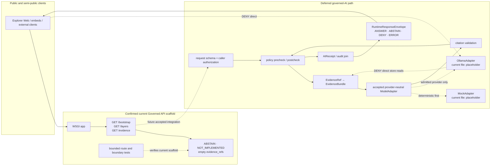

<!-- [KFM_META_BLOCK_V2]
doc_id: kfm://doc/adr/0008-ollama-subordinate-to-governed-api
title: "ADR-0008 — Ollama and Local AI Runtimes Are Subordinate to the Governed API"
type: adr
adr_id: ADR-0008
version: v1.2
status: draft
effective_decision_status: proposed
owners:
  - "OWNER_TBD — runtime / governed-AI stewardship assignment is not verified"
reviewers_required:
  - Architecture steward
  - Governed API steward
  - Runtime / governed-AI steward
  - Policy and security reviewer
  - Evidence / citation reviewer
  - Docs steward
created: 2026-05-10
updated: 2026-07-23
policy_label: public
truth_posture: cite-or-abstain
responsibility_root: docs/
current_path: docs/adr/ADR-0008-ollama-subordinate-to-governed-api.md
supersedes: []
superseded_by: null
evidence_snapshot:
  repository: bartytime4life/Kansas-Frontier-Matrix
  base_ref: main
  base_commit: e2466421ced8e41430737d4e7d51f19e3ab61d9f
  target_prior_blob: 9dcaef6cffafb4b44a9740cab5ba3811305b1983
  adr_index_blob: cf08fae322ac53426f7394d97897fdb942253049
  directory_rules_blob: 2affb080e6f0043867c64c7f06c1ca52030fbd55
  codeowners_blob: dd2a84aa514d8ecd9208bc347f90f9a2ed37dd61
  adr_0004_blob: 11b86c462d474385befba0fb2115af9885f592af
  adr_0019_blob: db55defa15fa709b20c613cf595adc334fe785ba
  governed_api_readme_blob: 4f21150852f133ba919b11f4f8792185fa870dae
  governed_api_main_blob: bcc8d3a0ddba4b225e962b594d548819df0cbb71
  governed_api_routes_blob: 3418168d0b267160d6ad6dd87f289e880ef4a024
  governed_api_stub_blob: 5d7c137d2e78ddfca35a1356a96333ac2e84952b
  governed_api_route_test_blob: 6474cef4f7378515ab673c288fc9daea19e388a9
  governed_api_boundary_test_blob: d84ccd2a93bdf786e8fca11ee596dcc47e543fc2
  api_workflow_blob: 5ec0ff53cc874935ed8ef5de791b70a52635ef33
  makefile_blob: 51537af34ee065c2de571134688415042b83b22a
  runtime_ollama_readme_blob: b0708364fa002760383882f18843e31c6c4209c7
  model_adapters_readme_blob: 16456452e03884dabb24c670c41c9e359f679769
  adapter_contract_note_blob: e371e5ca008ecbd0775bea9c2a31ef76131e7575
  ollama_adapter_blob: 1769a719d6a6df53e001abbc4c67ad486ab5c944
  mock_adapter_blob: 2a7b6533c9f073495f868aded9b213a38efe7526
  env_example_blob: 50e972a4c5c009ed89097753932fc328039c1aec
  runtime_response_contract_blob: b81d67dccdd8470e066ab8247eb93c5df67a6679
  runtime_response_schema_blob: 5105d419432a27176a8ee10870d75400cfa2ab8c
  runtime_response_validator_blob: 11ddc64c4299d103b0eef383c2f7bdd3bb12f1f9
  ai_receipt_schema_blob: 2e0bebdb3a38acbc3c58a919db46970c6e829b4a
  policy_runtime_blob: b9bfee731553c504b514f07a6862ef3e68328f02
  focus_mock_workflow_blob: aa97ee5ad099d1e10922d037061abde17ceb3a93
  finite_envelope_placeholder_test_blob: ee28fd9bb6eebee6453d8d8e432d3a0e92bfdd23
  ollama_integration_doc_blob: 39cd49270781d9d5237d98264ccd3502e28f6790
related:
  - docs/adr/README.md
  - docs/adr/INDEX.md
  - docs/adr/ADR-0004-apps-governed-api-is-the-trust-membrane.md
  - docs/adr/ADR-0019-ai-adapter-contract-and-finite-envelopes.md
  - docs/adr/ADR-0020-abstain-is-a-first-class-decision.md
  - docs/adr/ADR-0025-public-client-never-reads-canonical-internal-stores.md
  - docs/doctrine/directory-rules.md
  - docs/doctrine/trust-membrane.md
  - docs/doctrine/truth-posture.md
  - docs/doctrine/authority-ladder.md
  - docs/doctrine/ai-as-assistant.md
  - docs/architecture/governed-ai/OLLAMA_INTEGRATION.md
  - docs/architecture/governed-ai/MOCK_FIRST.md
  - apps/governed-api/README.md
  - runtime/README.md
  - runtime/ollama/README.md
  - runtime/model_adapters/README.md
  - runtime/model_adapters/AdapterContract.md
  - contracts/runtime/runtime_response_envelope.md
  - contracts/runtime/ai_receipt.md
  - schemas/contracts/v1/runtime/runtime_response_envelope.schema.json
  - schemas/contracts/v1/runtime/ai_receipt.schema.json
  - policy/runtime/README.md
  - .github/workflows/api-test.yml
  - .github/workflows/focus-mock-test.yml
tags: [kfm, adr, ollama, local-ai, governed-api, governed-ai, runtime, model-adapter, finite-outcomes, ai-receipt, citation-validation, trust-membrane, no-direct-model-client]
notes:
  - "v1.2 is a same-path, documentation-only, repository-grounded modernization; it does not accept the ADR, activate Ollama, or change runtime behavior."
  - "ADR-0008 numbering and tracked path are confirmed by docs/adr/INDEX.md; source metadata remains draft and effective decision status remains proposed."
  - "The repository now contains a minimal executable Governed API that returns deterministic ABSTAIN / NOT_IMPLEMENTED envelopes for three GET routes; this is fail-closed scaffolding, not a complete governed-AI path."
  - "runtime/model_adapters/OllamaAdapter.py and MockAdapter.py remain one-line placeholders; policy/runtime/ remains a greenfield stub; the Focus mock workflow records an explicit readiness HOLD."
  - "RuntimeResponseEnvelope and AIReceipt contracts/schemas exist at PROPOSED status, but no live model invocation, evidence resolution, citation validation, policy execution, receipt persistence, or production isolation is established."
  - "A bounded repository search did not surface an implemented direct Ollama client outside the documented runtime boundary; repository-wide static and dependency enforcement remains incomplete."
[/KFM_META_BLOCK_V2] -->

<a id="top"></a>

# ADR-0008 — Ollama and Local AI Runtimes Are Subordinate to the Governed API

> **Proposed decision.** Ollama and every other local AI runtime remain replaceable, internal interpretation providers behind KFM's governed API. They may receive only bounded, policy-safe context assembled through governed interfaces; they may never become a public client contract, evidence authority, policy authority, release authority, lifecycle store, or direct path to canonical/internal data.

[](#1-status--authority)
[](#22-current-repository-evidence)
[](#22-current-repository-evidence)
[](#22-current-repository-evidence)
[](#32-public-path-must-not)

> [!IMPORTANT]
> **Repository configuration is not reviewed decision authority.** The repository contains the canonical runtime lanes, proposed contracts and schemas, a bounded Governed API scaffold, selected structural tests, and command-bearing CI. Those surfaces do not accept this ADR, implement a model adapter, authorize a model or provider, prove policy/evidence/citation closure, establish receipt persistence, or make any AI-assisted response releasable.

> [!CAUTION]
> **Fail-closed scaffolding is not an AI integration.** The current Governed API returns `ABSTAIN` / `NOT_IMPLEMENTED`; `OllamaAdapter.py` and `MockAdapter.py` are one-line placeholders; runtime policy is a stub; and the mock-Focus workflow is an explicit readiness hold. No route may graduate to `ANSWER` merely because an envelope schema, fixture, validator, smoke test, or workflow is green.

**Quick navigation:** [Status](#1-status--authority) · [Context](#2-context) · [Decision](#3-decision) · [Architecture](#4-architecture-diagram) · [Surfaces](#5-affected-paths) · [Consequences](#6-consequences) · [Alternatives](#7-alternatives-considered) · [Migration](#8-migration-plan) · [Rollback](#9-rollback-plan) · [Validation](#10-validation-and-enforcement) · [Related](#11-related-adrs-and-docs) · [Open work](#12-open-questions--needs-verification) · [Glossary](#13-glossary) · [No-loss ledger](#appendix-a--no-loss-modernization-ledger)

---

## 1. Status & Authority

### 1.1 Decision and document state

| Field | Current value |
|---|---|
| **ADR ID** | `ADR-0008` — unique and confirmed in the canonical human [`INDEX.md`](./INDEX.md) |
| **Title** | Ollama and Local AI Runtimes Are Subordinate to the Governed API |
| **Source metadata** | `draft` |
| **Effective decision status** | `proposed` — not binding as an accepted ADR until the record and index carry matching reviewed `accepted` status |
| **Created** | 2026-05-10 |
| **Updated** | 2026-07-23 |
| **Tracked path** | `docs/adr/ADR-0008-ollama-subordinate-to-governed-api.md` |
| **Decision class** | Runtime placement, public exposure boundary, provider subordination, finite outcomes, evidence/policy/citation gates, receipts, and reversible deactivation |
| **Primary related decisions** | [`ADR-0004`](./ADR-0004-apps-governed-api-is-the-trust-membrane.md) — public dynamic trust boundary; [`ADR-0019`](./ADR-0019-ai-adapter-contract-and-finite-envelopes.md) — provider-neutral adapter and finite-envelope proposal |
| **Publication effect** | None. This ADR, a schema, fixture, workflow, model download, local daemon, response, commit, pull request, or merge is not KFM publication. |
| **Executable owner route** | `.github/CODEOWNERS` routes `docs/adr/`, `apps/governed-api/`, `runtime/`, `policy/`, `schemas/`, `tests/`, and related roots to `@bartytime4life`; governance role assignments and review completion remain separate and unverified. |

### 1.2 Current implementation posture

| Concern | Status | Safe conclusion |
|---|---|---|
| ADR identity and path | **CONFIRMED** | The exact record is indexed as ADR-0008; the prior path/number uncertainty is closed. |
| Decision authority | **PROPOSED** | The record is present but not accepted. |
| Governed API application | **CONFIRMED minimal executable scaffold** | A small WSGI app registers `/bootstrap`, `/layers`, and `/evidence`; every route returns deterministic `ABSTAIN` / `NOT_IMPLEMENTED`. |
| Governed API tests | **CONFIRMED bounded structural tests** | Tests cover route manifest, `404`, `405`, selected forbidden imports/internal path literals, and current ABSTAIN shape. They do not prove auth, policy, evidence resolution, citation validation, model use, or deployed isolation. |
| API CI | **CONFIRMED command-bearing workflow** | `.github/workflows/api-test.yml` runs the smoke suite and focused ABSTAIN contract check. No workflow result is asserted by this document. |
| Ollama runtime lane | **CONFIRMED documentation lane** | `runtime/ollama/README.md` exists and describes loopback-only, mock-first, governed integration. |
| Ollama adapter | **CONFIRMED placeholder** | `runtime/model_adapters/OllamaAdapter.py` contains one comment and no executable adapter. |
| Mock adapter | **CONFIRMED placeholder** | `runtime/model_adapters/MockAdapter.py` contains one comment and no executable deterministic adapter. |
| Default runtime configuration | **CONFIRMED safe example** | `.env.example` selects `KFM_MODEL_RUNTIME=mock` and documents `OLLAMA_HOST=http://127.0.0.1:11434`; this neither starts nor approves Ollama. |
| RuntimeResponseEnvelope | **CONFIRMED contract/schema/fixtures/validator surfaces; PROPOSED status** | Machine shape and selected fixture coverage exist. The current Governed API scaffold validates a DecisionEnvelope-shaped subset rather than emitting the complete client-facing RuntimeResponseEnvelope. |
| AIReceipt | **CONFIRMED contract/schema family; PROPOSED status** | The schema requires adapter/model and digest/policy/citation/outcome fields. No invocation or persisted receipt is proven. |
| Runtime policy | **CONFIRMED stub** | `policy/runtime/README.md` contains only a greenfield-bundle marker; no accepted runtime policy execution is established. |
| Mock Focus lane | **CONFIRMED readiness hold** | The workflow checks placeholders and explicit absence of executable mock-Focus behavior; it does not run a model or emit a runtime envelope. |
| Direct public Ollama client | **Not surfaced in bounded repository searches** | This is not proof of repository-wide absence. Current enforcement is incomplete and does not cover every language, dynamic import, URL acquisition, generated file, or deployment config. |
| Installed daemon/models/version | **UNKNOWN** | No current daemon, model inventory, digest, rights review, runtime log, deployment, or health evidence was used. |

### 1.3 Acceptance gates

ADR-0008 SHOULD remain `proposed` until equivalent evidence closes every applicable gate below.

| Gate | Required evidence | Fail-closed result when missing |
|---|---|---|
| **A — Decision coherence** | ADR-0004, ADR-0008, ADR-0019, and the ADR index agree on public boundary, provider-neutral adapter, finite outcomes, and status | Keep all decisions proposed; do not infer acceptance from implementation scaffolds |
| **B — Canonical semantic boundary** | Accepted provider-neutral adapter contract under the proper contract authority, with no competing runtime-note authority | Do not activate a provider |
| **C — Deterministic MockAdapter** | Executable no-network adapter, valid/invalid fixtures, all finite outcomes, and consumer tests | Ollama remains disabled/deferred |
| **D — Evidence and policy closure** | EvidenceRef resolution, EvidenceBundle support, policy precheck/postcheck, rights/sensitivity handling, citation validation, and negative-path tests | `ABSTAIN`, `DENY`, or `ERROR`; never model invocation by default |
| **E — Receipt closure** | Schema-valid AIReceipt or accepted equivalent joined to request, policy, evidence/citation, model identity, input/output digests, and outcome without private reasoning | Block answer/release use |
| **F — Provider/model admission** | Reviewed provider profile, model identity/digest, license/terms, capability scope, resource limits, network/tool permissions, and rollback/kill switch | Provider/model remains unadmitted |
| **G — Adapter implementation** | Tested Ollama adapter behind the accepted contract; provider substitution does not change public semantics | Keep `KFM_MODEL_RUNTIME=mock` or disabled |
| **H — Exposure controls** | Loopback/private binding, secret handling, reverse-proxy/firewall review, safe logs, request limits, timeouts, circuit breaking, and incident/restore runbook | DENY activation |
| **I — Repository-wide anti-bypass enforcement** | Static/dependency/config checks across clients, deployables, examples, scripts, generated assets, and infra plus negative tests | Treat no-direct-client posture as incomplete |
| **J — Reviewed transition** | Required reviewers approve; ADR and index move together; acceptance evidence and rollback target are recorded | Remain `proposed` |

---

## 2. Context

### 2.1 Operating problem

KFM is a governed, evidence-first, map-first, time-aware spatial knowledge and publication system. AI-assisted surfaces may interpret released or explicitly review-authorized evidence, but the durable public unit remains the **inspectable claim**: evidence, source role, spatial and temporal scope, rights and sensitivity, policy posture, review state, release state, correction lineage, and rollback posture must remain inspectable.

Local runtimes are attractive because they can support private/local execution, bounded synthesis, structured generation, provider substitution, and deterministic development profiles. They become dangerous when local convenience bypasses the public trust path:

```text
browser / public route
  -> localhost or reverse-proxied model endpoint
  -> fluent output
  -> UI renders output as evidence-shaped authority
```

That path omits or weakens evidence resolution, policy, rights/sensitivity, citation validation, finite outcomes, receipts, release scope, correction state, and rollback. It remains a trust-membrane violation even when the text is useful or technically accurate.

### 2.2 Current repository evidence

The prior revision treated almost every path and implementation claim as unknown. Current evidence supports a sharper distinction.

| Surface | Verified state at the pinned snapshot | What it proves — and does not prove |
|---|---|---|
| [`INDEX.md`](./INDEX.md) | ADR-0008 is the unique tracked record; effective status `proposed`, source metadata `draft` | Identity and conservative status normalization; not acceptance |
| [`ADR-0004`](./ADR-0004-apps-governed-api-is-the-trust-membrane.md) | Repository-grounded proposed decision; documents current WSGI/ABSTAIN scaffold | Related boundary and implementation snapshot; not accepted authority |
| [`ADR-0019`](./ADR-0019-ai-adapter-contract-and-finite-envelopes.md) | Proposed provider-neutral adapter/finite-envelope decision | Design relationship; not accepted adapter contract or live provider authorization |
| [`apps/governed-api/main.py`](../../apps/governed-api/src/governed_api/main.py) | WSGI dispatch for registered GET routes | Executable minimal dispatch; not model integration, auth, evidence, policy, or release |
| [`routes/registry.py`](../../apps/governed-api/src/governed_api/routes/registry.py) | Exactly three routes: `/bootstrap`, `/layers`, `/evidence` | Current route manifest; no `/focus` or model route is implemented |
| [`stub.py`](../../apps/governed-api/src/governed_api/stub.py) | Deterministic `ABSTAIN` / `NOT_IMPLEMENTED` objects with empty evidence refs | Fail-closed scaffold; not client-facing RuntimeResponseEnvelope integration |
| [`test_abstain_routes.py`](../../apps/governed-api/tests/test_abstain_routes.py) | Iterates all routes and checks current negative shape | Current scaffold contract; not full evidence/policy/citation flow |
| [`test_boundary_guards.py`](../../apps/governed-api/tests/test_boundary_guards.py) | Checks selected import prefixes and internal path literals in the app | Bounded structural enforcement; not repository-wide information-flow proof |
| [`Makefile`](../../Makefile) | Command-bearing API tests and import check; several broader gates remain TODO readiness markers | Local orchestration surface; not release approval |
| [`api-test.yml`](../../.github/workflows/api-test.yml) | Runs smoke and focused ABSTAIN checks with read-only contents permission | CI orchestration; no run result or complete trust proof inferred here |
| [`runtime/ollama/README.md`](../../runtime/ollama/README.md) | Evidence-grounded provider-specific lane README | Placement and admission guidance; not daemon or adapter implementation |
| [`OllamaAdapter.py`](../../runtime/model_adapters/OllamaAdapter.py) | One-line placeholder | File presence only |
| [`MockAdapter.py`](../../runtime/model_adapters/MockAdapter.py) | One-line placeholder | File presence only |
| [`.env.example`](../../.env.example) | Mock selected by default; Ollama host is loopback | Safe example posture; not activation, secret, or deployment proof |
| [`RuntimeResponseEnvelope` contract](../../contracts/runtime/runtime_response_envelope.md) and [schema](../../schemas/contracts/v1/runtime/runtime_response_envelope.schema.json) | Closed proposed shape with finite outcomes and evidence/policy/freshness/correction fields | Machine/semantic proposal and fixture-test surface; not API integration |
| [`AIReceipt` schema](../../schemas/contracts/v1/runtime/ai_receipt.schema.json) | Proposed closed shape with adapter/model, digests, policy/citation refs, and outcome | Proposed accountability shape; not emitted receipt or complete evidence linkage |
| [`policy/runtime/README.md`](../../policy/runtime/README.md) | Greenfield bundle stub | No operational runtime policy |
| [`focus-mock-test.yml`](../../.github/workflows/focus-mock-test.yml) | Explicit readiness checks and HOLD posture; requires placeholders to remain placeholders | Accurate maturity sentinel; not executable mock Focus behavior |

### 2.3 Relationship to adjacent ADRs

| ADR | Question it answers | What ADR-0008 adds |
|---|---|---|
| **ADR-0004** | Which dynamic app is the normal public trust boundary? | Ollama/local runtimes may be reached only through that boundary and never become a peer public API. |
| **ADR-0008** | How are local providers placed, constrained, exposed, audited, and deactivated? | Provider-specific subordination, no-direct-client/no-direct-store rules, admission gates, security and rollback. |
| **ADR-0019** | What provider-neutral adapter and finite-envelope contract should AI runtimes conform to? | ADR-0008 consumes that accepted contract when available; it must not invent a competing adapter contract. |
| **ADR-0020** | Why is abstention a first-class decision? | ADR-0008 applies abstention before and after model execution when evidence or policy support is insufficient. |
| **ADR-0025** | Why may public clients not read canonical/internal stores? | ADR-0008 extends that rule to model context assembly and runtime-provider access. |

None of these records becomes accepted merely because another exists, because a file is present, or because a workflow passes.

---

## 3. Decision

KFM treats Ollama and every other local AI runtime as **subordinate** to the governed API. The following rules become normative only when this ADR is accepted; they remain the proposed implementation contract while status is `proposed`.

### 3.1 Placement and ownership (MUST)

- Provider-specific Ollama daemon/client/configuration integration belongs under [`runtime/ollama/`](../../runtime/ollama/).
- Provider-neutral model-adapter interfaces and adapter implementations belong under [`runtime/model_adapters/`](../../runtime/model_adapters/), subject to the accepted semantic contract.
- Deterministic mock runtime behavior belongs in the accepted mock lane; current `runtime/mock/` and `runtime/model_adapters/mock/` documentation must converge without creating two executable authorities.
- Finite-envelope implementation helpers may live under `runtime/envelopes/`, but semantic meaning remains in `contracts/` and machine shape in `schemas/`.
- Non-secret runtime profile templates belong under `runtime/service_configs/` or `configs/` according to current root contracts. Real credentials, private endpoints, tokens, and model-store secrets do not belong in Git.
- New local or hosted providers MUST conform to the provider-neutral adapter contract before any governed route may call them.
- The current `runtime/AI/` lane is a compatibility/navigation surface unless a separate accepted decision grants it implementation authority; it must not become a second adapter or contract home.

### 3.2 Public path (MUST NOT)

- Public and semi-public browsers, embeds, CLIs, review surfaces, map surfaces, and third-party clients MUST NOT contact Ollama or any other model provider directly.
- [`apps/explorer-web/`](../../apps/explorer-web/), [`packages/ui/`](../../packages/ui/), [`packages/maplibre/`](../../packages/maplibre/), examples, and compatibility roots such as `web/` and `ui/` MUST NOT contain a normal-path direct model client, model credential, provider SDK binding, or model endpoint URL.
- A future peer renderer or client surface, if separately accepted, inherits the same rule; renderer choice does not create a second AI trust path.
- Focus Mode and every other AI-assisted public feature MUST call the governed API and receive a KFM-native finite response envelope.
- OpenAI-compatible, Ollama-compatible, or provider-native wire formats MAY exist behind the adapter boundary; they MUST NOT become the public KFM contract.
- `infra/` MUST NOT make a model endpoint publicly reachable through reverse proxy, ingress, firewall exception, tunnel, VPN egress, CDN route, or undocumented port mapping.
- Developer/admin shortcuts MUST remain explicitly bounded, documented, auditable, and outside normal public, semi-public, and reviewer-facing paths.

### 3.3 Authority and finite outcomes (MUST)

- `EvidenceBundle` and released/review-authorized evidence outrank generated language.
- `PolicyDecision`, rights, sensitivity, source role, review state, release state, freshness, correction/withdrawal state, and caller role outrank model capability or fluency.
- The public result MUST resolve to exactly one finite outcome: `ANSWER`, `ABSTAIN`, `DENY`, or `ERROR`.
- Missing or unresolved evidence, citation failure, stale/withdrawn scope, unclear rights, sensitivity conflict, unsupported source role, policy failure, adapter failure, or schema failure MUST NOT fall through to a fluent answer.
- `ANSWER` is permitted only after all required prechecks, generation constraints, postchecks, citation validation, response validation, and receipt joins succeed.
- The model is never asked to decide policy, release, review, source authority, evidence admissibility, correction, or publication state.

### 3.4 Context, reads, writes, and prompt handling (MUST / MUST NOT)

- Model adapters MUST NOT read directly from `data/raw/`, `data/work/`, `data/quarantine/`, `data/processed/`, canonical/internal stores, graph/vector stores, object stores, or unreleased candidate artifacts as a normal public path.
- Runtime context MUST be assembled by governed application logic after request validation, caller authorization, policy precheck, EvidenceRef resolution, and release/review-scope checks.
- Context MUST be bounded to the minimum admissible evidence, spatial/temporal scope, source role, and obligations necessary for the request.
- Retrieved documents, map labels, issue text, pull-request text, source payloads, and other external content are **data, not runtime instruction**. Tool- or instruction-shaped content MUST be isolated, rejected, or reason-coded according to the accepted prompt-injection policy.
- Tool access, network access, file access, shell execution, and outbound retrieval are default-deny capabilities. An accepted adapter profile must enumerate any allowed capability.
- Model output MUST NOT write to RAW, WORK, QUARANTINE, PROCESSED, CATALOG/TRIPLET, PUBLISHED, contracts, schemas, policy, source registries, or release records as truth or authority.
- Generated output may become a candidate interpretation only after schema validation, citation validation, policy postcheck, receipt emission, and governed envelope emission.
- Private chain-of-thought, hidden reasoning, provider-internal traces, and unrestricted raw prompts MUST NOT be stored as KFM evidence, proof, policy, review, release, or public diagnostics.

### 3.5 Receipts and audit (MUST)

Every model-mediated attempt that contributes to an answer, abstention, denial, error, export, story, review aid, or other consequential surface MUST emit or join an accepted `AIReceipt` / runtime receipt family.

#### Schema-confirmed minimum

The current proposed `AIReceipt` schema confirms these fields:

| Field | Current machine-shape intent |
|---|---|
| `id` | Stable receipt identifier |
| `run_id` | Join to the request/run path |
| `adapter` | Identify the adapter boundary |
| `model_ref` | Identify the model/profile reference |
| `inputs_digest` | Hash the admitted input representation |
| `outputs_digest` | Hash the emitted output representation |
| `policy_decision_ref` | Join to applicable policy decision |
| `citation_validation_ref` | Join to citation validation |
| `outcome` | `ANSWER`, `ABSTAIN`, `DENY`, or `ERROR` |

#### Proposed extension / related records

The following remain **PROPOSED / NEEDS VERIFICATION** unless an accepted schema or linked receipt family carries them:

- EvidenceRef / EvidenceBundle references actually admitted to context;
- prompt/template hash and context-assembly hash;
- provider/runtime version, model digest, quantization/profile, generation parameters, resource budget, and tool/network permissions;
- precheck and postcheck policy references when more than one decision applies;
- request/audit correlation, timing, retry/circuit-breaker outcome, and safe failure category;
- release, freshness, correction, withdrawal, or rollback references where the answer depends on released state.

Receipts MUST be sufficient to reconstruct the governed path without retaining private reasoning or restricted source content. A receipt is process memory; it is not evidence closure, policy approval, review approval, release approval, or publication authority by itself.

### 3.6 Admin and developer access (MAY, with constraints)

Maintainers MAY contact a local runtime directly for installation, model pull, benchmarking, health inspection, adapter debugging, or incident response only when all applicable conditions hold:

- binding is loopback, host-local, or specifically approved private access;
- the action is outside normal public/semi-public/reviewer traffic;
- credentials, prompts, source payloads, and model caches are handled under security and retention rules;
- the action does not read canonical/internal or restricted lifecycle stores directly;
- any benchmark/profile that influences an admitted configuration is reproducible and reviewable;
- a kill switch restores `mock` or disabled mode without changing the public contract;
- the operational path and incident/restore steps are documented in an accepted runbook.

### 3.7 Provider, model, and version posture

This ADR does not choose or approve:

- an Ollama version;
- a model family, variant, quantization, context window, embedding model, or tokenizer;
- a model license, redistribution posture, usage restriction, or data-processing agreement;
- hardware requirements, performance targets, or service-level promises;
- tool-calling, web access, filesystem access, code execution, image/audio handling, or multimodal access;
- streaming behavior or partial-response semantics.

Those are admission/profile decisions. They require current authoritative verification, explicit scope, policy/security review, test evidence, rollback, and compatibility treatment before activation.

### 3.8 Schema and contract authority

Current repository evidence supports this split:

| Object / concern | Current authority surface | Current status |
|---|---|---|
| `RuntimeResponseEnvelope` meaning | [`contracts/runtime/runtime_response_envelope.md`](../../contracts/runtime/runtime_response_envelope.md) | Draft / PROPOSED |
| `RuntimeResponseEnvelope` shape | [`schemas/contracts/v1/runtime/runtime_response_envelope.schema.json`](../../schemas/contracts/v1/runtime/runtime_response_envelope.schema.json) | PROPOSED; fixtures and validator present |
| `DecisionEnvelope` meaning/shape | `contracts/runtime/decision_envelope.md` + paired runtime schema | Draft / PROPOSED; used as current scaffold subset |
| `AIReceipt` meaning/shape | [`contracts/runtime/ai_receipt.md`](../../contracts/runtime/ai_receipt.md) + paired runtime schema | Draft / PROPOSED |
| `FocusRequest` / `FocusResponse` | `contracts/ui/` plus `schemas/contracts/v1/focus/` | Contracts exist; schemas remain open PROPOSED scaffolds in current readiness checks |
| Provider-neutral adapter note | [`runtime/model_adapters/AdapterContract.md`](../../runtime/model_adapters/AdapterContract.md) | Descriptive, non-canonical, and partially stale |
| Canonical adapter semantic contract | Accepted `contracts/runtime/` surface | **NOT ESTABLISHED** |
| Runtime admissibility | [`policy/runtime/`](../../policy/runtime/) | Stub / not established |

This ADR defines the dependency and authority boundary. It MUST NOT duplicate full object fields, create a second adapter contract under `runtime/`, or treat a descriptive README/note as accepted semantic authority. When a machine shape, contract, implementation, or policy conflicts, record the conflict and resolve it through the appropriate contract/schema/policy/ADR process before adding a parallel definition.

> [!WARNING]
> Any change that adds a direct public client or public route to a local/provider model endpoint, enables a model to read canonical/internal lifecycle stores directly, or returns unvalidated raw model output MUST be rejected while this ADR is proposed and remains an explicit violation if this ADR is accepted.

---

## 4. Architecture Diagram

The diagram separates **confirmed current scaffolding** from **deferred governed-AI behavior**. It is not a deployment claim.



The dotted `future accepted integration` edge is intentionally not implemented by the current three-route scaffold. The direct client-to-provider and provider-to-store paths remain denied.

---

## 5. Affected Paths

Directory Rules basis: `docs/` records the decision; `apps/` owns deployable trust-boundary behavior; `runtime/` owns internal adapters/harnesses; `contracts/` owns meaning; `schemas/` owns machine shape; `policy/` owns admissibility; `tests/` and `fixtures/` prove behavior; `infra/` owns exposure; `data/receipts/` stores accepted receipt instances; `release/` owns release/correction/rollback decisions.

| Path or family | Role under ADR-0008 | Current evidence status |
|---|---|---|
| `docs/adr/ADR-0008-ollama-subordinate-to-governed-api.md` | Decision record | **CONFIRMED exact path; proposed decision** |
| `apps/governed-api/` | Sole normal dynamic public path for model-mediated behavior | **CONFIRMED minimal WSGI/ABSTAIN scaffold; no model route** |
| `apps/explorer-web/` | Public map/UI consumer | **CONFIRMED root; direct-model inventory remains bounded** |
| `runtime/ollama/` | Provider-specific Ollama operational lane | **CONFIRMED README; live implementation UNKNOWN** |
| `runtime/model_adapters/` | Provider-neutral adapter lane | **CONFIRMED documentation lane; executable adapters are placeholders** |
| `runtime/model_adapters/OllamaAdapter.py` | Future Ollama adapter implementation | **CONFIRMED one-line placeholder** |
| `runtime/model_adapters/MockAdapter.py` | Future deterministic adapter | **CONFIRMED one-line placeholder** |
| `runtime/mock/` and `runtime/model_adapters/mock/` | Mock runtime / adapter child lanes | **CONFIRMED documentation-only or placeholder lanes; ownership convergence required** |
| `runtime/envelopes/` | Envelope implementation helpers | **CONFIRMED documentation surface; implementation maturity UNKNOWN** |
| `runtime/service_configs/` and `configs/` | Non-secret runtime/profile configuration | **CONFIRMED/documented surfaces; accepted model profile UNKNOWN** |
| `.env.example` | Safe developer template | **CONFIRMED mock default and loopback host; not activation proof** |
| `contracts/runtime/` | Semantic runtime object meaning | **CONFIRMED multiple draft/PROPOSED contracts** |
| `schemas/contracts/v1/runtime/` | Runtime machine shapes | **CONFIRMED proposed schemas and fixture/validator references** |
| `contracts/ui/focus_request.md`, `contracts/ui/focus_response.md` | Focus request/response meaning | **CONFIRMED; machine schemas remain open scaffolds** |
| `schemas/contracts/v1/focus/` | Focus machine shapes | **CONFIRMED open PROPOSED scaffolds in current readiness checks** |
| `policy/runtime/` | Runtime allow/deny/restrict/abstain policy | **CONFIRMED stub; no policy execution established** |
| `policy/focus/` | Focus-specific policy stubs | **CONFIRMED scaffolds in readiness workflow; no accepted rules established** |
| `fixtures/contracts/v1/runtime/` | Schema fixtures | **CONFIRMED selected valid/invalid examples; shape proof only** |
| `apps/governed-api/tests/` | App-local route/boundary tests | **CONFIRMED bounded executable tests** |
| `tests/runtime_proof/` | Runtime finite-outcome proof lane | **CONFIRMED placeholder test surface; substantive proof not established** |
| `tools/validators/validate_runtime_response_envelope.py` | Reusable schema fixture validator | **CONFIRMED wrapper implementation** |
| `.github/workflows/api-test.yml` | API smoke/envelope CI | **CONFIRMED command-bearing workflow; run result not asserted** |
| `.github/workflows/focus-mock-test.yml` | Mock/Focus readiness sentinel | **CONFIRMED explicit HOLD; no model invocation** |
| `infra/reverse_proxy/`, `infra/firewall/`, `infra/vpn/`, `infra/hardening/` | Exposure and isolation controls | **Documentation/path presence varies; operational config and deployed effect NEED VERIFICATION** |
| `data/receipts/ai/` or accepted receipt lane | AIReceipt instances | **PROPOSED / NEEDS VERIFICATION; no persisted model receipt established** |
| `data/proofs/citation_validation/` or accepted proof lane | Citation validation reports | **PROPOSED / NEEDS VERIFICATION** |
| `docs/architecture/governed-ai/OLLAMA_INTEGRATION.md` | Companion implementation architecture | **CONFIRMED but stale repo-evidence boundary and placeholder path claims need later reconciliation** |
| `docs/runbooks/` and `docs/security/` | Activation, benchmark, incident, restore, kill-switch guidance | **Relevant roots confirmed; accepted Ollama-specific runbook NEEDS VERIFICATION** |

No new path is created by this ADR update. A future implementation change must re-run Directory Rules preflight against the then-current tree and accepted ADR set.

---

## 6. Consequences

### 6.1 Positive

- **The trust membrane remains explicit.** Generated language cannot become a peer public truth path.
- **Provider choice stays internal.** Mock, Ollama, hosted, or future adapters may change without changing public KFM semantics.
- **Fail-closed delivery is testable.** `ABSTAIN`, `DENY`, and `ERROR` remain first-class instead of being hidden in free text.
- **No-network proof becomes possible.** Deterministic mock behavior can exercise requests, policy/evidence gaps, citation failures, envelopes, and receipts without live model access.
- **Security review has a crisp boundary.** Public endpoint exposure, direct store access, unbounded tools/network, and raw output are reviewable violations.
- **Audit and correction improve.** Digests, adapter/model identity, policy/citation references, and finite outcomes provide a reconstructable path without storing private reasoning.
- **Model and provider rollback can be additive.** Disable or replace the provider behind the adapter while retaining the public envelope contract.

### 6.2 Negative / accepted costs

- **Indirection and latency.** Requests must transit validation, evidence resolution, policy, citation checks, receipts, and envelope assembly.
- **Streaming complexity.** Partial tokens cannot bypass finite-outcome semantics; buffering or provisional-event contracts may be required.
- **Implementation burden.** Adapter contracts, deterministic mocks, provider profiles, policy bundles, citation validators, receipts, observability, and security controls require real maintenance.
- **Operator friction.** Direct experiments must stay local/private, documented, and outside public paths.
- **Schema evolution burden.** AIReceipt, Focus, DecisionEnvelope, and RuntimeResponseEnvelope surfaces must evolve without parallel authority or silent client drift.
- **More explicit abstention.** The system will sometimes decline answers a raw model could plausibly generate. That is an intentional trust feature.

### 6.3 Risk register

| Risk | Severity | Mitigation / required evidence |
|---|---:|---|
| Direct browser or public-route model access | Critical | Repository-wide dependency/config tests; network exposure review; incident plan |
| Model reads canonical/internal or restricted stores | Critical | Governed context assembler; capability sandbox; negative tests; least privilege |
| Generated language treated as evidence | High | EvidenceBundle resolution, citation validation, finite envelopes, UI trust cues |
| Prompt injection from retrieved content | High | Untrusted-content isolation, fixed system contract, tool default-deny, negative fixtures |
| Unadmitted model or license/terms drift | High | Model profile registry, digest/version/rights review, activation decision |
| Receipt contains sensitive prompts or private reasoning | High | Digest/reference-only posture; retention/redaction review; safe diagnostics |
| Policy/citation service failure falls open | High | `ERROR`/`ABSTAIN`/`DENY`; circuit breaker; fail-closed integration tests |
| Runtime policy remains a stub while provider activates | Critical | Gate F/G; provider activation denied until policy tests pass |
| Current boundary test misses dynamic/config acquisition | Medium | AST/dependency/config/infra scans plus representative negative fixtures |
| Multiple mock/runtime lanes diverge | Medium | One accepted implementation owner; compatibility/migration note |
| Provider swap changes public semantics | High | Contract tests against all admitted adapters and fixed RuntimeResponseEnvelope behavior |
| Stale/corrected/withdrawn evidence enters context | High | Release/freshness/correction checks before generation and in response envelope |

---

## 7. Alternatives Considered

| # | Alternative | Disposition |
|---|---|---|
| A1 | **Direct browser → Ollama over loopback, LAN, tunnel, or reverse proxy.** | **Rejected.** Bypasses governed evidence, policy, citation, receipt, release, and correction controls. |
| A2 | **Embed Ollama-specific calls directly in `apps/governed-api/` without a provider-neutral adapter.** | **Rejected.** Couples public trust behavior to one provider and weakens deterministic substitution/testing. |
| A3 | **Treat Ollama as a connector/source.** | **Rejected.** A model runtime interprets; it is not source authority and must not admit its own output as evidence. |
| A4 | **Treat Ollama as an ordinary background worker.** | **Rejected for request-time behavior.** Workers may prepare candidates/receipts but cannot replace finite request/response mediation. |
| A5 | **Keep a raw provider client behind a staging feature flag.** | **Rejected as a normal path.** Feature flags drift and are not policy, isolation, or review. A bounded developer tool requires explicit admin constraints. |
| A6 | **Keep the rule only in Directory Rules and architecture notes.** | **Rejected.** Runtime, API, client, policy, security, and review changes need an addressable decision record. |
| A7 | **Expose an OpenAI-compatible or Ollama-compatible API as KFM's public contract.** | **Rejected.** Provider compatibility is internal; KFM's public contract must remain evidence/policy/release aware. |
| A8 | **Treat the current three ABSTAIN routes as a completed governed-AI integration.** | **Rejected.** The current scaffold proves fail-closed routing only; it has no model route, adapter, evidence resolver, accepted policy, citation validator, AIReceipt emission, or production isolation. |
| A9 | **Implement Ollama first, then retrofit MockAdapter and policy later.** | **Rejected.** Provider-first sequencing creates operational pressure to accept ungoverned behavior and makes negative paths nondeterministic. |
| A10 | **Forbid all direct maintainer access to Ollama.** | **Rejected as unnecessarily rigid.** Bounded loopback/private admin access is useful when documented, separated, and non-authoritative. |

---

## 8. Migration Plan

This ADR codifies an existing trust invariant. Migration is an inspection, convergence, implementation, and admission program—not a lifecycle-data move.

### 8.1 Smallest sound sequence

1. **Record the pinned inventory.** Preserve the current target blob and repository evidence snapshot; keep ADR status `proposed`.
2. **Reconcile adjacent ADRs and docs.** Align ADR-0004, ADR-0008, ADR-0019, governed-AI architecture docs, runtime READMEs, and the ADR index without promoting any decision by documentation alone.
3. **Accept or define the provider-neutral semantic contract.** Move canonical adapter meaning to the proper `contracts/runtime/` surface; keep runtime notes descriptive.
4. **Resolve Focus request/response shapes.** Replace open Focus schema scaffolds only through reviewed contract/schema/fixture work; do not duplicate RuntimeResponseEnvelope.
5. **Implement deterministic MockAdapter first.** Cover `ANSWER`, `ABSTAIN`, `DENY`, and `ERROR`; prohibit network/file/tool access; add valid/invalid fixtures and no-network consumer tests.
6. **Implement governed context assembly.** Validate request/caller; resolve EvidenceRef to EvidenceBundle; enforce release/review/freshness/correction and rights/sensitivity; bound context.
7. **Implement policy and citation gates.** Replace runtime/focus stubs with accepted rules and negative tests; fail closed on unavailable dependencies.
8. **Close receipt behavior.** Emit schema-valid AIReceipt or accepted equivalent for all finite outcomes; store only safe references/digests; test correction/retention behavior.
9. **Add repository-wide anti-bypass enforcement.** Inspect imports, dynamic acquisition, URLs, config, browser bundles, examples, scripts, generated assets, and infra—not just governed-api Python imports.
10. **Admit a provider/model profile.** Verify current provider/model/version, digest, license/terms, capability scope, resource limits, tools/network, security posture, and rollback.
11. **Implement OllamaAdapter behind the same contract.** Contract tests must pass unchanged when switching from MockAdapter.
12. **Wire one bounded governed route.** Add the smallest evidence-backed route only after all earlier gates pass; preserve finite outcomes and no direct client/provider coupling.
13. **Harden operations.** Loopback/private binding, secrets, logs, timeouts, request limits, circuit breaker, health/readiness, kill switch, incident and restore drills.
14. **Prove correction and rollback.** Disable Ollama or revert model profile without changing public contracts; invalidate unsafe cached outputs; preserve receipt/correction lineage.
15. **Review ADR acceptance separately.** Implementation evidence may support acceptance, but it cannot self-accept the decision.

### 8.2 Compatibility rules

- Keep `KFM_MODEL_RUNTIME=mock` or disabled as the safe default until provider activation is reviewed.
- Do not introduce a public-provider-specific DTO during migration.
- Do not move machine schemas into runtime directories or implementation code into contracts.
- Do not create a second adapter implementation home under `runtime/adapters/`, `runtime/AI/`, `packages/`, or `apps/` without an accepted migration/ADR.
- Preserve existing ABSTAIN-only routes until their replacements meet stricter gates; do not convert them to `ANSWER` incrementally without evidence/policy/citation closure.
- Treat generated example output as synthetic fixture material, never evidence or release content.

### 8.3 Non-goals of migration

This ADR does not move or alter RAW, WORK, QUARANTINE, PROCESSED, CATALOG/TRIPLET, PUBLISHED, receipt, proof, or release objects. It does not install Ollama, download a model, expose a port, create secrets, change infra, or activate an AI feature.

---

## 9. Rollback Plan

### 9.1 Document rollback

This documentation revision is reversible by restoring prior target blob:

```text
9dcaef6cffafb4b44a9740cab5ba3811305b1983
```

A future committed update can also be reverted through the normal commit/PR path. Restoring the prior Markdown does not alter runtime behavior.

### 9.2 Runtime/provider rollback

Any future provider activation MUST support these steps without changing the public KFM contract:

1. Set the accepted runtime profile to `mock` or `disabled`.
2. Stop/disable the local provider service and revoke its network path.
3. Remove the provider/model from the active allowlist while retaining historical admission and receipt records.
4. Return safe `ABSTAIN` or `ERROR` outcomes for affected requests.
5. Invalidate unsafe or version-bound caches and outputs.
6. Publish or record correction/withdrawal/rollback lineage when model-assisted public material was affected.
7. Verify that clients still use governed envelopes and cannot reach the provider directly.
8. Preserve prior receipts and audit references according to retention/sensitivity policy.

### 9.3 Decision rollback or supersession

A change that makes a local/provider model endpoint a normal public path, allows direct canonical-store reads, removes finite outcomes, or lets model output decide truth/policy/release requires a superseding accepted ADR and explicit amendments to higher-order doctrine where applicable.

If superseded:

- retain this file with `status: superseded`;
- add `superseded_by` and a forward link;
- update the canonical ADR index in the same reviewed transition;
- update all dependent docs, tests, policy, clients, runbooks, and drift/deprecation registers;
- include migration and rollback evidence.

> [!CAUTION]
> Directly exposing Ollama or enabling a model to read internal stores without the accepted transition is not rollback. It is a security and governance incident.

---

## 10. Validation and Enforcement

### 10.1 Current confirmed validation surfaces

| Surface | Confirmed source behavior | Boundary |
|---|---|---|
| `make governed-api-smoke` | Runs app-local Governed API tests | Test command presence; not a current run result |
| `make governed-api-verify` | Runs tests then fails on selected direct `maplibre`, `cesium`, or `ollama` imports in Governed API Python | App-local/import-prefix boundary only |
| `test_abstain_routes.py` | Requires every registered route to return deterministic `ABSTAIN` / `NOT_IMPLEMENTED` and a DecisionEnvelope subset | Current scaffold only |
| `test_boundary_guards.py` | Checks exact route set, `404`, `405`, selected import prefixes, and internal-store path literals | Selected source-level controls only |
| `api-test.yml` | Runs smoke and focused ABSTAIN test under read-only workflow permissions | CI orchestration; no run result asserted |
| RuntimeResponseEnvelope schema/fixtures/validator | Checks closed proposed shape and selected valid/invalid examples | Shape proof only |
| `focus-mock-test.yml` | Verifies placeholder/readiness conditions and records explicit HOLD | Readiness sentinel, not executable mock/runtime proof |
| `test_envelope_finite_outcomes.py` | Contains a placeholder `assert True` test | No substantive finite-outcome runtime proof |

### 10.2 Required test matrix before provider activation

| Test family | Required proof | Expected fail-closed behavior |
|---|---|---|
| Adapter contract conformance | Mock and Ollama adapters pass the same request/response contract tests | Provider remains disabled |
| All finite outcomes | Valid `ANSWER`, `ABSTAIN`, `DENY`, and `ERROR` cases with reason codes and obligations | Test failure; no free-form fallback |
| Evidence-before-model | Unresolved/missing/stale/withdrawn/unsupported evidence blocks generation where required | `ABSTAIN`, `DENY`, or `ERROR` |
| Policy precheck/postcheck | Rights, sensitivity, role, release, tools/network, and output obligations enforced | `DENY` or `ABSTAIN` |
| Citation validation | Unsupported consequential claims fail; support refs resolve and match scope | `ABSTAIN` or `ERROR` |
| Receipt validation | Every outcome emits/joins a schema-valid receipt with safe digests/refs | Release/use block |
| No-direct-public-client | UI, bundles, embeds, examples, CLIs, configs, and generated assets cannot acquire provider endpoint directly | Build/test failure |
| No-direct-internal-store | Adapter cannot import/read lifecycle/canonical/internal stores or receive unrestricted path handles | Test/release failure |
| Prompt-injection negative paths | Retrieved instruction-shaped content cannot alter system/tool/policy boundaries | `DENY`, `ABSTAIN`, or safe isolation |
| Network/tool default deny | Unapproved egress, filesystem, shell, browser, or tool access fails | `DENY` / adapter failure |
| Infra exposure | Model port is not public; loopback/private restrictions and secret boundaries verified | Activation/release block |
| Timeout/retry/circuit breaker | Provider hangs/fails without unbounded retry or unsafe fallthrough | `ERROR` with safe audit ref |
| Model/version drift | Unknown model digest/version/profile fails admission | Provider disabled / `ERROR` |
| Correction/withdrawal | Corrected or withdrawn evidence cannot produce stale `ANSWER`; affected output is invalidated | `ABSTAIN`/`DENY`, correction path |
| Kill-switch/restore | Switching to mock/disabled preserves public envelope compatibility | Activation blocked until drill passes |
| Logging/privacy | Logs/receipts omit secrets, raw restricted context, and chain-of-thought | Test/security failure |

### 10.3 Review checklist

Any PR touching model adapters, Ollama/local runtime, Focus Mode, governed-AI routes, AI receipts, citation validation, runtime policy, or exposure controls SHOULD answer:

- [ ] Is the public call still mediated by `apps/governed-api/`?
- [ ] Does the change avoid direct provider SDK/endpoint acquisition in clients?
- [ ] Is the provider-neutral semantic contract accepted and referenced rather than redefined locally?
- [ ] Does MockAdapter remain the deterministic first proof path?
- [ ] Are model inputs bounded, evidence-resolved, policy-safe, and release/review scoped?
- [ ] Are retrieved sources treated as untrusted data rather than instruction?
- [ ] Are tools, filesystem, shell, and network capabilities explicitly denied or admitted?
- [ ] Do all finite outcomes have representative positive and negative tests?
- [ ] Does `ANSWER` require citation/support closure?
- [ ] Is AIReceipt or the accepted receipt family emitted without private reasoning or unsafe payloads?
- [ ] Are provider/model version, digest, rights, resource, and security profiles reviewed?
- [ ] Is the model endpoint loopback/private and absent from public ingress/client config?
- [ ] Is there a mock/disabled kill switch and tested rollback/correction path?
- [ ] Does the change avoid creating parallel contract/schema/policy/runtime authority?
- [ ] Are docs updated without claiming acceptance, deployment, release, or publication?

### 10.4 Suggested scoped validation commands

These commands are current repository entry points or direct tests; execution must occur in a repository checkout with its test dependencies installed.

```bash
python tools/validators/validate_adr_index.py
python -m pytest tests/validators/test_validate_adr_index.py -q --strict-config --strict-markers
make governed-api-smoke
make governed-api-verify
make boundary-guards
python -m pytest apps/governed-api/tests/test_abstain_routes.py -q --strict-config --strict-markers
python -m pytest tests/schemas/test_common_contracts.py -q --strict-config --strict-markers
python tools/validators/validate_runtime_response_envelope.py
```

No command result is claimed by this locally prepared documentation artifact.

---

## 11. Related ADRs and Docs

| Reference | Why it matters | Current status note |
|---|---|---|
| [`INDEX.md`](./INDEX.md) | Canonical human inventory and effective-status normalization | ADR-0008 confirmed; effective status proposed |
| [`ADR-0004`](./ADR-0004-apps-governed-api-is-the-trust-membrane.md) | Defines the proposed dynamic public trust boundary and current ABSTAIN scaffold | Draft / proposed; repository-grounded |
| [`ADR-0019`](./ADR-0019-ai-adapter-contract-and-finite-envelopes.md) | Defines the proposed provider-neutral adapter and finite outcomes | Draft / proposed; still carries stale repo-unknown framing |
| [`ADR-0020`](./ADR-0020-abstain-is-a-first-class-decision.md) | Governs abstention as a first-class public result | Effective status proposed |
| [`ADR-0025`](./ADR-0025-public-client-never-reads-canonical-internal-stores.md) | Prevents public/client and model-context store bypass | Effective status proposed |
| [Directory Rules](../doctrine/directory-rules.md) | Placement, authority roots, runtime/infra/config rules, no parallel authority | Governing doctrine; implementation may drift |
| [Trust membrane](../doctrine/trust-membrane.md) | Evidence/policy/release boundary the ADR protects | Document present; implementation proof separate |
| [Truth posture](../doctrine/truth-posture.md) | Cite-or-abstain and explicit uncertainty | Document present |
| [Authority ladder](../doctrine/authority-ladder.md) | Evidence and policy outrank generated language | Document present |
| [AI as assistant](../doctrine/ai-as-assistant.md) | AI is interpretive and subordinate | Document present |
| [Ollama integration architecture](../architecture/governed-ai/OLLAMA_INTEGRATION.md) | Detailed deferred provider-integration sequence | Present; stale repo-evidence boundary needs reconciliation |
| [Mock-first architecture](../architecture/governed-ai/MOCK_FIRST.md) | Deterministic provider-neutral sequencing | Present; executable proof remains incomplete |
| [`apps/governed-api/README.md`](../../apps/governed-api/README.md) | Deployable trust-boundary contract | Present; README lags some current executable scaffold evidence |
| [`runtime/ollama/README.md`](../../runtime/ollama/README.md) | Provider-specific lane contract | Present and repository-grounded; scaffold-only |
| [`runtime/model_adapters/README.md`](../../runtime/model_adapters/README.md) | Provider-neutral lane contract | Present; executable adapters unknown/placeholders |
| [`AdapterContract.md`](../../runtime/model_adapters/AdapterContract.md) | Descriptive adapter note | Non-canonical and partly stale; not semantic authority |
| [`RuntimeResponseEnvelope` contract](../../contracts/runtime/runtime_response_envelope.md) | Public governed response meaning | Draft / proposed; schema-paired |
| [`AIReceipt` contract](../../contracts/runtime/ai_receipt.md) | Model-mediated audit meaning | Draft / proposed; schema-paired |
| [`api-test.yml`](../../.github/workflows/api-test.yml) | Current bounded API CI | Command-bearing; current run result not asserted |
| [`focus-mock-test.yml`](../../.github/workflows/focus-mock-test.yml) | Mock/Focus readiness sentinel | Explicit HOLD; not a runtime test |

---

## 12. Open Questions / NEEDS VERIFICATION

| ID | Question | Status / why it matters |
|---|---|---|
| OQ-08-01 | What reviewed semantic contract is canonical for `ModelAdapterRequest` / `ModelAdapterResponse`? | **NEEDS VERIFICATION.** Current runtime note is non-canonical; ADR-0019 remains proposed. |
| OQ-08-02 | How will FocusRequest/FocusResponse schemas graduate from open scaffolds without duplicating runtime envelopes? | **OPEN.** Contract/schema crosswalk required. |
| OQ-08-03 | Should AIReceipt gain explicit evidence-bundle, prompt-template, model-digest, runtime-parameter, timing, and release/correction references, or link to companion receipts? | **OPEN.** Current schema is narrower than the original ADR prose. |
| OQ-08-04 | Where do accepted model/provider profiles and allowlists live—`configs/`, `runtime/service_configs/`, `policy/`, or a control-plane register? | **NEEDS VERIFICATION / ADR or root-contract decision may be needed.** |
| OQ-08-05 | Which model/version/digest/license/quantization profile is admissible for the first local provider test? | **UNKNOWN.** Requires current authoritative review; not decided here. |
| OQ-08-06 | Are embeddings part of the same adapter contract, a separate capability, or out of the first slice? | **OPEN.** Avoid hidden provider coupling and vector-store authority. |
| OQ-08-07 | Are streaming responses allowed; how do provisional chunks avoid appearing authoritative before final envelope validation? | **OPEN.** Needs a typed streaming/event contract or buffering rule. |
| OQ-08-08 | Which tools/network/file capabilities, if any, may an admitted local runtime use? | **OPEN / default deny.** Policy and sandbox profile required. |
| OQ-08-09 | Where are AIReceipt instances persisted, retained, redacted, corrected, and joined to release/correction records? | **NEEDS VERIFICATION.** No persisted model receipt was established. |
| OQ-08-10 | What repository-wide validator covers imports, dynamic imports, endpoint strings, browser bundles, config, workers, examples, and infra? | **OPEN.** Current Governed API check is app-local and syntax-prefix limited. |
| OQ-08-11 | Which infra configurations and deployed controls prove the Ollama port is not publicly reachable? | **UNKNOWN.** README/path presence is not deployed isolation. |
| OQ-08-12 | What accepted runbooks govern install/pull, benchmark, activation, incident response, kill switch, restore, and model/profile rollback? | **NEEDS VERIFICATION.** |
| OQ-08-13 | How are source corrections, evidence withdrawal, and model-output cache invalidation propagated? | **OPEN.** Must preserve correction-first doctrine. |
| OQ-08-14 | Do `runtime/mock/` and `runtime/model_adapters/mock/` need consolidation, or do they have a reviewed non-overlapping responsibility split? | **CONFLICTED / NEEDS VERIFICATION.** Do not create duplicate executable behavior. |
| OQ-08-15 | Which checks are required branch protections, and have the relevant workflow runs passed on the eventual implementation revision? | **UNKNOWN.** Workflow source is not branch-protection or pass evidence. |
| OQ-08-16 | When is ADR-0008 ready to move from `draft`/`proposed` to accepted? | **OPEN.** Requires gates A–J and human review; implementation alone cannot self-accept. |

These items belong in the accepted verification/control-plane registers when the update is implemented remotely. This documentation artifact does not create or close those register entries.

---

## 13. Glossary

| Term | Meaning in ADR-0008 |
|---|---|
| **Governed API** | KFM's normal dynamic public/semi-public trust boundary; current repository implementation is a minimal ABSTAIN-only WSGI scaffold. |
| **Local AI runtime** | A model execution service hosted locally or privately, such as Ollama; never public truth or public contract authority. |
| **Provider-neutral adapter** | Stable internal interface insulating governed behavior from one provider's API and wire format. |
| **OllamaAdapter** | Proposed provider implementation of the accepted adapter contract; current repository file is a placeholder. |
| **MockAdapter** | Deterministic no-network adapter required before live provider admission; current repository file is a placeholder. |
| **RuntimeResponseEnvelope** | Proposed client-facing finite response object with `ANSWER`, `ABSTAIN`, `DENY`, or `ERROR`, EvidenceRefs, policy, freshness, and correction state. |
| **DecisionEnvelope** | Finite decision posture currently used as a subset shape by the ABSTAIN scaffold; distinct from the complete client-facing RuntimeResponseEnvelope. |
| **AIReceipt** | Proposed audit record for model-mediated processing; process memory, not evidence or release authority. |
| **EvidenceRef / EvidenceBundle** | Pointer and resolved support object for consequential claims; evidence outranks generated language. |
| **Citation validation** | Check that consequential generated claims are supported by admissible evidence in scope. |
| **Prompt injection** | Untrusted source content attempting to alter system, tool, policy, or instruction boundaries; source content remains data. |
| **Direct model client** | Any public/semi-public client, route, embed, bundle, or script that calls a provider endpoint without governed mediation. |
| **Model profile** | Reviewed provider/model/version/digest/license/capability/resource/security configuration used for admission. |
| **Kill switch** | Reversible control that returns runtime mode to `mock` or `disabled` and removes provider reachability without breaking the public contract. |
| **Cite-or-abstain** | Default truth posture: when evidence/citation/policy support is insufficient, return a finite negative outcome rather than inventing an answer. |

---

## Appendix A — No-loss modernization ledger

The prior file contained 449 lines at blob `9dcaef6cffafb4b44a9740cab5ba3811305b1983`. The table records disposition of every major baseline responsibility.

| Baseline material | v1.2 disposition |
|---|---|
| KFM Meta Block, identity, H1, creation date, policy label | **Preserved and expanded** with ADR type, effective status, current path, evidence snapshot, related surfaces, and verified uncertainty |
| Decision that local runtimes are interpretive, subordinate, finite-outcome, and non-public | **Preserved as the headline decision** and strengthened with current evidence |
| Status/authority table | **Preserved in §1**; stale repo-unknown claims replaced with confirmed/proposed/unknown split |
| Context and local-convenience failure mode | **Preserved in §2.1** |
| Placement rules for runtime/ollama, model_adapters, mock, envelopes, configs | **Preserved in §3.1**; current lane/file maturity added |
| No-direct-public-client / no model-port exposure | **Preserved in §3.2**; stale Cesium-path assumption removed and rule made renderer-independent |
| Evidence/policy/release authority ordering and finite outcomes | **Preserved in §3.3** |
| No direct lifecycle/canonical reads, no generated truth, no chain-of-thought persistence | **Preserved and expanded in §3.4** with untrusted-content and capability rules |
| AIReceipt field intent | **Preserved in §3.5**, separated into schema-confirmed fields and proposed extensions to avoid overclaiming |
| Admin/developer direct access exception | **Preserved in §3.6** with kill-switch and retention constraints |
| Schema/contract split | **Preserved in §3.8**; corrected to current contract/schema evidence and Focus/adapter gaps |
| Architecture diagram | **Replaced with a more accurate current-vs-deferred diagram**; denied direct paths retained |
| Affected paths | **Preserved in §5** and converted from structural-only proposals to a repository-grounded status matrix |
| Positive and negative consequences | **Preserved in §6.1–§6.2** |
| Violation risks | **Preserved and expanded into §6.3 risk register** |
| Alternatives A1–A7 | **Preserved in §7**; A8–A10 added for current scaffold/sequencing/admin posture |
| Migration phases | **Preserved in §8** and updated from initial inspection to current evidence-grounded implementation sequence |
| Rollback/supersession | **Preserved in §9**; exact prior document blob and provider kill-switch added |
| Validation acceptance gates, tests, review checklist | **Preserved and materially expanded in §10** with current confirmed checks versus missing proof |
| Related docs/ADRs | **Preserved in §11** with repaired/current paths and status notes |
| Open questions | **Preserved and narrowed in §12** to current implementation, authority, policy, receipt, streaming, profile, infra, and review gaps |
| Glossary | **Preserved and expanded in §13** |
| Back-to-top navigation | **Preserved through explicit top anchor and quick navigation** |

## Appendix B — Before / after modernization matrix

| Area | Prior posture | v1.2 posture |
|---|---|---|
| ADR identity | Correct ID but path/slot still framed as needing verification | Exact slot/path confirmed through canonical index |
| Repository depth | Blanket UNKNOWN | Bounded inventory: minimal Governed API exists; contracts/schemas/tests/workflows partially exist; model/policy integration does not |
| Public trust path | Proposed only | ADR-0004 and minimal WSGI scaffold confirmed; decision still proposed |
| Runtime lanes | Proposed path names | Runtime/Ollama/model-adapter lanes confirmed; executable adapters are placeholders |
| Default runtime | Unspecified | `.env.example` confirmed `mock`; no activation inferred |
| Finite outcomes | Doctrinal requirement | RuntimeResponseEnvelope and DecisionEnvelope schema surfaces confirmed; API integration gap explicit |
| Receipts | Broad proposed field table | Current AIReceipt schema distinguished from proposed extension fields |
| Policy | Proposed path | Current `policy/runtime/` stub confirmed; activation blocker explicit |
| Tests | Proposed families | Current API tests and workflows identified; focus/mock and runtime proof gaps exposed |
| Direct-client enforcement | Broad intended rule | Current app-local checks documented; repository-wide/dynamic/config gap explicit |
| Security | General deny-by-default | Model profile, tools/network, prompt injection, loopback/private exposure, logs, circuit breaker, and kill switch made acceptance gates |
| Rollback | Successor ADR and future rollback target | Exact document blob plus runtime/provider rollback sequence |
| Companion docs | Links included but many stale | Current relationships/statuses identified; reconciliation backlog visible |

## Appendix C — Evidence boundary

**CONFIRMED at the pinned repository snapshot:** files, blobs, source shapes, route inventory, current placeholders, current schemas/contracts, selected fixtures/validators/tests, workflow definitions, and CODEOWNERS routing listed in the metadata evidence snapshot.

**PROPOSED:** acceptance gates, provider/model admission profile, runtime behavior beyond the current ABSTAIN scaffold, repository-wide anti-bypass validator, policy/citation/evidence integration, receipt persistence, infra hardening implementation, runbooks, and ADR acceptance.

**UNKNOWN / NEEDS VERIFICATION:** installed Ollama/provider versions, model inventory and rights, deployed network exposure, runtime logs, current workflow outcomes for a future implementation revision, branch-protection requirements, actual public clients, operational evidence/citation/policy behavior, receipt storage, and production release state.

---

<sub>ADR-0008 remains <strong>draft</strong> with effective decision status <strong>proposed</strong>. This document changes no runtime, provider, model, route, schema, contract, policy, fixture, test, workflow, infra configuration, secret, release, or public artifact. Promotion to accepted requires reviewed evidence; publication remains a separate governed state transition.</sub>

[Back to top](#top)
