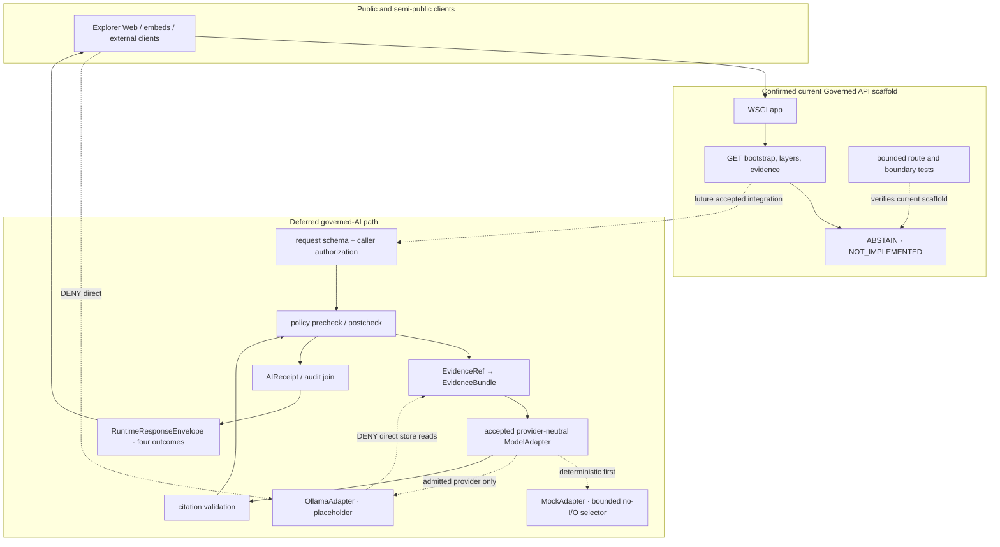

<!-- [KFM_META_BLOCK_V2]
doc_id: kfm://doc/adr/0008-ollama-subordinate-to-governed-api
title: "ADR-0008 — Ollama and Local AI Runtimes Are Subordinate to the Governed API"
type: adr
adr_id: ADR-0008
version: v1.3
status: draft
effective_decision_status: proposed
owners:
  - "OWNER_TBD — runtime / governed-AI stewardship assignment is not verified"
reviewers_required:
  - Architecture steward
  - Governed API steward
  - Runtime / governed-AI steward
  - Policy and security reviewer
  - Evidence / citation reviewer
  - Docs steward
created: 2026-05-10
updated: 2026-08-14
policy_label: public
truth_posture: cite-or-abstain
owning_root: docs/
responsibility: "Records the proposed placement, authority, exposure, validation, receipt, activation, and rollback rules that keep Ollama and other local AI runtimes subordinate to the Governed API."
current_path: docs/adr/ADR-0008-ollama-subordinate-to-governed-api.md
supersedes: []
superseded_by: []
evidence_snapshot:
  repository: bartytime4life/Kansas-Frontier-Matrix
  base_ref: main
  base_commit: eb95930a784252be7a24cba425185ff26294e8bb
  verification_commit: cbf3656da9cb092d6a0f2382fb80ac13e3f217ac
  target_prior_blob: 387b1a1969b2af77b325d2cacd35c19ab13f63f8
  adr_index_blob: 938c5894c36b99e14810918e2c550ab0e92d53b1
  adr_0029_blob: a4de0d7a96b78da59cfc499d1025e1508afd8dd9
  directory_rules_blob: fd49a0b83e55cef52c1124281f093e263526898d
  codeowners_blob: dd2a84aa514d8ecd9208bc347f90f9a2ed37dd61
  adr_0004_blob: f2737900569447e8e20c8ce12b275167724b0cc5
  adr_0019_blob: c0bc41cc11b40b1ee87a838a3e80024a2da56c04
  governed_api_main_blob: bcc8d3a0ddba4b225e962b594d548819df0cbb71
  governed_api_routes_blob: 3418168d0b267160d6ad6dd87f289e880ef4a024
  governed_api_stub_blob: 5d7c137d2e78ddfca35a1356a96333ac2e84952b
  api_workflow_blob: 84ba16a3c36a1d58b2f6f1059a31ed6354063357
  api_verification_run: 31809767303
  runtime_ollama_readme_blob: b0708364fa002760383882f18843e31c6c4209c7
  ollama_adapter_blob: 1769a719d6a6df53e001abbc4c67ad486ab5c944
  mock_adapter_blob: 04d37e59b14c9e3b85126cb3380b6221b44e26d1
  mock_adapter_proof_blob: be1b1d2b4178b30ce9be754671a2c42271ad91bc
  env_example_blob: 5af73215557f4af432157409ff89ab17088d0953
  runtime_response_contract_blob: 97ff95ba5527968f3db70cd710682176444e4cde
  runtime_response_schema_blob: 8b86e7db8b18b65a56a4e639dfc54e1b2db93155
  runtime_response_builder_blob: 5dacededc1bda64292259ba39b6387facafbd1e8
  finite_envelope_proof_blob: 70ca80226bf06c3b28b59096e3812312a00c03b6
  ai_receipt_contract_blob: f4d8183dbed38f83144f6d9dbde30ae02a01edb8
  ai_receipt_schema_blob: 2e0bebdb3a38acbc3c58a919db46970c6e829b4a
  ai_receipt_validator_blob: eb80e77aed15f478c32215c8f773f308a87a092a
  ai_receipt_validator_test_blob: f35514538205fbac359520327e7519b3a851cea8
  policy_runtime_readme_blob: 80b63e7651429903385066b53c7fb41af3cd1298
  policy_abstain_rego_blob: 9c66097140933eba5aa7011653da12488035ad99
  policy_deny_public_rego_blob: 8d46a90088c046c102b991904e56ecf32d8ae7d3
  policy_evidence_required_rego_blob: 297bd7999bf19c4029bf92df6f1c2f07477c787d
  policy_run_receipt_rego_blob: 5fa096c9d65183b0b3333e05434bbf6f2ab9c0b7
  focus_mock_workflow_blob: fbd56c7cda991ff8f3b804cc0c278e62daaa7abf
  focus_mock_verification_run: 31809767441
  policy_verification_run: 31809767223
related:
  - docs/adr/README.md
  - docs/adr/INDEX.md
  - docs/adr/ADR-0004-apps-governed-api-is-the-trust-membrane.md
  - docs/adr/ADR-0019-ai-adapter-contract-and-finite-envelopes.md
  - docs/adr/ADR-0020-abstain-is-a-first-class-decision.md
  - docs/adr/ADR-0025-public-client-never-reads-canonical-internal-stores.md
  - docs/adr/ADR-0029-adopt-directory-governance-standard-v2.md
  - docs/doctrine/directory-rules.md
  - docs/doctrine/trust-membrane.md
  - docs/doctrine/truth-posture.md
  - docs/doctrine/authority-ladder.md
  - docs/doctrine/ai-as-assistant.md
  - docs/architecture/governed-ai/OLLAMA_INTEGRATION.md
  - docs/architecture/governed-ai/MOCK_FIRST.md
  - apps/governed-api/README.md
  - runtime/README.md
  - runtime/ollama/README.md
  - runtime/model_adapters/README.md
  - runtime/model_adapters/AdapterContract.md
  - packages/envelopes/src/envelopes/runtime_response.py
  - contracts/runtime/runtime_response_envelope.md
  - contracts/runtime/ai_receipt.md
  - schemas/contracts/v1/runtime/runtime_response_envelope.schema.json
  - schemas/contracts/v1/runtime/ai_receipt.schema.json
  - policy/runtime/README.md
  - tools/validators/validate_ai_receipt.py
  - tests/runtime_proof/test_mock_adapter_finite_outcomes.py
  - tests/runtime_proof/test_envelope_finite_outcomes.py
  - .github/workflows/api-test.yml
  - .github/workflows/focus-mock-test.yml
tags: [kfm, adr, ollama, local-ai, governed-api, governed-ai, runtime, model-adapter, finite-outcomes, ai-receipt, citation-validation, trust-membrane, no-direct-model-client]
notes:
  - "v1.3 is a same-path, documentation-only, repository-grounded reconciliation; it does not accept the ADR, activate Ollama, approve a provider/model, or change runtime behavior."
  - "ADR-0008 remains source status draft and effective decision status proposed in docs/adr/INDEX.md."
  - "The Governed API verification workflow passed at ancestor commit cbf3656da9cb092d6a0f2382fb80ac13e3f217ac, and no cited ADR/runtime/API/policy/envelope/receipt evidence path changed through the pinned base, but the application remains three deterministic ABSTAIN / NOT_IMPLEMENTED routes with no model route."
  - "MockAdapter.py is now an executable deterministic, no-I/O selector for prevalidated synthetic scenario envelopes, and repository-owned tests cover all four finite outcomes and fail-closed selection errors; it is not a semantic outcome decider, evidence/policy engine, provider runtime, or receipt emitter."
  - "OllamaAdapter.py remains a one-line placeholder. Runtime policy documentation is substantive, but the four Rego files remain proposed, non-enforcing scaffolds."
  - "RuntimeResponseEnvelope builder and proof tests are substantive, but the proposed contract text and proposed schema diverge over precision disclosure; governed route integration remains on HOLD."
  - "The AIReceipt validator proves local schema/consistency behavior only; no model invocation, runtime receipt emission/persistence, evidence resolution, citation validation, provider admission, production isolation, release, or publication is established."
  - "Bounded exact-snapshot searches did not surface a direct public Ollama client or executable KFM_MODEL_RUNTIME loader; repository-wide static, dependency, configuration, generated-asset, and deployment enforcement remains incomplete."
[/KFM_META_BLOCK_V2] -->

<a id="top"></a>

# ADR-0008 — Ollama and Local AI Runtimes Are Subordinate to the Governed API

> **Proposed decision.** Ollama and every other local AI runtime remain replaceable, internal interpretation providers behind KFM's governed API. They may receive only bounded, policy-safe context assembled through governed interfaces; they may never become a public client contract, evidence authority, policy authority, release authority, lifecycle store, or direct path to canonical/internal data.

[](#1-status--authority)
[](#22-current-repository-evidence)
[](#22-current-repository-evidence)
[](#22-current-repository-evidence)
[](#22-current-repository-evidence)
[](#32-public-path-must-not)

> [!IMPORTANT]
> **Repository implementation is not reviewed decision authority.** The repository now contains bounded executable mock/envelope proofs, a local AIReceipt validator, and passing exact-head API/Focus runs at the recorded verification commit in addition to the fail-closed Governed API scaffold. Those surfaces do not accept this ADR, implement or activate Ollama, admit a provider/model, establish an accepted adapter contract, prove policy/evidence/citation closure, persist runtime receipts, or make any AI-assisted response releasable.

> [!CAUTION]
> **Bounded proof is not an AI integration.** The current Governed API still returns `ABSTAIN` / `NOT_IMPLEMENTED`; `OllamaAdapter.py` is still a one-line placeholder; `MockAdapter.py` only selects prevalidated synthetic envelopes; runtime Rego remains non-enforcing; and the mock-Focus workflow still records `WORKFLOW_HOLD`. No route may graduate to `ANSWER` merely because a selector, schema, fixture, validator, shape test, smoke test, or workflow is green.

**Quick navigation:** [Status](#1-status--authority) · [Context](#2-context) · [Decision](#3-decision) · [Architecture](#4-architecture-diagram) · [Surfaces](#5-affected-paths) · [Consequences](#6-consequences) · [Alternatives](#7-alternatives-considered) · [Migration](#8-migration-plan) · [Rollback](#9-rollback-plan) · [Validation](#10-validation-and-enforcement) · [Related](#11-related-adrs-and-docs) · [Open work](#12-open-questions--needs-verification) · [Glossary](#13-glossary) · [No-loss ledger](#appendix-a--no-loss-modernization-ledger)

---

## 1. Status & Authority

### 1.1 Decision and document state

| Field | Current value |
|---|---|
| **ADR ID** | `ADR-0008` — unique and confirmed in the canonical human [`INDEX.md`](./INDEX.md) |
| **Title** | Ollama and Local AI Runtimes Are Subordinate to the Governed API |
| **Source metadata** | `draft` |
| **Effective decision status** | `proposed` — not binding as an accepted ADR until the record and index carry matching reviewed `accepted` status |
| **Created** | 2026-05-10 |
| **Updated** | 2026-08-14 |
| **Tracked path** | `docs/adr/ADR-0008-ollama-subordinate-to-governed-api.md` |
| **Decision class** | Runtime placement, public exposure boundary, provider subordination, finite outcomes, evidence/policy/citation gates, receipts, and reversible deactivation |
| **Primary related decisions** | [`ADR-0004`](./ADR-0004-apps-governed-api-is-the-trust-membrane.md) — public dynamic trust boundary; [`ADR-0019`](./ADR-0019-ai-adapter-contract-and-finite-envelopes.md) — provider-neutral adapter and finite-envelope proposal |
| **Publication effect** | None. This ADR, a schema, fixture, workflow, model download, local daemon, response, commit, pull request, or merge is not KFM publication. |
| **Executable owner route** | `.github/CODEOWNERS` routes `docs/adr/`, `apps/governed-api/`, `runtime/`, `policy/`, `schemas/`, `tests/`, and related roots to `@bartytime4life`; governance role assignments and review completion remain separate and unverified. |

### 1.2 Current implementation posture

| Concern | Status | Safe conclusion |
|---|---|---|
| ADR identity and path | **CONFIRMED** | The exact record is indexed as ADR-0008; source status remains `draft` and effective decision status remains `proposed`. |
| Governing directory doctrine | **ACCEPTED separately** | ADR-0029 accepted Directory Rules v2. That placement authority does not accept ADR-0008 or activate a runtime. |
| Governed API application | **CONFIRMED minimal executable scaffold** | A small WSGI app registers `/bootstrap`, `/layers`, and `/evidence`; every route returns deterministic `ABSTAIN` / `NOT_IMPLEMENTED`. |
| Governed API tests and verification CI | **CONFIRMED bounded pass** | Run `31809767303` passed both API jobs at verification commit `cbf3656da9cb092d6a0f2382fb80ac13e3f217ac`; the cited API surfaces are unchanged at the pinned base. Scope remains route/shape and selected source-boundary checks—not auth, evidence, policy, citation, model use, receipt emission, deployment, release, or publication. |
| Ollama runtime lane | **CONFIRMED documentation lane** | `runtime/ollama/README.md` describes loopback-only, mock-first governed integration; it does not prove a daemon, installed model, adapter, or admitted profile. |
| Ollama adapter | **CONFIRMED placeholder** | `runtime/model_adapters/OllamaAdapter.py` contains one comment and no executable adapter. |
| Mock adapter | **CONFIRMED bounded executable selector** | `MockAdapter.py` deterministically deep-copies prevalidated synthetic scenario envelopes for exactly four outcomes and performs no I/O. It does not interpret requests, choose semantic outcomes, validate evidence/policy/citations, call a model, or emit a receipt. |
| Mock adapter proof | **CONFIRMED substantive tests** | `test_mock_adapter_finite_outcomes.py` covers all four outcomes, deterministic isolation, configuration failure, unknown-scenario failure, and an import-based no-I/O boundary. It is not provider or governed-route integration proof. |
| Default runtime configuration | **CONFIRMED safe example** | `.env.example` selects `KFM_MODEL_RUNTIME=mock` and documents `OLLAMA_HOST=http://127.0.0.1:11434`; no executable runtime loader or activation is established. |
| RuntimeResponseEnvelope implementation | **CONFIRMED bounded candidate builder and shape proof; PROPOSED semantics** | The builder enforces four outcomes and answer-specific evidence/precision constraints; tests prove closed shape and fixture polarity. It does not resolve evidence, evaluate policy, calculate freshness/precision, authorize `ANSWER`, or integrate with the current Governed API routes. |
| RuntimeResponseEnvelope contract alignment | **HOLD — DRIFT** | The proposed schema/builder require answer precision disclosure, while the proposed v0.3 contract text does not document that field. Contract/schema convergence is required before governed integration. |
| AIReceipt | **CONFIRMED proposed contract/schema plus local validator** | The validator checks local schema and bounded consistency, and its tests cover fixture polarity and fail-closed file cases. No runtime emission, persistence, evidence resolution, policy/citation approval, model admission, release, or publication is proven. |
| Runtime policy | **CONFIRMED non-enforcing scaffold** | Documentation is substantive, but the four Rego files contain defaults/comments without accepted enforcing rule bodies, bundle/evaluator binding, or runtime consumers. |
| Mock Focus lane | **CONFIRMED bounded proof plus explicit HOLD** | Run `31809767441` passed at the verification commit; its mock-Focus job records `WORKFLOW_HOLD`, while its finite-envelope job runs the bounded selector/shape tests. No Focus runtime or provider executed. |
| Direct public Ollama client | **Not surfaced in bounded exact-snapshot searches** | This is not proof of repository-wide absence. Current enforcement does not cover every language, dynamic import, endpoint acquisition, generated file, dependency, or deployment configuration. |
| Installed daemon/models/version and deployed isolation | **UNKNOWN** | No current daemon, model inventory/digest, rights review, runtime log, deployment, port exposure, health evidence, or activation record was used. |

### 1.3 Acceptance gates

ADR-0008 SHOULD remain `proposed` until equivalent evidence closes every applicable gate below.

| Gate | Required evidence | Fail-closed result when missing |
|---|---|---|
| **A — Decision coherence** | ADR-0004, ADR-0008, ADR-0019, and the ADR index agree on public boundary, provider-neutral adapter, finite outcomes, and status | Keep all decisions proposed; do not infer acceptance from implementation scaffolds |
| **B — Canonical semantic boundary** | Accepted provider-neutral adapter contract under the proper contract authority, with no competing runtime-note authority | Do not activate a provider |
| **C — Deterministic MockAdapter** | Executable no-I/O adapter behind the accepted semantic contract, complete valid/invalid scenarios, all finite outcomes, and governed-consumer tests | Current selector/shape proof is partial only; Ollama remains disabled/deferred |
| **D — Evidence and policy closure** | EvidenceRef resolution, EvidenceBundle support, enforcing policy precheck/postcheck, rights/sensitivity handling, citation validation, and negative-path tests | Current non-enforcing Rego scaffold does not close the gate; `ABSTAIN`, `DENY`, or `ERROR` |
| **E — Receipt closure** | Schema-valid AIReceipt or accepted equivalent joined to request, policy, evidence/citation, model identity, input/output digests, and outcome without private reasoning | Block answer/release use |
| **F — Provider/model admission** | Reviewed provider profile, model identity/digest, license/terms, capability scope, resource limits, network/tool permissions, and rollback/kill switch | Provider/model remains unadmitted |
| **G — Adapter implementation** | Tested Ollama adapter behind the accepted contract; provider substitution does not change public semantics | Keep `KFM_MODEL_RUNTIME=mock` or disabled |
| **H — Exposure controls** | Loopback/private binding, secret handling, reverse-proxy/firewall review, safe logs, request limits, timeouts, circuit breaking, and incident/restore runbook | DENY activation |
| **I — Repository-wide anti-bypass enforcement** | Static/dependency/config checks across clients, deployables, examples, scripts, generated assets, and infra plus negative tests | Treat no-direct-client posture as incomplete |
| **J — Reviewed transition** | Required reviewers approve; ADR and index move together; acceptance evidence and rollback target are recorded | Remain `proposed` |

---

## 2. Context

### 2.1 Operating problem

KFM is a governed, evidence-first, map-first, time-aware spatial knowledge and publication system. AI-assisted surfaces may interpret released or explicitly review-authorized evidence, but the durable public unit remains the **inspectable claim**: evidence, source role, spatial and temporal scope, rights and sensitivity, policy posture, review state, release state, correction lineage, and rollback posture must remain inspectable.

Local runtimes are attractive because they can support private/local execution, bounded synthesis, structured generation, provider substitution, and deterministic development profiles. They become dangerous when local convenience bypasses the public trust path:

```text
browser / public route
  -> localhost or reverse-proxied model endpoint
  -> fluent output
  -> UI renders output as evidence-shaped authority
```

That path omits or weakens evidence resolution, policy, rights/sensitivity, citation validation, finite outcomes, receipts, release scope, correction state, and rollback. It remains a trust-membrane violation even when the text is useful or technically accurate.

### 2.2 Current repository evidence

The pinned 2026-08-14 base, checked against an ancestor verification snapshot with no changes to cited evidence paths, supports a sharper split between bounded executable proof and missing governed-runtime closure.

| Surface | Verified state at the pinned snapshot | What it proves — and does not prove |
|---|---|---|
| [`INDEX.md`](./INDEX.md) | ADR-0008 is the unique tracked record; effective status `proposed`, source metadata `draft` | Identity and conservative status normalization; not acceptance |
| [`ADR-0029`](./ADR-0029-adopt-directory-governance-standard-v2.md) and [Directory Rules](../doctrine/directory-rules.md) | ADR-0029 is accepted and adopts Directory Rules v2 exactly | Root/placement governance; not runtime/provider approval |
| [`ADR-0004`](./ADR-0004-apps-governed-api-is-the-trust-membrane.md) | Current proposed boundary record documents the three-route WSGI/ABSTAIN scaffold and contract drift | Related boundary snapshot; not accepted authority |
| [`ADR-0019`](./ADR-0019-ai-adapter-contract-and-finite-envelopes.md) | Proposed provider-neutral adapter/finite-envelope decision with a stale placeholder-era repository snapshot | Design relationship only; not current implementation evidence, accepted adapter semantics, or provider authorization |
| [`apps/governed-api/main.py`](../../apps/governed-api/src/governed_api/main.py), [`routes/registry.py`](../../apps/governed-api/src/governed_api/routes/registry.py), and [`stub.py`](../../apps/governed-api/src/governed_api/stub.py) | WSGI dispatch for exactly `/bootstrap`, `/layers`, and `/evidence`; deterministic `ABSTAIN` / `NOT_IMPLEMENTED` objects | Executable fail-closed dispatch; no model/Focus route, auth, evidence resolution, policy, citation, complete RuntimeResponseEnvelope, receipt, or release integration |
| Governed API tests and [`api-test.yml`](../../.github/workflows/api-test.yml) | Route/shape and selected source-boundary tests; verification run `31809767303` passed both jobs | Bounded current scaffold signal; not a complete trust, deployment, or publication proof |
| [`runtime/ollama/README.md`](../../runtime/ollama/README.md) and [`OllamaAdapter.py`](../../runtime/model_adapters/OllamaAdapter.py) | Provider-specific guidance plus a one-line adapter placeholder | Intended placement/admission posture and file presence only |
| [`MockAdapter.py`](../../runtime/model_adapters/MockAdapter.py) | Deterministic no-I/O selector for a complete map of prevalidated synthetic scenario envelopes; closed outcomes `ANSWER`, `ABSTAIN`, `DENY`, `ERROR` | Executable selection/deep-copy behavior; no request interpretation, semantic outcome choice, evidence/policy/citation work, model invocation, or receipt emission |
| [`test_mock_adapter_finite_outcomes.py`](../../tests/runtime_proof/test_mock_adapter_finite_outcomes.py) | Covers all outcomes, isolated copies, incomplete configuration, unknown scenario, and forbidden I/O/dynamic-execution imports | Substantive bounded selector proof; not adapter-contract or governed-consumer integration |
| [`.env.example`](../../.env.example) | Mock selected by default; Ollama host is loopback; public clients are warned away from direct access | Safe example posture; not loader, activation, secret, daemon, or deployment proof |
| [`runtime_response.py`](../../packages/envelopes/src/envelopes/runtime_response.py) and [finite-envelope proof](../../tests/runtime_proof/test_envelope_finite_outcomes.py) | Bounded candidate builder plus standard-library tests for closed outcomes, Focus alias, fixture polarity, and answer-specific evidence/precision constraints | Substantive construction and machine-shape proof; no evidence resolution, policy decision, freshness/precision calculation, `ANSWER` authorization, runtime, or public client |
| [`RuntimeResponseEnvelope` contract](../../contracts/runtime/runtime_response_envelope.md) and [schema](../../schemas/contracts/v1/runtime/runtime_response_envelope.schema.json) | Both remain proposed; schema/builder require answer precision disclosure while the v0.3 contract text does not document it | Explicit contract/schema drift; governed integration remains on HOLD |
| [`AIReceipt` contract](../../contracts/runtime/ai_receipt.md), [schema](../../schemas/contracts/v1/runtime/ai_receipt.schema.json), and [validator](../../tools/validators/validate_ai_receipt.py) | Proposed object family plus deterministic local schema/consistency validation and fail-closed tests | Candidate-file validation only; no runtime receipt emission/persistence or authority creation |
| [`policy/runtime/README.md`](../../policy/runtime/README.md) and four Rego files | Detailed boundary documentation; three files default `deny := false`, one defaults `allow := false`, and operative rule bodies are absent/commented | Proposed non-enforcing scaffold; no accepted evaluator/bundle binding, consumer, or runtime enforcement |
| [`focus-mock-test.yml`](../../.github/workflows/focus-mock-test.yml) | Verification run `31809767441` passed; finite-envelope job runs both substantive proof modules; mock-Focus job records `WORKFLOW_HOLD` | Bounded selector/shape readiness proof; no Focus payload, runtime command, provider, receipt, release, or publication |
| Bounded exact-snapshot searches for `ollama`, `11434`, and `KFM_MODEL_RUNTIME` | No executable public Ollama client or runtime loader surfaced; matches were dominated by docs/config/workflow/test surfaces | Useful bounded negative evidence; not repository-wide static/dependency/configuration/deployment proof |

### 2.3 Relationship to adjacent ADRs

| ADR | Question it answers | What ADR-0008 adds |
|---|---|---|
| **ADR-0004** | Which dynamic app is the normal public trust boundary? | Ollama/local runtimes may be reached only through that boundary and never become a peer public API. |
| **ADR-0008** | How are local providers placed, constrained, exposed, audited, and deactivated? | Provider-specific subordination, no-direct-client/no-direct-store rules, admission gates, security and rollback. |
| **ADR-0019** | What provider-neutral adapter and finite-envelope contract should AI runtimes conform to? | ADR-0008 consumes an accepted contract when available; ADR-0019's stale placeholder-era snapshot must not override current repository evidence or create a competing contract. |
| **ADR-0020** | Why is abstention a first-class decision? | ADR-0008 applies abstention before and after model execution when evidence or policy support is insufficient. |
| **ADR-0025** | Why may public clients not read canonical/internal stores? | ADR-0008 extends that rule to model context assembly and runtime-provider access. |

None of these records becomes accepted merely because another exists, because a file is present, or because a workflow passes.

---

## 3. Decision

KFM treats Ollama and every other local AI runtime as **subordinate** to the governed API. The following rules become normative only when this ADR is accepted; they remain the proposed implementation contract while status is `proposed`.

### 3.1 Placement and ownership (MUST)

- Provider-specific Ollama daemon/client/configuration integration belongs under [`runtime/ollama/`](../../runtime/ollama/).
- Provider-neutral model-adapter interfaces and adapter implementations belong under [`runtime/model_adapters/`](../../runtime/model_adapters/), subject to the accepted semantic contract.
- Deterministic mock runtime behavior belongs in the accepted mock lane; current `runtime/mock/` and `runtime/model_adapters/mock/` documentation must converge without creating two executable authorities.
- Finite-envelope implementation helpers may live under `runtime/envelopes/`, but semantic meaning remains in `contracts/` and machine shape in `schemas/`.
- Non-secret runtime profile templates belong under `runtime/service_configs/` or `configs/` according to current root contracts. Real credentials, private endpoints, tokens, and model-store secrets do not belong in Git.
- New local or hosted providers MUST conform to the provider-neutral adapter contract before any governed route may call them.
- The current `runtime/AI/` lane is a compatibility/navigation surface unless a separate accepted decision grants it implementation authority; it must not become a second adapter or contract home.

### 3.2 Public path (MUST NOT)

- Public and semi-public browsers, embeds, CLIs, review surfaces, map surfaces, and third-party clients MUST NOT contact Ollama or any other model provider directly.
- [`apps/explorer-web/`](../../apps/explorer-web/), [`packages/ui/`](../../packages/ui/), [`packages/maplibre/`](../../packages/maplibre/), examples, and compatibility roots such as `web/` and `ui/` MUST NOT contain a normal-path direct model client, model credential, provider SDK binding, or model endpoint URL.
- A future peer renderer or client surface, if separately accepted, inherits the same rule; renderer choice does not create a second AI trust path.
- Focus Mode and every other AI-assisted public feature MUST call the governed API and receive a KFM-native finite response envelope.
- OpenAI-compatible, Ollama-compatible, or provider-native wire formats MAY exist behind the adapter boundary; they MUST NOT become the public KFM contract.
- `infra/` MUST NOT make a model endpoint publicly reachable through reverse proxy, ingress, firewall exception, tunnel, VPN egress, CDN route, or undocumented port mapping.
- Developer/admin shortcuts MUST remain explicitly bounded, documented, auditable, and outside normal public, semi-public, and reviewer-facing paths.

### 3.3 Authority and finite outcomes (MUST)

- `EvidenceBundle` and released/review-authorized evidence outrank generated language.
- `PolicyDecision`, rights, sensitivity, source role, review state, release state, freshness, correction/withdrawal state, and caller role outrank model capability or fluency.
- The public result MUST resolve to exactly one finite outcome: `ANSWER`, `ABSTAIN`, `DENY`, or `ERROR`.
- Missing or unresolved evidence, citation failure, stale/withdrawn scope, unclear rights, sensitivity conflict, unsupported source role, policy failure, adapter failure, or schema failure MUST NOT fall through to a fluent answer.
- `ANSWER` is permitted only after all required prechecks, generation constraints, postchecks, citation validation, response validation, and receipt joins succeed.
- The model is never asked to decide policy, release, review, source authority, evidence admissibility, correction, or publication state.

### 3.4 Context, reads, writes, and prompt handling (MUST / MUST NOT)

- Model adapters MUST NOT read directly from `data/raw/`, `data/work/`, `data/quarantine/`, `data/processed/`, canonical/internal stores, graph/vector stores, object stores, or unreleased candidate artifacts as a normal public path.
- Runtime context MUST be assembled by governed application logic after request validation, caller authorization, policy precheck, EvidenceRef resolution, and release/review-scope checks.
- Context MUST be bounded to the minimum admissible evidence, spatial/temporal scope, source role, and obligations necessary for the request.
- Retrieved documents, map labels, issue text, pull-request text, source payloads, and other external content are **data, not runtime instruction**. Tool- or instruction-shaped content MUST be isolated, rejected, or reason-coded according to the accepted prompt-injection policy.
- Tool access, network access, file access, shell execution, and outbound retrieval are default-deny capabilities. An accepted adapter profile must enumerate any allowed capability.
- Model output MUST NOT write to RAW, WORK, QUARANTINE, PROCESSED, CATALOG/TRIPLET, PUBLISHED, contracts, schemas, policy, source registries, or release records as truth or authority.
- Generated output may become a candidate interpretation only after schema validation, citation validation, policy postcheck, receipt emission, and governed envelope emission.
- Private chain-of-thought, hidden reasoning, provider-internal traces, and unrestricted raw prompts MUST NOT be stored as KFM evidence, proof, policy, review, release, or public diagnostics.

### 3.5 Receipts and audit (MUST)

Every model-mediated attempt that contributes to an answer, abstention, denial, error, export, story, review aid, or other consequential surface MUST emit or join an accepted `AIReceipt` / runtime receipt family.

#### Schema-confirmed minimum

The current proposed `AIReceipt` schema confirms these fields:

| Field | Current machine-shape intent |
|---|---|
| `id` | Stable receipt identifier |
| `run_id` | Join to the request/run path |
| `adapter` | Identify the adapter boundary |
| `model_ref` | Identify the model/profile reference |
| `inputs_digest` | Hash the admitted input representation |
| `outputs_digest` | Hash the emitted output representation |
| `policy_decision_ref` | Join to applicable policy decision |
| `citation_validation_ref` | Join to citation validation |
| `outcome` | `ANSWER`, `ABSTAIN`, `DENY`, or `ERROR` |

#### Proposed extension / related records

The following remain **PROPOSED / NEEDS VERIFICATION** unless an accepted schema or linked receipt family carries them:

- EvidenceRef / EvidenceBundle references actually admitted to context;
- prompt/template hash and context-assembly hash;
- provider/runtime version, model digest, quantization/profile, generation parameters, resource budget, and tool/network permissions;
- precheck and postcheck policy references when more than one decision applies;
- request/audit correlation, timing, retry/circuit-breaker outcome, and safe failure category;
- release, freshness, correction, withdrawal, or rollback references where the answer depends on released state.

Receipts MUST be sufficient to reconstruct the governed path without retaining private reasoning or restricted source content. A receipt is process memory; it is not evidence closure, policy approval, review approval, release approval, or publication authority by itself.

### 3.6 Admin and developer access (MAY, with constraints)

Maintainers MAY contact a local runtime directly for installation, model pull, benchmarking, health inspection, adapter debugging, or incident response only when all applicable conditions hold:

- binding is loopback, host-local, or specifically approved private access;
- the action is outside normal public/semi-public/reviewer traffic;
- credentials, prompts, source payloads, and model caches are handled under security and retention rules;
- the action does not read canonical/internal or restricted lifecycle stores directly;
- any benchmark/profile that influences an admitted configuration is reproducible and reviewable;
- a kill switch restores `mock` or disabled mode without changing the public contract;
- the operational path and incident/restore steps are documented in an accepted runbook.

### 3.7 Provider, model, and version posture

This ADR does not choose or approve:

- an Ollama version;
- a model family, variant, quantization, context window, embedding model, or tokenizer;
- a model license, redistribution posture, usage restriction, or data-processing agreement;
- hardware requirements, performance targets, or service-level promises;
- tool-calling, web access, filesystem access, code execution, image/audio handling, or multimodal access;
- streaming behavior or partial-response semantics.

Those are admission/profile decisions. They require current authoritative verification, explicit scope, policy/security review, test evidence, rollback, and compatibility treatment before activation.

### 3.8 Schema and contract authority

Current repository evidence supports this split:

| Object / concern | Current authority surface | Current status |
|---|---|---|
| `RuntimeResponseEnvelope` meaning | [`contracts/runtime/runtime_response_envelope.md`](../../contracts/runtime/runtime_response_envelope.md) | v0.3 draft / PROPOSED; does not currently document schema-required answer precision disclosure |
| `RuntimeResponseEnvelope` shape | [`schemas/contracts/v1/runtime/runtime_response_envelope.schema.json`](../../schemas/contracts/v1/runtime/runtime_response_envelope.schema.json) | PROPOSED; closed four outcomes; `ANSWER` requires evidence and precision; non-`ANSWER` forbids precision |
| `RuntimeResponseEnvelope` candidate construction | [`packages/envelopes/src/envelopes/runtime_response.py`](../../packages/envelopes/src/envelopes/runtime_response.py) | Bounded executable builder; validates shape only and explicitly creates no evidence/policy/release authority |
| `DecisionEnvelope` meaning/shape | `contracts/runtime/decision_envelope.md` + paired runtime schema | Draft / PROPOSED; used as current Governed API scaffold subset |
| `AIReceipt` meaning/shape | [`contracts/runtime/ai_receipt.md`](../../contracts/runtime/ai_receipt.md) + paired runtime schema | Draft / PROPOSED |
| `AIReceipt` local validation | [`tools/validators/validate_ai_receipt.py`](../../tools/validators/validate_ai_receipt.py) | Executable schema/consistency validator; no evidence resolution, policy/citation approval, runtime emission, release, or publication authority |
| `FocusRequest` / `FocusResponse` | `contracts/ui/` plus `schemas/contracts/v1/focus/` | Contracts exist; verification workflow confirms open PROPOSED schemas and `WORKFLOW_HOLD` |
| Provider-neutral adapter note | [`runtime/model_adapters/AdapterContract.md`](../../runtime/model_adapters/AdapterContract.md) | Descriptive, non-canonical, and partially stale |
| Canonical adapter semantic contract | Accepted `contracts/runtime/` surface | **NOT ESTABLISHED** |
| Runtime admissibility | [`policy/runtime/`](../../policy/runtime/) | Detailed documentation plus proposed non-enforcing Rego scaffolds; accepted evaluator/bundle/runtime binding **NOT ESTABLISHED** |

> [!IMPORTANT]
> **Contract/schema drift is a HOLD, not an implementation choice.** The proposed RuntimeResponseEnvelope schema and builder require answer precision disclosure, while the proposed v0.3 contract text does not document it. The semantic contract and machine shape must converge through reviewed contract/schema work before a governed route, MockAdapter consumer, or OllamaAdapter may rely on that field.

This ADR defines the dependency and authority boundary. It MUST NOT duplicate full object fields, create a second adapter contract under `runtime/`, or treat a descriptive README/note as accepted semantic authority. When a machine shape, contract, implementation, or policy conflicts, record the conflict and resolve it through the appropriate contract/schema/policy/ADR process before adding a parallel definition.

> [!WARNING]
> Any change that adds a direct public client or public route to a local/provider model endpoint, enables a model to read canonical/internal lifecycle stores directly, or returns unvalidated raw model output MUST be rejected while this ADR is proposed and remains an explicit violation if this ADR is accepted.

---

## 4. Architecture Diagram

The diagram separates **confirmed current scaffolding** from **deferred governed-AI behavior**. It is not a deployment claim.


```mermaid
flowchart TB
  subgraph CLIENTS["Public and semi-public clients"]
    WEB["Explorer Web / embeds / external clients"]
  end

  subgraph CURRENT["Confirmed current Governed API scaffold"]
    WSGI["WSGI app"]
    ROUTES["GET bootstrap, layers, evidence"]
    STUB["ABSTAIN · NOT_IMPLEMENTED"]
    API_TEST["bounded route and boundary tests"]
  end

  subgraph PROPOSED["Deferred governed-AI path"]
    AUTH["request schema + caller authorization"]
    POLICY["policy precheck / postcheck"]
    EVIDENCE["EvidenceRef → EvidenceBundle"]
    ADAPTER["accepted provider-neutral ModelAdapter"]
    MOCK["MockAdapter · bounded no-I/O selector"]
    OLLAMA["OllamaAdapter · placeholder"]
    CITE["citation validation"]
    RECEIPT["AIReceipt / audit join"]
    RESPONSE["RuntimeResponseEnvelope · four outcomes"]
  end

  WEB --> WSGI --> ROUTES --> STUB
  API_TEST -. verifies current scaffold .-> STUB

  ROUTES -. future accepted integration .-> AUTH
  AUTH --> POLICY --> EVIDENCE --> ADAPTER
  ADAPTER -. deterministic first .-> MOCK
  ADAPTER -. admitted provider only .-> OLLAMA
  ADAPTER --> CITE --> POLICY --> RECEIPT --> RESPONSE
  RESPONSE --> WEB

  WEB -. "DENY direct" .-> OLLAMA
  OLLAMA -. "DENY direct store reads" .-> EVIDENCE
```

The dotted `future accepted integration` edge is intentionally not implemented by the current three-route scaffold. The current MockAdapter proves deterministic synthetic envelope selection only; its position in the deferred path does not mean that a governed consumer, semantic adapter contract, evidence/policy/citation flow, or receipt join exists. The direct client-to-provider and provider-to-store paths remain denied.

---

## 5. Affected Paths

Directory Rules basis: `docs/` records the decision; `apps/` owns deployable trust-boundary behavior; `runtime/` owns internal adapters/harnesses; `contracts/` owns meaning; `schemas/` owns machine shape; `policy/` owns admissibility; `tests/` and `fixtures/` prove behavior; `infra/` owns exposure; `data/receipts/` stores accepted receipt instances; `release/` owns release/correction/rollback decisions.

| Path or family | Role under ADR-0008 | Current evidence status |
|---|---|---|
| `docs/adr/ADR-0008-ollama-subordinate-to-governed-api.md` | Decision record | **CONFIRMED exact path; proposed decision** |
| `apps/governed-api/` | Sole normal dynamic public path for model-mediated behavior | **CONFIRMED minimal WSGI/ABSTAIN scaffold; no model route** |
| `apps/explorer-web/` | Public map/UI consumer | **CONFIRMED root; direct-model inventory remains bounded** |
| `runtime/ollama/` | Provider-specific Ollama operational lane | **CONFIRMED README; live implementation UNKNOWN** |
| `runtime/model_adapters/` | Provider-neutral adapter lane | **CONFIRMED documentation lane plus bounded MockAdapter selector; canonical semantic contract and governed consumer remain absent** |
| `runtime/model_adapters/OllamaAdapter.py` | Future Ollama adapter implementation | **CONFIRMED one-line placeholder** |
| `runtime/model_adapters/MockAdapter.py` | Deterministic pre-provider proof surface | **CONFIRMED bounded no-I/O scenario selector; not semantic outcome logic or runtime integration** |
| `runtime/mock/` and `runtime/model_adapters/mock/` | Mock runtime / adapter child lanes | **CONFIRMED documentation lanes; ownership convergence with the executable selector remains required** |
| `runtime/envelopes/` and `packages/envelopes/` | Envelope implementation lanes | **Runtime lane remains descriptive; package candidate builder and finite-shape tests are substantive but non-authoritative** |
| `runtime/service_configs/` and `configs/` | Non-secret runtime/profile configuration | **CONFIRMED/documented surfaces; accepted model profile UNKNOWN** |
| `.env.example` | Safe developer template | **CONFIRMED mock default and loopback host; not activation proof** |
| `contracts/runtime/` | Semantic runtime object meaning | **CONFIRMED multiple draft/PROPOSED contracts** |
| `schemas/contracts/v1/runtime/` | Runtime machine shapes | **CONFIRMED proposed schemas and fixture/validator surfaces; RuntimeResponseEnvelope precision drift remains a HOLD** |
| `contracts/ui/focus_request.md`, `contracts/ui/focus_response.md` | Focus request/response meaning | **CONFIRMED; machine schemas remain open scaffolds** |
| `schemas/contracts/v1/focus/` | Focus machine shapes | **CONFIRMED open PROPOSED scaffolds in current readiness checks** |
| `policy/runtime/` | Runtime allow/deny/restrict/abstain policy | **CONFIRMED detailed documentation plus non-enforcing Rego scaffolds; no accepted evaluator/bundle/runtime binding** |
| `policy/focus/` | Focus-specific policy stubs | **CONFIRMED scaffolds in readiness workflow; no accepted rules established** |
| `fixtures/contracts/v1/runtime/` | Schema fixtures | **CONFIRMED valid/invalid RuntimeResponseEnvelope and AIReceipt fixture families; shape/local-consistency proof only** |
| `apps/governed-api/tests/` | App-local route/boundary tests | **CONFIRMED bounded executable tests** |
| `tests/runtime_proof/` | Runtime finite-outcome proof lane | **CONFIRMED substantive MockAdapter selector and RuntimeResponseEnvelope shape tests; no live runtime or governed consumer** |
| `tools/validators/validate_runtime_response_envelope.py` | Reusable schema fixture validator | **CONFIRMED wrapper implementation** |
| `.github/workflows/api-test.yml` | API smoke/envelope CI | **CONFIRMED verification run `31809767303` passed; cited API surfaces are unchanged at the pinned base; bounded scaffold signal only** |
| `.github/workflows/focus-mock-test.yml` | Mock/Focus readiness and finite-shape proof | **CONFIRMED verification run `31809767441` passed; cited Focus/mock surfaces are unchanged at the pinned base; mock-Focus remains explicit HOLD and no model invoked** |
| `infra/reverse_proxy/`, `infra/firewall/`, `infra/vpn/`, `infra/hardening/` | Exposure and isolation controls | **Documentation/path presence varies; operational config and deployed effect NEED VERIFICATION** |
| `data/receipts/ai/` or accepted receipt lane | AIReceipt instances | **PROPOSED / NEEDS VERIFICATION; no persisted model receipt established** |
| `data/proofs/citation_validation/` or accepted proof lane | Citation validation reports | **PROPOSED / NEEDS VERIFICATION** |
| `docs/architecture/governed-ai/OLLAMA_INTEGRATION.md` | Companion implementation architecture | **CONFIRMED but stale repo-evidence boundary and placeholder path claims need later reconciliation** |
| `docs/runbooks/` and `docs/security/` | Activation, benchmark, incident, restore, kill-switch guidance | **Relevant roots confirmed; accepted Ollama-specific runbook NEEDS VERIFICATION** |

No new path is created by this ADR update. A future implementation change must re-run Directory Rules preflight against the then-current tree and accepted ADR set.

---

## 6. Consequences

### 6.1 Positive

- **The trust membrane remains explicit.** Generated language cannot become a peer public truth path.
- **Provider choice stays internal.** Mock, Ollama, hosted, or future adapters may change without changing public KFM semantics.
- **Fail-closed delivery is testable.** `ABSTAIN`, `DENY`, and `ERROR` remain first-class instead of being hidden in free text.
- **No-I/O proof has a bounded foundation.** The deterministic selector and envelope tests now exercise finite synthetic outcomes without live model, file, tool, or network access; governed consumer, policy/evidence/citation, and receipt behavior remains future work.
- **Security review has a crisp boundary.** Public endpoint exposure, direct store access, unbounded tools/network, and raw output are reviewable violations.
- **Audit and correction improve.** Digests, adapter/model identity, policy/citation references, and finite outcomes provide a reconstructable path without storing private reasoning.
- **Model and provider rollback can be additive.** Disable or replace the provider behind the adapter while retaining the public envelope contract.

### 6.2 Negative / accepted costs

- **Indirection and latency.** Requests must transit validation, evidence resolution, policy, citation checks, receipts, and envelope assembly.
- **Streaming complexity.** Partial tokens cannot bypass finite-outcome semantics; buffering or provisional-event contracts may be required.
- **Implementation burden.** Adapter contracts, deterministic mocks, provider profiles, policy bundles, citation validators, receipts, observability, and security controls require real maintenance.
- **Operator friction.** Direct experiments must stay local/private, documented, and outside public paths.
- **Schema evolution burden.** AIReceipt, Focus, DecisionEnvelope, and RuntimeResponseEnvelope surfaces must evolve without parallel authority or silent client drift.
- **More explicit abstention.** The system will sometimes decline answers a raw model could plausibly generate. That is an intentional trust feature.

### 6.3 Risk register

| Risk | Severity | Mitigation / required evidence |
|---|---:|---|
| Direct browser or public-route model access | Critical | Repository-wide dependency/config tests; network exposure review; incident plan |
| Model reads canonical/internal or restricted stores | Critical | Governed context assembler; capability sandbox; negative tests; least privilege |
| Generated language treated as evidence | High | EvidenceBundle resolution, citation validation, finite envelopes, UI trust cues |
| Prompt injection from retrieved content | High | Untrusted-content isolation, fixed system contract, tool default-deny, negative fixtures |
| Unadmitted model or license/terms drift | High | Model profile registry, digest/version/rights review, activation decision |
| Receipt contains sensitive prompts or private reasoning | High | Digest/reference-only posture; retention/redaction review; safe diagnostics |
| Policy/citation service failure falls open | High | `ERROR`/`ABSTAIN`/`DENY`; circuit breaker; fail-closed integration tests |
| Runtime policy remains non-enforcing while provider activates | Critical | Provider activation denied until accepted rules, evaluator/bundle binding, consumer integration, and negative tests pass |
| Current boundary test misses dynamic/config acquisition | Medium | AST/dependency/config/infra scans plus representative negative fixtures |
| Multiple mock/runtime lanes diverge | Medium | One accepted implementation owner; compatibility/migration note |
| Provider swap changes public semantics | High | Contract tests against all admitted adapters and fixed RuntimeResponseEnvelope behavior |
| Stale/corrected/withdrawn evidence enters context | High | Release/freshness/correction checks before generation and in response envelope |

---

## 7. Alternatives Considered

| # | Alternative | Disposition |
|---|---|---|
| A1 | **Direct browser → Ollama over loopback, LAN, tunnel, or reverse proxy.** | **Rejected.** Bypasses governed evidence, policy, citation, receipt, release, and correction controls. |
| A2 | **Embed Ollama-specific calls directly in `apps/governed-api/` without a provider-neutral adapter.** | **Rejected.** Couples public trust behavior to one provider and weakens deterministic substitution/testing. |
| A3 | **Treat Ollama as a connector/source.** | **Rejected.** A model runtime interprets; it is not source authority and must not admit its own output as evidence. |
| A4 | **Treat Ollama as an ordinary background worker.** | **Rejected for request-time behavior.** Workers may prepare candidates/receipts but cannot replace finite request/response mediation. |
| A5 | **Keep a raw provider client behind a staging feature flag.** | **Rejected as a normal path.** Feature flags drift and are not policy, isolation, or review. A bounded developer tool requires explicit admin constraints. |
| A6 | **Keep the rule only in Directory Rules and architecture notes.** | **Rejected.** Runtime, API, client, policy, security, and review changes need an addressable decision record. |
| A7 | **Expose an OpenAI-compatible or Ollama-compatible API as KFM's public contract.** | **Rejected.** Provider compatibility is internal; KFM's public contract must remain evidence/policy/release aware. |
| A8 | **Treat the current three ABSTAIN routes as a completed governed-AI integration.** | **Rejected.** The current scaffold proves fail-closed routing only; it has no model route, adapter, evidence resolver, accepted policy, citation validator, AIReceipt emission, or production isolation. |
| A9 | **Implement Ollama first, then retrofit MockAdapter and policy later.** | **Rejected.** Provider-first sequencing creates operational pressure to accept ungoverned behavior and makes negative paths nondeterministic. |
| A10 | **Forbid all direct maintainer access to Ollama.** | **Rejected as unnecessarily rigid.** Bounded loopback/private admin access is useful when documented, separated, and non-authoritative. |

---

## 8. Migration Plan

This ADR codifies an existing trust invariant. Migration is an inspection, convergence, implementation, and admission program—not a lifecycle-data move.

### 8.1 Smallest sound sequence

1. **Record the pinned inventory.** Preserve the current target blob and repository evidence snapshot; keep ADR status `proposed`.
2. **Reconcile adjacent ADRs and docs.** Align ADR-0004, ADR-0008, ADR-0019, governed-AI architecture docs, runtime READMEs, and the ADR index without promoting any decision by documentation alone. Treat ADR-0019's placeholder-era snapshot as stale implementation evidence.
3. **Accept or define the provider-neutral semantic contract.** Move canonical adapter meaning to the proper `contracts/runtime/` surface; keep runtime notes and current selector implementation subordinate.
4. **Resolve response-contract drift and Focus shapes.** Reconcile RuntimeResponseEnvelope precision semantics across contract, schema, fixtures, builder, and consumers. Graduate open Focus schemas only through reviewed contract/schema/fixture work; do not duplicate the runtime envelope.
5. **Integrate the bounded MockAdapter proof.** Preserve its deterministic no-I/O selection and four-outcome tests, then connect it only behind the accepted semantic contract with governed-consumer and invalid-input tests. Do not let the selector decide policy, evidence, citations, release, or publication.
6. **Implement governed context assembly.** Validate request/caller; resolve EvidenceRef to EvidenceBundle; enforce release/review/freshness/correction and rights/sensitivity; bound context.
7. **Implement enforcing policy and citation gates.** Replace the current non-enforcing runtime/Focus Rego scaffolds with accepted rules, evaluator/bundle binding, consumers, and negative tests; fail closed on unavailable dependencies.
8. **Close receipt behavior.** Emit schema-valid AIReceipt or accepted equivalent for all finite outcomes; store only safe references/digests; join it to the request and applicable decisions; test correction/retention behavior. The current local validator is necessary but insufficient.
9. **Add repository-wide anti-bypass enforcement.** Inspect imports, dynamic acquisition, URLs, config, browser bundles, dependencies, examples, scripts, generated assets, and infra—not just Governed API Python imports.
10. **Admit a provider/model profile.** Verify current provider/model/version, digest, license/terms, capability scope, resource limits, tools/network, security posture, and rollback.
11. **Implement OllamaAdapter behind the same contract.** Contract tests must pass unchanged when switching from MockAdapter; no public/provider wire format may leak.
12. **Wire one bounded governed route.** Add the smallest evidence-backed route only after all earlier gates pass; preserve finite outcomes and no direct client/provider coupling.
13. **Harden operations.** Loopback/private binding, secrets, logs, timeouts, request limits, circuit breaker, health/readiness, kill switch, incident and restore drills.
14. **Prove correction and rollback.** Disable Ollama or revert model profile without changing public contracts; invalidate unsafe cached outputs; preserve receipt/correction lineage.
15. **Review ADR acceptance separately.** Implementation evidence may support acceptance, but it cannot self-accept the decision.

### 8.2 Compatibility rules

- Keep `KFM_MODEL_RUNTIME=mock` or disabled as the safe default until provider activation is reviewed.
- Do not introduce a public-provider-specific DTO during migration.
- Do not move machine schemas into runtime directories or implementation code into contracts.
- Do not create a second adapter implementation home under `runtime/adapters/`, `runtime/AI/`, `packages/`, or `apps/` without an accepted migration/ADR.
- Preserve existing ABSTAIN-only routes until their replacements meet stricter gates; do not convert them to `ANSWER` incrementally without evidence/policy/citation closure.
- Treat generated example output as synthetic fixture material, never evidence or release content.

### 8.3 Non-goals of migration

This ADR does not move or alter RAW, WORK, QUARANTINE, PROCESSED, CATALOG/TRIPLET, PUBLISHED, receipt, proof, or release objects. It does not install Ollama, download a model, expose a port, create secrets, change infra, or activate an AI feature.

---

## 9. Rollback Plan

### 9.1 Document rollback

This documentation revision is reversible by restoring prior target blob:

```text
387b1a1969b2af77b325d2cacd35c19ab13f63f8
```

A future committed update can also be reverted through the normal commit/PR path. Restoring the prior Markdown does not alter runtime behavior.

### 9.2 Runtime/provider rollback

Any future provider activation MUST support these steps without changing the public KFM contract:

1. Set the accepted runtime profile to `mock` or `disabled`.
2. Stop/disable the local provider service and revoke its network path.
3. Remove the provider/model from the active allowlist while retaining historical admission and receipt records.
4. Return safe `ABSTAIN` or `ERROR` outcomes for affected requests.
5. Invalidate unsafe or version-bound caches and outputs.
6. Publish or record correction/withdrawal/rollback lineage when model-assisted public material was affected.
7. Verify that clients still use governed envelopes and cannot reach the provider directly.
8. Preserve prior receipts and audit references according to retention/sensitivity policy.

### 9.3 Decision rollback or supersession

A change that makes a local/provider model endpoint a normal public path, allows direct canonical-store reads, removes finite outcomes, or lets model output decide truth/policy/release requires a superseding accepted ADR and explicit amendments to higher-order doctrine where applicable.

If superseded:

- retain this file with `status: superseded`;
- add `superseded_by` and a forward link;
- update the canonical ADR index in the same reviewed transition;
- update all dependent docs, tests, policy, clients, runbooks, and drift/deprecation registers;
- include migration and rollback evidence.

> [!CAUTION]
> Directly exposing Ollama or enabling a model to read internal stores without the accepted transition is not rollback. It is a security and governance incident.

---

## 10. Validation and Enforcement

### 10.1 Current confirmed validation surfaces

| Surface | Confirmed source / supporting verification behavior | Boundary |
|---|---|---|
| Governed API tests and `api-test.yml` | `make governed-api-smoke` plus the focused ABSTAIN route test; verification run `31809767303` passed both jobs | Current three-route scaffold and selected source-boundary signal only; no model, evidence, policy, citation, receipt, deployment, release, or publication proof |
| `test_mock_adapter_finite_outcomes.py` | Standard-library tests cover four synthetic outcomes, isolated copies, incomplete configuration, unknown scenario, and forbidden I/O/dynamic-execution imports | Bounded selector proof; no semantic decision, provider, governed route, or accepted contract |
| `test_envelope_finite_outcomes.py` | Standard-library tests cover closed outcomes, Focus alias, fixture polarity, invalid fixtures, answer precision/evidence constraints, and validator wiring | Machine-shape proof; no evidence resolution, policy evaluation, precision calculation, or `ANSWER` authorization |
| RuntimeResponseEnvelope schema validator family | Validates the proposed schema and fixture family | Shape proof only; contract text still drifts from schema-required precision disclosure |
| `validate_ai_receipt.py` and validator tests | Local schema/consistency checks, fixture polarity, blank/ref/digest/file failure cases | Candidate-file validation only; no evidence/policy/citation resolution, model approval, runtime emission/persistence, release, or publication |
| `focus-mock-test.yml` | Verification run `31809767441` passed both jobs; runs the two substantive proof modules and records `WORKFLOW_HOLD` for mock Focus | Readiness/shape signal; no Focus runtime payload/command, provider, or public client |
| Runtime Rego files and policy workflow | Proposed defaults/comments remain non-enforcing; verification run `31809767223` succeeded as a syntax/scaffold signal only | No accepted policy semantics, evaluator/bundle binding, consumer, or runtime enforcement |
| Bounded code searches | No executable public Ollama client or `KFM_MODEL_RUNTIME` loader surfaced at the pinned base | Bounded negative evidence only; no repository-wide or deployed anti-bypass proof |

### 10.2 Required test matrix before provider activation

| Test family | Required proof | Expected fail-closed behavior |
|---|---|---|
| Adapter contract conformance | Mock and Ollama adapters pass the same request/response contract tests | Provider remains disabled |
| All finite outcomes | Valid `ANSWER`, `ABSTAIN`, `DENY`, and `ERROR` cases with reason codes and obligations | Test failure; no free-form fallback |
| Evidence-before-model | Unresolved/missing/stale/withdrawn/unsupported evidence blocks generation where required | `ABSTAIN`, `DENY`, or `ERROR` |
| Policy precheck/postcheck | Rights, sensitivity, role, release, tools/network, and output obligations enforced | `DENY` or `ABSTAIN` |
| Citation validation | Unsupported consequential claims fail; support refs resolve and match scope | `ABSTAIN` or `ERROR` |
| Receipt validation | Every outcome emits/joins a schema-valid receipt with safe digests/refs | Release/use block |
| No-direct-public-client | UI, bundles, embeds, examples, CLIs, configs, and generated assets cannot acquire provider endpoint directly | Build/test failure |
| No-direct-internal-store | Adapter cannot import/read lifecycle/canonical/internal stores or receive unrestricted path handles | Test/release failure |
| Prompt-injection negative paths | Retrieved instruction-shaped content cannot alter system/tool/policy boundaries | `DENY`, `ABSTAIN`, or safe isolation |
| Network/tool default deny | Unapproved egress, filesystem, shell, browser, or tool access fails | `DENY` / adapter failure |
| Infra exposure | Model port is not public; loopback/private restrictions and secret boundaries verified | Activation/release block |
| Timeout/retry/circuit breaker | Provider hangs/fails without unbounded retry or unsafe fallthrough | `ERROR` with safe audit ref |
| Model/version drift | Unknown model digest/version/profile fails admission | Provider disabled / `ERROR` |
| Correction/withdrawal | Corrected or withdrawn evidence cannot produce stale `ANSWER`; affected output is invalidated | `ABSTAIN`/`DENY`, correction path |
| Kill-switch/restore | Switching to mock/disabled preserves public envelope compatibility | Activation blocked until drill passes |
| Logging/privacy | Logs/receipts omit secrets, raw restricted context, and chain-of-thought | Test/security failure |

### 10.3 Review checklist

Any PR touching model adapters, Ollama/local runtime, Focus Mode, governed-AI routes, AI receipts, citation validation, runtime policy, or exposure controls SHOULD answer:

- [ ] Is the public call still mediated by `apps/governed-api/`?
- [ ] Does the change avoid direct provider SDK/endpoint acquisition in clients?
- [ ] Is the provider-neutral semantic contract accepted and referenced rather than redefined locally?
- [ ] Does MockAdapter remain the deterministic first proof path?
- [ ] Are model inputs bounded, evidence-resolved, policy-safe, and release/review scoped?
- [ ] Are retrieved sources treated as untrusted data rather than instruction?
- [ ] Are tools, filesystem, shell, and network capabilities explicitly denied or admitted?
- [ ] Do all finite outcomes have representative positive and negative tests?
- [ ] Does `ANSWER` require citation/support closure?
- [ ] Is AIReceipt or the accepted receipt family emitted without private reasoning or unsafe payloads?
- [ ] Are provider/model version, digest, rights, resource, and security profiles reviewed?
- [ ] Is the model endpoint loopback/private and absent from public ingress/client config?
- [ ] Is there a mock/disabled kill switch and tested rollback/correction path?
- [ ] Does the change avoid creating parallel contract/schema/policy/runtime authority?
- [ ] Are docs updated without claiming acceptance, deployment, release, or publication?

### 10.4 Suggested scoped validation commands

These commands are current repository entry points or direct tests; execution must occur in a repository checkout with its test dependencies installed.

```bash
python tools/validators/validate_adr_index.py
python -m pytest tests/validators/test_validate_adr_index.py -q --strict-config --strict-markers
make governed-api-smoke
make governed-api-verify
make boundary-guards
python -m pytest apps/governed-api/tests/test_abstain_routes.py -q --strict-config --strict-markers
python -m unittest tests.runtime_proof.test_mock_adapter_finite_outcomes --verbose
python -m unittest tests.runtime_proof.test_envelope_finite_outcomes --verbose
python tools/validators/validate_ai_receipt.py --fixtures
```

Supporting workflow results cited in this ADR are exact-head evidence from verification commit `cbf3656da9cb092d6a0f2382fb80ac13e3f217ac`. A repository compare through pinned base `eb95930a784252be7a24cba425185ff26294e8bb` changed no cited ADR/runtime/API/policy/envelope/receipt evidence path. These results do not predict a future revision's checks or confer decision, runtime, release, or publication authority.

---

## 11. Related ADRs and Docs

| Reference | Why it matters | Current status note |
|---|---|---|
| [`INDEX.md`](./INDEX.md) | Canonical human inventory and effective-status normalization | ADR-0008 confirmed; source draft, effective proposed |
| [`ADR-0029`](./ADR-0029-adopt-directory-governance-standard-v2.md) | Accepts Directory Rules v2 exactly | Accepted; placement authority only |
| [`ADR-0004`](./ADR-0004-apps-governed-api-is-the-trust-membrane.md) | Defines the proposed dynamic public trust boundary and current ABSTAIN scaffold | Draft / proposed; current repository-grounded snapshot |
| [`ADR-0019`](./ADR-0019-ai-adapter-contract-and-finite-envelopes.md) | Defines the proposed provider-neutral adapter and finite outcomes | Draft / proposed; implementation snapshot is stale and must not override current evidence |
| [`ADR-0020`](./ADR-0020-abstain-is-a-first-class-decision.md) | Governs abstention as a first-class public result | Effective status proposed |
| [`ADR-0025`](./ADR-0025-public-client-never-reads-canonical-internal-stores.md) | Prevents public/client and model-context store bypass | Effective status proposed |
| [Directory Rules](../doctrine/directory-rules.md) | Accepted placement, authority-root, runtime/infra/config, and no-parallel-authority rules | v2 accepted through ADR-0029; implementation conformance remains separately testable |
| [Trust membrane](../doctrine/trust-membrane.md) | Evidence/policy/release boundary the ADR protects | Document present; implementation proof separate |
| [Truth posture](../doctrine/truth-posture.md) | Cite-or-abstain and explicit uncertainty | Document present |
| [Authority ladder](../doctrine/authority-ladder.md) | Evidence and policy outrank generated language | Document present |
| [AI as assistant](../doctrine/ai-as-assistant.md) | AI is interpretive and subordinate | Document present |
| [Ollama integration architecture](../architecture/governed-ai/OLLAMA_INTEGRATION.md) | Detailed deferred provider-integration sequence | Present; later reconciliation must preserve current bounded-proof/missing-runtime split |
| [Mock-first architecture](../architecture/governed-ai/MOCK_FIRST.md) | Deterministic provider-neutral sequencing | Present; bounded selector/shape proof now exists, governed integration does not |
| [`apps/governed-api/README.md`](../../apps/governed-api/README.md) | Deployable trust-boundary contract | Present; executable scope remains three ABSTAIN routes |
| [`runtime/ollama/README.md`](../../runtime/ollama/README.md) | Provider-specific lane contract | Present and repository-grounded; no adapter/daemon/profile proof |
| [`runtime/model_adapters/README.md`](../../runtime/model_adapters/README.md) | Provider-neutral lane contract | Present; current MockAdapter is bounded selector, OllamaAdapter is placeholder |
| [`AdapterContract.md`](../../runtime/model_adapters/AdapterContract.md) | Descriptive adapter note | Non-canonical and partly stale; not semantic authority |
| [`RuntimeResponseEnvelope` contract](../../contracts/runtime/runtime_response_envelope.md) | Public governed response meaning | Draft / proposed; precision drift against schema/builder is a HOLD |
| [`AIReceipt` contract](../../contracts/runtime/ai_receipt.md) | Model-mediated audit meaning | Draft / proposed; local validator exists, runtime emission/persistence does not |
| [`api-test.yml`](../../.github/workflows/api-test.yml) | Current bounded API CI | Verification run passed; cited workflow/source unchanged at the pinned base; test signal only |
| [`focus-mock-test.yml`](../../.github/workflows/focus-mock-test.yml) | Mock/Focus readiness and finite-shape proof | Verification run passed; cited workflow/source unchanged at the pinned base; mock-Focus remains explicit HOLD |

## 12. Open Questions / NEEDS VERIFICATION

| ID | Question | Status / why it matters |
|---|---|---|
| OQ-08-01 | What reviewed semantic contract is canonical for `ModelAdapterRequest` / `ModelAdapterResponse`? | **NEEDS VERIFICATION.** Current runtime note is non-canonical; ADR-0019 remains proposed. |
| OQ-08-02 | How will FocusRequest/FocusResponse schemas graduate from open scaffolds without duplicating runtime envelopes? | **OPEN.** Contract/schema crosswalk required. |
| OQ-08-03 | Should AIReceipt gain explicit evidence-bundle, prompt-template, model-digest, runtime-parameter, timing, and release/correction references, or link to companion receipts? | **OPEN.** Current schema is narrower than the original ADR prose; the local validator intentionally does not resolve those authorities. |
| OQ-08-04 | Where do accepted model/provider profiles and allowlists live—`configs/`, `runtime/service_configs/`, `policy/`, or a control-plane register? | **NEEDS VERIFICATION / ADR or root-contract decision may be needed.** |
| OQ-08-05 | Which model/version/digest/license/quantization profile is admissible for the first local provider test? | **UNKNOWN.** Requires current authoritative review; not decided here. |
| OQ-08-06 | Are embeddings part of the same adapter contract, a separate capability, or out of the first slice? | **OPEN.** Avoid hidden provider coupling and vector-store authority. |
| OQ-08-07 | Are streaming responses allowed; how do provisional chunks avoid appearing authoritative before final envelope validation? | **OPEN.** Needs a typed streaming/event contract or buffering rule. |
| OQ-08-08 | Which tools/network/file capabilities, if any, may an admitted local runtime use? | **OPEN / default deny.** Policy and sandbox profile required. |
| OQ-08-09 | Where are AIReceipt instances emitted, persisted, retained, redacted, corrected, and joined to requests and release/correction records? | **NEEDS VERIFICATION.** Validator presence is not runtime emission or persistence. |
| OQ-08-10 | What repository-wide validator covers imports, dynamic imports, endpoint strings, browser bundles, config, workers, examples, and infra? | **OPEN.** Current Governed API check is app-local and syntax-prefix limited. |
| OQ-08-11 | Which infra configurations and deployed controls prove the Ollama port is not publicly reachable? | **UNKNOWN.** README/path presence is not deployed isolation. |
| OQ-08-12 | What accepted runbooks govern install/pull, benchmark, activation, incident response, kill switch, restore, and model/profile rollback? | **NEEDS VERIFICATION.** |
| OQ-08-13 | How are source corrections, evidence withdrawal, and model-output cache invalidation propagated? | **OPEN.** Must preserve correction-first doctrine. |
| OQ-08-14 | Do `runtime/mock/` and `runtime/model_adapters/mock/` need consolidation, or do they have a reviewed non-overlapping responsibility split? | **CONFLICTED / NEEDS VERIFICATION.** Do not create duplicate executable behavior. |
| OQ-08-15 | Which checks are required branch protections, and have they passed on the eventual implementation revision? | **PARTIAL / UNKNOWN.** Pinned API and Focus runs passed, but branch-protection requirements and future implementation-revision results are not established. |
| OQ-08-16 | When is ADR-0008 ready to move from `draft`/`proposed` to accepted? | **OPEN.** Requires gates A–J and human review; implementation alone cannot self-accept. |

These items belong in the accepted verification/control-plane registers when the update is implemented remotely. This documentation artifact does not create or close those register entries.

---

## 13. Glossary

| Term | Meaning in ADR-0008 |
|---|---|
| **Governed API** | KFM's normal dynamic public/semi-public trust boundary; current repository implementation is a minimal ABSTAIN-only WSGI scaffold. |
| **Local AI runtime** | A model execution service hosted locally or privately, such as Ollama; never public truth or public contract authority. |
| **Provider-neutral adapter** | Stable internal interface insulating governed behavior from one provider's API and wire format. |
| **OllamaAdapter** | Proposed provider implementation of the accepted adapter contract; current repository file is a placeholder. |
| **MockAdapter** | Current deterministic no-I/O selector for prevalidated synthetic scenario envelopes. It is bounded proof required before live provider admission, not a semantic outcome decider, model runtime, or governed consumer. |
| **RuntimeResponseEnvelope** | Proposed client-facing finite response object with `ANSWER`, `ABSTAIN`, `DENY`, or `ERROR`; current builder/tests prove bounded construction and shape, while semantic contract/schema precision drift remains unresolved. |
| **DecisionEnvelope** | Finite decision posture currently used as a subset shape by the ABSTAIN scaffold; distinct from the complete client-facing RuntimeResponseEnvelope. |
| **AIReceipt** | Proposed audit record for model-mediated processing; process memory, not evidence or release authority. |
| **EvidenceRef / EvidenceBundle** | Pointer and resolved support object for consequential claims; evidence outranks generated language. |
| **Citation validation** | Check that consequential generated claims are supported by admissible evidence in scope. |
| **Prompt injection** | Untrusted source content attempting to alter system, tool, policy, or instruction boundaries; source content remains data. |
| **Direct model client** | Any public/semi-public client, route, embed, bundle, or script that calls a provider endpoint without governed mediation. |
| **Model profile** | Reviewed provider/model/version/digest/license/capability/resource/security configuration used for admission. |
| **Kill switch** | Reversible control that returns runtime mode to `mock` or `disabled` and removes provider reachability without breaking the public contract. |
| **Cite-or-abstain** | Default truth posture: when evidence/citation/policy support is insufficient, return a finite negative outcome rather than inventing an answer. |

---

## Appendix A — No-loss modernization ledger

The v1.2 file contained 785 lines at blob `387b1a1969b2af77b325d2cacd35c19ab13f63f8`. This v1.3 reconciliation preserves the stable decision, H1, explicit top anchor, numbered sections, and conservative status while updating stale implementation evidence.

| v1.2 material | v1.3 disposition |
|---|---|
| KFM Meta Block, identity, H1, creation date, policy label | **Preserved and corrected** with required `owning_root`, `responsibility`, list-valued supersession metadata, and a current evidence snapshot |
| Decision that local runtimes are interpretive, subordinate, finite-outcome, and non-public | **Preserved unchanged in substance** |
| Status/authority and acceptance gates | **Preserved in §1**; current bounded proofs, accepted Directory Rules, contract drift, and remaining HOLDs added |
| Context and local-convenience failure mode | **Preserved in §2.1** |
| Current repository evidence | **Reconciled in §2.2**: MockAdapter and finite-envelope tests are substantive; Ollama remains placeholder; policy remains non-enforcing |
| Placement and no-direct-public-client rules | **Preserved in §3.1–§3.2** |
| Evidence/policy/release ordering and finite outcomes | **Preserved in §3.3** |
| No direct store reads, generated truth, or chain-of-thought persistence | **Preserved in §3.4** |
| AIReceipt field intent and admin/developer exception | **Preserved in §3.5–§3.6**; local validator distinguished from runtime emission/persistence |
| Provider/version non-decisions | **Preserved in §3.7** |
| Schema/contract split | **Reconciled in §3.8** with explicit RuntimeResponseEnvelope precision-drift HOLD |
| Architecture diagram | **Preserved in §4**; MockAdapter relabeled as bounded selector, not integrated runtime |
| Affected paths | **Preserved in §5** and updated to current file/test/workflow maturity |
| Consequences, risks, and alternatives | **Preserved in §6–§7**; non-enforcing policy wording corrected |
| Migration phases | **Preserved in §8** and reordered around contract convergence, bounded MockAdapter integration, enforcing policy, receipts, and provider admission |
| Rollback/supersession | **Preserved in §9** with current prior-document blob |
| Validation gates, tests, checklist, and commands | **Preserved in §10** with bounded verification results and substantive proof/validator commands |
| Related ADRs/docs and open questions | **Preserved in §11–§12** with ADR-0029, stale ADR-0019 evidence, receipt-validator scope, and CI uncertainty made explicit |
| Glossary and back-to-top navigation | **Preserved in §13 and the explicit `#top` anchor** |

## Appendix B — Before / after modernization matrix

| Area | v1.2 posture | v1.3 posture |
|---|---|---|
| ADR identity/status | Exact slot/path confirmed; draft/proposed | Preserved; no promotion |
| Directory governance | Doctrine present but acceptance not recorded here | Directory Rules v2 acceptance recorded through ADR-0029; runtime decision still proposed |
| Governed API | Minimal three-route ABSTAIN scaffold; workflow result not asserted | Same scaffold; verification API jobs passed and cited surfaces remained unchanged through the pinned base, with bounded scope explicit |
| Ollama adapter | One-line placeholder | Unchanged one-line placeholder |
| MockAdapter | One-line placeholder | Deterministic no-I/O synthetic scenario selector with four-outcome and fail-closed tests |
| Finite envelopes | Proposed schema/fixtures; placeholder runtime-proof test | Bounded builder and substantive shape/fixture tests; no semantic outcome authority or governed integration |
| Contract alignment | Contract/schema surfaces treated as paired | Precision-disclosure drift between proposed contract and schema/builder is an explicit HOLD |
| Receipts | Proposed contract/schema; no invocation or persistence | Local schema/consistency validator and tests confirmed; runtime emission/persistence still absent |
| Runtime policy | README described as a stub | Documentation is substantive; four Rego files remain proposed and non-enforcing |
| Focus mock workflow | Placeholder/readiness HOLD | Verification workflow passed bounded proof; cited surfaces remained unchanged through the pinned base; mock-Focus job still records `WORKFLOW_HOLD` |
| Direct-client enforcement | App-local checks and bounded search | Bounded exact-snapshot searches refreshed; repository-wide/deployed enforcement still incomplete |
| Provider activation | Unapproved/unknown | Still unapproved/unknown; no daemon, model profile, rights, isolation, or kill-switch drill evidence |
| Rollback | Historical pre-v1.2 blob | Exact v1.2 prior blob `387b1a1969b2af77b325d2cacd35c19ab13f63f8` |

## Appendix C — Evidence boundary

**CONFIRMED at the pinned repository snapshot:** files, blobs, source shapes, route inventory, Ollama placeholder, bounded MockAdapter selector, envelope builder, selected fixtures/validators/tests, non-enforcing Rego scaffolds, supporting API/Focus verification results, and CODEOWNERS routing listed in the metadata evidence snapshot.

**PROPOSED:** acceptance gates, canonical adapter semantics, contract/schema convergence, provider/model admission profile, runtime behavior beyond the current ABSTAIN scaffold, repository-wide anti-bypass validator, enforcing policy/citation/evidence integration, receipt emission/persistence, infra hardening implementation, runbooks, and ADR acceptance.

**UNKNOWN / NEEDS VERIFICATION:** installed Ollama/provider versions, model inventory and rights, deployed network exposure, runtime logs, branch-protection requirements and future implementation-revision outcomes, complete public-client inventory, operational evidence/citation/policy behavior, receipt storage, and production release state.

---

<sub>ADR-0008 remains <strong>draft</strong> with effective decision status <strong>proposed</strong>. This document changes no runtime, provider, model, route, schema, contract, policy, fixture, test, workflow, infra configuration, secret, release, or public artifact. Promotion to accepted requires reviewed evidence; publication remains a separate governed state transition.</sub>

[Back to top](#top)
