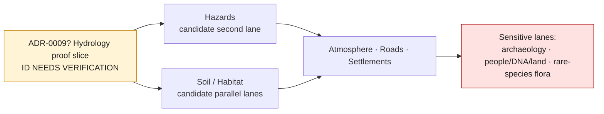
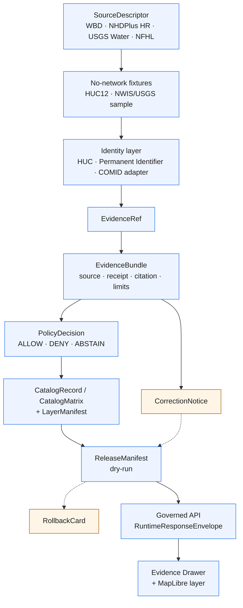

<!-- [KFM_META_BLOCK_V2]
doc_id: kfm://doc/adr-0009-hydrology-first-proof-bearing-lane
title: ADR-0009 — Hydrology Is the First Proof-Bearing Lane
type: standard
version: v1.2
status: draft
owners: TBD (Architecture steward + Hydrology lane steward + Governance steward)
created: 2026-05-09
updated: 2026-05-15
policy_label: public
related:
  - docs/doctrine/directory-rules.md
  - docs/adr/ADR-0001-schema-home.md
  - docs/adr/ADR-0003-evidencebundle-contract.md
  - docs/adr/ADR-0004-promotion-gate.md
  - docs/adr/ADR-0005-maplibre-layer-manifest.md
  - docs/adr/ADR-0006-governed-ai-runtime-envelope.md
  - docs/adr/ADR-0007-domain-lane-template.md
  - docs/domains/hydrology/README.md
  - docs/registers/VERIFICATION_BACKLOG.md
tags: [kfm, adr, hydrology, proof-lane, governance]
notes:
  - "Revised 2026-05-15 to preserve hydrology-first doctrine while tightening acceptance semantics, ADR-number conflict handling, source-role separation, and verification/rollback requirements."
  - "ADR number 0009 NEEDS VERIFICATION against the active ADR register; the Pipeline Living Implementation Manual v0.3 lists ADR-0009-local-exposure-security."
  - "This document is PROPOSED until the ADR register, target path, acceptance gates, owners, and mounted-repo implementation evidence are verified."
  - "All file paths cited inside this ADR remain PROPOSED until confirmed against the mounted repo and Directory Rules."
[/KFM_META_BLOCK_V2] -->

# ADR-0009 — Hydrology Is the First Proof-Bearing Lane

> **Decision in one line.** This ADR proposes that Kansas Frontier Matrix (KFM) treat **hydrology** as the first end-to-end proof-bearing domain lane — the lane whose thin slice must traverse the full trust path from `SourceDescriptor` to a public-safe `RuntimeResponseEnvelope` before any other domain ships an equivalent first proof slice.

<p>
  
  
  
  
  
  
  
</p>

**Quick jump:** [Status](#status) · [Evidence boundary](#evidence-boundary) · [Context](#context) · [Decision](#decision) · [Consequences](#consequences) · [Alternatives](#alternatives-considered) · [Acceptance gates](#acceptance-gates) · [Risk ledger](#risk-ledger) · [Out of scope](#out-of-scope) · [Migration & rollback](#migration--rollback) · [Open questions](#open-questions) · [Verification checklist](#verification-checklist) · [References](#references)

---

## Status

| Field | Value |
|---|---|
| **ADR ID** | `ADR-0009` *(NEEDS VERIFICATION — possible collision with `ADR-0009-local-exposure-security`; see [Open questions](#open-questions))* |
| **Title** | Hydrology Is the First Proof-Bearing Lane |
| **ADR status** | `proposed` |
| **Document status** | `draft` |
| **Decision state** | Not binding until the ADR ID, deciders, acceptance gates, and active ADR register are verified. |
| **Date opened** | 2026-05-09 |
| **Last revised** | 2026-05-15 |
| **Deciders** | Architecture steward, Hydrology lane steward, Governance steward *(roster placeholders — OWNER_TBD)* |
| **Acceptance owner** | OWNER_TBD |
| **Supersedes** | None |
| **Superseded by** | — |
| **Authority class** | Proposed decision record. Once accepted, supersession requires a successor ADR with stronger evidence and an explicit transition plan. |
| **Scope** | KFM monorepo `bartytime4life/Kansas-Frontier-Matrix` *(repo implementation state remains UNKNOWN unless inspected in a mounted checkout)* |
| **Candidate path** | `docs/adr/ADR-0009-hydrology-first-proof-bearing-lane.md` *(PROPOSED / NEEDS VERIFICATION)* |
| **Directory Rules basis** | ADRs belong under the documentation responsibility root. Machine schemas, source registries, policy, receipts, proofs, release objects, and lifecycle data remain in their own responsibility roots. |

> [!IMPORTANT]
> This ADR records and proposes formal acceptance of a hydrology-first doctrine recurring across the KFM corpus. It does **not** claim that hydrology schemas, validators, fixtures, routes, UI components, workflows, receipts, proof packs, or release artifacts already exist in the active repository.

> [!CAUTION]
> The ADR number is not safe to merge until the active ADR register is checked. If `ADR-0009-local-exposure-security` is already active, this document must be renumbered through the register before acceptance.

---

## Evidence boundary

This document states a **proposed decision** using supplied KFM doctrine and lineage. It deliberately separates doctrine from implementation evidence.

| Claim class | Status in this ADR | How to read it |
|---|---|---|
| Hydrology-first sequencing | **CONFIRMED doctrine / PROPOSED decision** | Repeated across hydrology, pipeline, encyclopedia, and implementation-reference materials. |
| Hydrology fixture shape | **PROPOSED implementation** | HUC12, NHDPlus HR identity/crosswalk, USGS Water observation, and NFHL regulatory context are recommended first-slice objects. |
| Repo paths | **PROPOSED / NEEDS VERIFICATION** | Paths are placement proposals until a mounted repo confirms actual conventions and Directory Rules compatibility. |
| Runtime behavior | **UNKNOWN** | No current API, UI, workflow, CI, dashboard, log, emitted artifact, or route behavior is proven by this ADR. |
| ADR number | **CONFLICTED / NEEDS VERIFICATION** | The Pipeline Living Implementation Manual v0.3 lists `ADR-0009-local-exposure-security`; this ADR may need renumbering. |
| Source versions and live endpoint behavior | **NEEDS VERIFICATION** | Source descriptors must recheck current source terms, endpoint behavior, cadence, and rights before implementation or release. |

### Reader contract

Read this ADR as a sequencing and acceptance-gate proposal. It is not a release manifest, not a code patch, not an implementation inventory, and not proof that the active repo already contains the named artifacts.

The safe reading is:

```text
CONFIRMED doctrine + LINEAGE sources
        ↓
PROPOSED ADR decision and acceptance gates
        ↓
NEEDS VERIFICATION in active ADR register + mounted repo
        ↓
accepted only after gate evidence is recorded
```

---

## Context

KFM is a governed, evidence-first, map-first, time-aware spatial knowledge and publication system. Before any domain claims proof-bearing maturity, **one** lane must demonstrate the entire trust path end-to-end:

```text
SourceDescriptor → Fixture → Identity → EvidenceRef → EvidenceBundle
        → PolicyDecision → CatalogRecord / LayerManifest
        → ReleaseManifest (dry-run) → RuntimeResponseEnvelope (API)
        → Evidence Drawer (UI) → CorrectionNotice / RollbackCard
```

Choosing the wrong first lane is operationally expensive. If the lane is too sensitive, sensitivity controls dominate the proof and obscure trust-path mechanics. If it is too source-thin, evidence closure is shallow. If it is too symbolic or interpretive, the proof becomes more about modeling choices than admissible evidence. The first lane must therefore be **public-relevant, spatially rich, time-aware, source-authority-heavy, and fixture-tractable** without beginning in the most sensitive KFM domains.

### Forces

| Force | Implication for lane choice |
|---|---|
| **Trust-path completeness** | Lane must exercise `SourceDescriptor → API/UI` without skipping phases. |
| **Public-safe by default** | The first slice must be releasable in dry-run form without making sensitive-location, living-person, sovereignty, title, archaeology, or rare-species exposure the normal case. |
| **Source-authority depth** | Lane must rest on recognized public authorities with stable, citable artifacts. |
| **Spatiotemporal richness** | Lane must exercise CRS, geometry hashing, time-of-source, time-of-retrieval, time-of-release, freshness, stale-state, and correction semantics. |
| **Evidence drill-through** | A clicked feature must resolve to citable evidence with non-trivial structure, not just a tile attribute or popup label. |
| **Bounded sensitivity** | Lane must not require fail-closed denial as the normal posture for the first proof slice. |
| **Fixture tractability** | At least one HUC12 boundary and one observation sample must be small enough to ship as deterministic, no-network fixtures with valid and invalid examples. |
| **Renderability without becoming truth** | Tiles, map layers, hydrographs, search projections, and AI summaries remain downstream carriers. The governed API resolves evidence. |

### What the corpus already says

| Source family | Status | Hydrology-first signal |
|---|---|---|
| Hydrology Extended Pro Reference Report | **CONFIRMED lineage / PROPOSED plan** | Treats hydrology-first sequencing as the strongest repeated lane-sequencing rule; preserves HUC12, NHDPlus HR identity/crosswalk, USGS Water observations, source descriptors, and Evidence Drawer payloads as the first hydrology proof surface. |
| Domain & Capability Encyclopedia | **CONFIRMED doctrine / PROPOSED implementation** | Describes hydrology’s first credible thin slice as Kansas HUC12 + one USGS gauge fixture + one NHDPlus identity crosswalk + NFHL contextual overlay + hydrograph panel + EvidenceBundle closure + ABSTAIN on ambiguous reach identity. |
| Pipeline Living Implementation Manual v0.3 | **CONFIRMED doctrine / PROPOSED implementation** | Preserves the lifecycle law and source-ledger posture while surfacing the `ADR-0009` number collision. |
| Implementation Reference | **LINEAGE / NEEDS VERIFICATION** | States that hydrology and ecology are safest first proof lanes, with hydrology the more mature surface in that earlier review context. |
| Hazards Blueprint | **LINEAGE / PROPOSED plan** | Positions hazards as a high-value second lane after hydrology, not the first proof lane. |
| MapLibre / UI doctrine | **CONFIRMED doctrine / PROPOSED implementation** | Requires public map interaction to flow through released artifacts, governed APIs, EvidenceBundle resolution, Evidence Drawer, and finite Focus Mode outcomes. |
| Build Companion references in the baseline ADR | **LINEAGE / NEEDS VERIFICATION in this revision** | The baseline ADR cited Build Companion §§8.3, 19.1, and 20. Those references are preserved as lineage, but the source was not independently rechecked in this revision pass. |

This ADR makes the consensus inspectable: it records the proposed decision, alternatives, acceptance gates, risk controls, rollback posture, and verification backlog.

---

## Decision

**Decision upon acceptance:** KFM adopts hydrology as the first proof-bearing lane. The first end-to-end thin slice covers, at minimum, **one public-safe HUC12/WBD layer** and **one USGS Water observation fixture** stitched through `EvidenceBundle` closure to a governed API/UI response. No other domain ships an equivalent first proof slice before the hydrology slice meets the [acceptance gates](#acceptance-gates).

Until this ADR is accepted, the paragraph above remains **PROPOSED** and non-binding.

### What this decision is

- A **lane-sequencing rule**: hydrology precedes other domain first proof slices, regardless of subjective readiness elsewhere.
- A **fixture-first rule**: no-network fixtures prove the lane before live connectors, source watchers, or production source activation.
- A **source-role separation rule** inside hydrology: WBD/HUC boundaries, NHDPlus HR identity/network context, USGS Water observations, FEMA NFHL regulatory flood context, terrain-derived hydrology, and observed-flood event evidence are distinct source roles with distinct contracts and policies.
- A **public-surface rule**: the map may render candidates, but consequential answers resolve through governed APIs, `EvidenceBundle`, policy, release state, and citation validation.
- A **negative-proof rule**: ambiguous reach identity, unknown source role, unresolved evidence, unknown rights, stale source state, and flood-role misuse must produce finite negative outcomes rather than silent inference.

### What this decision is not

- It is **not** a claim that hydrology contracts, schemas, validators, fixtures, runbooks, routes, UI components, receipts, or workflows already exist in the active repo.
- It is **not** a license to bypass `ADR-0001-schema-home.md`, Directory Rules, or the active ADR register.
- It is **not** a permanent domain ranking. It is the sequencing rule for the **first** proof-bearing slice.
- It is **not** a public-release authorization for any layer. Public or semi-public release still requires source, rights, sensitivity, validation, provenance, integrity, proof, review, release, correction, and rollback support appropriate to significance.
- It is **not** an emergency flood-warning system, a hydrologic simulation authorization, or a flood-claim shortcut.
- It is **not** permission to create parallel schema, contract, policy, source, registry, release, receipt, proof, or lifecycle homes.

### Decision guardrails

| Guardrail | Required posture |
|---|---|
| ADR ID collision | Resolve through the active ADR register before merge or acceptance. |
| Schema home | Use the accepted schema-home ADR and Directory Rules; do not maintain divergent definitions under both `contracts/` and `schemas/`. |
| Public UI path | Public clients and normal UI surfaces consume governed APIs and released artifacts only. |
| Evidence closure | `EvidenceRef` must resolve to `EvidenceBundle` before a claim-bearing answer, export, or UI explanation is authoritative. |
| AI / Focus Mode | AI is evidence-subordinate and emits finite outcomes through a governed envelope; generated language never substitutes for evidence. |
| Release | Acceptance of this ADR can be satisfied by dry-run release objects; it does not require public publication. |
| Correction and rollback | Correction lineage and rollback target are acceptance requirements, not afterthoughts. |

### Domain-lane order after hydrology

Subsequent lane order remains **suggested**, not fixed by this ADR. Each lane’s first slice requires its own lane README update and, where structurally significant, its own ADR.



> [!NOTE]
> Sensitive lanes follow the proof-lane discipline established by hydrology but apply stronger fail-closed controls. They are deliberately scheduled later for **first proof slices**, not permanently deprioritized.

---

## Consequences

### Positive

- **Trust spine first.** The first proof slice exercises `SourceDescriptor`, `EvidenceRef`, `EvidenceBundle`, `PolicyDecision`, `CatalogRecord`, `LayerManifest`, `ReleaseManifest`, `RuntimeResponseEnvelope`, `CorrectionNotice`, and `RollbackCard` on a domain with mature public source families.
- **Fixture portability.** A pinned Kansas HUC12 boundary and a small USGS Water observation sample are tractable as no-network fixtures with valid and invalid cases.
- **Source-role pedagogy.** The lane forces KFM to distinguish WBD, NHDPlus HR, USGS Water, FEMA NFHL, terrain derivatives, and observed-flood evidence before easier lanes can blur source roles.
- **Evidence Drawer realism.** Click-to-evidence on a watershed, reach, gauge, or hydrograph produces meaningful payloads: citation, freshness, qualifier/provisional state, source role, limitations, review state, release state, and correction lineage.
- **Reusable harness.** The contracts, validators, no-network fixtures, negative fixtures, and runbooks built for hydrology become the template that `ADR-0007-domain-lane-template` and later lanes can instantiate.

### Negative / costs

- **Hydrology terminology load.** NHD legacy, NHDPlus HR, 3DHP, COMID, Permanent Identifier, reachcode, HUC hierarchy, and observation parameter-code handling add domain complexity to a governance proof.
- **Regulatory-vs-observed flood risk.** FEMA NFHL is regulatory flood context, not observed inundation. A careless first slice could entrench the wrong language across KFM.
- **Freshness pressure.** USGS Water observations and related source services are time-sensitive. The first slice must prove stale-state and source-head behavior without making live endpoints a CI dependency.
- **Deferred eager lanes.** Other stewards may have strong datasets ready. This ADR still prioritizes proving the trust path first, so sensitive or heavier lanes may wait for the hydrology harness.
- **ADR coordination overhead.** The possible `ADR-0009` collision must be resolved before acceptance, and renumbering may require doc links, meta block, badges, register entries, and related lane references to change together.

### Neutral

- The decision is **reversible** by a successor ADR that cites stronger evidence for another first proof lane or a structural reason to change sequencing.
- Reversal does not erase hydrology work. Existing hydrology artifacts remain lineage and proceed or terminate under the successor ADR’s transition plan.
- A dry-run release can satisfy acceptance gates without public publication.

---

## Alternatives Considered

| Alternative | Why considered | Why not chosen |
|---|---|---|
| **Ecology / habitat first** | Often listed with hydrology as a safe proof-lane candidate; public occurrence and land-cover data exist. | Sensitive-occurrence geoprivacy, occurrence-aggregator source roles, and steward review can dominate the first proof slice. Hydrology better isolates core trust-path mechanics. |
| **Soil first (SSURGO/gSSURGO snapshot)** | Static, well-bounded, low-sensitivity, and strong source authority. | Weaker live freshness and stale-state exercise than streamflow; less immediate hydrograph/time-series proof pressure. |
| **Frontier county-year panel first** | More distinctive to KFM’s “frontier matrix” identity. | Too many modeling and definition seams (`FrontierDefinition`, `GeographyVersion`, population/economic/agriculture/access observations) for a first trust-path proof. |
| **Synthetic AI-only fixture** | Useful for proving the governed AI envelope. | Does not exercise source authority, geometry, hydrologic identity, observation freshness, or public map release at domain depth. |
| **Hazards first** | Public-relevant and source-rich. | Hazards mix operational warnings, historical events, declarations, model derivatives, regulatory zones, and life-safety implications. First-slice life-safety risk is too high; hazards is better as the second lane. |
| **Archaeology / people-DNA-land / rare-flora first** | Deep steward datasets may exist. | Sensitive, sovereignty, cultural, living-person, DNA, title, or rare-location controls would dominate. These lanes should ride an already-proven trust harness. |
| **No first lane; build all lanes simultaneously** | Egalitarian and tempting during early expansion. | Diffuses validation pressure; every lane reinvents fixtures, validators, source-role rules, and proof objects. It weakens the template effect. |

---

## Acceptance Gates

The hydrology slice is “proof-bearing” only when **every applicable** gate reaches the listed signal. Until then, this ADR remains `proposed`.

> [!IMPORTANT]
> These gates are conjunctive for promotion from `proposed` to `accepted`. A partial slice can be an internal milestone; it cannot unlock another domain’s equivalent first proof slice.

### Minimum proof slice

The minimum slice is intentionally small but non-trivial.

| Required object | Minimum acceptance expression |
|---|---|
| **HUC12 / WBD fixture** | One Kansas public-safe HUC12 boundary fixture with CRS, source role, geometry/content fingerprint, citation, and version/source-head metadata. |
| **USGS Water observation fixture** | One no-network observation sample with parameter code, unit, observed time, source/retrieval time, qualifier/provisional status, and no-data/provisional negative cases. |
| **NHDPlus HR identity/crosswalk fixture** | One identity bridge or compatibility crosswalk that distinguishes Permanent Identifier, COMID compatibility, exact/split/merge/ambiguous/unknown relationships, and ABSTAIN behavior. |
| **NFHL context where used** | Regulatory flood context is labeled as `flood_context`, not observed inundation or emergency flood evidence. |
| **EvidenceBundle closure** | Feature click or API explain resolves evidence, source role, citation, limitations, policy context, review state, release state, and correction lineage. |
| **Dry-run release + rollback** | Release manifest and rollback card exist in dry-run with visible target and receipt. |

### Gate matrix

| Gate | Required hydrology acceptance signal | Required negative proof |
|---|---|---|
| **ADR register** | Active ADR register confirms this ADR number, title, target path, status, and successor/supersession links. | Duplicate `ADR-0009` blocks acceptance. |
| **Directory placement** | Proposed path and related homes conform to Directory Rules, ADR-0001 schema-home decision, and mounted-repo conventions. | Parallel schema/contract/policy/source/registry/release/proof homes block acceptance. |
| **Source** | WBD/HUC, USGS Water, NHDPlus HR/crosswalk, FEMA NFHL where applicable, and terrain inputs each have a `SourceDescriptor` with `source_role`, rights posture, cadence/freshness, citation text, sensitivity, and caveats. | Unknown `source_role`, unknown rights, or missing citation text produces `DENY` / `ABSTAIN`. |
| **Fixture** | No-network HUC12 and USGS observation fixtures exist with valid and invalid examples. | Live endpoint dependency in CI is rejected for first proof. |
| **Identity** | HUC IDs, NHDPlus HR Permanent Identifiers, COMID compatibility keys, and geometry/content hashes are deterministic and carry CRS/precision assumptions. | Ambiguous, split, merge, retired, or unknown identity emits `ABSTAIN`, not silent resolution. |
| **Evidence** | `EvidenceRef` resolves to `EvidenceBundle` containing source, retrieval/run receipt, dataset version or source head, spatial/temporal support, citation text, limitations, and policy context. | Unresolved `EvidenceRef` emits `ABSTAIN` / `ERROR`; generated language cannot fill the gap. |
| **Policy** | Unknown source role, stale source, unresolved evidence, unclear rights, forbidden sensitivity, and flood-role misuse each have deterministic finite outcomes. | Policy-negative fixtures produce `DENY`, `ABSTAIN`, or `ERROR` with reason codes. |
| **Catalog** | `CatalogRecord` / `CatalogMatrix`, `LayerManifest`, and proof-pack references close across STAC/DCAT/PROV-style metadata where used. | Catalog records without proof/evidence closure fail promotion. |
| **Release dry-run** | `ReleaseManifest` and `RollbackCard` are produced in dry-run. No public publication is required for acceptance. | Missing rollback target blocks acceptance. |
| **API** | A feature-explain endpoint or equivalent governed route returns `RuntimeResponseEnvelope` with `ANSWER` for valid fixtures and `ABSTAIN` / `DENY` / `ERROR` for invalid cases. | No `RAW`, `WORK`, `QUARANTINE`, candidate, direct source, or canonical/internal path leaks through the envelope. |
| **UI** | Evidence Drawer renders source role, evidence, citations, freshness/stale state, release state, limitations, corrections, and rollback lineage. Map tiles/layers carry public IDs only; API resolves evidence. | Popup-only claims, uncited exports, and Focus Mode answers from rendered features alone fail. |
| **Correction** | A fixture correction supersedes the original without deleting prior lineage; `CorrectionNotice` is produced. | Silent overwrite or lineage deletion fails. |
| **Rollback** | Dry-run rollback returns to the prior release manifest/root hash or designated rollback target and records the action. | Rollback without visible target or receipt fails. |
| **Non-regression** | Prior hydrology lineage is mapped, retained, superseded, or explicitly deprecated with rollback notes. | Prior scaffold semantics are silently lost or replaced by a generic hydrology blob. |

### Trust path reference diagram



---

## Risk Ledger

| Risk | Mitigation |
|---|---|
| ADR number collision with `ADR-0009-local-exposure-security`. | Verify active ADR register before merge. If collision is real, renumber this ADR or resolve the local-exposure ADR through the register, not ad hoc. |
| Proposed ADR treated as accepted doctrine. | Keep status `proposed` until all acceptance gates close; require a visible `PromotionDecision` or ADR status update. |
| Regulatory flood data (FEMA NFHL) mistaken for observed inundation. | Source-role registry distinguishes `regulatory_context` from `observed_event`; map layer naming uses `flood_context`, never `observed_flood`, unless observed evidence exists. |
| NHD legacy vs NHDPlus HR vs 3DHP terminology drift. | Schemas require explicit `source_family`; validators reject unspecified or mixed families. |
| COMID-vs-Permanent-Identifier crosswalk ambiguity. | Relationship classes such as `exact`, `split`, `merge`, `retired`, `no_legacy`, `ambiguous`, and `unknown`; `ABSTAIN` on unresolved many-to-many mappings. |
| Time of source, retrieval, observation, validity, release, and correction are confused. | Evidence and drawer payloads expose `observed_time`, `valid_time`, `source_time`, `retrieved_at`, `released_at`, stale state, and correction lineage where material. |
| Tiles treated as proof. | Tile features carry public IDs only; governed API resolves evidence; tiles and layer toggles are not publication. |
| Live endpoint instability collapses CI. | No-network fixtures first; live connectors require later activation decisions, source descriptors, and explicit source-watch policy. |
| HUC12 `LoadDate` / `lastEditDate` mistaken for content-change proof. | Use normalized geometry/content fingerprints; metadata dates are signals, not authority. |
| Hydrologic simulation treated as observation. | Defer simulation as experimental until model cards, calibration, uncertainty, validation, and review gates exist. |
| Prior hydrology ideas silently lost. | Preservation/supersession matrix and continuity checks must be required before replacing hydrology lineage. |
| Schema-home conflict creates parallel authority. | Defer to active `ADR-0001-schema-home.md`; if unresolved, raise `CONFLICTED / NEEDS VERIFICATION` and avoid divergent siblings. |
| Path examples copied into repo without Directory Rules review. | Treat all paths in this ADR as `PROPOSED`; verify mounted repo topology and responsibility root before landing files. |

---

## Out of Scope

This ADR does **not** decide:

- Whether this document keeps `ADR-0009` if the active ADR register confirms an ID collision.
- Whether `schemas/contracts/v1/hydrology/` or `contracts/hydrology/` is the active machine-schema home. Defer to `ADR-0001-schema-home.md`, Directory Rules, and mounted repo evidence.
- The full shape of specific schemas such as `huc12.schema.json`, `hydro_observation.schema.json`, `run_receipt.schema.json`, or `evidence_drawer_payload.schema.json`.
- Live source activation, credentials, quota strategy, service probes, or rate-limit posture for USGS Water Data, WBD, NHDPlus HR, FEMA NFHL, or 3DEP.
- The boundary between hydrology and adjacent lanes such as soil moisture, drought, water quality, wetlands, terrain, agriculture, hazards, or infrastructure.
- Hydrologic simulation, DEM conditioning, flood modeling, emergency warnings, or life-safety advice.
- MapLibre layer registry final shape, Evidence Drawer DTO final shape, Focus Mode prompt contracts, or app route names.
- Public release of any layer or dataset. Release requires separate promotion gates.

---

## Migration & Rollback

### Migration

Adoption alone requires no file moves. Adoption obligates downstream work through ordinary PRs:

1. Verify the active ADR register and resolve the `ADR-0009` collision before acceptance.
2. If renumbering is required, update the filename, meta block `doc_id`, title, badges, links, related references, and ADR register in a single doc-control PR.
3. Hydrology lane documentation cites this ADR in its meta block `related[]` after the ADR number is verified.
4. `ADR-0007-domain-lane-template` or equivalent lane-template documentation inherits the gate vocabulary above.
5. Subsequent first-slice plans for hazards, soil, habitat/fauna, flora, agriculture, atmosphere, geology, settlements, roads, archaeology, and people/DNA/land reference this sequencing rule where relevant.
6. `docs/registers/VERIFICATION_BACKLOG.md` or the active verification register records every unresolved gate row.
7. Any machine-readable hydrology contracts, schemas, policies, validators, fixtures, or release artifacts land only after Directory Rules and active schema-home authority are confirmed.

### Rollback

Rollback consists of:

1. A successor ADR marked `accepted` that explicitly supersedes this ADR and cites stronger evidence or a structural reason to change first-lane sequencing.
2. This ADR’s status changes to `superseded` with a forward link to the successor; the body is retained for history.
3. In-flight hydrology PRs continue, pause, or terminate according to the successor’s transition section.
4. No published artifacts are silently retracted. Corrections, withdrawals, and supersessions follow `CorrectionNotice`, `ReleaseManifest`, and `RollbackCard` discipline.

> [!CAUTION]
> Rollback does **not** retroactively change the trust posture of artifacts already published or reviewed under hydrology gates. Public corrections, withdrawals, and supersessions remain visible and auditable.

---

## Open Questions

These items are **NEEDS VERIFICATION** unless explicitly marked `OPEN`.

- **NEEDS VERIFICATION — ADR number:** The Pipeline Living Implementation Manual v0.3 lists `ADR-0009-local-exposure-security`. Confirm the active ADR register and either renumber this ADR, renumber the local-exposure ADR, or confirm the register’s assignment before merge.
- **NEEDS VERIFICATION — target path:** Confirm whether this file belongs at `docs/adr/ADR-0009-hydrology-first-proof-bearing-lane.md`, another ADR filename, or a renumbered successor path.
- **NEEDS VERIFICATION — repo state:** Confirm whether `docs/adr/`, `docs/domains/hydrology/`, `schemas/contracts/v1/hydrology/`, `contracts/hydrology/`, `policy/hydrology/`, `fixtures/domains/hydrology/`, `data/registry/hydrology/`, and hydrology lifecycle homes exist.
- **NEEDS VERIFICATION — schema home:** Confirm whether `schemas/contracts/v1/`, `contracts/`, or another convention is active, and whether `ADR-0001-schema-home.md` has been accepted.
- **NEEDS VERIFICATION — source authority versions:** Confirm current USGS Water Data API/service posture, WBD endpoint stability, NHDPlus HR / 3DHP source-family posture, and FEMA NFHL terms at acceptance time.
- **NEEDS VERIFICATION — UI/API names:** Confirm governed API route names, Evidence Drawer payload schema, Focus Mode envelope, and MapLibre layer registry homes before writing implementation-shaped paths.
- **NEEDS VERIFICATION — decider quorum:** Confirm who can change this ADR from `proposed` to `accepted`, and what review record must accompany the change.
- **OPEN — fixture minimum:** Decide whether `proposed → accepted` requires both a HUC12 boundary fixture and a USGS observation fixture. Default position: **both**.
- **OPEN — terrain timing:** Decide whether terrain-derived hydrology belongs in the first proof slice or a second hydrology release. Default position: **deferred**.
- **OPEN — steward roster:** Identify hydrology steward, architecture steward, governance reviewer, source reviewer, and escalation path.
- **OPEN — acceptance owner:** Decide who can mark the gates complete and promote this ADR to `accepted`.

---

## Verification Checklist

- [ ] Confirm active ADR register and resolve the `ADR-0009` number collision.
- [ ] Confirm target path and filename under the active documentation/ADR home.
- [ ] Confirm owners, deciders, and acceptance owner.
- [ ] Confirm `ADR-0001-schema-home.md` status and active schema-home convention.
- [ ] Confirm Directory Rules compatibility for every proposed path family.
- [ ] Confirm mounted repo branch, root, dirty state, package manager, CI workflow conventions, and app/API/UI homes.
- [ ] Confirm hydrology source descriptors for WBD/HUC12, NHDPlus HR/crosswalk, USGS Water, FEMA NFHL where used, and terrain where used.
- [ ] Confirm no-network valid and invalid fixtures for HUC12, USGS observation, NHDPlus HR identity/crosswalk, unresolved evidence, ambiguous identity, stale source, and flood-role misuse.
- [ ] Confirm `EvidenceRef → EvidenceBundle` closure for the proof slice.
- [ ] Confirm governed API envelope returns `ANSWER`, `ABSTAIN`, `DENY`, and `ERROR` in fixture tests.
- [ ] Confirm Evidence Drawer renders evidence, source role, citations, freshness, release state, limitations, correction lineage, and rollback lineage.
- [ ] Confirm dry-run `ReleaseManifest`, `CorrectionNotice`, and `RollbackCard`.
- [ ] Confirm no public RAW, WORK, QUARANTINE, candidate, direct source, internal store, or direct model path exists in the first proof slice.
- [ ] Confirm verification backlog rows are created for unresolved gates.

---

## References

These references are corpus-internal or lineage references. They support doctrine, planning, or source realism; they do **not** prove current mounted implementation unless a mounted repo, tests, logs, emitted artifacts, or workflows are later inspected.

| Reference | Status in this ADR | Supports | Does not prove |
|---|---|---|---|
| **Directory Rules** | CONFIRMED supplied doctrine | Responsibility-root placement, schema-home default, ADR-required changes, lifecycle invariant. | Current repo topology or active accepted ADR state. |
| **KFM Hydrology Extended Pro Reference Report (2026-04-21)** | CONFIRMED lineage / PROPOSED plan | Hydrology-first sequencing, HUC12/NHDPlus HR/USGS Water/NFHL fixture plan, source-role separation, no-repo boundary, negative fixtures. | Current repo files, tests, routes, dashboards, source descriptors, or emitted proof objects. |
| **KFM Domain & Capability Encyclopedia (v0.1)** | CONFIRMED doctrine / PROPOSED implementation | Hydrology domain boundary, first credible thin slice, source families, map/viewing products, finite outcomes. | Current implementation maturity. |
| **Kansas Frontier Matrix Pipeline Living Implementation Manual v0.3** | CONFIRMED doctrine / PROPOSED implementation | Lifecycle law, source ledger posture, active ADR-index collision risk, verification backlog posture. | Current repo implementation or accepted ADR register. |
| **Kansas Frontier Matrix Implementation Reference** | LINEAGE / NEEDS VERIFICATION | Prior connector-based repo summary, staged implementation path, hydrology/ecology maturity signal. | Current repo state in this session. |
| **KFM Hazards Architecture — Extended Pro Blueprint** | LINEAGE / PROPOSED plan | Hazards as high-value second lane and not-for-life-safety posture. | Hydrology implementation. |
| **MapLibre / UI / governed interaction materials** | CONFIRMED doctrine / PROPOSED implementation | Renderer boundary, governed API, Evidence Drawer, Focus Mode, no public RAW path, no direct model client. | Current UI/app implementation. |
| **KFM Governed AI Extended Pro Source Ledger Architecture Report** | LINEAGE / PROPOSED design | AI as evidence-subordinate, finite runtime envelopes, citation validation, receipts. | Current runtime or model integration. |
| **Build Companion references from baseline ADR** | LINEAGE / NEEDS VERIFICATION | Baseline ADR cited it for hydrology-first acceptance criteria and risk language. | Not independently rechecked in this revision pass. |

[Back to top](#adr-0009--hydrology-is-the-first-proof-bearing-lane)