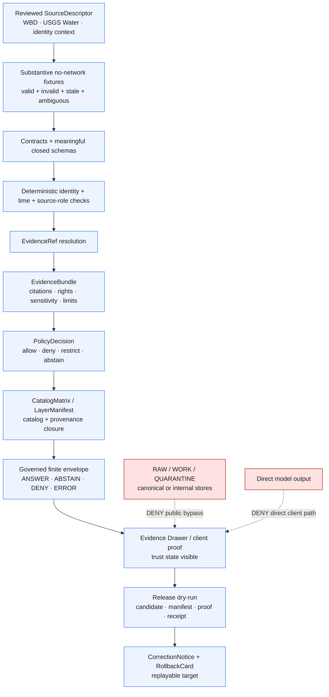

<!-- [KFM_META_BLOCK_V2]
doc_id: kfm://doc/adr-0009-hydrology-first-proof-bearing-lane
title: "ADR-0009 — Hydrology Is the First Proof-Bearing Lane"
type: adr
adr_id: ADR-0009
version: v1.3
status: draft
owners:
  - "NEEDS VERIFICATION — architecture decision owner"
  - "NEEDS VERIFICATION — Hydrology lane steward"
  - "NEEDS VERIFICATION — governance and release steward"
owner_status: "CODEOWNERS routes docs/adr/ and the affected trust-bearing roots to @bartytime4life; accepted stewardship, required-review rules, decision quorum, and independent approval controls were not verified"
reviewers_required:
  - Architecture steward
  - Docs steward
  - Hydrology lane steward
  - Source and evidence steward
  - Contract and schema steward
  - Policy reviewer
  - Governed API and Explorer Web maintainers
  - Release and rollback steward
  - "at least one affected downstream domain-lane owner"
created: 2026-05-09
updated: 2026-07-23
policy_label: public
truth_posture: cite-or-abstain
responsibility_root: docs/
current_path: docs/adr/ADR-0009-hydrology-is-the-first-proof-bearing-lane.md
supersedes: []
superseded_by: null
evidence_snapshot:
  repository: bartytime4life/Kansas-Frontier-Matrix
  base_ref: main
  base_commit: e2466421ced8e41430737d4e7d51f19e3ab61d9f
  target_prior_blob: e723de038fb2e633874c51a230e56bba78ef582e
  adr_index_blob: cf08fae322ac53426f7394d97897fdb942253049
  adr_readme_blob: f1b5d34a53b6c717832d587de54989ce8192bcaa
  directory_rules_doctrine_blob: 2affb080e6f0043867c64c7f06c1ca52030fbd55
  codeowners_blob: dd2a84aa514d8ecd9208bc347f90f9a2ed37dd61
  hydrology_readme_blob: 57e5662e9481f8590238c21936b5d5e25f5176bb
  hydrology_thin_slice_blob: 388a3309ed9431df359c46deae0b1a26275c36c2
  hydrology_canonical_paths_blob: f5adebc9353b5ee6a93a068a17d6e4de206635a4
  adr_0026_blob: 0678ac143d3a70d96b8ae5fba8ddaefdba18ca59
  huc_unit_contract_blob: 180a87abef03c1990484c27931c7e52e6131a451
  huc_unit_schema_blob: 321c69f4686bfb7ecbb2a8f44a228405cdbcf9ce
  flow_observation_schema_blob: 9651530dc095f5dd075d6302c1623b6c5813ed5c
  evidence_bundle_alias_schema_blob: 0e7d14b0e6edf13909606bbcbd0a3171c24e8d3c
  evidence_bundle_common_schema_blob: cf5256831b63dca46a5f68b168441adcf68b8751
  evidence_bundle_valid_fixture_blob: 498a2f9a044a9c50f6c6a58fb338ceb5db5ea1c1
  wbd_source_descriptor_blob: fc0ee3ffb2c426cb560f41d6091d17d8d7213e5d
  nwis_source_descriptor_blob: 456f64974526ae55107f507878f85cf73292dd51
  huc12_placeholder_fixture_blob: 18ce8f53f4c5a614bb78e89d4caf931b2b0112bf
  gauge_placeholder_fixture_blob: 132c09eebc74836b980ab332e11a40564b950d0e
  missing_provenance_placeholder_blob: 2920fff9cf5284c68713acafb8f15cd4b0b8539d
  hydrology_ingest_placeholder_blob: 067618715d018dfd859e3e7decd219b18b017e2a
  hydrology_promotion_stub_blob: 98ec4d03ec0b41f03a85ee1fcedd5b75b4a2f68e
  proof_slice_e2e_placeholder_blob: 9fdd40a8f5d1487ba62868764d902ee25352bc7e
  evidence_closure_test_placeholder_blob: b7ccf562470747169fc3c536d5396c084648ebde
  evidence_bundle_validator_blob: eec146fcf44fb817f81dc31576b73c18ddb781f0
  hydrology_proof_workflow_blob: da3aefc41192629db1e0d11adf31db91ee181afe
  makefile_blob: 51537af34ee065c2de571134688415042b83b22a
  release_candidate_readme_blob: 7b93fc2bc3b3363235374f0ee8b9b2c51921ffd2
related:
  - docs/adr/README.md
  - docs/adr/INDEX.md
  - docs/adr/ADR-0001-schema-home--schemas-contracts-v1-is-canonical.md
  - docs/adr/ADR-0002-contracts-vs-schemas-split.md
  - docs/adr/ADR-0004-apps-governed-api-is-the-trust-membrane.md
  - docs/adr/ADR-0011-receipts-vs-proofs-vs-manifests-vs-catalog-separation.md
  - docs/adr/ADR-0017-source-descriptor-admission-process.md
  - docs/adr/ADR-0018-promotion-gate-sequence.md
  - docs/adr/ADR-0019-ai-adapter-contract-and-finite-envelopes.md
  - docs/adr/ADR-0020-abstain-is-a-first-class-decision.md
  - docs/adr/ADR-0022-catalog-matrix--stac-+-dcat-+-prov-must-agree.md
  - docs/adr/ADR-0024-steward-separation-of-duties-for-release.md
  - docs/adr/ADR-0025-public-client-never-reads-canonical-internal-stores.md
  - docs/adr/ADR-0026-hydrology-source-spine-starts-with-wbd-huc12.md
  - docs/doctrine/directory-rules.md
  - docs/domains/hydrology/README.md
  - docs/domains/hydrology/THIN_SLICE.md
  - contracts/domains/hydrology/huc_unit.md
  - schemas/contracts/v1/domains/hydrology/huc_unit.schema.json
  - fixtures/domains/hydrology/valid/huc12_kansas_sample.json
  - data/registry/sources/hydrology/wbd.source.yaml
  - .github/workflows/hydrology-proof-slice.yml
  - release/candidates/hydrology/README.md
tags: [kfm, adr, hydrology, proof-bearing-lane, proof-slice, evidence-closure, catalog-closure, finite-outcomes, release-dry-run, rollback, fail-closed]
notes:
  - "v1.3 is a same-path repository-grounded modernization. It preserves source metadata `draft` and effective decision status `proposed`; it does not accept ADR-0009 or declare Hydrology proof-bearing."
  - "The canonical ADR index uniquely assigns ADR-0009 to this exact path. The earlier possible collision with a local-exposure-security proposal is resolved for the inspected repository snapshot."
  - "The repository contains a broad Hydrology documentation, contract, schema, fixture, pipeline, validator, test, policy, release-candidate, and workflow surface, but much of it remains placeholder, permissive, documentation-only, or explicit readiness-hold state."
  - "The Hydrology proof workflow deliberately emits WORKFLOW_HOLD for proof production, EvidenceRef-to-EvidenceBundle closure, and CatalogMatrix closure. A green readiness-hold job is not proof-bearing maturity."
  - "ADR-0026 remains a separate proposed lane-internal source-spine decision. This ADR does not accept it or silently convert WBD/HUC12 planning into an implemented canonical source."
[/KFM_META_BLOCK_V2] -->

<a id="top"></a>

# ADR-0009 — Hydrology Is the First Proof-Bearing Lane

> **Proposed decision.** KFM designates Hydrology as the first domain lane that may graduate to **proof-bearing** status. Graduation requires a real, reproducible, no-network end-to-end slice that closes source identity, meaningful schema and contract validation, deterministic fixtures, EvidenceRef-to-EvidenceBundle resolution, policy, finite runtime outcomes, catalog closure, release dry-run, correction, and rollback. Repository scaffolds, prose, permissive schemas, placeholder fixtures, TODO targets, pull requests, merges, and readiness-hold workflows do not satisfy that burden.

[](#status)
[](#current-repository-evidence)
[](#current-repository-evidence)
[](#current-gate-status)
[](#current-gate-status)
[](#current-gate-status)
[](#authority-and-publication-boundary)

> [!IMPORTANT]
> **The ADR identity is resolved; the decision is not accepted.** The canonical ADR index uniquely assigns `ADR-0009` to this exact file and records source metadata `draft` with effective status `proposed`. The earlier collision warning is retained only as resolved lineage. Changing this document or its index row does not accept the decision.

> [!CAUTION]
> **A broad scaffold is not a proof-bearing lane.** Hydrology has extensive documentation and semantic-contract surfaces, but core HUC and observation schemas remain permissive stubs, representative HUC12 and gauge fixtures are placeholder records, pipeline files remain greenfield markers, the E2E test is `assert True`, and the native workflow deliberately holds proof production, semantic EvidenceBundle closure, and CatalogMatrix closure.

> [!WARNING]
> **Do not execute placeholder approval as governance.** The current Hydrology promotion stub can write a synthetic `"APPROVE"` record when run. The proof workflow inspects that file as text and deliberately does not execute it. Proof-bearing graduation requires a reviewed fail-closed implementation whose decisions derive from validated evidence and policy—not a hard-coded approval path.

**Quick navigation:** [Status](#status) · [Evidence](#evidence-boundary) · [Context](#context) · [Decision](#decision) · [Architecture](#proof-bearing-trust-path) · [Current gates](#current-gate-status) · [Consequences](#consequences) · [Alternatives](#alternatives-considered) · [Acceptance](#acceptance-gates) · [Risks](#risk-ledger) · [Migration](#migration--rollback) · [Open work](#open-questions) · [Verification](#verification-checklist) · [References](#references)

---

<a id="status"></a>

## Status

| Field | Current value |
|---|---|
| **ADR ID** | `ADR-0009` — unique and confirmed in the canonical [`INDEX.md`](./INDEX.md) |
| **Tracked path** | `docs/adr/ADR-0009-hydrology-is-the-first-proof-bearing-lane.md` |
| **Source metadata** | `draft` |
| **Effective decision status** | `proposed` — not binding until the record and index carry matching reviewed `accepted` status |
| **Decision class** | Cross-domain first-proof sequencing plus Hydrology proof-graduation criteria |
| **Configured lane posture** | Broad repository surface across docs, contracts, schemas, fixtures, source registry, pipelines, validators, tests, policy, release candidates, and CI |
| **Current implementation posture** | Documentation-rich and shape-partial; proof production, semantic evidence closure, catalog closure, release closure, and public operation remain held or unverified |
| **Publication effect** | None. This ADR, a schema pass, workflow result, commit, pull request, merge, dry-run, or deployment is not KFM publication evidence |
| **Supersedes / superseded by** | None / none |

### Governance acceptance versus proof graduation

This revision separates two states that the prior text blurred:

1. **ADR acceptance** approves the architectural sequencing rule: Hydrology is the first lane expected to graduate through the shared proof-bearing trust path.
2. **Proof-bearing graduation** is an implementation claim requiring the complete evidence packet in [Acceptance Gates](#acceptance-gates).

Accepting the ADR would not itself declare Hydrology proof-bearing. Conversely, a local script or workflow cannot grant architectural acceptance. The current repository proves neither state.

### Resolved numbering lineage

The v1.2 text warned that `ADR-0009` might collide with a proposed local-exposure-security record. The current canonical index now contains a complete unique sequence from `ADR-0001` through `ADR-0028` and assigns `ADR-0009` only to this file. That concern is **CONFIRMED resolved for the pinned snapshot**. A future numbering change still requires the normal index, inbound-link, history, and review process.

[Back to top](#top)

---

<a id="evidence-boundary"></a>

## Evidence Boundary

This ADR now distinguishes **configured repository surface**, **machine shape**, **semantic closure**, **proof-bearing execution**, and **release/public operation**. Presence at an earlier level does not imply maturity at a later level.

### Maturity ladder

| Level | Meaning | Current Hydrology posture |
|---|---|---|
| **1. Configured** | Paths, READMEs, contracts, schemas, fixtures, tests, or workflows exist | **CONFIRMED** across a broad surface |
| **2. Shape-checked** | Meaningful schemas reject invalid fixtures through executable validators | **PARTIAL**; common EvidenceBundle shape is meaningful, while many domain schemas and fixtures remain permissive or placeholder |
| **3. Semantically closed** | Evidence, identity, source role, policy, catalog, and release relationships are tested—not merely referenced | **HELD** |
| **4. Proof-bearing** | A deterministic no-network run emits the required validated artifacts and finite outcomes with receipts | **HELD** |
| **5. Released / operated** | Governed release, public-safe serving, correction, rollback, observability, and operational evidence exist | **UNKNOWN / not asserted** |

### Current repository evidence

The findings below are **CONFIRMED at `main@e2466421ced8e41430737d4e7d51f19e3ab61d9f`** unless marked otherwise.

| Surface | Verified state | What it proves—and does not prove |
|---|---|---|
| [`docs/adr/INDEX.md`](./INDEX.md) | `ADR-0009` is uniquely indexed at this exact path; source metadata is `draft`, effective status is `proposed`. | Proves identity and current decision status; does not accept the decision. |
| [`docs/adr/README.md`](./README.md) | ADR records and the index must transition together; a file or green check cannot grant acceptance. | Proves governance rules; not Hydrology implementation. |
| [`docs/domains/hydrology/README.md`](../domains/hydrology/README.md) and [`THIN_SLICE.md`](../domains/hydrology/THIN_SLICE.md) | A large human-facing lane model and proposed no-network proof plan exist. | Proves doctrine and planning; several “repo not mounted” claims in those files are now stale documentation debt. |
| [`ADR-0026`](./ADR-0026-hydrology-source-spine-starts-with-wbd-huc12.md) | A separate proposed decision selects WBD HUC12 as the lane-internal source-spine head. | Does not accept that ordering or make WBD an admitted source. |
| [`contracts/domains/hydrology/huc_unit.md`](../../contracts/domains/hydrology/huc_unit.md) | Detailed semantic meaning and source-role boundaries exist for `HUCUnit`. | Does not enforce machine shape, source admission, or release. |
| [`huc_unit.schema.json`](../../schemas/contracts/v1/domains/hydrology/huc_unit.schema.json) and [`flow_observation.schema.json`](../../schemas/contracts/v1/domains/hydrology/flow_observation.schema.json) | Domain schema files exist with stable `$id` values and contract pointers. | Both remain permissive scaffolds with empty `properties` and `additionalProperties: true`; they do not enforce the proposed contracts. |
| Hydrology [`EvidenceBundle` alias schema](../../schemas/contracts/v1/domains/hydrology/evidence_bundle.schema.json), [common schema](../../schemas/contracts/v1/evidence/evidence_bundle.schema.json), and [valid fixture](../../fixtures/domains/hydrology/evidence_bundle/valid/valid_1.json) | A meaningful closed common shape and a domain alias/fixture exist. | Proves candidate JSON shape only; the workflow explicitly says no executable EvidenceRef-to-EvidenceBundle closure test exists. |
| [`wbd.source.yaml`](../../data/registry/sources/hydrology/wbd.source.yaml) and [`usgs_nwis.yaml`](../../data/registry/sources/hydrology/usgs_nwis.yaml) | Source-descriptor paths exist. | Both are `PROPOSED` placeholders generated from documentation inventory; source role, rights, cadence, citation, terms, and activation are not closed. |
| [`huc12_kansas_sample.json`](../../fixtures/domains/hydrology/valid/huc12_kansas_sample.json), [`usgs_gauge_sample.json`](../../fixtures/domains/hydrology/valid/usgs_gauge_sample.json), and [`missing_provenance.json`](../../fixtures/domains/hydrology/invalid/missing_provenance.json) | Named valid/invalid fixture paths exist. | The records contain placeholder metadata rather than domain payloads; their filenames do not prove test coverage. |
| [`packages/domains/hydrology/`](../../packages/domains/hydrology/) and [`pipelines/domains/hydrology/`](../../pipelines/domains/hydrology/) | Package and pipeline boundaries exist. | The package source entry is empty; ingest/catalog/normalize/publish/rollback/triplets/validate files remain exact greenfield placeholders. |
| [`pipelines/domains/hydrology/promote.py`](../../pipelines/domains/hydrology/promote.py) | A promotion stub can emit a synthetic record. | It is not accepted decision logic. The native workflow prevents execution and treats any change as requiring deliberate review. |
| [`tests/e2e/test_hydrology_proof_slice.py`](../../tests/e2e/test_hydrology_proof_slice.py) and [`test_evidence_bundle_closure.py`](../../tests/domains/hydrology/test_evidence_bundle_closure.py) | Test paths exist. | The E2E test is an exact `assert True` placeholder; the closure test is documentation-only. |
| [`validate_evidence_bundle.py`](../../tools/validators/domains/hydrology/validate_evidence_bundle.py) | A repository validator wrapper invokes JSON Schema validation. | Proves shape validation only, not semantic evidence resolution or citation closure. |
| [`hydrology-proof-slice.yml`](../../.github/workflows/hydrology-proof-slice.yml) | Read-only, no-secret, no-network readiness inspection exists for proof, evidence, and catalog boundaries. | It intentionally records `WORKFLOW_HOLD`; passing means the reviewed hold remains intact, not that the proof slice works. |
| [`Makefile`](../../Makefile) | Aggregate schema/test targets exist and the `proof-slice` target is discoverable. | `proof-slice` still prints a TODO marker and is explicitly non-enforcing. |
| [`release/candidates/hydrology/README.md`](../../release/candidates/hydrology/README.md) | A pre-publication candidate-review lane and boundary contract exist. | No populated candidate dossier, successful release, published artifact, or public runtime is asserted. |

### Evidence conclusion

- **CONFIRMED:** Hydrology is the repository’s most explicit proof-lane scaffold.
- **CONFIRMED:** The repository deliberately prevents that scaffold from masquerading as proof.
- **PROPOSED:** Hydrology should remain the first lane to close the complete proof-bearing path.
- **UNKNOWN:** Deployed Hydrology services, public operation, production authorization, dashboards, audit sinks, performance, and incident behavior.

[Back to top](#top)

---

<a id="context"></a>

## Context

KFM needs one domain lane to establish a reusable, inspectable proof pattern before domain teams independently invent incompatible meanings of “done.” Hydrology remains the strongest candidate because it combines:

- public-safe watershed context;
- deterministic spatial identity and crosswalk pressure;
- observed time-series semantics;
- source-role separation among boundary, network, observation, regulatory context, terrain derivative, model output, and event evidence;
- stale-state and correction pressure;
- map, API, Evidence Drawer, and finite-outcome requirements;
- enough complexity to exercise governance without making the most sensitive domains the first test.

### Why repository evidence strengthens—not closes—the decision

The repository now contains enough Hydrology surface to expose the real problem. The missing work is not “create folders.” It is **turn a broad scaffold into a non-vacuous governed flow**:

```text
source identity
  -> real no-network fixtures
  -> meaningful contract + schema validation
  -> deterministic identity and temporal semantics
  -> EvidenceRef resolution
  -> EvidenceBundle + policy decision
  -> CatalogMatrix closure
  -> finite governed API envelope
  -> Evidence Drawer / bounded client state
  -> release dry-run + correction + rollback
```

This is the right burden for the first proof lane because later domains can reuse the resulting object profiles, fixture discipline, validator patterns, finite outcomes, CI orchestration, and rollback drills.

### What “proof-bearing” means

A Hydrology slice is proof-bearing only when a clean checkout can run one documented, deterministic, no-network command that:

1. consumes reviewed source descriptors and substantive fixtures;
2. validates meaningful semantic and machine contracts;
3. preserves source role, identity, space, time, rights, sensitivity, and citation support;
4. resolves each consequential `EvidenceRef` to an admissible `EvidenceBundle` or returns a finite negative outcome;
5. applies policy without a permissive or hard-coded approval fallback;
6. emits catalog, receipt, proof, release-candidate, correction, and rollback records appropriate to the slice;
7. exercises the governed API/client contract with `ANSWER`, `ABSTAIN`, `DENY`, and `ERROR`;
8. leaves no public path to RAW, WORK, QUARANTINE, canonical/internal stores, or direct model output;
9. can be replayed and rolled back against an explicit prior target.

### What does not count

The following are useful milestones but are **not** proof-bearing graduation:

- a README, ADR, diagram, plan, path inventory, or schema index;
- a schema that accepts arbitrary objects;
- a file named `valid`, `golden`, `proof`, `release`, or `rollback`;
- a placeholder fixture with only status/path/notes;
- an `assert True` test;
- a TODO Make target;
- a hard-coded `APPROVE` record;
- a workflow that successfully confirms the repository remains on hold;
- a pull request, merge, tag, generated receipt, or deployment without proof closure;
- a map render, tile, popup, screenshot, catalog row, or model response by itself.

### Forces

| Force | Implication |
|---|---|
| **Trust-path completeness** | The first lane must exercise source, evidence, policy, catalog, release, API, UI, correction, and rollback—not only schema validation. |
| **Public-safe default** | The first slice should avoid making exact sensitive location, living-person, DNA, archaeology, sovereignty, or critical-infrastructure denial the normal happy path. |
| **Source-role depth** | Boundary context, observed measurements, network identity, regulatory flood context, model output, and event evidence must remain distinguishable. |
| **Spatiotemporal richness** | CRS, geometry identity, observed/valid/source/retrieval/release/correction time, freshness, and stale behavior must be visible. |
| **Fixture tractability** | The complete proof must run without live endpoints, credentials, mutable services, or production data. |
| **Negative proof** | Ambiguous identity, missing evidence, unknown rights, stale state, role collapse, and internal-path leakage must fail closed. |
| **Reusability** | Later lanes should inherit a tested packet rather than copy Hydrology-specific paths or vocabulary blindly. |
| **Reversibility** | Every emitted candidate and release dry-run must identify correction and rollback targets. |

[Back to top](#top)

---

<a id="decision"></a>

## Decision

### Cross-domain sequencing rule

**Upon reviewed acceptance, Hydrology is the first KFM domain lane designated to pursue and claim proof-bearing graduation.** Other lanes may continue research, source review, documentation, contracts, schemas, fixtures, validators, and non-equivalent implementation in parallel. They must not claim that KFM’s first domain proof path is complete, or use placeholder parity as a substitute, before Hydrology closes the graduation gates below or a successor ADR changes the sequencing.

This decision is about **first proof-bearing graduation**, not permanent priority, funding order, domain importance, or a freeze on parallel work.

### Minimum proof packet

The smallest credible packet remains intentionally narrow:

| Element | Minimum burden |
|---|---|
| **Public-safe watershed anchor** | One substantive Kansas WBD/HUC12 fixture with source identity, WBD snapshot/vintage, CRS, geometry fingerprint, scope, citation, and limitations |
| **Observed-water fixture** | One substantive no-network USGS Water/NWIS-style observation fixture with site, parameter, unit, observed time, retrieval/source time, qualifier/provisional state, and no-data/stale negative cases |
| **Hydrologic identity case** | One NHDPlus HR/Permanent Identifier or equivalent crosswalk fixture with explicit exact/split/merge/retired/ambiguous/unknown behavior and `ABSTAIN` on unresolved identity |
| **Regulatory context, if present** | FEMA NFHL data must remain `regulatory_context` / `flood_context`, never observed inundation, forecast, warning, or emergency evidence |
| **Evidence closure** | Consequential feature and observation claims resolve `EvidenceRef` to an admissible `EvidenceBundle` with source, citation, scope, limitations, rights, sensitivity, checksums, and correction state |
| **Finite response** | A governed route or equivalent adapter returns `ANSWER`, `ABSTAIN`, `DENY`, and `ERROR` from deterministic fixtures |
| **Catalog closure** | CatalogMatrix or equivalent proves STAC/DCAT/PROV agreement where those profiles apply, with no permissive placeholder gate |
| **Release dry-run** | Candidate, manifest, decision, proof/receipt, correction notice, and rollback target are emitted without public publication |
| **Trust-visible client proof** | Evidence Drawer or equivalent fixture/component path renders evidence, source role, freshness, policy/release state, limitations, correction, and rollback without treating tiles or feature properties as evidence |
| **Replay and rollback** | One command reproduces the packet and a dry-run rollback restores the prior designated state with a receipt |

### Relationship to ADR-0026

[`ADR-0026`](./ADR-0026-hydrology-source-spine-starts-with-wbd-huc12.md) is a separate **proposed** lane-internal decision about which source leads the Hydrology spine. This ADR preserves WBD/HUC12 in the minimum proof packet because it is public-safe, spatially tractable, and present throughout Hydrology planning. It does **not** accept ADR-0026, activate WBD, settle source-registry naming, or prevent a reviewed successor from changing lane-internal order.

### Authority and publication boundary

<a id="authority-and-publication-boundary"></a>

| Concern | Owning authority | Hydrology proof-slice relationship |
|---|---|---|
| Source identity, role, terms, cadence | `data/registry/sources/hydrology/` plus source contracts/policy | Consume reviewed descriptors; never infer authority from a URL or fixture filename |
| Semantic meaning | `contracts/` | Use reviewed object meaning; do not redefine it in pipelines or UI |
| Machine shape | `schemas/contracts/v1/` | Validate meaningful closed profiles; permissive scaffolds are not graduation evidence |
| Admissibility | `policy/` | Apply rights, sensitivity, source-role, freshness, access, and release rules fail closed |
| Lifecycle material | `data/<phase>/hydrology/` | Preserve RAW -> WORK/QUARANTINE -> PROCESSED -> CATALOG/TRIPLET -> PUBLISHED |
| Receipts and proofs | `data/receipts/` and `data/proofs/` | Emit distinct process memory and proof support; neither substitutes for release |
| Release decisions | `release/` | Produce a dry-run candidate/manifest/decision/correction/rollback packet; no public publication required |
| Public dynamic response | `apps/governed-api/` | Return finite validated envelopes; no direct canonical/internal-store or model path |
| Browser composition | `apps/explorer-web/` | Render governed results and released artifacts; feature properties and pixels remain candidates |
| Renderer | accepted shared renderer boundary | Draw released artifacts only; never decide evidence, policy, or publication |

### Proof-bearing trust path

<a id="proof-bearing-trust-path"></a>



### Decision guardrails

- **Fixture first.** Live source access is outside the acceptance path until no-network proof is real.
- **No generated truth.** AI or summary text may interpret only resolved, policy-safe evidence.
- **No permissive graduation.** Empty schemas, arbitrary `additionalProperties`, missing invalid fixtures, and shape-only checks cannot close semantic gates.
- **No fake approval.** The promotion stub must not be used as an approval mechanism.
- **No catalog-before-proof.** Catalog discoverability does not establish EvidenceBundle or release closure.
- **No UI shortcut.** Popups, tile attributes, screenshots, or feature properties do not substitute for evidence resolution.
- **No life-safety authority.** Hydrology and flood surfaces remain contextual; users must follow authoritative operational sources for warnings and action.
- **No parallel authority.** Existing path drift is recorded and migrated through ADR or reviewed migration—not multiplied.
- **No automatic downstream unlock.** Later lanes adopt the reusable trust packet only after their own source-role, sensitivity, identity, policy, and release review.

[Back to top](#top)

---

<a id="current-gate-status"></a>

## Current Gate Status

This table reports the inspected repository—not the desired future.

| Gate area | Current status | Evidence | What closes it |
|---|---|---|---|
| **ADR identity and path** | **CONFIRMED** | Canonical index uniquely assigns `ADR-0009` to this file | Already closed for identity; decision acceptance remains separate |
| **Decision review and ownership** | **OPEN / NEEDS VERIFICATION** | Source metadata remains `draft`; owners are unresolved | Named decision owners, reviewed rationale, and synchronized ADR/index status |
| **Hydrology documentation** | **PARTIAL** | Extensive README, thin-slice, architecture, source-role, lifecycle, API, release, and runbook docs exist | Reconcile stale repo-state claims and tie docs to executable evidence |
| **Semantic contracts** | **PARTIAL** | Detailed `HUCUnit` and other Hydrology contracts exist | Accepted ownership/versioning plus one-to-one schema/fixture/test linkage |
| **Machine schemas** | **HELD** | Many files exist; HUC and observation schemas remain open empty scaffolds | Meaningful required fields, closed or explicitly profiled shapes, invalid fixtures, validator tests |
| **Source descriptors** | **HELD** | WBD/NWIS descriptor paths exist as `PROPOSED` placeholders | Source role, terms/rights, citation, cadence, scope, sensitivity, activation/review evidence |
| **Domain fixtures** | **HELD** | Named HUC12, gauge, and missing-provenance files are placeholder records | Substantive valid/invalid/stale/ambiguous payloads with deterministic expected outcomes |
| **Pipeline producer** | **HELD** | Core pipeline files are one-line placeholders; `proof-slice` Make target is TODO | Reproducible no-network assembler with receipts and no unreviewed write to release/publication |
| **Promotion decision** | **UNSAFE AS PROOF / HELD** | Stub can emit hard-coded `"APPROVE"`; workflow does not execute it | Reviewed fail-closed evaluation derived from validated evidence/policy, or removal until accepted |
| **EvidenceBundle shape** | **PARTIAL** | Common closed schema, domain alias, valid/invalid fixture, and JSON Schema wrapper exist | Preserve as shape gate |
| **EvidenceRef-to-EvidenceBundle closure** | **WORKFLOW_HOLD** | Dedicated test is documentation-only; workflow states closure is not implemented | Executable resolver test with found/missing/denied/conflicted cases and citation checks |
| **CatalogMatrix closure** | **WORKFLOW_HOLD** | Domain schema is permissive; declared contract/fixtures absent; validator raises `NotImplementedError`; storage has no payloads | Implement semantic contract, fixtures, validator, emitted catalog records, and agreement tests |
| **Policy and source-role outcomes** | **NEEDS VERIFICATION** | Policy lane and prose exist; end-to-end evaluated decisions were not verified | Deterministic negative fixtures for unknown rights, stale source, role collapse, sensitivity, and internal-path leakage |
| **Governed API response** | **HELD / UNKNOWN for Hydrology** | Governed API has a separate fail-closed scaffold; no Hydrology proof route was verified | Explicit contract mapping, route/adapter tests, all four finite outcomes, no internal-store leakage |
| **Explorer Web / Evidence Drawer** | **HELD / UNKNOWN** | UI is a separate placeholder workspace; Hydrology component proof was not verified | Component/fixture test showing trust state, evidence, correction, and safe negative states |
| **Release, correction, rollback** | **HELD** | Candidate-lane README exists; no populated dossier or release is asserted | Dry-run records with validated references, prior target, correction lineage, and rollback receipt |
| **Native CI orchestration** | **EXPLICIT HOLD** | Workflow intentionally checks that placeholders remain unchanged and emits `WORKFLOW_HOLD` | Replace readiness inspection with reviewed executable commands and retain fail-closed negative tests |
| **Public/deployed operation** | **UNKNOWN** | No deployment, dashboard, audit sink, public route, or service-health evidence inspected | Separate reviewed operational evidence; outside ADR-only work |

The current fail-closed posture is correct. Removing the hold without implementing the missing semantic flow would make the repository less trustworthy.

[Back to top](#top)

---

<a id="consequences"></a>

## Consequences

### Positive

- **A real definition of done.** The lane can no longer claim proof maturity from directory breadth or schema presence.
- **Reusable trust packet.** Later domains can inherit verified profiles for source descriptors, fixtures, evidence closure, finite outcomes, catalog closure, release dry-run, correction, and rollback.
- **Fixture portability.** A bounded HUC12 and observation packet can run deterministically without endpoint availability, secrets, mutable source state, or rate limits.
- **Source-role pedagogy.** The first proof forces clear distinctions among boundary context, network identity, observed measurements, regulatory flood context, terrain derivatives, modeled output, and event evidence.
- **Negative-proof discipline.** Ambiguous identity, missing evidence, unknown rights, stale data, role collapse, and internal-path leakage become executable failure cases.
- **Honest CI.** The existing readiness workflow already models the right truth posture: hold rather than manufacture a green proof.
- **Correction and rollback early.** The first domain proves reversibility before later lanes accumulate public consumers.

### Negative and costs

- **Substantial closure work.** Converting many generated or permissive scaffolds into a coherent proof packet touches multiple responsibility roots and review groups.
- **Hydrology terminology load.** HUC hierarchy, WBD snapshots, NHDPlus/Permanent Identifier/COMID relationships, observation qualifiers, and flood-role distinctions require careful ubiquitous language.
- **Cross-component coordination.** Source, contract, schema, policy, pipeline, evidence, catalog, API, UI, release, and docs owners must agree on a bounded profile.
- **Temporary duplication and drift.** Flat-versus-domain schema paths, source-registry variants, common-versus-domain release shapes, and old planning names must remain visible until governed migration.
- **Later lane pressure.** Other domains may have stronger isolated components, but first-proof graduation remains intentionally gated on the common trust spine.
- **CI transition risk.** Replacing readiness holds with executable jobs must not accidentally execute the current approval stub, write governed artifacts from untrusted PR code, or require live services.

### Neutral

- Hydrology is not permanently ranked above other domains.
- Other lanes may continue bounded work in parallel.
- ADR-0026 and every later Hydrology source decision remain independently reviewable.
- A dry-run release is sufficient for proof graduation; public publication is not required.
- A successor ADR may change the first-lane decision while retaining all useful Hydrology artifacts and lineage.

[Back to top](#top)

---

<a id="alternatives-considered"></a>

## Alternatives Considered

| Alternative | Why considered | Why not selected for first proof graduation |
|---|---|---|
| **Ecology / habitat first** | Public land-cover and habitat data can form a strong spatial slice. | Occurrence geoprivacy, suitability/model interpretation, and stewardship review can dominate the first common proof. |
| **Soil first** | SSURGO/gSSURGO is authoritative, static, bounded, and usually low sensitivity. | It exercises less live freshness, observation qualifier, stale-state, and network-identity pressure than Hydrology. |
| **Frontier county-year matrix first** | It is central to KFM’s name and analytical mission. | It introduces definition, geography-version, demographic, economic, agricultural, access, crosswalk, and uncertainty seams before the trust spine is proven. |
| **Hazards first** | Highly visible, source-rich, and map-ready. | Operational-warning, model, declaration, exposure, regulatory, and life-safety risks are too easy to collapse in the first proof. |
| **Sensitive domain first** | Archaeology, people/DNA/land, rare species, and infrastructure have high governance value. | Fail-closed sensitivity and sovereignty controls would dominate the happy path before the reusable evidence/release mechanics are proven. |
| **Synthetic AI-only proof** | Cheap way to test finite response envelopes. | Does not establish source authority, spatial identity, observation time, evidence resolution, catalog closure, or map release. |
| **All domains simultaneously** | Avoids prioritization conflict. | Multiplies incompatible fixtures, validators, vocabularies, release semantics, and false definitions of “done.” |
| **Treat current readiness workflow as proof** | It is already executable and can return green jobs. | Its contract explicitly says a pass means the hold remains intact; rebranding it would invert the evidence. |
| **Accept ADR-0026 as part of this update** | WBD/HUC12 is already the minimum spatial anchor. | Lane-internal source ordering is a separate proposed decision with its own evidence and migration effects. |
| **No ADR; use project-plan prose only** | Faster and less formal. | Cross-domain sequencing and the meaning of proof-bearing maturity need durable rationale, consequences, alternatives, and supersession. |

[Back to top](#top)

---

<a id="acceptance-gates"></a>

## Acceptance Gates

### Two-stage acceptance model

#### A. ADR decision acceptance

The record may move from `draft` / effective `proposed` to reviewed `accepted` only when:

1. its ID, path, H1, and index row remain coherent;
2. architecture, Hydrology, docs, evidence/source, policy, API/UI, and release review responsibilities are assigned;
3. the distinction between **decision acceptance** and **proof graduation** is explicitly approved;
4. downstream lane implications and non-freeze language are reviewed;
5. the index and ADR transition together with review evidence;
6. no draft in the same packet is treated as the authority that approves itself.

#### B. Hydrology proof-bearing graduation

Hydrology may be described as a working proof-bearing lane only when every applicable gate below is supported by current evidence.

> [!IMPORTANT]
> The graduation gates are conjunctive. A partial implementation may be a useful milestone, but it cannot unlock a claim that the shared domain proof path is complete.

### Graduation gate matrix

| Gate | Required positive evidence | Required negative proof |
|---|---|---|
| **1. Source admission** | Reviewed WBD/HUC12, observation, and identity source descriptors with source role, authority limits, rights/terms, citation, cadence/freshness, scope, sensitivity, and activation state | Missing role, unknown rights, missing citation, or inactive source produces `DENY`, `ABSTAIN`, or `HOLD` |
| **2. Substantive fixtures** | Deterministic no-network HUC12, observation, and identity fixtures with documented provenance and expected outcomes | Placeholder-only records and live-network dependencies are rejected |
| **3. Semantic contracts** | Reviewed meanings and anti-collapse rules for the objects used by the slice | NFHL-as-observed-flood, model-as-observation, aggregate-as-record, and tile-as-evidence are rejected |
| **4. Machine shape** | Closed or explicitly profiled schemas with required fields, valid fixtures, invalid fixtures, registry linkage, and executable validators | Empty `properties`, arbitrary `additionalProperties`, or vacuous “valid” fixtures cannot pass graduation |
| **5. Identity and time** | Deterministic HUC, site, reach/crosswalk, geometry, spec-hash, observed/valid/source/retrieval/release/correction time semantics | Split/merge/retired/ambiguous/unknown identity returns `ABSTAIN`; mixed vintages or missing critical time fail |
| **6. Evidence resolution** | Executable EvidenceRef resolver covers resolved, missing, denied, conflicted, and stale evidence and produces an admissible EvidenceBundle plus citation result | Shape-only fixture validation, unresolved references, or generated prose cannot satisfy evidence closure |
| **7. Policy** | Deterministic evaluated decisions cover rights, sensitivity, source role, freshness, access, geometry transformation, export, and release | Policy unavailable returns `ERROR`; unknown rights/sensitivity and role misuse fail closed |
| **8. Pipeline and receipts** | One documented no-network command creates bounded candidate artifacts and Run/Transform receipts without writing public state | TODO target, one-line placeholders, unreviewed source access, or hard-coded approval is rejected |
| **9. Catalog closure** | Emitted catalog records agree across the selected STAC/DCAT/PROV profile, link evidence/proof/release state, and pass a non-permissive validator | Missing contract/fixtures, `NotImplementedError`, arbitrary schema acceptance, or catalog-before-proof fails |
| **10. Finite API envelope** | Governed adapter/route validates the chosen public envelope and returns `ANSWER`, `ABSTAIN`, `DENY`, `ERROR` with reason, evidence/citation, policy, freshness, and correction state | RAW/WORK/QUARANTINE/canonical/internal paths, direct source access, or direct model output never appear |
| **11. Trust-visible client** | Component/fixture test renders evidence, source role, time/freshness, limitations, release state, correction, rollback, and accessible negative states | Popup-only claims, blank denial/abstention, color-only trust, and feature-property-as-evidence fail |
| **12. Release dry-run** | Candidate dossier, PromotionDecision/Receipt profile, ReleaseManifest, proof references, prior target, correction notice, and RollbackCard validate as a coherent packet | Missing rollback target, unreviewed `"APPROVE"`, schema-only release, or silent overwrite blocks graduation |
| **13. Replay and rollback** | Clean replay reproduces deterministic identities/hashes; rollback dry-run returns to the designated prior state and emits a receipt | Non-reproducible outputs, hidden mutable dependencies, or rollback without target/record fails |
| **14. Native CI** | Repository workflow executes the accepted commands read-only on PRs where appropriate, runs negative fixtures, and records the exact proof boundary | A readiness-hold pass, skipped implementation, live endpoint dependency, secret/write scope, or publication side effect is not proof |
| **15. Boundary non-regression** | Tests deny public internal-store reads, direct model clients, watcher publication, source-role collapse, and release without correction/rollback | Any bypass fails the workflow and preserves the prior public state |
| **16. Documentation and register closure** | ADR, lane docs, source registry, contract/schema indexes, verification backlog, runbooks, and release index describe the verified behavior without stale implementation claims | Documentation cannot claim acceptance, publication, or proof beyond the emitted evidence |

### Graduation decision record

The final graduation evidence should be summarized in a reviewed record that identifies:

- immutable repository revision;
- exact command and tool versions;
- fixture and source-descriptor identities;
- schema, contract, and policy versions;
- generated receipt/proof/catalog/release/correction/rollback identifiers;
- positive and negative test results;
- review record and separation-of-duties posture;
- known limitations and rollback target.

That record is evidence **about** graduation. It does not become source truth or public release authority by itself.

[Back to top](#top)

---

<a id="risk-ledger"></a>

## Risk Ledger

| Risk | Current signal | Mitigation |
|---|---|---|
| **Documentation breadth mistaken for implementation** | Many rich Hydrology docs and contracts coexist with placeholders | Keep the maturity ladder and current-gate matrix visible; cite executable evidence for every graduation claim |
| **Permissive schemas create false green tests** | HUC and observation schemas accept arbitrary objects | Require substantive fields, invalid fixtures, closed/profiled shape, and semantic tests before graduation |
| **Placeholder fixtures look real by filename** | HUC12, gauge, and missing-provenance records contain only status/path/notes | Validate payload substance and expected outcomes, not path names |
| **Hard-coded approval is executed** | `promote.py` can emit `"APPROVE"` | CI must continue not executing it; replace with fail-closed reviewed logic or remove executable approval semantics |
| **Readiness hold relabeled as proof** | Workflow can pass while recording `WORKFLOW_HOLD` | Preserve explicit outcome vocabulary; proof status requires real producer and closure commands |
| **Evidence shape confused with evidence resolution** | Common schema and fixtures are meaningful | Require resolver/citation tests and policy outcomes in addition to JSON Schema validation |
| **Catalog discoverability confused with proof** | CatalogMatrix lane exists but is held | Enforce evidence/proof/release references and semantic agreement before catalog promotion |
| **WBD/HUC12 planning treated as accepted source authority** | ADR-0026 and descriptor placeholders exist | Keep ADR-0026 and source admission separate; verify source role, rights, vintage, and activation |
| **Regulatory NFHL data becomes observed flood** | Same map domain and user vocabulary | Use explicit source roles and negative fixtures; deny observed/forecast/warning wording without matching evidence |
| **NHDPlus/3DHP/COMID identity is guessed** | Multiple identity systems and vintages | Classify exact/split/merge/retired/no-legacy/ambiguous/unknown; abstain on unresolved relationships |
| **Time dimensions collapse** | Observation and source data have multiple clocks | Preserve observed, valid, source, retrieval, release, stale, and correction time where material |
| **Live endpoint instability enters CI** | Source families are networked and mutable | Keep graduation no-network; activate live connectors later through source admission and separate tests |
| **Common and domain release shapes diverge** | Common and Hydrology-specific release schemas coexist | Resolve authority/profile relationship before emitting instances; do not maintain independent competing meanings |
| **Public UI reads internal stores or tile claims** | Map surfaces encourage shortcuts | Enforce governed API/client boundaries and evidence resolution tests |
| **ADR acceptance confused with implementation graduation** | Prior revision used one “acceptance” label | Maintain two-stage state vocabulary and require evidence for each |
| **Hydrology decision freezes all other work** | “First” can be misread as exclusive | Allow parallel bounded work; restrict only the first-proof graduation claim |
| **Public operation inferred from dry-run evidence** | Release-shaped artifacts can look official | Require separate release, deployment, audit, correction, rollback, and operational evidence for public claims |
| **Prior Hydrology lineage is silently overwritten** | Many duplicated/stale docs and paths exist | Preserve history, record supersession/migration, update links, and retain rollback targets |

[Back to top](#top)

---

<a id="out-of-scope"></a>

## Out of Scope

This ADR does not:

- accept itself, ADR-0026, ADR-0001, ADR-0018, ADR-0022, or any other proposed decision;
- make the current Hydrology surface proof-bearing;
- settle all flat-versus-domain schema, source-registry, fixture, validator, release, or documentation path drift;
- define every Hydrology object field or replace semantic contracts and schemas;
- activate WBD, USGS Water/NWIS, NHDPlus HR/3DHP, FEMA NFHL, 3DEP, or any live source;
- assert current source versions, endpoint stability, terms, rate limits, or rights;
- authorize credentials, network access, scheduled watchers, or production ingestion;
- choose a policy engine or accept current policy-runtime behavior;
- define final governed API routes, envelope mapping, Evidence Drawer component names, or browser build stack;
- authorize hydrologic simulation, flood forecasting, emergency warnings, engineering determinations, or life-safety advice;
- publish a dataset, map layer, tile archive, API, dashboard, report, or AI answer;
- approve deployment, public exposure, cache policy, observability, incident response, performance, or service-level commitments;
- create, move, rename, or delete any non-ADR path in this documentation-only update.

[Back to top](#top)

---

<a id="migration--rollback"></a>

## Migration & Rollback

### Documentation migration in this revision

No path move is required. The canonical index already points to this exact file.

The v1.3 documentation update:

1. confirms the `ADR-0009` identity and tracked path;
2. removes the obsolete active-collision warning while preserving it in lineage;
3. replaces “repo not mounted” assumptions with a commit-pinned evidence ledger;
4. separates ADR acceptance from proof-bearing graduation;
5. replaces speculative path claims with observed current surfaces and explicit maturity;
6. records the existing fail-closed readiness workflow rather than claiming proof;
7. keeps source status and effective decision status unchanged;
8. changes no schema, contract, policy, fixture, pipeline, test, workflow, release, data, API, UI, or deployment behavior.

### Smallest sound implementation sequence

Future implementation should remain incremental and independently reversible.

#### Increment 1 — source and fixture truth

- Review WBD/HUC12, USGS Water observation, and one identity/crosswalk source descriptor.
- Replace placeholder HUC12, observation, and negative fixtures with substantive no-network payloads.
- Record exact source-role, rights/terms, citation, cadence, temporal, and sensitivity limits.
- Do not activate live connectors.

#### Increment 2 — contract and schema closure

- Select the minimum objects used by the slice.
- Reconcile semantic contracts with meaningful closed or profiled schemas.
- Add deterministic valid and invalid fixture expectations.
- Resolve common-versus-domain profile relationships rather than copying authority.

#### Increment 3 — evidence and policy closure

- Implement EvidenceRef resolution and citation validation.
- Exercise resolved, missing, denied, conflicted, stale, and role-misuse cases.
- Emit finite policy and runtime outcomes with reason codes.

#### Increment 4 — no-network producer and catalog

- Implement one non-publishing assembler that emits bounded processed candidates and receipts.
- Replace or disable hard-coded approval behavior.
- Implement CatalogMatrix or equivalent semantic catalog closure and negative tests.
- Keep outputs outside public release.

#### Increment 5 — governed API and trust-visible client

- Map the accepted finite envelope to one Hydrology explain interaction.
- Add component/fixture tests for Evidence Drawer and all negative states.
- Preserve no-direct-store and no-direct-model boundaries.

#### Increment 6 — release, correction, and rollback dry-run

- Assemble a coherent candidate, decision, manifest, proof, correction, and rollback packet.
- Run deterministic replay and rollback.
- Wire CI to real commands only after the commands and review boundary are accepted.

Each increment should update the Hydrology verification backlog and docs that describe changed behavior. No increment may treat its own documentation or generated receipt as review approval.

### Documentation rollback

Restore the prior target blob:

```text
e723de038fb2e633874c51a230e56bba78ef582e
```

or revert the commit that introduces v1.3. No executable or data path requires rollback because this revision changes only the ADR.

### Architectural supersession

Changing the first proof-bearing lane requires a successor accepted ADR that:

1. cites stronger evidence or a structural reason;
2. updates both records with forward/back links;
3. defines the transition for in-flight Hydrology work;
4. preserves useful contracts, fixtures, tests, receipts, and lineage;
5. identifies documentation, workflow, consumer, release, and rollback effects;
6. does not silently erase public correction or audit history.

[Back to top](#top)

---

<a id="open-questions"></a>

## Open Questions

| ID | Question | Status | Closure evidence |
|---|---|---|---|
| `ADR9-V01` | Who owns the decision, Hydrology lane, evidence/source review, policy review, API/UI review, and release approval? | **NEEDS VERIFICATION** | Reviewed stewardship assignments and decision quorum |
| `ADR9-V02` | What exact evidence allows the ADR itself to move from `draft` / effective `proposed` to `accepted`? | **NEEDS VERIFICATION** | Review record plus synchronized ADR/index transition |
| `ADR9-V03` | Is the minimum proof packet exactly HUC12 + observation + identity crosswalk, and how does accepted ADR-0026 status affect ordering? | **OPEN** | Reviewed packet definition and ADR relationship note |
| `ADR9-V04` | Which current WBD, USGS Water/NWIS, NHDPlus/3DHP, and NFHL source versions, terms, citations, and cadence are admissible? | **NEEDS VERIFICATION** | Current authoritative source review and SourceActivationDecisions |
| `ADR9-V05` | Which Hydrology schemas are domain profiles of common objects, and which truly own domain-specific shape? | **CONFLICTED / NEEDS VERIFICATION** | Contract/schema crosswalk, registry entries, migration note, and tests |
| `ADR9-V06` | Which source-registry, fixture, validator, and release path variants are canonical versus compatibility or drift? | **CONFLICTED** | Directory Rules review, drift entries, accepted ADR or migration record |
| `ADR9-V07` | What is the accepted mapping between `DecisionEnvelope`, `RuntimeResponseEnvelope`, policy outcomes, and Hydrology API/client state? | **NEEDS VERIFICATION** | Reviewed contract mapping plus fixtures and route/component tests |
| `ADR9-V08` | What policy runtime and bundle/version semantics govern source role, rights, sensitivity, freshness, export, and release? | **UNKNOWN / NEEDS VERIFICATION** | Executable policy tests and evaluated decision receipts |
| `ADR9-V09` | What is the accepted CatalogMatrix contract/profile and how are STAC, DCAT, and PROV checked? | **NEEDS VERIFICATION** | Semantic contract, closed schema, fixtures, validator, emitted records |
| `ADR9-V10` | What constitutes a valid dry-run release, correction, and rollback packet without implying publication? | **NEEDS VERIFICATION** | Reviewed release profile, candidate packet, negative tests, rollback drill |
| `ADR9-V11` | How will CI execute proof commands safely for untrusted pull requests without secrets, write scopes, live sources, or publication effects? | **NEEDS VERIFICATION** | Workflow threat review and observed runs |
| `ADR9-V12` | What deployed/public operational evidence would be required after proof graduation? | **UNKNOWN** | Separate infra, security, health, audit, correction, rollback, and release evidence |

[Back to top](#top)

---

<a id="verification-checklist"></a>

## Verification Checklist

### Confirmed in this revision

- [x] Read the complete existing ADR.
- [x] Confirmed the exact tracked path and current target blob.
- [x] Confirmed `ADR-0009` is unique in the canonical ADR index.
- [x] Confirmed source metadata remains `draft` and effective decision status remains `proposed`.
- [x] Inspected current Hydrology docs, contracts, schemas, descriptors, fixtures, pipelines, validators, tests, workflow, Make target, and candidate-release boundary.
- [x] Confirmed HUC and observation schemas remain permissive scaffolds.
- [x] Confirmed representative HUC12/gauge/negative fixtures remain placeholder records.
- [x] Confirmed core Hydrology pipeline files and the E2E proof test remain placeholders.
- [x] Confirmed the EvidenceBundle common schema and fixture provide candidate shape validation.
- [x] Confirmed the native workflow explicitly withholds semantic EvidenceBundle closure and CatalogMatrix closure.
- [x] Confirmed no public release or deployed Hydrology operation is established by the inspected surfaces.

### Required before ADR acceptance

- [ ] Assign decision owners and required review quorum.
- [ ] Review the two-stage acceptance/graduation model.
- [ ] Review cross-domain sequencing and the explicit non-freeze posture.
- [ ] Resolve or record all affected path/authority conflicts.
- [ ] Transition the ADR and index together with review evidence.

### Required before proof-bearing graduation

- [ ] Close source admission for the minimum no-network packet.
- [ ] Replace placeholder fixtures with substantive valid/invalid/stale/ambiguous payloads.
- [ ] Close semantic contracts and machine schemas for the packet.
- [ ] Implement deterministic identity, time, role, rights, sensitivity, and freshness checks.
- [ ] Implement EvidenceRef-to-EvidenceBundle resolution and citation validation.
- [ ] Implement evaluated policy outcomes and negative fixtures.
- [ ] Replace or disable hard-coded approval semantics.
- [ ] Implement the no-network producer with distinct receipts and proof support.
- [ ] Implement CatalogMatrix or equivalent semantic catalog closure.
- [ ] Implement the finite governed API mapping and all four outcomes.
- [ ] Implement trust-visible client/component proof with accessible negative states.
- [ ] Assemble and validate release dry-run, correction, and rollback records.
- [ ] Execute clean replay and rollback.
- [ ] Replace readiness-only CI with reviewed executable proof commands while preserving fail-closed guards.
- [ ] Update Hydrology docs and registers to match verified behavior.
- [ ] Record the immutable graduation evidence packet and review state.

[Back to top](#top)

---

<a id="references"></a>

## References

### Repository evidence

| Reference | Current status | Supports | Does not prove |
|---|---|---|---|
| [`docs/adr/INDEX.md`](./INDEX.md) | **CONFIRMED repository evidence** | Unique ADR identity, path, source metadata, effective status | Acceptance or Hydrology maturity |
| [`docs/adr/README.md`](./README.md) | **CONFIRMED repository evidence** | ADR lifecycle, status synchronization, validation, review boundaries | This decision’s acceptance |
| [Directory Rules](../doctrine/directory-rules.md) | **CONFIRMED governing doctrine** | Responsibility-root placement, lifecycle, no parallel authority, ADR discipline | Existence or maturity of each implementation surface |
| [`docs/domains/hydrology/README.md`](../domains/hydrology/README.md) | **CONFIRMED file / mixed freshness** | Lane boundary, source-role anti-collapse, intended trust path | Current implementation completeness |
| [`docs/domains/hydrology/THIN_SLICE.md`](../domains/hydrology/THIN_SLICE.md) | **CONFIRMED planning document** | Proposed no-network packet and negative outcomes | Working proof slice |
| [`ADR-0026`](./ADR-0026-hydrology-source-spine-starts-with-wbd-huc12.md) | **CONFIRMED file / proposed decision** | Proposed WBD-first lane-internal sequencing | Accepted source order or source activation |
| Hydrology contracts and schemas | **CONFIRMED files / mixed maturity** | Semantic depth and broad shape inventory | Complete field enforcement, policy, evidence, or release closure |
| Hydrology source descriptors and fixtures | **CONFIRMED paths / placeholder maturity** | Intended source/fixture homes | Admitted sources or substantive deterministic tests |
| [`hydrology-proof-slice.yml`](../../.github/workflows/hydrology-proof-slice.yml) | **CONFIRMED executable readiness guard** | Current proof, evidence, and catalog hold boundaries | Proof-bearing execution |
| [`release/candidates/hydrology/README.md`](../../release/candidates/hydrology/README.md) | **CONFIRMED candidate-lane guidance** | Pre-publication review boundary and vocabulary | Populated candidate, release, or publication |

### Doctrine and lineage preserved from prior revisions

| Source family | Status here | Contribution |
|---|---|---|
| KFM Hydrology architecture and extended reference materials | **LINEAGE / doctrine support** | Hydrology-first rationale, HUC12/NHDPlus/USGS Water/NFHL source-role separation, fixture-first proof pressure |
| KFM Pipeline Living Implementation Manual | **Doctrine / proposed implementation** | Lifecycle law, no-network proof pattern, object families, finite outcomes, rollback |
| KFM Domain and Capability Encyclopedia | **Doctrine / planning** | Hydrology domain boundary, public-safe first-slice rationale, anti-collapse rules |
| KFM MapLibre and governed interaction materials | **Doctrine / proposed implementation** | Renderer downstream of trust, governed API, Evidence Drawer, Focus Mode, no public RAW path |
| KFM Implementation Reference | **LINEAGE / needs re-verification** | Earlier repo-orientation signal that Hydrology was among the safest proof lanes |
| KFM Hazards architecture materials | **LINEAGE / proposed plan** | Hazards as a high-value later lane and non-life-safety posture |

These sources support the decision rationale. Current repository evidence determines present implementation maturity.

---

## Change Log

| Version | Date | Change |
|---|---|---|
| `v1.3` | 2026-07-23 | Same-path repository-grounded modernization: confirmed ADR identity/path; resolved the stale numbering-collision warning; pinned current evidence; separated ADR acceptance from proof graduation; defined proof-bearing versus scaffold maturity; recorded placeholder schemas, descriptors, fixtures, pipelines, tests, approval stub, readiness workflow, evidence-shape boundary, catalog hold, and release hold; strengthened acceptance gates, risks, migration, rollback, and verification backlog; preserved `draft` / effective `proposed` status. |
| `v1.2` | 2026-05-15 | Preserved Hydrology-first doctrine while tightening acceptance semantics, source-role separation, risk handling, rollback, and the then-unverified ADR-number concern. |
| `v1` | 2026-05-09 | Initial proposal selecting Hydrology as the first proof-bearing domain lane. |

---

**Last updated:** 2026-07-23 · **Source metadata:** `draft` · **Effective decision status:** `proposed` · **Current proof status:** `WORKFLOW_HOLD` · **Path:** `docs/adr/ADR-0009-hydrology-is-the-first-proof-bearing-lane.md` · [Back to top](#top)
