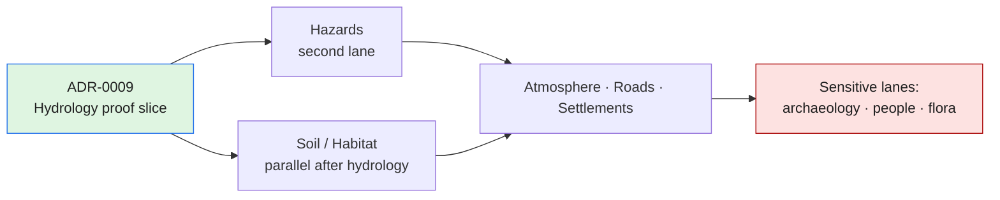
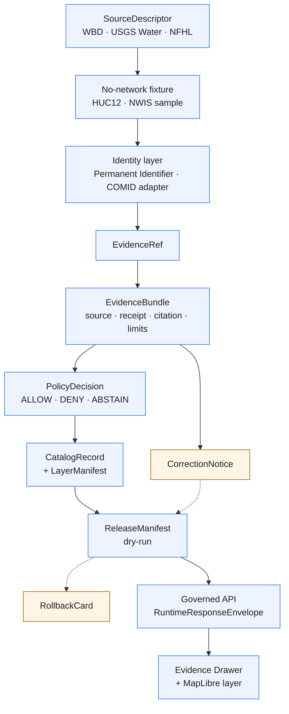

<!-- [KFM_META_BLOCK_V2]
doc_id: kfm://doc/adr-0009-hydrology-first-proof-bearing-lane
title: ADR-0009 — Hydrology Is the First Proof-Bearing Lane
type: standard
version: v1
status: draft
owners: TBD (Architecture steward + Hydrology lane steward)
created: 2026-05-09
updated: 2026-05-09
policy_label: public
related:
  - docs/doctrine/directory-rules.md
  - docs/adr/ADR-0001-schema-home.md
  - docs/adr/ADR-0003-evidencebundle-contract.md
  - docs/adr/ADR-0004-promotion-gate.md
  - docs/adr/ADR-0006-governed-ai-runtime-envelope.md
  - docs/adr/ADR-0007-domain-lane-template.md
  - docs/domains/hydrology/README.md
tags: [kfm, adr, hydrology, proof-lane, governance]
notes:
  - "ADR number 0009 NEEDS VERIFICATION against the active ADR register; the Pipeline Living Implementation Manual v0.3 lists a tentative ADR-0009 on local-exposure-security."
  - "All file paths cited inside this ADR are PROPOSED until confirmed against the mounted repo."
[/KFM_META_BLOCK_V2] -->

# ADR-0009 — Hydrology Is the First Proof-Bearing Lane

> **Decision in one line.** Kansas Frontier Matrix (KFM) commits to **hydrology** as the first end-to-end proof-bearing domain lane — the lane whose thin slice must traverse the full trust path from `SourceDescriptor` to a public-safe `RuntimeResponseEnvelope` before any other domain ships an equivalent slice.

<p>
  
  
  
  
  
  
</p>

**Quick jump:** [Status](#status) · [Context](#context) · [Decision](#decision) · [Consequences](#consequences) · [Alternatives](#alternatives-considered) · [Acceptance gates](#acceptance-gates) · [Risk ledger](#risk-ledger) · [Out of scope](#out-of-scope) · [Migration & rollback](#migration--rollback) · [Open questions](#open-questions)

---

## Status

| Field | Value |
|---|---|
| **ADR ID** | `ADR-0009` *(NEEDS VERIFICATION — see [Open questions](#open-questions))* |
| **Title** | Hydrology Is the First Proof-Bearing Lane |
| **Status** | `proposed` |
| **Date** | 2026-05-09 |
| **Deciders** | Architecture steward, Hydrology lane steward, Governance steward *(roster placeholders — TBD)* |
| **Supersedes** | None |
| **Superseded by** | — |
| **Authority class** | Decision record (§Directory-Rules 2.4 / 17). Immutable once accepted; supersession requires a successor ADR citing stronger evidence. |
| **Scope** | KFM monorepo `bartytime4life/Kansas-Frontier-Matrix` *(repository state PROPOSED until inspected this session)* |

> [!IMPORTANT]
> This ADR **records and codifies** a recurring doctrinal choice already present across the KFM corpus; it does **not** invent it. The intent is to lift "hydrology-first" from implicit doctrine into an inspectable decision with explicit acceptance gates, alternatives, and a rollback path.

---

## Context

KFM is a governed, evidence-first, map-first, time-aware spatial knowledge system. Before any domain claims maturity, **one** lane must demonstrate the entire trust path end-to-end:

```
SourceDescriptor → Fixture → Identity → EvidenceRef → EvidenceBundle
        → PolicyDecision → CatalogRecord/LayerManifest
        → ReleaseManifest (dry-run) → RuntimeResponseEnvelope (API)
        → Evidence Drawer (UI) → CorrectionNotice / RollbackCard
```

Choosing the **wrong** first lane is operationally expensive: if the lane is too sensitive, sensitivity controls dominate the proof and obscure trust-path mechanics; if it is too source-thin, evidence closure is shallow; if it is too symbolic (frontier panels, narrative geography), the proof becomes more about modelling choices than about admissible evidence. The first lane must therefore be **public-relevant, spatially rich, time-aware, and source-authority-heavy** without starting in the most sensitive domains.

### Forces

| Force | Implication for lane choice |
|---|---|
| **Trust-path completeness** | Lane must exercise SourceDescriptor → API/UI without skipping phases. |
| **Public-safe by default** | Lane must be releasable without per-feature steward review for the *first* slice. |
| **Source-authority depth** | Lane must rest on a recognized public authority with stable, citable artifacts. |
| **Spatiotemporal richness** | Lane must exercise CRS, geometry hashing, time-of-source vs time-of-release, freshness/stale-state. |
| **Evidence drill-through** | A user clicking a feature must reach citable evidence with non-trivial structure. |
| **Bounded sensitivity** | Lane must not require fail-closed denial as the *normal* posture. |
| **Fixture tractability** | At least one shape (e.g., a single HUC12 polygon) must be small enough to ship as a deterministic no-network fixture with valid + invalid examples. |
| **Renderability without becoming truth** | Lane must work inside the trust-membrane invariant: tiles are not proof; the API resolves evidence. |

### What the corpus already says

Multiple project sources converge on hydrology:

- The **Build Companion** treats hydrology as the first proof-bearing lane explicitly because it is *"public-relevant, spatially rich, time-aware, and source-authority-heavy without starting in the most sensitive domains,"* and lays out an acceptance-criteria table and risk ledger for a hydrology thin slice. *(Build Companion §20)*
- The **Hydrology Extended Pro Reference Report** records hydrology-first sequencing as the strongest repeated lane-sequencing rule and prescribes a HUC12/NHDPlus HR/USGS Water Data fixture wave with WBD and FEMA NFHL as supporting source families. *(Hydrology Extended Pro §6, §8)*
- The **Implementation Reference** identifies hydrology and ecology as the two safest first proof lanes, and notes hydrology is the more mature surface today. *(Implementation Reference, Executive Summary)*
- The **Domain & Capability Encyclopedia** describes a "first credible thin slice" for hydrology as *"Kansas HUC12 + one USGS gauge fixture + one NHDPlus identity crosswalk + NFHL contextual overlay + hydrograph panel + EvidenceBundle closure + ABSTAIN on ambiguous reach identity."* *(Encyclopedia §5)*
- The **Hazards** report explicitly positions itself as a *"high-value second lane after hydrology."* *(Hazards Blueprint §1.1)*

This ADR makes that consensus auditable.

---

## Decision

KFM **adopts hydrology as the first proof-bearing lane**. The first end-to-end thin slice covers, at minimum, **one public-safe HUC12/WBD layer** and **one USGS NWIS observation** stitched through an `EvidenceBundle` to a governed API/UI response. No other domain (soil, habitat/fauna, flora, hazards, archaeology, people/DNA/land, agriculture, atmosphere, geology, roads, settlements) ships an equivalent end-to-end thin slice **before** the hydrology slice meets the [acceptance gates](#acceptance-gates) below.

### What this decision is

- A **lane-sequencing rule**: hydrology before all other domain proof slices, regardless of subjective domain readiness.
- A **commitment to fixture-first, no-network proof**: live source connectors are deferred behind activation decisions until the fixture-based slice passes.
- A **commitment to source-role separation inside hydrology**: WBD/HUC, NHDPlus HR identity, USGS Water observations, FEMA NFHL regulatory flood context, and observed flood evidence are distinct source roles with distinct contracts and policies.

### What this decision is *not*

- It is **not** a claim that hydrology contracts, schemas, validators, fixtures, runbooks, or routes already exist in the active repo. *(All such paths are PROPOSED until inspected.)*
- It is **not** a license to bypass `ADR-0001-schema-home.md` or any other accepted ADR.
- It is **not** a permanent ranking of domains; it is the **sequencing** rule for the *first* proof slice.
- It is **not** a release authorization for any specific public layer; release still requires its own gates per `ADR-0004-promotion-gate.md`.

### Domain-lane order after hydrology

Subsequent lane order is **suggested**, not fixed by this ADR. Each lane's first slice is a separate decision recorded in its own lane README and (where structurally significant) its own ADR.



> [!NOTE]
> Sensitive lanes (archaeology, people/DNA/land, rare-species flora) follow the proof-lane discipline established by hydrology but apply additional fail-closed defaults. They are deliberately scheduled last for *first* slices, not for *all* slices.

---

## Consequences

### Positive

- **Trust spine first.** The first end-to-end slice exercises every governance object (`SourceDescriptor`, `EvidenceRef`, `EvidenceBundle`, `PolicyDecision`, `CatalogMatrix`, `LayerManifest`, `ReleaseManifest`, `RuntimeResponseEnvelope`, `CorrectionNotice`, `RollbackCard`) on a domain whose source authority is mature and public.
- **Fixture portability.** A pinned Kansas HUC12 polygon and a small USGS NWIS observation slice are tractable as no-network fixtures with both valid and invalid cases.
- **Source-role pedagogy.** Forcing the lane to distinguish WBD vs NHDPlus HR vs USGS Water vs FEMA NFHL vs observed-flood evidence trains the rest of the system on `source_role` discipline before easier lanes can paper it over.
- **Evidence Drawer realism.** Click-to-evidence on a hydrograph or HUC boundary produces non-trivial drawer payloads (citation, freshness, qualifier, approval/provisional state, limitations), better than a static summary panel.
- **Reusable harness.** The contracts, validators, and runbooks built for hydrology become the **template** other lanes (`ADR-0007-domain-lane-template`) instantiate.

### Negative / costs

- **Hydrology-specific complexity.** NHD legacy vs NHDPlus HR vs 3DHP terminology, COMID-vs-Permanent-Identifier crosswalks, and IV-vs-DV observation cadences add domain learning load to a slice whose primary purpose is governance proof.
- **Risk of regulatory-vs-observed flood confusion.** FEMA NFHL is a regulatory hazard product, not observed inundation; a careless first slice could entrench wrong terminology repo-wide. *(Mitigated below.)*
- **Source freshness exposure.** Live USGS Water Data endpoints can change; a first slice that depends on live behavior is brittle. *(Mitigated by no-network-first.)*
- **Domain stakeholders deferred.** Lanes whose stewards are ready (e.g., archaeology stewards with rich datasets) may feel their work is back-of-line. This is by design — sensitivity gates need the trust path proven first.

### Neutral

- The choice is **reversible** by a successor ADR that cites stronger evidence (for example, a credible argument for ecology or hazards as a better first lane). The reversal does not invalidate work already shipped under this ADR; it re-points subsequent lanes.

---

## Alternatives Considered

| Alternative | Why considered | Why not chosen |
|---|---|---|
| **Ecology / habitat first** | Implementation Reference flags ecology and hydrology as the two safest first proof lanes. Public-safe occurrence data is available. | GBIF / eBird / iNaturalist live connectors and sensitive-occurrence geoprivacy add gating that obscures pure trust-path mechanics on the first slice. *(Build Companion §19.1)* |
| **Soil first (SSURGO snapshot)** | Static, well-bounded, low-sensitivity. | Insufficient time-axis exercise; observation freshness and stale-state semantics are weaker than for streamflow. |
| **Frontier county-year panel first** | A more "Kansas-distinctive" demonstrator. | Combines several derived observation kinds and definitional disagreements (`FrontierDefinition`, `GeographyVersion`); too much modelling for a first proof lane. *(Implementation Reference)* |
| **Synthetic AI-only fixture (governed-AI thin slice)** | Useful for proving the AI envelope. | Doesn't exercise source authority, geometry, freshness, or release at domain depth. The Governed-AI Source-Ledger report itself uses a synthetic *hydrology* fixture for its slice. *(Governed AI §10)* |
| **Hazards first** | Public-relevant and source-rich. | Hazards combine warnings, declarations, regulatory zones, modelled derivatives, and life-safety implications; first-slice life-safety risk is too high. The Hazards Blueprint itself positions hazards as a *second* lane. *(Hazards Blueprint §1.1)* |
| **Archaeology / people-DNA / rare-flora first** | Stewards may have deep datasets. | Fail-closed sensitivity and DENY-by-default postures must dominate; trust-path mechanics get masked. Sensitive lanes ride the proof harness hydrology builds, not the other way around. *(Build Companion §8.3, §19.1)* |
| **No first lane; build all simultaneously** | Egalitarian. | Diffuses validation pressure; every lane reinvents fixtures, validators, source-role rules. Loses the template effect that justifies investment in `ADR-0007-domain-lane-template`. |

---

## Acceptance Gates

These gates **operationalize** the decision. The hydrology slice is "proven" only when **every applicable** row reaches the listed signal. Until then, this ADR remains `proposed`.

> Gates below are adapted from the Build Companion's hydrology acceptance table *(§20.2)*. Object names follow the canonical KFM trust vocabulary (see `directory-rules.md` §19 Glossary).

| Gate | Hydrology acceptance signal |
|---|---|
| **Source** | A WBD, USGS Water Data, and (where applicable) FEMA NFHL `SourceDescriptor` declares `source_role`, rights posture, freshness, and caveats. *PROPOSED home: `data/registry/hydrology/sources.yaml`.* |
| **Fixture** | A no-network HUC12 fixture and a no-network USGS observation fixture exist, each with valid and invalid examples. *PROPOSED home: `fixtures/domains/hydrology/`.* |
| **Identity** | HUC IDs, NHDPlus HR Permanent Identifiers (with COMID as compatibility key), and feature-geometry hashes are deterministic and carry CRS / precision assumptions. ABSTAIN on unresolved legacy identity (`split`, `merge`, `ambiguous`). |
| **Evidence** | `EvidenceRef` resolves to an `EvidenceBundle` containing source, retrieval receipt, dataset version, spatial/temporal support, citation text, and limitations. |
| **Policy** | Unknown `source_role`, stale source, and unresolved evidence each produce `DENY` or `ABSTAIN` fixtures with reason codes. |
| **Catalog** | `CatalogRecord` and `LayerManifest` point at a release candidate and a proof pack; STAC/DCAT/PROV closure validates. |
| **Release (dry-run)** | A `ReleaseManifest` and `RollbackCard` are produced **in dry-run** — no public publication. |
| **API** | A feature-explain endpoint returns a `RuntimeResponseEnvelope` whose outcome is `ANSWER` for valid fixtures and `ABSTAIN` / `DENY` for invalid ones. No raw / work / quarantine paths leak through the envelope. |
| **UI** | The Evidence Drawer renders `source_role`, release state, stale state, and limitations; tiles include public IDs only and the API resolves evidence. |
| **Correction** | A fixture correction supersedes the original without deleting prior lineage; a `CorrectionNotice` is produced. |

> [!TIP]
> Gates are **conjunctive** for promoting this ADR's status to `accepted`. A partial slice may still ship as an internal milestone; what it cannot do is unlock a second domain's first proof slice.

### Trust path (reference diagram)



---

## Risk Ledger

Adapted from the Build Companion's hydrology risk ledger *(§20.3)* and the Hydrology Extended Pro continuity matrix *(§7)*.

| Risk | Mitigation |
|---|---|
| Regulatory flood data (FEMA NFHL) mistaken for observed inundation. | Source-role registry distinguishes `regulatory_context` from `observed_event`; map layer naming uses `flood_context`, never `observed_flood`. |
| NHD legacy vs NHDPlus HR vs 3DHP terminology drift. | Schemas require an explicit `source_family` field; validators reject unspecified or mixed families. |
| COMID-vs-Permanent-Identifier crosswalk ambiguity. | Crosswalk relationship classes (`exact`, `split`, `merge`, `retired`, `no_legacy`, `ambiguous`, `unknown`); ABSTAIN on many-to-many. |
| Time of source vs retrieval vs release confused. | Time vocabulary fields enforced; Evidence Drawer surfaces `retrieved_at`, `valid_for`, `released_at`, and stale-state. |
| Tiles treated as proof. | Tile features carry public IDs only; the governed API resolves evidence. Public clients never read canonical stores. |
| Live endpoint instability collapses CI. | No-network fixture first; live connectors live behind activation decisions and lane-internal feature flags. |
| HUC12 `LoadDate` / `lastEditDate` mistaken for content-change proof. | Use normalized geometry/content fingerprints; metadata dates are signals, not authority. *(Hydrology Extended Pro §7)* |
| Hydrologic simulation treated as observation. | Simulation lane deferred as experimental until model cards, calibration, uncertainty, and tests exist. |

---

## Out of Scope

This ADR does **not** decide:

- Whether `schemas/contracts/v1/hydrology/` or `contracts/hydrology/` is the live machine-schema home. *Defer to `ADR-0001-schema-home.md`; default per `directory-rules.md` §7.4 is `schemas/contracts/v1/`.*
- The shape of any specific schema (`huc12.schema.json`, `hydro_observation.schema.json`, etc.). *Those are recorded in lane-internal schema PRs; this ADR records only the lane-sequencing decision.*
- Live source activation, source credentials, or rate-limit posture for USGS Water Data, WBD, or FEMA NFHL endpoints. *Activation is a separate governed decision per the source-onboarding runbook.*
- The boundary between the Hydrology lane and adjacent lanes (Soil moisture, Drought, Water quality, Wetlands, Terrain, Agriculture). *Adjacent-lane source-role rules are recorded in each adjacent lane's own ADR/README.*
- The MapLibre layer registry, Evidence Drawer DTO shape, or Focus Mode prompt contracts. *Recorded under `ADR-0005-maplibre-layer-manifest.md`, `ADR-0006-governed-ai-runtime-envelope.md`, and the Whole-UI Governed AI Expansion plan.*

---

## Migration & Rollback

### Migration

Because this ADR codifies a doctrinal choice already present across the corpus, no path moves are required by adoption alone. Adoption obligates the following downstream work, sequenced through ordinary PRs:

1. Per-lane README in `docs/domains/hydrology/README.md` cites this ADR in its meta block `related[]`.
2. The lane-template ADR (`ADR-0007-domain-lane-template`) inherits the gate vocabulary above.
3. Subsequent domain lanes (hazards, soil, habitat/fauna, …) each cite this ADR's sequencing rule in their first proof-slice plan.
4. Verification backlog (`docs/registers/VERIFICATION_BACKLOG.md`) opens entries for every gate row that cannot yet be verified against the mounted repo.

### Rollback

This ADR is reversible. Rollback consists of:

1. A successor ADR (`ADR-NNNN-...`) marked `status: accepted` whose Decision section explicitly **supersedes** ADR-0009 and cites the stronger evidence basis (e.g., a more credible first-lane candidate, or a structural reason to skip the hydrology slice).
2. This ADR's `status` field flips to `superseded` with a forward link to the successor; the body is **retained verbatim**.
3. Any in-flight hydrology PRs continue or terminate per the successor's transition section; no published artifacts are silently retracted — corrections follow `CorrectionNotice` discipline.

> [!CAUTION]
> Rollback **does not** retroactively change the trust posture of artifacts already published under hydrology gates. Public corrections, withdrawals, and supersessions remain visible and auditable per the lifecycle invariant.

---

## Open Questions

These items are explicitly **NEEDS VERIFICATION** and tracked in `docs/registers/VERIFICATION_BACKLOG.md`.

- **NEEDS VERIFICATION (ADR number):** The Pipeline Living Implementation Manual v0.3 lists a tentative `ADR-0009-local-exposure-security`. Confirm the active ADR register and either (a) renumber this ADR, (b) renumber the local-exposure ADR, or (c) confirm both numbers' assignments before merging.
- **NEEDS VERIFICATION (repo state):** Whether `docs/adr/`, `docs/domains/hydrology/`, `schemas/contracts/v1/hydrology/`, `policy/hydrology/`, `fixtures/domains/hydrology/`, and `data/registry/hydrology/` exist in the mounted repo at all, and at what entrenchment level.
- **NEEDS VERIFICATION (schema home):** Whether `schemas/contracts/v1/` or `contracts/` is the live schema authority. Defer to `ADR-0001-schema-home.md`.
- **NEEDS VERIFICATION (source authority versions):** Current USGS Water Data API version (legacy WaterServices vs OGC API), WBD MapServer endpoint stability, and FEMA NFHL distribution policy at the time of slice acceptance.
- **OPEN:** Whether the first slice covers **both** a HUC12 boundary fixture *and* a USGS observation fixture, or whether boundary-only is sufficient for `proposed → accepted` promotion of this ADR. Default position: both.
- **OPEN:** Whether terrain-derived hydrology (DEM conditioning, flow accumulation) belongs in the **first** slice or is deferred to a second hydrology release. Default position: deferred.
- **OPEN:** Steward roster for hydrology, separation-of-duties matrix, and reviewer escalation.

---

## References

Source basis from the attached KFM corpus *(corpus-internal references; PDF page numbers cited where the reasoning is concentrated)*:

- **Build Companion** — §20 *Hydrology as the first proof-bearing lane* (objective, acceptance criteria, risk ledger); §19.1 *Lane readiness matrix*; §8.3 *Source-role examples by domain*.
- **KFM Hydrology Extended Pro Reference Report (2026-04-21)** — §6 *Continuity inventory*; §7 *Preservation / supersession matrix*; §8 *Hydrology domain lane map*; file/folder register and PR-ready plan.
- **KFM Domain & Capability Encyclopedia (v0.1)** — §4 *Operating Law*; §5 *Master Domain Atlas* (hydrology row, "first credible thin slice").
- **Kansas Frontier Matrix Implementation Reference** — Executive Summary (hydrology / ecology as safest first proof lanes); Phase D thin-slice estimate.
- **Kansas Frontier Matrix Pipeline Living Implementation Manual v0.3** — §28 *Decision register / ADR index* (ADR-0001…ADR-0010 tentative slate; see Open questions).
- **KFM Hazards Architecture — Extended Pro Blueprint** — §1.1 (positions hazards as the *second* lane after hydrology).
- **KFM Governed AI Extended Pro Source Ledger Architecture Report** — §10 *Thin-slice-first plan* (hydrology used as synthetic-fixture choice).
- **Directory Rules** — §2.4 *Changes that require an ADR*; §17 *Document Change Discipline*; §19 *Glossary*.

[Back to top](#adr-0009--hydrology-is-the-first-proof-bearing-lane)
