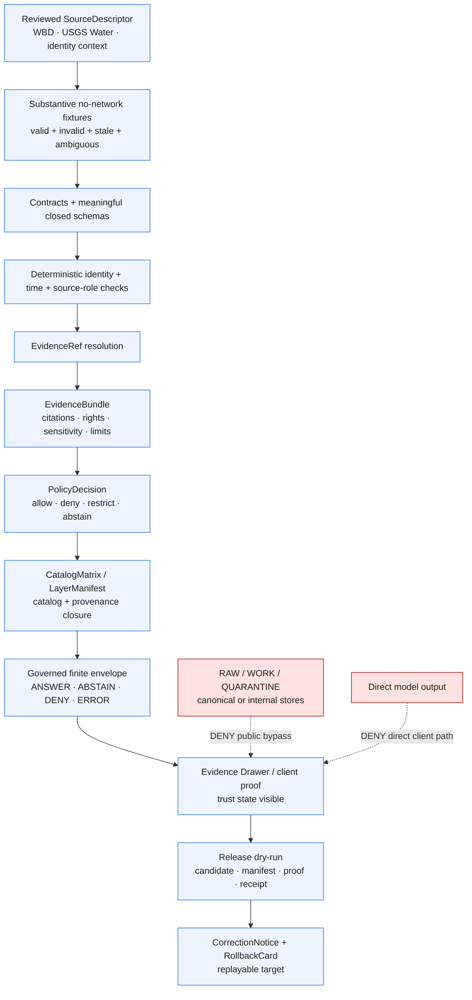

<!-- [KFM_META_BLOCK_V2]
doc_id: kfm://doc/adr-0009-hydrology-first-proof-bearing-lane
title: "ADR-0009 — Hydrology Is the First Proof-Bearing Lane"
type: adr
adr_id: ADR-0009
version: v1.4
status: draft
effective_decision_status: proposed
owners:
  - "OWNER_TBD — architecture decision owner"
  - "OWNER_TBD — Hydrology lane steward"
  - "OWNER_TBD — governance and release steward"
owner_status: "CODEOWNERS routes docs/adr/ and the affected trust-bearing roots to @bartytime4life; accepted stewardship assignments, decision quorum, independent review, and proof-graduation authority remain unverified"
reviewers_required:
  - Architecture steward
  - Docs steward
  - Hydrology lane steward
  - Source and evidence steward
  - Contract and schema steward
  - Policy reviewer
  - Governed API and Explorer Web maintainers
  - Release and rollback steward
  - "at least one affected downstream domain-lane owner"
created: 2026-05-09
updated: 2026-08-14
policy_label: public
truth_posture: cite-or-abstain
responsibility_root: docs/
owning_root: docs/
responsibility: "Records the proposed cross-domain sequencing rule and conjunctive graduation criteria for Hydrology as KFM's first proof-bearing lane without granting acceptance, release, deployment, publication, or public-use authority."
current_path: docs/adr/ADR-0009-hydrology-is-the-first-proof-bearing-lane.md
supersedes: []
superseded_by: []
evidence_snapshot:
  repository: bartytime4life/Kansas-Frontier-Matrix
  base_ref: main
  base_commit: f5e082d423f1dbb0753f970a662de4f818c77529
  target_prior_blob: 6a78c7a3c2156fea427e816f9c8a56891cf1b8cf
  adr_index_blob: 938c5894c36b99e14810918e2c550ab0e92d53b1
  adr_readme_blob: 793015c38f4066c2c23753d4e3dd26bcc890279d
  adr_0029_blob: a4de0d7a96b78da59cfc499d1025e1508afd8dd9
  directory_rules_blob: fd49a0b83e55cef52c1124281f093e263526898d
  domain_hydrology_workflow_blob: 36a0287be04639cb75dc77ae2c274fee626f6a00
  hydrology_proof_workflow_blob: 1cef10372c72a5ed3cedf4446117cae8ea9f5fd4
  domain_hydrology_run: 31812628090
  domain_hydrology_validate_job: 94806657468
  domain_hydrology_proof_job: 94806657605
  domain_hydrology_release_dry_run_job: 94806657858
  huc_unit_schema_blob: 321c69f4686bfb7ecbb2a8f44a228405cdbcf9ce
  flow_observation_schema_blob: 9651530dc095f5dd075d6302c1623b6c5813ed5c
  huc12_placeholder_fixture_blob: 18ce8f53f4c5a614bb78e89d4caf931b2b0112bf
  proof_slice_e2e_placeholder_blob: 9fdd40a8f5d1487ba62868764d902ee25352bc7e
  public_safe_flow_fixture_blob: 446abf31ae4331a598521870c57f1163bb2e58c4
  public_safe_flow_validator_blob: 4d657523c8a69ce3728f781c4111190f80f510c7
  aquifer_observation_schema_blob: 69909894f3c779cdf6d64b17aea39c66355f6d13
  nhdplus_waterbody_crosswalk_schema_blob: ed32dbb42152decd19aaac76ae16504d8397fa99
related:
  - docs/adr/README.md
  - docs/adr/INDEX.md
  - docs/adr/ADR-0001-schema-home--schemas-contracts-v1-is-canonical.md
  - docs/adr/ADR-0002-contracts-vs-schemas-split.md
  - docs/adr/ADR-0004-apps-governed-api-is-the-trust-membrane.md
  - docs/adr/ADR-0011-receipts-vs-proofs-vs-manifests-vs-catalog-separation.md
  - docs/adr/ADR-0017-source-descriptor-admission-process.md
  - docs/adr/ADR-0018-promotion-gate-sequence.md
  - docs/adr/ADR-0019-ai-adapter-contract-and-finite-envelopes.md
  - docs/adr/ADR-0020-abstain-is-a-first-class-decision.md
  - docs/adr/ADR-0022-catalog-matrix--stac-+-dcat-+-prov-must-agree.md
  - docs/adr/ADR-0024-steward-separation-of-duties-for-release.md
  - docs/adr/ADR-0025-public-client-never-reads-canonical-internal-stores.md
  - docs/adr/ADR-0026-hydrology-source-spine-starts-with-wbd-huc12.md
  - docs/adr/ADR-0029-adopt-directory-governance-standard-v2.md
  - docs/doctrine/directory-rules.md
  - docs/domains/hydrology/README.md
  - docs/domains/hydrology/THIN_SLICE.md
  - contracts/domains/hydrology/huc_unit.md
  - contracts/domains/hydrology/nhdplus_waterbody_crosswalk.md
  - schemas/contracts/v1/domains/hydrology/huc_unit.schema.json
  - schemas/contracts/v1/domains/hydrology/flow_observation.schema.json
  - schemas/contracts/v1/domains/hydrology/aquifer_observation.schema.json
  - schemas/contracts/v1/domains/hydrology/nhdplus_waterbody_crosswalk.schema.json
  - fixtures/domains/hydrology/valid/huc12_kansas_sample.json
  - fixtures/domains/hydrology/public_safe_flow/valid/public_safe_flow.json
  - data/registry/sources/hydrology/wbd.source.yaml
  - .github/workflows/domain-hydrology.yml
  - .github/workflows/hydrology-proof-slice.yml
  - release/candidates/hydrology/README.md
tags: [kfm, adr, hydrology, proof-bearing-lane, proof-slice, evidence-closure, catalog-closure, finite-outcomes, release-dry-run, rollback, fail-closed]
notes:
  - "v1.4 is a same-path documentation-only repository reconciliation. It preserves source metadata `draft` and effective decision status `proposed`; it does not accept ADR-0009 or declare Hydrology proof-bearing."
  - "ADR-0029 separately accepted the exact pinned Directory Rules v2 bytes. That placement authority confirms this ADR's owning root but does not accept this decision or authorize Hydrology graduation."
  - "The exact-head domain-hydrology run 31812628090 passed bounded no-network fixture/profile checks while its proof and release-dry-run jobs explicitly retained governed holds. A green bounded run is not proof-bearing maturity."
  - "Hydrology now has substantive bounded validation for selected synthetic profiles, but core HUC and FlowObservation schemas, anchor fixtures, source descriptors, broader pipeline producers, semantic evidence resolution, catalog closure, release closure, and public operation remain held, placeholder, or unverified."
  - "ADR-0026 remains a separate proposed lane-internal source-spine decision. This ADR does not accept it or convert WBD/HUC12 planning into an admitted source."
[/KFM_META_BLOCK_V2] -->

<a id="top"></a>

# ADR-0009 — Hydrology Is the First Proof-Bearing Lane

> **Proposed decision.** KFM designates Hydrology as the first domain lane that may graduate to **proof-bearing** status. Graduation requires one real, reproducible, no-network end-to-end slice that closes source identity, meaningful contracts and schemas, substantive deterministic fixtures, EvidenceRef-to-EvidenceBundle resolution, policy, finite runtime outcomes, catalog agreement, release dry-run, correction, replay, and rollback. Bounded component tests are necessary progress; they do not satisfy the conjunctive graduation burden by themselves.

[](#status)
[](#governing-placement-authority)
[](#bounded-executable-progress)
[](#current-gate-status)
[](#current-gate-status)
[](#authority-and-publication-boundary)

> [!IMPORTANT]
> **ADR identity, placement authority, and implementation maturity are separate facts.** The canonical ADR index uniquely assigns `ADR-0009` to this file and records it as source status `draft`, effective status `proposed`. ADR-0029 separately accepted Directory Rules v2 and confirms `docs/adr/` as the correct human decision-record lane. Neither fact accepts this proposed decision or grants proof-bearing graduation.

> [!CAUTION]
> **Hydrology is no longer only a broad scaffold, but it is not a proof-bearing lane.** Current `main` contains substantive bounded validators and polarized synthetic fixtures for selected profiles. The same exact-head workflow explicitly reports that broader Hydrology semantics, EvidenceRef resolution, proof, catalog, and release remain unestablished. Core HUC and legacy FlowObservation schemas, anchor fixtures, source descriptors, and proof production remain placeholder or held surfaces.

> [!WARNING]
> **Do not execute placeholder approval as governance.** The existing Hydrology promotion stub can emit a synthetic `"APPROVE"` record. Current proof orchestration deliberately avoids executing it. Graduation requires fail-closed decisions derived from reviewed evidence and policy—not hard-coded approval, file naming, a green readiness job, or a generated receipt.

**Quick navigation:** [Status](#status) · [Evidence](#evidence-boundary) · [Context](#context) · [Decision](#decision) · [Architecture](#proof-bearing-trust-path) · [Current gates](#current-gate-status) · [Consequences](#consequences) · [Alternatives](#alternatives-considered) · [Acceptance](#acceptance-gates) · [Risks](#risk-ledger) · [Migration](#migration--rollback) · [Open work](#open-questions) · [Verification](#verification-checklist) · [References](#references) · [No-loss ledger](#appendix-a--no-loss-modernization-ledger)

---

<a id="status"></a>

## Status

| Field | Current value |
|---|---|
| **ADR ID** | `ADR-0009` — unique and confirmed in the canonical [`INDEX.md`](./INDEX.md) |
| **Tracked path** | `docs/adr/ADR-0009-hydrology-is-the-first-proof-bearing-lane.md` |
| **Source metadata** | `draft` |
| **Effective decision status** | `proposed` — not binding until the record and index carry matching reviewed `accepted` status |
| **Decision class** | Cross-domain first-proof sequencing plus Hydrology proof-graduation criteria |
| **Governing placement authority** | ADR-0029 is accepted separately and adopts the exact pinned Directory Rules v2 bytes; it establishes placement law, not this architectural decision |
| **Configured lane posture** | Broad surface across docs, contracts, schemas, fixtures, source registry, pipelines, validators, tests, policy, release candidates, and CI |
| **Current implementation posture** | Mixed: selected fixture-only profiles have substantive executable validation; shared source, semantic evidence, catalog, proof, release, correction, rollback, and public-operation closure remain held or unverified |
| **Exact evidence checkpoint** | `main@f5e082d423f1dbb0753f970a662de4f818c77529`; domain-hydrology run `31812628090` |
| **Publication effect** | None. This ADR, a schema pass, workflow result, commit, pull request, merge, dry-run, or deployment is not KFM publication evidence |
| **Supersedes / superseded by** | None / none |

### Governance acceptance versus proof graduation

This ADR deliberately separates two states:

1. **ADR acceptance** approves the architectural sequencing rule: Hydrology is the first lane expected to graduate through the shared proof-bearing trust path.
2. **Proof-bearing graduation** is an implementation claim requiring the complete evidence packet in [Acceptance Gates](#acceptance-gates).

Accepting this ADR would not declare Hydrology proof-bearing. Conversely, a workflow, script, receipt, pull request, or deployed component cannot grant architectural acceptance.

<a id="governing-placement-authority"></a>

### Governing placement authority

ADR-0029 is the only accepted numbered ADR in the current index. It adopted the exact pinned Directory Rules v2 bytes at `docs/doctrine/directory-rules.md`, making `docs/` the responsibility root for human governance documents and `docs/adr/` the established ADR lane. The Directory Rules file retains its internal historical `PROPOSED_FOR_ADOPTION` label because ADR-0029 adopted exact bytes; the accepted ADR supplies the adoption effect.

That accepted placement decision:

- confirms this same-path update belongs under `docs/adr/`;
- requires current repository evidence and accepted authority to be distinguished;
- prevents this documentation change from creating schema, policy, data, proof, release, or runtime authority;
- does not accept ADR-0009, ADR-0026, or any other proposed decision.

### Resolved numbering lineage

The canonical index now contains a complete unique numbered sequence from `ADR-0001` through `ADR-0034`. It assigns `ADR-0009` only to this file. ADR-0029 is accepted; ADR-0009 and the other 32 non-0029 records remain proposed. The older possible number-collision concern remains resolved lineage, not an active blocker.

[Back to top](#top)

---

<a id="evidence-boundary"></a>

## Evidence Boundary

This ADR distinguishes **configured surface**, **bounded executable validation**, **shared semantic closure**, **proof-bearing execution**, and **release/public operation**. Evidence at an earlier level does not imply a later level.

### Maturity ladder

| Level | Meaning | Current Hydrology posture |
|---|---|---|
| **1. Configured** | Paths, READMEs, contracts, schemas, fixtures, tests, validators, or workflows exist | **CONFIRMED** across a broad surface |
| **2. Bounded executable validation** | Specific closed or frozen profiles reject expected-invalid fixtures through no-network executable checks | **PARTIAL BUT MATERIAL**; selected EvidenceBundle, aquifer, public-safe flow, NHDPlus crosswalk, adaptive-threshold, identity-bridge, and streamflow-QC profiles are checked |
| **3. Shared semantic closure** | Source admission, identity, EvidenceRef resolution, policy, catalog, release, and correction relationships are executed together | **HELD** |
| **4. Proof-bearing** | One deterministic no-network command emits the required validated artifacts, finite outcomes, receipts, proof support, and rollback targets | **HELD** |
| **5. Released / operated** | Governed release, public-safe serving, observability, correction, rollback, and incident evidence exist | **UNKNOWN / not asserted** |

### Current repository evidence

The findings below are **CONFIRMED at `main@f5e082d423f1dbb0753f970a662de4f818c77529`** unless marked otherwise.

| Surface | Verified state | What it proves—and does not prove |
|---|---|---|
| [`docs/adr/INDEX.md`](./INDEX.md) | 34 unique numbered records; ADR-0009 is source `draft`, effective `proposed`; ADR-0029 is the sole accepted record | Proves identity and current governance status; does not accept this decision or Hydrology maturity |
| [`docs/adr/README.md`](./README.md) | ADR files and index status must remain coherent; file presence and green checks cannot grant acceptance | Proves ADR lifecycle rules; not Hydrology implementation |
| [`ADR-0029`](./ADR-0029-adopt-directory-governance-standard-v2.md) and [Directory Rules](../doctrine/directory-rules.md) | ADR-0029 accepted exact Directory Rules v2 bytes and the `docs/` authority boundary | Proves placement authority; does not accept Hydrology sequencing or proof graduation |
| [`docs/domains/hydrology/README.md`](../domains/hydrology/README.md) and [`THIN_SLICE.md`](../domains/hydrology/THIN_SLICE.md) | Human-facing lane model and no-network proof plan exist | Proves doctrine and planning; not a complete executable proof |
| [`ADR-0026`](./ADR-0026-hydrology-source-spine-starts-with-wbd-huc12.md) | Separate proposed decision selects WBD HUC12 as a lane-internal source-spine head | Does not accept that order or admit WBD |
| [`domain-hydrology.yml`](../../.github/workflows/domain-hydrology.yml) | Read-only workflow executes selected no-network fixture/profile checks and retains broader holds | Proves bounded validation orchestration, not evidence, proof, release, or publication closure |
| Exact-head run `31812628090` | `validate-hydrology`, `build-proof-hydrology`, and `publish-dry-run-hydrology` all concluded successfully | The validation job executed bounded checks; the proof and release jobs successfully recorded governed holds rather than producing proof or release artifacts |
| Validation job `94806657468` | 82 pytest tests and 8 subtests passed; separate public-safe-flow and cross-domain suites passed 10 and 3 tests; expected-invalid fixtures were rejected | Proves tested polarity and bounded local behavior for the invoked profiles; not source admission, EvidenceRef resolution, policy enforcement, or release |
| Hydrology EvidenceBundle alias/common schema and fixtures | Valid fixture passes and known-invalid fixture fails | Proves candidate JSON shape only; not semantic evidence resolution or citation closure |
| AquiferObservation / AquiferContextLink pair | Closed proposed shapes and polarized fixtures preserve measurement-versus-geology ownership | Proves bounded domain-seam shape constraints; not actual aquifer membership, source truth, or public release |
| [`public_safe_flow.json`](../../fixtures/domains/hydrology/public_safe_flow/valid/public_safe_flow.json) and its validator | Frozen synthetic `FlowObservation` profile enforces generalized county support, time ordering, measurement bounds, fixture-only governance, and explicit non-life-safety limitations | Proves one synthetic public-safe fixture profile; not live USGS data, source admission, evidence resolution, or a canonical FlowObservation contract |
| NHDPlus waterbody crosswalk profile | Closed fixture-only profile preserves exact/split/merge/complex cardinality; non-exact lookups abstain; invalid hash/geometry/scope cases fail | Proves a bounded synthetic waterbody crosswalk profile; not a complete NHDPlus/3DHP/HUC identity service |
| Adaptive-threshold proposal | Finite `KEEP_BASELINE`, `REVIEW_RECALIBRATION`, `HOLD`, and `ERROR` outcomes are checked without computing or mutating thresholds | Proves review-routing constraints; not drought calculation or detector configuration authority |
| HydroIdentityBridge | Exact one-to-one bridge can answer with JoinReceipt support; split/merge/retired/no-legacy/unresolved cases abstain; legacy relabeling is denied | Proves bounded source-native identity behavior; not source activation, geometry comparison, evidence closure, or publication |
| Streamflow QC context assessment | Fixture-only categorical review routing is tested | Proves no event, measurement, policy, or release authority |
| [`huc_unit.schema.json`](../../schemas/contracts/v1/domains/hydrology/huc_unit.schema.json) and legacy [`flow_observation.schema.json`](../../schemas/contracts/v1/domains/hydrology/flow_observation.schema.json) | Both remain permissive scaffolds with empty `properties` and `additionalProperties: true` | They do not enforce proposed semantic contracts and cannot close the core machine-shape gate |
| [`huc12_kansas_sample.json`](../../fixtures/domains/hydrology/valid/huc12_kansas_sample.json) | Still contains only placeholder status/path/notes | Filename and JSON parseability do not establish a substantive watershed fixture |
| WBD/NWIS descriptors and WBD pipeline specs | Workflow verifies they remain explicit `PROPOSED` placeholder material | No source role, terms, citation, cadence, activation, or producer closure is established |
| [`test_hydrology_proof_slice.py`](../../tests/e2e/test_hydrology_proof_slice.py) | Still an exact `assert True` greenfield placeholder | Does not exercise the proof path |
| [`hydrology-proof-slice.yml`](../../.github/workflows/hydrology-proof-slice.yml) | Explicit readiness gate states no accepted proof producer, EvidenceBundle-closure command, or CatalogMatrix implementation exists | A passing job proves the hold remains intact, not that the lane is proof-bearing |
| [`release/candidates/hydrology/README.md`](../../release/candidates/hydrology/README.md) | Pre-publication candidate-review boundary exists | No populated candidate dossier, release decision, correction packet, rollback packet, or publication is asserted |

<a id="bounded-executable-progress"></a>

### Bounded executable progress

The current exact-head validation run materially advances the July evidence snapshot. It demonstrates that Hydrology has crossed from “only shape scaffolding” into a mixed state with several substantive, no-network, fixture-only profiles.

The safe conclusion is narrow:

```text
selected synthetic profile + validator + positive/negative fixture + bounded test
  = CONFIRMED local validation evidence

selected bounded profile evidence
  != source admission
  != EvidenceRef resolution
  != EvidenceBundle semantic closure
  != policy enforcement
  != proof production
  != release dry-run closure
  != publication
```

### Evidence conclusion

- **CONFIRMED:** Hydrology is the repository's most explicit first-proof candidate and now contains meaningful bounded executable components.
- **CONFIRMED:** Exact-head CI deliberately prevents those components from masquerading as complete proof or release.
- **PROPOSED:** Hydrology should remain the first lane to close the shared end-to-end proof-bearing path.
- **HELD:** Shared source admission, semantic evidence closure, CatalogMatrix closure, proof production, release/correction/rollback closure, and public operation.
- **UNKNOWN:** Deployed Hydrology services, production authorization, dashboards, audit sinks, performance, and incident behavior.

[Back to top](#top)

---

<a id="context"></a>

## Context

KFM needs one domain lane to establish a reusable, inspectable proof pattern before domain teams independently invent incompatible meanings of “done.” Hydrology remains the strongest candidate because it combines:

- public-safe watershed context;
- deterministic spatial identity and crosswalk pressure;
- observed time-series semantics;
- source-role separation among boundary, network, observation, regulatory context, terrain derivative, model output, and event evidence;
- stale-state and correction pressure;
- map, API, Evidence Drawer, and finite-outcome requirements;
- enough complexity to exercise governance without making the most sensitive domains the first test.

### Why current repository evidence strengthens—not closes—the decision

The repository has moved beyond a pure directory scaffold. It now proves selected domain-boundary, fixture-polarity, public-safe-shape, crosswalk, identity, and review-routing behaviors. The unresolved problem is still the same end-to-end one:

```text
reviewed source identity
  -> substantive no-network anchor fixtures
  -> meaningful contract + schema validation
  -> deterministic identity and temporal semantics
  -> EvidenceRef resolution
  -> admissible EvidenceBundle + citation result
  -> PolicyDecision
  -> CatalogMatrix / provenance closure
  -> finite governed API envelope
  -> trust-visible client state
  -> release dry-run + correction + rollback
```

The bounded executable profiles are reusable inputs to that path. They are not a substitute for assembling and proving the path.

### What “proof-bearing” means

A Hydrology slice is proof-bearing only when a clean checkout can run one documented, deterministic, no-network command that:

1. consumes reviewed source descriptors and substantive fixtures;
2. validates meaningful semantic and machine contracts;
3. preserves source role, identity, space, time, rights, sensitivity, freshness, and citation support;
4. resolves every consequential `EvidenceRef` to an admissible `EvidenceBundle` or a finite negative outcome;
5. applies policy without permissive or hard-coded approval fallback;
6. emits catalog, receipt, proof-support, release-candidate, correction, and rollback records appropriate to the slice;
7. exercises the governed API/client contract with `ANSWER`, `ABSTAIN`, `DENY`, and `ERROR`;
8. leaves no public path to RAW, WORK, QUARANTINE, canonical/internal stores, or direct model output;
9. can be replayed and rolled back against an explicit prior target.

### What does not count

The following are useful milestones but are **not** proof-bearing graduation:

- a README, ADR, diagram, plan, path inventory, or schema index;
- a schema that accepts arbitrary objects;
- a file named `valid`, `golden`, `proof`, `release`, or `rollback`;
- a placeholder fixture containing only status/path/notes;
- an `assert True` test;
- a TODO Make target;
- a hard-coded `APPROVE` record;
- a green workflow that explicitly records `WORKFLOW_HOLD`;
- a bounded fixture/profile test that is not integrated into the full trust path;
- a pull request, merge, tag, generated receipt, or deployment without proof closure;
- a map render, tile, popup, screenshot, catalog row, or model response by itself.

### Forces

| Force | Implication |
|---|---|
| **Trust-path completeness** | The first lane must exercise source, evidence, policy, catalog, release, API, UI, correction, and rollback—not only schema or fixture validation |
| **Public-safe default** | The first slice should avoid making exact sensitive location, living-person, DNA, archaeology, sovereignty, or critical-infrastructure denial the normal happy path |
| **Source-role depth** | Boundary context, observed measurements, network identity, regulatory flood context, terrain derivatives, modeled output, and event evidence must remain distinguishable |
| **Spatiotemporal richness** | CRS, geometry identity, observed/valid/source/retrieval/release/correction time, freshness, and stale behavior must be visible |
| **Fixture tractability** | The complete proof must run without live endpoints, credentials, mutable services, or production data |
| **Negative proof** | Ambiguous identity, missing evidence, unknown rights, stale state, role collapse, and internal-path leakage must fail closed |
| **Reusability** | Later lanes should inherit a tested packet rather than copy Hydrology-specific paths or vocabulary blindly |
| **Reversibility** | Every emitted candidate and release dry-run must identify correction and rollback targets |
| **Evidence proportionality** | A passing bounded test may support only the bounded claim that it actually checks |

[Back to top](#top)

---

<a id="decision"></a>

## Decision

### Cross-domain sequencing rule

**Upon reviewed acceptance, Hydrology is the first KFM domain lane designated to pursue and claim proof-bearing graduation.** Other lanes may continue research, source review, documentation, contracts, schemas, fixtures, validators, bounded tests, and non-equivalent implementation in parallel. They must not claim that KFM's first shared domain proof path is complete, or use placeholder or bounded-profile parity as a substitute, before Hydrology closes the graduation gates below or a successor ADR changes the sequencing.

This decision concerns **first proof-bearing graduation**. It does not establish permanent priority, funding order, domain importance, or a freeze on parallel work.

### Minimum proof packet

| Element | Minimum burden |
|---|---|
| **Public-safe watershed anchor** | One substantive Kansas WBD/HUC12 fixture with source identity, snapshot/vintage, CRS, geometry fingerprint, scope, citation, limitations, and expected negative cases |
| **Observed-water fixture** | One substantive no-network USGS Water/NWIS-style observation fixture with site, parameter, unit, observed time, retrieval/source time, qualifier/provisional state, and no-data/stale negative cases |
| **Hydrologic identity case** | One NHDPlus HR/Permanent Identifier or equivalent crosswalk fixture with exact/split/merge/retired/ambiguous/unknown behavior and `ABSTAIN` on unresolved identity |
| **Regulatory context, if present** | FEMA NFHL remains `regulatory_context` / `flood_context`, never observed inundation, forecast, warning, or emergency evidence |
| **Evidence closure** | Consequential feature and observation claims resolve `EvidenceRef` to an admissible `EvidenceBundle` with source, citation, scope, limitations, rights, sensitivity, checksums, freshness, and correction state |
| **Finite response** | Governed route or equivalent adapter returns `ANSWER`, `ABSTAIN`, `DENY`, and `ERROR` from deterministic fixtures |
| **Catalog closure** | CatalogMatrix or equivalent proves selected STAC/DCAT/PROV agreement where those profiles apply, with no permissive placeholder gate |
| **Release dry-run** | Candidate, manifest, decision, proof/receipt references, correction notice, and rollback target are emitted without public publication |
| **Trust-visible client proof** | Evidence Drawer or equivalent fixture/component path renders evidence, source role, freshness, policy/release state, limitations, correction, and rollback without treating tiles or feature properties as evidence |
| **Replay and rollback** | One command reproduces the packet and a dry-run rollback restores the prior designated state with a receipt |

Current bounded profiles may be reused where they fit this packet. They do not narrow the packet's shared closure requirements.

### Relationship to ADR-0026

[`ADR-0026`](./ADR-0026-hydrology-source-spine-starts-with-wbd-huc12.md) is a separate **proposed** lane-internal decision. This ADR retains WBD/HUC12 in the minimum packet because it is public-safe, spatially tractable, and present throughout Hydrology planning. It does **not** accept ADR-0026, activate WBD, settle source-registry naming, or prevent a reviewed successor from changing lane-internal order.

<a id="authority-and-publication-boundary"></a>

### Authority and publication boundary

| Concern | Owning authority | Hydrology proof-slice relationship |
|---|---|---|
| Source identity, role, terms, cadence | `data/registry/sources/hydrology/` plus source contracts and policy | Consume reviewed descriptors; never infer authority from a URL or fixture filename |
| Semantic meaning | `contracts/` | Use reviewed object meaning; do not redefine it in pipelines or UI |
| Machine shape | `schemas/contracts/v1/` | Validate meaningful closed or profiled shapes; permissive scaffolds are not graduation evidence |
| Admissibility | `policy/` | Apply rights, sensitivity, source-role, freshness, access, and release rules fail closed |
| Lifecycle material | `data/<phase>/hydrology/` | Preserve RAW -> WORK / QUARANTINE -> PROCESSED -> CATALOG / TRIPLETS -> PUBLISHED |
| Receipts and proofs | `data/receipts/` and `data/proofs/` | Emit distinct process memory and proof support; neither substitutes for release |
| Release decisions | `release/` | Produce dry-run candidate/manifest/decision/correction/rollback packet; no public publication required |
| Public dynamic response | `apps/governed-api/` | Return finite validated envelopes; no direct canonical/internal-store or model path |
| Browser composition | `apps/explorer-web/` | Render governed results and released artifacts; feature properties and pixels remain candidates |
| Renderer | Accepted shared renderer boundary when applicable | Draw released artifacts only; never decide evidence, policy, or publication |

<a id="proof-bearing-trust-path"></a>

### Proof-bearing trust path


```mermaid
flowchart TB
    SD["Reviewed SourceDescriptor<br/>WBD · USGS Water · identity context"]
    FX["Substantive no-network fixtures<br/>valid + invalid + stale + ambiguous"]
    CS["Contracts + meaningful closed schemas"]
    ID["Deterministic identity + time + source-role checks"]
    ER["EvidenceRef resolution"]
    EB["EvidenceBundle<br/>citations · rights · sensitivity · limits"]
    PD["PolicyDecision<br/>allow · deny · restrict · abstain"]
    CM["CatalogMatrix / LayerManifest<br/>catalog + provenance closure"]
    API["Governed finite envelope<br/>ANSWER · ABSTAIN · DENY · ERROR"]
    UI["Evidence Drawer / client proof<br/>trust state visible"]
    REL["Release dry-run<br/>candidate · manifest · proof · receipt"]
    CR["CorrectionNotice + RollbackCard<br/>replayable target"]

    SD --> FX --> CS --> ID --> ER --> EB --> PD --> CM --> API --> UI --> REL --> CR

    RAW["RAW / WORK / QUARANTINE<br/>canonical or internal stores"]
    MODEL["Direct model output"]
    RAW -. "DENY public bypass" .-> UI
    MODEL -. "DENY direct client path" .-> UI

    classDef gate fill:#eef4ff,stroke:#1f6feb,color:#1f1f1f
    classDef deny fill:#fde2e1,stroke:#a80000,color:#1f1f1f
    class SD,FX,CS,ID,ER,EB,PD,CM,API,UI,REL,CR gate
    class RAW,MODEL deny
```

### Decision guardrails

- **Fixture first.** Live source access is outside graduation until the no-network proof is real.
- **No generated truth.** AI or summary text may interpret only resolved, policy-safe evidence.
- **No permissive graduation.** Empty schemas, arbitrary `additionalProperties`, missing invalid fixtures, and shape-only checks cannot close semantic gates.
- **No bounded-proof inflation.** A local profile pass supports only its documented profile and non-effects.
- **No fake approval.** The promotion stub must not be used as an approval mechanism.
- **No catalog-before-proof.** Discoverability does not establish EvidenceBundle or release closure.
- **No UI shortcut.** Popups, tile attributes, screenshots, and feature properties do not substitute for evidence resolution.
- **No life-safety authority.** Hydrology and flood surfaces remain contextual; users follow authoritative operational sources for warnings and action.
- **No parallel authority.** Path drift is recorded and migrated through accepted governance or reviewed migration—not multiplied.
- **No automatic downstream unlock.** Later lanes adopt the reusable packet only after their own source-role, sensitivity, identity, policy, and release review.

[Back to top](#top)

---

<a id="current-gate-status"></a>

## Current Gate Status

This table reports the inspected repository, not the desired future.

| Gate area | Current status | Evidence | What closes it |
|---|---|---|---|
| **ADR identity and path** | **CONFIRMED** | Canonical index uniquely assigns ADR-0009 to this file | Identity is closed; decision acceptance remains separate |
| **Directory placement authority** | **CONFIRMED / ACCEPTED SEPARATELY** | ADR-0029 adopted exact Directory Rules v2 bytes | No further placement decision is required for this same-path ADR edit |
| **Decision review and ownership** | **OPEN / NEEDS VERIFICATION** | Source status remains `draft`; owner roles remain unresolved | Named decision owners, review quorum, reviewed rationale, synchronized ADR/index transition |
| **Hydrology documentation** | **PARTIAL** | Extensive lane, boundary, thin-slice, source-role, API, release, and runbook docs exist | Reconcile stale claims and bind docs to executable evidence |
| **Bounded Hydrology validation** | **CONFIRMED PASS** | Exact-head run 31812628090 and job 94806657468 execute selected no-network profiles and negative fixtures | Preserve as bounded evidence; expand only through reviewed profile-specific changes |
| **Core semantic contracts** | **PARTIAL** | Detailed contracts coexist with unresolved ownership/version/profile relationships | Accepted ownership/versioning plus one-to-one schema/fixture/test linkage |
| **Core HUC and legacy FlowObservation schemas** | **HELD** | Empty `properties`, permissive `additionalProperties: true` | Meaningful fields, closed/profiled shapes, invalid fixtures, validator tests |
| **Source descriptors** | **HELD** | WBD/NWIS files remain explicit PROPOSED placeholders | Source role, terms/rights, citation, cadence, scope, sensitivity, activation/review evidence |
| **Domain fixtures** | **MIXED** | Selected synthetic profiles are substantive; HUC12/gauge/provenance anchor files remain placeholders | Substantive packet-level valid/invalid/stale/ambiguous fixtures with deterministic outcomes |
| **Pipeline producer** | **HELD** | Core pipeline/proof production is not established; proof E2E remains `assert True` | Reproducible no-network assembler with receipts and no unreviewed release/publication write |
| **Promotion decision** | **UNSAFE AS PROOF / HELD** | Existing stub can emit hard-coded `"APPROVE"`; workflow avoids it | Reviewed fail-closed evaluation derived from evidence/policy, or removal of executable approval semantics |
| **EvidenceBundle shape** | **PARTIAL** | Common closed shape, domain alias, fixture polarity, and wrapper validation exist | Preserve as shape gate and integrate with resolver/citation behavior |
| **EvidenceRef-to-EvidenceBundle closure** | **WORKFLOW_HOLD** | No accepted executable resolver closure command in proof workflow | Found/missing/denied/conflicted/stale resolver tests and citation validation |
| **CatalogMatrix closure** | **WORKFLOW_HOLD** | Proof workflow states no accepted implementation exists | Semantic contract, closed schema, fixtures, validator, emitted records, agreement tests |
| **Policy and source-role outcomes** | **PARTIAL / HELD FOR SHARED FLOW** | Selected validators reject role/location/time/governance collapse; no end-to-end evaluated policy decision is proven | Deterministic policy bundle/version, evaluated receipts, unavailable-policy `ERROR`, negative fixtures |
| **Governed API response** | **HELD / UNKNOWN FOR HYDROLOGY** | No Hydrology proof route/adapter integration verified | Contract mapping, route tests, all four finite outcomes, no internal-store leakage |
| **Explorer Web / Evidence Drawer** | **HELD / UNKNOWN** | No integrated Hydrology trust-visible component proof verified | Component/fixture tests for evidence, time, limitations, correction, rollback, negative states |
| **Release, correction, rollback** | **HELD** | Candidate-lane README exists; exact-head release job records hold | Coherent dry-run records with validated references, prior target, correction lineage, rollback receipt |
| **Native CI orchestration** | **BOUNDED PASS + EXPLICIT HOLDS** | Domain validation passes; proof and release-dry-run jobs succeed by truthfully recording holds | Replace only the held jobs with reviewed executable commands after those commands exist |
| **Public/deployed operation** | **UNKNOWN** | No deployment, dashboard, audit sink, public route, service-health, or incident evidence inspected | Separate reviewed operational evidence; outside ADR-only work |

The current fail-closed posture is correct. Removing a hold without implementing its missing semantic flow would make KFM less trustworthy.

[Back to top](#top)

---

<a id="consequences"></a>

## Consequences

### Positive

- **A real definition of done.** Hydrology cannot claim proof maturity from directory breadth, schema presence, or isolated green jobs.
- **Recognition of genuine progress.** Substantive bounded profiles are credited without inflating them into whole-lane proof.
- **Reusable trust packet.** Later domains can inherit verified source, fixture, evidence, finite-outcome, catalog, release, correction, and rollback patterns.
- **Fixture portability.** A bounded HUC12 and observation packet can run deterministically without endpoint availability, secrets, mutable source state, or rate limits.
- **Source-role pedagogy.** The first proof forces distinctions among boundary context, network identity, observations, regulatory flood context, terrain derivatives, modeled output, and event evidence.
- **Negative-proof discipline.** Ambiguous identity, missing evidence, unknown rights, stale data, role collapse, and internal-path leakage become executable failure cases.
- **Honest CI.** Current workflows demonstrate that a successful job can preserve a governed hold rather than manufacture proof.
- **Correction and rollback early.** The first domain proves reversibility before later lanes accumulate public consumers.

### Negative and costs

- **Substantial closure work.** Converting remaining placeholders into one coherent packet spans multiple responsibility roots and reviewer classes.
- **Hydrology terminology load.** HUC hierarchy, WBD snapshots, NHDPlus/Permanent Identifier/COMID relationships, observation qualifiers, and flood-role distinctions require careful ubiquitous language.
- **Cross-component coordination.** Source, contract, schema, policy, pipeline, evidence, catalog, API, UI, release, and docs owners must agree on a bounded profile.
- **Mixed-maturity complexity.** Substantive profiles coexist with legacy permissive schemas and placeholders; documentation must avoid sweeping claims in either direction.
- **Temporary duplication and drift.** Flat-versus-domain schema paths, source-registry variants, common-versus-domain release shapes, and historical planning names remain visible until governed migration.
- **Later lane pressure.** Other domains may have stronger isolated components, but first-proof graduation stays gated on the common trust spine.
- **CI transition risk.** Replacing holds with executable jobs must not execute hard-coded approval, run live services, expose secrets, or write governed artifacts from untrusted pull-request code.

### Neutral

- Hydrology is not permanently ranked above other domains.
- Other lanes may continue bounded work in parallel.
- ADR-0026 and later Hydrology source decisions remain independently reviewable.
- A dry-run release is sufficient for proof graduation; public publication is not required.
- A successor ADR may change the first-lane decision while retaining useful Hydrology artifacts and lineage.

[Back to top](#top)

---

<a id="alternatives-considered"></a>

## Alternatives Considered

| Alternative | Why considered | Why not selected for first proof graduation |
|---|---|---|
| **Ecology / habitat first** | Public land-cover and habitat data can form a strong spatial slice | Occurrence geoprivacy, suitability/model interpretation, and stewardship review can dominate the first common proof |
| **Soil first** | SSURGO/gSSURGO is authoritative, static, bounded, and usually low sensitivity | It exercises less live freshness, observation-qualifier, stale-state, and network-identity pressure than Hydrology |
| **Frontier county-year matrix first** | Central to KFM's name and analytical mission | Introduces definition, geography version, demographic, economic, agricultural, access, crosswalk, and uncertainty seams before the trust spine is proven |
| **Hazards first** | Highly visible, source-rich, and map-ready | Operational-warning, model, declaration, exposure, regulatory, and life-safety roles are too easy to collapse in the first proof |
| **Sensitive domain first** | Archaeology, people/DNA/land, rare species, and infrastructure have high governance value | Fail-closed sensitivity and sovereignty controls would dominate the happy path before reusable evidence/release mechanics are proven |
| **Synthetic AI-only proof** | Cheap way to test finite response envelopes | Does not establish source authority, spatial identity, observation time, evidence resolution, catalog closure, or map release |
| **All domains simultaneously** | Avoids prioritization conflict | Multiplies incompatible fixtures, validators, vocabularies, release semantics, and false definitions of “done” |
| **Treat current bounded workflow as proof** | It executes many tests and returns green jobs | Its own contract and logs explicitly retain broader semantic, evidence, proof, and release holds |
| **Accept ADR-0026 in this update** | WBD/HUC12 remains the minimum spatial anchor | Lane-internal source ordering is a separate proposed decision with distinct evidence and migration effects |
| **No ADR; use project-plan prose only** | Faster and less formal | Cross-domain sequencing and the meaning of proof-bearing maturity require durable rationale, alternatives, consequences, and supersession |

[Back to top](#top)

---

<a id="acceptance-gates"></a>

## Acceptance Gates

### Two-stage acceptance model

#### A. ADR decision acceptance

This record may move from source `draft` / effective `proposed` to reviewed `accepted` only when:

1. ID, path, H1, and index row remain coherent;
2. architecture, Hydrology, docs, evidence/source, policy, API/UI, and release review responsibilities are assigned;
3. reviewers explicitly approve the distinction between **decision acceptance** and **proof graduation**;
4. downstream implications and the non-freeze posture are reviewed;
5. the ADR and index transition together with review evidence;
6. no draft in the same packet is treated as authority that approves itself.

#### B. Hydrology proof-bearing graduation

Hydrology may be described as a working proof-bearing lane only when every applicable gate below is supported by current evidence.

> [!IMPORTANT]
> The graduation gates are conjunctive. Existing bounded profiles may satisfy parts of a gate, but no partial implementation unlocks the claim that the shared domain proof path is complete.

### Graduation gate matrix

| Gate | Required positive evidence | Required negative proof |
|---|---|---|
| **1. Source admission** | Reviewed WBD/HUC12, observation, and identity descriptors with role, limits, rights/terms, citation, cadence/freshness, scope, sensitivity, and activation state | Missing role, unknown rights, missing citation, or inactive source yields `DENY`, `ABSTAIN`, or `HOLD` |
| **2. Substantive fixtures** | Deterministic no-network HUC12, observation, and identity fixtures with provenance and expected outcomes | Placeholder-only records and live-network dependencies are rejected |
| **3. Semantic contracts** | Reviewed meanings and anti-collapse rules for all objects used | NFHL-as-observed-flood, model-as-observation, aggregate-as-record, and tile-as-evidence are rejected |
| **4. Machine shape** | Closed or explicitly profiled schemas with required fields, valid/invalid fixtures, registry linkage, and executable validators | Empty `properties`, arbitrary `additionalProperties`, or vacuous “valid” fixtures cannot pass |
| **5. Identity and time** | Deterministic HUC, site, reach/crosswalk, geometry, spec-hash, and observed/valid/source/retrieval/release/correction time semantics | Split/merge/retired/ambiguous/unknown identity abstains; mixed vintages or missing critical time fail |
| **6. Evidence resolution** | Executable resolver covers resolved, missing, denied, conflicted, and stale evidence and emits admissible EvidenceBundle plus citation result | Shape-only validation, unresolved references, and generated prose cannot satisfy closure |
| **7. Policy** | Evaluated decisions cover rights, sensitivity, source role, freshness, access, geometry transform, export, and release | Policy unavailable yields `ERROR`; unknown rights/sensitivity and role misuse fail closed |
| **8. Pipeline and receipts** | One documented no-network command creates bounded candidate artifacts and Run/Transform receipts without writing public state | TODO targets, one-line placeholders, live source access, and hard-coded approval are rejected |
| **9. Catalog closure** | Emitted records agree across selected STAC/DCAT/PROV profile, link evidence/proof/release state, and pass semantic validation | Missing contracts/fixtures, arbitrary acceptance, or catalog-before-proof fails |
| **10. Finite API envelope** | Governed adapter/route validates the public envelope and returns `ANSWER`, `ABSTAIN`, `DENY`, `ERROR` with reason, evidence/citation, policy, freshness, and correction state | RAW/WORK/QUARANTINE/canonical/internal paths, direct sources, and direct model output never appear |
| **11. Trust-visible client** | Component/fixture test renders evidence, source role, time/freshness, limitations, release, correction, rollback, and accessible negative states | Popup-only claims, blank denial/abstention, color-only trust, and feature-property-as-evidence fail |
| **12. Release dry-run** | Candidate dossier, PromotionDecision/Receipt profile, ReleaseManifest, proof references, prior target, CorrectionNotice, and RollbackCard validate coherently | Missing rollback target, unreviewed `APPROVE`, schema-only release, and silent overwrite block graduation |
| **13. Replay and rollback** | Clean replay reproduces identities/hashes; rollback dry-run restores designated prior state and emits receipt | Hidden mutable dependencies, non-reproducible output, and targetless rollback fail |
| **14. Native CI** | Workflow executes accepted commands read-only on pull requests where appropriate, runs negative fixtures, and records exact proof boundary | Readiness-hold pass, skipped implementation, live endpoint dependency, secret/write scope, and publication side effect are not proof |
| **15. Boundary non-regression** | Tests deny public internal-store reads, direct model clients, watcher publication, role collapse, and release without correction/rollback | Any bypass fails and preserves the prior public state |
| **16. Documentation and register closure** | ADR, lane docs, source registry, contract/schema indexes, verification backlog, runbooks, and release index describe verified behavior | Documentation cannot claim acceptance, publication, or proof beyond emitted evidence |

### Graduation decision record

The reviewed graduation packet should identify:

- immutable repository revision;
- exact command and tool versions;
- fixture and source-descriptor identities;
- schema, contract, and policy versions;
- generated receipt/proof/catalog/release/correction/rollback identifiers;
- positive and negative test results;
- review record and separation-of-duties posture;
- known limitations and rollback target.

That record is evidence **about** graduation. It does not become source truth or public release authority by itself.

[Back to top](#top)

---

<a id="risk-ledger"></a>

## Risk Ledger

| Risk | Current signal | Mitigation |
|---|---|---|
| **Bounded component pass mistaken for whole-lane proof** | Exact-head domain workflow has substantial green checks | Pair every pass with explicit scope and non-effects; keep proof/release holds visible |
| **Documentation breadth mistaken for implementation** | Rich Hydrology docs coexist with mixed maturity | Use maturity ladder and gate matrix; cite executable evidence for each claim |
| **Permissive schemas create false green tests** | HUC and legacy FlowObservation schemas accept arbitrary objects | Require substantive fields, invalid fixtures, closed/profiled shape, semantic tests |
| **Placeholder fixtures look real by filename** | HUC12/gauge/provenance anchors contain status/path/notes | Validate payload substance and expected outcome, not filename or JSON parseability |
| **Hard-coded approval is executed** | Promotion stub can emit `APPROVE` | CI must continue avoiding it; replace with fail-closed reviewed logic or remove approval semantics |
| **Readiness hold relabeled as proof** | Proof and release jobs can succeed while recording hold | Preserve finite outcome vocabulary; proof status requires real producer and closure commands |
| **Evidence shape confused with evidence resolution** | Common schema and fixtures are meaningful | Require resolver/citation tests and policy outcomes in addition to JSON Schema validation |
| **Catalog discoverability confused with proof** | CatalogMatrix lane exists but is held | Enforce evidence/proof/release references and semantic agreement before catalog promotion |
| **WBD/HUC12 planning treated as accepted source authority** | ADR-0026 and descriptor placeholders exist | Keep ADR-0026 and source admission separate; verify role, rights, vintage, and activation |
| **Regulatory NFHL data becomes observed flood** | Same map domain and user vocabulary | Use explicit source roles and negative fixtures; deny observed/forecast/warning wording without matching evidence |
| **NHDPlus/3DHP/COMID identity is guessed** | Multiple identity systems and vintages | Classify exact/split/merge/retired/no-legacy/ambiguous/unknown; abstain when unresolved |
| **Time dimensions collapse** | Observation and source data have multiple clocks | Preserve observed, valid, source, retrieval, release, stale, and correction time where material |
| **Live endpoint instability enters CI** | Source families are networked and mutable | Keep graduation no-network; activate live connectors later through source admission and separate tests |
| **Common and domain release shapes diverge** | Common and Hydrology-specific release shapes coexist | Resolve profile relationship before emitting instances; do not maintain competing meanings |
| **Public UI reads internal stores or tile claims** | Map surfaces encourage shortcuts | Enforce governed API/client boundary and evidence-resolution tests |
| **ADR acceptance confused with implementation graduation** | Both involve review language | Maintain two-stage vocabulary and separate evidence requirements |
| **Hydrology decision freezes other work** | “First” can be misread as exclusive | Allow parallel bounded work; restrict only first-proof graduation claim |
| **Public operation inferred from dry-run evidence** | Release-shaped artifacts can look official | Require separate release, deployment, audit, correction, rollback, and operational evidence |
| **Prior Hydrology lineage silently overwritten** | Many duplicated/stale docs and paths exist | Preserve history, record supersession/migration, update links, retain rollback targets |

[Back to top](#top)

---

<a id="out-of-scope"></a>

## Out of Scope

This ADR update does not:

- accept itself, ADR-0026, ADR-0001, ADR-0018, ADR-0022, or any other proposed decision;
- make the current Hydrology surface proof-bearing;
- settle every flat-versus-domain schema, registry, fixture, validator, release, or documentation drift item;
- define every Hydrology field or replace semantic contracts and schemas;
- activate WBD, USGS Water/NWIS, NHDPlus HR/3DHP, FEMA NFHL, 3DEP, or any live source;
- assert current source versions, endpoint stability, terms, rate limits, or rights beyond the bounded repository fixture profile;
- authorize credentials, network access, scheduled watchers, production ingestion, or source activation;
- choose a policy engine or accept current policy-runtime behavior;
- define final governed API routes, Evidence Drawer component names, or browser build stack;
- authorize hydrologic simulation, flood forecasting, emergency warnings, engineering determinations, insurance decisions, or life-safety advice;
- publish a dataset, map layer, tile archive, API, dashboard, report, or AI answer;
- approve deployment, public exposure, cache policy, observability, incident response, performance, or service-level commitments;
- create, move, rename, or delete any non-ADR path.

[Back to top](#top)

---

<a id="migration--rollback"></a>

## Migration & Rollback

### Documentation migration in v1.4

No path move is required. The accepted Directory Rules and canonical ADR index support the existing same-path home.

This update:

1. refreshes the repository checkpoint to current `main`;
2. records ADR-0029 as accepted placement authority without treating its authority as acceptance of this ADR;
3. updates the numbered corpus from ADR-0001..ADR-0028 to ADR-0001..ADR-0034;
4. distinguishes bounded executable validation from shared semantic closure and proof-bearing execution;
5. records exact-head run `31812628090`, its bounded passing evidence, and its proof/release holds;
6. recognizes substantive synthetic profiles added since v1.3;
7. retains the core HUC/FlowObservation/schema/fixture/source/pipeline/proof gaps;
8. preserves the two-stage acceptance model, graduation packet, consequences, alternatives, risks, rollback, and open verification backlog;
9. changes no schema, contract, policy, fixture, pipeline, validator, test, workflow, data, release, API, UI, deployment, or publication behavior.

### Smallest sound implementation sequence

#### Increment 1 — source and anchor-fixture truth

- Review WBD/HUC12, USGS Water observation, and one identity/crosswalk descriptor.
- Replace placeholder HUC12, observation, and negative anchors with substantive no-network payloads.
- Record source role, rights/terms, citation, cadence, temporal limits, and sensitivity.
- Do not activate live connectors.

#### Increment 2 — contract and schema closure

- Select the minimum packet objects.
- Reconcile semantic contracts with meaningful closed or profiled schemas.
- Reuse current bounded profiles where authority and semantics match.
- Add deterministic valid/invalid expectations and resolve common-versus-domain profiles.

#### Increment 3 — evidence and policy closure

- Implement EvidenceRef resolution and citation validation.
- Exercise resolved, missing, denied, conflicted, stale, and role-misuse cases.
- Emit finite evaluated policy/runtime outcomes with reason codes.

#### Increment 4 — no-network producer and catalog

- Implement one non-publishing assembler that emits processed candidates and receipts.
- Replace or disable hard-coded approval behavior.
- Implement CatalogMatrix or equivalent semantic closure and negative tests.
- Keep outputs outside public release.

#### Increment 5 — governed API and trust-visible client

- Map accepted finite envelope to one Hydrology explain interaction.
- Add component/fixture tests for Evidence Drawer and all negative states.
- Preserve no-direct-store and no-direct-model boundaries.

#### Increment 6 — release, correction, and rollback dry-run

- Assemble coherent candidate, decision, manifest, proof, correction, and rollback packet.
- Run deterministic replay and rollback.
- Wire CI to real commands only after the commands and review boundary are accepted.

Each increment updates Hydrology docs and the verification backlog for behavior it actually changes. No increment may treat its own documentation or generated receipt as review approval.

### Documentation rollback

Restore the prior target blob:

```text
6a78c7a3c2156fea427e816f9c8a56891cf1b8cf
```

or revert the commit that introduces v1.4. No executable or data rollback is needed because this revision changes only the ADR.

### Architectural supersession

Changing the first proof-bearing lane requires a successor accepted ADR that:

1. cites stronger evidence or a structural reason;
2. updates both records with forward/back links;
3. defines transition for in-flight Hydrology work;
4. preserves useful contracts, fixtures, tests, receipts, and lineage;
5. identifies documentation, workflow, consumer, release, and rollback effects;
6. does not erase public correction or audit history.

[Back to top](#top)

---

<a id="open-questions"></a>

## Open Questions

| ID | Question | Status | Closure evidence |
|---|---|---|---|
| `ADR9-V01` | Who owns the decision, Hydrology lane, evidence/source review, policy review, API/UI review, and release approval? | **NEEDS VERIFICATION** | Reviewed stewardship assignments and decision quorum |
| `ADR9-V02` | What exact evidence allows this ADR to move from source `draft` / effective `proposed` to `accepted`? | **NEEDS VERIFICATION** | Review record plus synchronized ADR/index transition |
| `ADR9-V03` | Is the minimum packet exactly HUC12 + observation + identity crosswalk, and how would later ADR-0026 acceptance affect ordering? | **OPEN** | Reviewed packet definition and ADR relationship note |
| `ADR9-V04` | Which current WBD, USGS Water/NWIS, NHDPlus/3DHP, and NFHL versions, terms, citations, and cadences are admissible? | **NEEDS VERIFICATION** | Current authoritative source review and SourceActivationDecisions |
| `ADR9-V05` | Which schemas are domain profiles of common objects and which own Hydrology-specific shape? | **CONFLICTED / NEEDS VERIFICATION** | Contract/schema crosswalk, registry entries, migration note, tests |
| `ADR9-V06` | Which source-registry, fixture, validator, and release path variants are canonical, compatibility, or drift? | **CONFLICTED** | Directory Rules review, drift entries, accepted ADR or migration record |
| `ADR9-V07` | What is the accepted mapping among DecisionEnvelope, RuntimeResponseEnvelope, policy outcomes, and Hydrology client state? | **NEEDS VERIFICATION** | Reviewed mapping plus fixtures, route tests, component tests |
| `ADR9-V08` | What policy runtime and bundle/version semantics govern role, rights, sensitivity, freshness, export, and release? | **UNKNOWN / NEEDS VERIFICATION** | Executable policy tests and evaluated decision receipts |
| `ADR9-V09` | What is the accepted CatalogMatrix profile and how are STAC, DCAT, and PROV checked? | **NEEDS VERIFICATION** | Semantic contract, closed schema, fixtures, validator, emitted records |
| `ADR9-V10` | What constitutes a valid dry-run release, correction, and rollback packet without implying publication? | **NEEDS VERIFICATION** | Reviewed release profile, candidate packet, negative tests, rollback drill |
| `ADR9-V11` | How will CI execute proof commands safely for untrusted pull requests without secrets, write scopes, live sources, or publication effects? | **NEEDS VERIFICATION** | Workflow threat review and observed runs |
| `ADR9-V12` | What deployed/public operational evidence is required after proof graduation? | **UNKNOWN** | Separate infra, security, health, audit, correction, rollback, and release evidence |
| `ADR9-V13` | Which bounded profiles are admitted into the first integrated proof command, and which remain independent experimental or review-only surfaces? | **NEEDS VERIFICATION** | Reviewed dependency map and one accepted proof specification |

[Back to top](#top)

---

<a id="verification-checklist"></a>

## Verification Checklist

### Confirmed in v1.4

- [x] Read and preserved the complete existing ADR structure and decision intent.
- [x] Confirmed the exact tracked path and prior target blob.
- [x] Confirmed ADR-0009 is unique in the canonical ADR index.
- [x] Confirmed source metadata remains `draft` and effective decision status remains `proposed`.
- [x] Confirmed the numbered ADR corpus is ADR-0001 through ADR-0034 and ADR-0029 is the sole accepted numbered decision.
- [x] Confirmed ADR-0029 separately adopted exact Directory Rules v2 bytes and this same path remains appropriate.
- [x] Inspected current Hydrology docs, contracts, schemas, descriptors, fixtures, validators, tests, workflows, proof hold, and release boundary relevant to this update.
- [x] Confirmed core HUC and legacy FlowObservation schemas remain permissive scaffolds.
- [x] Confirmed the representative HUC12 anchor fixture and proof-slice E2E test remain placeholders.
- [x] Confirmed exact-head run 31812628090 passed bounded validation and retained explicit proof and release-dry-run holds.
- [x] Confirmed selected EvidenceBundle, aquifer, public-safe-flow, crosswalk, adaptive-threshold, identity-bridge, and streamflow-QC profiles have executable bounded coverage.
- [x] Confirmed no public release, deployed Hydrology operation, or integrated proof packet is established by the inspected surfaces.

### Required before ADR acceptance

- [ ] Assign decision owners and required review quorum.
- [ ] Review the two-stage acceptance/graduation model.
- [ ] Review cross-domain sequencing and explicit non-freeze posture.
- [ ] Resolve or record affected path/authority conflicts.
- [ ] Transition the ADR and index together with review evidence.

### Required before proof-bearing graduation

- [ ] Close source admission for the minimum no-network packet.
- [ ] Replace placeholder anchor fixtures with substantive valid/invalid/stale/ambiguous payloads.
- [ ] Close semantic contracts and machine schemas for the integrated packet.
- [ ] Implement deterministic identity, time, role, rights, sensitivity, and freshness checks.
- [ ] Implement EvidenceRef-to-EvidenceBundle resolution and citation validation.
- [ ] Implement evaluated policy outcomes and negative fixtures.
- [ ] Replace or disable hard-coded approval semantics.
- [ ] Implement no-network producer with distinct receipts and proof support.
- [ ] Implement CatalogMatrix or equivalent semantic catalog closure.
- [ ] Implement finite governed API mapping and all four outcomes.
- [ ] Implement trust-visible client/component proof with accessible negative states.
- [ ] Assemble and validate release dry-run, correction, and rollback records.
- [ ] Execute clean replay and rollback.
- [ ] Replace readiness-only proof/release jobs with reviewed executable commands while preserving fail-closed guards.
- [ ] Update Hydrology docs and registers to match verified behavior.
- [ ] Record immutable graduation evidence packet and review state.

[Back to top](#top)

---

<a id="references"></a>

## References

### Repository evidence

| Reference | Current status | Supports | Does not prove |
|---|---|---|---|
| [`docs/adr/INDEX.md`](./INDEX.md) | **CONFIRMED repository evidence** | Unique identity, path, status, 34-record inventory | Acceptance or Hydrology maturity |
| [`docs/adr/README.md`](./README.md) | **CONFIRMED repository evidence** | ADR lifecycle, synchronization, validation, review boundaries | This decision's acceptance |
| [`ADR-0029`](./ADR-0029-adopt-directory-governance-standard-v2.md) | **ACCEPTED decision** | Adopted Directory Rules v2 bytes and human placement authority | Acceptance of ADR-0009 or Hydrology proof |
| [Directory Rules](../doctrine/directory-rules.md) | **ADOPTED exact bytes through ADR-0029** | Responsibility-root placement, lifecycle, no parallel authority, migration discipline | Existence or maturity of implementation surfaces |
| [`docs/domains/hydrology/README.md`](../domains/hydrology/README.md) | **CONFIRMED file / mixed freshness** | Lane boundary, source-role anti-collapse, intended trust path | Current implementation completeness |
| [`docs/domains/hydrology/THIN_SLICE.md`](../domains/hydrology/THIN_SLICE.md) | **CONFIRMED planning document** | Proposed packet and negative outcomes | Working proof slice |
| [`ADR-0026`](./ADR-0026-hydrology-source-spine-starts-with-wbd-huc12.md) | **CONFIRMED file / proposed decision** | Proposed WBD-first lane-internal sequencing | Accepted source order or activation |
| [`domain-hydrology.yml`](../../.github/workflows/domain-hydrology.yml) and run `31812628090` | **CONFIRMED executable bounded validation** | Selected profile tests, expected rejection, no-network and authority boundaries | Shared semantic evidence/proof/release closure |
| [`hydrology-proof-slice.yml`](../../.github/workflows/hydrology-proof-slice.yml) | **CONFIRMED executable readiness guard** | Current proof, evidence, catalog, and release hold boundaries | Proof-bearing execution |
| Selected Hydrology contracts, schemas, fixtures, validators, and tests | **CONFIRMED files / mixed maturity** | Bounded semantic and shape progress | Integrated source/evidence/policy/release closure |
| [`release/candidates/hydrology/README.md`](../../release/candidates/hydrology/README.md) | **CONFIRMED candidate-lane guidance** | Pre-publication review boundary and vocabulary | Populated candidate, release, or publication |

### Doctrine and lineage preserved from prior revisions

| Source family | Status here | Contribution |
|---|---|---|
| KFM Hydrology architecture and extended reference materials | **LINEAGE / doctrine support** | Hydrology-first rationale, HUC12/NHDPlus/USGS Water/NFHL role separation, fixture-first pressure |
| KFM Pipeline Living Implementation Manual | **Doctrine / proposed implementation** | Lifecycle law, no-network proof pattern, object families, finite outcomes, rollback |
| KFM Domain and Capability Encyclopedia | **Doctrine / planning** | Hydrology boundary, public-safe first-slice rationale, anti-collapse rules |
| KFM MapLibre and governed interaction materials | **Doctrine / proposed implementation** | Renderer downstream of trust, governed API, Evidence Drawer, no public RAW path |
| KFM Implementation Reference | **LINEAGE / needs re-verification** | Earlier signal that Hydrology was among the safest proof lanes |
| KFM Hazards architecture materials | **LINEAGE / proposed plan** | Hazards as a high-value later lane and non-life-safety posture |

These sources support the decision rationale. Current repository evidence determines current implementation maturity.

---

## Change Log

| Version | Date | Change |
|---|---|---|
| `v1.4` | 2026-08-14 | Same-path repository reconciliation: adopted current metadata fields; refreshed to `main@f5e082d...`; recorded ADR-0029 as separately accepted placement authority; updated the ADR inventory to 34 records; recognized substantive bounded no-network Hydrology profiles and exact-head run `31812628090`; preserved explicit evidence/proof/catalog/release holds; retained `draft` / effective `proposed` status and all publication boundaries. |
| `v1.3` | 2026-07-23 | Repository-grounded modernization: confirmed identity/path; resolved stale number-collision warning; separated ADR acceptance from proof graduation; recorded placeholder schemas, descriptors, fixtures, pipelines, tests, approval stub, readiness workflow, evidence-shape boundary, catalog hold, release hold, risks, rollback, and verification backlog. |
| `v1.2` | 2026-05-15 | Preserved Hydrology-first doctrine while tightening acceptance semantics, source-role separation, risk handling, rollback, and the then-unverified ADR-number concern. |
| `v1` | 2026-05-09 | Initial proposal selecting Hydrology as the first proof-bearing domain lane. |

---

<a id="appendix-a--no-loss-modernization-ledger"></a>

## Appendix A — No-Loss Modernization Ledger

| Prior v1.3 material | v1.4 treatment |
|---|---|
| Proposed Hydrology-first decision | **Preserved and narrowed to evidence-supported current state** |
| Two-stage ADR acceptance versus proof graduation | **Preserved** |
| Maturity ladder | **Expanded** to distinguish bounded executable validation from shared semantic closure |
| Repository evidence ledger | **Refreshed** from July snapshot to current main and exact-head CI |
| Proof-bearing definition and exclusions | **Preserved and extended** with bounded-proof non-inflation |
| Minimum proof packet | **Preserved** |
| ADR-0026 separation | **Preserved** |
| Authority/publication table and trust-path diagram | **Preserved and aligned** with accepted Directory Rules placement authority |
| Current gate matrix | **Refreshed** to recognize substantive bounded profiles while retaining shared holds |
| Consequences and alternatives | **Preserved and updated** for mixed maturity |
| Conjunctive 16-gate graduation model | **Preserved** |
| Risk ledger | **Preserved and expanded** with bounded-component inflation risk |
| Out-of-scope boundary | **Preserved** |
| Incremental implementation, rollback, and supersession | **Preserved and refreshed** |
| Open questions and verification checklist | **Preserved and extended** |
| Doctrine and lineage references | **Preserved** |
| Decision status and publication posture | **Unchanged:** source `draft`, effective `proposed`, publication none |

---

**Last updated:** 2026-08-14 · **Source metadata:** `draft` · **Effective decision status:** `proposed` · **Bounded validation:** `PASS` · **Shared proof status:** `WORKFLOW_HOLD` · **Release dry-run status:** `WORKFLOW_HOLD` · **Path:** `docs/adr/ADR-0009-hydrology-is-the-first-proof-bearing-lane.md` · [Back to top](#top)
