<!-- [KFM_META_BLOCK_V2]
doc_id: kfm://doc/TODO-VERIFY-uuid
title: ADR-0009: Sensitive Location Policy
type: standard
version: v1
status: draft
owners: TODO-VERIFY-owner
created: 2026-04-27
updated: 2026-04-27
policy_label: TODO-VERIFY-policy-label
related: [TODO-VERIFY-adr-index, TODO-VERIFY-policy-docs, TODO-VERIFY-runbook]
tags: [kfm, adr, policy, sensitive-location, geoprivacy]
notes: [drafted from attached KFM doctrine; repo implementation owners doc_id policy_label related links schema home policy engine and ADR numbering require verification before publish]
[/KFM_META_BLOCK_V2] -->

# ADR-0009: Sensitive Location Policy

Protect precise location knowledge when disclosure could harm people, places, species, cultural resources, infrastructure, private interests, or steward-controlled evidence.

> [!IMPORTANT]
> **Decision:** KFM must deny public or semi-public disclosure of exact sensitive locations by default. Public release requires evidence, source role, rights posture, sensitivity classification, review state where required, policy approval, release scope, and a recorded public-safe transform or explicit withholding decision.

---

## Quick navigation

| Section | Purpose |
|---|---|
| [Status](#status) | ADR posture, target path, and verification boundary |
| [Evidence and verification boundary](#evidence-and-verification-boundary) | What this ADR can and cannot prove |
| [Context](#context) | Why KFM needs a cross-domain location policy |
| [Decision](#decision) | The binding policy choice |
| [Scope](#scope) | Inputs, exclusions, and covered domains |
| [Definitions](#definitions) | Stable terms for reviewers and implementers |
| [Release posture matrix](#release-posture-matrix) | What may be published |
| [Governed flow](#governed-flow) | Lifecycle and policy path |
| [Implementation requirements](#implementation-requirements) | Objects, checks, and contracts |
| [Candidate implementation homes](#candidate-implementation-homes) | Proposed repo paths pending inspection |
| [Validation gates](#validation-gates) | Tests and promotion requirements |
| [Reason and obligation codes](#reason-and-obligation-codes) | Starter vocabulary for policy fixtures |
| [Rollback and incident handling](#rollback-and-incident-handling) | What happens if unsafe location detail escapes |
| [Consequences](#consequences) | Tradeoffs and obligations |
| [Open verification items](#open-verification-items) | What must be confirmed in the real repo |
| [Acceptance checklist](#acceptance-checklist) | Conditions before this ADR can leave draft |

---

## Status

**Draft ADR / PROPOSED implementation.**

This ADR states KFM doctrine and a proposed implementation contract for sensitive-location handling. It does **not** prove current repo enforcement.

| Item | Status | Reading rule |
|---|---:|---|
| KFM sensitive-location doctrine | **CONFIRMED doctrine** | Supported by attached KFM architecture and domain-lane materials. |
| Target file path | **PROPOSED / NEEDS VERIFICATION** | Proposed path: `docs/adr/ADR-0009-sensitive-location-policy.md`. Confirm ADR numbering and repo convention before commit. |
| Executable policy implementation | **UNKNOWN / NEEDS VERIFICATION** | Verify actual `policy/`, `policies/`, `tests/`, `schemas/`, `contracts/`, CI, and promotion tooling before claiming enforcement. |
| Runtime/API/UI behavior | **UNKNOWN** | This ADR does not claim existing route names, DTOs, middleware, layer registries, Evidence Drawer components, or Focus Mode behavior. |
| Owners, doc ID, policy label, related links | **TODO-VERIFY** | Preserve placeholders until repo metadata and ownership are confirmed. |
| Publication posture | **DRAFT** | Do not treat this ADR as published policy until review, metadata, schema-home, and policy-engine checks pass. |

> [!NOTE]
> Current-session implementation depth is bounded. This document may be committed as a draft ADR after metadata verification, but it should not be cited as evidence that validators, policies, schemas, or runtime gates already exist.

[Back to top](#adr-0009-sensitive-location-policy)

---

## Evidence and verification boundary

This ADR is based on KFM doctrine and the supplied baseline Markdown. It is written to be repo-ready after verification, but it keeps implementation claims bounded.

| Evidence source | Status | Supports | Does **not** prove |
|---|---|---|---|
| Attached ADR baseline | **CONFIRMED source** | Existing ADR shape, decision intent, sensitive-domain list, release posture, receipts, validation gates, rollback posture | Current repo path, owners, ADR numbering, executable policy, CI, runtime, or UI implementation |
| Attached KFM doctrine corpus | **CONFIRMED doctrine / LINEAGE implementation** | KFM truth path, trust membrane, cite-or-abstain posture, EvidenceBundle priority, governed API boundary, proof-object vocabulary | That any named contract, policy, test, or route exists in the target repo |
| Proposed path and file homes in this ADR | **PROPOSED** | Implementation direction and review checklist | Current filesystem truth |
| External legal/source rules | **NEEDS VERIFICATION** | Future source-specific policy constraints | Current rights, licenses, sovereignty rules, steward permissions, or regulatory restrictions |

### Governing reading rule

Use this ADR as a **policy decision and implementation target**. Do not use it as proof that KFM currently enforces sensitive-location policy until repo files, tests, workflows, manifests, logs, or release artifacts confirm enforcement.

[Back to top](#adr-0009-sensitive-location-policy)

---

## Context

KFM is a governed, evidence-first, map-first, time-aware spatial knowledge and publication system. Its public value is not a tile, a geometry, a model answer, or a map popup by itself. Its public value is the inspectable claim: a statement whose evidence, source role, spatial and temporal scope, policy posture, review state, release state, and correction lineage can be inspected.

Sensitive locations create a special trust burden because KFM works across domains where precise spatial disclosure can cause direct or indirect harm.

| Domain pressure | Why exact location can be unsafe |
|---|---|
| Archaeology and cultural heritage | Exact site, burial, sacred, collection, or looting-risk locations can expose protected or steward-controlled resources. |
| Flora, fauna, habitat, and biodiversity | Exact occurrences can expose rare species, nests, dens, roosts, spawning areas, hibernacula, monitoring points, or steward-restricted records. |
| People, genealogy, DNA, and land | Exact homes, graves, family-sensitive places, living-person information, parcel-linked identity, cemetery context, or DNA-derived relationship geography can create privacy and safety risks. |
| Infrastructure, roads, rail, and facilities | Exact critical infrastructure, restricted facilities, vulnerable crossings, security-sensitive routes, or operational choke points can increase misuse risk. |
| Health, public safety, and small-count indicators | Fine spatial granularity can re-identify people or communities even when names are removed. |
| Indigenous, tribal, sovereign, or community-stewarded knowledge | Some places may require permission, consultation, staged access, generalized geography, delayed release, or non-public handling. |
| Hazards and emergency-adjacent surfaces | Operational or sensitive context can be misused, mistaken for official instructions, or reveal vulnerable locations. |

A sensitive-location policy cannot live only in UI code, MapLibre style rules, AI prompts, tile filters, or informal reviewer notes. It must be enforced through backend policy, source registry controls, validation gates, release manifests, receipts, and governed API behavior.

[Back to top](#adr-0009-sensitive-location-policy)

---

## Decision

KFM adopts a **default-deny sensitive location policy**.

1. **Exact sensitive locations are not public by default.**
2. **Unknown rights, unknown sensitivity, unknown source role, missing evidence, missing review, missing release scope, or missing transform receipts block publication.**
3. **Public and semi-public clients receive only public-safe geometry, public-safe attributes, finite decision outcomes, and inspectable reason/obligation codes.**
4. **Redaction and geoprivacy are first-class governed transformations, not cosmetic post-processing.**
5. **Every public-safe transform must be recorded in a receipt linked to evidence, source role, policy basis, reviewer state where required, output digest, and release scope.**
6. **AI and Focus Mode must not recover, infer, summarize, reverse-engineer, or disclose restricted exact coordinates from unpublished, restricted, or precise internal support.**
7. **Promotion is a governed state transition. Copying a generalized file, tile bundle, or export into a public folder is not publication authority.**
8. **Trusted third-party access is still governed access. A VPN, reverse proxy, invite, or role label does not automatically permit exact sensitive disclosure.**

### Decision card

| Field | Decision |
|---|---|
| ADR | `ADR-0009` |
| Title | Sensitive Location Policy |
| Default outcome | `DENY` public exact disclosure when sensitivity is known, unknown, unresolved, or policy-controlled |
| Runtime outcomes | `ANSWER`, `ABSTAIN`, `DENY`, `ERROR` |
| Internal workflow dispositions | `HOLD`, `WITHHOLD`, `QUARANTINE`, `REVIEW_REQUIRED`, `PROMOTE`, `ROLLBACK` as repo-approved workflow states |
| Safe outward forms | Withheld geometry, generalized geometry, aggregated geometry, thresholded statistics, delayed release, staged access, or public-safe narrative |
| Required proof | SourceDescriptor, sensitivity classification, rights posture, evidence support, review state where required, redaction/geoprivacy receipt, PolicyDecision, ReleaseManifest, rollback reference |
| Applies to | Data lifecycle, governed APIs, MapLibre layers, graph/search projections, Evidence Drawer, Focus Mode, exports, stories, public docs, examples, screenshots, notebooks, and derived indexes |
| Does not authorize | Direct public access to RAW, WORK, QUARANTINE, restricted stores, model runtime internals, exact sensitive source geometries, hidden precise fields, or unreviewed candidates |

### Affected surfaces

| Surface | Policy consequence |
|---|---|
| Data lifecycle | Sensitive exact support may exist internally only when authorized, access-controlled, and auditable. |
| Release pipeline | Public release must fail closed when rights, sensitivity, review, evidence, receipt, or rollback closure is missing. |
| Governed API | Public endpoints must not read from RAW, WORK, QUARANTINE, or restricted exact stores as their outward source. |
| MapLibre / tile delivery | Styles and client filters are never the only control; released assets must already be public-safe. |
| Evidence Drawer | Drawer payloads explain support and withholding without leaking restricted details. |
| Focus Mode / AI | Bounded answers operate over released public-safe evidence, or return `ABSTAIN` / `DENY`. |
| Search, graph, and vector indexes | Derived projections must not carry exact sensitive geometry or reconstructive proxies. |
| Documentation and fixtures | Examples must use synthetic or public-safe data only. |

[Back to top](#adr-0009-sensitive-location-policy)

---

## Scope

### Accepted inputs

This ADR governs policy posture for location-bearing inputs and outputs.

| Input | Accepted when | Required handling |
|---|---|---|
| Source records with precise geometry | Source identity, rights posture, source role, and access class are recorded | Classify sensitivity before outward use. |
| Domain observations or assertions | EvidenceRefs can resolve to admissible support | Keep observed, inferred, modeled, statutory, stewarded, and narrative support distinct. |
| Internal precise geometries | Access-controlled storage exists and policy allows internal use | Do not expose to public clients, public context packs, public search, or public derived layers. |
| Public-safe derived geometries | Transform has a receipt and release approval | Publish only through governed release scope. |
| Review records | Reviewer role, review scope, and release scope are explicit | Required for sensitive classes and steward-controlled sources. |
| AI or Focus requests | Request is scoped to released public-safe evidence | Return `DENY` or `ABSTAIN` when the request asks for unsafe precision or unsupported inference. |
| Documentation, fixtures, demos, screenshots | Synthetic or public-safe content only | Do not embed exact sensitive examples. |

### Exclusions

| Does **not** belong in this ADR | Put it instead | Why |
|---|---|---|
| Full executable Rego / policy code | `policy/`, `policies/`, or repo-native policy bundle path | ADR records the decision; executable policy must be testable. |
| JSON Schema definitions | `schemas/`, `contracts/`, `schemas/contracts/v1/`, or repo-confirmed schema authority | Schema home remains a repo convention decision. |
| Live source credentials or access keys | Secret manager / deployment configuration | Secrets do not belong in documentation. |
| Domain-specific steward procedures | Domain docs and runbooks | Archaeology, biodiversity, people/DNA/land, and infrastructure may require different reviewers. |
| Raw sensitive data examples | Synthetic fixtures or redacted values only | Documentation must not become a leak vector. |
| UI-only enforcement | Governed API, policy, validators, and release gates | UI rules can explain and reflect policy but cannot be the only control. |
| Emergency response instructions | Official source systems and public-safety authorities | KFM can cite official context but must not become an emergency alerting or life-safety instruction system. |

[Back to top](#adr-0009-sensitive-location-policy)

---

## Definitions

| Term | Definition |
|---|---|
| **Sensitive location** | Any coordinate, geometry, place reference, route, facility, tile, bounding box, centroid, address, parcel, source record, or spatial proxy that could materially expose protected, private, restricted, culturally sensitive, steward-controlled, or misuse-prone information. |
| **Exact location** | A spatial representation precise enough to locate, recover, target, identify, visit, reverse-engineer, or correlate the protected subject. Exactness is contextual; a small polygon, high-zoom tile, route segment, parcel-linked point, detailed centroid, metadata join, or repeated timestamped observation can be exact even when it is not a raw GPS coordinate. |
| **Public-safe geometry** | Geometry that has been withheld, generalized, aggregated, delayed, coarsened, or otherwise transformed and reviewed so the outward release does not disclose restricted precision. |
| **Geoprivacy transform** | A recorded transformation that reduces location disclosure risk. Examples include suppression, administrative-area generalization, watershed or ecoregion support, grid aggregation, minimum-count aggregation, embargo, jitter only when policy-approved, precision bucketing, or field redaction. |
| **Redaction receipt / geoprivacy receipt** | A machine-checkable record proving that a sensitive-location transform occurred, why it occurred, which policy version applied, what release scope it supports, and which input/output digests or artifact references changed. |
| **Restricted exact geometry** | Internal precise geometry that may exist for audit, stewardship, analysis, or review but is not eligible for ordinary public or semi-public release. |
| **Aggregate-only** | A release class where only thresholded, grouped, or region-level outputs may be published. Individual or fine-grain geometries are withheld. |
| **Steward review** | Review by the domain, rights, cultural, legal, safety, sovereignty, or source steward required before release classification can proceed. |
| **Reverse-engineering risk** | Risk that a public artifact can be combined with other fields, layers, timestamps, source IDs, metadata, repeated releases, or external sources to reconstruct a restricted location. |
| **Public-safe narrative** | Text that describes evidence at an approved spatial grain without exposing restricted precision or implying unsupported certainty. |
| **Semi-public access** | Access granted to a limited audience outside ordinary internal governance. Semi-public access still requires release scope, policy decision, and auditability. |

[Back to top](#adr-0009-sensitive-location-policy)

---

## Release posture matrix

Runtime outcomes remain `ANSWER`, `ABSTAIN`, `DENY`, and `ERROR`. Internal workflow states such as `HOLD`, `WITHHOLD`, and `QUARANTINE` are release dispositions, not public answer outcomes.

| Classification | Public exact geometry | Public-safe geometry | Required before release | Default disposition |
|---|---:|---:|---|---|
| `public` | Allowed only when source, rights, and policy confirm no sensitivity | Allowed | Evidence + rights + release manifest | `PROMOTE` or `ANSWER` |
| `restricted` | No | Possibly, if transformed and approved | Rights + review + transform receipt | `DENY` exact / release safe derivative only |
| `sensitive_location` | No | Yes, only after approved geoprivacy transform | Sensitivity policy + review + receipt + proof bundle | `DENY` exact |
| `aggregate_only` | No | Yes, only above threshold and without reverse-engineering risk | Threshold test + aggregation receipt | `ABSTAIN` or `DENY` if threshold fails |
| `steward_review_required` | No | Hold until review | Steward review record | `HOLD` / `DENY` publication |
| `embargoed` | No during embargo | Possibly delayed or summary-only | Embargo rule + release time check | `WITHHOLD` until eligible |
| `unknown_rights` | No | No | Rights review | `DENY` promotion |
| `unknown_sensitivity` | No | No | Sensitivity classification | `QUARANTINE` / `DENY` publication |
| `unknown_source_role` | No | No | Source registry review | `QUARANTINE` / `DENY` authority use |
| `policy_denied` | No | No | Correction, supersession, or policy change | `DENY` |
| `incident_withdrawn` | No | No until restored through review | Incident receipt + correction notice + regression fixture | `ROLLBACK` / `WITHDRAW` |

> [!WARNING]
> “Generalized” does not automatically mean safe. Public-safe release must consider nearby context, attributes, timestamps, source IDs, repeated observations, metadata, visual styling, and whether the release can be joined back to restricted support.

[Back to top](#adr-0009-sensitive-location-policy)

---

## Governed flow

The sensitive-location decision follows the KFM truth path. It must be enforced before a public asset, API response, map layer, story node, export, screenshot, documentation example, graph/search projection, or AI answer leaves the governed boundary.

```mermaid
flowchart LR
    SRC["SourceDescriptor<br/>identity + rights + role + sensitivity hints"]
    RAW["RAW<br/>immutable source capture"]
    WORK["WORK<br/>normalize + QA + classify"]
    QUAR["QUARANTINE<br/>unknown rights/sensitivity/source role<br/>failed validation"]
    PROC["PROCESSED<br/>internal candidate<br/>restricted exact allowed only if authorized"]
    POLICY{"Policy + sensitivity<br/>decision"}
    REDACT["Geoprivacy transform<br/>generalize / aggregate / withhold / embargo"]
    RECEIPT["RedactionReceipt<br/>policy + hashes + reason + rollback"]
    REVIEW["ReviewRecord<br/>steward / rights / cultural / safety"]
    CAT["CATALOG / TRIPLET<br/>DCAT + STAC + PROV<br/>graph/search no-leak"]
    RELEASE["ReleaseManifest<br/>policy decision + proof + rollback target"]
    PUB["PUBLISHED<br/>public-safe outward scope"]
    API["Governed API"]
    UI["MapLibre / Evidence Drawer / Story / Export"]
    FOCUS["Focus Mode<br/>ANSWER / ABSTAIN / DENY / ERROR"]
    INTERNAL["Restricted internal use<br/>authorized roles + audit only"]
    BLOCK["DENY / ABSTAIN<br/>no public exact disclosure"]

    SRC --> RAW --> WORK
    WORK --> QUAR
    WORK --> PROC --> POLICY

    POLICY -- "public-safe without transform" --> CAT
    POLICY -- "sensitive / unknown / controlled" --> REDACT
    POLICY -- "not releasable" --> BLOCK

    REDACT --> RECEIPT --> REVIEW --> CAT --> RELEASE --> PUB
    PUB --> API
    API --> UI
    API --> FOCUS

    PROC -. "restricted exact support stays internal" .-> INTERNAL
    QUAR -. "no publication" .-> BLOCK
    UI -. "direct RAW / WORK / QUARANTINE path blocked" .-> BLOCK
    FOCUS -. "exact coordinate disclosure blocked" .-> BLOCK
```

[Back to top](#adr-0009-sensitive-location-policy)

---

## Implementation requirements

### 1. Classification is mandatory before publication

Every release candidate that contains geometry, location text, route detail, place references, spatially joinable identifiers, or sensitive location proxies must carry a sensitivity classification.

Minimum classification fields:

| Field | Purpose |
|---|---|
| `classification` | `public`, `restricted`, `sensitive_location`, `aggregate_only`, `embargoed`, `unknown_sensitivity`, or equivalent repo-approved enum |
| `classification_basis` | Source role, domain rule, steward rule, rights rule, legal rule, sovereignty rule, or policy rule |
| `audience` | Public, semi-public, restricted, steward-only, internal, or role-limited |
| `precision_requested` | Requested outward precision |
| `precision_allowed` | Allowed outward precision after policy |
| `review_required` | Whether human/steward review must occur |
| `release_allowed` | Machine-readable yes/no/hold decision |
| `reason_codes` | Why a release is allowed, generalized, withheld, denied, or held |
| `obligation_codes` | Required follow-up actions before release or restoration |

### 2. Unknowns fail closed

| Unknown | Required behavior |
|---|---|
| Rights unknown | `DENY` public promotion; hold in QUARANTINE or restricted review. |
| Sensitivity unknown | `DENY` public promotion until classification exists. |
| Source role unknown | Do not use as authority; require source registry review. |
| Review missing | Hold release when review is required. |
| Evidence missing | `ABSTAIN` or `DENY`; do not publish consequential claims. |
| Transform receipt missing | Do not publish transformed geometry. |
| Policy version missing | Do not publish; policy basis must be replayable. |
| Release scope missing | Do not publish; public audience and artifact scope must be explicit. |
| Rollback target missing | Do not publish; withdrawal must be possible. |

### 3. Public artifacts use public-safe geometry only

Public-facing artifacts must not include restricted exact geometry, hidden exact fields, or attributes that reconstruct restricted precision.

Covered artifacts include:

- `GeoJSON`, `GeoParquet`, `PMTiles`, `MVT`, raster tiles, COGs, TileJSON, layer manifests, and map styles
- API response envelopes and DTOs
- Evidence Drawer payloads
- Focus Mode context packs and response envelopes
- Story, dossier, export, notebook, and report payloads
- Search indexes, graph/triplet projections, vector indexes, summaries, and caches
- Screenshots, static map exports, README examples, demos, and fixtures

### 4. Internal exact geometry requires role, purpose, and audit

Restricted exact geometry may be retained internally only when source terms, policy, and reviewer expectations allow it.

Minimum internal-use controls:

| Control | Requirement |
|---|---|
| Access scope | Role-limited, purpose-bound, and auditable |
| Storage zone | Not public; not ordinary client-facing; never served directly to public UI |
| Evidence link | EvidenceRef / EvidenceBundle or source record relationship preserved |
| Policy link | Sensitivity classification and PolicyDecision recorded |
| Transform path | Public derivatives require geoprivacy receipt |
| Audit | Actor/run reference and access trail retained according to repo policy |

### 5. Geoprivacy transforms require receipts

A valid receipt should include, at minimum:

| Receipt field | Required intent |
|---|---|
| `receipt_id` | Stable receipt identity |
| `source_ref` | Source record, dataset version, or artifact reference |
| `input_digest` | Digest of restricted input artifact or safe reference to it |
| `output_digest` | Digest of public-safe output artifact |
| `transform_class` | Suppression, generalization, aggregation, embargo, precision bucket, field redaction, or equivalent |
| `transform_parameters_ref` | Safe reference to parameters; do not expose secret salts or restricted geometry |
| `reason_codes` | Why the transform occurred |
| `obligation_codes` | Any required follow-up action |
| `policy_version` | Policy basis used for the decision |
| `review_ref` | Required when steward, cultural, rights, legal, or safety review applies |
| `release_scope_ref` | Release or candidate release supported by the receipt |
| `created_at` | Time the transform was recorded |
| `actor_or_run_ref` | Human actor or automated run receipt, according to repo policy |
| `rollback_ref` | How to withdraw or supersede the public-safe derivative |

### 6. Source role remains visible

Sensitive-location behavior depends on source role. A community observation, statutory source, archival map, oral history, model surface, legal boundary, and steward record are not interchangeable.

Public payloads should preserve enough source-role context to explain why a location was generalized, withheld, denied, or allowed.

### 7. MapLibre and UI surfaces reflect policy; they do not define it

MapLibre style JSON, client filters, layer visibility toggles, hover behavior, and front-end conditionals are not sufficient controls. The governed API and release artifacts must already be safe before the UI receives them.

UI requirements:

- Show `generalized`, `withheld`, `not_resolved`, `review_required`, or `denied` state where trust-significant.
- Do not show empty placeholders when evidence exists but cannot safely be shown.
- Do not imply absence of evidence when the actual state is restricted, under review, embargoed, or withheld.
- Do not render exact protected coordinates, hidden source IDs, internal refs, or reverse-engineering clues.
- Keep Evidence Drawer one hop away from inspectable support through EvidenceBundle references.
- Use public-safe layer manifests and field allowlists, not client-side hiding of unsafe fields.

### 8. AI and Focus Mode obey the same policy

Focus Mode may interpret released, public-safe evidence. It must not receive restricted exact geometries unless an explicitly authorized internal workflow exists, and it must never reveal restricted details in public or semi-public responses.

| AI/Focus request | Required outcome |
|---|---|
| “Where exactly is this protected site/species/facility?” | `DENY` |
| “Why is the location generalized?” | `ANSWER` if explanation can cite released policy/evidence without exposing restricted detail |
| “Is there evidence near this county/region?” | `ANSWER` or `ABSTAIN` depending on public-safe support |
| “Can you infer the hidden point from these layers?” | `DENY` |
| Unsupported claim request | `ABSTAIN` |
| Malformed or policy-incomplete request | `ERROR` or `DENY`, according to runtime contract |

### 9. Derived projections must not become leak channels

Search, graph, vector, tile, cache, notebook, and summary layers are rebuildable derivatives. They must not silently preserve restricted exact geometry or sensitive proxies.

Minimum derivative controls:

- Field allowlist before indexing or tiling.
- Explicit spatial precision label.
- Sensitivity summary in layer or projection manifest.
- No restricted exact geometry in public projections.
- No hidden internal refs or source IDs that reconstruct protected records.
- Rebuild from safe release scope after policy or correction changes.

[Back to top](#adr-0009-sensitive-location-policy)

---

## Candidate implementation homes

> [!NOTE]
> Paths below are **PROPOSED / NEEDS VERIFICATION** until the mounted repo confirms actual conventions. If the real repository already uses different homes, adapt to the repo and record the decision. Do not create parallel schema or policy authority.

| Candidate path | Role | Status |
|---|---|---:|
| `docs/adr/ADR-0009-sensitive-location-policy.md` | This ADR | **PROPOSED** |
| `policy/sensitive-location/` or repo-native equivalent | Cross-domain sensitive-location policy bundle | **NEEDS VERIFICATION** |
| `policy/reason_codes.json` | Shared reason-code registry, if not already centralized | **NEEDS VERIFICATION** |
| `policy/obligation_codes.json` | Shared obligation-code registry, if not already centralized | **NEEDS VERIFICATION** |
| `schemas/contracts/v1/redaction_receipt.schema.json` | Machine contract for geoprivacy/redaction receipts | **PROPOSED** |
| `schemas/contracts/v1/sensitivity_classification.schema.json` | Machine contract for classification records | **PROPOSED** |
| `schemas/contracts/v1/policy_decision.schema.json` | Machine contract for finite policy decisions | **PROPOSED** |
| `schemas/contracts/v1/layer_manifest.schema.json` | Public layer manifest with sensitivity summary and asset digests | **PROPOSED** |
| `schemas/contracts/v1/evidence_drawer_payload.schema.json` | Drawer payload contract with no restricted exact fields | **PROPOSED** |
| `tests/policy/sensitive_location/` | Deny/allow policy fixtures | **PROPOSED** |
| `tests/fixtures/sensitive_location/` | Synthetic safe fixtures only | **PROPOSED** |
| `tools/validators/sensitive_location/` | No-leak, transform-receipt, layer, API, search, graph, and catalog validators | **PROPOSED** |
| `data/receipts/redaction/` | Redaction/geoprivacy receipt artifacts | **PROPOSED / VERIFY LIFECYCLE HOME** |
| `docs/runbooks/sensitive-location-rollback.md` | Emergency withdrawal and correction playbook | **PROPOSED** |

### Recommended first implementation slice

Start with a no-live-sensitive-data PR:

1. Confirm ADR numbering and metadata.
2. Add or link this draft ADR.
3. Add synthetic fixtures only.
4. Add policy fixtures for exact-location denial, unknown rights, unknown sensitivity, missing receipt, and hidden coordinate fields.
5. Add redaction receipt schema or adapt existing shared receipt schema.
6. Add validator checks for public layer manifests and API payloads.
7. Add Evidence Drawer fixture showing `generalized`, `withheld`, and `denied` states.
8. Add rollback runbook stub with one drill.
9. Defer live source activation until source roles, rights, steward review, and policy tests are verified.

[Back to top](#adr-0009-sensitive-location-policy)

---

## Validation gates

A release candidate containing location-bearing material must pass these checks before publication.

| Gate | Must prove | Failure outcome |
|---|---|---|
| Source registry gate | Source role, rights posture, access class, cadence, citation expectations, and sensitivity hints are recorded | `DENY` or `QUARANTINE` |
| Rights gate | Public or restricted release rights are known and compatible with the target audience | `DENY` |
| Sensitivity gate | Record, field, dataset, layer, and projection sensitivity are classified | `DENY` |
| Geometry gate | Public artifact contains no restricted exact geometry or reverse-engineering proxy | `DENY` |
| Attribute allowlist gate | Public artifact contains no hidden coordinate fields, internal refs, sensitive source IDs, or reconstructive metadata | `DENY` |
| Transform receipt gate | Every public-safe transformed geometry has a receipt | `DENY` |
| Review gate | Required steward, rights, cultural, legal, sovereignty, or safety review exists | `HOLD` or `DENY` |
| Evidence gate | EvidenceRefs resolve to EvidenceBundles with integrity, rights, source-role, and sensitivity summaries | `ABSTAIN` or `DENY` |
| Catalog closure gate | DCAT/STAC/PROV or repo-equivalent catalog closure links release scope, evidence, lineage, and distributions | `DENY` |
| Layer manifest gate | Map and tile assets are field-allowlisted, digest-checked, and sensitivity-compatible | `DENY` |
| Search/graph/vector gate | Derived projections do not carry restricted exact geometry or reconstructive proxies | `DENY` |
| Runtime envelope gate | API/Focus response uses finite outcome and visible reason/obligation codes | `ERROR` or `DENY` |
| Rollback gate | Release can be withdrawn, superseded, and invalidated | `DENY` |
| Negative regression gate | Known leakage patterns remain blocked forever | `DENY` merge or promotion |

### Minimum negative tests

- Exact archaeological site geometry in public layer: **deny**.
- Burial, sacred, or steward-controlled site location in public payload: **deny**.
- Sensitive species occurrence point in public tile: **deny**.
- Nest, den, roost, hibernacula, spawning, or monitoring point in public artifact: **deny**.
- Living-person home or family-sensitive coordinate in public payload: **deny**.
- DNA-derived relationship geography with precise location context: **deny**.
- Critical infrastructure exact geometry without approved release class: **deny**.
- Unknown rights with publication requested: **deny**.
- Unknown sensitivity with publication requested: **deny**.
- Generalized public geometry without receipt: **deny**.
- Public layer with hidden restricted coordinate field: **deny**.
- Evidence Drawer payload with hidden restricted coordinate field: **deny**.
- Focus Mode answer that exposes restricted exact coordinates: **deny**.
- Search/graph/vector projection that carries restricted coordinate fields: **deny**.
- Public API route reading RAW, WORK, QUARANTINE, or restricted store directly: **deny**.
- Documentation example or fixture containing real exact sensitive coordinates: **deny**.

[Back to top](#adr-0009-sensitive-location-policy)

---

## Reason and obligation codes

The exact registry path is **NEEDS VERIFICATION**. This ADR reserves the following starter vocabulary for policy design and fixture planning.

### Reason codes

| Code | Meaning |
|---|---|
| `rights.unknown` | Rights or redistribution posture is unresolved |
| `rights.redistribution_denied` | Source terms do not allow requested outward use |
| `source_role.unknown` | Source role is missing or not approved for authority use |
| `sensitivity.unclassified` | Sensitivity has not been classified |
| `sensitivity.exact_location` | Requested output would expose unsafe precision |
| `sensitivity.reverse_engineering_risk` | Public artifact can reconstruct restricted detail |
| `sensitivity.steward_controlled` | Steward or community rules restrict release |
| `review.required` | Required review is missing |
| `review.steward_missing` | Domain/steward review is missing |
| `redaction.receipt_missing` | Transform exists without required receipt |
| `release.manifest_missing` | Release scope is not assembled or signed/digested as required |
| `rollback.target_missing` | Release cannot be withdrawn or superseded safely |
| `evidence.bundle_missing` | EvidenceRef cannot resolve to EvidenceBundle |
| `public_payload.internal_ref` | Public payload exposes internal restricted reference |
| `public_payload.hidden_coordinate` | Public payload includes hidden exact coordinate or equivalent proxy |
| `projection.reconstructs_location` | Derived search, graph, vector, or tile projection reconstructs restricted precision |
| `runtime.policy_denied` | Runtime request is blocked by policy |
| `ai.coordinate_disclosure_denied` | AI/Focus attempted to disclose restricted precision |

### Obligation codes

| Code | Required action |
|---|---|
| `generalize` | Reduce precision before outward use |
| `aggregate` | Publish only grouped/thresholded output |
| `withhold` | Do not render or publish location detail |
| `embargo` | Delay release until policy permits |
| `review_required` | Route to steward/reviewer |
| `cite` | Attach evidence or abstain |
| `emit_receipt` | Record transform or policy decision |
| `log_audit` | Preserve audit reference |
| `field_allowlist` | Remove unapproved fields before outward use |
| `projection_rebuild` | Rebuild search/graph/vector/tile projection from safe release scope |
| `correction_notice` | Publish visible correction/withdrawal state |
| `disable_public_layer` | Remove public access while investigation proceeds |
| `invalidate_context_pack` | Remove unsafe AI/Focus context pack |
| `rollback_release` | Withdraw or supersede release alias/manifest |

[Back to top](#adr-0009-sensitive-location-policy)

---

## Rollback and incident handling

If restricted exact location detail is released or suspected to have been released, KFM must treat it as a policy incident, not a routine map bug.

### Immediate response

1. Disable the affected public layer, API route, export, story node, search index, graph projection, vector index, tile bundle, documentation page, or Focus surface.
2. Preserve an incident receipt with release ID, asset digests, time window, discovered path, and actor/run references where allowed.
3. Notify required stewards and rights/cultural/safety reviewers.
4. Withdraw or supersede the release manifest.
5. Invalidate public caches, context packs, search projections, graph projections, and tile aliases that may contain the unsafe detail.
6. Publish or prepare a correction notice appropriate to the release class.
7. Add a negative regression fixture that would have caught the leak.
8. Re-run policy, geometry, catalog, layer, API, UI, search, graph, vector, and documentation no-leak checks before restoration.

### Rollback table

| Surface | Rollback action |
|---|---|
| Public map layer | Disable feature flag or remove layer manifest alias; keep proof trail |
| Tile bundle / static asset | Withdraw release alias; preserve digest and incident record |
| API response | Disable route exposure or enforce emergency deny branch |
| Search / graph / vector projection | Remove public projection; rebuild from safe release scope |
| Evidence Drawer | Hide unsafe detail; show withheld/denied state if appropriate |
| Focus Mode | Deny sensitive coordinate requests; invalidate unsafe context packs |
| Documentation/example leak | Remove precise detail; record correction notice and safe replacement |
| Screenshot/export/story | Withdraw artifact; replace with public-safe version and correction note |
| Source descriptor | Mark source or class inactive until review completes |
| Release manifest | Supersede or withdraw; link incident receipt and rollback target |

[Back to top](#adr-0009-sensitive-location-policy)

---

## Consequences

### Benefits

- Preserves KFM’s evidence-first and policy-aware public posture.
- Prevents maps, tiles, AI, search, graph, vector indexes, documentation, examples, and public APIs from becoming accidental disclosure channels.
- Makes redaction inspectable and reversible instead of invisible.
- Gives domain stewards a durable review surface.
- Supports public usefulness through safe generalized, delayed, withheld, or aggregate outputs.
- Keeps negative outcomes visible rather than hiding `DENY` / `ABSTAIN` states.
- Makes rollback a release requirement instead of an emergency improvisation.

### Costs

- Some public products will be less spatially precise.
- More records will require review, receipts, fixtures, and no-leak tests before release.
- Public layer generation becomes slower because safety is a release gate, not a UI afterthought.
- Domain stewards must define practical thresholds and transform defaults.
- Tests must cover indirect leakage, not only raw coordinate fields.
- Public and semi-public role boundaries require maintenance and audit.

### Tradeoff accepted

KFM chooses **governed public trust over maximum spatial precision**. Exactness is useful internally when lawful, necessary, reviewed, and auditable, but public precision must be earned through evidence, rights, sensitivity, review, transform receipts, release proof, and rollback readiness.

[Back to top](#adr-0009-sensitive-location-policy)

---

## Open verification items

| Item | Why it matters |
|---|---|
| Existing ADR numbering and format | Confirm `ADR-0009` is available and follows repo ADR style. |
| Canonical metadata values | Replace TODO `doc_id`, owners, policy label, and related links. |
| Schema home | Confirm whether machine contracts live in `contracts/`, `schemas/`, `schemas/contracts/v1/`, `jsonschema/`, or another path. |
| Policy engine and policy home | Confirm OPA/Rego, Conftest, Python parity, or repo-native policy tooling; confirm `policy/` versus `policies/`. |
| Existing reason/obligation registry | Avoid creating duplicate finite-outcome vocabulary. |
| Existing EvidenceBundle / DecisionEnvelope / RuntimeResponseEnvelope / ReleaseManifest schemas | Reuse shared object families rather than forking location-specific variants. |
| Data lifecycle directories | Confirm exact repo structure for `raw`, `work`, `quarantine`, `processed`, `catalog`, `triplets`, `receipts`, `proofs`, and `published`. |
| UI contract path | Confirm Evidence Drawer, MapLibre layer registry, Focus Mode payload homes, and trust-state components. |
| Steward roles | Confirm archaeology, biodiversity, people/DNA/land, infrastructure, rights, cultural, sovereignty, legal, and safety reviewer roles. |
| Semi-public access policy | Define whether trusted third-party access has distinct release classes and audit requirements. |
| Source-specific legal requirements | Verify current source terms, sovereignty requirements, data licenses, redistribution permissions, and regulatory restrictions. |
| Redaction transform defaults | Confirm allowed generalization, aggregation, threshold, embargo, jitter, and suppression rules by domain. |
| CI and branch protection | Confirm which checks are merge-blocking and which are release-blocking. |
| Incident response ownership | Confirm who can disable public layers, withdraw manifests, publish correction notices, and restore releases. |

[Back to top](#adr-0009-sensitive-location-policy)

---

## Acceptance checklist

Before this ADR can move beyond draft:

- [ ] Metadata block placeholders are replaced or explicitly retained with approval.
- [ ] Existing ADR index confirms `ADR-0009` numbering.
- [ ] Repo schema-home convention is verified or separately decided.
- [ ] Policy home and policy engine are verified.
- [ ] Shared reason and obligation code registry is located or created.
- [ ] Sensitive-location deny fixtures exist for archaeology, rare species, people/DNA/land, infrastructure, and documentation/example leakage.
- [ ] Redaction/geoprivacy receipt shape is machine-checkable.
- [ ] Sensitivity classification shape is machine-checkable.
- [ ] Public layer validator blocks exact sensitive geometry and restricted fields.
- [ ] Governed API validator blocks RAW / WORK / QUARANTINE public paths.
- [ ] Search/graph/vector projection validator blocks reconstructive location leakage.
- [ ] Evidence Drawer fixture shows generalized/withheld/denied state without leaking detail.
- [ ] Focus Mode negative-path fixture denies exact sensitive coordinate disclosure.
- [ ] Release/promotion dry run requires evidence, rights, sensitivity, source role, review, receipt, catalog, release manifest, and rollback closure.
- [ ] Emergency rollback runbook exists and is linked from this ADR.
- [ ] At least one rollback drill proves public layer withdrawal, projection rebuild, and cache/context invalidation.

[Back to top](#adr-0009-sensitive-location-policy)
