<!-- [KFM_META_BLOCK_V2]
doc_id: kfm://doc/NEEDS-VERIFICATION
title: ADR-0009: Sensitive Location Policy
type: standard
version: v1
status: draft
owners: OWNER_TBD_NEEDS_VERIFICATION
created: 2026-04-27
updated: 2026-05-06
policy_label: NEEDS_VERIFICATION
related: [docs/adr/README.md, docs/adr/ADR-TEMPLATE.md, policy/README.md, policy/bundles/sensitivity/README.md, docs/doctrine/lifecycle-law.md, docs/domains/archaeology/governance/SENSITIVITY_AND_RIGHTS.md, docs/standards/sovereignty/INDIGENOUS-DATA-PROTECTION.md]
tags: [kfm, adr, policy, sensitivity, sensitive-location, geoprivacy, redaction, public-safety, evidence]
notes: [Revision prepared from current GitHub connector evidence plus supplied KFM doctrine. Mounted workspace repo was not available; executable enforcement, owners, doc_id, policy label, CI gates, schemas, validators, and runtime behavior remain NEEDS VERIFICATION.]
[/KFM_META_BLOCK_V2] -->

<a id="top"></a>

# ADR-0009: Sensitive Location Policy

Protect exact or reconstructable location knowledge when disclosure could harm people, places, species, cultural resources, infrastructure, private interests, steward-controlled knowledge, sovereignty-sensitive knowledge, or KFM evidence integrity.

<div align="left">


</div>

> [!IMPORTANT]
> **Decision posture:** KFM denies public or semi-public disclosure of exact sensitive locations by default. Public release requires evidence support, source-role authority, rights posture, sensitivity classification, review state where required, policy approval, public-safe geometry treatment, release proof, correction path, and rollback target.

---

## Quick navigation

| Start here | Policy mechanics | Review and release |
|---|---|---|
| [Status and decision card](#status-and-decision-card) | [Classification and release posture](#classification-and-release-posture) | [Validation gates](#validation-gates) |
| [Evidence basis](#evidence-basis) | [Governed flow](#governed-flow) | [Rollback and incident handling](#rollback-and-incident-handling) |
| [Context](#context) | [Implementation requirements](#implementation-requirements) | [Consequences](#consequences) |
| [Scope](#scope) | [Candidate implementation homes](#candidate-implementation-homes) | [Open verification items](#open-verification-items) |
| [Definitions](#definitions) | [Reason and obligation codes](#reason-and-obligation-codes) | [Acceptance checklist](#acceptance-checklist) |

---

## Status and decision card

| Field | Value |
|---|---|
| ADR ID | `ADR-0009` |
| Title | Sensitive Location Policy |
| Target path | `docs/adr/ADR-0009-sensitive-location-policy.md` |
| Status | `draft` |
| Decision confidence | `CONFIRMED doctrine / PROPOSED enforcement / NEEDS VERIFICATION for runtime implementation` |
| Public exact-location default | `DENY` |
| Public-safe outward forms | Withheld geometry, generalized geometry, aggregated geometry, delayed release, staged access, or public-safe narrative |
| Required release support | `SourceDescriptor`, `EvidenceBundle`, sensitivity classification, rights/review state, geoprivacy or withholding receipt when applicable, `PolicyDecision`, `ReleaseManifest`, correction path, rollback target |
| Runtime outcomes | `ANSWER`, `ABSTAIN`, `DENY`, `ERROR` |
| Publication outcomes | `ALLOW_PUBLIC_SAFE`, `DENY_PUBLIC_EXACT`, `HOLD_FOR_REVIEW`, `WITHHOLD`, `QUARANTINE`, `WITHDRAW` |
| Enforcement maturity | `NEEDS VERIFICATION` until executable policies, schemas, validators, fixtures, CI gates, release manifests, API behavior, and UI behavior are inspected or added |

### One-sentence decision

> KFM may store or analyze precise sensitive locations only within governed internal lifecycle states, but public and semi-public surfaces receive exact location detail only when a reviewed, evidence-backed, rights-compatible, policy-approved release explicitly allows it.

### Boundary rule

This ADR does **not** authorize public clients, map shells, exports, screenshots, search indexes, graph projections, vector indexes, story nodes, AI context packs, or Focus Mode responses to read directly from `RAW`, `WORK`, `QUARANTINE`, restricted exact geometry, direct model runtime output, or unpublished candidate stores.

[Back to top](#top)

---

## Evidence basis

This ADR is source-grounded but implementation-bounded.

| Evidence family | Status | Supports | Does not prove |
|---|---:|---|---|
| Existing ADR file at this target path | `CONFIRMED repo evidence` | The repo already has an ADR-0009 draft with default-deny sensitive-location posture, release matrix, governed flow, validation gates, reason/obligation codes, and rollback content. | That all executable gates are enforced. |
| ADR index and ADR template | `CONFIRMED repo evidence` | ADRs are governance records, not implementation proof; truth labels, rollback, supersession, evidence basis, and validation burden should remain visible. | That ADR numbering, status registry, and CODEOWNERS are complete. |
| `policy/README.md` and `policy/bundles/sensitivity/README.md` | `CONFIRMED repo evidence / NEEDS VERIFICATION enforcement` | Policy belongs in `policy/`; sensitivity policy should fail closed, use finite outcomes, emit reasons and obligations, and pair with fixtures/tests. | That executable `.rego`, runner versions, fixture coverage, CI, and production enforcement exist. |
| `docs/doctrine/lifecycle-law.md` | `CONFIRMED repo evidence / doctrine` | KFM lifecycle law is `SOURCE EDGE -> RAW -> WORK / QUARANTINE -> PROCESSED -> CATALOG / TRIPLET -> PUBLISHED`; publication is governed and public claims require evidence closure. | That all lifecycle transitions are currently enforced. |
| Archaeology sensitivity and rights governance | `CONFIRMED repo evidence / domain doctrine` | Exact archaeological site locations, unknown rights, missing EvidenceBundle support, missing transform proof, and missing rollback target block public release. | That archaeology policies, source registry, schemas, or validators are complete. |
| Indigenous data protection standard | `CONFIRMED repo evidence / standards draft` | Sovereignty-sensitive, community-sensitive, protected-knowledge, cultural, oral-history, sacred, burial, and sensitive-location material must fail closed unless rights, steward review, policy, and release proof allow exposure. | That specific steward rosters, consent records, or policy engines exist. |
| Supplied KFM doctrine and Directory Rules | `CONFIRMED supplied doctrine` | Responsibility-root placement, no root-level domain folders, evidence-first posture, policy-aware publication, fail-closed sensitive handling, correction, and rollback. | Current branch runtime maturity, workflow enforcement, or emitted proof objects. |
| Mounted workspace inspection | `CONFIRMED boundary` | The visible local workspace was not a mounted Git checkout; current behavior must be verified through connector/repo evidence or future local checkout inspection. | Repository absence. The GitHub repository is accessible through connector evidence. |

### Authority rule

For **policy intent**, KFM doctrine and accepted/reviewed governance docs control.  
For **current implementation behavior**, direct repository files, tests, workflows, manifests, receipts, proofs, runtime traces, logs, dashboards, or release artifacts control.  
When implementation evidence is missing, claims remain `PROPOSED`, `UNKNOWN`, or `NEEDS VERIFICATION`.

[Back to top](#top)

---

## Context

KFM is a governed, evidence-first, map-first, time-aware spatial knowledge and publication system. Its durable public unit of value is the **inspectable claim**: a statement whose evidence, source role, spatial and temporal scope, policy posture, review state, release state, correction lineage, and rollback target can be inspected.

Sensitive locations create a special trust burden because KFM handles domains where precise spatial disclosure can cause direct or indirect harm.

| Domain pressure | Why exact or reconstructable location can be unsafe |
|---|---|
| Archaeology and cultural heritage | Exact site, burial, sacred, collection, artifact, access-route, or looting-risk locations can expose protected or steward-controlled resources. |
| Indigenous, tribal, sovereign, or community-stewarded knowledge | Some places, narratives, records, or knowledge systems require permission, consultation, staged access, withholding, or approved public-safe language. |
| Flora, fauna, habitat, and biodiversity | Exact occurrences can expose rare plants, sensitive species, nests, dens, roosts, spawning areas, hibernacula, steward-restricted monitoring points, or private conservation work. |
| People, genealogy, DNA, and land | Exact homes, graves, family-sensitive places, living-person data, parcel-linked identity, or DNA-derived relationship context can create privacy and safety risks. |
| Infrastructure, roads, rail, and facilities | Exact critical infrastructure, restricted facilities, vulnerable crossings, operational choke points, service dependencies, or sensitive routes can increase misuse risk. |
| Hazards, health, safety, and small-count indicators | Fine spatial and temporal precision can re-identify people, properties, facilities, or communities even when names are removed. |
| Private land, collection, or stewardship records | Exact coordinates can expose landowners, access points, collection sites, farm/operator details, or restricted stewardship activity. |

A sensitive-location policy cannot live only in UI code, MapLibre styles, AI prompts, story templates, or informal reviewer notes. It must be enforced before public release and reflected visibly in downstream trust surfaces.

[Back to top](#top)

---

## Scope

### Accepted inputs

This ADR governs the policy posture for location-bearing or location-reconstructable material.

| Input | Accepted when | Required handling |
|---|---|---|
| Source records with precise geometry | Source identity, rights posture, access class, source role, and sensitivity hints are recorded | Classify sensitivity before outward use. |
| Internal exact geometry | Internal use is authorized and lifecycle state is explicit | Do not expose through ordinary public or semi-public surfaces. |
| Public-safe derived geometry | Transform receipt, policy basis, validation, review, and release scope exist | Publish only through governed release scope. |
| Location text, access descriptions, route details, or parcel/address links | Public-safe handling is reviewed | Treat as possible location leakage even without coordinates. |
| Evidence-bearing claims | `EvidenceRef` resolves to admissible `EvidenceBundle` support | Cite, withhold, generalize, abstain, or deny. |
| Review records | Reviewer role, scope, basis, and decision are explicit | Required for steward-controlled and high-risk material. |
| AI or Focus requests | Request is scoped to released, public-safe evidence | Return finite `ANSWER`, `ABSTAIN`, `DENY`, or `ERROR`. |
| Documentation examples and fixtures | Values are synthetic, redacted, generalized, or already public-safe | Do not embed real sensitive coordinates or private details. |

### Exclusions

| Does **not** belong in this ADR | Put it instead | Why |
|---|---|---|
| Executable Rego or policy code | `policy/` or repo-confirmed policy bundle path | ADR records the decision; policy must be testable. |
| Machine schemas | `schemas/` or repo-confirmed schema home | Shape validation must not drift into prose. |
| Semantic object contracts | `contracts/` | Contracts explain object meaning and compatibility. |
| Real sensitive coordinates or private source payloads | Governed restricted data lifecycle stores | Documentation must not become a leak vector. |
| Live credentials, source tokens, private steward contacts, secret salts | Secret manager / restricted ops docs | Secrets do not belong in public docs. |
| Domain-specific steward procedures | Domain docs, standards, and runbooks | Different domains may require different reviewers. |
| UI-only enforcement | Nowhere as authority | UI can reflect policy; it cannot be the only control. |
| Legal advice, emergency instructions, or title determinations | Official authorities and reviewed domain runbooks | KFM should cite official support or abstain. |
| Direct model prompts or private chain-of-thought | Governed runtime envelopes, receipts, and public-safe summaries | AI remains interpretive and evidence-subordinate. |

[Back to top](#top)

---

## Definitions

| Term | Definition |
|---|---|
| **Sensitive location** | Any coordinate, geometry, route, facility, place reference, address, parcel, bounding box, centroid, tile, source record, temporal-spatial pattern, source identifier, or spatial proxy that could expose protected, private, restricted, culturally sensitive, steward-controlled, sovereignty-sensitive, or misuse-prone information. |
| **Exact location** | A representation precise enough to locate, recover, target, identify, visit, reverse-engineer, correlate, or narrow the protected subject. Exactness is contextual; a small polygon, high-zoom tile, parcel-linked point, detailed centroid, access path, source URL, or repeated observation pattern can be exact. |
| **Public-safe geometry** | Geometry that has been withheld, generalized, aggregated, delayed, coarsened, or otherwise transformed and reviewed so outward release does not disclose restricted precision. |
| **Geoprivacy transform** | A recorded transformation that reduces location disclosure risk: suppression, administrative-area generalization, watershed/ecoregion support, grid aggregation, minimum-count aggregation, embargo, precision bucketing, route coarsening, or public-safe narrative substitution. |
| **Transform receipt / redaction receipt** | A machine-checkable record proving that a sensitive-location transform occurred, why it occurred, which policy version applied, what release scope it supports, and which input/output digests or artifact references changed. |
| **Restricted exact geometry** | Internal precise geometry that may exist for audit, stewardship, analysis, or review but is not eligible for ordinary public or semi-public release. |
| **Aggregate-only** | A release class where only thresholded, grouped, or region-level outputs may be published. Individual or fine-grain geometries are withheld. |
| **Steward review** | Review by the domain, rights, cultural, legal, safety, sovereignty, source, community, or institutional steward required before release classification proceeds. |
| **Reverse-engineering risk** | Risk that a public artifact can be combined with fields, layers, timestamps, source IDs, metadata, repeated releases, screenshots, or external datasets to reconstruct a restricted location. |
| **Public-safe narrative** | Text that explains a place, pattern, or policy without exposing restricted coordinates, access paths, private identity, source record IDs, or reconstruction clues. |
| **Disclosure surface** | Any output path that can leak location detail: map layers, tiles, scenes, APIs, exports, screenshots, docs, examples, search, graph, vector indexes, AI context packs, logs, story nodes, and public notebooks. |

[Back to top](#top)

---

## Classification and release posture

KFM must keep **publication outcomes** distinct from **runtime answer outcomes**.

| Outcome family | Proposed values | Use |
|---|---|---|
| Publication / promotion | `ALLOW_PUBLIC_SAFE`, `DENY_PUBLIC_EXACT`, `HOLD_FOR_REVIEW`, `WITHHOLD`, `QUARANTINE`, `WITHDRAW` | Release, promotion, rollback, catalog, layer, and proof decisions. |
| Runtime / API / Focus | `ANSWER`, `ABSTAIN`, `DENY`, `ERROR` | Governed API and Focus Mode response envelopes. |
| Review | `APPROVE_PUBLIC_SAFE`, `REQUEST_GENERALIZATION`, `REQUEST_AGGREGATION`, `REQUEST_WITHHOLDING`, `REJECT`, `ESCALATE` | Steward, policy, rights, cultural, safety, or release review records. |

### Release posture matrix

| Classification | Public exact geometry | Public-safe geometry | Required before release | Default outcome |
|---|---:|---:|---|---|
| `public` | Allowed only when source, rights, and policy confirm no sensitivity | Allowed | Evidence + rights + release manifest | `ALLOW_PUBLIC_SAFE` |
| `restricted` | No | Possibly, if transformed and approved | Rights + review + transform receipt | `DENY_PUBLIC_EXACT` |
| `sensitive_location` | No | Yes, only after approved geoprivacy transform | Sensitivity policy + review + receipt + proof bundle | `DENY_PUBLIC_EXACT` |
| `aggregate_only` | No | Yes, only above threshold and without reconstruction risk | Threshold test + aggregation receipt | `ABSTAIN` or `DENY` if threshold fails |
| `steward_review_required` | No | Hold until review | Steward review record | `HOLD_FOR_REVIEW` |
| `embargoed` | No during embargo | Possibly delayed or summary-only | Embargo rule + release-time check | `WITHHOLD` until eligible |
| `unknown_rights` | No | No | Rights review | `DENY` promotion |
| `unknown_sensitivity` | No | No | Sensitivity classification | `QUARANTINE` / `DENY` publication |
| `policy_denied` | No | No | Correction or policy change | `DENY` |
| `incident_withdrawn` | No | No until rebuilt and approved | Incident review + corrected release manifest | `WITHDRAW` |

> [!WARNING]
> “Generalized” does not automatically mean safe. Public-safe release must consider nearby context, attributes, timestamps, source IDs, repeated observations, public joins, screenshots, tile zoom levels, graph/search/vector leakage, and whether a public artifact can be joined back to restricted support.

[Back to top](#top)

---

## Governed flow

The sensitive-location decision follows the KFM truth path and must be enforced before any public asset, API response, map layer, story node, export, screenshot, graph/search projection, vector index, AI context pack, or Focus Mode answer leaves the governed boundary.

```mermaid
flowchart LR
    SRC[SourceDescriptor<br/>role + rights + sensitivity hints]
    RAW[RAW<br/>source-native capture]
    WORK[WORK<br/>normalize + QA + classify]
    QUAR[QUARANTINE<br/>unknown rights/sensitivity<br/>failed validation]
    PROC[PROCESSED<br/>internal candidate<br/>restricted exact allowed only if authorized]
    CLASS[SensitivityClassification<br/>audience + precision allowed]
    TRANSFORM[Geoprivacy transform<br/>generalize / aggregate / withhold / embargo]
    RECEIPT[TransformReceipt<br/>policy + digests + reasons]
    REVIEW[ReviewRecord<br/>steward / rights / cultural / safety]
    CAT[CATALOG / TRIPLET<br/>catalog + provenance + no-leak projections]
    RELEASE[ReleaseManifest<br/>policy decision + proof + rollback]
    PUB[PUBLISHED<br/>public-safe outward scope]
    API[Governed API]
    UI[MapLibre / Evidence Drawer / Story / Export]
    FOCUS[Focus Mode<br/>ANSWER / ABSTAIN / DENY / ERROR]
    DENY[DENY / HOLD<br/>no publication]

    SRC --> RAW --> WORK
    WORK --> QUAR --> DENY
    WORK --> PROC --> CLASS --> TRANSFORM --> RECEIPT --> REVIEW --> CAT --> RELEASE --> PUB
    PUB --> API
    API --> UI
    API --> FOCUS
    CLASS -->|exact public requested but not allowed| DENY
    REVIEW -->|rejected or incomplete| DENY
```



> [!CAUTION]
> Normal public clients must not read `RAW`, `WORK`, `QUARANTINE`, restricted exact geometry, model runtime internals, unpublished candidates, or internal canonical stores directly.

[Back to top](#top)

---

## Implementation requirements

### 1. Classification is mandatory before publication

Every release candidate that contains geometry, location text, route detail, place references, temporal-spatial patterns, spatially joinable identifiers, source IDs, parcel/address linkage, or map-ready assets must carry a sensitivity classification.

Minimum classification fields:

| Field | Purpose |
|---|---|
| `classification` | `public`, `restricted`, `sensitive_location`, `aggregate_only`, `embargoed`, `unknown_sensitivity`, or repo-approved enum |
| `classification_basis` | Source role, domain rule, steward rule, rights rule, legal rule, sovereignty rule, safety rule, or policy rule |
| `audience` | Public, restricted, steward-only, internal, or role-limited |
| `precision_requested` | Requested outward precision |
| `precision_allowed` | Allowed outward precision after policy |
| `review_required` | Whether human/steward review must occur |
| `release_allowed` | Machine-readable yes/no/hold decision |
| `reason_codes` | Why the decision occurred |
| `obligation_codes` | Required transforms, reviews, citations, or rollback obligations |
| `policy_version` | Replayable policy basis |

### 2. Unknowns fail closed

| Unknown | Required behavior |
|---|---|
| Rights unknown | `DENY` public promotion; hold in `QUARANTINE` or restricted review. |
| Sensitivity unknown | `DENY` public promotion until classification exists. |
| Source role unknown | Do not use as authority; require source registry review. |
| Review missing | Hold release when review is required. |
| Evidence missing | `ABSTAIN` or `DENY`; do not publish consequential claims. |
| Transform receipt missing | Do not publish transformed geometry. |
| Policy version missing | Do not publish; policy basis must be replayable. |
| Release scope missing | Do not publish; outward audience and artifact set must be explicit. |
| Rollback target missing | Do not publish; withdrawal path must be known. |

### 3. Public artifacts use public-safe geometry only

Public-facing artifacts must not include restricted exact geometry or fields that reconstruct it.

Covered artifacts include:

- `GeoJSON`, `GeoParquet`, `PMTiles`, `MVT`, raster tiles, COGs, TileJSON, layer manifests, map styles, Cesium/3D scene descriptors, and screenshots;
- API response envelopes, DTOs, public GraphQL/REST payloads, and export payloads;
- Evidence Drawer payloads;
- story, dossier, notebook, report, and documentation examples;
- search indexes, graph/triplet projections, vector indexes, summaries, and AI context packs;
- logs, receipts, manifests, or validation reports visible to public or semi-public users.

### 4. Geoprivacy transforms require receipts

A valid receipt should include, at minimum:

| Receipt field | Required intent |
|---|---|
| `receipt_id` | Stable receipt identity |
| `source_ref` | Source record, dataset version, or artifact reference |
| `input_digest` | Digest of restricted input artifact or safe reference to it |
| `output_digest` | Digest of public-safe output artifact |
| `transform_class` | Suppression, generalization, aggregation, embargo, precision bucket, field redaction, route coarsening, or equivalent |
| `transform_parameters_ref` | Safe reference to parameters; do not expose secret salts or restricted geometry |
| `reason_codes` | Why the transform occurred |
| `obligation_codes` | Follow-up actions required by policy |
| `policy_version` | Policy basis used for the decision |
| `review_ref` | Required when steward, cultural, rights, safety, or sovereignty review applies |
| `release_scope_ref` | Release or candidate release supported by the receipt |
| `created_at` | Time the transform was recorded |
| `actor_or_run_ref` | Human actor or automated run receipt, according to repo policy |
| `rollback_ref` | How to withdraw or supersede the public-safe derivative |

### 5. Public payloads require allowlists

Blocklists alone are insufficient. Public payloads should be built from explicit allowlists and tested against known leakage patterns.

| Check | Required behavior |
|---|---|
| Geometry precision | Only public-safe geometry is emitted. |
| Coordinate aliases | Alternate coordinate fields, centroids, bbox corners, tile coordinates, source XY fields, and route vertices are inspected. |
| Source identifiers | Internal IDs, steward-only IDs, accessions, record URLs, or collection links that reconstruct location are withheld or transformed. |
| Timestamp precision | Temporal detail is reduced when repeated observations or timing can reveal location. |
| Counts and summaries | Small-count or unique-pattern outputs fail closed or aggregate to a safer level. |
| Logs and diagnostics | Public logs do not include restricted coordinates, internal refs, model context, or unredacted validation details. |

### 6. Source role remains visible

Sensitive-location behavior depends on source role. A community observation, statutory source, archival map, oral history, model surface, legal boundary, and steward record are not interchangeable.

Public payloads should preserve enough source-role context to explain why a location was generalized, withheld, denied, or allowed without exposing restricted source details.

### 7. UI surfaces reflect policy; they do not define it

MapLibre style JSON, Cesium scene configuration, client filters, layer visibility toggles, and front-end conditionals are not sufficient controls. The governed API and released artifacts must already be safe before the UI receives them.

UI requirements:

- show `generalized`, `withheld`, `not_resolved`, `review_required`, `restricted`, or `denied` state where trust-significant;
- do not show empty placeholders when evidence exists but cannot safely be shown;
- do not imply absence of evidence when the real state is restricted or withheld;
- do not render exact protected coordinates, hidden source IDs, internal refs, high-risk access paths, or reconstruction clues;
- keep Evidence Drawer one hop away from inspectable support through EvidenceBundle references;
- use the same policy and release state for maps, stories, exports, screenshots, and guided narratives.

### 8. AI and Focus Mode obey the same policy

Focus Mode may interpret released, public-safe evidence. It must not receive restricted exact geometries unless an explicitly authorized internal workflow exists, and it must never reveal restricted details in public or semi-public responses.

| AI / Focus request | Required outcome |
|---|---|
| “Where exactly is this protected site/species/facility?” | `DENY` |
| “Give me coordinates, route, access path, or parcel for this protected record.” | `DENY` |
| “Why is the location generalized?” | `ANSWER` if explanation can cite released policy/evidence without exposing restricted detail |
| “Is there evidence near this county/region/watershed?” | `ANSWER` or `ABSTAIN` depending on public-safe support |
| Unsupported claim request | `ABSTAIN` |
| Malformed or policy-incomplete request | `ERROR` or `DENY`, according to runtime contract |
| Attempt to infer exact coordinates from public-safe context | `DENY` and log policy reason |

[Back to top](#top)

---

## Candidate implementation homes

Directory Rules place files by responsibility root. This ADR belongs under `docs/adr/` because it is a human-facing decision record. Executable policy belongs under the policy root. Machine-checkable shape belongs under schemas. Semantic object meaning belongs under contracts. Tests and fixtures prove behavior. Emitted receipts, proofs, releases, and published artifacts stay separate from prose.

| Path | Status | Role |
|---|---:|---|
| `docs/adr/ADR-0009-sensitive-location-policy.md` | `CONFIRMED target path` | This ADR. |
| `docs/adr/README.md` | `CONFIRMED repo path` | ADR index and governance guidance. |
| `docs/adr/ADR-TEMPLATE.md` | `CONFIRMED repo path` | ADR authoring standard. |
| `policy/README.md` | `CONFIRMED repo path` | Parent policy lane and decision-surface rules. |
| `policy/bundles/sensitivity/README.md` | `CONFIRMED repo path` | Sensitivity policy bundle README and expected seam. |
| `docs/doctrine/lifecycle-law.md` | `CONFIRMED repo path` | Lifecycle doctrine companion. |
| `docs/domains/archaeology/governance/SENSITIVITY_AND_RIGHTS.md` | `CONFIRMED repo path` | Archaeology domain application of exact-location denial. |
| `docs/standards/sovereignty/INDIGENOUS-DATA-PROTECTION.md` | `CONFIRMED repo path` | Sovereignty-sensitive and protected-knowledge handling standard. |
| `policy/bundles/sensitivity/*.rego` | `PROPOSED / NEEDS VERIFICATION` | Executable sensitive-location decision logic if repo adopts Rego bundle implementation. |
| `policy/fixtures/sensitivity/` | `PROPOSED / NEEDS VERIFICATION` | Synthetic allow/deny/abstain/error/geoprivacy fixtures. |
| `policy/tests/sensitivity/` | `PROPOSED / NEEDS VERIFICATION` | Policy-local tests for finite outcomes and fail-closed handling. |
| `schemas/contracts/v1/**/sensitivity_classification.schema.json` | `PROPOSED / NEEDS VERIFICATION` | Machine contract for sensitivity classification, using repo-accepted schema home. |
| `schemas/contracts/v1/**/redaction_receipt.schema.json` | `PROPOSED / NEEDS VERIFICATION` | Machine contract for geoprivacy/redaction receipts, using repo-accepted schema home. |
| `schemas/contracts/v1/**/policy_decision.schema.json` | `PROPOSED / NEEDS VERIFICATION` | Machine contract for finite policy decisions. |
| `tools/validators/**/sensitive_location*` | `PROPOSED / NEEDS VERIFICATION` | No-leak, transform-receipt, layer, API, catalog, and drawer validators. |
| `data/receipts/**/redaction/` | `PROPOSED / NEEDS VERIFICATION` | Emitted geoprivacy/redaction receipt artifacts. |
| `release/**` | `PROPOSED / NEEDS VERIFICATION` | Release manifests, rollback references, and withdrawal/correction surfaces. |
| `docs/runbooks/sensitive-location-rollback.md` | `PROPOSED / NEEDS VERIFICATION` | Incident response and rollback playbook if not already covered by domain runbooks. |

> [!CAUTION]
> Do not create parallel schema, contract, source, policy, receipt, or release authority. If the active repo already has canonical homes for these object families, update or link those homes instead.

[Back to top](#top)

---

## Validation gates

A release candidate containing location-bearing material must pass these checks before publication.

| Gate | Must prove | Failure outcome |
|---|---|---|
| Source registry gate | Source role, rights posture, access class, cadence, citation expectations, and sensitivity hints are recorded | `DENY` or `QUARANTINE` |
| Rights gate | Public or restricted release rights are known and compatible with the target audience | `DENY` |
| Sensitivity gate | Record, field, dataset, and layer sensitivity are classified | `DENY` |
| Geometry gate | Public artifact contains no restricted exact geometry or reconstruction proxy | `DENY` |
| Transform receipt gate | Every public-safe transformed geometry has a receipt | `DENY` |
| Review gate | Required steward, rights, cultural, legal, sovereignty, safety, or release review exists | `HOLD_FOR_REVIEW` or `DENY` |
| Evidence gate | EvidenceRefs resolve to EvidenceBundles with integrity, rights, sensitivity, and source-role summaries | `ABSTAIN` or `DENY` |
| Catalog closure gate | Catalog/provenance/release references link release scope, evidence, lineage, and distributions | `DENY` |
| Layer manifest gate | Map, scene, tile, and export assets are field-allowlisted, digest-checked, and sensitivity-compatible | `DENY` |
| Runtime envelope gate | API/Focus response uses finite outcome and visible reason/obligation codes | `ERROR` or `DENY` |
| Indirect disclosure gate | Joins, time precision, high zoom levels, repeated releases, source IDs, screenshots, logs, and embeddings cannot reconstruct restricted location | `DENY` |
| Negative regression gate | Known leakage patterns remain blocked | `DENY` merge or promotion |

### Minimum negative tests

- Exact archaeological site geometry in public layer: **deny**.
- Burial, sacred, human-remains, or steward-controlled cultural site exposed through public centroid: **deny**.
- Sensitive species occurrence point in public tile: **deny**.
- Rare-plant location exposed through high-zoom tile or source record link: **deny**.
- Living-person home, grave, family-sensitive coordinate, or DNA-linked relationship location in public payload: **deny**.
- Critical infrastructure exact geometry without approved release class: **deny**.
- Indigenous, tribal, sovereign, or community-stewarded location without review: **deny / hold for review**.
- Unknown rights with publication requested: **deny**.
- Unknown sensitivity with publication requested: **deny**.
- Generalized public geometry without receipt: **deny**.
- Evidence Drawer payload with hidden restricted coordinate field: **deny**.
- Focus Mode answer that exposes or reconstructs restricted exact coordinates: **deny**.
- Search, graph, or vector projection that carries restricted coordinate fields: **deny**.
- Public API route reading `RAW`, `WORK`, `QUARANTINE`, or restricted stores directly: **deny**.
- Public screenshot or docs example containing real sensitive coordinate: **deny**.

[Back to top](#top)

---

## Reason and obligation codes

The canonical registry path is `NEEDS VERIFICATION`. Use these starter codes for policy design and fixtures until the repo-wide reason-code and obligation-code registries confirm canonical names.

### Reason codes

| Code | Meaning |
|---|---|
| `rights.unknown` | Rights or redistribution posture is unresolved. |
| `rights.incompatible_terms` | Source terms do not allow requested release. |
| `sensitivity.unclassified` | Sensitivity has not been classified. |
| `sensitivity.exact_location` | Requested output would expose unsafe precision. |
| `sensitivity.reverse_engineering_risk` | Public artifact can reconstruct restricted detail. |
| `sensitivity.small_count` | Spatial or temporal aggregation is too small to publish safely. |
| `review.required` | Required review is missing. |
| `review.steward_missing` | Domain/steward review is missing. |
| `review.sovereignty_missing` | Sovereignty, tribal, community, or cultural review is missing. |
| `redaction.receipt_missing` | Transform exists without required receipt. |
| `release.manifest_missing` | Release scope is not assembled or signed/digested as required. |
| `evidence.bundle_missing` | EvidenceRef cannot resolve to EvidenceBundle. |
| `public_payload.internal_ref` | Public payload exposes internal restricted reference. |
| `public_payload.field_not_allowed` | Public payload includes a field outside the allowlist. |
| `runtime.policy_denied` | Runtime request is blocked by policy. |
| `ai.coordinate_disclosure_denied` | AI/Focus attempted to disclose restricted precision. |
| `incident.location_leak_suspected` | A released surface may have exposed restricted location detail. |

### Obligation codes

| Code | Required action |
|---|---|
| `generalize` | Reduce precision before outward use. |
| `aggregate` | Publish only grouped or thresholded output. |
| `withhold` | Do not render or publish location detail. |
| `embargo` | Delay release until policy permits. |
| `review_required` | Route to steward/reviewer. |
| `cite` | Attach evidence or abstain. |
| `emit_receipt` | Record transform or policy decision. |
| `field_allowlist` | Emit only approved public fields. |
| `log_audit` | Preserve audit reference. |
| `correction_notice` | Publish visible correction/withdrawal state. |
| `rollback_required` | Preserve and test withdrawal or rollback target. |
| `restrict_audience` | Limit visibility to a role-scoped internal or steward surface. |

[Back to top](#top)

---

## Rollback and incident handling

Sensitive-location release failure is a publication incident, not a cosmetic defect.

### Incident triggers

| Trigger | Required action |
|---|---|
| Public artifact exposes restricted exact geometry | Disable or withdraw public artifact; issue correction path; preserve incident receipt. |
| Public API or UI route reads internal lifecycle state directly | Block route or release; add no-public-internal-path test. |
| Transform receipt is missing or invalid | Withdraw or hold release; rebuild public-safe artifact with receipt. |
| Source rights or terms change after publication | Reassess release; withdraw, supersede, or restrict as needed. |
| Steward or community review withdraws or changes permission | Publish withdrawal/correction state and update release scope. |
| AI or search surface reconstructs restricted precision | Disable surface or context pack; add negative regression test. |
| A high-risk screenshot, doc example, export, or tile cache leaks detail | Remove public copy, invalidate cache where possible, record correction and rollback target. |

### Rollback requirements

A rollback must identify:

- affected release manifest, layer manifest, artifact, API response family, story, export, screenshot, index, or cache;
- source/evidence support involved;
- policy decision and reason codes;
- previous safe release or withdrawal target;
- affected downstream surfaces;
- public correction/withdrawal notice when public claims were affected;
- tests added to prevent recurrence.

```text
Suspected location leak
  -> freeze affected release surface
  -> identify release manifest and artifacts
  -> classify leak path
  -> withdraw, supersede, or replace with public-safe derivative
  -> publish correction or withdrawal state if public claims were affected
  -> add negative regression fixture
  -> update ADR / policy / runbook if rule was incomplete
```

[Back to top](#top)

---

## Consequences

### Positive consequences

- Protects high-risk locations without blocking all spatial explanation.
- Keeps sensitive-location handling aligned with KFM lifecycle law and public-client boundaries.
- Makes redaction, generalization, aggregation, withholding, embargo, review, correction, and rollback inspectable rather than invisible.
- Prevents UI, search, graph, vector, export, screenshot, and AI surfaces from becoming accidental leak paths.
- Gives domain lanes one cross-domain policy baseline while allowing domain-specific controls to be stricter.

### Tradeoffs and costs

| Tradeoff | Accepted cost | Mitigation |
|---|---|---|
| More releases will be held or denied | Safer publication is slower than direct display | Use public-safe summaries, generalized context, and clear withheld-state explanations. |
| More metadata and receipts are required | Trust objects require maintenance | Pair schemas, fixtures, validators, and runbooks with policy work. |
| Some users will see generalized or withheld locations | KFM may appear less precise | Show precision actually served and why exact detail is unavailable. |
| Domain stewards may need review workflows | Steward review increases coordination burden | Keep review records finite, scoped, and tied to release artifacts. |
| AI and Focus Mode become more constrained | Fewer free-form answers | Make `ABSTAIN` and `DENY` useful, cited, and inspectable. |

[Back to top](#top)

---

## Open verification items

| Item | Status | How to close |
|---|---:|---|
| ADR owner / CODEOWNERS | `NEEDS VERIFICATION` | Inspect `.github/CODEOWNERS`, document registry, and maintainer assignment. |
| `doc_id` | `NEEDS VERIFICATION` | Assign or confirm canonical `kfm://doc/...` identifier. |
| Policy label | `NEEDS VERIFICATION` | Confirm whether this ADR is `public`, `restricted`, or another repo-approved label. |
| ADR status | `NEEDS VERIFICATION` | Decide whether this is `draft`, `proposed`, `accepted`, or superseded by another policy ADR. |
| Canonical reason/obligation registry | `NEEDS VERIFICATION` | Inspect `policy/`, `contracts/`, `schemas/`, and control-plane registers for existing vocabulary. |
| Executable sensitivity rules | `UNKNOWN / NEEDS VERIFICATION` | Inspect or add policy bundle files and tests under repo-approved path. |
| Schema home for sensitivity classification and transform receipts | `NEEDS VERIFICATION` | Reconcile with accepted schema-home ADR and current `schemas/` / `contracts/` split. |
| Validator implementation | `UNKNOWN` | Inspect or add no-leak, transform-receipt, layer, API, catalog, Evidence Drawer, and Focus validators. |
| CI enforcement | `UNKNOWN` | Inspect `.github/workflows/` and test commands; do not claim enforcement without passing evidence. |
| Release manifest and rollback object implementation | `UNKNOWN` | Inspect `release/`, `data/receipts/`, `data/proofs/`, `data/catalog/`, and generated artifacts. |
| Public API enforcement | `UNKNOWN` | Inspect route/middleware behavior and runtime tests. |
| MapLibre / Evidence Drawer enforcement | `UNKNOWN` | Inspect layer manifests, UI payload contracts, and drawer tests. |
| Focus Mode / AI enforcement | `UNKNOWN` | Inspect runtime envelope, citation validation, context filtering, and negative-path tests. |
| Steward review protocol | `NEEDS VERIFICATION` | Confirm domain-specific reviewer roles and records for archaeology, biodiversity, sovereignty-sensitive data, infrastructure, people/DNA/land, and hazards. |
| Existing sensitive-location incidents | `UNKNOWN` | Search correction/incident/rollback registers when available. |

[Back to top](#top)

---

## Acceptance checklist

This ADR is ready to move beyond draft only when the following are true or explicitly deferred with owner and risk.

- [ ] `doc_id`, owners, created/updated dates, policy label, and related links are verified.
- [ ] ADR status is recorded in `docs/adr/README.md` or the active ADR registry.
- [ ] Related domain and standards docs link back to this ADR where applicable.
- [ ] Sensitivity classification object shape exists or is scheduled through the accepted schema home.
- [ ] Geoprivacy/redaction transform receipt object shape exists or is scheduled through the accepted schema home.
- [ ] Policy decision object and finite outcomes are aligned with repo-wide contract/schema vocabulary.
- [ ] Sensitive-location policy bundle path is verified.
- [ ] At least one executable or testable deny-by-default policy path exists, or enforcement is explicitly marked `NEEDS VERIFICATION`.
- [ ] Negative fixtures cover exact archaeology, rare species, living-person/DNA/land, sovereignty-sensitive, infrastructure, unknown-rights, unknown-sensitivity, missing-review, missing-transform-receipt, and AI coordinate-disclosure cases.
- [ ] Public payload allowlist checks exist for API, layer, Evidence Drawer, export, search, graph/vector, and Focus surfaces, or are listed as follow-up.
- [ ] Release candidates require correction path and rollback target before publication.
- [ ] Incident/rollback runbook is linked or explicitly queued.
- [ ] No example in this ADR or related fixtures contains real sensitive coordinates, private source identifiers, restricted access paths, or reconstruction clues.
- [ ] Implementation claims in this ADR are backed by current repo evidence; otherwise they remain `PROPOSED`, `UNKNOWN`, or `NEEDS VERIFICATION`.

---

## Maintainer note

Sensitive-location policy is not a reason to stop mapping. It is the reason KFM can map responsibly: by making precision, evidence, rights, stewardship, review, release, correction, and rollback visible instead of letting a rendered coordinate pretend to be harmless.

[Back to top](#top)
