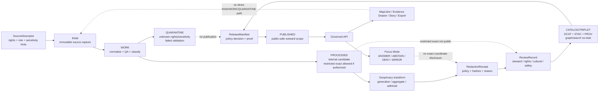

<!-- [KFM_META_BLOCK_V2]
doc_id: kfm://doc/TODO-VERIFY-uuid
title: ADR-0009: Sensitive Location Policy
type: standard
version: v1
status: draft
owners: TODO-VERIFY-owner
created: 2026-04-27
updated: 2026-04-27
policy_label: TODO-VERIFY-policy-label
related: [TODO-VERIFY-related-docs]
tags: [kfm, adr, policy, sensitive-location, geoprivacy]
notes: [drafted from attached KFM doctrine; repo implementation owners doc_id policy_label and related links require verification before publish]
[/KFM_META_BLOCK_V2] -->

# ADR-0009: Sensitive Location Policy

Protect precise location knowledge when disclosure could harm people, places, species, cultural resources, infrastructure, private interests, or steward-controlled evidence.

> [!IMPORTANT]
> **Decision:** KFM must deny public or semi-public disclosure of exact sensitive locations by default. Public release requires evidence, rights, sensitivity classification, review state, policy approval, and a recorded public-safe transform or explicit withholding decision.

---

## Quick navigation

| Section | Purpose |
|---|---|
| [Status](#status) | Current ADR posture and verification boundary |
| [Context](#context) | Why KFM needs a cross-domain location policy |
| [Decision](#decision) | The binding policy choice |
| [Scope](#scope) | Inputs, exclusions, and covered domains |
| [Definitions](#definitions) | Stable terms for reviewers and implementers |
| [Release posture matrix](#release-posture-matrix) | What may be published |
| [Governed flow](#governed-flow) | Lifecycle and policy path |
| [Implementation requirements](#implementation-requirements) | Objects, checks, and contracts |
| [Validation gates](#validation-gates) | Tests and promotion requirements |
| [Rollback and incident handling](#rollback-and-incident-handling) | What happens if unsafe location detail escapes |
| [Consequences](#consequences) | Tradeoffs and obligations |
| [Open verification items](#open-verification-items) | What must be confirmed in the real repo |

---

## Status

**Draft / proposed ADR.**

This decision is source-grounded in KFM doctrine, but current repository implementation is **NEEDS VERIFICATION**. The drafting session did not expose a mounted KFM Git checkout, so this ADR does **not** claim existing policy files, validators, schemas, CI gates, API middleware, UI components, source registries, or release manifests already exist.

| Item | Status | Reading rule |
|---|---:|---|
| KFM sensitive-location doctrine | **CONFIRMED** | Supported by attached KFM architecture and domain-lane documents. |
| This ADR file path | **PROPOSED by task** | Target path: `docs/adr/ADR-0009-sensitive-location-policy.md`. |
| Executable policy implementation | **NEEDS VERIFICATION** | Verify actual `policy/`, `tests/`, `schemas/`, and workflow layout before claiming enforcement. |
| Owners, doc ID, policy label, related links | **TODO-VERIFY** | Preserve placeholders until repo metadata and ownership are confirmed. |

[Back to top](#adr-0009-sensitive-location-policy)

---

## Context

KFM is a governed, evidence-first, map-first, time-aware spatial knowledge system. Its public value is not a tile, a geometry, a model answer, or a map popup by itself. Its public value is an inspectable claim that can be traced to source role, evidence, policy posture, review state, release state, and correction lineage.

Sensitive locations create a special trust burden because KFM works across domains where precise spatial disclosure can cause direct or indirect harm:

| Domain pressure | Why exact location can be unsafe |
|---|---|
| Archaeology and cultural heritage | Exact site, burial, sacred, collection, or looting-risk locations can expose protected or steward-controlled resources. |
| Flora, fauna, habitat, and biodiversity | Exact occurrences can expose rare species, nests, dens, roosts, spawning areas, hibernacula, monitoring points, or steward-restricted records. |
| People, genealogy, DNA, and land | Exact homes, graves, family-sensitive places, living-person information, parcel-linked identity, or DNA-derived relationship context can create privacy and safety risks. |
| Infrastructure, roads, rail, and facilities | Exact critical infrastructure, restricted facilities, vulnerable crossings, security-sensitive routes, or operational choke points can increase misuse risk. |
| Health, public safety, and small-count indicators | Fine spatial granularity can re-identify people or communities even when names are removed. |
| Indigenous, tribal, sovereign, or community-stewarded knowledge | Some places may require permission, consultation, staged access, generalized geography, or non-public handling. |

A location policy cannot live only in UI code, MapLibre style rules, AI prompts, or informal reviewer notes. It must be enforced as a backend and promotion rule, supported by machine-checkable records, and visible in public trust surfaces.

[Back to top](#adr-0009-sensitive-location-policy)

---

## Decision

KFM will adopt a **default-deny sensitive location policy**:

1. **Exact sensitive locations are not public by default.**
2. **Unknown rights, unknown sensitivity, missing evidence, missing review, or missing transform receipts block publication.**
3. **Public clients, MapLibre layers, exports, stories, Evidence Drawer payloads, search results, graph projections, and Focus Mode responses may only receive public-safe geometry and public-safe attributes.**
4. **Redaction and geoprivacy are first-class transformations, not cosmetic post-processing.**
5. **Every public-safe transform must be recorded in a receipt linked to evidence, source role, policy basis, reviewer state where required, and release scope.**
6. **AI is never allowed to recover, infer, summarize, or disclose restricted exact coordinates from unpublished, restricted, or precise internal support.**
7. **Promotion is a governed state transition. Copying a generalized file into a public folder is not publication authority.**

### Decision card

| Field | Decision |
|---|---|
| ADR | `ADR-0009` |
| Title | Sensitive Location Policy |
| Default outcome | `DENY` public exact disclosure when sensitivity is known, unknown, unresolved, or policy-controlled |
| Safe outward forms | Withheld geometry, generalized geometry, aggregated geometry, delayed release, staged access, or public-safe narrative |
| Required proof | SourceDescriptor, sensitivity classification, rights posture, evidence support, review state where required, redaction/geoprivacy receipt, PolicyDecision, ReleaseManifest |
| Applies to | Data lifecycle, governed APIs, MapLibre layers, graph/search projections, Evidence Drawer, Focus Mode, exports, stories, public docs |
| Does not authorize | Direct public access to RAW, WORK, QUARANTINE, restricted stores, model runtime internals, exact sensitive source geometries, or unreviewed candidates |

[Back to top](#adr-0009-sensitive-location-policy)

---

## Scope

### Accepted inputs

This ADR governs the policy posture for these input families:

| Input | Accepted when | Required handling |
|---|---|---|
| Source records with precise geometry | Source identity, rights posture, and source role are recorded | Classify sensitivity before any outward use. |
| Domain observations or assertions | EvidenceRefs can resolve to admissible support | Keep observed, inferred, modeled, statutory, and narrative support distinct. |
| Internal precise geometries | Access-controlled storage exists and policy allows internal use | Do not expose to public clients or generated outward layers. |
| Public-safe derived geometries | Transform has a receipt and release approval | Publish only through governed release scope. |
| Review records | Reviewer role and release scope are explicit | Required for sensitive classes and steward-controlled sources. |
| AI or Focus requests | Request is scoped to released public-safe evidence | Return `DENY` or `ABSTAIN` when the request asks for unsafe precision or unsupported inference. |

### Exclusions

| Does **not** belong in this ADR | Put it instead | Why |
|---|---|---|
| Full executable Rego / policy code | `policy/` or repo-native policy bundle path | ADR records the decision; executable policy must be testable. |
| JSON Schema definitions | `schemas/`, `contracts/`, or repo-confirmed schema authority | Schema home remains a repo convention decision. |
| Live source credentials or access keys | Secret manager / deployment configuration | Secrets do not belong in documentation. |
| Domain-specific steward procedures | Domain docs and runbooks | Archaeology, biodiversity, people/DNA, and infrastructure may require different reviewers. |
| Raw sensitive data examples | Fixtures with synthetic or redacted values only | Documentation must not become a leak vector. |
| UI-only enforcement | Governed API, policy, validators, and release gates | UI rules can explain and reflect policy but cannot be the only control. |

[Back to top](#adr-0009-sensitive-location-policy)

---

## Definitions

| Term | Definition |
|---|---|
| **Sensitive location** | Any coordinate, geometry, place reference, route, facility, tile, bounding box, centroid, address, parcel, source record, or spatial proxy that could materially expose protected, private, restricted, culturally sensitive, steward-controlled, or misuse-prone information. |
| **Exact location** | A spatial representation precise enough to locate, recover, target, identify, visit, reverse-engineer, or correlate the protected subject. Exactness is contextual; a small polygon, high-zoom tile, route segment, parcel-linked point, or detailed centroid can be exact even when it is not a raw GPS coordinate. |
| **Public-safe geometry** | Geometry that has been withheld, generalized, aggregated, delayed, coarsened, or otherwise transformed and reviewed so that the outward release does not disclose restricted precision. |
| **Geoprivacy transform** | A recorded transformation that reduces location disclosure risk. Examples include suppression, administrative-area generalization, watershed or eco-region support, grid aggregation, minimum-count aggregation, embargo, or precision bucketing. |
| **Redaction receipt / geoprivacy receipt** | A machine-checkable record proving that a sensitive-location transform occurred, why it occurred, which policy version applied, what release scope it supports, and which input/output digests or artifact references changed. |
| **Restricted exact geometry** | Internal precise geometry that may exist for audit, stewardship, analysis, or review but is not eligible for ordinary public or semi-public release. |
| **Aggregate-only** | A release class where only thresholded, grouped, or region-level outputs may be published. Individual or fine-grain geometries are withheld. |
| **Steward review** | Review by the domain, rights, cultural, legal, safety, or source steward required before release classification can proceed. |
| **Reverse-engineering risk** | Risk that a public artifact can be combined with other fields, layers, timestamps, source IDs, or metadata to reconstruct a restricted location. |

[Back to top](#adr-0009-sensitive-location-policy)

---

## Release posture matrix

| Classification | Public exact geometry | Public-safe geometry | Required before release | Default outcome |
|---|---:|---:|---|---|
| `public` | Allowed only when source, rights, and policy confirm no sensitivity | Allowed | Evidence + rights + release manifest | `ANSWER` / publish |
| `restricted` | No | Possibly, if transformed and approved | Rights + review + transform receipt | `DENY` exact / release safe derivative only |
| `sensitive_location` | No | Yes, only after approved geoprivacy transform | Sensitivity policy + review + receipt + proof bundle | `DENY` exact |
| `aggregate_only` | No | Yes, only above threshold and without reverse-engineering risk | Threshold test + aggregation receipt | `ABSTAIN` or `DENY` if threshold fails |
| `steward_review_required` | No | Hold until review | Steward review record | `HOLD` / `DENY` publication |
| `embargoed` | No during embargo | Possibly delayed or summary-only | Embargo rule + release time check | `WITHHOLD` until eligible |
| `unknown_rights` | No | No | Rights review | `DENY` promotion |
| `unknown_sensitivity` | No | No | Sensitivity classification | `QUARANTINE` / `DENY` publication |
| `policy_denied` | No | No | Correction or policy change | `DENY` |

> [!WARNING]
> “Generalized” does not automatically mean safe. Public-safe release must consider nearby context, attributes, timestamps, source IDs, repeated observations, and whether the release can be joined back to restricted support.

[Back to top](#adr-0009-sensitive-location-policy)

---

## Governed flow

The sensitive-location decision follows the KFM truth path. It must be enforced before a public asset, API response, map layer, story node, export, or AI answer leaves the governed boundary.

[Back to top](#adr-0009-sensitive-location-policy)

---

## Implementation requirements

### 1. Classification is mandatory before publication

Every release candidate that contains geometry, location text, route detail, place references, or spatially joinable identifiers must carry a sensitivity classification.

Minimum classification fields:

| Field | Purpose |
|---|---|
| `classification` | `public`, `restricted`, `sensitive_location`, `aggregate_only`, `embargoed`, `unknown_sensitivity`, or equivalent repo-approved enum |
| `classification_basis` | Source role, domain rule, steward rule, rights rule, legal rule, or policy rule |
| `audience` | Public, restricted, steward-only, internal, or role-limited |
| `precision_requested` | Requested outward precision |
| `precision_allowed` | Allowed outward precision after policy |
| `review_required` | Whether a human/steward review must occur |
| `release_allowed` | Machine-readable yes/no/hold decision |

### 2. Unknowns fail closed

| Unknown | Required behavior |
|---|---|
| Rights unknown | `DENY` public promotion; hold in QUARANTINE or restricted review. |
| Sensitivity unknown | `DENY` public promotion until classification exists. |
| Source role unknown | Do not use as authority; require source registry review. |
| Review missing | Hold release when review is required. |
| Evidence missing | `ABSTAIN` or `DENY`; do not publish consequential claims. |
| Transform receipt missing | Do not publish transformed geometry. |
| Policy version missing | Do not publish; policy basis must be replayable. |

### 3. Public artifacts use public-safe geometry only

Public-facing artifacts must not include restricted exact geometry or fields that reconstruct it.

Covered artifacts include:

- `GeoJSON`, `GeoParquet`, `PMTiles`, `MVT`, raster tiles, COGs, TileJSON, layer manifests, and map styles
- API response envelopes and DTOs
- Evidence Drawer payloads
- Story, dossier, export, and report payloads
- Search indexes, graph/triplet projections, vector indexes, summaries, and AI context packs
- Screenshots, static map exports, notebooks, examples, and fixtures

### 4. Geoprivacy transforms require receipts

A valid receipt should include, at minimum:

| Receipt field | Required intent |
|---|---|
| `receipt_id` | Stable receipt identity |
| `source_ref` | Source record, dataset version, or artifact reference |
| `input_digest` | Digest of restricted input artifact or safe reference to it |
| `output_digest` | Digest of public-safe output artifact |
| `transform_class` | Suppression, generalization, aggregation, embargo, precision bucket, field redaction, or equivalent |
| `transform_parameters_ref` | Safe reference to parameters; do not expose secret salts or restricted geometry |
| `reason_codes` | Why the transform occurred |
| `policy_version` | Policy basis used for the decision |
| `review_ref` | Required when steward or rights review applies |
| `release_scope_ref` | Release or candidate release supported by the receipt |
| `created_at` | Time the transform was recorded |
| `actor_or_run_ref` | Human actor or automated run receipt, according to repo policy |
| `rollback_ref` | How to withdraw or supersede the public-safe derivative |

### 5. Source role remains visible

Sensitive-location behavior depends on source role. A community observation, statutory source, archival map, oral history, model surface, legal boundary, and steward record are not interchangeable.

Public payloads should preserve enough source-role context to explain why a location was generalized, withheld, denied, or allowed.

### 6. MapLibre and UI surfaces reflect policy; they do not define it

MapLibre style JSON, client filters, layer visibility toggles, and front-end conditionals are not sufficient controls. The governed API and release artifacts must already be safe before the UI receives them.

UI requirements:

- Show `generalized`, `withheld`, `not_resolved`, or `denied` state where trust-significant.
- Do not show empty placeholders when evidence exists but cannot safely be shown.
- Do not imply absence of evidence when the actual state is restricted or withheld.
- Do not render exact protected coordinates, hidden source IDs, internal refs, or reverse-engineering clues.
- Keep Evidence Drawer one hop away from inspectable support through EvidenceBundle references.

### 7. AI and Focus Mode obey the same policy

Focus Mode may interpret released, public-safe evidence. It must not receive restricted exact geometries unless an explicitly authorized internal workflow exists, and it must never reveal restricted details in public or semi-public responses.

| AI/Focus request | Required outcome |
|---|---|
| “Where exactly is this protected site/species/facility?” | `DENY` |
| “Why is the location generalized?” | `ANSWER` if explanation can cite released policy/evidence without exposing restricted detail |
| “Is there evidence near this county/region?” | `ANSWER` or `ABSTAIN` depending on public-safe support |
| Unsupported claim request | `ABSTAIN` |
| Malformed or policy-incomplete request | `ERROR` or `DENY`, according to runtime contract |

[Back to top](#adr-0009-sensitive-location-policy)

---

## Candidate implementation homes

> [!NOTE]
> Paths below are **PROPOSED / NEEDS VERIFICATION** until the mounted repo confirms actual conventions.

| Candidate path | Role |
|---|---|
| `policy/sensitive-location/` | Cross-domain sensitive-location policy bundle |
| `policy/reason_codes.json` | Shared reason-code registry, if not already centralized |
| `policy/obligation_codes.json` | Shared obligation-code registry, if not already centralized |
| `schemas/contracts/v1/redaction_receipt.schema.json` | Machine contract for geoprivacy/redaction receipts |
| `schemas/contracts/v1/sensitivity_classification.schema.json` | Machine contract for classification records |
| `schemas/contracts/v1/policy_decision.schema.json` | Machine contract for finite policy decisions |
| `schemas/contracts/v1/layer_manifest.schema.json` | Public layer manifest with sensitivity summary and asset digests |
| `tests/policy/sensitive_location/` | Deny/allow policy fixtures |
| `tests/fixtures/sensitive_location/` | Synthetic safe fixtures only |
| `tools/validators/sensitive_location/` | No-leak, transform-receipt, layer, API, and catalog validators |
| `data/receipts/redaction/` | Redaction/geoprivacy receipt artifacts |
| `docs/runbooks/sensitive-location-rollback.md` | Emergency withdrawal and correction playbook |

[Back to top](#adr-0009-sensitive-location-policy)

---

## Validation gates

A release candidate containing location-bearing material must pass these checks before publication.

| Gate | Must prove | Failure outcome |
|---|---|---|
| Source registry gate | Source role, rights posture, access class, cadence, citation expectations, and sensitivity hints are recorded | `DENY` or `QUARANTINE` |
| Rights gate | Public or restricted release rights are known and compatible with the target audience | `DENY` |
| Sensitivity gate | Record, field, dataset, and layer sensitivity are classified | `DENY` |
| Geometry gate | Public artifact contains no restricted exact geometry or reverse-engineering proxy | `DENY` |
| Transform receipt gate | Every public-safe transformed geometry has a receipt | `DENY` |
| Review gate | Required steward, rights, cultural, legal, or safety review exists | `HOLD` or `DENY` |
| Evidence gate | EvidenceRefs resolve to EvidenceBundles with integrity, rights, and sensitivity summaries | `ABSTAIN` or `DENY` |
| Catalog closure gate | DCAT/STAC/PROV or repo-equivalent catalog closure links release scope, evidence, lineage, and distributions | `DENY` |
| Layer manifest gate | Map and tile assets are field-allowlisted, digest-checked, and sensitivity-compatible | `DENY` |
| Runtime envelope gate | API/Focus response uses finite outcome and visible reason/obligation codes | `ERROR` or `DENY` |
| Negative regression gate | Known leakage patterns remain blocked forever | `DENY` merge or promotion |

### Minimum negative tests

- Exact archaeological site geometry in public layer: **deny**.
- Sensitive species occurrence point in public tile: **deny**.
- Living-person home or family-sensitive coordinate in public payload: **deny**.
- Critical infrastructure exact geometry without approved release class: **deny**.
- Unknown rights with publication requested: **deny**.
- Generalized public geometry without receipt: **deny**.
- Evidence Drawer payload with hidden restricted coordinate field: **deny**.
- Focus Mode answer that exposes restricted exact coordinates: **deny**.
- Search/graph projection that carries restricted coordinate fields: **deny**.
- Public API route reading RAW, WORK, QUARANTINE, or restricted store directly: **deny**.

[Back to top](#adr-0009-sensitive-location-policy)

---

## Reason and obligation codes

The exact registry path is **NEEDS VERIFICATION**. This ADR reserves the following starter vocabulary for policy design and fixture planning.

### Reason codes

| Code | Meaning |
|---|---|
| `rights.unknown` | Rights or redistribution posture is unresolved |
| `sensitivity.unclassified` | Sensitivity has not been classified |
| `sensitivity.exact_location` | Requested output would expose unsafe precision |
| `sensitivity.reverse_engineering_risk` | Public artifact can reconstruct restricted detail |
| `review.required` | Required review is missing |
| `review.steward_missing` | Domain/steward review is missing |
| `redaction.receipt_missing` | Transform exists without required receipt |
| `release.manifest_missing` | Release scope is not assembled or signed/digested as required |
| `evidence.bundle_missing` | EvidenceRef cannot resolve to EvidenceBundle |
| `public_payload.internal_ref` | Public payload exposes internal restricted reference |
| `runtime.policy_denied` | Runtime request is blocked by policy |
| `ai.coordinate_disclosure_denied` | AI/Focus attempted to disclose restricted precision |

### Obligation codes

| Code | Required action |
|---|---|
| `generalize` | Reduce precision before outward use |
| `aggregate` | Publish only grouped/thresholded output |
| `withhold` | Do not render or publish location detail |
| `embargo` | Delay release until policy permits |
| `review_required` | Route to steward/reviewer |
| `cite` | Attach evidence or abstain |
| `emit_receipt` | Record transform or policy decision |
| `log_audit` | Preserve audit reference |
| `correction_notice` | Publish visible correction/withdrawal state |
| `disable_public_layer` | Remove public access while investigation proceeds |

[Back to top](#adr-0009-sensitive-location-policy)

---

## Rollback and incident handling

If restricted exact location detail is released or suspected to have been released, KFM must treat it as a policy incident, not a routine map bug.

### Immediate response

1. Disable the affected public layer, API route, export, story node, search index, graph projection, or Focus surface.
2. Preserve an incident receipt with release ID, asset digests, time window, discovered path, and actor/run references where allowed.
3. Notify required stewards and rights/cultural/safety reviewers.
4. Withdraw or supersede the release manifest.
5. Publish or prepare a correction notice appropriate to the release class.
6. Add a negative regression fixture that would have caught the leak.
7. Re-run policy, geometry, catalog, layer, API, and UI no-leak checks before restoration.

### Rollback table

| Surface | Rollback action |
|---|---|
| Public map layer | Disable feature flag or remove layer manifest alias; keep proof trail |
| Tile bundle / static asset | Withdraw release alias; preserve digest and incident record |
| API response | Disable route exposure or enforce emergency deny branch |
| Search / graph projection | Remove public projection; rebuild from safe release scope |
| Evidence Drawer | Hide unsafe detail; show withheld/denied state if appropriate |
| Focus Mode | Deny sensitive coordinate requests; invalidate unsafe context packs |
| Documentation/example leak | Remove precise detail; record correction notice and safe replacement |
| Source descriptor | Mark source or class inactive until review completes |

[Back to top](#adr-0009-sensitive-location-policy)

---

## Consequences

### Benefits

- Preserves KFM’s evidence-first and policy-aware public posture.
- Prevents maps, tiles, AI, and public APIs from becoming accidental disclosure channels.
- Makes redaction inspectable and reversible instead of invisible.
- Gives domain stewards a durable review surface.
- Supports public usefulness through safe generalized or aggregate outputs.
- Keeps negative outcomes visible rather than hiding DENY/ABSTAIN states.

### Costs

- Some public products will be less spatially precise.
- More records will require review, receipts, and fixtures before release.
- Public layer generation becomes slower because safety is a release gate, not a UI afterthought.
- Domain stewards must define practical thresholds and transform defaults.
- Tests must cover indirect leakage, not only raw coordinate fields.

### Tradeoff accepted

KFM chooses **governed public trust over maximum spatial precision**. Exactness is useful internally when lawful and reviewed, but public precision must be earned through evidence, rights, sensitivity, review, and release proof.

[Back to top](#adr-0009-sensitive-location-policy)

---

## Open verification items

| Item | Why it matters |
|---|---|
| Existing ADR numbering and format | Confirm `ADR-0009` is available and follows repo ADR style. |
| Canonical metadata values | Replace TODO `doc_id`, owners, policy label, and related links. |
| Schema home | Confirm whether machine contracts live in `contracts/`, `schemas/`, `schemas/contracts/v1/`, or another path. |
| Policy engine | Confirm OPA/Rego, Conftest, Python parity, or repo-native policy tooling. |
| Existing reason/obligation registry | Avoid creating duplicate finite-outcome vocabulary. |
| Existing EvidenceBundle / DecisionEnvelope / ReleaseManifest schemas | Reuse shared object families rather than forking location-specific variants. |
| Data lifecycle directories | Confirm exact repo structure for `raw`, `work`, `quarantine`, `processed`, `catalog`, `receipts`, `proofs`, and `published`. |
| UI contract path | Confirm Evidence Drawer, MapLibre layer registry, and Focus Mode payload homes. |
| Steward roles | Confirm archaeology, biodiversity, people/DNA/land, infrastructure, rights, cultural, and safety reviewer roles. |
| Source-specific legal requirements | Verify current source terms, sovereignty requirements, data licenses, and regulatory restrictions. |
| CI and branch protection | Confirm which checks are merge-blocking and which are release-blocking. |

[Back to top](#adr-0009-sensitive-location-policy)

---

## Acceptance checklist

Before this ADR can move beyond draft:

- [ ] Metadata block placeholders are replaced or explicitly retained with approval.
- [ ] Existing ADR index confirms `ADR-0009` numbering.
- [ ] Repo schema-home convention is verified or separately decided.
- [ ] Shared reason and obligation code registry is located or created.
- [ ] Sensitive-location deny fixtures exist for archaeology, rare species, people/DNA/land, and infrastructure.
- [ ] Redaction/geoprivacy receipt shape is machine-checkable.
- [ ] Public layer validator blocks exact sensitive geometry and restricted fields.
- [ ] Governed API validator blocks RAW / WORK / QUARANTINE public paths.
- [ ] Evidence Drawer fixture shows generalized/withheld/denied state without leaking detail.
- [ ] Focus Mode negative-path fixture denies exact sensitive coordinate disclosure.
- [ ] Release/promotion dry run requires evidence, rights, sensitivity, review, receipt, catalog, and rollback closure.
- [ ] Emergency rollback runbook exists and is linked from this ADR.

[Back to top](#adr-0009-sensitive-location-policy)
