<!-- [KFM_META_BLOCK_V2]
doc_id: kfm://doc/NEEDS-VERIFICATION
title: ADR-0009: Sensitive Location Policy
type: standard
version: v1
status: draft
owners: OWNER_TBD
created: 2026-04-27
updated: 2026-05-02
policy_label: NEEDS_VERIFICATION_POLICY_LABEL
related: [PATH_TBD_AFTER_REPO_INSPECTION]
tags: [kfm, adr, policy, sensitive-location, geoprivacy]
notes: [NEEDS VERIFICATION - doc_id owners policy_label related paths ADR index schema home policy engine and implementation status must be confirmed before publish]
[/KFM_META_BLOCK_V2] -->

# ADR-0009: Sensitive Location Policy

Protect precise location knowledge when disclosure could harm people, places, species, cultural resources, infrastructure, private interests, sovereign or steward-controlled knowledge, or KFM evidence integrity.

> [!IMPORTANT]
> **Decision:** KFM denies public or semi-public disclosure of exact sensitive locations by default. Public release requires evidence, rights, sensitivity classification, review state, policy approval, and either a recorded public-safe transform or an explicit withholding decision.

---

## Quick navigation

| Section | Purpose |
|---|---|
| [Status](#status) | ADR posture, target path, and verification boundary |
| [Evidence basis](#evidence-basis) | Source support and limits for this decision |
| [Context](#context) | Why KFM needs a cross-domain location policy |
| [Decision](#decision) | The binding policy choice |
| [Scope](#scope) | Inputs, exclusions, and covered domains |
| [Definitions](#definitions) | Stable terms for reviewers and implementers |
| [Policy outcomes](#policy-outcomes) | Publication outcomes and runtime outcomes |
| [Release posture matrix](#release-posture-matrix) | What may be published |
| [Governed flow](#governed-flow) | Lifecycle, transform, review, and publication path |
| [Implementation requirements](#implementation-requirements) | Objects, checks, contracts, and no-leak rules |
| [Candidate implementation homes](#candidate-implementation-homes) | Proposed paths that require repo verification |
| [Validation gates](#validation-gates) | Tests and promotion requirements |
| [Reason and obligation codes](#reason-and-obligation-codes) | Starter vocabulary for policy fixtures |
| [Rollback and incident handling](#rollback-and-incident-handling) | What happens if unsafe detail escapes |
| [Consequences](#consequences) | Benefits, costs, and accepted tradeoff |
| [Open verification items](#open-verification-items) | What must be confirmed in the real repo |
| [Acceptance checklist](#acceptance-checklist) | Conditions before this ADR can move beyond draft |

---

## Status

**Draft ADR. Doctrine-supported. Implementation depth NEEDS VERIFICATION.**

This ADR is grounded in KFM doctrine and attached domain-lane plans, but the current drafting session did not expose a mounted KFM Git checkout. It therefore does **not** claim that executable policy files, validators, schemas, CI gates, API middleware, UI components, source registries, release manifests, or branch protections already exist.

| Item | Status | Reading rule |
|---|---:|---|
| KFM trust posture | **CONFIRMED doctrine** | KFM treats public value as inspectable claims, not raw geometry, rendered tiles, AI text, or map popups. |
| Sensitive-location default | **CONFIRMED doctrine / ADR decision** | Exact sensitive locations fail closed unless policy, evidence, rights, review, and release proof allow a safe outward form. |
| Target path | **PROPOSED** | `docs/adr/ADR-0009-sensitive-location-policy.md` until the ADR index and repo convention are verified. |
| Executable policy implementation | **UNKNOWN / NEEDS VERIFICATION** | Verify actual `policy/`, `policies/`, `schemas/`, `contracts/`, `tests/`, and workflow layout before claiming enforcement. |
| Owners, doc ID, policy label, related links | **OWNER_TBD / NEEDS VERIFICATION** | Preserve placeholders until repo metadata and ownership are confirmed. |
| Public release posture | **DENY by default** | Unknown rights, unknown sensitivity, missing evidence, missing review, or missing transform receipts block publication. |

> [!NOTE]
> This ADR decides policy direction and release obligations. It does not itself implement Rego, Python validators, JSON Schema, API middleware, MapLibre filtering, source activation, or release tooling.

[Back to top](#adr-0009-sensitive-location-policy)

---

## Evidence basis

| Source | Status | Supports | Limits |
|---|---|---|---|
| Attached source Markdown for this ADR | **CONFIRMED source document** | Existing default-deny decision, scope, definitions, release matrix, governed flow, validation gates, rollback posture, and acceptance checklist. | Needed revision for clearer evidence boundary, outcome vocabulary, no-leak requirements, source ledger, and repo-unavailable posture. |
| KFM pipeline and whole-corpus doctrine | **CONFIRMED doctrine / UNKNOWN implementation** | `RAW -> WORK / QUARANTINE -> PROCESSED -> CATALOG / TRIPLET -> PUBLISHED`, cite-or-abstain, EvidenceBundle primacy, promotion as governed state transition, and artifactization of receipts/proofs/manifests. | Does not prove current repo files, schemas, CI, dashboards, or runtime behavior in this session. |
| MapLibre and UI doctrine | **CONFIRMED doctrine / PROPOSED implementation** | MapLibre is a downstream renderer and interaction surface; governed APIs and released artifacts must already be safe before public UI receives them. | Does not prove current UI component paths or runtime enforcement. |
| Archaeology, flora/fauna/habitat, people/DNA/land, infrastructure, and hazards lane plans | **LINEAGE / doctrine support** | Cross-domain examples where exact location disclosure can create looting, ecological, privacy, cultural, sovereignty, safety, or infrastructure misuse risk. | Prior plans are not current implementation proof unless later repo evidence confirms matching files and tests. |
| Current workspace inspection | **CONFIRMED boundary** | No mounted Git checkout was available in this session; implementation claims must stay bounded. | Does not rule out repo implementation elsewhere; it only bounds this drafting session. |

### Authority rule

For intended policy, KFM doctrine controls. For current implementation behavior, direct repo evidence, tests, workflows, logs, manifests, or emitted artifacts must be inspected. When those are unavailable, paths and enforcement claims remain **PROPOSED** or **UNKNOWN**.

[Back to top](#adr-0009-sensitive-location-policy)

---

## Context

KFM is a governed, evidence-first, map-first, time-aware spatial knowledge and publication system. Its public unit of value is the inspectable claim: a statement whose evidence, source role, spatial and temporal scope, policy posture, review state, release state, and correction lineage can be inspected.

Sensitive locations create a special trust burden because KFM works across domains where precise spatial disclosure can cause direct or indirect harm.

| Domain pressure | Why exact location can be unsafe |
|---|---|
| Archaeology and cultural heritage | Exact site, burial, sacred, collection, artifact, or looting-risk locations can expose protected or steward-controlled resources. |
| Flora, fauna, habitat, and biodiversity | Exact occurrences can expose rare plants, sensitive species, nests, dens, roosts, spawning areas, hibernacula, monitoring points, or steward-restricted records. |
| People, genealogy, DNA, and land | Exact homes, graves, family-sensitive places, living-person information, parcel-linked identity, or DNA-derived relationship context can create privacy and safety risks. |
| Infrastructure, roads, rail, and facilities | Exact critical infrastructure, restricted facilities, vulnerable crossings, service dependencies, operational choke points, or sensitive routes can increase misuse risk. |
| Health, public safety, hazards, and small-count indicators | Fine spatial granularity can re-identify people or communities even when names are removed. |
| Indigenous, tribal, sovereign, or community-stewarded knowledge | Some places may require permission, consultation, staged access, generalized geography, delayed release, or non-public handling. |
| Private land, collection, or stewardship records | Exact coordinates can expose landowners, access points, collection sites, or restricted stewardship work. |

A location policy cannot live only in UI code, MapLibre style rules, AI prompts, or informal reviewer notes. It must be enforced as a backend and promotion rule, supported by machine-checkable records, and visible in public trust surfaces.

[Back to top](#adr-0009-sensitive-location-policy)

---

## Decision

KFM adopts a **default-deny sensitive location policy**.

1. **Exact sensitive locations are not public by default.**
2. **Unknown rights, unknown sensitivity, missing evidence, missing review, or missing transform receipts block publication.**
3. **Public clients, MapLibre layers, Cesium scenes, exports, stories, Evidence Drawer payloads, search results, graph projections, vector indexes, and Focus Mode responses may only receive public-safe geometry and public-safe attributes.**
4. **Redaction and geoprivacy are first-class transformations, not cosmetic post-processing.**
5. **Every public-safe transform must be recorded in a receipt linked to evidence, source role, policy basis, reviewer state where required, and release scope.**
6. **AI is never allowed to recover, infer, summarize, or disclose restricted exact coordinates from unpublished, restricted, precise, or internal support.**
7. **Promotion is a governed state transition. Copying a generalized file into a public folder is not publication authority.**
8. **Derived surfaces do not become sovereign truth.** Tiles, scenes, screenshots, search indexes, graph projections, summaries, and model outputs remain downstream of EvidenceBundle, policy, review, release, and correction state.

### Decision card

| Field | Decision |
|---|---|
| ADR | `ADR-0009` |
| Title | Sensitive Location Policy |
| Default public outcome | `DENY` exact disclosure when sensitivity is known, unknown, unresolved, or policy-controlled |
| Safe outward forms | Withheld geometry, generalized geometry, aggregated geometry, delayed release, staged access, or public-safe narrative |
| Required proof | SourceDescriptor, sensitivity classification, rights posture, evidence support, review state where required, geoprivacy/redaction receipt, PolicyDecision, ReleaseManifest, rollback target |
| Applies to | Data lifecycle, governed APIs, MapLibre/Cesium surfaces, graph/search/vector projections, Evidence Drawer, Focus Mode, exports, stories, public docs, examples, screenshots, fixtures |
| Does not authorize | Direct public access to RAW, WORK, QUARANTINE, restricted stores, model runtime internals, exact sensitive source geometries, unpublished candidates, or unreviewed public artifacts |

[Back to top](#adr-0009-sensitive-location-policy)

---

## Scope

### Accepted inputs

This ADR governs the policy posture for these input families.

| Input | Accepted when | Required handling |
|---|---|---|
| Source records with precise geometry | Source identity, rights posture, source role, and access class are recorded | Classify sensitivity before any outward use. |
| Domain observations or assertions | EvidenceRefs can resolve to admissible support | Keep observed, inferred, modeled, statutory, oral-history, documentary, and narrative support distinct. |
| Internal precise geometries | Access-controlled storage exists and policy allows internal use | Do not expose to public clients or generated outward layers. |
| Public-safe derived geometries | Transform has a receipt, validation result, and release approval | Publish only through governed release scope. |
| Review records | Reviewer role, decision, basis, and release scope are explicit | Required for sensitive classes and steward-controlled sources. |
| AI or Focus requests | Request is scoped to released public-safe evidence | Return `DENY` or `ABSTAIN` when the request asks for unsafe precision or unsupported inference. |
| Documentation examples and fixtures | Values are synthetic, redacted, generalized, or public-safe | Do not embed real sensitive coordinates as examples. |

### Exclusions

| Does **not** belong in this ADR | Put it instead | Why |
|---|---|---|
| Full executable Rego or policy code | `policy/`, `policies/`, or repo-native policy bundle path | ADR records the decision; executable policy must be testable. |
| JSON Schema definitions | `schemas/`, `contracts/`, or repo-confirmed schema authority | Schema home remains a repo convention decision. |
| Live source credentials or access keys | Secret manager / deployment configuration | Secrets do not belong in documentation. |
| Domain-specific steward procedures | Domain docs and runbooks | Archaeology, biodiversity, people/DNA/land, infrastructure, hazards, and sovereignty-related workflows may require different reviewers. |
| Raw sensitive data examples | Synthetic fixtures or redacted examples only | Documentation must not become a leak vector. |
| UI-only enforcement | Governed API, policy, validators, and release gates | UI rules can explain and reflect policy but cannot be the only control. |
| Legal advice, emergency instructions, or title determinations | Domain-specific reviewed surfaces or official authorities | KFM should cite official sources or abstain where it is not authority. |

[Back to top](#adr-0009-sensitive-location-policy)

---

## Definitions

| Term | Definition |
|---|---|
| **Sensitive location** | Any coordinate, geometry, place reference, route, facility, tile, bounding box, centroid, address, parcel, source record, temporal-spatial pattern, or spatial proxy that could materially expose protected, private, restricted, culturally sensitive, steward-controlled, or misuse-prone information. |
| **Exact location** | A spatial representation precise enough to locate, recover, target, identify, visit, reverse-engineer, correlate, or narrow the protected subject. Exactness is contextual; a small polygon, high-zoom tile, route segment, parcel-linked point, repeated timestamped observation, or detailed centroid can be exact even when it is not a raw GPS coordinate. |
| **Public-safe geometry** | Geometry that has been withheld, generalized, aggregated, delayed, coarsened, or otherwise transformed and reviewed so that the outward release does not disclose restricted precision. |
| **Geoprivacy transform** | A recorded transformation that reduces location disclosure risk. Examples include suppression, administrative-area generalization, watershed or eco-region support, grid aggregation, minimum-count aggregation, embargo, precision bucketing, route coarsening, or public-safe narrative substitution. |
| **Redaction receipt / geoprivacy receipt** | A machine-checkable record proving that a sensitive-location transform occurred, why it occurred, which policy version applied, what release scope it supports, and which input/output digests or artifact references changed. |
| **Restricted exact geometry** | Internal precise geometry that may exist for audit, stewardship, analysis, or review but is not eligible for ordinary public or semi-public release. |
| **Aggregate-only** | A release class where only thresholded, grouped, or region-level outputs may be published. Individual or fine-grain geometries are withheld. |
| **Steward review** | Review by the domain, rights, cultural, legal, safety, sovereignty, source, or community steward required before release classification can proceed. |
| **Reverse-engineering risk** | Risk that a public artifact can be combined with other fields, layers, timestamps, source IDs, metadata, repeated releases, or external datasets to reconstruct a restricted location. |
| **Public-safe narrative** | Text that explains a place, pattern, or policy without exposing restricted coordinates, access paths, private identity, source record IDs, or other reconstruction clues. |
| **Disclosure surface** | Any output path that can leak location detail, including map layers, tiles, scenes, API payloads, exports, screenshots, docs, examples, search, graph, vector indexes, AI context packs, and logs exposed to users. |

[Back to top](#adr-0009-sensitive-location-policy)

---

## Policy outcomes

KFM should keep **publication outcomes** distinct from **runtime answer outcomes**.

| Outcome family | Proposed values | Use |
|---|---|---|
| Publication / promotion | `ALLOW_PUBLIC_SAFE`, `DENY_PUBLIC_EXACT`, `HOLD_FOR_REVIEW`, `WITHHOLD`, `QUARANTINE`, `WITHDRAW` | Release, promotion, rollback, catalog, layer, and proof decisions. |
| Runtime / API / Focus | `ANSWER`, `ABSTAIN`, `DENY`, `ERROR` | Governed API and Focus Mode response envelopes. |
| Review | `APPROVE_PUBLIC_SAFE`, `REQUEST_GENERALIZATION`, `REQUEST_AGGREGATION`, `REQUEST_WITHHOLDING`, `REJECT`, `ESCALATE` | Human or steward review records. |

> [!NOTE]
> These values are **PROPOSED starter vocabulary** until the repo reason-code, obligation-code, and finite-outcome registries are verified. Do not create a duplicate registry if one already exists.

[Back to top](#adr-0009-sensitive-location-policy)

---

## Release posture matrix

| Classification | Public exact geometry | Public-safe geometry | Required before release | Default outcome |
|---|---:|---:|---|---|
| `public` | Allowed only when source, rights, and policy confirm no sensitivity | Allowed | Evidence + rights + release manifest | `ALLOW_PUBLIC_SAFE` |
| `restricted` | No | Possibly, if transformed and approved | Rights + review + transform receipt | `DENY_PUBLIC_EXACT` |
| `sensitive_location` | No | Yes, only after approved geoprivacy transform | Sensitivity policy + review + receipt + proof bundle | `DENY_PUBLIC_EXACT` |
| `aggregate_only` | No | Yes, only above threshold and without reverse-engineering risk | Threshold test + aggregation receipt | `ABSTAIN` or `DENY` if threshold fails |
| `steward_review_required` | No | Hold until review | Steward review record | `HOLD_FOR_REVIEW` |
| `embargoed` | No during embargo | Possibly delayed or summary-only | Embargo rule + release time check | `WITHHOLD` until eligible |
| `unknown_rights` | No | No | Rights review | `DENY` promotion |
| `unknown_sensitivity` | No | No | Sensitivity classification | `QUARANTINE` / `DENY` publication |
| `policy_denied` | No | No | Correction or policy change | `DENY` |
| `incident_withdrawn` | No | No until rebuilt and approved | Incident review + corrected release manifest | `WITHDRAW` |

> [!WARNING]
> “Generalized” does not automatically mean safe. Public-safe release must consider nearby context, attributes, timestamps, source IDs, repeated observations, joins to other layers, screenshots, tile zoom levels, and whether the release can be joined back to restricted support.

[Back to top](#adr-0009-sensitive-location-policy)

---

## Governed flow

The sensitive-location decision follows the KFM truth path. It must be enforced before a public asset, API response, map layer, story node, export, screenshot, graph/search projection, vector index, or AI answer leaves the governed boundary.

```mermaid
flowchart LR
    SRC[SourceDescriptor<br/>role + rights + sensitivity hints]
    RAW[RAW<br/>immutable source capture]
    WORK[WORK<br/>normalize + QA + classify]
    QUAR[QUARANTINE<br/>unknown rights/sensitivity<br/>failed validation]
    PROC[PROCESSED<br/>internal candidate<br/>restricted exact allowed only if authorized]
    CLASS[SensitivityClassification<br/>audience + precision allowed]
    REDACT[Geoprivacy transform<br/>generalize / aggregate / withhold / embargo]
    RECEIPT[RedactionReceipt<br/>policy + hashes + reason]
    REVIEW[ReviewRecord<br/>steward / rights / cultural / safety]
    CAT[CATALOG / TRIPLET<br/>catalog + provenance + no-leak projections]
    RELEASE[ReleaseManifest<br/>policy decision + proof + rollback]
    PUB[PUBLISHED<br/>public-safe outward scope]
    API[Governed API]
    UI[MapLibre / Evidence Drawer / Story / Export]
    FOCUS[Focus Mode<br/>ANSWER / ABSTAIN / DENY / ERROR]
    DENY[DENY / HOLD<br/>no publication]

    SRC --> RAW --> WORK
    WORK --> QUAR --> DENY
    WORK --> PROC --> CLASS --> REDACT --> RECEIPT --> REVIEW --> CAT --> RELEASE --> PUB
    PUB --> API
    API --> UI
    API --> FOCUS
    CLASS -->|exact public requested but not allowed| DENY
    REVIEW -->|rejected or incomplete| DENY
```

> [!CAUTION]
> Normal public clients must not read `RAW`, `WORK`, `QUARANTINE`, restricted exact geometry, internal model context, or unpublished candidate artifacts directly.

[Back to top](#adr-0009-sensitive-location-policy)

---

## Implementation requirements

### 1. Classification is mandatory before publication

Every release candidate that contains geometry, location text, route detail, place references, temporal-spatial patterns, spatially joinable identifiers, parcel/address linkage, or map-ready assets must carry a sensitivity classification.

Minimum classification fields:

| Field | Purpose |
|---|---|
| `classification` | `public`, `restricted`, `sensitive_location`, `aggregate_only`, `embargoed`, `unknown_sensitivity`, or equivalent repo-approved enum |
| `classification_basis` | Source role, domain rule, steward rule, rights rule, legal rule, sovereignty rule, safety rule, or policy rule |
| `audience` | Public, restricted, steward-only, internal, or role-limited |
| `precision_requested` | Requested outward precision |
| `precision_allowed` | Allowed outward precision after policy |
| `review_required` | Whether a human/steward review must occur |
| `release_allowed` | Machine-readable yes/no/hold decision |
| `reason_codes` | Why the decision occurred |
| `obligation_codes` | Required transforms, reviews, citations, or rollback obligations |
| `policy_version` | Replayable policy basis |

### 2. Unknowns fail closed

| Unknown | Required behavior |
|---|---|
| Rights unknown | `DENY` public promotion; hold in `QUARANTINE` or restricted review. |
| Sensitivity unknown | `DENY` public promotion until classification exists. |
| Source role unknown | Do not use as authority; require source registry review. |
| Review missing | Hold release when review is required. |
| Evidence missing | `ABSTAIN` or `DENY`; do not publish consequential claims. |
| Transform receipt missing | Do not publish transformed geometry. |
| Policy version missing | Do not publish; policy basis must be replayable. |
| Release scope missing | Do not publish; outward audience and artifact set must be explicit. |
| Rollback target missing | Do not publish; withdrawal path must be known. |

### 3. Public artifacts use public-safe geometry only

Public-facing artifacts must not include restricted exact geometry or fields that reconstruct it.

Covered artifacts include:

- `GeoJSON`, `GeoParquet`, `PMTiles`, `MVT`, raster tiles, COGs, TileJSON, layer manifests, map styles, Cesium/3D scene descriptors, and screenshots
- API response envelopes, DTOs, public GraphQL/REST payloads, and export payloads
- Evidence Drawer payloads
- Story, dossier, notebook, report, and documentation examples
- Search indexes, graph/triplet projections, vector indexes, summaries, and AI context packs
- Logs, receipts, manifests, or validation reports that are visible to public or semi-public users

### 4. Geoprivacy transforms require receipts

A valid receipt should include, at minimum:

| Receipt field | Required intent |
|---|---|
| `receipt_id` | Stable receipt identity |
| `source_ref` | Source record, dataset version, or artifact reference |
| `input_digest` | Digest of restricted input artifact or safe reference to it |
| `output_digest` | Digest of public-safe output artifact |
| `transform_class` | Suppression, generalization, aggregation, embargo, precision bucket, field redaction, route coarsening, or equivalent |
| `transform_parameters_ref` | Safe reference to parameters; do not expose secret salts or restricted geometry |
| `reason_codes` | Why the transform occurred |
| `obligation_codes` | Follow-up actions required by policy |
| `policy_version` | Policy basis used for the decision |
| `review_ref` | Required when steward, cultural, rights, safety, or sovereignty review applies |
| `release_scope_ref` | Release or candidate release supported by the receipt |
| `created_at` | Time the transform was recorded |
| `actor_or_run_ref` | Human actor or automated run receipt, according to repo policy |
| `rollback_ref` | How to withdraw or supersede the public-safe derivative |

### 5. Field allowlists are required for public payloads

Public payloads should be built from an explicit allowlist. Blocklists alone are insufficient because new fields, metadata, indexes, or joins can reintroduce leakage.

Minimum public allowlist checks:

| Check | Required behavior |
|---|---|
| Geometry precision | Only public-safe geometry is emitted. |
| Coordinate aliases | Alternate coordinate fields, centroids, bbox corners, tile coordinates, source XY fields, and route vertices are inspected. |
| Source identifiers | Internal IDs, steward-only IDs, accessions, record URLs, or collection links that reconstruct location are withheld or transformed. |
| Timestamp precision | Temporal detail is reduced when repeated observations or timing can reveal the location. |
| Counts and summaries | Small-count or unique-pattern outputs fail closed or aggregate to a safer level. |
| Logs and diagnostics | Public logs do not include restricted coordinates, internal refs, model context, or unredacted validation details. |

### 6. Source role remains visible

Sensitive-location behavior depends on source role. A community observation, statutory source, archival map, oral history, model surface, legal boundary, and steward record are not interchangeable.

Public payloads should preserve enough source-role context to explain why a location was generalized, withheld, denied, or allowed, without exposing restricted source details.

### 7. MapLibre, Cesium, and UI surfaces reflect policy; they do not define it

MapLibre style JSON, Cesium scene configuration, client filters, layer visibility toggles, and front-end conditionals are not sufficient controls. The governed API and released artifacts must already be safe before the UI receives them.

UI requirements:

- Show `generalized`, `withheld`, `not_resolved`, `review_required`, or `denied` state where trust-significant.
- Do not show empty placeholders when evidence exists but cannot safely be shown.
- Do not imply absence of evidence when the actual state is restricted or withheld.
- Do not render exact protected coordinates, hidden source IDs, internal refs, high-risk access paths, or reverse-engineering clues.
- Keep Evidence Drawer one hop away from inspectable support through EvidenceBundle references.
- Use the same policy and release state for maps, stories, exports, screenshots, and guided narratives.

### 8. AI and Focus Mode obey the same policy

Focus Mode may interpret released, public-safe evidence. It must not receive restricted exact geometries unless an explicitly authorized internal workflow exists, and it must never reveal restricted details in public or semi-public responses.

| AI/Focus request | Required outcome |
|---|---|
| “Where exactly is this protected site/species/facility?” | `DENY` |
| “Give me coordinates, route, access path, or parcel for this protected record.” | `DENY` |
| “Why is the location generalized?” | `ANSWER` if explanation can cite released policy/evidence without exposing restricted detail |
| “Is there evidence near this county/region/watershed?” | `ANSWER` or `ABSTAIN` depending on public-safe support |
| Unsupported claim request | `ABSTAIN` |
| Malformed or policy-incomplete request | `ERROR` or `DENY`, according to runtime contract |
| Attempt to infer exact coordinates from public-safe context | `DENY` and log policy reason |

[Back to top](#adr-0009-sensitive-location-policy)

---

## Candidate implementation homes

> [!NOTE]
> Paths below are **PROPOSED / NEEDS VERIFICATION** until the mounted repo confirms actual conventions. Do not create parallel schema or policy authority if equivalent homes already exist.

| Candidate path | Role |
|---|---|
| `docs/adr/ADR-0009-sensitive-location-policy.md` | This ADR, if numbering and style are confirmed |
| `policy/sensitive-location/` or `policies/sensitive-location/` | Cross-domain sensitive-location policy bundle |
| `policy/reason_codes.json` | Shared reason-code registry, if not already centralized |
| `policy/obligation_codes.json` | Shared obligation-code registry, if not already centralized |
| `schemas/contracts/v1/redaction_receipt.schema.json` | Machine contract for geoprivacy/redaction receipts |
| `schemas/contracts/v1/sensitivity_classification.schema.json` | Machine contract for classification records |
| `schemas/contracts/v1/policy_decision.schema.json` | Machine contract for finite policy decisions |
| `schemas/contracts/v1/layer_manifest.schema.json` | Public layer manifest with sensitivity summary and asset digests |
| `contracts/policy/sensitive-location.openapi.yaml` | API contract if the repo separates API contracts from JSON Schemas |
| `tests/policy/sensitive_location/` | Deny/allow policy fixtures |
| `tests/fixtures/sensitive_location/` | Synthetic safe fixtures only |
| `tools/validators/sensitive_location/` | No-leak, transform-receipt, layer, API, and catalog validators |
| `data/receipts/redaction/` | Redaction/geoprivacy receipt artifacts |
| `docs/runbooks/sensitive-location-rollback.md` | Emergency withdrawal and correction playbook |
| `docs/registers/sensitive-location-source-roles.md` | Human-readable source-role and steward matrix, if not already centralized |

[Back to top](#adr-0009-sensitive-location-policy)

---

## Validation gates

A release candidate containing location-bearing material must pass these checks before publication.

| Gate | Must prove | Failure outcome |
|---|---|---|
| Source registry gate | Source role, rights posture, access class, cadence, citation expectations, and sensitivity hints are recorded | `DENY` or `QUARANTINE` |
| Rights gate | Public or restricted release rights are known and compatible with the target audience | `DENY` |
| Sensitivity gate | Record, field, dataset, and layer sensitivity are classified | `DENY` |
| Geometry gate | Public artifact contains no restricted exact geometry or reverse-engineering proxy | `DENY` |
| Transform receipt gate | Every public-safe transformed geometry has a receipt | `DENY` |
| Review gate | Required steward, rights, cultural, legal, sovereignty, or safety review exists | `HOLD_FOR_REVIEW` or `DENY` |
| Evidence gate | EvidenceRefs resolve to EvidenceBundles with integrity, rights, and sensitivity summaries | `ABSTAIN` or `DENY` |
| Catalog closure gate | DCAT/STAC/PROV or repo-equivalent catalog closure links release scope, evidence, lineage, and distributions | `DENY` |
| Layer manifest gate | Map, scene, tile, and export assets are field-allowlisted, digest-checked, and sensitivity-compatible | `DENY` |
| Runtime envelope gate | API/Focus response uses finite outcome and visible reason/obligation codes | `ERROR` or `DENY` |
| Indirect disclosure gate | Joins, time precision, high zoom levels, repeated releases, source IDs, screenshots, and logs cannot reconstruct restricted location | `DENY` |
| Negative regression gate | Known leakage patterns remain blocked forever | `DENY` merge or promotion |

### Minimum negative tests

- Exact archaeological site geometry in public layer: **deny**.
- Burial, sacred, or steward-controlled cultural site exposed through public centroid: **deny**.
- Sensitive species occurrence point in public tile: **deny**.
- Rare-plant location exposed through high-zoom tile or source record link: **deny**.
- Living-person home, grave, family-sensitive coordinate, or DNA-linked relationship location in public payload: **deny**.
- Critical infrastructure exact geometry without approved release class: **deny**.
- Indigenous, tribal, sovereign, or community-stewarded location without review: **deny / hold for review**.
- Unknown rights with publication requested: **deny**.
- Unknown sensitivity with publication requested: **deny**.
- Generalized public geometry without receipt: **deny**.
- Evidence Drawer payload with hidden restricted coordinate field: **deny**.
- Focus Mode answer that exposes or reconstructs restricted exact coordinates: **deny**.
- Search/graph/vector projection that carries restricted coordinate fields: **deny**.
- Public API route reading RAW, WORK, QUARANTINE, or restricted store directly: **deny**.
- Public screenshot or docs example containing real sensitive coordinate: **deny**.

[Back to top](#adr-0009-sensitive-location-policy)

---

## Reason and obligation codes

The exact registry path is **NEEDS VERIFICATION**. This ADR reserves the following starter vocabulary for policy design and fixture planning.

### Reason codes

| Code | Meaning |
|---|---|
| `rights.unknown` | Rights or redistribution posture is unresolved |
| `sensitivity.unclassified` | Sensitivity has not been classified |
| `sensitivity.exact_location` | Requested output would expose unsafe precision |
| `sensitivity.reverse_engineering_risk` | Public artifact can reconstruct restricted detail |
| `sensitivity.small_count` | Spatial or temporal aggregation is too small to publish safely |
| `review.required` | Required review is missing |
| `review.steward_missing` | Domain/steward review is missing |
| `review.sovereignty_missing` | Sovereignty, tribal, community, or cultural review is missing |
| `redaction.receipt_missing` | Transform exists without required receipt |
| `release.manifest_missing` | Release scope is not assembled or signed/digested as required |
| `evidence.bundle_missing` | EvidenceRef cannot resolve to EvidenceBundle |
| `public_payload.internal_ref` | Public payload exposes internal restricted reference |
| `public_payload.field_not_allowed` | Public payload includes a field outside the allowlist |
| `runtime.policy_denied` | Runtime request is blocked by policy |
| `ai.coordinate_disclosure_denied` | AI/Focus attempted to disclose restricted precision |
| `incident.location_leak_suspected` | A released surface may have exposed restricted location detail |

### Obligation codes

| Code | Required action |
|---|---|
| `generalize` | Reduce precision before outward use |
| `aggregate` | Publish only grouped/thresholded output |
| `withhold` | Do not render or publish location detail |
| `embargo` | Delay release until policy permits |
| `review_required` | Route to steward/reviewer |
| `cite` | Attach evidence or abstain |
| `emit_receipt` | Record transform or policy decision |
| `field_allowlist` | Emit only approved public fields |
| `log_audit` | Preserve audit reference |
| `correction_notice` | Publish visible correction/withdrawal state |
| `disable_public_layer` | Remove public access while investigation proceeds |
| `rebuild_derivatives` | Rebuild map/search/graph/vector outputs from corrected release scope |

[Back to top](#adr-0009-sensitive-location-policy)

---

## Rollback and incident handling

If restricted exact location detail is released or suspected to have been released, KFM must treat it as a policy incident, not a routine map bug.

### Immediate response

1. Disable the affected public layer, API route, export, story node, search index, graph projection, vector index, screenshot, documentation example, or Focus surface.
2. Preserve an incident receipt with release ID, asset digests, time window, discovered path, and actor/run references where allowed.
3. Notify required stewards and rights/cultural/safety/sovereignty reviewers.
4. Withdraw or supersede the release manifest.
5. Publish or prepare a correction notice appropriate to the release class.
6. Add a negative regression fixture that would have caught the leak.
7. Re-run policy, geometry, catalog, layer, API, UI, search, graph, vector, and Focus no-leak checks before restoration.

### Rollback table

| Surface | Rollback action |
|---|---|
| Public map layer | Disable feature flag or remove layer manifest alias; keep proof trail |
| Tile bundle / static asset | Withdraw release alias; preserve digest and incident record |
| API response | Disable route exposure or enforce emergency deny branch |
| Search / graph / vector projection | Remove public projection; rebuild from safe release scope |
| Evidence Drawer | Hide unsafe detail; show withheld/denied state if appropriate |
| Focus Mode | Deny sensitive coordinate requests; invalidate unsafe context packs |
| Story, report, screenshot, or documentation leak | Remove precise detail; record correction notice and safe replacement |
| Source descriptor | Mark source or class inactive until review completes |
| Release manifest | Supersede, withdraw, or mark incident state with rollback reference |

[Back to top](#adr-0009-sensitive-location-policy)

---

## Consequences

### Benefits

- Preserves KFM’s evidence-first and policy-aware public posture.
- Prevents maps, tiles, scenes, AI, docs, examples, search, graph projections, and public APIs from becoming accidental disclosure channels.
- Makes redaction inspectable and reversible instead of invisible.
- Gives domain stewards a durable review surface.
- Supports public usefulness through safe generalized, delayed, staged, narrative, or aggregate outputs.
- Keeps negative outcomes visible rather than hiding `DENY`, `ABSTAIN`, `WITHHOLD`, or `HOLD_FOR_REVIEW` states.
- Creates reusable policy fixtures across archaeology, biodiversity, people/DNA/land, infrastructure, and other sensitive domains.

### Costs

- Some public products will be less spatially precise.
- More records will require review, receipts, and fixtures before release.
- Public layer generation becomes slower because safety is a release gate, not a UI afterthought.
- Domain stewards must define practical thresholds, transform defaults, and review expectations.
- Tests must cover indirect leakage, not only raw coordinate fields.
- Public explanations must distinguish “withheld for safety/policy” from “no evidence exists.”

### Tradeoff accepted

KFM chooses **governed public trust over maximum public spatial precision**. Exactness is useful internally when lawful, necessary, and reviewed, but public precision must be earned through evidence, rights, sensitivity, review, transform receipts, release proof, and rollback readiness.

[Back to top](#adr-0009-sensitive-location-policy)

---

## Open verification items

| Item | Why it matters |
|---|---|
| Existing ADR numbering and format | Confirm `ADR-0009` is available and follows repo ADR style. |
| Canonical metadata values | Replace or approve placeholders for `doc_id`, owners, policy label, and related links. |
| Schema home | Confirm whether machine contracts live in `contracts/`, `schemas/`, `schemas/contracts/v1/`, `jsonschema/`, or another path. |
| Policy engine | Confirm OPA/Rego, Conftest, Python parity, or repo-native policy tooling. |
| Existing reason/obligation registry | Avoid creating duplicate finite-outcome vocabulary. |
| Existing EvidenceBundle / DecisionEnvelope / ReleaseManifest schemas | Reuse shared object families rather than forking location-specific variants. |
| Data lifecycle directories | Confirm exact repo structure for `raw`, `work`, `quarantine`, `processed`, `catalog`, `triplets`, `receipts`, `proofs`, and `published`. |
| UI contract path | Confirm Evidence Drawer, MapLibre layer registry, Cesium scene registry, and Focus Mode payload homes. |
| Steward roles | Confirm archaeology, biodiversity, people/DNA/land, infrastructure, rights, cultural, sovereignty, and safety reviewer roles. |
| Source-specific legal requirements | Verify current source terms, sovereignty requirements, data licenses, regulatory restrictions, and redistribution limits. |
| CI and branch protection | Confirm which checks are merge-blocking and which are release-blocking. |
| Incident workflow | Confirm who can withdraw a release, disable public layers, and publish correction notices. |
| Public log/report exposure | Confirm validation reports, receipts, and logs do not expose restricted details when shared. |

[Back to top](#adr-0009-sensitive-location-policy)

---

## Acceptance checklist

Before this ADR can move beyond draft:

- [ ] Metadata block placeholders are replaced or explicitly retained with approval.
- [ ] Existing ADR index confirms `ADR-0009` numbering and path.
- [ ] Repo schema-home convention is verified or separately decided.
- [ ] Shared reason and obligation code registry is located or created without duplicating authority.
- [ ] Sensitive-location deny fixtures exist for archaeology, rare species/flora/fauna, people/DNA/land, infrastructure, and steward-controlled knowledge.
- [ ] Redaction/geoprivacy receipt shape is machine-checkable.
- [ ] Classification record shape is machine-checkable.
- [ ] Public layer validator blocks exact sensitive geometry, restricted fields, and reconstruction proxies.
- [ ] Governed API validator blocks RAW / WORK / QUARANTINE public paths.
- [ ] Search, graph, and vector projection validators block restricted coordinate fields and unsafe joins.
- [ ] Evidence Drawer fixture shows generalized/withheld/denied state without leaking detail.
- [ ] Focus Mode negative-path fixture denies exact sensitive coordinate disclosure and inference attempts.
- [ ] Release/promotion dry run requires evidence, rights, sensitivity, review, receipt, catalog, manifest, and rollback closure.
- [ ] Emergency rollback runbook exists and is linked from this ADR.
- [ ] Documentation examples and screenshots are checked for real sensitive coordinates before publication.

[Back to top](#adr-0009-sensitive-location-policy)
