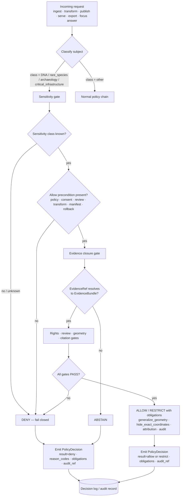

<!-- [KFM_META_BLOCK_V2]
doc_id: kfm://doc/adr-0010-deny-by-default-dna-rare-species-archaeology-infrastructure
title: ADR-0010 — Deny-by-Default for DNA, Rare Species, Archaeology, and Critical Infrastructure
type: standard
version: v1.1
status: draft
owners: TODO(owner): Policy steward; Governance steward; Domain stewards (people-dna-land, fauna, flora, archaeology, settlements-infrastructure)
created: 2026-05-11
updated: 2026-05-15
policy_label: public
related: [
  "docs/doctrine/directory-rules.md",
  "docs/doctrine/truth-posture.md",
  "docs/doctrine/trust-membrane.md",
  "docs/doctrine/lifecycle-law.md",
  "docs/adr/ADR-0001-schema-home.md",
  "docs/adr/ADR-0004-promotion-gate.md",
  "docs/adr/ADR-0006-governed-ai-runtime-envelope.md",
  "docs/adr/ADR-0008-sensitive-location-policy.md",
  "policy/sensitivity/",
  "data/registry/*/sensitivity_policies.yaml",
  "schemas/contracts/v1/policy/policy_decision.schema.json"
]
tags: [kfm, adr, governance, sensitivity, deny-by-default, dna, rare-species, archaeology, critical-infrastructure, policy-gate]
notes: [
  "ADR number 0010 conflicts with PROPOSED ADR-0010-catalog-proof-release-separation in the Pipeline Manual v0.3 register.",
  "Pipeline Manual v0.3 also lists PROPOSED ADR-0011-query-save-recompile-loop, so this revision no longer suggests ADR-0011 as the next-free ADR number.",
  "Topic substantially overlaps with PROPOSED ADR-0008-sensitive-location-policy. Resolution path: renumber, supersede ADR-0008, or merge — see §10 below.",
  "Path references are doctrine-aligned defaults or PROPOSED until verified against mounted-repo evidence."
]
[/KFM_META_BLOCK_V2] -->

# ADR-0010 — Deny-by-Default for DNA, Rare Species, Archaeology, and Critical Infrastructure

> **Fail-closed treatment of four sensitivity classes whose exact-location or identifying release is structurally irreversible. Public exposure is denied by default at every governed surface; allow requires explicit, evidenced, reviewed, receipted, scoped, and rollback-supported approval.**


| Field | Value |
|---|---|
| **ADR ID** | `ADR-0010` *(PROPOSED / CONFLICTED — see §10 for number conflict with prior register)* |
| **Title** | Deny-by-Default for DNA, Rare Species, Archaeology, and Critical Infrastructure |
| **Document status** | `draft` |
| **Decision status** | `proposed` |
| **Date** | 2026-05-11 |
| **Last updated** | 2026-05-15 |
| **Authority** | Governance doctrine — fail-closed policy gate |
| **Scope** | Cross-domain: people/DNA/land · fauna · flora · archaeology · settlements/infrastructure · roads/rail/transport |
| **Owners** | TODO(owner): Policy steward · Governance steward · Domain stewards |
| **Target path** | `docs/adr/ADR-0010-deny-by-default-for-dna-rare-species-archaeology-infrastructure.md` *(PROPOSED / CONFLICTED until ADR number sweep)* |
| **Supersedes** | None *(may supersede or merge with PROPOSED `ADR-0008-sensitive-location-policy` — see §10)* |
| **Superseded by** | — |
| **Depends on** | `ADR-0001-schema-home`, `ADR-0004-promotion-gate`, `ADR-0006-governed-ai-runtime-envelope`, and likely `ADR-0008-sensitive-location-policy` *(all relationship claims NEED VERIFICATION in mounted repo)* |

> [!NOTE]
> This ADR states **KFM doctrine and proposed ADR text**. Current implementation depth remains **UNKNOWN** where repo files, tests, workflows, dashboards, logs, emitted artifacts, mounted branch state, or runtime behavior have not been inspected.

> [!IMPORTANT]
> The ADR number is intentionally **not normalized silently**. `ADR-0010` is already used in a prior PROPOSED ADR register for catalog/proof/release separation, and `ADR-0011` is also listed in the Pipeline Manual v0.3 register for the query-save-recompile loop. Until the mounted `docs/adr/` directory is inspected, this file remains `PROPOSED / CONFLICTED`.

---

## Quick Navigation

- [1. Context](#1-context)
- [2. Decision](#2-decision)
- [3. Sensitivity Classes & Default Postures](#3-sensitivity-classes--default-postures)
- [4. Policy Gate Surface](#4-policy-gate-surface)
- [5. Decision Flow](#5-decision-flow)
- [6. Reason Codes & Obligations](#6-reason-codes--obligations)
- [7. Allow Path — What "Explicit Approval" Requires](#7-allow-path--what-explicit-approval-requires)
- [8. Consequences](#8-consequences)
- [9. Alternatives Considered](#9-alternatives-considered)
- [10. Open Issues — Number & Topic Conflicts](#10-open-issues--number--topic-conflicts)
- [11. Migration & Rollback](#11-migration--rollback)
- [12. Verification Plan](#12-verification-plan)
- [13. ADR Acceptance Criteria](#13-adr-acceptance-criteria)
- [Related Docs](#related-docs)

---

## 1. Context

KFM publishes a **map-first, evidence-first, time-aware** view across many domains. Four classes of content carry **structurally irreversible** harm if exposed at exact precision or in identifying form:

- **DNA / genomic data** — once a public link, kit identifier, match identifier, segment, or living-relative inference is exposed, downstream re-identification cannot be reliably recalled. **CONFIRMED doctrine:** DNA/genomics default to deny, restricted steward/research access only with policy approval, separate restricted storage, and no public AI inference.
- **Rare species exact locations** — exact occurrence, nest, den, hibernacula, roost, spawning, or steward-controlled site locations are exploitable for poaching, collection, disturbance, or habitat destruction. **CONFIRMED doctrine:** public exact location is denied; public products are generalized, redacted, buffered, gridded, or aggregated; geoprivacy transform receipts and steward review are required.
- **Archaeology** — exact site coordinates, burial locations, sacred or culturally sensitive materials, collection storage context, and security-sensitive site metadata enable looting, desecration, cultural harm, and private-landowner exposure. **CONFIRMED doctrine:** exact public location is denied by default; public output requires cultural/steward review and suppressed or generalized geometry.
- **Critical infrastructure** — exact facilities, dependencies, operational condition, inspection observations, vulnerability context, and continuity-critical network details are security-relevant. **CONFIRMED doctrine:** public precision is restricted or denied; public-safe aggregation and role-based access are required.

For this ADR, **exact-location or identifying release** includes:

| Release form | Examples |
|---|---|
| Exact coordinates or precise geometry | point coordinates, parcel-scale polygons, precise site footprints, facility nodes, route dependency edges |
| Identifying restricted fields | DNA kit IDs, vendor match IDs, segment coordinates, restricted source IDs, site IDs whose lookup reveals location |
| Reverse-engineerable derivatives | public tile patterns, graph edges, search results, screenshots, popups, embeddings, or exports that can reconstruct a sensitive precise location |
| AI-generated disclosure | Focus Mode or model text that states, infers, interpolates, or narrows exact sensitive locations or identifying DNA/living-relative facts |

These four classes share two structural properties:

1. **Reversibility is impossible.** A wrongful publication cannot be fully retracted; copies, screenshots, archives, and search-engine caches persist.
2. **Default-allow is unsafe.** A policy that allows by default and denies on exception will leak through any gap — schema oversight, source-role confusion, AI generation, screenshot, tile aggregation, graph projection, search index, export, or cached derivative.

The doctrinal response is **fail-closed**: every governed surface — ingest, validation, catalog, publish, runtime API, UI layer, Focus Mode answer, export, AI receipt, search index, graph projection, tile build, screenshot, and story surface — defaults to **deny** for these classes and requires affirmative, evidenced, reviewed approval to allow a public-safe derivative.

> [!IMPORTANT]
> This ADR does **not** decide *whether* sensitive content may ever be released. It decides that the **default posture is deny** for the four classes and that any allow path must traverse explicit policy, evidence, review, receipt, catalog/proof closure, and rollback machinery — never silently and never as a side effect.

---

## 2. Decision

**Adopt deny-by-default as the unconditional baseline** for the four sensitivity classes named in §3, enforced at every governed surface listed in §4, with the allow path described in §7.

### 2.1 Normative statements

1. **MUST** — Public release of exact-location or identifying records in the four classes — DNA/genomics, rare species exact locations, archaeology, and critical infrastructure — MUST default to `deny` in `PolicyDecision.result` when any allow precondition is absent.
2. **MUST** — Unknown, missing, ambiguous, stale, or unresolved sensitivity MUST fail closed. `unknown` is not a public-safe state.
3. **MUST** — Every `deny`, `restrict`, `abstain`, `review_needed`, or `error` MUST carry structured `reason_codes`; where applicable, it MUST carry `obligations`.
4. **MUST** — The policy gate set described in §4 MUST fail closed (`deny`, `restrict`, `review_needed`, `abstain`, or `error`; never silent allow) on any of: unknown sensitivity class, unresolved `EvidenceRef`, unresolved rights, missing review record, missing transform receipt, missing release manifest, missing rollback target, or public payload containing restricted exact geometry.
5. **MUST** — `EvidenceRef` MUST resolve to `EvidenceBundle` before any consequential claim, map popup, Evidence Drawer payload, Focus Mode answer, export, tile layer, graph projection, catalog record, or release artifact becomes authoritative or public-facing.
6. **MUST** — AI and Focus Mode surfaces MUST NOT produce exact-location or identifying output in these classes regardless of EvidenceBundle content. AI output is interpretive, not authoritative; EvidenceBundle, PolicyDecision, review state, and release state outrank generated language.
7. **MUST NOT** — Public clients MUST NOT read canonical, RAW, WORK, QUARANTINE, restricted, graph-internal, vector-index, or model-runtime stores directly. The trust membrane — governed API plus released artifacts — is the only normal public path.
8. **MUST NOT** — Connectors, watchers, or pipelines MUST NOT write to `data/published/` for these classes without traversing the full promotion gate, including sensitivity-class review. Promotion is a governed state transition, not a file move.
9. **SHOULD** — `restricted_precise` content for these classes SHOULD live in access-controlled storage with role-based access, audit logging, and clear separation from public-safe derivatives.
10. **SHOULD** — Public-safe derivatives SHOULD record the transform from restricted input to public output using a transform receipt that captures method, precision class, reason code, policy version, actor/run, input digest, and output digest.

### 2.2 What is unchanged

This ADR does not change:

- identity rules;
- schema homes;
- source-role taxonomy;
- lifecycle phase definitions;
- promotion-gate doctrine;
- EvidenceBundle semantics;
- release/proof/receipt separation;
- public-client trust membrane doctrine.

Those remain governed by the applicable ADRs and by the canonical lifecycle invariant:

```text
RAW -> WORK / QUARANTINE -> PROCESSED -> CATALOG / TRIPLET -> PUBLISHED
```

### 2.3 Outcome vocabulary split

KFM uses two related finite-outcome surfaces. This ADR preserves the distinction.

| Surface | Finite outcomes | Role |
|---|---|---|
| `PolicyDecision.result` | `allow`, `deny`, `restrict`, `abstain`, `review_needed`, `error` | Policy and release admissibility decision |
| `RuntimeResponseEnvelope.status` / `DecisionEnvelope.outcome` | `ANSWER`, `ABSTAIN`, `DENY`, `ERROR` | Public/API/AI/runtime response wrapper |

A policy `deny` normally maps to runtime `DENY`. Evidence closure failure normally maps to runtime `ABSTAIN`. Infrastructure or validator failure normally maps to runtime `ERROR`. No sensitive class may silently downgrade to informal prose.

---

## 3. Sensitivity Classes & Default Postures

The table below normalizes the four classes from KFM's Sensitive / Deny-by-Default doctrine and domain-lane blueprints.

| Class | Examples | Default Public Posture | Allow Precondition | Source Basis |
|---|---|---|---|---|
| **DNA / genomic** | DNA matches, segments, vendor/kit IDs, living-relative inference, raw match tables | `DENY` public; restricted store only; no public AI inference | Explicit policy + scoped consent + access control + audit + no public inference path + revocation path | `SRC-PEOPLE`; People/DNA/Land Blueprint |
| **Rare species exact location** | Exact occurrence; nest/den/hibernacula/roost/spawning sites; steward-controlled observations | `DENY` exact; public-safe generalized only: county/grid/buffered/withheld/aggregate | Generalization/redaction transform receipt + steward review + source terms + release manifest | `SRC-FAUNA`, `SRC-FLORA`; Fauna §12; Flora §12 |
| **Archaeology** | Site coordinates; burial; human remains; sacred/culturally sensitive; collection storage/security | `DENY` exact; suppress or generalize | Cultural/steward review + public-safe geometry + looting-risk assessment + transform receipt | `SRC-ARCH`; Archaeology security/sensitivity posture |
| **Critical infrastructure** | Exact facilities; dependencies; condition/inspection observations; continuity-critical networks; security details | `RESTRICT` / `DENY` public precision | Security review + public-safe transform + access-role gate + audit | `SRC-SET`, `SRC-ROAD`; Settlements/Infrastructure Plan |

> [!NOTE]
> Additional sensitivity classes — **living persons**, **sacred/culturally sensitive places**, **private landowner-sensitive data**, **source-rights-limited records**, and **emergency-warning misuse** — also fail closed in parent doctrine. This ADR is narrower: it carves out four classes whose harm-on-leak is especially irreversible at exact precision or identifying form.

### 3.1 Mapping to lifecycle phases

| Phase | Allowed for these classes | Forbidden |
|---|---|---|
| `data/raw/` | Immutable source captures; steward-only or restricted access where required | Public read; raw kit IDs in logs; exact archaeology/fauna/infrastructure coordinates in public artifacts |
| `data/work/` | Parsed/normalized intermediates; restricted exact geometry; policy staging | Publication; public-safe derivatives treated as released |
| `data/quarantine/` | Failed, rights-unknown, sensitivity-unresolved, or review-blocked records | Promotion without review disposition |
| `data/processed/` | Validated normalized records; restricted by default until release gates pass | Public exact geometry; raw DNA IDs; restricted infrastructure condition data |
| `data/catalog/` | Metadata for released public-safe assets only | Restricted exact geometry in public STAC/DCAT records |
| `data/triplets/` | Graph deltas without restricted geometry or identity leakage | Restricted relations exposed publicly or used to reconstruct exact location |
| `data/published/` | Only promoted public-safe artifacts and aliases | RAW/WORK/QUARANTINE refs; restricted exact coordinates; unreviewed sensitive artifacts |
| `data/receipts/` | Transform, run, redaction, revocation, review, and policy receipts | Raw sensitive IDs; restricted segment values; private exact coordinates in public-readable receipt payloads |
| `data/proofs/` | EvidenceBundles, proof packs, release manifests, rollback cards | Raw source data; private DNA; restricted exact location payloads |

---

## 4. Policy Gate Surface

Deny-by-default is enforced at **every** surface in the trust spine, not only at publish.

| Gate | Role for these four classes | Default on uncertainty |
|---|---|---|
| `source_role_gate` | Rejects unknown or inappropriate source role for sensitive claims | `deny` |
| `rights_gate` | Rejects public release when license, terms, redistribution, consent, or attribution are unclear | `deny` |
| `sensitivity_gate` | **Primary gate** — restricts or denies sensitive locations, DNA/genomics, archaeology, infrastructure | `deny` |
| `evidence_closure_gate` | Requires `EvidenceRef -> EvidenceBundle` resolution before claim-bearing release | `abstain` |
| `geometry_gate` | Checks CRS, validity, precision, uncertainty, support, generalization, and reverse-engineering risk | `deny` on insufficient generalization |
| `citation_gate` | Rejects generated or public claims without validated citations | `abstain` |
| `review_gate` | Requires steward/reviewer decision for promotion and sensitive releases | `deny` until review record present |
| `release_gate` | Requires ReleaseManifest + proof + correction path + rollback target | `deny` |
| `rollback_gate` | Requires tested rollback card and release lineage | `deny` |

### 4.1 Runtime surfaces

| Surface | Behavior on sensitive request |
|---|---|
| Governed API | Returns a finite response envelope with `ANSWER`, `ABSTAIN`, `DENY`, or `ERROR`; sensitive exact disclosure maps to `DENY` |
| Public API DTOs | Public payloads omit restricted exact geometry, raw IDs, internal refs, private fields, and reverse-engineerable joins |
| MapLibre layer manifest | Public layer never contains restricted exact geometry; `LayerManifest.sensitivity_transform` or equivalent records public-safe transform receipt |
| Evidence Drawer | Shows source role, policy state, release state, transform receipt, sensitivity posture, correction lineage, and public-safe evidence only |
| Focus Mode / governed AI | `DENY` direct sensitive coordinate or DNA-identifying disclosure; `ABSTAIN` on insufficient evidence; cite EvidenceBundle or refuse |
| AI receipts | `AIReceipt` records refusal/abstention reason; no embedding store may surface restricted text |
| Search / vector index | Restricted records excluded by default; public index built only from released or review-authorized evidence |
| Graph / triplet projection | Restricted geometries and identities never enter public graph; no-leak validator runs pre-publication |
| Exports / screenshots / reports | Public exports preserve citations and release metadata; restricted exact geometry and identifying DNA content are suppressed |
| Tiles (PMTiles/MVT/raster) | Public tiles built from released public-safe artifacts only; restricted tiles, if any, require auth, role gate, and audit |
| Story Nodes / dashboards | Narrative surfaces consume released artifacts and EvidenceBundles; they do not publish new truth |

---

## 5. Decision Flow



> [!NOTE]
> The diagram describes the **doctrinal** flow. The exact gate ordering, validator names, policy module names, and decision-log home are **PROPOSED / NEEDS VERIFICATION** until verified against mounted-repo policy code, schemas, and tests.

---

## 6. Reason Codes & Obligations

`PolicyDecision.result` is finite (`allow | deny | restrict | abstain | review_needed | error`). The codes below are the **minimum shared reason-code surface** this ADR commits to. Lane-specific extensions MAY exist under the appropriate `policy/<lane>/` home once verified.

### 6.1 Deny / restrict / abstain reason codes

| Reason Code | Trigger |
|---|---|
| `SENSITIVE_LOCATION_BLOCKED` | Precise sensitive location cannot be released |
| `precise_sensitive_location_denied` | Lane-specific exact-geometry denial |
| `dna_public_inference_blocked` | DNA-based relationship inference requested on public surface |
| `dna_raw_identifier_blocked` | Raw kit ID, vendor match ID, segment coordinate, or identifying genomic field requested on public surface |
| `living_relative_reidentification_risk` | Output could identify a living relative or family relationship without approved basis |
| `cultural_sensitivity_unresolved` | Tribal/cultural sensitivity status unresolved; no public release |
| `looting_risk_exposure` | Public exposure would create looting, poaching, collection, or desecration risk |
| `critical_infrastructure_exact_blocked` | Exact facility geometry, dependency, or condition observation blocked |
| `geoprivacy_required` | Source geoprivacy or KFM sensitivity policy requires generalization |
| `public_geometry_not_generalized` | Public payload contains insufficiently generalized geometry |
| `public_payload_exposes_internal_ref` | Public payload references RAW/WORK/QUARANTINE, restricted, or canonical-internal store |
| `restricted_graph_leakage` | Public graph/triplet/search/index output can reconstruct restricted exact location or identity |
| `RAW_CONTEXT_FORBIDDEN` | AI or public runtime attempted to use RAW/WORK/QUARANTINE context |
| `RIGHTS_UNKNOWN` | Rights/license/consent/citation obligations not resolved |
| `EVIDENCE_NOT_PUBLISHED` | Evidence exists but has not passed promotion/release gates |
| `EVIDENCE_REF_UNRESOLVED` | EvidenceRef does not resolve to an admissible EvidenceBundle |
| `review_required` | Required steward/cultural/security/policy review not present |
| `steward_review_missing` | Lane-specific steward review missing |
| `transform_receipt_missing` | Redaction/generalization/suppression transform lacks receipt |
| `rollback_target_missing` | Release or public exposure lacks rollback target |

### 6.2 Allow / restrict obligations

When the allow path is taken, the `PolicyDecision.obligations` array MUST carry all applicable obligations below; downstream renderers and APIs MUST honor them.

| Obligation | Effect |
|---|---|
| `generalize_geometry` | Public payload carries generalized/buffered/grid/county/watershed/bbox geometry only |
| `hide_exact_coordinates` | Exact coordinates suppressed in all public surfaces, drawer, tiles, exports, screenshots, and Focus Mode |
| `suppress_geometry` | Geometry withheld entirely; metadata or aggregate may publish if otherwise allowed |
| `show_attribution` | Required attribution text emitted with response or artifact |
| `show_sensitivity_notice` | Public UI displays generalized/restricted/steward-review posture |
| `steward_review_recorded` | `ReviewRecord` ref must be present in EvidenceBundle or proof pack |
| `transform_receipt_present` | Geoprivacy/redaction/suppression receipt must accompany the artifact |
| `restricted_access_only` | Response served only to authenticated, audited roles |
| `audit_logged` | Decision recorded to audit/decision log with `audit_ref` |
| `no_public_ai_inference` | AI cannot infer or restate identifying DNA/living-relative or exact-location content |
| `release_manifest_required` | Public or semi-public exposure requires ReleaseManifest |
| `rollback_card_required` | Release requires rollback target and rollback card |

---

## 7. Allow Path — What "Explicit Approval" Requires

The allow path is **narrow, scoped, and evidenced**. The following minimum bundle is required for every promotion that exposes any portion of a record in these classes to a public or semi-public surface.

<details>
<summary><strong>Allow precondition bundle</strong></summary>

1. **SourceDescriptor** — `source_id`, `source_role`, `rights_status`, `sensitivity_class`, source terms, activation state, limitations, and authority scope.
2. **EvidenceBundle** — resolved `EvidenceRef`, scope, source-role visibility, uncertainty, review state, release state, correction lineage, and policy posture.
3. **ReviewRecord** — appropriate reviewer: policy admin for DNA, cultural/steward reviewer for archaeology or cultural sensitivity, wildlife/flora steward for rare species, security reviewer for infrastructure; includes decision and effective period.
4. **GeoprivacyTransformReceipt** — for rare species, archaeology, and infrastructure: method, precision bucket, input digest, output digest, reason code, actor/run, and policy version. Schema home is PROPOSED: `schemas/contracts/v1/<lane>/geoprivacy_transform_receipt.schema.json`.
5. **ConsentGrant + RevocationReceipt path** — for DNA/genomics: unrevoked, unexpired, scoped consent with documented revocation path where consent is the legal basis.
6. **ReleaseManifest** — released artifacts, hashes, inputs, policy decisions, proof pack references, expiration/stale rules, correction path, and rollback target.
7. **RollbackCard** — tested rollback target with `from_release_id`, `to_release_id`, prior manifest verification, prior catalog verification, and prior EvidenceBundle verification.
8. **CatalogMatrix** — STAC/DCAT/PROV closure, confirming no restricted exact geometry or identifying restricted fields leak into public catalog records.
9. **AIReceipt** — if AI is on the path: provider/model or adapter, prompt template hash, evidence bundle refs, policy pre/post checks, citation validation, outcome, refusal/abstention reasons.
10. **No-leak validator pass** — `assert_no_restricted_geometry_in_public_payload` or repo-confirmed equivalent returns PASS for APIs, tiles, exports, screenshots, Evidence Drawer, Focus Mode, graph, and search/index outputs.

</details>

> [!WARNING]
> Absent any one of items 1–10, the gate MUST return `deny`, `restrict`, or `abstain` depending on failure class. There is no shortcut, admin override, or "expedited release" path for these four classes that bypasses the bundle. Admin shortcuts, if they exist, must be justified, constrained, documented, audited, and kept out of the normal public path.

### 7.1 What allow does **not** authorize

Allow does **not** authorize:

- publishing exact coordinates as a permanent public artifact;
- publishing raw DNA/genomic identifiers or match details;
- AI fabrication, interpolation, or narrowing of exact sensitive location;
- bulk re-export of restricted data without role, audit, purpose, and release scope;
- connector or watcher writes to `data/published/`;
- hidden sensitive geometry in style rules, tiles, screenshots, popups, graph projections, search results, or embedding stores;
- treating a generalized public derivative as canonical truth.

Allow typically authorizes a **public-safe derivative**: generalized geometry, withheld geometry, aggregation, uncertainty-aware summary, reviewed narrative, or restricted-role response.

---

## 8. Consequences

### 8.1 Positive

- **Irreversibility risk reduced.** Silent exposure of exact sensitive location or identifying DNA data becomes structurally hard rather than procedurally hard.
- **Reason codes are auditable.** Every denial carries a structured reason; reviewers and dashboards can analyze denial-rate by source, lane, and class.
- **Trust membrane reinforced.** The public path is unambiguously through governed APIs and released artifacts; canonical and restricted stores remain inaccessible to public clients.
- **AI remains subordinate to evidence.** Focus Mode and AI receipts cannot drift into sovereign truth; EvidenceBundle and PolicyDecision outrank generated language.
- **Per-lane consistency without per-lane policy forks.** A shared sensitivity surface lets each domain lane carry lane-specific rules without inventing parallel governance homes.
- **Correction and rollback stay visible.** Public-safe releases remain tied to ReleaseManifest, correction path, and RollbackCard.

### 8.2 Negative / Costs

- **Operator friction.** Stewards must populate review records, transform receipts, and rollback cards before a sensitive release can move.
- **False denies.** Fail-closed posture will produce some incorrect denials. Structured reason codes mitigate this by making unblock requirements visible.
- **Generalization loss.** Public users may see county/grid/buffered/withheld geometry where source data has exact coordinates.
- **Performance cost.** DTO validation, policy evaluation, no-leak validators, and EvidenceBundle resolution add request-time and build-time cost.
- **Tooling burden.** Policy-as-code, schema validation, transform receipts, and no-leak tests require maintained fixtures and CI coverage.
- **Number/register cleanup.** This ADR adds value only if the ADR-number and ADR-0008 topic overlap are resolved rather than left as permanent ambiguity.

### 8.3 Risks and mitigations

| Risk | Mitigation |
|---|---|
| Policy bypass via direct DB/store access | Trust membrane: no public client reads canonical, restricted, RAW, WORK, QUARANTINE, graph-internal, vector-index, or model-runtime stores |
| AI hallucinates exact coordinates | EvidenceBundle outranks AI; citation gate + no-leak validator on AI output; Focus Mode maps policy deny to runtime `DENY` |
| Connector publishes directly to PUBLISHED | Connector role limited to source-edge, RAW, or QUARANTINE; promotion is a governed state transition |
| Tile aggregation reveals restricted points | Tile build runs only against released public-safe artifacts; sensitivity transformed before publication |
| Embedding store leaks restricted text | Public index built only from released or review-authorized evidence; restricted text excluded by default |
| Reviewer fatigue causes rubber-stamping | Decision logs auditable; denial-rate and review-anomaly dashboards; steward role separation where maturity justifies |
| ADR number conflict persists | Drift register entry + ADR sweep; no silent renumbering |
| Public derivative is mistaken for canonical truth | Layer/Evidence Drawer labels show transform, uncertainty, release state, and evidence support |

---

## 9. Alternatives Considered

| Alternative | Why rejected |
|---|---|
| **Default-allow with deny exceptions** | Inverts the failure mode: any gap in the rule set leaks exact sensitive location or identifying DNA data. Irreversibility makes this unsafe. |
| **Per-domain policy with no cross-lane invariant** | Encourages lane forks, divergent vocabulary, and inconsistent reason codes. Cross-lane sensitivity cases require a shared surface. |
| **AI judgment as the gate** | AI is interpretive, not root truth. Fluent generation cannot stand in for evidence, policy, review, source authority, release state, or consent. |
| **Quarantine-only without explicit deny semantics** | Quarantine handles unresolved cases; runtime still needs `deny`, `restrict`, and `abstain` with reason codes for APIs, UI, Focus Mode, exports, and review surfaces. |
| **Static redaction at publish only, no upstream gating** | Late redaction is fragile and fails when upstream artifacts — tiles, graph projections, vector indexes, screenshots, or search views — are built from canonical data. |
| **Treat all sensitive content equally as "restricted"** | Loses signal: DNA, rare species, archaeology, and infrastructure have different review paths, stewards, obligations, and public-safe derivative profiles. |

---

## 10. Open Issues — Number & Topic Conflicts

> [!IMPORTANT]
> The filename used for this ADR creates two reconcilable issues with the existing PROPOSED ADR register. This section documents the conflicts so the ledger remains coherent whichever number/title is chosen.

### 10.1 Number conflict (`ADR-0010`)

The Pipeline Living Implementation Manual v0.3 carries a PROPOSED ADR register that already assigns:

| ID | Status | Topic |
|---|---|---|
| `ADR-0010-catalog-proof-release-separation` | `proposed` | Separate receipts, proofs, catalogs, releases, reviews, corrections |

That ADR is structurally different from this one.

The same v0.3 register also lists:

| ID | Status | Topic |
|---|---|---|
| `ADR-0011-query-save-recompile-loop` | `new proposed` | Governed incremental improvement loop and constraints |

Therefore this ADR MUST NOT assume `ADR-0011` is the next-free number. Resolution options:

1. **Renumber this ADR** to the next free number after a sweep of the mounted `docs/adr/` directory and accepted/proposed ADR register.
2. **Reserve this ADR as a named draft without final number** until the ADR register is reconciled.
3. **Reassign prior proposed ADR numbers** only through a documented ADR/register update, never by silent renumbering.
4. **Keep the current filename temporarily** but mark it `PROPOSED / CONFLICTED` and block acceptance until the number is resolved.

### 10.2 Topic overlap (`ADR-0008-sensitive-location-policy`)

The same register lists:

| ID | Status | Topic |
|---|---|---|
| `ADR-0008-sensitive-location-policy` | `proposed` | Fail-closed treatment for sensitive exact locations |

This ADR is a narrower, more explicit articulation of that doctrinal area with class-specific obligations. Resolution options:

1. **Merge** — replace `ADR-0008` with this ADR if this ADR becomes the umbrella sensitive-location policy, and mark `ADR-0008` `superseded` with a forward link.
2. **Layer** — keep `ADR-0008` as the umbrella sensitive-location policy and let this ADR define the four high-irreversibility classes. The two ADRs reference each other; this ADR cites `ADR-0008` in `Depends on`.
3. **Promote this ADR to umbrella** — expand §3 to include all classes from the Sensitive / Deny-by-Default Register: living persons, sacred places, source-rights-limited records, private landowner-sensitive records, and emergency-warning misuse. `ADR-0008` is superseded.
4. **Split** — keep DNA/genomics under a People/DNA ADR and keep rare species, archaeology, and infrastructure under a sensitive-location ADR. This is only advisable if cross-lane reason-code consistency remains shared.

### 10.3 Recommendation

> [!NOTE]
> Defer the final number/title decision until the mounted `docs/adr/` directory and ADR register are inspected. In the interim, treat the filename and ADR ID as **PROPOSED / CONFLICTED**. Open a drift entry in `docs/registers/DRIFT_REGISTER.md` once the repo is mounted and resolve via an ADR/register meta-step, not by silent renumbering.

---

## 11. Migration & Rollback

### 11.1 Migration plan

| Step | Action | Validation |
|---|---|---|
| 1 | Inventory mounted `docs/adr/`, `policy/`, `schemas/`, `contracts/`, `data/registry/`, `tests/`, `tools/validators/`, `apps/`, and `release/` homes | Repo scan + drift register entry for any conflict |
| 2 | Resolve ADR number conflict and relationship to `ADR-0008` | ADR/register update accepted; old anchors retained or redirected |
| 3 | Confirm schema home for `PolicyDecision`, transform receipts, ReviewRecord, ReleaseManifest, RollbackCard, and EvidenceBundle | ADR-0001 alignment + schema registry check |
| 4 | Confirm or create lane sensitivity policy registries such as `data/registry/<lane>/sensitivity_policies.yaml` | Schema validation + valid/invalid fixtures |
| 5 | Confirm or create `schemas/contracts/v1/policy/policy_decision.schema.json` carrying finite result, reason codes, obligations, policy version, and audit refs | JSON Schema validation + fixture pass |
| 6 | Confirm or create sensitivity gate policy module(s) and no-leak validator(s) under repo-confirmed policy/tool homes | Policy fixtures pass/fail |
| 7 | Wire gates into promotion gate and governed AI runtime envelope | End-to-end fixture: candidate -> policy -> EvidenceBundle -> runtime envelope |
| 8 | Update per-root and per-lane READMEs affected by policy, schema, validator, or API behavior | Docs lint + link checks |
| 9 | Add reason-code documentation to steward runbooks | Steward review |
| 10 | Add decision-log retention and archival policy | Decision-log schema + retention test |

### 11.2 Rollback plan

If this ADR is later determined to be wrong, insufficient, or superseded, rollback is a **governed action**, not silent deletion.

| Action | Required behavior |
|---|---|
| **RollbackCard** | References prior policy bundle digest, prior gate behavior, reviewer/steward signoff, audit refs, and affected releases |
| **CorrectionNotice** | Records superseded/corrected claims, public-safe explanation, EvidenceBundle ref, timestamp, and release impact |
| **Supersession** | Mark this ADR `superseded` with a forward link to replacing ADR; do not delete |
| **Policy revert** | Revert policy bundle digest; emit new decision/audit record capturing change-of-rule |
| **Artifact revalidation** | Re-run promotion-gate fixtures; verify no public artifact silently changed posture |
| **Layer/search/index invalidation** | Rebuild or disable derived surfaces that might have relied on the old policy posture |

### 11.3 Backward compatibility

- Existing PROPOSED policy modules (`policy/archaeology/`, `policy/fauna/`, `policy/flora/`, `policy/infrastructure/`, `policy/people_dna_land/`) SHOULD align with this ADR's deny-by-default posture once verified.
- Reason-code names introduced in §6 are additive; existing fixtures using older codes MAY be mapped via a `reason_code_alias` table in a repo-confirmed policy home.
- The schema-home decision remains governed by `ADR-0001` and Directory Rules. This ADR MUST NOT create parallel schema authority in both `contracts/` and `schemas/`.

---

## 12. Verification Plan

> [!CAUTION]
> Every claim about current repo state, file paths, policy modules, validator names, route names, workflows, and runtime behavior below is **PROPOSED / NEEDS VERIFICATION** until the mounted repo is inspected. This ADR does not assert that any of these files currently exist.

| Verification item | Method | Status |
|---|---|---|
| ADR number availability | `git ls-tree docs/adr/` plus ADR/register sweep | **NEEDS VERIFICATION** |
| Relationship to `ADR-0008-sensitive-location-policy` | Inspect ADR body/status/supersession links | **NEEDS VERIFICATION** |
| `docs/adr/` canonical ADR home | Check Directory Rules and mounted repo docs | **CONFIRMED doctrine / NEEDS VERIFICATION repo** |
| `policy/` vs `policies/` canonical home | Check Directory Rules and mounted repo | **CONFIRMED doctrine for `policy/` / NEEDS VERIFICATION repo** |
| `schemas/contracts/v1/policy/policy_decision.schema.json` exists | Repo inspection | **NEEDS VERIFICATION** |
| `data/registry/<lane>/sensitivity_policies.yaml` exists per lane | Repo inspection | **NEEDS VERIFICATION** |
| Sensitivity gate covers four classes | Policy/test inspection | **NEEDS VERIFICATION** |
| No-leak validators cover API, tiles, graph, search, export, screenshot, Focus Mode | Validator/test inspection | **NEEDS VERIFICATION** |
| Promotion-gate fixtures cover deny-by-default classes | `tests/policy/` and `tests/e2e/` inspection | **NEEDS VERIFICATION** |
| Governed-AI runtime envelope honors reason codes and finite outcomes | API/Focus adapter inspection | **NEEDS VERIFICATION** |
| Public clients cannot read canonical or restricted stores directly | UI/API route inspection + tests | **NEEDS VERIFICATION** |
| Tile-build pipeline reads released public-safe artifacts only | Pipeline inspection + tile fixture tests | **NEEDS VERIFICATION** |
| Decision-log retention policy | Repo/runbook inspection | **NEEDS VERIFICATION** |
| Steward role names and review SLAs | Governance manifest / CODEOWNERS / review records | **NEEDS VERIFICATION** |
| OPA / Conftest / policy engine version | CI workflow inspection | **NEEDS VERIFICATION** |
| Rollback card fixtures and drills exist | `release/`, `data/proofs/`, tests inspection | **NEEDS VERIFICATION** |

[Back to top](#adr-0010--deny-by-default-for-dna-rare-species-archaeology-and-critical-infrastructure)

---

## 13. ADR Acceptance Criteria

This ADR may move from `draft` / `proposed` toward accepted only when the following are true:

- [ ] ADR number conflict resolved and recorded in ADR/register history.
- [ ] Relationship to `ADR-0008-sensitive-location-policy` resolved: merge, layer, supersede, or split.
- [ ] Directory Rules placement checked against mounted repo evidence.
- [ ] PolicyDecision schema home verified or ADR-backed.
- [ ] Reason-code and obligation vocabulary added to policy registry or equivalent control plane.
- [ ] Valid and invalid fixtures cover all four classes.
- [ ] No-leak validator covers public API, Evidence Drawer, Focus Mode, tiles, exports, screenshots, graph, search, and vector index.
- [ ] Sensitive public-release allow path requires SourceDescriptor, EvidenceBundle, ReviewRecord, transform receipt where applicable, ReleaseManifest, CatalogMatrix, rollback target, and proof closure.
- [ ] Admin/restricted paths are auth-gated, audited, and documented as not normal public paths.
- [ ] RollbackCard and CorrectionNotice paths are tested.
- [ ] Public-client direct access to canonical, restricted, RAW, WORK, QUARANTINE, graph-internal, vector-index, or model-runtime stores is denied by tests.
- [ ] Documentation updates are linked from relevant policy, domain, API/UI, and release docs.
- [ ] Remaining UNKNOWNs are logged in a verification backlog.

---

## Related Docs

- `docs/doctrine/directory-rules.md` — root-folder authority, canonical/compatibility roots, ADR-change triggers
- `docs/doctrine/truth-posture.md` — cite-or-abstain default; deny on irreversibility
- `docs/doctrine/trust-membrane.md` — governed API and released artifacts as normal public path
- `docs/doctrine/lifecycle-law.md` — RAW -> WORK/QUARANTINE -> PROCESSED -> CATALOG/TRIPLET -> PUBLISHED
- `docs/adr/ADR-0001-schema-home.md` *(PROPOSED / NEEDS VERIFICATION)* — schema home authority
- `docs/adr/ADR-0004-promotion-gate.md` *(PROPOSED / NEEDS VERIFICATION)* — promotion as governed state transition
- `docs/adr/ADR-0006-governed-ai-runtime-envelope.md` *(PROPOSED / NEEDS VERIFICATION)* — finite runtime outcomes
- `docs/adr/ADR-0008-sensitive-location-policy.md` *(PROPOSED — see §10 for relationship to this ADR)*
- `docs/adr/ADR-0010-catalog-proof-release-separation.md` *(PROPOSED conflict; prior register topic)*
- `docs/adr/ADR-0011-query-save-recompile-loop.md` *(PROPOSED conflict with “next-free ADR-0011” assumption)*
- `docs/registers/POLICY_REGISTRY.md` *(PROPOSED)* — registry of policy modules and outcome mappings
- `docs/registers/VERIFICATION_BACKLOG.md` *(PROPOSED)* — open verification items
- `docs/registers/DRIFT_REGISTER.md` *(PROPOSED)* — drift entries for number/topic conflicts surfaced in §10

---

<sub>**Last updated:** 2026-05-15 · **Document status:** `draft` · **Decision status:** `proposed` · **ADR ID:** `ADR-0010` / `PROPOSED / CONFLICTED` · **Owners:** TODO(owner): Policy steward · Governance steward · Domain stewards</sub>

[Back to top](#adr-0010--deny-by-default-for-dna-rare-species-archaeology-and-critical-infrastructure)