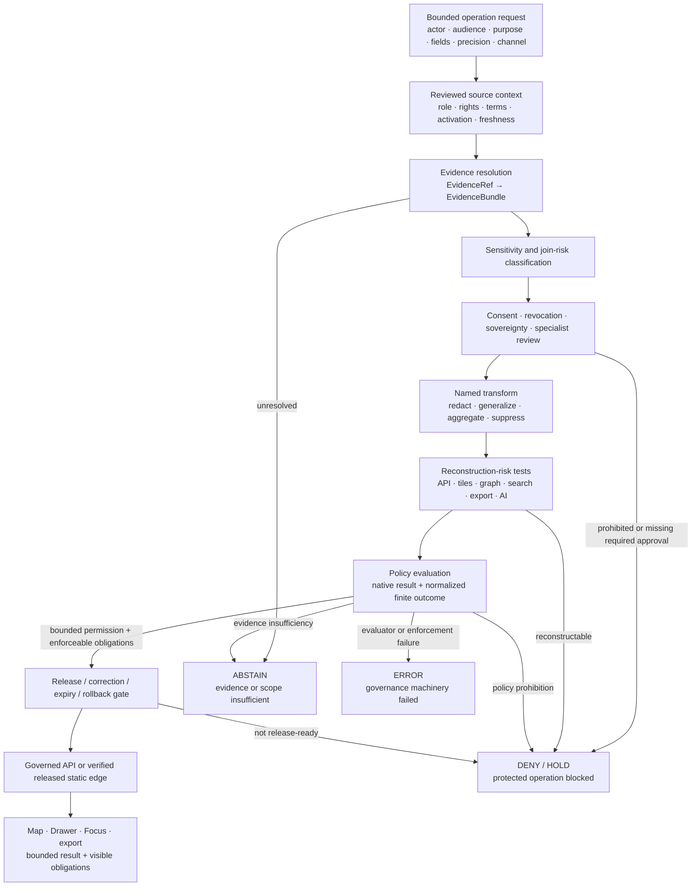

<!-- [KFM_META_BLOCK_V2]
doc_id: kfm://doc/adr-0010-deny-by-default-dna-rare-species-archaeology-infrastructure
title: "ADR-0010 — Deny-by-Default for DNA, Rare Species, Archaeology, and Critical Infrastructure"
type: adr
adr_id: ADR-0010
version: v1.2
status: draft
owners:
  - "NEEDS VERIFICATION — architecture decision owner"
  - "NEEDS VERIFICATION — policy steward"
  - "NEEDS VERIFICATION — privacy, living-person, and genomics reviewer"
  - "NEEDS VERIFICATION — fauna and flora stewards"
  - "NEEDS VERIFICATION — archaeology, cultural-sovereignty, and rights-holder reviewer"
  - "NEEDS VERIFICATION — security and critical-infrastructure reviewer"
owner_status: "CODEOWNERS routes docs/adr/, policy/, schemas/, release/, governed applications, tests, fixtures, and the named sensitive-domain documentation lanes to @bartytime4life; accepted stewardship, required-review rules, decision quorum, and independent approval controls were not verified"
reviewers_required:
  - Architecture steward
  - Docs steward
  - Policy steward
  - Evidence and source steward
  - Privacy, living-person, and genomics reviewer
  - Fauna and flora stewards
  - Archaeology, cultural-sovereignty, and rights-holder reviewer
  - Security and critical-infrastructure reviewer
  - Governed API and Explorer Web maintainers
  - Release and rollback steward
created: 2026-05-11
updated: 2026-07-23
policy_label: public
truth_posture: cite-or-abstain
responsibility_root: docs/
current_path: docs/adr/ADR-0010-deny-by-default-for-dna-rare-species-archaeology-infrastructure.md
supersedes: []
superseded_by: null
evidence_snapshot:
  repository: bartytime4life/Kansas-Frontier-Matrix
  base_ref: main
  base_commit: 639621581d4edc39611e7faded209d9f37dcbd14
  inspection_origin_commit: f4f48a7edbc4080267d50943223ab56d4f1ef154
  continuity_compare: f4f48a7edbc4080267d50943223ab56d4f1ef154...639621581d4edc39611e7faded209d9f37dcbd14
  relevant_path_changes_after_inspection: 0
  target_prior_blob: 691251190211b32fe47cba1546adb6c93ad5ea76
  adr_index_blob: cf08fae322ac53426f7394d97897fdb942253049
  directory_rules_blob: 2affb080e6f0043867c64c7f06c1ca52030fbd55
  codeowners_blob: dd2a84aa514d8ecd9208bc347f90f9a2ed37dd61
  policy_root_readme_blob: fa9378a6a699d0985fd018dbdb9f27c15efcb1c3
  domain_policy_readme_blob: 9babcdc53c0df68f23a2f897371e877108491864
  sensitivity_root_readme_blob: 635bbed7f1ca58f7fea5bd0a4956cdc8becb7529
  policy_decision_contract_blob: ebfe97f98263e6309db6d2772cb2c5e548819650
  policy_decision_schema_blob: 1472d26a42c73f17545b4464a275412ffa1d098e
  policy_test_workflow_blob: ba22e40b171b70a5e56fdbb35e44f6664e15487d
  policy_boundary_guards_workflow_blob: 6d442a6cdd0b146cd4003cbf1d7c619a455a16ae
  archaeology_policy_readme_blob: 8d03cdb11361739e7ad33214f76a0cfe4836ff9b
  fauna_policy_readme_blob: 39b7c7dd8596149ae9a72208f693056c97f2c6
  flora_policy_readme_blob: b040bff13e654cff9d2f7336d6d6783c8467eaa9
  people_dna_land_policy_readme_blob: 571a4a6d5c8ba7cf6c1fa9fcdd63da88bc05eb2a
  settlements_infrastructure_policy_readme_blob: c3e612e83864954859ff419e2638288b292cd6c4
  archaeology_workflow_blob: 18aabc65e79e1cc70d81be71f8b7ef34c017f51b
  fauna_workflow_blob: 199305953a3149124eb4070b9d86b1fe517be67b
  flora_workflow_blob: c792d126e5726d8895f56fd97800bee7fcba4a15
  people_dna_land_workflow_blob: bb5626ff3aaba558070f53807027e70b2ba89a6e
  settlements_infrastructure_workflow_blob: c43d5bca79ee6b4d3b6177d0985e917825953b2e
  governed_api_evidence_route_blob: e49f68791b967e59e20359a849350405450f7e3c
  governed_api_stub_blob: 5d7c137d2e78ddfca35a1356a96333ac2e84952b
related:
  - docs/adr/README.md
  - docs/adr/INDEX.md
  - docs/adr/ADR-0001-schema-home--schemas-contracts-v1-is-canonical.md
  - docs/adr/ADR-0003-policy-singular-is-canonical-(policies-is-compatibility).md
  - docs/adr/ADR-0004-apps-governed-api-is-the-trust-membrane.md
  - docs/adr/ADR-0011-receipts-vs-proofs-vs-manifests-vs-catalog-separation.md
  - docs/adr/ADR-0017-source-descriptor-admission-process.md
  - docs/adr/ADR-0018-promotion-gate-sequence.md
  - docs/adr/ADR-0019-ai-adapter-contract-and-finite-envelopes.md
  - docs/adr/ADR-0020-abstain-is-a-first-class-decision.md
  - docs/adr/ADR-0024-steward-separation-of-duties-for-release.md
  - docs/adr/ADR-0025-public-client-never-reads-canonical-internal-stores.md
  - docs/doctrine/directory-rules.md
  - contracts/policy/policy_decision.md
  - schemas/contracts/v1/policy/policy_decision.schema.json
  - policy/README.md
  - policy/domains/README.md
  - policy/sensitivity/README.md
  - .github/workflows/policy-test.yml
  - .github/workflows/policy-boundary-guards.yml
tags: [kfm, adr, governance, sensitivity, deny-by-default, dna, genomics, rare-species, archaeology, cultural-sovereignty, critical-infrastructure, harmful-precision, policy, public-safety]
notes:
  - "v1.2 is a same-path repository-grounded modernization. It preserves source metadata `draft` and effective decision status `proposed`; it does not accept ADR-0010, activate policy, approve sensitive data use, or publish any artifact."
  - "The canonical ADR index uniquely assigns ADR-0010 to this exact path. The former number-conflict warning is resolved for the inspected snapshot."
  - "ADR-0008 is the unrelated local-AI-runtime decision in the current index. The former claimed overlap with `ADR-0008-sensitive-location-policy` was stale lineage, not a current repository conflict."
  - "Repository evidence confirms policy documentation, a proposed closed PolicyDecision shape, selected structural trust-boundary tests, and domain readiness workflows. It does not establish an accepted evaluator, active policy bundle, native sensitive-domain tests, complete obligation enforcement, release integration, or public operation."
  - "This ADR governs operation-specific exposure and harmful precision. It does not classify every record in a named domain as secret, and it does not let consent, schema validity, file presence, or generalized rendering substitute for release authority."
[/KFM_META_BLOCK_V2] -->

<a id="top"></a>

# ADR-0010 — Deny-by-Default for DNA, Rare Species, Archaeology, and Critical Infrastructure

> **Proposed decision.** KFM denies public and semi-public exposure of protected-precision or identifying DNA/genomic, rare-species, archaeology/cultural-heritage, and critical-infrastructure information by default. A bounded derivative may be exposed only when an operation-specific policy profile closes source authority, evidence, rights or consent, sensitivity, transformation, specialist review, release, correction, expiry, and rollback obligations. Missing or untrusted context never becomes implicit permission.

[](#status)
[](#current-repository-evidence)
[](#current-repository-evidence)
[](#current-gate-status)
[](#current-gate-status)
[](#current-gate-status)
[](#authority-and-publication-boundary)

> [!IMPORTANT]
> **ADR identity is resolved; acceptance is not.** The canonical ADR index uniquely assigns `ADR-0010` to this exact file with source metadata `draft` and effective status `proposed`. The prior number-collision warning is retained only as resolved lineage. Changing this document or its index row does not accept the decision.

> [!CAUTION]
> **Documented intent is not enforced protection.** The repository has sensitive-domain policy documentation, a proposed `PolicyDecision` schema, and bounded structural guards. The shared `policy/sensitivity/` surface remains a greenfield stub; the policy runtime, bundle selector, native policy tests, cross-domain sensitive fixtures, and release integration are not established. Until those controls exist and pass, KFM must not load real protected payloads into public, test, log, receipt, index, map, or AI paths.

> [!WARNING]
> **Client-side hiding is never an allow path.** A style filter, hidden property, popup omission, coarse zoom, private-looking route, map toggle, search filter, or model refusal prompt cannot make a protected payload public-safe. Transformation and policy decisions occur before public delivery, and reverse-engineering risk must be tested across joins and derivative surfaces.

**Quick navigation:** [Status](#status) · [Evidence](#evidence-boundary) · [Context](#context) · [Decision](#decision) · [Classes](#protected-classes-and-bounded-derivatives) · [Trust path](#deny-by-default-trust-path) · [Current gates](#current-gate-status) · [Reasons and obligations](#reason-and-obligation-contract) · [Consequences](#consequences) · [Alternatives](#alternatives-considered) · [Acceptance](#acceptance-gates) · [Risks](#risk-ledger) · [Migration](#migration--rollback) · [Open work](#open-questions) · [Verification](#verification-checklist) · [References](#references)

---

<a id="status"></a>

## Status

| Field | Current value |
|---|---|
| **ADR ID** | `ADR-0010` — unique and confirmed in [`INDEX.md`](./INDEX.md) |
| **Tracked path** | `docs/adr/ADR-0010-deny-by-default-for-dna-rare-species-archaeology-infrastructure.md` |
| **Source metadata** | `draft` |
| **Effective decision status** | `proposed` — not binding until the record and index carry matching reviewed `accepted` status |
| **Decision class** | Cross-domain sensitivity, harmful-precision, restricted-identity, public-exposure, and fail-closed policy invariant |
| **Affected domain lanes** | `people-dna-land`, `fauna`, `flora`, `archaeology`, `settlements-infrastructure`, plus any cross-domain composition that inherits these risks |
| **Current repository posture** | Documentation-rich, shape-partial, structurally guarded, evaluator-unbound, bundle-unaccepted, and release-unproved |
| **Publication effect** | None. This ADR, a schema pass, workflow result, pull request, merge, map, denial message, or dry run is not KFM publication evidence. |
| **Supersedes / superseded by** | None / none |

### Decision acceptance versus enforcement graduation

This revision separates two states that the prior text blurred:

1. **ADR acceptance** approves the cross-domain default-deny rule and its operation-specific allow discipline.
2. **Enforcement graduation** requires an accepted evaluator and bundle, representative synthetic fixtures, native tests, normalized outcomes, enforced obligations, governed consumers, release dry-run, correction, and rollback evidence.

Accepting the ADR would not establish working enforcement. A workflow, schema, policy filename, or hard-coded response cannot accept the decision. Current repository evidence proves neither reviewed ADR acceptance nor end-to-end sensitive-data enforcement.

### Resolved numbering and topic lineage

The v1.1 text warned that `ADR-0010` collided with an older planning register and that `ADR-0008` might be a sensitive-location predecessor. The current canonical index instead:

- assigns `ADR-0010` only to this file;
- assigns `ADR-0008` to the separate decision that local AI runtimes remain subordinate to the governed API;
- assigns receipts/proofs/manifests/catalog separation to `ADR-0011`;
- assigns the promotion sequence, finite envelopes, abstention, release separation of duties, and public-store boundary to `ADR-0018`, `ADR-0019`, `ADR-0020`, `ADR-0024`, and `ADR-0025`.

The old conflict is **CONFIRMED resolved for the pinned snapshot**. Future renumbering or supersession still requires the normal ADR/index/history process.

[Back to top](#top)

---

<a id="evidence-boundary"></a>

## Evidence Boundary

This ADR distinguishes **doctrine**, **configured surfaces**, **shape enforcement**, **native policy evaluation**, **consumer enforcement**, and **release/public operation**. Presence at one level does not imply maturity at the next.

### Maturity ladder

| Level | Meaning | Current posture |
|---|---|---|
| **1. Doctrine and boundaries** | ADRs, domain docs, policy READMEs, responsibility roots, and review language exist | **CONFIRMED / mixed freshness** |
| **2. Machine shape and structural guards** | Closed decision shape, representative shape fixtures, static/import/store boundary tests | **PARTIAL** |
| **3. Evaluator-backed sensitive policy** | Accepted input profile, bundle, selector, evaluator, native tests, reason and obligation normalization | **HELD / not established** |
| **4. Governed consumer enforcement** | API, map, export, search, graph, AI, and cache paths enforce outcomes and obligations | **HELD / not established** |
| **5. Release-significant operation** | Required checks, independent review, release dry-run, correction, expiry, rollback, and observed operation | **UNKNOWN / not established** |

### Current repository evidence

The findings below are **CONFIRMED at `main@639621581d4edc39611e7faded209d9f37dcbd14`** unless marked otherwise. Inspection began at `f4f48a7edbc4080267d50943223ab56d4f1ef154`; the two intervening commits changed only `configs/README.md`, so the target and inspected policy, schema, workflow, API, ADR, and governance evidence remained unchanged.

| Surface | Verified state | What it proves—and does not prove |
|---|---|---|
| [`docs/adr/INDEX.md`](./INDEX.md) | `ADR-0010` is uniquely indexed at this path; source metadata is `draft`, effective status is `proposed`. | Proves identity and status; not acceptance. |
| [Directory Rules](../doctrine/directory-rules.md) | `docs/` owns ADRs, `policy/` owns admissibility, `schemas/` owns shape, `tests/` and `fixtures/` prove bounded behavior, and `release/` owns release decisions. | Proves placement doctrine; not policy behavior. |
| [`policy/README.md`](../../policy/README.md) | Singular policy root, nonempty Rego inventory, documented sensitive posture, and explicit authority boundaries exist. | The evaluator is unbound; bundles, native tests, receipts, and release integration are not established. |
| [`policy/domains/README.md`](../../policy/domains/README.md) | Thirteen canonical domain-policy README paths exist; five affected lanes are inventoried. | Eleven child READMEs remain short scaffolds, domain Rego is mostly stubbed, and the machine domain register is empty. |
| [`policy/sensitivity/README.md`](../../policy/sensitivity/README.md) | The cross-cutting sensitivity path exists. | It is only a greenfield bundle stub; no accepted shared sensitive-data policy is established. |
| [`PolicyDecision` contract](../../contracts/policy/policy_decision.md) and [schema](../../schemas/contracts/v1/policy/policy_decision.schema.json) | A semantic contract and closed proposed shape exist for `ANSWER`, `ABSTAIN`, `DENY`, and `ERROR`, with reasons and obligations. | Shape is not evaluator behavior, policy correctness, release permission, or obligation enforcement. |
| Affected domain policy lanes | Archaeology has a substantive draft; fauna, flora, people/DNA/land, and settlements/infrastructure remain greenfield scaffolds. | Documents expose intended boundaries; they do not prove active rule packages or synchronized profiles. |
| [`policy-test.yml`](../../.github/workflows/policy-test.yml) | Read-only readiness inspection verifies Rego presence, schema/fixture shape, placeholder runtime, README-only bundle, and absent Rego tests. | It intentionally evaluates no policy and emits no `PolicyDecision`. |
| [`policy-boundary-guards.yml`](../../.github/workflows/policy-boundary-guards.yml) | A real 15-test structural/static/API suite guards selected store, adapter, connector, pipeline, and governed-API boundaries. | It does not evaluate sensitive rules, rights, consent, geoprivacy, cultural sovereignty, or release readiness. |
| Domain workflows | Archaeology, fauna, flora, people/DNA/land, and settlements/infrastructure workflows inspect boundaries and preserve explicit validation/proof/release holds. | Green held jobs are readiness evidence, not source admission, policy evaluation, safe transformation, specialist review, proof, release, or publication. |
| Governed API evidence route | `/evidence` exists and returns a finite `ABSTAIN` scaffold with `NOT_IMPLEMENTED`. | Proves a conservative placeholder envelope, not evidence resolution or sensitive-request enforcement. |
| [`CODEOWNERS`](../../.github/CODEOWNERS) | The affected roots and sensitive-domain docs route to `@bartytime4life`. | Routing is not stewardship, specialist review, separation of duties, or approval. |
| Published or deployed sensitive-data operation | No current evidence inspected establishes one. | **UNKNOWN / not asserted.** |

### Evidence conclusion

- **CONFIRMED:** KFM doctrine consistently demands fail-closed handling for these risks.
- **CONFIRMED:** The repository deliberately exposes implementation gaps rather than manufacturing enforcement.
- **PROPOSED:** ADR-0010 should freeze the shared cross-domain default and operation-specific allow discipline.
- **UNKNOWN:** Production evaluator behavior, sensitive source activation, deployed access controls, audit sinks, incident handling, and public operation.

[Back to top](#top)

---

<a id="context"></a>

## Context

Four information classes can create persistent harm when exposed at protected precision or in identifying form:

1. **DNA and genomic information.** Raw sequence or match material, vendor or kit identifiers, segment coordinates, living-relative inference, and person-linked genomic facts can enable re-identification, kinship disclosure, discrimination, or unrevocable downstream copying.
2. **Rare or sensitive species locations.** Exact or reverse-engineerable occurrences, nests, dens, roosts, hibernacula, spawning sites, collection sites, and steward-controlled records can increase poaching, collection, disturbance, or habitat destruction risk.
3. **Archaeology and culturally restricted heritage.** Exact sites, human remains, burial locations, sacred places, collection-security information, oral-history restrictions, and sovereignty-bearing knowledge can enable looting, desecration, cultural harm, and unauthorized disclosure.
4. **Critical-infrastructure security detail.** Exact vulnerabilities, operational condition, access-control information, dependency graphs, continuity-critical nodes, inspection findings, and reverse-engineerable network relationships can enable misuse or security harm.

The decision is deliberately about **claim, operation, audience, precision, and derivative risk**—not about hiding every fact associated with an entire domain.

### Protected exposure is broader than coordinates

| Exposure form | Examples |
|---|---|
| **Precise geometry** | point coordinates, parcel/site footprints, facility internals, dependency edges, access routes |
| **Restricted identifiers** | genomic kit/vendor/match IDs, source IDs that resolve protected locations, collection or facility identifiers |
| **Sensitive attributes** | living-relative inference, vulnerability or condition observations, human-remains or sacred-site flags |
| **Reverse-engineerable derivatives** | tiles, heatmaps, sparse aggregates, graph edges, joins, search results, vector indexes, screenshots, exports, cache keys |
| **Generated disclosure** | AI text that infers, interpolates, narrows, confirms, or recombines protected information |
| **Cross-domain joins** | combinations that reveal a protected site or person even when each input appears harmless alone |

### Why default-allow fails

Default-allow is structurally unsafe because one missing policy field, stale consent state, permissive schema, client filter, log message, export route, map style, search index, or AI synthesis can create a durable leak. Deleting the originating record cannot recall copies, screenshots, caches, downloads, or inferences.

Fail-closed handling does not mean “never use these domains.” It means that **public or semi-public exposure is withheld unless the exact requested operation has an affirmative, replayable, reviewable basis**. A lower-risk aggregate, generalized feature, withheld-location narrative, or authenticated steward view may be possible under a different profile.

### Forces

| Force | Implication |
|---|---|
| **Irreversible disclosure** | Uncertainty cannot default to exposure. |
| **Data minimization** | Public responses include only fields and precision necessary for the allowed purpose. |
| **Cite-or-abstain** | Missing evidence remains `ABSTAIN`; policy prohibition remains `DENY`; machinery failure remains `ERROR`. |
| **Consent and sovereignty** | Consent, rights-holder review, and cultural authority are explicit inputs, not inferred from possession of data. |
| **Join-induced risk** | The output inherits the strictest applicable obligation and is tested for reconstruction risk. |
| **Public utility** | Safe aggregation and generalization remain possible when reviewed and non-reconstructive. |
| **Trust membrane** | Public clients never receive protected content and then “hide” it locally. |
| **Reversibility** | Decisions, transforms, releases, expiry, revocation, cache invalidation, correction, and rollback stay auditable. |
| **No sensitive test material** | Implementation proof uses synthetic or demonstrably public-safe fixtures, not real protected payloads. |

[Back to top](#top)

---

<a id="decision"></a>

## Decision

### Operation-specific deny-by-default rule

**Upon reviewed acceptance, any public or semi-public operation involving protected-precision or identifying material in the four named classes defaults to `DENY` unless a reviewed policy profile proves that the requested output is safe for the named audience, purpose, scope, time, and release.**

The default applies to ingest-to-public promotion, governed API responses, map layers, Evidence Drawer payloads, Focus Mode and other AI answers, search and vector indexes, graph/triplet projections, tile and raster builds, exports, reports, screenshots, stories, caches, and third-party redistributions.

The default does **not** authorize destructive deletion, deny legitimate restricted stewardship access, or classify ordinary public facts as secret merely because they belong to a named domain.

### Normative rules

1. **MUST — classify the operation.** The policy input identifies operation, actor/caller, audience, purpose, domain/object family, requested fields, spatial and temporal precision, output channel, and release context.
2. **MUST — fail closed on missing context.** Missing, stale, ambiguous, conflicted, revoked, untrusted, or unsupported source role, rights, consent, sensitivity, evidence, transform, review, release, correction, expiry, or rollback context cannot produce `ANSWER`.
3. **MUST — distinguish finite outcomes.**
   - `DENY` when policy prohibits the requested operation or protected precision.
   - `ABSTAIN` when admissible evidence or scope support is insufficient and no policy prohibition is being asserted.
   - `ERROR` when evaluator, schema, integrity, resolver, or enforcement machinery fails.
   - `ANSWER` only for the permitted scope after all obligations are enforced.
4. **MUST — preserve narrowed safe answers.** When a cited, policy-passed result is possible at a generalized, aggregated, withheld-location, or otherwise narrowed scope, return `ANSWER` for that bounded scope with the transform and obligations visible. Do not label a valid narrowed answer as exact.
5. **MUST — resolve source and evidence.** Consequential output identifies reviewed `SourceDescriptor` and `EvidenceRef → EvidenceBundle` support. Evidence cannot clear rights, consent, sensitivity, or release requirements by itself.
6. **MUST — transform before delivery.** Redaction, generalization, aggregation, suppression, tokenization, or field removal happens before the governed API, public tile, search, graph, export, or AI surface receives the payload.
7. **MUST — evaluate reconstruction risk.** Public-safe status requires checks across coordinates, attributes, IDs, joins, tiles, sparse aggregates, graph relations, search, indexes, caches, screenshots, and generated language—not only the primary JSON payload.
8. **MUST — propagate stricter obligations.** A cross-domain composition inherits every applicable restriction and may become more sensitive through linkage. No output may be less restrictive than its most restrictive input or join effect permits.
9. **MUST — enforce obligations downstream.** If a consumer cannot enforce generalization, withholding, audience, export, citation, expiry, audit, correction, or rollback obligations, the operation fails closed.
10. **MUST — keep public reasons safe.** Decision reasons and receipts identify rule categories without embedding protected facts, exact locations, raw genomic values, or private source excerpts.
11. **MUST — separate review and release.** Policy is necessary but not sufficient for publication. Sensitive releases require specialist review and release authority according to the applicable separation-of-duties posture.
12. **MUST NOT — rely on client hiding.** Browsers and public clients never receive protected payloads for local filtering.
13. **MUST NOT — treat consent as blanket permission.** Consent is scoped, time-bound, revocable, purpose-specific, and subject to rights, evidence, sensitivity, release, and legal review. Possession of consent evidence does not compel public release.
14. **MUST NOT — treat generalized output as canonical truth.** A public-safe derivative preserves its transform, source, limitations, uncertainty, release, correction, and rollback lineage.
15. **MUST NOT — place real protected records in repository fixtures, policy source, examples, logs, decision reasons, receipts, documentation, screenshots, or CI artifacts.**
16. **MUST NOT — fall back to allow.** Evaluator unavailability, unknown bundle selection, normalization failure, or obligation-enforcement failure produces `ERROR`, `DENY`, `HOLD`, or `ABSTAIN` at the proper layer—never permissive continuation.

### Required allow or bounded-answer packet

A public or semi-public `ANSWER` involving these classes requires all applicable elements:

| Element | Minimum burden |
|---|---|
| **Operation profile** | Named operation, caller/audience, purpose, fields, precision, output channel, time scope, and policy version |
| **Source authority** | Reviewed source role, rights/terms, sensitivity, activation state, cadence/freshness, limitations, and citation requirement |
| **Evidence support** | Resolved evidence, claim scope, spatial/temporal support, limitations, and citation validation |
| **Rights, consent, sovereignty** | Applicable legal/contractual terms; scoped consent/revocation; rights-holder or cultural-sovereignty review where required |
| **Sensitivity classification** | Record and join-induced sensitivity, harmful-precision analysis, audience class, and uncertainty |
| **Transform profile and receipt** | Deterministic profile/version, input/output digests or governed refs, method, precision class, reason, actor/run, and no protected detail in public receipt fields |
| **Reconstruction-risk result** | Negative tests for direct and derivative leakage across the intended delivery surfaces |
| **Policy decision** | Normalized finite outcome with safe reasons, enforceable obligations, bundle/evaluator identity, input hash, effective/expiry time |
| **Specialist review** | Domain/sensitivity/privacy/security/rights-holder review appropriate to the class and significance |
| **Release support** | Candidate identity, validation/proof references, release decision/manifest, correction and withdrawal paths, rollback target |
| **Operational controls** | Authentication where restricted, audit, expiry/revocation propagation, cache/index invalidation, monitoring, and incident path |
| **Consumer proof** | API/UI/export/search/graph/AI tests demonstrate obligations are applied and negative states are visible |

No single element—including consent, schema validity, a review comment, a policy filename, or a release-shaped record—substitutes for the packet.

[Back to top](#top)

---

<a id="protected-classes-and-bounded-derivatives"></a>

## Protected Classes and Bounded Derivatives

| Class | Protected exposure | Default public posture | Potential bounded derivative—subject to the full packet |
|---|---|---|---|
| **DNA / genomic and living-relative inference** | Raw sequence or match material; kit/vendor/match IDs; segment coordinates; genotype-linked identity; person-linked kinship inference | `DENY` individual or identifying public output; no public model inference from restricted genomic material | Non-identifying aggregate or methodology description only when rights, consent, re-identification risk, specialist review, and release support close |
| **Rare or sensitive fauna/flora location** | Exact or reconstructable occurrence, nest, den, roost, hibernaculum, spawning, collection, or steward-controlled site | `DENY` exact/reconstructable public location | Reviewed grid, administrative or ecological aggregate, buffered/generalized geometry, withheld-location occurrence, or delayed release with transform receipt |
| **Archaeology / cultural heritage** | Exact site or collection-security detail; human remains; burial; sacred place; sovereignty-bearing or culturally restricted knowledge; looting-risk derivative | `DENY` exact or culturally unauthorized public output | Reviewed narrative, generalized area, suppressed geometry, public collection metadata, or authenticated rights-holder/steward surface |
| **Critical infrastructure security detail** | Exact vulnerability, condition, access control, dependency graph, continuity-critical node, inspection finding, or operational-security relationship | `DENY` or `RESTRICT` public precision and vulnerability-bearing detail | Publicly established facility/service context, broad service area, non-sensitive aggregate, or generalized resilience information after security review |

### Class-specific cautions

- **DNA/genomics:** Revocation cannot erase previously copied public data. Therefore an individual’s consent alone is not sufficient evidence that irreversible public dissemination is safe or appropriate.
- **Rare species:** Coarse geometry can remain reconstructable when combined with dates, habitat, land ownership, photographs, or sparse counts. Generalization must be evaluated in context.
- **Archaeology:** Public status in another system does not automatically resolve cultural authority, source terms, private-land sensitivity, human-remains obligations, or KFM release review.
- **Critical infrastructure:** Publicly known facility locations are not automatically restricted. The protected class is vulnerability-bearing, dependency-bearing, access-control, condition, or harmful-precision information and combinations.

[Back to top](#top)

---

<a id="authority-and-publication-boundary"></a>

### Authority and publication boundary

| Concern | Owning authority | ADR-0010 relationship |
|---|---|---|
| Domain and object meaning | `docs/domains/` and `contracts/domains/` | Consume reviewed definitions; do not redefine domain truth in policy. |
| Machine shape | `schemas/contracts/v1/` | Require closed profiles; schema validity is not permission. |
| Shared admissibility | `policy/sensitivity/` and other lowest-common policy families | Own cross-domain rule source after acceptance; avoid duplicating it independently in every lane. |
| Domain-specific admissibility | `policy/domains/<lane>/` | Add class-specific conditions without weakening the shared default. |
| Source identity, role, rights | source registry and source contracts | Supply explicit reviewed context; no URL or file presence grants authority. |
| Evidence | evidence contracts and proof roots | Support claims; never decide consent, sensitivity, or release. |
| Transform implementation | accepted packages/pipelines/tools by responsibility | Apply reviewed profiles before delivery and emit receipts; never self-approve. |
| Public dynamic response | `apps/governed-api/` | Normalize finite outcomes and enforce obligations; no direct protected-store reads. |
| Browser/map composition | `apps/explorer-web/` | Render only governed responses and released public-safe artifacts; client filtering is not security. |
| Release/correction/rollback | `release/` and associated proof/receipt roots | Decide transition and preserve correction, withdrawal, expiry, and rollback. |
| Specialist review | reviewed stewardship and governance records | Required where privacy, sovereignty, species, archaeology, or security significance demands it. |

This ADR creates no new root and no parallel policy home. Directory Rules place the ADR at `docs/adr/`, cross-domain admissibility under the lowest common `policy/` segment, domain-specific policy under `policy/domains/<lane>/`, shape under `schemas/`, representative proof under `tests/` and `fixtures/`, and release decisions under `release/`.

[Back to top](#top)

---

<a id="deny-by-default-trust-path"></a>

## Deny-by-Default Trust Path



The diagram is the proposed governing flow, not proof that the current evaluator or consumers implement it.

[Back to top](#top)

---

<a id="current-gate-status"></a>

## Current Gate Status

| Gate | Current repository evidence | Current result | Graduation evidence still required |
|---|---|---:|---|
| **ADR identity** | Canonical index uniquely maps ADR-0010 to this path | **CONFIRMED** | Reviewed acceptance and synchronized status transition |
| **Policy responsibility root** | `policy/` and domain lanes exist | **CONFIRMED** | Accepted policy stewardship and active package boundaries |
| **Shared sensitivity profile** | `policy/sensitivity/README.md` is a greenfield stub | **HOLD** | Reviewed shared rule source, contract, schema, bundle membership, and tests |
| **Domain profiles** | Archaeology substantive draft; other affected lanes mostly scaffolds | **PARTIAL / HOLD** | Reviewed class-specific profiles and non-weakening inheritance |
| **Decision shape** | Closed proposed schema for four outward outcomes, reasons, obligations | **PARTIAL** | Accepted contract/schema version, complete input profile, semantic fixtures |
| **Sensitive fixtures** | Shape fixtures exist for generic `PolicyDecision`; affected domain workflows detect placeholders | **HOLD** | Synthetic positive/negative/stale/ambiguous/revoked/reconstructable fixtures for all classes |
| **Evaluator and bundle** | Rego source exists; no Rego tests, accepted bundle, selector, evaluator binding, or runtime | **WORKFLOW_HOLD** | Accepted deterministic evaluator, bundle digest, selector, input assembly, native tests |
| **Outcome normalization** | Contract documents native/outward distinction | **PROPOSED** | Tested mapping preserving `ABSTAIN`, `DENY`, and `ERROR` distinctions |
| **Obligation enforcement** | Obligations are schema strings and documented semantics | **UNKNOWN / HOLD** | Consumers reject unenforced obligations; receipts and replay prove behavior |
| **Transform and leakage proof** | Domain docs describe redaction/generalization; implementations are held or absent | **HOLD** | Named profiles, receipts, cross-surface reconstruction tests, cache/index invalidation |
| **Structural trust membrane** | Fifteen boundary tests cover selected API/store/connector/pipeline boundaries | **PARTIAL / PASS** | Sensitive operation tests, auth/audience controls, network/deployment proof |
| **Governed API** | `/evidence` returns a conservative `ABSTAIN` stub | **HOLD** | Real evidence resolution, policy evaluation, safe reasons, obligations, sensitive negative cases |
| **Explorer Web / exports / search / graph / AI** | No complete enforcement evidence inspected | **UNKNOWN / HOLD** | Component/integration tests across every exposed derivative path |
| **Review and separation of duties** | CODEOWNERS routing and proposed ADR-0024 exist | **NEEDS VERIFICATION** | Accepted roles, review records, author/approver controls appropriate to risk |
| **Release dry-run** | Affected domain workflows explicitly hold proof and release producers | **WORKFLOW_HOLD** | Coherent candidate, proof, policy, review, manifest, correction, expiry, rollback packet |
| **Public operation** | No deployment or released sensitive artifact asserted | **UNKNOWN** | Separate security, audit, release, correction, rollback, and operational evidence |

A green readiness-hold job proves that the repository refused to manufacture maturity. It does not prove protection or authorize handling of real protected data.

[Back to top](#top)

---

<a id="reason-and-obligation-contract"></a>

## Reason and Obligation Contract

The current machine schema permits string arrays for reasons and obligations but does not freeze a sensitive-domain registry. The semantic categories below are **PROPOSED minimum shared vocabulary**. Exact machine codes, public/internal split, versioning, ownership, and alias migration require contract/schema/policy review.

### Proposed reason families

| Suggested code | Semantic trigger | Typical outward outcome |
|---|---|---|
| `sensitivity.class_unresolved` | Protected-class or join-induced sensitivity cannot be determined | `DENY` or `ABSTAIN`, depending on operation |
| `sensitivity.protected_precision_requested` | Request includes exact or harmful precision forbidden for the audience | `DENY` |
| `genomics.identifying_output_blocked` | Individual genomic, match, segment, kit, or living-relative inference requested publicly | `DENY` |
| `consent.missing_expired_or_revoked` | Required consent is absent, expired, outside purpose, or revoked | `DENY` |
| `sovereignty.review_missing` | Required cultural/rights-holder/sovereignty review is absent | `DENY` or `HOLD` internally |
| `geoprivacy.transform_missing` | Required generalization, suppression, aggregation, or receipt is absent | `DENY` |
| `sensitivity.reconstruction_risk` | Derivative surfaces or joins can reconstruct protected detail | `DENY` |
| `infrastructure.security_detail_blocked` | Vulnerability, dependency, condition, access, or harmful precision is prohibited | `DENY` |
| `rights.unresolved` | License, terms, redistribution, confidentiality, or source limits unresolved | `DENY` |
| `evidence.unresolved_or_stale` | Evidence cannot support the requested claim or time/space | `ABSTAIN` |
| `review.required` | Specialist or release review required and not complete | `DENY` or internal `HOLD` |
| `release.support_missing` | Manifest, correction, expiry, rollback, or proof support absent | `DENY` |
| `policy.evaluator_unavailable` | Evaluator, bundle, selector, or normalization failed | `ERROR` |
| `obligation.enforcement_failed` | A downstream consumer cannot honor a required obligation | `ERROR` or `DENY` |

### Proposed obligation families

| Suggested obligation | Enforced effect |
|---|---|
| `generalize_geometry` | Use only the accepted lower-precision profile |
| `suppress_geometry` | Withhold geometry entirely |
| `withhold_identifiers` | Remove restricted IDs and lookup handles from public payloads |
| `aggregate_records` | Emit only an accepted non-reconstructive aggregate |
| `restrict_audience` | Serve only to authenticated, authorized, audited roles |
| `deny_export` | Disable or refuse export, screenshot generation, bulk access, or redistribution |
| `require_specialist_review` | Bind the appropriate privacy/species/cultural/security review record |
| `attach_transform_receipt` | Link the reviewed transform without leaking protected input |
| `attach_citations_and_limits` | Preserve evidence, citation, scope, and limitation visibility |
| `set_expiry_and_recheck` | Expire the decision or derivative and require reevaluation |
| `invalidate_cache_and_index` | Remove superseded or revoked material from caches, search, vectors, graph, and tiles |
| `require_correction_and_rollback` | Bind correction/withdrawal path and prior safe target |
| `no_public_ai_inference` | Prevent model retrieval or synthesis over restricted material for public output |
| `audit_decision` | Record safe replay metadata, policy version, input hash, and actor/reviewer refs |

Obligations are not advisory. A consumer that cannot demonstrate enforcement must not proceed.

[Back to top](#top)

---

<a id="consequences"></a>

## Consequences

### Positive

- **Irreversible harm becomes a designed failure mode.** Protected precision is blocked before public delivery rather than hidden after delivery.
- **Shared semantics reduce domain drift.** DNA, rare-species, archaeology, and infrastructure profiles retain distinct specialist requirements while sharing outcome, evidence, release, and obligation discipline.
- **Safe public utility remains possible.** The rule supports reviewed aggregation, generalization, suppression, delayed release, and narrowed answers rather than indiscriminate secrecy.
- **Join risk becomes visible.** Cross-domain composition cannot silently downgrade sensitivity.
- **AI remains subordinate.** Model language cannot override policy, consent, sovereignty, specialist review, or release state.
- **Corrections and revocations propagate.** Expiry, cache/index invalidation, correction, and rollback become part of the allow burden.
- **Readiness holds stay honest.** Existing workflows already model the correct behavior: stop when enforcement prerequisites surface without accepted wiring.

### Negative and costs

- **Higher implementation burden.** The system needs operation profiles, input assembly, evaluator/bundle selection, synthetic fixtures, native tests, consumer enforcement, receipts, and rollback.
- **More false denials and holds.** Fail-closed defaults will block some safe work until the missing context or review is supplied.
- **Reduced public precision.** Public users may receive aggregates, generalized features, delayed records, or withheld locations.
- **Performance cost.** Evidence resolution, policy evaluation, reconstruction tests, and obligation-aware delivery add build-time and request-time work.
- **Specialist capacity is required.** Privacy/genomics, wildlife/flora, cultural sovereignty, and infrastructure security cannot be reduced to generic maintainer review.
- **Policy-version complexity.** Revocation, expiry, correction, and bundle changes require replay and dependent-artifact invalidation.
- **Documentation debt becomes visible.** Several affected policy READMEs remain overly broad greenfield scaffolds and need separate bounded modernization.

### Neutral

- The ADR does not rank the four domains by importance.
- It does not make every record in those domains restricted.
- It does not authorize ingestion, restricted access, release, or publication.
- It does not choose a legal basis, evaluator product, database, encryption system, geoprivacy threshold, or authentication provider.
- It permits a dry-run enforcement packet without public publication.
- A successor ADR may alter the classes or default while preserving lineage, correction, and rollback obligations.

[Back to top](#top)

---

<a id="alternatives-considered"></a>

## Alternatives Considered

| Alternative | Why considered | Why not selected |
|---|---|---|
| **Default allow with deny exceptions** | Maximizes availability and minimizes review friction. | One missed field, route, derivative, or join creates irreversible exposure; unsafe for these operations. |
| **Treat every record in the named domains as secret** | Simple rule and low leakage risk. | Overbroad, obscures claim/operation/audience distinctions, blocks legitimate public facts and safe derivatives, and weakens precise policy design. |
| **Per-domain policies with no shared invariant** | Lets specialists optimize independently. | Produces inconsistent outcome mappings, reason codes, obligation semantics, reverse-engineering tests, and release burdens. |
| **Shared policy only; no domain profiles** | Centralizes implementation. | Loses class-specific consent, sovereignty, species-stewardship, and infrastructure-security requirements. |
| **Consent alone authorizes DNA release** | Centers individual choice. | Consent can be scoped or revoked and cannot erase downstream copies; it does not resolve third-party relatives, re-identification, rights, security, or release duties. |
| **Redact only at publish time** | Keeps upstream systems simple. | Protected material can leak through logs, indexes, graph projections, tiles, caches, screenshots, and AI before publication. |
| **Client-side filters or private routes** | Fast to implement in UI. | The client already possesses the payload; hiding is not access control or public-safe transformation. |
| **AI classifier or reviewer as the gate** | Scales triage and may detect patterns. | AI is interpretive and probabilistic; it cannot create consent, cultural authority, policy permission, specialist review, or release authority. |
| **Quarantine only; no finite public outcome** | Uses lifecycle state to avoid exposure. | Runtime consumers still need explicit `ABSTAIN`, `DENY`, and `ERROR` semantics with safe reasons and next steps. |
| **Rely on static boundary tests only** | The current suite is real and deterministic. | Static boundaries are necessary but do not evaluate class rules, transformations, obligations, review, or release. |
| **No ADR; document practices in each lane** | Reduces governance overhead. | Cross-domain default, outcome mapping, and allow burden would drift and become difficult to audit or supersede. |

[Back to top](#top)

---

<a id="acceptance-gates"></a>

## Acceptance Gates

### Two-stage acceptance model

#### A. ADR decision acceptance

The record may move from `draft` / effective `proposed` to reviewed `accepted` only when:

1. its ID, path, H1, and canonical index row remain coherent;
2. decision owner, policy owner, specialist reviewers, docs reviewer, consumer owners, and release reviewer are assigned;
3. reviewers approve the claim/operation/audience scope and the distinction between public denial and legitimate restricted handling;
4. reviewers approve the finite-outcome mapping and narrowed-safe-answer rule;
5. reviewers approve the shared-policy versus domain-profile authority split;
6. the ADR and index transition together with review evidence;
7. this draft is not treated as the authority that approves itself.

#### B. Sensitive-enforcement graduation

KFM may claim that ADR-0010 is executable only when every applicable gate below has current evidence.

> [!IMPORTANT]
> The gates are conjunctive. A partial policy module or green readiness workflow is useful progress, but it cannot justify handling real protected payloads or claiming cross-domain enforcement.

| Gate | Required positive evidence | Required negative proof |
|---|---|---|
| **1. Operation profiles** | Reviewed profiles identify actor, audience, purpose, fields, precision, channel, time, source/evidence, consent/rights, review, and release context | Unknown or overly broad operation fails closed |
| **2. Input contract** | Closed, versioned machine shape for policy input and profile-specific requirements | Missing, stale, revoked, conflicted, or untrusted critical fields cannot validate as public-safe |
| **3. Shared and domain rule ownership** | Accepted shared sensitivity package plus non-weakening domain profiles and bundle membership | Domain rule cannot silently override the shared default |
| **4. Evaluator and selector** | Pinned evaluator, bundle digest/manifest, selector, entrypoint, normalization adapter, and deterministic no-network command | Evaluator/bundle/selector failure returns `ERROR`, never allow |
| **5. Synthetic fixture set** | Public-safe fixtures cover all four classes and each applicable `ANSWER`, `ABSTAIN`, `DENY`, and `ERROR` path | No real protected data, copied source payload, or reverse-engineerable fixture is admitted |
| **6. Native policy tests** | Positive, negative, stale, ambiguous, revoked, unauthorized, cross-domain, and evaluator-failure tests execute | Filename, parse success, or default-only rule cannot count as enforcement |
| **7. Outcome normalization** | Engine-native results map deterministically to the closed outward schema with reasons and obligations preserved | `ABSTAIN`, `DENY`, and `ERROR` cannot collapse or be rewritten as fluent prose |
| **8. Obligation enforcement** | Governed consumers prove every obligation is applied or refuse the operation | Unrecognized or unenforceable obligation fails closed |
| **9. Transform and reconstruction proof** | Named profiles and receipts plus tests across API, tiles, rasters, graphs, search, vectors, exports, screenshots, caches, and AI | Client hiding, coarse zoom, or primary-payload-only checks cannot pass |
| **10. Consent, revocation, rights, sovereignty** | Applicable evidence is scoped, effective, reviewable, revocable, and propagated to dependent outputs | Missing/expired/revoked consent or missing rights-holder review blocks the operation |
| **11. Evidence and source closure** | Reviewed source identity/role/terms and resolved evidence support the bounded claim | Unresolved evidence produces `ABSTAIN`; unknown rights or prohibited role produces `DENY` |
| **12. Specialist review and separation** | Review records identify acting roles and satisfy author/approver separation where required | CODEOWNERS alone cannot satisfy specialist or independent review |
| **13. Governed API** | Sensitive request fixtures return correct finite envelopes, safe reasons, citations/limits, obligations, expiry/correction state | No protected payload, internal ref, stack trace, prompt, or source excerpt leaks |
| **14. Trust-visible client and derivatives** | Map/Drawer/Focus/export/search/graph tests render bounded results and accessible negative states without receiving denied data | Blank panels, hidden fields, color-only trust, or feature-property-as-evidence fail |
| **15. Release dry-run and rollback** | Candidate, validation/proof, policy, review, manifest, expiry, correction/withdrawal, cache invalidation, and rollback packet validate together | Schema-only release, missing prior target, or unreviewed approval blocks graduation |
| **16. Native CI and operations** | Read-only no-network PR checks, representative negative cases, required-check evidence, audit/incident path, and rollback drill exist | Secret/write/publish side effects, live protected-source dependency, or readiness-only success is not enforcement |
| **17. Documentation and registers** | ADR, policy indexes, domain docs, reason/obligation registry, runbooks, verification backlog, and release docs match verified behavior | Documentation cannot claim protection, acceptance, release, or publication beyond evidence |

### Graduation record

The reviewed graduation evidence should identify:

- immutable repository revision;
- evaluator, bundle, selector, input schema, rule package, and normalization versions;
- synthetic fixture identities and no-protected-data attestation;
- executed commands and exact positive/negative results;
- source/evidence/consent/review profiles represented;
- consumer and reconstruction-test coverage;
- decision/receipt/proof/release/correction/rollback identifiers;
- review roles and separation-of-duties result;
- limitations, expiry, cache/index invalidation, rollback target, and incident owner.

That record is evidence about enforcement. It is not source truth or publication authority by itself.

[Back to top](#top)

---

<a id="risk-ledger"></a>

## Risk Ledger

| Risk | Current signal | Mitigation |
|---|---|---|
| **Doctrine mistaken for enforcement** | Rich ADR/domain/policy prose coexists with stubs and readiness holds | Maintain the maturity ladder and require evaluator/consumer/release evidence |
| **Cross-cutting policy has no implementation owner** | `policy/sensitivity/` is a greenfield stub | Assign shared-profile ownership and non-weakening domain delegation before rules land |
| **Domain divergence** | Affected child READMEs have mixed maturity | Shared input/outcome/reason/obligation contract plus domain-specific tests |
| **Blanket secrecy blocks legitimate public facts** | Domain names can be mistaken for sensitivity classes | Classify operation, audience, fields, precision, and join risk; permit reviewed bounded derivatives |
| **Consent treated as irreversible publication authority** | DNA handling requires consent but public copies cannot be recalled | Scope, expiry, revocation, third-party risk, specialist review, and release remain independent gates |
| **Generalization remains reconstructable** | Sparse records and cross-domain joins can reveal exact sites | Reconstruction testing across all derivatives, delayed release, aggregation, or full suppression |
| **Client hiding leaks protected data** | UI/map ergonomics encourage filtering after fetch | Server-side transform and policy before delivery; boundary and payload tests |
| **Sensitive details leak through reasons or receipts** | Reasons/obligations are free strings today | Safe code registry, public/internal separation, schema/tests preventing protected literals |
| **Evaluator failure falls back to allow** | No accepted evaluator exists | Explicit `ERROR`, fail-closed selector, no fallback policy path |
| **Schema validity mistaken for permission** | Proposed closed PolicyDecision shape and fixtures exist | Separate shape, native evaluation, review, consumer, and release proof |
| **AI infers around withheld data** | Public AI surfaces can combine context | Retrieval exclusion, `no_public_ai_inference`, citation/policy checks, adversarial fixtures |
| **Search, graph, tiles, or cache become side channels** | Derived surfaces are easy to overlook | Derivative inventory, transform before indexing, reconstruction tests, invalidation receipts |
| **Hard-coded admin or approval bypass** | Early-stage systems favor shortcuts | No normal public bypass; explicit restricted route, audit, separation, expiry, and incident review |
| **Review becomes rubber-stamping** | Specialist owners and required review are unverified | Role-specific review records, author/approver separation, anomaly metrics, sampled audits |
| **Revocation fails to propagate** | No end-to-end consent/expiry/cache path established | Dependency graph, reevaluation, correction/withdrawal, index/cache rebuild, rollback drill |
| **Public derivative becomes canonical truth** | Generalized maps and summaries look authoritative | Visible transform, limitations, source, evidence, release, correction, and rollback lineage |
| **Real protected material enters CI** | Future fixtures may be copied from sources | Synthetic-only policy, repository scanning, artifact/log review, and explicit no-protected-data gate |
| **Readiness green is interpreted as safe** | Domain and policy workflows intentionally return green holds | Preserve `WORKFLOW_HOLD` language and require execution evidence for graduation |

[Back to top](#top)

---

<a id="out-of-scope"></a>

## Out of Scope

This ADR does not:

- accept itself or any related proposed ADR;
- establish that current policy source is active, complete, correct, or release-significant;
- classify all DNA, fauna, flora, archaeology, cultural heritage, settlement, facility, road, or infrastructure information as restricted;
- provide legal advice or choose a legal basis for genomic, privacy, cultural, security, or records handling;
- define exact geoprivacy distances, grid sizes, k-anonymity values, differential-privacy budgets, aggregation thresholds, or embargo durations;
- select OPA, Conftest, a cloud policy service, authentication provider, encryption system, key manager, database, vector store, graph store, or cache;
- authorize possession, ingestion, copying, processing, restricted access, source activation, or public use of real protected records;
- define every domain contract or machine schema;
- accept a reason-code or obligation registry merely by listing proposed values here;
- define final API routes, UI components, monitoring dashboards, incident processes, retention schedules, or service levels;
- approve an emergency, security, regulatory, medical, genealogical, title, hunting, collection, or archaeological determination;
- publish or release any data, map, model, index, graph, report, screenshot, export, or AI answer;
- create, move, rename, or delete any non-ADR path in this documentation-only update.

[Back to top](#top)

---

<a id="migration--rollback"></a>

## Migration & Rollback

### Documentation migration in this revision

No path move is required. The canonical index already points to this exact file.

The v1.2 update:

1. confirms the `ADR-0010` identity and removes the stale active number-conflict warning;
2. records that current `ADR-0008` is unrelated, while preserving the earlier concern as lineage;
3. replaces “repository not mounted” assumptions with commit-pinned evidence;
4. updates the policy outcome model to the current four-value outward schema;
5. separates ADR acceptance from enforcement graduation;
6. narrows the rule to protected operations, precision, identities, derivatives, and joins rather than blanket domain secrecy;
7. adds current maturity, consumer, release, and no-protected-fixture boundaries;
8. preserves the prior context, decision, class matrix, lifecycle, gate, reason/obligation, allow packet, consequence, alternative, rollback, verification, and acceptance roles.

### Smallest reversible implementation sequence

Each increment is **PROPOSED** and requires its own reviewed scope.

| Increment | Change | Directory Rules basis | Exit signal |
|---|---|---|---|
| **0. Governance closure** | Accept or reject ADR-0010; assign owners, profile authority, and specialist review roles | `docs/adr/` owns decisions; governance records own roles | Synchronized ADR/index status and review record |
| **1. Contract and input profile** | Close semantic and machine input profiles under verified `contracts/policy/` and `schemas/contracts/v1/policy/` homes; define native/outward mapping | Meaning in `contracts/`; shape in `schemas/` | Closed schemas and synthetic valid/invalid fixtures |
| **2. Shared and domain policy** | Replace the `policy/sensitivity/` stub with reviewed shared source; add non-weakening affected-domain profiles | Shared admissibility at lowest common `policy/` segment; domain specifics under `policy/domains/<lane>/` | Accepted package/entrypoint/bundle membership and native tests |
| **3. Transform and no-leak proof** | Implement named profiles, receipts, reconstruction tests, synthetic fixtures, and invalidation behavior under verified packages/pipelines/tools/tests/fixtures homes | Implementation and proof stay in their responsibility roots | Deterministic no-network transform and derivative negative tests |
| **4. Evaluator and receipts** | Bind evaluator, bundle selector, normalization, replay metadata, expiry, and correction hooks | Runtime code in package/app; emitted records outside `policy/` | Native and normalization suite passes; no fallback allow |
| **5. Governed consumers** | Integrate API, Explorer, exports, search, graph, tiles, and AI with obligation enforcement and accessible negative states | Public clients behind governed interfaces | Integration tests prove denied data never reaches clients |
| **6. Release dry-run** | Assemble candidate, evidence/proof, policy, specialist review, manifest, correction/withdrawal, cache invalidation, and rollback packet | Release decisions under `release/`; artifacts remain distinct | Reviewed dry-run and rollback drill; no public publication |
| **7. Operational graduation** | Add required checks, deployment/network review, audit/incident controls, monitoring, and periodic replay | Infra/runtime/CI responsibilities remain separate | Observed required-check and operational evidence |

Do not create a new `sensitive/`, `privacy/`, or domain root; do not duplicate policy under `policies/`; and do not place schemas, fixtures, decisions, receipts, or release records inside `policy/`.

### Policy rollback after future implementation

Rollback of enforcement must preserve protection. A rollback packet should:

1. identify the superseding or reverted ADR and reviewed reason;
2. restore a prior accepted bundle/selector/evaluator combination by immutable identity;
3. reevaluate affected decisions and release candidates;
4. invalidate caches, search/vector indexes, graphs, tiles, exports, and AI retrieval material derived under the changed rule;
5. emit correction or withdrawal records for affected released outputs;
6. preserve prior policy decisions, receipts, reviews, and evidence for audit;
7. verify that rollback does not re-expose protected precision or identifiers;
8. run the representative negative suite and rollback drill.

Removing a deny rule without a reviewed successor and dependency analysis is not rollback; it is an uncontrolled policy gap.

### Documentation rollback

Revert the documentation commit or restore prior blob:

```text
691251190211b32fe47cba1546adb6c93ad5ea76
```

No other path requires rollback for this docs-only revision.

[Back to top](#top)

---

<a id="open-questions"></a>

## Open Questions

| ID | Question | Status | Closure evidence |
|---|---|---|---|
| `ADR10-V01` | Who owns this decision, the shared sensitivity profile, each specialist review, consumer enforcement, and release approval? | **NEEDS VERIFICATION** | Reviewed stewardship assignments and quorum |
| `ADR10-V02` | What exact review evidence moves this ADR from `draft` / effective `proposed` to `accepted`? | **NEEDS VERIFICATION** | Synchronized ADR/index transition plus review record |
| `ADR10-V03` | Which operation and audience profiles are required for public, semi-public, steward, research, and administrative contexts? | **OPEN** | Reviewed capability and audience registry |
| `ADR10-V04` | What genomic uses, consent bases, revocation semantics, third-party-relative protections, and retention limits are admissible? | **UNKNOWN / specialist review required** | Privacy/genomics/legal/ethics profile and tests |
| `ADR10-V05` | Which cultural-sovereignty, rights-holder, CARE, human-remains, sacred-site, and oral-history reviews are mandatory? | **UNKNOWN / specialist review required** | Reviewed archaeology/cultural policy profile |
| `ADR10-V06` | Which fauna/flora sensitivity ranks, delay rules, generalization profiles, and steward-source terms apply? | **NEEDS VERIFICATION** | Reviewed species profile and source descriptors |
| `ADR10-V07` | What constitutes protected critical-infrastructure detail versus ordinary public facility information? | **NEEDS VERIFICATION** | Security classification and public-safe profile |
| `ADR10-V08` | How are cross-domain join risk and reverse-engineering tested, including sparse aggregates and temporal clues? | **OPEN** | Threat model, fixtures, validator, and red-team cases |
| `ADR10-V09` | Where are reason-code, obligation, operation-profile, and audience registries owned and versioned? | **CONFLICTED / NEEDS DECISION** | Accepted contract/control-plane ownership and migration |
| `ADR10-V10` | What is the accepted `PolicyInputBundle` profile, evaluator, bundle format, selector, signing, and normalization contract? | **UNKNOWN / NEEDS VERIFICATION** | Accepted schemas, package/entrypoint, bundle, native tests |
| `ADR10-V11` | How do expiry, consent revocation, source changes, corrections, withdrawals, and cache/index invalidation propagate? | **OPEN** | Dependency/replay contract and rollback drill |
| `ADR10-V12` | Which consumer and release checks become required branch rules, and how is independent approval enforced? | **UNKNOWN** | Ruleset evidence, observed runs, and review records |
| `ADR10-V13` | What protected-data scanning or review proves repository fixtures, logs, reasons, receipts, docs, and CI artifacts remain synthetic/public-safe? | **NEEDS VERIFICATION** | Scanner/review protocol plus negative canaries |
| `ADR10-V14` | What deployed-system evidence is required before KFM may claim operational sensitive-data protection? | **UNKNOWN** | Separate security, infra, audit, incident, release, correction, and rollback evidence |

[Back to top](#top)

---

<a id="verification-checklist"></a>

## Verification Checklist

### Confirmed in this revision

- [x] Read the complete prior ADR and preserved its material decision areas.
- [x] Confirmed the exact tracked path and prior blob.
- [x] Confirmed `ADR-0010` is unique in the canonical index.
- [x] Confirmed source metadata remains `draft` and effective decision status remains `proposed`.
- [x] Confirmed the former ADR-0008 overlap is stale against the current index.
- [x] Inspected Directory Rules and current review-routing boundaries.
- [x] Inspected the current policy root and domain-policy index.
- [x] Confirmed `policy/sensitivity/` remains a greenfield stub.
- [x] Inspected affected domain policy READMEs and representative readiness workflows.
- [x] Confirmed the current `PolicyDecision` semantic contract and closed proposed shape.
- [x] Confirmed policy-test is readiness-only and evaluates no policy.
- [x] Confirmed the structural boundary suite executes 15 bounded tests.
- [x] Confirmed the governed API evidence route currently returns a conservative `ABSTAIN` stub.
- [x] Confirmed no public release or deployed sensitive-data operation is established by the inspected surfaces.

### Required before ADR acceptance

- [ ] Assign decision owner, policy owner, specialist reviewers, consumer owners, and release reviewer.
- [ ] Review the protected-operation—not blanket-domain—scope.
- [ ] Review public, semi-public, restricted, and narrowed-answer semantics.
- [ ] Review shared-profile versus domain-profile authority.
- [ ] Review finite outcome, reason, obligation, consent, sovereignty, and separation-of-duties posture.
- [ ] Transition the ADR and canonical index together with review evidence.

### Required before enforcement graduation

- [ ] Close operation/audience and policy input profiles.
- [ ] Accept evaluator, bundle, selector, entrypoints, normalization, and replay contract.
- [ ] Replace shared and affected-domain scaffolds with reviewed non-weakening rule source.
- [ ] Add synthetic fixture sets for all four classes and all four outward outcomes.
- [ ] Add native policy tests, normalization tests, and evaluator-failure tests.
- [ ] Implement and test transform profiles, receipts, and cross-surface reconstruction checks.
- [ ] Prove consent/revocation, rights, sovereignty, specialist review, expiry, and cache/index invalidation.
- [ ] Enforce obligations in governed API, Explorer, exports, search, graph, tiles, and AI.
- [ ] Prove protected data never reaches public clients or repository/CI artifacts.
- [ ] Assemble release dry-run, correction/withdrawal, and rollback packet.
- [ ] Run deterministic no-network CI and a rollback drill.
- [ ] Record immutable graduation evidence and update docs/registers to verified behavior.

[Back to top](#top)

---

<a id="references"></a>

## References

### Repository evidence

| Reference | Current status | Supports | Does not prove |
|---|---|---|---|
| [`docs/adr/INDEX.md`](./INDEX.md) | **CONFIRMED repository evidence** | Unique ADR identity, path, source metadata, effective status | Acceptance or enforcement |
| [`docs/adr/README.md`](./README.md) | **CONFIRMED repository evidence** | ADR lifecycle and index synchronization | This decision’s acceptance |
| [Directory Rules](../doctrine/directory-rules.md) | **CONFIRMED governing doctrine** | Responsibility roots, lifecycle, no parallel authority | Policy execution |
| [`policy/README.md`](../../policy/README.md) | **CONFIRMED file / mixed maturity** | Policy authority boundary, current root maturity, outcome split, sensitive posture | Accepted evaluator or active bundle |
| [`policy/domains/README.md`](../../policy/domains/README.md) | **CONFIRMED repository evidence** | Affected lane inventory, mixed maturity, domain-policy boundary | Complete rule coverage |
| [`policy/sensitivity/README.md`](../../policy/sensitivity/README.md) | **CONFIRMED stub** | Intended shared path exists | Shared policy implementation |
| [`PolicyDecision` contract](../../contracts/policy/policy_decision.md) | **CONFIRMED semantic contract / proposed maturity** | Four outcomes, reasons, obligations, boundaries | Correct policy evaluation |
| [`PolicyDecision` schema](../../schemas/contracts/v1/policy/policy_decision.schema.json) | **CONFIRMED proposed shape** | Closed fields and enum | Permission, release, or obligation enforcement |
| [`policy-test.yml`](../../.github/workflows/policy-test.yml) | **CONFIRMED readiness guard** | Absence of accepted evaluator/tests/bundle remains explicit | Policy correctness |
| [`policy-boundary-guards.yml`](../../.github/workflows/policy-boundary-guards.yml) | **CONFIRMED executable bounded suite** | Selected trust-membrane, store, connector, pipeline, API boundaries | Sensitive-class evaluation |
| Affected domain workflows | **CONFIRMED readiness/hold surfaces** | Explicit non-overclaiming and protected-payload avoidance | Validation, proof, review, release, or publication |
| Governed API evidence stub | **CONFIRMED scaffold** | Finite conservative `ABSTAIN` response | Evidence resolution or sensitive enforcement |
| [`ADR-0017`](./ADR-0017-source-descriptor-admission-process.md) | **CONFIRMED file / proposed decision** | Source role, rights, sensitivity, fixture-first admission | Accepted source activation |
| [`ADR-0018`](./ADR-0018-promotion-gate-sequence.md) | **CONFIRMED file / proposed decision** | Fail-closed promotion and policy gate sequencing | Implemented promotion |
| [`ADR-0019`](./ADR-0019-ai-adapter-contract-and-finite-envelopes.md) | **CONFIRMED file / draft decision** | Provider-neutral AI, no generated truth, finite envelopes | Working sensitive AI policy |
| [`ADR-0020`](./ADR-0020-abstain-is-a-first-class-decision.md) | **CONFIRMED file / proposed decision** | `ABSTAIN` versus `DENY` versus `ERROR` semantics | Accepted runtime mapping |
| [`ADR-0024`](./ADR-0024-steward-separation-of-duties-for-release.md) | **CONFIRMED file / draft decision** | Specialist roles and release separation pressure | Enforced independent approval |
| [`ADR-0025`](./ADR-0025-public-client-never-reads-canonical-internal-stores.md) | **CONFIRMED file / draft decision** | Public-store trust membrane and sensitive denial | Complete network or runtime enforcement |

### Doctrine and lineage

The following supplied KFM materials support the decision rationale but do not prove repository implementation:

- Directory Rules and the AI Build Operating Contract;
- the KFM Domain and Capability Encyclopedia and consolidated domain atlas;
- people/DNA/land, fauna, flora, archaeology, and settlements/infrastructure domain architecture materials;
- the MapLibre governed UI manual, Pipeline Living Manual, Greenfield Building Plan, and connected-doctrine syntheses.

Current repository evidence determines present implementation maturity. Specialist review and current authoritative legal/source analysis remain necessary before operational use.

---

## No-Loss and Change Ledger

| Prior v1.1 element | v1.2 disposition |
|---|---|
| Four protected classes and irreversible-harm rationale | Preserved; narrowed to operation/audience/precision and derivative risk |
| Exact, identifying, reverse-engineerable, and AI disclosure forms | Preserved and expanded to joins, caches, indexes, and generated recombination |
| Fail-closed policy across lifecycle and public surfaces | Preserved and aligned with current finite outcomes |
| Lifecycle phase table and trust membrane | Preserved through authority, decision, gate, and migration sections |
| Policy gate matrix | Preserved as current gate-status and graduation matrices |
| Decision flow diagram | Rebuilt around current outcome and enforcement semantics |
| Reason codes and obligations | Preserved as proposed versioned semantic families rather than falsely canonical current codes |
| Explicit approval bundle | Preserved and expanded with operation, reconstruction, expiry, cache, and consumer proof |
| Consequences and alternatives | Preserved and modernized |
| Number and ADR-0008 conflicts | Corrected as resolved lineage against current canonical index |
| Migration, rollback, verification, acceptance | Preserved and grounded in current repository maturity |
| Current implementation claim | Replaced `UNKNOWN repo depth` with commit-pinned evidence and explicit holds |
| Decision/publication status | Unchanged: `draft` / effective `proposed`; no release or publication |

---

## Change Log

| Version | Date | Change |
|---|---|---|
| `v1.2` | 2026-07-23 | Same-path repository-grounded modernization: confirmed ADR identity; resolved stale number and ADR-0008 conflicts; pinned current policy/schema/workflow/API evidence; separated ADR acceptance from enforcement graduation; aligned outward outcomes to `ANSWER/ABSTAIN/DENY/ERROR`; narrowed scope to protected operations and harmful precision; added join/reconstruction, synthetic-fixture, consent/revocation, specialist-review, obligation-enforcement, release, correction, expiry, and rollback gates; preserved `draft` / effective `proposed` status. |
| `v1.1` | 2026-05-15 | Expanded deny-by-default doctrine, class matrix, lifecycle/gate surfaces, reasons, obligations, allow packet, consequences, alternatives, migration, rollback, and then-unverified numbering/topic concerns. |
| `v1` | 2026-05-11 | Initial proposal for deny-by-default treatment of DNA, rare-species locations, archaeology, and critical-infrastructure detail. |

---

**Last updated:** 2026-07-23 · **Source metadata:** `draft` · **Effective decision status:** `proposed` · **Current enforcement status:** `WORKFLOW_HOLD / not established` · **Path:** `docs/adr/ADR-0010-deny-by-default-for-dna-rare-species-archaeology-infrastructure.md` · [Back to top](#top)
