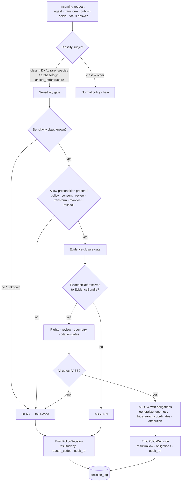

<!-- [KFM_META_BLOCK_V2]
doc_id: kfm://doc/adr-0010-deny-by-default-dna-rare-species-archaeology-infrastructure
title: ADR-0010 — Deny-by-Default for DNA, Rare Species, Archaeology, and Critical Infrastructure
type: standard
version: v1
status: draft
owners: TODO — Policy steward; Governance steward; Domain stewards (people-dna-land, fauna, flora, archaeology, settlements-infrastructure)
created: 2026-05-11
updated: 2026-05-11
policy_label: public
related: [
  "docs/doctrine/directory-rules.md",
  "docs/doctrine/truth-posture.md",
  "docs/doctrine/trust-membrane.md",
  "docs/doctrine/lifecycle-law.md",
  "docs/adr/ADR-0001-schema-home.md",
  "docs/adr/ADR-0004-promotion-gate.md",
  "docs/adr/ADR-0006-governed-ai-runtime-envelope.md",
  "docs/adr/ADR-0008-sensitive-location-policy.md",
  "policy/sensitivity/",
  "data/registry/*/sensitivity_policies.yaml",
  "schemas/contracts/v1/policy/policy_decision.schema.json"
]
tags: [kfm, adr, governance, sensitivity, deny-by-default, dna, rare-species, archaeology, critical-infrastructure, policy-gate]
notes: [
  "ADR number 0010 conflicts with PROPOSED ADR-0010-catalog-proof-release-separation in the Pipeline Manual v0.3 register.",
  "Topic substantially overlaps with PROPOSED ADR-0008-sensitive-location-policy. Resolution path: renumber, supersede ADR-0008, or merge — see §10 below.",
  "All path references are PROPOSED until verified against mounted-repo evidence."
]
[/KFM_META_BLOCK_V2] -->

# ADR-0010 — Deny-by-Default for DNA, Rare Species, Archaeology, and Critical Infrastructure

> **Fail-closed treatment of four sensitivity classes whose exact-location or identifying release is structurally irreversible. Public exposure is denied by default at every governed surface; allow requires explicit, evidenced, reviewed, receipted, and rollback-supported approval.**

| Field | Value |
|---|---|
| **ADR ID** | `ADR-0010` *(PROPOSED — see §10 for number conflict with prior register)* |
| **Title** | Deny-by-Default for DNA, Rare Species, Archaeology, and Critical Infrastructure |
| **Status** | `proposed` |
| **Date** | 2026-05-11 |
| **Authority** | Governance doctrine — fail-closed policy gate |
| **Scope** | Cross-domain (people/DNA/land · fauna · flora · archaeology · settlements/infrastructure · transport) |
| **Owners** | TODO — Policy steward · Governance steward · Domain stewards |
| **Supersedes** | None *(may supersede or merge with PROPOSED ADR-0008-sensitive-location-policy — see §10)* |
| **Superseded by** | — |
| **Depends on** | `ADR-0001-schema-home`, `ADR-0004-promotion-gate`, `ADR-0006-governed-ai-runtime-envelope` (all PROPOSED in prior register) |

---

## Quick Navigation

- [1. Context](#1-context)
- [2. Decision](#2-decision)
- [3. Sensitivity Classes & Default Postures](#3-sensitivity-classes--default-postures)
- [4. Policy Gate Surface](#4-policy-gate-surface)
- [5. Decision Flow](#5-decision-flow)
- [6. Reason Codes & Obligations](#6-reason-codes--obligations)
- [7. Allow Path — What "Explicit Approval" Requires](#7-allow-path--what-explicit-approval-requires)
- [8. Consequences](#8-consequences)
- [9. Alternatives Considered](#9-alternatives-considered)
- [10. Open Issues — Number & Topic Conflicts](#10-open-issues--number--topic-conflicts)
- [11. Migration & Rollback](#11-migration--rollback)
- [12. Verification Plan](#12-verification-plan)
- [Related Docs](#related-docs)

---

## 1. Context

KFM publishes a **map-first, evidence-first, time-aware** view across many domains. Four classes of content carry **structurally irreversible** harm if exposed at exact precision or in identifying form:

- **DNA / genomic data** — once a public link or kit/match identifier is exposed, downstream re-identification of living relatives cannot be recalled. **CONFIRMED** doctrine: *"DNA/genomics … DENY by default; restricted steward/research only with policy approval; separate restricted store; no public AI inference."* (KFM Domain & Capability Encyclopedia, §13 Sensitive / Deny-by-Default Register.)
- **Rare species exact locations** — exact occurrence/nest/den/roost/spawning sites are exploitable for poaching, collection, or habitat destruction. **CONFIRMED** doctrine: *"DENY public exact location; generalized public products only; geoprivacy transform receipt; steward review."* (Encyclopedia §13; Fauna Architecture §12 Sensitivity and Geoprivacy Plan; Flora Architecture §12.)
- **Archaeology** — exact site coordinates, burial sites, sacred or culturally sensitive materials enable looting, desecration, and cultural harm. **CONFIRMED** doctrine: *"DENY exact public location by default; cultural/steward review; suppression/generalization."* (Encyclopedia §13; Archaeology Architecture §25 Security and sensitivity posture.)
- **Critical infrastructure** — exact facilities, dependencies, and condition observations are security-relevant. **CONFIRMED** doctrine: *"RESTRICT/DENY public precision; public-safe aggregation; role-based access."* (Encyclopedia §13; Settlements/Infrastructure Plan, "Infrastructure sensitivity defaults.")

These four classes share two structural properties:

1. **Reversibility is impossible.** A wrongful publication cannot be retracted; copies, screenshots, archives, and search-engine caches persist.
2. **Default-allow is unsafe.** A policy that allows by default and denies on exception will leak through any gap — schema oversight, source-role confusion, AI generation, screenshot, tile aggregation, graph projection, embedding.

The doctrinal response is **fail-closed**: every governed surface — ingest, validation, catalog, publish, runtime API, UI layer, Focus Mode answer, export, AI receipt — defaults to **deny** for these classes and requires affirmative, evidenced, reviewed approval to allow.

> [!IMPORTANT]
> This ADR does **not** decide *whether* sensitive content may ever be released. It decides that the **default posture is deny** for the four classes and that any allow path must traverse explicit policy, evidence, review, receipt, and rollback machinery — never silently and never as a side effect.

---

## 2. Decision

**Adopt deny-by-default as the unconditional baseline** for the four sensitivity classes named in §3, enforced at every governed surface listed in §4, with the allow path described in §7.

### 2.1 Normative statements (RFC 2119 conformance)

1. **MUST** — Public release of exact-location or identifying records in the four classes (DNA, rare species, archaeology, critical infrastructure) MUST default to `deny` in `PolicyDecision.result` when `sensitivity_posture ∈ {DNA, rare_species, archaeology, critical_infrastructure, exact_location_sensitive}` and any allow precondition is absent.
2. **MUST** — Every `deny` MUST carry a structured `reason_codes` array (see §6) and, where applicable, `obligations` (e.g., `generalize_geometry`, `hide_exact_coordinates`).
3. **MUST** — The policy gate set described in §4 MUST fail closed (`deny` or `abstain`, never silent allow) on any of: unknown sensitivity class, unresolved `EvidenceRef`, unresolved rights, missing review record, missing release manifest, missing rollback target.
4. **MUST** — AI and Focus Mode surfaces MUST never produce exact-location or identifying output in these classes regardless of EvidenceBundle content. AI output is **interpretive**, not authoritative; EvidenceBundle outranks generated language.
5. **MUST NOT** — Public clients MUST NOT read canonical or restricted stores directly. The trust membrane (governed API) is the only public path.
6. **MUST NOT** — Connectors, watchers, or pipelines MUST NOT write to `data/published/` for these classes without traversing the full promotion gate, including sensitivity-class review.
7. **SHOULD** — `restricted_precise` content for these classes SHOULD live in an access-controlled store with role-based access, audit logging, and separation from public-safe derivatives.
8. **SHOULD** — When sensitivity status is `unknown`, the gate SHOULD fail closed (treat as restricted) and route to steward review.

### 2.2 What is unchanged

- This ADR does not change **identity rules, schema homes, source-role taxonomy, or lifecycle phase definitions**. Those remain governed by `ADR-0001`, `ADR-0007`, and the canonical lifecycle invariant (`RAW → WORK/QUARANTINE → PROCESSED → CATALOG/TRIPLET → PUBLISHED`).
- This ADR does not list the **specific taxa, regulatory designations, or infrastructure asset classes** that trigger sensitivity. Those live in `data/registry/<lane>/sensitivity_policies.yaml` (PROPOSED home) and are versioned independently.

---

## 3. Sensitivity Classes & Default Postures

The table below normalizes postures from the **Sensitive / Deny-by-Default Register** (Encyclopedia §13) and the **Sensitivity Escalation Matrix** (Build Companion §11.3).

| Class | Examples | Default Public Posture | Allow Precondition | Source Basis |
|---|---|---|---|---|
| **DNA / genomic** | DNA matches, segments, vendor/kit IDs, living-relative inference | `DENY` public; restricted store only; no public AI inference | Explicit policy + consent + access control + audit + no public inference path | `SRC-PEOPLE`; People/DNA/Land Blueprint §21 |
| **Rare species exact location** | Exact occurrence; nest/den/hibernacula/roost/spawning sites | `DENY` exact; public-safe generalized only (county/grid/buffered) | Generalization/redaction transform receipt + steward review + source terms + release manifest | `SRC-FAUNA`, `SRC-FLORA`; Fauna §12; Flora §12 |
| **Archaeology** | Site coordinates; burial; human remains; sacred/culturally sensitive; collection storage/security | `DENY` exact; suppress or generalize | Cultural/steward review + public-safe geometry + looting-risk assessment | `SRC-ARCH`; Archaeology §25 |
| **Critical infrastructure** | Exact facilities; dependencies; condition/inspection observations; security details | `RESTRICT` / `DENY` public precision | Security review + public-safe transform + access-role gate | `SRC-SET`; Settlements/Infrastructure Plan |

> [!NOTE]
> Three additional sensitivity classes — **living persons**, **sacred/culturally sensitive places** (oral history, cultural routes), and **source-rights-limited records** — also default to deny in the parent doctrine. They are governed by adjacent ADRs (proposed) and by source-rights policy. This ADR's four classes are the ones whose harm-on-leak is most structurally irreversible at exact precision.

### 3.1 Mapping to lifecycle phases

| Phase | Allowed for these classes | Forbidden |
|---|---|---|
| `data/raw/` | Immutable source captures (steward-only access) | Public read; raw kit IDs in logs |
| `data/work/` | Parsed/normalized intermediates; restricted exact geometry | Publication; public-safe derivatives at this phase |
| `data/quarantine/` | Failed, rights-unknown, sensitivity-unresolved records | Promotion without review disposition |
| `data/processed/` | Validated normalized records; restricted by default | Public exact geometry; raw DNA IDs |
| `data/catalog/` (STAC/DCAT/PROV) | Metadata for **released public-safe** assets only | Restricted exact geometry in public STAC entries |
| `data/triplets/` | Graph deltas without restricted geometry leakage | Restricted relations exposed publicly |
| `data/published/` | Only promoted public-safe artifacts + aliases | RAW/WORK/QUARANTINE refs; restricted exact coordinates |
| `data/receipts/` | Transform, run, redaction, revocation receipts | Raw sensitive IDs; restricted segment values |
| `data/proofs/` | EvidenceBundles, release manifests, rollback cards | Raw source data; private DNA |

---

## 4. Policy Gate Surface

Deny-by-default is enforced at **every** surface in the trust spine, not only at publish. (Policy Gate Index, Encyclopedia Appendix I.)

| Gate | Role for these four classes | Default on uncertainty |
|---|---|---|
| `source_role_gate` | Rejects unknown or inappropriate source role for sensitive claims | `deny` |
| `rights_gate` | Rejects public release when license/terms/redistribution unclear | `deny` |
| `sensitivity_gate` | **Primary gate** — restricts or denies sensitive locations, people/DNA, archaeology, infrastructure | `deny` |
| `evidence_closure_gate` | Requires `EvidenceRef → EvidenceBundle` resolution before claim-bearing release | `abstain` |
| `geometry_gate` | Checks CRS, validity, precision, uncertainty, support, generalization | `deny` on insufficient generalization |
| `citation_gate` | Rejects generated or public claims without validated citations | `abstain` |
| `review_gate` | Requires steward/reviewer decision for promotion and sensitive releases | `deny` until review record present |
| `release_gate` | Requires ReleaseManifest + proof + correction path + rollback target | `deny` |
| `rollback_gate` | Requires tested rollback card and release lineage | `deny` |

### 4.1 Runtime surfaces

| Surface | Behavior on sensitive request |
|---|---|
| Governed API (`apps/governed-api/`) | Returns `RuntimeResponseEnvelope` with `status ∈ {ABSTAIN, DENY, ERROR}` and reason codes |
| MapLibre layer manifest | Public layer never contains restricted exact geometry; `LayerManifest.sensitivity_transform` records the public-safe transform receipt |
| Focus Mode (governed AI) | `DENY` direct sensitive coordinate disclosure; `ABSTAIN` on insufficient evidence; cite EvidenceBundle or refuse |
| AI receipts | `AIReceipt` records refusal/abstention reason; no embedding store may surface restricted text |
| Search / vector index | Restricted records excluded by default; index built only from released or review-authorized evidence |
| Graph / triplet projection | Restricted geometries and identities never enter public graph; no-leak validator runs pre-publication |
| Exports | Public exports use public-safe geometry and DTO profile; restricted exports require role + audit |
| Tiles (PMTiles/MVT) | Public tiles built from `data/published/` only; restricted tiles, if any, served behind auth with audit |

---

## 5. Decision Flow

> [!NOTE]
> The diagram describes the **doctrinal** flow. The exact gate ordering, validator names, and `decision_log` path are PROPOSED until verified against mounted-repo policy code and `tests/policy/`. NEEDS VERIFICATION.

---

## 6. Reason Codes & Obligations

`PolicyDecision.result` is finite (`allow | deny | restrict | abstain | review_needed | error`) — see Build Companion §11.2. The codes below are the **minimum** reason-code surface this ADR commits to; lane-specific extensions live in `policy/<lane>/`.

### 6.1 Deny / restrict reason codes

| Reason Code | Trigger |
|---|---|
| `SENSITIVE_LOCATION_BLOCKED` | Precise sensitive location cannot be released (rare species, archaeology, infrastructure) |
| `precise_sensitive_location_denied` | Lane-specific variant for sensitive exact geometry |
| `dna_public_inference_blocked` | DNA-based relationship inference requested on public surface |
| `dna_raw_identifier_blocked` | Raw kit ID, vendor match ID, or segment coordinate requested on public surface |
| `cultural_sensitivity_unresolved` | Tribal/cultural sensitivity status unresolved; no public release |
| `looting_risk_exposure` | Public exposure would create looting/poaching risk |
| `critical_infrastructure_exact_blocked` | Exact facility geometry or condition observation blocked |
| `geoprivacy_required` | Source geoprivacy or KFM sensitivity policy requires generalization |
| `public_geometry_not_generalized` | Public payload contains insufficiently generalized geometry |
| `public_payload_exposes_internal_ref` | Public payload references RAW/WORK/QUARANTINE store |
| `RAW_CONTEXT_FORBIDDEN` | AI attempted to use raw/work/quarantine context |
| `RIGHTS_UNKNOWN` | Rights/license/citation obligations not resolved |
| `EVIDENCE_NOT_PUBLISHED` | Evidence exists but has not passed promotion gates |
| `review_required` / `steward_review_missing` | Required steward/cultural review absent |

### 6.2 Allow obligations

When the allow path is taken, the `PolicyDecision.obligations` array MUST carry at least the applicable obligations below; downstream renderers and APIs MUST honor them.

| Obligation | Effect |
|---|---|
| `generalize_geometry` | Public payload carries generalized/buffered/grid/county geometry only |
| `hide_exact_coordinates` | Exact coordinates suppressed in all public surfaces, drawer, tiles, exports |
| `show_attribution` | Required attribution text emitted with response |
| `steward_review_recorded` | `ReviewRecord` ref must be present in EvidenceBundle |
| `transform_receipt_present` | Geoprivacy/redaction transform receipt must accompany the artifact |
| `restricted_access_only` | Response served only to authenticated, audited roles |
| `audit_logged` | Decision recorded to `decision_log` with `audit_ref` |

---

## 7. Allow Path — What "Explicit Approval" Requires

The allow path is **narrow and evidenced**. The following minimum bundle is required for every promotion that exposes any portion of a record in these classes to a public or semi-public surface:

<strong>Allow precondition bundle (click to expand)</strong>

1. **SourceDescriptor** — `source_id`, `source_role`, `rights_status` ∈ `{known_public, restricted}`, `sensitivity_class`, `activation_state ∈ {active_fixture_only, active_live}`.
2. **EvidenceBundle** — resolved `EvidenceRef`, scope, source-role visibility, uncertainty, review state, release state, correction lineage, policy posture.
3. **ReviewRecord** — appropriate reviewer (steward, cultural reviewer where applicable, security reviewer for infrastructure, policy admin for DNA), decision, effective period.
4. **GeoprivacyTransformReceipt** — for rare species, archaeology, infrastructure: method, precision bucket (grid/region/county/withheld), input digest, output digest, reason code, policy version. (Schema: `schemas/contracts/v1/<lane>/geoprivacy_transform_receipt.schema.json` — PROPOSED.)
5. **ConsentGrant + RevocationReceipt path** — for DNA: unrevoked, unexpired, scoped consent with documented revocation path.
6. **ReleaseManifest** — released artifacts, hashes, inputs, policy decisions, proof pack references, expiration/stale rules, rollback target.
7. **RollbackCard** — tested rollback target (`from_release_id`, `to_release_id`, prior manifest verified, prior catalog verified, prior EvidenceBundle verified).
8. **CatalogMatrix** — STAC/DCAT/PROV closure (no restricted exact geometry leaks into public STAC).
9. **AIReceipt** (if AI is on the path) — provider/model, prompt template hash, evidence_bundle_refs, policy pre/post checks, citation validation, outcome, refusal/abstention reasons.
10. **No-leak validator pass** — `assert_no_restricted_geometry_in_public_payload` must return PASS.

> [!WARNING]
> Absent any one of items 1–10, the gate MUST return `deny` (or `abstain` for evidence-closure failures). There is no shortcut, admin override, or "expedited release" path for these four classes that bypasses the bundle. Admin shortcuts, if they exist, must be justified, constrained, documented, audited, and kept out of the normal public path (Directory Rules §11).

### 7.1 What allow does **not** authorize

- It does **not** authorize publishing exact coordinates as a permanent public artifact; allow typically authorizes a **public-safe derivative** (generalized geometry, withheld geometry, aggregate).
- It does **not** authorize AI to fabricate or interpolate exact location; AI remains interpretive and bounded to EvidenceBundle.
- It does **not** authorize bulk re-export of restricted data even to authenticated users without role + audit.
- It does **not** authorize a connector or watcher to write to `data/published/`; promotion is a governed state transition (Directory Rules §3).

---

## 8. Consequences

### 8.1 Positive

- **Irreversibility risk reduced.** The most consequential class of governance failure (silent exposure of exact sensitive location or identifying DNA data) becomes structurally hard rather than procedurally hard.
- **Reason codes are auditable.** Every denial carries a structured reason; reviewers and downstream dashboards can analyze denial-rate by source, lane, and class.
- **Trust membrane reinforced.** The public path is unambiguously through the governed API; canonical and restricted stores remain inaccessible to public clients.
- **AI remains subordinate to evidence.** Focus Mode and AI receipts cannot drift into sovereign truth; EvidenceBundle and PolicyDecision outrank generated language.
- **Per-lane consistency without per-lane policy forks.** A shared sensitivity surface lets each domain lane (fauna, flora, archaeology, infrastructure, people/DNA) carry lane-specific rules through `data/registry/<lane>/sensitivity_policies.yaml` without inventing a parallel governance home.

### 8.2 Negative / Costs

- **Operator friction.** Stewards must populate review records, transform receipts, and rollback cards before a sensitive release can move. This is intentional but real.
- **False denies.** A fail-closed posture will produce some incorrect denials. The reason-code surface is the mitigation — operators can see why and unblock by adding missing evidence.
- **Generalization loss.** Public users will see county/grid/buffered geometry for rare species and archaeology where source data has exact coordinates; some user expectations will not be met.
- **Performance.** DTO validation, policy evaluation, and no-leak validators add request-time cost. Caching of validated responses is permitted but must not bypass policy evaluation for sensitivity-bearing requests.
- **Rego learning curve.** Sensitivity policy expressed in Rego (where `policy/` uses OPA/Conftest — PROPOSED, NEEDS VERIFICATION) has a learning curve and requires test coverage.

### 8.3 Risks

| Risk | Mitigation |
|---|---|
| Policy bypassed via direct DB / store access | Trust membrane: no public client reads canonical or restricted stores; governed API only |
| AI hallucinates exact coordinates | EvidenceBundle outranks AI; citation_gate + no-leak validator on AI output |
| Connector publishes directly to PUBLISHED | Connector role limited to `data/raw/` and `data/quarantine/`; promotion is a governed state transition |
| Tile aggregation reveals restricted points | Tile build runs against `data/published/` only; no restricted tiles on public alias |
| Embedding store leaks restricted text | Index built only from released or review-authorized evidence |
| Reviewer fatigue causes rubber-stamping | Decision logs auditable; denial-rate dashboards surface anomalies |

---

## 9. Alternatives Considered

| Alternative | Why rejected |
|---|---|
| **Default-allow with deny exceptions** | Inverts the failure mode: any gap in the rule set leaks exact sensitive location. Irreversibility makes this unsafe. |
| **Per-domain policy with no cross-lane invariant** | Encourages lane forks, divergent vocabulary, and inconsistent reason codes. Cross-lane sensitivity classes (DNA crossing into archaeology via human remains; infrastructure crossing into archaeology via historic structures) require a shared surface. |
| **AI judgment as the gate** | AI is interpretive, not the root truth source; fluent generation cannot stand in for evidence, policy, review, source authority, or release state (Governed AI Rule). |
| **Quarantine-only without explicit deny semantics** | Quarantine handles unresolved cases; it does not communicate to runtime that exposure is denied. The runtime needs `deny` with reason codes for the API/UI/Focus envelope. |
| **Static redaction at publish only, no upstream gating** | Late redaction is fragile and breaks when an upstream artifact (a tile, a graph projection, a vector index) is built from canonical data. Sensitivity must be visible at every governed phase. |
| **Treat all sensitive content equally as "restricted"** | Loses signal: DNA, rare species, archaeology, and infrastructure have different review paths, different stewards, and different public-safe derivative profiles. A flat tier loses the per-class obligations. |

---

## 10. Open Issues — Number & Topic Conflicts

> [!IMPORTANT]
> The filename used for this ADR (`ADR-0010-deny-by-default-for-dna-rare-species-archaeology-infrastructure.md`) creates two reconcilable issues with the existing PROPOSED ADR register. This section documents the conflicts and the resolution paths so that whichever number/title is chosen, the ledger remains coherent.

### 10.1 Number conflict (`ADR-0010`)

The **Pipeline Living Implementation Manual v0.3** carries a PROPOSED ADR register that already assigns:

| ID | Status | Topic |
|---|---|---|
| `ADR-0010-catalog-proof-release-separation` | `proposed` | Separate receipts, proofs, catalogs, releases, reviews, corrections |

That ADR is **structurally different** from this one. Resolution options:

1. **Renumber this ADR** to the next free number (PROPOSED next-free: `ADR-0011`, after a sweep against the actual `docs/adr/` directory once mounted).
2. **Reassign the catalog-proof-release-separation topic** to a different free number; this is administratively cheaper than renumbering the present ADR if it has already been linked from other documents.
3. **Defer numbering** until the mounted-repo `docs/adr/` directory is inspected and a definitive next-free number is identified.

### 10.2 Topic overlap (`ADR-0008-sensitive-location-policy`)

The same register lists:

| ID | Status | Topic |
|---|---|---|
| `ADR-0008-sensitive-location-policy` | `proposed` | Fail-closed treatment for sensitive exact locations |

This present ADR is a **narrower, more specific articulation** of the same doctrinal area. Resolution options:

1. **Merge** — replace `ADR-0008` with this ADR (which is more specific) and mark `ADR-0008` `superseded` with a forward link.
2. **Layer** — keep `ADR-0008` as the umbrella "sensitive locations" policy and let this ADR carve out the four classes with class-specific obligations. The two would reference each other; this ADR would cite `ADR-0008` in `Depends on`.
3. **Promote this ADR to the umbrella** — let this ADR cover the sensitive-location domain in full, expanding §3 to include the other classes from the Sensitive / Deny-by-Default Register (living persons, sacred places, source-rights-limited records, emergency-warning misuse). `ADR-0008` would then be superseded.

### 10.3 Recommendation

> [!NOTE]
> Defer the number/title decision until the mounted `docs/adr/` directory is inspected. In the interim, treat the filename as **PROPOSED / CONFLICTED**. Open a drift entry in `docs/registers/DRIFT_REGISTER.md` once the repo is mounted and resolve via the **next ADR meta-step**, not by silent renumbering.

---

## 11. Migration & Rollback

### 11.1 Migration plan

| Step | Action | Validation |
|---|---|---|
| 1 | Inventory existing `policy/` and `policy/sensitivity/` modules in the mounted repo | `git ls-tree` + module diff |
| 2 | Confirm or create `data/registry/<lane>/sensitivity_policies.yaml` for each affected lane | Schema validator + fixture pass |
| 3 | Confirm or create `schemas/contracts/v1/policy/policy_decision.schema.json` carrying `result`, `reason_codes`, `obligations`, `review_required`, `valid_until`, `policy_bundle_ref`, `policy_hash` | JSON Schema 2020-12 + fixture |
| 4 | Confirm or create the **sensitivity_gate** policy module(s) and the **no-leak validator** under `tools/validators/` | Policy fixtures pass/fail |
| 5 | Wire gates into the **promotion gate** (`ADR-0004`) and the **governed AI runtime envelope** (`ADR-0006`) | End-to-end fixture: candidate → gate → envelope |
| 6 | Update affected per-root READMEs (`policy/`, `data/registry/`, `apps/governed-api/`) | README contract §15 of Directory Rules |
| 7 | Add reason-code documentation to `docs/runbooks/<lane>/` for stewards | Markdown lint + steward review |
| 8 | Add `decision_log` retention/archival policy | Decision-log schema + archival cron |

### 11.2 Rollback plan

If this ADR is later determined to be wrong or insufficient, rollback is a **governed action**, not a silent revert.

| Action | Required behavior |
|---|---|
| **Rollback card** | `data/proofs/governance/{release}/rollback_card.json` referencing prior policy bundle digest, prior gate behavior, reviewer/steward signoff, audit refs |
| **Correction notice** | `CorrectionNotice` instance with superseded and corrected claims, public-safe explanation, EvidenceBundle ref, timestamp |
| **Supersession** | Mark this ADR `superseded` with forward link to replacing ADR; do not delete |
| **Policy revert** | Revert policy bundle digest; emit new `decision_log` capturing the change-of-rule |
| **Re-validate downstream** | Re-run promotion-gate fixtures; verify no public artifact silently changed posture |

### 11.3 Backward compatibility

- Existing PROPOSED policy modules (`policy/archaeology/`, `policy/fauna/sensitivity/`, etc.) align with this ADR's deny-by-default posture. No incompatible change is expected at the doctrinal level.
- Reason-code names introduced in §6 are additive; existing fixtures using older codes can be mapped via a `reason_code_alias` table in `policy/sensitivity/aliases.yaml` (PROPOSED).
- The schema-home decision (`schemas/contracts/v1/` vs `contracts/`) is governed by `ADR-0001`; this ADR adopts the prevailing decision and does not fork.

---

## 12. Verification Plan

> [!CAUTION]
> Every claim about repo state, file paths, policy modules, validator names, and runtime behavior below is **PROPOSED / NEEDS VERIFICATION** until the mounted repo is inspected. This ADR does not assert that any of these files currently exist.

| Verification item | Method | Status |
|---|---|---|
| `docs/adr/` is the canonical ADR home | Confirmed in `directory-rules.md` §5 (canonical roots) | **CONFIRMED** (doctrine) |
| Existing ADR numbers in `docs/adr/` | `git ls-tree docs/adr/` once mounted | **NEEDS VERIFICATION** |
| `policy/` vs `policies/` canonical home | Confirmed `policy/` (singular) is canonical per Directory Rules; verify in repo | **NEEDS VERIFICATION** |
| `policy/sensitivity/` exists and houses the four-class rules | Repo inspection | **NEEDS VERIFICATION** |
| `schemas/contracts/v1/policy/policy_decision.schema.json` exists | Repo inspection | **NEEDS VERIFICATION** |
| `data/registry/<lane>/sensitivity_policies.yaml` exists per lane | Repo inspection | **NEEDS VERIFICATION** |
| Promotion-gate fixtures cover the four classes | `tests/policy/` inspection | **NEEDS VERIFICATION** |
| Governed-AI runtime envelope honors reason codes | `apps/governed-api/` + Focus Mode adapter inspection | **NEEDS VERIFICATION** |
| Decision-log retention policy | Repo or runbook inspection | **NEEDS VERIFICATION** |
| Steward role names and review SLAs | Governance manifest / `CODEOWNERS` | **NEEDS VERIFICATION** |
| OPA / Conftest version (if used) | CI workflow inspection | **NEEDS VERIFICATION** |
| Tile-build pipeline reads from `data/published/` only | `pipelines/` inspection | **NEEDS VERIFICATION** |

[Back to top](#adr-0010--deny-by-default-for-dna-rare-species-archaeology-and-critical-infrastructure)

---

## Related Docs

- `docs/doctrine/directory-rules.md` — root-folder authority, canonical/compatibility roots, ADR-change triggers
- `docs/doctrine/truth-posture.md` — cite-or-abstain default; deny on irreversibility
- `docs/doctrine/trust-membrane.md` — governed-API as the only public path
- `docs/doctrine/lifecycle-law.md` — RAW → WORK/QUARANTINE → PROCESSED → CATALOG/TRIPLET → PUBLISHED
- `docs/adr/ADR-0001-schema-home.md` *(PROPOSED)* — schemas/contracts/v1 authority
- `docs/adr/ADR-0004-promotion-gate.md` *(PROPOSED)* — promotion as governed state transition
- `docs/adr/ADR-0006-governed-ai-runtime-envelope.md` *(PROPOSED)* — finite answer/abstain/deny/error envelope
- `docs/adr/ADR-0008-sensitive-location-policy.md` *(PROPOSED — see §10 for relationship to this ADR)*
- `docs/registers/POLICY_REGISTRY.md` *(PROPOSED)* — registry of policy modules and outcome mappings
- `docs/registers/VERIFICATION_BACKLOG.md` *(PROPOSED)* — open verification items
- `docs/registers/DRIFT_REGISTER.md` *(PROPOSED)* — drift entries (number/topic conflicts surfaced in §10)

---

**Last updated:** 2026-05-11 · **Status:** `proposed` · **Owners:** TODO — Policy steward · Governance steward · Domain stewards

[Back to top](#adr-0010--deny-by-default-for-dna-rare-species-archaeology-and-critical-infrastructure)
