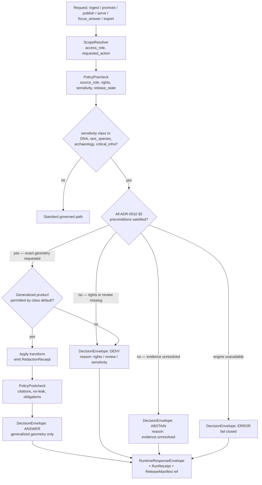

<!-- [KFM_META_BLOCK_V2]
doc_id: kfm://doc/adr-0010-deny-by-default-sensitive-classes
title: ADR-0010 — Deny-by-default for DNA, rare species, archaeology, and critical infrastructure
type: standard
version: v1
status: draft
owners: <governance-steward>, <policy-steward>, <docs-steward>
created: 2026-05-09
updated: 2026-05-09
policy_label: public
related:
  - docs/doctrine/directory-rules.md
  - docs/doctrine/truth-posture.md
  - docs/doctrine/trust-membrane.md
  - docs/doctrine/lifecycle-law.md
  - docs/architecture/governed-api.md
  - docs/architecture/contract-schema-policy-split.md
  - docs/adr/ADR-0001-schema-home.md
  - kfm://contract/runtime/runtime_response_envelope
  - kfm://contract/governance/decision_envelope
  - kfm://contract/correction/correction_notice
tags: [kfm, adr, policy, sensitivity, governance, deny-by-default]
notes:
  - Repository is not mounted in this session; all file paths are PROPOSED until verified against the live repo.
  - Numbering ADR-0010 reflects the requested filename; predecessor ADRs 0002–0009 are NEEDS VERIFICATION.
  - Closely related classes (living persons, sacred sites, private landowner-sensitive data) share this ADR's mechanics; their domain-specific ADRs may layer additional obligations.
[/KFM_META_BLOCK_V2] -->

# ADR-0010 — Deny-by-Default for DNA, Rare Species, Archaeology, and Critical Infrastructure

> **In one line.** When a public release would expose DNA / genomic data, exact rare-species locations, exact archaeological sites, or exact critical-infrastructure geometry — and the supporting evidence, rights, sensitivity, review, or release controls are unresolved — the system **denies**, not allows-with-warning. The fail-closed posture applies in code (policy gates), in catalogs (no public artifact), in runtime (`RuntimeResponseEnvelope.outcome = DENY`), and in correction lineage.

---

## Status

| Field | Value |
|---|---|
| **ADR id** | `ADR-0010` |
| **Title** | Deny-by-default for DNA, rare species, archaeology, and critical infrastructure |
| **Status** | `proposed` |
| **Date** | 2026-05-09 |
| **Deciders** | Governance steward · Policy steward · Domain stewards (people-dna-land, fauna, flora, archaeology, settlements-infrastructure) · Release steward |
| **Supersedes** | _none_ |
| **Superseded by** | _none_ |
| **Authority of this ADR** | **CONFIRMED** doctrine alignment; **PROPOSED** repo placement until mounted-repo verification |
| **Authority of paths quoted here** | **PROPOSED** until checked against mounted-repo evidence (see Directory Rules §0) |

> [!IMPORTANT]
> This ADR pins a **fail-closed default**, not a permanent prohibition. Public release of any artifact in the four classes is possible only when every precondition in §5 is satisfied **and** a `ReleaseManifest` records the policy chain that authorized it.

---

## Table of contents

- [1. Context](#1-context)
- [2. Decision](#2-decision)
- [3. Scope](#3-scope)
- [4. Sensitivity classes and default outcomes](#4-sensitivity-classes-and-default-outcomes)
- [5. Public-release preconditions](#5-public-release-preconditions)
- [6. Architecture surfaces (where the rule executes)](#6-architecture-surfaces-where-the-rule-executes)
- [7. Decision flow](#7-decision-flow)
- [8. Consequences](#8-consequences)
- [9. Alternatives considered](#9-alternatives-considered)
- [10. Implementation plan and verification](#10-implementation-plan-and-verification)
- [11. Rollback, correction, and supersession](#11-rollback-correction-and-supersession)
- [12. Open questions and NEEDS VERIFICATION](#12-open-questions-and-needs-verification)
- [13. Related doctrine and ADRs](#13-related-doctrine-and-adrs)
- [14. Glossary](#14-glossary)

---

## 1. Context

Kansas Frontier Matrix (KFM) is a governed, evidence-first, map-first, time-aware spatial knowledge system. Its public surfaces — STAC/DCAT catalogs, the map shell, the governed API, the Evidence Drawer, AI Focus Mode answers — sit downstream of a **trust membrane** whose central rule is *cite-or-abstain*. Several data classes carry harms whose costs cannot be undone by retraction:

- **DNA / genomic data.** Re-identifies living people; reveals relatives, health risk, and ancestry without their knowledge or consent. Public exposure cannot be unwound.
- **Rare-species exact locations.** Nest, den, hibernacula, roost, and spawning sites are routinely exploited by collectors and poachers when published at coordinate precision.
- **Archaeology exact locations.** Site coordinates, burial places, and sacred / culturally sensitive materials face looting, vandalism, and irreversible cultural harm when located precisely on a public map.
- **Critical infrastructure.** Exact facility geometry, dependencies, and condition observations carry physical-security and life-safety risk; condition data is sensitive to operator and operator-customer relationships.

The KFM corpus repeatedly identifies these as fail-closed areas. The *Sensitive / Deny-by-Default Register* in the encyclopedia, the *Policy gates* section of the Build Companion, the People/Genealogy/DNA/Land Architecture Blueprint, the Archaeology Architecture Plan, and the Settlements & Infrastructure Plan all converge on the same posture: **public-precision in these classes is denied unless explicit controls are satisfied**.

Today the doctrine is asserted in many places but not pinned in one architectural decision. That diffuses three things reviewers actually need:

1. A single canonical reference for "what *exactly* is denied by default, and why."
2. A single canonical mapping from sensitivity class to runtime outcome and obligations.
3. A single canonical list of preconditions that must all hold before a public release is permitted.

This ADR consolidates them.

### Forces

- **Irreversibility of harm** — once published, sensitive precision cannot be recalled.
- **Cite-or-abstain truth posture** — the system prefers honest abstention over plausible-but-uncited disclosure.
- **Watcher-as-non-publisher invariant** — workers emit candidates and receipts; they do not publish.
- **Lifecycle invariant** — RAW → WORK / QUARANTINE → PROCESSED → CATALOG / TRIPLET → PUBLISHED. Promotion is a governed state transition.
- **Operational reality** — useful public products still need to exist (generalized rare-species maps, public archaeology summaries, infrastructure context layers). Deny-by-default is a *default*, not a blanket ban.
- **AI exposure** — generated language must never become a backdoor that re-precise-ifies data the catalog already generalized.

---

## 2. Decision

KFM adopts **deny-by-default** as the canonical posture for the four sensitivity classes named in this ADR. The decision has six binding parts.

1. **Default outcome is DENY.** For any public, semi-public, AI-mediated, or third-party-export action whose subject is classified `dna`, `rare_species`, `archaeology`, or `critical_infrastructure` at exact precision, the policy default is `DENY`. Unknown sensitivity for a candidate in any of these classes also resolves to `DENY` (fail-closed on unknown).
2. **Allow is conditional and recorded.** A public-release decision in any of the four classes is permitted only when every precondition in §5 is satisfied. The authorizing chain — policy bundle, decision id, evidence bundle, review record, transform receipt, rights status, release manifest — is recorded and citable.
3. **Public products are generalized or restricted, not raw.** Where a public product is appropriate, it uses suppression, generalization, aggregation, or staged access. The transform that produced it emits a `RedactionReceipt` carrying method, parameters, reason, source-geometry hash, public-geometry hash, and policy version.
4. **Restricted surfaces are role-gated and audited.** Internal exact data lives in restricted stores or work/quarantine lifecycle phases. Access is deny-by-default, role-scoped, and audited; admin shortcuts are not the normal public path.
5. **AI receives only released, policy-safe context.** Generated answers concerning these classes return `ANSWER` only when an `EvidenceBundle` resolves over policy-safe, released material. Exact-location requests return `DENY`. Insufficient evidence returns `ABSTAIN`.
6. **Decisions are envelope-shaped.** Every gate evaluation emits a `DecisionEnvelope` with finite outcome (`ANSWER | ABSTAIN | DENY | ERROR`), reason codes, obligations, and audit refs. The envelope is what catalogs, releases, runtime responses, and corrections cite.

> [!NOTE]
> This ADR is the **canonical** statement of the deny-by-default register for the four classes. Domain ADRs (e.g., archaeology location-sensitivity, fauna sensitive-location policy, people-dna-land DNA publication) **layer obligations** on top of it; they do not relax it.

---

## 3. Scope

### 3.1 In scope (the four classes)

| Class | What it covers |
|---|---|
| **DNA / genomic data** | Raw or derived genomic data; vendor kit IDs; vendor match IDs; segment coordinates; segment groups; named living-person relationship inferences derived from DNA. |
| **Rare species** | Exact taxa occurrence, nest, den, hibernacula, roost, spawning, and life-stage location for taxa flagged restricted by federal, state, NatureServe, source-policy, or steward registry. |
| **Archaeology** | Site coordinates; burials and human remains; sacred / culturally sensitive materials; LiDAR/geophysical anomalies treated as candidate features; collection storage and security details. |
| **Critical infrastructure** | Exact facility geometry; operator dependencies; condition observations; physical-security-relevant attributes for bridges, utilities, water/wastewater, communications, energy, transport, and other operational assets. |

### 3.2 Closely related classes (governed elsewhere; share this ADR's mechanics)

- Living persons (governed by the People/DNA/Land architecture; living-person residential exposure DENY rule mirrors DNA controls).
- Sacred / culturally sensitive places (often co-resident with archaeology; consultation discipline is additional, not optional).
- Private landowner-sensitive data (field boundaries, owner identity).
- Source-rights-limited records (license/redistribution unresolved).

These classes follow the same envelope/receipt mechanics. Their domain-specific obligations live in their own ADRs and `policy/domains/...` modules.

### 3.3 Out of scope

- Generic privacy law conformance (GDPR, HIPAA, etc.). This ADR is a **system-level invariant**; legal compliance is layered on top per-source and per-jurisdiction.
- Internal-only research workflows that do not cross the public trust membrane (those follow restricted-access discipline, not this ADR's public-release gate).
- Emergency / life-safety alerting. KFM is **not** an emergency alert system; that doctrine lives separately.

---

## 4. Sensitivity classes and default outcomes

The encyclopedia's *Sensitive / Deny-by-Default Register* is the doctrinal source of these defaults. This ADR pins the four-class subset as a single decision.

| Class | Default public posture | Default `DecisionEnvelope.outcome` | Default obligations on any allowed product |
|---|---|---|---|
| **DNA / genomic** | Restricted / DENY public by default. No raw kit IDs, raw vendor match IDs, public segment coordinates, or public segment visibility. No public DNA-derived inference. | `DENY` for public exact / identifying output. `ANSWER` only at strictly aggregate or research-context level when permitted. | Tokenization (HMAC) of vendor IDs, kit IDs, person IDs; consent grant + non-revocation check; restricted store; audit; no-public-AI-inference. |
| **Rare species** | DENY exact public location; **generalized** public products only. | `DENY` exact geometry; `ANSWER` allowed at generalized geometry (county / HUC / hex / buffered centroid) when policy and source guidance permit. | Geoprivacy transform receipt; steward review; source geoprivacy flags honored; minimum-separation / k-anonymity-style aggregation; no reverse-engineering through tile pyramids or related-attribute joins. |
| **Archaeology** | DENY exact public location; **generalized / suppressed** public products only. Burial, human remains, sacred / culturally sensitive sites: DENY at default, no exceptions without consultation. | `DENY` exact geometry; `ANSWER` allowed at generalized geometry or summary level after cultural / steward review. | Cultural / steward review record; suppression or generalization receipt; looting-risk assessment; no candidate (model-predicted) feature treated as a confirmed site; collection storage details out of any public payload. |
| **Critical infrastructure** | RESTRICT / DENY public **precision**; aggregated / public-safe products only. | `DENY` exact geometry and condition where security review has not authorized release; `ANSWER` allowed for aggregated or public-safe products. | Security review; public-safe transform; role-based access for non-public products; no condition observation in public payload without authorization; access logs. |

### 4.1 Resolution rule for unknown sensitivity

Unknown sensitivity in any of these four classes resolves to `DENY` (fail-closed). This mirrors the source registry rule that an unknown `sensitivity_class` blocks activation, and the runtime rule that `EVIDENCE_POLICY_BLOCKED` and `SENSITIVE_LOCATION_REDACTED` are first-class outcomes.

### 4.2 Most-restrictive-input propagation

When an artifact has multiple inputs of different sensitivities, the artifact inherits the **most restrictive** input's class. A derived product mixing public-safe inputs with one restricted input is restricted.

> [!CAUTION]
> Aggregation does **not** automatically de-classify. Aggregations that re-precise-ify a sensitive location (e.g., a 1-cell hex on a sparse grid) remain restricted. The transform is what is judged, not the apparent geometry.

---

## 5. Public-release preconditions

A public-release decision in any of the four classes requires **all** of the following, recorded in the chain that the gate cites:

1. **Identity.** `subject_ref` deterministic; `spec_hash` stable.
2. **Source role.** Source descriptor present, role known (not `unknown`), authority adequate for the claim type.
3. **Rights / terms.** `rights_status` known; license and redistribution terms resolved; attribution obligations rendered.
4. **Sensitivity class.** Pinned (not `unknown`) and propagated through derivation.
5. **Evidence closure.** `EvidenceRef` resolves to a published / cataloged `EvidenceBundle`. No reference to RAW / WORK / QUARANTINE / restricted store appears in the public payload.
6. **Validation.** Schema, source-role, geometry, temporal, and sensitivity validators all `PASS`.
7. **Transform receipt.** If geometry was generalized / aggregated / suppressed: a `RedactionReceipt` records method, parameters, reason, `source_geometry_hash`, `public_geometry_hash`, policy version.
8. **Review.** A `ReviewRecord` with the required reviewer roles for the class:
   - DNA: privacy reviewer + consent reviewer.
   - Rare species: source steward + domain steward.
   - Archaeology: cultural reviewer + steward; sacred/burial cases: consultation record.
   - Critical infrastructure: security reviewer + domain steward.
9. **Release state.** A `ReleaseManifest` referencing the inputs, decisions, proof bundle, catalog matrix, rollback target, and (where applicable) consent receipt.
10. **Correction & rollback.** A correction path and a tested `RollbackCard` exist for the released artifact.
11. **Separation of duties.** For policy-significant releases, the reviewer / approver is not the same actor as the authoring / promoting actor.

If any precondition is unmet, the decision is `DENY` (or `ABSTAIN` where the failure mode is "insufficient evidence" rather than "policy violation"). `POLICY_ENGINE_UNAVAILABLE` resolves to `ERROR`, never to `ALLOW`.

---

## 6. Architecture surfaces (where the rule executes)

The rule is not a documentation aspiration; it is enforced at every surface where a sensitive class can leak.

| Surface | Enforcement | PROPOSED location |
|---|---|---|
| **Connector admission** | Source descriptor must declare `sensitivity_class`; unknown → quarantine. | `connectors/<source>/`, output to `data/raw/<domain>/...` or `data/quarantine/<domain>/...` |
| **Pipeline / workers** | Watcher-as-non-publisher: workers emit candidates + receipts only. | `pipelines/<phase>/`, `apps/workers/` |
| **Schema** | Sensitivity is a required field in the affected object families; geometry-precision constraints encoded. | `schemas/contracts/v1/common/sensitivity.schema.json`; per-domain schemas under `schemas/contracts/v1/domains/<domain>/` |
| **Policy bundles (cross-cutting)** | Sensitivity class enum, propagation rule, public-DTO gate, deny-by-default module. | `policy/sensitivity/`, `policy/runtime/`, `policy/promotion/`, `policy/release/` |
| **Policy bundles (per-domain)** | Domain-specific obligations layered on top of the cross-cutting rule. | `policy/domains/people-dna-land/`, `policy/domains/fauna/`, `policy/domains/flora/`, `policy/domains/archaeology/`, `policy/domains/settlements-infrastructure/` |
| **Public-DTO gate** | Promotion is denied when the candidate public DTO contains any restricted-precise field. | `policy/release/public_dto.rego` (PROPOSED) |
| **Catalog (STAC/DCAT/PROV)** | `sensitivity == restricted` AND `release_state == released` is a hard deny. | `policy/release/publication.rego` (PROPOSED) |
| **Governed API** | Returns `RuntimeResponseEnvelope { outcome: DENY, reasons[], obligations[] }` for in-scope requests that fail the gate. | `apps/governed-api/` |
| **AI runtime / Focus Mode** | Pre/post checks; AI never sees RAW / WORK / QUARANTINE / restricted store; outputs validated against citations and policy. | `apps/governed-api/` runtime adapter; `policy/ai/` |
| **Evidence Drawer / UI** | Renders the envelope verbatim (denial visible, reason readable); does not silently swallow `DENY`. | `apps/explorer-web/`, `packages/ui/` |
| **Tests** | Sensitivity-aware policy deny tests; no-leak tests; redaction-receipt parity tests; runtime finite-outcome tests. | `tests/policy/`, `tests/runtime_proof/`, `tests/domains/<domain>/` with `fixtures/...` companions |
| **Receipts / proofs** | `RedactionReceipt`, `RunReceipt`, `AIReceipt`, `EvidenceBundle`, `CatalogMatrix`, `ReleaseManifest`. | `data/receipts/<domain>/`, `data/proofs/<domain>/` |
| **Registry** | `data/registry/<domain>/sensitivity_policies.yaml` and `data/registry/sensitivity/` for cross-cutting classes. | `data/registry/sensitivity/`, `data/registry/<domain>/` |

> All paths above are **PROPOSED** until verified against the mounted repo. Where the repo proves a different home (e.g., `contracts/<domain>/<x>.schema.json` rather than `schemas/contracts/v1/...`), the names persist and the move is governed by ADR-0001 (schema home).

---

## 7. Decision flow

---

## 8. Consequences

### 8.1 Positive

- **Irreversible-harm prevention.** The four highest-risk classes acquire a single, named, testable default that fails closed.
- **Auditable enforcement.** Every denial is a `DecisionEnvelope` with reason codes; every allowed product carries a `RedactionReceipt`; every release is a `ReleaseManifest` citing the policy chain.
- **Public-product feasibility.** Generalization, aggregation, and staged access remain available — the rule deletes *exact precision*, not *the lane*.
- **AI alignment.** Generated answers cannot re-precise-ify sensitive data, because AI sees only released, policy-safe context and emits a `RuntimeResponseEnvelope` whose `DENY` is first-class.
- **Reviewer ergonomics.** Reviewers scan deny reasons, not free-text justifications.
- **Drift recognition.** A sibling rule that accidentally allows precision is detectable as a regression by the no-leak tests.

### 8.2 Negative / costs

- **Latency.** Every release in these classes runs more validators and review steps. Acceptable: irreversibility justifies the cost.
- **Authoring burden.** Domain stewards must classify sensitivity at ingest. Some sources will be slow to onboard. Acceptable; mitigated by registry templates and staged activation.
- **Friction with collaborators.** Some downstream consumers expect exact rare-species or infrastructure data. Collaboration moves to restricted, role-gated channels — not public download.
- **Operational complexity.** The cross-cutting policy bundles plus per-domain bundles require disciplined separation. Mitigated by ADR-0001's contract / schema / policy split.
- **False denies on borderline cases.** Acceptable side effect of a fail-closed posture; correction path exists.

### 8.3 Neutral

- **Existing public products are unaffected** if they already use generalized geometry and carry transform receipts. Where they do not, this ADR triggers re-evaluation against §5.
- **Numbering.** This ADR depends on Directory Rules §0 and Directory Rules §2.4 (ADR template fields). It does not require Directory Rules to change.

---

## 9. Alternatives considered

| Alternative | Why rejected |
|---|---|
| **A. Allow-by-default with reviewer override** | Inverts the irreversibility logic. A leaked exact rare-species nest cannot be un-leaked because a reviewer later objected. |
| **B. Domain-by-domain ADRs only, no cross-cutting decision** | Rejected for *uniformity*: the four classes share the same mechanics (envelope, receipt, evidence, manifest), and a single anchor reduces drift. Domain ADRs still exist, layered on top. |
| **C. Single global "sensitive content" toggle** | Rejected for *granularity*: the four classes have different reviewers, different transforms, different receipts. A single toggle would either over-restrict (locking down legitimate generalized products) or under-restrict (allowing accidental precision). |
| **D. Documentation-only doctrine, no Rego enforcement** | Rejected. Doctrine that can't be enforced in CI becomes a guideline; sensitivity enforcement is a hard gate, not a guideline. |
| **E. Rely on source-side sensitivity flags alone (e.g., GBIF generalize)** | Rejected. Source flags are *one* input. Local stewardship, regulatory listing, and policy may be more restrictive than the source. KFM owns the final classification. |
| **F. AI-only mitigation (post-hoc redaction in generated text)** | Rejected. Post-hoc redaction in generated language is brittle, cannot inspect the catalog directly, and would create a path-of-last-resort that competes with the gate. The fix is upstream — AI sees only policy-safe, released context. |
| **G. Restrict everything, including generalized products** | Rejected. KFM has a public mission. Generalized public products are valuable; the rule is to delete *exact precision*, not the lane. |

---

## 10. Implementation plan and verification

### 10.1 Smallest useful, reversible change

1. **Pin the cross-cutting class enum and propagation rule** in `policy/sensitivity/` (PROPOSED) and the matching schema in `schemas/contracts/v1/common/sensitivity.schema.json` (PROPOSED).
2. **Wire the public-DTO gate** so promotion fails on any restricted-precise field landing in a public DTO.
3. **Add the four per-domain policy bundles** with deny tests and positive (allowed-product) tests:
   - `policy/domains/people-dna-land/dna_publication.rego` *(PROPOSED)*
   - `policy/domains/fauna/sensitive_location.rego` *(PROPOSED)*
   - `policy/domains/flora/rare_plant_location.rego` *(PROPOSED)*
   - `policy/domains/archaeology/location_security.rego` *(PROPOSED)*
   - `policy/domains/settlements-infrastructure/critical_infra.rego` *(PROPOSED)*
4. **Wire the runtime gate** so `RuntimeResponseEnvelope { outcome: DENY }` is returned with a populated `reasons[]` and `obligations[]`.
5. **Add fixtures** under `fixtures/domains/<domain>/` for: valid generalized product, invalid exact-precision attempt, invalid unknown-sensitivity, valid restricted-internal, invalid post-hoc declassification.
6. **Update `data/registry/sensitivity/` and `data/registry/<domain>/sensitivity_policies.yaml`** with the class enum and per-domain defaults.
7. **Add control-plane register entries** in `control_plane/policy_gate_register.yaml` and `control_plane/release_state_register.yaml`.

### 10.2 Verification (definition of done)

- [ ] Cross-cutting policy module exists and emits `DecisionEnvelope` with finite outcomes.
- [ ] Per-domain policy modules exist for the four classes with deny + allow fixtures.
- [ ] Public-DTO gate fails the test that injects an exact restricted field into a public DTO.
- [ ] Catalog gate denies any artifact with `sensitivity == restricted` AND `release_state == released`.
- [ ] Runtime gate returns `DENY` for an exact-location request in any of the four classes; returns `ANSWER` for a generalized request when preconditions hold.
- [ ] AI runtime returns `ABSTAIN` when evidence is unresolved; `DENY` when sensitivity blocks; never silently `ANSWER`.
- [ ] `RedactionReceipt`, `EvidenceBundle`, `ReleaseManifest`, `RollbackCard` exist for the first allowed product per class.
- [ ] No-leak tests pass: tile pyramids, related-attribute joins, and AI summaries cannot reconstruct exact restricted geometry.
- [ ] Reviewer documentation in `docs/runbooks/<domain>/promotion.md` updated to cite this ADR.
- [ ] `docs/registers/DRIFT_REGISTER.md` is consulted; any drift entries the ADR resolves are closed; any it surfaces are opened.

### 10.3 Migration

- Existing public products in the four classes are re-evaluated against §5. Products without a transform receipt or evidence closure are **withdrawn or re-released** as generalized products with a `CorrectionNotice`.
- Source descriptors with `sensitivity_class: unknown` in any of the four classes are quarantined until classified.
- Old fixtures that demonstrate exact-precision public output are moved to `fixtures/.../invalid/` so they remain regression tests for the deny path.

---

## 11. Rollback, correction, and supersession

| Concern | Action |
|---|---|
| **Policy bundle defect** | Revert the bundle by PR; freeze promotion in the affected class; preserve denied receipts. CI fails closed if the bundle cannot run. |
| **False positive (legitimate product denied)** | Author a `CorrectionNotice`; record the corrected `DecisionEnvelope`; ship the allowed product through the standard review path; do not weaken the default. |
| **Inadvertent public exposure of restricted precision** | Issue a `CorrectionNotice` and `WithdrawalNotice`; invalidate downstream caches; rebuild catalog/triplet from last valid `EvidenceBundle` set; emit `RevocationReceipt` (DNA/consent classes); follow the `RollbackCard`. |
| **Class definition drift** (e.g., a new sensitive subtype emerges) | Layer a per-domain ADR; do not redefine this ADR's enum without supersession. |
| **Supersession** | A future ADR may supersede this one; this file remains with `status: superseded` and a forward link. Old denied receipts and old `ReleaseManifest`s remain valid history. |

---

## 12. Open questions and NEEDS VERIFICATION

- **NEEDS VERIFICATION** — Whether ADR numbers 0002–0009 already exist in the mounted repo. ADR-0010 numbering is requested and reasonable, but predecessor presence is unverified in this session.
- **NEEDS VERIFICATION** — Whether the canonical schema home is `schemas/contracts/v1/common/sensitivity.schema.json` or `contracts/common/sensitivity.schema.json`. ADR-0001 default is `schemas/`; this ADR follows that default.
- **NEEDS VERIFICATION** — Whether the canonical policy root is `policy/` or `policies/`. Directory Rules pin canonical singular `policy/`; live repo state is to be confirmed.
- **NEEDS VERIFICATION** — Whether `apps/governed-api/` is the current public trust path or is in the process of replacing `apps/api/`.
- **NEEDS VERIFICATION** — Whether the `Critical infrastructure` lane in this ADR uses `policy/domains/settlements-infrastructure/` or a different domain segment in the live repo.
- **OPEN** — Should aggregations below a k-anonymity threshold (e.g., k < 5 cells) auto-deny even when the cell value is itself coarse? Default expectation is yes; requires a propagation rule in `policy/sensitivity/propagation.rego`.
- **OPEN** — Should the public-DTO gate also check derived statistics (which can leak precision through aggregation patterns)? Default expectation is yes via differential-privacy-style budgets; not pinned by this ADR.
- **OPEN** — Multi-party DNA consent shape (one DNA record implicates relatives). Likely requires extension to the consent stack rather than this ADR.
- **OPEN** — Per-class permanent-retention policy (some restricted records — e.g., named living-person DNA — are *never* exposable). Currently folded into `restricted`; future split possible.
- **OPEN** — Auto-classification heuristics. This ADR specifies enforcement, not classification. Ingest-time classification (federal/state/NatureServe/local registry) is governed elsewhere; if it changes, propagation rules apply.

---

## 13. Related doctrine and ADRs

| Document | Relationship |
|---|---|
| `docs/doctrine/directory-rules.md` | Path placement governance. This ADR's paths follow §6 (governance roots), §9 (data/release roots), and §11–§12 (domain placement). |
| `docs/doctrine/truth-posture.md` *(PROPOSED)* | Cite-or-abstain. This ADR is the operational expression of cite-or-abstain in the four highest-risk classes. |
| `docs/doctrine/trust-membrane.md` *(PROPOSED)* | The trust membrane is the boundary this ADR reinforces; `apps/governed-api/` is its executable form. |
| `docs/doctrine/lifecycle-law.md` *(PROPOSED)* | RAW → WORK / QUARANTINE → PROCESSED → CATALOG / TRIPLET → PUBLISHED. This ADR pins fail-closed behavior at every promotion. |
| `docs/architecture/governed-api.md` *(PROPOSED)* | Runtime placement of the rule. |
| `docs/architecture/contract-schema-policy-split.md` *(PROPOSED)* | Why the rule lives in `policy/`, the shape lives in `schemas/`, and the meaning lives in `contracts/`. |
| `docs/adr/ADR-0001-schema-home.md` | Schema home rule. This ADR follows ADR-0001 for any schema this ADR introduces. |
| Per-domain ADRs *(PROPOSED, layered on top)* | `ADR-archaeology-location-sensitivity`, `ADR-archaeology-public-vs-restricted-geometry`, `ADR-fauna-sensitive-location-policy`, `ADR-people-dna-land-publication`, `ADR-settlements-infrastructure-critical-infra-policy`. |

> [!TIP]
> When a domain ADR layers on top of this ADR, it should cite `ADR-0010` in its `related[]` and state explicitly which obligations it tightens (it MUST NOT relax them).

---

## 14. Glossary

| Term | Working definition for this ADR |
|---|---|
| **Deny-by-default** | The policy default is `DENY` until every precondition holds. Unknown resolves to `DENY`. |
| **Sensitivity class** | A pinned classification (`public_safe`, `generalized_only`, `restricted`, `steward_review`) with the most-restrictive-input propagation rule. |
| **DecisionEnvelope** | Finite-outcome policy output: `{ outcome ∈ {ANSWER, ABSTAIN, DENY, ERROR}, reasons[], obligations[], audit_ref, ... }`. |
| **RuntimeResponseEnvelope** | Public API/UI/AI runtime envelope carrying the same finite outcomes plus citations, evidence refs, freshness, correction state. |
| **EvidenceBundle / EvidenceRef** | Resolved support package for claims; lives in `data/proofs/`. References resolve via `packages/evidence-resolver/`. |
| **RedactionReceipt** | Receipt for a generalization / suppression / aggregation transform; records method, parameters, reason, source-geometry hash, public-geometry hash, policy version. |
| **ReleaseManifest** | Release decision artifact; in `release/manifests/`. |
| **CorrectionNotice / WithdrawalNotice / RollbackCard** | Public correction, withdrawal, and rollback artifacts in `release/correction_notices/`, `release/withdrawal_notices/`, `release/rollback_cards/`. |
| **Watcher-as-non-publisher** | Workers emit candidates and receipts; they do not publish or mutate canonical truth. |
| **Public-DTO gate** | Promotion gate that fails when the public DTO contains any restricted-precise field. |

---

[Back to top](#adr-0010--deny-by-default-for-dna-rare-species-archaeology-and-critical-infrastructure)
