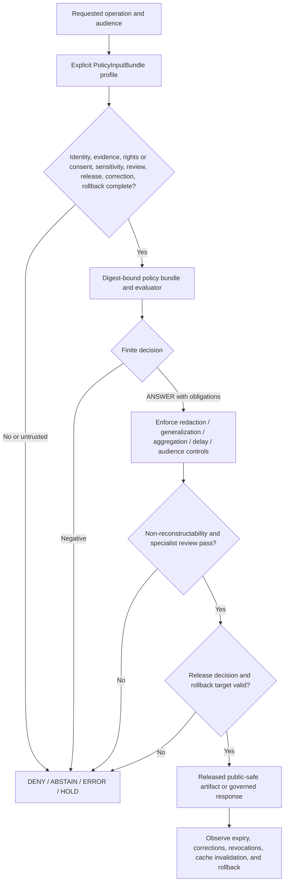

<!-- [KFM_META_BLOCK_V2]
doc_id: kfm://doc/adr-0010-deny-by-default-dna-rare-species-archaeology-infrastructure
title: "ADR-0010 — Deny-by-Default for DNA, Rare Species, Archaeology, and Critical Infrastructure"
type: adr
adr_id: ADR-0010
version: v1.3
status: draft
owners:
  - "NEEDS VERIFICATION — architecture decision owner"
  - "NEEDS VERIFICATION — policy steward"
  - "NEEDS VERIFICATION — privacy, living-person, and genomics reviewer"
  - "NEEDS VERIFICATION — fauna and flora stewards"
  - "NEEDS VERIFICATION — archaeology, cultural-sovereignty, and rights-holder reviewer"
  - "NEEDS VERIFICATION — security and critical-infrastructure reviewer"
owner_status: "CODEOWNERS routes docs/adr/, policy/, schemas/, release/, governed applications, tests, fixtures, and the named sensitive-domain documentation lanes to @bartytime4life; accepted stewardship, specialist-review authority, decision quorum, required-check coupling, and independent approval controls remain unverified"
reviewers_required:
  - Architecture steward
  - Docs steward
  - Policy steward
  - Evidence and source steward
  - Privacy, living-person, and genomics reviewer
  - Fauna and flora stewards
  - Archaeology, cultural-sovereignty, and rights-holder reviewer
  - Security and critical-infrastructure reviewer
  - Governed API and Explorer Web maintainers
  - Release and rollback steward
created: 2026-05-11
updated: 2026-08-14
policy_label: public
truth_posture: cite-or-abstain
responsibility_root: docs/
current_path: docs/adr/ADR-0010-deny-by-default-for-dna-rare-species-archaeology-infrastructure.md
supersedes: []
superseded_by: null
evidence_snapshot:
  repository: bartytime4life/Kansas-Frontier-Matrix
  base_ref: main
  base_commit: f5e082d423f1dbb0753f970a662de4f818c77529
  target_prior_blob: f9145957bf124e3865f5142a02d414f0f685e6a6
  adr_index_blob: 938c5894c36b99e14810918e2c550ab0e92d53b1
  adr_0029_blob: a4de0d7a96b78da59cfc499d1025e1508afd8dd9
  directory_rules_blob: fd49a0b83e55cef52c1124281f093e263526898d
  policy_root_readme_blob: 52877f1befd3112f1aec0eb122669d3fdc2634e6
  domain_policy_readme_blob: 95f5b0a72f854fc476f9ea400c96399e2ab9cc8f
  sensitivity_root_readme_blob: 06197c7a7255264b94fb9dd8d7f73844cfa35682
  policy_bundles_readme_blob: 0a13a9c9beddfa764d47e5dd6a2ea7ef91bf0d53
  policy_runtime_readme_blob: 5a20cfac50a93f497765421b7566559ae49a39b8
  policy_input_profile_contract_blob: 3af1c2c8d525f60f6e2aac89c5a0455898d77768
  policy_decision_contract_blob: ebfe97f98263e6309db6d2772cb2c5e548819650
  policy_decision_vocabulary_contract_blob: 51158caefd7b440851fb37489c511a5c710bed2b
  policy_decision_vocabulary_registry_blob: ae68a9f3cf80308f18bd04207ef2c85057750f12
  policy_test_workflow_blob: ac8f125e8a4d3634d86f66836d2aa2c0e3925e75
  policy_boundary_guards_workflow_blob: 1d7ba1df0f8ed291a15b1d9a44e404ba95d9e35c
  archaeology_policy_readme_blob: 5b95997ab8c5d29e4b03a8c44960e41322990d1d
  fauna_policy_readme_blob: 2b47d285e15c97f49b076f3ba6d32de517b4525a
  flora_policy_readme_blob: 247fc146131f4e6598af9fd939cf087d92523ed6
  people_dna_land_policy_readme_blob: 7260394c77d79629895da16d8d680e8d80c56b32
  settlements_infrastructure_policy_readme_blob: 792a67caab14d119cf4a21dee1365216bfaefb11
  governed_api_main_blob: bcc8d3a0ddba4b225e962b594d548819df0cbb71
  governed_api_stub_blob: 5d7c137d2e78ddfca35a1356a96333ac2e84952b
related:
  - docs/adr/README.md
  - docs/adr/INDEX.md
  - docs/adr/ADR-0001-schema-home--schemas-contracts-v1-is-canonical.md
  - docs/adr/ADR-0003-policy-singular-is-canonical-(policies-is-compatibility).md
  - docs/adr/ADR-0004-apps-governed-api-is-the-trust-membrane.md
  - docs/adr/ADR-0011-receipts-vs-proofs-vs-manifests-vs-catalog-separation.md
  - docs/adr/ADR-0017-source-descriptor-admission-process.md
  - docs/adr/ADR-0018-promotion-gate-sequence.md
  - docs/adr/ADR-0019-ai-adapter-contract-and-finite-envelopes.md
  - docs/adr/ADR-0020-abstain-is-a-first-class-decision.md
  - docs/adr/ADR-0024-steward-separation-of-duties-for-release.md
  - docs/adr/ADR-0025-public-client-never-reads-canonical-internal-stores.md
  - docs/adr/ADR-0029-adopt-directory-governance-standard-v2.md
  - docs/doctrine/directory-rules.md
  - contracts/policy/policy_input_bundle_profile_v1.md
  - contracts/policy/policy_decision.md
  - contracts/policy/policy_decision_vocabulary.md
  - schemas/contracts/v1/policy/policy_decision.schema.json
  - policy/README.md
  - policy/domains/README.md
  - policy/sensitivity/README.md
  - policy/bundles/README.md
  - policy/decision/vocabulary.v1.json
  - packages/policy-runtime/README.md
  - .github/workflows/policy-test.yml
  - .github/workflows/policy-boundary-guards.yml
tags: [kfm, adr, governance, sensitivity, deny-by-default, dna, genomics, rare-species, archaeology, cultural-sovereignty, critical-infrastructure, harmful-precision, policy, public-safety]
notes:
  - "v1.3 is a same-path repository-grounded evidence refresh. It preserves source metadata draft and effective decision status proposed; it does not accept ADR-0010, activate policy, approve sensitive-data use, or publish any artifact."
  - "Accepted ADR-0029 now governs placement through Directory Rules v2. This update creates no root, policy lane, schema home, release lane, proof home, or compatibility migration."
  - "Policy documentation and fixture-first control surfaces have matured since v1.2, but the general evaluator, active bundle, sensitive-domain native policy coverage, obligation enforcement, governed consumer integration, and release-significant operation remain unproved."
  - "This ADR governs operation-specific exposure and harmful precision. It does not classify every record in a named domain as secret, and consent, schema validity, file presence, workflow success, or generalized rendering cannot substitute for release authority."
[/KFM_META_BLOCK_V2] -->

# ADR-0010 — Deny-by-Default for DNA, Rare Species, Archaeology, and Critical Infrastructure

> **Proposed decision.** KFM denies public and semi-public exposure of protected-precision or identifying DNA/genomic, rare-species, archaeology/cultural-heritage, and critical-infrastructure information by default. A bounded derivative may be exposed only when an operation-specific policy profile closes source authority, evidence, rights or consent, sensitivity, transformation, specialist review, release, correction, expiry, and rollback obligations. Missing, stale, conflicted, or untrusted context never becomes implicit permission.

> [!IMPORTANT]
> **ADR identity and placement authority are resolved; acceptance and enforcement are not.** The canonical ADR index uniquely assigns `ADR-0010` to this file with source metadata `draft` and effective status `proposed`. Accepted ADR-0029 makes Directory Rules v2 the placement authority. Neither fact accepts this decision or proves sensitive-data enforcement.

> [!CAUTION]
> **Documentation maturity is not protection.** The repository now contains substantive policy boundaries, inactive input and decision-vocabulary profiles, one bounded native Rego profile, and structural boundary tests. The general evaluator remains unbound, sensitive-domain rule source is predominantly scaffolded, no active cross-domain bundle is accepted, and consumer/release enforcement is not established. Real protected payloads must remain outside public, repository, test, log, receipt, index, map, search, export, and AI paths until the relevant controls graduate.

> [!WARNING]
> **Client-side hiding is never an allow path.** A style filter, hidden property, popup omission, coarse zoom, private-looking route, map toggle, search filter, or model refusal prompt cannot make protected material public-safe. Policy and irreversible-safe transformation must occur before public delivery, and reverse-inference risk must be tested across joins and derivative surfaces.

**Quick navigation:** [Status](#status) · [Evidence](#evidence-boundary) · [Context](#context) · [Decision](#decision) · [Classes](#protected-classes-and-bounded-derivatives) · [Authority](#authority-and-publication-boundary) · [Trust path](#deny-by-default-trust-path) · [Current gates](#current-gate-status) · [Reasons and obligations](#reason-and-obligation-contract) · [Consequences](#consequences) · [Alternatives](#alternatives-considered) · [Acceptance](#acceptance-gates) · [Risks](#risk-ledger) · [Out of scope](#out-of-scope) · [Migration and rollback](#migration--rollback) · [Open work](#open-questions) · [Verification](#verification-checklist) · [References](#references)

---

## Status

| Field | Current value |
|---|---|
| **ADR ID** | `ADR-0010` — unique and confirmed in [`INDEX.md`](./INDEX.md) |
| **Tracked path** | `docs/adr/ADR-0010-deny-by-default-for-dna-rare-species-archaeology-infrastructure.md` |
| **Source metadata** | `draft` |
| **Effective decision status** | `proposed` — not binding until the record and index carry matching reviewed `accepted` status |
| **Record edition** | `v1.3` — repository-evidence refresh; decision unchanged |
| **Decision class** | Cross-domain sensitivity, harmful-precision, restricted-identity, public-exposure, and fail-closed policy invariant |
| **Affected lanes** | `people-dna-land`, `fauna`, `flora`, `archaeology`, `settlements-infrastructure`, and any cross-domain composition inheriting these risks |
| **Current repository posture** | Documentation-rich, fixture-first in bounded profiles, structurally guarded, evaluator-unbound, active-bundle-unaccepted, consumer-unproved, release-unproved |
| **Publication effect** | None. This ADR, a schema pass, workflow result, receipt, pull request, merge, map, denial message, or dry run is not KFM publication evidence. |
| **Supersedes / superseded by** | None / none |

### Acceptance and enforcement are separate transitions

1. **ADR acceptance** would approve the cross-domain default-deny rule and operation-specific allow discipline.
2. **Enforcement graduation** requires an accepted evaluator and bundle, representative synthetic fixtures, native tests, normalized outcomes, enforced obligations, governed consumers, release dry-run, correction propagation, and rollback evidence.

Acceptance alone cannot establish runtime protection. Enforcement evidence alone cannot accept the ADR. Both transitions require their own reviewed records.

[Back to top](#top)

---

## Evidence Boundary

This ADR distinguishes doctrine, configured source, machine shape, native policy evaluation, consumer enforcement, and release-significant operation. Presence at one level does not imply maturity at the next.

### Maturity ladder

| Level | Meaning | Current posture |
|---|---|---|
| **1. Doctrine and boundaries** | ADRs, domain docs, policy READMEs, responsibility roots, and review language exist | **CONFIRMED / broad** |
| **2. Machine shape and structural guards** | Decision shape, inactive profiles, deterministic fixtures, and selected trust-boundary tests exist | **PARTIAL / fixture-first** |
| **3. Evaluator-backed sensitive policy** | Accepted input profile, bundle, selector, evaluator, native tests, and result normalization | **HELD / not established** |
| **4. Governed consumer enforcement** | API, map, export, search, graph, AI, cache, and static delivery enforce outcomes and obligations | **HELD / not established** |
| **5. Release-significant operation** | Required checks, specialist review, release dry-run, correction, expiry, rollback, and observed operation | **UNKNOWN / not established** |

### Current repository evidence

The following findings are pinned to `main@f5e082d423f1dbb0753f970a662de4f818c77529`.

| Surface | Verified state | What it proves — and does not prove |
|---|---|---|
| [`docs/adr/INDEX.md`](./INDEX.md) | 34 numbered records; ADR-0029 accepted; ADR-0010 and 32 other records proposed | Proves identity and status inventory; not acceptance or implementation. |
| [`ADR-0029`](./ADR-0029-adopt-directory-governance-standard-v2.md) and [Directory Rules](../doctrine/directory-rules.md) | Directory Rules v2 is accepted; `docs/` owns ADRs, `policy/` admissibility, `schemas/` shape, `tests/`/`fixtures/` bounded proof, and `release/` release decisions | Proves placement authority; not policy behavior. |
| [`policy/README.md`](../../policy/README.md) | Canonical policy root; 173 Rego files; one native Rego test in one bounded inactive profile; multiple inactive profiles; 18-test structural boundary suite | Proves tracked source and bounded checks; not a general evaluator, active bundle, decision receipts, consumer enforcement, or release approval. |
| [`policy/domains/README.md`](../../policy/domains/README.md) | Thirteen canonical domain-policy READMEs are substantive; 126 domain Rego sources; only one non-default operative body in a fixture-only Soil watcher slice; no domain-local native Rego test | Proves documentation and inventory; not sensitive-domain policy execution. |
| [`policy/sensitivity/README.md`](../../policy/sensitivity/README.md) | Sixteen Rego files, eleven YAML files, six Markdown files, and eighteen placeholder files; mixed `allow`/`deny` default polarity; no accepted shared bundle/evaluator | Proves a real but mixed scaffold corpus; not coherent runtime semantics or public enforcement. |
| [`policy/bundles/README.md`](../../policy/bundles/README.md) | Documentation plus one bounded inactive Pass 12 packaging profile; no accepted general bundle payload, selector, or runtime binding | Proves one governed experiment; not cross-domain activation. |
| [`packages/policy-runtime/README.md`](../../packages/policy-runtime/README.md) | `0.0.0` metadata stub, empty initializer, comment-only core, no functional evaluator or verified consumer | Proves the general runtime remains a placeholder. |
| [`PolicyInputBundle` profile](../../contracts/policy/policy_input_bundle_profile_v1.md) | Explicit context profile and deterministic validator exist as `PROPOSED_INACTIVE` fixture-only controls | Proves input coherence checks; not policy evaluation. |
| [`PolicyDecision`](../../contracts/policy/policy_decision.md) and [vocabulary](../../contracts/policy/policy_decision_vocabulary.md) | Proposed finite decision shape plus inactive reason/obligation vocabulary | Proves candidate semantics and machine-checkable vocabulary; not authentic decisions or obligation enforcement. |
| [`policy-test`](../../.github/workflows/policy-test.yml) | Broad readiness hold and bounded profile wiring checks | Evaluates no repository-wide bundle and emits no authoritative PolicyDecision. |
| [`policy-boundary-guards`](../../.github/workflows/policy-boundary-guards.yml) | Eighteen tests protect selected register, adapter, connector/pipeline, and governed-API boundaries | Proves selected structural behavior; not rights, sensitivity, or release decisions. |
| Sensitive domain READMEs | Archaeology, Fauna, Flora, People-DNA-Land, and Settlements-Infrastructure each record mixed scaffold maturity and unbound evaluator state | Proves local boundaries and known gaps; not active sensitive-domain enforcement. |
| Governed API [`main.py`](../../apps/governed-api/src/governed_api/main.py) and [`stub.py`](../../apps/governed-api/src/governed_api/stub.py) | Minimal WSGI router; scaffolded routes return `ABSTAIN` with `NOT_IMPLEMENTED` | Proves finite fail-safe scaffolding; not a policy-backed public service. |

### Domain snapshot

| Lane | Current evidence | Safe conclusion |
|---|---|---|
| Archaeology | 13 direct Rego scaffolds; ten `default allow := false`, three `default deny := false`; no accepted evaluator | Hold protected and reverse-engineerable location/cultural detail. |
| Fauna | Five direct scaffolds with mixed polarity; one inactive fixture-only tile-field profile | Hold exact or reconstructable sensitive occurrence detail. |
| Flora | Sixteen default-only/comment-only modules; no domain-local native Rego suite | Hold exact or reconstructable rare/culturally sensitive plant detail. |
| People-DNA-Land | Seven non-operative direct stubs; two bounded synthetic consent profiles and 25 no-network tests | Synthetic profiles do not authorize real living-person, DNA, consent, genealogy, or land-linked exposure. |
| Settlements-Infrastructure | Four direct stubs; no operative non-default rule body; unresolved critical-detail escalation | Hold exploitable, private, interior, dependency, or operationally sensitive infrastructure detail. |

[Back to top](#top)

---

## Context

KFM is map-first and evidence-first, so spatial precision can create value and harm at the same time. Five recurring risk families require a common default-deny rule:

1. **DNA and genomic material** can identify, re-identify, infer relationships, expose health or ancestry information, or affect people who never consented.
2. **Rare-species information** can expose vulnerable organisms, nesting or breeding areas, culturally sensitive plants, or locations susceptible to disturbance, collection, or exploitation.
3. **Archaeology and cultural heritage** can expose sites to looting, vandalism, disturbance, unlawful access, or disclosure contrary to sovereign, descendant-community, landowner, or source restrictions.
4. **Critical infrastructure** can reveal exploitable interiors, access paths, topology, dependencies, vulnerabilities, continuity details, or operational conditions.
5. **Cross-domain joins** can reconstruct protected facts even when each input looks harmless by itself.

A simple domain-wide secrecy flag is too coarse. Not every record in a protected lane is equally sensitive, and a public-safe aggregate or generalized derivative may be valuable. The control therefore applies to **operations, audiences, fields, precision, joins, and release candidates**, not merely filenames or domain labels.

The governing problem is not only confidentiality. KFM must also preserve:

- source role and authority;
- evidence sufficiency and freshness;
- rights, consent, sovereignty, and cultural review;
- temporal validity and revocation;
- transformation provenance and non-reconstructability;
- review independence;
- correction, withdrawal, cache invalidation, and rollback.

[Back to top](#top)

---

## Decision

> **PROPOSED:** Adopt an operation-specific deny-by-default rule for protected DNA/genomic, rare-species, archaeology/cultural-heritage, and critical-infrastructure information, including cross-domain joins capable of reconstructing those facts.

### Normative rules

1. **Default outcome.** A public or semi-public operation over protected precision or identity is denied unless an exact reviewed policy profile authorizes the exact candidate version, operation, audience, representation, and time window.
2. **Explicit context.** The caller supplies explicit object identity, domain, lifecycle state, source descriptors and roles, EvidenceRefs/EvidenceBundle status, rights or consent, sensitivity, review, release, policy bundle/evaluator identity, correction state, and rollback support. Hidden fetches and inferred defaults are prohibited.
3. **Finite failure.** Missing, stale, malformed, conflicted, unverifiable, or untrusted context results in `DENY`, `ABSTAIN`, `ERROR`, or an internal hold — never `ANSWER`.
4. **Transform before delivery.** Redaction, generalization, aggregation, suppression, delay, or replacement occurs before a public artifact, API payload, tile, search index, graph projection, export, screenshot, story, or AI context is materialized.
5. **Most restrictive composition.** Cross-domain joins inherit the strictest applicable source, rights, consent, sensitivity, review, audience, precision, release, correction, and rollback posture. A join may raise sensitivity; it cannot silently lower it.
6. **Non-reconstructability.** A derivative is not public-safe when fields, geometry, time, identifiers, search behavior, tiles, caches, neighboring layers, or repeated queries can reasonably reconstruct the protected fact.
7. **Reason and obligation integrity.** Decisions use stable public-safe reason codes and structured obligations. Internal reasons never reveal the protected fact. A caller that cannot enforce every obligation must fail closed.
8. **Separate release authority.** A policy result, schema pass, validator, test, receipt, review request, pull request, merge, or successful transform is not release approval. A governed release record and rollback target remain required.
9. **Revocation and expiry.** Consent withdrawal, rights change, source correction, sensitivity escalation, review expiry, release withdrawal, or new reconstruction risk invalidates prior permissions and triggers downstream correction/invalidation.
10. **No real sensitive fixtures by default.** Default CI uses synthetic or safely minimized fixtures. Live or restricted payloads require separately authorized systems, reviewers, access controls, logging limits, retention, and incident procedures.
11. **No client-only enforcement.** Browser filters, UI hiding, route obscurity, model prompts, or CSS cannot be the governing control.
12. **No operational overclaim.** Until enforcement graduation is demonstrated, KFM documentation and public surfaces must say that sensitive-domain enforcement is unproved and must not ingest or expose real protected payloads.

### Decision vocabulary

KFM's outward finite vocabulary remains:

| Outcome | Meaning for this ADR |
|---|---|
| `ANSWER` | The exact bounded operation may proceed only after all attached obligations and all independent release/runtime gates pass. |
| `ABSTAIN` | Evidence or support is insufficient, stale, conflicted, or outside the admitted scope. Do not manufacture a claim. |
| `DENY` | Policy blocks the requested operation or public precision. |
| `ERROR` | Input, integrity, evaluator, bundle, process, or obligation-enforcement failure. Fail closed. |

Engine-native `allow`, `deny`, `restrict`, or `hold` values require an accepted normalization contract. File or package names do not establish that mapping.

[Back to top](#top)

---

## Protected Classes and Bounded Derivatives

| Protected class | Denied by default | Potential bounded derivative, after all gates |
|---|---|---|
| DNA/genomic and living-person-linked material | Raw sequence, segments, kit or specimen identifiers, re-identifying combinations, private matches, unreviewed kinship or person-linked genomic assertions | Non-identifying aggregate, broad historical context, or reviewed methodological description that cannot identify or reconstruct a subject |
| Rare species and sensitive biodiversity | Exact or reconstructable occurrence, breeding, nesting, roosting, den, specimen, collection, refuge, or culturally sensitive plant location | Reviewed generalized range, coarse aggregate, delayed summary, non-spatial statement, or public-safe habitat context |
| Archaeology and cultural heritage | Exact or reconstructable protected site, collection-security detail, restricted cultural context, burial or sacred-place detail, private review substance, or looting-risk aid | Reviewed generalized context, broad region, public interpretation, or non-sensitive released inventory summary |
| Critical infrastructure | Exploitable interior, access, topology, dependency, vulnerability, continuity, private condition, operator-security, or operational detail | Public authority-approved facility category, generalized footprint, broad service area, or released non-operational summary |
| Cross-domain reconstruction | Any join, graph edge, query, index, tile, export, or repeated interaction that reconstructs one of the protected classes | Only a tested, reviewed, purpose-bounded representation whose full derivative surface remains non-reconstructable |

A bounded derivative is not automatically allowable. It still requires source authority, evidence, rights or consent, sensitivity review, an approved transform, specialist review, release state, expiry, correction path, and rollback target appropriate to consequence.

[Back to top](#top)

---

## Authority and Publication Boundary

| Responsibility | Owning surface | This ADR's relationship |
|---|---|---|
| Decision record and rationale | `docs/adr/` | Owns this proposed architectural decision only. |
| Human/domain explanation | `docs/` and `docs/domains/<lane>/` | Explain scope and limitations; do not execute policy. |
| Semantic meaning | `contracts/` | Define inputs, decisions, obligations, receipts, review, correction, and rollback objects. |
| Machine shape | `schemas/` | Validate exact JSON/document shape; do not authorize exposure. |
| Admissibility source | `policy/` | Hold reviewed rules, profiles, and bundle definitions; do not create evidence or release state. |
| Evaluator mechanics | accepted implementation under `packages/`, `apps/`, or another governed runtime surface | Execute only explicit, versioned, digest-bound policy inputs and bundles. |
| Fixtures and tests | `fixtures/` and `tests/` | Prove bounded positive and negative behavior using safe samples. |
| Receipts and proofs | governed `data/receipts/` and `data/proofs/` lanes | Record what happened; do not become permission. |
| Release, correction, withdrawal, rollback | `release/` and its governed support objects | Decide and record public state; policy is one prerequisite only. |
| Public delivery | governed API and released public-safe artifacts | Enforce normalized decisions and obligations before exposure. |

This same-path ADR update is correctly placed under `docs/adr/` per accepted ADR-0029 and Directory Rules v2. It creates no new path authority, root, schema home, policy bundle, release lane, proof lane, or public route.

[Back to top](#top)

---

## Deny-by-Default Trust Path

```mermaid
flowchart TD
    A[Requested operation and audience] --> B[Explicit PolicyInputBundle profile]
    B --> C{Identity, evidence, rights or consent, sensitivity, review, release, correction, rollback complete?}
    C -- No or untrusted --> D[DENY / ABSTAIN / ERROR / HOLD]
    C -- Yes --> E[Digest-bound policy bundle and evaluator]
    E --> F{Finite decision}
    F -- Negative --> D
    F -- ANSWER with obligations --> G[Enforce redaction / generalization / aggregation / delay / audience controls]
    G --> H{Non-reconstructability and specialist review pass?}
    H -- No --> D
    H -- Yes --> I{Release decision and rollback target valid?}
    I -- No --> D
    I -- Yes --> J[Released public-safe artifact or governed response]
    J --> K[Observe expiry, corrections, revocations, cache invalidation, and rollback]
```

### Required input families

At minimum, an enforcement-grade evaluation binds:

- operation, caller class, audience, purpose, requested fields, precision, exportability, and retention;
- stable subject and candidate version identity;
- domain and lifecycle phase;
- source descriptors, source roles, rights, terms, and freshness;
- EvidenceRefs and EvidenceBundle resolution/citation state;
- consent and revocation state when applicable;
- sensitivity labels, join/re-identification risk, and requested transform profile;
- review identities and exact candidate approval state;
- release candidate, manifest, correction, withdrawal, expiry, and rollback references;
- exact bundle digest, evaluator identity/version, and normalization profile.

A policy rule must not retrieve missing context secretly. The input assembler, evaluator, obligation handlers, and public consumer remain separate, testable responsibilities.

[Back to top](#top)

---

## Current Gate Status

| Gate | Required evidence | Current status at base | Safe interpretation |
|---|---|---|---|
| ADR identity | Unique file/index record | **PASS** | ADR-0010 is uniquely registered. |
| ADR acceptance | Matching reviewed `accepted` state in file and index | **NOT MET** | Decision remains proposed. |
| Directory placement | Accepted placement authority | **PASS** | ADR-0029 and Directory Rules v2 govern the same path. |
| Explicit input profile | Accepted, sufficiently closed input contract/schema | **PARTIAL / inactive** | A fixture-first profile exists but is not accepted for runtime use. |
| Sensitive policy source | Coherent operation-specific rule set and defaults | **NOT MET** | Domain and sensitivity lanes remain predominantly mixed-polarity scaffolds. |
| Bundle and selector | Immutable accepted bundle, manifest, digest, selection rules | **NOT MET** | One bounded inactive packaging profile is not a general active bundle. |
| Evaluator | Accepted implementation, pinned dependencies, health, failure semantics | **NOT MET** | General policy runtime remains a placeholder. |
| Native policy tests | Representative positive/negative, cross-domain, error, and obligation cases | **NOT MET** | One bounded native Rego lane does not cover this ADR's sensitive classes. |
| Decision normalization | Accepted engine-native-to-PolicyDecision mapping | **NOT MET** | Mixed `allow`/`deny` polarity remains unresolved. |
| Obligation enforcement | Server-side handlers prove all duties before materialization | **NOT MET** | Vocabulary exists; consumer enforcement is unproved. |
| Governed consumers | API/map/search/export/graph/AI/cache paths fail closed | **NOT MET** | Structural guards and ABSTAIN scaffolds do not prove policy-backed consumers. |
| Release and rollback | Dry-run release, correction, invalidation, expiry, and rollback | **NOT MET** | Release-significant operation is unproved. |
| Independent review | Named specialist roles and separation appropriate to risk | **NEEDS VERIFICATION** | CODEOWNERS routing is not specialist approval or quorum. |

The absence of a met gate is not permission to weaken the decision. It is a reason to keep real protected material out of the affected paths and to implement the next smallest fixture-first dependency.

[Back to top](#top)

---

## Reason and Obligation Contract

The inactive policy decision vocabulary currently provides useful candidate codes. These are not active policy until accepted and bound to an evaluator and consumers.

### Existing candidate reasons relevant to this ADR

| Code | Outcome | Use |
|---|---|---|
| `CONSENT_REQUIRED` | `DENY` | Required consent is absent, expired, revoked, or outside requested use. |
| `EVIDENCE_STALE` | `ABSTAIN` | Evidence is outside the admitted freshness window. |
| `EVIDENCE_UNRESOLVED` | `ABSTAIN` | Required EvidenceRefs do not resolve to admissible support. |
| `POLICY_BUNDLE_UNAVAILABLE` | `ERROR` | The selected bundle or evaluator context is missing or unverifiable. |
| `POLICY_INPUT_INCOMPLETE` | `ERROR` | Required operation, audience, evidence, rights, sensitivity, review, release, or evaluator context is missing. |
| `PUBLIC_PRECISION_UNSAFE` | `DENY` | Requested precision exceeds the reviewed public-safe representation. |
| `RIGHTS_UNKNOWN` | `DENY` | Use or redistribution rights remain unresolved. |
| `SENSITIVITY_UNRESOLVED` | `DENY` | Sensitivity classification or required transform remains unresolved. |

### Existing candidate obligations relevant to this ADR

| Code | Requirement |
|---|---|
| `ATTACH_CITATIONS` | Carry resolvable evidence citations into the governed surface. |
| `ATTACH_RIGHTS_NOTICE` | Carry approved attribution, terms, or reuse notice. |
| `DELAY_PUBLICATION` | Respect the approved embargo or delayed-release condition. |
| `GENERALIZE_GEOMETRY` | Replace exact geometry with the approved generalized representation. |
| `REDACT_EXACT_LOCATION` | Remove exact coordinates and location-bearing attributes before exposure. |
| `REQUIRE_STEWARD_REVIEW` | Require the named qualified reviewer to approve the exact candidate version. |
| `VERIFY_ROLLBACK_TARGET` | Verify an executable rollback target before promotion or release. |
| `WITHHOLD_EXPORT` | Permit only the bounded view while blocking download or bulk export. |

### Additional acceptance pressure

Before enforcement graduation, the vocabulary should also cover, without leaking protected facts:

- revocation or expiry;
- reconstruction risk;
- source-role conflict;
- cultural or sovereignty review required;
- critical-infrastructure operational detail withheld;
- cross-domain sensitivity escalation;
- correction or withdrawal pending;
- obligation-handler failure.

Negative outcomes must not carry obligations that callers can reinterpret as permission. An `ANSWER` with obligations becomes an effective denial whenever any obligation cannot be completed and evidenced.

[Back to top](#top)

---

## Consequences

### Positive

- Establishes one cross-domain default for the highest-risk location and identity exposures.
- Makes uncertainty fail closed instead of becoming accidental permission.
- Allows carefully reviewed public-safe derivatives without declaring whole domains secret.
- Forces source role, evidence, rights, consent, sensitivity, review, release, correction, and rollback to remain distinct.
- Makes reverse-inference and cross-domain joins first-class policy concerns.
- Keeps MapLibre, search, graphs, exports, screenshots, stories, and AI downstream of the trust membrane.
- Gives implementers a finite acceptance path rather than relying on filenames or vague warnings.

### Costs

- More explicit contracts, fixtures, policy tests, review records, obligation handlers, and invalidation logic.
- Some useful-looking records will remain held until qualified review or safe transformation exists.
- Public products may be less precise than source material.
- Specialist and sovereign/rights-holder review may limit automation and increase lead time.
- Cross-domain joins require additional testing because safe inputs can produce an unsafe result.

### Operational tradeoff

This decision prefers false negatives and delayed release over irreversible exposure. That posture is intentional for protected precision and identity. It must not be extended indiscriminately to low-risk public facts without an operation-specific basis.

[Back to top](#top)

---

## Alternatives Considered

| Alternative | Disposition | Reason |
|---|---|---|
| Publish unless a specific rule denies | Rejected | Missing coverage becomes permission and rewards incomplete implementation. |
| Hide sensitive fields only in the browser | Rejected | Payloads, tiles, network traces, caches, exports, search, and joins remain exposed. |
| Mark entire domains secret | Rejected | Overbroad; blocks legitimate public-safe context and ignores operation/audience differences. |
| Rely on provider geoprivacy or source flags alone | Rejected | Source protections are inputs, not KFM release authority; downstream joins can recreate risk. |
| Use consent as the sole allow condition | Rejected | Consent does not resolve source role, third-party effects, rights, sensitivity, reconstruction risk, review, or release. |
| Let AI decide whether detail is safe | Rejected | AI is interpretive and cannot replace policy, specialist review, evidence, or release authority. |
| Publish precise data behind an obscure route | Rejected | Obscurity is not access control or policy enforcement. |
| Permit any schema-valid derivative | Rejected | Shape validity does not establish admissibility, non-reconstructability, or release state. |

[Back to top](#top)

---

## Acceptance Gates

### A. ADR acceptance gates

The proposed decision can move to `accepted` only when:

- [ ] The ADR and canonical index carry matching reviewed status.
- [ ] Decision ownership, specialist reviewer classes, quorum, and independent-approval expectations are recorded without invented actors.
- [ ] The rule is reconciled with accepted Directory Rules and adjacent ADRs/contracts without creating parallel authority.
- [ ] Protected classes, operation scope, audience scope, finite outcomes, and non-effects are clear.
- [ ] The distinction between ADR acceptance and enforcement graduation is preserved.
- [ ] Rollback of the decision text and supersession behavior are documented.

### B. Enforcement graduation gates

A consumer may claim enforcement only when all relevant gates are evidenced for that consumer and operation:

- [ ] Accepted input contract and schema require explicit operation, audience, subject version, source/evidence, rights/consent, sensitivity, review, release, correction, rollback, and evaluator context.
- [ ] Accepted bundle manifest binds exact rule bytes, data documents, dependencies, evaluator compatibility, version, digest, effective time, supersession, and rollback.
- [ ] Evaluator behavior is deterministic where practical, fail-closed, no-hidden-fetch, observable, and independently testable.
- [ ] Native tests cover every protected class, cross-domain reconstruction, malformed inputs, stale/unknown context, evaluator failure, and obligation failure.
- [ ] Engine-native results normalize to `ANSWER`, `ABSTAIN`, `DENY`, or `ERROR` with stable safe reason codes.
- [ ] Every obligation has an identified server-side handler and proof of completion before materialization.
- [ ] API, map/tile, search, graph, export, screenshot/story, cache, and AI paths receive only released public-safe derivatives.
- [ ] Negative and adversarial tests show that client filters, repeated queries, joins, and neighboring layers cannot reconstruct protected detail.
- [ ] Specialist review and rights/consent/cultural/sovereignty review are bound to the exact candidate version.
- [ ] Release dry run, correction, revocation, expiry, cache invalidation, withdrawal, and rollback drills pass.
- [ ] Hosted checks and any required-check coupling are verified rather than inferred from workflow presence.
- [ ] Human review remains separate from model generation and release-significant approval.

### C. First smallest implementation slice

The next implementation should remain synthetic and no-network. A strong slice would:

1. select one operation, such as public render of a generalized sensitive-location candidate;
2. bind the existing explicit input profile and decision vocabulary;
3. add one coherent evaluator profile with a single result polarity;
4. add positive, negative, malformed, stale, and reconstruction fixtures;
5. enforce one obligation server-side in a non-public test consumer;
6. emit a non-authoritative decision/validation receipt;
7. demonstrate correction and rollback without live protected data.

This ADR does not authorize that implementation; it defines the review boundary it must satisfy.

[Back to top](#top)

---

## Risk Ledger

| Risk | Failure mode | Required mitigation |
|---|---|---|
| Mixed rule polarity | Empty `deny` or false `allow` is interpreted inconsistently | One accepted entrypoint and explicit normalization profile; native tests for every result. |
| File-presence activation | A directory or manifest is treated as active policy | Separate signed/recorded activation decision, selector, effective time, and rollback. |
| Client-side leakage | Protected fields exist in payloads despite UI hiding | Transform and minimize before delivery; inspect bytes, caches, exports, logs, and network paths. |
| Cross-domain reconstruction | Safe-looking layers reveal a protected fact when joined | Join-risk policy, adversarial reconstruction fixtures, strictest-result composition. |
| Consent overreach | One person's consent exposes others or out-of-scope uses | Purpose/audience/time-bound consent, affected-party review, revocation propagation, independent rights checks. |
| Source-role collapse | Contextual, modeled, inferred, or aggregate data is presented as authoritative occurrence or location | Preserve source role and evidence scope through contracts, decisions, citations, and UI. |
| Sensitive denial leakage | A reason code confirms the protected fact | Public-safe reason vocabulary; separate internal detail with access controls and minimization. |
| Stale permission | Prior review survives changed evidence, rights, sensitivity, or time | Expiry, re-evaluation triggers, immutable versions, correction/withdrawal propagation. |
| Cache/index persistence | Withdrawn detail remains in tiles, search, CDN, graph, screenshots, or AI context | Inventory derivatives; invalidate and verify; retain correction and rollback receipts. |
| Model exfiltration | AI receives or repeats protected context | Never put unapproved protected payloads in model context; governed retrieval and output policy; finite denial. |
| Reviewer ambiguity | CODEOWNERS routing is mistaken for specialist approval | Explicit reviewer roles, exact-candidate approval, quorum and separation evidence. |
| Over-classification | Broad denial suppresses ordinary public facts | Operation-specific scope, bounded derivatives, reviewable reason codes, correction path. |
| Under-classification | Low-risk label ignores harmful precision or join risk | Sensitivity may escalate; strictest-result rule; independent review where consequence is high. |
| False enforcement claim | Docs, tests, or one profile are advertised as production protection | Maturity ladder, acceptance gates, exact evidence, and explicit `UNKNOWN`/`HELD` labels. |

[Back to top](#top)

---

## Out of Scope

This ADR does not:

- accept itself or any adjacent ADR;
- define legal, archaeological, ecological, cultural, privacy, genomic, land-title, infrastructure-security, or sovereign authority;
- classify every object in the named domains as restricted;
- select exact generalization distances, aggregation sizes, embargo periods, or retention periods;
- activate a source, connector, policy bundle, evaluator, route, deployment, or release;
- authorize collection or use of real DNA/genomic, living-person, protected-site, rare-species, or critical-infrastructure payloads;
- make a schema, policy file, workflow, generated receipt, map, or AI response authoritative;
- replace source-specific terms, consent, rights-holder, cultural, sovereign, security, or release review;
- approve publication, deployment, or repository setting changes.

[Back to top](#top)

---

## Migration & Rollback

### Documentation update in this PR

This v1.3 update is same-path and documentation-only, with a generated-work receipt stored in the existing receipt lane. It:

- preserves ADR ID, path, anchors, decision status, and non-effects;
- refreshes evidence from current main;
- records accepted Directory Rules authority;
- replaces stale claims about a greenfield sensitivity README with current mixed-maturity evidence;
- distinguishes fixture-first maturity from evaluator-backed enforcement;
- changes no policy source, schema, contract, validator, fixture, workflow, application, release object, or public behavior.

Rollback is mechanical:

1. revert the documentation commit;
2. restore prior target blob `f9145957bf124e3865f5142a02d414f0f685e6a6`;
3. remove or supersede the paired generated-work receipt;
4. re-run the same documentation, link, metadata, receipt, and diff checks;
5. confirm the ADR index still points to the same path and remains `proposed`.

### Future acceptance migration

If the ADR is accepted later:

1. update the source record and canonical index together through reviewed status transition;
2. record the acceptance evidence, decision owner, reviewers, date, and exact content identity;
3. do not claim enforcement graduation;
4. open separate dependency-closed implementation PRs for input profile, policy bundle/evaluator, fixtures/tests, obligation handlers, consumers, release dry run, and rollback.

### Enforcement rollback

Every active policy/bundle/consumer must support:

- emergency deactivation without falling back to allow;
- previous bundle/evaluator restoration by immutable identity;
- cache/index/tile/search/graph invalidation;
- decision and receipt supersession;
- correction or withdrawal propagation to public surfaces;
- replay against synthetic fixtures before reactivation.

A rollback that merely hides a UI control while protected bytes remain accessible is invalid.

[Back to top](#top)

---

## Open Questions

| Question | Status | Resolution evidence needed |
|---|---|---|
| Who owns the decision and who provides independent specialist approval? | **NEEDS VERIFICATION** | Accepted owner/reviewer record and enforceable review route. |
| Which sensitivity tiers and transform profiles are accepted per operation and lane? | **NEEDS VERIFICATION** | Domain, rights, privacy, cultural/sovereignty, and security review plus tests. |
| What is the canonical evaluator and executable bundle format? | **UNKNOWN** | ADR/contract, implementation, pinned dependencies, native tests, health and rollback evidence. |
| How do mixed `allow` and `deny` modules normalize? | **UNRESOLVED** | One versioned mapping with exact entrypoint and polarity tests. |
| Which reason codes may be public without confirming protected facts? | **NEEDS VERIFICATION** | Threat review, public-safe vocabulary tests, and consumer rendering tests. |
| Which joins require mandatory escalation or specialist review? | **NEEDS VERIFICATION** | Cross-domain seam register, synthetic reconstruction fixtures, and policy tests. |
| How are consent revocation and rights changes propagated across derivatives? | **PARTIAL / NEEDS VERIFICATION** | Executor, dependency graph, receipts, invalidation tests, and rollback drill. |
| Which workflows are required checks and which reviewers are enforced by GitHub settings? | **UNKNOWN** | Current ruleset/branch-protection evidence and exact-head runs. |
| What public-safe representation is admissible for each critical-infrastructure use case? | **NEEDS VERIFICATION** | Official source role, security review, purpose limitation, transformation and adversarial tests. |
| What is the first approved fixture-only proof slice? | **PROPOSED** | Scoped implementation decision with owner, non-goals, acceptance criteria, and rollback. |

[Back to top](#top)

---

## Verification Checklist

### Repository and document integrity

- [x] Target path exists and ADR ID is unique in the canonical index.
- [x] Source metadata remains `draft`; effective status remains `proposed`.
- [x] Accepted ADR-0029 and Directory Rules v2 were consulted for placement.
- [x] Current policy root, domain policy, sensitivity, bundle, runtime, contract, vocabulary, workflow, domain-lane, and governed-API evidence was re-read at the pinned base.
- [x] No open pull request overlap with the exact target was found during preflight.
- [x] Existing anchors are preserved; repository-relative links added by this update resolve at the pinned base.
- [x] No real protected payload, exact sensitive location, DNA/genomic material, private person data, exploit detail, credential, secret, or hidden reasoning is included.

### Decision posture

- [x] ADR acceptance is separate from enforcement graduation.
- [x] Policy is separate from evidence, schema, review, release, and publication.
- [x] Default denial is operation-specific rather than indiscriminate domain secrecy.
- [x] Client-side hiding is explicitly rejected.
- [x] Cross-domain reconstruction and strictest-result composition are explicit.
- [x] Finite outcomes, safe reasons, enforceable obligations, expiry, correction, and rollback are explicit.
- [x] Unknown implementation maturity remains visible.

### Still required before acceptance or enforcement claims

- [ ] Reviewed ADR acceptance transition.
- [ ] Named functional owners and specialist reviewers.
- [ ] Accepted input, bundle, evaluator, and normalization contracts.
- [ ] Representative native policy and reconstruction tests.
- [ ] Server-side obligation handlers and governed consumer integration.
- [ ] Release dry run, correction, revocation, cache invalidation, and rollback drill.
- [ ] Hosted exact-head and required-check evidence.

[Back to top](#top)

---

## References

### Governing and adjacent repository records

- [ADR index](./INDEX.md)
- [ADR-0029 — Adopt Directory Governance Standard v2](./ADR-0029-adopt-directory-governance-standard-v2.md)
- [Directory Rules](../doctrine/directory-rules.md)
- [Policy root](../../policy/README.md)
- [Domain policy boundary](../../policy/domains/README.md)
- [Sensitivity policy boundary](../../policy/sensitivity/README.md)
- [Policy bundle boundary](../../policy/bundles/README.md)
- [Policy runtime boundary](../../packages/policy-runtime/README.md)
- [PolicyInputBundle explicit context profile](../../contracts/policy/policy_input_bundle_profile_v1.md)
- [PolicyDecision semantic contract](../../contracts/policy/policy_decision.md)
- [PolicyDecision vocabulary contract](../../contracts/policy/policy_decision_vocabulary.md)
- [Inactive decision vocabulary registry](../../policy/decision/vocabulary.v1.json)
- [Policy test readiness workflow](../../.github/workflows/policy-test.yml)
- [Policy boundary guards](../../.github/workflows/policy-boundary-guards.yml)
- [Governed API router](../../apps/governed-api/src/governed_api/main.py)
- [Governed API ABSTAIN scaffold](../../apps/governed-api/src/governed_api/stub.py)

### Sensitive domain boundaries

- [People, DNA, and Land policy](../../policy/domains/people-dna-land/README.md)
- [Fauna policy](../../policy/domains/fauna/README.md)
- [Flora policy](../../policy/domains/flora/README.md)
- [Archaeology policy](../../policy/domains/archaeology/README.md)
- [Settlements and Infrastructure policy](../../policy/domains/settlements-infrastructure/README.md)

### Source artifact used for this revision

- `Pasted text(20260814-150503).txt` — KFM Repository Build-Out & Markdown Modernization Implementation Agent v6.0.0; treated as the implementation task contract, not repository implementation evidence.

[Back to top](#top)

---

## No-Loss and Change Ledger

| Prior surface | v1.3 disposition |
|---|---|
| ADR identity, path, draft status, proposed decision, protected classes, client-side hiding prohibition, finite outcomes, acceptance/enforcement split | **RETAINED** |
| Prior numbering-collision discussion | **NARROWED** to current confirmed unique identity; historical warning no longer presented as live conflict |
| Greenfield `policy/sensitivity/` claim | **SUPERSEDED** by current mixed-maturity inventory and explicit non-enforcement posture |
| Broad policy/runtime readiness claims | **UPDATED** with current inactive profiles, one bounded native Rego slice, 18-test structural suite, placeholder general evaluator, and unproved consumers/releases |
| Directory Rules proposal-era ambiguity | **UPDATED** to accepted ADR-0029 placement authority without accepting ADR-0010 |
| Domain policy maturity | **EXPANDED** with current Archaeology, Fauna, Flora, People-DNA-Land, and Settlements-Infrastructure evidence |
| Reason and obligation vocabulary | **EXPANDED** from current inactive registry while preserving non-activation |
| Risk, rollback, open questions, and verification | **EXPANDED** around reconstruction, revocation, cache invalidation, specialist review, and enforcement graduation |

No policy behavior, contract meaning, schema shape, fixture, validator, test, workflow, package, application, data object, release record, deployment, or publication state changes in this documentation slice.

## Change Log

| Version | Date | Change |
|---|---|---|
| `v1.3` | 2026-08-14 | Refreshed against current main; adopted Directory Rules placement; current policy/domain/sensitivity/bundle/runtime evidence; explicit maturity ladder; refined protected derivative, finite decision, obligation, reconstruction, acceptance, and rollback contracts. Decision remains proposed. |
| `v1.2` | 2026-07-23 | Same-path repository-grounded modernization; resolved current ADR identity; separated acceptance from enforcement graduation; documented then-current policy and API scaffolds. |
| Earlier | 2026-05 to 2026-07 | Initial proposed default-deny decision and subsequent planning refinements. |
