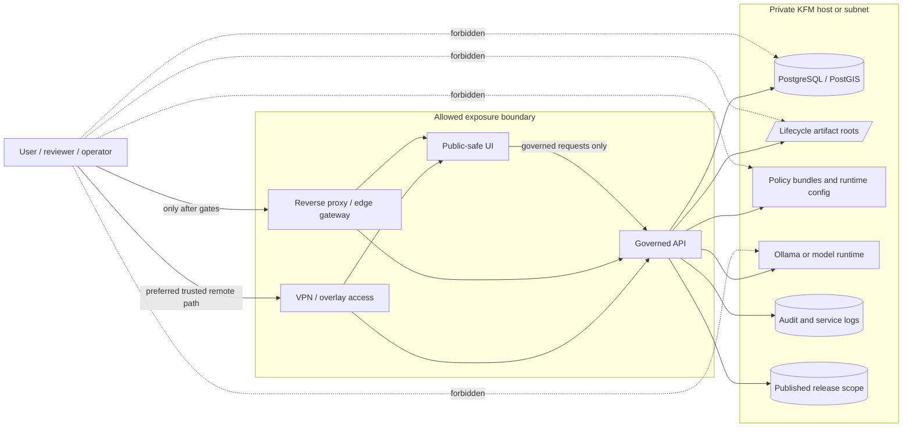

<!-- [KFM_META_BLOCK_V2]
doc_id: kfm://doc/NEEDS_VERIFICATION__adr-0010-local-exposure-security
title: ADR-0010 Local Exposure Security
type: standard
version: v1
status: draft
owners: NEEDS_VERIFICATION__security_platform_or_repo_stewards
created: NEEDS_VERIFICATION__YYYY-MM-DD
updated: 2026-04-27
policy_label: NEEDS_VERIFICATION__restricted_or_internal
related: [NEEDS_VERIFICATION__docs/architecture/governed-api.md, NEEDS_VERIFICATION__docs/runbooks/local-ai-runtime.md, NEEDS_VERIFICATION__docs/runbooks/local-exposure.md, NEEDS_VERIFICATION__policy/README.md, NEEDS_VERIFICATION__schemas/contracts/v1/runtime/runtime_response_envelope.schema.json]
tags: [kfm, adr, security, local-exposure, governed-api, vpn, reverse-proxy, ollama, maplibre]
notes: [Target path supplied by current request; no mounted repo was available to verify existing file history, CODEOWNERS, policy label, related paths, route names, service names, workflow names, or platform settings. Updated date is the current-session draft date. This ADR is doctrine-grounded and implementation-aware, but implementation claims remain PROPOSED or UNKNOWN until verified in the target repository and runtime.]
[/KFM_META_BLOCK_V2] -->

<a id="top"></a>

# ADR-0010: Local Exposure Security

Decision record for how KFM may be exposed from a local or home-hosted runtime without weakening the governed evidence path.

> [!IMPORTANT]
> **Decision status:** `PROPOSED`  
> **Document status:** `draft`  
> **Target path:** `docs/adr/ADR-0010-local-exposure-security.md`  
> **Default posture:** local-only first, VPN-first for trusted remote access, reverse-proxy exposure only after explicit gates  
> **Policy posture:** treat as `restricted/internal` until the repository’s policy label and disclosure rules are verified

**Quick jumps:** [Decision](#decision) · [Scope](#scope) · [Context](#context) · [Exposure ladder](#exposure-ladder) · [Required controls](#required-controls) · [Forbidden paths](#forbidden-paths) · [Validation](#validation) · [Consequences](#consequences) · [Rollback](#rollback) · [Open verification](#open-verification) · [Source map](#source-map)

---

## Decision

KFM will use a **deny-by-default local exposure model**.

A locally hosted KFM instance may be exposed only through governed, auditable, least-privilege boundaries. The normal exposed surfaces are:

1. the **governed API**, when it can enforce actor, scope, policy, release state, EvidenceBundle resolution, finite outcome envelopes, and audit IDs;
2. the **public-safe UI**, when it consumes only governed API responses and released artifacts;
3. a **reverse proxy or edge gateway**, only when it forwards intended traffic to the governed API or public-safe UI and preserves auditability;
4. a **VPN or overlay network**, preferred before any public reverse proxy when access is for trusted third parties, reviewers, or operators.

KFM will not expose canonical databases, RAW / WORK / QUARANTINE storage, artifact roots, policy bundles, model runtimes, review internals, or administrative derived-store surfaces directly to the LAN or public internet.

> [!NOTE]
> This ADR records the security decision and minimum acceptance gates. It is **not** a full deployment runbook and does not assert that any firewall, reverse proxy, VPN, auth, CI, or runtime configuration already exists.

---

## Status and truth posture

| Claim area | Label | Meaning for this ADR |
|---|---:|---|
| KFM trust law | CONFIRMED | KFM doctrine requires governed truth paths, evidence-first outputs, policy-aware release, cite-or-abstain behavior, and public clients behind governed interfaces. |
| Target file path | CONFIRMED | The requested file path is `docs/adr/ADR-0010-local-exposure-security.md`. |
| Existing repo file | UNKNOWN | No mounted target repository was available in the current visible workspace, so this file may be new or may revise an uninspected existing ADR. |
| Decision content | PROPOSED | The exposure model is a repo-ready decision draft pending owner, platform, policy, and runtime review. |
| Exact implementation | UNKNOWN | Current auth stack, proxy choice, VPN arrangement, firewall rules, route tree, service names, CI workflows, branch protections, and logs are not verified. |
| External security details | NEEDS VERIFICATION | Tool versions, package pins, provider behavior, firewall syntax, and service hardening must be refreshed before operational use. |

---

## Scope

This ADR applies to KFM deployments where a local host, home firewall, small private network, reverse proxy, VPN, or trusted third-party access path may expose any KFM surface.

It covers:

- local-only development and proof-slice operation;
- trusted reviewer or operator access over VPN / overlay networking;
- LAN-only exposure in a small trust zone;
- allowlisted or public reverse proxy exposure;
- model runtime placement, especially Ollama or similar local model APIs;
- public-safe UI and MapLibre shell exposure;
- canonical store and artifact-root protection;
- audit, logging, rollback, and validation expectations.

It does **not** cover:

- production identity-provider selection;
- exact firewall syntax for a specific host;
- cloud provider network design;
- emergency-alerting or life-safety delivery;
- full incident-response procedure;
- exact schema, route, or workflow names before repo verification.

---

## Context

KFM is a governed, evidence-first, map-first, time-aware spatial knowledge system. Its public unit of value is the **inspectable claim**, not a tile, model answer, map popup, or static file by itself.

That makes local exposure unusually consequential. A home firewall, trusted LAN, or reverse proxy can make an internal mistake internet-adjacent. A model runtime bound too broadly can create a second truth path. A direct route to RAW, WORK, QUARANTINE, canonical databases, or artifact roots can bypass the trust membrane immediately.

KFM therefore treats network exposure as a governed architectural transition, not a convenience setting.

### Decision drivers

| Driver | Consequence |
|---|---|
| Truth membrane | Normal clients must enter through governed APIs, not direct stores or model runtimes. |
| Evidence-first output | Public or semi-public answers must resolve to release-scoped evidence and policy state. |
| Local runtime risk | Local services can become public through firewall, NAT, proxy, or LAN mistakes. |
| Model runtime posture | Model APIs are interpretive helpers, not public truth surfaces. |
| Sensitive data | Exact sensitive locations, living-person/private data, cultural context, and unreleased artifacts fail closed. |
| Auditability | Exposure must preserve request IDs, actor context, release scope, policy decision, and outcome. |
| Reversibility | Exposure can be disabled quickly without moving canonical data or rewriting doctrine. |

---

## Exposure ladder

KFM will advance exposure only through the following ladder. Higher modes do not replace lower controls; they add obligations.

| Mode | Allowed surface | Default use | Required gates |
|---|---|---|---|
| `M0_LOCAL_ONLY` | Local console, loopback services, tightly scoped SSH | First proof slices, operator-only work | Host firewall, individual operator identity, loopback binds, persistent logs |
| `M1_VPN_PRIVATE_REMOTE` | Governed API and optional public-safe UI over VPN / overlay | Trusted reviewers, trusted operators, small remote team | VPN peer inventory, role-bound access, no direct DB/model/artifact routes |
| `M2_ALLOWLISTED_REVERSE_PROXY` | HTTPS reverse proxy to governed API and/or public-safe UI | Limited external review or controlled access | TLS, auth, allowlist where practical, rate limits, audit IDs, backend private binds |
| `M3_PUBLIC_EDGE_SPLIT` | Public edge gateway and public-safe UI/API only | Public or semi-public release surface | Published-release-only access, policy checks, sensitive transform receipts, rollback plan |
| `M_DENY_DIRECT_INTERNAL` | None | All modes | Direct exposure of canonical stores, model runtime, RAW / WORK / QUARANTINE, policy bundles, and admin ports is denied |



---

## Required controls

### 1. Host and network boundary

| Requirement | Minimum rule | Validation signal |
|---|---|---|
| Firewall posture | Deny incoming by default; allow only explicit ingress. | Firewall status reviewed and captured before exposure. |
| SSH | Individual operator accounts; key-based auth preferred; no shared root workflow. | Named accounts, logged elevation, config validation before restart. |
| Bind scope | Bind to the narrowest usable scope for the current mode. | API/model/DB/admin ports are loopback, socket, VPN-only, or private as required. |
| Time discipline | Use one authoritative time sync path. | Host reports synchronized time before emitting release/audit artifacts. |
| Logging | Preserve service logs and request/audit joins. | Logs include request ID, audit ref, actor/scope where applicable, and release ID. |
| Patch posture | Security updates are deliberate, logged, and reversible. | Patch window, update source, and rollback notes exist. |

### 2. Governed API boundary

The governed API is the only normal client-visible truth boundary.

It must:

- evaluate actor, surface, scope, release state, and policy before data or model access;
- resolve `EvidenceRef` to `EvidenceBundle` where a claim depends on evidence;
- return finite outcomes such as `ANSWER`, `ABSTAIN`, `DENY`, or `ERROR`;
- expose stale, denied, restricted, or failed states honestly;
- emit audit references suitable for later reconstruction;
- fail readiness if policy, release scope, evidence resolution, or audit sinks are unavailable.

> [!WARNING]
> A process that is merely listening on a port is not ready for KFM. Readiness must include the minimum dependencies required for truthful behavior.

### 3. Reverse proxy boundary

A reverse proxy may exist only as an intentional exposure boundary.

It must:

- terminate TLS for public or semi-public access;
- route only intended public-safe traffic;
- forward to private upstream binds;
- preserve request IDs and headers needed for audit joins;
- enforce auth, allowlist, rate limits, and body-size limits appropriate to the mode;
- never convert `DENY`, `ABSTAIN`, stale, or error states into cosmetic success;
- maintain a publication map that names public hostname, upstream, allowed paths, auth, log sink, and rollback switch.

### 4. VPN / overlay boundary

VPN-mediated access is the preferred first remote-access mode for trusted third parties.

It must:

- name each peer or group;
- define allowed surfaces per peer role;
- avoid broad subnet access where a narrower route is feasible;
- preserve logs sufficient to reconstruct review and operator activity;
- be revocable without changing canonical data or release artifacts.

### 5. Model runtime boundary

Local model runtimes, including Ollama or compatible adapters, must remain private.

They must not:

- receive direct browser traffic;
- bind to all interfaces without an explicit security exception;
- be exposed through a home router, LAN wildcard, or public reverse proxy;
- read RAW, WORK, QUARANTINE, or unpublished artifact roots directly;
- become an alternate route around policy, citation validation, or release state.

Allowed pattern:

```yaml
# Illustrative policy shape, not executable host configuration.
model_runtime_boundary:
  default: deny_direct_client_access
  bind_scope: loopback_or_private_only
  allowed_callers:
    - governed_api
  forbidden_callers:
    - browser
    - public_ui
    - reverse_proxy_direct
    - unauthenticated_lan_client
  input_scope:
    allowed: [release_scoped_context, policy_checked_context]
    forbidden: [RAW, WORK, QUARANTINE, unpublished_artifact_roots]
  output_scope:
    required: [structured_output_validation, citation_validation, policy_postcheck, runtime_response_envelope]
```

### 6. Store and artifact boundary

Canonical and lifecycle stores remain internal.

| Surface | Exposure decision |
|---|---|
| PostgreSQL / PostGIS | Never directly internet-exposed; use Unix socket or loopback/private bind. |
| RAW | Never public; source-native capture only. |
| WORK | Never public; repeatable transform and QA area. |
| QUARANTINE | Never public; failed, unclear, restricted, or review-needed material. |
| PROCESSED | Not automatically public; must still pass catalog/release gates. |
| CATALOG / TRIPLET | Queryable only through governed interfaces unless explicitly released. |
| PUBLISHED | May feed public-safe UI/API/tiles only with release manifest and policy state. |
| Derived stores | Rebuildable accelerators; never proof by themselves. |
| Policy and contract registries | Not public runtime endpoints unless explicitly reviewed and sanitized. |

### 7. UI and map boundary

MapLibre, story surfaces, popups, Focus Mode, and Evidence Drawer are downstream of trust.

They must:

- consume released layers, governed API responses, or public-safe derived artifacts;
- show evidence, policy, review, stale, and correction state where consequential;
- avoid treating vector tiles, PMTiles, rendered features, or style toggles as proof;
- avoid direct browser access to model runtimes or canonical stores;
- return visible negative states instead of hiding denial or uncertainty.

---

## Forbidden paths

These paths are denied unless a later ADR creates a narrower, reviewed, time-bounded exception:

- public or LAN-wide Ollama / model runtime endpoint;
- browser-to-model-runtime calls;
- browser-to-database calls;
- direct public PostgreSQL / PostGIS;
- direct file sharing of `/srv/kfm` or equivalent artifact roots;
- direct access to RAW, WORK, or QUARANTINE;
- public access to graph/vector/search admin surfaces;
- public access to policy bundles or private contract registries;
- reverse proxy routes to unpublished artifacts;
- static UI caches that hide stale, denied, restricted, or error states;
- shared root or shared superuser workflow for normal operations;
- “trust the home router” as a complete security model.

---

## Validation

This ADR is not complete until the repository and runtime can prove the boundary.

### Proposed CI gates

| Gate | Purpose | Truth label |
|---|---|---:|
| `security-boundary` | Prove no public route or frontend code calls model runtime, DB, RAW, WORK, or QUARANTINE directly. | PROPOSED |
| `api-contract` | Prove exposed responses use finite envelopes and trust state. | PROPOSED |
| `policy-gates` | Prove actor/scope/release/sensitivity policy denies unsafe requests. | PROPOSED |
| `ui-trust-state` | Prove UI displays `DENY`, `ABSTAIN`, stale, and error states. | PROPOSED |
| `release-dry-run` | Prove public-safe release scope exists before public exposure. | PROPOSED |
| `proxy-smoke` | Prove public paths map only to intended UI/API upstreams. | PROPOSED |

### Minimum test checklist

- [ ] No frontend source contains direct model-runtime base URLs.
- [ ] No frontend source contains direct database, RAW, WORK, or QUARANTINE URLs.
- [ ] No public route returns unpublished lifecycle-stage artifacts.
- [ ] API readiness fails when policy bundle, published release scope, evidence resolver, or audit sink is unavailable.
- [ ] `DENY`, `ABSTAIN`, and `ERROR` paths are rendered visibly in UI.
- [ ] Reverse proxy route inventory exists and matches the allowed publication map.
- [ ] Firewall / bind scan confirms forbidden ports are not externally reachable.
- [ ] VPN peer list and role mapping are reviewed before trusted third-party access.
- [ ] Secrets do not appear in repo, logs, receipts, prompts, fixtures, or UI payloads.
- [ ] Rollback disables exposure without moving canonical data.

### Manual review gates

Before moving from `M0_LOCAL_ONLY` to any remote exposure mode, reviewers must confirm:

1. owner and CODEOWNERS coverage;
2. policy label for this ADR and related runbooks;
3. auth and role model;
4. proxy/VPN/firewall configuration;
5. log retention and request-ID propagation;
6. sensitive data handling;
7. release manifest and rollback path;
8. backup/restore evidence for canonical data;
9. incident contact and disable switch.

---

## Consequences

### Positive consequences

- Keeps KFM’s trust membrane operational, not decorative.
- Reduces local-host and home-router convenience risk.
- Prevents model runtimes from becoming unsupervised truth surfaces.
- Preserves citation, policy, release, and audit requirements at the network edge.
- Gives maintainers a reviewable ladder from local-only to private remote to public edge.
- Makes rollback a network/configuration action rather than a data migration.

### Tradeoffs

- Trusted third-party access may be slower to set up because VPN/auth/proxy gates come first.
- Direct demos are less convenient because raw ports and model endpoints remain private.
- Public UI work must wait for released, policy-safe artifacts instead of reading internal stores.
- More logs and request IDs must be preserved, which increases operational discipline.
- Future exceptions require ADR or waiver work rather than informal port forwarding.

### Rejected alternatives

| Alternative | Rejection reason |
|---|---|
| Expose the full local stack through a home router | Breaks least privilege and makes internal mistakes internet-adjacent. |
| Put Ollama or model runtime on LAN for convenience | Creates a direct model path outside policy, citation validation, and release state. |
| Let static UI read artifact roots | Bypasses lifecycle and publication gates. |
| Treat MapLibre layers as proof | Rendered features and tiles are downstream representations, not evidence bundles. |
| Depend on NAT alone | NAT is not an authorization, audit, or policy boundary. |
| Hide failures behind friendly UI chrome | KFM requires trust-visible negative states. |

---

## Rollback

Exposure rollback must be fast, observable, and reversible.

Minimum rollback actions:

1. disable public reverse proxy site or route;
2. revoke or disable affected VPN peers;
3. close firewall rules added for the exposure mode;
4. rotate credentials or tokens that may have been exposed;
5. invalidate public caches for affected UI, tiles, PMTiles, or static bundles;
6. restore the previous release manifest or mark the current release withdrawn;
7. preserve audit logs and incident notes;
8. record a correction or rollback notice where public claims may have been affected.

Rollback must not require moving RAW, WORK, QUARANTINE, canonical DB, or policy registry data.

---

## Open verification

The following remain `UNKNOWN` until the actual repository and deployment are inspected:

- existing ADR numbering and prior ADR-0010 history;
- CODEOWNERS and document owners;
- policy label for security ADRs;
- actual auth stack and role model;
- actual reverse proxy, if any;
- actual VPN or remote access arrangement;
- actual firewall implementation;
- actual service names and bind addresses;
- actual API route tree and DTO names;
- actual UI framework and MapLibre integration path;
- actual model runtime service configuration;
- actual database roles and socket/bind settings;
- actual `/srv/kfm` or lifecycle artifact paths;
- actual CI workflows and branch protections;
- actual request logging, audit joins, and retention;
- actual backup/restore evidence;
- actual sensitive-location redaction policy;
- actual release manifest and cache invalidation path.

---

## Definition of done

This ADR can move from `draft` to an accepted KFM decision only after:

- [ ] owner and policy label are verified;
- [ ] related paths are corrected to real repo-relative links;
- [ ] the target repository is scanned for existing ADR conventions;
- [ ] the implementation boundary is tested against current app/API/UI code;
- [ ] forbidden exposure paths have static or runtime checks;
- [ ] proxy/VPN/firewall posture is documented in a companion runbook;
- [ ] rollback is tested in at least one non-production environment;
- [ ] security, platform, policy, API, UI, and governance reviewers sign off.

---

## Source map

| Source short name | Role in this ADR |
|---|---|
| KFM Pipeline Living Implementation Manual v0.2 | Security and exposure posture, local-hosted risk model, proposed `security-boundary` CI gate, no direct canonical/model exposure. |
| Ollama & Ubuntu Information | Local-first runtime, host hardening, bind discipline, reverse proxy/VPN/firewall posture, Ollama loopback boundary. |
| KFM MapLibre Operating Architecture, Governed UI, and AI Interaction Manual | Renderer downstream-of-trust rule, UI anti-patterns, no direct browser model/canonical access. |
| KFM Markdown Work Protocol / visible KFM Meta Block examples | Metadata block shape, placeholders, truth-label discipline, draft status handling. |
| Official Ubuntu Server documentation | Current external support for UFW/firewall and WireGuard posture; refresh before implementation. |
| Official Ollama documentation | Current external support for local API authentication posture; refresh before implementation. |

---

## Maintainer notes

- Keep this ADR short enough to review, but strong enough to block unsafe convenience paths.
- Put host commands, exact proxy snippets, VPN peer procedures, and firewall rule examples in a runbook after platform verification.
- Do not downgrade `UNKNOWN` items through tone. Replace them only with inspected repository, runtime, or platform evidence.
- Treat exposure as a governed state transition, not a file move and not a router setting.

[Back to top](#top)
