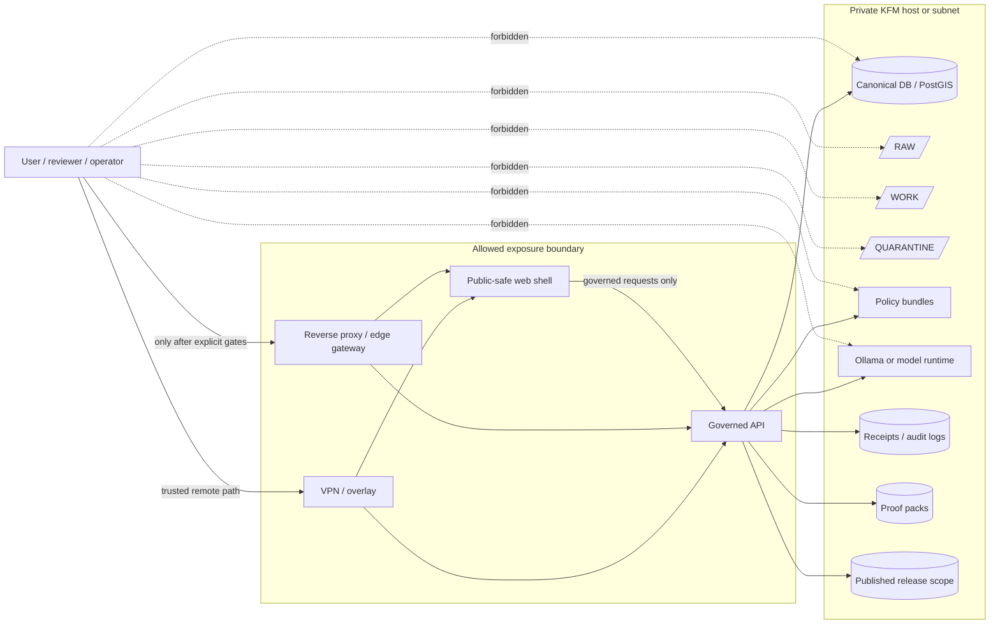

<!-- [KFM_META_BLOCK_V2]
doc_id: kfm://doc/NEEDS-VERIFICATION-adr-0010-local-exposure-security
title: ADR-0010: Local Exposure Security
type: standard
version: v1
status: draft
owners: OWNER_TBD_NEEDS_VERIFICATION
created: DATE_TBD_FROM_GIT_OR_DOC_REGISTRY
updated: 2026-05-06
policy_label: POLICY_LABEL_TBD_NEEDS_VERIFICATION
related: [./README.md, ./ADR-TEMPLATE.md, ./ADR-0207-governed-ai-runtime-envelope.md, ../architecture/governed-api.md, ../doctrine/trust-membrane.md, ../doctrine/lifecycle-law.md, ../../apps/web/README.md, ../../configs/README.md, ../../policy/README.md]
tags: [kfm, adr, security, local-exposure, governed-api, vpn, reverse-proxy, ollama, maplibre, trust-membrane]
notes: [GitHub connector evidence confirmed this target file exists on main during revision. Local mounted checkout was not available in the visible workspace. Owners, created date, policy label, CODEOWNERS coverage, CI enforcement, deployment manifests, live firewall/proxy/VPN posture, runtime logs, and branch protections remain NEEDS VERIFICATION. This revision preserves the existing ADR-0010 scope while tightening the exposure ladder, no-public-raw rule, no-direct-model-client rule, validation gates, rollback triggers, and repo-evidence boundaries.]
[/KFM_META_BLOCK_V2] -->

<a id="top"></a>

# ADR-0010: Local Exposure Security

Decision record for how a local or home-hosted KFM instance may be exposed without weakening evidence, policy, release, audit, or rollback boundaries.

<p align="center">
  
  
  
  
  
  
</p>

<p align="center">
  <a href="#decision">Decision</a> ·
  <a href="#evidence-boundary">Evidence boundary</a> ·
  <a href="#scope">Scope</a> ·
  <a href="#exposure-ladder">Exposure ladder</a> ·
  <a href="#boundary-model">Boundary model</a> ·
  <a href="#required-controls">Controls</a> ·
  <a href="#forbidden-crossings">Forbidden crossings</a> ·
  <a href="#validation">Validation</a> ·
  <a href="#rollback">Rollback</a> ·
  <a href="#open-verification">Open verification</a>
</p>

> [!IMPORTANT]
> **Status:** `draft`  
> **Decision posture:** `PROPOSED` until owners, policy label, deployment evidence, path policy, tests, CI, and runtime enforcement are verified.  
> **Target path:** `docs/adr/ADR-0010-local-exposure-security.md`  
> **Default exposure:** local-only first; VPN-first for trusted remote access; reverse proxy only after explicit gates.  
> **Truth posture:** `CONFIRMED` KFM doctrine and current repo file presence / `PROPOSED` exposure gates / `UNKNOWN` live runtime enforcement.

---

## Decision

KFM will use a **deny-by-default local exposure model**.

A local or home-hosted KFM instance may expose only the surfaces that preserve KFM’s trust membrane:

1. the **governed API**, when it enforces actor, role, evidence, policy, release, correction, and audit state;
2. the **public-safe web shell**, when it consumes only governed API responses and released artifacts;
3. a **VPN or overlay network**, preferred for trusted reviewers, operators, and third-party collaborators;
4. a **reverse proxy or edge gateway**, only when it forwards to intended public-safe UI/API upstreams and preserves request IDs, auth posture, rate limits, cache behavior, and rollback controls.

KFM will not expose canonical databases, RAW / WORK / QUARANTINE storage, unpublished candidates, direct artifact roots, policy bundles, direct model runtime APIs, review internals, admin/debug/proof routes, or AI/model endpoints to the public internet or broad LAN.

### One-line operating rule

> Local exposure is allowed only when the exposed path remains downstream of governed evidence, policy, release state, auditability, and rollback.

### One-line denial rule

> When the boundary cannot prove a safe crossing, KFM must `DENY`, `ABSTAIN`, `ERROR`, hold, restrict, generalize, or withdraw rather than expose a plausible but unsupported path.

[Back to top](#top)

---

## Evidence boundary

This ADR is evidence-grounded but intentionally separates doctrine, repo evidence, runtime evidence, and proposed controls.

| Area | Label | What this ADR may say |
|---|---:|---|
| Target ADR file | `CONFIRMED` | GitHub connector evidence confirms `docs/adr/ADR-0010-local-exposure-security.md` exists on `main`. |
| ADR directory convention | `CONFIRMED / NEEDS VERIFICATION` | `docs/adr/` is the human-facing Architecture Decision Record ledger; complete ADR numbering and status registry still need active-checkout verification. |
| Local mounted checkout | `UNKNOWN / unavailable` | The visible workspace did not contain a mounted KFM Git checkout, so local branch state, dirty state, and runtime files were not inspected from disk. |
| KFM lifecycle and trust membrane | `CONFIRMED` | KFM doctrine requires public surfaces to stay downstream of evidence, policy, release, correction, and rollback. |
| Governed API posture | `CONFIRMED file evidence / NEEDS VERIFICATION runtime` | Repo docs identify the governed API as the trust membrane and surface related API/client/checker files; deployment and CI enforcement remain unverified here. |
| Web shell boundary | `CONFIRMED file evidence / NEEDS VERIFICATION runtime` | Repo docs frame `apps/web` as a map-first consumer of governed outputs, not a truth source; live UI behavior and test coverage need verification. |
| Config and secret posture | `CONFIRMED file evidence / NEEDS VERIFICATION enforcement` | Repo docs treat `configs/` as non-secret wiring; active secret scanning and deployment injection remain to verify. |
| Exposure implementation | `UNKNOWN` | Firewall rules, reverse proxy config, VPN peers, CORS/CSP, service binds, logs, dashboards, and branch protections were not verified. |
| External product details | `NEEDS VERIFICATION` | Exact WireGuard, reverse proxy, systemd, Ollama, firewall, identity-provider, and CVE-sensitive guidance must be refreshed before operational use. |

> [!NOTE]
> This ADR records the architecture decision and acceptance gates. It does not claim that the target deployment is hardened, reachable, tested, or production-ready.

[Back to top](#top)

---

## Repo fit

| Field | Value |
|---|---|
| Path | `docs/adr/ADR-0010-local-exposure-security.md` |
| Owning root | `docs/` |
| Document family | Architecture Decision Record |
| ADR index | [`./README.md`](./README.md) |
| ADR template | [`./ADR-TEMPLATE.md`](./ADR-TEMPLATE.md) |
| Related runtime-envelope decision | [`./ADR-0207-governed-ai-runtime-envelope.md`](./ADR-0207-governed-ai-runtime-envelope.md) |
| Related architecture | [`../architecture/governed-api.md`](../architecture/governed-api.md) |
| Related doctrine | [`../doctrine/trust-membrane.md`](../doctrine/trust-membrane.md), [`../doctrine/lifecycle-law.md`](../doctrine/lifecycle-law.md) |
| Related app surface | [`../../apps/web/README.md`](../../apps/web/README.md) |
| Related config surface | [`../../configs/README.md`](../../configs/README.md) |
| Policy surface | [`../../policy/README.md`](../../policy/README.md) — `NEEDS VERIFICATION` for exact active policy entry points |

`docs/adr/` is the correct responsibility root for this file because the decision governs architecture and security posture. It does not belong under a new root-level security topic folder, a domain lane, `apps/`, `configs/`, `runtime/`, or `infra/`.

### Accepted inputs

This ADR may contain:

- exposure policy and architecture decisions;
- local-only, VPN, reverse-proxy, and public-edge mode definitions;
- model runtime exposure decisions;
- governed API and web shell exposure constraints;
- forbidden internal-store and direct-model paths;
- validation gates, rollback triggers, exception rules, and open verification items.

### Exclusions

| Not in this ADR | Proper home |
|---|---|
| Host-specific firewall commands | A verified runbook under `docs/runbooks/` or deployment docs |
| Reverse proxy product config | `infra/`, `runtime/`, `configs/`, or host-local deployment docs after verification |
| VPN peer inventory | Private operational records or a restricted runbook |
| Secrets and live DSNs | Secret manager or host-local environment injection, never repo Markdown |
| Executable policy | `policy/` or the accepted policy home |
| Runtime app code | `apps/` or `packages/` |
| Machine schemas | `schemas/` or the accepted schema home |
| Emitted receipts, proofs, release manifests, rollback cards | `data/receipts/`, `data/proofs/`, `release/`, or accepted emitted-object homes |

[Back to top](#top)

---

## Scope

This ADR applies to KFM deployments where a local host, home firewall, small private network, trusted collaborator tunnel, reverse proxy, VPN, overlay network, or public edge might expose any KFM surface.

It covers:

- local-only proof-slice operation;
- LAN exposure;
- trusted reviewer/operator access over VPN or overlay network;
- allowlisted reverse proxy exposure;
- public reverse proxy or edge exposure;
- public-safe UI and MapLibre shell exposure;
- governed API exposure;
- local model runtime placement, including Ollama-compatible runtimes;
- CORS/CSP, rate limiting, logging, bind scope, and secret posture;
- cache and tile publication controls;
- rollback and emergency shutoff expectations.

It does not decide:

- production identity provider;
- exact host firewall syntax;
- exact VPN product;
- exact reverse proxy product;
- cloud network topology;
- emergency alerting or life-safety workflows;
- final route names, service names, or package layout;
- final schema or policy implementation details.

[Back to top](#top)

---

## Context

KFM is a governed, Kansas-first, map-first, time-aware spatial evidence and publication system. Its durable public unit is the **inspectable claim**, not a raw dataset, tile, popup, vector search result, graph edge, generated answer, dashboard, screenshot, or static file by itself.

Local exposure is therefore architecture-significant. A local runtime that is safe on loopback can become unsafe through a home router, wildcard bind, permissive CORS policy, reverse proxy, LAN discovery, temporary tunnel, misconfigured VPN, or direct model endpoint.

### Decision drivers

| Driver | Consequence |
|---|---|
| Trust membrane | Normal clients enter through governed APIs and released artifacts only. |
| Evidence-first output | Claims must resolve to admissible evidence or finite negative outcomes. |
| Local runtime risk | Home-hosted convenience can become public exposure without review. |
| Model-runtime posture | Local models are interpretive helpers, not public truth surfaces. |
| Sensitive data | Exact sensitive locations, living-person data, DNA, archaeology, rare species, critical infrastructure, private land, and rights-uncertain data fail closed. |
| Auditability | Exposed paths must preserve request IDs, actor/scope, policy decision, release ID, and rollback target. |
| Reversibility | Exposure can be disabled without moving canonical data or deleting audit evidence. |

[Back to top](#top)

---

## Exposure ladder

KFM advances exposure through modes. Higher modes add obligations; they do not remove lower controls.

| Mode | Allowed surface | Default use | Required gates |
|---|---|---|---|
| `M0_LOCAL_ONLY` | Loopback UI/API, local console, tightly scoped SSH | First proof slices, operator-only work | Host firewall, loopback/private binds, named operator access, logs |
| `M1_VPN_PRIVATE_REMOTE` | Governed API and optional public-safe UI over VPN/overlay | Trusted reviewers and operators | Peer inventory, role mapping, no direct DB/model/raw/artifact/admin exposure |
| `M2_ALLOWLISTED_REVERSE_PROXY` | HTTPS reverse proxy to governed API and/or public-safe UI | Limited external review or controlled access | TLS, auth/allowlist where practical, rate limits, route map, request-ID propagation |
| `M3_PUBLIC_EDGE_SPLIT` | Public-safe UI/API and released public assets only | Public or semi-public release surface | Release-manifest-only access, policy checks, sensitive transforms, cache rollback, correction path |
| `M4_PRODUCTION_SPLIT` | Dedicated edge, identity, governed API, workers, canonical stores, artifact stores, model runtime, observability | Later maturity | Platform/security review, duty separation, recovery drills, release/correction/withdrawal process |
| `M_DENY_DIRECT_INTERNAL` | No public surface | All modes | Direct exposure of canonical stores, RAW/WORK/QUARANTINE, policy bundles, direct model runtimes, admin/debug/proof routes, and internal artifact roots is denied |

> [!CAUTION]
> A KFM instance that cannot prove policy, evidence resolution, release scope, no-direct-internal access, logging, and rollback remains in `M0_LOCAL_ONLY` or `M_DENY_DIRECT_INTERNAL`.

[Back to top](#top)

---

## Boundary model

KFM’s exposure boundary must preserve lifecycle law:

```text
SOURCE EDGE -> RAW -> WORK / QUARANTINE -> PROCESSED -> CATALOG / TRIPLET -> PUBLISHED
```



The browser, map shell, Focus Mode, Evidence Drawer, exports, search, dashboards, and public API must remain downstream of governed evidence and released artifacts.

[Back to top](#top)

---

## Required controls

### Host and network controls

| Requirement | Minimum rule | Acceptance signal |
|---|---|---|
| Ingress posture | Deny incoming by default; allow only explicit mode-approved ingress. | Firewall/bind review is captured before exposure. |
| Bind scope | Bind services to the narrowest usable interface. | Model, DB, admin, and debug services are loopback/private/VPN-only as required. |
| SSH/admin | Individual operator identity; no shared admin workflow for normal operations. | Account and elevation model reviewed. |
| Admin/debug/proof routes | Private by default. | Public proxy route map excludes admin/debug/proof routes. |
| Time sync | Host time must be stable enough for audit and release artifacts. | Time sync status reviewed before emitting release/audit objects. |
| Logs | Trust-significant actions are logged without secrets. | Logs join request ID, actor/scope where applicable, policy outcome, release ID, and audit ref. |
| Secrets | No secrets in repo, prompts, docs, fixtures, logs, examples, screenshots, bundles, receipts, or generated artifacts. | Secret scan or manual equivalent passes before exposure. |
| Patching | Security updates are deliberate and reversible. | Update source, restart plan, and rollback note exist for trust-bearing services. |

### Governed API controls

The governed API is the only normal client-visible truth boundary.

It must:

- evaluate actor, role, scope, release state, source role, sensitivity, rights, and policy before serving data or model-mediated content;
- resolve `EvidenceRef -> EvidenceBundle` where a claim depends on evidence;
- return finite outcomes such as `ANSWER`, `ABSTAIN`, `DENY`, and `ERROR`;
- expose stale, withdrawn, denied, restricted, generalized, or error states honestly;
- emit audit references sufficient for reconstruction;
- fail readiness if policy, evidence resolver, release scope, source registry, or audit sink is unavailable;
- reject requests that target RAW, WORK, QUARANTINE, internal artifact roots, canonical stores, or direct model runtime paths.

### VPN / overlay controls

VPN-mediated access is the preferred first remote-access mode.

It must:

- name each peer or peer group;
- map peer access to role and surface;
- avoid broad subnet access where narrower routing is feasible;
- preserve logs sufficient to reconstruct review and operator activity;
- be revocable without changing canonical data;
- keep direct database, model-runtime, artifact-root, policy-bundle, admin, and debug access denied unless an explicit admin exception exists.

### Reverse proxy controls

A reverse proxy may exist only as an intentional exposure boundary.

It must:

- terminate TLS for public or semi-public access;
- route only intended public-safe traffic;
- forward to private upstream binds;
- preserve request IDs and audit headers;
- enforce auth, allowlist, rate limits, body-size limits, CORS, and cache behavior appropriate to the exposure mode;
- never convert `DENY`, `ABSTAIN`, stale, restricted, withdrawn, or `ERROR` states into cosmetic success;
- maintain a route map naming hostname, upstream, allowed paths, auth posture, cache behavior, log sink, and rollback switch.

### Model runtime controls

Local model runtimes, including Ollama-compatible runtimes, remain private.

They must not:

- receive direct browser traffic;
- bind broadly without a time-bounded, reviewed exception;
- be exposed through home-router port forwarding, broad LAN access, public reverse proxy, or direct tunnel;
- read RAW, WORK, QUARANTINE, unpublished candidates, canonical stores, or unrestricted sensitive exact-location context directly;
- become an alternate path around policy, citation validation, review, release, or correction state;
- persist private chain-of-thought as a KFM truth object.

Allowed pattern:

```yaml
# PROPOSED architecture constraint, not host configuration.
model_runtime_boundary:
  default: deny_direct_client_access
  bind_scope: loopback_or_private_network
  allowed_callers:
    - governed_api
  forbidden_callers:
    - browser
    - public_ui
    - reverse_proxy_direct
    - unauthenticated_lan_client
  input_scope:
    allowed:
      - release_scoped_context
      - policy_checked_context
      - evidence_bundle_context
    forbidden:
      - RAW
      - WORK
      - QUARANTINE
      - unpublished_candidates
      - unrestricted_sensitive_exact_location_context
  output_scope:
    required:
      - structured_output_validation
      - citation_validation
      - policy_postcheck
      - runtime_response_envelope
      - audit_ref
```

### Store, artifact, and cache controls

| Surface | Exposure decision |
|---|---|
| PostgreSQL / PostGIS | Never directly internet-exposed; use loopback, Unix socket, private bind, or internal network only. |
| RAW | Never public. |
| WORK | Never public. |
| QUARANTINE | Never public, except safe reason summaries through governed APIs. |
| PROCESSED | Not automatically public; still requires catalog/proof/policy/review/release. |
| CATALOG / TRIPLET | Queryable only through governed interfaces unless explicitly released. |
| PUBLISHED | May feed public-safe UI/API/tiles only with release manifest, policy state, and rollback path. |
| Tiles / PMTiles / COGs | Public only after sensitivity, rights, source-role, release, and cache rollback checks. |
| Vector/search indexes | Retrieval accelerators; never sovereign truth. |
| Graph projections | Derived relation surfaces; never canonical records. |
| Receipts and proofs | Audit/proof object families; expose only sanitized public-safe summaries when reviewed. |
| Static bundles | No secrets, private service URLs, or internal paths. |
| Browser/CDN caches | Must not hide withdrawal, stale state, denial, or correction notices. |

### Web shell and MapLibre controls

MapLibre and the web shell are downstream renderers and interaction surfaces.

They must:

- render released layers and public-safe artifacts;
- call governed APIs for Evidence Drawer and Focus Mode;
- display evidence, freshness, policy, review, correction, denied, restricted, generalized, withdrawn, and error states where material;
- avoid client-only policy decisions;
- avoid direct source API calls as public truth;
- avoid direct model-runtime calls;
- avoid direct RAW, WORK, QUARANTINE, canonical-store, graph-store, vector-store, or internal artifact-root access.

[Back to top](#top)

---

## ExposureProfile review record

Each exposure mode should have a reviewable record. This shape is **PROPOSED**, not a confirmed schema.

```yaml
exposure_profile:
  profile_id: kfm://exposure/NEEDS-VERIFICATION
  mode: M1_VPN_PRIVATE_REMOTE
  owner: OWNER_TBD_NEEDS_VERIFICATION
  reviewed_at: DATE_TBD_NEEDS_VERIFICATION
  allowed_surfaces:
    - governed_api
    - public_safe_web_shell
  denied_surfaces:
    - canonical_db
    - raw_work_quarantine
    - unpublished_candidates
    - artifact_roots_direct
    - model_runtime_direct
    - policy_bundles_direct
    - admin_debug_proof_routes_public
  public_hostnames: []
  vpn_peers:
    - PEER_ID_TBD_NEEDS_VERIFICATION
  reverse_proxy_routes: []
  release_scope: RELEASE_ID_TBD_NEEDS_VERIFICATION
  policy_bundle: POLICY_BUNDLE_ID_TBD_NEEDS_VERIFICATION
  audit_sink: AUDIT_SINK_TBD_NEEDS_VERIFICATION
  rollback_switch: ROLLBACK_SWITCH_TBD_NEEDS_VERIFICATION
  verification_status: NEEDS_VERIFICATION
```

[Back to top](#top)

---

## Forbidden crossings

The following are `DENY` unless a later accepted ADR or time-bounded exception creates a narrower, reviewed, auditable internal path:

- public or broad-LAN Ollama/model-runtime endpoint;
- browser-to-model-runtime calls;
- browser-to-database calls;
- public PostgreSQL/PostGIS;
- direct file sharing of KFM lifecycle or artifact roots;
- direct public access to RAW, WORK, or QUARANTINE;
- public access to unpublished candidates;
- public access to graph/vector/search admin surfaces;
- public access to policy bundles or private contract registries;
- reverse proxy routes to unpublished artifacts;
- static UI caches that hide stale, denied, withdrawn, restricted, generalized, or error states;
- shared root or shared superuser workflows for normal operations;
- “home router NAT” as the security model;
- “temporary” port forwarding without owner, expiration, log, and rollback record;
- direct AI chat that bypasses EvidenceBundle resolution, citation validation, policy postcheck, and finite runtime envelopes.

[Back to top](#top)

---

## Exceptions

Admin or maintenance shortcuts may exist only when justified, constrained, time-bounded, logged, and prevented from becoming the normal public path.

A valid exception must include:

| Field | Requirement |
|---|---|
| Owner | Named accountable owner or team. |
| Reason | Why normal governed access is insufficient. |
| Scope | Exact host, port, route, identity, data scope, and time window. |
| Risk | What trust membrane, privacy, rights, or safety risk is introduced. |
| Compensating controls | Extra logging, allowlist, temporary firewall rule, local-only bind, peer restriction, or operator supervision. |
| Expiration | Date/time or event that ends the exception. |
| Review | Security/platform/governance approval appropriate to the risk. |
| Rollback | Shutoff action and evidence preservation step. |
| Receipt | Exception record retained outside public surfaces. |

> [!CAUTION]
> A convenience exception without owner, expiration, audit record, and rollback switch is a policy failure.

[Back to top](#top)

---

## Validation

This ADR is not accepted as enforced until repository, configuration, and runtime evidence prove the boundary.

### Proposed CI and review gates

| Gate | Purpose | Status |
|---|---|---:|
| `local-exposure-boundary` | Prove exposed routes match the approved exposure profile. | `PROPOSED` |
| `no-public-raw-path` | Prove public routes cannot reach RAW, WORK, QUARANTINE, unpublished candidates, or internal artifact roots. | `PROPOSED` |
| `no-direct-model-client` | Prove browser/client code cannot call Ollama or model/provider APIs directly. | `PROPOSED` |
| `governed-api-finite-envelope` | Prove client-visible runtime responses use finite outcomes and trust state. | `PROPOSED` |
| `proxy-route-map` | Prove reverse proxy routes map only to intended public-safe upstreams. | `PROPOSED` |
| `vpn-peer-inventory` | Prove trusted remote access is named, scoped, and revocable. | `PROPOSED` |
| `secrets-and-config` | Prove secrets are absent from committed configs, docs, fixtures, prompts, bundles, logs, and generated artifacts. | `PROPOSED` |
| `release-scope` | Prove public-safe artifacts are release-manifest-bound. | `PROPOSED` |
| `ui-negative-state` | Prove UI renders `ABSTAIN`, `DENY`, `ERROR`, stale, restricted, generalized, superseded, and withdrawn states. | `PROPOSED` |
| `audit-join` | Prove request IDs join across proxy, API, policy, model adapter, and audit logs where applicable. | `PROPOSED` |
| `rollback-drill` | Prove exposure can be disabled without moving canonical data or deleting audit evidence. | `PROPOSED` |

### Minimum test checklist

- [ ] No frontend source contains direct model-runtime base URLs.
- [ ] No frontend source contains direct database, RAW, WORK, QUARANTINE, private catalog, or private policy URLs.
- [ ] No public route returns unpublished lifecycle-stage artifacts.
- [ ] API readiness fails when policy bundle, release scope, evidence resolver, source registry, or audit sink is unavailable.
- [ ] `ANSWER`, `ABSTAIN`, `DENY`, and `ERROR` behavior is fixture-tested where runtime synthesis is present.
- [ ] `DENY`, `ABSTAIN`, stale, restricted, generalized, superseded, withdrawn, and `ERROR` states render visibly in UI.
- [ ] Reverse proxy route inventory exists and matches the allowed publication map.
- [ ] Firewall/bind scan confirms forbidden ports are not externally reachable.
- [ ] VPN peer list and role mapping are reviewed before trusted third-party access.
- [ ] Secrets do not appear in repo, logs, receipts, prompts, fixtures, UI payloads, static bundles, examples, or screenshots.
- [ ] Release manifest names all public-safe artifacts exposed through UI/API/proxy.
- [ ] Cache purge or versioned rollback path exists for public-safe tiles, static bundles, API responses, and PMTiles/COG-style artifacts.
- [ ] Rollback disables exposure without moving RAW, WORK, QUARANTINE, canonical DB, or policy registry data.

### Review-aid commands

These are review aids, not confirmed runnable project commands. Replace with repo-native tooling before claiming enforcement.

```bash
# Confirm active repository context.
git rev-parse --show-toplevel
git status --short
git branch --show-current || true

# Inspect exposure-adjacent files.
find docs/adr docs/architecture docs/doctrine apps configs policy tests tools runtime infra .github \
  -maxdepth 4 -type f 2>/dev/null | sort | sed -n '1,300p'

# Search for risky public bypasses.
grep -RInE 'data/raw|data/work|data/quarantine|RAW|WORK|QUARANTINE|localhost:11434|OLLAMA_HOST|/api/generate|/api/chat' \
  apps packages tools tests docs configs 2>/dev/null || true

# Search for committed secret-like values.
grep -RInE '(password|passwd|secret|token|api[_-]?key|private[_-]?key|BEGIN (RSA|OPENSSH|PRIVATE) KEY)' \
  . 2>/dev/null || true
```

[Back to top](#top)

---

## Rollback

Exposure rollback must be fast, observable, and reversible.

Minimum rollback actions:

1. disable public reverse proxy site, route, or edge rule;
2. revoke or disable affected VPN/overlay peers;
3. close firewall rules added for the exposure mode;
4. disable model adapters where model exposure is implicated;
5. rotate credentials or tokens that may have been exposed;
6. invalidate affected public caches for UI, tiles, PMTiles, COGs, static bundles, and API responses;
7. restore the previous release manifest or mark the current release withdrawn;
8. preserve audit logs, proxy logs, policy decisions, model adapter receipts, and incident notes;
9. record a correction, withdrawal, or rollback notice where public claims may have been affected;
10. verify that RAW, WORK, QUARANTINE, canonical DB, and policy registry were not moved or exposed as part of rollback.

Rollback must not require deleting evidence needed for audit.

### Rollback triggers

Rollback is required when any of the following are found:

- public route to model runtime, database, RAW, WORK, QUARANTINE, unpublished candidates, or direct artifact root;
- public route returns unreleased or rights-uncertain artifacts;
- UI hides `DENY`, `ABSTAIN`, stale, withdrawn, restricted, generalized, or `ERROR` states;
- logs cannot reconstruct actor/scope/request/release/policy outcome;
- model runtime receives direct client traffic;
- release manifest cannot identify exposed artifacts;
- cache purge or version rollback cannot be performed;
- secrets appear in public bundle, logs, fixtures, prompts, receipts, or committed config;
- sensitive location, living-person, DNA/genomic, archaeology, rare-species, private-land, or critical-infrastructure exposure is suspected.

[Back to top](#top)

---

## Consequences

### Positive consequences

- Keeps local convenience from becoming an ungoverned public trust path.
- Keeps model runtimes subordinate to governed APIs, evidence resolution, citation validation, and policy checks.
- Preserves KFM’s public-client boundary: released artifacts and governed responses only.
- Makes `ABSTAIN`, `DENY`, and `ERROR` operational states rather than hidden failures.
- Gives maintainers a reviewable ladder from local-only to private remote to public edge.
- Makes exposure rollback a controlled network/config/cache action rather than a data mutation.

### Tradeoffs

| Tradeoff | Impact |
|---|---|
| Slower demos | Direct port forwarding and direct model endpoints remain denied. |
| More review work | VPN/proxy/config changes must name owners, route maps, logs, and rollback. |
| More negative states | Some user questions produce `ABSTAIN` or `DENY` even when a model could generate plausible prose. |
| More fixtures/tests | No-public-raw and no-direct-model-client checks become part of product trust. |
| More operational discipline | Logs, request IDs, cache invalidation, and release manifests must stay connected. |

### Rejected alternatives

| Alternative | Rejected because |
|---|---|
| Expose the full local stack through a home router | Breaks least privilege and makes internal mistakes internet-adjacent. |
| Put Ollama/model runtime on LAN for convenience | Creates a direct model path outside evidence, policy, and citation validation. |
| Let the static UI read artifact roots | Bypasses lifecycle and publication gates. |
| Treat MapLibre layer properties as proof | Rendered features are downstream carriers, not EvidenceBundles. |
| Depend on NAT alone | NAT is not authorization, policy, audit, release, or rollback. |
| Hide failures behind polished UI copy | KFM requires trust-visible negative states. |
| Expose admin dashboards to trusted users by default | Admin surfaces create escalation and data-leakage risk. |

[Back to top](#top)

---

## Open verification

| Item | Status | Verification path |
|---|---:|---|
| ADR owner and CODEOWNERS coverage | `NEEDS VERIFICATION` | Inspect CODEOWNERS and docs governance records. |
| Policy label | `NEEDS VERIFICATION` | Confirm public/restricted/security classification convention. |
| Created date and stable `doc_id` | `NEEDS VERIFICATION` | Use Git history or document registry. |
| ADR numbering and supersession state | `NEEDS VERIFICATION` | Re-run ADR inventory on the active branch. |
| Related links | `NEEDS VERIFICATION` | Run markdown/link checker from the target branch. |
| Active runtime home | `NEEDS VERIFICATION` | Reconcile `apps/api`, `apps/governed_api`, and any legacy shim paths. |
| Firewall posture | `UNKNOWN` | Inspect deployment host or manifests. |
| Reverse proxy posture | `UNKNOWN` | Inspect proxy config and route maps. |
| VPN/overlay posture | `UNKNOWN` | Inspect peer inventory and role mapping. |
| Model runtime bind | `UNKNOWN` | Inspect service config, environment, systemd/compose/runtime manifests, and bind scan. |
| CORS/CSP and rate limits | `UNKNOWN` | Inspect app/proxy configuration and tests. |
| No-direct-model-client enforcement | `NEEDS VERIFICATION` | Add or run static/import/runtime checks for browser bundles. |
| No-public-raw enforcement | `NEEDS VERIFICATION` | Add or run route/path policy tests. |
| Audit join | `UNKNOWN` | Inspect logs, request IDs, receipts, dashboards, and trace correlation. |
| Cache rollback | `UNKNOWN` | Inspect release manifests, tile/static delivery, and cache invalidation runbook. |
| Release manifest coverage | `UNKNOWN` | Inspect `release/`, `data/proofs/`, `data/receipts/`, and generated artifacts. |
| Public branch protection / required checks | `UNKNOWN` | Inspect GitHub branch settings and recent workflow runs. |

[Back to top](#top)

---

## Definition of done

This ADR can move from `draft` to an accepted KFM decision only after:

- [ ] owner, reviewer class, and policy label are verified;
- [ ] related links are checked and corrected;
- [ ] active ADR inventory confirms numbering and supersession status;
- [ ] local exposure mode vocabulary is reviewed by security/platform/governance maintainers;
- [ ] companion runbook paths are created or explicitly deferred;
- [ ] no-public-raw-path checks exist or are tracked as blocking work;
- [ ] no-direct-model-client checks exist or are tracked as blocking work;
- [ ] governed API finite-envelope behavior is represented in tests or fixtures;
- [ ] proxy/VPN/firewall posture is documented for any non-local exposure;
- [ ] model runtime bind and caller path are verified for any local model integration;
- [ ] rollback is tested in at least one non-production/local environment;
- [ ] cache invalidation is tested for any public static/tile/API delivery;
- [ ] release manifest or equivalent publication record exists for exposed public-safe artifacts;
- [ ] security, platform, policy, API, UI, and governance reviewers sign off.

[Back to top](#top)

---

## Companion runbooks

These runbooks are **PROPOSED / NEEDS VERIFICATION** until created and linked in the active repo.

| Runbook | Purpose |
|---|---|
| `docs/runbooks/local-exposure.md` | Mode transitions, firewall/proxy/VPN checks, route maps, exposure profile review, disable switch. |
| `docs/runbooks/local-ai-runtime.md` | Model runtime bind, service owner, caller path, logs, model profile, no-direct-client checks. |
| `docs/runbooks/release-cache-rollback.md` | Static bundle, tile, PMTiles, COG, API, and cache invalidation rollback. |
| `docs/runbooks/security-incident-local-exposure.md` | Exposure incident triage, log preservation, credential rotation, peer revocation, correction notice. |

[Back to top](#top)

---

## Source map

| Source | Status | Supports | Limits |
|---|---|---|---|
| Current `docs/adr/ADR-0010-local-exposure-security.md` | `CONFIRMED repo file` | Baseline local exposure decision, exposure ladder, controls, forbidden paths, validation, rollback structure. | Does not prove runtime enforcement. |
| `docs/adr/README.md` | `CONFIRMED repo file` | ADR directory role, review discipline, ADR inventory, and truth-label posture. | Inventory completeness and branch-specific status need verification. |
| `docs/adr/ADR-TEMPLATE.md` | `CONFIRMED repo file` | ADR format, evidence-heavy decision style, validation, rollback, and review checklist pattern. | Template does not prove any specific ADR is enforced. |
| `docs/doctrine/trust-membrane.md` | `CONFIRMED repo file` | Public surfaces must remain downstream of evidence, policy, release, correction, and rollback. | Enforcement still requires tests, policies, schemas, and runtime proof. |
| `docs/doctrine/lifecycle-law.md` | `CONFIRMED repo file` | Lifecycle law and publication as governed state transition. | Does not prove lifecycle stores or transitions are enforced. |
| `docs/architecture/governed-api.md` | `CONFIRMED repo file` | Governed API as trust membrane; related API/client/checker surfaces exist. | Deployment, CI, route coverage, and production readiness remain unverified. |
| `apps/web/README.md` | `CONFIRMED repo file` | Web shell consumes governed outputs and must not become truth source. | Live UI behavior and tests remain to verify. |
| `configs/README.md` | `CONFIRMED repo file` | Configs are non-secret wiring; exposure/model-routing settings are trust-affecting. | Active loader behavior and secret scanning remain to verify. |
| Directory Rules | `CONFIRMED supplied doctrine` | Root responsibility discipline; `docs/adr/` placement; domain and compatibility-root guardrails. | Does not prove active checkout conformance. |
| Greenfield/security planning corpus | `CONFIRMED doctrine / PROPOSED implementation` | Deny-by-default local exposure, VPN/reverse proxy posture, no direct model runtime, no public raw paths, release/rollback gates. | Tool/product/runtime specifics require operational verification. |
| MapLibre and governed UI corpus | `CONFIRMED doctrine / PROPOSED implementation` | Renderer downstream of trust, no direct raw/model access, negative states, Evidence Drawer and Focus Mode obligations. | Does not prove current UI tests or runtime behavior. |
| Ollama/local runtime guide | `CONFIRMED doctrine / NEEDS VERIFICATION runtime specifics` | Local model behind governed API; loopback/private posture; official runtime facts used only for volatile operational details. | Current model allowlist, service units, manifests, and host config unknown. |

[Back to top](#top)

---

## Appendix — Pre-exposure review prompt

<details>
<summary>Questions reviewers should answer before moving beyond local-only mode</summary>

1. Which exposure mode is being requested?
2. Who owns the exposure profile?
3. Which public or trusted surfaces are allowed?
4. Which internal surfaces are explicitly denied?
5. Does the public path use the governed API?
6. Does the UI call only governed API responses and released artifacts?
7. Is the model runtime private and callable only by the governed API?
8. Can every consequential public claim resolve evidence or return a finite negative outcome?
9. Are rights, sensitivity, source role, review state, and release state known?
10. Can rollback disable exposure without moving canonical data?
11. Can logs reconstruct actor, request, release, policy outcome, and model adapter involvement where applicable?
12. Are cache invalidation and correction notices ready if public output was affected?

</details>

[Back to top](#top)
