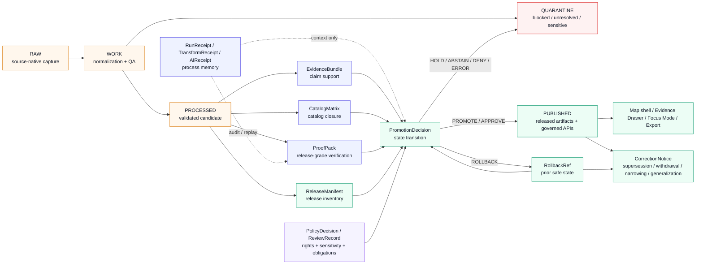

<!-- [KFM_META_BLOCK_V2]
doc_id: kfm://doc/NEEDS-VERIFICATION-ADR-0011
title: ADR-0011: Catalog, Proof, and Release Separation
type: standard
version: v1
status: draft
owners: OWNER_TBD_NEEDS_VERIFICATION
created: 2026-04-27
updated: 2026-05-06
policy_label: NEEDS_VERIFICATION
related: [./README.md, ./ADR-TEMPLATE.md, ./ADR-0001-schema-home.md, ../runbooks/publication.md, ../../release/README.md, ../../tools/release/README.md, ../../tools/validators/promotion_gate/README.md, ../../data/receipts/README.md, ../../data/proofs/README.md, ../../data/catalog/README.md, ../../data/published/README.md, ../../contracts/README.md, ../../schemas/README.md, ../../policy/README.md, ../../tests/README.md]
tags: [kfm, adr, catalog, proof, release, receipts, promotion, publication, rollback, correction, evidencebundle]
notes: [Target path is confirmed in the accessible GitHub repository as docs/adr/ADR-0011-catalog-proof-release-separation.md. Local workspace was not a mounted Git checkout during this revision pass, so runtime behavior, CI enforcement, branch protections, emitted proof packs, and executed tests remain NEEDS VERIFICATION. doc_id, owners, CODEOWNERS coverage, policy_label, schema-home acceptance, related-link completeness, and release-gate enforcement must be verified before this ADR is marked accepted.]
[/KFM_META_BLOCK_V2] -->

<a id="top"></a>

# ADR-0011: Catalog, Proof, and Release Separation

Define the authority boundary between catalog records, proof packs, release manifests, receipts, promotion decisions, correction notices, and rollback references in KFM.

<p align="center">
  
  
  
  
  
</p>

<p align="center">
  <a href="#status">Status</a> ·
  <a href="#repo-fit-and-evidence-boundary">Repo fit</a> ·
  <a href="#context">Context</a> ·
  <a href="#decision">Decision</a> ·
  <a href="#authority-model">Authority model</a> ·
  <a href="#release-gates">Release gates</a> ·
  <a href="#contract-sketch">Contract sketch</a> ·
  <a href="#implementation-guidance">Implementation</a> ·
  <a href="#validation-plan">Validation</a> ·
  <a href="#rollback-and-correction">Rollback</a> ·
  <a href="#open-verification-backlog">Open verification</a>
</p>

> [!IMPORTANT]
> This ADR records a **release-authority decision**. It is not implementation proof. Do not claim schemas, validators, workflows, release manifests, proof packs, branch protections, runtime behavior, or public-client enforcement as `CONFIRMED` until current repository evidence or executed artifacts prove them.

> [!NOTE]
> The target file path is visible in the accessible GitHub repository. The local workspace used for this revision was not a mounted KFM Git checkout. This ADR therefore combines **CONFIRMED repository/document evidence** with **PROPOSED implementation rules** and keeps enforcement maturity visibly bounded.

---

## Status

| Field | Determination |
|---|---|
| ADR ID | `ADR-0011` |
| File | `docs/adr/ADR-0011-catalog-proof-release-separation.md` |
| Status | `draft` |
| Decision confidence | **CONFIRMED doctrine / PROPOSED implementation / NEEDS VERIFICATION enforcement** |
| Owner | `OWNER_TBD_NEEDS_VERIFICATION` |
| Policy label | `NEEDS_VERIFICATION` |
| Primary protected invariant | Promotion is a governed state transition, not a file move. |
| Merge posture | Keep as `draft` until owners, policy label, schema-home acceptance, related links, fixtures, validators, CI wiring, and release-gate evidence are verified. |

### Current maturity split

| Claim type | Label | Review note |
|---|---:|---|
| KFM must separate receipts, proofs, catalogs, releases, and promotion decisions. | **CONFIRMED doctrine** | Repeated across KFM doctrine and adjacent repository docs. |
| This ADR path exists in the accessible GitHub repository. | **CONFIRMED** | Target file is already present and listed in ADR-facing repo evidence. |
| `data/receipts/`, `data/catalog/`, `data/proofs/`, `data/published/`, `release/`, `tools/release/`, and `tools/validators/promotion_gate/` are adjacent responsibility surfaces. | **CONFIRMED path evidence** | Depth varies; some adjacent READMEs are minimal or draft. |
| Release helpers, promotion gates, and catalog/proof/release docs fully enforce this ADR. | **NEEDS VERIFICATION** | Docs exist, but enforcement requires current workflow/test/runtime evidence. |
| Exact machine schemas and test paths for this ADR are canonical. | **NEEDS VERIFICATION** | Schema-home decision remains proposed until acceptance evidence is recorded. |

<p align="right"><a href="#top">Back to top ↑</a></p>

---

## Repo fit and evidence boundary

`docs/adr/` is the correct home for this decision because ADRs are human-facing governance records under the documentation control plane. This ADR does not create a new root, domain root, schema root, source root, proof root, or release root.

### Directory Rules basis

| Rule | Application here |
|---|---|
| Root folders are responsibility boundaries, not topic buckets. | This decision stays under `docs/adr/` because it is a governance decision record. |
| Docs explain; machine surfaces enforce. | This ADR explains the release-authority split; schemas, policy, validators, fixtures, receipts, proofs, and release objects must enforce it elsewhere. |
| Contracts, schemas, policy, tests, data, and release have separate responsibilities. | This ADR preserves that separation instead of collapsing metadata-bearing files into one authority object. |
| Promotion is governed state, not file movement. | The ADR treats `ReleaseManifest` and `PromotionDecision` as distinct from storage paths such as `data/published/`. |

### Adjacent surfaces

| Surface | Repo role in this ADR | Current posture |
|---|---|---:|
| [`./README.md`](./README.md) | ADR index and review discipline. | **CONFIRMED path evidence / coverage NEEDS VERIFICATION** |
| [`./ADR-TEMPLATE.md`](./ADR-TEMPLATE.md) | ADR structure: evidence, impact, validation, rollback, supersession. | **CONFIRMED path evidence** |
| [`./ADR-0001-schema-home.md`](./ADR-0001-schema-home.md) | Schema-home decision proposal; contracts mean, schemas shape, policy decides. | **CONFIRMED path evidence / acceptance NEEDS VERIFICATION** |
| [`../runbooks/publication.md`](../runbooks/publication.md) | Publication runbook: promotion is not file copy. | **CONFIRMED path evidence / executable wiring NEEDS VERIFICATION** |
| [`../../release/README.md`](../../release/README.md) | Release coordination, manifests, decisions, rollback and correction posture. | **CONFIRMED path evidence / experimental** |
| [`../../tools/release/README.md`](../../tools/release/README.md) | Release helper tooling; can assemble handoff, not publish by itself. | **CONFIRMED path evidence** |
| [`../../tools/validators/promotion_gate/README.md`](../../tools/validators/promotion_gate/README.md) | Promotion Gate A–G and finite release outcomes. | **CONFIRMED path evidence / implementation NEEDS VERIFICATION** |
| [`../../data/receipts/README.md`](../../data/receipts/README.md) | Process-memory receipts. | **CONFIRMED path evidence / draft** |
| [`../../data/proofs/README.md`](../../data/proofs/README.md) | Proof surface. | **CONFIRMED minimal path evidence / synthetic fixtures only** |
| [`../../data/catalog/README.md`](../../data/catalog/README.md) | DCAT/STAC/PROV catalog seam and catalog closure. | **CONFIRMED path evidence / draft** |
| [`../../data/published/README.md`](../../data/published/README.md) | Published surface. | **CONFIRMED minimal path evidence / synthetic fixtures only** |
| [`../../contracts/README.md`](../../contracts/README.md) | Object meaning and compatibility. | **CONFIRMED path evidence / schema-home unresolved** |
| [`../../schemas/README.md`](../../schemas/README.md) | Machine-checkable shape. | **NEEDS VERIFICATION in this ADR pass** |
| [`../../policy/README.md`](../../policy/README.md) | Admissibility, rights, sensitivity, obligations. | **NEEDS VERIFICATION in this ADR pass** |
| [`../../tests/README.md`](../../tests/README.md) | Fixture and validation expectations. | **NEEDS VERIFICATION in this ADR pass** |

> [!WARNING]
> Some repo docs link to deeper release-assembly tests and proof objects that were not confirmed in this pass. Keep those paths `NEEDS VERIFICATION` until the active branch inventory and test execution prove them.

<p align="right"><a href="#top">Back to top ↑</a></p>

---

## Context

KFM is a governed, evidence-first, map-first, time-aware spatial knowledge and publication system. The durable public unit is the **inspectable claim**: a statement whose evidence, spatial scope, temporal scope, source role, policy posture, review state, release state, and correction lineage can be inspected.

The release path has several metadata-bearing surfaces. Each can contain identifiers, digests, timestamps, refs, status labels, and provenance hints. That similarity creates an operational hazard: maintainers may begin treating nearby trust objects as interchangeable.

This ADR prevents that drift.

### The problem

| Confusion | Why it is unsafe |
|---|---|
| “A receipt says the process passed, so publish it.” | Receipts are process memory. They can describe success, failure, dry-run, no-op, partial output, or reviewer handoff. |
| “A catalog record exists, so the artifact is published.” | Catalog records support discovery and lineage. They do not authorize public release. |
| “A proof pack exists, so users can see the artifact.” | Proof supports release-grade verification. A release still needs a manifest, policy state, review state, and promotion decision. |
| “The file is under `data/published/`, so it is public truth.” | Storage location is not governed state. Public meaning changes through a promotion decision. |
| “The UI renders it, so it is valid.” | Renderer, map, tile, graph, scene, export, and Focus surfaces are downstream carriers. |
| “The model can explain it, so the evidence is enough.” | Generated language is interpretive and subordinate to EvidenceBundle, policy, review, and release state. |
| “Rollback can be done manually later.” | Reversibility must be part of release readiness. |

### Decision pressure

KFM needs release artifacts that are easy to inspect, but not easy to confuse. This ADR gives maintainers and validators a stable authority model for deciding which object can authorize what.

<p align="right"><a href="#top">Back to top ↑</a></p>

---

## Decision

KFM will keep **receipts**, **catalog records**, **EvidenceBundles**, **proof packs**, **release manifests**, **promotion decisions**, **rollback references**, and **correction notices** as separate trust surfaces with separate authority.

A dataset, claim, layer, graph projection, API payload, AI answer, tile bundle, scene, export, or story surface becomes public only through a governed promotion transition that references the required evidence, validation, policy, catalog, proof, manifest, review, correction, and rollback objects.

### Operating rule

> **A release is valid only when the object family that has authority for that part of the release path is present, linked, and valid. Nearby metadata is not enough.**

### Boundary rule

> **No public or ordinary UI surface may treat receipts, catalog records, generated summaries, tile features, file movement, or model output as release authority.**

### Decision rules

1. **Receipts are process memory.**  
   A `RunReceipt`, `TransformReceipt`, `RedactionReceipt`, `ValidationReport`, or `AIReceipt` records what ran, what inputs were observed, what outputs were attempted, what checks ran, and what happened. A receipt may describe success, failure, partial output, dry run, no-op, hold, denial, abstention, or error. It does **not** authorize publication.

2. **Catalog records are discovery and lineage surfaces.**  
   STAC, DCAT, PROV, and internal catalog entries make released or candidate artifacts discoverable, inspectable, and cross-linked. They do **not** prove that promotion was valid.

3. **EvidenceBundle is claim support, not release approval.**  
   `EvidenceRef -> EvidenceBundle` resolution is required before consequential claims are answered, rendered, exported, summarized, or promoted. Evidence support does not by itself publish the artifact.

4. **Proof packs are release-significant verification surfaces.**  
   A `ProofPack` records release-grade validation, policy decisions, evidence closure, citation closure, sensitivity/redaction checks, catalog closure, artifact digests, review state, attestation state where used, and rollback readiness.

5. **Release manifests inventory what is released.**  
   A `ReleaseManifest` names released artifacts, digests, media types, public aliases, release state, supersession/correction links, catalog references, proof references, and rollback targets. It is an inventory and binding record, not a replacement for proof.

6. **Promotion decisions change admissible public state.**  
   A `PromotionDecision` is the governed state transition. It decides whether a candidate may become `PUBLISHED`, must remain held, must be denied, must be quarantined, must abstain, must error, or must roll back.

7. **Catalog closure is required for discoverable release.**  
   A `CatalogMatrix` or repo-native equivalent must reconcile internal release identifiers, STAC item and asset references where used, DCAT dataset and distribution references where used, PROV entity/activity/agent references where used, artifact digests, manifest digests, and EvidenceBundle references.

8. **Public clients consume released governed surfaces only.**  
   Public clients, Focus Mode, Evidence Drawer, map popups, exports, scenes, story nodes, and normal APIs must use governed APIs and released artifacts. They must not read `RAW`, `WORK`, `QUARANTINE`, unpublished candidates, proof-only stores, receipt-only stores, or internal canonical stores directly.

9. **Correction and rollback remain visible.**  
   Supersession, withdrawal, correction, rollback, narrowing, generalization, redaction, and policy reclassification must preserve reviewable lineage. Silent replacement is not an acceptable release mechanism.

<p align="right"><a href="#top">Back to top ↑</a></p>

---

## Authority model



### Authority table

| Object family | Authority | Cannot authorize |
|---|---|---|
| `RunReceipt` / `TransformReceipt` / `AIReceipt` | What process ran, with what inputs, outputs, checks, failures, and refs. | Publication, proof closure, policy permission, or public truth. |
| `ValidationReport` | Whether a specific validation check passed, failed, skipped, or errored. | Release approval or public exposure. |
| `EvidenceBundle` | Claim support, citations, source refs, spatial/temporal support, limitations. | Release state or publication permission. |
| `CatalogMatrix` | Catalog/provenance/distribution closure across STAC, DCAT, PROV, internal refs, and digests. | Release proof by itself. |
| `ProofPack` | Release-grade verification assembly and evidence that gates were satisfied. | Public aliasing or artifact inventory by itself. |
| `ReleaseManifest` | Artifact inventory, digests, release refs, outward scope, rollback target. | Policy permission or proof closure by itself. |
| `PolicyDecision` | Rights, sensitivity, obligation, allow/deny/abstain/error posture. | Evidence support or artifact identity. |
| `ReviewRecord` | Human/steward review action, role, time, decision, obligations. | Machine validation or source evidence by itself. |
| `PromotionDecision` | Governed release-state transition. | Source truth, evidence content, or raw validation details. |
| `RollbackRef` | Prior safe state or reversible target. | A rollback event without a decision record. |
| `CorrectionNotice` | Public or restricted release lineage after correction, withdrawal, narrowing, supersession, generalization, or rollback. | Replacement release validity without a new promotion path. |

<p align="right"><a href="#top">Back to top ↑</a></p>

---

## Release gates

KFM release candidates must pass release gates before ordinary public, restricted, steward, export, map, story, or Focus surfaces may treat them as published.

The labels below align with KFM promotion-gate language. Exact executable gate names remain **NEEDS VERIFICATION** until the active branch confirms schemas, validators, workflows, and test outputs.

| Gate | Name | Minimum passing condition | Fail-closed result |
|---:|---|---|---|
| A | Identity and closure | Candidate has stable ID, declared scope, source refs, lifecycle state, immutable target intent, and deterministic identity where required. | `ERROR`, `HOLD`, or `ABSTAIN` |
| B | Asset integrity | Declared artifacts exist, digests match, media types and byte refs are stable, and release inventory is coherent. | `DENY` or `ERROR` |
| C | Evidence and citation closure | Every consequential claim resolves `EvidenceRef -> EvidenceBundle`; unsupported claims are removed, narrowed, or abstained. | `ABSTAIN`, `DENY`, or `HOLD` |
| D | Rights, sensitivity, and policy | Source roles, rights, license, attribution, sensitivity, audience, redaction, generalization, and obligations permit the requested release class. | `DENY`, `HOLD`, `QUARANTINE`, or restricted release |
| E | Catalog closure | STAC/DCAT/PROV/internal refs, artifact digests, release refs, and EvidenceBundle refs agree. | `HOLD` or `ERROR` |
| F | Proof and manifest closure | `ProofPack` and `ReleaseManifest` include required validation, policy, review, digests, refs, release state, and rollback target. | `HOLD`, `DENY`, or `ERROR` |
| G | Review and rollback readiness | Reviewer/steward approval matches risk class; rollback and correction paths are reviewable. | `HOLD`, `ABSTAIN`, or `DENY` |

### Outcome grammar

| Decision context | Allowed outcomes | Notes |
|---|---|---|
| Promotion decision | `PROMOTE`, `ABSTAIN`, `DENY`, `ERROR` | Repo docs also use `HOLD` and `APPROVE` in places; normalize in the machine contract before enforcement. |
| Runtime / Focus response | `ANSWER`, `ABSTAIN`, `DENY`, `ERROR` | Runtime outcomes are not release-state transitions. |
| Release state | `candidate`, `hold`, `denied`, `approved`, `published`, `superseded`, `withdrawn`, `rolled_back` | Exact enum requires schema confirmation. |
| Correction state | `current`, `corrected`, `superseded`, `withdrawn`, `narrowed`, `generalized`, `redacted` | Must remain visible to appropriate audience. |

> [!WARNING]
> A public-looking artifact path such as `data/published/...` is not sufficient evidence of publication. Publication requires a valid promotion path over release candidate, evidence, catalog, proof, policy, review, manifest, and rollback state.

<p align="right"><a href="#top">Back to top ↑</a></p>

---

## Contract sketch

The schema home and exact enum vocabulary are **NEEDS VERIFICATION**. If the accepted repository schema-home ADR or active branch establishes a different convention, use that convention and update this ADR through normal supersession or revision.

The shape below is illustrative and burden-led. It should not be treated as a canonical schema.

```yaml
release_candidate:
  candidate_id: string
  release_id: string
  lane: string
  release_class: public | restricted | steward | internal
  audience_class: public | restricted | steward | admin
  spec_hash: sha256

  lifecycle:
    source_state: RAW | WORK | QUARANTINE | PROCESSED | CATALOG | TRIPLET | PUBLISHED
    promotion_state: candidate | hold | denied | approved | published | superseded | withdrawn | rolled_back

  scope:
    spatial_scope_ref: string
    temporal_scope_ref: string
    claim_scope_ref: string

  sources:
    source_descriptor_refs: [string]
    source_role_summary_ref: string

  evidence:
    evidence_bundle_refs: [string]
    citation_validation_report_refs: [string]

  artifacts:
    - artifact_ref: string
      media_type: string
      digest: sha256
      byte_size: integer
      public_alias: string | null
      release_visibility: public | restricted | withheld

  receipts:
    run_receipt_refs: [string]
    transform_receipt_refs: [string]
    validation_report_refs: [string]
    redaction_receipt_refs: [string]
    ai_receipt_refs: [string]

  proof:
    proof_pack_ref: string
    policy_decision_refs: [string]
    review_record_refs: [string]
    attestation_refs: [string]

  catalog:
    catalog_matrix_ref: string
    stac_refs: [string]
    dcat_refs: [string]
    prov_refs: [string]

  release:
    release_manifest_ref: string
    rollback_ref: string
    supersedes_release_id: string | null
    correction_notice_ref: string | null

  decision:
    promotion_decision_ref: string
    outcome: PROMOTE | ABSTAIN | DENY | ERROR
    reason_codes: [string]
    obligation_codes: [string]
```

### Required denial and hold examples

| Code | Meaning |
|---|---|
| `RECEIPT_USED_AS_PROOF` | A process receipt is being treated as release-grade proof. |
| `CATALOG_USED_AS_PROMOTION` | Catalog metadata is being treated as publication approval. |
| `CATALOG_USED_AS_EVIDENCE_BUNDLE` | Catalog prose is being treated as admissible claim support. |
| `MISSING_CATALOG_MATRIX` | Catalog closure has not been proven. |
| `MISSING_PROOF_PACK` | Release-grade proof closure is absent. |
| `MISSING_RELEASE_MANIFEST` | Released artifact inventory is absent or unbound. |
| `MISSING_ROLLBACK_REF` | Release cannot be safely reversed or superseded. |
| `UNRESOLVED_EVIDENCE_REF` | A consequential claim cannot resolve to an EvidenceBundle. |
| `RIGHTS_OR_SENSITIVITY_BLOCK` | Source terms, sensitivity, policy, or redaction posture blocks release. |
| `FILE_MOVE_WITHOUT_PROMOTION_DECISION` | Storage movement is being treated as promotion. |
| `MODEL_OUTPUT_USED_AS_AUTHORITY` | AI output is being treated as root truth or release proof. |
| `PUBLIC_CLIENT_INTERNAL_PATH` | Public or ordinary UI surface can reach internal, raw, work, quarantine, proof-only, or unpublished candidate state. |

<p align="right"><a href="#top">Back to top ↑</a></p>

---

## Consequences

### Positive consequences

- Maintainers can inspect why a release was allowed, held, denied, withdrawn, corrected, superseded, narrowed, generalized, redacted, or rolled back.
- Receipts remain useful for replay, audit, debugging, and process review without becoming false proof.
- Catalog records remain useful for discovery and lineage without becoming false approval records.
- Proof packs remain release-grade verification surfaces rather than a storage or catalog substitute.
- Release manifests remain clear inventories of what is being released.
- Public UI surfaces can display trust state, correction state, and release state without inventing authority.
- AI and Focus Mode stay evidence-bounded because released evidence and proof state are resolved before generated text is accepted.
- Validators can fail closed when an object family is missing rather than guessing from nearby metadata.

### Costs and tradeoffs

| Cost | Why it is acceptable |
|---|---|
| More object families must be maintained. | The separation prevents false authority and makes review possible. |
| Validators must understand cross-object refs. | Release significance depends on closure, not isolated files. |
| Reviewers must inspect proof, catalog, release, and rollback together. | KFM’s public value is the inspectable claim, not fast publication. |
| Existing ambiguous artifacts may need aliases or migration notes. | Reversibility and lineage are more important than a clean-looking tree. |
| Release assembly is slower than a file copy. | Public trust, correction, and rollback require explicit state. |

### Rejected alternatives

| Alternative | Rejected because |
|---|---|
| Treat a catalog record as publication. | Catalog records aid discovery and lineage; they do not prove approval. |
| Treat a receipt as proof. | Receipts may describe failed, partial, dry-run, no-op, or diagnostic processes. |
| Treat `data/published/` movement as release. | Storage location is not governed state. |
| Use one large manifest for everything. | It collapses discovery, proof, inventory, process memory, and decision authority. |
| Let UI or AI decide release state. | UI and AI are downstream interpretive surfaces, not promotion authorities. |
| Replace old releases silently. | Silent replacement destroys correction lineage and rollback auditability. |
| Publish first, repair proof later. | Release without proof and rollback weakens the trust spine. |

<p align="right"><a href="#top">Back to top ↑</a></p>

---

## Implementation guidance

All paths below are implementation guidance unless active-branch evidence proves them. Do not create duplicate authority homes.

| Surface | Required behavior | Verification burden |
|---|---|---|
| `data/receipts/` | Document and enforce as process memory only. | Receipt fixtures cannot satisfy proof gates alone. |
| `data/proofs/` | Hold or reference release-grade proof packs, attestations, release proof, rollback proof, and correction proof where repo convention allows. | Proof pack schema, refs, and closure tests. |
| `data/catalog/` | Hold STAC/DCAT/PROV/internal catalog closure outputs. | `CatalogMatrix` digest/id/ref alignment tests. |
| `data/published/` | Hold released public-safe materialized artifacts only after promotion. | No direct public writes without release decision. |
| `release/` | Coordinate release manifests, decisions, rollback refs, correction refs, and review handoff. | Release state, manifest, rollback, and correction tests. |
| `tools/release/` | Assemble release handoff; never decide or publish by itself. | Helper tests prove no direct publish bypass. |
| `tools/validators/promotion_gate/` | Evaluate gates and emit finite outcomes. | Positive and negative fixture coverage. |
| `contracts/` | Define object meaning and compatibility. | Contract cards and docs sync with schemas. |
| `schemas/contracts/v1/` or accepted schema home | Define machine-checkable shape. | Schema-home ADR acceptance and validator execution. |
| `policy/` | Decide rights, sensitivity, obligations, and admissibility. | Policy fixtures for allow/deny/abstain/error. |
| `tests/` / `fixtures/` | Prove release assembly and fail-closed behavior. | Active paths and commands must be verified before claiming coverage. |
| Governed API / UI | Consume only released, governed surfaces. | Public-client denial tests for RAW/WORK/QUARANTINE/proof-only/candidate paths. |

### Directory README burden

Each release-relevant directory should state:

- what the directory can authorize;
- what it cannot authorize;
- whether it holds process memory, proof, catalog, release inventory, policy, schema, semantic contract, review state, correction state, or published artifacts;
- required references to sibling object families;
- failure behavior when required references are missing;
- rollback, correction, supersession, or withdrawal behavior;
- public visibility rules.

### Smallest safe implementation increment

A minimal implementation PR for this ADR should include:

1. updated ADR and ADR index entry;
2. object-family crosswalk for receipt, proof, catalog, release, promotion, rollback, and correction;
3. valid and invalid fixtures for at least one synthetic release candidate;
4. validator rule that rejects receipt-as-proof and catalog-as-promotion;
5. release manifest fixture requiring rollback ref;
6. promotion decision fixture with finite outcome;
7. public-client denial fixture for unpublished candidate path;
8. documentation updates to adjacent README files or a note explaining why not.

<p align="right"><a href="#top">Back to top ↑</a></p>

---

## Validation plan

A change implementing this ADR is not complete until the repository can show current evidence for the relevant checks.

### Required checks

| Check | Passing evidence | Current ADR posture |
|---|---|---:|
| ADR index updated | `docs/adr/README.md` lists this ADR with current status and successor links. | **NEEDS VERIFICATION after edit** |
| Schema home accepted | ADR-0001 or successor is accepted, or this ADR marks schema paths as provisional. | **NEEDS VERIFICATION** |
| Receipt-only proof rejected | Negative fixture using only receipts fails proof gate. | **PROPOSED** |
| Catalog-only publication rejected | Negative fixture using catalog records as approval fails promotion gate. | **PROPOSED** |
| ReleaseManifest rollback required | Fixture without rollback target fails release assembly. | **PROPOSED** |
| Evidence closure enforced | Consequential claim without EvidenceBundle returns `ABSTAIN`, `DENY`, or blocked promotion. | **PROPOSED** |
| Policy uncertainty fails closed | Unknown rights/sensitivity/source role blocks public release. | **PROPOSED** |
| Public client cannot read internal states | API/UI tests reject `RAW`, `WORK`, `QUARANTINE`, unpublished candidate, proof-only, receipt-only, and direct model paths. | **PROPOSED** |
| Correction lineage visible | Superseded, withdrawn, corrected, narrowed, generalized, or redacted release remains inspectable. | **PROPOSED** |
| Workflow enforcement proven | CI or local validation output demonstrates the checks ran. | **UNKNOWN** |

### Suggested negative-path test names

Use repo-native test naming once confirmed.

```text
release_authority.receipt_only_is_not_proof.test.*
release_authority.catalog_record_is_not_promotion.test.*
release_authority.file_move_without_promotion_denied.test.*
release_authority.model_output_not_release_authority.test.*
release_authority.missing_catalog_matrix_holds_release.test.*
release_authority.release_manifest_requires_rollback.test.*
release_authority.unresolved_evidence_ref_abstains.test.*
release_authority.public_client_internal_path_denied.test.*
correction.superseded_release_visible_state.test.*
```

> [!TIP]
> Prefer small deterministic fixtures over broad live-source tests for the first implementation. KFM can add live release tests only after no-network trust behavior is stable.

<p align="right"><a href="#top">Back to top ↑</a></p>

---

## Rollback and correction

If this ADR or its implementation proves wrong, incomplete, or incompatible with current repo conventions:

1. Mark this ADR `superseded`, `withdrawn`, or `deprecated` in the ADR index.
2. Create a successor ADR with explicit rationale.
3. Preserve old object schemas as versioned compatibility references until migration is complete.
4. Disable promotion workflow entry points with a fail-closed policy if release integrity is at risk.
5. Keep existing public releases intact unless a separate correction, withdrawal, rollback, or supersession decision requires change.
6. Emit or preserve `CorrectionNotice` records for any public-facing release state that changed.
7. Record rollback reason, affected release IDs, prior manifest refs, and replacement refs in the rollback or release registry.
8. Keep catalog, proof, receipt, correction, and release history available for audit unless policy requires quarantine or restricted access.
9. Re-run public API/UI denial tests before restoring promotion entry points.

> [!CAUTION]
> Rollback must not silently delete proof, catalog, receipt, correction, release, or decision history. A clean-looking tree that hides prior authority is not an acceptable KFM rollback.

<p align="right"><a href="#top">Back to top ↑</a></p>

---

## Open verification backlog

| Item | Status | Required action |
|---|---:|---|
| `doc_id` | `NEEDS VERIFICATION` | Register or confirm stable KFM document ID. |
| Owners / CODEOWNERS | `NEEDS VERIFICATION` | Confirm ADR, release, proof, catalog, policy, and schema reviewers. |
| Policy label | `NEEDS VERIFICATION` | Confirm whether this ADR is public, restricted, or another repo-approved label. |
| ADR numbering policy | `NEEDS VERIFICATION` | Confirm ADR-0011 remains the accepted identifier and no successor/supersession is needed. |
| Schema home | `NEEDS VERIFICATION` | Confirm ADR-0001 acceptance or keep schema paths provisional. |
| Exact promotion enum | `NEEDS VERIFICATION` | Normalize `PROMOTE/ABSTAIN/DENY/ERROR`, `APPROVE/HOLD/DENY`, and related vocabularies in the machine contract. |
| `data/proofs/` depth | `NEEDS VERIFICATION` | Current README is minimal; inspect actual proof object inventory and fixtures before claiming maturity. |
| `data/published/` depth | `NEEDS VERIFICATION` | Current README is minimal; inspect actual published-artifact conventions before claiming release behavior. |
| Release helper execution | `NEEDS VERIFICATION` | Run or inspect `tools/release/publish_release.py` and test outputs before claiming behavior. |
| Promotion gate execution | `NEEDS VERIFICATION` | Run or inspect promotion-gate validator and fixtures before claiming enforcement. |
| Release assembly tests | `UNKNOWN` | Confirm active test paths; one referenced `tests/e2e/release_assembly/README.md` was not confirmed in this pass. |
| Branch protections | `UNKNOWN` | Confirm required checks and protected-branch settings before claiming merge-blocking enforcement. |
| Emitted real proof packs | `UNKNOWN` | Collect examples before marking proof generation `CONFIRMED`. |
| Public API/UI bindings | `UNKNOWN` | Verify governed API, Evidence Drawer, Focus Mode, map shell, export, and story behavior. |
| Signing/attestation requirements | `NEEDS VERIFICATION` | Confirm tool versions, trust roots, predicate types, and required release classes. |

<p align="right"><a href="#top">Back to top ↑</a></p>

---

## Definition of done

This ADR is ready to move from `draft` to `review` when:

- [ ] ADR index is updated and this ADR’s status is synchronized.
- [ ] Owners and policy label are verified.
- [ ] Schema-home authority is accepted or explicitly marked provisional.
- [ ] Adjacent README files state the authority split consistently.
- [ ] Valid and invalid fixtures exist for receipt, proof, catalog, release, promotion, rollback, and correction behavior.
- [ ] Promotion gate rejects receipt-as-proof, catalog-as-promotion, file-move-as-publication, and model-output-as-authority.
- [ ] ReleaseManifest fixture requires artifact digests and rollback ref.
- [ ] CatalogMatrix fixture proves STAC/DCAT/PROV/internal closure or fails closed.
- [ ] Public-client tests deny RAW, WORK, QUARANTINE, proof-only, receipt-only, unpublished candidate, and direct model runtime paths.
- [ ] Correction and rollback fixtures preserve visible lineage.
- [ ] A reviewer can trace a published synthetic artifact from `PromotionDecision` to `ReleaseManifest`, `ProofPack`, `CatalogMatrix`, `EvidenceBundle`, policy decisions, review records, correction state, and rollback reference.
- [ ] Validation output is captured in PR notes, receipt, workflow artifact, or repo-approved validation report.

This ADR is ready to move from `review` to `accepted` only when enforcement evidence is current, cited in the repo, and rollback/supersession behavior is documented.

---

## Appendix A — Glossary

| Term | Meaning in this ADR |
|---|---|
| Receipt | Process-memory record describing a bounded run, check, validation, handoff, or model-assistance event. |
| Catalog record | Discovery and lineage metadata, usually STAC/DCAT/PROV/internal catalog surface. |
| CatalogMatrix | Cross-surface closure record showing catalog/provenance/distribution/release refs agree. |
| EvidenceBundle | Reviewable evidence support for claims, citations, limitations, and scope. |
| ProofPack | Release-significant proof assembly across validation, evidence, policy, catalog, review, and artifact integrity. |
| ReleaseManifest | Release inventory: artifacts, digests, aliases, audience, refs, rollback target, correction path. |
| PromotionDecision | Governed state-transition decision for release readiness and publication. |
| RollbackRef | Reference to a prior safe state or reversible target. |
| CorrectionNotice | Visible lineage object for correction, withdrawal, supersession, narrowing, generalization, redaction, or rollback. |
| Published | Release-backed outward state, not merely a folder name. |
| Governed API | Public or restricted interface that resolves released artifacts and EvidenceBundle-backed trust state without exposing internal stores. |

## Appendix B — Maintainer review card

```text
Goal:
Owning root(s):
Directory Rules basis:
Object families affected:
Contracts changed:
Schemas changed:
Fixtures added/updated:
Policy gates affected:
Public exposure possible? yes/no
EvidenceRef/EvidenceBundle impact:
Receipt/proof/catalog/release impact:
Correction/rollback impact:
Validation commands run:
Known UNKNOWN / NEEDS VERIFICATION:
Rollback plan:
```

<p align="right"><a href="#top">Back to top ↑</a></p>
