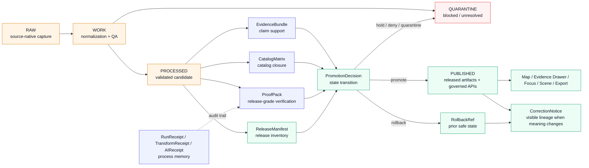

<!-- [KFM_META_BLOCK_V2]
doc_id: kfm://doc/NEEDS-VERIFICATION-ADR-0011
title: ADR-0011: Catalog, Proof, and Release Separation
type: standard
version: v1
status: draft
owners: NEEDS-VERIFICATION
created: 2026-04-27
updated: 2026-05-02
policy_label: NEEDS-VERIFICATION
related: [NEEDS-VERIFICATION:docs/adr/ADR-0303-evidencebundle-contract.md, NEEDS-VERIFICATION:docs/adr/ADR-0305-promotion-gate.md, NEEDS-VERIFICATION:docs/adr/ADR-0010-catalog-proof-release-separation.md, NEEDS-VERIFICATION:data/receipts/README.md, NEEDS-VERIFICATION:data/proofs/README.md, NEEDS-VERIFICATION:data/catalog/README.md, NEEDS-VERIFICATION:data/published/README.md, NEEDS-VERIFICATION:contracts/README.md, NEEDS-VERIFICATION:schemas/README.md, NEEDS-VERIFICATION:policy/README.md, NEEDS-VERIFICATION:tests/README.md]
tags: [kfm, adr, catalog, proof, release, receipts, promotion, evidencebundle, publication]
notes: [Requested target path is docs/adr/ADR-0011-catalog-proof-release-separation.md; ADR numbering conflicts with planning lineage that also names ADR-0010 for this decision family; owners, policy label, related links, schema home, emitted proof examples, and workflow bindings require repo-backed verification before merge.]
[/KFM_META_BLOCK_V2] -->

<a id="top"></a>

# ADR-0011: Catalog, Proof, and Release Separation

Define the authority boundary between catalog records, proof packs, release manifests, receipts, and promotion decisions in KFM.


> [!IMPORTANT]
> **ADR numbering needs verification before merge.**  
> The requested target path is `docs/adr/ADR-0011-catalog-proof-release-separation.md`, while KFM planning lineage also names `ADR-0010-catalog-proof-release-separation` for this decision family. Keep this draft at the requested path until the real ADR index is inspected, then rename, cross-reference, or supersede cleanly.

> [!NOTE]
> This ADR states KFM doctrine and a proposed implementation contract. It does **not** prove that the repository already contains the schemas, validators, workflows, release manifests, proof packs, catalog matrices, receipts, or emitted promotion artifacts named below.

**Quick jumps:** [Status](#status) · [Decision](#decision) · [Context](#context) · [Authority model](#authority-model) · [Release gates](#release-gates) · [Contract sketch](#contract-sketch) · [Implementation guidance](#implementation-guidance) · [Validation](#validation) · [Rollback](#rollback-and-correction) · [Open verification](#open-verification)

---

## Status

**PROPOSED / draft.**

This ADR is suitable for review as a decision draft. It is not ready to merge as authoritative implementation documentation until ADR numbering, owners, policy label, schema home, related links, object inventory, and test/workflow evidence are verified.

| Field | Value |
|---|---|
| Target path | `docs/adr/ADR-0011-catalog-proof-release-separation.md` |
| Decision family | Catalog, proof, release, receipt, rollback, correction, and promotion authority |
| Doctrine confidence | **CONFIRMED** from KFM corpus and attached source draft |
| Current implementation depth | **UNKNOWN** without mounted repo evidence |
| Merge posture | Hold as `draft` until open verification items are closed |
| Public release posture | `DENY` unless a valid `PromotionDecision` binds evidence, catalog closure, proof, manifest, review, policy, and rollback state |

### Evidence boundary

| Evidence surface | Status | Supports | Does not prove |
|---|---|---|---|
| Attached ADR draft | **CONFIRMED** | Existing structure, decision intent, authority separation, gates, contract sketch, validation, rollback, and open verification list | Current repository implementation |
| KFM doctrine corpus | **CONFIRMED doctrine** | Evidence-first, map-first, time-aware, cite-or-abstain, governed publication posture | Current route names, schemas, workflows, owners, branch protections, or emitted artifacts |
| Proposed paths in this ADR | **PROPOSED / NEEDS VERIFICATION** | Candidate homes for implementation planning | That those paths exist or are canonical |
| Mounted repo, tests, logs, workflows, emitted artifacts | **UNKNOWN in this authoring pass** | Nothing until inspected | Implementation maturity |

---

## Decision

KFM will keep **catalog records**, **proof packs**, **release manifests**, **run receipts**, **promotion decisions**, **rollback references**, and **correction notices** as separate trust surfaces with separate authority.

A dataset, claim, layer, graph projection, API payload, AI answer, tile bundle, scene, export, or story surface becomes public only through a governed promotion transition that references the required evidence, validation, policy, catalog, release, review, and rollback objects.

Moving bytes into a public-looking folder is not promotion.

### Decision rules

1. **Receipts are process memory.**  
   A `RunReceipt`, `TransformReceipt`, `RedactionReceipt`, or `AIReceipt` records what ran, what inputs were observed, what outputs were attempted, and what warnings or failures occurred. A receipt may describe a successful, failed, partial, dry-run, or no-op process. It does **not** authorize publication.

2. **Catalog records are discovery and lineage surfaces.**  
   STAC, DCAT, PROV, and internal catalog entries make released or candidate artifacts findable, explainable, and crosswalkable. They do **not** prove that promotion was valid.

3. **EvidenceBundle is claim support, not release approval.**  
   `EvidenceRef -> EvidenceBundle` resolution is required before consequential claims are answered, rendered, exported, summarized, or promoted. Evidence support does not by itself publish the artifact.

4. **Proof packs are release-significant verification surfaces.**  
   A `ProofPack` records release-grade validation, policy decisions, evidence closure, citation closure, sensitivity/redaction checks, catalog closure, artifact digests, review state, and rollback readiness.

5. **Release manifests inventory what is released.**  
   A `ReleaseManifest` names released artifacts, digests, media types, public aliases, release state, supersession/correction links, catalog references, proof references, and rollback targets. It is an inventory and binding record, not a replacement for proof.

6. **Promotion decisions change admissible public meaning.**  
   A `PromotionDecision` is the governed state transition. It determines whether a candidate may become `PUBLISHED`, must remain blocked, must be quarantined, must be returned for correction, or must roll back.

7. **Catalog closure is required before release.**  
   A `CatalogMatrix` must reconcile internal release identifiers, STAC item and asset references where used, DCAT dataset and distribution references where used, PROV entity/activity/agent references where used, artifact digests, manifest digests, and EvidenceBundle references.

8. **Public and ordinary UI clients consume released surfaces only.**  
   Public clients, Focus Mode, Evidence Drawer, map popups, exports, scenes, story nodes, and normal APIs must use governed APIs and released artifacts. They must not read `RAW`, `WORK`, `QUARANTINE`, unpublished candidates, or internal canonical stores directly.

9. **Corrections and rollback remain visible.**  
   Supersession, withdrawal, correction, rollback, narrowing, generalization, and redaction changes must preserve reviewable lineage. Silent replacement is not an acceptable release mechanism.

---

## Context

KFM is a governed, evidence-first, map-first, time-aware spatial knowledge and publication system. The public unit of value is the **inspectable claim**: a statement whose evidence, spatial and temporal scope, source role, policy posture, review state, release state, and correction lineage can be inspected.

The project corpus repeatedly warns against a common failure mode: many files contain metadata, hashes, dates, source references, and status fields, so teams may start treating them as interchangeable. KFM must not let that happen.

The key distinction is authority.

| Surface | What it can prove | What it cannot prove |
|---|---|---|
| `RunReceipt` | A process ran, what it saw, what it emitted, and what happened during execution | That the output is approved for publication |
| `EvidenceBundle` | Evidence supports a claim, scope, citation posture, or answer | That publication was approved |
| `CatalogMatrix` | Catalog and provenance references close over the intended artifact set | That policy, review, proof, or promotion was valid by itself |
| `ProofPack` | Release-grade verification evidence exists and can be inspected | That the artifact inventory is complete unless tied to a manifest |
| `ReleaseManifest` | Release inventory, digests, aliases, rollback target, and release-state binding | That validation occurred unless tied to proof |
| `PromotionDecision` | Whether a candidate changed admissible release state | The source evidence itself |
| `CorrectionNotice` | A published release or claim has been superseded, corrected, withdrawn, narrowed, generalized, or qualified | That the replacement release is valid without its own promotion |
| `RollbackRef` | A reversible target exists and can be inspected | That rollback has occurred without a decision record |

---

## Authority model



### Normative authority boundaries

| Object family | Status in this ADR | Required role | Must remain separate from |
|---|---:|---|---|
| `RunReceipt` / `TransformReceipt` / `AIReceipt` | **PROPOSED contract** | Process-memory audit trail | `ProofPack`, `PromotionDecision` |
| `EvidenceBundle` / `EvidenceRef` | **PROPOSED contract** | Claim support and cite-or-abstain closure | `ReleaseManifest`, generated summaries, model output |
| `CatalogMatrix` | **PROPOSED contract** | STAC/DCAT/PROV/internal closure | `ProofPack`, `RunReceipt`, `PromotionDecision` |
| `ProofPack` | **PROPOSED contract** | Release-grade proof closure | Catalog-only metadata, process receipts |
| `ReleaseManifest` | **PROPOSED contract** | Released artifact inventory and digest binding | Canonical source truth, policy authority |
| `PromotionDecision` | **PROPOSED contract** | Governed state transition | File movement, UI action, model response |
| `RollbackRef` | **PROPOSED contract** | Reversible target and safe prior state | Hidden deletion, silent replacement |
| `CorrectionNotice` | **PROPOSED contract** | Release lineage, withdrawal, correction, supersession, narrowing, generalization | Undocumented replacement |

---

## Release gates

A release candidate must pass these gates before any public or semi-public surface may represent it as published.

| Gate | Name | Minimum passing condition | Failure result |
|---:|---|---|---|
| A | Schema and fixture validation | Candidate objects validate against current machine contracts and fixtures | `ERROR` or return to `WORK` |
| B | Source rights and source-role check | `SourceDescriptor` allows the intended claim type, rights posture, and release class | `DENY` or `QUARANTINE` |
| C | Evidence and citation closure | Every consequential claim resolves `EvidenceRef -> EvidenceBundle` | `ABSTAIN` or `DENY` |
| D | Sensitivity and redaction | Required redaction/generalization transforms and receipts exist | `DENY` or `QUARANTINE` |
| E | Catalog closure | `CatalogMatrix` aligns internal ids, STAC/DCAT/PROV refs, manifest digest, and artifact digest | `ERROR` or hold release |
| F | Proof and manifest closure | `ProofPack` and `ReleaseManifest` include hashes, policy state, review refs, release refs, and rollback target | hold release |
| G | Steward or reviewer approval | Approval matches risk class and separation-of-duty requirements where applicable | hold release |

> [!WARNING]
> A public-looking artifact path such as `data/published/...` is not sufficient evidence of publication. Publication requires a valid `PromotionDecision` over the release candidate and its required references.

### Gate outcomes

Promotion outcomes and runtime response outcomes are related but not identical.

| Context | Finite outcomes | Notes |
|---|---|---|
| Promotion decision | `promote`, `hold`, `deny`, `quarantine`, `rollback` | Governs release state transitions |
| Runtime/API/AI response | `ANSWER`, `ABSTAIN`, `DENY`, `ERROR` | Governs public answer behavior |
| Correction state | `current`, `superseded`, `corrected`, `withdrawn`, `narrowed`, `generalized` | Governs visible lineage and user trust state |

---

## Contract sketch

The exact schema home is **NEEDS VERIFICATION**. If the real repo already has a canonical schema home, use it. Do not create duplicate contract authority across `contracts/`, `schemas/`, or `schemas/contracts/v1/`.

Illustrative minimum shape:

```yaml
release_candidate:
  candidate_id: string
  lane: string
  spec_hash: sha256
  source_descriptor_refs: [string]
  evidence_bundle_refs: [string]

  artifacts:
    - artifact_ref: string
      media_type: string
      digest: sha256
      byte_size: integer
      public_alias: string | null

  receipts:
    run_receipt_refs: [string]
    transform_receipt_refs: [string]
    redaction_receipt_refs: [string]
    ai_receipt_refs: [string]

  proof:
    proof_pack_ref: string
    validation_report_refs: [string]
    policy_decision_refs: [string]
    review_record_refs: [string]

  catalog:
    catalog_matrix_ref: string
    stac_refs: [string]
    dcat_refs: [string]
    prov_refs: [string]

  release:
    release_manifest_ref: string
    rollback_ref: string
    supersedes_release_id: string | null
    correction_notice_ref: string | null

  decision:
    promotion_decision_ref: string
    outcome: promote | hold | deny | quarantine | rollback
    reason_codes: [string]
    obligation_codes: [string]
```

### Required denial examples

| Code | Meaning |
|---|---|
| `RECEIPT_USED_AS_PROOF` | A process receipt is being treated as release-grade proof |
| `CATALOG_USED_AS_PROMOTION` | Catalog metadata is being treated as publication approval |
| `MISSING_CATALOG_MATRIX` | Catalog closure has not been proven |
| `MISSING_PROOF_PACK` | Release-grade proof closure is absent |
| `MISSING_RELEASE_MANIFEST` | Released artifact inventory is absent or unbound |
| `MISSING_ROLLBACK_REF` | Release cannot be safely reversed or superseded |
| `UNRESOLVED_EVIDENCE_REF` | A consequential claim cannot resolve to an EvidenceBundle |
| `RIGHTS_OR_SENSITIVITY_BLOCK` | Source terms, sensitivity, or redaction policy blocks release |
| `FILE_MOVE_WITHOUT_PROMOTION_DECISION` | Storage movement is being treated as promotion |
| `MODEL_OUTPUT_USED_AS_AUTHORITY` | AI output is being treated as root truth |

---

## Consequences

### Positive consequences

- Maintainers can inspect why a release was allowed, held, denied, withdrawn, corrected, superseded, narrowed, generalized, or rolled back.
- Catalogs remain useful for discovery without becoming false approval records.
- Receipts remain useful for replay, audit, debugging, and provenance without becoming false proof.
- Public UI surfaces can display trust state, correction state, and release state without inventing authority.
- Rollback and correction become release-family behavior rather than emergency manual cleanup.
- AI and Focus Mode stay evidence-bounded because released evidence and proof state are resolved before generated text is accepted.
- Validators can fail closed when an object family is missing rather than guessing from nearby metadata.

### Costs and tradeoffs

- More object families must be maintained.
- Validators must understand cross-object references.
- Reviewers must inspect closure, not just successful command output.
- Directory READMEs or equivalent docs must explain each authority surface.
- Existing ambiguous artifacts may need migration, aliases, compatibility views, or deprecation notes.
- Release assembly becomes more explicit and slower than a plain file move.

### Rejected alternatives

| Alternative | Rejected because |
|---|---|
| Treat a catalog record as publication | Catalogs aid discovery and lineage; they do not prove approval |
| Treat a receipt as proof | Receipts may describe failed, partial, or dry-run processes |
| Treat `data/published/` movement as release | Storage location is not governed state |
| Use one large manifest for everything | It collapses discovery, proof, inventory, process memory, and decision authority |
| Let UI or AI decide release state | UI and AI are downstream interpretive surfaces, not promotion authorities |
| Replace old releases silently | Silent replacement destroys correction lineage and rollback auditability |

---

## Implementation guidance

All paths below are **PROPOSED / NEEDS VERIFICATION** until the real repository is mounted and inspected.

| Surface | Proposed action | Validation burden |
|---|---|---|
| `data/receipts/` | Document as process memory only | Receipts cannot satisfy release proof gates alone |
| `data/proofs/` | Store or reference release-grade proof packs | Proof pack schema and closure tests |
| `data/catalog/` or `catalog/` | Store STAC/DCAT/PROV/internal catalog closure outputs | `CatalogMatrix` digest/id alignment tests |
| `release/` or release registry | Store `ReleaseManifest`, `RollbackRef`, and `CorrectionNotice` refs | Release manifest integrity and lineage tests |
| `schemas/contracts/v1/promotion/` | Add or update `promotion_decision`, `proof_pack`, and release decision schemas | JSON Schema fixture tests |
| `schemas/contracts/v1/release/` | Add or update `release_manifest`, `rollback_ref`, and `correction_notice` schemas | Release/correction fixture tests |
| `schemas/contracts/v1/catalog/` | Add or update `catalog_matrix` schema | Catalog closure fixture tests |
| `policy/promotion/` | Add fail-closed policy for release gate inputs | Policy tests for allow/hold/deny/quarantine/error cases |
| `tools/validators/promotion_gate/` | Validate gates A-G and emit reviewer-readable results | Positive and negative fixture coverage |
| `tests/e2e/release_assembly/` | Prove manifest/proof/catalog/rollback closure | Release assembly tests |
| `docs/runbooks/` | Add promotion, correction, and rollback runbooks | Reviewer signoff and link check |

### Directory README burden

Each object-family directory should document:

- what the family can authorize;
- what the family cannot authorize;
- whether it is canonical, derived, process memory, proof, catalog, release, review, or correction state;
- required references to sibling object families;
- failure behavior when references are missing;
- rollback or supersession behavior;
- public visibility rules.

---

## Validation

A change that implements this ADR should not be considered complete until the repository can show:

- [ ] ADR numbering is reconciled with the existing ADR index.
- [ ] Owners and policy label are confirmed.
- [ ] Schema home is confirmed; no duplicate `contracts/` vs `schemas/` authority is introduced.
- [ ] Directory docs state what each artifact family can and cannot authorize.
- [ ] `RunReceipt` fixtures include success, failure, dry-run, partial, and no-op examples.
- [ ] `ProofPack` fixtures cannot pass when only receipts exist.
- [ ] `CatalogMatrix` fixtures fail when STAC/DCAT/PROV/internal references disagree.
- [ ] `ReleaseManifest` fixtures require artifact digests, public aliases where applicable, release refs, and rollback refs.
- [ ] `PromotionDecision` fixtures require gates A-G or an explicit documented waiver path.
- [ ] `CorrectionNotice` fixtures preserve affected release id, replacement/supersession state, reason, and public visibility posture.
- [ ] Negative tests cover `RECEIPT_USED_AS_PROOF`, `CATALOG_USED_AS_PROMOTION`, `FILE_MOVE_WITHOUT_PROMOTION_DECISION`, and `MODEL_OUTPUT_USED_AS_AUTHORITY`.
- [ ] Public API/UI tests prove ordinary clients cannot use `RAW`, `WORK`, `QUARANTINE`, or unpublished candidate artifacts.
- [ ] Correction/rollback tests prove stale, superseded, withdrawn, narrowed, or generalized release state remains visible.

Recommended test names should be burden-led:

```text
release_assembly.proof_pack.rejects_receipt_only.test.*
release_assembly.catalog_matrix.digest_alignment.test.*
release_assembly.release_manifest.rollback_required.test.*
release_assembly.promotion_decision.gates_a_to_g_required.test.*
release_assembly.correction_notice.visible_lineage_required.test.*
runtime_proof.unpublished_candidate.denied.test.*
runtime_proof.model_output_not_authority.test.*
correction.superseded_release.visible_state.test.*
```

---

## Rollback and correction

If this ADR or its implementation proves wrong, incomplete, or incompatible with existing repo conventions:

1. Revert the ADR or mark it `superseded` in the ADR index.
2. Preserve old object schemas as versioned compatibility references until migration is complete.
3. Disable promotion workflow entry points with a fail-closed policy.
4. Keep existing public releases intact unless a separate correction or withdrawal decision requires change.
5. Emit or preserve `CorrectionNotice` records for any public-facing release state that changed.
6. Record rollback reason, affected release ids, prior manifest refs, and replacement refs in the rollback registry.
7. Keep catalog and proof artifacts available for audit unless policy requires quarantine or restricted access.
8. Re-run public API/UI denial tests before restoring promotion entry points.

Rollback must not silently delete proof, catalog, receipt, correction, or release history.

---

## Open verification

| Item | Status | Required before merge |
|---|---|---|
| ADR number conflict: `ADR-0010` vs requested `ADR-0011` | **NEEDS VERIFICATION** | Inspect repo ADR index and rename, cross-reference, or supersede cleanly |
| Owners | **NEEDS VERIFICATION** | Confirm CODEOWNERS or ADR owner convention |
| Policy label | **NEEDS VERIFICATION** | Confirm repo policy labels for ADRs |
| Related links in meta block | **NEEDS VERIFICATION** | Confirm adjacent ADRs, README files, schemas, and runbooks exist before linking without placeholders |
| Schema home | **NEEDS VERIFICATION** | Confirm whether `contracts/`, `schemas/`, `schemas/contracts/v1/`, or another home is canonical |
| Existing release/proof/catalog objects | **UNKNOWN** | Inventory existing schemas, fixtures, proofs, receipts, manifests, workflows, docs, and emitted artifacts |
| Workflow names | **UNKNOWN** | Inspect `.github/workflows/` before naming CI jobs |
| Emitted proof examples | **UNKNOWN** | Collect real examples before marking implementation `CONFIRMED` |
| Signing/attestation tooling | **NEEDS VERIFICATION** | Confirm tool versions and trust-root handling before requiring signatures |
| Public UI/API bindings | **UNKNOWN** | Verify governed API, Evidence Drawer, Focus Mode, map shell, scene, and export paths before adding hard links |
| Release/correction registry | **UNKNOWN** | Confirm where `ReleaseManifest`, `RollbackRef`, and `CorrectionNotice` records live |

---

## Definition of done

This ADR is ready to move from `draft` to `review` when:

- ADR numbering and owners are verified.
- The repository has one clear schema/contract authority for this decision family.
- Catalog, proof, release, receipt, promotion, correction, and rollback object roles are documented in their owning directories.
- Positive and negative fixtures exist for each object family.
- Promotion gate tests fail closed when a catalog, receipt, file move, UI action, or model response is used as release proof.
- A reviewer can trace a published artifact from `PromotionDecision` to `ReleaseManifest`, `ProofPack`, `CatalogMatrix`, `EvidenceBundle`, policy decisions, review records, correction state, and rollback reference.
- Public-facing clients can only consume released, governed surfaces.
- Superseded, withdrawn, narrowed, generalized, or corrected releases remain visible to the appropriate audience.

[Back to top](#top)
